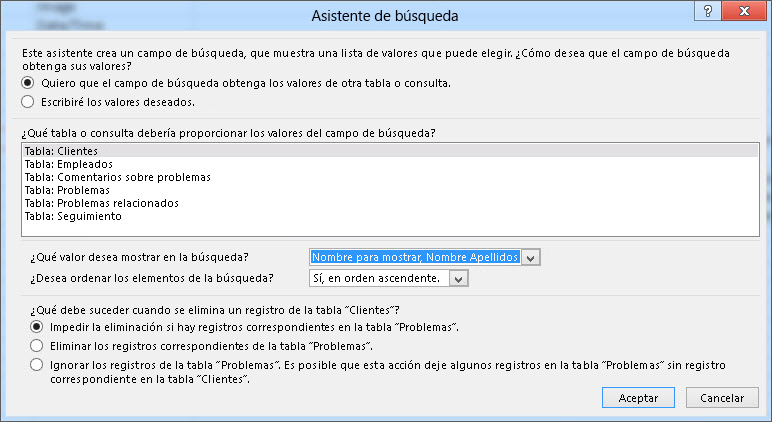
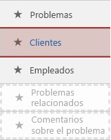
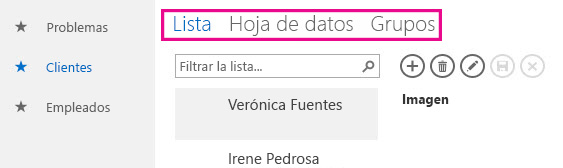
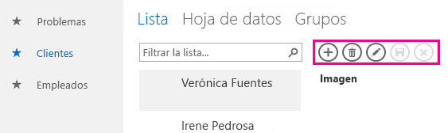
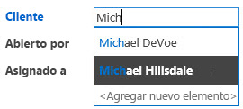
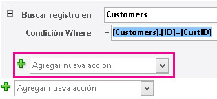
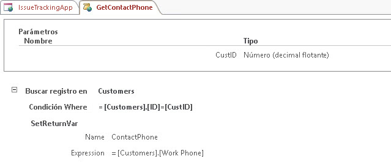
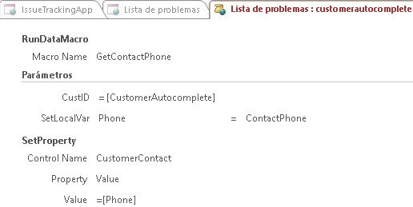
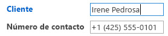

# Crear y personalizar una aplicación web en AccessCreate and customize a web app in Access

> [!IMPORTANT]
> Microsoft ya no recomienda crear ni usar aplicaciones web de Access en SharePoint. Como alternativa, considere la posibilidad de usar [Microsoft PowerApps](https://powerapps.microsoft.com/es-ES/) para crear soluciones empresariales sin código para la Web y dispositivos móviles.Microsoft no longer recommends creating and using Access web apps in SharePoint. As an alternative, consider using [Microsoft PowerApps](https://powerapps.microsoft.com/es-ES/) to build no-code business solutions for the web and mobile devices. 
  
Access 2013 incluye un nuevo modelo de aplicación que permite a los expertos en la materia crear rápidamente aplicaciones web. Con Access se incluye un conjunto de plantillas que puede usar para iniciar la creación de su aplicación.Access 2013 features a new application model that enables subject matter experts to quickly create web-based applications. Included with Access are a set of templates that you can use to jump start creating your application.

## Requisitos previos para la creación de una aplicación con Access 2013Prerequisites for building an app with Access 2013

Para seguir los pasos de este ejemplo, necesita lo siguiente:To follow the steps in this example, you need the following:
  
- AccessAccess
    
- Un entorno de desarrollo de SharePoint.A SharePoint development environment
    
Para obtener más información sobre cómo configurar el entorno de desarrollo de SharePoint, vea [Configurar un entorno de desarrollo general para SharePoint](https://docs.microsoft.com/sharepoint/dev/general-development/set-up-a-general-development-environment-for-sharepoint).For more information about setting up your SharePoint development environment, see [Set up a general development environment for SharePoint](https://docs.microsoft.com/sharepoint/dev/general-development/set-up-a-general-development-environment-for-sharepoint). 
  
Para obtener más información sobre cómo conseguir Access y SharePoint, vea [Descargas](https://msdn.microsoft.com/office/apps/fp123627).For more information about obtaining Access and SharePoint, see [Downloads](https://msdn.microsoft.com/office/apps/fp123627).

## Crear la aplicaciónCreate the app

Supongamos que desea crear una aplicación de Access que hace un seguimiento de los problemas de su empresa. Antes de comenzar a crear las tablas y la vista desde cero, debería buscar una plantilla de esquema que se adapte a sus necesidades.Suppose you want to create an Access app that tracks issues for your business. Before you start creating the tables and view from scratch, you should search for a schema template that meets your needs.
  
### Crear una aplicación de seguimiento de problemasTo create the issue tracking app

1. Abra Access y seleccione **Personalizar aplicación web**.Open Access and choose **Custom web app**.
    
2. Especifique un nombre y una ubicación web de la aplicación. También puede elegir una ubicación de la lista **Ubicaciones** y seleccionar **Crear**.Enter a name and the web location for your app. You can also choose a location from the **Locations** list and choose **Create**.
    
3. Escriba **Problemas** en el cuadro **¿De qué elemento desea realizar un seguimiento?** y presione ENTRAR.Type **Issues** into the **What would you like to track?** box and then press ENTER. 
    
   En la figura 1 se muestra una lista de las plantillas que podría ser de utilidad para el seguimiento de problemas.A list of templates that might be useful for tracking issues is displayed in Figure 1.
    
   **Figura 1. Plantillas que coinciden con la búsqueda de problemas****Figure 1. Templates that match the search for issues**

   
  
4. Elija **Problemas**.Choose **Issues**.
    
Access crea un conjunto de tablas y vistas.Access creates a set of tables and views.
  
## Explorar la aplicaciónExplore the app

Para comprender si el esquema y las vistas se ajustan a sus necesidades, debería examinarlos.To understand whether the schema and views meet your needs, you should examine them.
  
Las tablas que se crean al seleccionar el esquema Problemas se muestran en el panel de icono. Las tablas Problemas, Cliente y Empleados son el enfoque principal de la aplicación. En la tabla Problema se almacena información sobre cada problema. Cada problema lo abre un empleado, y está asignado a él, en nombre de un cliente. Las tablas Problemas relacionados y Comentarios sobre el problema sirven de apoyo para la aplicación. La tabla Problemas relacionados le permite vincular un problema con otro. La tabla Comentarios sobre el problema almacena varios comentarios sobre un solo problema.The tables created by selecting the Issues schema are displayed in the Tile Pane. The Issues, Customer, and Employees tables are the main focus of the app. The Issues table stores information about each issue. Each issue is opened by and assigned to an employee on behalf of a customer. The Related Issues and Issue Comments tables play a supporting role in the app. The Related Issues table enables you to link one issue to another. The Issue Comments table stores multiple comments for a single issue.
  
En una base de datos de escritorio de Access (.accdb), las relaciones entre las tablas se administran en la ventana **Relaciones**. Las aplicaciones de Access 2013 administran las relaciones mediante campos establecidos en el tipo de datos **Búsqueda**. Examinemos las relaciones de la tabla Problemas. Para ello, haga clic con el botón secundario del mouse en el icono **Problemas** y seleccione **Editar tabla**.In an Access desktop (.accdb) database, the relationships between tables are managed in the **Relationships** window. Access 2013 apps manage relationships by using fields set to the **Lookup** data type. Let's examine the relationships for the Issues table by right-clicking the **Issues** tile and selecting **Edit Table**.
  
El campo **Cliente** está relacionado con la tabla **Clientes**. Para examinar la relación, seleccione el campo **Cliente** y luego **Modificar búsquedas**. Aparecerá el **Asistente para búsquedas**, tal como se muestra en la figura 2.The **Customer** field is related to the **Customers** table. To examine the relationship, select the **Customer** field and then select **Modify Lookups**. The **Lookup Wizard** is displayed, as shown in Figure 2. 
  
**Figura 2. Asistente para búsquedas que muestra la relación con la tabla Clientes****Figure 2. Lookup Wizard displaying the relationship to the Customers table**

  
En el cuadro de diálogo Asistente para búsquedas se muestra que el campo **Cliente** está vinculado a la tabla **Clientes** y que se debe devolver el campo **Nombre para mostrar, Nombre Apellidos** de la tabla **Clientes**.The Lookup Wizard dialog box shows that the **Customer** field is linked to the **Customers** table and to return the **Display Name First Last** field from the **Customers** table. 
  
Los campos **Abierto por**, **Asignada a** y **Cambiado por** están relacionados con la tabla **Empleados**. También se han establecido otros campos en el tipo de datos **Búsqueda**. En estos casos, el tipo de datos Búsqueda se usa para especificar valores concretos que se deben permitir en el campo.The **Opened By**, **Assigned To**, and **Changed By** fields are related to the **Employees** table. Several other fields are also set to the **Lookup** data type. In these cases, the Lookup data type is used to specify the specific values to allow for in the field. 
  
Cierre la tabla **Problemas** y examine el panel de icono. Los tres iconos superiores, para las tablas **Problemas**, **Clientes** y **Empleados**, se muestran de manera diferente que en los dos iconos inferiores de las tablas **Problemas relacionados** y **Comentarios sobre el problema**, tal como se muestra en la figura 3.Close the **Issues** table and examine the Tile Pane. The top three tiles, for the **Issues**, **Customers**, and **Employees** tables, are displayed differently than the bottom two tiles for the **Related Issues** and **Issue Comments** table, as shown in Figure 3. 
  
**Figura 3. Panel de icono del esquema Problemas****Figure 3. Tile Pane for the Issues schema**

  
Las tablas **Problemas relacionados** y **Comentarios sobre el problema** están atenuadas porque no deben mostrarse al usuario en el explorador web.The **Related Issues** and **Issue Comments** tables are dimmed because they are to be hidden from the user in the web browser. 
  
Usemos la aplicación para hacer el seguimiento de algunos problemas. Para ello, haga clic en **Iniciar aplicación** para abrir la aplicación en el explorador web.Let's use the app to track some issues. To do this, click **Launch App** to open the app in your web browser. 
  
La aplicación abre la vista **Lista de problemas** de la tabla Problemas. Antes de agregar un problema, se recomienda agregar algunos clientes y empleados. Haga clic en el icono **Clientes** para comenzar a agregar clientes.The app opens the **Issues List** view of the Issues table. Before adding an issue, it would be a good idea to add some customers and employees. Click the **Customers** tile to start adding customers. 
  
Use el Selector de vistas para elegir una de las tres vistas disponibles para la tabla **Clientes**, con las etiquetas **Lista**, **Hoja de datos** y **Grupos**, tal como se muestra en la figura 4.Use the View Selector to choose one of three views available for the **Customers** table, labeled **List**, **Datasheet**, and **Groups** as shown in Figure 4. 
  
**Figura 4. Selector de vistas****Figure 4. View Selector**

  
Si elige **Lista**, se activará la vista **Lista de clientes**, que es una vista de detalles de la lista. La vista de detalles de la lista es una de las vistas que Access genera automáticamente al crear una tabla. La principal característica que diferencia una vista de detalles de la lista es el panel de listas que aparecen en el lado izquierdo de la vista. El panel de vistas se usa para filtrar los registros de la vista y navegar por ellos. En una base de datos de escritorio de Access, la implementación de una vista de lista en la que se permiten búsquedas requeriría la redacción de código personalizado.Choosing **List** activates the **Customers List** view, which is a List Details view. List Details is one of the views Access automatically generates when you create a table. The main feature that distinguishes a List Details view is the list pane that appears on the left side of the view. The list pane is used to filter and navigate the records contained in the view. In an Access desktop database, implementing a searchable list view would require writing custom code. 
  
Si selecciona **Hoja de datos**, se abrirá la vista **Hoja de datos Clientes**. La hoja de datos es otro tipo de vista que Access genera automáticamente al crear una tabla. Las vistas de hoja de datos son de utilidad para los usuarios que consideran más fácil especificar, ordenar y filtrar datos en forma de hoja de cálculo.Choosing **Datasheet** opens the **Customers Datasheet** view. Datasheet is the other kind of view Access automatically generates when you create a table. Datasheet views are useful for those who find it easier to enter, sort, and filter data in a spreadsheet-like manner. 
  
Si selecciona Grupos, se abre una vista de resumen. Las vistas de resumen se pueden usar para agrupar registros según un campo y calcular opcionalmente una suma o un promedio.Choosing Groups opens a Summary view. Summary views can be used to group records based on a field and optionally calculate a sum or average.
  
A medida que agregue clientes, use la barra de acciones para agregar, editar, guardar y eliminar registros, así como para cancelar las modificaciones. La barra de acciones se puede personalizar y aparece en la parte superior de cada vista, tal como se muestra en la figura 5.As you're adding customers, use the Action Bar to add records, edit records, save records, delete records, and cancel edits. The Action Bar is a customizable toolbar that appears at the top of each view, as shown in Figure 5.
  
**Figura 5. Barra de acciones****Figure 5. Action Bar**

  
Cuando haya agregado algunos clientes y empleados, abra la vista Lista de problemas y comience a agregar un problema. A medida que escriba el nombre de un cliente en el cuadro cliente, aparecerán uno o más nombres de cliente, tal como se muestra en la figura 6.Once you've added some customers and employees open the Issues List view and start adding an issue. As you type the name of a customer into the into the Customer box, one or more of the customer names will appear, as shown in Figure 6.
  
**Figura 6. Control Autocompletar****Figure 6. AutoComplete control**

  
El cuadro Cliente es un control de tipo autocompletar, que muestra una lista de registros que coinciden con lo que esté escribiendo en el cuadro. Esto ayuda a garantizar la precisión de la entrada de datos.The Customer box is an AutoComplete control. The AutoComplete control displays a list of records that match what you're typing into the box. This helps ensure the accuracy of data entry.
  
## Personalizar la aplicaciónCustomize the app

Tras dar un paseo por la aplicación, observará que la vista Lista de problemas no contiene información de contacto para el cliente. Personalicemos la aplicación para agregar el número de teléfono de trabajo del cliente a la tabla Problemas al crear el problema.Now that you've taken a tour of the app, you notice that the Issues List view doesn't contain contact information for the customer. Let's customize the app to add the customer's work phone to the Issues table as the issue is being created.
  
### Agregar un campo a la tabla ProblemasTo add a field to the Issues table

1. Abra la aplicación en Access.Open the app in Access.
    
2. Seleccione el icono **Problemas**, el icono **Configuración/Acción** y luego **Editar tabla**.Choose the **Issues** tile, choose the **Settings/Action** icon, and then choose **Edit Table**.
    
3. Especifique el **Número de contacto** en la primera celda vacía de la columna **Nombre del campo**.Enter **Contact Number** in the first blank cell in the **Field Name** column. 
    
4. Seleccione **Texto corto** en la columna **Tipo de datos**.Choose **Short Text** in the **Data Type** column. 
    
5. Seleccione **Guardar**.Choose **Save**.
    
6. Cierre la tabla Problemas.Close the Issues table.
    
Ahora que disponemos de un campo en el que almacenar el número de teléfono, creemos una macro de datos para buscar la información de contacto.Now that we have field in which to store the phone number, let's create a data macro to look up the contact information.
  
### Crear la macro de datos que permite buscar información de contactoTo create the data macro to look up contact information

1. En el grupo **Crear**, seleccione **Opciones avanzadas** y elija **Macro de datos**.In the **Create** group, choose **Advanced**, and then choose **Data Macro**.
    
2. Seleccione **Crear parámetro**.Choose **Create Parameter**.
    
3. En el cuadro **Nombre**, especifique **CustID**. En la lista desplegable **Tipo**, seleccione **Número (decimal flotante).**In the **Name** box, enter **CustID**. In the **Type** dropdown, choose **Number (Floating Decimal).**
    
4. En la lista desplegable **Agregar nueva acción**, seleccione **LookupRecord**.From the **Add New Action** dropdown, choose **LookupRecord**. 
    
5. En la lista desplegable **Buscar un registro en**, seleccione **Clientes**.In the **Look Up A Record In** dropdown, choose **Customers**. 
    
6. En el cuadro **Condición WHERE**, especifique **[Clientes].[ID]=[CustID]**.In the **Where Condition** box, enter **[Customers].[ID]=[CustID]**. 
    
7. Seleccione **SetReturnVar** de la lista desplegable **Agregar nueva acción**.Choose **SetReturnVar** from the **Add New Action** dropdown. 
    
    > [!NOTE]
    > Verá dos listas desplegables **Agregar nueva acción**, una en el bloque **LookupRecord** y otra fuera del bloque **LookupRecord**. Debería elegir la lista desplegable **Agregar nueva acción** dentro del bloque **LookupRecord**, tal como se muestra en la figura 7.You'll see two **Add New Action** dropdowns, one within the **LookupRecord** block, and another outside the **LookupRecord** block. You should choose the **Add New Action** dropdown within the **LookupRecord** block, as shown in Figure 7. 
  
   **Figura 7. Lista desplegable Agregar nueva acción****Figure 7. Add New Action dropdown**

   
  
8. En el cuadro **Nombre**, escriba **ContactPhone**.In the **Name** box, enter **ContactPhone**. 
    
9. En el cuadro **Expresión**, escriba **[Clientes].[Teléfono de trabajo]**.In the **Expression** box, enter **[Customers].[Work Phone]**. 
    
10. Seleccione **Guardar**. Escriba **GetContactPhone** en el cuadro **Nombre de macro** y haga clic en **Aceptar**.Choose **Save**. Enter **GetContactPhone** in the **Macro Name** box and then choose **OK**.
    
    La macro debería tener el aspecto de la macro que se muestra en la figura 8.The macro should resemble the macro shown in Figure 8.
    
    **Figura 8. Macro de datos GetContactPhone****Figure 8. GetContactPhone data macro**

    
  
11. Cierre la macro Vista Diseño.Close macro Design View.
    
Ahora estamos listos para agregar el campo **Número de contacto** al formulario Lista de problemas.Now we're ready to add the **Contact Number** field to the Issues List form. 
  
### Agregar el campo Número de contacto al formulario Lista de problemasTo add the Contact Number field to the Issues List form

1. Seleccione la tabla **Problemas** para elegir el formulario Lista de problemas.Choose the **Issues** table. This chooses the Issues list form. 
    
2. En el Selector de vistas, seleccione **Lista**, el icono **Configuración/Acción** y luego **Editar**.In the View selector, choose **List**, choose the **Settings/Action** icon, and then choose **Edit**.
    
3. Arrastre el campo **Número de contacto** del panel **Lista de campos** a la ubicación del formulario en la que desee mostrar el número de contacto.Drag the **Contact Number** field form the **Field List** pane to the location on the form where you want the contact number to be displayed. 
    
4. Seleccione el cuadro de texto **Número de contacto** y haga clic en **Datos**.Choose the **Contact Number** text box, and then click **Data**. 
    
5. En el cuadro **Nombre del control**, escriba **CustomerContact** y cierre la ventana emergente **Datos**.In the **Control Name** box, enter **CustomerContact** and then close the **Data** popup. 
    
6. Seleccione **Guardar**.Choose **Save**.
    
Ahora debemos escribir una macro de interfaz de usuario (UI) que copia el campo **Teléfono de trabajo** de la tabla **Clientes** al campo **Número de contacto** de la tabla **Problemas**. El evento **Después de actualizar** del control **CustomerAutocomplete** es una buena ubicación para la macro.Now we should write a user interface (UI) macro that copies the **Work Phone** field from the **Customers** table into the **Contact Phone** field of the **Issues** table. The **After Update** event of the **CustomerAutocomplete** control is a good location for the macro. 
  
### Crear la macro Después de actualizarTo create the AfterUpdate macro

1. Seleccione el control **CustomerAutocomplete**, el botón **Acciones** y luego **Después de actualizar**.Choose the **CustomerAutocomplete** control, choose the **Actions** button, and then choose **After Update**. 
    
    Se abre una macro vacía en la macro Vista Diseño.A blank macro is opened in macro Design View.
    
2. En la lista desplegable **Agregar nueva acción**, seleccione **RunDataMacro**.From the **Add New Action** dropdown, choose **RunDataMacro**. 
    
3. En la lista desplegable **Nombre de macro**, seleccione **GetContactPhone**.In the **Macro Name** dropdown, choose **GetContactPhone**. 
    
4. En el cuadro **CustID**, escriba **[CustomerAutocomplete]**.In the **CustID** box, enter **[CustomerAutocomplete]**. 
    
5. En el cuadro **SetLocalVar**, escriba **Teléfono**.In the **SetLocalVar** box, enter **Phone**. 
    
    Cuando elija la macro de datos GetContactPhone creada anteriormente, Access completó automáticamente el nombre del parámetro y la variable devuelta de la macro.When you chose the GetContactPhone data macro that was created earlier, Access automatically filled in the parameter name and return variable for the macro.
    
    El número de teléfono del cliente se almacena en la variable denominada Phone.The phone number for the customer is stored in a variable named Phone.
    
6. En la lista desplegable **Agregar nueva acción**, seleccione **SetProperty**.From the **Add New Action** dropdown, choose **SetProperty**. 
    
7. En el cuadro **Nombre del control**, escriba **CustomerContact**.In the **Control Name** box, enter **CustomerContact**. 
    
8. En la lista desplegable **Propiedad**, seleccione **Valor**.In the **Property** dropdown, choose **Value**. 
    
9. En el cuadro **Valor**, escriba **=[Teléfono]**.In the **Value** box, enter **=[Phone]**. 
    
10. Seleccione **Guardar**.Choose **Save**.
    
    La macro debería tener el aspecto de la macro que se muestra en la figura 9.The macro should resemble the macro shown in Figure 9.
    
    **Figura 9. Macro Después de actualizar****Figure 9. After Update macro**

    
  
11. Cierre la macro Vista Diseño.Close macro Design View.
    
12. Cierre la vista Lista de problemas. Seleccione **Sí** cuando se le solicite guardar los cambios.Close the Issues List view. Choose **Yes** when you are prompted to save your changes. 
    
Ahora tiene todo preparado para escribir la personalización.Now we're ready to text the customization. Haga clic en **Iniciar aplicación** para abrir la aplicación en el explorador web y después agregue un nuevo problema.Click **Launch App** to open the app in your web browser and then add a new issue. El cuadro **Número de contacto** se actualizará automáticamente después de que escriba el nombre del cliente, tal como se muestra en la figura 10.The **Contact Number** box updates automatically after the customer name is entered,  as shown in Figure 10. 
  
**Figura 10. Vista Problemas actualizada con el número de teléfono****Figure 10. Issues view updated with phone number**

  
## ConclusiónConclusion

El uso de una de las plantillas de esquema incluidas con es una buena manera de iniciar la creación de una aplicación web de Access. Las vistas que se crean automáticamente incluyen funciones avanzadas que requieren código personalizado que se debe implementar en una base de datos de escritorio de Access.Using one of the schema templates included with is a good way to jump start the creation of an Access web app. The views that are automatically created for you contain advanced functionally that requires custom code to implement in a Access desktop database. 
  
## Vea tambiénSee also

- [Novedades para desarrolladores de Access 2013What's new for Access 2013 developers](https://msdn.microsoft.com/library/df778f51-d65e-4c30-b618-65003ceb39b3%28Office.15%29.aspx) 
- [Referencia de la aplicación de acceso web personalizadosAccess custom web app reference](access-custom-web-app-reference.md)
  

