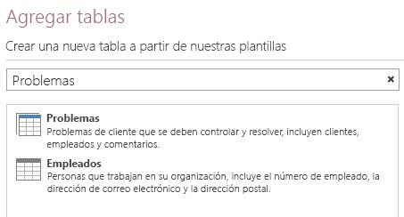
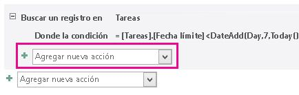
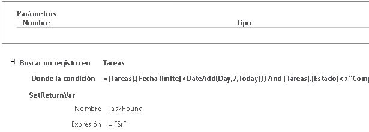
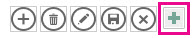
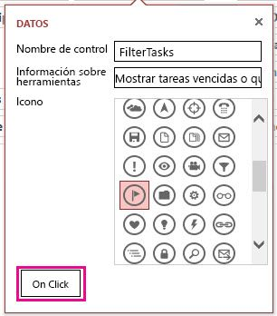
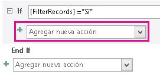
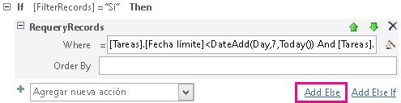
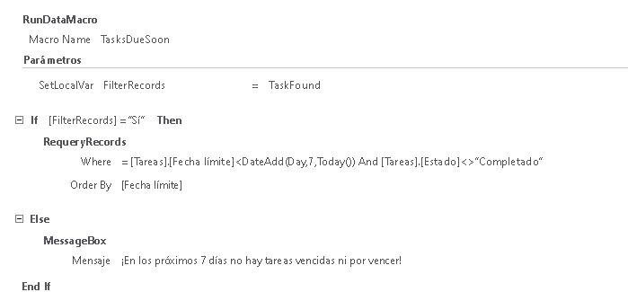

# <a name="filter-a-view-by-using-a-macro-in-an-access-app"></a><span data-ttu-id="32d77-103">Cómo filtrar una vista con una macro en una aplicación de Access</span><span class="sxs-lookup"><span data-stu-id="32d77-103">Filter a view by using a macro in an Access app</span></span>

<span data-ttu-id="32d77-104">Obtenga información sobre cómo filtrar una vista en una aplicación de Access con la acción de macro RequeryRecords y una macro de datos.</span><span class="sxs-lookup"><span data-stu-id="32d77-104">Learn how to filter a view in an Access app by using the RequeryRecords macro action and a data macro.</span></span>
  
> [!IMPORTANT]
> <span data-ttu-id="32d77-p101">Microsoft ya no recomienda crear ni usar aplicaciones web de Access en SharePoint. Como alternativa, considere la posibilidad de usar [Microsoft PowerApps](https://powerapps.microsoft.com/es-ES/) para crear soluciones empresariales sin código para la Web y dispositivos móviles.</span><span class="sxs-lookup"><span data-stu-id="32d77-p101">Microsoft no longer recommends creating and using Access web apps in SharePoint. As an alternative, consider using [Microsoft PowerApps](https://powerapps.microsoft.com/es-ES/) to build no-code business solutions for the web and mobile devices.</span></span> 

<span data-ttu-id="32d77-p102">La vista de lista predeterminada de una aplicación de Access permite filtrar los problemas de los valores que se encuentran en los campos. Puede haber ocasiones en que quiera filtrar una vista según un conjunto de condiciones, en lugar de que coincida con un valor. Para ello, debe crear una macro. En este artículo se muestra cómo crear una macro que filtre una vista para mostrar las tareas que están más allá de vencimiento o que vencerán en los próximos 7 días.</span><span class="sxs-lookup"><span data-stu-id="32d77-p102">The default list view in an Access app enables you to filter the issues on values that are contained in the fields. There may be instances where you'd like to filter a view based on a set of conditions instead of by matching a value. To do that you must create a macro. This article shows you how to create a macro that filter a view to display tasks that are past due or due in the next 7 days.</span></span>
  
## <a name="prerequisites-for-building-an-app-with-access"></a><span data-ttu-id="32d77-111">Requisitos previos para compilar una aplicación con Access</span><span class="sxs-lookup"><span data-stu-id="32d77-111">Prerequisites for building an app with Access</span></span>
<span data-ttu-id="32d77-112"><a name="Access2013FilterViewByUsingMacro_Prerequisites"> </a></span><span class="sxs-lookup"><span data-stu-id="32d77-112"></span></span>

<span data-ttu-id="32d77-113">Para seguir los pasos de este ejemplo, necesita:</span><span class="sxs-lookup"><span data-stu-id="32d77-113">To follow the steps in this example, you need:</span></span>
  
- <span data-ttu-id="32d77-114">Access 2013</span><span class="sxs-lookup"><span data-stu-id="32d77-114">Access 2013</span></span>
- <span data-ttu-id="32d77-115">Un entorno de desarrollo de SharePoint 2013.</span><span class="sxs-lookup"><span data-stu-id="32d77-115">A SharePoint 2013 development environment</span></span>
    
> [!NOTE]
> <span data-ttu-id="32d77-p103">Para obtener más información sobre cómo configurar el entorno de desarrollo de SharePoint, consulte [Configurar un entorno de desarrollo general para SharePoint 2013](https://msdn.microsoft.com/library/08e4e4e1-d960-43fa-85df-f3c279ed6927%28Office.15%29.aspx). Para obtener más información sobre cómo conseguir Access 2013 y SharePoint 2013, consulte [Descargas](https://msdn.microsoft.com/office/apps/fp123627).</span><span class="sxs-lookup"><span data-stu-id="32d77-p103">For more information about setting up your SharePoint development environment, see [Set up a general development environment for SharePoint 2013](https://msdn.microsoft.com/library/08e4e4e1-d960-43fa-85df-f3c279ed6927%28Office.15%29.aspx). For more information about obtaining Access 2013 and SharePoint 2013, see [Downloads](https://msdn.microsoft.com/office/apps/fp123627).</span></span> 
  
## <a name="create-the-app"></a><span data-ttu-id="32d77-118">Crear la aplicación</span><span class="sxs-lookup"><span data-stu-id="32d77-118">Create the app</span></span>
<span data-ttu-id="32d77-119"><a name="Access2013FilterViewByUsingMacro_CreateApp"> </a></span><span class="sxs-lookup"><span data-stu-id="32d77-119"></span></span>

<span data-ttu-id="32d77-p104">Suponga que quiere crear una aplicación de Access que siga las tareas de la empresa. Antes de empezar a crear las tablas y las vistas, debe buscar una plantilla de esquema.</span><span class="sxs-lookup"><span data-stu-id="32d77-p104">Suppose you want to create an Access app that tracks tasks for your business. Before you start creating the tables and view, you should search for a schema template.</span></span>
  
### <a name="to-create-the-task-tracking-app"></a><span data-ttu-id="32d77-122">Crear la aplicación de seguimiento de tareas</span><span class="sxs-lookup"><span data-stu-id="32d77-122">To create the task tracking app</span></span>

1. <span data-ttu-id="32d77-123">Abra Access y elija **Personalizar aplicación web**.</span><span class="sxs-lookup"><span data-stu-id="32d77-123">Open Access and choose **Custom web app**.</span></span>
    
2. <span data-ttu-id="32d77-p105">Especifique un nombre y una ubicación web de la aplicación. También puede elegir una ubicación de la lista **Ubicaciones** y seleccionar **Crear**.</span><span class="sxs-lookup"><span data-stu-id="32d77-p105">Enter a name and the web location for your app. You can also choose a location from the **Locations** list and choose **Create**.</span></span>
    
3. <span data-ttu-id="32d77-126">Escriba **tareas** en el cuadro **Búsqueda** y presione ENTRAR.</span><span class="sxs-lookup"><span data-stu-id="32d77-126">Type **tasks** into the **Search** box and then press ENTER.</span></span> 
    
    <span data-ttu-id="32d77-127">En la figura 1 se muestra una lista de las plantillas que podría útiles para el seguimiento de tareas.</span><span class="sxs-lookup"><span data-stu-id="32d77-127">A list of templates that might be useful for tracking tasks is displayed in Figure 1.</span></span>
    
   <span data-ttu-id="32d77-128">**Figura 1. Plantillas que coinciden con la búsqueda de tareas**</span><span class="sxs-lookup"><span data-stu-id="32d77-128">**Figure 1. Templates that match the search for tasks**</span></span>

   <span data-ttu-id="32d77-129"></span><span class="sxs-lookup"><span data-stu-id="32d77-129"></span></span>
  
4. <span data-ttu-id="32d77-130">Seleccione **Tareas**.</span><span class="sxs-lookup"><span data-stu-id="32d77-130">Choose **Tasks**.</span></span>
    
<span data-ttu-id="32d77-131">Access crea un conjunto de tablas y vistas.</span><span class="sxs-lookup"><span data-stu-id="32d77-131">Access creates a set of tables and views.</span></span>
  
<span data-ttu-id="32d77-p106">Introduzca varias tareas y empleados de ejemplo en la aplicación. Para ello, elija **Iniciar aplicación** para abrir la aplicación en el explorador web. Escriba un valor en el campo **Fecha de vencimiento** para cada tarea. Vuelva a Access cuando haya terminado.</span><span class="sxs-lookup"><span data-stu-id="32d77-p106">Enter several sample tasks and employees in your app. To do this, choose **Launch App** to open the app in your web browser. Enter a value in the **Due Date** field for each task. Return to Access when you're done.</span></span> 
  
## <a name="plan-the-customizations"></a><span data-ttu-id="32d77-136">Planear las personalizaciones</span><span class="sxs-lookup"><span data-stu-id="32d77-136">Plan the customizations</span></span>
<span data-ttu-id="32d77-137"><a name="Access2013FilterViewByUsingMacro_PlanCustomizations"> </a></span><span class="sxs-lookup"><span data-stu-id="32d77-137"></span></span>

<span data-ttu-id="32d77-p107">Ahora tiene una aplicación que contiene varias tareas. La vista predeterminada permite buscar las tareas con elementos que se almacenan en los campos mostrados en la vista. Por ejemplo, puede buscar para problemas de alta prioridad o en curso. Suponga que quiere dar prioridad al trabajo mostrando problemas activos que vencen la semana siguiente. Para ello, debe crear una macro de interfaz de usuario (IU).</span><span class="sxs-lookup"><span data-stu-id="32d77-p107">You now have an app that contains several tasks. The default view enables you to search for any tasks using items that are stored in the fields displayed in the view. For example, you can search for high-priority issues or issues in progress. Suppose you want to prioritize your work by displaying active issues that are due in the coming week. To do this, you should create a user interface (UI) macro.</span></span>
  
<span data-ttu-id="32d77-p108">El comando de macro de interfaz de usuario que puede usar para filtrar la vista es [Acción de Macro RequeryRecords (acceso personalizado web app)](requeryrecords-macro-action-access-custom-web-app.md). La acción de macro **RequeryRecords** filtra la vista según el argumento  *Where*  , que se proporciona en forma de una cláusula WHERE de SQL. Para filtrar la vista, debe proporcionar varios datos en un formato específico para filtrar la vista.</span><span class="sxs-lookup"><span data-stu-id="32d77-p108">The UI macro command that you can use to filter the view is the [RequeryRecords Macro Action (Access custom web app)](requeryrecords-macro-action-access-custom-web-app.md). The **RequeryRecords** macro action filters the view based on the  *Where*  argument, which is provided in the form of a SQL WHERE clause. To filter the view, you must supply several facts in a specific format to filter the view.</span></span> 
  
<span data-ttu-id="32d77-146">Los hechos importantes son:</span><span class="sxs-lookup"><span data-stu-id="32d77-146">The relevant facts are:</span></span>
  
- <span data-ttu-id="32d77-147">El campo o campos para comparar</span><span class="sxs-lookup"><span data-stu-id="32d77-147">The field or fields to compare</span></span>
    
- <span data-ttu-id="32d77-148">Cómo hacer referencia a la fecha de hoy</span><span class="sxs-lookup"><span data-stu-id="32d77-148">How to refer to today's date</span></span>
    
- <span data-ttu-id="32d77-149">Cómo hacer referencia a un día concreto en relación con la fecha de hoy</span><span class="sxs-lookup"><span data-stu-id="32d77-149">How to refer to a particular day relative to today's date</span></span>
    
- <span data-ttu-id="32d77-150">Cómo determinar las tareas que están en curso</span><span class="sxs-lookup"><span data-stu-id="32d77-150">How to determine which on tasks are in progress</span></span>
    
<span data-ttu-id="32d77-151">El campo **Fecha de vencimiento** proporciona información sobre el momento en que vence una tarea.</span><span class="sxs-lookup"><span data-stu-id="32d77-151">The **Due Date** field provides information about when a task is due.</span></span> <span data-ttu-id="32d77-152">El campo **Estado** proporciona información de estado de cada tarea.</span><span class="sxs-lookup"><span data-stu-id="32d77-152">The **Status** field provides status information about each task.</span></span> <span data-ttu-id="32d77-153">Para hacer referencia a un campo de una macro, use el formato **[*TableName*].[*FieldName*]**.</span><span class="sxs-lookup"><span data-stu-id="32d77-153">To refer to a field in a macro, use the format **[*TableName*].[*FieldName*]**.</span></span> <span data-ttu-id="32d77-154">Use **[Tareas].[Fecha de vencimiento]** para hacer referencia al campo **Fecha de vencimiento** y **[Tareas].[Estado]** para hacer referencia al campo **Estado**.</span><span class="sxs-lookup"><span data-stu-id="32d77-154">Use **[Tasks].[Due Date]** to refer to the **Due Date** field and **[Tasks].[Status]** to refer to the **Status** field.</span></span> 
  
<span data-ttu-id="32d77-p110">La función [Función hoy (acceso personalizado web app)](today-function-access-custom-web-app.md) devuelve la fecha de hoy. La función [Función DateAdd (aplicación web personalizada de Access)](dateadd-function-access-custom-web-app.md) se puede usar para calcular una fecha que es un número determinado de días después de una fecha especificada.</span><span class="sxs-lookup"><span data-stu-id="32d77-p110">The [Today Function (Access custom web app)](today-function-access-custom-web-app.md) function returns today's date. The [DateAdd Function (Access custom web app)](dateadd-function-access-custom-web-app.md) function can be used to calculate a date that's a certain number of days after a specified date.</span></span> 
  
<span data-ttu-id="32d77-p111">El campo **Estado** contiene varios valores posibles. Un valor **Completado** indica que la tarea ya no está activa.</span><span class="sxs-lookup"><span data-stu-id="32d77-p111">The **Status** field contains several possible values. A value of **Completed** indicates that the task is no longer active.</span></span> 
  
<span data-ttu-id="32d77-159">Estos datos se pueden combinar en la siguiente cláusula WHERE de SQL.</span><span class="sxs-lookup"><span data-stu-id="32d77-159">These facts can be combined into the following SQL WHERE clause.</span></span>
  
```sql
[Tasks].[Due Date]<DateAdd(Day,7,Today()) AND [Tasks].[Status]<>"Completed"
```

<span data-ttu-id="32d77-160">Esta cláusula WHERE de SQL se usa en la macro para filtrar la vista para mostrar los problemas activos que vencen en los próximos 7 días o que han vencido.</span><span class="sxs-lookup"><span data-stu-id="32d77-160">This SQL WHERE clause is used in the macro to filter the view to display active issues that are due in the next 7 days or are past due.</span></span>
  
<span data-ttu-id="32d77-p112">Para ejecutar la macro de interfaz de usuario, se debe adjuntar a un elemento o a un evento que ocurra en la vista. La **Barra de acciones** es un lugar cómodo para agregar un comando personalizado a la vista. La **Barra de acciones** es una barra de herramientas que se puede personalizar que aparece en la parte superior de cada vista. De forma predeterminada, la **Barra de acciones** contiene botones para agregar, editar, guardar, eliminar y cancelar las modificaciones. Puede agregar botones que realicen acciones personalizadas, como el filtrado de la vista.</span><span class="sxs-lookup"><span data-stu-id="32d77-p112">To run the UI macro, it must be attached to an item or an event that occurs in the view. The **Action Bar** is a convenient place to add a custom command to the view. The **Action Bar** is a customizable toolbar that appears at the top of each view. By default, the **Action Bar** contains buttons to add, edit, save, delete, and cancel edits. You can add buttons that perform custom actions, such as filtering the view.</span></span> 
  
<span data-ttu-id="32d77-p113">Si la vista contiene registros que cumplen con los criterios especificados, **RequeryRecords** filtra la vista. Sin embargo, si la vista no contiene ningún registro que cumpla con los criterios, se mostrará un nuevo registro vacío. Si no quiere que se muestre un registro vacío si no hay tareas que venzan en la próxima semana, debe buscar un método para comprobar las tareas antes de llamar a la acción de macro **RequeryRecords**. Para ello, cree una macro de datos para buscar registros que cumplan con los criterios.</span><span class="sxs-lookup"><span data-stu-id="32d77-p113">If the view contains records that meet the specified criteria, then **RequeryRecords** filters the view. However, if the view doesn't contain any records that meet the criteria, than a new, blank record is displayed. If you don't want a blank record to be displayed if no tasks are due in the next week, then you must find a method to check the tasks before you call the **RequeryRecords** macro action. To do this, create a data macro to check for records that meet the criteria.</span></span> 
  
<span data-ttu-id="32d77-p114">La macro de interfaz de usuario llamará a la macro de datos, que intentará buscar una tarea que venza la semana siguiente. Si la macro de datos encuentra la tarea, personaliza la aplicación.</span><span class="sxs-lookup"><span data-stu-id="32d77-p114">The UI macro will call the data macro, which will try to find a task that's due in the next week. If the data macro finds the task then customize the app.</span></span>
  
## <a name="customize-the-app"></a><span data-ttu-id="32d77-172">Personalizar la aplicación</span><span class="sxs-lookup"><span data-stu-id="32d77-172">Customize the app</span></span>
<span data-ttu-id="32d77-173"><a name="Access2013FilterViewByUsingMacro_CustomizeApp"> </a></span><span class="sxs-lookup"><span data-stu-id="32d77-173"></span></span>

<span data-ttu-id="32d77-p115">Ahora que ha determinado las personalizaciones, impleméntelas. En primer lugar se debe crear la macro de datos. Algunas macros de datos se adjuntan directamente a tablas. Sin embargo, esta macro de datos es una macro de datos independiente.</span><span class="sxs-lookup"><span data-stu-id="32d77-p115">Now that you've determined the customizations, implement them. The data macro should be created first. Some data macros are attached directly to tables. However, this data macro is a stand-alone data macro.</span></span>
  
### <a name="to-create-the-data-macro"></a><span data-ttu-id="32d77-178">Crear la macro de datos</span><span class="sxs-lookup"><span data-stu-id="32d77-178">To create the data macro</span></span>

1. <span data-ttu-id="32d77-179">Abra la aplicación en Access.</span><span class="sxs-lookup"><span data-stu-id="32d77-179">Open the app in Access.</span></span>
    
2. <span data-ttu-id="32d77-180">En el grupo **Crear**, seleccione **Opciones avanzadas** y elija **Macro de datos**.</span><span class="sxs-lookup"><span data-stu-id="32d77-180">In the **Create** group, choose **Advanced**, and then choose **Data Macro**.</span></span>
    
    <span data-ttu-id="32d77-181">Se abre una macro de datos vacía en la macro Vista Diseño.</span><span class="sxs-lookup"><span data-stu-id="32d77-181">A blank data macro is opened in macro Design View.</span></span>
    
3. <span data-ttu-id="32d77-182">En el cuadro de lista **Agregar nueva acción**, seleccione **LookupRecord**.</span><span class="sxs-lookup"><span data-stu-id="32d77-182">From the **Add New Action** list box, choose **LookupRecord**.</span></span>
    
4. <span data-ttu-id="32d77-183">En el cuadro de lista **Buscar un registro en**, seleccione **Tareas**.</span><span class="sxs-lookup"><span data-stu-id="32d77-183">In the **Look Up A Record In** list box, choose **Tasks**.</span></span>
    
5. <span data-ttu-id="32d77-184">En el cuadro **Condición Where**, escriba **[Tasks].[Due Date]\<DateAdd(Day,7,Today()) AND [Tasks].[Status]\<\>"Completed"**.</span><span class="sxs-lookup"><span data-stu-id="32d77-184">In the **Where Condition** box, enter **[Tasks].[Due Date]\<DateAdd(Day,7,Today()) AND [Tasks].[Status]\<\>"Completed"**.</span></span> 
    
6. <span data-ttu-id="32d77-185">Seleccione **SetReturnVar** en el cuadro de lista **Agregar nueva acción**.</span><span class="sxs-lookup"><span data-stu-id="32d77-185">Choose **SetReturnVar** from the **Add New Action** list box.</span></span> 
    
    > [!NOTE]
    > <span data-ttu-id="32d77-p116">Verá dos cuadros de lista **Agregar nueva acción**, un dentro del bloque **LookupRecord** y otro fuera del bloque **LookupRecord**. Debe elegir el cuadro de lista **Agregar nueva acción** del bloque **LookupRecord**, como se muestra en la figura 1.</span><span class="sxs-lookup"><span data-stu-id="32d77-p116">You'll see two **Add New Action** list boxes, one within the **LookupRecord** block, and another outside the **LookupRecord** block. You should choose the **Add New Action** list box within the **LookupRecord** block, as shown in Figure 1.</span></span> 
  
   <span data-ttu-id="32d77-188">**Figura 1. Cuadro de lista Agregar nueva acción**</span><span class="sxs-lookup"><span data-stu-id="32d77-188">**Figure 1. Add New Action list box**</span></span>

   <span data-ttu-id="32d77-189"></span><span class="sxs-lookup"><span data-stu-id="32d77-189"></span></span>
  
7. <span data-ttu-id="32d77-190">En el cuadro **Nombre**, escriba **TaskFound**.</span><span class="sxs-lookup"><span data-stu-id="32d77-190">In the **Name** box, enter **TaskFound**.</span></span> 
    
8. <span data-ttu-id="32d77-191">En el cuadro **Expresión**, escriba **"Yes"**.</span><span class="sxs-lookup"><span data-stu-id="32d77-191">In the **Expression** box, enter **"Yes"**.</span></span> 
    
9. <span data-ttu-id="32d77-p117">Seleccione **Guardar**. Escriba **TasksDueSoon** en el cuadro **Nombre de macro** y seleccione **Aceptar**.</span><span class="sxs-lookup"><span data-stu-id="32d77-p117">Choose **Save**. Enter **TasksDueSoon** in the **Macro Name** box and then choose **OK**.</span></span>
    
    <span data-ttu-id="32d77-194">La macro debería tener el aspecto de la macro que se muestra en la figura 2.</span><span class="sxs-lookup"><span data-stu-id="32d77-194">The macro should resemble the macro shown in Figure 2.</span></span>
    
   <span data-ttu-id="32d77-195">**Figura 2. Macro de datos TasksDueSoon**</span><span class="sxs-lookup"><span data-stu-id="32d77-195">**Figure 2. TasksDueSoon data macro**</span></span>

   <span data-ttu-id="32d77-196"></span><span class="sxs-lookup"><span data-stu-id="32d77-196"></span></span>
  
10. <span data-ttu-id="32d77-197">Cierre la macro Vista Diseño.</span><span class="sxs-lookup"><span data-stu-id="32d77-197">Close macro Design View.</span></span>
    
<span data-ttu-id="32d77-198">Ahora, estamos listos para agregar un botón personalizado a la barra de acciones.</span><span class="sxs-lookup"><span data-stu-id="32d77-198">Now, we're ready to add a custom button to the Action Bar.</span></span>
  
### <a name="to-add-a-custom-button-to-the-action-bar"></a><span data-ttu-id="32d77-199">Agregar un botón personalizado a la barra de acciones</span><span class="sxs-lookup"><span data-stu-id="32d77-199">To add a custom button to the Action Bar</span></span>

1. <span data-ttu-id="32d77-p118">Elija la tabla **Tareas**. Esto selecciona el formulario Lista de tareas.</span><span class="sxs-lookup"><span data-stu-id="32d77-p118">Choose the **Tasks** table. This chooses the Tasks List form.</span></span> 
    
2. <span data-ttu-id="32d77-202">En el Selector de vistas, seleccione **Lista**, el icono **Configuración/Acción** y luego **Editar**.</span><span class="sxs-lookup"><span data-stu-id="32d77-202">In the View selector, choose **List**, choose the **Settings/Action** icon, and then choose **Edit**.</span></span>
    
    <span data-ttu-id="32d77-203">La vista se abre en la vista Diseño.</span><span class="sxs-lookup"><span data-stu-id="32d77-203">The view is opened in Design View.</span></span>
    
3. <span data-ttu-id="32d77-p119">Ahora, estamos listos para agregar un botón personalizado a la barra de acciones. Para ello, seleccione **Agregar acción personalizada**, como se muestra en la figura 3.</span><span class="sxs-lookup"><span data-stu-id="32d77-p119">Now, we're ready to add a custom button to the Action Bar. To do this, choose **Add custom action** as shown in Figure 3.</span></span> 
    
   <span data-ttu-id="32d77-206">**Figura 3. Botón Agregar acción personalizada**</span><span class="sxs-lookup"><span data-stu-id="32d77-206">**Figure 3. Add custom action button**</span></span>

   <span data-ttu-id="32d77-207"></span><span class="sxs-lookup"><span data-stu-id="32d77-207"></span></span>
  
    <span data-ttu-id="32d77-208">La nueva acción se muestra como un botón con un icono de estrella, como se muestra en la figura 4.</span><span class="sxs-lookup"><span data-stu-id="32d77-208">The new action is displayed as a button with a star icon as shown in Figure 4.</span></span>
    
   <span data-ttu-id="32d77-209">**Figura 4. Botón Nueva barra de acciones**</span><span class="sxs-lookup"><span data-stu-id="32d77-209">**Figure 4. New Action Bar button**</span></span>

   <span data-ttu-id="32d77-210"></span><span class="sxs-lookup"><span data-stu-id="32d77-210"></span></span>
  
4. <span data-ttu-id="32d77-211">Seleccione el botón Barra de acciones personalizado y luego elija el icono **Datos**.</span><span class="sxs-lookup"><span data-stu-id="32d77-211">Choose the custom Action Bar Button, and then choose the **Data** icon.</span></span> 
    
    <span data-ttu-id="32d77-212">aparece el cuadro de diálogo **Datos**.</span><span class="sxs-lookup"><span data-stu-id="32d77-212">The **Data** dialog box appears.</span></span> 
    
5. <span data-ttu-id="32d77-213">En el cuadro **Nombre del control**, escriba **FilterTasks**.</span><span class="sxs-lookup"><span data-stu-id="32d77-213">In the **Control Name** box, enter **FilterTasks**.</span></span> 
    
6. <span data-ttu-id="32d77-214">En la **Información sobre herramientas**, escriba **Mostrar las tareas más allá de la fecha de vencimiento o que vencen la semana siguiente**.</span><span class="sxs-lookup"><span data-stu-id="32d77-214">In the **Tooltip** box, enter **Display tasks past due or due in the next week**.</span></span> 
    
<span data-ttu-id="32d77-215">Ahora podemos crear la macro de interfaz de usuario que filtrará la vista.</span><span class="sxs-lookup"><span data-stu-id="32d77-215">Now, we're ready to create the UI macro that will filter the view.</span></span>
  
### <a name="to-create-the-ui-macro-to-filter-the-view"></a><span data-ttu-id="32d77-216">Crear la macro de interfaz de usuario para filtrar la vista</span><span class="sxs-lookup"><span data-stu-id="32d77-216">To create the UI macro to filter the view</span></span>

1. <span data-ttu-id="32d77-217">En el cuadro de diálogo **Datos**, elija **Al hacer clic**, como se muestra en la figura 5.</span><span class="sxs-lookup"><span data-stu-id="32d77-217">In the **Data** dialog box, choose **On Click** as shown in Figure 5.</span></span> 
    
   <span data-ttu-id="32d77-218">**Figura 5. Cuadro de diálogo Datos**</span><span class="sxs-lookup"><span data-stu-id="32d77-218">**Figure 5. Data dialog box**</span></span>

   <span data-ttu-id="32d77-219"></span><span class="sxs-lookup"><span data-stu-id="32d77-219"></span></span>
  
    <span data-ttu-id="32d77-220">Se abre una macro de interfaz de usuario vacía en la macro Vista Diseño.</span><span class="sxs-lookup"><span data-stu-id="32d77-220">A blank UI macro is opened in macro Design View.</span></span>
    
2. <span data-ttu-id="32d77-221">En el cuadro de lista **Agregar nueva acción**, seleccione **RunDataMacro**.</span><span class="sxs-lookup"><span data-stu-id="32d77-221">From the **Add New Action** list box, choose **RunDataMacro**.</span></span> 
    
3. <span data-ttu-id="32d77-222">En el cuadro Nombre de la macro, escriba **TasksDueSoon**.</span><span class="sxs-lookup"><span data-stu-id="32d77-222">In the Macro Name box, enter **TasksDueSoon**.</span></span> 
    
    <span data-ttu-id="32d77-223">En el cuadro **SetLocalVar**, escriba **FilterRecords**.</span><span class="sxs-lookup"><span data-stu-id="32d77-223">In the **SetLocalVar** box, enter **FilterRecords**.</span></span> 
    
    <span data-ttu-id="32d77-224">La acción **RunDataMacro** llama a la macro de datos **TasksDueSoon** que creamos anteriormente y almacena los resultados en una variable denominada **FilterRecords**.</span><span class="sxs-lookup"><span data-stu-id="32d77-224">The **RunDataMacro** action calls the **TasksDueSoon** data macro we created earlier and stores its result in a variable named **FilterRecords**.</span></span> 
    
4. <span data-ttu-id="32d77-225">En el cuadro de lista **Agregar nueva acción**, seleccione **If**.</span><span class="sxs-lookup"><span data-stu-id="32d77-225">From the **Add New Action** list box, choose **If**.</span></span> 
    
5. <span data-ttu-id="32d77-226">En el cuadro **If**, escriba **[FilterRecords]="Yes"**.</span><span class="sxs-lookup"><span data-stu-id="32d77-226">In the **If** box, enter **[FilterRecords]="Yes"**.</span></span> 
    
6. <span data-ttu-id="32d77-227">En el cuadro de lista **Agregar nueva acción**, seleccione **RequeryRecords**.</span><span class="sxs-lookup"><span data-stu-id="32d77-227">From the **Add New Action** list box, choose **RequeryRecords**.</span></span> 
    
    > [!NOTE]
    > <span data-ttu-id="32d77-p120">Verá dos cuadros de lista **Agregar nueva acción**, un dentro del bloque **If** y otro fuera del bloque **If**. Debe elegir el cuadro de lista **Agregar nueva acción** del bloque **If**, como se muestra en la figura 6.</span><span class="sxs-lookup"><span data-stu-id="32d77-p120">You'll see two **Add New Action** list boxes, one within the **If** block, and another outside the **If** block. You should choose the **Add New Action** list box within the **If** block, as shown in Figure 6.</span></span> 
  
   <span data-ttu-id="32d77-230">**Figura 6. Cuadro de lista Agregar nueva acción**</span><span class="sxs-lookup"><span data-stu-id="32d77-230">**Figure 6. Add New Action list box**</span></span>

   <span data-ttu-id="32d77-231"></span><span class="sxs-lookup"><span data-stu-id="32d77-231"></span></span>
  
7. <span data-ttu-id="32d77-232">En el cuadro **Where**, escriba **[Tasks].[Due Date]\<DateAdd(Day,7,Today()) AND [Tasks].[Status]\<\>"Completed"**.</span><span class="sxs-lookup"><span data-stu-id="32d77-232">In the **Where** box, enter **[Tasks].[Due Date]\<DateAdd(Day,7,Today()) AND [Tasks].[Status]\<\>"Completed"**.</span></span> 
    
8. <span data-ttu-id="32d77-233">En el cuadro **Ordenar por**, escriba **[Due Date]**.</span><span class="sxs-lookup"><span data-stu-id="32d77-233">In the **Order By** box, enter **[Due Date]**.</span></span> 
    
9. <span data-ttu-id="32d77-234">Elija el vínculo **Agregar más** que aparece a la derecha del cuadro **Agregar nueva acción**, como se muestra en la figura 7.</span><span class="sxs-lookup"><span data-stu-id="32d77-234">Choose the **Add Else** link that appears to the right side of the **Add New Action** box as shown in Figure 7.</span></span> 
    
   <span data-ttu-id="32d77-235">**Figura 7. Vínculo Agregar Else**</span><span class="sxs-lookup"><span data-stu-id="32d77-235">**Figure 7. Add Else link**</span></span>

   <span data-ttu-id="32d77-236"></span><span class="sxs-lookup"><span data-stu-id="32d77-236"></span></span>
  
    <span data-ttu-id="32d77-237">Se agrega una cláusula Else al bloque If.</span><span class="sxs-lookup"><span data-stu-id="32d77-237">An Else clause is added to the If block.</span></span>
    
10. <span data-ttu-id="32d77-238">En el cuadro de lista **Agregar nueva acción**, seleccione **MessageBox**.</span><span class="sxs-lookup"><span data-stu-id="32d77-238">From the **Add New Action** list box, choose **MessageBox**.</span></span> 
    
11. <span data-ttu-id="32d77-239">En el cuadro **Mensaje**, escriba **Ninguna tarea ha vencido o vence en los próximos 7 días**.</span><span class="sxs-lookup"><span data-stu-id="32d77-239">In the **Message** box, enter **No tasks are overdue or due in the next 7 days!**.</span></span> 
    
12. <span data-ttu-id="32d77-240">Seleccione **Guardar**.</span><span class="sxs-lookup"><span data-stu-id="32d77-240">Choose **Save**.</span></span>
    
    <span data-ttu-id="32d77-241">La macro debería tener el aspecto de la macro que se muestra en la figura 8.</span><span class="sxs-lookup"><span data-stu-id="32d77-241">The macro should resemble the macro shown in Figure 8.</span></span>
    
    <span data-ttu-id="32d77-242">**Figura 8. Macro de interfaz de usuario para filtrar la vista**</span><span class="sxs-lookup"><span data-stu-id="32d77-242">**Figure 8. UI macro to filter the view**</span></span>

    <span data-ttu-id="32d77-243"></span><span class="sxs-lookup"><span data-stu-id="32d77-243"></span></span>
  
13. <span data-ttu-id="32d77-244">Cierre la macro Vista Diseño.</span><span class="sxs-lookup"><span data-stu-id="32d77-244">Close macro Design View.</span></span>
    
<span data-ttu-id="32d77-p121">En este punto, hemos creado la macro de interfaz de usuario que filtra la vista Lista de tareas para mostrar las tareas urgentes. No sería correcto dejar la vista en un estado filtrado sin proporcionar un método para quitar el filtro. Para ello, agregue otro botón Barra de acciones y la macro de interfaz de usuario.</span><span class="sxs-lookup"><span data-stu-id="32d77-p121">At this point, we've created the UI macro that filters the Tasks List view to display the urgent tasks. It wouldn't be polite to leave the view in a filtered state without providing a method to remove the filter. To do this, add another Action Bar button and UI Macro.</span></span>
  
### <a name="to-add-an-action-bar-button-to-remove-the-filter"></a><span data-ttu-id="32d77-248">Agregar un botón Barra de acciones para quitar el filtro</span><span class="sxs-lookup"><span data-stu-id="32d77-248">To add an Action Bar Button to remove the filter</span></span>

1. <span data-ttu-id="32d77-249">Seleccione **Agregar acción personalizada**.</span><span class="sxs-lookup"><span data-stu-id="32d77-249">Choose **Add custom action**.</span></span>
    
    <span data-ttu-id="32d77-250">La nueva acción se muestra como un botón con un icono de estrella</span><span class="sxs-lookup"><span data-stu-id="32d77-250">The new action is displayed as a button with a star icon</span></span>
    
2. <span data-ttu-id="32d77-251">Seleccione el botón Barra de acciones personalizada y elija el icono **Datos**.</span><span class="sxs-lookup"><span data-stu-id="32d77-251">Choose the custom Action Bar button, and then choose the **Data** icon.</span></span> 
    
    <span data-ttu-id="32d77-252">Aparece el cuadro de diálogo **Datos**.</span><span class="sxs-lookup"><span data-stu-id="32d77-252">The **Data** dialog box appears.</span></span> 
    
3. <span data-ttu-id="32d77-253">En el cuadro **Nombre del control**, escriba **RemoveFilter**.</span><span class="sxs-lookup"><span data-stu-id="32d77-253">In the **Control Name** box, enter **RemoveFilter**.</span></span> 
    
4. <span data-ttu-id="32d77-254">En el cuadro **Información sobre herramientas**, escriba **Quitar todos los filtros aplicados a la vista**.</span><span class="sxs-lookup"><span data-stu-id="32d77-254">In the **Tooltip** box, enter **Remove all filter applied to the view**.</span></span> 
    
<span data-ttu-id="32d77-255">Ahora podemos crear la macro de interfaz de usuario que quitará el filtro de la vista.</span><span class="sxs-lookup"><span data-stu-id="32d77-255">Now, we're ready to create the UI macro that will remove the filter form the view.</span></span>
  
### <a name="to-create-the-ui-macro-to-remove-the-filter-from-the-view"></a><span data-ttu-id="32d77-256">Crear la macro de interfaz de usuario para quitar el filtro de la vista</span><span class="sxs-lookup"><span data-stu-id="32d77-256">To create the UI macro to remove the filter from the view</span></span>

1. <span data-ttu-id="32d77-257">En el cuadro de diálogo **Datos**, elija **Al hacer clic**.</span><span class="sxs-lookup"><span data-stu-id="32d77-257">In the **Data** dialog box, choose **On Click**.</span></span>
    
    <span data-ttu-id="32d77-258">Se abre una macro de interfaz de usuario vacía en la macro Vista Diseño.</span><span class="sxs-lookup"><span data-stu-id="32d77-258">A blank UI macro is opened in macro Design View.</span></span>
    
2. <span data-ttu-id="32d77-259">En el cuadro de lista **Agregar nueva acción**, seleccione **RequeryRecords**.</span><span class="sxs-lookup"><span data-stu-id="32d77-259">From the **Add New Action** list box, choose **RequeryRecords**.</span></span> 
    
    <span data-ttu-id="32d77-p122">En este momento, dejaremos los cuadros **Where** y **Order By** vacíos. Luego, se llama a la acción **RequeryRecords** sin parámetros, se quitan todos los filtros de la vista.</span><span class="sxs-lookup"><span data-stu-id="32d77-p122">This time, we'll leave the **Where** and **Order By** boxes empty. Then the **RequeryRecords** action is called without any parameters, all filters are removed from the view.</span></span> 
    
3. <span data-ttu-id="32d77-262">Seleccione **Guardar**.</span><span class="sxs-lookup"><span data-stu-id="32d77-262">Choose **Save**.</span></span>
    
4. <span data-ttu-id="32d77-263">Cierre la macro Vista Diseño.</span><span class="sxs-lookup"><span data-stu-id="32d77-263">Close macro Design View.</span></span>
    
5. <span data-ttu-id="32d77-p123">Cierre la vista Lista de tareas. Seleccione **Sí** cuando se le pida guardar los cambios.</span><span class="sxs-lookup"><span data-stu-id="32d77-p123">Close the Tasks List view. Choose **Yes** when you are prompted to save your changes.</span></span> 
    
<span data-ttu-id="32d77-p124">Ahora podemos personalizar el texto. Elija **Iniciar aplicación** para abrir la aplicación en el explorador web y seleccione el botón Barra de acciones FilterTasks personalizado. Se mostrarán las tareas que hayan vencido o que vencerán en los próximos 7 días. Si la aplicación no contiene tareas urgentes, se muestra un mensaje.</span><span class="sxs-lookup"><span data-stu-id="32d77-p124">Now, we're ready to text the customization. Choose **Launch App** to open the app in your web browser and then choose the custom FilterTasks Action Bar button. Any tasks past due or due in the next 7 days are displayed. A message is displayed if the app contains no urgent tasks.</span></span> 
  
## <a name="conclusion"></a><span data-ttu-id="32d77-270">Conclusión</span><span class="sxs-lookup"><span data-stu-id="32d77-270">Conclusion</span></span>

<span data-ttu-id="32d77-p125">Puede usar la acción de macro **RequeryRecords** en una macro de interfaz de usuario para filtrar la vista según los criterios que elija. Dependiendo del comportamiento que quiera, es posible que quiera crear una macro de datos para comprobar que un registro cumple con los criterios antes de usar la acción de macro **RequeryRecords**.</span><span class="sxs-lookup"><span data-stu-id="32d77-p125">You can use the **RequeryRecords** macro action in a UI macro to filter the view based on the criteria that you choose. Depending on the behavior that you want, you may want to create a data macro to verify that a record meets the criteria before you use the **RequeryRecords** macro action.</span></span> 
  
## <a name="see-also"></a><span data-ttu-id="32d77-273">Vea también</span><span class="sxs-lookup"><span data-stu-id="32d77-273">See also</span></span>

- [<span data-ttu-id="32d77-274">Novedades para desarrolladores de Access 2013</span><span class="sxs-lookup"><span data-stu-id="32d77-274">What's new for Access 2013 developers</span></span>](https://msdn.microsoft.com/library/df778f51-d65e-4c30-b618-65003ceb39b3%28Office.15%29.aspx)
    

