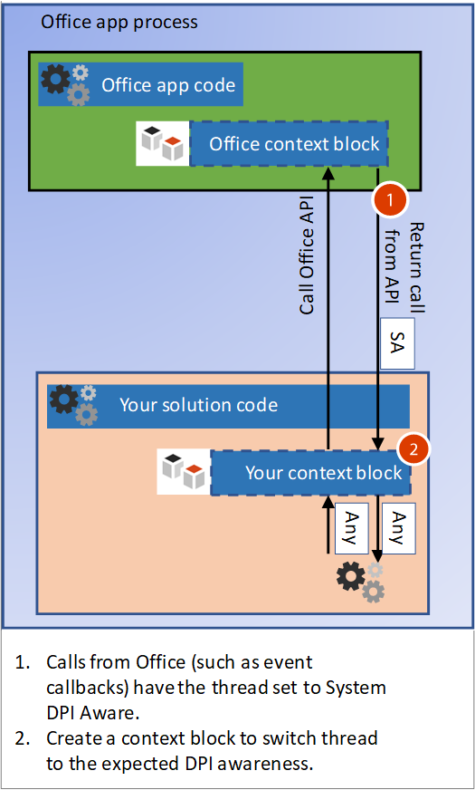

# <a name="handle-high-dpi-and-dpi-scaling-in-your-office-solution"></a>Controlar valores altos y ajuste de PPP en una solución de Office

Muchas configuraciones de equipo y pantalla ahora admiten resoluciones con un valor alto de PPP (puntos por pulgada) y pueden conectar varios monitores de diferentes tamaños y densidad de píxeles. Esto requiere aplicaciones para ajustar cuando el usuario mueve la aplicación a un monitor con un valor de PPP diferente o cambia el nivel de zoom. Aplicaciones que no son compatibles con el ajuste de PPP se podrían ver bien en monitores con bajos valores de PPP, pero se verán expandidas y borrosas cuando se muestran en un monitor con un valor alto de PPP. 

Se han actualizado las aplicaciones de Office 2016, como Word y Excel, para responder a los cambios en el factor de escala. Sin embargo, la solución de Office también debe responder a cambios para dibujar correctamente cuando cambie el valor de PPP. Este artículo describe cómo admite Office PPP dinámicos y qué puede hacer para garantizar la mejor experiencia visual de la solución de extensibilidad de Office para controlar el ajuste de PPP. 

## <a name="dpi-scaling-symptoms-in-your-solution"></a>Síntomas de ajuste de PPP en su solución

Windows aplica el ajuste de PPP cuando una aplicación se mueve de una pantalla a otra con un valor de PPP diferente. Esto ocurre en casos como arrastrar una aplicación a un monitor diferente o acoplar un portátil. Si el ajuste de PPP afecta negativamente a la solución de Office, verá uno o varios de los síntomas siguientes:

- Las ventanas se dibujan en una ubicación incorrecta o tiene un tamaño incorrecto.
- Elementos como botones y etiquetas aparecen en una ubicación incorrecta en la ventana de su solución.
- Fuentes e imágenes aparecen demasiado grandes, demasiado pequeñas o en una ubicación incorrecta.

Los siguientes tipos de soluciones de Office se pueden ver afectados por el ajuste de PPP:

- Complementos VSTO
- Paneles de tareas personalizados
- Complementos COM
- Controles ActiveX
- Extensiones de la cinta de opciones
- Servidores OLE
- Complementos web de Office

## <a name="windows-dpi-awareness-modes"></a>Modos de reconocimiento de PPP de Windows

En este artículo haremos referencia a los modos de reconocimiento de PPP compatibles con Windows. Cada modo de reconocimiento de PPP es compatible con distintas funciones, como se describe en la tabla siguiente. Esta es una descripción simplificada de los modos para explicar cómo las soluciones de Office son compatibles. Para obtener más información sobre los modos de reconocimiento de PPP, vea [Desarrollo de aplicaciones de escritorio con un valor alto de PPP en Windows](https://docs.microsoft.com/windows/desktop/hidpi/high-dpi-desktop-application-development-on-windows).

|Modo  |Descripción  |Cuando cambia PPP  |
|---------|---------|---------|
|Sin reconocimiento de PPP |  La aplicación siempre se representa como si se encontrara en una pantalla con un valor de PPP de 96. |  La aplicación se estira en mapa de bits al tamaño esperado en pantallas principales y secundarias.    |
|Reconocimiento de PPP de sistema |  La aplicación detecta el valor de PPP del monitor principal conectado al inicio de sesión de Windows, pero no responde a cambios de PPP. Para obtener más información, consulta la sección Configurar Windows para corregir aplicaciones [borrosas](#configure-windows-to-fix-blurry-apps) en este artículo.  | La aplicación se estira en mapa de bits cuando se mueve a una nueva pantalla con un valor de PPP diferente.    |
|Reconocimiento de PPP por monitor |  La aplicación es capaz de volver a dibujarse correctamente cuando cambie el valor de PPP.  |   Windows le enviará notificaciones de PPP a ventanas de nivel superior de la aplicación para que pueda volver a dibujarse cuando cambie el valor de PPP.     |
|V2 por monitor |  La aplicación es capaz de volver a dibujarse correctamente cuando cambie el valor de PPP.  |   Windows le enviará notificaciones de PPP a ventanas de nivel superior y secundarias para que la aplicación pueda volver a dibujarse cuando cambie el valor de PPP. |

## <a name="how-office-supports-dpi-scaling"></a>Compatibilidad de Office con el ajuste de PPP

El factor más importante para determinar cómo la solución de Office puede controlar el ajuste de PPP es ver si la solución es una ventana de nivel superior o una ventana secundaria. La siguiente imagen muestra algunos ejemplos de soluciones de Office que funcionan como ventanas de nivel superior o secundarias y el modo de reconocimiento de PPP que usarán en la actualización de abril 2018 de Windows (1803) y versiones posteriores.


En esta imagen:
- La ventana de nivel superior VSTO o COM cuenta con el reconocimiento de PPP por monitor.
- La ventana secundaria del control ActiveX cuenta con el reconocimiento de PPP de sistema.
- La ventana de nivel superior de Office cuenta con el reconocimiento de PPP por monitor.
- La ventana secundaria del panel de tareas personalizado cuenta con el reconocimiento de PPP de sistema.

## <a name="managing-thread-dpi-context"></a>Administrar el contexto de PPP de subprocesos

Cuando se inicie la aplicación host de Office, su subproceso principal se ejecuta en el contexto de reconocimiento de PPP por monitor. Cuando el código de solución crea subprocesos o recibe llamadas de Office, debe administrar el contexto de PPP de subprocesos.

### <a name="creating-new-threads-with-the-correct-dpi-context"></a>Crear nuevos subprocesos con el contexto de PPP correcto

Si su solución crea subprocesos adicionales, Office los obligará al contexto de reconocimiento de PPP por monitor. Si el código se espera un contexto diferente, debe usar la función [SetThreadDpiAwarenessContext](https://docs.microsoft.com/windows/desktop/api/winuser/nf-winuser-setthreaddpiawarenesscontext) para establecer el reconocimiento de PPP de subproceso esperado. 

### <a name="build-a-context-block-for-incoming-thread-calls"></a>Crear un bloque de contexto para las llamadas entrantes de subprocesos



La solución interactúa con su aplicación host de Office, por lo que recibirá llamadas entrantes para su solución de Office como devoluciones de llamadas de eventos. Cuando Office llama la solución, cuenta con un bloque de contexto que fuerza el contexto de subprocesos en el contexto de reconocimiento de PPP de sistema. Debe cambiar el contexto de subprocesos para que coincida con el reconocimiento de PPP de la ventana. Puede implementar un bloque de contexto similar para cambiar el contexto de subprocesos en llamadas entrantes. Use la función [SetThreadDpiAwarenessContext](https://docs.microsoft.com/windows/desktop/api/winuser/nf-winuser-setthreaddpiawarenesscontext) para cambiar el contexto para que coincida con el contexto de la ventana. 

> [!NOTE]
> El bloque de contexto debe restaurar el contexto de subprocesos de PPP original antes de llamar a los demás componentes fuera de su código de la solución.

#### <a name="managed-code-context-block"></a>Bloque de contexto de código administrado

El ejemplo de código siguiente muestra cómo crear su propio bloque de contexto.

```csharp
public struct DPI_AWARENESS_CONTEXT
        {
            private IntPtr value;

            private DPI_AWARENESS_CONTEXT(IntPtr value)
            {
                this.value = value;
            }

            public static implicit operator DPI_AWARENESS_CONTEXT(IntPtr value)
            {
                return new DPI_AWARENESS_CONTEXT(value);
            }

            public static implicit operator IntPtr(DPI_AWARENESS_CONTEXT context)
            {
                return context.value;
            }

            public static bool operator ==(IntPtr context1, DPI_AWARENESS_CONTEXT context2)
            {
                return AreDpiAwarenessContextsEqual(context1, context2);
            }

            public static bool operator !=(IntPtr context1, DPI_AWARENESS_CONTEXT context2)
            {
                return !AreDpiAwarenessContextsEqual(context1, context2);
            }

            public override bool Equals(object obj)
            {
                return base.Equals(obj);
            }

            public override int GetHashCode()
            {
                return base.GetHashCode();
            }
        }

        private static DPI_AWARENESS_CONTEXT DPI_AWARENESS_CONTEXT_HANDLE = IntPtr.Zero;

        public static readonly DPI_AWARENESS_CONTEXT DPI_AWARENESS_CONTEXT_INVALID = IntPtr.Zero;
        public static readonly DPI_AWARENESS_CONTEXT DPI_AWARENESS_CONTEXT_UNAWARE = new IntPtr(-1);
        public static readonly DPI_AWARENESS_CONTEXT DPI_AWARENESS_CONTEXT_SYSTEM_AWARE = new IntPtr(-2);
        public static readonly DPI_AWARENESS_CONTEXT DPI_AWARENESS_CONTEXT_PER_MONITOR_AWARE = new IntPtr(-3);
        public static readonly DPI_AWARENESS_CONTEXT DPI_AWARENESS_CONTEXT_PER_MONITOR_AWARE_V2 = new IntPtr(-4);

        public static DPI_AWARENESS_CONTEXT[] DpiAwarenessContexts =
        {
            DPI_AWARENESS_CONTEXT_UNAWARE,
            DPI_AWARENESS_CONTEXT_SYSTEM_AWARE,
            DPI_AWARENESS_CONTEXT_PER_MONITOR_AWARE,
            DPI_AWARENESS_CONTEXT_PER_MONITOR_AWARE_V2
        };

class DPIContextBlock : IDisposable
    {
        private DPI_AWARENESS_CONTEXT resetContext;
        private bool disposed = false;

        public DPIContextBlock(DPI_AWARENESS_CONTEXT contextSwitchTo)
        {
            resetContext = SetThreadDpiAwarenessContext(contextSwitchTo);
         }

        public void Dispose()
        {
            Dispose(true);
            GC.SuppressFinalize(this);
        }

        protected virtual void Dispose(bool disposing)
        {
            if (!disposed)
            {
                if (disposing)
                {
                    SetThreadDpiAwarenessContext(resetContext);
                }
            }
            disposed = true;
        }
    }
```

#### <a name="native-code-context-block"></a>Bloque de contexto de código nativo

```cpp
#include <winuser.h>
/* DpiAwarenessContextBlock can be used to simplify setting and resetting the DPI_AWARENESS_CONTEXT of
the current thread.  When the object is constructed, the DPI_AWARENESS_CONTEXT is set, and when the object is
destructed, the DPI awareness context is reverted to the previous awareness context at construct time.

This object allows us to write code such as:

// Thread state is currently DPI_AWARENESS_SYSTEM_AWARE
if (condition)
{
DpiAwarenessContextBlock perMonitorAware(DPI_AWARENESS_PER_MONITOR_AWARE);
... // Create a top-level hwnd with the current thread state, DPI_AWARENESS_PER_MONITOR_AWARE
}
// Thread state automatically returns to DPI_AWARENESS_SYSTEM_AWARE

*/
class DpiAwarenessContextBlock
{
public:
      DpiAwarenessContextBlock(DPI_AWARENESS_CONTEXT dpiContext) noexcept;
      ~DpiAwarenessContextBlock();

      // Copy and move are not to be used with these context objects
      DpiAwarenessContextBlock(const DpiAwarenessContextBlock&) = delete;
      DpiAwarenessContextBlock(DpiAwarenessContextBlock&&) = delete;

private:
      DPI_AWARENESS_CONTEXT m_contextReversalType;
      bool m_doContextSwitch;
};

inline DpiAwarenessContextBlock::DpiAwarenessContextBlock(DPI_AWARENESS_CONTEXT dpiContext) noexcept
{
      m_contextReversalType = SetThreadDpiAwarenessContext(dpiContext);
}

inline DpiAwarenessContextBlock::~DpiAwarenessContextBlock()
{
      SetThreadDpiAwarenessContext(m_contextReversalType);
}
```

<h2 id="top-level-window-management">Administración de ventanas de nivel superior</h2>

Al iniciar aplicaciones de Office, se realiza una llamada a [SetThreadDpiAwarenessContext](https://docs.microsoft.com/windows/desktop/api/winuser/nf-winuser-setthreaddpiawarenesscontext) como DPI_AWARENESS_CONTEXT_PER_MONITOR_AWARE. En este contexto, los cambios de PPP se envían a HWND de cualquier ventana de nivel superior en el proceso que se está ejecutando según el reconocimiento de PPP por monitor. Las ventanas de nivel superior son la ventana de la aplicación de Office y cualquier ventana de nivel superior adicional creada por la solución. Cuando una aplicación de Office se mueve a una nueva pantalla, recibe una notificación para que pueda escalar dinámicamente y dibujarse correctamente con el valor PPP de la nueva pantalla. La solución de Office puede crear ventanas de nivel superior en cualquier modo de reconocimiento de PPP. Las ventanas de nivel superior también pueden responder a los cambios de PPP al escuchar mensajes de Windows para los cambios.

Si crea ventanas secundarias que están relacionadas a la ventana de nivel superior, también puede establecerlas con cualquier modo de reconocimiento de PPP. Sin embargo, si usa el modo de reconocimiento de PPP por monitor, las ventanas secundarias no recibirán notificaciones de cambio de PPP.  Para obtener más información sobre los modos de reconocimiento de PPP de Windows, vea [Desarrollo de aplicaciones de escritorio con valores altos de PPP en Windows](https://docs.microsoft.com/windows/desktop/hidpi/high-dpi-desktop-application-development-on-windows).

## <a name="child-window-management"></a>Administración de ventanas secundarias

Al trabajar con controles ActiveX y paneles de tareas personalizados, Office creará la ventana secundaria para su solución. Puede crear ventanas secundarias adicionales, pero debe ser conscientes del reconocimiento de PPP de la ventana principal. Office se ejecuta en modo de reconocimiento de PPP por monitor, lo que significa que ninguna ventana secundaria en su solución recibirá notificaciones de cambio de PPP. Solo el modo v2 por monitor admite el envío de cambios de PPP a ventanas secundarias (Office no es compatible con v2 por monitor). Sin embargo, hay una solución alternativa para los controles ActiveX. Para obtener más información, vea la sección [Controles ActiveX](#activex-controls) más adelante en este artículo.

> [!NOTE]
> Si la ventana secundaria crea una ventana de nivel superior, puede usar cualquier modo de reconocimiento de PPP para la nueva ventana de nivel superior. Para obtener más información sobre cómo administrar ventanas de nivel superior, consulte la sección [Administración de la ventana de nivel superior](#top-level-window-management) de este artículo.

Verá dos modos PPP diferentes aplicados a la ventana secundaria, según la versión de Windows 10 en la que se ejecuta Office.

### <a name="office-dpi-behavior-on-windows-fall-creators-update-1709"></a>Comportamiento de PPP de Office en Windows Fall Creators Update (1709)

Como las aplicaciones de Office usan el modo de reconocimiento por monitor, las ventanas secundarias de su solución también se crearán en modo de reconocimiento de PPP por monitor. Esto significa que Windows espera que su solución se actualice al dibujar con un nuevo valor de PPP.  Como la ventana no puede recibir notificaciones de cambio de PPP, la interfaz de usuario de la solución podría ser incorrecta. 


### <a name="office-dpi-behavior-on-windows-april-2018-update-1803"></a>Comportamiento de PPP de Office en la actualización de abril de 2018 de Windows (1803)

Con la actualización de abril de 2018 de Windows (1803) y versiones posteriores, el comportamiento de hospedaje de PPP de Office usa el ajuste de PPP de modo mixto para algunos escenarios. Esto permite a las ventanas con reconocimiento de PPP de sistema que estén relacionadas con las ventanas de Office establecidas con el reconocimiento de PPP por monitor. Esto ayuda a garantizar la compatibilidad mejorada al cambiar el valor de PPP cuando las ventanas son estiradas en mapas de bits. Las ventanas todavía podrían parecer borrosas por el estiramiento en mapa de bits.


Al crear nuevas ventanas secundarias, asegúrese de que coincidan con el reconocimiento de PPP de la ventana principal. Puede usar la [función GetWindowDpiAwarenessContext](https://docs.microsoft.com/windows/desktop/api/winuser/nf-winuser-getwindowdpiawarenesscontext) para obtener el reconocimiento de PPP de la ventana primaria. Para más información sobre la coherencia de reconocimiento de PPP, consulte la sección "Reinicio forzado del reconocimiento de todo el proceso de PPP" en [Desarrollo de aplicaciones de escritorio con un valor alto de PPP en Windows](https://docs.microsoft.com/windows/desktop/hidpi/high-dpi-desktop-application-development-on-windows#related-topics).

> [!NOTE]
> No puede confiar en el reconocimiento de PPP de proceso porque puede devolver [PROCESS_SYSTEM_DPI_AWARE](https://docs.microsoft.com/windows/desktop/api/shellscalingapi/ne-shellscalingapi-process_dpi_awareness) incluso cuando el contexto de reconocimiento de PPP de subprocesos principal de la aplicación es [DPI_AWARENESS_CONTEXT_PER_MONITOR_AWARE](https://docs.microsoft.com/windows/desktop/hidpi/dpi-awareness-context). Use la función [GetThreadDpiAwarenessContext](https://docs.microsoft.com/windows/desktop/api/winuser/nf-winuser-getthreaddpiawarenesscontext) para obtener el contexto de reconocimiento de PPP de subprocesos.

## <a name="office-and-windows-dpi-compatibility-settings"></a>Configuración de compatibilidad de PPP de Windows y Office

Cuando los usuarios encuentran complementos o soluciones que no se representan correctamente, algunas opciones de compatibilidad sirven para corregir el problema.

<h3 id="office-compatibility">Configurar Office para optimizar la compatibilidad</h3>

Office dispone de una configuración para optimizar la compatibilidad al pasar a escalas de PPP diferentes en pantallas diferentes. El modo de compatibilidad deshabilita el ajuste de PPP para que todo en Office sea estirado en mapa de bits cuando se mueve a una pantalla con un ajuste de PPP diferente. 

El modo de compatibilidad obliga a Office a ejecutarse en modo de reconocimiento de PPP de sistema. Esto hace que las ventanas de aplicaciones se estiren en mapa de bits y puede tener el efecto secundario de una apariencia borrosa. La solución de Office no puede controlar esta configuración porque la selecciona el usuario. Usar el modo de compatibilidad de pantalla soluciona la mayoría de problemas de dibujo. Para obtener más información, vea [Soporte técnico de Office para pantallas de alta definición](https://support.office.com/en-us/article/office-support-for-high-definition-displays-6720ca0e-be59-41f6-b629-1369f549279d). 

### <a name="configure-windows-to-fix-blurry-apps"></a>Configurar Windows para corregir aplicaciones borrosas

Windows 10 (versión 1803) y versiones posteriores disponen de una configuración para corregir aplicaciones para que no sean borrosas. Esta es otra configuración para probar si no se está representando correctamente la solución. La solución de Office no puede controlar esta configuración porque la selecciona el usuario. Para obtener más información, vea [Corregir aplicaciones que se vean borrosas en Windows 10](https://support.microsoft.com/en-us/help/4091364/windows-10-fix-blurry-apps).

## <a name="how-to-support-dpi-scaling-in-your-solution"></a>Compatibilidad del ajuste de PPP en su solución

Algunas soluciones pueden recibir y responder a los cambios de PPP. Algunas tienen una solución alternativa si no pueden recibir notificaciones. En la siguiente tabla se enumeran los detalles de cada tipo de solución.

<table>
    <thead>
        <tr>
            <th>Tipo de solución</th>
            <th>Tipo de ventana</th>
            <th>Puede responder al ajuste de PPP</th>
            <th>Más detalles</th>
        </tr>
    </thead>
<tbody>
    <tr>
        <td rowspan="2"><a href="#vsto-add-ins">Complementos VSTO</a></td>
        <td>Parte superior y sus descendientes</td>
        <td>Sí</td>
        <td>Vea <a href="#vsto-add-ins">Guía para el complemento VSTO</a>.</td>
    </tr>
<tr>
        <td>Elementos secundarios relacionados con la ventana de Office</td>
        <td>No</td>
        <td>Vea <a href="#office-compatibility">Configurar Office para optimizar la compatibilidad</a>.</td>
</tr>
    <tr>
        <td rowspan="2"><a href="#custom-task-panes">Panel de tareas personalizado</a></td>
        <td>Parte superior y sus descendientes</td>
        <td>Sí</td>
        <td>Vea la <a href="#top-level-window-management">Guía de la ventana de nivel superior</a>.</td>
    </tr>
<tr>
        <td>Elementos secundarios relacionados con la ventana de Office</td>
        <td>No</td>
        <td>Vea <a href="#office-compatibility">Configurar Office para optimizar la compatibilidad</a>.</td>
</tr>
    <tr>
        <td rowspan="2"><a href="#com-add-ins">Complemento COM</a></td>
        <td>Parte superior y sus descendientes</td>
        <td>Sí</td>
        <td>Vea <a href="#com-add-ins">Guía para el complemento COM</a>.</td>
    </tr>
<tr>
        <td>Elementos secundarios relacionados con la ventana de Office</td>
        <td>No</td>
        <td>Vea <a href="#office-compatibility">Configurar Office para optimizar la compatibilidad</a>.</td>
</tr>
    <tr>
        <td rowspan="2"><a href="#activex-controls">Control ActiveX</a></td>
        <td>Parte superior y sus descendientes</td>
        <td>Sí</td>
        <td>Vea <a href="#activex-controls">Guía de control ActiveX</a>.</td>
    </tr>
    <tr>
        <td>Elementos secundarios relacionados con la ventana de Office</td>
        <td>Sí</td>
    </tr>
    <tr>
        <td><a href="#web-add-ins">Complemento web</a></td>
        <td>ND</td>
        <td>Sí</td>
        <td>Vea <a href="#web-add-ins">Guía de complemento web de Office</a>.</td>
    </tr>
    <tr>
        <td><a href="#ribbon-extensibility">Extensión de la cinta de opciones</a></td>
        <td>ND</td>
        <td>ND</td>
        <td>Vea <a href="#ribbon-extensibility">Guía de extensión de la cinta de opciones</a>.</td>
    </tr>
    <tr>
        <td><a href="#ole">Cliente o servidor OLE</a></td>
        <td>ND</td>
        <td>ND</td>
        <td>Vea <a href="#ole">Guía de cliente y servidor OLE</a>.</td>
    </tr>
</tbody>
</table>

<h3 id="vsto-add-ins">Complemento VSTO</h3>

Si el complemento VSTO crea ventanas secundarias que están relacionadas con cualquier ventana de Office, asegúrese de que coincidan con el reconocimiento de PPP de la ventana principal. Puede usar la función [GetWindowdpiAwarenessContext](https://docs.microsoft.com/windows/desktop/api/winuser/nf-winuser-getwindowdpiawarenesscontext) para obtener el reconocimiento de PPP de la ventana principal. Las ventanas secundarias no recibirán ninguna notificación de cambio de PPP. Si no se está representando correctamente la solución, los usuarios deberán poner Office en modo de compatibilidad.

Para todas las ventanas de nivel superior que crea el complemento VSTO, puede establecerlas en cualquier modo de reconocimiento de PPP. El ejemplo de código siguiente muestra cómo configurar el reconocimiento de PPP deseado y cómo responder a los cambios de PPP. También necesitará ajustar el app.config, como se describe en el artículo [Soporte de valores altos de PPP en Windows Forms](https://docs.microsoft.com/dotnet/framework/winforms/high-dpi-support-in-windows-forms). 

```csharp
using System;
using System.Diagnostics;
using System.Drawing;
using System.Runtime.InteropServices;
using System.Windows.Forms;

namespace SharedModule
{
    // DpiAwareWindowsForm
    // For any top level winform you create, derive from the DpiWindowsForm class
    // if you are creating Windows Forms with the Dpi Awareness Context set to 
    // DPI_AWARENESS_CONTEXT_PER_MONITOR_AWARE or DPI_AWARENESS_CONTEXT_PER_MONITOR_AWARE_V2
    //
    // For example, if you Window form class is defined as:
    //    public partial class TopLevelWinForm : Form
    //
    // update to:
    //    public partial class TopLevelWinForm : DpiAwareWindowsForm
    //
    // When showing the form, call SetThreadDpiAwarenessContext() or use a context block to
    // to set the desired Dpi Awareness Context.
    //
    // For example, here is code to show a Windows Form using a context block as Per Monitor Aware v2.
    //
    //    DPIContextBlock context = new DPIContextBlock(DPI_AWARENESS_CONTEXT_PER_MONITOR_AWARE_V2);
    //    TopLevelWinForm frm = new TopLevelWinForm();
    //    frm.Show();
    //
    public partial class DpiAwareWindowsForm : Form
    {
        private SizeF m_newDpi = SizeF.Empty;
        private SizeF m_oldDpi = SizeF.Empty;

        public DpiAwareWindowsForm()
        {
            this.HandleCreated += new EventHandler((sender, args) =>
            {
                m_oldDpi = m_newDpi = DPIHelper.GetDpiForWindowSizeF(this.Handle);
            });
        }

        public void OnDpiChangedEvent(RECT newRect)
        {
            this.SuspendLayout();

            // Resize form
            this.Width = newRect.Width;
            this.Height = newRect.Height;

            // Resize controls and set font sizes
            ScaleAllChildControls(this.Controls, m_oldDpi.Width, m_newDpi.Width);
            this.ResumeLayout(true);
        }

        // Additional changes may be needed for controls that set Anchor or Dock properties 
        private void ScaleAllChildControls(Control.ControlCollection controls, float oldDpi, float newDpi)
        {
            float scaleFactorChange = newDpi / oldDpi;

            foreach (Control control in controls)
            {
                control.Top = (int)(control.Top * scaleFactorChange);
                control.Left = (int)(control.Left * scaleFactorChange);
                control.Width = (int)(control.Width * scaleFactorChange);
                control.Height = (int)(control.Height * scaleFactorChange);
                control.Font = ScaleFont(control.Font, oldDpi, newDpi);
            }
        }

        private Font ScaleFont(Font font, float oldDpi, float newDpi)
        {
            float fontSizePx = 0.0f;
            float fontSizePt = 0.0f;

            fontSizePx = font.SizeInPoints / 72 * oldDpi;
            fontSizePt = fontSizePx * (newDpi / oldDpi) * 72 / oldDpi;

            return new Font(font.Name, fontSizePt, font.Style, GraphicsUnit.Point);
        }

        protected override void WndProc(ref Message m)
        {
            switch ((DPIHelper.WinMessages)m.Msg)
            {
                case DPIHelper.WinMessages.WM_DPICHANGED:
                    // Marshal the value in the lParam into a Rect.
                    RECT newDisplayRect = (RECT)Marshal.PtrToStructure(m.LParam, typeof(RECT));

                    // Remember current DPI and calculate current from WParam.
                    // Both X and Y are the same on Windows for Dpi.
                    m_oldDpi = m_newDpi;

                    m_newDpi.Width = (float)(m.WParam.ToInt32() >> 16);
                    m_newDpi.Height = (float)(m.WParam.ToInt32() & 0x0000FFFF);

                    // DPI should be the same for both width and height on Windows devices.
                    Debug.Assert(m_newDpi.Height == m_newDpi.Width);

                    if (m_oldDpi.Width != m_newDpi.Width)
                    {
                        OnDpiChangedEvent(newDisplayRect);
                    }
                    base.DefWndProc(ref m);
                    break;
                default:
                    base.WndProc(ref m);
                    break;
            }
        }
    }
}
```

<h3 id="custom-task-panes">Paneles de tareas personalizados</h3>

Un panel de tareas personalizado se crea mediante Office como una ventana secundaria.  Cuando se ejecuta en Windows Fall Creators Update (1709), el panel de tareas personalizado se ejecutará con el mismo modo de reconocimiento de PPP de Office. Cuando se ejecuta en la actualización de abril 2018 de Windows (1803) y versiones posteriores, el panel de tareas personalizado se ejecutará con el modo de reconocimiento de PPP del sistema. 

Como los paneles de tareas personalizados son ventanas secundarias, no pueden recibir notificaciones de PPP. Si se están dibujando correctamente, el usuario debe usar el [modo de compatibilidad de PPP de Office](https://support.office.com/en-us/article/office-support-for-high-definition-displays-6720ca0e-be59-41f6-b629-1369f549279d).
Si el panel de tareas personalizado crea ventanas de nivel superior, esas ventanas pueden ejecutarse en cualquier modo de reconocimiento de PPP y recibir notificaciones de cambio de PPP. Para obtener más información, consulte la sección [Administración de la ventana de nivel superior](#top-level-window-management) de este artículo.

<h3 id="com-add-ins">Complementos COM</h3>

Los complementos COM que crean ventanas de nivel superior pueden recibir notificaciones de PPP. Deberá crear un [bloque de contexto](#build-a-context-block-for-incoming-thread-calls) para establecer el subproceso al reconocimiento de PPP que quiera para la ventana y luego, deberá crear la ventana. Hay mucho que hacer para controlar las notificaciones de PPP correctamente, así que asegúrese de leer [Desarrollo de aplicaciones de escritorio de valores altos de PPP en Windows](https://docs.microsoft.com/windows/desktop/hidpi/high-dpi-desktop-application-development-on-windows#related-topics) para obtener más información.

El mensaje [WM_DPICHANGED](https://docs.microsoft.com/windows/desktop/hidpi/wm-dpichanged) se envía un mensaje cuando se cambie el valor de PPP de una ventana.  En el código no administrado, este mensaje se controla mediante el [Procedimiento de ventana](https://docs.microsoft.com/windows/desktop/winmsg/using-window-procedures) para HWND.  El código del controlador de cambios de PPP de ejemplo se encuentra en el artículo WM_DPICHANGED. 

Los complementos COM que muestran las ventanas secundarias relacionadas con una ventana de Office no pueden recibir notificaciones de PPP. Si se están dibujando correctamente, el usuario debe usar el [modo de compatibilidad de PPP de Office](https://support.office.com/article/office-support-for-high-definition-displays-6720ca0e-be59-41f6-b629-1369f549279d).

<h3 id="activex-controls">Controles ActiveX</h3>

El modo de admitir el ajuste de PPP de controles ActiveX depende de si el control es con o sin ventana.

#### <a name="windowed-activex-controls"></a>Controles ActiveX con ventanas

Los controles ActiveX con ventanas reciben un mensaje WM_SIZE cada vez que cambia de tamaño el control.  Cuando se desencadena el evento, el código del controlador de eventos puede llamar a la función [GetDpiForWindow](https://docs.microsoft.com/windows/desktop/api/winuser/nf-winuser-getdpiforwindow) con HWND del control para obtener el valor de PPP, calcular las diferencias de factor de escala y ajustar según sea necesario. 

El ejemplo siguiente permite a un control ActiveX basado en MFC responder al evento **OnSize**. 

```cpp
void ChangeWindowFontDPI(HWND hWnd, UINT dpi) 
{ 
LOGFONT fontInfo1 = { 0 }; 
// Calculate the font height based on the DPI. 
fontInfo1.lfHeight = -MulDiv(DESIRED_HEIGHT, dpi, 72); 
fontInfo1.lfQuality = CLEARTYPE_QUALITY; 
wcscpy_s(fontInfo1.lfFaceName, DESIRED_FONT_NAME); 
 
::SendMessage(hWnd, WM_SETFONT, (WPARAM)::CreateFontIndirectW(&fontInfo1), TRUE); 
} 
 
BOOL CALLBACK CMainDialog::EnumChildProc(HWND hWnd, LPARAM lParam) 
{ 
CMainDialog* _this = (CMainDialog*) lParam; 
if (_this != nullptr) 
{ 
// Calculate the scale factor difference between the old and new DPI changes. 
double scale = (((double) _this->m_newDPI) /  
   (((double) _this->m_currentDPI) / 100.0)) / 100; 
 
RECT rect = {}; 
::GetWindowRect(hWnd, &rect); 
 
POINT pt = { rect.left, rect.top }; 
::ScreenToClient(::GetParent(hWnd), &pt); 
 
// Adjust the window based on the scale changes. 
::MoveWindow(hWnd, 
pt.x * scale, 
pt.y * scale, 
(rect.right - rect.left) * scale, 
(rect.bottom - rect.top) * scale, 
TRUE); 
 
ChangeWindowFontDPI(hWnd, _this->m_newDPI); 
return TRUE; 
} 
return FALSE; 
} 
 
void CMainDialog::OnSize(UINT nType, int cx, int cy) 
{ 
CDialog::OnSize(nType, cx, cy); 
 
// Get the new DPI and enumerate the child windows that will use that value. 
m_currentDPI = ::GetDpiForWindow(this->GetSafeHwnd()); 
::EnumChildWindows(this->GetSafeHwnd(), EnumChildProc, (LPARAM)this); 
} 
```

#### <a name="windowless-activex-controls"></a>Controles ActiveX sin ventanas

No se garantiza que los controles ActiveX sin ventanas tengan un HWND.  Al insertar un control ActiveX en el lienzo de un documento, éste entrará en modo de diseño.  En las aplicaciones de Office, el contenedor host devolverá 0 para la llamada a hDC->GetWindow() en el evento ::OnDraw cuando el control está en modo de diseño.  En este caso no se puede recuperar un valor de PPP confiable. 

Sin embargo, cuando el control está en modo runtime, Office devolverá HWND donde se debe dibujar el control.  En este caso, el desarrollador de control puede llamar a [GetDpiForWindow](https://docs.microsoft.com/windows/desktop/api/winuser/nf-winuser-getdpiforwindow) y obtener el valor de PPP actual y las escalas de fuentes, los controles y así sucesivamente. 

<h3 id="ribbon-extensibility">Extensibilidad de la cinta de opciones personalizada</h3>

Todas las devoluciones de llamadas de Office para los controles de cinta de opciones personalizados se mostrarán en un reconocimiento de subprocesos de PPP del reconocimiento de PPP de sistema.  Si la solución se espera un reconocimiento de subprocesos de PPP diferente, deberá implementar un bloque de contexto para configurar el reconocimiento de subprocesos según lo esperado. Para obtener más información, vea [Crear un bloque de contexto](#build-a-context-block-for-incoming-thread-calls).

<h3 id="ole">Clientes y servidores OLE.</h3>

Cuando se hospeda un servidor OLE en un contenedor de cliente OLE, actualmente no puede proporcionar información de PPP actual o compatible. Esto puede provocar problemas porque algunos modos mixtos de combinaciones de ventana principal y ventana secundaria no son compatibles con la arquitectura actual de Windows. Si Word o Excel detectan que hay varios monitores con escalas de PPP diferentes, no admitirán la activación en contexto. El servidor OLE se activará remotamente. Si experimenta problemas con las interacciones de servidor OLE, el usuario deberá usar el [Modo de compatibilidad de PPP de Office](https://support.office.com/article/office-support-for-high-definition-displays-6720ca0e-be59-41f6-b629-1369f549279d).

<h3 id="web-add-ins">Complementos web de Office</h3>

Los complementos de Office creados con la API de JavaScript de Office se ejecutan en un control de explorador. Puede controlar el ajuste de PPP con las mismas técnicas que se usan en cualquier diseño de aplicaciones web. Muchos recursos en línea están disponibles para ayudarle a diseñar una página web para pantallas de alta resolución.

## <a name="verify-that-your-solution-supports-dpi-scaling"></a>Compruebe que la solución sea compatible con el ajuste de PPP

Después de actualizar la aplicación para admitir el ajuste de PPP, debe validar los cambios en un entorno mixto de PPP. Valide que el código de la interfaz de usuario responda correctamente a los cambios de PPP, cuando se mueven las ventanas de su solución de una pantalla a otra con diferentes valores de PPP. Para obtener más información sobre las técnicas de pruebas de ajuste de PPP, vea [Desarrollo de aplicaciones de escritorio con valores altos de PPP en Windows](https://docs.microsoft.com/windows/desktop/hidpi/high-dpi-desktop-application-development-on-windows#related-topics).

También pueden ser útiles estas técnicas adicionales:

- Con un equipo portátil, puede establecer el monitor principal a un monitor externo y luego, desacoplar el equipo portátil. Esto obligará el monitor principal a cambiar a la pantalla del equipo.
- Use la [herramienta WinSpy ++](https://github.com/BissetJ/winspy/releases) de código abierto para ayudar a depurar. Se puede usar para ver la configuración de reconocimiento de PPP de cualquier ventana.
- Puede usar Escritorio remoto para probar varios monitores en un equipo remoto seleccionando Usar todos mis monitores para la sesión remota en la pestaña Pantalla, como se muestra en la siguiente captura de pantalla.


## <a name="see-also"></a>Vea también

### <a name="articles"></a>Artículos

- [El desarrollo de una aplicación Per-Monitor DPI-Aware WPF proporciona](https://docs.microsoft.com/windows/desktop/hidpi/declaring-managed-apps-dpi-aware) una introducción general y una guía para escribir aplicaciones de escritorio de Win32. Muchas de las mismas técnicas descritas en este artículo se aplicarán a las soluciones de extensibilidad de Office.
- 
  [API con reconocimiento PPP y ajuste de PPP de modo mixto](https://docs.microsoft.com/windows/desktop/hidpi/high-dpi-improvements-for-desktop-applications) cuenta con una lista de API relacionadas con PPP.
- [Guía del desarrollador - PPP por monitor - Vista previa WPF](https://github.com/Microsoft/WPF-Samples/blob/master/PerMonitorDPI/Developer%20Guide%20-%20Per%20Monitor%20DPI%20-%20WPF%20Preview.docx) incluye la guía de desarrollo de aplicaciones WPF para crear aplicaciones WPF con reconocimiento de PPP.
- [Soporte técnico de Office para las pantallas de alta definición](https://support.office.com/article/Office-support-for-high-definition-displays-6720ca0e-be59-41f6-b629-1369f549279d) proporciona información sobre cómo un usuario puede configurar Office para optimizar la compatibilidad si la solución de Office no se admite correctamente cuando se cambie el valor de PPP.
- [Mostrar los cambios de escala de la Actualización de aniversario de Windows 10](https://blogs.technet.microsoft.com/askcore/2016/08/16/display-scaling-changes-for-the-windows-10-anniversary-update/) es una publicación de blog que trata los cambios en la actualización de aniversario de Windows 10. 
- [Controlador DPI_AWARENESS_CONTEXT](https://docs.microsoft.com/windows/desktop/hidpi/dpi-awareness-context) contiene detalles de programación sobre definiciones y valores DPI_AWARENESS_CONTEXT.
- [Desarrollo de aplicaciones de escritorio con valores altos de PPP en Windows](https://docs.microsoft.com/windows/desktop/hidpi/high-dpi-desktop-application-development-on-windows#testing-your-changes) incluye información sobre las pruebas en la sección Probar los cambios.

### <a name="code-samples"></a>Ejemplos de código

- [Ejemplo de reconocimiento PPP por ventana](https://github.com/Microsoft/Windows-classic-samples/tree/master/Samples/DPIAwarenessPerWindow)
- [Ejemplo de PPP dinámico](https://github.com/Microsoft/Windows-classic-samples/tree/master/Samples/DynamicDPI)
- [Ejemplo de WPF de reconocimiento por monitor](https://github.com/Microsoft/Windows-classic-samples/tree/master/Samples/PerMonitorDPIAware)
