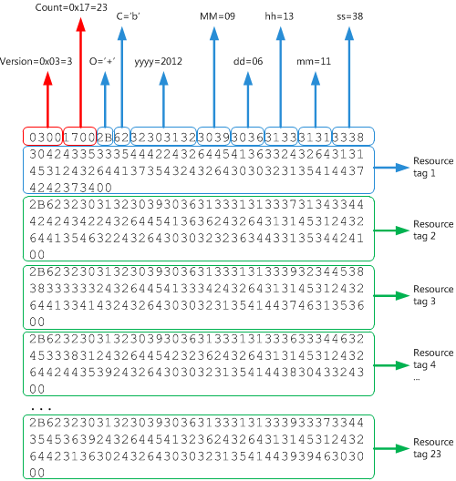

# Analizar el historial de descarga de mensajes de una cuenta POP3

En este tema se describe la estructura del BLOB DE POP3 que representa el historial de descarga de mensajes de una cuenta POP3, para identificar los mensajes que se han descargado o eliminado en esa cuenta.

## ¿Por qué analizar el historial de descarga de mensajes?

El proveedor de protocolo de oficina de correo (POP) para Outlook permite a los usuarios recuperar y descargar nuevos mensajes de correo electrónico en su dispositivo local y, posteriormente, dejar o eliminar estos mensajes de correo electrónico en el servidor de correo. Cuando el cliente de correo comprueba si hay mensajes nuevos para descargar, tiene que poder identificar y descargar solo los mensajes nuevos para esa Bandeja de entrada. Para ello, el cliente de correo usa primero el comando UIDL (Unique ID Listing) para obtener un mapa de cada mensaje que se haya entregado en esa Bandeja de entrada a un identificador único (UID). El cliente también obtiene el historial de descarga de mensajes para los mensajes que se han descargado o eliminado para la Bandeja de entrada en ese cliente. Con el mapa UID del mensaje y el historial de descargas, el cliente puede identificar los mensajes que no están en el historial como nuevos y, por lo tanto, debe descargarse.
  
Para obtener el historial de descarga de mensajes de una Bandeja de entrada:
  
- Siga los pasos para localizar el historial de descarga de mensajes de una cuenta [POP3](locating-the-message-download-history-for-a-pop3-account.md) para buscar la propiedad [PidTagAttachDataBinary,](https://msdn.microsoft.com/library/3b0a8b28-863e-4b96-a4c0-fdb8f40555b9%28Office.15%29.aspx) que contiene un objeto binario grande (BLOB) que representa el historial de mensajes de una cuenta POP3. 
    
- Lea este tema, que describe la estructura del BLOB, y muestra un blob de ejemplo para identificar los mensajes que se han descargado o eliminado para la Bandeja de entrada de la cuenta POP3.

## Estructura DE BLOB POP

La estructura DE BLOB POP, tal como se describe en la tabla  1, comienza con dos campos, **Versión** y **Recuento,** seguidos de un número de etiquetas de recursos, cada uno de los cuales termina en null. 
  
**Tabla 1. Estructura del BLOB que representa el historial de descarga de mensajes de una cuenta POP3**

|**Campo en BLOB**|**Tamaño**|**Descripción**|
|:-----|:-----|:-----|
|**Versión**   |2 bytes    |Debe ser 3 (**PBLOB_VERSION_NUM**).    |
|**Count**   |2 bytes    |El número de etiquetas de recursos de este BLOB.    |
|Etiqueta de recurso    |Variable    |0 o más cadenas UTF-8 terminadas en null que codifican las etiquetas de recursos. El número de cadenas terminadas en null debe coincidir con **Count**.    |
   
Cada etiqueta de recurso especifica la operación que se aplica a un mensaje, algunos metadatos de fecha y hora sobre la operación y codifica el UID del mensaje. El formato de una cadena de etiqueta de recurso se desglosa de la siguiente manera y se explica más detalladamente en la tabla 2. 
  
`Ocyyyymmddhhmmssuuu...`
  
**Tabla 2. Estructura de una etiqueta de recurso**

|**Campo en una etiqueta de recurso**|**Tamaño**|**Descripción**|
|:-----|:-----|:-----|
| `O`   |1 carácter    |Operación realizada en el mensaje de correo electrónico. El valor debe ser "+", "-" o " ", lo que indica una operación correcta de obtener, eliminar o obtener y &amp; eliminar, respectivamente.    |
| `c`   |1 carácter    |Parte del contenido del mensaje implicado en la operación. El valor debe ser " ", "h" o "b", que indica el contenido de ninguno, encabezado o cuerpo, respectivamente.    |
| `yyyy`   |4 caracteres    |Año de cuatro dígitos de la operación.    |
| `MM`   |2 caracteres    |El mes de dos dígitos de la operación.    |
| `dd`   |2 caracteres    |El día de dos dígitos de la operación.    |
| `hh`   |2 caracteres    |Hora de dos dígitos de la operación.    |
| `mm`   |2 caracteres    |Minuto de dos dígitos de la operación.    |
| `ss`   |2 caracteres    |Segundo de dos dígitos de la operación.    |
| `uuu…`   |Longitud variable    |UiD codificado de un mensaje.    |

## Ejemplo

La figura 1 muestra un ejemplo de un BLOB que representa el historial de descarga de mensajes de una cuenta POP. 
  
**Figura 1. Estructura BLOB de ejemplo para el historial de descarga de mensajes de una cuenta POP3**

  
Según la estructura descrita en las tablas 1 y 2, este BLOB representa el historial de descarga de 23 mensajes de correo electrónico.
  
Para analizar el UID sin procesar en cada etiqueta de recurso, tenga en cuenta que el UID sigue esta codificación: los caracteres de un UID son principalmente caracteres alfanuméricos y cada carácter no alfanumérico va precedido por el carácter ASCII "$" (0x24). Por lo tanto, los caracteres ASCII $2d representan el carácter no alfanumérico "-". La figura 2 muestra un ejemplo de convertir primero el UID sin procesar en la etiqueta de recurso 1 a la representación ASCII y, a continuación, convertir cualquier carácter no alfanumérico precedido de "$" para producir el UID real:
  
`0BC535DB-EA63-11E1-A75C-00215AD7BB74`
  
**Figura 2. Convertir el UID sin procesar en una etiqueta de recurso en el UID del mensaje real**

  
Para interpretar la etiqueta de recurso 1 en este BLOB: el mensaje con el UID se recuperó correctamente el 6 de septiembre de  `0BC535DB-EA63-11E1-A75C-00215AD7BB74` 2012, a las 13:11:38. 
  
De forma similar, puede analizar las 22 etiquetas de recurso restantes para ese BLOB.
  
## Consulte también

- [Administrar la descarga de mensajes de las cuentas POP3](managing-message-downloads-for-pop3-accounts.md)    
- [Localizar el historial de descarga de mensajes de una cuenta POP3](locating-the-message-download-history-for-a-pop3-account.md)    
- [Análisis del historial DE UIDL DE POP3](https://blogs.msdn.com/b/stephen_griffin/archive/2012/12/04/parsing-the-pop3-uidl-history.aspx)
    

