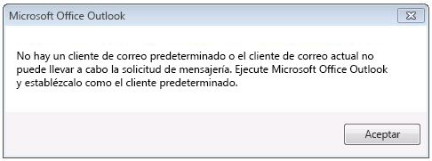
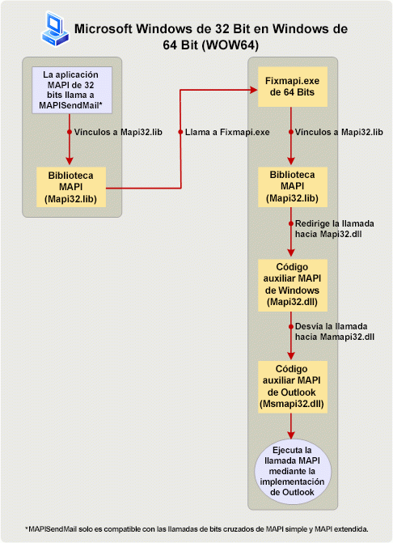

# Crear aplicaciones MAPI en plataformas de 32 y 64 bitsBuilding MAPI applications on 32-bit and 64-bit platforms

**Hace referencia a**: Outlook 2013 | Outlook 2016**Applies to**: Outlook 2013 | Outlook 2016 
  
El tema describe las acciones que los desarrolladores de MAPI deben realizar para modificar y volver a crear aplicaciones MAPI de 32 bits para que se ejecuten en una plataforma de 64 bits y aplicaciones de 64 bits para que se ejecuten en una plataforma de 32 bits.If you have developed and installed 32-bit MAPI applications, there are actions that you should take to change and rebuild 32-bit MAPI applications to run on a 64-bit platform, and 64-bit applications to run on a 32-bit platform. En este tema, una plataforma de 64 bits es un equipo con Microsoft Outlook de 64 bits y Windows de 64 bits, y una plataforma de 32 bits es un equipo con un Outlook de 32 bits y Windows de 32 bits o 64 bits.In this topic, a 64-bit platform is a computer installed with 64-bit Microsoft Outlook and 64-bit Windows, and a 32-bit platform is a computer installed with a 32-bit Outlook and 32-bit or 64-bit Windows. 
  
## Sistema operativo y compatibilidad de Office para Outlook de 64 bitsOperating system and Office support for 64-bit Outlook

> [!NOTE]
> El término valor de bits se refiere a la distinción entre arquitecturas de procesador de 32 bits y 64 bits, y la compatibilidad de aplicaciones asociada.The term bitness refers to the distinction between 32-bit and 64-bit processor architectures and the associated compatibility of applications. En este tema, se usa el valor de bits para calificar la versión de Windows, Microsoft Office, Outlook o una aplicación MAPI creada para una arquitectura de procesador de 32 bits o 64 bits de un equipo, y posiblemente otras aplicaciones que se ejecutan en el mismo.In this topic, bitness is used to qualify the version of Windows, Microsoft Office, Outlook, or a MAPI application built to suit a 32-bit or 64-bit processor architecture of a computer, and possibly other applications that run on that computer. 
  
A partir de Microsoft Office 2010, Outlook está disponible como una aplicación de 32 bits y de 64 bits.Starting in Microsoft Office 2010, Outlook is available as a 32-bit and a 64-bit application. En el mismo equipo, el valor de bits de Outlook depende del valor de bits del sistema operativo Windows (x86 o x64) y de Microsoft Office, si Office ya está instalado en el equipo.On the same computer, the bitness of Outlook depends on the bitness of the Windows operating system (x86 or x64), and of Microsoft Office, if Office is already installed on that computer. Algunos de los factores que determinan la viabilidad para instalar una versión de 32 bits o de 64 bits de Outlook son:Some of the factors that determine the feasibility of installing a 32-bit or a 64-bit version of Outlook include:
  
- Office de 32 bits (y Outlook de 32 bits) pueden instalarse en una versión de 32 bits o 64 bits del sistema operativo Windows.32-bit Office (and 32-bit Outlook) can be installed on a 32-bit or 64-bit version of the Windows operating system. Office de 64 bits (y Outlook de 64 bits) pueden instalarse solo en un sistema operativo de 64 bits.64-bit Office (and 64-bit Outlook) can be installed only on a 64-bit operating system.
    
- La instalación predeterminada de Office en una versión de 64 bits del sistema operativo Windows es Office de 32 bits.The default installation of off14short on a 64-bit edition of the Windows operating system is 32-bit off14short. 

    
- El valor de bits de una versión instalada de Outlook es siempre el mismo que el valor de bits de Office, si este está instalado en el mismo equipo.The bitness of an installed version of Outlook is always the same as the bitness of Office, if Office is installed on the same computer. Es decir, no se puede instalar una versión de 32 bits de Outlook en el mismo equipo que ya tiene las versiones de 64 bits de otras aplicaciones de Office, como Microsoft Word de 64 bits o Microsoft Excel de 64 bits.In other words, a 32-bit version of Outlook cannot be installed on the same computer that already has 64-bit versions of other Office applications installed, such as 64-bit Microsoft Word or 64-bit Microsoft Excel. De forma similar, no se puede instalar una versión de 64 bits de Outlook en el mismo equipo en el que hay versiones de 32 bits de otras aplicaciones de Office ya instaladas.Similarly, a 64-bit version of Outlook cannot be installed on the same computer that already has 32-bit versions of other Office applications installed.
    
## Preparar aplicaciones MAPI en plataformas de 32 y 64 bitsBuilding MAPI applications on 32-bit and 64-bit platforms

Las aplicaciones MAPI incluyen aplicaciones independientes como Microsoft Communicator y MFCMAPI, y proveedores de servicios como proveedores de libreta de direcciones, almacén y transporte.MAPI applications include standalone applications such as Microsoft Communicator and MFCMAPI, and service providers such as address book, store, and transport providers. Para que las llamadas a métodos y funciones MAPI funcionen en una aplicación MAPI (excepto una función MAPI simple, MAPISendMail), el valor de bits de la aplicación MAPI debe ser igual al valor de bits del subsistema MAPI del equipo en el que está previsto que se use la aplicación.For MAPI method and function calls to work in a MAPI application (with the exception of one Simple MAPI function, MAPISendMail), the bitness of the MAPI application must be the same as the bitness of the MAPI subsystem on the computer that the application is targeted to run on. A su vez, el valor de bits del subsistema MAPI es siempre el mismo y está determinado por el valor de bits de la versión de Outlook instalada.The bitness of the MAPI subsystem, in turn, is determined by and always the same as the bitness of the installed version of Outlook. La siguiente tabla resume las acciones necesarias para preparar las aplicaciones MAPI para que se ejecuten en los equipos de destino configurados con Office y Windows con un valor de bits diferente.The following table summarizes the necessary actions to prepare MAPI applications to run on targeted computers configured with Office and Windows of various bitness.
  
|Valor de bits de una aplicación MAPIBitness of MAPI application|Valor de bits de Outlook en el equipo de destinoBitness of Outlook on targeted computer|Valor de bits de Windows en el equipo de destinoBitness of Windows on targeted computer|Acción necesaria para que la aplicación se ejecute en el equipo de destinoNecessary action to enable application to run on targeted computer|
|:-----|:-----|:-----|:-----|
|32 bits32-bit    |32 bits32-bit    |32 o 64 bits32-bit or 64-bit    |No es necesaria ninguna acción.No specific action is necessary.    |
|32 bits32-bit    |64 bits64-bit    |64 bits64-bit    |Vuelva a crear la aplicación como una aplicación de 64 bits.Rebuild the application as a 64-bit application. En caso contrario, todas las llamadas a métodos y funciones MAPI (excepto **MAPISendMail**) producirán un error.Otherwise, all MAPI method and function calls (except for **MAPISendMail**) will fail.    |
|64 bits64-bit    |64 bits64-bit    |64 bits64-bit    |No es necesaria ninguna acción.No specific action is necessary.    |
|64 bits64-bit    |32 bits32-bit    |32 o 64 bits32-bit or 64-bit    |Vuelva a crear la aplicación como una aplicación de 32 bits.Rebuild the application as a 32-bit application. En caso contrario, todas las llamadas a métodos y funciones MAPI (excepto **MAPISendMail**) producirán un error.Otherwise, all MAPI method and function calls (except for **MAPISendMail**) will fail.    |
   
Las siguientes secciones explican con más detalle cada escenario.The following sections further explain each scenario. Para los escenarios que requieren volver a crear la aplicación MAPI, vea [Vínculo a funciones MAPI](how-to-link-to-mapi-functions.md) para obtener más información sobre el vínculo y la llamada a las funciones MAPI.For scenarios that require rebuilding the MAPI application, see [Link to MAPI Functions](how-to-link-to-mapi-functions.md) for additional information regarding linking to and calling MAPI functions. 
  
### Aplicaciones MAPI de 32 bits y Outlook de 32 bits32-bit MAPI application and 32-bit Outlook

Las aplicaciones MAPI compiladas para un subsistema MAPI de 32 bits que está disponible en versiones de 32 bits de Outlook, incluidas las versiones anteriores de Microsoft Outlook 2013, siguen siendo compatibles en equipos con Outlook de 32 bits y sistema operativo Windows de 32 bits o 64 bits.MAPI applications compiled for a 32-bit MAPI subsystem that is available in 32-bit versions of Outlook, including those versions prior to Microsoft Outlook 2013, continue to be supported on computers installed with 32-bit Outlook and a 32-bit or 64-bit Windows operating system. No hay ninguna acción específica necesaria para los desarrolladores de la aplicación.There is no specific action necessary for the application developers.
  
### Aplicaciones MAPI de 32 bits y Outlook de 64 bits32-bit MAPI application and 64-bit Outlook

Las aplicaciones MAPI de 32 bits no se pueden ejecutar en un equipo con Outlook de 64 bits y Windows de 64 bits.32-bit MAPI applications are not supported to run on a computer installed with 64-bit Outlook and 64-bit Windows. El desarrollador de la aplicación tendrá que actualizar y volver a crear la aplicación como una aplicación de 64 bits para la plataforma de 64 bits.The application developer must update and rebuild the application as a 64-bit application for the 64-bit platform. Esto ocurre porque una aplicación de 32 bits no puede cargar un archivo Msmapi32.dll de 64 bits.This is because a 32-bit application cannot load a 64-bit Msmapi32.dll file. Hay un pequeño número de cambios en la API que deben incorporar los desarrolladores de la aplicación para compilar el código correctamente en un entorno de 64 bits.There are a small number of API changes that application developers must incorporate to build their code successfully for a 64-bit environment. Los archivos de encabezado MAPI se han actualizado con estos cambios para admitir la plataforma de 64 bits.MAPI header files have been updated with these changes to support the 64-bit platform. Puede descargar estos archivos de encabezado en [Outlook 2010: archivos de encabezado MAPI](https://www.microsoft.com/downloads/details.aspx?FamilyID=f8d01fc8-f7b5-4228-baa3-817488a66db1).You can download these header files at [Outlook 2010: MAPI Header Files](https://www.microsoft.com/downloads/details.aspx?FamilyID=f8d01fc8-f7b5-4228-baa3-817488a66db1). Los desarrolladores pueden usar este mismo conjunto de archivos de encabezado MAPI para crear aplicaciones MAPI de 32 bits y 64 bits.Developers can use this same set of MAPI header files to build both 32-bit and 64-bit MAPI applications.
  
### Aplicaciones MAPI de 64 bits y Outlook de 64 bits64-bit MAPI application and 64-bit Outlook

Las aplicaciones MAPI de 64 bits se pueden ejecutar en un equipo con Outlook de 64 bits y Windows de 64 bits.64-bit MAPI applications are supported on computers installed with 64-bit Outlook and 64-bit Windows. No hay ninguna acción específica necesaria para los desarrolladores de la aplicación.There is no specific action necessary for the application developers.
  
### Aplicaciones MAPI de 64 bits y Outlook de 32 bits64-bit MAPI application and 32-bit Outlook

Las aplicaciones MAPI de 64 bits no se pueden ejecutar en un equipo con Outlook de 32 bits y Windows de 32 o 64 bits.64-bit MAPI applications are not supported to run on a computer installed with 32-bit Outlook and 32-bit or 64-bit Windows. El desarrollador de la aplicación tendrá que actualizar y volver a crear la aplicación como una aplicación de 32 bits para que funcione con Outlook de 32 bits.The application developer must update and rebuild the application as a 32-bit application to work with 32-bit Outlook. Use los archivos de encabezado MAPI actualizados, que puede descargar en [Outlook 2010: archivos de encabezado MAPI](https://www.microsoft.com/downloads/details.aspx?FamilyID=f8d01fc8-f7b5-4228-baa3-817488a66db1).Use the updated MAPI header files, which you can download at [Outlook 2010: MAPI Header Files](https://www.microsoft.com/downloads/details.aspx?FamilyID=f8d01fc8-f7b5-4228-baa3-817488a66db1). Los desarrolladores pueden usar este mismo conjunto de archivos de encabezado MAPI para crear aplicaciones MAPI de 32 bits y 64 bits.Developers can use this same set of MAPI header files to build both 32-bit and 64-bit MAPI applications.
  
### Excepción: MAPISendMailException: MAPISendMail

En general, una aplicación MAPI de 32 bits no debe ejecutarse en una plataforma de 64 bits (Outlook de 64 bits en Windows de 64 bits), sin la necesidad de volver a crearla como una aplicación de 64 bits, y una aplicación MAPI de 64 bits no debe ejecutarse en un equipo con Outlook de 32 bits y Windows de 32 bits o 64 bits, sin la necesidad de volver a crearla como una aplicación de 32 bits.In general, a 32-bit MAPI application must not run on a 64-bit platform (64-bit Outlook on 64-bit Windows) without first being rebuilt as a 64-bit application, and a 64-bit MAPI application must not run on a computer installed with 32-bit Outlook and 32-bit or 64-bit Windows without first being rebuilt as a 32-bit application. La figura 1 muestra un cuadro de diálogo de alerta que aparece si se produce cualquiera de estos escenarios.Figure 1 shows an alert dialog box that would be displayed if either of these scenarios occurs.
  
**Figura 1. Mensaje de error para la mayoría de las llamadas MAPI de bits cruzados****Error message for most cross-bitness MAPI calls**

  
Pero una llamada de función entre todos los elementos de MAPI simple y MAPI, **MAPISendMail**, funciona correctamente en un escenario de Windows-32-bit-on-Windows-64-bit (WOW64) o Windows-64-bit-on-Windows-32-bit (WOW32) y no produciría la alerta anterior.However, one function call among all Simple MAPI and MAPI elements, **MAPISendMail**, would succeed in a Windows-32-bit-on-Windows-64-bit (WOW64) or Windows-64-bit-on-Windows-32-bit (WOW32) scenario and would not result in the above alert. Este escenario WOW64 solo se aplica a Windows 7.This WOW64 scenario only applies to Windows 7. 

La figura 2 muestra un escenario de WOW64 en el que una aplicación MAPI de 32 bits llama a **MAPISendMail** en un equipo con Windows 7 de 64 bits.Figure 2 shows a WOW64 scenario in which a 32-bit MAPI application calls **MAPISendMail** on a computer installed with 64-bit Windows 7. En este escenario, la biblioteca MAPI realiza una llamada COM para iniciar una aplicación Fixmapi de 64 bits.In this scenario, the MAPI library makes a COM call to launch a 64-bit Fixmapi application. La aplicación Fixmapi implícitamente se vincula a la biblioteca MAPI, que dirige la llamada de función al código auxiliar MAPI de Windows, que a su vez reenvía la llamada al código auxiliar MAPI de Outlook, lo que permite que la llamada de función **MAPISendMail** funcione correctamente.The Fixmapi application implicitly links to the MAPI library, which routes the function call to the Windows MAPI stub, which in turn forwards the call to the Outlook MAPI stub, enabling the **MAPISendMail** function call to succeed. 
  
**Figura 2. Procesar MAPISendMail en un escenario de WOW64.****Processing MAPISendMail in a WOW64 scenario**

  
## Vea tambiénSee also

- [Vínculo a funciones MAPILink to MAPI functions](how-to-link-to-mapi-functions.md)

