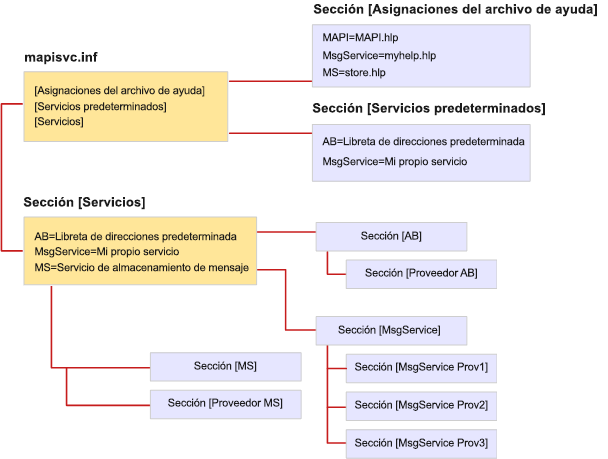

# Formato de archivo de MapiSvc.infFile format of MapiSvc.inf

**Se aplica a**: Outlook 2013 | Outlook 2016**Applies to**: Outlook 2013 | Outlook 2016 
  
El archivo MapiSvc.inf actúa como la base de datos central para la información de configuración del servicio de mensajes MAPI.The MapiSvc.inf file acts as the central database for MAPI message service configuration information. MapiSvc.inf contiene información sobre cada uno de los servicios de mensajes instalados en la estación de trabajo, información sobre los proveedores de servicios que pertenecen a cada servicio de mensajes e información sobre el subsistema MAPI.MapiSvc.inf contains information about each of the message services installed on the workstation, information about the service providers that belong to each message service, and information about the MAPI subsystem. MapiSvc.inf es la fuente principal de información de los perfiles.MapiSvc.inf is the primary source of information for profiles. Es decir, cuando se está creando un perfil nuevo o se está modificando un perfil existente, la información relevante para cada servicio de mensajes o proveedor de servicios se copia de MapiSvc.inf.That is, when a new profile is being built or an existing one modified, relevant information for each message service or service provider is copied from MapiSvc.inf. 
  
MapiSvc.inf está dividido en secciones jerárquicas vinculadas:MapiSvc.inf is divided into linked hierarchical sections:
  
1. Sección que contiene información que se aplica a todos los perfiles.Section containing information that applies to all profiles. Esta sección cuenta con tres partes:This section has three parts:
    
   - La sección **[Servicios]** proporciona vínculos a cada una de las secciones de servicio de mensajes siguiente.**[Services]** section, providing links to each of the subsequent message service sections. 
    
   - La sección **[Asignaciones de archivos de ayuda]** contiene información sobre los archivos .HLP proporcionados por los servicios del mensajes.**[Help File Mappings]** section, containing information about .HLP files provided by message services. 
    
   - La sección **[Servicios predeterminados]** lista los servicios de mensajes que forman una instalación predeterminada.**[Default Services]** section, listing message services that make up a default installation. 
    
2. Sección que contiene información que se aplica a servicios de mensajes individuales.Section containing information that applies to individual message services. Las entradas de estas secciones proporcionan vínculos a secciones del proveedor de servicios siguientes.Entries in these sections provide links to subsequent service provider sections.
    
3. Sección que contiene información que se aplica a los proveedores de servicios individuales en un servicio de mensajes.Section containing information that applies to individual service providers in a message service.
    
La ilustración siguiente muestra la organización de un archivo MapiSvc.inf típico.The following illustration shows the organization of a typical MapiSvc.inf file. Hay tres servicios de mensajes: AB, MsgService y MS.There are three message services: AB, MsgService, and MS. El nombre en el lado derecho del signo igual de cada servicio de mensajes es el nombre para mostrar del servicio.The name on the right hand side of the equal sign for each message service is the service's display name. Cada servicio de mensajes tiene su propia sección en otra ubicación del archivo que se vincula a una o varias secciones del proveedor de servicios.Each message service has its own section elsewhere in the file that is linked to one or more service provider sections. Hay una sección del proveedor de servicios para cada proveedor que pertenece al servicio de mensajes.There is one service provider section for every service provider that belongs to the message service. Los servicios de mensaje AB y MS son servicios de proveedor único mientras que tres proveedores de servicios pertenecen al servicio MsgService.The AB and MS message services are single provider services whereas three service providers belong to the MsgService service.
  
**Organización de archivos MapiSvc.inf****MapiSvc.inf file organization**
  

  
MAPI proporciona una versión de la estructura del archivo MapiSvc.inf que contiene las entradas de subsistema MAPI.MAPI provides a skeletal version of the MapiSvc.inf file that contains the entries for the MAPI subsystem. El implementador de servicios de cada mensaje agrega entradas adecuadas para el servicio y para los proveedores de servicios que pertenecen al mismo.Each message service implementer adds entries that are appropriate both for their service and the service providers that belong to their service. Algunas entradas son necesarias, otras son opcionales.Some of the entries are required while others are optional. Por ejemplo, MAPI requiere que especifique el nombre y la ruta de cada uno de los proveedores de servicios en el servicio de mensajes.For example, MAPI requires that you specify the name and path of each of the service providers in your message service. Sin esta información, no se puede cargarlos.Without this information, they cannot be loaded.
  
Puede agregar información necesaria y opcional en la sección del servicio de mensajes o en las secciones del proveedor de servicios.You can add required and optional information in either the section for your message service and/or to the service provider sections. El lugar donde coloque la información que describe su servicio de mensajes depende de la cantidad de proveedores de servicios en el servicio.Where you put the information describing your message service depends on the number of service providers in the service. Como esta información se aplica a cada proveedor del servicio, es necesario que sea accesible para todos los proveedores.Because this information applies to each service provider in the service, you must make it accessible to all providers. Almacénela en la sección de servicio de mensajes, la opción recomendada, o en todas las secciones del proveedor de servicios.Store it either in the message service section, the preferred option, or in all of the service provider sections. Almacene la información una vez para evitar la replicación innecesaria ni necesidad de mantener varias copias sincronizadas.Store information once to avoid unnecessary replication and the need to keep multiple copies synchronized.
  
Si el servicio de mensajes es un servicio de proveedor único, almacene toda la información del servicio de mensajes en la sección del proveedor de servicios en lugar de la sección del servicio.If your message service is a single provider service, store all of the message service information in the section for the service provider rather than in the section for the service. Acceder a la sección del proveedor de servicios es más rápido y directo que acceder a la sección de servicio de mensajes.Accessing the service provider section is faster and more direct than accessing the message service section. 
  
Almacene únicamente los datos de configuración públicos en el archivo MapiSvc.inf.Store only public configuration data in the MapiSvc.inf file. Información privada o que requiere protección adicional, como contraseñas u otras credenciales, no debe incluirse en el archivo.Information that is private or requires extra protection, such as passwords or other credentials, should not be included in this file. En su lugar, opte por no almacenar del todo información de este tipo o guárdela en el perfil como propiedades seguras.Instead, opt either not to store information of this type at all or keep it in the profile as secure properties. Propiedades seguras tienen características de protección integradas como cifrado.Secure properties have built-in protection features such as encryption.
  

