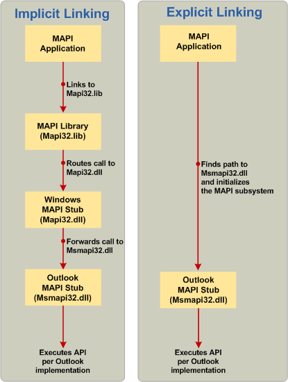

# <a name="link-to-mapi-functions"></a><span data-ttu-id="6c5a2-103">Vínculo a funciones de MAPI</span><span class="sxs-lookup"><span data-stu-id="6c5a2-103">Link to MAPI functions</span></span>

<span data-ttu-id="6c5a2-104">**Se aplica a**: Outlook 2013 | Outlook 2016</span><span class="sxs-lookup"><span data-stu-id="6c5a2-104">**Applies to**: Outlook 2013 | Outlook 2016</span></span> 
  
<span data-ttu-id="6c5a2-105">Hay tres métodos de vinculación: vinculación implícita, vinculación explícita y un nuevo modelo híbrido mediante la biblioteca de código auxiliar de MAPI.</span><span class="sxs-lookup"><span data-stu-id="6c5a2-105">There are three methods of linking: implicit linking, explicit linking, and a new hybrid model using the MAPI Stub Library.</span></span>
  
## <a name="implicit-linking"></a><span data-ttu-id="6c5a2-106">Vinculación implícita</span><span class="sxs-lookup"><span data-stu-id="6c5a2-106">Implicit linking</span></span>

<span data-ttu-id="6c5a2-107">Tradicionalmente, llamar a funciones de MAPI en una aplicación de mensajería siempre había involucrado vinculación a la biblioteca de Mapi32.lib.</span><span class="sxs-lookup"><span data-stu-id="6c5a2-107">Historically, calling MAPI functions in a messaging application always involved linking to the Mapi32.lib library.</span></span> <span data-ttu-id="6c5a2-108">Esto incluye enrutar las llamadas MAPI a la biblioteca de código auxiliar de Windows MAPI, Mapi32.dll, que, a continuación, reenvía las llamadas a la implementación del cliente MAPI predeterminada en tiempo de ejecución.</span><span class="sxs-lookup"><span data-stu-id="6c5a2-108">This included routing MAPI calls to the Windows MAPI stub library, Mapi32.dll, which then forwarded the calls to the default MAPI client implementation at run time.</span></span> <span data-ttu-id="6c5a2-109">Este proceso de llamada se conoce como la vinculación implícita.</span><span class="sxs-lookup"><span data-stu-id="6c5a2-109">This call process is known as implicit linking.</span></span> <span data-ttu-id="6c5a2-110">El lado izquierdo de la siguiente ilustración muestra un ejemplo de vinculación implícita utiliza en un proceso de llamada de función MAPI.</span><span class="sxs-lookup"><span data-stu-id="6c5a2-110">The left side of the following figure shows an example of implicit linking used in a MAPI function call process.</span></span> <span data-ttu-id="6c5a2-111">El proceso se inicia una aplicación de MAPI e implica la biblioteca MAPI (Mapi32.lib) y el código auxiliar de MAPI de Windows (Mapi32.dll) y se haya completado la implementación del cliente MAPI de Outlook del código auxiliar MAPI (Msmapi32.dll).</span><span class="sxs-lookup"><span data-stu-id="6c5a2-111">The process is initiated by a MAPI application and involves the MAPI library (Mapi32.lib) and the Windows MAPI stub (Mapi32.dll) and is completed by the Outlook MAPI client implementation of the MAPI stub (Msmapi32.dll).</span></span>
  
<span data-ttu-id="6c5a2-112">**Comparación de Vinculaciones implícitas y explícitas.**</span><span class="sxs-lookup"><span data-stu-id="6c5a2-112">**Comparison of implicit and explicit linking.**</span></span>

<span data-ttu-id="6c5a2-113">![Comparación de Vinculaciones implícitas y explícitas] (media/09d9c49a-a52d-4407-9013-d0d14c8f63f6.gif "Comparación de Vinculaciones implícitas y explícitas")</span><span class="sxs-lookup"><span data-stu-id="6c5a2-113"></span></span>
  
## <a name="explicit-linking"></a><span data-ttu-id="6c5a2-114">Vinculación explícita</span><span class="sxs-lookup"><span data-stu-id="6c5a2-114">Explicit linking</span></span>

<span data-ttu-id="6c5a2-115">Debido a que el cliente MAPI predeterminado es compatible con la instalación a petición mediante Windows Installer (MSI), puede desarrollar aplicaciones de mensajería directamente en el código auxiliar de MAPI de Outlook en lugar de usar la biblioteca MAPI y el código auxiliar de MAPI de Windows.</span><span class="sxs-lookup"><span data-stu-id="6c5a2-115">Because the default MAPI client supports on-demand installation using the Windows Installer (MSI), you can develop messaging applications directly on the Outlook MAPI stub instead of using the MAPI library and Windows MAPI stub.</span></span> <span data-ttu-id="6c5a2-116">El lado derecho de la ilustración anterior muestra un ejemplo de un proceso de llamada de función MAPI, empezando por una aplicación MAPI busca la ruta de acceso y el nombre de archivo DLL para el código auxiliar de MAPI de Outlook (paso 2 en la siguiente sección) y realizar llamadas de función en el código auxiliar de MAPI de Outlook) paso 3 en la siguiente sección).</span><span class="sxs-lookup"><span data-stu-id="6c5a2-116">The right side of the previous figure shows an example of a MAPI function call process, starting with a MAPI application looking for the path and DLL name for the Outlook MAPI stub (step 2 in the following section), and making function calls into the Outlook MAPI stub (step 3 in the following section).</span></span> <span data-ttu-id="6c5a2-117">El procedimiento siguiente muestra cómo llamar a funciones de MAPI mediante vinculación explícita.</span><span class="sxs-lookup"><span data-stu-id="6c5a2-117">The following procedure shows how to call MAPI functions by using explicit linking.</span></span> 
  
> [!NOTE]
> <span data-ttu-id="6c5a2-118">Esta información acerca de la vinculación explícita puede ser superflua para sus necesidades con la introducción de la MAPIStubLibrary.lib descrita en la sección siguiente.</span><span class="sxs-lookup"><span data-stu-id="6c5a2-118">This information about explicit linking may be superfluous to your needs with the introduction of the MAPIStubLibrary.lib discussed in the following section.</span></span> <span data-ttu-id="6c5a2-119">Al igual que el modelo implícito, la nueva biblioteca de administra todo el contenido e implementa la lógica de vinculación explícita que se carga de Outlook MAPI directamente.</span><span class="sxs-lookup"><span data-stu-id="6c5a2-119">Like the implicit model, the new library manages everything and implements the explicit linking logic that loads Outlook's MAPI directly.</span></span> 
  
<span data-ttu-id="6c5a2-120">Para obtener más información acerca de la vinculación explícita, vea vinculación de forma explícita.</span><span class="sxs-lookup"><span data-stu-id="6c5a2-120">For more information about explicit linking, see Linking Explicitly.</span></span>
  
### <a name="to-call-mapi-api-elements-without-the-mapi-library-and-the-windows-mapi-stub"></a><span data-ttu-id="6c5a2-121">Para llamar a los elementos de la API de MAPI sin la biblioteca MAPI y el código auxiliar de MAPI de Windows</span><span class="sxs-lookup"><span data-stu-id="6c5a2-121">To call MAPI API elements without the MAPI library and the Windows MAPI stub</span></span>

1. <span data-ttu-id="6c5a2-122">En el archivo de programa, cree una lista global de punteros a función para cada elemento de la API de MAPI que va a usar.</span><span class="sxs-lookup"><span data-stu-id="6c5a2-122">In your program file, create a global list of function pointers for each MAPI API element that you are using.</span></span> 
    
   <span data-ttu-id="6c5a2-123">En el ejemplo siguiente se muestra este paso.</span><span class="sxs-lookup"><span data-stu-id="6c5a2-123">The following example shows this step.</span></span>
    
   ```cpp
    //Global MAPI function pointers
    LPMAPIINITIALIZE pfnMAPIInitialize = NULL;
    LPMAPIUNINITIALIZE pfnMAPIUninitialize = NULL;
   ```

2. <span data-ttu-id="6c5a2-124">Crear una función que inicializa las funciones MAPI para vincular a la DLL de MAPI del cliente MAPI predeterminado (por ejemplo, Msmapi32.dll de Microsoft Outlook).</span><span class="sxs-lookup"><span data-stu-id="6c5a2-124">Create a function that initializes MAPI functions to link to the MAPI DLL of the default MAPI client (for example, Msmapi32.dll of Microsoft Outlook).</span></span> <span data-ttu-id="6c5a2-125">En esta función, haga lo siguiente:</span><span class="sxs-lookup"><span data-stu-id="6c5a2-125">In this function, do the following:</span></span> 
    
    1. <span data-ttu-id="6c5a2-126">Cargar mapi32.dll desde el directorio de sistema adecuado.</span><span class="sxs-lookup"><span data-stu-id="6c5a2-126">Load mapi32.dll from the appropriate system directory.</span></span> 
        
       |||
       |:-----|:-----|
       |<span data-ttu-id="6c5a2-127">x64 o x86 forma nativa</span><span class="sxs-lookup"><span data-stu-id="6c5a2-127">x64 or x86 natively</span></span>  <br/> |<span data-ttu-id="6c5a2-128">**%windir%\system32\mapi32.dll**</span><span class="sxs-lookup"><span data-stu-id="6c5a2-128">**%windir%\system32\mapi32.dll**</span></span> <br/> |
       |<span data-ttu-id="6c5a2-129">x86 en modo WoW</span><span class="sxs-lookup"><span data-stu-id="6c5a2-129">x86 on WoW mode</span></span>  <br/> |<span data-ttu-id="6c5a2-130">**%windir%\syswow64\mapi32.dll**</span><span class="sxs-lookup"><span data-stu-id="6c5a2-130">**%windir%\syswow64\mapi32.dll**</span></span> <br/> |
    
    2. <span data-ttu-id="6c5a2-131">Llame a la función [FGetComponentPath](fgetcomponentpath.md) para obtener la ruta de acceso y el nombre de archivo DLL que implementa el subsistema MAPI.</span><span class="sxs-lookup"><span data-stu-id="6c5a2-131">Call the [FGetComponentPath](fgetcomponentpath.md) function to get the path and DLL name that implements the MAPI subsystem.</span></span> <span data-ttu-id="6c5a2-132">Para obtener más información, vea [Elegir una versión específica de MAPI para carga](how-to-choose-a-specific-version-of-mapi-to-load.md).</span><span class="sxs-lookup"><span data-stu-id="6c5a2-132">For more information, see [Choose a Specific Version of MAPI to Load](how-to-choose-a-specific-version-of-mapi-to-load.md).</span></span>
        
    3. <span data-ttu-id="6c5a2-133">Cargar el archivo DLL mediante una llamada a la función LoadLibrary.</span><span class="sxs-lookup"><span data-stu-id="6c5a2-133">Load the DLL by calling the LoadLibrary function.</span></span> 
        
    4. <span data-ttu-id="6c5a2-134">Inicializar la matriz de puntero de función MAPI mediante una llamada a la función de GetProcAddress.</span><span class="sxs-lookup"><span data-stu-id="6c5a2-134">Initialize the MAPI function pointer array by calling the GetProcAddress function.</span></span> 
        
    <span data-ttu-id="6c5a2-135">El ejemplo siguiente muestra los pasos anteriores:</span><span class="sxs-lookup"><span data-stu-id="6c5a2-135">The following example shows the previous steps:</span></span>
        
   ```cpp
    void InitializeMapiFunctions()
    {
    {
        // Get the DLL path and name of the actual MAPI implementation.
        FGetComponentPath(g_szMapiComponentGUID, NULL, szMAPIDLL, MAX_PATH);
        // Load the DLL.
        hMod = LoadLibrary(szMAPIDLL);
        // Initialize MAPI functions.
        pfnMAPIInitialize = GetProcAddress(hMod, "MAPIInitialize");
        pfnMAPIUninitialize = GetProcAddress(hMod, "MAPIUninitialize");
    }
   ```

3. <span data-ttu-id="6c5a2-136">Por último, llame a la función que ha creado en el paso 2 en su aplicación de mensajería antes de realizar llamadas a los elementos de la API de MAPI.</span><span class="sxs-lookup"><span data-stu-id="6c5a2-136">Finally, call the function that you created in step 2 in your messaging application before you make calls to MAPI API elements.</span></span> 
    
   > [!CAUTION]
   > <span data-ttu-id="6c5a2-137">Debe cancelar la inicialización del subsistema MAPI antes de cerrar la aplicación.</span><span class="sxs-lookup"><span data-stu-id="6c5a2-137">You must uninitialize the MAPI subsystem before closing your application.</span></span> 
  
   <span data-ttu-id="6c5a2-138">En el ejemplo siguiente se muestra este paso:</span><span class="sxs-lookup"><span data-stu-id="6c5a2-138">The following example shows this step:</span></span> 
    
   ```cpp
    int main()
    {
        HRESULT hr;
        InitializeMapiFunctions();
        // Initialize the MAPI subsystem.
        hr = (*pfnMAPIInitialize)(NULL);
        if (hr!= S_OK)
        {
            // Handle the error case.
        }
        // Here is where you make calls to other MAPI interfaces.
        // Uninitialize the MAPI subsystem.
        (*pfnMAPIUninitialize)();
    return (0);
    }
   ```

## <a name="mapistublibrarylib"></a><span data-ttu-id="6c5a2-139">MAPIStubLibrary.lib</span><span class="sxs-lookup"><span data-stu-id="6c5a2-139">MAPIStubLibrary.lib</span></span>

<span data-ttu-id="6c5a2-140">La llegada de Microsoft Outlook 2010 y MAPI de 64 bits, ahora extender en Microsoft Outlook 2013, se requiere más que la API de 32 bits tradicional para la implementación completa.</span><span class="sxs-lookup"><span data-stu-id="6c5a2-140">The advent of Microsoft Outlook 2010 and 64-bit MAPI, now extending to the Microsoft Outlook 2013, requires more than the traditional 32-bit API for full implementation.</span></span> <span data-ttu-id="6c5a2-141">Un nuevo proyecto, la biblioteca de código auxiliar de MAPI, registrado en el sitio Web de CodePlex proporciona un reemplazo de orden para Mapi32.lib que admita la generación de aplicaciones de MAPI de 32 bits y 64 bits.</span><span class="sxs-lookup"><span data-stu-id="6c5a2-141">A new project, the MAPI Stub Library, posted on the CodePlex website provides a drop-in replacement for Mapi32.lib that supports building both 32-bit and 64-bit MAPI applications.</span></span> <span data-ttu-id="6c5a2-142">MAPIStubLibrary.lib elimina la necesidad de vincularse explícitamente a MAPI y tener creado, puede quitar Mapi32.lib de la configuración del vinculador, reemplazando con MAPIStubLibrary.lib; debe ser necesaria ninguna modificación adicional al código.</span><span class="sxs-lookup"><span data-stu-id="6c5a2-142">MAPIStubLibrary.lib eliminates the need to explicitly link to MAPI, and having built it, you can remove Mapi32.lib from your linker settings, replacing it with MAPIStubLibrary.lib; no further modifications to your code should be needed.</span></span> <span data-ttu-id="6c5a2-143">También se elimina la necesidad de escribir código **LoadLibrary**, **GetProcAddress**y **FreeLibrary** para controlar las exportaciones más reciente incluidas en este archivo de la biblioteca, pero no en Mapi32.lib, que se necesitaría si usó la vinculación explícita.</span><span class="sxs-lookup"><span data-stu-id="6c5a2-143">It also eliminates the need to write **LoadLibrary**, **GetProcAddress**, and **FreeLibrary** code to handle newer exports included in this library file but not in Mapi32.lib, which would be needed if you used explicit linking.</span></span> 
  
<span data-ttu-id="6c5a2-144">Algunas de las nuevas funciones vinculadas desde esta biblioteca que no están disponibles en Mapi32.lib incluyen lo siguiente:</span><span class="sxs-lookup"><span data-stu-id="6c5a2-144">Some of the new functions linked from this library that are not available in Mapi32.lib include the following:</span></span>
  
- [<span data-ttu-id="6c5a2-145">GetDefCachedMode</span><span class="sxs-lookup"><span data-stu-id="6c5a2-145">GetDefCachedMode</span></span>](getdefcachedmode.md)    
- [<span data-ttu-id="6c5a2-146">HrGetGALFromEmsmdbUID</span><span class="sxs-lookup"><span data-stu-id="6c5a2-146">HrGetGALFromEmsmdbUID</span></span>](hrgetgalfromemsmdbuid.md)   
- [<span data-ttu-id="6c5a2-147">HrOpenOfflineObj</span><span class="sxs-lookup"><span data-stu-id="6c5a2-147">HrOpenOfflineObj</span></span>](hropenofflineobj.md)    
- [<span data-ttu-id="6c5a2-148">MAPICrashRecovery</span><span class="sxs-lookup"><span data-stu-id="6c5a2-148">MAPICrashRecovery</span></span>](mapicrashrecovery.md)   
- [<span data-ttu-id="6c5a2-149">OpenStreamOnFileW</span><span class="sxs-lookup"><span data-stu-id="6c5a2-149">OpenStreamOnFileW</span></span>](openstreamonfilew.md)    
- [<span data-ttu-id="6c5a2-150">WrapCompressedRTFStreamEx</span><span class="sxs-lookup"><span data-stu-id="6c5a2-150">WrapCompressedRTFStreamEx</span></span>](wrapcompressedrtfstreamex.md)
    
<span data-ttu-id="6c5a2-151">Es un método alternativo de la incorporación de la biblioteca de código auxiliar de MAPI copiar los archivos de origen, MapiStubLibrary.cpp y StubUtils.cpp, directamente en el proyecto y quitar cualquier vinculaciones a Mapi32.lib y cualquier código que se vincula explícitamente a MAPI.</span><span class="sxs-lookup"><span data-stu-id="6c5a2-151">An alternate method of incorporating the MAPI Stub Library is to copy the source files, MapiStubLibrary.cpp and StubUtils.cpp, directly into your project and remove any linkage to Mapi32.lib and any code that explicitly links to MAPI.</span></span>
  
<span data-ttu-id="6c5a2-152">Para obtener acceso a los archivos de biblioteca de código auxiliar de MAPI y para obtener información acerca de cómo crear e integrarla en su proyecto, así como preguntas acerca de esta biblioteca, como cuándo y por qué usarla, consulte la [Biblioteca de código auxiliar de MAPI](http://mapistublibrary.codeplex.com/documentation) en el sitio de CodePlex.</span><span class="sxs-lookup"><span data-stu-id="6c5a2-152">To access the MAPI Stub Library files and for information about how to build and integrate it into your project, as well as questions about this library such as when and why to use it, see the [MAPI Stub Library](http://mapistublibrary.codeplex.com/documentation) on the CodePlex site.</span></span> 
  
## <a name="see-also"></a><span data-ttu-id="6c5a2-153">Recursos adicionales</span><span class="sxs-lookup"><span data-stu-id="6c5a2-153">See also</span></span>

- [<span data-ttu-id="6c5a2-154">Informaci�n general sobre programaci�n de MAPI</span><span class="sxs-lookup"><span data-stu-id="6c5a2-154">MAPI Programming Overview</span></span>](mapi-programming-overview.md)
- [<span data-ttu-id="6c5a2-155">Instalar el subsistema MAPI</span><span class="sxs-lookup"><span data-stu-id="6c5a2-155">Installing the MAPI Subsystem</span></span>](installing-the-mapi-subsystem.md)
- [<span data-ttu-id="6c5a2-156">Instalar los archivos de encabezado MAPI</span><span class="sxs-lookup"><span data-stu-id="6c5a2-156">Install MAPI Header Files</span></span>](how-to-install-mapi-header-files.md)
- [<span data-ttu-id="6c5a2-157">Elegir una versión específica de MAPI para cargar</span><span class="sxs-lookup"><span data-stu-id="6c5a2-157">Choose a Specific Version of MAPI to Load</span></span>](how-to-choose-a-specific-version-of-mapi-to-load.md)
- [<span data-ttu-id="6c5a2-158">Determinar qué método de vinculación de uso</span><span class="sxs-lookup"><span data-stu-id="6c5a2-158">Determining Which Linking Method to Use</span></span>](http://msdn.microsoft.com/en-us/library/253b8k2c.aspx)
- [<span data-ttu-id="6c5a2-159">Vincular un ejecutable a un archivo DLL</span><span class="sxs-lookup"><span data-stu-id="6c5a2-159">Linking an Executable to a DLL</span></span>](http://msdn.microsoft.com/en-us/library/9yd93633.aspx)
- [<span data-ttu-id="6c5a2-160">Configuración de las claves MSI para el archivo DLL de MAPI</span><span class="sxs-lookup"><span data-stu-id="6c5a2-160">Setting Up the MSI Keys for Your MAPI DLL</span></span>](http://msdn.microsoft.com/en-us/library/ee909494%28v=VS.85%29.aspx)

