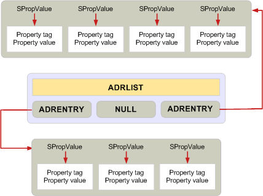

# Administración de memoria para estructuras ADRLIST y SRowSet"Managing memory for ADRLIST and SRowSet structures"

**Se aplica a**: Outlook 2013 | Outlook 2016**Applies to**: Outlook 2013 | Outlook 2016 
  
El requisito de asignar toda la memoria de un búfer siempre que sea posible con una sola llamada **MAPIAllocateBuffer** no se aplica al usar la lista de direcciones, **o ADRLIST**, y el conjunto de filas, o **SRowSet**, estructuras.The requirement to allocate all memory for a buffer whenever possible with a single **MAPIAllocateBuffer** call does not apply when using the address list, or **ADRLIST**, and row set, or **SRowSet**, structures. 
  
Estas dos estructuras son excepciones a las reglas estándar para asignar y liberar memoria.These two structures are exceptions to the standard rules for allocating and releasing memory. Contienen varios niveles de estructuras y están diseñadas para permitir que los miembros individuales se puedan agregar o quitar.They contain multiple levels of structures and are designed to enable individual members to be added or removed. Por lo tanto, cada propiedad debe ser una asignación independiente.Therefore, each property must be a separate allocation. 

Donde la mayoría de las estructuras se liberan con una llamada a **MAPIFreeBuffer**, cada entrada individual de una estructura **ADRLIST** o **SRowSet** debe liberarse con su propia llamada a **MAPIFreeBuffer** o una sola llamada a **FreeProws** o **FreePadrlist**.Where most structures are freed with one call to **MAPIFreeBuffer**, each individual entry in an **ADRLIST** or **SRowSet** structure must be freed with its own call to **MAPIFreeBuffer** or a single call to either **FreeProws** or **FreePadrlist**. Para obtener más información, vea [MAPIFreeBuffer](mapifreebuffer.md), [ADRLIST](adrlist.md)y [SRowSet](srowset.md).For more information, see [MAPIFreeBuffer](mapifreebuffer.md), [ADRLIST](adrlist.md), and [SRowSet](srowset.md). 

**FreeProws** y **FreePadrlist** son funciones proporcionadas por MAPI para simplificar la libertad de estas estructuras de datos.**FreeProws** and **FreePadrlist** are functions provided by MAPI for simplifying the freeing of these data structures. Para obtener más información, [vea FreeProws](freeprows.md) y [FreePadrlist](freepadrlist.md).For more information, see [FreeProws](freeprows.md) and [FreePadrlist](freepadrlist.md). **FreePadrlist** libera la memoria de la estructura **ADRLIST** más toda la memoria asociada para los miembros de la estructura; **FreeProws hace** lo mismo para la **estructura SRowSet.****FreePadrlist** frees the memory for the **ADRLIST** structure plus all associated memory for the structure members; **FreeProws** does the same for the **SRowSet** structure. 
  
En el diagrama siguiente se muestra el diseño de una estructura de datos **ADRLIST,** que indica las asignaciones de memoria independientes necesarias.The following diagram shows the layout of an **ADRLIST** data structure, indicating the separate memory allocations required. Los cuadros grises muestran la memoria que se puede asignar y liberar con una llamada.The gray boxes show memory that can be allocated and released with one call. 
  
**Asignación de memoria de ADRLIST****ADRLIST memory allocation**
  

  
## Vea tambiénSee also

- [Administración de memoria en MAPIManaging Memory in MAPI](managing-memory-in-mapi.md)

