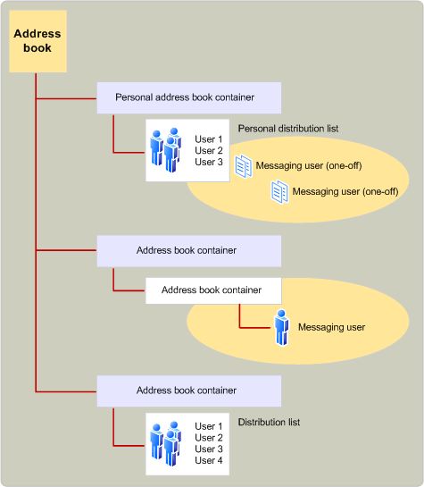

# Introducción al proveedor de libreta de direcciones MAPIMAPI address book provider overview
  
**Se aplica a**: Outlook 2013 | Outlook 2016**Applies to**: Outlook 2013 | Outlook 2016 
  
Los proveedores de la libreta de direcciones administran el acceso a la información del directorio.Address book providers handle access to directory information. La información de directorio consta de los datos para dos tipos de destinatarios de mensajes: usuarios de mensajería individuales y grupos de usuarios de mensajería que se suelen tratar juntos en listas de distribución.Directory information consists of data for two types of message recipients: individual messaging users and groups of messaging users who are commonly addressed together in distribution lists. Según el tipo de destinatario y el proveedor de la libreta de direcciones, existe una amplia variedad de información que puede estar disponible.Depending on the type of recipient and the address book provider, there is a wide range of information that can be made available. Por ejemplo, todos los proveedores de la libreta de direcciones almacenan el nombre, la dirección y el tipo de dirección de un destinatario.For example, all address book providers store a recipient's name, address, and address type.
  
Cada proveedor de la libreta de direcciones organiza estos datos mediante uno o varios contenedores.Each address book provider organizes this data by using one or more containers. El número y la estructura de los contenedores depende de la implementación del proveedor de la libreta de direcciones.The number and structure of the containers depends on the address book provider's implementation. Por ejemplo, un proveedor de la libreta de direcciones puede usar un único contenedor para contener toda la información, otro puede usar un contenedor de nivel superior que contenga subcontenedores y un tercero puede usar varios contenedores de nivel superior, cada uno de los cuales contiene subcontenedores.For example, one address book provider might use a single container to hold all of the information, another might use one top-level container that holds subcontainers, and a third might use several top-level containers, each holding subcontainers. Una jerarquía de contenedores de libretas de direcciones puede ser bastante profunda; no hay ningún límite en el número de subcontenedores que se pueden usar.An address book container hierarchy can be quite deep; there is no limit to the number of subcontainers that can be used.
  
En la siguiente ilustración se muestra una organización típica de la libreta de direcciones MAPI.The following illustration shows a typical MAPI address book organization.
  
**Organización de la libreta de direcciones****Address book organization**
  
![Organización] de la libreta de direcciones (media/amapi_04.gif "Organización") de la libreta de direcciones
  
MAPI integra toda la información proporcionada por los proveedores de libreta de direcciones instalados en una única libreta de direcciones, que presenta una vista unificada de la aplicación cliente.MAPI integrates all the information supplied by the installed address book providers into a single address book, presenting a unified view to the client application. La lista integrada muestra los contenedores de nivel superior que se muestran en cada uno de los proveedores de libreta de direcciones instalados.The integrated list shows the top-level containers displayed by each of the installed address book providers. La mayoría de los proveedores de libreta de direcciones solo exponen unos pocos contenedores (normalmente uno a tres) en el nivel superior para la inclusión en el nivel superior de la libreta de direcciones MAPI integrada.Most address book providers expose only a few containers (typically one to three) at the top level for inclusion in the top level of the MAPI integrated address book. Por ejemplo, un proveedor de libreta de direcciones podría poner a disposición "todos los usuarios" y "usuarios locales" como dos contenedores en el nivel superior.For example, an address book provider might make available "All Users" and "Local Users" as two containers at the top level.
  
Los usuarios de las aplicaciones cliente pueden ver el contenido de los contenedores de la libreta de direcciones y, en algunos casos, modificar su contenido.The users of client applications can view the contents of address book containers and, in some cases, modify the contents. Los contenedores de la libreta de direcciones se pueden crear con distintos niveles de acceso, según el proveedor de la libreta de direcciones.Address book containers can be created with different access levels, depending on the address book provider. 
  
## Vea tambiénSee also

- [Arquitectura y características de MAPIMAPI Features and Architecture](mapi-features-and-architecture.md)

