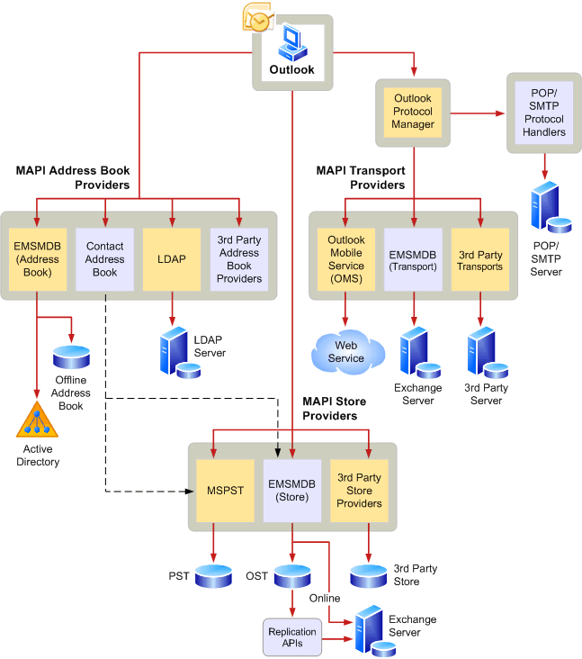

# Información general sobre la arquitectura MAPIMAPI architecture overview
 
**Se aplica a**: Outlook 2013 | Outlook 2016**Applies to**: Outlook 2013 | Outlook 2016 
  
MAPI define una arquitectura modular, tal como se muestra en la siguiente ilustración.MAPI defines a modular architecture, as shown in the following illustration.  
  
![Arquitectura de Outlook 2010] (media/amapi_43.gif "Arquitectura de Outlook 2010")
  
La aplicación de MAPI se conoce como una aplicación de cliente porque es un cliente del subsistema MAPI.The MAPI application is known as a client application because it is a client of the MAPI subsystem. Las aplicaciones basadas en mensajería emplean mensajería como una parte central de su procesamiento y ofrecen una amplia características de mensajería, como el intercambio de información de diversos tipos en diversos formatos y la capacidad para guardar y organizar la información localmente.Messaging-based applications employ messaging as a central part of their processing and offer extensive messaging features, such as the exchange of information of various types in various formats and the ability to save and organize the information locally. Correo electrónico, programación, y las aplicaciones de flujo de trabajo son ejemplos de aplicaciones basadas en mensajería.Email, scheduling, and work flow applications are examples of messaging-based applications.
  
El subsistema MAPI se compone de una interfaz de usuario comunes y las interfaces de programación.The MAPI subsystem is made up of a common user interface and the programming interfaces. La interfaz de usuario comunes es un conjunto de cuadros de diálogo que le ofrece las aplicaciones cliente de un aspecto coherente y a los usuarios una manera coherente de trabajar.The common user interface is a set of dialog boxes that gives client applications a consistent look and users a consistent way to work.
  
MAPI tiene interfaces que se usan por el subsistema MAPI, por los programadores de software de cliente y los desarrolladores de proveedor de servicio de programación.MAPI has programming interfaces that are used by the MAPI subsystem, by client software developers, and by service provider developers. La interfaz de programación de MAPI es la interfaz de programación basada en objetos principal.The MAPI programming interface is the main object-based programming interface. La interfaz de programación de MAPI es similar al modelo de objetos de OLE componente y se usa en el subsistema MAPI y las aplicaciones de cliente basadas en mensajería escritas en C o C++.The MAPI programming interface is similar to the OLE Component Object Model and is used by the MAPI subsystem and messaging-based client applications written in C or C++. 
  
Como desarrollador de software de cliente, realizar llamadas MAPI directamente a través de la interfaz de programación de MAPI.As a client software developer, you make MAPI calls directly through the MAPI programming interface. Puede implementar la mensajería con una sola interfaz de cliente MAPI o una combinación de interfaces.You can implement messaging with a single MAPI client interface or a combination of interfaces. Una sola aplicación puede realizar llamadas a métodos o funciones que pertenezcan a cualquiera de las interfaces.A single application can make calls to methods or functions belonging to any of the interfaces.
  
## Recursos adicionalesSee also

-[Arquitectura y las características MAPI](mapi-features-and-architecture.md)-[MAPI features and architecture](mapi-features-and-architecture.md)

