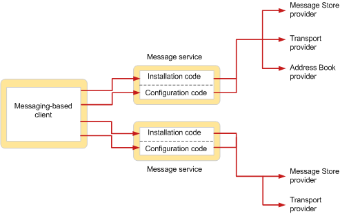

# Información general sobre el servicio de mensajes MAPIMAPI message service overview
  
**Se aplica a**: Outlook 2013 | Outlook 2016**Applies to**: Outlook 2013 | Outlook 2016 
  
Un servicio de mensajes define un grupo de proveedores de servicios relacionados, normalmente proveedores de servicios que funcionan con el mismo sistema de mensajería.A message service defines a group of related service providers, typically service providers that work with the same messaging system. Mientras que los proveedores de servicios realizan el trabajo de comunicación entre los sistemas de mensajería y el subsistema MAPI, los servicios de mensajes realizan el trabajo de interfacing entre el usuario y los proveedores de servicios que trabajan con un sistema de mensajería común.Whereas service providers perform the work of communicating between messaging systems and the MAPI subsystem, message services perform the work of interfacing between the user and service providers that work with a common messaging system.  
  
Los servicios de mensajes existen para facilitar la instalación y configuración de los proveedores de servicios a los usuarios.Message services exist to make the installation and configuration of service providers easier for users. Los usuarios nunca instalan ni configuran directamente un proveedor de servicios; El servicio de mensajes controla completamente la instalación y configuración de cada uno de los proveedores de servicios que pertenecen al servicio.Users never directly install or configure a service provider; the message service completely handles the installation and configuration of each of the service providers that belong to the service. Debido a esta característica, los usuarios no necesitan estar familiarizados con los requisitos de configuración específicos del proveedor de servicios.Because of this feature, users do not need to be familiar with specific service provider configuration requirements. 
  
En la figura siguiente se muestra la relación entre una aplicación cliente basada en mensajería y dos servicios de mensajes.The following figure shows the relationship between a messaging-based client application and two message services.
  
**Instalación y configuración de servicio de mensajes****Message service installation and configuration**
  
![Instalación y configuración del servicio de mensajes:]instalación y(media/amapi_44.gif "configuración del servicio de mensajes")
  
El usuario invoca el código de instalación de cada servicio de mensajes para agregar el servicio y sus proveedores de servicios a un perfil.The user invokes the installation code of each message service to add the service and its service providers to a profile. En uno de los servicios de mensajes que se muestran en la figura, hay tres proveedores de servicios; en el otro servicio de mensajes, hay dos proveedores de servicios.In one of the message services shown in the figure, there are three service providers; in the other message service, there are two service providers. En algún momento posterior después de que se complete la instalación, normalmente en el momento del inicio de sesión, se configuran los proveedores de servicios de cada servicio de mensajes.At some later time after installation is complete, typically at logon time, the service providers in each message service are configured. El código de configuración de cada servicio de mensajes controla la configuración de los proveedores en el servicio.The configuration code in each message service handles the configuration of the providers in the service.
  
Cuando se instala un servicio de mensajes, su programa de instalación copia los archivos necesarios del origen de instalación en el disco local del usuario y actualiza un archivo de configuración, Mapisvc.inf.When a message service is installed, its installation program copies necessary files from the installation source to the user's local disk and updates a configuration file, Mapisvc.inf. El archivo Mapisvc.inf contiene opciones de configuración para todos los servicios de mensajes y proveedores de servicios que se pueden instalar en el equipo.The Mapisvc.inf file contains configuration settings for all of the message services and service providers that can be installed on the computer. Se organiza en secciones jerárquicas, con vínculos entre cada sección en cada nivel.It is organized in hierarchical sections, with links between each section at each level. La sección del nivel superior contiene información relevante para el subsistema MAPI, como una lista de todos los servicios de mensajes disponibles y para la instalación en línea de la Ayuda.The section at the top level contains information that is relevant for the MAPI subsystem, such as a list of all available message services, and for the online Help installation. El siguiente nivel tiene secciones para cada servicio de mensajes, con información como el nombre de archivo DLL del servicio de mensajes y el nombre de su función de punto de entrada de configuración.The next level has sections for each message service, with information such as the DLL file name of the message service and the name of its configuration entry point function. El tercer nivel tiene secciones con datos de configuración para cada proveedor de servicios en el servicio de mensajes.The third level has sections with configuration data for each service provider in the message service. 
  
Para controlar la configuración, un servicio de mensajes implementa una función de punto de entrada que cumple con un prototipo definido por MAPI y un cuadro de diálogo con fichas conocido como hoja de propiedades.To handle configuration, a message service implements an entry point function that complies with a prototype defined by MAPI, and a tabbed dialog box known as a property sheet. MAPI llama a la función de punto de entrada a las solicitudes de cliente de servicio relacionadas con la administración de perfiles y la administración de proveedores de servicios en el servicio de mensajes.MAPI calls the entry point function to service client requests that relate to profile management and the management of service providers in the message service. Las hojas de propiedades se usan para ver y cambiar las propiedades de configuración del servicio de mensajes y del proveedor de servicios.Property sheets are used for viewing and changing message service and service provider configuration properties. 
  
## Consulte tambiénSee also

- [Arquitectura y características mapiMAPI Features and Architecture](mapi-features-and-architecture.md)

