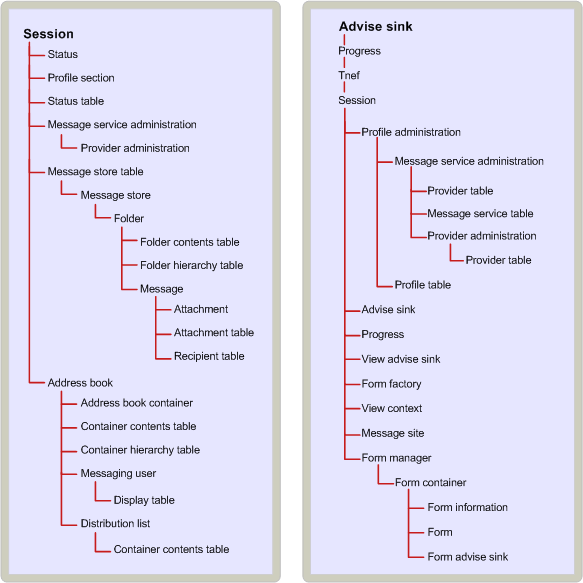

# Jerarquía de contención de objetos MAPIMAPI object containment hierarchy
  
**Hace referencia a**: Outlook**Applies to**: Outlook 
  
La relación de contención entre objetos especifica las dependencias que algunos objetos tienen en otros objetos de access.The containment relationship between objects specifies the dependencies that some objects have on other objects for access. Para una aplicación cliente, el acceso a determinados objetos habilita el acceso a otros usuarios.For a client application, access to particular objects enables access to others. En algunos casos, la relación de contención entre objetos de implementada por un proveedor de servicios sigue una jerarquía lógica.In some cases, the containment relationship between objects implemented by a service provider follows a logical hierarchy. En otros casos, es arbitrario.In other cases, it is arbitrary. 
  
Un cliente debe obtener acceso a un objeto de sesión MAPI antes de que pueden usar muchos otros objetos (por ejemplo, los proveedores de servicios y la libreta de direcciones MAPI).A client must obtain access to a MAPI session object before it can use many other objects (for example, service providers and the MAPI address book).
  
Contención de almacén de mensajes se basa en la relación jerárquica entre los objetos en el almacén de mensajes: el almacén de mensajes de objetos propio, carpetas, mensajes y datos adjuntos.Message store containment is based on the hierarchical relationship between objects in the message store: the message store object itself, folders, messages, and attachments. Como es lógico, los datos adjuntos están contenidos en los mensajes, los mensajes en carpetas y carpetas en el almacén de mensajes.Logically, attachments are contained in messages, messages in folders, and folders in the message store. La relación de contención coincide con esta jerarquía lógica.The containment relationship matches this logical hierarchy. Para obtener acceso a un mensaje, por ejemplo, un cliente debe tener acceso a la carpeta que contiene el mensaje.To gain access to a message, for example, a client must first access the folder in which the message is contained. Perfiles y objetos de estado son ejemplos de una relación de contención más arbitrario.Profiles and status objects are examples of a more arbitrary containment relationship. Estos dos objetos están disponibles a través de la sesión.Both of these objects are available through the session. 
  
Con algunos objetos, los contenedores proporcionan el acceso de solo.With some objects, containers provide the only access. Los datos adjuntos y los destinatarios son ejemplos de objetos que son totalmente dependientes en sus contenedores.Attachments and recipients are examples of objects that are totally dependent on their containers. Es el único acceso a un archivo adjunto o un destinatario a través del mensaje a la que pertenece.The only access to an attachment or a recipient is through the message to which it belongs. Otros objetos tienen las rutas de acceso alternativas.Other objects have alternate access paths. Estos objetos se asignan identificadores binarios, conocidos como los identificadores de entrada, por los proveedores de servicios que crean.These objects are assigned binary identifiers, known as entry identifiers, by the service providers that create them. Identificadores de entrada se pueden utilizar para tener acceso a sus objetos directamente, habilitar los clientes omitir el árbol de la contención.Entry identifiers can be used to access their objects directly, enabling clients to bypass the containment tree. 
  
En la siguiente ilustración muestra la jerarquía de contención de MAPI.The following illustration shows the MAPI containment hierarchy. La sesión está en la parte superior del árbol de porque es que un cliente obtiene acceso a todos los demás objetos a través de la sesión.The session is at the top of the tree because it is through the session that a client gains access to all other objects. El siguiente nivel incluye la tabla de almacenamiento de mensajes, un objeto table que se enumera las propiedades para todos los proveedores de almacén de mensajes en la sesión actual y para proporcionar acceso a todos los proveedores de la libreta de direcciones de la libreta de direcciones.The next level includes the message store table, a table object that lists properties for all of the message store providers in the current session, and the address book to supply access to all of the address book providers. La libreta de direcciones y tabla de almacén de mensajes se utilizan para tener acceso a los objetos que implementan los proveedores de servicio en particular, se muestra a continuación, en orden de contención.The message store table and address book are used to access the objects implemented by particular service providers, shown next, in containment order.
  
**Jerarquía de contención de MAPI****MAPI containment hierarchy**
  
![Jerarquía de contención de MAPI] (media/amapi_41.gif "Jerarquía de contención de MAPI")
  
## Vea tambiénSee also

- [Objeto MAPI e Introducción a la interfazMAPI Object and Interface Overview](mapi-object-and-interface-overview.md)

