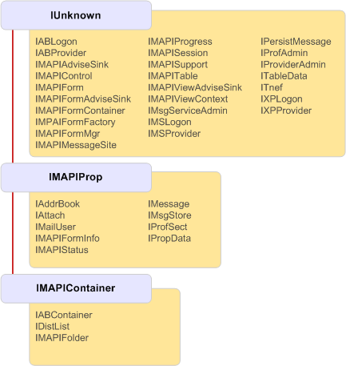

# Jerarquía de herencia de objetos MAPIMAPI object inheritance hierarchy

**Se aplica a**: Outlook 2013 | Outlook 2016**Applies to**: Outlook 2013 | Outlook 2016 
  
Todas las interfaces implementadas por objetos MAPI se heredan de [IUnknown](http://msdn.microsoft.com/library/33f1d79a-33fc-4ce5-a372-e08bda378332%28Office.15%29.aspx), la interfaz OLE que permite a los objetos para comunicarse.All interfaces implemented by MAPI objects ultimately inherit from [IUnknown](http://msdn.microsoft.com/library/33f1d79a-33fc-4ce5-a372-e08bda378332%28Office.15%29.aspx), the OLE interface that enables objects to communicate. La mayoría de las interfaces heredan directamente de **IUnknown**, pero algunas heredan de una de las otras dos interfaces bases: [IMAPIProp: IUnknown](imapipropiunknown.md) o [IMAPIContainer: IMAPIProp](imapicontainerimapiprop.md).Most interfaces directly inherit from **IUnknown**, but some inherit from one of two other base interfaces: [IMAPIProp : IUnknown](imapipropiunknown.md) or [IMAPIContainer : IMAPIProp](imapicontainerimapiprop.md). En la siguiente ilustración muestra la jerarquía de herencia completa de MAPI.The following illustration shows the complete inheritance hierarchy in MAPI.
  
**Jerarquía de herencia de MAPI****MAPI inheritance hierarchy**
  
![Jerarquía de herencia de MAPI] (media/amapi_06.gif "Jerarquía de herencia de MAPI")
  
## Recursos adicionalesSee also

- [IMAPIProp : IUnknownIMAPIProp : IUnknown](imapipropiunknown.md) 
- [IMAPIContainer : IMAPIPropIMAPIContainer : IMAPIProp](imapicontainerimapiprop.md)
- [Objeto MAPI e Introducción a la interfazMAPI Object and Interface Overview](mapi-object-and-interface-overview.md)

