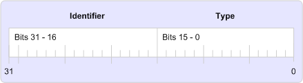

# Etiquetas de propiedad MAPIMAPI property tags
  
**Se aplica a**: Outlook 2013 | Outlook 2016**Applies to**: Outlook 2013 | Outlook 2016 
  
Una etiqueta de propiedad es un número de 32 bits que contiene un identificador de propiedad único en los bits 16 a 31 y un tipo de propiedad en bits del 0 al 15, como se muestra en la siguiente ilustración.A property tag is a 32-bit number that contains a unique property identifier in bits 16 through 31 and a property type in bits 0 through 15 as shown in the following illustration. 
  
**Elementos de etiqueta de propiedad****Property tag elements**
  
![Elementos de etiqueta de propiedad Elementos]de etiqueta de(media/amapi_10.gif "propiedad")
  
Las etiquetas de propiedad se usan para identificar propiedades MAPI y cada propiedad debe tener una, independientemente de si la propiedad está definida por MAPI, un cliente o un proveedor de servicios.Property tags are used to identify MAPI properties and every property must have one, regardless of whether the property is defined by MAPI, a client, or a service provider. MAPI define un conjunto de constantes de etiqueta de propiedad para sus propiedades en el archivo de encabezado Mapitags.h; Estas propiedades se denominan "propiedades definidas por MAPI".MAPI defines a set of property tag constants for its properties in the Mapitags.h header file; these properties are referred to as the "MAPI-defined properties". 
  
Las constantes de etiqueta de propiedad siguen una convención de nomenclatura para mantener la coherencia y la facilidad de uso.The property tag constants follow a naming convention for consistency and ease of use. Hay dos partes en el nombre de cada etiqueta de propiedad: un prefijo PR_ y una o más cadenas de caracteres que describen el contenido de la propiedad.There are two parts to the name of each property tag: a PR_ prefix and one or more character strings that describe the contents of the property. Las cadenas de varios caracteres están separadas por caracteres de subrayado.Multiple character strings are separated by underscores. Por ejemplo, la etiqueta de propiedad para el tipo de dirección de un destinatario de mensaje es **PR \_ ADDRTYPE** ([PidTagOrgAddrtype](https://msdn.microsoft.com/library/d40b5707-e4d5-4746-88d4-8616a3789789%28Office.15%29.aspx)) y el identificador de entrada de la carpeta designada para recibir una copia de cada mensaje saliente es **PR_IPM_SENTMAIL_ENTRYID** ([PidTagIpmSentMailEntryId](pidtagipmsentmailentryid-canonical-property.md)).For example, the property tag for the address type of a message recipient is **PR\_ADDRTYPE** ([PidTagOrgAddrtype](https://msdn.microsoft.com/library/d40b5707-e4d5-4746-88d4-8616a3789789%28Office.15%29.aspx)) and the entry identifier for the folder designated to receive a copy of every outbound message is **PR_IPM_SENTMAIL_ENTRYID** ([PidTagIpmSentMailEntryId](pidtagipmsentmailentryid-canonical-property.md)).
  
Hay algunas macros disponibles para ayudar a trabajar con etiquetas de propiedad, entre ellas [PROP_TYPE,](prop_type.md) [PROP_ID](prop_id.md)y [PROP_TAG](prop_tag.md).A few macros are available to help work with property tags, among them [PROP_TYPE](prop_type.md), [PROP_ID](prop_id.md), and [PROP_TAG](prop_tag.md). **PROP \_ TYPE** extrae el tipo de propiedad de la etiqueta de propiedad; **PROP \_ Id.** extrae el identificador.**PROP\_TYPE** extracts the property type from the property tag; **PROP\_ID** extracts the identifier. **PROP_TAG** genera una etiqueta de propiedad a partir de un identificador y un tipo de propiedad.**PROP_TAG** builds a property tag from a property type and identifier. 
  
## Vea tambiénSee also

- [Información general sobre MAPI (propiedad)MAPI Property Overview](mapi-property-overview.md)

