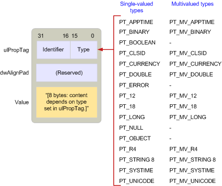

# Información general sobre el tipo de propiedad MAPIMAPI property type overview
  
**Hace referencia a**: Outlook 2013 | Outlook 2016**Applies to**: Outlook 2013 | Outlook 2016 
  
Los tipos de propiedad son constantes definidas por MAPI en el MAPIDEFS. H que indica el tipo de datos subyacentes de un valor de propiedad.Property types are constants defined by MAPI in the MAPIDEFS.H header file that indicate the underlying data type of a property value. Todas las propiedades, ya sean definidas por MAPI, por aplicaciones cliente o por proveedores de servicios, usan uno de estos tipos.All properties, whether they are defined by MAPI, by client applications, or by service providers, use one of these types. 
  
Los tipos de propiedad siguen una Convención de nomenclatura similar a la que se usa para las etiquetas de propiedad.Property types follow a similar naming convention to the one used for property tags. Muchos tipos de propiedad tienen una versión de valor único y de varios valores.Many property types have both a single-value and multiple-value version. Las propiedades con valor único contienen un valor de su tipo como un único número entero o una cadena de caracteres.Single valued properties contain one value of its type such as a single integer or character string. La constante usada para representar una propiedad de valor único tiene dos partes: el prefijo PT_ y una cadena que describe el tipo real, como LONG o STRING8.The constant used to represent a single value property has two parts: the prefix PT_ and a string describing the actual type, such as LONG or STRING8. 
  
Las propiedades de varios valores contienen más de un valor de su tipo.Multiple-value properties contain more than one value of its type. A diferencia de las matrices Variant de OLE, todos los valores de una propiedad con varios valores son del mismo tipo.Unlike OLE variant arrays, every value in a multivalued property is of the same type. La constante utilizada para representar propiedades multivalor se crea combinando la marca MV_FLAG con la constante de valor único correspondiente que representa el tipo base.The constant used to represent multivalued properties is created by combining the MV_FLAG flag with the corresponding single value constant representing the base type. Hay tres partes: el prefijo PT_ seguido de MV_ seguido de una cadena que describe el tipo.There are three parts: the prefix PT_ followed by MV_ followed by a string that describes the type. Por ejemplo, el tipo de una propiedad que contiene varios enteros es PT_MV_LONG y para varias cadenas de caracteres es PT_MV_STRING8.For example, the type for a property containing multiple integers is PT_MV_LONG and for multiple character strings is PT_MV_STRING8.
  
En la siguiente ilustración se muestra la estructura de una estructura [SPropValue](spropvalue.md) para describir un entero de varios valores, una propiedad de tipo PT_MV_LONG.The following illustration shows the structure of an [SPropValue](spropvalue.md) structure to describe a multiple-value integer, a property of type PT_MV_LONG. El miembro **Value** se expande para incluir un recuento del número de valores enteros en la propiedad y un puntero a una matriz de esos valores.The **Value** member is expanded to include a count of the number of integer values in the property and a pointer to an array of those values. 
  
**Propiedades multivalor****Multiple-value properties**
  
![Propiedades de varios valores] (media/amapi_12.gif "Propiedades de varios valores")
  
Aunque la compatibilidad con propiedades de varios valores es opcional, MAPI recomienda que los clientes y los proveedores de servicios admitan ambos tipos de propiedades, ya que esto permite una mayor interacción entre los componentes compatibles con MAPI.Although support for multiple-value properties is optional, MAPI recommends that clients and service providers support both types of properties because doing so enables greater interaction between MAPI-compliant components.
  
En la siguiente ilustración se enumeran todas las constantes de tipo de propiedad diferentes, donde se muestra dónde se almacenan en una estructura **SPropValue** .The following illustration lists all of the different property type constants, showing where they are stored in an **SPropValue** structure. El tamaño del miembro de **valor** depende del tipo en particular.The size of the **Value** member is dependent on the particular type. Observe que no todos los tipos de valor único tienen equivalentes de varios valores.Notice that not all of the single-value types have multiple-value equivalents. 
  
**Constantes de tipo de propiedad****Property type constants**
  
![Constantes de tipo de propiedad] (media/amapi_11.gif "Constantes de tipo de propiedad")
  
Los clientes y los proveedores de servicios que trabajan con una propiedad deben seguir dos pasos:Clients and service providers working with a property need to follow two steps:
  
1. Determinar si la propiedad está disponible o no disponible.Determine if the property is available or unavailable.
    
2. Si está disponible, recupere el valor de la propiedad.If available, retrieve the property's value.
    
A veces, un proveedor de clientes o servicios solo necesita comprobar la existencia de una propiedad; otras veces es necesario comprobar un valor específico.Sometimes a client or service provider need only check for the existence of a property; other times it is necessary to check for a specific value. Por ejemplo, los proveedores de transporte tienen tres cursos distintos de acción para procesar la propiedad **\_PR SEND_RICH_INFO** ([PidTagSendRichInfo](pidtagsendrichinfo-canonical-property.md)), un valor booleano que indica si un mensaje debe o no transmitirse con texto con formato.For example, transport providers have three different courses of action for processing the **PR\_SEND_RICH_INFO** ([PidTagSendRichInfo](pidtagsendrichinfo-canonical-property.md)) property, a Boolean value that indicates whether or not a message should be transmitted with formatted text. Si el valor de **PR\_SEND_RICH_INFO** está establecido en true, el proveedor de transporte transmite el texto con formato.If **PR\_SEND_RICH_INFO** is set to TRUE, the transport provider transmits the formatted text. Si se establece en FALSE, el texto con formato se descarta antes de la transmisión.If it is set to FALSE, the formatted text is discarded before transmission. Si **PR_SEND_RICH_INFO** no está disponible, el proveedor de transporte sigue su curso de acción predeterminado, cualquiera que sea para el proveedor en particular.If **PR_SEND_RICH_INFO** is unavailable, the transport provider follows its default course of action, whatever that is for the particular provider. 
  
MAPI define un tipo de propiedad especial, PT_UNSPECIFIED, que un cliente o proveedor de servicios puede usar para recuperar una propiedad cuando se desconoce el tipo de propiedad. Para recuperar una propiedad sin conocer con antelación su tipo, un proveedor de servicios o cliente llama al método [IMAPIProp:: GetProps](imapiprop-getprops.md) del objeto y pasa una etiqueta de propiedad formada por el identificador de la propiedad y el tipo de propiedad PT_UNSPECIFIED.MAPI defines a special property type, PT_UNSPECIFIED, that a client or service provider can use to retrieve a property when the property type is unknown.To retrieve a property without advance knowledge of its type, a client or service provider calls an object's [IMAPIProp::GetProps](imapiprop-getprops.md) method and passes a property tag made up of the property's identifier and the PT_UNSPECIFIED property type. **GetProps** devuelve una estructura [SPropValue](spropvalue.md) para la propiedad, reemplazando PT_UNSPECIFIED por el tipo adecuado.**GetProps** returns an [SPropValue](spropvalue.md) structure for the property, replacing PT_UNSPECIFIED with the appropriate type. Los proveedores de servicios que implementan **GetProps** son necesarios para admitir PT_UNSPECIFIED.Service providers implementing **GetProps** are required to support PT_UNSPECIFIED. 
  
Algunos objetos MAPI admiten propiedades que son en sí mismos objetos.Some MAPI objects support properties that are themselves objects. Las propiedades del objeto tienen el tipo PT Object.Object properties have the type PT_OBJECT. En lugar de usar **IMAPIProp:: GetProps** para tener acceso a estas propiedades, los clientes y los proveedores de servicios suelen ser el método [IMAPIProp:: OpenProperty](imapiprop-openproperty.md) , especificando la interfaz adecuada para Access o un método en el objeto. admite la propiedad.Instead of using **IMAPIProp::GetProps** to access these properties, clients and service providers typically user either the [IMAPIProp::OpenProperty](imapiprop-openproperty.md) method, specifying the appropriate interface for access, or a method on the object supporting the property. 
  
Dado que el acceso al valor de una propiedad de objeto implica el uso de una de las interfaces del objeto, **GetProps** es inadecuado.Because accessing the value of an object property involves using one of the interfaces for the object, **GetProps** is inappropriate. Con **GetProps**, el autor de la llamada tiene acceso al valor de una propiedad a través de una estructura **SPropValue** .With **GetProps**, the caller accesses a property's value through an **SPropValue** structure. Con **IMAPIProp:: OpenProperty**, el autor de la llamada recupera un puntero a una interfaz que puede tener acceso al objeto.With **IMAPIProp::OpenProperty**, the caller retrieves a pointer to an interface that can access the object. **OpenProperty** siempre puede usarse para recuperar una propiedad de objeto.**OpenProperty** can always be used to retrieve an object property. La otra opción, llamar a un método en el objeto, no está disponible con todas las propiedades de objeto.The other option, calling a method on the object, is not available with every object property. 
  
Por ejemplo, cada carpeta admite dos tablas, una tabla de jerarquía y una tabla de contenido.For example, every folder supports two tables, a hierarchy table and a contents table. Estas tablas son propiedades de la carpeta; sus etiquetas de propiedad son **PR_CONTAINER_HIERARCHY** ([PidTagContainerHierarchy](pidtagcontainerhierarchy-canonical-property.md)) y **PR_CONTAINER_CONTENTS** ([PidTagContainerContents](pidtagcontainercontents-canonical-property.md)).These tables are properties of the folder; their property tags are **PR_CONTAINER_HIERARCHY** ([PidTagContainerHierarchy](pidtagcontainerhierarchy-canonical-property.md)) and **PR_CONTAINER_CONTENTS** ([PidTagContainerContents](pidtagcontainercontents-canonical-property.md)). Las tablas son objetos que requieren la interfaz **IMAPITable** para tener acceso.Tables are objects that require the **IMAPITable** interface for access. Un cliente puede llamar al método [IMAPIContainer:: GetHierarchyTable](imapicontainer-gethierarchytable.md) de la carpeta para obtener acceso a la tabla de jerarquías, el método [IMAPIContainer:: GetContentsTable](imapicontainer-getcontentstable.md) de la carpeta para tener acceso a la tabla de contenido o el IMAPIProp de la carpeta [:: OpenProperty ](imapiprop-openproperty.md)método para obtener acceso a cualquiera de las tablas.A client can call the folder's [IMAPIContainer::GetHierarchyTable](imapicontainer-gethierarchytable.md) method to access the hierarchy table, the folder's [IMAPIContainer::GetContentsTable](imapicontainer-getcontentstable.md) method to access the contents table, or the folder's [IMAPIProp::OpenProperty](imapiprop-openproperty.md) method to access either table. Para llamar a **OpenProperty**, un cliente pasa la etiqueta de propiedad de la propiedad como el primer parámetro y un identificador de interfaz para la interfaz que se va a usar para el acceso como segundo parámetro.To call **OpenProperty**, a client passes the property tag for the property as the first parameter and an interface identifier for the interface to be used for access as the second parameter. Estos parámetros serían **PR_CONTAINER_HIERARCHY** o **PR_CONTAINER_CONTENTS** y **IID_IMAPITable**.These parameters would be **PR_CONTAINER_HIERARCHY** or **PR_CONTAINER_CONTENTS** and **IID_IMAPITable**.
  
Para obtener una lista completa de los tipos de propiedad de valor único y de varios valores, vea [tipos de propiedades](property-types.md).For a complete list of the single-value and multiple-value property types, see [Property Types](property-types.md). 
  
## Vea tambiénSee also

- [Información general sobre MAPI (propiedad)MAPI Property Overview](mapi-property-overview.md)

