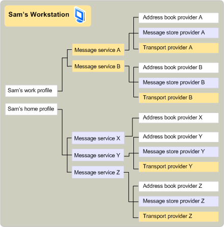

# Perfiles y servicios de mensajeríaMessage services and profiles
  
**Se aplica a**: Outlook 2013 | Outlook 2016**Applies to**: Outlook 2013 | Outlook 2016 
  
Algunos usuarios requieren los servicios de varios sistemas de mensajería, cada uno con uno o más proveedores de servicios.Some users require the services of several messaging systems, each with one or more service providers. Dado que es engorroso instalar y configurar cada uno de estos proveedores de servicios individualmente, y dado que un servidor de mensajería normalmente requiere que un grupo de proveedores relacionados exponga todas sus funciones, MAPI incluye el concepto de servicio de mensajes.Because it is cumbersome to install and configure each of these service providers individually, and because a messaging server usually requires a group of related providers to expose all its functionality, MAPI includes the concept of a message service. Los servicios de mensajes ayudan a los usuarios a instalar y configurar sus proveedores de servicios.Message services help users install and configure their service providers.
  
Para crear un servicio de mensajes, un desarrollador escribe un programa de punto de entrada de servicio de mensajes para controlar la configuración de cada proveedor en el servicio y un programa de instalación para hacer lo siguiente:To create a message service, a developer writes a message-service entry point program to handle the configuration of each provider in the service and a setup program to do the following:
  
- Instale cada proveedor en el servicio.Install each provider in the service.
    
- Cree entradas del registro y del archivo de inicialización.Create registry and initialization file entries.
    
- Cree entradas en el archivo de configuración MAPI, Mapisvc.inf.Create entries in the MAPI configuration file, Mapisvc.inf.
    
El archivo Mapisvc.inf contiene información relacionada con la configuración de todos los servicios de mensajes y proveedores de servicios instalados en el equipo.The Mapisvc.inf file contains information that relates to the configuration of all message services and service providers installed on the computer. Se organiza en secciones jerárquicas, con cada nivel vinculado al siguiente.It is organized in hierarchical sections, with each level linked to the next. En la parte superior hay tres secciones que contienen lo siguiente:At the top are three sections that contain the following: 
  
- Una lista de archivos de ayuda del servicio de mensajes.A list of message service Help files.
    
- Una lista de los servicios de mensajes más importantes o predeterminados.A list of the most important, or default, message services.
    
- Una lista de todos los servicios del equipo.A list of all the services on the computer.
    
El siguiente nivel contiene secciones para cada servicio de mensajes y el último nivel contiene secciones para cada proveedor de servicios de un servicio.The next level contains sections for each message service, and the last level contains sections for each service provider in a service. MAPI requiere que los programadores de proveedores de servicios y servicios de mensajes agreguen ciertas entradas a Mapisvc.inf; los desarrolladores pueden agregar otras entradas a su propia discreción.MAPI requires that developers of service providers and message services add certain entries to Mapisvc.inf; developers can add other entries at their own discretion. La mayor parte de la información de Mapisvc.inf termina en uno o más perfiles, una colección de información de configuración para el conjunto preferido de servicios de mensajes de un usuario.Most of the information in Mapisvc.inf ends up in one or more profiles, a collection of configuration information for a user's preferred set of message services. Dado que un equipo puede tener varios usuarios y un solo usuario puede tener varios conjuntos de preferencias, pueden existir muchos perfiles en un equipo.Because a computer can have multiple users and a single user can have multiple sets of preferences, many profiles can exist on a computer. Cada perfil describe un conjunto diferente de servicios de mensajes.Each profile describes a different set of message services. Tener varios perfiles permite a un usuario trabajar, por ejemplo, en casa con un conjunto de servicios de mensajes y en la oficina con un conjunto diferente.Having multiple profiles enables a user to work, for example, at home with one set of message services and at the office with a different set.
  
Los perfiles se crean en la instalación del servicio de mensajes o en la hora de inicio de sesión por parte de una aplicación cliente que proporciona compatibilidad con la configuración.Profiles are created at message service installation or logon time by a client application that provides configuration support. MAPI proporciona dos aplicaciones cliente de este tipo: un elemento del Panel de control y el Asistente para perfiles.MAPI provides two such client applications: a Control Panel item and the Profile Wizard. El elemento panel de control es una aplicación de configuración de servicio completo con la que los usuarios pueden crear, eliminar, editar y copiar perfiles, así como realizar modificaciones en las entradas de un perfil.The Control Panel item is a full-service configuration application with which users can create, delete, edit, and copy profiles, as well as make modifications to the entries in a profile. El Asistente para perfiles es una aplicación sencilla diseñada para que agregar un servicio de mensajes a un perfil sea lo más fácil posible.The Profile Wizard is a simple application designed to make adding a message service to a profile as easy as possible. El Asistente para perfiles consta de una serie de cuadros de diálogo, denominados páginas de propiedades, que preguntan al usuario durante el proceso de instalación y configuración de un servicio.The Profile Wizard consists of a series of dialog boxes, called property pages, that prompt the user through the process of installing and configuring a service. Al usuario solo se le piden valores para la configuración más crítica; todas las demás opciones heredan los valores predeterminados.The user is prompted only for values for the most critical settings; all other settings inherit default values. Una vez creado el perfil, los usuarios no pueden realizar cambios.Once the profile has been created, users are not allowed to make changes. 
  
Mientras que el elemento panel de control siempre se invoca a través del Panel de control, hay una variedad de escenarios que pueden hacer que se llame al Asistente para perfiles.Whereas the Control Panel item is always invoked through the Control Panel, there are a variety of scenarios that can cause the Profile Wizard to be called. Las aplicaciones cliente pueden llamar al Asistente para perfiles para crear un perfil predeterminado en el momento del inicio de sesión cuando aún no se haya creado uno.Client applications can call the Profile Wizard to create a default profile at logon time when one has not yet been created. En lugar de volver a implementar código para agregar un perfil, el elemento del Panel de control u otra aplicación cliente puede confiar en la funcionalidad que ya se encuentra en el Asistente para perfiles.Rather than reimplementing code to add a profile, the Control Panel item or another client application can rely on the functionality already in the Profile Wizard. Un servicio de mensajes, en su función de punto de entrada, puede llamar al Asistente para perfiles cuando el servicio necesita agregarse al perfil predeterminado.A message service, in its entry point function, can call the Profile Wizard when the service needs to be added to the default profile. Los servicios de mensajes que usan el Asistente para perfiles deben escribir una función de punto de entrada adicional y un procedimiento Windows cuadro de diálogo estándar.Message services that use the Profile Wizard must write an extra entry point function and a standard Windows dialog box procedure. El Asistente para perfiles llama a la función de punto de entrada para recuperar el cuadro de diálogo de configuración del servicio mientras el procedimiento del cuadro de diálogo controla los mensajes que se generan cuando se usa este cuadro de diálogo.The Profile Wizard calls the entry point function to retrieve the service's configuration dialog box while the dialog box procedure handles the messages that are generated when this dialog box is in use. 
  
Los perfiles se organizan de forma similar al archivo Mapisvc.inf.Profiles are organized in a similar way to the Mapisvc.inf file. Los perfiles tienen secciones jerárquicas vinculadas; Los proveedores de servicios poseen secciones en el nivel más bajo, los servicios de mensajes poseen secciones en el nivel medio y MAPI posee secciones en el nivel más alto.Profiles have linked hierarchical sections; service providers own sections in the lowest level, message services own sections in the middle level, and MAPI owns sections in the highest level. Cada sección se identifica con un identificador único conocido como [MAPIUID](mapiuid.md).Each section is identified with a unique identifier known as a [MAPIUID](mapiuid.md). Las secciones MAPI contienen información interna de MAPI, como los identificadores de todas las secciones de perfil de servicio de mensajes y vínculos a cada una de las otras secciones.The MAPI sections contain information internal to MAPI, such as the identifiers of all of the message service profile sections and links to each of the other sections. Cada sección de servicio de mensajes almacena vínculos a sus secciones de proveedor y cada sección de proveedor almacena un vínculo a su sección de servicio.Each message service section stores links to its provider sections, and each provider section stores a link to its service section. 
  
En la siguiente ilustración se muestra el contenido de dos perfiles típicos.The following illustration shows the contents of two typical profiles. Sam tiene dos perfiles en su equipo, uno para uso en casa y otro para uso de office.Sam has two profiles on his computer, one for home use and one for office use. El perfil principal contiene tres servicios de mensajes.The home profile contains three message services. Message Service X es un servicio de proveedor único para la administración de libreta de direcciones.Message Service X is a single provider service for address book management. Message Services Y y Z tienen tres proveedores: un proveedor de libreta de direcciones, un proveedor de almacén de mensajes y un proveedor de transporte.Message Services Y and Z have three providers — an address book provider, a message store provider, and a transport provider. El perfil de trabajo de Sam contiene dos servicios de mensajes diferentes, cada uno de los cuales tiene un proveedor de libreta de direcciones, un proveedor de almacén de mensajes y un proveedor de transporte.Sam's Work Profile contains two different message services, each of which has an address book provider, a message store provider, and a transport provider. 
  
**Ejemplo de perfil****Profile example**
  

  
En la siguiente ilustración se muestra un perfil que incluye dos servicios de mensajes.The following illustration shows a profile that includes two message services. El código para instalar y configurar los proveedores de servicios que pertenecen al servicio de mensajes reside en la misma DLL que el código de los proveedores.The code for installing and configuring the service providers that belong to the message service resides in the same DLL as the code for the providers. Este código lee información del perfil en el momento del inicio de sesión para configurar los proveedores de servicios y solicita al usuario, si es posible y necesario, que falte información.This code reads information from the profile at logon time to configure the service providers, and it prompts the user, if possible and necessary, for missing information. Este código común también controla las solicitudes de un cliente para ver o cambiar las opciones de configuración de cualquiera de los proveedores.Requests from a client to view or change configuration settings for any of the providers are also handled by this common code.
  
**Instalación y configuración de proveedores de servicio****Installing and configuring service providers**
  
![Instalación y configuración de proveedores de servicios]Instalación y configuración de proveedores de(media/amapi_55.gif "servicios")
  
## Vea tambiénSee also

- [MAPIUIDMAPIUID](mapiuid.md)
- [Información general sobre programación de MAPIMAPI Programming Overview](mapi-programming-overview.md)

