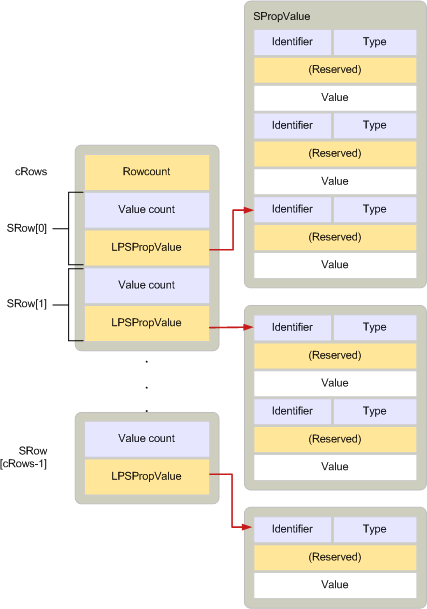

# <a name="srow"></a>SRow

**Se aplica a**: Outlook 2013 | Outlook 2016 
  
Describe una fila de una tabla que contiene las propiedades seleccionadas para un objeto específico. 
  
|||
|:-----|:-----|
|Archivo de encabezado:  <br/> |Mapidefs.h  <br/> |
   
```cpp
typedef struct _SRow
{
  ULONG ulAdrEntryPad;
  ULONG cValues;
  LPSPropValue lpProps;
} SRow, FAR *LPSRow;

```

## <a name="members"></a>Miembros

**ulAdrEntryPad**
  
> Rellenar bytes para alinear correctamente los valores de propiedad a los que apunta el **miembro lpProps.** 
    
**cValues**
  
> Recuento de valores de propiedad a los que **apunta lpProps**. 
    
**lpProps**
  
> Puntero a una matriz de [estructuras SPropValue](spropvalue.md) que describen los valores de propiedad de las columnas de la fila. 
    
## <a name="remarks"></a>Comentarios

Una **estructura SRow** describe una fila de una tabla. Se incluye en la estructura de [TABLE_NOTIFICATION](table_notification.md) que acompaña a una notificación de tabla. 
  
**Las estructuras SRow** se usan en los métodos siguientes: 
  
- [IAddrBook::GetSearchPath](iaddrbook-getsearchpath.md)
    
- [IAddrBook::SetSearchPath](iaddrbook-setsearchpath.md)
    
- [IMAPITable::QueryRows](imapitable-queryrows.md)
    
- [IMAPITable::ExpandRow](imapitable-expandrow.md)
    
- [ITableData : IUnknown](itabledataiunknown.md) (muchos métodos) 
    
- [FBadRowSet](fbadrowset.md)
    
- [FreeProws](freeprows.md)
    
- [HrQueryAllRows](hrqueryallrows.md)
    
Cuando es necesario describir más de una fila, se usa una estructura [SRowSet.](srowset.md) Una **estructura SRowSet** contiene una matriz de **estructuras SRow** y un recuento de estructuras en la matriz. 
  
En la siguiente ilustración se muestra la relación entre una estructura de datos **SRow** y una estructura de datos **SRowSet.** 
  
**Relación entre SRow y SRowSet**
  

  
**Las estructuras SRow** se definen igual que las [estructuras ADRENTRY.](adrentry.md) Por lo tanto, una fila de una tabla de destinatarios y una entrada de una lista de direcciones se pueden tratar igual. 
  
Para obtener información acerca de cómo se debe asignar la memoria para las estructuras **SRow,** vea [Managing Memory for ADRLIST and SRowSet Structures](managing-memory-for-adrlist-and-srowset-structures.md).
  
## <a name="see-also"></a>Consulte también

- [ADRENTRY](adrentry.md)
- [SPropValue](spropvalue.md)
- [SRowSet](srowset.md)
- [TABLE_NOTIFICATION](table_notification.md)
- [Estructuras MAPI](mapi-structures.md)
- [Administración de memoria para estructuras ADRLIST y SRowSet](managing-memory-for-adrlist-and-srowset-structures.md)

