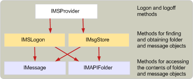

# Estructura de los proveedores de almacenamiento de mensajesStructure of message store providers
  
**Se aplica a**: Outlook 2013 | Outlook 2016**Applies to**: Outlook 2013 | Outlook 2016 
  
Un proveedor de almacenamiento de mensajes, cuando se está ejecutando en la memoria, es una interfaz [IMSProvider: IUnknown](imsprovideriunknown.md) .A message store provider, when it is running in memory, is an [IMSProvider : IUnknown](imsprovideriunknown.md) interface. La interfaz **IMSProvider** permite a las aplicaciones cliente y a la cola MAPI iniciar y cerrar sesión en el almacén de mensajes.The **IMSProvider** interface allows client applications and the MAPI spooler to log on to and off of the message store. Las interfaces que utilizan las aplicaciones cliente y la cola MAPI para tener acceso a las carpetas y los mensajes del almacén de mensajes son [IMSLogon](imslogoniunknown.md) y [IMsgStore](imsgstoreimapiprop.md) .The interfaces that client applications and the MAPI spooler use to access folders and messages in the message store are [IMSLogon](imslogoniunknown.md) and [IMsgStore](imsgstoreimapiprop.md) interfaces. Estas interfaces se crean normalmente cuando el almacén de mensajes inicia sesión por primera vez en, aunque el punto de entrada [MSProviderInit](msproviderinit.md) de la dll del almacén de mensajes también podría crearlas.These interfaces are typically created when the message store is first logged on to, although the [MSProviderInit](msproviderinit.md) entry point of the message store DLL could also create them. 
  
Como las interfaces **IMSLogon** y **IMsgStore** comparten algunos métodos, es posible que sea más fácil crear un objeto de clase que herede de ambas interfaces.Because the **IMSLogon** and **IMsgStore** interfaces share some methods, it may be easier to create one class object that inherits from both of these interfaces. También puede implementar estas interfaces en objetos independientes y escribir funciones auxiliares internas a la DLL que implementan los métodos compartidos a los que se puede llamar desde los métodos de las interfaces **IMSLogon** y **IMsgStore** .You can also implement these interfaces in separate objects, and write helper functions internal to your DLL that implement the shared methods that can then be called from the methods in the **IMSLogon** and **IMsgStore** interfaces. 
  
En la siguiente ilustración se muestra un esquema de alto nivel de la jerarquía de objetos dentro de un almacén de mensajes en ejecución.The following illustration shows a high-level outline of the object hierarchy within a running message store.
  
**Jerarquía de objetos del almacén de mensajes****Message store object hierarchy**
  
![Jerarquía de objetos del almacén de mensajes] (media/storeobj.gif "Jerarquía de objetos del almacén de mensajes")
  
## Vea tambiénSee also

- [Desarrollar un proveedor de almacén de mensajes MAPIDeveloping a MAPI Message Store Provider](developing-a-mapi-message-store-provider.md)

