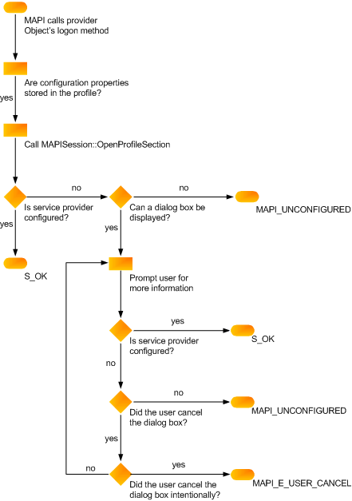

# Comprobar la configuración del proveedor de serviciosVerifying service provider configuration
  
**Se aplica a**: Outlook 2013 | Outlook 2016**Applies to**: Outlook 2013 | Outlook 2016 
  
El método de inicio de sesión ([IABProvider::Logon](iabprovider-logon.md), [IMSProvider::Logon](imsprovider-logon.md)o [IXPProvider::TransportLogon](ixpprovider-transportlogon.md)) debe comprobar la configuración del proveedor.Your logon method ([IABProvider::Logon](iabprovider-logon.md), [IMSProvider::Logon](imsprovider-logon.md), or [IXPProvider::TransportLogon](ixpprovider-transportlogon.md)) must verify your provider's configuration. Esto implica comprobar que todas las propiedades necesarias para el funcionamiento completo estén establecidas correctamente.This involves checking that all of the properties needed for full operation are set correctly. Cada proveedor requiere un número diferente de propiedades; depende del proveedor y del grado de interacción del usuario que permitas.Every provider requires a different number of properties; configuration depends on your provider and the degree of user interaction you allow. Algunos proveedores de servicios mantienen todas las propiedades necesarias en el perfil.Some service providers keep all of the necessary properties in the profile. 

Otros proveedores de servicios mantienen un conjunto parcial de propiedades en el perfil y solicitan al usuario los valores que faltan.Other service providers keep a partial set of properties in the profile and prompt the user for missing values. Aún así, otros proveedores no almacenan propiedades en el perfil, y dependen del usuario para proporcionar toda la información necesaria para la configuración.Still other providers do not store properties in the profile at all, relying on the user to supply all of the information needed for configuration.
  
### Para recuperar propiedades almacenadas en el perfilTo retrieve properties stored in the profile
  
1. Llame [a IMAPISupport::OpenProfileSection](imapisupport-openprofilesection.md)y pase [el MAPIUID](mapiuid.md) del proveedor como parámetro de entrada.Call [IMAPISupport::OpenProfileSection](imapisupport-openprofilesection.md), passing the [MAPIUID](mapiuid.md) of your provider as an input parameter. 
    
2. Llame a los métodos [IMAPIProp::GetProps](imapiprop-getprops.md) o [IMAPIProp::GetPropList](imapiprop-getproplist.md) de la sección de perfil para recuperar propiedades individuales o una lista de propiedades.Call the profile section's [IMAPIProp::GetProps](imapiprop-getprops.md) or [IMAPIProp::GetPropList](imapiprop-getproplist.md) methods to retrieve individual properties or a property list. 
    
### Para establecer propiedades a partir de la información del usuarioTo set properties from user information
  
Mostrar una hoja de propiedades, si MAPI no ha establecido una marca que prohíba la presentación.Display a property sheet, if MAPI has not set a flag prohibiting the display. Las siguientes marcas indican que no se puede presentar una interfaz de usuario.The following flags indicate that a user interface cannot be presented.
  
|**Flag****Flag**|**Proveedor de servicios****Service provider**|
|:-----|:-----|
|AB_NO_DIALOGAB_NO_DIALOG    |Proveedor de libreta de direccionesAddress book provider    |
|LOGON_NO_DIALOGLOGON_NO_DIALOG    |Proveedor de transporteTransport provider    |
|MDB_NO_DIALOGMDB_NO_DIALOG    |Proveedor de almacenamiento de mensajesMessage store provider    |
   
Si el proveedor no almacena todas sus propiedades de configuración en el perfil, lo que requiere la interacción del usuario y MAPI pasa una de las marcas de supresión del cuadro de diálogo al método de inicio de sesión, MAPI_E_UNCONFIGURED.If your provider does not store all of its configuration properties in the profile, requiring user interaction, and MAPI passes one of the dialog box suppression flags to your logon method, return MAPI_E_UNCONFIGURED. Devuelve también este error cuando no se establece la marca de supresión de cuadros de diálogo, pero el usuario no proporciona toda la información necesaria.Also return this error when the dialog suppression flag is not set, but the user does not supply all of the required information.
  
Cuando el proveedor de servicios no puede iniciar sesión con MAPI_E_UNCONFIGURED, MAPI vuelve a llamar a la función de punto de entrada.When your service provider fails its logon method with MAPI_E_UNCONFIGURED, MAPI calls your entry point function again. Si la información no se puede localizar con la segunda llamada, la sesión podría finalizar, en función de la importancia que tenga el proveedor de servicios.If the information cannot be located with the second call, the session might terminate, depending on how important your service provider is. 
  
En la siguiente ilustración se muestra la lógica necesaria para la configuración en el método de inicio de sesión del proveedor de servicios.The following illustration shows the logic required for configuration in your service provider logon method. 
  
**Diagrama de flujo de comprobación de configuración****Configuration verification flowchart**
  

  
## Consulte tambiénSee also

- [Implementación del inicio de sesión del proveedor de serviciosImplementing Service Provider Logon](implementing-service-provider-logon.md)

