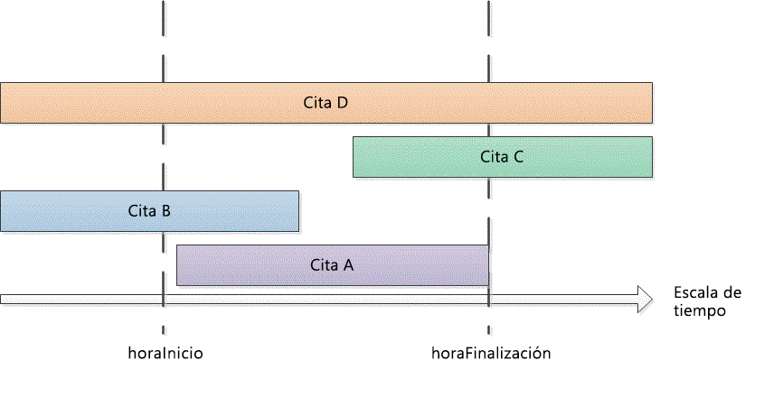

# <a name="search-and-obtain-appointments-in-a-time-range"></a>Buscar y obtener citas de un intervalo de tiempo

En este ejemplo se devuelven citas de un intervalo de tiempo específico del calendario predeterminado de Microsoft Outlook.

## <a name="example"></a>Ejemplo

Este ejemplo de código contiene dos métodos: DemoAppointmentsInRange y GetAppointmentsInRange. DemoAppointmentsInRange obtiene el calendario predeterminado del perfil de Outlook que haya iniciado sesión en ese momento, establece un intervalo de fechas de 5 días desde las 12:00 A. M. de hoy, llama a GetAppointmentsInRange para obtener las citas que se encuentren en ese intervalo de tiempo, y muestra el asunto y la hora de inicio de cada una de las citas devueltas.

GetAppointmentsInRange acepta una carpeta de Outlook y los valores de inicio y finalización de **DateTime** del intervalo de tiempo como parámetros de entrada. Este método usa el método [Restrict(String)](https://msdn.microsoft.com/library/bb612531\(v=office.15\)) y un filtro de cadena en formato Jet que devuelve las citas que empiezan y finalizan en ese intervalo de tiempo especificado. Suponiendo que \[Start\] y \[End\] son la hora de inicio y la hora de finalización de una cita, y startTime y endTime son la hora de inicio o finalización del intervalo de tiempo especificado, GetAppointmentsInRange configura un filtro que busca citas con `[Start]>=startTime` y `[End]<=endTime`. El código siguiente muestra el filtro Jet en C\#.

```csharp
string filter = "[Start] >= '"
    + startTime.ToString("g")
    + "' AND [End] <= '"
    + endTime.ToString("g") + "'";
```

Antes de llamar al método **Items.Restrict** para buscar citas, GetAppointmentsInRange hace otras dos cosas para incluir las citas periódicas que se producen en el intervalo de tiempo especificado:

- Establece la propiedad [IncludeRecurrences](https://msdn.microsoft.com/library/bb646522\(v=office.15\)) de la colección [Items](https://msdn.microsoft.com/library/bb645287\(v=office.15\)).

- Ordena los elementos de cita en la carpeta de calendario determinada por la propiedad [Start](https://msdn.microsoft.com/library/bb647263\(v=office.15\)).

De manera alternativa, si también está interesado en las citas que se superponen parcialmente o por completo con el intervalo de tiempo especificado, debe especificar un filtro diferente para devolver otros tipos de citas (como se muestra en la figura 1):

- Citas que comienzan y finalizan en el intervalo de tiempo especificado (por ejemplo, cita A):<br/><br/>`[Start]>=startTime and [End]<=endTime`

- Citas que comienzan antes del intervalo de tiempo especificado, pero finalizan en el intervalo de tiempo especificado (por ejemplo, cita B):<br/><br/>`[Start]<startTime and [End]<=endTime`

- Citas que comienzan en el intervalo de tiempo especificado, pero finalizan después del intervalo de tiempo especificado (por ejemplo, cita C):<br/><br/>`[Start]>=startTime and [End]>endTime`

- Citas que comienzan antes del intervalo de tiempo especificado y finalizan después del intervalo de tiempo especificado (por ejemplo, cita D):<br/><br/>`[Start]<startTime and [End]>endTime`

**Figura 1. Tipos de citas que se producen en un intervalo de tiempo o se superponen con ese intervalo de tiempo**


 

Como en cualquier intervalo de tiempo `startTime<=endTime`, un filtro con `[Start]<=endTime` y `[End]>=startTime` capturaría los tipos de citas anteriores en ese intervalo de tiempo.

En C\#, puede expresar el filtro Jet de la manera siguiente.

```csharp
string filter = "[Start] <= '"
    + endTime.ToString("g")
    + "' AND [End] >= '"
    + startTime.ToString("g") + "'";
```

El siguiente código muestra el ejemplo completo. Si usa Visual Studio para probar este ejemplo de código, primero debe agregar una referencia al componente de la biblioteca de objetos de Microsoft Outlook 15.0 y especificar la variable de Outlook al importar el espacio de nombres **Microsoft.Office.Interop.Outlook**. La instrucción **Imports** o **using** no debe producirse directamente antes de las funciones en el ejemplo de código, pero deben agregarse antes de la declaración de clase pública. La siguiente línea de código muestra cómo llevar a cabo la importación y la asignación en Visual Basic y C\#.

```vb
Imports Outlook = Microsoft.Office.Interop.Outlook
```


```csharp
using Outlook = Microsoft.Office.Interop.Outlook;
```


```csharp
private void DemoAppointmentsInRange()
{
    Outlook.Folder calFolder =
        Application.Session.GetDefaultFolder(
        Outlook.OlDefaultFolders.olFolderCalendar)
        as Outlook.Folder;
    DateTime start = DateTime.Now;
    DateTime end = start.AddDays(5);
    Outlook.Items rangeAppts = GetAppointmentsInRange(calFolder, start, end);
    if (rangeAppts != null)
    {
        foreach (Outlook.AppointmentItem appt in rangeAppts)
        {
            Debug.WriteLine("Subject: " + appt.Subject 
                + " Start: " + appt.Start.ToString("g"));
        }
    }
}

/// <summary>
/// Get recurring appointments in date range.
/// </summary>
/// <param name="folder"></param>
/// <param name="startTime"></param>
/// <param name="endTime"></param>
/// <returns>Outlook.Items</returns>
private Outlook.Items GetAppointmentsInRange(
    Outlook.Folder folder, DateTime startTime, DateTime endTime)
{
    string filter = "[Start] >= '"
        + startTime.ToString("g")
        + "' AND [End] <= '"
        + endTime.ToString("g") + "'";
    Debug.WriteLine(filter);
    try
    {
        Outlook.Items calItems = folder.Items;
        calItems.IncludeRecurrences = true;
        calItems.Sort("[Start]", Type.Missing);
        Outlook.Items restrictItems = calItems.Restrict(filter);
        if (restrictItems.Count > 0)
        {
            return restrictItems;
        }
        else
        {
            return null;
        }
    }
    catch { return null; }
}
```

## <a name="see-also"></a>Vea también

- [Buscar y filtrar](search-and-filter.md)

