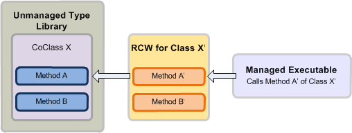

# Introducción a la interoperabilidad entre COM y .NETIntroduction to interoperability between COM and .NET

El desarrollo de .NET y del modelo de objetos componentes (COM) tienen sistemas y mecanismos muy diferentes para la administración de la duración de objeto, la creación de la interfaz y la herencia de la interfaz.The Component Object Model (COM) and .NET development have vastly different type systems and mechanisms for object lifetime management, interface creation, and interface inheritance. 

Por ejemplo, un tipo **Variant** en COM es un tipo de datos **System.Object** en .NET Framework.For example, a **Variant** type in COM is a **System.Object** data type in the .NET Framework. Para crear un objeto, un cliente COM llama a [CoCreateInstance](https://docs.microsoft.com/windows/desktop/api/combaseapi/nf-combaseapi-cocreateinstance), mientras que un cliente administrado puede usar palabras clave como nuevo o Nuevo que están integradas en un lenguaje de programación administrado.To create an object, a COM client calls [CoCreateInstance](https://docs.microsoft.com/windows/desktop/api/combaseapi/nf-combaseapi-cocreateinstance), whereas a managed client can use keywords such as new or New that are built in to a managed programming language. 

Mientras que COM no admite la herencia clásica y un cliente COM administra un número de referencia interna proporcionado por [IUnknown](https://docs.microsoft.com/windows/desktop/api/unknwn/nn-unknwn-iunknown) para liberar una coclase, un cliente administrado depende del recolector de elementos no utilizados de Common Language Runtime (CLR) proporcionado por .NET Framework para liberar un objeto.While COM does not support classical inheritance and a COM client manages an internal reference count provided by [IUnknown](https://docs.microsoft.com/windows/desktop/api/unknwn/nn-unknwn-iunknown) to free a coclass, a managed client relies on the common language runtime (CLR) garbage collector provided by the .NET Framework to free an object. 

Teniendo en cuenta estas diferencias entre el desarrollo de COM y .NET, desarrollar un cliente administrado en un modelo de objetos COM requiere un mecanismo que solucione estas diferencias.Given such differences between COM and .NET development, developing a managed client on a COM object model requires a mechanism that resolves these differences. El contenedor invocable en tiempo de ejecución (RCW) es un mecanismo que fomenta la comunicación transparente entre COM y el modelo de programación administrado.The Runtime Callable Wrapper (RCW) is a mechanism that promotes transparent communication between COM and the managed programming model.

Este tema proporciona una descripción avanzada de cómo el RCW facilita la comunicación entre COM y el modelo de programación administrado.This topic gives a high-level description of how the RCW facilitates communication between COM and the managed programming model. Tenga en cuenta que aunque este tema usa Visual Studio para ilustrar el mecanismo RCW, puede usar un ensamblado de interoperabilidad fuera de Visual Studio para desarrollar un cliente administrado.Note that even though this topic uses Visual Studio to illustrate the RCW mechanism, you can use an interop assembly outside of Visual Studio to develop a managed client.

## Facilitar la interoperabilidad: el ensamblado de interoperabilidad y RCWFacilitating interoperability: the Interop Assembly and RCW

### Tiempo de compilaciónCompile time

Un ensamblado de interoperabilidad define interfaces administradas que se asignan a una biblioteca de tipos basada en COM y con las que un cliente administrado puede interactuar.An interop assembly defines managed interfaces that map to a COM-based type library and that a managed client can interact with. Para usar un ensamblado de interoperabilidad en Visual Studio, primero agregue una referencia al componente COM correspondiente.To use an interop assembly in Visual Studio, first add a reference to the corresponding COM component. Visual Studio genera automáticamente una copia local del ensamblado de interoperabilidad.Visual Studio will automatically generate a local copy of the interop assembly. El ensamblado de interoperabilidad contiene un espacio de nombres, en el que hay una interfaz administrada equivalente de cada objeto COM en el modelo de objetos COM.The interop assembly contains one namespace, under which there is a managed equivalent interface of each COM object in the COM object model. 

La figura 1 muestra un cliente administrado que desea usar una biblioteca de tipos COM que define la coclase X. El cliente administrado llama a la clase X, que es la interfaz administrada equivalente para coclase X, según se define en el ensamblado de interoperabilidad.Figure 1 illustrates a managed client that wants to use a COM type library that defines coclass X. The managed client calls class X, which is the managed equivalent interface for coclass X, as defined in the interop assembly. En el momento de compilación, se compila el proyecto administrado con información acerca de la clase X del ensamblado de interoperabilidad.At compile time, the managed project is compiled with information about class X from the interop assembly.

**Figura 1. Una aplicación administrada con un ensamblado de interoperabilidad que interopera una biblioteca de tipos no administrada****Figure 1. A managed application compiled with an interop assembly that interoperates with an unmanaged type library**

  
En general, siempre que establezca una referencia a una biblioteca de tipos, Visual Studio generará una copia de un ensamblado de interoperabilidad para esa biblioteca de tipos. Puede existir cualquier cantidad de ensamblados de interoperabilidad para describir el mismo tipo de COM. Sin embargo, una biblioteca de tipos puede tener solo un ensamblado de interoperabilidad primario (PIA), que es el ensamblado de interoperabilidad publicado por la biblioteca de tipos. A diferencia de otros ensamblados de interoperabilidad, el PIA no se genera cada vez que agrega una referencia en Visual Studio. En lugar de ello, debe instalar el PIA en la memoria caché global de ensamblados (GAC) una sola vez en un equipo. Cuando agrega una referencia a la biblioteca de tipos, Visual Studio carga el PIA automáticamente.In general, as long as you set a reference to a type library, Visual Studio generates a copy of an interop assembly for that type library. Any number of interop assemblies can exist to describe the same COM type. However, a type library can have only one Primary Interop Assembly (PIA), which is the interop assembly published by the type library. Unlike other interop assemblies, the PIA is not generated every time you add a reference in Visual Studio. Instead, you install the PIA to the global assembly cache (GAC) just once on a computer. When you add a reference to the type library, Visual Studio automatically loads the PIA.

Para programar una solución administrada de Outlook, debe usar Outlook PIA.To program a managed solution for Outlook, you should use the Outlook PIA. Para incorporar información de Outlook PIA en un complemento administrado, primero debe instalar Outlook PIA en la GAC.To incorporate information from the Outlook PIA into a managed add-in, first you must install the Outlook PIA in the GAC. Si usa Visual Studio para crear un proyecto administrado, después de agregar una referencia a la biblioteca de tipos de Outlook, Visual Studio carga el PIA.If you are using Visual Studio to create the managed project, after adding a reference to the Outlook type library, Visual Studio loads the PIA. En el examinador de objetos, en el espacio de nombres Microsoft.Office.Interop.Outlook, puede ver las interfaces administradas que tienen nombres correspondientes a los objetos en el modelo de objetos de Outlook.In the object browser, under the namespace Microsoft.Office.Interop.Outlook, you can see managed interfaces that have names corresponding to objects in the Outlook object model. Por ejemplo, la interfaz Account se corresponde con el objeto **Account** en el modelo de objetos de Outlook.For example, the Account interface corresponds to the **Account** object in the Outlook object model. Al compilar el proyecto administrado, esta información se incluye en el ejecutable.When you compile the managed project, this information is incorporated in your executable.

### Tiempo de ejecuciónRun time

En el momento de la ejecución, con la información proporcionada por un ensamblado de interoperabilidad, CLR de .NET Framework crea un RCW para cada coclase con la que interactúa el cliente administrado. Tenga en cuenta que el tiempo de ejecución crea solo un RCW para cada coclase, independientemente de cuántas interfaces haya obtenido el cliente de la coclase. El RCW es un tipo de clase de .NET Framework que se ajusta alrededor de la coclase de COM. El RCW realiza un seguimiento de las instancias de la coclase y libera referencias a ellas solo cuando el cliente ya no necesita el RCW. De este modo, un cliente administrado no tiene que administrar la duración de un objeto como lo haría un cliente no administrado en COM.At run time, with the information provided by an interop assembly, the .NET Framework CLR creates an RCW for each coclass the managed client interacts with. Note that the runtime creates only one RCW for each coclass, regardless of how many interfaces the client has obtained from the coclass. The RCW is a .NET Framework class type that wraps around the COM coclass. The RCW keeps track of the instances of the coclass and releases references to them only when the client no longer needs the RCW. This way, a managed client does not have to manage the lifetime of an object the way an unmanaged client would under COM.

La figura 2 ilustra un RCW que intercepta una llamada de la API de un cliente administrado en tiempo de ejecución y, mediante el uso de información del ensamblado de interoperabilidad, asigna de forma transparente la llamada a la API correspondiente en la coclase de COM. En el siguiente proceso se describe cómo se produce:Figure 2 illustrates an RCW intercepting an API call from a managed client at run time, and using information from the interop assembly, transparently mapping the call to the corresponding API in the COM coclass. The following process describes how this happens:

1.  El cliente administrado llama al método A' de la clase X' como se define en el ensamblado de interoperabilidad de una biblioteca de tipos COM.The managed client calls method A' of class X' as defined in the interop assembly for a COM type library.

2.  Si todavía no existe un RCW para la clase X', el tiempo de ejecución de Framework usa información del ensamblado de interoperabilidad y crea un RCW para la clase X'.If an RCW does not yet exist for class X', the .NET Framework runtime uses information from the interop assembly and creates an RCW for class X'.

3.  El RCW intercepta la llamada al método A', traduce los argumentos a los tipos COM correspondientes e invoca el método A de la coclase X como se define en la biblioteca de tipos COM.The RCW intercepts the call to method A', translates the arguments into corresponding COM types, and invokes method A of coclass X as defined in the COM type library.

**Figura 2. Un RCW intercepta una llamada de un ejecutable administrado y la asigna a una coclase de una biblioteca de tipos no administrados****Figure 2. An RCW intercepts a call from a managed executable and maps it to a coclass in an unmanaged type library**

  

## Vea tambiénSee also

- [Por qué usar Outlook PIAWhy use the Outlook PIA](why-use-the-outlook-pia.md)
- [Instalación del PIA de Outlook y referencia a élInstalling and referencing the Outlook PIA](installing-and-referencing-the-outlook-pia.md)

