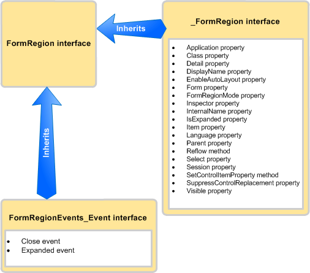

# <a name="methods-and-properties-in-the-outlook-pia"></a>Métodos y propiedades del PIA de Outlook

En este tema se describe cómo obtener acceso a los métodos y las propiedades de un objeto de código administrado usando el ensamblado de interoperabilidad primario (PIA) de Outlook.

## <a name="where-helper-objects-come-from"></a>Origen de los objetos auxiliares

Para crear el PIA, Outlook usa el importador de la biblioteca de tipos (TLBIMP) en .NET Framework para convertir definiciones de tipo de la biblioteca de tipos COM en definiciones equivalentes de un ensamblado de Common Language Runtime (CLR). En COM, un objeto es en realidad una coclase que consta de lo siguiente:

- La interfaz principal (por ejemplo, la interfaz [\_FormRegion](https://msdn.microsoft.com/library/bb645761\(v=office.15\))).

- La interfaz de eventos (por ejemplo, la interfaz [FormRegionEvents](https://msdn.microsoft.com/library/bb611940\(v=office.15\))).

TLBIMP importa la interfaz primaria y la interfaz de eventos de cada objeto y crea una cantidad de interfaces, delegados y clases, entre los que se encuentra lo siguiente:

- La interfaz de eventos .NET (por ejemplo, la interfaz [FormRegionEvents\_Event](https://msdn.microsoft.com/library/bb647619\(v=office.15\))).

- La clase .NET (por ejemplo, la clase [FormRegionClass](https://msdn.microsoft.com/library/bb624204\(v=office.15\))).

- La interfaz .NET (por ejemplo, la interfaz [FormRegion](https://msdn.microsoft.com/library/bb652633\(v=office.15\))).

## <a name="what-the-helper-objects-are-for"></a>Función de los objetos auxiliares

Continuando con el objeto **FormRegion** como ejemplo, la siguiente lista examina lo que contiene cada interfaz y clase enumeradas anteriormente.

- La interfaz \_FormRegion define todos los métodos y propiedades de FormRegion. Salvo en un caso que se describe más adelante, esta interfaz no suele usarse en el código.

- La interfaz **FormRegionEvents** define métodos que se asignan a eventos de FormRegion. Esta interfaz no se usa en el código.

- TLBIMP procesa aún más la interfaz **FormRegionEvents** para crear la interfaz **FormRegionEvents**\_Event que define todos los eventos de FormRegion. Salvo en un caso que se describe más adelante, esta interfaz no suele usarse en el código.

- La clase FormRegionClass define todos los miembros de eventos, propiedades y métodos de FormRegion. Ésta es la clase a la que se atribuye la interfaz FormRegion para asociarla en segundo plano, de modo que puede escribir un código para crear una instancia de la interfaz FormRegion. Sin embargo, esta interfaz no se usa directamente en código.

- La interfaz FormRegion hereda la interfaz \_FormRegion y la interfaz **FormRegionEvents**\_Event. La figura 1 ilustra esta relación de herencia.
    
  **Figura 1. La interfaz FormRegion hereda métodos y propiedades de la interfaz \_FormRegion y eventos de la interfaz FormRegionEvents\_Event**

  
    
  Generalmente, FormRegion es la única interfaz que se usa en código administrado para obtener acceso al objeto y a los miembros de eventos, propiedades y métodos del objeto **FormRegion**.

Usando el objeto **Application** como otro ejemplo, debe acceder al objeto **Application** y a sus métodos, propiedades y eventos a través de la interfaz [Application](https://msdn.microsoft.com/library/bb646615\(v=office.15\)). Sin embargo, hay tres excepciones en las que debe usar una interfaz diferente, o según el idioma, podría ser conveniente que usase una interfaz diferente:

- Al acceder a un método que comparte el mismo nombre que un evento, es recomendable realizar la conversión a la interfaz principal para llamar al método. Por ejemplo, el objeto **Application** tiene un método [Quit](https://msdn.microsoft.com/library/bb646614\(v=office.15\)) y un evento [Quit](https://msdn.microsoft.com/library/bb622595\(v=office.15\)). En Visual Basic. NET, puede obtener acceso al método Quit a través de la interfaz Application. C\#, puede evitar una advertencia de compilador convirtiendo el método Quit a la interfaz principal tal como se muestra en el ejemplo siguiente:
    
   ```csharp
      void DemoApp()
      {
          Outlook.Application myApp = new Outlook.Application();
          // Other application code here
          ((Outlook._Application)myApp).Quit();
      }
   ```

- Al obtener acceso a un evento que comparte el mismo nombre que un método de ese objeto, debe realizar la conversión a la interfaz de eventos adecuada para conectarse al evento. De manera similar al ejemplo anterior, para conectarse al evento [Quit\_, debe realizar la conversión a la interfaz ApplicationEvents\_11](https://msdn.microsoft.com/library/bb622725\(v=office.15\))Event.

- Al conectarse a una versión anterior de un evento que se ha ampliado posteriormente en una versión posterior de Outlook, debe conectarse a la versión del evento de la interfaz anterior. Por ejemplo, si quiere conectarse a la versión del evento Quit del objeto **Application** implementado para Outlook 2002 en lugar de a la última versión, conéctese al evento [Quit](https://msdn.microsoft.com/library/bb609660\(v=office.15\)) definido en la interfaz [ApplicationEvents\_10\_Event](https://msdn.microsoft.com/library/bb610098\(v=office.15\)), en lugar de al evento Quit definido en la interfaz ApplicationEvents\_11\_Event.

## <a name="see-also"></a>Vea también

- [Relación del PIA de Outlook con el modelo de objetos](relating-the-outlook-pia-with-the-object-model.md)
- [Objetos del PIA de Outlook](objects-in-the-outlook-pia.md)
- [Eventos del PIA de Outlook](events-in-the-outlook-pia.md)

