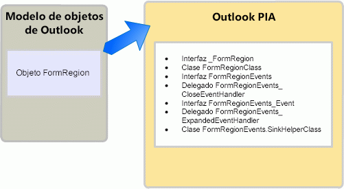

# <a name="objects-in-the-outlook-pia"></a><span data-ttu-id="5d4b8-102">Objetos de Outlook PIA</span><span class="sxs-lookup"><span data-stu-id="5d4b8-102">Objects in the Outlook PIA</span></span>

<span data-ttu-id="5d4b8-103">Al explorar el ensamblado de interoperabilidad primario de Outlook (PIA) en un explorador de objetos, es posible que observe que muchas interfaces y clases tienen nombres que hacen referencia a objetos familiares en el modelo de objetos de Outlook.</span><span class="sxs-lookup"><span data-stu-id="5d4b8-103">When browsing the Outlook Primary Interop Assembly (PIA) in an object browser, you may notice that many interfaces and classes have names referencing familiar objects in the Outlook object model.</span></span> <span data-ttu-id="5d4b8-104">Algunos objetos del modelo de objetos tienen una correspondencia de uno a uno con las interfaces en el PIA.</span><span class="sxs-lookup"><span data-stu-id="5d4b8-104">Some objects in the object model have a one-to-one mapping to interfaces in the PIA.</span></span> 

<span data-ttu-id="5d4b8-105">Por ejemplo, el objeto **AddressEntry** está asignado a la interfaz [AddressEntry](https://msdn.microsoft.com/library/bb609728\(v=office.15\)) y el objeto **AddressList** está asignado a la interfaz [AddressList](https://msdn.microsoft.com/library/bb623538\(v=office.15\)) en el PIA.</span><span class="sxs-lookup"><span data-stu-id="5d4b8-105">For example, the **AddressEntry** is mapped to the [AddressEntry](https://msdn.microsoft.com/library/bb609728\(v=office.15\)) interface and the **AddressList** object is mapped to the [AddressList](https://msdn.microsoft.com/library/bb623538\(v=office.15\)) interface in the PIA.</span></span> 

<span data-ttu-id="5d4b8-106">Sin embargo, la mayoría de los demás objetos tienen una asignación de uno a varios en el PIA.</span><span class="sxs-lookup"><span data-stu-id="5d4b8-106">However, most other objects have a one-to-many mapping in the PIA.</span></span> <span data-ttu-id="5d4b8-107">Esta asignación de uno a varios se aplica a algunos de los objetos que existían antes de Microsoft Office Outlook 2007 y a todos los objetos añadidos después de Outlook 2007.</span><span class="sxs-lookup"><span data-stu-id="5d4b8-107">This one-to-many mapping applies to some objects that existed before Microsoft Office Outlook 2007, and all objects added since Outlook 2007.</span></span> <span data-ttu-id="5d4b8-108">En este tema se describen los delegados, clases e interfaces .NET típicos que se asignan a un objeto COM y describe cómo obtener acceso a un objeto en el PIA de Outlook.</span><span class="sxs-lookup"><span data-stu-id="5d4b8-108">This topic lists the typical .NET interfaces, classes, and delegates that are mapped to a COM object and describes how to access an object in the Outlook PIA.</span></span> <span data-ttu-id="5d4b8-109">También se describen algunas excepciones en el PIA de Outlook en las que los objetos están ocultos o en desuso en el modelo de objetos basado en COM de Outlook.</span><span class="sxs-lookup"><span data-stu-id="5d4b8-109">It also describes a few exceptions in the Outlook PIA where the objects are hidden or deprecated in the COM-based object model.</span></span>

## <a name="helper-objects"></a><span data-ttu-id="5d4b8-110">Objetos auxiliares</span><span class="sxs-lookup"><span data-stu-id="5d4b8-110">Helper objects</span></span>

<span data-ttu-id="5d4b8-111">Esta sección muestra las clases de asistentes típicos de un objeto en el Outlook PIA usando el objeto **FormRegion** como ejemplo.</span><span class="sxs-lookup"><span data-stu-id="5d4b8-111">This section illustrates the typical helper classes for an object in the Outlook PIA by using the **FormRegion** object as an example.</span></span> <span data-ttu-id="5d4b8-112">El objeto **FormRegion** se agregó al modelo de objetos en Outlook 2007.</span><span class="sxs-lookup"><span data-stu-id="5d4b8-112">The **FormRegion** object was added to the object model in Outlook 2007.</span></span> <span data-ttu-id="5d4b8-113">En relación con el objeto **FormRegion** del PIA están las interfaces, clases y delegados, como se muestra en la ilustración 1.</span><span class="sxs-lookup"><span data-stu-id="5d4b8-113">Related to the **FormRegion** object in the PIA are the interfaces, classes, and delegates, illustrated in Figure 1.</span></span>

<span data-ttu-id="5d4b8-114">**Figura 1. El objeto FormRegion representado en el modelo de objetos de Outlook y en el PIA de Outlook**</span><span class="sxs-lookup"><span data-stu-id="5d4b8-114">**Figure 1. The FormRegion object represented in the Outlook object model and in the Outlook PIA**</span></span>



<span data-ttu-id="5d4b8-116">La interfaz que se usa más menudo para obtener acceso al objeto **FormRegion** y sus miembros de eventos, propiedades y métodos es la interfaz [FormRegion](https://msdn.microsoft.com/library/bb652633\(v=office.15\)).</span><span class="sxs-lookup"><span data-stu-id="5d4b8-116">The one interface that you most often use to access the **FormRegion** object and its method, property, and event members is the [FormRegion](https://msdn.microsoft.com/library/bb652633\(v=office.15\)) interface.</span></span> <span data-ttu-id="5d4b8-117">Sin embargo, no debe considerar la interfaz .NET **FormRegion** como una imagen reflejada exacta del objeto COM **FormRegion**; si mira el Examinador de objetos en Visual Studio, verá que la interfaz **FormRegion** hereda de otra interfaz, la interfaz [\_FormRegion](https://msdn.microsoft.com/library/bb645761\(v=office.15\)).</span><span class="sxs-lookup"><span data-stu-id="5d4b8-117">However, you should not consider the **FormRegion** .NET interface as an exact mirror image of the **FormRegion** COM object; if you look at the Object Browser in Visual Studio, you will find that the **FormRegion** interface inherits from another interface, the [\_FormRegion](https://msdn.microsoft.com/library/bb645761\(v=office.15\)) interface.</span></span> <span data-ttu-id="5d4b8-118">De hecho, la interfaz **FormRegion** es tan solo una de las pocas interfaces y clases que se producen al crear el PIA de Outlook basado en la biblioteca de tipos COM.</span><span class="sxs-lookup"><span data-stu-id="5d4b8-118">In fact, the **FormRegion** interface is just one of the few interfaces and classes that result from creating the Outlook PIA based on the COM type library.</span></span>

<span data-ttu-id="5d4b8-p105">Para crear un PIA de Outlook, Outlook usa el Importador de la biblioteca de tipos (TLBIMP) en .NET Framework para convertir las definiciones de tipos en la biblioteca de tipos COM en definiciones equivalentes en el ensamblado de Common Language Runtime. En COM, el objeto **FormRegion** es una coclase que consta de las siguientes dos interfaces que definen las interfaces que el objeto **FormRegion** implementa:</span><span class="sxs-lookup"><span data-stu-id="5d4b8-p105">To create the Outlook PIA, Outlook uses the Type Library Importer (TLBIMP) in the .NET Framework to convert type definitions in the COM type library into equivalent definitions in a Common Language Runtime assembly. In COM, the **FormRegion** object is actually a coclass that consists of the following two interfaces defining the interfaces that the **FormRegion** object implements:</span></span>

- <span data-ttu-id="5d4b8-121">La interfaz principal **\_FormRegion**</span><span class="sxs-lookup"><span data-stu-id="5d4b8-121">The primary interface **\_FormRegion**</span></span>

- <span data-ttu-id="5d4b8-122">La interfaz de eventos [FormRegionEvents](https://msdn.microsoft.com/library/bb611940\(v=office.15\))</span><span class="sxs-lookup"><span data-stu-id="5d4b8-122">The event interface [FormRegionEvents](https://msdn.microsoft.com/library/bb611940\(v=office.15\))</span></span>

<span data-ttu-id="5d4b8-123">TLBIMP importa directamente **\_FormRegion** y **FormRegionEvents** desde la biblioteca de tipos.</span><span class="sxs-lookup"><span data-stu-id="5d4b8-123">TLBIMP directly imports **\_FormRegion** and **FormRegionEvents** from the type library.</span></span>

<span data-ttu-id="5d4b8-p106">En lugar de importar la interfaz primaria y la interfaz de eventos, TLBIMP crea una interfaz de .NET que tiene el mismo nombre que el objeto COM, y una clase .NET que usa el nombre del objeto y le agrega "Class". En el caso del objeto **FormRegion**, TLBIMP crea lo siguiente:</span><span class="sxs-lookup"><span data-stu-id="5d4b8-p106">Other than importing the primary interface and event interface, TLBIMP creates a .NET interface that has the same name as the COM object, and a .NET class that uses the name of the object and appends it with "Class". In the case of the **FormRegion** object, TLBIMP creates the following:</span></span>

- <span data-ttu-id="5d4b8-126">La interfaz .NET **FormRegion**</span><span class="sxs-lookup"><span data-stu-id="5d4b8-126">The .NET interface **FormRegion**</span></span>

- <span data-ttu-id="5d4b8-127">La clase .NET [FormRegionClass](https://msdn.microsoft.com/library/bb624204\(v=office.15\))</span><span class="sxs-lookup"><span data-stu-id="5d4b8-127">The .NET class [FormRegionClass](https://msdn.microsoft.com/library/bb624204\(v=office.15\))</span></span>

<span data-ttu-id="5d4b8-p107">En las interfaces de .NET y las clases .NET mencionadas en este tema, siempre se usa la interfaz de .NET que crea TLBIMP para tener acceso a un objeto. Por ejemplo, para obtener acceso a un objeto **FormRegion** en VB, siempre se usa la interfaz de **FormRegion**, como en el siguiente ejemplo de código:</span><span class="sxs-lookup"><span data-stu-id="5d4b8-p107">Of the .NET interfaces and .NET class mentioned in this topic, you always use the .NET interface that TLBIMP creates to access an object. For example, to access a **FormRegion** object in VB, you always use the **FormRegion** interface, as in the following code example:</span></span>

```vb
Imports Outlook = Microsoft.Office.Interop.Outlook
Sub DemoFormRegion(ByVal Region As Outlook.FormRegion)
    Dim MyFormRegion As Outlook.FormRegion = Region
    ' Additional method code here
End Sub
```

<br/>

```csharp
using Outlook = Microsoft.Office.Interop.Outlook; 
void DemoFormRegion(Outlook.FormRegion region) 
{
    Outlook.FormRegion myFormRegion = region; 
    // Additional method code here
}
```

<span data-ttu-id="5d4b8-130">Para obtener información acerca de la finalidad de la interfaz principal y la clase .NET que TLBIMP importa y crea respectivamente, consulte [Métodos y propiedades del PIA de Outlook](methods-and-properties-in-the-outlook-pia.md).</span><span class="sxs-lookup"><span data-stu-id="5d4b8-130">For information about the purpose of the primary interface and the .NET class that TLBIMP imports and creates respectively, see [Methods and properties in the Outlook PIA](methods-and-properties-in-the-outlook-pia.md).</span></span> <span data-ttu-id="5d4b8-131">Para obtener información acerca de la finalidad de las interfaces relacionadas con eventos, clases de auxiliares de receptor, consulte [Eventos de Outlook PIA](events-in-the-outlook-pia.md).</span><span class="sxs-lookup"><span data-stu-id="5d4b8-131">For information about the purpose of the event-related interfaces, delegates, and sink helper classes, see [Events in the Outlook PIA](events-in-the-outlook-pia.md).</span></span>

## <a name="deprecated-objects"></a><span data-ttu-id="5d4b8-132">Objetos en desuso</span><span class="sxs-lookup"><span data-stu-id="5d4b8-132">Deprecated objects</span></span>

<span data-ttu-id="5d4b8-133">Los objetos en desuso en la biblioteca de tipos se muestran en el PIA de Outlook.</span><span class="sxs-lookup"><span data-stu-id="5d4b8-133">Objects deprecated in the type library are exposed in the Outlook PIA.</span></span> <span data-ttu-id="5d4b8-134">Por ejemplo, los objetos **\_DDocSiteControl** y **\_DRecipientControl** están ocultos en la biblioteca de tipos, pero se muestran en el PIA.</span><span class="sxs-lookup"><span data-stu-id="5d4b8-134">For example, the **\_DDocSiteControl** and **\_DRecipientControl** objects are hidden in the type library but are exposed in the PIA.</span></span>

<span data-ttu-id="5d4b8-135">Otro ejemplo de un objeto en desuso es el objeto **MAPIFolder**.</span><span class="sxs-lookup"><span data-stu-id="5d4b8-135">Another example of a deprecated object is the **MAPIFolder** object.</span></span> <span data-ttu-id="5d4b8-136">A partir de Outlook 2007, el objeto **Folder** reemplaza el objeto **MAPIFolder** en el modelo de objetos.</span><span class="sxs-lookup"><span data-stu-id="5d4b8-136">Starting in Outlook 2007, the **Folder** object has replaced the **MAPIFolder** object in the object model.</span></span> <span data-ttu-id="5d4b8-137">Las soluciones existentes deben reemplazar las referencias a **MAPIFolder** de **Folder**, y todas las soluciones nuevas para Outlook 2007 y posteriores deberían usar solo el objeto **Folder**.</span><span class="sxs-lookup"><span data-stu-id="5d4b8-137">Existing solutions should replace references to **MAPIFolder** by **Folder**, and all solutions new for Outlook 2007 and after should use only the **Folder** object.</span></span> <span data-ttu-id="5d4b8-138">En el caso de soluciones no administradas, el Examinador de objetos del Editor de Visual Basic ya no muestra el objeto **MAPIFolder**, ni siquiera como objeto oculto.</span><span class="sxs-lookup"><span data-stu-id="5d4b8-138">For unmanaged solutions, the Object Browser of the Visual Basic Editor no longer lists the **MAPIFolder** object, not even as a hidden object.</span></span> 

<span data-ttu-id="5d4b8-139">Para soluciones administradas, aunque el PIA de Outlook muestra una interfaz [Folder](https://msdn.microsoft.com/library/bb645774\(v=office.15\)) a través de la que accede al objeto **Folder** y sus miembros, el PIA de Outlook también expone [MAPIFolder](https://msdn.microsoft.com/library/bb624369\(v=office.15\)) como una interfaz que define los miembros del objeto **Folder**.</span><span class="sxs-lookup"><span data-stu-id="5d4b8-139">For managed solutions, even though the Outlook PIA exposes a [Folder](https://msdn.microsoft.com/library/bb645774\(v=office.15\)) interface through which you access the **Folder** object and its members, the Outlook PIA also exposes [MAPIFolder](https://msdn.microsoft.com/library/bb624369\(v=office.15\)) as an interface that defines the members of the **Folder** object.</span></span>

## <a name="see-also"></a><span data-ttu-id="5d4b8-140">Vea también</span><span class="sxs-lookup"><span data-stu-id="5d4b8-140">See also</span></span>

- [<span data-ttu-id="5d4b8-141">Relación del PIA de Outlook con el modelo de objetos</span><span class="sxs-lookup"><span data-stu-id="5d4b8-141">Relating the Outlook PIA with the object model</span></span>](relating-the-outlook-pia-with-the-object-model.md)


