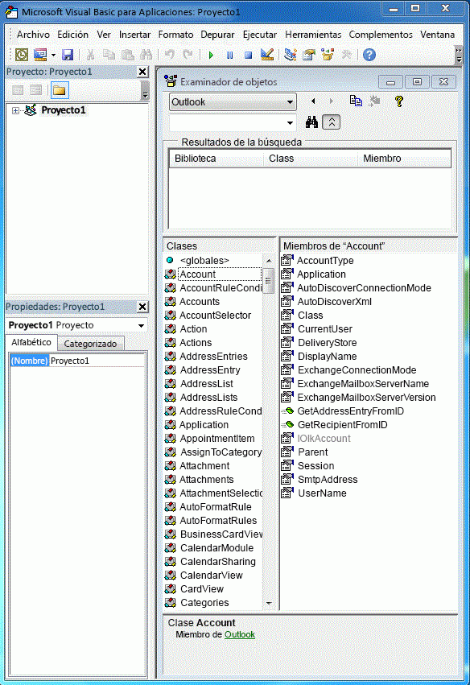
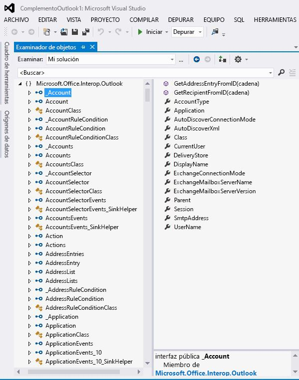

# Relación del PIA de Outlook con el modelo de objetosRelating the Outlook PIA with the object model

El ensamblado de interoperabilidad primario (PIA) de Outlook es un ensamblado de interoperabilidad oficialmente publicado por Outlook que define una interfaz administrada para que los complementos administrados interactúen con el modelo de objetos basado en COM de Outlook.The Outlook Primary Interop Assembly (PIA) is an interop assembly officially published by Outlook defining a managed interface for managed add-ins to interact with the COM-based Outlook object model. [Introducción a la interoperabilidad entre COM y .NET](introduction-to-interoperability-between-com-and-net.md) describe de forma técnica como un ensamblado de interoperabilidad admite una programación de cliente administrado frente a una biblioteca de tipos basada en COM.[Introduction to interoperability between COM and .NET](introduction-to-interoperability-between-com-and-net.md) describes technically how an interop assembly supports a managed client programming against a COM-based type library. Este tema proporciona información general sobre cómo se asignan los objetos y los miembros del modelo de objetos de Outlook basado en COM a las correspondientes interfaces y clases administradas en el PIA.This topic gives an overview of how objects and members in the COM-based Outlook object model are mapped to corresponding managed interfaces and classes in the PIA.

## Objetos auxiliaresHelper objects

Cuando se comparan los objetos de la biblioteca de tipos de Outlook que aparecen en el examinador de objetos del Editor de Visual Basic, como se muestra en la figura 1, con los objetos del PIA en el examinador de objetos de Visual Studio, como en la figura 2, puede sorprenderse por la gran cantidad de objetos de ayuda adicionales que existen en el PIA.When you compare the objects of the Outlook type library listed in the object browser of the Visual Basic Editor, as in Figure 1, with the objects of the PIA listed in the object browser of Visual Studio, as in Figure 2, you might be overwhelmed by the large number of extra helper objects that exist in the PIA. Es posible que note que algunos objetos, como el objeto **Action**, se asigna a una interfaz, la interfaz [Action](https://msdn.microsoft.com/library/bb646971\(v=office.15\)) interfaz, pero otros objetos, como el objeto **Account**, no siempre se asignan exactamente una interfaz correspondiente en el PIA.You might notice that some objects, such as the **Action** object, maps to one interface, the [Action](https://msdn.microsoft.com/library/bb646971\(v=office.15\)) interface, but other objects, like the **Account** object, do not necessarily map to exactly one corresponding interface in the PIA.

**Figura 1. Explorador que muestra objetos en la biblioteca de tipos de Microsoft Outlook basado en COM****Figure 1. Object browser showing objects in the COM-based Outlook type library**

**Figura 2. Explorador que muestra objetos en Outlook****Figure 2. Object browser showing objects in Outlook**

Entre estas interfaces, muchas de ellas tienen nombres que empiezan con un guion bajo ("\_") seguido de un nombre de objeto.Among these interfaces, many of them have names that begin with an underscore ('\_') followed by an object name. Por ejemplo, el objeto **Account** corresponde a una interfaz pública \_Account y una clase pública Account en el examinador de objetos de Visual Studio.For example, the **Account** object maps to a public interface \_Account and a public class Account in the Visual Studio object browser. De hecho, aunque no se muestra explícitamente en el examinador de objetos de Visual Studio, el objeto **Account** está asignado a dos interfaces y una clase en el PIA: una interfaz [\_Account](https://msdn.microsoft.com/library/bb609471\(v=office.15\)), una coclase [Account](https://msdn.microsoft.com/library/bb645103\(v=office.15\)) y una clase [AccountClass](https://msdn.microsoft.com/library/bb645768\(v=office.15\)).In fact, though not shown explicitly in the Visual Studio object browser, the **Account** object is mapped to two interfaces and one class in the PIA: an [\_Account](https://msdn.microsoft.com/library/bb609471\(v=office.15\)) interface, an [Account](https://msdn.microsoft.com/library/bb645103\(v=office.15\)) coclass, and an [AccountClass](https://msdn.microsoft.com/library/bb645768\(v=office.15\)) class. 

Para obtener más información sobre estas interfaces, coclases y clases, de dónde proceden y cómo se asignan los objetos de la biblioteca de tipos al PIA, vea [Objetos de Outlook PIA](objects-in-the-outlook-pia.md).For more information about these interfaces, coclasses and classes, where they come from, and how objects are mapped from the type library to the PIA, see [Objects in the Outlook PIA](objects-in-the-outlook-pia.md).

## Interfaces de eventos independientesSeparate event interfaces

Si examina los objetos que tienen eventos, los eventos en el PIA no están agrupados con otros miembros de propiedad y método del objeto, sino que se agrupan para formar sus propias clases, interfaces y controladores de eventos.If you examine objects that have events, events in the PIA are not grouped together with other method and property members of that object, but are grouped to form their own interfaces, event handlers, and classes. 

Para más información sobre cómo se asignan los métodos y propiedades desde la biblioteca de tipos al PIA, vea [Métodos y propiedades del PIA de Outlook](methods-and-properties-in-the-outlook-pia.md).For more information about how methods and properties are mapped from the type library to the PIA, see [Methods and properties in the Outlook PIA](methods-and-properties-in-the-outlook-pia.md). Para más información sobre las clases, delegados e interfaces de eventos, vea [Eventos del PIA de Outlook](events-in-the-outlook-pia.md).For more information about event interfaces, delegates, and classes, see [Events in the Outlook PIA](events-in-the-outlook-pia.md).

## Objetos ocultos y en desusoHidden and deprecated objects

El PIA también contiene enumeraciones, miembros y objetos que han quedado en desuso y, opcionalmente, marcados como ocultos en el modelo de objetos COM.The PIA also contains objects, members, and enumerations that have been deprecated and optionally marked as hidden in the COM object model. La mayoría de estos objetos, miembros y enumeraciones se muestran en el PIA.Most of these objects, members, and enumerations are exposed in the PIA. Sin embargo, se muestran por la integridad del PIA; ya no deberían ser usados por desarrolladores de soluciones y, por tanto, se documentan mínimamente.However, they are exposed for the completeness of the PIA; they are no longer intended to be used by solution developers and are therefore minimally documented. Existen algunas excepciones como los objetos **\_DocSiteControl** y **\_RecipientControl**, que están ocultos en la biblioteca de tipos, pero se exponen y documentan como objetos de primera clase en la referencia del PIA.A few exceptions exist such as the **\_DocSiteControl** and **\_RecipientControl** objects, which are hidden in the type library but are exposed and documented as first class objects in the PIA reference. 

Para más información sobre el objeto **\_DocSiteControl**, vea [\_DDocSiteControl](https://msdn.microsoft.com/library/bb609520\(v=office.15\)).For more information about the **\_DocSiteControl** object, see [\_DDocSiteControl](https://msdn.microsoft.com/library/bb609520\(v=office.15\)). Para más información sobre el objeto **\_RecipientControl** objeto, vea [ \_DRecipientControl](https://msdn.microsoft.com/library/bb609501\(v=office.15\)).For more information about the **\_RecipientControl** object, see [\_DRecipientControl](https://msdn.microsoft.com/library/bb609501\(v=office.15\)).

