# Seleccionar una API o tecnología para desarrollar soluciones de OutlookSelecting an API or technology for developing solutions for Outlook

En este artículo se describen las API y las tecnologías que puede usar para ampliar Outlook 2013 y Outlook 2016 y se ofrece ayuda para decidir cuál será la API o tecnología adecuada para su escenario.This article describes the APIs and technologies that you can use to extend Outlook 2013 and Outlook 2016, and helps you decide the appropriate API or technology for your scenario.
  
Microsoft admite diversas API y tecnologías que amplían Outlook:Microsoft supports various APIs and technologies that extend Outlook: 
  
- A partir de Office 2013, la plataforma de aplicaciones para Office presenta oportunidades para ampliar la funcionalidad de Outlook en los clientes de Outlook en equipos de escritorio, tabletas y smartphones. La plataforma incluye una API de JavaScript para Office y un esquema para los manifiestos de aplicación.Starting in Office 2013, the apps for Office platform opens up opportunities to extend Outlook functionality across Outlook clients on the desktop, tablet and smart phone. The platform includes a JavaScript API for Office and a schema for app manifests.
    
- El modelo de objetos, el ensamblado de interoperabilidad primario (PIA) de Outlook correspondiente y la API de mensajería (MAPI) han sido las API usadas con más frecuencia en las soluciones de Outlook.The object model, the corresponding Outlook Primary Interop Assembly (PIA), and the Messaging API (MAPI) have been the most commonly used APIs in Outlook solutions.
    
- Las API auxiliares complementan a MAPI en algunos escenarios.The auxiliary APIs complement MAPI in a few scenarios.
    
- La extensibilidad de proveedores de Outlook Social Connector (OSC) y la extensibilidad de Barra de meteorología sirven para escenarios específicos de sus mercados nicho.Outlook Social Connector (OSC) provider extensibility and the Weather Bar extensibility serve specific scenarios of their niche markets.
    
En este artículo se explican los criterios de selección para la plataforma de Complementos de Office, el modelo de objetos, PIA y MAPI. Tenga en cuenta que las Complementos de Office usan la API de JavaScript para Office y que no llaman al modelo de objetos, y viceversa. Las soluciones que usan las otras API pueden usar una o más API. Por ejemplo, un complemento COM escrito en C++ puede usar el modelo de objetos, MAPI y API auxiliares en la misma solución.This article explains the selection criteria for the Office Add-ins platform, the object model, PIA, and MAPI. Note that Office Add-ins use the JavaScript API for Office and do not call into the object model, and vice versa. Solutions that use the other APIs can use one or more APIs. For example, a COM add-in written in C++ can use the object model, MAPI, and auxiliary APIs in the same solution.
  
Para sacar el máximo provecho de este artículo, debe estar familiarizado con Outlook en el nivel de usuario y tener conocimientos sobre el desarrollo de software en general. Sin embargo, no es necesario tener conocimientos exhaustivos sobre las características que admiten estas API o tecnologías. El artículo ayuda a responder las preguntas siguientes:To get the most benefit from this article, you should be familiar with Outlook at the user level and have general software development knowledge. However, you do not need to have a comprehensive understanding of the features that these APIs or technologies support. The article helps answer the following questions:
  
- Si solo tiene una idea general acerca de los objetivos de la solución, el mercado objetivo y los recursos disponibles, ¿qué otros criterios debe tener en cuenta para seleccionar una API?If you have only an idea about the goals of your solution, the target market, and available resources, what other criteria should you consider to select an API?
    
- ¿Por qué tendría en cuenta las Complementos de Office y cuándo decidiría crear aplicaciones en lugar de complementos?Why would you consider Office Add-ins, and when would you choose to create apps as opposed to add-ins?
    
- Si la solución se tiene que ejecutar en versiones anteriores de Outlook, incluido Outlook 2003, ¿cómo afecta esto a su elección de API?If your solution has to run on earlier versions of Outlook, including Outlook 2003, how does that affect your API choice?
    
- Si la solución tiene que iterar en carpetas de Outlook que contienen miles de elementos y debe ser capaz de modificar estos elementos, ¿qué API funcionaría mejor?If your solution has to iterate through Outlook folders that contain thousands of items, and you need to be able to modify those items, which API would work best?
    
- Si la solución depende en gran medida de la lógica de negocios de Outlook e interactúa con otras aplicaciones de Office, ¿el modelo de objetos de Outlook es la mejor opción?If your solution relies heavily on Outlook business logic and interacts with other Office applications, is the Outlook object model the best choice?
    
- ¿Qué elementos de Outlook le permiten ampliar el modelo de objetos y MAPI?What do the object model and MAPI allow you to extend in Outlook?
    
- Si puede usar el modelo de objetos o MAPI para completar la tarea, ¿cómo debe decidir qué API usar?If you can use either the object model or MAPI to achieve your task, how should you decide which API to use?
    
## Criterios de evaluación objetivosObjective evaluation criteria

En esta sección se describen los criterios que puede usar para comparar la plataforma de Complementos de Office, el modelo de objetos, PIA y MAPI para determinar cuál satisface mejor sus necesidades. Distintos criterios pueden ser más o menos importantes, en función de los proyectos y recursos disponibles.This section describes criteria that you can use to compare the Office Add-ins platform, object model, PIA, and MAPI to determine which better meets your needs. Different criteria can be more or less important, depending on your projects and available resources.
  
Las tablas de esta sección definen criterios de evaluación en las siguientes categorías:The tables in this section define evaluation criteria in the following categories:
  
- Criterios funcionales: describe qué se puede y no se puede hacer con la tecnología.Functional criteria—Describes the things you can and cannot do with the technology.
    
- Criterios de desarrollo: describe las herramientas de desarrollo o la información que necesita para usar la tecnología.Development criteria—Describes the development tools or information you need to use the technology
    
- Criterios de seguridad: describe los problemas de seguridad y permisos relacionados con la tecnología.Security criteria—Describes the security and permissions issues related to the technology.
    
- Criterios de implementación: describe los métodos recomendados de implementación y distribución de la tecnología.Deployment criteria—Describes the recommended deployment and distribution methods for the technology.
    
### Criterios de evaluación objetiva de la plataforma de aplicaciones para OfficeObjective evaluation criteria for the apps for Office platform

A partir de Office 2013, los desarrolladores pueden usar la plataforma de Complementos de Office para ampliar los servicios web y el contenido en el contexto de clientes enriquecidos y web de Office. Una Complemento de Office es una página web desarrollada con tecnologías web habituales, hospedada dentro de una aplicación cliente de Office (como Outlook) y que puede ejecutarse localmente o en la nube. De los tipos de Complementos de Office, el que es compatible con Outlook se denomina aplicaciones de correo. Aunque el modelo de objetos, PIA y MAPI se usan a menudo para automatizar Outlook en el nivel de aplicación, puede usar la API de JavaScript para Office para interactuar en el nivel de elemento con el contenido y las propiedades de un mensaje de correo electrónico, convocatoria de reunión. Puede publicar aplicaciones de correo en la Tienda Office o en un catálogo interno de Exchange.Starting in Office 2013, developers can use the Office Add-ins platform to extend web services and content into the context of Office rich and web clients. An Office Add-in is a web page that is developed using common web technologies, hosted inside an Office client application (such as Outlook), and can run on-premises or in the cloud. Of the few types of Office Add-ins, the type that Outlook supports is called mail apps. While the object model, PIA, and MAPI are often used to automate Outlook at an application level, you can use the JavaScript API for Office to interact at an item level with the content and properties of an email message, meeting request, or appointment. You can publish mail apps to the Office Store or an internal Exchange catalog. 
  
Los usuarios finales y los administradores pueden instalar aplicaciones de correo en un buzón de Exchange y usar aplicaciones de correo en el cliente enriquecido y en Outlook Web App. Como desarrollador, puede hacer que la aplicación de correo esté disponible solo en equipos de escritorio o también en tabletas o smartphones. En la Figura 1 se muestra un ejemplo de una aplicación de correo de YouTube, que se describe detalladamente en [Procedimiento para crear una aplicación de correo para Outlook 2013 Preview para ver vídeos de YouTube](https://code.msdn.microsoft.com/office/Mail-apps-for-Outlook-01c9248f). La aplicación de correo de YouTube permite a los usuarios finales seleccionar una dirección URL de un vídeo de YouTube y ver el vídeo en Outlook u Outlook Web App, en un equipo de escritorio o una tableta.End users and administrators can install mail apps on an Exchange mailbox, and use mail apps in the Outlook rich client as well as Outlook Web App. As a developer, you can choose to make your mail app available on only the desktop, or also on the tablet or smart phone. Figure 1 shows an example of a YouTube mail app, which is described in detail in [Sample: Create a mail add-in to view YouTube videos in Outlook](https://code.msdn.microsoft.com/office/Mail-apps-for-Outlook-01c9248f). The YouTube mail app allows end users select a URL for a YouTube video and watch the video within Outlook or Outlook Web App, on the desktop or tablet.
  
**Figura 1. La aplicación de correo de YouTube está activa para el mensaje seleccionado, que contiene una dirección URL de un vídeo de YouTube.com.****Figure 1. YouTube mail app is active for the selected message, which contains a URL to a video on YouTube.com**

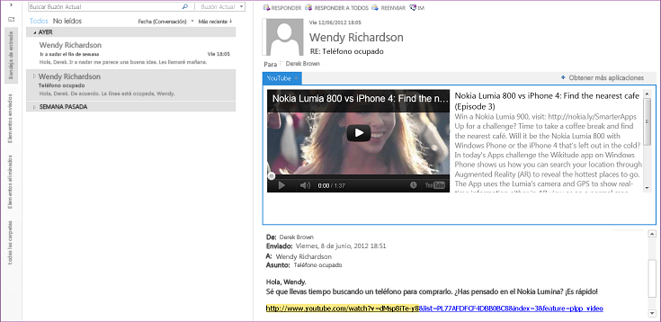
  
Cuando un usuario instala una aplicación de correo, la aplicación está disponible para usarla en la barra de aplicaciones si el contexto actual coincide con las condiciones de activación especificadas por la aplicación. Las aplicaciones de correo le permiten especificar reglas sobre el elemento seleccionado que activan una aplicación de correo solo si se cumplen ciertas condiciones. Por ejemplo, la aplicación de correo de YouTube que permite reproducir un vídeo de YouTube en Outlook es importante solo cuando el elemento de Outlook seleccionado contiene una dirección URL a un vídeo de YouTube.com. En este caso, sería necesario especificar que la aplicación esté activada solo cuando el mensaje seleccionado contiene dicha dirección URL.After a user installs a mail app, the app is available for use in the app bar when the current context matches the activation conditions that the app specifies. A mail apps allows you to specify rules about the currently selected item that activate a mail app only if certain conditions are met. For example, the YouTube mail app that lets you play a YouTube video within Outlook is relevant only when the selected Outlook item contains a URL to a video on YouTube.com. In this case, you would specify that the app should be active only when the selected message contains such a URL.
  
En las tablas siguientes se muestran los criterios de evaluación de la plataforma de Complementos de Office.The following tables show the evaluation criteria for the Office Add-ins platform.
  
#### Criterios funcionalesFunctional criteria

|**Criterios****Criteria**|**Compatibilidad con aplicaciones de correo en la plataforma de aplicaciones para Office****Mail apps support in apps for Office platform**|
|:-----|:-----|
|Dominio de aplicaciónApplication domain    |El ámbito de actividad de una aplicación de correo es prácticamente cualquier elemento de mensaje o cita admitido en el buzón de Exchange del usuario que haya seleccionado el usuario y que cumpla las condiciones de activación. Los permisos de una aplicación de correo determinan su acceso a las propiedades y las entidades específicas (por ejemplo, una dirección de correo electrónico o un número de teléfono) que existen para ese elemento. Por ejemplo, una aplicación web que solicita el permiso **lectura/escritura de buzón** puede leer y escribir todas las propiedades de cualquier elemento del buzón del usuario, crear, leer y escribir en cualquier carpeta o elemento, y enviar un elemento de dicho buzón.  The scope of activity of a mail app is virtually any supported message or appointment item in the user's Exchange mailbox that the user has selected and that satisfies the activation conditions. The permissions of a mail app determine its access to the properties and specific entities (such as an email address or telephone number) that exist for that item. For example, a mail app requesting the **read/write mailbox** permission can read and write all the properties of any item in the user's mailbox; create, read, and write to any folder or item; and send an item from that mailbox.    |
|Objetos principalesMajor objects    |La API de JavaScript para Office proporciona unos cuantos objetos en el nivel superior que comparten todos los tipos de Complementos de Office: [Office](https://msdn.microsoft.com/library/c490b13d-ee52-4291-af5d-f4a5a11d3af0%28Office.15%29.aspx), [Context](https://msdn.microsoft.com/library/662883d5-b86f-4bdc-99f0-9ee9129ed16c%28Office.15%29.aspx) y [AysncResult](https://msdn.microsoft.com/library/540c114f-0398-425c-baf3-7363f2f6bc47%28Office.15%29.aspx). El nivel siguiente de la API aplicable y específico de las aplicaciones de correo incluye los objetos [Mailbox](https://msdn.microsoft.com/library/a3880d3b-8a09-4cf9-9274-f2682cb3b769%28Office.15%29.aspx), [Item](https://msdn.microsoft.com/library/ad288df1-3ca2-474c-bea4-c51f46e6fc43%28Office.15%29.aspx) y [UserProfile](https://msdn.microsoft.com/library/6d0a36ec-0d5c-40e3-9f6f-9a7fcf0ac3d8%28Office.15%29.aspx), que admiten el acceso a la información sobre el usuario y el elemento seleccionado actualmente en el buzón del usuario. En el nivel de datos, los objetos [CustomProperties](https://msdn.microsoft.com/library/95a69bd6-c4dc-429a-8b27-e2b68f74f3e3%28Office.15%29.aspx) y [RoamingSettings](https://msdn.microsoft.com/library/cf21bb08-7274-4ad6-ae9e-b2c12f92abc9%28Office.15%29.aspx) admiten la persistencia de propiedades configuradas por la aplicación de correo para el elemento seleccionado y para el buzón del usuario, respectivamente. Los objetos de nivel de elemento incluyen los objetos [Appointment](https://msdn.microsoft.com/library/08ebffff-eb52-4e21-9d4e-8f79e426f992%28Office.15%29.aspx) y [Message](https://msdn.microsoft.com/library/909ad9eb-a1bc-4caa-b51e-fd59a02b9569%28Office.15%29.aspx) que heredan de **Item** y el objeto [MeetingRequest](https://msdn.microsoft.com/library/c658fa3d-1138-4a67-9a4b-c9edd11f8385%28Office.15%29.aspx) que hereda de **Message**. Estos objetos representan los tipos de elementos de Outlook que son compatibles con las aplicaciones de correo: elementos de calendario de citas y reuniones, y elementos de mensaje como mensajes de correo electrónico, convocatorias de reunión, respuestas y cancelaciones. Además de este nivel, en la API encontramos propiedades de nivel de elemento (como [Appointment.subject](https://msdn.microsoft.com/library/ffa6812c-34b8-4b0a-8f92-22c3580c8379%28Office.15%29.aspx)), así como objetos y propiedades que admiten ciertos objetos [Entities](https://msdn.microsoft.com/library/1a06c8d1-dafe-46f4-967e-dd9b1d5b20e9%28Office.15%29.aspx) conocidos (por ejemplo, [Contact](https://msdn.microsoft.com/library/2604b44c-7b79-47f0-ac3e-7d99bc9e6751%28Office.15%29.aspx), [MeetingSuggestion](https://msdn.microsoft.com/library/9726fbff-0f4f-4b70-8deb-effc14607d4e%28Office.15%29.aspx), [PhoneNumber](https://msdn.microsoft.com/library/cc86426a-2730-4774-9067-0611e5c8e9c1%28Office.15%29.aspx) y [TaskSuggestion](https://msdn.microsoft.com/library/16b0c3d6-adf4-4a88-ad09-4bb5565816b1%28Office.15%29.aspx)).  The JavaScript API for Office provides a few objects at the top level that are shared by all the types of Office Add-ins: [Office](https://msdn.microsoft.com/library/c490b13d-ee52-4291-af5d-f4a5a11d3af0%28Office.15%29.aspx), [Context](https://msdn.microsoft.com/library/662883d5-b86f-4bdc-99f0-9ee9129ed16c%28Office.15%29.aspx), and [AysncResult](https://msdn.microsoft.com/library/540c114f-0398-425c-baf3-7363f2f6bc47%28Office.15%29.aspx). The next level in the API that is applicable and specific to mail apps includes the [Mailbox](https://msdn.microsoft.com/library/a3880d3b-8a09-4cf9-9274-f2682cb3b769%28Office.15%29.aspx), [Item](https://msdn.microsoft.com/library/ad288df1-3ca2-474c-bea4-c51f46e6fc43%28Office.15%29.aspx), and [UserProfile](https://msdn.microsoft.com/library/6d0a36ec-0d5c-40e3-9f6f-9a7fcf0ac3d8%28Office.15%29.aspx) objects, which support accessing information about the user and the item currently selected in the user's mailbox. At the data level, the [CustomProperties](https://msdn.microsoft.com/library/95a69bd6-c4dc-429a-8b27-e2b68f74f3e3%28Office.15%29.aspx) and [RoamingSettings](https://msdn.microsoft.com/library/cf21bb08-7274-4ad6-ae9e-b2c12f92abc9%28Office.15%29.aspx) objects support persisting properties set up by the mail app for the selected item and for the user's mailbox, respectively. Item-level objects include the [Appointment](https://msdn.microsoft.com/library/08ebffff-eb52-4e21-9d4e-8f79e426f992%28Office.15%29.aspx) and [Message](https://msdn.microsoft.com/library/909ad9eb-a1bc-4caa-b51e-fd59a02b9569%28Office.15%29.aspx) objects that inherit from **Item**, and the [MeetingRequest](https://msdn.microsoft.com/library/c658fa3d-1138-4a67-9a4b-c9edd11f8385%28Office.15%29.aspx) object that inherits from **Message**. These represent the types of Outlook items that support mail apps: calendar items of appointments and meetings, and message items such as email messages, meeting requests, responses, and cancellations. Beyond this level in the API are item-level properties (such as [Appointment.subject](https://msdn.microsoft.com/library/ffa6812c-34b8-4b0a-8f92-22c3580c8379%28Office.15%29.aspx)) as well as objects and properties that support certain known [Entities](https://msdn.microsoft.com/library/1a06c8d1-dafe-46f4-967e-dd9b1d5b20e9%28Office.15%29.aspx) objects (for example [Contact](https://msdn.microsoft.com/library/2604b44c-7b79-47f0-ac3e-7d99bc9e6751%28Office.15%29.aspx), [MeetingSuggestion](https://msdn.microsoft.com/library/9726fbff-0f4f-4b70-8deb-effc14607d4e%28Office.15%29.aspx), [PhoneNumber](https://msdn.microsoft.com/library/cc86426a-2730-4774-9067-0611e5c8e9c1%28Office.15%29.aspx), and [TaskSuggestion](https://msdn.microsoft.com/library/16b0c3d6-adf4-4a88-ad09-4bb5565816b1%28Office.15%29.aspx)).    Vea [Aspectos básicos para el desarrollo de aplicaciones de correo en Outlook 2013 Preview](https://msdn.microsoft.com/library/2cd5641b-492b-4431-8388-7fc589163e9c%28Office.15%29.aspx) para obtener un resume de las características compatibles con las aplicaciones de correo.See [Overview of Outlook add-ins architecture and features](https://msdn.microsoft.com/library/2cd5641b-492b-4431-8388-7fc589163e9c%28Office.15%29.aspx) for a summary of the features supported for mail apps.    |
|Modelo de acceso a datosData-access model    |La API de JavaScript para Office representa las siguientes características como un conjunto jerárquico de objetos: entorno en tiempo de ejecución de la aplicación, buzón y perfil del usuario y datos acerca de un elemento.The JavaScript API for Office represents the following features as a hierarchical set of objects: the app's runtime environment, user's mailbox and profile, and data about an item.    |
|Modelos de subprocesosThreading models    |Cada aplicación de correo se ejecuta en su propio proceso independiente del proceso de Outlook.Each mail app executes in its own process separate from the Outlook process.    |
|Arquitecturas de aplicaciónApplication architectures    |En Outlook, una aplicación de correo es un conjunto de páginas HTML y JavaScript hospedadas como proceso independiente dentro de un control de explorador web que, a su vez, está hospedado dentro de un proceso en tiempo de ejecución de una aplicación que proporciona seguridad y aislamiento para rendimiento.In Outlook, a mail app is a set of HTML and JavaScript web pages hosted as a separate process inside a web browser control which, in turn, is hosted inside an app runtime process that provides security and performance isolation.    |
|Uso remotoRemote usage    |Las aplicaciones de correo usan la API de JavaScript para Office para tener acceso a datos sobre el usuario actual, el buzón y el elemento seleccionado almacenado en el servidor Exchange correspondiente. Siempre que tengan los permisos adecuados y usen la técnica apropiada para el acceso entre dominios, las aplicaciones de correo también pueden llamar a servicios Web Exchange y a otros servicios web de terceros para ampliar su funcionalidad.Mail apps use the JavaScript API for Office to access data about the current user, mailbox, and selected item stored on the corresponding Exchange Server. Provided that they have the appropriate permissions and use the appropriate technique for cross-domain access, mail apps can also call Exchange Web Services and other third-party web services to extend their functionality.    |
|TransaccionesTransactions    |La API de JavaScript para Office no admite transacciones.The JavaScript API for Office does not support transactions.    |
|DisponibilidadAvailability    |La API de JavaScript para Office está disponible para los buzones de Exchange Server 2013, a partir Outlook 2013.The JavaScript API for Office is available for mailboxes on Exchange Server 2013, starting in Outlook 2013.    |
   
#### Criterios de desarrolloDevelopment criteria

|**Criterios****Criteria**|**Compatibilidad con aplicaciones de correo en la plataforma de aplicaciones para Office****Mail apps support in apps for Office platform**|
|:-----|:-----|
|Lenguajes y herramientasLanguages and tools    |Puede implementar aplicaciones de correo con cualquier tecnología web habitual, como HTML5, JavaScript, CSS3, XML y API de REST. Puede usar la herramienta de desarrollo web que prefiera. Como alternativa, con Napa, Visual Studio 2012 o una versión posterior de estas herramientas, logrará ahorrar tiempo en el desarrollo.You can implement mail apps using any common web technology, including HTML5, JavaScript, CSS3, XML, and REST APIs. You can use your preferred web development tool. Alternatively, using Napa, Visual Studio 2012, or a later version of these tools provides conveniences that save you time in development.    |
|Implementación administradaManaged implementation    |Cuando resulte apropiado en su escenario, puede usar páginas .aspx administradas para implementar código de servidor en las aplicaciones de correo.Where appropriate in your scenario, you can use managed .aspx pages to implement server-side code for your mail apps.    |
|Permite scriptsScriptable    |La API de JavaScript para Office se usa directamente en scripts.The JavaScript API for Office is directly used in scripts.    |
|Herramientas de prueba y depuraciónTest and debug tools    |Puede usar las herramientas de desarrollo web que prefiera. Napa y Visual Studio proporcionan un entorno de desarrollo integrado que facilita las pruebas y depuración de aplicaciones. [Solucionar problemas relacionados con la activación de los complementos de Outlook](https://msdn.microsoft.com/library/da5b56c9-7fd1-4556-8c0e-f489c4c9e9b6%28Office.15%29.aspx) y [Procedimiento para depurar propiedades en elementos de Outlook](https://code.msdn.microsoft.com/office/Mail-apps-for-Outlook-faca78cd) proporcionan más ayuda para solucionar problemas de aplicaciones de correo y depurarlas.  You can use any web development tools you prefer. Napa and Visual Studio provide an integrated development environment that facilitates app testing and debugging. [Troubleshoot Outlook add-in activation](https://msdn.microsoft.com/library/da5b56c9-7fd1-4556-8c0e-f489c4c9e9b6%28Office.15%29.aspx) and [Sample: Debug properties of Outlook items](https://code.msdn.microsoft.com/office/Mail-apps-for-Outlook-faca78cd) provide further help in troubleshooting and debugging mail apps.    |
|Disponibilidad de expertosExpert availability    |Es relativamente fácil encontrar programadores que tengan el nivel de experiencia en desarrollo web necesario para Complementos de Office. La plataforma está pensada para desarrolladores tanto profesionales como no profesionales.Programmers who have the required level of web development expertise for Office Add-ins are relatively easy to find. The platform is intended for both professional and non-professional developers.    |
|Información disponibleAvailable information    |Encontrará información sobre cómo desarrollar y publicar Complementos de Office en [Crear aplicaciones para Office y SharePoint](https://msdn.microsoft.com/office/apps/fp160950.aspx). Encontrará documentación específica sobre las aplicaciones de correo en [Aplicaciones de correo para Outlook 2013 Preview](https://msdn.microsoft.com/library/71e64bc9-e347-4f5d-8948-0a47b5dd93e6%28Office.15%29.aspx).  Information about developing and posting Office Add-ins is available at [Build apps for Office and SharePoint](https://msdn.microsoft.com/office/apps/fp160950.aspx). Specific documentation for mail apps is available at [Outlook add-ins](https://msdn.microsoft.com/library/71e64bc9-e347-4f5d-8948-0a47b5dd93e6%28Office.15%29.aspx).    |
|Licencias de desarrollador e implementaciónDeveloper and deployment licensing    |Consulte [Licencias de complementos de Office y SharePoint](https://msdn.microsoft.com/library/3e0e8ff6-66d6-44ff-b0c2-59108ebd9181%28Office.15%29.aspx) para obtener información sobre el marco de licencias de aplicaciones para Complementos de Office.Refer to [License your Office and SharePoint Add-ins](https://msdn.microsoft.com/library/3e0e8ff6-66d6-44ff-b0c2-59108ebd9181%28Office.15%29.aspx) for information about the app license framework for Office Add-ins.    |
   
#### Criterios de seguridadSecurity criteria

|**Criterios****Criteria**|**Compatibilidad con aplicaciones de correo en la plataforma de aplicaciones para Office****Mail apps support in apps for Office platform**|
|:-----|:-----|
|Permisos en tiempo de diseñoDesign-time permissions    |No se necesitan permisos especiales para desarrollar aplicaciones de correo.No special permissions are required to develop mail apps.    |
|Permisos de instalaciónSetup permissions    |De manera predeterminada, los usuarios finales y los administradores pueden instalar aplicaciones de correo de nivel de confianza bajo que requieran el permiso **Restringido** o **Leer elemento**, y los administradores pueden instalar aplicaciones de nivel de confianza alto que requieran el permiso **Buzón de lectura y escritura**.By default, end users and administrators can install low-trust mail apps that require **restricted** or **read item** permission, and administrators can install high-trust mail apps that require **read/write mailbox** permission.    |
|Permisos en tiempo de ejecuciónRun-time permissions    |Las aplicaciones de correo solicitan un nivel de permisos específico que se basa en un modelo de permisos de tres niveles: **Restringido**, **Leer elemento** y **Buzón de lectura y escritura**.Mail apps request a specific level of permission that is based on a three-tier permissions model: **restricted**, **read item**, and **read/write mailbox**.    |
|Características de seguridad integradasBuilt-in security features    | El tiempo de ejecución de Complementos de Office ofrece las siguientes ventajas para impedir que una aplicación dañe el entorno del usuario final:The Office Add-ins runtime provides the following benefits to prevent an app from damaging the end user's environment:     Aísla el proceso en el que se ejecuta la aplicación.Isolates the process that the app runs in.     No implica el reemplazo de archivos .dll o .exe ni de componentes ActiveX.Doesn't involve .dll or .exe replacement or ActiveX components.     Facilita la instalación o desinstalación de aplicaciones por parte del usuario final.Makes apps easy to install or uninstall by the end user.     El administrador y los usuarios finales tienen control sobre las aplicaciones de correo que están disponibles y si se debe conceder el permiso solicitado antes de instalar una aplicación de correo.The administrator and end users have control over the mail apps that are made available and whether to grant the requested permission before installing a mail app.     En el caso de los clientes enriquecidos, regula el uso de memoria y CPU para evitar ataques maliciosos por denegación servicio.In the case of rich clients, governs the use of memory and CPU to prevent denial of service malicious attacks.    |
|Características de supervisión de seguridadSecurity monitoring features    | Para las aplicaciones de correo, se supervisan los siguientes recursos:For mail apps, the following resources are monitored:     Uso de núcleos de CPU.CPU core usage.     Uso de memoria.Memory usage.     Número de bloqueos.Number of crashes.     Duración de bloqueo de una aplicación.Length of time blocking an application.     Tiempo de respuesta de expresiones regulares.Regular expression response time.     Número de veces que se vuelven a evaluar las expresiones regulares.Number of times re-evaluating regular expressions.     Los administradores pueden reemplazar la configuración predeterminada que rige el uso de recursos.Administrators can override default settings that govern the resource usage.    |
   
#### Criterios de implementaciónDeployment criteria

|**Criterios****Criteria**|**Compatibilidad con aplicaciones de correo en la plataforma de aplicaciones para Office****Mail apps support in apps for Office platform**|
|:-----|:-----|
|Requisitos de plataforma del servidorServer platform requirements    |El buzón del usuario para el que se instale una aplicación de correo debe estar en Exchange Server 2013 o una versión posterior.The user's mailbox for which a mail app is installed must be on Exchange Server 2013 or a later version.    |
|Requisitos de plataforma del clienteClient platform requirements    |Para que una aplicación de correo se ejecute en el cliente enriquecido de Outlook, Outlook 2013 e Internet Explorer 9, o una versión posterior de estas aplicaciones, debe estar instalada en el equipo local.For a mail app to run on the Outlook rich client, Outlook 2013 and Internet Explorer 9, or a later version of these applications, must be installed on the local computer.    |
|Métodos de implementaciónDeployment methods    |Puede publicar aplicaciones de correo en la Tienda Office o en un catálogo de Exchange que ponga la aplicación a disposición de los usuarios en ese servidor Exchange. A continuación, los administradores pueden decidir instalar una aplicación de correo desde la Tienda Office o el catálogo de Exchange, por medio del Centro de administración de Exchange (EAC) o de cmdlets de Windows PowerShell remotos. Puede acceder al EAC desde la vista Backstage de Outlook o desde Outlook Web App, o iniciando sesión directamente en el EAC del buzón.  You can publish mail apps to the Office Store or to an Exchange catalog that makes the app available to users on that Exchange Server. Administrators or users can then choose to install a mail app from the Office Store or Exchange catalog, by using either the Exchange Admin Center (EAC) or by running remote Windows PowerShell cmdlets. You can access the EAC from the Outlook Backstage view or Outlook Web App, or by directly signing into the EAC for your mailbox.    Para obtener más información, vea [Implementar e instalar aplicaciones de correo para probar en Outlook 2013 Preview](https://msdn.microsoft.com/library/d6eea4c4-bb21-4f24-bcba-1eccbb4e12dd%28Office.15%29.aspx).For more information, see [Deploy and install Outlook add-ins for testing](https://msdn.microsoft.com/library/d6eea4c4-bb21-4f24-bcba-1eccbb4e12dd%28Office.15%29.aspx).    |
|Notas de implementaciónDeployment notes    |Una vez que se instala una aplicación de correo en Outlook o Outlook Web App, la aplicación de correo está disponible para ese buzón en ambos clientes de Outlook.Once you install a mail app on Outlook or Outlook Web App, the mail app is available for that mailbox on both Outlook clients.    |
   
### Criterios de evaluación objetiva para el modelo de objetos y PIAObjective evaluation criteria for the object model and PIA

Las soluciones que se ejecutan en el equipo cliente pueden usar el modelo de objetos o PIA de Outlook para obtener acceso mediante programación a los elementos de Outlook, como los contactos, los mensajes, los elementos de calendario, las convocatorias de reunión y las tareas. A diferencia de MAPI, el modelo de objetos y PIA de Outlook pueden proporcionar notificaciones de eventos para los cambios en la interfaz de usuario de Outlook, como cambiar la carpeta actual o mostrar un inspector de Outlook.Solutions that run on the client computer can use the Outlook object model or PIA to programmatically access Outlook items, such as contacts, messages, calendar items, meeting requests, and tasks. Unlike MAPI, the Outlook object model and PIA can provide event notifications for Outlook user-interface changes, such as changing the current folder or displaying an Outlook inspector.
  
> [!NOTE]
> Para que una solución pueda tener acceso a los datos almacenados en un buzón de Microsoft Exchange o un archivo de carpetas temporales (.pst), Outlook debe estar instalado y configurado en el equipo cliente en el que se ejecuta la aplicación. > El modelo de objetos y PIA de Outlook admiten la misma funcionalidad para ampliar Outlook. PIA define las interfaces administradas que se asignan al modelo de objetos basado en COM y con las que puede interactuar una solución administrada. En los temas restantes de esta sección, la mayoría de los criterios funcionales, de seguridad y de implementación se aplican al modelo de objetos y PIA de la misma manera. Para obtener más información sobre cómo PIA facilita la interoperabilidad entre COM y .NET Framework, vea [Introducción a la interoperabilidad entre COM y .NET](https://msdn.microsoft.com/library/6b2d099a-ec6f-4099-aaf6-e61003fe5a32%28Office.15%29.aspx) y [Arquitectura del ensamblado de interoperabilidad primario de Outlook](https://msdn.microsoft.com/library/89577d14-e6e2-4270-8e72-b0adba378667%28Office.15%29.aspx).For a solution to access data that is stored in a Microsoft Exchange mailbox or a personal folders (.pst) file, Outlook must be installed and configured on the client computer on which the application is running. > The Outlook object model and PIA support the same functionality to extend Outlook. The PIA defines managed interfaces that map to the COM-based object model and that a managed solution can interact with. In the remaining discussions in this section, most of the functional, security, and deployment criteria apply to the object model and the PIA in the same way. For more information about how the PIA facilitates interoperability between COM and the .NET Framework, see [Introduction to Interoperability Between COM and .NET](https://msdn.microsoft.com/library/6b2d099a-ec6f-4099-aaf6-e61003fe5a32%28Office.15%29.aspx) and [Architecture of the Outlook PIA](https://msdn.microsoft.com/library/89577d14-e6e2-4270-8e72-b0adba378667%28Office.15%29.aspx). 
  
En las tablas siguientes se muestran los criterios de evaluación para el modelo de objetos y PIA de Outlook.The following tables show evaluation criteria for the Outlook object model and PIA.
  
#### Criterios funcionalesFunctional criteria

|**Criterios****Criteria**|**Modelo de objetos o PIA de Outlook****Outlook object model or PIA**|
|:-----|:-----|
|Dominio de aplicaciónApplication domain    |Los complementos o las aplicaciones independientes que usan el modelo de objetos o PIA de Outlook suelen encargarse de mensajes específicos del usuario, personalizar la interfaz de usuario de Outlook o crear tipos de elementos personalizados para soluciones especializadas, como soluciones de administración de relaciones con el cliente (CRM) que se integran con Outlook. A veces, el modelo de objetos o PIA de Outlook se usan para procesar mensajes en un proceso de flujo de trabajo informal, especialmente cuando no se permite el desarrollo de aplicaciones en el servidor Microsoft Exchange. A diferencia de los clientes basados en explorador, el funcionamiento en modo en caché permite a las soluciones de Outlook funcionar cuando el usuario está sin conexión o desconectado de la red corporativa.Add-ins or standalone applications that use the Outlook object model or PIA typically handle user-specific messages, customize the Outlook user interface, or create custom item types for specialized solutions such as customer relationship management (CRM) solutions that integrate with Outlook. The Outlook object model or PIA is sometimes used for message processing in an informal workflow process, especially where application development on the Microsoft Exchange Server is not permitted. Unlike browser-based clients, cached-mode operation allows Outlook solutions to work when the user is offline or disconnected from the corporate network.    |
|Objetos principalesMajor objects    |El objeto de nivel superior del modelo de objetos y PIA de Outlook es el objeto [Application](https://msdn.microsoft.com/library/797003e7-ecd1-eccb-eaaf-32d6ddde8348%28Office.15%29.aspx) de Outlook. [Explorers](https://msdn.microsoft.com/library/8398532a-1fad-7390-6778-109ac5e6c67c%28Office.15%29.aspx), [Conversation](https://msdn.microsoft.com/library/2705d38a-ebc0-e5a7-208b-ffe1f5446b1b%28Office.15%29.aspx), [Inspectors](https://msdn.microsoft.com/library/b65475d6-a212-fc96-459d-47390dfe5ee5%28Office.15%29.aspx), [Views](https://msdn.microsoft.com/library/5dd7edc2-12a2-f4c2-d158-8053d80e8dc9%28Office.15%29.aspx), [NavigationPane](https://msdn.microsoft.com/library/b6538c72-6115-99fc-c926-e0532a747823%28Office.15%29.aspx), [SolutionsModule](https://msdn.microsoft.com/library/4597765e-a95d-bf07-2ac4-103218ebc696%28Office.15%29.aspx), [FormRegion](https://msdn.microsoft.com/library/3a0b83eb-4076-9cb3-86a9-68f9e44df89f%28Office.15%29.aspx) y los objetos relacionados representan elementos de la interfaz de usuario de Outlook. Los objetos [NameSpace](https://msdn.microsoft.com/library/f0dcaa19-07f5-5d42-a3bf-2e42b7885644%28Office.15%29.aspx), [Stores](https://msdn.microsoft.com/library/8915a8e4-9c22-21d5-c492-051d393ce5f7%28Office.15%29.aspx), [Folders](https://msdn.microsoft.com/library/0c814c3c-74fc-414c-982d-a0097fcb35c2%28Office.15%29.aspx), [Accounts](https://msdn.microsoft.com/library/2510b7d7-5062-8ea3-dda4-b544d2882a2b%28Office.15%29.aspx), [AccountSelector](https://msdn.microsoft.com/library/846f176e-5680-a214-7624-75f3a524c989%28Office.15%29.aspx), [AddressEntries](https://msdn.microsoft.com/library/db91b717-07c6-d1f2-c545-b766ee1f0c6b%28Office.15%29.aspx), [ExchangeUser](https://msdn.microsoft.com/library/6ec117d1-7fdb-aa36-b567-1242f8238df0%28Office.15%29.aspx)y los objetos relacionados admiten la ampliación de las sesiones, los perfiles, las cuentas de usuario, los almacenes de mensajes y las carpetas de Outlook. En el nivel de datos, una serie de objetos de nivel de elemento, como [MailItem](https://msdn.microsoft.com/library/14197346-05d2-0250-fa4c-4a6b07daf25f%28Office.15%29.aspx), [AppointmentItem](https://msdn.microsoft.com/library/204a409d-654e-27aa-643a-8344c631b82d%28Office.15%29.aspx), [ContactItem](https://msdn.microsoft.com/library/8e32093c-a678-f1fd-3f35-c2d8994d166f%28Office.15%29.aspx) y [TaskItem](https://msdn.microsoft.com/library/5df8cfa5-5460-a5a1-a130-ba5bca1a0091%28Office.15%29.aspx), representan los tipos de elementos integrados de Outlook. Los objetos [PropertyAccessor](https://msdn.microsoft.com/library/2fc91e13-703c-3ec9-9066-ffee7144306c%28Office.15%29.aspx), [Table](https://msdn.microsoft.com/library/0affaafd-93fe-227a-acee-e09a86cadc20%28Office.15%29.aspx), [Search](https://msdn.microsoft.com/library/226a5d49-3caf-90dd-725c-265404d1939f%28Office.15%29.aspx), [ItemProperties](https://msdn.microsoft.com/library/34a110ed-6617-72da-1e98-a9773c705b40%28Office.15%29.aspx), [UserDefinedProperties](https://msdn.microsoft.com/library/196e5d4c-22be-02d3-95e0-3ea7594c2e4b%28Office.15%29.aspx), [Attachments](https://msdn.microsoft.com/library/4cc96a5f-a822-8ad5-6f61-e996bee8ba22%28Office.15%29.aspx), [Categories](https://msdn.microsoft.com/library/319efa26-269d-9f2f-c8ec-33082e80a9e2%28Office.15%29.aspx), [Recipients](https://msdn.microsoft.com/library/774f56b7-4de8-9584-60cd-4fbf361f4c85%28Office.15%29.aspx), [RecurrencePattern](https://msdn.microsoft.com/library/36c098f7-59fb-879a-5173-ed0260d13fa4%28Office.15%29.aspx), [Reminders](https://msdn.microsoft.com/library/66b94251-7fe4-886b-7c29-7feac4440dee%28Office.15%29.aspx), [Rules](https://msdn.microsoft.com/library/dd41b4de-bf5f-5532-46c9-394a5d078bec%28Office.15%29.aspx) y los objetos relacionados admiten la personalización y la manipulación de objetos de nivel de elemento.  The top-level object in the Outlook object model and PIA is the Outlook [Application](https://msdn.microsoft.com/library/797003e7-ecd1-eccb-eaaf-32d6ddde8348%28Office.15%29.aspx) object. [Explorers](https://msdn.microsoft.com/library/8398532a-1fad-7390-6778-109ac5e6c67c%28Office.15%29.aspx), [Conversation](https://msdn.microsoft.com/library/2705d38a-ebc0-e5a7-208b-ffe1f5446b1b%28Office.15%29.aspx), [Inspectors](https://msdn.microsoft.com/library/b65475d6-a212-fc96-459d-47390dfe5ee5%28Office.15%29.aspx), [Views](https://msdn.microsoft.com/library/5dd7edc2-12a2-f4c2-d158-8053d80e8dc9%28Office.15%29.aspx), [NavigationPane](https://msdn.microsoft.com/library/b6538c72-6115-99fc-c926-e0532a747823%28Office.15%29.aspx), [SolutionsModule](https://msdn.microsoft.com/library/4597765e-a95d-bf07-2ac4-103218ebc696%28Office.15%29.aspx), [FormRegion](https://msdn.microsoft.com/library/3a0b83eb-4076-9cb3-86a9-68f9e44df89f%28Office.15%29.aspx), and related objects represent elements of the Outlook user interface. The [NameSpace](https://msdn.microsoft.com/library/f0dcaa19-07f5-5d42-a3bf-2e42b7885644%28Office.15%29.aspx), [Stores](https://msdn.microsoft.com/library/8915a8e4-9c22-21d5-c492-051d393ce5f7%28Office.15%29.aspx), [Folders](https://msdn.microsoft.com/library/0c814c3c-74fc-414c-982d-a0097fcb35c2%28Office.15%29.aspx), [Accounts](https://msdn.microsoft.com/library/2510b7d7-5062-8ea3-dda4-b544d2882a2b%28Office.15%29.aspx), [AccountSelector](https://msdn.microsoft.com/library/846f176e-5680-a214-7624-75f3a524c989%28Office.15%29.aspx), [AddressEntries](https://msdn.microsoft.com/library/db91b717-07c6-d1f2-c545-b766ee1f0c6b%28Office.15%29.aspx), [ExchangeUser](https://msdn.microsoft.com/library/6ec117d1-7fdb-aa36-b567-1242f8238df0%28Office.15%29.aspx), and related objects support extending Outlook sessions, profiles, user accounts, message stores, and folders. At the data level, a number of item-level objects, such as [MailItem](https://msdn.microsoft.com/library/14197346-05d2-0250-fa4c-4a6b07daf25f%28Office.15%29.aspx), [AppointmentItem](https://msdn.microsoft.com/library/204a409d-654e-27aa-643a-8344c631b82d%28Office.15%29.aspx), [ContactItem](https://msdn.microsoft.com/library/8e32093c-a678-f1fd-3f35-c2d8994d166f%28Office.15%29.aspx), and [TaskItem](https://msdn.microsoft.com/library/5df8cfa5-5460-a5a1-a130-ba5bca1a0091%28Office.15%29.aspx), represent the built-in Outlook item types. The [PropertyAccessor](https://msdn.microsoft.com/library/2fc91e13-703c-3ec9-9066-ffee7144306c%28Office.15%29.aspx), [Table](https://msdn.microsoft.com/library/0affaafd-93fe-227a-acee-e09a86cadc20%28Office.15%29.aspx), [Search](https://msdn.microsoft.com/library/226a5d49-3caf-90dd-725c-265404d1939f%28Office.15%29.aspx), [ItemProperties](https://msdn.microsoft.com/library/34a110ed-6617-72da-1e98-a9773c705b40%28Office.15%29.aspx), [UserDefinedProperties](https://msdn.microsoft.com/library/196e5d4c-22be-02d3-95e0-3ea7594c2e4b%28Office.15%29.aspx), [Attachments](https://msdn.microsoft.com/library/4cc96a5f-a822-8ad5-6f61-e996bee8ba22%28Office.15%29.aspx), [Categories](https://msdn.microsoft.com/library/319efa26-269d-9f2f-c8ec-33082e80a9e2%28Office.15%29.aspx), [Recipients](https://msdn.microsoft.com/library/774f56b7-4de8-9584-60cd-4fbf361f4c85%28Office.15%29.aspx), [RecurrencePattern](https://msdn.microsoft.com/library/36c098f7-59fb-879a-5173-ed0260d13fa4%28Office.15%29.aspx), [Reminders](https://msdn.microsoft.com/library/66b94251-7fe4-886b-7c29-7feac4440dee%28Office.15%29.aspx), [Rules](https://msdn.microsoft.com/library/dd41b4de-bf5f-5532-46c9-394a5d078bec%28Office.15%29.aspx), and related objects support customizing and manipulating item-level objects.    |
|Modelo de acceso a datosData-access model    |El modelo de objetos y PIA de Outlook representan todos los datos como un conjunto jerárquico de objetos y colecciones.The Outlook object model and PIA represent all data as a hierarchical set of objects and collections.    |
|Modelos de subprocesosThreading models    |Todas las llamadas al modelo de objetos y PIA de Outlook se ejecutan en el subproceso en primer plano principal de Outlook. El único modelo de subprocesamiento que admite el modelo de objetos de Outlook es un contenedor uniproceso (STA). Llamar al modelo de objetos o PIA de Outlook desde un subproceso en segundo plano no es compatible y puede llevar a errores y resultados inesperados en la solución.All calls to the Outlook object model and PIA execute on Outlook's main foreground thread. The only threading model that the Outlook object model supports is single-threaded apartment (STA). Calling the Outlook object model or PIA from a background thread is not supported and can lead to errors and unexpected results in your solution.    |
|Arquitecturas de aplicaciónApplication architectures    |Por lo general, los complementos COM y otras aplicaciones de Office usan el modelo de objetos de Outlook para ampliar Outlook. Las soluciones administradas pueden usar PIA de Outlook y la capa de interoperabilidad COM de Visual Studio y .NET Framework para tener acceso al modelo de objetos de Outlook. Visual Studio proporciona plantillas y bibliotecas de clases y manifiestos adicionales para facilitar las personalizaciones de documentos y aplicaciones de Office. Para obtener más información sobre el uso de Visual Studio para desarrollar complementos administrados para Outlook, vea [Architecture of Application-Level Add-Ins](https://msdn.microsoft.com/library/978f102f-15c6-44e4-84e8-80b161408324.aspx) y [Outlook Solutions](https://msdn.microsoft.com/library/2ae3cd9c-bf31-4efa-8b18-b6b1c34a8d93.aspx). El modelo de objetos de Outlook también es compatible con macros de Visual Basic para Aplicaciones (VBA) y Windows Scripting Host (WSH), pero no es compatible con las aplicaciones de servicios de Windows.  Typically, COM add-ins and other Office applications use the Outlook object model to extend Outlook. Managed solutions can use the Outlook PIA and the COM interoperability layer of Visual Studio and the .NET Framework to access the Outlook object model. Visual Studio provides templates and additional class libraries and manifests to facilitate Office document and application customizations. For more information about using Visual Studio to develop managed add-ins for Outlook, see [Architecture of Application-Level Add-Ins](https://msdn.microsoft.com/library/978f102f-15c6-44e4-84e8-80b161408324.aspx) and [Outlook Solutions](https://msdn.microsoft.com/library/2ae3cd9c-bf31-4efa-8b18-b6b1c34a8d93.aspx). The Outlook object model also supports Visual Basic for Applications (VBA) macros and Windows Scripting Host (WSH), but does not support Windows Service applications.    |
|Uso remotoRemote usage    |El modelo de objetos y PIA de Outlook pueden usarse solo en un equipo en el que Outlook esté instalado. El modelo de objetos de Outlook puede usarse para tener acceso a la información almacenada en Exchange que está disponible en la aplicación de Outlook.The Outlook object model and PIA can be used only on a computer on which Outlook is installed. The Outlook object model can be used to access information stored in Exchange that is available in the Outlook application.    |
|TransaccionesTransactions    |El modelo de objetos y PIA de Outlook no admiten transacciones.The Outlook object model and PIA do not support transactions.    |
|DisponibilidadAvailability    |El modelo de objetos de Outlook está disponible actualmente en todas las versiones de Outlook. PIA está disponible en las versiones de Outlook a partir de Outlook 2003. Ha habido ampliaciones y mejoras con cada nueva versión de Outlook.The Outlook object model is currently available in all versions of Outlook. The PIA is available in versions of Outlook since Outlook 2003. There have been extensions and improvements with each new version of Outlook.    |
   
#### Criterios de desarrolloDevelopment criteria

|**Criterios****Criteria**|**Modelo de objetos o PIA de Outlook****Outlook object model or PIA**|
|:-----|:-----|
|Lenguajes y herramientasLanguages and tools    |Puede implementar aplicaciones del modelo de objetos de Outlook con cualquier lenguaje compatible con automatización o COM, como Visual Basic o C#, así como con lenguajes no COM, como C o C++ nativos. Herramientas de desarrollo de Microsoft Office en Microsoft Visual Studio 2010 son las herramientas preferentes para desarrollar complementos administrados para Outlook 2010 y Outlook 2007. Microsoft Visual Studio 2005 Tools para Microsoft Office System son las herramientas preferentes para Outlook 2003. También puede usar Herramientas de desarrollo de Office en Visual Studio 2010 para crear soluciones para las versiones de 32 y 64 bits de Outlook. Al crear una solución en Herramientas de desarrollo de Office en Visual Studio 2010 o Microsoft Visual Studio Tools para Microsoft Office System, si especifica la opción **Cualquier CPU** para la plataforma de destino, las soluciones administradas funcionarán tanto en las versiones de 32 bits como en las de 64 bits de Outlook 2010.  You can implement Outlook object model applications by using any COM or automation-compatible language, such as Visual Basic or C#, as well as non-COM languages, such as native C or C++. Microsoft Office development tools in Microsoft Visual Studio 2010 are the preferred tools for development of managed add-ins for Outlook 2010 and Outlook 2007. Microsoft Visual Studio 2005 Tools for the Microsoft Office System are the preferred tools for Outlook 2003. You can also use Office development tools in Visual Studio 2010 to create solutions for 32-bit and 64-bit versions of Outlook. When you build a solution in Office development tools in Visual Studio 2010 or Microsoft Visual Studio Tools for the Microsoft Office System, specifying the **Any CPU** option for the target platform results in managed solutions that work for both 32-bit and 64-bit versions of Outlook 2010.    |
|Implementación administradaManaged implementation    |PIA de Outlook permite usar el modelo de objetos de Outlook en un entorno de código administrado, compatible con un amplio conjunto de bibliotecas de clases y tecnologías compatibles que resuelven muchas de las limitaciones de los complementos COM y VBA. PIA es un contenedor COM que hace las veces de puente entre los entornos administrados y COM. Para obtener más información, vea [Motivos para usar el ensamblado de interoperabilidad primario de Outlook](https://msdn.microsoft.com/library/5cc9085e-7c97-4698-8cb9-e33e427c02e7%28Office.15%29.aspx).  The Outlook PIA enables the Outlook object model to be used in a managed-code environment, which is supported by a rich set of class libraries and support technologies that address many limitations of VBA and COM add-ins. The PIA is a COM wrapper that acts as a bridge between the managed and COM environments. For more information, see [Why Use the Outlook PIA](https://msdn.microsoft.com/library/5cc9085e-7c97-4698-8cb9-e33e427c02e7%28Office.15%29.aspx).    |
|Permite scriptsScriptable    |El modelo de objetos de Outlook se puede usar en scripts.The Outlook object model can be used in scripts.    |
|Herramientas de prueba y depuraciónTest and debug tools    |No se necesitan herramientas de depuración especiales para usar el modelo de objetos o PIA de Outlook. Por otra parte, puede usar Visual Studio para proporcionar un entorno de desarrollo integrado que facilita la depuración y las pruebas de aplicaciones.No special debugging tools are needed to use the Outlook object model or PIA. On the other hand, you can use Visual Studio to provide an integrated development environment that facilitates application testing and debugging.    |
|Disponibilidad de expertosExpert availability    |Es relativamente fácil encontrar desarrolladores que puedan desarrollar correctamente aplicaciones mediante el modelo de objetos o PIA de Outlook. El modelo de objetos y PIA de Outlook están pensados para complementos creados con herramientas de desarrollo de amplia disponibilidad, como Visual Studio. Estas herramientas ofrecen entornos en tiempo de diseño que simplifican el proceso de desarrollo.Developers who can successfully develop applications by using the Outlook object model or PIA are relatively easy to find. The Outlook object model and PIA are intended for add-ins created by using widely available development tools, such as Visual Studio. These tools provide design-time environments that simplify the development process.    |
|Información disponibleAvailable information    |También hay información sobre la programación con el modelo de objetos de Outlook disponible en los recursos de Microsoft y de terceros. Para obtener más información sobre el modelo de objetos de Outlook, vea la [Referencia del desarrollador de Outlook 2010](https://msdn.microsoft.com/library/75e4ad96-62a2-49d2-bc51-48ceab50634c%28Office.15%29.aspx). Para obtener más información sobre PIA de Outlook, vea la [Referencia del ensamblado de interoperabilidad primario de Outlook 2010](https://msdn.microsoft.com/library/54bdde85-8dc9-4498-a1ac-f72eaf8f0cd3%28Office.15%29.aspx). Para ver ejemplos de soluciones administradas de Outlook desarrolladas con las herramientas de desarrollo de Office en Visual Studio, vea [Soluciones de Outlook con Visual Studio](https://msdn.microsoft.com/vsto/dd162450.aspx).  Information about programming by using the Outlook object model is available in both Microsoft and third-party resources. For more information about the Outlook object model, see the [Outlook 2010 Developer Reference](https://msdn.microsoft.com/library/75e4ad96-62a2-49d2-bc51-48ceab50634c%28Office.15%29.aspx). For more information about the Outlook PIA, see the [Outlook 2010 Primary Interop Assembly Reference](https://msdn.microsoft.com/library/54bdde85-8dc9-4498-a1ac-f72eaf8f0cd3%28Office.15%29.aspx). For examples of managed Outlook solutions developed by using Office development tools in Visual Studio, see [Outlook Solutions with Visual Studio](https://msdn.microsoft.com/vsto/dd162450.aspx).    |
|Licencias de desarrollador e implementaciónDeveloper and deployment licensing    |Consulte los acuerdos de licencias de suscripción a Exchange y Microsoft Developer Network (MSDN) para determinar si se necesitan licencias adicionales para Outlook y el uso del modelo de objetos de Outlook en las aplicaciones.Refer to your Exchange and Microsoft Developer Network (MSDN) subscription licensing agreements to determine whether additional licenses are required for Outlook and Outlook object model use in your applications.    |
   
#### Criterios de seguridadSecurity criteria

|**Criterios****Criteria**|**Modelo de objetos o PIA de Outlook****Outlook object model or PIA**|
|:-----|:-----|
|Permisos en tiempo de diseñoDesign-time permissions    |No se necesitan permisos especiales para desarrollar aplicaciones mediante el modelo de objetos o PIA de Outlook.No special permissions are required to develop applications by using the Outlook object model or PIA.    |
|Permisos de instalaciónSetup permissions    |No se necesitan permisos especiales para instalar aplicaciones que usan el modelo de objetos o PIA de Outlook. Sin embargo, se necesitan derechos de administrador local para instalar Office y Outlook.No special permissions are required to install applications that use the Outlook object model or PIA. However, local administrator rights are required to install Office and Outlook.    |
|Permisos en tiempo de ejecuciónRun-time permissions    |No se necesitan permisos especiales para ejecutar aplicaciones que usan el modelo de objetos o PIA de Outlook.No special permissions are required to run applications that use the Outlook object model or PIA.    |
|Características de seguridad integradasBuilt-in security features    |El modelo de objetos y PIA de Outlook se comunican con Exchange mediante MAPI y con Active Directory mediante las interfaces ADSI. El contexto de seguridad actual del usuario que está ejecutando la aplicación se usa para determinar a qué recursos puede tener acceso el código. De manera predeterminada, los complementos son de confianza para obtener acceso completo a todos los objetos, propiedades y métodos del modelo de objetos o PIA de Outlook. Los administradores de TI pueden controlar los objetos y complementos que pueden tener acceso al modelo de objetos o PIA de Outlook. El modelo de objetos y PIA de Outlook evitan que el código que se ejecuta fuera del proceso de Outlook tenga acceso a métodos y objetos seguros.The Outlook object model and PIA communicate with Exchange by using MAPI and with Active Directory by using Active Directory Service Interfaces (ADSI). The current security context of the user who is running the application is used to determine what resources that code can access. By default, add-ins are trusted for full access to all objects, properties, and methods in the Outlook object model or PIA. IT administrators can exercise control over which add-ins and objects can access the Outlook object model or PIA. The Outlook object model and PIA prevent code that is run outside the Outlook process from accessing secure objects and methods.    |
|Características de supervisión de seguridadSecurity monitoring features    | Outlook supervisa las siguientes métricas de un complemento para determinar si debe deshabilitarlo:Outlook monitors the following metrics of an add-in to determine whether it should disable the add-in:     InicioStartup     ApagadoShutdown     Intercambiar carpetaFolder switch     Abrir elementoItem open    Frecuencia de **Invoke****Invoke** frequency     Los administradores pueden usar la directiva de grupo para reemplazar la configuración del usuario y controlar los complementos que se ejecutan en los equipos del usuario.Administrators can use group policy to override user settings and control the add-ins that run on the user's computers.     Para obtener más información, vea [Criterios de rendimiento para mantener los complementos habilitados](https://msdn.microsoft.com/library/office/4c6d44d2-238b-42d8-896b-51d513c9e14c#ol15WhatsNew_AddinDisabling).For more information, see [Performance criteria for keeping add-ins enabled](https://msdn.microsoft.com/library/office/4c6d44d2-238b-42d8-896b-51d513c9e14c#ol15WhatsNew_AddinDisabling).    |
   
#### Criterios de implementaciónDeployment criteria

|**Criterios****Criteria**|**Modelo de objetos o PIA de Outlook****Outlook object model or PIA**|
|:-----|:-----|
|Requisitos de plataforma del servidorServer platform requirements    |El modelo de objetos y PIA de Outlook son tecnologías de cliente.The Outlook object model and PIA are client-side technologies.    |
|Requisitos de plataforma del clienteClient platform requirements    |Las aplicaciones que usan el modelo de objetos o PIA de Outlook para tener acceso a los datos de Exchange requieren que Outlook esté instalado en el equipo local.Applications that use the Outlook object model or PIA to access Exchange data require that Outlook be installed on the local computer.    |
|Métodos de implementaciónDeployment methods    |Las aplicaciones que usan el modelo de objetos o PIA de Outlook se distribuyen mediante software de instalación de aplicaciones estándar.Applications that use the Outlook object model or PIA are distributed by using standard application installation software.    |
|Notas de implementaciónDeployment notes    |Como Outlook no debe instalarse en el Exchange Server, las aplicaciones que usan el modelo de objetos o PIA de Outlook no se pueden ejecutar en Exchange Server.Because Outlook should not be installed on the Exchange Server, applications that use the Outlook object model or PIA cannot be run on the Exchange Server.    |
   
### Criterios de evaluación objetiva de MAPIObjective evaluation criteria for MAPI

Puede usar MAPI para obtener acceso a elementos y carpetas en almacenes públicos y privados, así como acceso a las propiedades que se almacenan con cada elemento. Todas las versiones de Outlook usan MAPI. Puede crear clientes que usen MAPI, así como crear servidores MAPI y controladores de formularios MAPI. La información de esta sección solo se aplica a las aplicaciones de cliente MAPI.You can use MAPI to access items and folders in public and private stores, as well as to access the properties stored with each item. All versions of Outlook use MAPI. You can create clients that use MAPI, and can create MAPI servers and MAPI forms handlers, as well. The information in this section applies only to MAPI client applications.
  
> [!NOTE]
> MAPI es un mecanismo avanzado que se usa para tener acceso a la información de Exchange o de un archivo de carpetas personales (.pst) y proporciona algunas capacidades que no están disponibles en ninguna otra API. Sin embargo, MAPI no funciona fuera de una intranet, mantiene una conexión abierta durante la sesión de MAPI y puede ser difícil de aprender. MAPI no exige la lógica empresarial de Outlook, por lo que debe tener especial cuidado para garantizar que se mantenga la lógica empresarial de Outlook.MAPI is a mature mechanism used to access information in Exchange or in a personal folders (.pst) file, and MAPI provides some capabilities that are not available in any other API. However, MAPI does not work well outside an intranet, maintains an open connection for the duration of the MAPI session, and can be difficult to learn. MAPI does not enforce Outlook business logic, so you must take special care to ensure that Outlook business logic is maintained. 
  
En las tablas siguientes se muestran los criterios de evaluación de MAPI.The following tables show evaluation criteria for MAPI.
  
#### Criterios funcionalesFunctional criteria

|**Criterios****Criteria**|**MAPI****MAPI**|
|:-----|:-----|
|Dominio de aplicaciónApplication domain    |Las aplicaciones cliente que usan MAPI para tener acceso a un buzón de usuario o información de carpetas públicas de Exchange almacenada, y a información de directorio de usuario almacenada en Active Directory. Las aplicaciones cliente que usan MAPI suelen ser clientes de correo electrónico, como Outlook y aplicaciones que requieren procesamiento de correo electrónico complejo.Client applications that use MAPI access a user mailbox or public folder information stored in Exchange, and user directory information stored in Active Directory. Client applications that use MAPI are typically email clients, such as Outlook, and applications that require complex email processing.    |
|Objetos principalesMajor objects    |Los objetos de MAPI se obtienen por medio de la interfaz [IMAPISession: IUnknown](https://msdn.microsoft.com/library/5650fa2a-6e62-451c-964e-363f7bee2344%28Office.15%29.aspx). El objeto de sesión proporciona el acceso del cliente a objetos para trabajar con perfiles, estado, administración del proveedor de servicio de mensajes, tablas del almacén de mensajes y libretas de direcciones de MAPI. La tabla del almacén de mensajes contiene objetos para el almacén de mensajes, carpetas, mensajes, datos adjuntos y destinatarios. Las tablas de la libreta de direcciones contienen objetos para enviar mensajes a usuarios y listas de distribución.  MAPI objects are all obtained through the [IMAPISession : IUnknown](https://msdn.microsoft.com/library/5650fa2a-6e62-451c-964e-363f7bee2344%28Office.15%29.aspx) interface. The session object provides the client access to objects for working with MAPI profiles, status, message service provider administration, message store tables, and address books. The message store table contains objects for the message store, folders, messages, attachments, and recipients. The address book tables contain objects for messaging users and distribution lists.    |
|Modelo de acceso a datosData-access model    |MAPI representa los mensajes y los usuarios como un conjunto jerárquico de objetos.MAPI represents messages and users as a hierarchical set of objects.    |
|Modelos de subprocesosThreading models    |No hay ninguna prohibición de subprocesos específica. No obstante, las aplicaciones que usan el subprocesamiento libre deben evitar compartir objetos MAPI entre subprocesos debido a los altos costos del cálculo de referencias del objeto. MAPI y los proveedores de servicios MAPI usan el subprocesamiento libre.There are no specific threading prohibitions. However, applications that use free-threading should avoid sharing MAPI objects among threads due to the high costs of marshaling the object. MAPI and MAPI service providers use free-threading.    |
|Arquitecturas de aplicaciónApplication architectures    |Las aplicaciones de cliente MAPI suelen ser aplicaciones cliente basadas en Windows Forms. Sin embargo, puede usar MAPI para escribir aplicaciones de n niveles.MAPI client applications are typically Windows Forms-based client applications. However, you can use MAPI to write N-tier applications.    |
|Uso remotoRemote usage    |MAPI usa llamadas a procedimiento remoto (RPC) para comunicarse con Exchange Server. Por lo general, las RPC se bloquean intencionadamente para que no pasen a través de firewalls de Internet.MAPI uses remote procedure calls (RPCs) to communicate with the Exchange Server. Typically RPCs are intentionally blocked from passing through Internet firewalls.    |
|TransaccionesTransactions    |MAPI no admite transacciones.MAPI does not support transactions.    |
|DisponibilidadAvailability    |En la actualidad, se incluye código auxiliar MAPI en todas las versiones de Windows. Office instala su propio subsistema MAPI cuando instala Outlook. No se prevén cambios en MAPI en este momento.A MAPI stub currently ships with all versions of Windows. Office installs its own MAPI subsystem when it installs Outlook. No changes to MAPI are anticipated at this time.    |
   
#### Criterios de desarrolloDevelopment criteria

|**Criterios****Criteria**|**MAPI****MAPI**|
|:-----|:-----|
|Lenguajes y herramientasLanguages and tools    |Puede tener acceso directo a MAPI mediante C o C++. Otros lenguajes que puedan tener acceso a la convención de llamada de C o C++ podrían tener acceso a MAPI. No se admite el uso de lenguajes administrados, como Visual Basic o C#. Debe compilar soluciones MAPI independientes para las versiones de 32 bits y de 64 bits de Outlook.You can directly access MAPI by using C or C++. Other languages that can access the C/C++ calling convention may be able to access MAPI. The use of managed languages, such as Visual Basic or C#, is not supported. You must compile separate MAPI solutions for 32-bit and 64-bit versions of Outlook.    |
|Implementación administradaManaged implementation    |MAPI es un componente no administrado. No se admite el uso de MAPI en la capa de interoperabilidad COM de Visual Studio y .NET Framework. Para obtener más información acerca de la compatibilidad de MAPI con componentes administrados, vea el artículo de Knowledge Base [266353: directrices de compatibilidad para el desarrollo de mensajería de cliente](https://go.microsoft.com/fwlink/?LinkId=133254).  MAPI is an unmanaged component. Use of MAPI is not supported under the COM interoperability layer of Visual Studio and the .NET Framework. For more information about MAPI support for managed components, see Knowledge Base article [266353: The support guidelines for client-side messaging development](https://go.microsoft.com/fwlink/?LinkId=133254).    |
|Permite scriptsScriptable    |MAPI no se puede usar directamente en scripts.MAPI cannot be directly used in scripts.    |
|Herramientas de prueba y depuraciónTest and debug Tools    |No se necesitan herramientas de depuración especiales para depurar las aplicaciones que usan MAPI. Por otra parte, puede usar [MFCMAPI](https://mfcmapi.codeplex.com/). MFCMAPI usa MAPI para proporcionar acceso a los almacenes de MAPI por medio de una interfaz gráfica de usuario y facilita la investigación de problemas al ampliar Outlook por medio de MAPI.  No special debugging tools are needed to debug applications that use MAPI. On the other hand, you can use [MFCMAPI](https://mfcmapi.codeplex.com/). MFCMAPI uses MAPI to provide access to MAPI stores through a graphical user interface, and facilitates investigation of issues when you extend Outlook by using MAPI.    |
|Disponibilidad de expertosExpert availability    |Puede resultar difícil encontrar programadores de MAPI expertos y puede tardarse bastante tiempo en dominar la tecnología. Además de las Comunidades de Microsoft, solo hay unos cuantos sitios web de terceros de alta calidad que proporcionen información útil de desarrollo de MAPI.Expert MAPI programmers can be difficult to find, and learning the technology can take a significant amount of time. In addition to the Microsoft communities, there are only a small number of high-quality third-party websites that provide helpful MAPI development information.    |
|Información disponibleAvailable information    |Hay disponibles libros tanto de Microsoft como de terceros que describen la programación de MAPI.Both Microsoft and third-party books that describe MAPI programming are available.    |
|Licencias de desarrollador e implementaciónDeveloper and deployment licensing    |No se requieren licencias espaciales para desarrollar aplicaciones que usan MAPI.No special licensing is required for developing applications that use MAPI.    |
   
#### Criterios de seguridadSecurity criteria

|**Criterios****Criteria**|**MAPI****MAPI**|
|:-----|:-----|
|Permisos en tiempo de diseñoDesign-time permissions    |El desarrollador debe tener permisos de acceso a los datos del almacén de Exchange. Exchange almacena información de usuarios y listas de distribución en Active Directory, de modo que los desarrolladores que creen aplicaciones cliente MAPI que tengan acceso a esa información deben poder recuperar y establecer esa información.The developer must have permissions to access the data in the Exchange store. Exchange stores user and distribution list information in Active Directory, so developers who create MAPI client applications that access that information must have the ability to retrieve and set that information.    |
|Permisos de instalaciónSetup permissions    |Para configurar las aplicaciones basadas en MAPI normalmente se requiere que el usuario sea administrador local o que tenga derechos para instalar software.Setting up MAPI-based applications typically requires the user to be a local administrator, or to have rights to install software.    |
|Permisos en tiempo de ejecuciónRun-time permissions    |Para ejecutar una aplicación basada en MAPI normalmente solo se requiere que el usuario tenga permisos suficientes para tener acceso a los datos de un almacén de Exchange o un archivo de carpetas personales (.pst).Running a MAPI-based application usually requires only that the user has sufficient permissions to access the data on an Exchange store or personal folders (.pst) file.    |
|Características de seguridad integradasBuilt-in security features    |Los perfiles de MAPI se pueden proteger mediante contraseña en la mayoría de plataformas.MAPI profiles can be password protected on most platforms.    |
   
#### Criterios de implementaciónDeployment criteria

|**Criterios****Criteria**|**MAPI****MAPI**|
|:-----|:-----|
|Requisitos de plataforma del servidorServer platform requirements    |El servidor Exchange en el que se almacenan los datos de usuario para los usuarios de la aplicación cliente MAPI debe configurarse correctamente para permitir el acceso de los clientes MAPI.The Exchange Server on which user data is stored for users of the MAPI client application must be properly configured to allow access by MAPI clients.    |
|Requisitos de plataforma del clienteClient platform requirements    |El instalador de la aplicación cliente debe comprobar que la versión correcta de MAPI esté disponible en el equipo y que esté configurada correctamente con el archivo Mapisvc.inf.The client application installer should verify that the proper version of MAPI is available on the computer, and that it is properly configured by using the Mapisvc.inf file.    |
|Métodos de implementaciónDeployment methods    |Las aplicaciones que usan MAPI se pueden implementar en los equipos cliente mediante el uso de tecnologías de distribución de software estándar.Applications that use MAPI can be deployed to client computers by using standard software distribution technologies.    |
|Notas de implementaciónDeployment notes    |El instalador debe comprobar que la versión correcta de MAPI esté disponible.The installer should verify that the correct version of MAPI is available.    |
   
## Factores de decisión para la plataforma de aplicaciones para OfficeDecision factors for the apps for Office platform

Como las Complementos de Office usan tecnologías web, se recomiendan para conectarse a servicios locales o en la nube y para traer los servicios al contexto del cliente enriquecido y el cliente web. Al solicitar los permisos adecuados, las aplicaciones de correo también permiten leer, escribir o enviar elementos de un buzón.Because Office Add-ins use web technologies, they are best for connecting to services in the cloud or on-premises, and bringing the services into the context of the rich client and web client. By requesting appropriate permissions, mail apps also allow reading, writing, or sending items in a mailbox.
  
A continuación se indican los motivos habituales por los que las aplicaciones de correo son una mejor opción para los desarrolladores que los complementos:The following are common reasons why mail apps are a better choice for developers than add-ins:
  
- Puede usar los conocimientos existentes y las ventajas de las tecnologías web como HTML, JavaScript y CSS. Para usuarios avanzados y desarrolladores principiantes, XML, HTML y JavaScript requieren menos tiempo de aprendizaje que las API basadas en COM, incluidos el modelo de objetos y MAPI.You can use existing knowledge of and the benefits of web technologies such as HTML, JavaScript, and CSS. For power users and new developers, XML, HTML, and JavaScript require less significant ramp-up time than COM-based APIs, including the object model and MAPI.
    
- Puede usar un modelo de implementación web sencillo para actualizar la aplicación de correo (incluidos los servicios web que usa la aplicación) en el servidor web sin instalaciones complejas en el cliente de Outlook. De hecho, las actualizaciones de la aplicación de correo, a excepción del manifiesto de la aplicación, no requieren ninguna actualización del cliente de Office. Puede actualizar la interfaz de usuario o el código de la aplicación de correo cómodamente en el servidor web. Esto supone una ventaja significativa respecto a la carga administrativa de la actualización de complementos.You can use a simple web deployment model to update your mail app (including the web services that the app uses) on your web server without any complex installation on the Outlook client. In fact, any updates to the mail app, with the exception of the app manifest, do not require any updating on the Office client. You can update the code or user interface of the mail app conveniently just on the web server. This presents a significant advantage over the administrative overhead involved in updating add-ins.
    
- Puede usar una plataforma de desarrollo web común para aplicaciones de correo que puedan itinerar entre el cliente enriquecido de Outlook y Outlook Web App en equipos de escritorio, tabletas y smartphones. Por otra parte, los complementos usan el modelo de objetos para el cliente enriquecido de Outlook y, por lo tanto, se pueden ejecutar solo en ese cliente enriquecido en un factor de forma de escritorio.You can use a common web development platform for mail apps that can roam across the Outlook rich client and Outlook Web App on the desktop, tablet, and smartphone. On the other hand, add-ins use the object model for the Outlook rich client and, hence, can run on only that rich client on a desktop form factor.
    
- Puede disfrutar de un tiempo de procesamiento rápido en el desarrollo y la publicación de aplicaciones a través de la Tienda Office.You can enjoy rapid turnaround of building and releasing apps via the Office Store.
    
- Debido al modelo de permisos de tres niveles, los usuarios y los administradores tienen la sensación de que la seguridad y la privacidad son mejores en las aplicaciones que en los complementos, que tienen acceso total al contenido de cada una de las cuentas del perfil del usuario. Esto, a su vez, favorece el consumo de aplicaciones por parte de los usuarios.Because of the three-tier permissions model, users and administrators perceive better security and privacy in mail apps than add-ins, which have full access to the content of each account in the user's profile. This, in turn, encourages user consumption of apps.
    
- En función de los escenarios, hay características específicas de las aplicaciones de correo que puede aprovechar y que no son compatibles con los complementos:Depending on your scenarios, there are features unique to mail apps that you can take advantage of and that are not supported by add-ins:
    
  - Puede especificar que una aplicación de correo se active solo en ciertos contextos (por ejemplo, Outlook muestra la aplicación en la barra de aplicaciones solo si la clase de mensaje de la cita seleccionada por el usuario es IPM.Appointment.Contoso o si el cuerpo de un correo electrónico contiene un número de seguimiento de paquete o un identificador de cliente).You can specify a mail app to activate only for certain contexts (for example, Outlook displays the app in the app bar only if the message class of the user-selected appointment is IPM.Appointment.Contoso, or if the body of an email contains a package tracking number or a customer identifier).
    
  - Puede activar una aplicación de correo si el mensaje seleccionado contiene algunas entidades conocidas, como una dirección, un contacto, una dirección de correo electrónico, una sugerencia de reunión o una sugerencia de tarea.You can activate a mail app if the selected message contains some known entities, such as an address, contact, email address, meeting suggestion, or task suggestion.
    
  - Puede aprovechar la autenticación por medio de tokens de identidad y de los servicios Web Exchange.You can take advantage of authentication by identity tokens, and of Exchange Web Services.
    
No obstante, las siguientes características son exclusivas de los complementos y pueden hacer que sean una opción más apropiada que las aplicaciones de correo en algunas circunstancias:However, the following features are unique to add-ins and may make them a more appropriate choice than mail apps in some circumstances:
  
- Puede usar complementos para ampliar o automatizar Outlook en el nivel de aplicación, porque el modelo de objetos y PIA tienen una amplia integración con las características de Outlook (como todos los tipos de elementos, la interfaz de usuario, las sesiones y las reglas de Outlook). En el nivel de elemento, los complementos pueden interactuar con un elemento en modo de lectura o de redacción. Con las aplicaciones de correo, no puede automatizar Outlook en el nivel de aplicación y puede ampliar la funcionalidad de Outlook en el contexto únicamente del modo de lectura de los elementos compatibles (mensajes y citas) del buzón del usuario.You can use add-ins to extend or automate Outlook at an application-level, because the object model and PIA have extensive integration with Outlook features (such as all Outlook item types, user interface, sessions, and rules). At the item-level, add-ins can interact with an item in read or compose mode. With mail apps, you cannot automate Outlook at the application level, and you can extend Outlook's functionality in the context of only the read-mode of the supported items (messages and appointments) in the user's mailbox.
    
- Puede especificar la lógica de negocios personalizada para un nuevo tipo de elemento.You can specify custom business logic for a new item type.
    
- Puede modificar y agregar comandos personalizados en la cinta y la vista Backstage.You can modify and add custom commands in the ribbon and Backstage view.
    
- Puede mostrar una página de formulario o un área de formulario personalizada.You can display a custom form page or form region.
    
- Puede detectar eventos como el envío de un elemento o la modificación de las propiedades de un elemento.You can detect events such as sending an item or modifying properties of an item.
    
- Puede usar complementos en Outlook 2013 y Exchange Server 2013, así como en versiones anteriores de Outlook y Exchange. Por otra parte, las aplicaciones de correo funcionan con Outlook y Exchange a partir de Outlook 2013 y Exchange Server 2013, pero no en versiones anteriores.You can use add-ins on Outlook 2013 and Exchange Server 2013, as well as earlier versions of Outlook and Exchange. On the other hand, mail apps work with Outlook and Exchange starting in Outlook 2013 and Exchange Server 2013, but not earlier versions.
    
Para obtener más información acerca de los escenarios compatibles con el modelo de objetos y PIA, vea la siguiente sección, [Factores de decisión para el modelo de objetos o PIA](#OLSelectAPI_FactorsOM). Pera ver una comparación de la plataforma de Complementos de Office con otras tecnologías de extensibilidad para Office, vea la entrada de blog sobre los [antecedentes de las aplicaciones para Office y SharePoint](https://blogs.msdn.com/b/officeapps/archive/2012/07/23/introducing-apps-for-the-new-office-and-sharepoint.aspx).For more information about scenarios that the object model and PIA support, see the next section, [Decision factors for the object model or PIA](#OLSelectAPI_FactorsOM). For a comparison of the Office Add-ins platform with other extensibility technologies for Office, see [The background on apps for Office and SharePoint](https://blogs.msdn.com/b/officeapps/archive/2012/07/23/introducing-apps-for-the-new-office-and-sharepoint.aspx).
  
## Factores de decisión para el modelo de objetos o PIADecision factors for the object model or PIA

En general, use el modelo de objetos o PIA si la solución personaliza la interfaz de usuario de Outlook o se basa en la lógica de negocios de Outlook. En la Figura 2 se muestran los escenarios de línea base principales en los que las soluciones de Outlook usan el modelo de objetos o PIA.In general, use the object model or the PIA if your solution customizes the Outlook user interface or relies on Outlook's business logic. Figure 2 shows the major baseline scenarios for which Outlook solutions use the object model or the PIA. 
  
> [!NOTE]
> Para obtener más información acerca de los escenarios, haga clic en las casillas de las siguientes figuras.For more information about the scenarios, click the boxes in the following figures. 
  
Figura 2. Escenarios principales de línea base admitidos por el modelo de objetos de Outlook o PIAFigure 2. Major baseline scenarios supported by the Outlook object model or PIA
  
[[
  
](selecting-an-api-or-technology-for-developing-solutions-for-outlook.md#OLSelectAPI_CustomizeTheOutlookInterface)[](selecting-an-api-or-technology-for-developing-solutions-for-outlook.md#OLSelectAPI_CustomizeTheOutlookInterface)[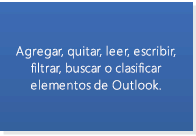
  
](https://msdn.microsoft.com/library/6ea4babf-facf-4018-ef5a-4a484e55153a%28Office.15%29.aspx)[](https://msdn.microsoft.com/library/6ea4babf-facf-4018-ef5a-4a484e55153a%28Office.15%29.aspx)[
  
](selecting-an-api-or-technology-for-developing-solutions-for-outlook.md#OLSelectAPI_ItemPropFieldsForms)](selecting-an-api-or-technology-for-developing-solutions-for-outlook.md#OLSelectAPI_ItemPropFieldsForms)
  
[[
  
](selecting-an-api-or-technology-for-developing-solutions-for-outlook.md#OLSelectAPI_Events)[](selecting-an-api-or-technology-for-developing-solutions-for-outlook.md#OLSelectAPI_Events)[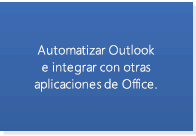
  
](selecting-an-api-or-technology-for-developing-solutions-for-outlook.md#OLSelectAPI_AutomateOutlook)](selecting-an-api-or-technology-for-developing-solutions-for-outlook.md#OLSelectAPI_AutomateOutlook)
  
Además de los escenarios de línea base, si la solución de Outlook admite cualquiera de los escenarios mostrados en la Figura 3 y tiene previsto que la solución se ejecute en Outlook 2007 o una versión posterior, pero no en versiones anteriores, también puede usar el modelo de objetos o PIA. En la Figura 3 se especifican los objetos o miembros principales que puede usar en el modelo de objetos de Outlook para ampliar cada escenario (a excepción de la interfaz [IDTExtensibility2](https://msdn.microsoft.com/library/Extensibility.IDTExtensibility2.aspx) en el modelo de objetos de automatización de Visual Studio y la interfaz [IRibbonExtensibility](https://msdn.microsoft.com/library/b27a7576-b6f5-031e-e307-78ef5f8507e0%28Office.15%29.aspx) en el modelo de objetos de Office, que puede integrar con el modelo de objetos de Outlook).In addition to the baseline scenarios, if your Outlook solution supports any of the scenarios shown in Figure 3, and your solution is intended to run on Outlook 2007 or a later version but not earlier versions, you can use the object model or the PIA, as well. Figure 3 specifies the main objects or members you can use in the Outlook object model to extend each scenario (with the exception of the [IDTExtensibility2](https://msdn.microsoft.com/library/Extensibility.IDTExtensibility2.aspx) interface in the Visual Studio automation object model, and the [IRibbonExtensibility](https://msdn.microsoft.com/library/b27a7576-b6f5-031e-e307-78ef5f8507e0%28Office.15%29.aspx) interface in the Office object model, which you can integrate with the Outlook object model). 
  
Figura 3. Escenarios adicionales admitidos por el modelo de objetos o PIA desde Outlook 2007Figure 3. Additional scenarios supported by the object model or PIA since Outlook 2007
  
[[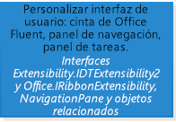
  
](selecting-an-api-or-technology-for-developing-solutions-for-outlook.md#OLSelectAPI_CustomizeTheOutlookInterface)[](selecting-an-api-or-technology-for-developing-solutions-for-outlook.md#OLSelectAPI_CustomizeTheOutlookInterface)[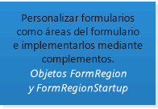
  
](selecting-an-api-or-technology-for-developing-solutions-for-outlook.md#OLSelectAPI_CustomFormRegions)[](selecting-an-api-or-technology-for-developing-solutions-for-outlook.md#OLSelectAPI_CustomFormRegions)[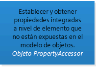
  
](selecting-an-api-or-technology-for-developing-solutions-for-outlook.md#OLSelectAPI_CustomizingProperties)](selecting-an-api-or-technology-for-developing-solutions-for-outlook.md#OLSelectAPI_CustomizingProperties)
  
[[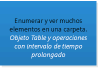
  
](selecting-an-api-or-technology-for-developing-solutions-for-outlook.md#OLSelectAPI_Enumerating)[](selecting-an-api-or-technology-for-developing-solutions-for-outlook.md#OLSelectAPI_Enumerating)[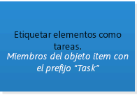
  
](selecting-an-api-or-technology-for-developing-solutions-for-outlook.md#OLSelectAPI_ItemsFlag)[](selecting-an-api-or-technology-for-developing-solutions-for-outlook.md#OLSelectAPI_ItemsFlag)[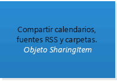
  
](selecting-an-api-or-technology-for-developing-solutions-for-outlook.md#OLSelectAPI_Sharing)](selecting-an-api-or-technology-for-developing-solutions-for-outlook.md#OLSelectAPI_Sharing)
  
[[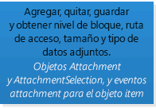
  
](selecting-an-api-or-technology-for-developing-solutions-for-outlook.md#OLSelectAPI_Attachments)[](selecting-an-api-or-technology-for-developing-solutions-for-outlook.md#OLSelectAPI_Attachments)[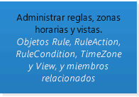
  
](selecting-an-api-or-technology-for-developing-solutions-for-outlook.md#OLSelectAPI_Misc)[](selecting-an-api-or-technology-for-developing-solutions-for-outlook.md#OLSelectAPI_Misc)[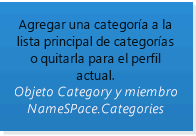
  
](selecting-an-api-or-technology-for-developing-solutions-for-outlook.md#OLSelectAPI_Categories)](selecting-an-api-or-technology-for-developing-solutions-for-outlook.md#OLSelectAPI_Categories)
  
[[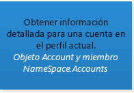
  
](selecting-an-api-or-technology-for-developing-solutions-for-outlook.md#OLSelectAPI_PrimaryAccount)[](selecting-an-api-or-technology-for-developing-solutions-for-outlook.md#OLSelectAPI_PrimaryAccount)[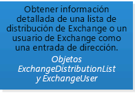
  
](selecting-an-api-or-technology-for-developing-solutions-for-outlook.md#OLSelectAPI_AddressBook)[](selecting-an-api-or-technology-for-developing-solutions-for-outlook.md#OLSelectAPI_AddressBook)[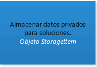
  
](selecting-an-api-or-technology-for-developing-solutions-for-outlook.md#OLSelectAPI_StoringData)](selecting-an-api-or-technology-for-developing-solutions-for-outlook.md#OLSelectAPI_StoringData)
  
Si tiene previsto ejecutar la solución de Outlook en Outlook 2010 y no en versiones anteriores, puede usar el modelo de objetos o PIA para admitir los escenarios mostrados en la Figura 4. En la Figura 4 se especifican los objetos o miembros principales que puede usar en el modelo de objetos de Outlook para ampliar cada escenario (a excepción de las interfaces [IRibbonControl](https://msdn.microsoft.com/library/63aef709-e1d3-b1a6-76af-b568ad0e69ae%28Office.15%29.aspx), [IRibbonExtensibility](https://msdn.microsoft.com/library/b27a7576-b6f5-031e-e307-78ef5f8507e0%28Office.15%29.aspx) y [IRibbonUI](https://msdn.microsoft.com/library/d323aa21-de74-e821-c914-db71ef3b9c5e%28Office.15%29.aspx) en el modelo de objetos de Office, que puede integrar con el modelo de objetos de Outlook).If your Outlook solution is intended to run on Outlook 2010 and not earlier versions, you can choose to use the object model or the PIA to support the scenarios shown in Figure 4. Figure 4 specifies the main objects or members you can use in the Outlook object model to extend each scenario (with the exception of the [IRibbonControl](https://msdn.microsoft.com/library/63aef709-e1d3-b1a6-76af-b568ad0e69ae%28Office.15%29.aspx), [IRibbonExtensibility](https://msdn.microsoft.com/library/b27a7576-b6f5-031e-e307-78ef5f8507e0%28Office.15%29.aspx), and [IRibbonUI](https://msdn.microsoft.com/library/d323aa21-de74-e821-c914-db71ef3b9c5e%28Office.15%29.aspx) interfaces that are in the Office object model, which you can integrate with the Outlook object model). 
  
Figura 4. Más escenarios admitidos por el modelo de objetos o PIA desde Outlook 2010Figure 4. More scenarios supported by the object model or PIA since Outlook 2010
  
[[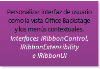
  
](selecting-an-api-or-technology-for-developing-solutions-for-outlook.md#OLSelectAPI_CustomizingUIOutlook2010)[](selecting-an-api-or-technology-for-developing-solutions-for-outlook.md#OLSelectAPI_CustomizingUIOutlook2010)[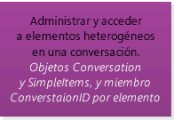
  
](selecting-an-api-or-technology-for-developing-solutions-for-outlook.md#OLSelectAPI_Conversations)[](selecting-an-api-or-technology-for-developing-solutions-for-outlook.md#OLSelectAPI_Conversations)[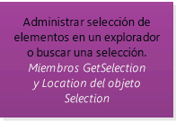
  
](selecting-an-api-or-technology-for-developing-solutions-for-outlook.md#OLSelectAPI_ItemSelection)](selecting-an-api-or-technology-for-developing-solutions-for-outlook.md#OLSelectAPI_ItemSelection)
  
[[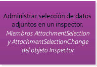
  
](selecting-an-api-or-technology-for-developing-solutions-for-outlook.md#OLSelectAPI_AttachmentSelection)[](selecting-an-api-or-technology-for-developing-solutions-for-outlook.md#OLSelectAPI_AttachmentSelection)[
  
](selecting-an-api-or-technology-for-developing-solutions-for-outlook.md#OLSelectAPI_MultipleAccounts)[](selecting-an-api-or-technology-for-developing-solutions-for-outlook.md#OLSelectAPI_MultipleAccounts)[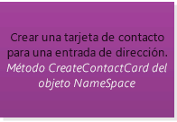
  
](https://msdn.microsoft.com/library/d050e0e3-3c0d-bd01-f008-2628056625d1%28Office.15%29.aspx)](https://msdn.microsoft.com/library/d050e0e3-3c0d-bd01-f008-2628056625d1%28Office.15%29.aspx)
  
[[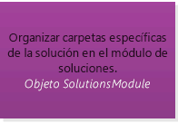
  
](selecting-an-api-or-technology-for-developing-solutions-for-outlook.md#OLSelectAPI_Folders)](selecting-an-api-or-technology-for-developing-solutions-for-outlook.md#OLSelectAPI_Folders)
  
Y si tiene previsto ejecutar la solución en Outlook 2013 y no en versiones anteriores, puede usar el modelo de objetos o PIA para admitir los escenarios mostrados en la Figura 5.And if your solution is intended to run on Outlook 2013 and not any earlier version, you can use the object model or the PIA to support the scenarios shown in Figure 5.
  
Figura 5. Escenarios adicionales admitidos por el modelo de objetos o PIA desde Outlook 2013Figure 5. Additional scenarios supported by the object model or PIA since Outlook 2013
  
[[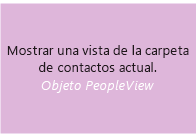
  
](https://msdn.microsoft.com/library/7b569709-5da8-a950-a0fb-9d64b520a21b%28Office.15%29.aspx)[](https://msdn.microsoft.com/library/7b569709-5da8-a950-a0fb-9d64b520a21b%28Office.15%29.aspx)[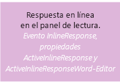
  
](selecting-an-api-or-technology-for-developing-solutions-for-outlook.md#OLSelectAPI_InlineResponse)[](selecting-an-api-or-technology-for-developing-solutions-for-outlook.md#OLSelectAPI_InlineResponse)[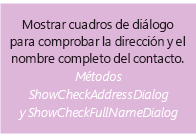
  
](selecting-an-api-or-technology-for-developing-solutions-for-outlook.md#OLSelectAPI_ContactCheckDialogs)](selecting-an-api-or-technology-for-developing-solutions-for-outlook.md#OLSelectAPI_ContactCheckDialogs)
  
[[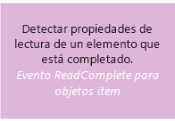
  
](https://msdn.microsoft.com/library/6ea4babf-facf-4018-ef5a-4a484e55153a%28Office.15%29.aspx)](https://msdn.microsoft.com/library/6ea4babf-facf-4018-ef5a-4a484e55153a%28Office.15%29.aspx)
  
## Factores de decisión de MAPIDecision factors for MAPI

En general, use MAPI para tener acceso a datos de un servidor basado en MAPI, como el servidor Microsoft Exchange y para realizar tareas como las siguientes:In general, you use MAPI to access data on a MAPI-based server such as the Microsoft Exchange server, and to do tasks such as the following:
  
- Crear un proveedor de servicios personalizado, como un proveedor de libretas de direcciones, un proveedor de transporte o un proveedor de almacén.Create a custom service provider such as an address book provider, transport provider, or store provider.
    
- Crear un proceso de receptor.Create a sink process.
    
- Crear o manipular un perfil.Create or manipulate a profile.
    
- Ejecutar una aplicación como un servicio de Windows NT.Run an application as a Windows NT service.
    
- Ejecutar tareas en un subproceso en segundo plano. Por ejemplo, enumerar varios elementos en una carpeta y modificar las propiedades de los elementos en un subproceso de segundo plano pueden optimizar el rendimiento.Run tasks on a background thread. For example, enumerating numerous items in a folder and modifying the items' properties in a background thread can optimize performance.
    
Para obtener más información y ejemplos de código, vea la [Referencia MAPI de Outlook](https://msdn.microsoft.com/library/3d980b86-7001-4869-9780-121c6bfc7275%28Office.15%29.aspx) y [MFCMAPI](https://mfcmapi.codeplex.com/).For more information and code samples, see the [Outlook MAPI Reference](https://msdn.microsoft.com/library/3d980b86-7001-4869-9780-121c6bfc7275%28Office.15%29.aspx) and [MFCMAPI](https://mfcmapi.codeplex.com/).
  
Además, si la solución se ejecuta en una versión de Outlook anterior a Outlook 2007 y se aplican escenarios como los siguientes a la solución, debe usar MAPI para ampliar esos escenarios.In addition, if your solution runs on a version of Outlook earlier than Outlook 2007, and scenarios such as the following apply to your solution, you should use MAPI to extend those scenarios.
  
- Establecer y obtener propiedades de elemento integradas que no se exponen en el modelo de objetos.Set and get built-in item-level properties that are not exposed in the object model.
    
- Administrar cuentas, datos adjuntos, listas de distribución de Exchange, usuarios de Exchange o almacenes.Manage accounts, attachments, Exchange distribution lists, Exchange users, or stores.
    
- Almacenar datos privados para soluciones.Store private data for solutions.
    
- Administrar un almacén de mensajes de una cuenta.Manage a message store for an account.
    
Desde Outlook 2007, el modelo de objetos ha admitido una serie de características para las que, antes de Outlook 2007, los desarrolladores tenían que recurrir a MAPI u otras API como Objetos para colaboración de datos (CDO) de Microsoft 1.2.1 y Extensiones de clientes de Microsoft Exchange. Por tanto, si cualquiera de los escenarios de la lista anterior se aplica a su solución, pero esta se ejecuta en Outlook 2007 u Outlook 2010, puede y debe usar el modelo de objetos o PIA de Outlook para admitir estos escenarios. Para obtener más información acerca de las mejoras de Outlook 2007 que unifican las tecnologías de desarrollo de Outlook, vea [What's New for Developers in Outlook 2007 (Part 1 of 2)](https://msdn.microsoft.com/library/76e3f0b7-ef2b-4e9f-8515-3002d75d7721%28Office.15%29.aspx).Since Outlook 2007, the object model has supported a range of features that, prior to Outlook 2007, developers had to resort to MAPI or other APIs such as Microsoft Collaboration Data Objects (CDO) 1.2.1 and Microsoft Exchange Client Extensions. So if any of the scenarios in the previous list applies to your solution, but your solution runs on Outlook 2007 or Outlook 2010, you can and should use the Outlook object model or PIA to support these scenarios. For more information about Outlook 2007 enhancements that unify Outlook development technologies, see [What's New for Developers in Outlook 2007 (Part 1 of 2)](https://msdn.microsoft.com/library/76e3f0b7-ef2b-4e9f-8515-3002d75d7721%28Office.15%29.aspx).
  
## Factores de decisión para las API auxiliaresDecision factors for the Auxiliary APIs

Las API auxiliares de Outlook pueden integrarse con la lógica de negocios de Outlook o MAPI en algunos escenarios donde el modelo de objetos o MAPI no proporcionan una solución. Use las API auxiliares de Outlook en los escenarios siguientes:The Outlook auxiliary APIs can integrate with Outlook business logic or MAPI in some scenarios where the object model or MAPI does not provide a solution. Use the Outlook auxiliary APIs in the following scenarios:
  
- Administración de cuentas: administrar información de cuentas, manipular cuentas, proporcionar notificaciones de cambios en la cuenta y proteger las cuentas contra correo no deseado.Account management: Manage account information, manipulate accounts, provide notification on account changes, and protect accounts from spam. 
    
- Degradación de datos: encapsular un objeto en un formato de carácter preferido en lugar de exponer el objeto en su formato nativo.Data degradation: Wrap an object in a preferred character format rather than exposing the object in its native format.
    
- Reorganización de calendarios y compatibilidad con zonas horarias: reorganizar calendarios de Outlook para admitir el horario de verano.Rebasing calendars and time zone support: Rebase Outlook calendars to support daylight saving time.
    
- Estado de disponibilidad: proporcionar información de disponibilidad en los calendarios.Free/busy status: Provide free/busy information on calendars.
    
- Imágenes de contactos: determinar si se muestra de la imagen de un contacto en Outlook.Contact pictures: Determine the display of a contact's picture in Outlook.
    
- Moneda del elemento: determinar si un elemento de Outlook tiene cambios sin guardar.Item currency: Determine whether an Outlook item has unsaved changes.
    
- Clasificar un elemento: clasificar un elemento de Outlook después de enviarlo.Categorizing an item: Categorize an Outlook item after sending the item.
    
Para obtener más información acerca de las API auxiliares, vea la sección [Recursos adicionales: API auxiliares](#OLSelectAPI_AdditionalResourcesAuxAPIs).For more information about the auxiliary APIs, see the [Additional resources—Auxiliary APIs](#OLSelectAPI_AdditionalResourcesAuxAPIs) section. 
  
## Automatización de Outlook con soluciones dentro del proceso o fuera del procesoAutomating Outlook by in-process vs. out-of-process Solutions

> [!NOTE]
> La explicación sobre la automatización de Outlook que se incluye en esta sección y la siguiente queda fuera del ámbito de las Complementos de Office, cuya finalidad es ampliar la funcionalidad del cliente de Office o la aplicación web, pero no automatizarlos.The discussion of automating Outlook in this section and the next is outside the scope of Office Add-ins, which are intended to extend the functionality of the Office client or web application but not to automate it. 
  
Outlook admite la automatización por medio de complementos que ejecutan el primer proceso en primer plano que el proceso de Outlook y por medio de soluciones independientes que se ejecutan en su propio proceso independiente fuera del proceso de Outlook. Por lo general, para automatizar Outlook, use un complemento para interactuar con Outlook a través del modelo de objetos, PIA o MAPI y, en escenarios menos habituales, a través de una API auxiliar (como [HrProcessConvActionForSentItem](auxiliary/hrprocessconvactionforsentitem.md)). Use una solución fuera del proceso solo cuando sea necesario (por ejemplo, cuando escriba una aplicación cliente MAPI que use el archivo Tzmovelib.dll para reorganizar los calendarios de Outlook para clientes o para enumerar numerosos elementos en una carpeta y sus propiedades en un subproceso en segundo plano para optimizar el rendimiento).Outlook supports automation by using add-ins that run in the same foreground process as the Outlook process, and by standalone solutions that run in their own separate process outside of the Outlook process. Generally, to automate Outlook, use an add-in to interact with Outlook through the object model, PIA, or MAPI, and in less common scenarios, through an auxiliary API (such as [HrProcessConvActionForSentItem](auxiliary/hrprocessconvactionforsentitem.md)). Use an out-of-process solution only when it's necessary (for example, when you're writing a MAPI client application that uses the Tzmovelib.dll file to rebase Outlook calendars for customers, or enumerating numerous items in a folder and modifying the items' properties in a background thread to optimize performance). 
  
Los complementos son la solución preferente para automatizar Outlook, ya que Outlook solo confía en el objeto [Application](https://msdn.microsoft.com/library/797003e7-ecd1-eccb-eaaf-32d6ddde8348%28Office.15%29.aspx) pasado al complemento durante el evento [OnConnection(Object, ext_ConnectMode, Object, Array)](https://msdn.microsoft.com/library/Extensibility.IDTExtensibility2.OnConnection.aspx) del complemento. Puede evitar que se muestren advertencias de seguridad de la protección del modelo de objetos si deriva todos los objetos, propiedades y métodos de este objeto **Application**. Si el complemento crea una nueva instancia del objeto **Application**, Outlook no confía en ese objeto, aunque el complemento esté en la lista de complementos de confianza. No se confiará en los objetos, propiedades y métodos derivados de ese objeto **Application** y las propiedades y los métodos bloqueados invocarán advertencias de seguridad. Para obtener más información acerca de la protección del modelo de objetos, vea [Comportamiento de la seguridad del modelo de objetos de Outlook](https://msdn.microsoft.com/library/4aa3b7c7-5f3f-41ce-bbf3-75d8ecbd6d4f%28Office.15%29.aspx).Add-ins are the preferred solution to automate Outlook, because Outlook trusts only the [Application](https://msdn.microsoft.com/library/797003e7-ecd1-eccb-eaaf-32d6ddde8348%28Office.15%29.aspx) object passed to the add-in during the [OnConnection(Object, ext_ConnectMode, Object, Array)](https://msdn.microsoft.com/library/Extensibility.IDTExtensibility2.OnConnection.aspx) event of the add-in. You can avoid the display of security warnings of the Object Model Guard by deriving all objects, properties, and methods from this **Application** object. If the add-in creates a new instance of the **Application** object, Outlook does not trust that object, even if the add-in is on the list of trusted add-ins. Any objects, properties, and methods derived from such an **Application** object will not be trusted and the blocked properties and methods will invoke security warnings. For more information about the Outlook Object Model Guard, see [Security Behavior of the Outlook Object Model](https://msdn.microsoft.com/library/4aa3b7c7-5f3f-41ce-bbf3-75d8ecbd6d4f%28Office.15%29.aspx).
  
## Automatización de Outlook con soluciones administradas y no administradasAutomating Outlook by managed vs. unmanaged solutions

Outlook admite la automatización con complementos y aplicaciones independientes, escritos en lenguajes administrados y no administrados. Los lenguajes administrados que se usan más habitualmente son C# y Visual Basic. Las herramientas de C++ y Delphi son más habituales en el desarrollo no administrado. Hay que tener en cuenta los conocimientos al elegir entre el desarrollo administrado y no administrado.Outlook supports automation by add-ins and standalone applications, written in managed or unmanaged languages. The more commonly used managed languages are C# and Visual Basic. C++ and Delphi tools are more common in unmanaged development. Available expertise is one consideration when choosing between managed and unmanaged development. 
  
Si la solución solo usa el modelo de objetos, puede considerar la posibilidad de desarrollar una solución administrada por medio de PIA o de las herramientas de desarrollo de Office en Visual Studio. Las herramientas de desarrollo de Office en Visual Studio proporcionan plantillas de proyecto y diseñadores visuales que simplifican la creación de interfaces de usuario personalizadas y el desarrollo de soluciones de Office.If your solution uses only the object model, you can consider developing a managed solution by using the PIA, or Office development tools in Visual Studio. The Office development tools in Visual Studio provide project templates and visual designers that simplify creating custom user interfaces and developing Office solutions.
  
Por otra parte, como MAPI se desarrolló años antes que .NET Framework y Microsoft no proporciona contenedores administrados para MAPI, Microsoft no admite el uso de MAPI en el código administrado. Si usa MAPI, debe desarrollar una solución no administrada. Para obtener más información, vea las [directrices de compatibilidad para el desarrollo de mensajería de cliente](https://support.microsoft.com/kb/266353/en-us).On the other hand, because MAPI was developed years before the .NET Framework, and Microsoft does not provide managed wrappers for MAPI, Microsoft does not support using MAPI in managed code. If you are using MAPI, you must develop an unmanaged solution. For more information, see [The support guidelines for client-side messaging development](https://support.microsoft.com/kb/266353/en-us).
  
## API y tecnologías de nichoNiche APIs and technologies

Outlook Social Connector (OSC) y la Barra de meteorología admiten la ampliación de escenarios muy concretos en Outlook.The Outlook Social Connector (OSC) and Weather Bar support extending very specific scenarios in Outlook. 
  
### Extensibilidad de proveedores de Outlook Social Connector (OSC)Outlook Social Connector (OSC) provider extensibility

La extensibilidad de proveedores de Outlook Social Connector (OSC) admite el desarrollo de un proveedor para una red social que permita a los usuarios ver, en Outlook y otras aplicaciones cliente de Office, actualizaciones de amigos y actividades en esa red social. En la Figura 6 se muestra OSC con las actividades de una persona en los sitios de redes sociales en el panel de personas.The Outlook Social Connector (OSC) provider extensibility supports developing a provider for a social network to allow users to view, in Outlook and other Office client applications, friends and activities updates on that social network. Figure 6 shows the OSC displaying in the People Pane the activities of a person in social network sites.
  
**Figura 6. OSC con datos de redes sociales en el panel de personas****Figure 6. The OSC displaying social network data in the People Pane**

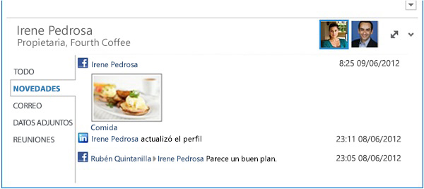
  
OSC en Outlook permite a los usuarios ver, en el panel de personas, una agregación de mensajes de correo electrónico, archivos adjuntos y convocatorias de reunión de una persona en Outlook. En un entorno de organización, los usuarios que colaboran en un sitio de SharePoint pueden ver actualizaciones de documentos y otras actividades del sitio de esta persona en el sitio de SharePoint. La extensibilidad de proveedores de Outlook Social Connector admite el desarrollo de un proveedor para que OSC sincronice y muestre actualizaciones de redes sociales en Outlook. Los proveedores de OSC habituales comunes (como Facebook y Linkedln) se instalan de manera predeterminada con Outlook. En función de los sitios de redes sociales en los que haya iniciado sesión un usuario de Outlook, el usuario puede ver, en el panel de personas, actualizaciones como fotos, estados y actividades en las redes sociales correspondientes.The OSC in Outlook allows users to view, in the People Pane, an aggregation of emails, attachments, and meeting requests from a person in Outlook. In an organizational environment, users who collaborate on a SharePoint site can see document updates and other site activities of this person on the SharePoint site. Outlook Social Connector provider extensibility supports developing a provider for the OSC to synchronize and surface social network updates in Outlook. Common OSC providers (such as Facebook and LinkedIn) are installed by default with Outlook. Depending on the social network sites that an Outlook user has signed into, the user can see, in the People Pane, updates such as photos, status, and activities on the corresponding social networks. 
  
### Extensibilidad de la Barra de meteorologíaWeather Bar extensibility

A partir de Outlook 2013, la Barra de meteorología permite a los desarrolladores conectar un servicio web de meteorología de terceros para proporcionar datos de las condiciones meteorológicas para una ubicación elegida por el usuario. La Barra de meteorología de Outlook muestra las condiciones meteorológicas y la previsión del tiempo para una ubicación geográfica. Un usuario puede elegir una o varias ubicaciones y ver cómodamente los datos meteorológicos en la Barra de meteorología en el módulo de calendario. En la Figura 7 se muestra la Barra de meteorología con una previsión a tres días para Nueva York.Starting in Outlook 2013, the Weather Bar allows developers to plug in a third-party weather web service for the Weather Bar, to provide weather conditions data for a user-chosen location. The Weather Bar in Outlook displays weather conditions and forecast for a geographic location. A user can choose one or multiple locations, and conveniently see weather data in the Weather Bar in the calendar module. Figure 7 shows the Weather Bar displaying a three-day forecast for New York, NY. 
  
**Figura 7. Barra de meteorología en Outlook****Figure 7. Weather Bar in Outlook**

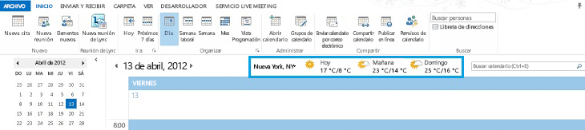
  
De manera predeterminada, Outlook usa datos meteorológicos proporcionados por MSN Clima. La Barra de meteorología es compatible con servicios web de datos meteorológicos de terceros que sigan un protocolo definido para comunicarse con Outlook. Siempre que un servicio de datos meteorológicos de terceros sea compatible con este protocolo, los usuarios podrán elegir dicho servicio para proporcionar datos meteorológicos en la Barra de meteorología.By default, Outlook uses weather data provided by MSN Weather. The Weather Bar supports third-party weather data web services which follow a defined protocol to communicate with Outlook. As long as a third-party weather data service supports this protocol, users can choose that weather data service to provide weather data in the Weather Bar.
  
Vea la sección [Recursos adicionales: referencias y recursos principales y ejemplos de código](#OLSelectAPI_AdditionalResourcesRefCode) para obtener más información sobre el uso de la extensibilidad de proveedores de OSC y la Barra de meteorología.See the [Additional resources—primary references, resources, and code samples](#OLSelectAPI_AdditionalResourcesRefCode) section for more information about using OSC provider extensibility and the Weather Bar extensibility. 
  
## ConclusiónConclusion

Para determinar la mejor API o tecnología para su solución, primero debe definir los objetivos de la solución:To determine the best API or technology for your solution, you must first define the goals of your solution: 
  
- Las versiones de Outlook que desea que admita su solución.The versions of Outlook you intend your solution to support.
    
- Los escenarios de alta prioridad de la solución. ¿La solución interactúa principalmente con el contenido y las propiedades de un elemento de mensaje o de cita? ¿O automatiza Outlook en el nivel de aplicación? Si es así, ¿estos escenarios implican enumerar, filtrar o modificar carpetas que contienen muchos elementos de Outlook?The high-priority scenarios of your solution. Does your solution mainly interact with the content and properties of a message or appointment item? Or does your solution automate Outlook at an application level? If so, do these scenarios involve enumerating, filtering, or modifying folders that contain many Outlook items?
    
En primer lugar, compruebe si la compatibilidad con aplicaciones de correo en la plataforma de Complementos de Office satisface sus necesidades. Vea la sección Criterios funcionales en [Criterios de evaluación objetiva de la plataforma de aplicaciones para Office](#OLSelectAPI_ObjectiveEvalCritApps) para determinar si los objetos y las características principales admiten sus escenarios. Vea la sección [Factores de decisión para la plataforma de aplicaciones para Office](#OLSelectAPI_FactorsApps) para comprobar si las aplicaciones de correo son una opción mejor que los complementos para sus escenarios. En general, desarrolle la solución como una aplicación, si es posible, para aprovechar la compatibilidad de la plataforma en clientes de Outlook de distintos factores de forma.First, verify whether the mail app support in the Office Add-ins platform meets your needs. See the Functional Criteria section of [Objective evaluation criteria for the apps for Office platform](#OLSelectAPI_ObjectiveEvalCritApps) to determine whether the major objects and features support your scenarios. See the section [Decision factors for the apps for Office platform](#OLSelectAPI_FactorsApps) to verify whether mail apps are a better choice than add-ins for your scenarios. In general, develop your solution as an app, if possible, to take advantage of the platform's support across Outlook clients over different form factors. 
  
Si sus escenarios requieren una ampliación de más envergadura que los elementos de mensaje y cita o que Outlook se automatice en el nivel de aplicación, intente averiguar con qué escenarios de la sección [Factores de decisión para el modelo de objetos o PIA](#OLSelectAPI_FactorsOM) coinciden sus escenarios. Si el modelo de objetos (o PIA) de las versiones de destino de Outlook admite sus escenarios y la solución no manipula carpetas con muchos elementos, debería implementar la solución como complemento, en un lenguaje administrado o no administrado.If your scenarios require you to extend beyond message and appointment items, or require you to automate Outlook at an application level, try to match your scenarios with those outlined in the section [Decision factors for the object model or PIA](#OLSelectAPI_FactorsOM). If the object model (or PIA) of your target Outlook versions supports your scenarios, and your solution does not manipulate folders with many items, you should implement your solution as an add-in, in either a managed or unmanaged language. 
  
Si el modelo de objetos (o PIA) de una versión de destino de Outlook no admite algunos de sus escenarios, compruebe si los escenarios de la sección [Factores de decisión para MAPI](#OLSelectAPI_FactorsMAPI) o [Factores de decisión para las API auxiliares](#OLSelectAPI_FactorsAux) satisfacen sus necesidades. Si MAPI satisface sus necesidades, debe implementar la solución en código no administrado. Si una API auxiliar resuelve uno de los escenarios, puede usar código administrado o no administrado.If the object model (or PIA) of a target Outlook version does not support some of your scenarios, verify whether the scenarios in the [Decision factors for MAPI](#OLSelectAPI_FactorsMAPI) or [Decision factors for the Auxiliary APIs](#OLSelectAPI_FactorsAux) section meet your needs. If MAPI meets your needs, you should implement your solution in unmanaged code. If an auxiliary API solves one of your scenarios, you can use managed or unmanaged code. 
  
Si la solución usa MAPI, debe implementarla en código no administrado, como C++. De lo contrario, la decisión de usar código administrado o no administrado para crear la solución suele depender de los recursos disponibles y su experiencia. En lo que concierne a la decisión de si implementar la solución como un complemento o como una aplicación independiente, elija un complemento para evitar que el usuario invoque constantemente la protección del modelo de objetos, a menos que el escenario requiera manipular carpetas que contengan numerosos elementos. En este último escenario, implementar la solución para que se ejecute como un subproceso en segundo plano puede optimizar el rendimiento de Outlook.If your solution uses MAPI, you must implement it in unmanaged code, such as C++. Otherwise, the decision to use managed or unmanaged code to create the solution generally depends on your available resources and their expertise. As for deciding whether to implement the solution as an add-in or standalone application, choose an add-in to avoid the user constantly invoking the Outlook Object Model Guard, unless your scenario requires manipulation of folders that contain numerous items. In the latter scenario, implementing the solution to run as a background thread can optimize Outlook performance.
  
Si los escenarios incluyen mostrar información o actualizaciones de redes sociales en Outlook, debe usar la extensibilidad de proveedores de OSC para crear un archivo DLL visible para COM. Puede hacerlo en un lenguaje administrado o en un lenguaje no administrado.If your scenarios include showing social network information or updates in Outlook, you should use the OSC provider extensibility to create a COM-visible DLL. You can do this in either a managed or unmanaged language.
  
Si le interesa conectar un servicio de datos meteorológicos de terceros a la Barra de meteorología, puede seguir el protocolo definido por la extensibilidad de la Barra de meteorología y proporcionar los servicios web apropiados. Puede crear estos servicios web en un lenguaje administrado.If you are interested in plugging in a third-party weather data service to the Weather Bar, you can follow the protocol defined by Weather Bar extensibility and provide the appropriate web services. You can create these web services in a managed language.
  
En cuanto haya decidido cuáles serán las API o las tecnologías que usará en la solución, puede consultar información adicional y ejemplos de código en la sección [Recursos adicionales: referencias y recursos principales y ejemplos de código](#OLSelectAPI_AdditionalResourcesRefCode) para obtener más información.Once you have decided on the APIs or technologies to use in your solution, you can refer to additional documentation and code samples in the [Additional resources—primary references, resources, and code samples](#OLSelectAPI_AdditionalResourcesRefCode) section for more information. 
  
## Vea también: Complementos de OfficeSee also: Office Add-ins

En [Empezar a crear aplicaciones para Office](https://msdn.microsoft.com/library/e64de870-ce22-4331-92e7-76d35279bf91%28Office.15%29.aspx) se proporciona una buena introducción a las Complementos de Office, incluidos la arquitectura y el ciclo de vida de desarrollo.[Office Add-ins platform overview](https://msdn.microsoft.com/library/e64de870-ce22-4331-92e7-76d35279bf91%28Office.15%29.aspx) provides a good introduction of Office Add-ins, including the architecture and development life cycle. 
  
Vea [Complementos de Outlook](https://msdn.microsoft.com/library/71e64bc9-e347-4f5d-8948-0a47b5dd93e6%28Office.15%29.aspx) para obtener una guía detallada de recursos sobre el desarrollo de aplicaciones de correo.See [Outlook add-ins](https://msdn.microsoft.com/library/71e64bc9-e347-4f5d-8948-0a47b5dd93e6%28Office.15%29.aspx) for a detailed roadmap of resources about developing mail apps. 
  
## Vea también: Modelo de objeto y PIASee also: Object model and PIA

Los siguientes recursos proporcionan más información acerca de cómo usar el modelo de objetos y PIA.The following resources provide more information about using the object model and PIA.
  
### Cuentas: cuenta principal de Exchange en el perfilAccounts—primary Exchange account in profile

- Objeto [Account](https://msdn.microsoft.com/library/f624438c-4e45-2822-18b6-bfe8074a33c0%28Office.15%29.aspx)[Account](https://msdn.microsoft.com/library/f624438c-4e45-2822-18b6-bfe8074a33c0%28Office.15%29.aspx) object 
    
- Propiedad [NameSpace.Accounts](https://msdn.microsoft.com/library/80e969ea-d2cc-966d-5fe4-68d59951b5c9%28Office.15%29.aspx)[NameSpace.Accounts](https://msdn.microsoft.com/library/80e969ea-d2cc-966d-5fe4-68d59951b5c9%28Office.15%29.aspx) property 
    
### Cuentas: varias cuentas en el perfilAccounts—multiple accounts in profile

- Objeto [Account](https://msdn.microsoft.com/library/f624438c-4e45-2822-18b6-bfe8074a33c0%28Office.15%29.aspx)[Account](https://msdn.microsoft.com/library/f624438c-4e45-2822-18b6-bfe8074a33c0%28Office.15%29.aspx) object 
    
- [Usar varias cuentas para el mismo perfil en OutlookUsing Multiple Accounts for the Same Profile on Outlook](https://msdn.microsoft.com/library/9e06e076-d62a-37c8-4502-709da5a0b104%28Office.15%29.aspx)
    
- [Obtener información de varias cuentasObtain Information for Multiple Accounts](https://msdn.microsoft.com/library/af587ee2-429a-252f-ecb6-2f058b9a37a8%28Office.15%29.aspx)
    
- [Manipular varias cuentas de Exchange en Outlook 2010Manipulating Multiple Exchange Accounts in Outlook 2010](https://msdn.microsoft.com/library/b5a80da9-102d-4617-8a06-49ded01a237a%28Office.15%29.aspx)
    
### Libreta de direcciones y usuarios de ExchangeAddress book and Exchange users

- [Mostrar nombres de la Libreta de direccionesDisplay Names from the Address Book](https://msdn.microsoft.com/library/32e7179c-8133-ee20-ecf6-52c9275f205f%28Office.15%29.aspx)
    
- [Obtener acceso a información de una lista de distribución o un usuario de Exchange desde la libreta de direccionesAccess Exchange User or Distribution List Information from the Address Book](https://msdn.microsoft.com/library/077a8666-09c5-e641-0b9b-7d83133d931f%28Office.15%29.aspx)
    
- [Mostrar la lista de grupos a los que pertenece el administradorList the Groups that My Manager Belongs to](https://msdn.microsoft.com/library/2f0ff92c-e026-4f62-c039-fbda9aaf1546%28Office.15%29.aspx)
    
- [Mostrar la lista de nombres y ubicaciones de Office de todos los administradores que pertenecen a una lista de distribución de ExchangeList the Name and Office Location of Each Manager Belonging to an Exchange Distribution List](https://msdn.microsoft.com/library/abc26854-62db-be7f-4025-46acbcb42541%28Office.15%29.aspx)
    
- Objeto [AddressEntries](https://msdn.microsoft.com/library/db91b717-07c6-d1f2-c545-b766ee1f0c6b%28Office.15%29.aspx)[AddressEntries](https://msdn.microsoft.com/library/db91b717-07c6-d1f2-c545-b766ee1f0c6b%28Office.15%29.aspx) object 
    
- Objeto [AddressLists](https://msdn.microsoft.com/library/b8c5ce75-3030-0179-45bb-f44fe6628074%28Office.15%29.aspx)[AddressLists](https://msdn.microsoft.com/library/b8c5ce75-3030-0179-45bb-f44fe6628074%28Office.15%29.aspx) object 
    
- Objeto [ExchangeDistributionList](https://msdn.microsoft.com/library/2830dfba-6c0a-a81f-6b98-92ac2aafb59d%28Office.15%29.aspx)[ExchangeDistributionList](https://msdn.microsoft.com/library/2830dfba-6c0a-a81f-6b98-92ac2aafb59d%28Office.15%29.aspx) object 
    
- Objeto [ExchangeUser](https://msdn.microsoft.com/library/6ec117d1-7fdb-aa36-b567-1242f8238df0%28Office.15%29.aspx)[ExchangeUser](https://msdn.microsoft.com/library/6ec117d1-7fdb-aa36-b567-1242f8238df0%28Office.15%29.aspx) object 
    
- Objeto [SelectNamesDialog](https://msdn.microsoft.com/library/1522736a-3cad-9f1c-4da9-b52a3a01731c%28Office.15%29.aspx)[SelectNamesDialog](https://msdn.microsoft.com/library/1522736a-3cad-9f1c-4da9-b52a3a01731c%28Office.15%29.aspx) object 
    
### Datos adjuntosAttachments

- [Adjuntar un archivo a un elemento de correoAttach a File to a Mail Item](https://msdn.microsoft.com/library/1d94629b-e713-92cb-32de-c8910612e861%28Office.15%29.aspx)
    
- [Tipos de archivos adjuntos restringidos por Outlook 2010Attachment file types restricted by Outlook 2010](https://technet.microsoft.com/es-ES/library/cc179163.aspx)
    
- Objeto [Attachment](https://msdn.microsoft.com/library/3e11582b-ac90-0948-bc37-506570bb287b%28Office.15%29.aspx)[Attachment](https://msdn.microsoft.com/library/3e11582b-ac90-0948-bc37-506570bb287b%28Office.15%29.aspx) object 
    
- Objeto [AttachmentSelection](https://msdn.microsoft.com/library/398cf106-a904-9048-e627-e47aaadf1105%28Office.15%29.aspx)[AttachmentSelection](https://msdn.microsoft.com/library/398cf106-a904-9048-e627-e47aaadf1105%28Office.15%29.aspx) object 
    
- Evento **AttachmentAdd** por objeto de elemento**AttachmentAdd** event per item object 
    
- Evento **AttachmentRead** por objeto de elemento**AttachmentRead** event per item object 
    
- Evento **AttachmentRemove** por objeto de elemento**AttachmentRemove** event per item object 
    
- Evento **BeforeAttachmentAdd** por objeto de elemento**BeforeAttachmentAdd** event per item object 
    
- Evento **BeforeAttachmentPreview** por objeto de elemento**BeforeAttachmentPreview** event per item object 
    
- Evento **BeforeAttachmentRead** por objeto de elemento**BeforeAttachmentRead** event per item object 
    
- Evento **BeforeAttachmentSave** por objeto de elemento**BeforeAttachmentSave** event per item object 
    
- Evento **BeforeAttachmentWrite** por objeto de elemento**BeforeAttachmentWrite** event per item object 
    
### Archivos adjuntos: selección en el inspectorAttachments: selection in inspector

- Propiedad [Inspector.AttachmentSelection](https://msdn.microsoft.com/library/19466ce7-def8-4cce-1776-dcea1df9f15d%28Office.15%29.aspx)[Inspector.AttachmentSelection](https://msdn.microsoft.com/library/19466ce7-def8-4cce-1776-dcea1df9f15d%28Office.15%29.aspx) property 
    
- Eventos [Inspector.AttachmentSelectionChange](https://msdn.microsoft.com/library/1250045d-bcb3-b823-31d5-ec31c64ad59e%28Office.15%29.aspx)[Inspector.AttachmentSelectionChange](https://msdn.microsoft.com/library/1250045d-bcb3-b823-31d5-ec31c64ad59e%28Office.15%29.aspx) event 
    
### Automatización de OutlookAutomating Outlook

- [Personalizar Outlook utilizando complementos COMCustomizing Outlook using COM add-ins](https://msdn.microsoft.com/library/84a4f616-3ace-0139-57d5-f0c070064ab2%28Office.15%29.aspx)
    
- [Creación de un complemento de C++ para Outlook 2010Building a C++ Add-in for Outlook 2010](https://msdn.microsoft.com/library/70b308e7-d713-4a26-9892-5021f7320674%28Office.15%29.aspx)
    
- [Introduction to interoperability between COM and .NET](https://msdn.microsoft.com/library/6b2d099a-ec6f-4099-aaf6-e61003fe5a32%28Office.15%29.aspx) (Introducción a la interoperabilidad entre COM y .NET)[Introduction to Interoperability Between COM and .NET](https://msdn.microsoft.com/library/6b2d099a-ec6f-4099-aaf6-e61003fe5a32%28Office.15%29.aspx)
    
- [Por qué usar Outlook PIAWhy Use the Outlook PIA](https://msdn.microsoft.com/library/5cc9085e-7c97-4698-8cb9-e33e427c02e7%28Office.15%29.aspx)
    
- [Procedimientos recomendados para desarrollar complementos de Outlook administradosBest Practices in Developing Managed Outlook Add-Ins](https://msdn.microsoft.com/library/a03246f6-2ca5-4fcb-8e63-a11cfbc8d9a0%28Office.15%29.aspx)
    
- [Obtener e iniciar sesión en una instancia de OutlookObtain and Log On to an Instance of Outlook ](https://msdn.microsoft.com/library/ef369364-6500-2759-3ef4-ed4411112e96%28Office.15%29.aspx)
    
- [Automatizar Outlook desde una aplicación de Visual BasicAutomating Outlook from a Visual Basic Application](https://msdn.microsoft.com/library/623f91af-cd50-1ff0-9519-5a39cbcf5d18%28Office.15%29.aspx)
    
- [Automatizar Outlook desde otras aplicaciones de OfficeAutomating Outlook from Other Office Applications](https://msdn.microsoft.com/library/d3e44f80-df67-2d28-94dc-14d7a8c8c26c%28Office.15%29.aspx)
    
### CategoriesCategories

- [Clasificar los elementos de Outlook por categoríasCategorize Your Outlook Items](https://msdn.microsoft.com/library/e8cfb450-b8b0-bee6-fdf0-d0a92bf9af56%28Office.15%29.aspx)
    
- Objeto [Category](https://msdn.microsoft.com/library/143ef095-54b0-cbe2-e356-632029061ac2%28Office.15%29.aspx)[Category](https://msdn.microsoft.com/library/143ef095-54b0-cbe2-e356-632029061ac2%28Office.15%29.aspx) object 
    
- Propiedad [NameSpace.Categories](https://msdn.microsoft.com/library/3963afca-3a7e-38d7-1347-7e1467be3a10%28Office.15%29.aspx)[NameSpace.Categories](https://msdn.microsoft.com/library/3963afca-3a7e-38d7-1347-7e1467be3a10%28Office.15%29.aspx) property 
    
### Contactos: comprobar la dirección y el nombre completoContacts: check address and full name

- Método [ContactItem.ShowCheckAddressDialog](https://msdn.microsoft.com/library/773a1a3c-1247-fd48-399a-728766e56570%28Office.15%29.aspx)[ContactItem.ShowCheckAddressDialog](https://msdn.microsoft.com/library/773a1a3c-1247-fd48-399a-728766e56570%28Office.15%29.aspx) method 
    
- Método [ContactItem.ShowCheckFullNameDialog](https://msdn.microsoft.com/library/d42632e3-6f50-cce7-80c6-cf846be1f925%28Office.15%29.aspx)[ContactItem.ShowCheckFullNameDialog](https://msdn.microsoft.com/library/d42632e3-6f50-cce7-80c6-cf846be1f925%28Office.15%29.aspx) method 
    
### ConversacionesConversations

- [Administrar elementos de Outlook como conversacionesManaging Outlook Items as Conversations](https://msdn.microsoft.com/library/d91959d7-07b2-7952-8e6d-a39422d355e0%28Office.15%29.aspx)
    
- [Obtener y enumerar las conversaciones seleccionadasObtain and Enumerate Selected Conversations](https://msdn.microsoft.com/library/3bba1e98-b2eb-c53d-354a-bdd899b65a59%28Office.15%29.aspx)
    
- Objeto [Conversation](https://msdn.microsoft.com/library/2705d38a-ebc0-e5a7-208b-ffe1f5446b1b%28Office.15%29.aspx)[Conversation](https://msdn.microsoft.com/library/2705d38a-ebc0-e5a7-208b-ffe1f5446b1b%28Office.15%29.aspx) object 
    
- Objeto [ConversationHeader](https://msdn.microsoft.com/library/5142d5f7-55c1-4d9d-3a11-d25c8763fcb7%28Office.15%29.aspx)[ConversationHeader](https://msdn.microsoft.com/library/5142d5f7-55c1-4d9d-3a11-d25c8763fcb7%28Office.15%29.aspx) object 
    
- Objeto [SimpleItems](https://msdn.microsoft.com/library/b929ae28-fe5f-607e-37b5-ed6a304d4896%28Office.15%29.aspx)[SimpleItems](https://msdn.microsoft.com/library/b929ae28-fe5f-607e-37b5-ed6a304d4896%28Office.15%29.aspx) object 
    
- Propiedad **ConversationID** por objeto de elemento**ConversationID** property per item object 
    
### EventsEvents

- [Trabajar con eventos de OutlookWorking with Outlook Events](https://msdn.microsoft.com/library/514f8f31-8047-2a9f-cbac-d0a23218f49c%28Office.15%29.aspx)
    
- [Implementar un contenedor para inspectores y realizar un seguimiento de eventos al nivel del elemento en cada inspectorImplement a Wrapper for Inspectors and Track Item-Level Events in Each Inspector](https://msdn.microsoft.com/library/8021dd2b-c36c-492b-b281-783e85140ad8%28Office.15%29.aspx)
    
### Explorador: respuesta en líneaExplorer: inline response

- Propiedad [Explorer.ActiveInlineResponse](https://msdn.microsoft.com/library/fc38314d-7cff-44f4-9151-6129f918a721%28Office.15%29.aspx)[Explorer.ActiveInlineResponse](https://msdn.microsoft.com/library/fc38314d-7cff-44f4-9151-6129f918a721%28Office.15%29.aspx) property 
    
- Propiedad [Explorer.ActiveInlineResponseWordEditor](https://msdn.microsoft.com/library/b9058694-ab8f-4962-ab7d-afac1704dd29%28Office.15%29.aspx)[Explorer.ActiveInlineResponseWordEditor](https://msdn.microsoft.com/library/b9058694-ab8f-4962-ab7d-afac1704dd29%28Office.15%29.aspx) property 
    
- Evento [Explorer.InlineResponse](https://msdn.microsoft.com/library/5dbaddbd-e6cd-4776-b417-c67f51b12812%28Office.15%29.aspx)[Explorer.InlineResponse](https://msdn.microsoft.com/library/5dbaddbd-e6cd-4776-b417-c67f51b12812%28Office.15%29.aspx) event 
    
### Elementos: propiedades básicas, campos y formulariosItems: basic properties, fields, and forms

- [Objetos de elementos de OutlookOutlook Item Objects](https://msdn.microsoft.com/library/6ea4babf-facf-4018-ef5a-4a484e55153a%28Office.15%29.aspx)
    
- Objeto [ItemProperties](https://msdn.microsoft.com/library/34a110ed-6617-72da-1e98-a9773c705b40%28Office.15%29.aspx)[ItemProperties](https://msdn.microsoft.com/library/34a110ed-6617-72da-1e98-a9773c705b40%28Office.15%29.aspx) object 
    
- Objeto [UserProperties](https://msdn.microsoft.com/library/20b49c86-d74f-9bda-382c-559af278c148%28Office.15%29.aspx)[UserProperties](https://msdn.microsoft.com/library/20b49c86-d74f-9bda-382c-559af278c148%28Office.15%29.aspx) object 
    
- [Información general de los campos estándarStandard Fields Overview](https://msdn.microsoft.com/library/f0d903a3-f404-8511-af3d-d4f3e30f0779%28Office.15%29.aspx)
    
- [Campos de Outlook y propiedades equivalentesOutlook Fields and Equivalent Properties](https://msdn.microsoft.com/library/acc5d2c5-f579-0a60-5676-3faa63f26c0e%28Office.15%29.aspx)
    
- [Información general de tipos de datos y de los campos personalizadosCustom Fields and Data Types Overview](https://msdn.microsoft.com/library/a85a7bc2-2b85-1782-04a3-0104e0df32aa%28Office.15%29.aspx)
    
- [Personalizar páginas de formulario y áreas de formularioCustomizing Form Pages and Form Regions](https://msdn.microsoft.com/library/c8c2d080-66a8-b761-bdc0-527b209e0bd1%28Office.15%29.aspx)
    
### Elementos: personalización de propiedadesItems: customizing properties

- [Descripción general de las propiedadesProperties Overview](https://msdn.microsoft.com/library/242c9e89-a0c5-ff89-0d2a-410bd42a3461%28Office.15%29.aspx)
    
- [Efficiently Getting and Setting Custom Properties in a Contact Folder in Outlook 2010Efficiently Getting and Setting Custom Properties in a Contact Folder in Outlook 2010](https://msdn.microsoft.com/library/bb49f7a6-ec0a-483a-a27e-e843c6af781b%28Office.15%29.aspx)
    
- Objeto [PropertyAccessor](https://msdn.microsoft.com/library/2fc91e13-703c-3ec9-9066-ffee7144306c%28Office.15%29.aspx)[PropertyAccessor](https://msdn.microsoft.com/library/2fc91e13-703c-3ec9-9066-ffee7144306c%28Office.15%29.aspx) object 
    
### Elementos: enumerar, filtrar y ordenarItems: enumerating, filtering, and sorting

- [Almacenar elementos de OutlookStoring Outlook Items](https://msdn.microsoft.com/library/e4a639a4-10b2-7665-9261-19d6e7707e48%28Office.15%29.aspx)
    
- [Propiedades predeterminadas mostradas en un objeto TableDefault Properties Displayed in a Table Object](https://msdn.microsoft.com/library/649c64f3-2d1e-23f1-bf13-3368da79e62b%28Office.15%29.aspx)
    
- [Efficiently Filtering Contact Items in a Contact Folder in Outlook 2010Efficiently Filtering Contact Items in a Contact Folder in Outlook 2010](https://msdn.microsoft.com/library/b8dd39e7-d716-4acd-873b-d2b0faaff30d%28Office.15%29.aspx)
    
- [Enumerar, buscar y filtrar elementos en una carpetaEnumerating, Searching, and Filtering Items in a Folder](https://msdn.microsoft.com/library/d786d292-7a0e-0e1a-e132-affbfde37744%28Office.15%29.aspx)
    
- [Ordenar los elementos de una carpetaSorting Items in a Folder](https://msdn.microsoft.com/library/bc3651da-cfdb-4301-4034-bb848f371e55%28Office.15%29.aspx)
    
- Objeto [Table](https://msdn.microsoft.com/library/0affaafd-93fe-227a-acee-e09a86cadc20%28Office.15%29.aspx)[Table](https://msdn.microsoft.com/library/0affaafd-93fe-227a-acee-e09a86cadc20%28Office.15%29.aspx) object 
    
### Elementos: marcar como tareasItems: flag as tasks

Vea las siguientes propiedades relacionadas con tareas en algunos objetos de elementos como el objeto [MailItem](https://msdn.microsoft.com/library/14197346-05d2-0250-fa4c-4a6b07daf25f%28Office.15%29.aspx):See the following task-related properties in some item objects such as the [MailItem](https://msdn.microsoft.com/library/14197346-05d2-0250-fa4c-4a6b07daf25f%28Office.15%29.aspx) object: 
  
- Propiedad [TaskCompleteDate](https://msdn.microsoft.com/library/4bee35d4-1f1e-0b77-2021-84d4916bef8e%28Office.15%29.aspx)[TaskCompleteDate](https://msdn.microsoft.com/library/4bee35d4-1f1e-0b77-2021-84d4916bef8e%28Office.15%29.aspx) property 
    
- Propiedad [TaskDueDate](https://msdn.microsoft.com/library/161ed0ed-0e3f-2e4c-7e63-daad4e918dd6%28Office.15%29.aspx)[TaskDueDate](https://msdn.microsoft.com/library/161ed0ed-0e3f-2e4c-7e63-daad4e918dd6%28Office.15%29.aspx) property 
    
- Propiedad [TaskStartDate](https://msdn.microsoft.com/library/76b7109f-55fc-b7e2-63dc-bf7804a709f5%28Office.15%29.aspx)[TaskStartDate](https://msdn.microsoft.com/library/76b7109f-55fc-b7e2-63dc-bf7804a709f5%28Office.15%29.aspx) property 
    
- Propiedad [TaskSubject](https://msdn.microsoft.com/library/f7e4629f-ad47-b455-9fee-b5e537602a34%28Office.15%29.aspx)[TaskSubject](https://msdn.microsoft.com/library/f7e4629f-ad47-b455-9fee-b5e537602a34%28Office.15%29.aspx) property 
    
- Propiedad [ToDoTaskOrdinal](https://msdn.microsoft.com/library/d1ccb01a-0792-3779-3f94-eb5195a39bb0%28Office.15%29.aspx)[ToDoTaskOrdinal](https://msdn.microsoft.com/library/d1ccb01a-0792-3779-3f94-eb5195a39bb0%28Office.15%29.aspx) property 
    
### Elementos: selección en el exploradorItems: selection in explorer

- Método [Selection.GetSelection](https://msdn.microsoft.com/library/c6af6665-d97d-3833-1014-5b43282bafc2%28Office.15%29.aspx)[Selection.GetSelection](https://msdn.microsoft.com/library/c6af6665-d97d-3833-1014-5b43282bafc2%28Office.15%29.aspx) method 
    
- Propiedad [Selection.Location](https://msdn.microsoft.com/library/8a2db72a-8db0-840e-349e-5d9d22f3affb%28Office.15%29.aspx)[Selection.Location](https://msdn.microsoft.com/library/8a2db72a-8db0-840e-349e-5d9d22f3affb%28Office.15%29.aspx) property 
    
### Varios: tarjetas de presentación, reglas y vistasMiscellaneous: business cards, rules, and views

- [Personalizar y compartir tarjetas de presentaciónCustomize and Share Business Cards](https://msdn.microsoft.com/library/d29fd962-ea5f-040d-e9af-e8ab70595832%28Office.15%29.aspx)
    
- [Administrar reglas en el modelo de objetos de OutlookManaging Rules in the Outlook Object Model](https://msdn.microsoft.com/library/05ddd643-e9bd-a37d-b680-b8519960a5f6%28Office.15%29.aspx)
    
- [Crear una regla para mover correos electrónicos específicos a una carpetaCreate a Rule to Move Specific E-mails to a Folder](https://msdn.microsoft.com/library/e72fa307-8224-c2d2-1318-a18cd8e9f22f%28Office.15%29.aspx)
    
- Objeto [Rules](https://msdn.microsoft.com/library/dd41b4de-bf5f-5532-46c9-394a5d078bec%28Office.15%29.aspx)[Rules](https://msdn.microsoft.com/library/dd41b4de-bf5f-5532-46c9-394a5d078bec%28Office.15%29.aspx) object 
    
- Objeto [RuleActions](https://msdn.microsoft.com/library/82ba76cd-86a4-3372-cb51-2df1d58c8b71%28Office.15%29.aspx)[RuleActions](https://msdn.microsoft.com/library/82ba76cd-86a4-3372-cb51-2df1d58c8b71%28Office.15%29.aspx) object 
    
- Objeto [RuleConditions](https://msdn.microsoft.com/library/b2af6ebf-f9f8-8106-20a3-1725c3b78174%28Office.15%29.aspx)[RuleConditions](https://msdn.microsoft.com/library/b2af6ebf-f9f8-8106-20a3-1725c3b78174%28Office.15%29.aspx) object 
    
- Objeto [TimeZones](https://msdn.microsoft.com/library/c68f8589-44e9-3c12-45c1-96943fa9bcb7%28Office.15%29.aspx)[TimeZones](https://msdn.microsoft.com/library/c68f8589-44e9-3c12-45c1-96943fa9bcb7%28Office.15%29.aspx) object 
    
- [Vistas de OutlookOutlook Views](https://msdn.microsoft.com/library/cbaa3192-6c27-26c0-ebd6-f6489c2e812e%28Office.15%29.aspx)
    
- Objeto [Views](https://msdn.microsoft.com/library/5dd7edc2-12a2-f4c2-d158-8053d80e8dc9%28Office.15%29.aspx)[Views](https://msdn.microsoft.com/library/5dd7edc2-12a2-f4c2-d158-8053d80e8dc9%28Office.15%29.aspx) object 
    
### SeguridadSecurity

- [Comportamiento de la seguridad del modelo de objetos de OutlookSecurity Behavior of the Outlook Object Model](https://msdn.microsoft.com/library/4aa3b7c7-5f3f-41ce-bbf3-75d8ecbd6d4f%28Office.15%29.aspx)
    
- [Cambios en el cierre de Outlook 2010Shutdown Changes for Outlook 2010](https://msdn.microsoft.com/library/1b154d46-8d13-4c65-91e3-180b22603d03%28Office.15%29.aspx)
    
- [Tipos de archivos adjuntos restringidos en Outlook 2010Attachment file types restricted by Outlook 2010](https://technet.microsoft.com/es-ES/library/cc179163.aspx)
    
- [Application Shutdown Changes in Outlook 2007 SP2Application Shutdown Changes in Outlook 2007 SP2](https://msdn.microsoft.com/library/795a8237-7804-4da4-9d04-2bb663d300d9%28Office.15%29.aspx)
    
- [Code Security Changes in Outlook 2007Code Security Changes in Outlook 2007](https://msdn.microsoft.com/library/26a9fd8f-6277-48ac-a92f-3ff46e1d883a%28Office.15%29.aspx)
    
### Uso compartidoSharing

- [Uso compartido de calendariosSharing Calendars](https://msdn.microsoft.com/library/03e0b693-5446-ca62-f868-69a583087966%28Office.15%29.aspx)
    
- [Uso compartido de calendarios en línea, Fuentes RSS, carpetas de Microsoft SharePoint Foundation y carpetas de ExchangeSharing Online Calendars, RSS Feeds, Microsoft SharePoint Foundation Folders, and Exchange Folders](https://msdn.microsoft.com/library/e579e026-bd10-37bb-eb3e-5c9f042fa0fa%28Office.15%29.aspx)
    
- Objeto [SharingItem](https://msdn.microsoft.com/library/63dd3451-44f3-7cc4-c6e2-7dad5835a7d2%28Office.15%29.aspx)[SharingItem](https://msdn.microsoft.com/library/63dd3451-44f3-7cc4-c6e2-7dad5835a7d2%28Office.15%29.aspx) object 
    
### Soluciones: carpetas específicas de solucionesSolutions: solution-specific folders

- [Programación del módulo Soluciones de Outlook 2010Programming the Outlook 2010 Solutions Module](https://msdn.microsoft.com/library/5989a3da-2f2a-4abd-87b0-cc0e1560dd59%28Office.15%29.aspx)
    
- Objeto [SolutionsModule](https://msdn.microsoft.com/library/4597765e-a95d-bf07-2ac4-103218ebc696%28Office.15%29.aspx)[SolutionsModule](https://msdn.microsoft.com/library/4597765e-a95d-bf07-2ac4-103218ebc696%28Office.15%29.aspx) object 
    
### Soluciones: almacenamiento de datosSolutions: storing data

- [Almacenar datos de solucionesStoring Data for Solutions ](https://msdn.microsoft.com/library/58e69983-5718-4dde-64fc-858abd80c9e5%28Office.15%29.aspx)
    
- Objeto [StorageItem](https://msdn.microsoft.com/library/41776bc3-b838-2755-fd6b-3b5012fb9ae5%28Office.15%29.aspx)[StorageItem](https://msdn.microsoft.com/library/41776bc3-b838-2755-fd6b-3b5012fb9ae5%28Office.15%29.aspx) object 
    
### Interfaz de usuario: personalización de las áreas de formularioUser interface: customizing form regions

- [Personalizar páginas de formulario y áreas de formularioCustomizing Form Pages and Form Regions](https://msdn.microsoft.com/library/c8c2d080-66a8-b761-bdc0-527b209e0bd1%28Office.15%29.aspx)
    
- [Áreas de formularioForm Regions](https://msdn.microsoft.com/library/66e80f83-60db-e3b1-47e9-097f855f6512%28Office.15%29.aspx)
    
- [Crear un área de formularioCreate a Form Region](https://msdn.microsoft.com/library/695b95a5-c795-cb4a-8d35-ba12b0007b1f%28Office.15%29.aspx)
    
- [Tutorial: Agregar un área de formulario a una página existente en un formularioWalkthrough: Add a Form Region to an Existing Page on a Form ](https://msdn.microsoft.com/library/3c988dac-f171-966d-cf9a-17139353d604%28Office.15%29.aspx)
    
- [Building an Outlook 2007 Form Region with a Managed Add-InBuilding an Outlook 2007 Form Region with a Managed Add-In](https://msdn.microsoft.com/library/cc8503c2-9e17-4718-a757-9f0b7d42f0ee%28Office.15%29.aspx)
    
- [Implementing a Form Region to Display Email Headers in Outlook 2010Implementing a Form Region to Display Email Headers in Outlook 2010](https://msdn.microsoft.com/library/243a4e64-d4ea-4cfc-871e-af19d622fb1b%28Office.15%29.aspx)
    
- Objeto [FormRegion](https://msdn.microsoft.com/library/3a0b83eb-4076-9cb3-86a9-68f9e44df89f%28Office.15%29.aspx)[FormRegion](https://msdn.microsoft.com/library/3a0b83eb-4076-9cb3-86a9-68f9e44df89f%28Office.15%29.aspx) object 
    
- Objeto [FormRegionStartup](https://msdn.microsoft.com/library/948ea6b7-2962-57e7-618d-fa0977b65651%28Office.15%29.aspx)[FormRegionStartup](https://msdn.microsoft.com/library/948ea6b7-2962-57e7-618d-fa0977b65651%28Office.15%29.aspx) object 
    
### Interfaz de usuario: personalización desde Outlook 2007User interface: customizing since Outlook 2007

- [Descripción general de la personalización de la cinta de opcionesOverview of Customizing the Ribbon](https://msdn.microsoft.com/library/ee49751d-9eae-357c-5fa9-0b2dd4ff0890%28Office.15%29.aspx)
    
- [Customizing the Ribbon in Outlook 2007Customizing the Ribbon in Outlook 2007](https://msdn.microsoft.com/library/946e97ea-f556-4e84-8fac-01cd9214e170%28Office.15%29.aspx)
    
- [Developing Interfaces in Outlook 2007Developing Interfaces in Outlook 2007](https://msdn.microsoft.com/library/e50257a3-98dd-498f-b9ff-dbfb6705a95a%28Office.15%29.aspx)
    
- [Custom Task Panes OverviewCustom Task Panes Overview](https://msdn.microsoft.com/library/9a415109-5333-433e-95c6-3d59ce9c4d02.aspx)
    
- [Soluciones de interfaz de usuario con las versiones 2007 y 2010 de Microsoft Office como destinoTargeting User Interface Solutions to the 2007 and 2010 Releases of Microsoft Office](https://msdn.microsoft.com/library/98726fb2-5d5c-44be-80c3-cfef926471f9%28Office.15%29.aspx)
    
- [Personalizar el Panel de navegaciónCustomizing the Navigation Pane](https://msdn.microsoft.com/library/426c3d1c-13b5-cac5-702d-87dfe71f2478%28Office.15%29.aspx)
    
- [Referencia del modelo de objetos del control de vistas de OutlookOutlook View Control Object Model Reference](https://msdn.microsoft.com/library/36fa9303-2135-6fcc-b93c-05eef37af3ec%28Office.15%29.aspx)
    
- Interfaz [IDTExtensibility2](https://msdn.microsoft.com/library/Extensibility.IDTExtensibility2.aspx)[IDTExtensibility2](https://msdn.microsoft.com/library/Extensibility.IDTExtensibility2.aspx) interface 
    
- Objeto [IRibbonExtensibility](https://msdn.microsoft.com/library/b27a7576-b6f5-031e-e307-78ef5f8507e0%28Office.15%29.aspx)[IRibbonExtensibility](https://msdn.microsoft.com/library/b27a7576-b6f5-031e-e307-78ef5f8507e0%28Office.15%29.aspx) object 
    
- Objeto [NavigationPane](https://msdn.microsoft.com/library/b6538c72-6115-99fc-c926-e0532a747823%28Office.15%29.aspx)[NavigationPane](https://msdn.microsoft.com/library/b6538c72-6115-99fc-c926-e0532a747823%28Office.15%29.aspx) object 
    
### Interfaz de usuario: personalización desde Outlook 2010User interface: customizing since Outlook 2010

- [Extensión de la interfaz de usuario en Outlook 2010Extending the User Interface in Outlook 2010](https://msdn.microsoft.com/library/00b504b0-e897-43b9-8615-44276166823f%28Office.15%29.aspx)
    
- [Extensibilidad de la interfaz de usuario de Office Fluent para OutlookOffice Fluent User Interface Extensibility for Outlook](https://msdn.microsoft.com/library/8496c52e-1f9d-16ef-2fd8-c1bca1a96816%28Office.15%29.aspx)
    
- [Programación del módulo Soluciones de Outlook 2010Programming the Outlook 2010 Solutions Module](https://msdn.microsoft.com/library/5989a3da-2f2a-4abd-87b0-cc0e1560dd59%28Office.15%29.aspx)
    
- [Customizing the Context Menu of a Contact Card in Outlook 2010Customizing the Context Menu of a Contact Card in Outlook 2010](https://msdn.microsoft.com/library/8513c8de-15d7-4396-8ced-f5f56f4cd9b3%28Office.15%29.aspx)
    
- Objeto [IRibbonControl](https://msdn.microsoft.com/library/63aef709-e1d3-b1a6-76af-b568ad0e69ae%28Office.15%29.aspx)[IRibbonControl](https://msdn.microsoft.com/library/63aef709-e1d3-b1a6-76af-b568ad0e69ae%28Office.15%29.aspx) object 
    
- Objeto [IRibbonExtensibility](https://msdn.microsoft.com/library/b27a7576-b6f5-031e-e307-78ef5f8507e0%28Office.15%29.aspx)[IRibbonExtensibility](https://msdn.microsoft.com/library/b27a7576-b6f5-031e-e307-78ef5f8507e0%28Office.15%29.aspx) object 
    
- Objeto [IRibbonUI](https://msdn.microsoft.com/library/d323aa21-de74-e821-c914-db71ef3b9c5e%28Office.15%29.aspx)[IRibbonUI](https://msdn.microsoft.com/library/d323aa21-de74-e821-c914-db71ef3b9c5e%28Office.15%29.aspx) object 
    
### Interfaz de usuario: carpetas específicas de solucionesUser interface: solutions-specific folders

- [Programación del módulo Soluciones de Outlook 2010Programming the Outlook 2010 Solutions Module](https://msdn.microsoft.com/library/5989a3da-2f2a-4abd-87b0-cc0e1560dd59%28Office.15%29.aspx)
    
- [Adding Solution-Specific Folders to the Solutions Module in Outlook 2010Adding Solution-Specific Folders to the Solutions Module in Outlook 2010](https://msdn.microsoft.com/library/9709af57-1577-4497-8c9c-3d239353e2ed%28Office.15%29.aspx)
    
- Objeto [SolutionsModule](https://msdn.microsoft.com/library/4597765e-a95d-bf07-2ac4-103218ebc696%28Office.15%29.aspx)[SolutionsModule](https://msdn.microsoft.com/library/4597765e-a95d-bf07-2ac4-103218ebc696%28Office.15%29.aspx) object 
    
## Vea también: API auxiliaresSee also: Auxiliary APIs

Los siguientes recursos proporcionan más información acerca de las API auxiliares de Outlook.The following resources provide more information about the Outlook auxiliary APIs.
  
### Administración de cuentasAccount management

- [Acerca de la API de administración de cuentaAbout the Account Management API](auxiliary/about-the-account-management-api.md)
    
- [Referencia de la API de administración de cuentasAccount management API reference](auxiliary/account-management-api-reference.md)
    
- [Acerca de la configuración de bloqueo de correo basuraAbout anti-spam settings](auxiliary/about-anti-spam-settings.md)
    
### Clasificar elementosCategorizing items

- [HrProcessConvActionForSentItemHrProcessConvActionForSentItem](auxiliary/hrprocessconvactionforsentitem.md)
    
### Imágenes de contactoContact pictures

- [Especificar si se debe mostrar la imagen de un contacto en Outlook (referencia auxiliar de Outlook)Specify whether to display a contact's picture in Outlook (Outlook Auxiliary Reference)](https://msdn.microsoft.com/library/office/gg262879.aspx)
    
### Degradación de datosData degradation

- [Acerca de la capa de degradación de datos APIAbout the Data Degradation Layer API](auxiliary/about-the-data-degradation-layer-api.md)
    
- [Referencia de API de capa de datos degradaciónData degradation layer API reference](auxiliary/data-degradation-layer-api-reference.md)
    
### Estado de disponibilidadFree/busy status

- [Información sobre la API de disponibilidadAbout the Free/Busy API](auxiliary/about-the-free-busy-api.md)
    
- [Utilizar un tiempo relativo a los datos de disponibilidad de accesoUse relative time to access free/busy data](auxiliary/how-to-use-relative-time-to-access-free-busy-data.md)
    
- [Referencia de la API de disponibilidadFree/busy API reference](auxiliary/free-busy-api-reference.md)
    
### Divisa de elementoItem currency

- [Determinar si un elemento de Outlook se ha modificado pero no guardado (referencia auxiliar de Outlook)Determine whether an Outlook item has been modified but not saved (Outlook Auxiliary Reference)](auxiliary/how-to-determine-if-outlook-item-has-been-modified-but-not-saved.md)
    
### Fusionar mediante cambio de base calendariosRebase calendars

- [Acerca de reajuste mediante programación los calendarios del horario de veranoAbout rebasing calendars programmatically for Daylight Saving Time](auxiliary/about-rebasing-calendars-programmatically-for-daylight-saving-time.md)
    
- [Información sobre TZDEFINITION persistente en una secuencia para confirmar una propiedad binariaAbout persisting TZDEFINITION to a stream to commit to a binary property](auxiliary/about-persisting-tzdefinition-to-a-stream-to-commit-to-a-binary-property.md)
    
- [Analizar una secuencia de una propiedad binaria para leer la estructura TZDEFINITIONParse a stream from a binary property to read the TZDEFINITION structure](auxiliary/how-to-parse-stream-from-binary-property-to-read-tzdefinition-structure.md)
    
- [Analizar una secuencia de una propiedad binaria para leer la estructura TZREGParse a stream from a binary property to read the TZREG structure](auxiliary/how-to-parse-a-stream-from-a-binary-property-to-read-the-tzreg-structure.md)
    
- [Leer las propiedades de la zona horaria en una citaRead time zone properties from an appointment](auxiliary/how-to-read-time-zone-properties-from-an-appointment.md)
    
## Vea también: Principales referencias, recursos y ejemplos de códigoSee also: Primary references, resources, and code samples

Los siguientes recursos proporcionan más información acerca de las referencias y recursos principales de Outlook, así como ejemplos de código.The following resources provide more information about the primary Outlook references, resources, and code samples.
  
### Referencias y recursos principalesMajor references and resources

- [Crear aplicaciones para OfficeOffice Add-ins](https://docs.microsoft.com/office/dev/add-ins/overview/office-add-ins)   
- [Referencia del desarrollador de Outlook 2013Outlook 2013 developer reference](https://msdn.microsoft.com/library/75e4ad96-62a2-49d2-bc51-48ceab50634c%28Office.15%29.aspx)   
- [Referencia del ensamblado de interoperabilidad primario de Outlook 2010Outlook 2010 Primary Interop Assembly Reference](https://msdn.microsoft.com/library/54bdde85-8dc9-4498-a1ac-f72eaf8f0cd3%28Office.15%29.aspx)   
- [Referencia MAPI de OutlookOutlook MAPI Reference](https://msdn.microsoft.com/library/3d980b86-7001-4869-9780-121c6bfc7275%28Office.15%29.aspx)   
- [Referencia auxiliar de Outlook 2013Outlook 2013 Auxiliary Reference](auxiliary/welcome-to-the-outlook-auxiliary-reference.md)   
- [Referencia del proveedor de Outlook Social ConnectorOutlook Social Connector provider reference](social-connector/outlook-social-connector-provider-reference.md)   
- [Ampliación de la barra de meteorología en OutlookExtending the Weather Bar in Outlook](weather/extending-the-weather-bar-in-outlook.md)   
- [Outlook Weather Information XML SchemaOutlook Weather Information XML Schema](weather/outlook-weather-information-xml-schema.md)   
- [Outlook Weather Location XML SchemaOutlook Weather Location XML Schema](weather/outlook-weather-location-xml-schema.md)   
- [Novedades de esquemas XML para Outlook 2010What's New in XML Schemas for Outlook 2010](https://msdn.microsoft.com/library/52f91e6f-a774-488c-8e55-111ae8f68f8a%28Office.15%29.aspx)   
- [Outlook 2010: esquema XML ReferenceOutlook 2010: XML Schema Reference](https://www.microsoft.com/downloads/en/details.aspx?FamilyID=10ca414a-6cff-46a1-a521-e42c25f079d3&amp;displaylang=en)   
- [Desarrollo de soluciones de Outlook 2010 para sistemas de 32 bits y 64 bitsDeveloping Outlook 2010 Solutions for 32-Bit and 64-Bit Systems](https://msdn.microsoft.com/library/076753e1-6252-4189-843c-7b1be1967176%28Office.15%29.aspx)
    
### Ejemplos de códigoCode samples

- [Ejemplos de aplicaciones de correoMail apps samples](https://code.msdn.microsoft.com/officeapps/site/search?f%5B0%5D.Type=Technology&amp;f%5B0%5D.Value=Outlook%202013)   
- Ejemplos de código del modelo de objetos: [Cómo... (Referencia del programador de outlook 2013)](https://msdn.microsoft.com/library/3c33646d-e5c2-3103-b219-487ffe23357f%28Office.15%29.aspx)Object model code samples: [How Do I ... in Outlook](https://msdn.microsoft.com/library/3c33646d-e5c2-3103-b219-487ffe23357f%28Office.15%29.aspx)  
- Ejemplos de código de PIA: [Procedimiento para... en Outlook 2010](https://msdn.microsoft.com/library/ff647d52-bd32-4945-afa4-5b97d9a0d7dd%28Office.15%29.aspx)PIA code samples: [How Do I... (Outlook Reference)](https://msdn.microsoft.com/library/ff647d52-bd32-4945-afa4-5b97d9a0d7dd%28Office.15%29.aspx)  
- [Ejemplos de MAPIMAPI Samples](https://msdn.microsoft.com/library/641659f2-3c0a-43af-96f1-2521b4b06680%28Office.15%29.aspx)
- Ejemplos de código de API auxiliares: [Tareas de ejemplo](auxiliary/sample-tasks.md)Auxiliary API code samples: [Sample tasks](auxiliary/sample-tasks.md)
    

