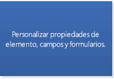

# Seleccionar una API o tecnología para desarrollar soluciones de Outlook

En este artículo se describen las API y las tecnologías que puede usar para ampliar Outlook 2013 y Outlook 2016 y se ofrece ayuda para decidir cuál será la API o tecnología adecuada para su escenario.
  
Microsoft admite diversas API y tecnologías que amplían Outlook: 
  
- A partir de Office 2013, la plataforma de aplicaciones para Office presenta oportunidades para ampliar la funcionalidad de Outlook en los clientes de Outlook en equipos de escritorio, tabletas y smartphones. La plataforma incluye una API de JavaScript para Office y un esquema para los manifiestos de aplicación.
    
- El modelo de objetos, el ensamblado de interoperabilidad primario (PIA) de Outlook correspondiente y la API de mensajería (MAPI) han sido las API usadas con más frecuencia en las soluciones de Outlook.
    
- Las API auxiliares complementan a MAPI en algunos escenarios.
    
- La extensibilidad de proveedores de Outlook Social Connector (OSC) y la extensibilidad de Barra de meteorología sirven para escenarios específicos de sus mercados nicho.
    
En este artículo se explican los criterios de selección para la plataforma de Complementos de Office, el modelo de objetos, PIA y MAPI. Tenga en cuenta que las Complementos de Office usan la API de JavaScript para Office y que no llaman al modelo de objetos, y viceversa. Las soluciones que usan las otras API pueden usar una o más API. Por ejemplo, un complemento COM escrito en C++ puede usar el modelo de objetos, MAPI y API auxiliares en la misma solución.
  
Para sacar el máximo provecho de este artículo, debe estar familiarizado con Outlook en el nivel de usuario y tener conocimientos sobre el desarrollo de software en general. Sin embargo, no es necesario tener conocimientos exhaustivos sobre las características que admiten estas API o tecnologías. El artículo ayuda a responder las preguntas siguientes:
  
- Si solo tiene una idea general acerca de los objetivos de la solución, el mercado objetivo y los recursos disponibles, ¿qué otros criterios debe tener en cuenta para seleccionar una API?
    
- ¿Por qué tendría en cuenta las Complementos de Office y cuándo decidiría crear aplicaciones en lugar de complementos?
    
- Si la solución se tiene que ejecutar en versiones anteriores de Outlook, incluido Outlook 2003, ¿cómo afecta esto a su elección de API?
    
- Si la solución tiene que iterar en carpetas de Outlook que contienen miles de elementos y debe ser capaz de modificar estos elementos, ¿qué API funcionaría mejor?
    
- Si la solución depende en gran medida de la lógica de negocios de Outlook e interactúa con otras aplicaciones de Office, ¿el modelo de objetos de Outlook es la mejor opción?
    
- ¿Qué elementos de Outlook le permiten ampliar el modelo de objetos y MAPI?
    
- Si puede usar el modelo de objetos o MAPI para completar la tarea, ¿cómo debe decidir qué API usar?
    
## Criterios de evaluación objetivos

En esta sección se describen los criterios que puede usar para comparar la plataforma de Complementos de Office, el modelo de objetos, PIA y MAPI para determinar cuál satisface mejor sus necesidades. Distintos criterios pueden ser más o menos importantes, en función de los proyectos y recursos disponibles.
  
Las tablas de esta sección definen criterios de evaluación en las siguientes categorías:
  
- Criterios funcionales: describe qué se puede y no se puede hacer con la tecnología.
    
- Criterios de desarrollo: describe las herramientas de desarrollo o la información que necesita para usar la tecnología.
    
- Criterios de seguridad: describe los problemas de seguridad y permisos relacionados con la tecnología.
    
- Criterios de implementación: describe los métodos recomendados de implementación y distribución de la tecnología.
    
### Criterios de evaluación objetiva de la plataforma de aplicaciones para Office

A partir de Office 2013, los desarrolladores pueden usar la plataforma de Complementos de Office para ampliar los servicios web y el contenido en el contexto de clientes enriquecidos y web de Office. Una Complemento de Office es una página web desarrollada con tecnologías web habituales, hospedada dentro de una aplicación cliente de Office (como Outlook) y que puede ejecutarse localmente o en la nube. De los tipos de Complementos de Office, el que es compatible con Outlook se denomina aplicaciones de correo. Aunque el modelo de objetos, PIA y MAPI se usan a menudo para automatizar Outlook en el nivel de aplicación, puede usar la API de JavaScript para Office para interactuar en el nivel de elemento con el contenido y las propiedades de un mensaje de correo electrónico, convocatoria de reunión. Puede publicar aplicaciones de correo en la Tienda Office o en un catálogo interno de Exchange. 
  
Los usuarios finales y los administradores pueden instalar aplicaciones de correo en un buzón de Exchange y usar aplicaciones de correo en el cliente enriquecido y en Outlook Web App. Como desarrollador, puede hacer que la aplicación de correo esté disponible solo en equipos de escritorio o también en tabletas o smartphones. En la Figura 1 se muestra un ejemplo de una aplicación de correo de YouTube, que se describe detalladamente en [Procedimiento para crear una aplicación de correo para Outlook 2013 Preview para ver vídeos de YouTube](https://code.msdn.microsoft.com/office/Mail-apps-for-Outlook-01c9248f). La aplicación de correo de YouTube permite a los usuarios finales seleccionar una dirección URL de un vídeo de YouTube y ver el vídeo en Outlook u Outlook Web App, en un equipo de escritorio o una tableta.
  
**Figura 1. La aplicación de correo de YouTube está activa para el mensaje seleccionado, que contiene una dirección URL de un vídeo de YouTube.com.**

  
Cuando un usuario instala una aplicación de correo, la aplicación está disponible para usarla en la barra de aplicaciones si el contexto actual coincide con las condiciones de activación especificadas por la aplicación. Las aplicaciones de correo le permiten especificar reglas sobre el elemento seleccionado que activan una aplicación de correo solo si se cumplen ciertas condiciones. Por ejemplo, la aplicación de correo de YouTube que permite reproducir un vídeo de YouTube en Outlook es importante solo cuando el elemento de Outlook seleccionado contiene una dirección URL a un vídeo de YouTube.com. En este caso, sería necesario especificar que la aplicación esté activada solo cuando el mensaje seleccionado contiene dicha dirección URL.
  
En las tablas siguientes se muestran los criterios de evaluación de la plataforma de Complementos de Office.
  
#### Criterios funcionales

|**Criterios**|**Compatibilidad con aplicaciones de correo en la plataforma de aplicaciones para Office**|
|:-----|:-----|
|Dominio de aplicación    |El ámbito de actividad de una aplicación de correo es prácticamente cualquier elemento de mensaje o cita admitido en el buzón de Exchange del usuario que haya seleccionado el usuario y que cumpla las condiciones de activación. Los permisos de una aplicación de correo determinan su acceso a las propiedades y las entidades específicas (por ejemplo, una dirección de correo electrónico o un número de teléfono) que existen para ese elemento. Por ejemplo, una aplicación web que solicita el permiso **lectura/escritura de buzón** puede leer y escribir todas las propiedades de cualquier elemento del buzón del usuario, crear, leer y escribir en cualquier carpeta o elemento, y enviar un elemento de dicho buzón.    |
|Objetos principales    |La API de JavaScript para Office proporciona unos cuantos objetos en el nivel superior que comparten todos los tipos de Complementos de Office: [Office](https://msdn.microsoft.com/library/c490b13d-ee52-4291-af5d-f4a5a11d3af0%28Office.15%29.aspx), [Context](https://msdn.microsoft.com/library/662883d5-b86f-4bdc-99f0-9ee9129ed16c%28Office.15%29.aspx) y [AysncResult](https://msdn.microsoft.com/library/540c114f-0398-425c-baf3-7363f2f6bc47%28Office.15%29.aspx). El nivel siguiente de la API aplicable y específico de las aplicaciones de correo incluye los objetos [Mailbox](https://msdn.microsoft.com/library/a3880d3b-8a09-4cf9-9274-f2682cb3b769%28Office.15%29.aspx), [Item](https://msdn.microsoft.com/library/ad288df1-3ca2-474c-bea4-c51f46e6fc43%28Office.15%29.aspx) y [UserProfile](https://msdn.microsoft.com/library/6d0a36ec-0d5c-40e3-9f6f-9a7fcf0ac3d8%28Office.15%29.aspx), que admiten el acceso a la información sobre el usuario y el elemento seleccionado actualmente en el buzón del usuario. En el nivel de datos, los objetos [CustomProperties](https://msdn.microsoft.com/library/95a69bd6-c4dc-429a-8b27-e2b68f74f3e3%28Office.15%29.aspx) y [RoamingSettings](https://msdn.microsoft.com/library/cf21bb08-7274-4ad6-ae9e-b2c12f92abc9%28Office.15%29.aspx) admiten la persistencia de propiedades configuradas por la aplicación de correo para el elemento seleccionado y para el buzón del usuario, respectivamente. Los objetos de nivel de elemento incluyen los objetos [Appointment](https://msdn.microsoft.com/library/08ebffff-eb52-4e21-9d4e-8f79e426f992%28Office.15%29.aspx) y [Message](https://msdn.microsoft.com/library/909ad9eb-a1bc-4caa-b51e-fd59a02b9569%28Office.15%29.aspx) que heredan de **Item** y el objeto [MeetingRequest](https://msdn.microsoft.com/library/c658fa3d-1138-4a67-9a4b-c9edd11f8385%28Office.15%29.aspx) que hereda de **Message**. Estos objetos representan los tipos de elementos de Outlook que son compatibles con las aplicaciones de correo: elementos de calendario de citas y reuniones, y elementos de mensaje como mensajes de correo electrónico, convocatorias de reunión, respuestas y cancelaciones. Además de este nivel, en la API encontramos propiedades de nivel de elemento (como [Appointment.subject](https://msdn.microsoft.com/library/ffa6812c-34b8-4b0a-8f92-22c3580c8379%28Office.15%29.aspx)), así como objetos y propiedades que admiten ciertos objetos [Entities](https://msdn.microsoft.com/library/1a06c8d1-dafe-46f4-967e-dd9b1d5b20e9%28Office.15%29.aspx) conocidos (por ejemplo, [Contact](https://msdn.microsoft.com/library/2604b44c-7b79-47f0-ac3e-7d99bc9e6751%28Office.15%29.aspx), [MeetingSuggestion](https://msdn.microsoft.com/library/9726fbff-0f4f-4b70-8deb-effc14607d4e%28Office.15%29.aspx), [PhoneNumber](https://msdn.microsoft.com/library/cc86426a-2730-4774-9067-0611e5c8e9c1%28Office.15%29.aspx) y [TaskSuggestion](https://msdn.microsoft.com/library/16b0c3d6-adf4-4a88-ad09-4bb5565816b1%28Office.15%29.aspx)).    Vea [Aspectos básicos para el desarrollo de aplicaciones de correo en Outlook 2013 Preview](https://msdn.microsoft.com/library/2cd5641b-492b-4431-8388-7fc589163e9c%28Office.15%29.aspx) para obtener un resume de las características compatibles con las aplicaciones de correo.    |
|Modelo de acceso a datos    |La API de JavaScript para Office representa las siguientes características como un conjunto jerárquico de objetos: entorno en tiempo de ejecución de la aplicación, buzón y perfil del usuario y datos acerca de un elemento.    |
|Modelos de subprocesos    |Cada aplicación de correo se ejecuta en su propio proceso independiente del proceso de Outlook.    |
|Arquitecturas de aplicación    |En Outlook, una aplicación de correo es un conjunto de páginas HTML y JavaScript hospedadas como proceso independiente dentro de un control de explorador web que, a su vez, está hospedado dentro de un proceso en tiempo de ejecución de una aplicación que proporciona seguridad y aislamiento para rendimiento.    |
|Uso remoto    |Las aplicaciones de correo usan la API de JavaScript para Office para tener acceso a datos sobre el usuario actual, el buzón y el elemento seleccionado almacenado en el servidor Exchange correspondiente. Siempre que tengan los permisos adecuados y usen la técnica apropiada para el acceso entre dominios, las aplicaciones de correo también pueden llamar a servicios Web Exchange y a otros servicios web de terceros para ampliar su funcionalidad.    |
|Transacciones    |La API de JavaScript para Office no admite transacciones.    |
|Disponibilidad    |La API de JavaScript para Office está disponible para los buzones de Exchange Server 2013, a partir Outlook 2013.    |
   
#### Criterios de desarrollo

|**Criterios**|**Compatibilidad con aplicaciones de correo en la plataforma de aplicaciones para Office**|
|:-----|:-----|
|Lenguajes y herramientas    |Puede implementar aplicaciones de correo con cualquier tecnología web habitual, como HTML5, JavaScript, CSS3, XML y API de REST. Puede usar la herramienta de desarrollo web que prefiera. Como alternativa, con Napa, Visual Studio 2012 o una versión posterior de estas herramientas, logrará ahorrar tiempo en el desarrollo.    |
|Implementación administrada    |Cuando resulte apropiado en su escenario, puede usar páginas .aspx administradas para implementar código de servidor en las aplicaciones de correo.    |
|Permite scripts    |La API de JavaScript para Office se usa directamente en scripts.    |
|Herramientas de prueba y depuración    |Puede usar las herramientas de desarrollo web que prefiera. Napa y Visual Studio proporcionan un entorno de desarrollo integrado que facilita las pruebas y depuración de aplicaciones. [Solucionar problemas relacionados con la activación de los complementos de Outlook](https://msdn.microsoft.com/library/da5b56c9-7fd1-4556-8c0e-f489c4c9e9b6%28Office.15%29.aspx) y [Procedimiento para depurar propiedades en elementos de Outlook](https://code.msdn.microsoft.com/office/Mail-apps-for-Outlook-faca78cd) proporcionan más ayuda para solucionar problemas de aplicaciones de correo y depurarlas.    |
|Disponibilidad de expertos    |Es relativamente fácil encontrar programadores que tengan el nivel de experiencia en desarrollo web necesario para Complementos de Office. La plataforma está pensada para desarrolladores tanto profesionales como no profesionales.    |
|Información disponible    |Encontrará información sobre cómo desarrollar y publicar Complementos de Office en [Crear aplicaciones para Office y SharePoint](https://msdn.microsoft.com/office/apps/fp160950.aspx). Encontrará documentación específica sobre las aplicaciones de correo en [Aplicaciones de correo para Outlook 2013 Preview](https://msdn.microsoft.com/library/71e64bc9-e347-4f5d-8948-0a47b5dd93e6%28Office.15%29.aspx).    |
|Licencias de desarrollador e implementación    |Consulte [Licencias de complementos de Office y SharePoint](https://msdn.microsoft.com/library/3e0e8ff6-66d6-44ff-b0c2-59108ebd9181%28Office.15%29.aspx) para obtener información sobre el marco de licencias de aplicaciones para Complementos de Office.    |
   
#### Criterios de seguridad

|**Criterios**|**Compatibilidad con aplicaciones de correo en la plataforma de aplicaciones para Office**|
|:-----|:-----|
|Permisos en tiempo de diseño    |No se necesitan permisos especiales para desarrollar aplicaciones de correo.    |
|Permisos de instalación    |De manera predeterminada, los usuarios finales y los administradores pueden instalar aplicaciones de correo de nivel de confianza bajo que requieran el permiso **Restringido** o **Leer elemento**, y los administradores pueden instalar aplicaciones de nivel de confianza alto que requieran el permiso **Buzón de lectura y escritura**.    |
|Permisos en tiempo de ejecución    |Las aplicaciones de correo solicitan un nivel de permisos específico que se basa en un modelo de permisos de tres niveles: **Restringido**, **Leer elemento** y **Buzón de lectura y escritura**.    |
|Características de seguridad integradas    | El tiempo de ejecución de Complementos de Office ofrece las siguientes ventajas para impedir que una aplicación dañe el entorno del usuario final:     Aísla el proceso en el que se ejecuta la aplicación.     No implica el reemplazo de archivos .dll o .exe ni de componentes ActiveX.     Facilita la instalación o desinstalación de aplicaciones por parte del usuario final.     El administrador y los usuarios finales tienen control sobre las aplicaciones de correo que están disponibles y si se debe conceder el permiso solicitado antes de instalar una aplicación de correo.     En el caso de los clientes enriquecidos, regula el uso de memoria y CPU para evitar ataques maliciosos por denegación servicio.    |
|Características de supervisión de seguridad    | Para las aplicaciones de correo, se supervisan los siguientes recursos:     Uso de núcleos de CPU.     Uso de memoria.     Número de bloqueos.     Duración de bloqueo de una aplicación.     Tiempo de respuesta de expresiones regulares.     Número de veces que se vuelven a evaluar las expresiones regulares.     Los administradores pueden reemplazar la configuración predeterminada que rige el uso de recursos.    |
   
#### Criterios de implementación

|**Criterios**|**Compatibilidad con aplicaciones de correo en la plataforma de aplicaciones para Office**|
|:-----|:-----|
|Requisitos de plataforma del servidor    |El buzón del usuario para el que se instale una aplicación de correo debe estar en Exchange Server 2013 o una versión posterior.    |
|Requisitos de plataforma del cliente    |Para que una aplicación de correo se ejecute en el cliente enriquecido de Outlook, Outlook 2013 e Internet Explorer 9, o una versión posterior de estas aplicaciones, debe estar instalada en el equipo local.    |
|Métodos de implementación    |Puede publicar aplicaciones de correo en la Tienda Office o en un catálogo de Exchange que ponga la aplicación a disposición de los usuarios en ese servidor Exchange. A continuación, los administradores pueden decidir instalar una aplicación de correo desde la Tienda Office o el catálogo de Exchange, por medio del Centro de administración de Exchange (EAC) o de cmdlets de Windows PowerShell remotos. Puede acceder al EAC desde la vista Backstage de Outlook o desde Outlook Web App, o iniciando sesión directamente en el EAC del buzón.    Para obtener más información, vea [Implementar e instalar aplicaciones de correo para probar en Outlook 2013 Preview](https://msdn.microsoft.com/library/d6eea4c4-bb21-4f24-bcba-1eccbb4e12dd%28Office.15%29.aspx).    |
|Notas de implementación    |Una vez que se instala una aplicación de correo en Outlook o Outlook Web App, la aplicación de correo está disponible para ese buzón en ambos clientes de Outlook.    |
   
### Criterios de evaluación objetiva para el modelo de objetos y PIA

Las soluciones que se ejecutan en el equipo cliente pueden usar el modelo de objetos o PIA de Outlook para obtener acceso mediante programación a los elementos de Outlook, como los contactos, los mensajes, los elementos de calendario, las convocatorias de reunión y las tareas. A diferencia de MAPI, el modelo de objetos y PIA de Outlook pueden proporcionar notificaciones de eventos para los cambios en la interfaz de usuario de Outlook, como cambiar la carpeta actual o mostrar un inspector de Outlook.
  
> [!NOTE]
> Para que una solución pueda tener acceso a los datos almacenados en un buzón de Microsoft Exchange o un archivo de carpetas temporales (.pst), Outlook debe estar instalado y configurado en el equipo cliente en el que se ejecuta la aplicación. > El modelo de objetos y PIA de Outlook admiten la misma funcionalidad para ampliar Outlook. PIA define las interfaces administradas que se asignan al modelo de objetos basado en COM y con las que puede interactuar una solución administrada. En los temas restantes de esta sección, la mayoría de los criterios funcionales, de seguridad y de implementación se aplican al modelo de objetos y PIA de la misma manera. Para obtener más información sobre cómo PIA facilita la interoperabilidad entre COM y .NET Framework, vea [Introducción a la interoperabilidad entre COM y .NET](https://msdn.microsoft.com/library/6b2d099a-ec6f-4099-aaf6-e61003fe5a32%28Office.15%29.aspx) y [Arquitectura del ensamblado de interoperabilidad primario de Outlook](https://msdn.microsoft.com/library/89577d14-e6e2-4270-8e72-b0adba378667%28Office.15%29.aspx). 
  
En las tablas siguientes se muestran los criterios de evaluación para el modelo de objetos y PIA de Outlook.
  
#### Criterios funcionales

|**Criterios**|**Modelo de objetos o PIA de Outlook**|
|:-----|:-----|
|Dominio de aplicación    |Los complementos o las aplicaciones independientes que usan el modelo de objetos o PIA de Outlook suelen encargarse de mensajes específicos del usuario, personalizar la interfaz de usuario de Outlook o crear tipos de elementos personalizados para soluciones especializadas, como soluciones de administración de relaciones con el cliente (CRM) que se integran con Outlook. A veces, el modelo de objetos o PIA de Outlook se usan para procesar mensajes en un proceso de flujo de trabajo informal, especialmente cuando no se permite el desarrollo de aplicaciones en el servidor Microsoft Exchange. A diferencia de los clientes basados en explorador, el funcionamiento en modo en caché permite a las soluciones de Outlook funcionar cuando el usuario está sin conexión o desconectado de la red corporativa.    |
|Objetos principales    |El objeto de nivel superior del modelo de objetos y PIA de Outlook es el objeto [Application](https://msdn.microsoft.com/library/797003e7-ecd1-eccb-eaaf-32d6ddde8348%28Office.15%29.aspx) de Outlook. [Explorers](https://msdn.microsoft.com/library/8398532a-1fad-7390-6778-109ac5e6c67c%28Office.15%29.aspx), [Conversation](https://msdn.microsoft.com/library/2705d38a-ebc0-e5a7-208b-ffe1f5446b1b%28Office.15%29.aspx), [Inspectors](https://msdn.microsoft.com/library/b65475d6-a212-fc96-459d-47390dfe5ee5%28Office.15%29.aspx), [Views](https://msdn.microsoft.com/library/5dd7edc2-12a2-f4c2-d158-8053d80e8dc9%28Office.15%29.aspx), [NavigationPane](https://msdn.microsoft.com/library/b6538c72-6115-99fc-c926-e0532a747823%28Office.15%29.aspx), [SolutionsModule](https://msdn.microsoft.com/library/4597765e-a95d-bf07-2ac4-103218ebc696%28Office.15%29.aspx), [FormRegion](https://msdn.microsoft.com/library/3a0b83eb-4076-9cb3-86a9-68f9e44df89f%28Office.15%29.aspx) y los objetos relacionados representan elementos de la interfaz de usuario de Outlook. Los objetos [NameSpace](https://msdn.microsoft.com/library/f0dcaa19-07f5-5d42-a3bf-2e42b7885644%28Office.15%29.aspx), [Stores](https://msdn.microsoft.com/library/8915a8e4-9c22-21d5-c492-051d393ce5f7%28Office.15%29.aspx), [Folders](https://msdn.microsoft.com/library/0c814c3c-74fc-414c-982d-a0097fcb35c2%28Office.15%29.aspx), [Accounts](https://msdn.microsoft.com/library/2510b7d7-5062-8ea3-dda4-b544d2882a2b%28Office.15%29.aspx), [AccountSelector](https://msdn.microsoft.com/library/846f176e-5680-a214-7624-75f3a524c989%28Office.15%29.aspx), [AddressEntries](https://msdn.microsoft.com/library/db91b717-07c6-d1f2-c545-b766ee1f0c6b%28Office.15%29.aspx), [ExchangeUser](https://msdn.microsoft.com/library/6ec117d1-7fdb-aa36-b567-1242f8238df0%28Office.15%29.aspx)y los objetos relacionados admiten la ampliación de las sesiones, los perfiles, las cuentas de usuario, los almacenes de mensajes y las carpetas de Outlook. En el nivel de datos, una serie de objetos de nivel de elemento, como [MailItem](https://msdn.microsoft.com/library/14197346-05d2-0250-fa4c-4a6b07daf25f%28Office.15%29.aspx), [AppointmentItem](https://msdn.microsoft.com/library/204a409d-654e-27aa-643a-8344c631b82d%28Office.15%29.aspx), [ContactItem](https://msdn.microsoft.com/library/8e32093c-a678-f1fd-3f35-c2d8994d166f%28Office.15%29.aspx) y [TaskItem](https://msdn.microsoft.com/library/5df8cfa5-5460-a5a1-a130-ba5bca1a0091%28Office.15%29.aspx), representan los tipos de elementos integrados de Outlook. Los objetos [PropertyAccessor](https://msdn.microsoft.com/library/2fc91e13-703c-3ec9-9066-ffee7144306c%28Office.15%29.aspx), [Table](https://msdn.microsoft.com/library/0affaafd-93fe-227a-acee-e09a86cadc20%28Office.15%29.aspx), [Search](https://msdn.microsoft.com/library/226a5d49-3caf-90dd-725c-265404d1939f%28Office.15%29.aspx), [ItemProperties](https://msdn.microsoft.com/library/34a110ed-6617-72da-1e98-a9773c705b40%28Office.15%29.aspx), [UserDefinedProperties](https://msdn.microsoft.com/library/196e5d4c-22be-02d3-95e0-3ea7594c2e4b%28Office.15%29.aspx), [Attachments](https://msdn.microsoft.com/library/4cc96a5f-a822-8ad5-6f61-e996bee8ba22%28Office.15%29.aspx), [Categories](https://msdn.microsoft.com/library/319efa26-269d-9f2f-c8ec-33082e80a9e2%28Office.15%29.aspx), [Recipients](https://msdn.microsoft.com/library/774f56b7-4de8-9584-60cd-4fbf361f4c85%28Office.15%29.aspx), [RecurrencePattern](https://msdn.microsoft.com/library/36c098f7-59fb-879a-5173-ed0260d13fa4%28Office.15%29.aspx), [Reminders](https://msdn.microsoft.com/library/66b94251-7fe4-886b-7c29-7feac4440dee%28Office.15%29.aspx), [Rules](https://msdn.microsoft.com/library/dd41b4de-bf5f-5532-46c9-394a5d078bec%28Office.15%29.aspx) y los objetos relacionados admiten la personalización y la manipulación de objetos de nivel de elemento.    |
|Modelo de acceso a datos    |El modelo de objetos y PIA de Outlook representan todos los datos como un conjunto jerárquico de objetos y colecciones.    |
|Modelos de subprocesos    |Todas las llamadas al modelo de objetos y PIA de Outlook se ejecutan en el subproceso en primer plano principal de Outlook. El único modelo de subprocesamiento que admite el modelo de objetos de Outlook es un contenedor uniproceso (STA). Llamar al modelo de objetos o PIA de Outlook desde un subproceso en segundo plano no es compatible y puede llevar a errores y resultados inesperados en la solución.    |
|Arquitecturas de aplicación    |Por lo general, los complementos COM y otras aplicaciones de Office usan el modelo de objetos de Outlook para ampliar Outlook. Las soluciones administradas pueden usar PIA de Outlook y la capa de interoperabilidad COM de Visual Studio y .NET Framework para tener acceso al modelo de objetos de Outlook. Visual Studio proporciona plantillas y bibliotecas de clases y manifiestos adicionales para facilitar las personalizaciones de documentos y aplicaciones de Office. Para obtener más información sobre el uso de Visual Studio para desarrollar complementos administrados para Outlook, vea [Architecture of Application-Level Add-Ins](https://msdn.microsoft.com/library/978f102f-15c6-44e4-84e8-80b161408324.aspx) y [Outlook Solutions](https://msdn.microsoft.com/library/2ae3cd9c-bf31-4efa-8b18-b6b1c34a8d93.aspx). El modelo de objetos de Outlook también es compatible con macros de Visual Basic para Aplicaciones (VBA) y Windows Scripting Host (WSH), pero no es compatible con las aplicaciones de servicios de Windows.    |
|Uso remoto    |El modelo de objetos y PIA de Outlook pueden usarse solo en un equipo en el que Outlook esté instalado. El modelo de objetos de Outlook puede usarse para tener acceso a la información almacenada en Exchange que está disponible en la aplicación de Outlook.    |
|Transacciones    |El modelo de objetos y PIA de Outlook no admiten transacciones.    |
|Disponibilidad    |El modelo de objetos de Outlook está disponible actualmente en todas las versiones de Outlook. PIA está disponible en las versiones de Outlook a partir de Outlook 2003. Ha habido ampliaciones y mejoras con cada nueva versión de Outlook.    |
   
#### Criterios de desarrollo

|**Criterios**|**Modelo de objetos o PIA de Outlook**|
|:-----|:-----|
|Lenguajes y herramientas    |Puede implementar aplicaciones del modelo de objetos de Outlook con cualquier lenguaje compatible con automatización o COM, como Visual Basic o C#, así como con lenguajes no COM, como C o C++ nativos. Herramientas de desarrollo de Microsoft Office en Microsoft Visual Studio 2010 son las herramientas preferentes para desarrollar complementos administrados para Outlook 2010 y Outlook 2007. Microsoft Visual Studio 2005 Tools para Microsoft Office System son las herramientas preferentes para Outlook 2003. También puede usar Herramientas de desarrollo de Office en Visual Studio 2010 para crear soluciones para las versiones de 32 y 64 bits de Outlook. Al crear una solución en Herramientas de desarrollo de Office en Visual Studio 2010 o Microsoft Visual Studio Tools para Microsoft Office System, si especifica la opción **Cualquier CPU** para la plataforma de destino, las soluciones administradas funcionarán tanto en las versiones de 32 bits como en las de 64 bits de Outlook 2010.    |
|Implementación administrada    |PIA de Outlook permite usar el modelo de objetos de Outlook en un entorno de código administrado, compatible con un amplio conjunto de bibliotecas de clases y tecnologías compatibles que resuelven muchas de las limitaciones de los complementos COM y VBA. PIA es un contenedor COM que hace las veces de puente entre los entornos administrados y COM. Para obtener más información, vea [Motivos para usar el ensamblado de interoperabilidad primario de Outlook](https://msdn.microsoft.com/library/5cc9085e-7c97-4698-8cb9-e33e427c02e7%28Office.15%29.aspx).    |
|Permite scripts    |El modelo de objetos de Outlook se puede usar en scripts.    |
|Herramientas de prueba y depuración    |No se necesitan herramientas de depuración especiales para usar el modelo de objetos o PIA de Outlook. Por otra parte, puede usar Visual Studio para proporcionar un entorno de desarrollo integrado que facilita la depuración y las pruebas de aplicaciones.    |
|Disponibilidad de expertos    |Es relativamente fácil encontrar desarrolladores que puedan desarrollar correctamente aplicaciones mediante el modelo de objetos o PIA de Outlook. El modelo de objetos y PIA de Outlook están pensados para complementos creados con herramientas de desarrollo de amplia disponibilidad, como Visual Studio. Estas herramientas ofrecen entornos en tiempo de diseño que simplifican el proceso de desarrollo.    |
|Información disponible    |También hay información sobre la programación con el modelo de objetos de Outlook disponible en los recursos de Microsoft y de terceros. Para obtener más información sobre el modelo de objetos de Outlook, vea la [Referencia del desarrollador de Outlook 2010](https://msdn.microsoft.com/library/75e4ad96-62a2-49d2-bc51-48ceab50634c%28Office.15%29.aspx). Para obtener más información sobre PIA de Outlook, vea la [Referencia del ensamblado de interoperabilidad primario de Outlook 2010](https://msdn.microsoft.com/library/54bdde85-8dc9-4498-a1ac-f72eaf8f0cd3%28Office.15%29.aspx). Para ver ejemplos de soluciones administradas de Outlook desarrolladas con las herramientas de desarrollo de Office en Visual Studio, vea [Soluciones de Outlook con Visual Studio](https://msdn.microsoft.com/vsto/dd162450.aspx).    |
|Licencias de desarrollador e implementación    |Consulte los acuerdos de licencias de suscripción a Exchange y Microsoft Developer Network (MSDN) para determinar si se necesitan licencias adicionales para Outlook y el uso del modelo de objetos de Outlook en las aplicaciones.    |
   
#### Criterios de seguridad

|**Criterios**|**Modelo de objetos o PIA de Outlook**|
|:-----|:-----|
|Permisos en tiempo de diseño    |No se necesitan permisos especiales para desarrollar aplicaciones mediante el modelo de objetos o PIA de Outlook.    |
|Permisos de instalación    |No se necesitan permisos especiales para instalar aplicaciones que usan el modelo de objetos o PIA de Outlook. Sin embargo, se necesitan derechos de administrador local para instalar Office y Outlook.    |
|Permisos en tiempo de ejecución    |No se necesitan permisos especiales para ejecutar aplicaciones que usan el modelo de objetos o PIA de Outlook.    |
|Características de seguridad integradas    |El modelo de objetos y PIA de Outlook se comunican con Exchange mediante MAPI y con Active Directory mediante las interfaces ADSI. El contexto de seguridad actual del usuario que está ejecutando la aplicación se usa para determinar a qué recursos puede tener acceso el código. De manera predeterminada, los complementos son de confianza para obtener acceso completo a todos los objetos, propiedades y métodos del modelo de objetos o PIA de Outlook. Los administradores de TI pueden controlar los objetos y complementos que pueden tener acceso al modelo de objetos o PIA de Outlook. El modelo de objetos y PIA de Outlook evitan que el código que se ejecuta fuera del proceso de Outlook tenga acceso a métodos y objetos seguros.    |
|Características de supervisión de seguridad    | Outlook supervisa las siguientes métricas de un complemento para determinar si debe deshabilitarlo:     Inicio     Apagado     Intercambiar carpeta     Abrir elemento    Frecuencia de **Invoke**     Los administradores pueden usar la directiva de grupo para reemplazar la configuración del usuario y controlar los complementos que se ejecutan en los equipos del usuario.     Para obtener más información, vea [Criterios de rendimiento para mantener los complementos habilitados](https://msdn.microsoft.com/library/office/4c6d44d2-238b-42d8-896b-51d513c9e14c#ol15WhatsNew_AddinDisabling).    |
   
#### Criterios de implementación

|**Criterios**|**Modelo de objetos o PIA de Outlook**|
|:-----|:-----|
|Requisitos de plataforma del servidor    |El modelo de objetos y PIA de Outlook son tecnologías de cliente.    |
|Requisitos de plataforma del cliente    |Las aplicaciones que usan el modelo de objetos o PIA de Outlook para tener acceso a los datos de Exchange requieren que Outlook esté instalado en el equipo local.    |
|Métodos de implementación    |Las aplicaciones que usan el modelo de objetos o PIA de Outlook se distribuyen mediante software de instalación de aplicaciones estándar.    |
|Notas de implementación    |Como Outlook no debe instalarse en el Exchange Server, las aplicaciones que usan el modelo de objetos o PIA de Outlook no se pueden ejecutar en Exchange Server.    |
   
### Criterios de evaluación objetiva de MAPI

Puede usar MAPI para obtener acceso a elementos y carpetas en almacenes públicos y privados, así como acceso a las propiedades que se almacenan con cada elemento. Todas las versiones de Outlook usan MAPI. Puede crear clientes que usen MAPI, así como crear servidores MAPI y controladores de formularios MAPI. La información de esta sección solo se aplica a las aplicaciones de cliente MAPI.
  
> [!NOTE]
> MAPI es un mecanismo avanzado que se usa para tener acceso a la información de Exchange o de un archivo de carpetas personales (.pst) y proporciona algunas capacidades que no están disponibles en ninguna otra API. Sin embargo, MAPI no funciona fuera de una intranet, mantiene una conexión abierta durante la sesión de MAPI y puede ser difícil de aprender. MAPI no exige la lógica empresarial de Outlook, por lo que debe tener especial cuidado para garantizar que se mantenga la lógica empresarial de Outlook. 
  
En las tablas siguientes se muestran los criterios de evaluación de MAPI.
  
#### Criterios funcionales

|**Criterios**|**MAPI**|
|:-----|:-----|
|Dominio de aplicación    |Las aplicaciones cliente que usan MAPI para tener acceso a un buzón de usuario o información de carpetas públicas de Exchange almacenada, y a información de directorio de usuario almacenada en Active Directory. Las aplicaciones cliente que usan MAPI suelen ser clientes de correo electrónico, como Outlook y aplicaciones que requieren procesamiento de correo electrónico complejo.    |
|Objetos principales    |Los objetos de MAPI se obtienen por medio de la interfaz [IMAPISession: IUnknown](https://msdn.microsoft.com/library/5650fa2a-6e62-451c-964e-363f7bee2344%28Office.15%29.aspx). El objeto de sesión proporciona el acceso del cliente a objetos para trabajar con perfiles, estado, administración del proveedor de servicio de mensajes, tablas del almacén de mensajes y libretas de direcciones de MAPI. La tabla del almacén de mensajes contiene objetos para el almacén de mensajes, carpetas, mensajes, datos adjuntos y destinatarios. Las tablas de la libreta de direcciones contienen objetos para enviar mensajes a usuarios y listas de distribución.    |
|Modelo de acceso a datos    |MAPI representa los mensajes y los usuarios como un conjunto jerárquico de objetos.    |
|Modelos de subprocesos    |No hay ninguna prohibición de subprocesos específica. No obstante, las aplicaciones que usan el subprocesamiento libre deben evitar compartir objetos MAPI entre subprocesos debido a los altos costos del cálculo de referencias del objeto. MAPI y los proveedores de servicios MAPI usan el subprocesamiento libre.    |
|Arquitecturas de aplicación    |Las aplicaciones de cliente MAPI suelen ser aplicaciones cliente basadas en Windows Forms. Sin embargo, puede usar MAPI para escribir aplicaciones de n niveles.    |
|Uso remoto    |MAPI usa llamadas a procedimiento remoto (RPC) para comunicarse con Exchange Server. Por lo general, las RPC se bloquean intencionadamente para que no pasen a través de firewalls de Internet.    |
|Transacciones    |MAPI no admite transacciones.    |
|Disponibilidad    |En la actualidad, se incluye código auxiliar MAPI en todas las versiones de Windows. Office instala su propio subsistema MAPI cuando instala Outlook. No se prevén cambios en MAPI en este momento.    |
   
#### Criterios de desarrollo

|**Criterios**|**MAPI**|
|:-----|:-----|
|Lenguajes y herramientas    |Puede tener acceso directo a MAPI mediante C o C++. Otros lenguajes que puedan tener acceso a la convención de llamada de C o C++ podrían tener acceso a MAPI. No se admite el uso de lenguajes administrados, como Visual Basic o C#. Debe compilar soluciones MAPI independientes para las versiones de 32 bits y de 64 bits de Outlook.    |
|Implementación administrada    |MAPI es un componente no administrado. No se admite el uso de MAPI en la capa de interoperabilidad COM de Visual Studio y .NET Framework. Para obtener más información acerca de la compatibilidad de MAPI con componentes administrados, vea el artículo de Knowledge Base [266353: directrices de compatibilidad para el desarrollo de mensajería de cliente](https://go.microsoft.com/fwlink/?LinkId=133254).    |
|Permite scripts    |MAPI no se puede usar directamente en scripts.    |
|Herramientas de prueba y depuración    |No se necesitan herramientas de depuración especiales para depurar las aplicaciones que usan MAPI. Por otra parte, puede usar [MFCMAPI](https://mfcmapi.codeplex.com/). MFCMAPI usa MAPI para proporcionar acceso a los almacenes de MAPI por medio de una interfaz gráfica de usuario y facilita la investigación de problemas al ampliar Outlook por medio de MAPI.    |
|Disponibilidad de expertos    |Puede resultar difícil encontrar programadores de MAPI expertos y puede tardarse bastante tiempo en dominar la tecnología. Además de las Comunidades de Microsoft, solo hay unos cuantos sitios web de terceros de alta calidad que proporcionen información útil de desarrollo de MAPI.    |
|Información disponible    |Hay disponibles libros tanto de Microsoft como de terceros que describen la programación de MAPI.    |
|Licencias de desarrollador e implementación    |No se requieren licencias espaciales para desarrollar aplicaciones que usan MAPI.    |
   
#### Criterios de seguridad

|**Criterios**|**MAPI**|
|:-----|:-----|
|Permisos en tiempo de diseño    |El desarrollador debe tener permisos de acceso a los datos del almacén de Exchange. Exchange almacena información de usuarios y listas de distribución en Active Directory, de modo que los desarrolladores que creen aplicaciones cliente MAPI que tengan acceso a esa información deben poder recuperar y establecer esa información.    |
|Permisos de instalación    |Para configurar las aplicaciones basadas en MAPI normalmente se requiere que el usuario sea administrador local o que tenga derechos para instalar software.    |
|Permisos en tiempo de ejecución    |Para ejecutar una aplicación basada en MAPI normalmente solo se requiere que el usuario tenga permisos suficientes para tener acceso a los datos de un almacén de Exchange o un archivo de carpetas personales (.pst).    |
|Características de seguridad integradas    |Los perfiles de MAPI se pueden proteger mediante contraseña en la mayoría de plataformas.    |
   
#### Criterios de implementación

|**Criterios**|**MAPI**|
|:-----|:-----|
|Requisitos de plataforma del servidor    |El servidor Exchange en el que se almacenan los datos de usuario para los usuarios de la aplicación cliente MAPI debe configurarse correctamente para permitir el acceso de los clientes MAPI.    |
|Requisitos de plataforma del cliente    |El instalador de la aplicación cliente debe comprobar que la versión correcta de MAPI esté disponible en el equipo y que esté configurada correctamente con el archivo Mapisvc.inf.    |
|Métodos de implementación    |Las aplicaciones que usan MAPI se pueden implementar en los equipos cliente mediante el uso de tecnologías de distribución de software estándar.    |
|Notas de implementación    |El instalador debe comprobar que la versión correcta de MAPI esté disponible.    |
   
## Factores de decisión para la plataforma de aplicaciones para Office

Como las Complementos de Office usan tecnologías web, se recomiendan para conectarse a servicios locales o en la nube y para traer los servicios al contexto del cliente enriquecido y el cliente web. Al solicitar los permisos adecuados, las aplicaciones de correo también permiten leer, escribir o enviar elementos de un buzón.
  
A continuación se indican los motivos habituales por los que las aplicaciones de correo son una mejor opción para los desarrolladores que los complementos:
  
- Puede usar los conocimientos existentes y las ventajas de las tecnologías web como HTML, JavaScript y CSS. Para usuarios avanzados y desarrolladores principiantes, XML, HTML y JavaScript requieren menos tiempo de aprendizaje que las API basadas en COM, incluidos el modelo de objetos y MAPI.
    
- Puede usar un modelo de implementación web sencillo para actualizar la aplicación de correo (incluidos los servicios web que usa la aplicación) en el servidor web sin instalaciones complejas en el cliente de Outlook. De hecho, las actualizaciones de la aplicación de correo, a excepción del manifiesto de la aplicación, no requieren ninguna actualización del cliente de Office. Puede actualizar la interfaz de usuario o el código de la aplicación de correo cómodamente en el servidor web. Esto supone una ventaja significativa respecto a la carga administrativa de la actualización de complementos.
    
- Puede usar una plataforma de desarrollo web común para aplicaciones de correo que puedan itinerar entre el cliente enriquecido de Outlook y Outlook Web App en equipos de escritorio, tabletas y smartphones. Por otra parte, los complementos usan el modelo de objetos para el cliente enriquecido de Outlook y, por lo tanto, se pueden ejecutar solo en ese cliente enriquecido en un factor de forma de escritorio.
    
- Puede disfrutar de un tiempo de procesamiento rápido en el desarrollo y la publicación de aplicaciones a través de la Tienda Office.
    
- Debido al modelo de permisos de tres niveles, los usuarios y los administradores tienen la sensación de que la seguridad y la privacidad son mejores en las aplicaciones que en los complementos, que tienen acceso total al contenido de cada una de las cuentas del perfil del usuario. Esto, a su vez, favorece el consumo de aplicaciones por parte de los usuarios.
    
- En función de los escenarios, hay características específicas de las aplicaciones de correo que puede aprovechar y que no son compatibles con los complementos:
    
  - Puede especificar que una aplicación de correo se active solo en ciertos contextos (por ejemplo, Outlook muestra la aplicación en la barra de aplicaciones solo si la clase de mensaje de la cita seleccionada por el usuario es IPM.Appointment.Contoso o si el cuerpo de un correo electrónico contiene un número de seguimiento de paquete o un identificador de cliente).
    
  - Puede activar una aplicación de correo si el mensaje seleccionado contiene algunas entidades conocidas, como una dirección, un contacto, una dirección de correo electrónico, una sugerencia de reunión o una sugerencia de tarea.
    
  - Puede aprovechar la autenticación por medio de tokens de identidad y de los servicios Web Exchange.
    
No obstante, las siguientes características son exclusivas de los complementos y pueden hacer que sean una opción más apropiada que las aplicaciones de correo en algunas circunstancias:
  
- Puede usar complementos para ampliar o automatizar Outlook en el nivel de aplicación, porque el modelo de objetos y PIA tienen una amplia integración con las características de Outlook (como todos los tipos de elementos, la interfaz de usuario, las sesiones y las reglas de Outlook). En el nivel de elemento, los complementos pueden interactuar con un elemento en modo de lectura o de redacción. Con las aplicaciones de correo, no puede automatizar Outlook en el nivel de aplicación y puede ampliar la funcionalidad de Outlook en el contexto únicamente del modo de lectura de los elementos compatibles (mensajes y citas) del buzón del usuario.
    
- Puede especificar la lógica de negocios personalizada para un nuevo tipo de elemento.
    
- Puede modificar y agregar comandos personalizados en la cinta y la vista Backstage.
    
- Puede mostrar una página de formulario o un área de formulario personalizada.
    
- Puede detectar eventos como el envío de un elemento o la modificación de las propiedades de un elemento.
    
- Puede usar complementos en Outlook 2013 y Exchange Server 2013, así como en versiones anteriores de Outlook y Exchange. Por otra parte, las aplicaciones de correo funcionan con Outlook y Exchange a partir de Outlook 2013 y Exchange Server 2013, pero no en versiones anteriores.
    
Para obtener más información acerca de los escenarios compatibles con el modelo de objetos y PIA, vea la siguiente sección, [Factores de decisión para el modelo de objetos o PIA](#OLSelectAPI_FactorsOM). Pera ver una comparación de la plataforma de Complementos de Office con otras tecnologías de extensibilidad para Office, vea la entrada de blog sobre los [antecedentes de las aplicaciones para Office y SharePoint](https://blogs.msdn.com/b/officeapps/archive/2012/07/23/introducing-apps-for-the-new-office-and-sharepoint.aspx).
  
## Factores de decisión para el modelo de objetos o PIA

En general, use el modelo de objetos o PIA si la solución personaliza la interfaz de usuario de Outlook o se basa en la lógica de negocios de Outlook. En la Figura 2 se muestran los escenarios de línea base principales en los que las soluciones de Outlook usan el modelo de objetos o PIA. 
  
> [!NOTE]
> Para obtener más información acerca de los escenarios, haga clic en las casillas de las siguientes figuras. 
  
Figura 2. Escenarios principales de línea base admitidos por el modelo de objetos de Outlook o PIA
  

  

  
Además de los escenarios de línea base, si la solución de Outlook admite cualquiera de los escenarios mostrados en la Figura 3 y tiene previsto que la solución se ejecute en Outlook 2007 o una versión posterior, pero no en versiones anteriores, también puede usar el modelo de objetos o PIA. En la Figura 3 se especifican los objetos o miembros principales que puede usar en el modelo de objetos de Outlook para ampliar cada escenario (a excepción de la interfaz [IDTExtensibility2](https://msdn.microsoft.com/library/Extensibility.IDTExtensibility2.aspx) en el modelo de objetos de automatización de Visual Studio y la interfaz [IRibbonExtensibility](https://msdn.microsoft.com/library/b27a7576-b6f5-031e-e307-78ef5f8507e0%28Office.15%29.aspx) en el modelo de objetos de Office, que puede integrar con el modelo de objetos de Outlook). 
  
Figura 3. Escenarios adicionales admitidos por el modelo de objetos o PIA desde Outlook 2007
  

  

  

  

  
Si tiene previsto ejecutar la solución de Outlook en Outlook 2010 y no en versiones anteriores, puede usar el modelo de objetos o PIA para admitir los escenarios mostrados en la Figura 4. En la Figura 4 se especifican los objetos o miembros principales que puede usar en el modelo de objetos de Outlook para ampliar cada escenario (a excepción de las interfaces [IRibbonControl](https://msdn.microsoft.com/library/63aef709-e1d3-b1a6-76af-b568ad0e69ae%28Office.15%29.aspx), [IRibbonExtensibility](https://msdn.microsoft.com/library/b27a7576-b6f5-031e-e307-78ef5f8507e0%28Office.15%29.aspx) y [IRibbonUI](https://msdn.microsoft.com/library/d323aa21-de74-e821-c914-db71ef3b9c5e%28Office.15%29.aspx) en el modelo de objetos de Office, que puede integrar con el modelo de objetos de Outlook). 
  
Figura 4. Más escenarios admitidos por el modelo de objetos o PIA desde Outlook 2010
  

  

  

  
Y si tiene previsto ejecutar la solución en Outlook 2013 y no en versiones anteriores, puede usar el modelo de objetos o PIA para admitir los escenarios mostrados en la Figura 5.
  
Figura 5. Escenarios adicionales admitidos por el modelo de objetos o PIA desde Outlook 2013
  

  

  
## Factores de decisión de MAPI

En general, use MAPI para tener acceso a datos de un servidor basado en MAPI, como el servidor Microsoft Exchange y para realizar tareas como las siguientes:
  
- Crear un proveedor de servicios personalizado, como un proveedor de libretas de direcciones, un proveedor de transporte o un proveedor de almacén.
    
- Crear un proceso de receptor.
    
- Crear o manipular un perfil.
    
- Ejecutar una aplicación como un servicio de Windows NT.
    
- Ejecutar tareas en un subproceso en segundo plano. Por ejemplo, enumerar varios elementos en una carpeta y modificar las propiedades de los elementos en un subproceso de segundo plano pueden optimizar el rendimiento.
    
Para obtener más información y ejemplos de código, vea la [Referencia MAPI de Outlook](https://msdn.microsoft.com/library/3d980b86-7001-4869-9780-121c6bfc7275%28Office.15%29.aspx) y [MFCMAPI](https://mfcmapi.codeplex.com/).
  
Además, si la solución se ejecuta en una versión de Outlook anterior a Outlook 2007 y se aplican escenarios como los siguientes a la solución, debe usar MAPI para ampliar esos escenarios.
  
- Establecer y obtener propiedades de elemento integradas que no se exponen en el modelo de objetos.
    
- Administrar cuentas, datos adjuntos, listas de distribución de Exchange, usuarios de Exchange o almacenes.
    
- Almacenar datos privados para soluciones.
    
- Administrar un almacén de mensajes de una cuenta.
    
Desde Outlook 2007, el modelo de objetos ha admitido una serie de características para las que, antes de Outlook 2007, los desarrolladores tenían que recurrir a MAPI u otras API como Objetos para colaboración de datos (CDO) de Microsoft 1.2.1 y Extensiones de clientes de Microsoft Exchange. Por tanto, si cualquiera de los escenarios de la lista anterior se aplica a su solución, pero esta se ejecuta en Outlook 2007 u Outlook 2010, puede y debe usar el modelo de objetos o PIA de Outlook para admitir estos escenarios. Para obtener más información acerca de las mejoras de Outlook 2007 que unifican las tecnologías de desarrollo de Outlook, vea [What's New for Developers in Outlook 2007 (Part 1 of 2)](https://msdn.microsoft.com/library/76e3f0b7-ef2b-4e9f-8515-3002d75d7721%28Office.15%29.aspx).
  
## Factores de decisión para las API auxiliares

Las API auxiliares de Outlook pueden integrarse con la lógica de negocios de Outlook o MAPI en algunos escenarios donde el modelo de objetos o MAPI no proporcionan una solución. Use las API auxiliares de Outlook en los escenarios siguientes:
  
- Administración de cuentas: administrar información de cuentas, manipular cuentas, proporcionar notificaciones de cambios en la cuenta y proteger las cuentas contra correo no deseado. 
    
- Degradación de datos: encapsular un objeto en un formato de carácter preferido en lugar de exponer el objeto en su formato nativo.
    
- Reorganización de calendarios y compatibilidad con zonas horarias: reorganizar calendarios de Outlook para admitir el horario de verano.
    
- Estado de disponibilidad: proporcionar información de disponibilidad en los calendarios.
    
- Imágenes de contactos: determinar si se muestra de la imagen de un contacto en Outlook.
    
- Moneda del elemento: determinar si un elemento de Outlook tiene cambios sin guardar.
    
- Clasificar un elemento: clasificar un elemento de Outlook después de enviarlo.
    
Para obtener más información acerca de las API auxiliares, vea la sección [Recursos adicionales: API auxiliares](#OLSelectAPI_AdditionalResourcesAuxAPIs). 
  
## Automatización de Outlook con soluciones dentro del proceso o fuera del proceso

> [!NOTE]
> La explicación sobre la automatización de Outlook que se incluye en esta sección y la siguiente queda fuera del ámbito de las Complementos de Office, cuya finalidad es ampliar la funcionalidad del cliente de Office o la aplicación web, pero no automatizarlos. 
  
Outlook admite la automatización por medio de complementos que ejecutan el primer proceso en primer plano que el proceso de Outlook y por medio de soluciones independientes que se ejecutan en su propio proceso independiente fuera del proceso de Outlook. Por lo general, para automatizar Outlook, use un complemento para interactuar con Outlook a través del modelo de objetos, PIA o MAPI y, en escenarios menos habituales, a través de una API auxiliar (como [HrProcessConvActionForSentItem](auxiliary/hrprocessconvactionforsentitem.md)). Use una solución fuera del proceso solo cuando sea necesario (por ejemplo, cuando escriba una aplicación cliente MAPI que use el archivo Tzmovelib.dll para reorganizar los calendarios de Outlook para clientes o para enumerar numerosos elementos en una carpeta y sus propiedades en un subproceso en segundo plano para optimizar el rendimiento). 
  
Los complementos son la solución preferente para automatizar Outlook, ya que Outlook solo confía en el objeto [Application](https://msdn.microsoft.com/library/797003e7-ecd1-eccb-eaaf-32d6ddde8348%28Office.15%29.aspx) pasado al complemento durante el evento [OnConnection(Object, ext_ConnectMode, Object, Array)](https://msdn.microsoft.com/library/Extensibility.IDTExtensibility2.OnConnection.aspx) del complemento. Puede evitar que se muestren advertencias de seguridad de la protección del modelo de objetos si deriva todos los objetos, propiedades y métodos de este objeto **Application**. Si el complemento crea una nueva instancia del objeto **Application**, Outlook no confía en ese objeto, aunque el complemento esté en la lista de complementos de confianza. No se confiará en los objetos, propiedades y métodos derivados de ese objeto **Application** y las propiedades y los métodos bloqueados invocarán advertencias de seguridad. Para obtener más información acerca de la protección del modelo de objetos, vea [Comportamiento de la seguridad del modelo de objetos de Outlook](https://msdn.microsoft.com/library/4aa3b7c7-5f3f-41ce-bbf3-75d8ecbd6d4f%28Office.15%29.aspx).
  
## Automatización de Outlook con soluciones administradas y no administradas

Outlook admite la automatización con complementos y aplicaciones independientes, escritos en lenguajes administrados y no administrados. Los lenguajes administrados que se usan más habitualmente son C# y Visual Basic. Las herramientas de C++ y Delphi son más habituales en el desarrollo no administrado. Hay que tener en cuenta los conocimientos al elegir entre el desarrollo administrado y no administrado. 
  
Si la solución solo usa el modelo de objetos, puede considerar la posibilidad de desarrollar una solución administrada por medio de PIA o de las herramientas de desarrollo de Office en Visual Studio. Las herramientas de desarrollo de Office en Visual Studio proporcionan plantillas de proyecto y diseñadores visuales que simplifican la creación de interfaces de usuario personalizadas y el desarrollo de soluciones de Office.
  
Por otra parte, como MAPI se desarrolló años antes que .NET Framework y Microsoft no proporciona contenedores administrados para MAPI, Microsoft no admite el uso de MAPI en el código administrado. Si usa MAPI, debe desarrollar una solución no administrada. Para obtener más información, vea las [directrices de compatibilidad para el desarrollo de mensajería de cliente](https://support.microsoft.com/kb/266353/en-us).
  
## API y tecnologías de nicho

Outlook Social Connector (OSC) y la Barra de meteorología admiten la ampliación de escenarios muy concretos en Outlook. 
  
### Extensibilidad de proveedores de Outlook Social Connector (OSC)

La extensibilidad de proveedores de Outlook Social Connector (OSC) admite el desarrollo de un proveedor para una red social que permita a los usuarios ver, en Outlook y otras aplicaciones cliente de Office, actualizaciones de amigos y actividades en esa red social. En la Figura 6 se muestra OSC con las actividades de una persona en los sitios de redes sociales en el panel de personas.
  
**Figura 6. OSC con datos de redes sociales en el panel de personas**

  
OSC en Outlook permite a los usuarios ver, en el panel de personas, una agregación de mensajes de correo electrónico, archivos adjuntos y convocatorias de reunión de una persona en Outlook. En un entorno de organización, los usuarios que colaboran en un sitio de SharePoint pueden ver actualizaciones de documentos y otras actividades del sitio de esta persona en el sitio de SharePoint. La extensibilidad de proveedores de Outlook Social Connector admite el desarrollo de un proveedor para que OSC sincronice y muestre actualizaciones de redes sociales en Outlook. Los proveedores de OSC habituales comunes (como Facebook y Linkedln) se instalan de manera predeterminada con Outlook. En función de los sitios de redes sociales en los que haya iniciado sesión un usuario de Outlook, el usuario puede ver, en el panel de personas, actualizaciones como fotos, estados y actividades en las redes sociales correspondientes. 
  
### Extensibilidad de la Barra de meteorología

A partir de Outlook 2013, la Barra de meteorología permite a los desarrolladores conectar un servicio web de meteorología de terceros para proporcionar datos de las condiciones meteorológicas para una ubicación elegida por el usuario. La Barra de meteorología de Outlook muestra las condiciones meteorológicas y la previsión del tiempo para una ubicación geográfica. Un usuario puede elegir una o varias ubicaciones y ver cómodamente los datos meteorológicos en la Barra de meteorología en el módulo de calendario. En la Figura 7 se muestra la Barra de meteorología con una previsión a tres días para Nueva York. 
  
**Figura 7. Barra de meteorología en Outlook**

  
De manera predeterminada, Outlook usa datos meteorológicos proporcionados por MSN Clima. La Barra de meteorología es compatible con servicios web de datos meteorológicos de terceros que sigan un protocolo definido para comunicarse con Outlook. Siempre que un servicio de datos meteorológicos de terceros sea compatible con este protocolo, los usuarios podrán elegir dicho servicio para proporcionar datos meteorológicos en la Barra de meteorología.
  
Vea la sección [Recursos adicionales: referencias y recursos principales y ejemplos de código](#OLSelectAPI_AdditionalResourcesRefCode) para obtener más información sobre el uso de la extensibilidad de proveedores de OSC y la Barra de meteorología. 
  
## Conclusión

Para determinar la mejor API o tecnología para su solución, primero debe definir los objetivos de la solución: 
  
- Las versiones de Outlook que desea que admita su solución.
    
- Los escenarios de alta prioridad de la solución. ¿La solución interactúa principalmente con el contenido y las propiedades de un elemento de mensaje o de cita? ¿O automatiza Outlook en el nivel de aplicación? Si es así, ¿estos escenarios implican enumerar, filtrar o modificar carpetas que contienen muchos elementos de Outlook?
    
En primer lugar, compruebe si la compatibilidad con aplicaciones de correo en la plataforma de Complementos de Office satisface sus necesidades. Vea la sección Criterios funcionales en [Criterios de evaluación objetiva de la plataforma de aplicaciones para Office](#OLSelectAPI_ObjectiveEvalCritApps) para determinar si los objetos y las características principales admiten sus escenarios. Vea la sección [Factores de decisión para la plataforma de aplicaciones para Office](#OLSelectAPI_FactorsApps) para comprobar si las aplicaciones de correo son una opción mejor que los complementos para sus escenarios. En general, desarrolle la solución como una aplicación, si es posible, para aprovechar la compatibilidad de la plataforma en clientes de Outlook de distintos factores de forma. 
  
Si sus escenarios requieren una ampliación de más envergadura que los elementos de mensaje y cita o que Outlook se automatice en el nivel de aplicación, intente averiguar con qué escenarios de la sección [Factores de decisión para el modelo de objetos o PIA](#OLSelectAPI_FactorsOM) coinciden sus escenarios. Si el modelo de objetos (o PIA) de las versiones de destino de Outlook admite sus escenarios y la solución no manipula carpetas con muchos elementos, debería implementar la solución como complemento, en un lenguaje administrado o no administrado. 
  
Si el modelo de objetos (o PIA) de una versión de destino de Outlook no admite algunos de sus escenarios, compruebe si los escenarios de la sección [Factores de decisión para MAPI](#OLSelectAPI_FactorsMAPI) o [Factores de decisión para las API auxiliares](#OLSelectAPI_FactorsAux) satisfacen sus necesidades. Si MAPI satisface sus necesidades, debe implementar la solución en código no administrado. Si una API auxiliar resuelve uno de los escenarios, puede usar código administrado o no administrado. 
  
Si la solución usa MAPI, debe implementarla en código no administrado, como C++. De lo contrario, la decisión de usar código administrado o no administrado para crear la solución suele depender de los recursos disponibles y su experiencia. En lo que concierne a la decisión de si implementar la solución como un complemento o como una aplicación independiente, elija un complemento para evitar que el usuario invoque constantemente la protección del modelo de objetos, a menos que el escenario requiera manipular carpetas que contengan numerosos elementos. En este último escenario, implementar la solución para que se ejecute como un subproceso en segundo plano puede optimizar el rendimiento de Outlook.
  
Si los escenarios incluyen mostrar información o actualizaciones de redes sociales en Outlook, debe usar la extensibilidad de proveedores de OSC para crear un archivo DLL visible para COM. Puede hacerlo en un lenguaje administrado o en un lenguaje no administrado.
  
Si le interesa conectar un servicio de datos meteorológicos de terceros a la Barra de meteorología, puede seguir el protocolo definido por la extensibilidad de la Barra de meteorología y proporcionar los servicios web apropiados. Puede crear estos servicios web en un lenguaje administrado.
  
En cuanto haya decidido cuáles serán las API o las tecnologías que usará en la solución, puede consultar información adicional y ejemplos de código en la sección [Recursos adicionales: referencias y recursos principales y ejemplos de código](#OLSelectAPI_AdditionalResourcesRefCode) para obtener más información. 
  
## Vea también: Complementos de Office

En [Empezar a crear aplicaciones para Office](https://msdn.microsoft.com/library/e64de870-ce22-4331-92e7-76d35279bf91%28Office.15%29.aspx) se proporciona una buena introducción a las Complementos de Office, incluidos la arquitectura y el ciclo de vida de desarrollo. 
  
Vea [Complementos de Outlook](https://msdn.microsoft.com/library/71e64bc9-e347-4f5d-8948-0a47b5dd93e6%28Office.15%29.aspx) para obtener una guía detallada de recursos sobre el desarrollo de aplicaciones de correo. 
  
## Vea también: Modelo de objeto y PIA

Los siguientes recursos proporcionan más información acerca de cómo usar el modelo de objetos y PIA.
  
### Cuentas: cuenta principal de Exchange en el perfil

- Objeto [Account](https://msdn.microsoft.com/library/f624438c-4e45-2822-18b6-bfe8074a33c0%28Office.15%29.aspx) 
    
- Propiedad [NameSpace.Accounts](https://msdn.microsoft.com/library/80e969ea-d2cc-966d-5fe4-68d59951b5c9%28Office.15%29.aspx) 
    
### Cuentas: varias cuentas en el perfil

- Objeto [Account](https://msdn.microsoft.com/library/f624438c-4e45-2822-18b6-bfe8074a33c0%28Office.15%29.aspx) 
    
- [Usar varias cuentas para el mismo perfil en Outlook](https://msdn.microsoft.com/library/9e06e076-d62a-37c8-4502-709da5a0b104%28Office.15%29.aspx)
    
- [Obtener información de varias cuentas](https://msdn.microsoft.com/library/af587ee2-429a-252f-ecb6-2f058b9a37a8%28Office.15%29.aspx)
    
- [Manipular varias cuentas de Exchange en Outlook 2010](https://msdn.microsoft.com/library/b5a80da9-102d-4617-8a06-49ded01a237a%28Office.15%29.aspx)
    
### Libreta de direcciones y usuarios de Exchange

- [Mostrar nombres de la Libreta de direcciones](https://msdn.microsoft.com/library/32e7179c-8133-ee20-ecf6-52c9275f205f%28Office.15%29.aspx)
    
- [Obtener acceso a información de una lista de distribución o un usuario de Exchange desde la libreta de direcciones](https://msdn.microsoft.com/library/077a8666-09c5-e641-0b9b-7d83133d931f%28Office.15%29.aspx)
    
- [Mostrar la lista de grupos a los que pertenece el administrador](https://msdn.microsoft.com/library/2f0ff92c-e026-4f62-c039-fbda9aaf1546%28Office.15%29.aspx)
    
- [Mostrar la lista de nombres y ubicaciones de Office de todos los administradores que pertenecen a una lista de distribución de Exchange](https://msdn.microsoft.com/library/abc26854-62db-be7f-4025-46acbcb42541%28Office.15%29.aspx)
    
- Objeto [AddressEntries](https://msdn.microsoft.com/library/db91b717-07c6-d1f2-c545-b766ee1f0c6b%28Office.15%29.aspx) 
    
- Objeto [AddressLists](https://msdn.microsoft.com/library/b8c5ce75-3030-0179-45bb-f44fe6628074%28Office.15%29.aspx) 
    
- Objeto [ExchangeDistributionList](https://msdn.microsoft.com/library/2830dfba-6c0a-a81f-6b98-92ac2aafb59d%28Office.15%29.aspx) 
    
- Objeto [ExchangeUser](https://msdn.microsoft.com/library/6ec117d1-7fdb-aa36-b567-1242f8238df0%28Office.15%29.aspx) 
    
- Objeto [SelectNamesDialog](https://msdn.microsoft.com/library/1522736a-3cad-9f1c-4da9-b52a3a01731c%28Office.15%29.aspx) 
    
### Datos adjuntos

- [Adjuntar un archivo a un elemento de correo](https://msdn.microsoft.com/library/1d94629b-e713-92cb-32de-c8910612e861%28Office.15%29.aspx)
    
- [Tipos de archivos adjuntos restringidos por Outlook 2010](https://technet.microsoft.com/es-ES/library/cc179163.aspx)
    
- Objeto [Attachment](https://msdn.microsoft.com/library/3e11582b-ac90-0948-bc37-506570bb287b%28Office.15%29.aspx) 
    
- Objeto [AttachmentSelection](https://msdn.microsoft.com/library/398cf106-a904-9048-e627-e47aaadf1105%28Office.15%29.aspx) 
    
- Evento **AttachmentAdd** por objeto de elemento 
    
- Evento **AttachmentRead** por objeto de elemento 
    
- Evento **AttachmentRemove** por objeto de elemento 
    
- Evento **BeforeAttachmentAdd** por objeto de elemento 
    
- Evento **BeforeAttachmentPreview** por objeto de elemento 
    
- Evento **BeforeAttachmentRead** por objeto de elemento 
    
- Evento **BeforeAttachmentSave** por objeto de elemento 
    
- Evento **BeforeAttachmentWrite** por objeto de elemento 
    
### Archivos adjuntos: selección en el inspector

- Propiedad [Inspector.AttachmentSelection](https://msdn.microsoft.com/library/19466ce7-def8-4cce-1776-dcea1df9f15d%28Office.15%29.aspx) 
    
- Eventos [Inspector.AttachmentSelectionChange](https://msdn.microsoft.com/library/1250045d-bcb3-b823-31d5-ec31c64ad59e%28Office.15%29.aspx) 
    
### Automatización de Outlook

- [Personalizar Outlook utilizando complementos COM](https://msdn.microsoft.com/library/84a4f616-3ace-0139-57d5-f0c070064ab2%28Office.15%29.aspx)
    
- [Creación de un complemento de C++ para Outlook 2010](https://msdn.microsoft.com/library/70b308e7-d713-4a26-9892-5021f7320674%28Office.15%29.aspx)
    
- [Introduction to interoperability between COM and .NET](https://msdn.microsoft.com/library/6b2d099a-ec6f-4099-aaf6-e61003fe5a32%28Office.15%29.aspx) (Introducción a la interoperabilidad entre COM y .NET)
    
- [Por qué usar Outlook PIA](https://msdn.microsoft.com/library/5cc9085e-7c97-4698-8cb9-e33e427c02e7%28Office.15%29.aspx)
    
- [Procedimientos recomendados para desarrollar complementos de Outlook administrados](https://msdn.microsoft.com/library/a03246f6-2ca5-4fcb-8e63-a11cfbc8d9a0%28Office.15%29.aspx)
    
- [Obtener e iniciar sesión en una instancia de Outlook](https://msdn.microsoft.com/library/ef369364-6500-2759-3ef4-ed4411112e96%28Office.15%29.aspx)
    
- [Automatizar Outlook desde una aplicación de Visual Basic](https://msdn.microsoft.com/library/623f91af-cd50-1ff0-9519-5a39cbcf5d18%28Office.15%29.aspx)
    
- [Automatizar Outlook desde otras aplicaciones de Office](https://msdn.microsoft.com/library/d3e44f80-df67-2d28-94dc-14d7a8c8c26c%28Office.15%29.aspx)
    
### Categories

- [Clasificar los elementos de Outlook por categorías](https://msdn.microsoft.com/library/e8cfb450-b8b0-bee6-fdf0-d0a92bf9af56%28Office.15%29.aspx)
    
- Objeto [Category](https://msdn.microsoft.com/library/143ef095-54b0-cbe2-e356-632029061ac2%28Office.15%29.aspx) 
    
- Propiedad [NameSpace.Categories](https://msdn.microsoft.com/library/3963afca-3a7e-38d7-1347-7e1467be3a10%28Office.15%29.aspx) 
    
### Contactos: comprobar la dirección y el nombre completo

- Método [ContactItem.ShowCheckAddressDialog](https://msdn.microsoft.com/library/773a1a3c-1247-fd48-399a-728766e56570%28Office.15%29.aspx) 
    
- Método [ContactItem.ShowCheckFullNameDialog](https://msdn.microsoft.com/library/d42632e3-6f50-cce7-80c6-cf846be1f925%28Office.15%29.aspx) 
    
### Conversaciones

- [Administrar elementos de Outlook como conversaciones](https://msdn.microsoft.com/library/d91959d7-07b2-7952-8e6d-a39422d355e0%28Office.15%29.aspx)
    
- [Obtener y enumerar las conversaciones seleccionadas](https://msdn.microsoft.com/library/3bba1e98-b2eb-c53d-354a-bdd899b65a59%28Office.15%29.aspx)
    
- Objeto [Conversation](https://msdn.microsoft.com/library/2705d38a-ebc0-e5a7-208b-ffe1f5446b1b%28Office.15%29.aspx) 
    
- Objeto [ConversationHeader](https://msdn.microsoft.com/library/5142d5f7-55c1-4d9d-3a11-d25c8763fcb7%28Office.15%29.aspx) 
    
- Objeto [SimpleItems](https://msdn.microsoft.com/library/b929ae28-fe5f-607e-37b5-ed6a304d4896%28Office.15%29.aspx) 
    
- Propiedad **ConversationID** por objeto de elemento 
    
### Events

- [Trabajar con eventos de Outlook](https://msdn.microsoft.com/library/514f8f31-8047-2a9f-cbac-d0a23218f49c%28Office.15%29.aspx)
    
- [Implementar un contenedor para inspectores y realizar un seguimiento de eventos al nivel del elemento en cada inspector](https://msdn.microsoft.com/library/8021dd2b-c36c-492b-b281-783e85140ad8%28Office.15%29.aspx)
    
### Explorador: respuesta en línea

- Propiedad [Explorer.ActiveInlineResponse](https://msdn.microsoft.com/library/fc38314d-7cff-44f4-9151-6129f918a721%28Office.15%29.aspx) 
    
- Propiedad [Explorer.ActiveInlineResponseWordEditor](https://msdn.microsoft.com/library/b9058694-ab8f-4962-ab7d-afac1704dd29%28Office.15%29.aspx) 
    
- Evento [Explorer.InlineResponse](https://msdn.microsoft.com/library/5dbaddbd-e6cd-4776-b417-c67f51b12812%28Office.15%29.aspx) 
    
### Elementos: propiedades básicas, campos y formularios

- [Objetos de elementos de Outlook](https://msdn.microsoft.com/library/6ea4babf-facf-4018-ef5a-4a484e55153a%28Office.15%29.aspx)
    
- Objeto [ItemProperties](https://msdn.microsoft.com/library/34a110ed-6617-72da-1e98-a9773c705b40%28Office.15%29.aspx) 
    
- Objeto [UserProperties](https://msdn.microsoft.com/library/20b49c86-d74f-9bda-382c-559af278c148%28Office.15%29.aspx) 
    
- [Información general de los campos estándar](https://msdn.microsoft.com/library/f0d903a3-f404-8511-af3d-d4f3e30f0779%28Office.15%29.aspx)
    
- [Campos de Outlook y propiedades equivalentes](https://msdn.microsoft.com/library/acc5d2c5-f579-0a60-5676-3faa63f26c0e%28Office.15%29.aspx)
    
- [Información general de tipos de datos y de los campos personalizados](https://msdn.microsoft.com/library/a85a7bc2-2b85-1782-04a3-0104e0df32aa%28Office.15%29.aspx)
    
- [Personalizar páginas de formulario y áreas de formulario](https://msdn.microsoft.com/library/c8c2d080-66a8-b761-bdc0-527b209e0bd1%28Office.15%29.aspx)
    
### Elementos: personalización de propiedades

- [Descripción general de las propiedades](https://msdn.microsoft.com/library/242c9e89-a0c5-ff89-0d2a-410bd42a3461%28Office.15%29.aspx)
    
- [Efficiently Getting and Setting Custom Properties in a Contact Folder in Outlook 2010](https://msdn.microsoft.com/library/bb49f7a6-ec0a-483a-a27e-e843c6af781b%28Office.15%29.aspx)
    
- Objeto [PropertyAccessor](https://msdn.microsoft.com/library/2fc91e13-703c-3ec9-9066-ffee7144306c%28Office.15%29.aspx) 
    
### Elementos: enumerar, filtrar y ordenar

- [Almacenar elementos de Outlook](https://msdn.microsoft.com/library/e4a639a4-10b2-7665-9261-19d6e7707e48%28Office.15%29.aspx)
    
- [Propiedades predeterminadas mostradas en un objeto Table](https://msdn.microsoft.com/library/649c64f3-2d1e-23f1-bf13-3368da79e62b%28Office.15%29.aspx)
    
- [Efficiently Filtering Contact Items in a Contact Folder in Outlook 2010](https://msdn.microsoft.com/library/b8dd39e7-d716-4acd-873b-d2b0faaff30d%28Office.15%29.aspx)
    
- [Enumerar, buscar y filtrar elementos en una carpeta](https://msdn.microsoft.com/library/d786d292-7a0e-0e1a-e132-affbfde37744%28Office.15%29.aspx)
    
- [Ordenar los elementos de una carpeta](https://msdn.microsoft.com/library/bc3651da-cfdb-4301-4034-bb848f371e55%28Office.15%29.aspx)
    
- Objeto [Table](https://msdn.microsoft.com/library/0affaafd-93fe-227a-acee-e09a86cadc20%28Office.15%29.aspx) 
    
### Elementos: marcar como tareas

Vea las siguientes propiedades relacionadas con tareas en algunos objetos de elementos como el objeto [MailItem](https://msdn.microsoft.com/library/14197346-05d2-0250-fa4c-4a6b07daf25f%28Office.15%29.aspx): 
  
- Propiedad [TaskCompleteDate](https://msdn.microsoft.com/library/4bee35d4-1f1e-0b77-2021-84d4916bef8e%28Office.15%29.aspx) 
    
- Propiedad [TaskDueDate](https://msdn.microsoft.com/library/161ed0ed-0e3f-2e4c-7e63-daad4e918dd6%28Office.15%29.aspx) 
    
- Propiedad [TaskStartDate](https://msdn.microsoft.com/library/76b7109f-55fc-b7e2-63dc-bf7804a709f5%28Office.15%29.aspx) 
    
- Propiedad [TaskSubject](https://msdn.microsoft.com/library/f7e4629f-ad47-b455-9fee-b5e537602a34%28Office.15%29.aspx) 
    
- Propiedad [ToDoTaskOrdinal](https://msdn.microsoft.com/library/d1ccb01a-0792-3779-3f94-eb5195a39bb0%28Office.15%29.aspx) 
    
### Elementos: selección en el explorador

- Método [Selection.GetSelection](https://msdn.microsoft.com/library/c6af6665-d97d-3833-1014-5b43282bafc2%28Office.15%29.aspx) 
    
- Propiedad [Selection.Location](https://msdn.microsoft.com/library/8a2db72a-8db0-840e-349e-5d9d22f3affb%28Office.15%29.aspx) 
    
### Varios: tarjetas de presentación, reglas y vistas

- [Personalizar y compartir tarjetas de presentación](https://msdn.microsoft.com/library/d29fd962-ea5f-040d-e9af-e8ab70595832%28Office.15%29.aspx)
    
- [Administrar reglas en el modelo de objetos de Outlook](https://msdn.microsoft.com/library/05ddd643-e9bd-a37d-b680-b8519960a5f6%28Office.15%29.aspx)
    
- [Crear una regla para mover correos electrónicos específicos a una carpeta](https://msdn.microsoft.com/library/e72fa307-8224-c2d2-1318-a18cd8e9f22f%28Office.15%29.aspx)
    
- Objeto [Rules](https://msdn.microsoft.com/library/dd41b4de-bf5f-5532-46c9-394a5d078bec%28Office.15%29.aspx) 
    
- Objeto [RuleActions](https://msdn.microsoft.com/library/82ba76cd-86a4-3372-cb51-2df1d58c8b71%28Office.15%29.aspx) 
    
- Objeto [RuleConditions](https://msdn.microsoft.com/library/b2af6ebf-f9f8-8106-20a3-1725c3b78174%28Office.15%29.aspx) 
    
- Objeto [TimeZones](https://msdn.microsoft.com/library/c68f8589-44e9-3c12-45c1-96943fa9bcb7%28Office.15%29.aspx) 
    
- [Vistas de Outlook](https://msdn.microsoft.com/library/cbaa3192-6c27-26c0-ebd6-f6489c2e812e%28Office.15%29.aspx)
    
- Objeto [Views](https://msdn.microsoft.com/library/5dd7edc2-12a2-f4c2-d158-8053d80e8dc9%28Office.15%29.aspx) 
    
### Seguridad

- [Comportamiento de la seguridad del modelo de objetos de Outlook](https://msdn.microsoft.com/library/4aa3b7c7-5f3f-41ce-bbf3-75d8ecbd6d4f%28Office.15%29.aspx)
    
- [Cambios en el cierre de Outlook 2010](https://msdn.microsoft.com/library/1b154d46-8d13-4c65-91e3-180b22603d03%28Office.15%29.aspx)
    
- [Tipos de archivos adjuntos restringidos en Outlook 2010](https://technet.microsoft.com/es-ES/library/cc179163.aspx)
    
- [Application Shutdown Changes in Outlook 2007 SP2](https://msdn.microsoft.com/library/795a8237-7804-4da4-9d04-2bb663d300d9%28Office.15%29.aspx)
    
- [Code Security Changes in Outlook 2007](https://msdn.microsoft.com/library/26a9fd8f-6277-48ac-a92f-3ff46e1d883a%28Office.15%29.aspx)
    
### Uso compartido

- [Uso compartido de calendarios](https://msdn.microsoft.com/library/03e0b693-5446-ca62-f868-69a583087966%28Office.15%29.aspx)
    
- [Uso compartido de calendarios en línea, Fuentes RSS, carpetas de Microsoft SharePoint Foundation y carpetas de Exchange](https://msdn.microsoft.com/library/e579e026-bd10-37bb-eb3e-5c9f042fa0fa%28Office.15%29.aspx)
    
- Objeto [SharingItem](https://msdn.microsoft.com/library/63dd3451-44f3-7cc4-c6e2-7dad5835a7d2%28Office.15%29.aspx) 
    
### Soluciones: carpetas específicas de soluciones

- [Programación del módulo Soluciones de Outlook 2010](https://msdn.microsoft.com/library/5989a3da-2f2a-4abd-87b0-cc0e1560dd59%28Office.15%29.aspx)
    
- Objeto [SolutionsModule](https://msdn.microsoft.com/library/4597765e-a95d-bf07-2ac4-103218ebc696%28Office.15%29.aspx) 
    
### Soluciones: almacenamiento de datos

- [Almacenar datos de soluciones](https://msdn.microsoft.com/library/58e69983-5718-4dde-64fc-858abd80c9e5%28Office.15%29.aspx)
    
- Objeto [StorageItem](https://msdn.microsoft.com/library/41776bc3-b838-2755-fd6b-3b5012fb9ae5%28Office.15%29.aspx) 
    
### Interfaz de usuario: personalización de las áreas de formulario

- [Personalizar páginas de formulario y áreas de formulario](https://msdn.microsoft.com/library/c8c2d080-66a8-b761-bdc0-527b209e0bd1%28Office.15%29.aspx)
    
- [Áreas de formulario](https://msdn.microsoft.com/library/66e80f83-60db-e3b1-47e9-097f855f6512%28Office.15%29.aspx)
    
- [Crear un área de formulario](https://msdn.microsoft.com/library/695b95a5-c795-cb4a-8d35-ba12b0007b1f%28Office.15%29.aspx)
    
- [Tutorial: Agregar un área de formulario a una página existente en un formulario](https://msdn.microsoft.com/library/3c988dac-f171-966d-cf9a-17139353d604%28Office.15%29.aspx)
    
- [Building an Outlook 2007 Form Region with a Managed Add-In](https://msdn.microsoft.com/library/cc8503c2-9e17-4718-a757-9f0b7d42f0ee%28Office.15%29.aspx)
    
- [Implementing a Form Region to Display Email Headers in Outlook 2010](https://msdn.microsoft.com/library/243a4e64-d4ea-4cfc-871e-af19d622fb1b%28Office.15%29.aspx)
    
- Objeto [FormRegion](https://msdn.microsoft.com/library/3a0b83eb-4076-9cb3-86a9-68f9e44df89f%28Office.15%29.aspx) 
    
- Objeto [FormRegionStartup](https://msdn.microsoft.com/library/948ea6b7-2962-57e7-618d-fa0977b65651%28Office.15%29.aspx) 
    
### Interfaz de usuario: personalización desde Outlook 2007

- [Descripción general de la personalización de la cinta de opciones](https://msdn.microsoft.com/library/ee49751d-9eae-357c-5fa9-0b2dd4ff0890%28Office.15%29.aspx)
    
- [Customizing the Ribbon in Outlook 2007](https://msdn.microsoft.com/library/946e97ea-f556-4e84-8fac-01cd9214e170%28Office.15%29.aspx)
    
- [Developing Interfaces in Outlook 2007](https://msdn.microsoft.com/library/e50257a3-98dd-498f-b9ff-dbfb6705a95a%28Office.15%29.aspx)
    
- [Custom Task Panes Overview](https://msdn.microsoft.com/library/9a415109-5333-433e-95c6-3d59ce9c4d02.aspx)
    
- [Soluciones de interfaz de usuario con las versiones 2007 y 2010 de Microsoft Office como destino](https://msdn.microsoft.com/library/98726fb2-5d5c-44be-80c3-cfef926471f9%28Office.15%29.aspx)
    
- [Personalizar el Panel de navegación](https://msdn.microsoft.com/library/426c3d1c-13b5-cac5-702d-87dfe71f2478%28Office.15%29.aspx)
    
- [Referencia del modelo de objetos del control de vistas de Outlook](https://msdn.microsoft.com/library/36fa9303-2135-6fcc-b93c-05eef37af3ec%28Office.15%29.aspx)
    
- Interfaz [IDTExtensibility2](https://msdn.microsoft.com/library/Extensibility.IDTExtensibility2.aspx) 
    
- Objeto [IRibbonExtensibility](https://msdn.microsoft.com/library/b27a7576-b6f5-031e-e307-78ef5f8507e0%28Office.15%29.aspx) 
    
- Objeto [NavigationPane](https://msdn.microsoft.com/library/b6538c72-6115-99fc-c926-e0532a747823%28Office.15%29.aspx) 
    
### Interfaz de usuario: personalización desde Outlook 2010

- [Extensión de la interfaz de usuario en Outlook 2010](https://msdn.microsoft.com/library/00b504b0-e897-43b9-8615-44276166823f%28Office.15%29.aspx)
    
- [Extensibilidad de la interfaz de usuario de Office Fluent para Outlook](https://msdn.microsoft.com/library/8496c52e-1f9d-16ef-2fd8-c1bca1a96816%28Office.15%29.aspx)
    
- [Programación del módulo Soluciones de Outlook 2010](https://msdn.microsoft.com/library/5989a3da-2f2a-4abd-87b0-cc0e1560dd59%28Office.15%29.aspx)
    
- [Customizing the Context Menu of a Contact Card in Outlook 2010](https://msdn.microsoft.com/library/8513c8de-15d7-4396-8ced-f5f56f4cd9b3%28Office.15%29.aspx)
    
- Objeto [IRibbonControl](https://msdn.microsoft.com/library/63aef709-e1d3-b1a6-76af-b568ad0e69ae%28Office.15%29.aspx) 
    
- Objeto [IRibbonExtensibility](https://msdn.microsoft.com/library/b27a7576-b6f5-031e-e307-78ef5f8507e0%28Office.15%29.aspx) 
    
- Objeto [IRibbonUI](https://msdn.microsoft.com/library/d323aa21-de74-e821-c914-db71ef3b9c5e%28Office.15%29.aspx) 
    
### Interfaz de usuario: carpetas específicas de soluciones

- [Programación del módulo Soluciones de Outlook 2010](https://msdn.microsoft.com/library/5989a3da-2f2a-4abd-87b0-cc0e1560dd59%28Office.15%29.aspx)
    
- [Adding Solution-Specific Folders to the Solutions Module in Outlook 2010](https://msdn.microsoft.com/library/9709af57-1577-4497-8c9c-3d239353e2ed%28Office.15%29.aspx)
    
- Objeto [SolutionsModule](https://msdn.microsoft.com/library/4597765e-a95d-bf07-2ac4-103218ebc696%28Office.15%29.aspx) 
    
## Vea también: API auxiliares

Los siguientes recursos proporcionan más información acerca de las API auxiliares de Outlook.
  
### Administración de cuentas

- [Acerca de la API de administración de cuenta](auxiliary/about-the-account-management-api.md)
    
- [Referencia de la API de administración de cuentas](auxiliary/account-management-api-reference.md)
    
- [Acerca de la configuración de bloqueo de correo basura](auxiliary/about-anti-spam-settings.md)
    
### Clasificar elementos

- [HrProcessConvActionForSentItem](auxiliary/hrprocessconvactionforsentitem.md)
    
### Imágenes de contacto

- [Especificar si se debe mostrar la imagen de un contacto en Outlook (referencia auxiliar de Outlook)](https://msdn.microsoft.com/library/office/gg262879.aspx)
    
### Degradación de datos

- [Acerca de la capa de degradación de datos API](auxiliary/about-the-data-degradation-layer-api.md)
    
- [Referencia de API de capa de datos degradación](auxiliary/data-degradation-layer-api-reference.md)
    
### Estado de disponibilidad

- [Información sobre la API de disponibilidad](auxiliary/about-the-free-busy-api.md)
    
- [Utilizar un tiempo relativo a los datos de disponibilidad de acceso](auxiliary/how-to-use-relative-time-to-access-free-busy-data.md)
    
- [Referencia de la API de disponibilidad](auxiliary/free-busy-api-reference.md)
    
### Divisa de elemento

- [Determinar si un elemento de Outlook se ha modificado pero no guardado (referencia auxiliar de Outlook)](auxiliary/how-to-determine-if-outlook-item-has-been-modified-but-not-saved.md)
    
### Fusionar mediante cambio de base calendarios

- [Acerca de reajuste mediante programación los calendarios del horario de verano](auxiliary/about-rebasing-calendars-programmatically-for-daylight-saving-time.md)
    
- [Información sobre TZDEFINITION persistente en una secuencia para confirmar una propiedad binaria](auxiliary/about-persisting-tzdefinition-to-a-stream-to-commit-to-a-binary-property.md)
    
- [Analizar una secuencia de una propiedad binaria para leer la estructura TZDEFINITION](auxiliary/how-to-parse-stream-from-binary-property-to-read-tzdefinition-structure.md)
    
- [Analizar una secuencia de una propiedad binaria para leer la estructura TZREG](auxiliary/how-to-parse-a-stream-from-a-binary-property-to-read-the-tzreg-structure.md)
    
- [Leer las propiedades de la zona horaria en una cita](auxiliary/how-to-read-time-zone-properties-from-an-appointment.md)
    
## Vea también: Principales referencias, recursos y ejemplos de código

Los siguientes recursos proporcionan más información acerca de las referencias y recursos principales de Outlook, así como ejemplos de código.
  
### Referencias y recursos principales

- [Crear aplicaciones para Office](https://docs.microsoft.com/office/dev/add-ins/overview/office-add-ins)   
- [Referencia del desarrollador de Outlook 2013](https://msdn.microsoft.com/library/75e4ad96-62a2-49d2-bc51-48ceab50634c%28Office.15%29.aspx)   
- [Referencia del ensamblado de interoperabilidad primario de Outlook 2010](https://msdn.microsoft.com/library/54bdde85-8dc9-4498-a1ac-f72eaf8f0cd3%28Office.15%29.aspx)   
- [Referencia MAPI de Outlook](https://msdn.microsoft.com/library/3d980b86-7001-4869-9780-121c6bfc7275%28Office.15%29.aspx)   
- [Referencia auxiliar de Outlook 2013](auxiliary/welcome-to-the-outlook-auxiliary-reference.md)   
- [Referencia del proveedor de Outlook Social Connector](social-connector/outlook-social-connector-provider-reference.md)   
- [Ampliación de la barra de meteorología en Outlook](weather/extending-the-weather-bar-in-outlook.md)   
- [Outlook Weather Information XML Schema](weather/outlook-weather-information-xml-schema.md)   
- [Outlook Weather Location XML Schema](weather/outlook-weather-location-xml-schema.md)   
- [Novedades de esquemas XML para Outlook 2010](https://msdn.microsoft.com/library/52f91e6f-a774-488c-8e55-111ae8f68f8a%28Office.15%29.aspx)   
- [Outlook 2010: esquema XML Reference](https://www.microsoft.com/downloads/en/details.aspx?FamilyID=10ca414a-6cff-46a1-a521-e42c25f079d3&amp;displaylang=en)   
- [Desarrollo de soluciones de Outlook 2010 para sistemas de 32 bits y 64 bits](https://msdn.microsoft.com/library/076753e1-6252-4189-843c-7b1be1967176%28Office.15%29.aspx)
    
### Ejemplos de código

- [Ejemplos de aplicaciones de correo](https://code.msdn.microsoft.com/officeapps/site/search?f%5B0%5D.Type=Technology&amp;f%5B0%5D.Value=Outlook%202013)   
- Ejemplos de código del modelo de objetos: [Cómo... (Referencia del programador de outlook 2013)](https://msdn.microsoft.com/library/3c33646d-e5c2-3103-b219-487ffe23357f%28Office.15%29.aspx)  
- Ejemplos de código de PIA: [Procedimiento para... en Outlook 2010](https://msdn.microsoft.com/library/ff647d52-bd32-4945-afa4-5b97d9a0d7dd%28Office.15%29.aspx)  
- [Ejemplos de MAPI](https://msdn.microsoft.com/library/641659f2-3c0a-43af-96f1-2521b4b06680%28Office.15%29.aspx)
- Ejemplos de código de API auxiliares: [Tareas de ejemplo](auxiliary/sample-tasks.md)
    

