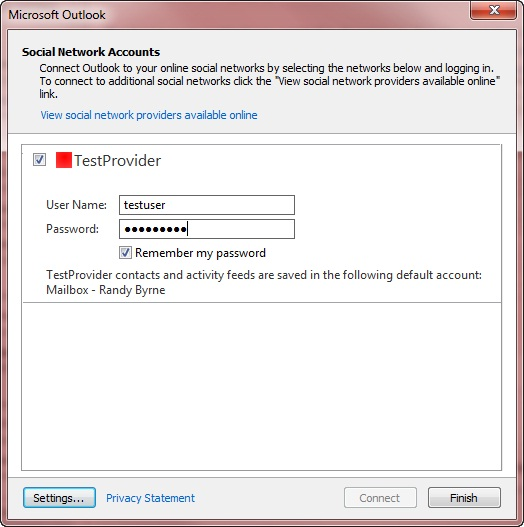

# Elementos XML de capacidades

En las tablas de este tema se describen los elementos secundarios del XML de **capacidades** y se agrupan en las áreas que admiten. El valor predeterminado de cada elemento **Capabilities** es **false**. Si el elemento no se especifica en el XML de **capacidades** devuelto por el método [ISocialProvider:: GetCapabilities](isocialprovider-getcapabilities.md) , el valor del elemento es igual a **false**.
  
Para obtener una descripción general de las **funciones** XML, consulte [XML for Capabilities](xml-for-capabilities.md). Para obtener un ejemplo de XML de **capacidades** , vea el [ejemplo de XML de Capabilities](capabilities-xml-example.md). Para obtener una definición completa del esquema XML del proveedor de Microsoft Outlook Social Connector (OSC), incluidos los elementos necesarios u opcionales, vea el [esquema XML del proveedor de Outlook Social Connector](outlook-social-connector-provider-xml-schema.md).
  
## Capacidades para admitir amigos

En la siguiente tabla se muestran los elementos que se aplican a cualquier forma de sincronización de amigos o que no sean amigos.
  
|**Elemento**|**Descripción**|
|:-----|:-----|
|**doNotFollowPerson**   |Indica si el proveedor admite la llamada al método [ISocialSession:: UnFollowPerson](isocialsession-unfollowperson.md) .    **followPerson** y **doNotFollowPerson** son características independientes de un proveedor OSC. Un proveedor OSC puede indicar la capacidad de poder agregar una persona como amigo (estableciendo **followPerson** en **true**) o puede quitar a una persona como amigo en una cuenta de red social (estableciendo **doNotFollowPerson** en **true**). En general, la posibilidad de seguir no implica que pueda dejar de seguir estos pasos. **followPerson** es una capacidad y no se puede interpretar erróneamente como una acción para seguir a una persona específica o a todos los usuarios de la cuenta de la red social. Si **followPerson** es **true** , no implica que **doNotFollowPerson** es **false**.    |
|**followPerson**   |Indica si el proveedor admite la llamada al método [ISocialSession:: FollowPerson](isocialsession-followperson.md) . El OSC comprueba **followPerson** si **cacheFriends** es **true** (sincronización de amigos en caché), **dynamicContactsLookup** es **true** (sincronización a petición de amigos y no amigos) o ambos **cacheFriends **y **dynamicContactsLookup** son true (sincronización híbrida de amigos y no amigos). Si el proveedor establece **followPerson** como **true**, el OSC muestra un distintivo de red en el panel de personas para los usuarios que sigue el usuario y habilita el comando **on \<NetworkName\> ** en el menú **Agregar (+)** de las personas. Paneles. Si el proveedor establece **followPerson** como **false**, no se muestra la tarjeta de red y se oculta el comando **on \<\> NetworkName** .    |
|**getFriends**   |Indica si el proveedor admite la llamada al método [ISocialPerson:: GetFriendsAndColleagues](isocialperson-getfriendsandcolleagues.md) o [ISocialSession2:: GetPeopleDetails](isocialsession2-getpeopledetails.md) . Si el proveedor establece **getFriends** como **true**, OSC utiliza el valor de **cacheFriends** o **dynamicContactsLookup** para determinar si la red social permite almacenar amigos como elementos de contacto de Outlook o en la memoria. Si el proveedor establece **getFriends** como **false**, la red social no admite amigos y los métodos **ISocialPerson:: GetFriendsAndColleagues** y **ISOCIALSESSION2:: GetPeopleDetails** , y el OSC omite los valores de **cacheFriends** y **dynamicContactsLookup**.    |
   
Los siguientes elementos solo se aplican a la sincronización en caché de amigos o la sincronización híbrida de amigos y no amigos. Para obtener más información acerca de la sincronización de amigos, consulte [Synchronizing Friends and Activities](synchronizing-friends-and-activities.md).
  
|**Elemento**|**Descripción**|
|:-----|:-----|
|**cacheFriends**   |Indica si el proveedor OSC permite almacenar amigos como elementos de contactos de Outlook. El OSC comprueba **cacheFriends** solo si **getFriends** es **true**. Si el proveedor establece **cacheFriends** como **true**, el OSC sincroniza los amigos mediante el almacenamiento en caché y crea una carpeta de contactos específica de red en el almacén predeterminado del usuario para contactos de confianza. El nombre de la carpeta de contactos específica de red es el valor de la propiedad [ISocialProvider:: SocialNetworkName](isocialprovider-socialnetworkname.md) . Si el proveedor establece **cacheFriends** como **false**, OSC no crea una carpeta de contactos específica de red para contactos de confianza para almacenar a amigos.    |
|**contactSyncRestartInterval**   |Determina el intervalo de reintentos, en minutos, entre los intentos de sincronizar la información de los amigos de la red social si se produce un error de sincronización. El OSC usa este elemento sólo si el proveedor OSC admite la sincronización en caché o la sincronización híbrida de amigos a una carpeta de contactos específica de la red social (**cacheFriends** es **true**).    El intervalo de reintento predeterminado es de 30 minutos, a menos que la `ContactSyncRestartInterval` clave de se `HKEY_CURRENT_USER\Software\Microsoft\Office\Outlook\SocialConnector`haya reemplazado por el valor predeterminado. Si el proveedor establece **contactSyncRestartInterval**, el valor del proveedor anulará el intervalo de reintento predeterminado de 30 minutos o el valor de la clave del registro.    Para obtener más información acerca de la sincronización de información de amigos y no amigos a petición, consulte [Synchronizing Friends and Activities](synchronizing-friends-and-activities.md).    |
   
Los siguientes elementos solo se aplican a la sincronización a petición o a la sincronización híbrida de amigos y no amigos.
  
|**Elemento**|**Descripción**|
|:-----|:-----|
|**dynamicContactsLookup**   |Indica si el proveedor OSC admite la llamada de [ISocialSession2:: GetPeopleDetails](isocialsession2-getpeopledetails.md) para la sincronización a petición de amigos y no amigos.    El OSC comprueba **dynamicContactsLookup** solo si **getFriends** es **true**. El valor predeterminado de **dynamicContactsLookup** es **false**.    Si el proveedor OSC especifica **dynamicContactsLookup** como **true** y **GETFRIENDS** como **true**, el OSC llama a **ISocialSession2:: GetPeopleDetails** cada vez que se actualiza el panel de personas. El panel de personas se actualiza cuando el usuario selecciona otro usuario en el panel de personas u otro elemento en la ventana del explorador de Outlook, o abre una ventana de inspector de Outlook. La búsqueda dinámica de contactos garantiza que el usuario siempre ve las imágenes de usuario y la información de perfil más recientes en el panel de personas, pero aumenta el número de llamadas del proveedor a la red social.    Si el proveedor establece **dynamicContactsLookup** como **false**, OSC no llama a **ISocialSession2:: GetPeopleDetails** para actualizar el panel de personas.    |
|**showOnDemandContactsWhenMinimized**   |Indica si OSC debe llevar a cabo la sincronización a petición para amigos y no amigos cuando el panel de personas está minimizado.    |
   
## Capacidades para actividades de soporte

El siguiente elemento se aplica a cualquier forma de sincronización de actividades admitidas por el proveedor de OSC.
  
|**Elemento**|**Descripción**|
|:-----|:-----|
|**getActivities**   |Indica si el proveedor admite las llamadas del método [ISocialSession2:: GetActivitiesEx](isocialsession2-getactivitiesex.md) o [ISocialPerson:: GetActivities](isocialperson-getactivities.md) . Si el proveedor establece **getActivities** como **true**, OSC utiliza el valor de **cacheActivities** o **dynamicActivitiesLookupEx** para determinar si el sitio de red social permite almacenar actividades como elementos de RSS de Outlook o como actividades en la memoria. Si el proveedor establece **getActivities** como **false**, la red social no admite actividades y los métodos **ISocialSession2:: GetActivitiesEx** y **ISOCIALPERSON:: getActivities** , y el OSC omite los valores de ** cacheActivities** y **dynamicActivitiesLookupEx**.    |
   
El siguiente elemento solo se aplica a la sincronización en caché o a la sincronización híbrida de actividades.
  
|**Elemento**|**Descripción**|
|:-----|:-----|
|**cacheActivities**   |A partir de Outlook Social Connector 2013, OSC omite este elemento ya que los proveedores ya no pueden sincronizar actividades almacenando en caché en una carpeta oculta en el almacén del usuario.    Si el proveedor admite actividades, el proveedor debe admitir la sincronización de actividades a petición. El proveedor establece **cacheActivities** como **false** y establece **dynamicActivitesLookupEx** como **true**. El OSC sincroniza las actividades a petición y almacena en caché las actividades de la memoria. La memoria caché de la memoria de actividades se actualiza en un intervalo de 30 minutos.    |
   
Los siguientes elementos solo se aplican a la sincronización a petición o a la sincronización híbrida de actividades.
  
|**Elemento**|**Descripción**|
|:-----|:-----|
|**dynamicActivitiesLookup**   |En desuso en OSC 1,1.    A partir de OSC 1,1, OSC ya no llama a [ISocialSession:: GetActivities](isocialsession-getactivities.md) y omite el valor de **dynamicActivitiesLookup**. Para admitir la búsqueda de actividades a petición, establezca **cacheActivities** como **false** y **getActivities** y **dynamicActivitiesLookupEx** como **true**, y el OSC llamará a **ISocialSession2:: GetActivitiesEx**.    |
|**dynamicActivitiesLookupEx**   |Indica si el proveedor OSC admite la llamada a **ISocialSession2:: GetActivitiesEx** para la sincronización a petición de actividades.    Si el proveedor OSC admite la sincronización de actividades a petición, establece **getActivities** y **dynamicActivitiesLookupEx** como **true**y **cacheActivities** como **false**. El OSC llama a **ISocialSession2:: GetActivitiesEx** cada vez que se actualiza el panel de personas. El panel de personas se actualiza cuando el usuario cambia el elemento seleccionado en la ventana del explorador de Outlook o abre una ventana del inspector de Outlook. La búsqueda de actividades dinámicas garantiza que el usuario siempre verá las últimas actividades en el panel de personas, pero aumentará el número de llamadas del proveedor a la red social.    Si el proveedor establece **dynamicActivitiesLookupEx** como **false**, OSC no llama a **ISocialSession2:: GetActivitiesEx** para las personas que se muestran en el panel de personas.    |
|**showOnDemandActivitiesWhenMinimized**   |Indica si el OSC debe llevar a cabo la sincronización a petición para actividades cuando el panel de personas está minimizado.    |
   
## Capacidades comunes para admitir la sincronización a petición o híbrida de amigos, no amigos y actividades

|**Elemento**|**Descripción**|
|:-----|:-----|
|**hashFunction**   | Especifica la función hash que admite el proveedor OSC. Para proteger la información de identificación personal de los usuarios que no se encuentran en la red social del proveedor o en la aplicación de línea de negocio, el OSC pasa las direcciones de correo electrónico hash a **ISocialSession2:: GetPeopleDetails** y **ISocialSession2:: GetActivitiesEx**.     Si **dynamicContactsLookup** se establece en **true** o **dynamicActivitiesLookupEx** se establece en **true**, el proveedor debe establecer **HashFunction** en uno de los valores permitidos: **SHA1**, **MD5**o **CRC32MD5**. Si falta **hashFunction** o especifica un valor incorrecto, OSC devuelve un error.    **SHA1** es el algoritmo hash seguro de Internet Engineering Task Force (IETF) US 1 definido por [[RFC3174]](https://www.rfc-editor.org/rfc/rfc3174.txt). Por ejemplo, el valor hash de **SHA1** de la dirección de correo `bb81577b567262a21a4df5f6e335c1250acd7b50`electrónico Melissa@contoso.com es.    **MD5** es el algoritmo de síntesis de mensaje MD5 del Departamento de tareas de ingeniería de Internet (IETF) definido por [[RFC1321]](https://www.rfc-editor.org/rfc/rfc1321.txt). Por ejemplo, el valor hash **MD5** de la dirección de correo electrónico `c8c39e61ca1662477b39b83d7b0a0615`Melissa@contoso.com es.    **CRC32MD5** es una combinación de **CRC32** y **MD5** que se define de la siguiente manera:     Normalice la dirección de correo electrónico quitando los espacios en blanco iniciales y finales y convirtiendo todos los caracteres a minúsculas.     Calcule el valor de **CRC32** para la dirección de correo electrónico normalizada y use la representación de entero decimal de este valor. Si la implementación devuelve enteros con signo, debe convertir el entero con signo en un entero sin signo.     Calcule el valor **MD5** para la dirección de correo electrónico normalizada y use la representación hexadecimal de este valor (usando minúsculas de la a A la F).     Combine estos dos valores con un carácter de subrayado.     Por ejemplo, el valor hash **CRC32MD5** de la dirección de correo electrónico `2149665315_c8c39e61ca1662477b39b83d7b0a0615`Melissa@contoso.com es.    |
   
## Capacidades para admitir la configuración de autenticación y cuentas

|**Elemento**|**Descripción**|
|:-----|:-----|
|**allowChangesToAutoConfigure**   |Indica si la red social permite al usuario cambiar las opciones de configuración automática, como, por ejemplo, suministrar una dirección URL diferente para iniciar sesión.    |
|**createAccountUrl**   |Si el proveedor establece **hideHyperlinks** como **false**, cuando el usuario hace clic **aquí para crear una cuenta** en el cuadro de diálogo Configuración de la **cuenta** , la dirección URL especificada por **createAccountUrl** se abre en el explorador predeterminado.    |
|**displayUrl**   |Indica si OSC debe mostrar el cuadro de texto de la **dirección URL** de la red social en el cuadro de diálogo Configuración de la cuenta.    |
|**forgotPasswordUrl**   |Si el proveedor establece **hideHyperlinks** como **false**, cuando el usuario hace clic en **¿ha olvidado la contraseña?** en el cuadro de diálogo Configuración de la **cuenta** , la dirección URL especificada por **forgotPasswordUrl** se abre en el explorador predeterminado.    |
|**hideHyperlinks**   |Indica si el OSC debe ocultar los hipervínculos **haga clic aquí para crear una cuenta** y haber **olvidado la contraseña?** hipervínculos en el cuadro de diálogo Configuración de la cuenta.    OSC 1,0 pasa por alto esta configuración y los hipervínculos están siempre ocultos. OSC 1,1 observa el valor de esta configuración.    |
|**hideRememberMyPassword**   |Indica si OSC debe ocultar la casilla de verificación **recordar contraseña** en el cuadro de diálogo Configuración de la cuenta.    Si el proveedor establece **hideRememberMyPassword** como **true**, OSC actuará como si el cuadro **recordar mi contraseña** no estuviera activado y no guardará la contraseña.    Si el proveedor establece **hideRememberMyPassword** como **false**, OSC mostrará la casilla de verificación **recordar contraseña** en el cuadro de diálogo Configuración de la cuenta.    |
|**supportsAutoConfigure**   |Indica si OSC debe llamar a la función **GetAutoConfiguredSession** en la interfaz **ISocialProvider** para intentar la configuración automática e iniciar sesión en la red social para el usuario.    |
|**useLogonCached**   |Indica si el proveedor OSC admite la llamada de [ISocialSession2:: LogonCached](isocialsession2-logoncached.md) para iniciar sesión con las credenciales almacenadas en la memoria caché.    Si el proveedor establece **useLogonCached** como **true**, el OSC pasa por alto la configuración de **useLogonWebAuth** y el OSC llama a **ISocialSession2:: LogonCached** para la autenticación.    Si el proveedor establece **dynamicActivitiesLookupEx** como **false**, OSC no llama a **ISocialSession2:: LogonCached** para la autenticación.    |
|**useLogonWebAuth**   |Indica si OSC debe usar la autenticación basada en formularios y el método [ISocialSession:: LogonWeb](isocialsession-logonweb.md) . Si el proveedor establece **useLogonWebAuth** como **false**, OSC utiliza la autenticación básica y llama al método [ISocialSession:: Logon](isocialsession-logon.md) . Si el proveedor establece **useLogonWebAuth** como **true**, OSC utiliza la autenticación basada en formularios y llama a **ISocialSession:: LogonWeb**.    |
   
Según el XML de **capacidades** devuelto por el proveedor en el método **ISocialProvider:: GetCapabilities** , cambia el cuadro de diálogo Configuración de la cuenta. Por ejemplo, en la figura 1 se muestra el cuadro de diálogo Configuración de la cuenta para un ejemplo de TestProvider. 
  
**Figura 1. Ejemplo de TestProvider en el cuadro de diálogo Configuración de la cuenta**

  
## Vea también

- [XML para funcionalidades](xml-for-capabilities.md)

