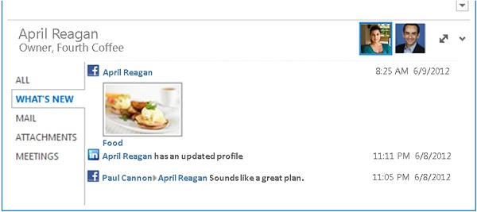

# Por qué debería desarrollar un proveedor de Outlook Social ConnectorWhy develop an Outlook Social Connector provider

Un proveedor de Outlook Social Connector (OSC) permite a los usuarios de Office ver en una aplicación cliente de Office una agregación de actualizaciones de información social aplicadas en un sitio de red social o profesional.An Outlook Social Connector (OSC) provider allows Office users to view within an Office client application an aggregation of social information updates applied on a professional or social network site. SharePoint Server, SharePoint Workspace, cliente lync y todas las aplicaciones cliente de Office que admiten información de presencia y la tarjeta de contacto admiten el OSC.SharePoint Server, SharePoint Workspace, Lync client, and all Office client applications that support presence information and the Contact Card support the OSC.
  
Con un proveedor de redes sociales, el OSC muestra información adicional sobre una persona en la tarjeta de contacto o en el panel de personas de Outlook, como se muestra en la figura 1.Using a social network provider, the OSC shows additional information about a person in the Contact Card or in the Outlook People Pane, as shown in Figure 1. Dado que el OSC se basa en un modelo de proveedor abierto, puede crear proveedores cómodamente para trabajar con el OSC para mostrar datos de redes sociales (como amigos, perfiles, actividades e información de relaciones) en Office.Because the OSC is built on an open provider model, you can conveniently build providers to work with the OSC to display social network data (such as friends, profiles, activities, and relationship information) in Office.
  
Además de los sitios de redes sociales públicas, también puede usar la extensibilidad del proveedor de OSC para crear proveedores para aplicaciones de línea de negocio o sitios web corporativos internos e integrar sus servicios en Office.Apart from public social network sites, you can also use OSC provider extensibility to build providers for line-of-business applications or internal corporate web sites and to integrate their services into Office.
  
**Figura 1. Panel de Outlook Social Connector****Figure 1. Outlook Social Connector pane**

  
## Consulte tambiénSee also

- [Pasos rápidos para aprender a desarrollar un proveedorQuick Steps for Learning to Develop a Provider](quick-steps-for-learning-to-develop-a-provider.md)  
- [Requisitos técnicosTechnical Requirements](technical-requirements.md)
- [Plantillas de ejemplo de OSCOSC Sample Templates](osc-sample-templates.md) 
- [Introducción al desarrollo de un proveedor de Outlook Social ConnectorGetting Started with Developing an Outlook Social Connector Provider](getting-started-with-developing-an-outlook-social-connector-provider.md)

