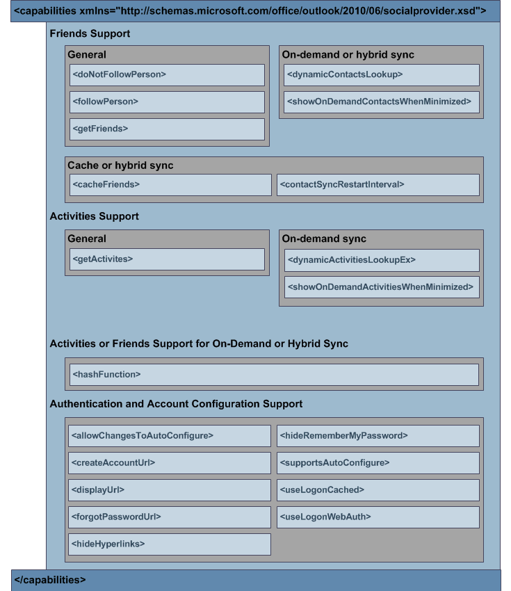

# XML de capacidades

El **elemento capabilities** del esquema XML del proveedor (OSC) permite a un proveedor de OSC especificar su funcionalidad. Esta funcionalidad incluye lo siguiente: 
  
- Si el proveedor admite obtener, almacenar en caché o buscar dinámicamente amigos y actividades desde la red social.
    
- Cómo debe mostrar el OSC determinadas interfaces de usuario de inicio de sesión.
    
- Si el OSC debe usar la autenticación basada en formularios o configurar automáticamente la red social y los registros en el usuario en la red social.
    
El esquema XML para **las funcionalidades** es fundamental porque identifica al OSC la funcionalidad admitida por el proveedor. Un proveedor de OSC debe implementar el [método ISocialProvider::GetCapabilities](isocialprovider-getcapabilities.md) que devuelve una  _cadena de_ resultados. El OSC llama a **ISocialProvider::GetCapabilities** para obtener información sobre  las capacidades del proveedor de OSC en la cadena de resultados, que cumple con la definición de esquema XML para el elemento **capabilities.** Esta información permite que las llamadas posteriores del OSC al proveedor de OSC funcionen correctamente. 
  
Para especificar las capacidades de un proveedor de OSC como parámetro de salida del método **ISocialProvider::GetCapabilities,** debe cumplir con el esquema XML de extensibilidad del proveedor de OSC. En la siguiente figura se muestra la estructura XML **de funcionalidades.** 
  
**Figura 1. \<capacidades \> Estructura XML**

  
Para obtener descripciones detalladas de los elementos secundarios del **elemento capabilities,** vea [Capabilities XML Elements](capabilities-xml-elements.md). Para obtener un ejemplo de **XML de funcionalidades,** vea [Capabilities XML Example](capabilities-xml-example.md). Para obtener una definición completa del esquema XML del proveedor de OSC, incluidos los elementos necesarios u opcionales, vea Outlook Esquema XML del proveedor de [conectores sociales](outlook-social-connector-provider-xml-schema.md).
  
## Vea también

- [Ejemplo XML de funcionalidades](capabilities-xml-example.md)  
- [Sincronizar amigos y actividades](synchronizing-friends-and-activities.md)  
- [XML para amigos](xml-for-friends.md)  
- [XML para actividades](xml-for-activities.md)
- [Desarrollo de un proveedor con el esquema XML de OSC](developing-a-provider-with-the-osc-xml-schema.md)

