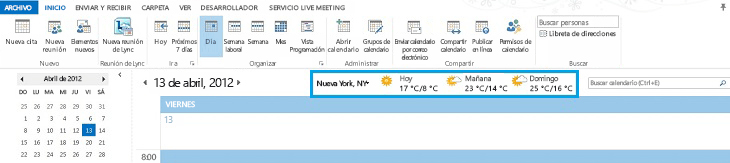
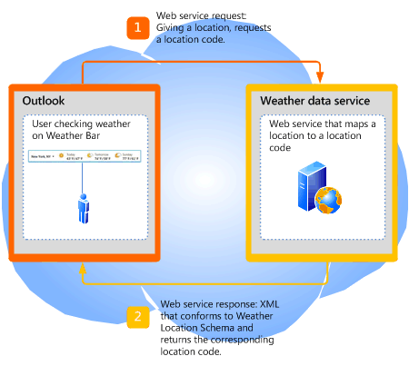

# <a name="extending-the-weather-bar-in-outlook"></a>Ampliación de la barra de meteorología en Outlook

Obtenga información sobre cómo conectar un servicio web de meteorología de terceros para la barra de meteorología en Outlook 2013, para proporcionar datos de las condiciones de tiempo para una ubicación elegido por el usuario.
  
## <a name="weather-bar-overview"></a>Introducción a la barra de meteorología
<a name="ol15_weatherbar_overview"> </a>

La barra de meteorología en Outlook muestra las condiciones de meteorología y previsión para una ubicación geográfica. Un usuario puede elegir una o varias ubicaciones y ver fácilmente datos de tiempo en la barra de meteorología en el módulo calendario. La figura 1 muestra la barra de meteorología mostrar una previsión de tres días para Nueva York, NY. 
  
**En la figura 1. Barra de meteorología de Outlook**


  
Configuración de la barra de meteorología se guarda con el perfil del usuario. Según el tipo de cuenta de Outlook, la configuración puede variar con el usuario en todos los equipos a los que el usuario inicia sesión con el mismo perfil, como en el caso de cuentas de Exchange. Como alternativa, el usuario puede personalizar la configuración en cada equipo, como en el caso de las cuentas IMAP o POP.
  
De forma predeterminada, Outlook utiliza datos de tiempo proporcionados por MSN el tiempo. La barra de meteorología admite servicios de web de datos de tiempo de otro fabricante que seguir un protocolo definido para comunicarse con Outlook. Como un servicio de datos de tiempo de terceros compatible con este protocolo, los usuarios pueden elegir ese servicio de información meteorológica para proporcionar datos de tiempo en la barra de meteorología. En este artículo se describe el protocolo de servicios de tiempo de terceros que se integra con Outlook en la barra de meteorología.
  
## <a name="weather-bar-protocol"></a>Protocolo de barra de meteorología
<a name="ol15_weatherbar_theprotocol"> </a>

Un usuario puede especificar un servicio de datos de tiempo diferente para la barra de meteorología, siempre y cuando ese servicio de información meteorológica implementa un servicio web que admite el protocolo para comunicarse con Outlook siguiente:
  
1. El servicio de información meteorológica admite una dirección URL base a un servicio web. Por ejemplo, un servicio web meteorológico de Contoso puede tener una dirección URL base de https://service.contoso.com/data.aspx.
    
2. El servicio web permite Outlook anexar los siguientes parámetros a la dirección URL base, para solicitar un código de ubicación: 
    
   - outputview = búsqueda: este parámetro indica que la solicitud es una búsqueda de ubicación.
    
   - weasearchstr = _Ciudad_: este parámetro indica la ubicación, _Ciudad_, para que el usuario desea una previsión meteorológica (por ejemplo, London).
    
   - referencia cultural = _LCID_: este parámetro indica la referencia cultural de la versión de Office instalada para el usuario en dicho equipo. El valor de LCID se define en [etiquetas de [RFC4646] para identificar los idiomas](https://www.ietf.org/rfc/rfc4646.txt)
    
   - src = outlook: este parámetro indica que Outlook es la aplicación de cliente que solicita el servicio.
    
   Estos parámetros permiten Outlook para tomar la ubicación que el usuario está interesado en y busque el código de ubicación asociada según la compatibilidad con el servicio de información meteorológica. El servicio web debe responder a Outlook con un código de ubicación en XML que sigue a la [Outlook Weather Location XML Schema](outlook-weather-location-xml-schema.md). La figura 2 se resume la solicitud de servicio web y la respuesta para un código de ubicación.
    
   **La figura 2. Solicitud de servicio Web y la respuesta para un código de ubicación**

   
  
3. El servicio web también permite Outlook anexar los siguientes parámetros, para solicitar información de previsión para un código de ubicación:
    
   - wealocations = _código_: _código_ en este parámetro es un código de ubicación que Outlook se obtiene del paso 2, y que se asigna a la ubicación que el usuario está interesado en. 
    
   - weadegreetype = _degreetype_: este parámetro especifica si se usa el sistema métrico o imperial unidades de medida de temperatura. Especificar c de métrica, f para imperial para  _degreetype_. Este parámetro es opcional y no siempre se encuentra en la solicitud de servicio web.
    
   - referencia cultural = _LCID_: este parámetro indica la referencia cultural de la versión de Office instalada para el usuario en dicho equipo. El valor de LCID se define en [etiquetas de [RFC4646] para identificar los idiomas](https://www.ietf.org/rfc/rfc4646.txt)
    
   - src = outlook: este parámetro indica que Outlook es la aplicación de cliente que solicita el servicio.
    
   Estos parámetros permiten Outlook tomar el código de ubicación devuelto del paso 2 y solicitan el servicio de información meteorológica para la previsión. El servicio web debe responder a Outlook con los datos de tiempo correspondiente en XML que sigue a la [Outlook Weather Information XML Schema](outlook-weather-information-xml-schema.md). La figura 3 se resume la solicitud de servicio web y la respuesta para los datos de tiempo dado un código de ubicación.
    
   **La figura 3. Solicitud de servicio Web y la respuesta de información meteorológica**

   
  
## <a name="setting-the-weather-bar-to-use-a-weather-service"></a>Configuración de la barra de meteorología para usar un servicio meteorológico
<a name="ol15_weatherbar_setting"> </a>

El administrador o usuario avanzado puede usar la clave del registro de **WeatherServiceUrl** para personalizar la barra de meteorología para usar un servicio de tiempo específico. Por ejemplo, si la dirección URL base para un servicio meteorológico de Contoso es https://service.contoso.com/data.aspx, puede establecer la clave de **WeatherServiceUrl** en esa dirección URL. 
  
En la siguiente tabla describe la clave **WeatherServiceUrl**. 
  
|||
|:-----|:-----|
|**Clave** <br/> |HKCU\Software\Microsoft\Office\15.0\Outlook\Options\Calendar  <br/> |
|**Nombre del valor** <br/> |**WeatherServiceUrl** <br/> |
|**Tipo de valor** <br/> |REG_SZ  <br/> |
|**Valor predeterminado** <br/> |EMPTY_STRING  <br/> |
|**Descripción** <br/> |Dirección URL de un servicio de información meteorológica.  <br/> |
   
## <a name="dependent-conditions"></a>Condiciones dependientes
<a name="ol15_weatherbar_dependentconditions"> </a>

Outlook 2013 muestra la barra de meteorología de forma predeterminada. Esta sección describen algunos motivos por los que la barra de meteorología puede no ser visible.
  
### <a name="weather-bar-is-disabled"></a>Se deshabilita la barra de meteorología

En primer lugar, compruebe que la opción **Mostrar el tiempo en el calendario** esté seleccionado en la ficha de **calendario** en el cuadro de diálogo **Opciones de Outlook**. 
  
Tenga en cuenta que un administrador también puede usar Directiva de grupo para deshabilitar la barra de meteorología en Outlook 2013 totalmente estableciendo la siguiente clave del registro de Windows:
  
|||
|:-----|:-----|
|**Clave** <br/> |HKCU\Software\Microsoft\Office\15.0\Outlook\Options\Calendar  <br/> |
|**Nombre del valor** <br/> |**DisableWeather** <br/> |
|**Tipo de valor** <br/> |REG_DWORD  <br/> |
|**Valor predeterminado** <br/> |0  <br/> |
|**Descripción** <br/> |Un valor de 0 permite la barra de meteorología; cualquier otro valor, deshabilita la barra de meteorología.  <br/> |
   
Si se ha deshabilitado la característica de barra de meteorología mediante la directiva de grupo, la ficha **calendario** no incluye la casilla de verificación **Mostrar el tiempo en el calendario**. Póngase en contacto con el administrador para volver a activar la característica. 
  
### <a name="office-is-disconnected-from-the-internet"></a>Office se desconecta de Internet

Comprobar que Office está habilitado para conectarse a Internet, vaya a la ficha **Opciones de privacidad** del **Centro de confianza** en la vista Backstage y a continuación, asegúrese de que esté seleccionado **Permitir Office para conectarse a Internet**. 
  
Si el usuario ha decidido no recibir actualizaciones para Office, la barra de meteorología también está deshabilitada.
  
Un administrador también puede usar la directiva de grupo para deshabilitar todo el contenido en línea, incluida la barra de meteorología, estableciendo la siguiente clave del registro de Windows:
  
|||
|:-----|:-----|
|**Clave** <br/> |HKCU\Software\Microsoft\Office\15.0\Common\Internet  <br/> |
|**Nombre del valor** <br/> |**UseOnlineContent** <br/> |
|**Tipo de valor** <br/> |REG_DWORD  <br/> |
|**Valor predeterminado** <br/> |2  <br/> |
|**Descripción** <br/> |El valor 2 habilita la barra de meteorología; cualquier otro valor, deshabilita la barra de meteorología.  <br/> |
   
Si se ha deshabilitado la característica de barra de meteorología mediante la directiva de grupo, la ficha **calendario** no incluye la casilla de verificación **Mostrar el tiempo en el calendario**. Póngase en contacto con el administrador para volver a activar la característica. 
  
## <a name="weather-bar-example"></a>Ejemplo de barra de meteorología
<a name="ol15_weatherbar_example"> </a>

En esta sección se muestra un ejemplo de un servicio meteorológico de Contoso que sigue el protocolo anterior para comunicarse con Outlook. Para cualquier ubicación que el usuario selecciona, Outlook obtiene primero un código de ubicación para la ubicación de meteorología de Contoso, a continuación, usar ese código de ubicación, llama al servicio de tiempo de Contoso para obtener los datos de tiempo.
  
### <a name="base-url"></a>dirección URL base

Tiempo de Contoso proporciona la siguiente dirección URL base para su servicio de información meteorológica:
  
https://service.contoso.com/data.aspx
  
### <a name="getting-a-location-code"></a>Obtención de un código de ubicación

Outlook anexa los parámetros descritos en el paso 2 anterior a la dirección URL base para obtener el código de ubicación para una ubicación geográfica  _city_:
  
https://service.contoso.com/data.aspx?outputview=search&amp;weasearchstr= _city_
  
Por ejemplo, si el usuario ha seleccionado Tokio en la barra de meteorología, Outlook utiliza la siguiente dirección URL para obtener el código de ubicación de Tokio de meteorología de Contoso: 
  
https://weather.service.contoso.com/data.aspx?outputview=search&amp;weasearchstr=tokyo
  
Tiempo de Contoso responde con el siguiente código XML para proporcionar el código de ubicación de Tokio. El XML se ajusta a la Outlook en el esquema XML de ubicación de tiempo. Tenga en cuenta que es común para los servicios de tiempo obtener datos de más de una ubicación (por ejemplo, si la ubicación seleccionada es un área metropolitana mayor). En este ejemplo, la respuesta de Tokio incluye dos ubicaciones, cada uno entre en un elemento de [Meteorología](weather-element-weatherdata-elementoutlook-weather-location-schema.md) . Los códigos de ubicación correspondientes son los siguientes: 
  
- WC:JAXX0085 para el atributo **weatherlocationname** que se va a  `Tokyo, JPN`
    
- WC:10038604 para el atributo **weatherlocationname** que se va a  `Shinjuku-ku, Tokyo, Japan`
    
```XML
<?xml version="1.0" ?>
<weatherdata>
  <weather weatherlocationcode="wc:JAXX0085" 
    weatherlocationname="Tokyo, JPN">
  </weather>
  <weather weatherlocationcode="wc:10038604" 
    weatherlocationname="Shinjuku-ku, JPN">
  </weather>
</weatherdata>

```

### <a name="getting-weather-information-for-a-location-code"></a>Obtención de información meteorológica para un código de ubicación

Después de obtener el código de ubicación para una ubicación, Outlook anexa los parámetros descritos en el paso 3 anterior a la dirección URL base para obtener información meteorológica para ese código de ubicación.
  
https://service.contoso.com/data.aspx?wealocations= _code_
  
Por ejemplo, si Outlook ha obtenido la wc:JAXX0085 de código de ubicación de la información meteorológica de Contoso de Tokio, Outlook usa este código de ubicación en la siguiente dirección URL para obtener la información meteorológica.
  
https://service.contoso.com/data.aspx?wealocations=wc:JAXX0085
  
Tiempo de Contoso responde con el siguiente código XML para proporcionar información meteorológica para el código de ubicación de Tokio. El código XML se ajusta a la Outlook esquema de XML de información meteorológica.
  
```XML
<?xml version="1.0"?>
<weatherdata>
  <weather timezone="9" attribution="Data provided by Trey Research" 
    degreetype="F" imagerelativeurl="https://contoso.com/images/en-us/" 
    url="https://contoso.com/weather.aspx?eid=33568&amp;q=Tokyo-JPN" 
    weatherlocationname="Tokyo, JPN" 
    weatherlocationcode="wc:JAXX0085">
      <current winddisplay="9 mph NNW" windspeed="9" humidity="90" feelslike="44" 
        observationpoint="Tokyo" observationtime="06:00:00" 
        shortday="Sat" day="Saturday" date="2012-04-14" skytext="Rain" skycode="11" 
        temperature="48"/>
      <forecast shortday="Sat" day="Saturday" date="2012-04-14" precip="95" skytextday="Rain"
        skycodeday="11" high="55" low="47"/>
      <forecast shortday="Sun" day="Sunday" date="2012-04-15" precip="5" skytextday="Partly Cloudy" 
        skycodeday="30" high="65" low="43"/>
      <forecast shortday="Mon" day="Monday" date="2012-04-16" precip="5" skytextday="Partly Cloudy" 
        skycodeday="30" high="64" low="52"/>
      <forecast shortday="Tue" day="Tuesday" date="2012-04-17" precip="70" skytextday="Showers / Clear" 
        skycodeday="39" high="66" low="53"/>
      <forecast shortday="Wed" day="Wednesday" date="2012-04-18" precip="55" skytextday="Showers / Clear" 
        skycodeday="39" high="68" low="51"/>
  </weather>
</weatherdata>

```

### <a name="resetting-outlook-to-use-msn-weather"></a>Restablecer Outlook usar MSN meteorología

Aunque Outlook usa MSN el tiempo de forma predeterminada, si un usuario ha personalizado la barra de meteorología para usar un servicio meteorológico diferentes y posteriormente desea volver a utilizar MSN el tiempo, el usuario simplemente puede eliminar la clave de **WeatherServiceUrl** en el registro de Windows. Eliminación de esa clave del registro, restablece Outlook para usar MSN el tiempo. 
  
## <a name="conclusion"></a>Conclusión
<a name="ol15_weatherbar_conclusion"> </a>

La barra de meteorología en el calendario de Outlook usa MSN el tiempo de forma predeterminada para proporcionar la previsión meteorológica para una ubicación especificada. Los usuarios pueden ver fácilmente información meteorológica para las ubicaciones que les interesen. Servicios de datos de tiempo de terceros también pueden integrarse con la barra de meteorología admiten la Outlook esquema XML de ubicación de tiempo y Outlook esquema de XML de información meteorológica y siguiendo un protocolo de servicio web sencillos con Outlook.
  
## <a name="see-also"></a>Vea también

- [Outlook Weather Location XML Schema](outlook-weather-location-xml-schema.md)   
- [Outlook Weather Information XML Schema](outlook-weather-information-xml-schema.md)
    

