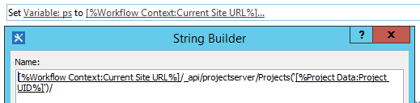
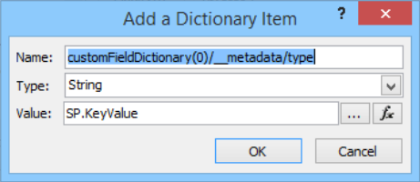
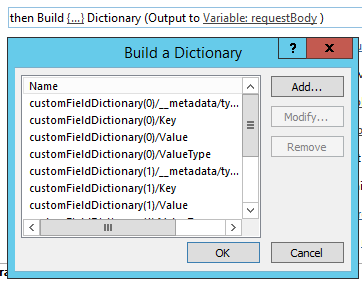
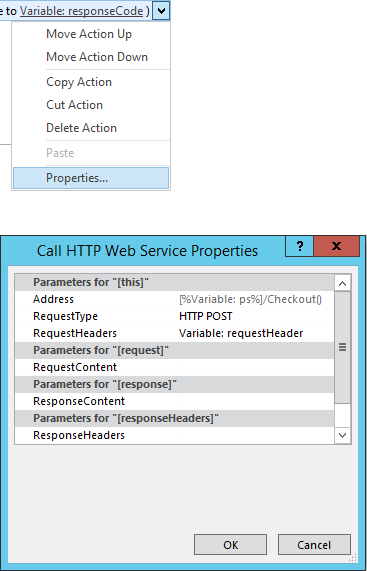
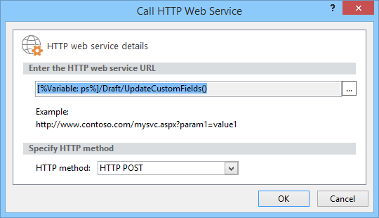
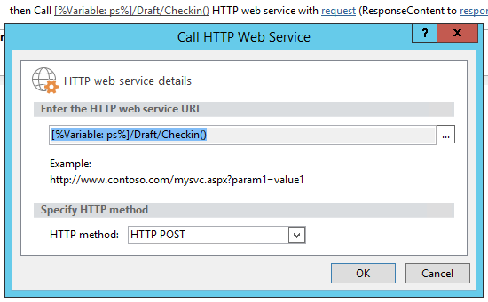
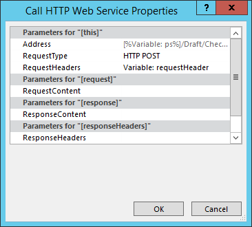

# Actualización en masa de los campos personalizados y crear sitios de proyecto desde un flujo de trabajo en Project OnlineBulk update custom fields and create project sites from a workflow in Project Online

Para ayudar a los clientes obtener el máximo partido de Project Online y mejorar nuestros extensibilidad de servicio y flexibilidad, hemos agregado dos métodos para el modelo de objetos de cliente que pueden usar los flujos de trabajo y aplicaciones de Project Online.To help customers get the most out of Project Online and improve our service extensibility and flexibility, we've added two methods to the client-side object model that you can use in Project Online apps and workflows.
  
|||
|:-----|:-----|
|**UpdateCustomFields****UpdateCustomFields**   |Masiva actualiza los campos personalizados de proyecto.Bulk updates project custom fields. Para Project Online solo.For Project Online only. Disponible sólo en la API de REST.Available only in the REST API.    |
|**CreateProjectSite****CreateProjectSite**   | Crea un sitio de proyecto.Creates a Project site. Para Project Online solo.For Project Online only. Está disponible en la API de REST, el modelo de objetos de cliente administrado y el modelo de objetos de cliente de JavaScript.Available in the REST API, managed client object model, and JavaScript client object model.    |
   
Además de proporcionar más flexibilidad, estos métodos también ofrecen importantes mejoras de rendimiento al guardar y publicar proyectos en un flujo de trabajo.In addition to providing more flexibility, these methods also offer significant performance improvements when saving and publishing projects in a workflow. En este artículo se describe cómo utilizar los métodos de la API de REST y proporciona instrucciones para crear un flujo de trabajo que los campos personalizados de forma masiva actualizaciones y un flujo de trabajo que se crea un sitio de proyecto.This article describes how to use the methods in the REST API and provides instructions for creating a workflow that bulk updates custom fields and a workflow that creates a Project site.
  
> [!NOTE]
> Para obtener más información sobre cómo llamar a las API de REST de los flujos de trabajo de SharePoint 2013, vea [uso de REST de SharePoint services de flujo de trabajo con el método POST](https://mysharepointinsight.blogspot.com/2013/05/using-sharepoint-rest-services-from.mdl) y [llamar a la API de Rest de SharePoint 2013 desde un flujo de trabajo de SharePoint Designer](https://sergeluca.wordpress.com/2013/04/09/calling-the-sharepoint-2013-rest-api-from-a-sharepoint-designer-workflow/).To learn more about calling REST APIs from SharePoint 2013 workflows, see [Using SharePoint REST services from workflow with POST method](https://mysharepointinsight.blogspot.com/2013/05/using-sharepoint-rest-services-from.mdl) and [Calling the SharePoint 2013 Rest API from a SharePoint Designer Workflow](https://sergeluca.wordpress.com/2013/04/09/calling-the-sharepoint-2013-rest-api-from-a-sharepoint-designer-workflow/). 
  
## Proyecto de campos personalizados de un flujo de trabajo para la actualización masivaBulk update project custom fields from a workflow

Anteriormente, los flujos de trabajo sólo podrían actualizar un campo personalizado a la vez.Previously, workflows could only update one custom field at a time. Actualización de los campos personalizados de proyecto uno a la vez, se puede producir una experiencia de usuario final deficiente cuando los usuarios realizar la transición entre páginas de detalles del proyecto.Updating project custom fields one at a time can result in a poor end-user experience when users transition between Project Detail Pages. Cada actualización necesaria una solicitud de servidor independiente mediante la acción **Establecer campo de proyecto** y actualizar varios campos personalizados en una latencia alta, baja-ancho de banda de red como resultado de una sobrecarga no trivial.Each update required a separate server request using the **Set Project Field** action, and updating multiple custom fields on a high-latency, low-bandwidth network resulted in a non-trivial overhead. Para resolver este problema, hemos agregado el método **UpdateCustomFields** a la API de REST que permite que masiva de actualización de campos personalizados.To resolve this issue, we added the **UpdateCustomFields** method to the REST API that lets you bulk update custom fields. Para usar **UpdateCustomFields**, pase en un diccionario que contiene los nombres y valores de todos los campos personalizados que desea actualizar.To use **UpdateCustomFields**, you pass in a dictionary that contains the names and values of all the custom fields you want to update.
  
El método REST puede encontrarse en el extremo siguiente:The REST method can be found at the following endpoint:
  
`https://<site-url>/_api/ProjectServer/Projects('<guid>')/Draft/UpdateCustomFields()`
  
> [!NOTE]
> Reemplace el `<site-url>` marcador de posición en los ejemplos con la dirección URL del sitio de Project Web App (PWA) y la `<guid>` marcador de posición con el UID del proyecto.Replace the  `<site-url>` placeholder in the examples with the URL of your Project Web App (PWA) site and the  `<guid>` placeholder with your project UID. 
  
En esta sección se describe cómo crear un flujo de trabajo que masiva actualiza los campos personalizados para un proyecto.This section describes how to create a workflow that bulk updates custom fields for a project. El flujo de trabajo sigue estos pasos de alto nivel:The workflow follows these high-level steps:
  
- Espere a que el proyecto que desea actualizar para obtener protegidoWait for the project that you want to update to get checked in
    
- Crear un conjunto de datos que define todas las actualizaciones de campo personalizado para el proyectoBuild a data set that defines all your custom field updates for the project
    
- Desproteger el proyectoCheck out the project
    
- Llame a **UpdateCustomFields** para aplicar las actualizaciones de campo personalizado al proyectoCall **UpdateCustomFields** to apply the custom field updates to the project 
    
- Registrar la información relevante a la lista de historial de flujo de trabajo (si es necesario)Log relevant information to the workflow history list (if required)
    
- Publicar el proyectoPublish the project
    
- Proteger el proyectoCheck in the project
    
El flujo de trabajo final, end-to-end tiene este aspecto:The final, end-to-end workflow looks like this:
  
![Flujo de trabajo de extremo a otro] (media/8c0741f9-7f76-409d-8c00-e7a8c3ddb89f.png "Flujo de trabajo de extremo a otro")
  
### Para crear un flujo de trabajo que masiva actualiza los campos personalizadosTo create a workflow that bulk updates custom fields

1. Opcional.Optional. Almacene la dirección URL completa del proyecto en una variable que se puede usar en todo el flujo de trabajo.Store the full URL of your project in a variable that you can use throughout the workflow.
    
    ![Almacén de la dirección URL del proyecto en una variable] (media/a880c5c6-8e7a-44dd-87e9-7e532169d489.png "Almacén de la dirección URL del proyecto en una variable")
  
2. Agregue la acción **esperar el evento de proyecto** al flujo de trabajo y elija el evento **cuando se protege un proyecto** .Add the **Wait for Project Event** action to the workflow and choose the **When a project is checked in** event. 
    
    ![Espere a que el proyecto para protegerse] (media/699aa9c7-b3c9-426e-a775-96993a13559c.png "Espere a que el proyecto para protegerse")
  
3. Crear un diccionario de **requestHeader** mediante la acción de **compilación de diccionario** .Create a **requestHeader** dictionary using the **Build dictionary** action. Debe usar el mismo encabezado de solicitud para todas las llamadas al servicio web en este flujo de trabajo.You'll use the same request header for all the web service calls in this workflow. 
    
    ![Crear el diccionario requestHeader] (media/83b0aa10-9ab7-43dd-800d-a738bb815876.png "Crear el diccionario requestHeader")
  
4. Agregue los dos elementos siguientes para el diccionario.Add the following two items to the dictionary.
    
    |NombreName|TipoType|ValorValue|
    |:-----|:-----|:-----|
    |AcceptAccept    |StringString    |Application/json; OData = verboseapplication/json; odata=verbose    |
    |Content-TypeContent-Type    |StringString    |Application/json; OData = verboseapplication/json; odata=verbose    |
   
    ![Adición de un encabezado Accept] (media/2f2e2016-3c49-4cac-b1e7-f2b8118b840c.png "Adición de un encabezado Accept")
  
5. Crear un diccionario de **requestBody** mediante la acción de **compilación de diccionario** .Create a **requestBody** dictionary using the **Build dictionary** action. Este diccionario almacena todas las actualizaciones de campo que se desean aplicar.This dictionary stores all the field updates that you want to apply. 
    
    Cada actualización de campo personalizado requiere cuatro filas: el campo tipo de metadatos (1), (2) clave, valor (3) y tipo de valor (4).Each custom field update requires four rows: the field's (1) metadata type, (2) key, (3) value, and (4) value type.
    
    - **tipo/__metadata** El tipo del campo metadatos.**__metadata/type** The field's metadata type. Este registro siempre es el mismo y utiliza los siguientes valores:This record is always the same and uses the following values: 
    
       - Nombre: customFieldDictionary (i) / __metadata/tipo (donde **i** es el índice de cada campo personalizado en el diccionario, comenzando por 0)Name: customFieldDictionary(i)/__metadata/type (where **i** is the index of each custom field in the dictionary, starting with 0) 
            
       - Tipo: StringType: String
            
       - Valor: SP. KeyValueValue: SP.KeyValue
    
       ![Definición de una actualización de campo personalizado] (media/a4423493-6603-42ee-ae50-1ef74c5c59bd.png "Definición de una actualización de campo personalizado")
  
    - **Clave** El nombre interno del campo personalizado, en el formato: *Custom_ce23fbf43fa0e411941000155d3c8201***Key** The internal name of the custom field, in the format: *Custom_ce23fbf43fa0e411941000155d3c8201* 
    
       Puede encontrar el nombre interno de un campo personalizado navegando a su extremo **InternalName** :`https://<site-url>/_api/ProjectServer/CustomFields('<guid>')/InternalName`You can find the internal name of a custom field by navigating to it's **InternalName** endpoint: `https://<site-url>/_api/ProjectServer/CustomFields('<guid>')/InternalName`
    
       Si creó manualmente los campos personalizados, los valores será diferente para cada sitio.If you created your custom fields manually, the values will differ from site to site. Si piensa volver a usar el flujo de trabajo en varios sitios, asegúrese de que el campo personalizado identificadores son correctos.If you plan to reuse the workflow across multiple sites, make sure the custom field IDs are correct.
    
    - **Valor** El valor para asignar el campo personalizado.**Value** The value to assign to the custom field. Para los campos personalizados que están vinculados a las tablas de búsqueda, debe usar los nombres internos de las entradas de tabla de búsqueda en lugar de los valores de tabla de búsqueda real.For custom fields that are linked to lookup tables, you need to use the internal names of the lookup table entries instead of the actual lookup table values. 
    
       Puede encontrar el nombre interno de la entrada de la tabla de búsqueda en el extremo siguiente:`https://<site-url>/_api/ProjectServer/CustomFields('<guid>')/LookupEntries('<guid>')/InternalName`You can find the internal name of the lookup table entry at the following endpoint: `https://<site-url>/_api/ProjectServer/CustomFields('<guid>')/LookupEntries('<guid>')/InternalName`
    
       Si tiene un campo personalizado de tabla de búsqueda configurado para aceptar varios valores, use `;#` a concatene los valores (tal como se muestra en el diccionario de ejemplo que aparece a continuación).If you have a lookup table custom field set up to accept multiple values, use  `;#` to concatenate values (as shown in the example dictionary below). 
    
    - **Tipo de valor** El tipo del campo personalizado que se va a actualizar.**ValueType** The type of the custom field you are updating. 
    
       - Para los campos de texto, duración, marca y LookupTable, use Edm.StringFor Text, Duration, Flag, and LookupTable fields, use Edm.String
    
       - Para campos numéricos, utilice Edm.Int32, Edm.Double o cualquier otro aceptado OData número tipoFor Number fields, use Edm.Int32, Edm.Double, or any other OData-accepted number type
    
       - Para los campos de fecha, use Edm.DateTimeFor Date fields, use Edm.DateTime
    
       El diccionario de ejemplo siguiente define las actualizaciones para tres campos personalizados.The example dictionary below defines updates for three custom fields. La primera es para un campo personalizado de valor búsqueda tabla varios, la segunda es para un campo de número y la tercera es para un campo de fecha.The first is for a multiple value lookup table custom field, the second is for a number field, and the third is for a date field. Tenga en cuenta cómo los incrementos de índice **customFieldDictionary** .Note how the **customFieldDictionary** index increments. 
    
       > [!NOTE]
       > Estos valores son únicamente con fines de ilustración.These values are for illustration purposes only. Los pares de clave y valor que va a utilizar dependen de los datos de PWA.The key-value pairs you'll use depend on your PWA data. 
  
       |NombreName|TipoType|ValorValue|
       |:-----|:-----|:-----|
       |tipo/__metadata/customFieldDictionary (0)customFieldDictionary(0)/__metadata/type    |StringString    |SP. KeyValueSP.KeyValue    |
       |customFieldDictionary (0) / clavecustomFieldDictionary(0)/Key    |StringString    |Personalizar\_ce23fbf43fa0e411941000155d3c8201Custom\_ce23fbf43fa0e411941000155d3c8201    |
       |customFieldDictionary (0) / valorcustomFieldDictionary(0)/Value    |StringString    |Entrada\_b9a2fd69279de411940f00155d3c8201; #Entry\_baa2fd69279de411940f00155d3c8201Entry\_b9a2fd69279de411940f00155d3c8201;#Entry\_baa2fd69279de411940f00155d3c8201    |
       |customFieldDictionary (0) o tipo de valorcustomFieldDictionary(0)/ValueType    |StringString    |Edm.StringEdm.String    |
       |customFieldDictionary (1) / __metadata/tipocustomFieldDictionary(1)/__metadata/type    |StringString    |SP. KeyValueSP.KeyValue    |
       |(1) o clave de customFieldDictionarycustomFieldDictionary(1)/Key    |StringString    |Custom_c7f114c97098e411940f00155d3c8201Custom_c7f114c97098e411940f00155d3c8201    |
       |customFieldDictionary (1) y valorcustomFieldDictionary(1)/Value    |StringString    |90.590.5    |
       |customFieldDictionary (1) o tipo de valorcustomFieldDictionary(1)/ValueType    |StringString    |Edm.DoubleEdm.Double    |
       |customFieldDictionary (2) / __metadata/tipocustomFieldDictionary(2)/__metadata/type    |StringString    |SP. KeyValueSP.KeyValue    |
       |(2) o clave de customFieldDictionarycustomFieldDictionary(2)/Key    |StringString    |Custom_c6fb67e0b9a1e411941000155d3c8201Custom_c6fb67e0b9a1e411941000155d3c8201    |
       |customFieldDictionary (2) y valorcustomFieldDictionary(2)/Value    |StringString    |2015-04-01T00:00:00.00000002015-04-01T00:00:00.0000000    |
       |customFieldDictionary (2) o tipo de valorcustomFieldDictionary(2)/ValueType    |StringString    |Edm.DateTimeEdm.DateTime    |
   
       ![Diccionario que define las actualizaciones de campo personalizado] (media/41a1f18f-a6b2-40ff-904b-437baf962621.png "Diccionario que define las actualizaciones de campo personalizado")
  
6. Agregar una acción de **Llamar al servicio Web de HTTP** para desproteger el proyecto.Add a **Call HTTP Web Service** action to check the project out. 
    
    ![Llame al método Checkout] (media/8ce56014-0317-419b-afa7-229d05c86885.png "Llame al método Checkout")
  
7. Editar las propiedades de la llamada al servicio web para especificar el encabezado de solicitud.Edit the properties of the web service call to specify the request header. Para abrir el cuadro de diálogo **Propiedades** , haga clic en la acción y elija **Propiedades**.To open the **Properties** dialog box, right-click the action and choose **Properties**.
    
    ![Especificar el encabezado de solicitud de servicio web llame a las propiedades] (media/d81e92b1-43df-42ad-9cd0-a693f93b164e.png "Especificar el encabezado de solicitud de servicio web llame a las propiedades")
  
8. Agregar una acción de **Servicio Web HTTP de llamada** para llamar al método **UpdateCustomFields** .Add a **Call HTTP Web Service** action to call the **UpdateCustomFields** method. 
    
    ![Crear una acción llamar al servicio Web de HTTP] (media/9a73a201-c035-41b4-8798-506ac48b90f8.png "Crear una acción llamar al servicio Web de HTTP")
  
    Tenga en cuenta el `/Draft/` segmento en la dirección URL del servicio web.Note the  `/Draft/` segment in the web service URL. La dirección URL completa debe tener este aspecto:`https://<site-url>/_api/ProjectServer/Projects('<guid>')/Draft/UpdateCustomFields()`The full URL should look like this: `https://<site-url>/_api/ProjectServer/Projects('<guid>')/Draft/UpdateCustomFields()`
    
    ![Llame al método UpdateCustomFields] (media/03b323f1-8e99-4b18-be18-be505d7cec7e.png "Llame al método UpdateCustomFields")
  
9. Editar las propiedades de la llamada al servicio web para enlazar los parámetros **RequestHeader** y **RequestContent** a los diccionarios que creó.Edit the properties of the web service call to bind the **RequestHeader** and **RequestContent** parameters to the dictionaries you created. También puede crear una nueva variable para almacenar el **ResponseContent**.You can also create a new variable to store the **ResponseContent**.
    
    ![Enlazar los diccionarios en el encabezado de la solicitud y contenido] (media/f96bec92-138e-4eab-b1e7-1ab83d0428a5.png "Enlazar los diccionarios en el encabezado de la solicitud y contenido")
  
10. Opcional.Optional. Leer desde el diccionario de respuesta para comprobar el estado de los trabajos en cola y la información de registro en la lista de historial de flujo de trabajo.Read from the response dictionary to check the state of the queue job and log the information in the workflow history list.
    
    ![Configuración del registro] (media/7d2f4936-61d7-4906-83e8-7478a5935af5.png "Configuración del registro")
  
11. Agregue una llamada al servicio web al extremo de **Publicar** para publicar el proyecto.Add a web service call to the **Publish** endpoint to publish the project. Use siempre el mismo encabezado de solicitud.Always use the same request header. 
    
    ![Llame al método de publicación] (media/3b661091-ffae-4d7e-a0bb-5b96a6292731.png "Llame al método de publicación")
  
    ![Llamar las propiedades para el servicio web de publicación] (media/6a80a5d3-7e29-4398-993c-f78b3faca8b1.png "Llamar las propiedades para el servicio web de publicación")
  
12. Agregue una llamada al servicio web final al extremo de **Checkin** para proteger el proyecto.Add a final web service call to the **Checkin** endpoint to check the project in. 
    
    ![Llame al método Checkin] (media/430510cb-0774-4911-af7f-b565b83eba0e.png "Llame al método Checkin")
  
    ![Llamar las propiedades para el servicio web de Checkin] (media/485f48d6-bbb8-4568-9dc3-aae3218f6bd1.png "Llamar las propiedades para el servicio web de Checkin")

## Crear un sitio de proyecto desde un flujo de trabajoCreate a Project site from a workflow

Cada proyecto puede tener sus propio dedicados sitios de SharePoint donde los miembros del equipo pueden colaborar, compartir documentos, provocar problemas y así sucesivamente.Every project can have its own dedicated SharePoint sites where team members can collaborate, share documents, raise issues, and so on. Anteriormente, podrían sólo se crean los sitios automáticamente en primer lugar publicar o manualmente por el jefe de proyecto en Project Professional o por el administrador en PWA configuración o se ha podrían deshabilitar.Previously, sites could only be created automatically on first publish or manually by the project manager in Project Professional or by the administrator in PWA settings, or they could be disabled.
  
Hemos agregado el método **CreateProjectSite** para que pueda elegir cuándo se debe crear sitios de proyecto.We've added the **CreateProjectSite** method so you can choose when to create project sites. Esto es especialmente útil para las organizaciones que desean crear sus sitios de forma automática cuando una propuesta de proyecto alcanza una fase determinada en un flujo de trabajo predefinido, en lugar de en primer lugar publicación.This is particularly useful for organizations who want to create their sites automatically when a project proposal reaches a specific stage in a pre-defined workflow, rather than on first publish. Posponer la creación de sitios de proyecto significativamente mejora el rendimiento de la creación de un proyecto.Postponing project site creation significantly improves the performance of creating a project. 
  
**Necesario como requisito previo:** Antes de poder usar **CreateProjectSite**, se debe establecer la opción de **Permitir a los usuarios elegir** para la creación de sitios de proyecto en **PWA configuración** > \*\* sitios de SharePoint conectados \*\* > **configuración**.**Prerequisite:** Before you can use **CreateProjectSite**, the **Allow users to choose** setting must be set for project site creation in **PWA Settings** > \*\* Connected SharePoint Sites \*\* > **Settings**.
  
![Configuración "Permitir a los usuarios elegir" en configuración de PWA] (media/6c6c8175-eb10-431d-8056-cea55718fdb4.png "Configuración de permitir a los usuarios elegir en configuración de PWA")
  
### Para crear un flujo de trabajo que se crea un sitio de proyectoTo create a workflow that creates a Project site

1. Crear o editar un flujo de trabajo existente y seleccione el paso donde desea crear los sitios del proyecto.Create or edit an existing workflow and select the step where you want to create your Project sites.
    
2. Crear un diccionario de **requestHeader** mediante la acción de **compilación de diccionario** .Create a **requestHeader** dictionary using the **Build dictionary** action. 
    
    ![Crear el diccionario requestHeader] (media/83b0aa10-9ab7-43dd-800d-a738bb815876.png "Crear el diccionario requestHeader")
  
3. Agregue los dos elementos siguientes para el diccionario.Add the following two items to the dictionary.
    
    |NombreName|TipoType|ValorValue|
    |:-----|:-----|:-----|
    |AcceptAccept    |StringString    |Application/json; OData = verboseapplication/json; odata=verbose    |
    |Content-TypeContent-Type    |StringString    |Application/json; OData = verboseapplication/json; odata=verbose    |
   
    ![Adición de un encabezado Accept] (media/2f2e2016-3c49-4cac-b1e7-f2b8118b840c.png "Adición de un encabezado Accept")
  
4. Agregar la acción de **Llamar al servicio Web de HTTP** .Add the **Call HTTP Web Service** action. Cambie el tipo de solicitud para usar **POST**y establecer la dirección URL con el siguiente formato:Change the request type to use **POST**, and set the URL using the following format:
    
    `https://<site-url>/_api/ProjectServer/Projects('<guid>')/CreateProjectSite('New web name')`
    
    ![Crear el URI del extremo de CreateProjectSite] (media/42a90a5e-8d1b-4667-a933-785175212847.png "Crear el URI del extremo de CreateProjectSite")
  
    Pase el nombre del sitio del proyecto para el método **CreateProjectSite** como una cadena.Pass the name of the Project site to the **CreateProjectSite** method as a string. Para usar el nombre del proyecto como el nombre del sitio, pase una cadena vacía.To use the project name as the site name, pass an empty string. Asegúrese de utilizar nombres únicos, por lo que funcionará el siguiente sitio de proyecto que cree.Be sure to use unique names so the next project site you create will work. 
    
5. Editar las propiedades de la llamada al servicio web a la que enlazar el parámetro **RequestHeader** el diccionario que creó.Edit the properties of the web service call to bind the **RequestHeader** parameter to the dictionary you created. 
    
    ![El diccionario a la solicitud de enlace] (media/61a5a0a8-405f-44eb-b5e7-80b11f7caec3.png "El diccionario a la solicitud de enlace")
  
## Vea tambiénSee also

- [Tareas de programación de ProjectProject programming tasks](project-programming-tasks.md)
- [Modelo de objetos de cliente (COM) de Project 2013Client-side object model (CSOM) for Project 2013](client-side-object-model-csom-for-project-2013.md)
- [Flujos de trabajo en SharePoint 2013Workflows in SharePoint 2013](https://msdn.microsoft.com/library/e0602371-ae22-44be-8a7e-9e47e9f046d6%28Office.15%29.aspx)
    

