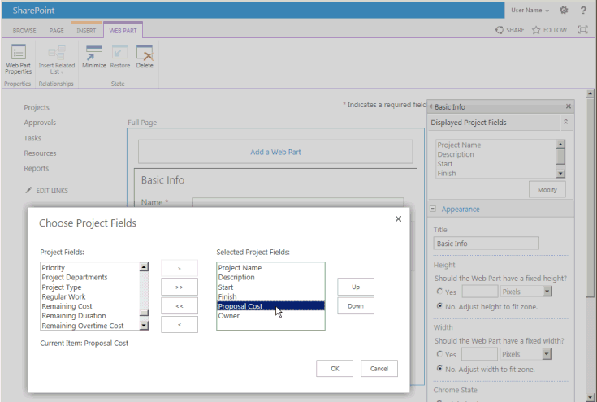
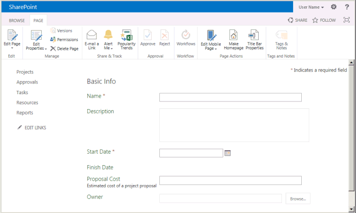
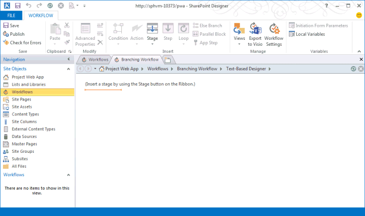
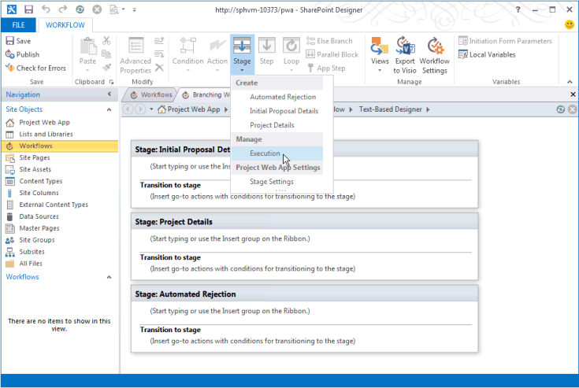
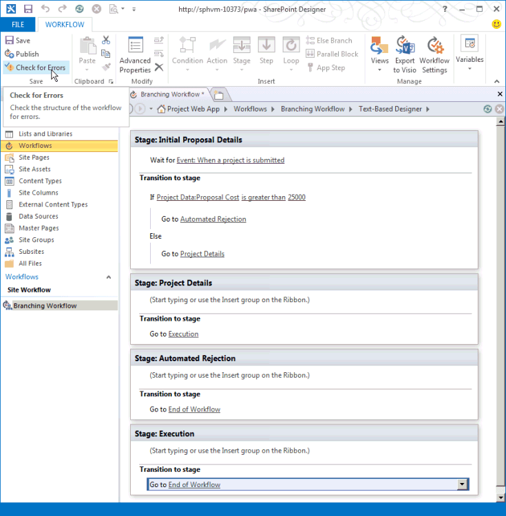
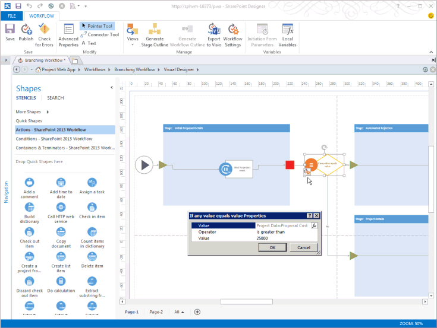
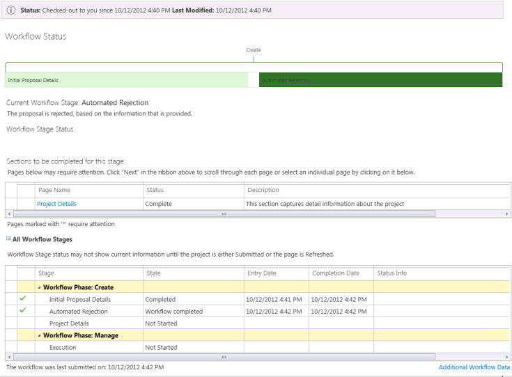
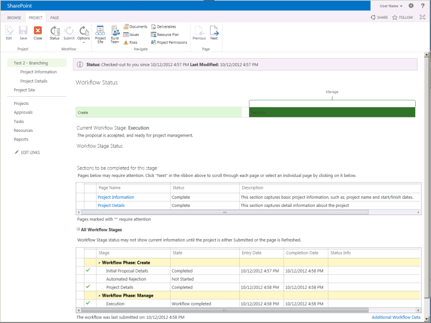
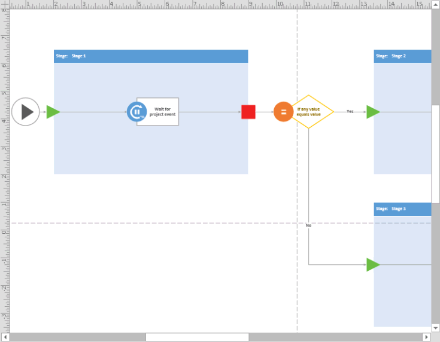

# Crear un flujo de trabajo de Project Server para Administración de propuestasCreate a Project Server workflow for demand management

En este artículo se describe cómo crear un flujo de trabajo simple mediante SharePoint Designer 2013.This article describes how to create a simple workflow by using SharePoint Designer 2013. Puede exportar el flujo de trabajo a Visio 2013 para su visualización y edición, o bien usar Visio 2013 para diseñar flujos de trabajo de Project Server 2013 e importar el diseño en SharePoint Designer 2013 para la publicación en Project Web App.You can export the workflow to Visio 2013 for visualization and editing, or use Visio 2013 to design Project Server 2013 workflows and import the design into SharePoint Designer 2013 for publication to Project Web App. Para obtener más información sobre la plataforma de flujo de trabajo de SharePoint y la creación de flujos de trabajo con Visio 2013 y SharePoint Designer 2013, vea los artículos sobre [flujos de trabajo en sharepoint 2013](https://msdn.microsoft.com/library/jj163986%28office.15%29.aspx) en la documentación para desarrolladores de SharePoint 2013.For more information about the SharePoint workflow platform and creating workflows with Visio 2013 and SharePoint Designer 2013, see the [Workflows in SharePoint 2013](https://msdn.microsoft.com/library/jj163986%28office.15%29.aspx) articles in the SharePoint 2013 developer documentation. 
  
Para obtener información sobre la preparación de Project Server para flujos de trabajo, vea [Inicio: instalar y configurar el administrador de flujos de trabajo de SharePoint 2013](https://msdn.microsoft.com/library/jj163276%28office.15%29.aspx).For information about preparing Project Server for workflows, see [Start: Set up and configure SharePoint 2013 Workflow Manager](https://msdn.microsoft.com/library/jj163276%28office.15%29.aspx).

## Crear un flujo de trabajo generalCreating a general workflow

Siga estos pasos para crear un flujo de trabajo de Project Server 2013 mediante SharePoint Designer 2013.Use the following steps to create a Project Server 2013 workflow by using SharePoint Designer 2013. El flujo de trabajo se ha diseñado para la administración de propuestas de proyectos.The workflow is designed for demand management of project proposals.
  
Para conocer los pasos detallados, vea la sección [creación de un flujo de trabajo de bifurcación](#pj15_CreateWorkflowSPD_Detailed) .For detailed steps, see the [Creating a branching workflow](#pj15_CreateWorkflowSPD_Detailed) section. 
  
### Crear un flujo de trabajo de Project Server (procedimiento general)To create a Project Server workflow (general procedure)

1. Determine los requisitos y, después, diseñe el flujo de trabajo. Organícelo en fases y etapas y determine los campos personalizados que va a usar el flujo de trabajo.Determine the requirements, and then design the workflow. Organize it into phases and stages, and determine the custom fields that the workflow will use.
    
2. En Project Web App, cree las entidades que requiere el flujo de trabajo:In Project Web App, create the entities that the workflow requires:
    
    1. Revise las fases existentes del flujo de trabajo; cree fases según sea necesario.Review the existing workflow phases; create phases as necessary.
        
    2. Cree los campos personalizados de empresa que va a usar el flujo de trabajo. Para estar disponibles en una etapa del flujo de trabajo, los campos personalizados deben estar controlados por un flujo de trabajo.Create the enterprise custom fields that the workflow will use. To be available in a workflow stage, a custom field must be controlled by a workflow.
        
    3. Edite o cree las páginas de detalle del proyecto (PDP) que usarán las etapas del flujo de trabajo para recopilar información para el proyecto. En este ejemplo, las etapas usan PDP predeterminadas que se editan para incluir un nuevo campo personalizado.Edit or create the project detail pages (PDPs) that your workflow stages will use to collect information for the project. In this example, the stages use default PDPs that are edited to include a new custom field.
        
    4. Cree las etapas necesarias del flujo de trabajo y después asocie cada etapa del flujo de trabajo con la fase correcta.Create the necessary workflow stages, and then associate each workflow stage with the correct phase.
    
3. En SharePoint Designer 2013, cree el flujo de trabajo mediante el uso de instrucciones declarativas en el **Diseñador basado en texto**:In SharePoint Designer 2013, construct the workflow by using declarative statements in the **Text-Based Designer**:
    
    > [!NOTE]
    > También puede cambiar al **diseñador visual** en SharePoint Designer 2013 o importar un flujo de trabajo existente de Visio 2013.You can also switch to the **Visual Designer** in SharePoint Designer 2013, or import an existing workflow from Visio 2013. Siga estos pasos para usar el **Diseñador basado en texto**:Follow these steps to use the **Text-Based Designer**: 
    > 
    > 1. Abra el sitio de Project Web App y, a continuación, cree un flujo de trabajo de sitio que use la plataforma **de flujo de trabajo de flujo de trabajo de SharePoint 2013-Project Server** .Open the Project Web App site, and then create a site workflow that uses the **SharePoint 2013 Workflow - Project Server** workflow platform. 
    > 2. Agregue las etapas que usa el flujo de trabajo.Add the stages that the workflow uses.
    > 3. Inserte los pasos, condiciones, acciones y bucles del flujo de trabajo que se necesitan en cada etapa.Insert the workflow steps, conditions, actions, and loops that are required in each stage.
    > 4. Busque si hay errores en el flujo de trabajo y corrija los que encuentre.Check for any workflow errors and fix any that you find.
    > 5. Opcional Cambie la vista al **diseñador visual**o exporte el flujo de trabajo a un archivo de Visio 2013.(Optional) Switch the view to the **Visual Designer**, or export the workflow to a Visio 2013 file. Puede modificar la vista de Visio y guardar los cambios en el flujo de trabajo actual.You can modify the Visio view and save changes to the current workflow. Puede editar el archivo de Visio e importarlo en SharePoint Designer 2013 para crear otros flujos de trabajo.You can edit the Visio file and import it in SharePoint Designer 2013 to create other workflows.
    > 6. Publique el flujo de trabajo.Publish the workflow. Una vez publicado, el flujo de trabajo se muestra en la lista de flujos de trabajo del sitio de Project Web App.After it is published, the workflow shows in the list of workflows for the Project Web App site.
    
4. En Project Web App, use el flujo de trabajo para la administración de propuestas de proyecto:In Project Web App, use the workflow for demand management of project proposals:
    
    1. Cree una plantilla de proyecto empresarial (EPT) que use el flujo de trabajo.Create an enterprise project template (EPT) that uses the workflow.
        
    2. En la página Centro de proyectos, cree un proyecto que use la plantilla EPT para el flujo de trabajo y siga las etapas del flujo de trabajo.On the Project Center page, create a project that uses the EPT for the workflow, and then follow through the workflow stages.
        
    3. Pruebe el flujo de trabajo a fondo.Test the workflow thoroughly.
        
    4. Implemente el flujo de trabajo en un servidor de producción.Deploy the workflow to a production server.

## Crear un flujo de trabajo de bifurcaciónCreating a branching workflow

Para poder usar SharePoint Designer 2013 para crear un flujo de trabajo de Project Server, el servicio cliente del administrador de flujos de trabajo 1,0 debe configurarse para usar las actividades de flujo de trabajo de Project Server 2013.Before you can use SharePoint Designer 2013 to create a Project Server workflow, the Workflow Manager Client 1.0 service must be configured to use the Project Server 2013 workflow activities. Para obtener información sobre cómo configurar el cliente de administrador de flujos de trabajo 1,0, vea los artículos sobre [flujos de trabajo en sharepoint 2013](https://msdn.microsoft.com/library/jj163986%28office.15%29.aspx) en la documentación para desarrolladores de sharepoint Server 2013.For information about how to configure Workflow Manager Client 1.0, see the [Workflows in SharePoint 2013](https://msdn.microsoft.com/library/jj163986%28office.15%29.aspx) articles in the SharePoint Server 2013 developer documentation. 
  
El siguiente procedimiento detallado incluye los mismos pasos que en la sección [creación de un flujo de trabajo general](#pj15_CreateWorkflowSPD_General) .The following detailed procedure includes the same steps as in the [Creating a general workflow](#pj15_CreateWorkflowSPD_General) section. 
  
### Procedimiento para crear un flujo de trabajo de bifurcación de Project Server (procedimiento detallado)To create a Project Server branching workflow (detailed procedure)

#### 1. Planee y diseñe el flujo de trabajo.1. Plan and design the workflow.

Un flujo de trabajo de Project Server se puede integrar con numerosas etapas en un proceso de administración de propuestas.A Project Server workflow can integrate with multiple stages and phases in a demand-management process. Como los flujos de trabajo pueden ser complejos, asegúrese de conocer los requisitos empresariales y planear cuidadosamente un flujo de trabajo.Because workflows can be complex, you must understand the business requirements and plan a workflow carefully. Para un ejemplo sencillo, diseñe un flujo de trabajo de bifurcación que use el costo estimado de una propuesta de proyecto para determinar si se acepta dicha propuesta.For a simple example, design a branching workflow that uses the estimated cost of a project proposal to determine whether the proposal is accepted. Si el costo estimado es superior a 25.000 USD, rechace la propuesta; en caso contrario, acéptela y cree el proyecto.If the estimated cost is greater than $25,000 USD, reject the proposal; otherwise, accept the proposal and create the project.
    
Debido a que puede usar Visio 2013 y SharePoint Designer 2013 como ayuda para diseñar y crear flujos de trabajo para Project Server 2013, puede experimentar más fácilmente los flujos de trabajo que los que se pueden realizar con Project Server 2010.Because you can use Visio 2013 and SharePoint Designer 2013 to help design and create workflows for Project Server 2013, you can more easily experiment with workflows than is possible with Project Server 2010. El diseño de flujo de trabajo de ejemplo de este artículo es el mismo que en el artículo [crear un flujo de trabajo](https://msdn.microsoft.com/library/a02cafdc-d881-4271-b446-d8b2cd456a52%28Office.15%29.aspx) de bifurcación en el SDK de Project 2010.The sample workflow design in this article is the same as in the [Create a branching workflow](https://msdn.microsoft.com/library/a02cafdc-d881-4271-b446-d8b2cd456a52%28Office.15%29.aspx) article in the Project 2010 SDK. Puede diseñar y crear un flujo de trabajo de prueba en un equipo remoto mediante una instancia de prueba de Project Web App (no es necesario crear flujos de trabajo directamente en un equipo con Project Server 2013).You can design and create a test workflow on a remote computer using a test instance of Project Web App—you do not have to create workflows directly on a Project Server 2013 computer. 
    
#### 2. cree las entidades que necesita el flujo de trabajo.2. Create the entities that your workflow requires.

En Project Web App, revise las fases y etapas del flujo de trabajo disponibles y los campos personalizados de empresa que están disponibles.In Project Web App, review the available workflow phases and stages, and the enterprise custom fields that are available. En caso necesario, cree las entidades que el flujo de trabajo necesita, como en los siguientes pasos:If necessary, create the entities that your workflow requires, as in the following steps:
    
1. **Fases de flujo de trabajo** La instalación predeterminada de Project Web App incluye las fases crear, seleccionar, planear, administrar y finalizar.**Workflow phases** The default installation of Project Web App includes the Create, Select, Plan, Manage, and Finished phases. Para el ejemplo de flujo de trabajo de bifurcación, no es necesario crear otras fases.For the branching workflow example, you do not have to create other phases. 
        
2. **Campos personalizados de empresa** El flujo de trabajo de bifurcación requiere un campo personalizado de costo del proyecto que esté controlado por flujo de trabajo.**Enterprise custom fields** The branching workflow requires a project cost custom field that is workflow-controlled. El valor de un campo personalizado controlado por el flujo de trabajo se configura en una PDP que usa el flujo de trabajo.The value of a workflow-controlled custom field is set in a PDP that the workflow uses. Por ejemplo, elija el icono de **configuración** en la parte superior derecha de la página de Project Web App, elija **configuración de PWA**y, a continuación, seleccione **campos personalizados de empresa y tablas de búsqueda**.For example, choose the **Settings** icon at the top-right of a Project Web App page, choose **PWA Settings**, and then choose **Enterprise Custom Fields and Lookup Tables**.
        
   Cree un campo personalizado llamado Costo de la propuesta para la entidad **Proyecto** y seleccione el tipo **Costo**.Create a custom field named Proposal Cost for the **Project** entity, and select the type **Cost**. En la descripción, escriba Costo estimado de una propuesta de proyecto.For the description, type Estimated cost of a project proposal. En la sección **Comportamiento**, elija **Comportamiento controlado por el flujo de trabajo**.In the **Behavior** section, choose **Behavior controlled by workflow**.
        
3. **Páginas de detalles del proyecto** Edite o cree los PDP que usarán las fases de flujo de trabajo.**Project detail pages** Edit or create the PDPs that the workflow stages will use. Por ejemplo, siga estos pasos:For example, do the following steps: 
        
    1. Elija **Páginas de detalles del proyecto** en la página Configuración del servidor y seleccione la PDP **ProjectInformation**.Choose **Project Detail Pages** on the Server Settings page, and then choose the **ProjectInformation** PDP. 
            
    2. En la pestaña **PÁGINA** de la cinta, en el grupo **Editar**, elija **Editar página**.On the **PAGE** tab of the ribbon, in the **Edit** group, choose **Edit Page**.
            
    3. Elija la flecha abajo en la parte superior derecha del elemento Web **información básica** y, a continuación, elija **Editar elemento Web**.Choose the down arrow at the top-right of the **Basic Info** web part, and then choose **Edit web part**. O bien, en la pestaña **elemento Web** de la cinta, en el grupo **propiedades** , elija **propiedades del elemento Web** para mostrar el elemento editor Part.Or, on the **WEB PART** tab of the ribbon, in the **Properties** group, choose **web part Properties** to show the editor part. 
            
    4. En la sección **Campos de proyecto mostrados** del elemento Editor Part (vea la Figura 1), elija **Modificar**.In the **Displayed Project Fields** section of the editor part (see Figure 1), choose **Modify**.
            
    5. Agregue el campo personalizado costo de la **propuesta** , muévalo encima del campo **propietario** en la lista **campos del proyecto seleccionados** y, a continuación, elija **Aceptar** (vea la figura 1).Add the **Proposal Cost** custom field, move it above the **Owner** field in the **Selected Project Fields** list, and then choose **OK** (see Figure 1).
      
    6. En el elemento Editor Part, seleccione **Aceptar** y elija **Detener edición** en el grupo **Editar** de la pestaña **PÁGINA** de la cinta.In the editor part, choose **OK**, and then choose **Stop Editing** in the **Edit** group, on the **PAGE** tab of the ribbon. En la Figura 2, se muestra el campo personalizado **Proposal Cost** que se agrega a la PDP Información del proyecto.Figure 2 shows the **Proposal Cost** custom field that is added to the Project Information PDP. 

    **Figura 1. Edición del elemento Web de campos del proyecto en un PDP****Figure 1. Editing the Project Fields web part in a PDP**

    ![Edición del elemento Web de campos del proyecto en un PDP] (media/pj15_CreateWorkflowSPD_EditPDP.gif "Edición del elemento Web de campos del proyecto en un PDP")

    **Figura 2. La PDP modificada incluye el campo personalizado Costo de la propuesta****Figure 2. The edited PDP includes the Proposal Cost custom field**

    ![La PDP editada incluye el campo costo de la propuesta] . (media/pj15_CreateWorkflowSPD_EditedPDP.gif "La PDP editada incluye el campo costo de la propuesta") .
  
4. **Fases del flujo de trabajo** Cree las etapas necesarias para cada fase del flujo de trabajo.**Workflow stages** Create the stages that are required for each phase of the workflow. En la página Configuración del servidor, elija **Etapas de flujo de trabajo** y, después, **NUEVA ETAPA DE FLUJO DE TRABAJO**.On the Server Settings page, choose **Workflow Stages**, and then choose **NEW WORKFLOW STAGE**. En la Figura 3 se muestra parte de la página Agregar etapa de flujo de trabajo.Figure 3 shows part of the Add Workflow Stage page.
    
    **Figura 3. Adición de una etapa de flujo de trabajo en Project Web App****Figure 3. Adding a workflow stage in Project Web App**

    ![Adición de una etapa de flujo de trabajo en Project Web App] (media/pj15_CreateWorkflowSPD_AddWorkflowStage.gif "Adición de una etapa de flujo de trabajo en Project Web App")
  
    En el ejemplo de flujo de trabajo de bifurcación se usan las cuatro etapas que aparecen en la Tabla 1.The branching workflow example uses the four stages that are shown in Table 1. En la sección **Configuración adicional para la página visible de detalles del proyecto** de la página Agregar etapa de flujo de trabajo (no se muestra en la Figura 3), los valores son opcionales; proporcionan más información sobre la página Estado del flujo de trabajo.In the **Additional Settings for the Visible Project Detail Page** section of the Add Workflow Stage page (not shown in Figure 3), values are optional; they provide more information on the Workflow Status page. Por ejemplo, como la PDP inicial detalles de la propuesta requiere la intervención del usuario, puede activar la casilla **de verificación la página de detalles del proyecto requiere atención** y, a continuación, agregar una descripción específica, como establecer el nombre del proyecto y el costo de este PDP.For example, because the Initial Proposal Details PDP requires user input, you can select the **The Project Detail Page requires attention** check box, and then add a specific description such as Set the project name and cost for this PDP.
    
    En la Figura 4 se muestran las cuatro etapas completadas en la página Etapas de flujo del trabajo.Figure 4 shows the four stages completed on the Workflow Stages page.
    
    **Tabla 1. Etapas para el flujo de trabajo de bifurcación****Table 1. Stages for the branching workflow**

    |NombreName|DescripciónDescription|Descripción para envíoDescription for Submit|FasePhase|PDP visiblesVisible PDPs|Campos personalizadosCustom Fields|
    |:-----|:-----|:-----|:-----|:-----|:-----|
    |Detalles de la propuesta inicialesInitial Proposal Details    |Establezca el nombre y el costo del proyecto.Set the project name and cost.    |Envíe el proyecto como propuesta.Submit the project as a proposal.    |CrearCreate    |Información del proyectoProject Information    Detalles de proyectoProject Details    |Costo de la propuesta (necesario)Proposal Cost (required)    |
    |Detalles de proyectoProject Details    |Proporcione detalles del proyecto propuesto.Provide details of the proposed project.    |Envíe detalles para continuar con el proyecto.Submit details to continue with the project.    |CrearCreate    |Información del proyectoProject Information    Detalles de proyectoProject Details    |Costo de la propuesta (solo lectura)Proposal Cost (read-only)    |
    |Rechazo automatizadoAutomated Rejection    |La propuesta se rechaza a partir de la información proporcionada.The proposal is rejected, based on the information that is provided.    |   |CrearCreate    |Información del proyectoProject Information    |Costo de la propuesta (solo lectura)Proposal Cost (read-only)    |
    |RealizaciónExecution    |La propuesta se acepta y está lista para la administración del proyecto.The proposal is accepted, and ready for project management.    |   |AdministrarManage    |Información del proyectoProject Information    Detalles de proyectoProject Details    |Costo de la propuesta (solo lectura)Proposal Cost (read-only)    |
   
    **Figura 4. Lista de las etapas del flujo de trabajo en Project Web App****Figure 4. List of the workflow stages in Project Web App**

    ![Lista de las fases de flujo de trabajo en Project Web App] (media/pj15_CreateWorkflowSPD_WorkflowStages.gif "Lista de las fases de flujo de trabajo en Project Web App")
  
#### 3. Construya el flujo de trabajo en el diseñador basado en texto.3. Construct the workflow in the Text-Based Designer.

En SharePoint Designer 2013, construya el flujo de trabajo mediante el uso de instrucciones declarativas en el diseñador basado en texto.In SharePoint Designer 2013, construct the workflow by using declarative statements in the Text-Based Designer. Puede empezar a escribir en la línea de inserción naranja para obtener instrucciones contextuales de Autocompletar para la lógica y los pasos del flujo de trabajo, o puede insertar la lógica y los pasos mediante controles en el grupo **Insertar** de la pestaña **flujo de trabajo** de la cinta.You can start typing at the orange insertion line to get context-sensitive auto-completion statements for the workflow logic and steps, or you can insert the logic and steps by using controls in the **Insert** group on the **WORKFLOW** tab of the ribbon. 
    
1. En la vista backstage de SharePoint Designer 2013, elija **abrir sitio**.In the Backstage view of SharePoint Designer 2013, choose **Open Site**. Por ejemplo, Abra `https://ServerName/pwa`.For example, open  `https://ServerName/pwa`. En el panel **Navegación**, elija **Flujos de trabajo**.In the **Navigation** pane, choose **Workflows**. Después, en la pestaña **FLUJOS DE TRABAJO** de la cinta, en el grupo **Nuevo**, elija **Flujo de trabajo del sitio**.Then, on the **WORKFLOWS** tab of the ribbon, in the **New** group, choose **Site Workflow**. Por ejemplo, asigne al flujo de trabajo el nombre Flujo de trabajo de bifurcación.For this example, name the workflow Branching Workflow. Asegúrese de que el **flujo de trabajo de SharePoint 2013-Project Server** esté seleccionado en la lista desplegable **tipo de plataforma** (vea la figura 5).Ensure that **SharePoint 2013 Workflow - Project Server** is selected in the **Platform Type** drop-down list (see Figure 5). 
    
    **Figura 5. Creación de un flujo de trabajo del sitio de Project Server****Figure 5. Creating a Project Server site workflow**

    ![Creación de un flujo de trabajo de sitio de Project Server] (media/pj15_CreateWorkflowSPD_CreateSiteWorkflow.gif "Creación de un flujo de trabajo de sitio de Project Server")
  
2. Seleccione la pestaña **Flujo de trabajo de bifurcación**. Después, en la pestaña **FLUJO DE TRABAJO** de la cinta, en el grupo **Administrar** de la lista desplegable **Vistas**, elija **Diseñador basado en texto**. Para mostrar la vista con la línea de inserción naranja intermitente (vea la Figura 6), haga clic dentro de la vista.Select the **Branching Workflow** tab. Then, on the **WORKFLOW** tab of the ribbon, in the **Manage** group, in the **Views** drop-down list, choose **Text-Based Designer**. To show the view with the blinking orange insertion line (see Figure 6), click within the view.
    
    **Figura 6. Uso de la vista Diseñador basado en texto para el flujo de trabajo****Figure 6. Using the Text-Based Designer view for the workflow**

    ![Uso de la vista de diseñador basada en texto] (media/pj15_CreateWorkflowSPD_TextBasedDesigner.gif "Uso de la vista de diseñador basada en texto")
  
3. En la vista **Diseñador basado en texto**, agregue las etapas que usa el flujo de trabajo. En la pestaña **FLUJO DE TRABAJO** de la cinta, en el grupo **Insertar**, en la lista desplegable **Etapa** dentro de **Crear**, elija **Detalles de la propuesta iniciales**.In the **Text-Based Designer** view, add the stages that the workflow uses. On the **WORKFLOW** tab of the ribbon, in the **Insert** group, in the **Stage** drop-down list under **Create**, choose **Initial Proposal Details**.
    
    De manera similar, coloque la línea de inserción naranja debajo del cuadro **Etapa: Detalles de la propuesta iniciales** y agregue las otras etapas que usa el flujo de trabajo: **Detalles del proyecto**, **Rechazo automatizado** y **Ejecución** (vea la Figura 7).Similarly, place the orange insertion line below the **Stage: Initial Proposal Details** box, and add the other stages that the workflow uses: **Project Details**, **Automated Rejection**, and **Execution** (see Figure 7). 
    
    **Figura 7. Adición de una etapa a un flujo de trabajo en SharePoint Designer****Figure 7. Adding a stage to a workflow in SharePoint Designer**

    ![Adición de una etapa a un flujo de trabajo en SPD] (media/pj15_CreateWorkflowSPD_AddStageInSPD.gif "Adición de una etapa a un flujo de trabajo en SPD")
  
4. Agregue los pasos del flujo de trabajo y la lógica dentro de cada etapa:Add the workflow steps and logic within each stage: 
    
    1. En la etapa **Detalles de la propuesta iniciales**, coloque la línea de inserción naranja en la parte superior del cuerpo de la etapa. En el grupo **Insertar** de la cinta, elija **Acción**, desplácese hacia abajo hasta **Acciones de Project Web App** y elija **Esperar evento de proyecto**. Elija **este evento de proyecto** y seleccione **Evento: cuando se envía un proyecto** en la lista desplegable.In the **Initial Proposal Details** stage, place the orange insertion line at the top of the stage body. In the **Insert** group on the ribbon, choose **Action**, scroll down to **Project Web App Actions**, and then choose **Wait for Project Event**. Choose **this project event**, and then select **Event: When a project is submitted** in the drop-down list. 
    
    2. En la sección **Transición a fase** de la etapa **Detalles de la propuesta iniciales**, inserte **Si cualquier valor es igual al valor**. Puede empezar a escribir la instrucción o usar el control **Condición** del grupo **Insertar** de la cinta.In the **Transition to stage** section of the **Initial Proposal Details** stage, insert **If any value equals value**. You can start typing the statement or use the **Condition** control in the **Insert** group on the ribbon. 
    
    3. Elija el primer control **valor** y elija **fx** para mostrar el cuadro de diálogo **Definir búsqueda de flujo de trabajo** (vea la Figura 8). En la lista desplegable **Origen de datos**, seleccione **Datos de Project**. En la lista desplegable **Campo del origen**, seleccione **Costo de la propuesta**.Choose the first **value** control, and then choose **fx** to show the **Define Workflow Lookup** dialog box (see Figure 8). In the **Data source** drop-down list, select **Project Data**. In the **Field from source** drop-down list, select **Proposal Cost**.
    
       **Figura 8. Definición de un valor de búsqueda en el flujo de trabajo****Figure 8. Defining a lookup value in the workflow**

       ![Definir un valor de búsqueda en el flujo de trabajo] (media/pj15_CreateWorkflowSPD_DefineWorkflowLookup.gif "Definir un valor de búsqueda en el flujo de trabajo")
  
    4. Complete la `If` instrucción para que muestre lo siguiente: **si los datos de Project: costo de la propuesta es mayor que 25000**Complete the  `If` statement so that it shows the following: **If Project Data:Proposal Cost is greater than 25000**
    
       > [!NOTE]
       > Si lo prefiere, puede crear una variable de flujo de trabajo, definir la variable en el valor de campo personalizado y luego comparar la variable con un valor.Alternately, you could create a workflow variable, set the variable to the custom field value, and then compare the variable with a value. Por ejemplo, desde la lista desplegable **Variables locales** de la cinta, cree una variable con el nombre **TotalCost** (sin espacios) del tipo **Number**.For example, from the **Local Variables** drop-down list on the ribbon, create a variable named **TotalCost** (no spaces) of type **Number**. En el cuadro de diálogo **Definir búsqueda de flujo de trabajo**, seleccione **Variables y parámetros de flujo de trabajo** para el origen de datos y luego seleccione **Variable: CostoTotal** como campo.In the **Define Workflow Lookup** dialog box, select **Workflow Variables and Parameters** for the data source, and then select **Variable: TotalCost** as the field. La instrucción **If** sería: **If Variable: CostoTotal es mayor que 25000**The **If** statement would then be: **If Variable: TotalCost is greater than 25000**
  
    5. Situar la línea de inserción de `If` color naranja dentro de la rama y, a continuación, insertar **ir a fase** mediante el control de la **acción** , en el grupo **Insertar** de la cinta.Place the orange insertion line within the  `If` branch, and then insert **Go to a stage** by using the **Action** control, in the **Insert** group on the ribbon. Elija el control desplegable **una fase** y seleccione la etapa **Rechazo automatizado**.Choose the **a stage** drop-down control and select the **Automated Rejection** stage. 
    
       De forma similar, `Else` en la rama, inserte la instrucción **ir a detalles del proyecto** .Similarly, in the  `Else` branch, insert the **Go to Project Details** statement. En la Figura 9 se muestra la etapa **Detalles de la propuesta iniciales** completada.Figure 9 shows the completed **Initial Proposal Details** stage. 
    
       **Figura 9. Lógica completada para la etapa Detalles de la propuesta iniciales****Figure 9. Completed logic for the Initial Proposal Details stage**

       ![Lógica completada para detalles de la propuesta inicial] (media/pj15_CreateWorkflowSPD_InitialStageLogic.gif "Lógica completada para detalles de la propuesta inicial")
  
    6. En la etapa **Rechazo automatizado**, a menos que quiera hacer una pausa en el flujo de trabajo y mostrar algunos datos en una PDP, deje vacía la primera sección.In the **Automated Rejection** stage, unless you want to pause the workflow and show some data in a PDP, leave the first section empty. La sección **Transición a fase** debe contener una transición; como ninguna otra etapa sigue a un rechazo, tiene que escribir Ir al final del flujo de trabajo para la instrucción.The **Transition to stage** section must contain a transition; because there is no other stage following a rejection, type Go to End of Workflow for the statement. 
    
    7. En la etapa **Detalles del proyecto**, agregue Ir a ejecución en la sección **Transición a fase**.In the **Project Details** stage, add Go to Execution in the **Transition to stage** section. A menos que haya más datos para agregar o que quiera hacer una pausa en el flujo de trabajo, no es necesario esperar un evento enviado.Unless there is additional data to add, or you want to pause the workflow, it is not necessary to wait for a submitted event. 
    
    8. En la etapa **Ejecución**, a menos que desee hacer una pausa en el flujo de trabajo, deje vacía la sección de acción de la etapa. En la sección **Transición a fase**, agregue **Ir al final del flujo de trabajo**.In the **Execution** stage, unless you want to pause the workflow, leave the stage action section empty. In the **Transition to stage** section, add **Go to End of Workflow**.
    
5. En el grupo **Guardar** de la cinta, elija **Buscar errores** para buscar errores en el flujo de trabajo (vea la Figura 10). Corrija los errores si los hay y elija **Guardar**.In the **Save** group on the ribbon, choose **Check for Errors** to check for workflow errors (see Figure 10). Fix any errors, and then choose **Save**.
    
    **Figura 10. Búsqueda de errores en el flujo de trabajo en SharePoint Designer****Figure 10. Checking the workflow for errors in SharePoint Designer**

    ![Comprobación de errores en el flujo de trabajo] (media/pj15_CreateWorkflowSPD_SPDCheckForErrors.gif "Comprobación de errores en el flujo de trabajo")
  
6. (Opcional) En el grupo **Administrar** de la cinta, en la lista desplegable **Vistas**, elija **Diseñador visual**. En la Figura 11, la vista está alejada al 50 %.(Optional) In the **Manage** group on the ribbon, in the **Views** drop-down menu, choose **Visual Designer**. In Figure 11, the view is zoomed out to 50%.
    
    Puede editar los elementos del flujo de trabajo con el Diseñador visual. Por ejemplo, seleccione la condición **Si cualquier valor es igual al valor**, elija el icono de información situado en la esquina inferior izquierda de la condición, y después seleccione **Valor** para mostrar las condiciones de comparación en el cuadro de diálogo **Propiedades**.You can edit items in the workflow by using the Visual Designer. For example, select the **If any value equals value** condition, choose the tool icon at the bottom-left of the condition, and then select **Value** to show the comparison conditions in the **Properties** dialog box. 
    
    **Figura 11. Uso del Diseñador visual para un flujo de trabajo****Figure 11. Using the Visual Designer for a workflow**

    ![Uso de la vista Diseño de Visio del flujo de trabajo] (media/pj15_CreateWorkflowSPD_SwitchView.gif "Uso de la vista Diseño de Visio del flujo de trabajo")
  
    Cuando el flujo de trabajo está en la vista diseñador visual, para guardar el flujo de trabajo en un archivo de Visio 2013 (. vsdx) como copia de seguridad o para uso posterior, puede elegir **exportar a Visio**.When the workflow is in the Visual Designer view, to save the workflow in a Visio 2013 (.vsdx) file as a backup or for later use, you can choose **Export to Visio**.
    
7. Publique el flujo de trabajo.Publish the workflow. Cuando usa SharePoint Designer 2013 para publicar el flujo de trabajo en el sitio activo de Project Web App, el flujo de trabajo se registra en el sitio de SharePoint o en Azure y pasa a estar disponible en Project Web App para el nuevo EPT.When you use SharePoint Designer 2013 to publish the workflow to the active Project Web App site, the workflow is registered to the SharePoint site or in Azure and becomes available within Project Web App for new EPTs.

#### 4. cree una EPT para el flujo de trabajo y, a continuación, pruebe el flujo de trabajo.4. Create an EPT for the workflow, and then test the workflow.

En Project Web App, cree una EPT para el flujo de trabajo y, a continuación, pruebe el flujo de trabajo creando una propuesta de proyecto:In Project Web App, create an EPT for the workflow, and then test the workflow by creating a project proposal:
    
1. En la página Configuración de PWA, elija **tipos de proyecto empresarial**y, a continuación, cree un EPT denominado flujo de trabajo de bifurcaCión de prueba.On the PWA Settings page, choose **Enterprise Project Types**, and then create an EPT named Test Branching Workflow. Desactive la casilla **Crear nuevos proyectos como proyectos de lista de tareas de SharePoint** de modo que Project Server controle los proyectos que crea la EPT.Clear the **Create new projects as SharePoint Tasks List Projects** check box so that Project Server will maintain full control of projects that are created by the EPT. Seleccione **Flujo de trabajo de bifurcación** en la lista desplegable **Asociación de flujo de trabajo del sitio**, seleccione la PDP **Información del proyecto** en la lista desplegable **Página de nuevo proyecto** para que sea la primera página que muestre el flujo de trabajo.Select **Branching Workflow** in the **Site Workflow Association** drop-down list, and then select the **Project Information** PDP in the **New Project Page** drop-down list to be the first page that the workflow shows. 
    
    **Figura 12. Adición de una plantilla EPT para el flujo de trabajo****Figure 12. Adding an EPT for the workflow**

    ![Adición de una EPT para el flujo de trabajo] (media/pj15_CreateWorkflowSPD_EPTs.gif "Adición de una EPT para el flujo de trabajo")
  
    > [!NOTE]
    > Un valor **Sí** en la columna **Proyecto de lista de tareas de SharePoint** de la tabla de tipos de proyectos empresariales hace referencia a una EPT que crea una lista de tareas de SharePoint, donde la lista de tareas es visible en Project Web App, pero SharePoint controla el proyecto.A **Yes** value in the **SharePoint Tasks List Project** column in the table of enterprise project types refers to an EPT that creates a SharePoint tasks list, where the tasks list is visible in Project Web App but SharePoint maintains control of the project. Para más información sobre la administración de proyectos como listas de tareas de SharePoint, vea [Project Server 2013 architecture](project-server-2013-architecture.md).For more information about managing projects as SharePoint tasks lists, see [Project Server 2013 architecture](project-server-2013-architecture.md). 
  
2. Abra la página proyectos en Project Web App y, a continuación, cree un proyecto con el nuevo EPT (vea la figura 13).Open the Projects page in Project Web App, and then create a project by using the new EPT (see Figure 13). Dado que **Flujo de trabajo de bifurcación de prueba** está asociado con **Flujo de trabajo de bifurcación**, la creación del proyecto empieza bajo el control del flujo de trabajo.Because **Test Branching Workflow** is associated with **Branching Workflow**, project creation starts under control of the workflow.
    
    **Figura 13. Creación de un proyecto con la plantilla EPT Flujo de trabajo de bifurcación de prueba****Figure 13. Creating a project with the Test Branching Workflow EPT**

    ![Creación de un proyecto con la EPT] (media/pj15_CreateWorkflowSPD_NewProject.gif "Creación de un proyecto con la EPT")
  
3. Cuando el flujo de trabajo muestre la PDP **Información del proyecto**, agregue datos a los campos del proyecto.When the workflow displays the **Project Information** PDP, add data to the project fields. Por ejemplo, escriba un valor de costo de una **propuesta** de 30000.For example, enter a **Proposal Cost** value of 30000. La versión en inglés de EE. UU. de Project Server cambiará el campo para que muestre 30.000 $ (vea la Figura 14).The U.S. English version of Project Server changes the field to show $30,000 (see Figure 14).
    
    **Figura 14. Uso de la PDP editada Información del proyecto****Figure 14. Using the edited Project Information PDP**

    ![Uso de la PDP información del proyecto editada] (media/pj15_CreateWorkflowSPD_NewProjectStage1.gif "Uso de la PDP información del proyecto editada")
  
4. En la pestaña **PROYECTO** de la cinta, en el grupo **Proyecto**, elija **Guardar**. Project Server agrega los datos de la PDP al proyecto y luego muestra la página Estado del flujo de trabajo (vea la Figura 15). Para ver la descripción completa de la página Detalles de la propuesta iniciales en el diagrama de estado del flujo de trabajo, mantenga el mouse sobre la etapa en el diagrama de visualización del flujo de trabajo.On the **PROJECT** tab of the ribbon, in the **Project** group, choose **Save**. Project Server adds the data in the PDP to the project, and then shows the Workflow Status page (see Figure 15). To see the full description of the Initial Proposal Details stage in the workflow status diagram, hover the pointer over the stage in the workflow visualization diagram.
    
    La cuadrícula **Todas las etapas de flujo de trabajo** usa una flecha verde para mostrar que la etapa Detalles de la propuesta iniciales está esperando que se introduzcan datos. Esto se debe a que el flujo de trabajo espera un evento de envío en la etapa Detalles de la propuesta iniciales. Si el flujo de trabajo no ha esperado un evento de envío, puede elegir **Siguiente** en el grupo **Página** para ir a la siguiente PDP.The **All Workflow Stages** grid uses a green arrow to show that the Initial Proposal Details stage is waiting for input. This is because the workflow waits for a submit event in the Initial Proposal Details stage. If the workflow did not wait for a submit event, you could choose **Next** in the **Page** group to advance to the next PDP. 
    
    **Figura 15. Uso de la página Estado del flujo de trabajo en la etapa Detalles de la propuesta iniciales****Figure 15. Using the Workflow Status page in the Initial Proposal Details stage**

    ![Página de estado del flujo de trabajo después de la primera fase] (media/pj15_CreateWorkflowSPD_NewProjectStage1Status.gif "Página de estado del flujo de trabajo después de la primera fase")
  
    El diagrama de visualización del flujo de trabajo muestra la etapa actual en color verde.The workflow visualization diagram shows the current stage in a green color. En la fase **Crear**, la etapa Detalles de la propuesta iniciales es la etapa actual.In the **Create** phase, the Initial Proposal Details stage is the current stage. 
    
5. En el grupo **Flujo de trabajo** de la cinta, elija **Enviar**.On the ribbon, in the **Workflow** group, choose **Submit**.
    
    > [!TIP]
    > Si el control **Enviar** se encuentra deshabilitado, actualice la página.If the **Submit** control is disabled, refresh the page. 
  
    Si el valor de **Costo de la propuesta** es mayor que 25.000 USD, el flujo de trabajo pasará a la etapa Rechazo automatizado. La Figura 16 muestra el estado de la etapa Rechazo automatizado cuando elige **Enviar** nuevamente. Si el **Costo de la propuesta** es de 25.000 USD o inferior, el flujo de trabajo irá a la etapa Detalles del proyecto (vea la Figura 17).If the **Proposal Cost** value is greater than $25,000 USD, the workflow moves to the Automated Rejection stage. Figure 16 shows the Automated Rejection stage status when you choose **Submit** again. If the **Proposal Cost** is $25,000 USD or less, the workflow moves to the Project Details stage (see Figure 17). 
    
    **Figura 16. El flujo de trabajo se completa en la etapa Rechazo automatizado****Figure 16. The workflow is completed in the Automated Rejection stage**

    ![El flujo de trabajo se completa en rechazo automatizado] (media/pj15_CreateWorkflowSPD_AutomatedRejectionCompleted.gif "El flujo de trabajo se completa en rechazo automatizado")
  
    La figura 17 muestra otra prueba con una propuesta de proyecto denominada **prueba 2: bifurcación**, donde la etapa de detalles del proyecto está actualizada en la fase de creación.Figure 17 shows another test with a project proposal named **Test 2 - Branching**, where the Project Details stage is current in the Create phase. La fase Administrar se muestra en color azul claro, lo que indica que la fase no está activa todavía.The Manage phase shows in a light blue color, which indicates that phase is not yet active.
    
    **Figura 17. El flujo de trabajo continúa con la etapa Detalles del proyecto si el costo es inferior a 25.000 $****Figure 17. The workflow continues to the Project Details stage if the cost is less than $25,000**

    ![Estado del flujo de trabajo en la etapa de detalles del proyecto] (media/pj15_CreateWorkflowSPD_ProjectDetailsStage.gif "Estado del flujo de trabajo en la etapa de detalles del proyecto")
  
6. Si avanza a la etapa Detalles del proyecto, no es necesario agregar más datos en la página predeterminada. Elija **Enviar** nuevamente para avanzar a la etapa Ejecución (vea la Figura 18).If you advance to the Project Details stage, there is no additional data to add in the default page. Choose **Submit** again to advance to the Execution stage (see Figure 18). 
    
    **Figura 18. El flujo de trabajo está listo para administrarse en la etapa Ejecución****Figure 18. The workflow is ready to manage in the Execution stage**

    ![Estado del flujo de trabajo en la fase de ejecución] (media/pj15_CreateWorkflowSPD_ExecutionStage.gif "Estado del flujo de trabajo en la fase de ejecución")
  
En la etapa Detalles del proyecto, el flujo de trabajo no espera un evento de envío. Si la PDP Detalles del proyecto incluye campos necesarios adicionales, Project Server esperará a que agregue datos en los campos antes de continuar a la etapa Ejecución. Según se ha definido en el Flujo de trabajo de bifurcación, la etapa Ejecución tampoco espera un evento de envío. En la etapa Ejecución, puede editar el proyecto como administrador del proyecto o elegir **Cerrar** en la pestaña **PROYECTO** de la cinta. Al elegir **Cerrar**, puede proteger el proyecto y editarlo más tarde, o bien dejarlo desprotegido.In the Project Details stage, the workflow does not wait for a submit event. If the Project Details PDP includes additional required fields, Project Server waits until you add data to the fields before continuing to the Execution stage. As defined in the Branching Workflow, the Execution stage also does not wait for a submit event. In the Execution stage, you can edit the project as a project manager or choose **Close** in the **PROJECT** tab of the ribbon. When you choose **Close**, you can check in the project and edit it later or leave the project checked out.

El proyecto **Flujo de trabajo de bifurcación** es un ejemplo sencillo con una sola prueba de comparación. El flujo de trabajo conlleva tres etapas en la fase Crear y una en la fase Administrar de Administración de propuestas. Para probar a fondo un flujo de trabajo, debe probar todas las bifurcaciones del flujo de trabajo y usar valores extremos y típicos para ver si el comportamiento es el esperado.The **Branching Workflow** project is a simple example that has only one comparison test. The workflow involves three stages in the Create phase and one stage in the Manage phase of Demand Management. To thoroughly test a workflow, you should test all branches of the workflow and use extreme and typical values to see whether the behavior is as expected. 

## Importar un flujo de trabajo desde VisioImporting a workflow from Visio

Para cambiar el flujo de trabajo, puede crear o modificar campos personalizados controlados por el flujo de trabajo y crear o modificar las fases y etapas del flujo de trabajo.To change the workflow, you can create or modify workflow-controlled custom fields and create or modify workflow phases and stages. Puede usar SharePoint Designer 2013 para agregar condiciones, acciones, bucles y fases y, a continuación, guardar y volver a publicar el flujo de trabajo.You can use SharePoint Designer 2013 to add conditions, actions, loops, and stages, and then save and republish the workflow. Para volver a usar o mantener una copia de seguridad de un flujo de trabajo, puede exportarlo a un archivo de Visio 2013.To reuse or keep a backup of a workflow, you can export it to a Visio 2013 file. 
  
También puede crear o editar el flujo de trabajo en Visio 2013 e importar el archivo a SharePoint Designer 2013 para que lo use Project Web App.You can also create or edit the workflow in Visio 2013 and import the file into SharePoint Designer 2013 for use by Project Web App. Para usar un flujo de trabajo sin modificar, la instancia de Project Web App debe incluir propiedades de fase de flujo de trabajo que sean las mismas que las de la instancia original de Project Web App.To use an unmodified workflow, the Project Web App instance must include workflow stage properties that are the same as those in the original Project Web App instance. Para obtener más información sobre el uso de Visio para crear flujos de trabajo, vea [Workflow Development in SharePoint Designer 2013 y Visio 2013](https://msdn.microsoft.com/library/jj163272%28office.15%29.aspx).For more information about using Visio to help create workflows, see [Workflow development in SharePoint Designer 2013 and Visio 2013](https://msdn.microsoft.com/library/jj163272%28office.15%29.aspx).
  
> [!NOTE]
> Al importar un archivo de Visio 2013 a una instancia diferente de Project Web App, las etapas tienen diferentes GUID de fase, incluso si los nombres de las fases son los mismos.When you import a Visio 2013 file to a different instance of Project Web App, the stages have different stage GUIDs, even if the stage names are the same. Después de importar el flujo de trabajo, debe configurar el escenario y las propiedades de la acción para usar valores específicos de la instancia de Project Web App.After you import the workflow, you must configure the stage and action properties to use values that are specific to the Project Web App instance. 
> 
> Si crea un flujo de trabajo en Visio 2013, las fases y las acciones no tienen propiedades específicas para una instancia de Project Web App porque Visio no se conecta con Project Web App.If you create a workflow in Visio 2013, the stages and actions have no properties that are specific for a Project Web App instance because Visio does not connect with Project Web App. Cuando conecte SharePoint Designer 2013 con Project Web App, cree un flujo de trabajo y, a continuación, importe el archivo VSDX, sobrescribirá el flujo de trabajo activo.When you connect SharePoint Designer 2013 with Project Web App, create a workflow, and then import the VSDX file, you overwrite the active workflow. A continuación, debe configurar el escenario y las propiedades de la acción para que se correspondan con los valores que SharePoint Designer 2013 obtiene de Project Web App.You must then configure the stage and action properties to match the values that SharePoint Designer 2013 gets from Project Web App. 
  
### Procedimiento para importar un flujo de trabajo de Visio a SharePoint DesignerTo import a workflow from Visio to SharePoint Designer

1. En Visio 2013, cree un flujo de trabajo simple.In Visio 2013, create a simple workflow. Puede seguir estos pasos:For example, do the following steps:
    
   1. Abra Visio y cree un flujo de trabajo. Elija el panel **CATEGORÍAS** de un flujo de trabajo nuevo, elija **Diagrama de flujo**, elija la plantilla **Flujo de trabajo de Microsoft SharePoint 2013** en el panel **Nuevo** y luego elija **Crear**. El flujo de trabajo se abre con una forma Etapa denominada **Etapa 1**. Incluye un componente Inicio y una forma Entrar y otra Salir que forman parte de la forma Etapa.Open Visio, and then create a workflow. Choose the **CATEGORIES** pane for a new workflow, choose **Flowchart**, choose the **Microsoft SharePoint 2013 Workflow** template in the **New** pane, and then choose **Create**. The workflow opens with a Stage shape named **Stage 1**. The workflow includes a Start component, and an Enter shape and Exit shape as part of the Stage shape.
    
      Al mantener el mouse sobre la forma Etapa y elegir el icono **Propiedades**, la selección se deshabilita.When you hover over the Stage shape and choose the **Properties** icon, the selection is disabled. Puede establecer las propiedades Stage y Action después de importar el diagrama de flujo de trabajo a SharePoint Designer 2013.You can set the stage and action properties after you import the workflow diagram to SharePoint Designer 2013. 
    
      > [!NOTE]
      >  Las únicas galerías de símbolos de formas que debe usar son las que se recogen en la siguiente lista de formas de Diagrama de flujo:The only shape stencils you should use are the following in the list of Flowchart shapes: 
      > - **Acciones: flujo de trabajo de SharePoint 2013****Actions - SharePoint 2013 Workflow**
      > - **Componentes: flujo de trabajo de SharePoint 2013****Components - SharePoint 2013 Workflow**
      > - **Condiciones: flujo de trabajo de SharePoint 2013****Conditions - SharePoint 2013 Workflow**
  
   2. En el panel **Formas**, elija **Formas rápidas** y luego arrastre la forma Condición denominada **Si cualquier valor es igual al valor** a la derecha de la forma Etapa.In the **Shapes** pane, choose **Quick Shapes**, and then drag the Condition shape named **If any value equals value** to the right of the Stage shape. 
    
   3. En la pestaña **INICIO** de la cinta, elija la herramienta **Conector** y conecte la forma Salir de la etapa con la forma Condición (vea la Figura 19).On the **HOME** tab of the ribbon, choose the **Connector** tool, and then connect the Exit shape on the stage with the Condition shape (see Figure 19). 
    
      **Figura 19. Conexión de una forma Etapa con una forma Condición en una diagrama de flujo de trabajo de Visio****Figure 19. Connecting a Stage shape with a Condition shape in a Visio workflow diagram**

      ![Creación de un diagrama de flujo de trabajo en Visio] (media/pj15_CreateWorkflowSPD_NewVisioWorkflow.gif "Creación de un diagrama de flujo de trabajo en Visio")
  
   4. Arrastre otras dos formas Etapa a la derecha de la forma Condición.Drag two more Stage shapes to the right of the condition shape. Las formas tienen los nombres **Etapa 2** y **Etapa 3**.The shapes are named **Stage 2** and **Stage 3**.
    
   5. Con la herramienta **Conector**, conecte el lado derecho de la forma Condición con la forma Entrar de **Etapa 2**.Using the **Connector** tool, connect the right side of the Condition shape to the Enter shape of **Stage 2**. Elija la herramienta **puntero** , haga doble clic en la conexión para mostrar un cuadro de texto para el nombre y, a continuación, asigne el nombre sí a la conexión.Choose the **Pointer** tool, double-click the connection to show a textbox for the name, and then name the connection Yes.
    
   6. Conecte la parte inferior de la forma Condición a la forma Entrar de **Etapa 3**. Con la herramienta **Puntero**, haga clic con el botón derecho en la conexión y luego elija **No**. Ambos métodos valen para nombrar los conectores **Sí** o **No**.Connect the bottom of the Condition shape to the Enter shape of **Stage 3**. With the **Pointer** tool, right-click the connection, and then choose **No**. Either method works for naming the connectors **Yes** or **No**.
    
   7. En el panel **formas** , elija **acciones-SharePoint 2013 flujo de trabajo**y, a continuación, arrastre la acción esperar el **evento del proyecto** al centro de la forma para **fase 1** (vea la figura 20).In the **Shapes** pane, choose **Actions - SharePoint 2013 Workflow**, and then drag the **Wait for project event** action to the middle of the shape for **Stage 1** (see Figure 20). 
    
      **Figura 20. Finalización del flujo de trabajo en Visio****Figure 20. Completing the workflow in Visio**

      ![Completar el flujo de trabajo en Visio] (media/pj15_CreateWorkflowSPD_CompletedVisioWorkflow.gif "Completar el flujo de trabajo en Visio")
  
   8. En la pestaña **PROCESO** de la cinta, en el grupo **Validación de diagrama**, elija **Comprobar diagrama**.On the **PROCESS** tab of the ribbon, in the **Diagram Validation** group, choose **Check Diagram**. Solucione los errores que pueda haber y luego guarde el dibujo.Fix any errors, and then save the drawing. Puede dar el nombre Probar flujo de trabajo desde Visio.vsdx al archivo, por ejemplo.For example, name the file Test workflow from Visio.vsdx.
    
      Para obtener información acerca de la corrección de errores de flujo de trabajo, consulte [troubleshootIng SharePoint Server 2013 Workflow Validation Errors in Visio 2013](https://msdn.microsoft.com/library/jj163971%28v=office.15%29.aspx).For information about fixing workflow errors, see [Troubleshooting SharePoint Server 2013 workflow validation errors in Visio 2013](https://msdn.microsoft.com/library/jj163971%28v=office.15%29.aspx).
    
2. Abra SharePoint Designer 2013 y, a continuación, abra el mismo sitio de Project Web App que usó para el ejemplo de **flujo de trabajo** de bifurcación.Open SharePoint Designer 2013, and then open the same Project Web App site that you used for the **Branching Workflow** example. 
    
3. Elija **Flujos de trabajo** en el panel **Navegación** y luego cree un flujo de trabajo de sitio (elija **Flujo de trabajo de sitio** en la pestaña **FLUJOS DE TRABAJO** de la cinta).Choose **Workflows** in the **Navigation** pane, and then create a site workflow (choose **Site Workflow** on the **WORKFLOWS** tab of the ribbon). Puede dar el nombre Flujo de trabajo sencillo desde Visio al flujo de trabajo, por ejemplo.For example, name the workflow Simple workflow from Visio.
    
   En el cuadro de diálogo **Crear flujo de trabajo del sitio** , asegúrese de que el tipo de plataforma sea **SharePoint 2013 Workflow-Project Server**.In the **Create Site Workflow** dialog box, ensure that the platform type is **SharePoint 2013 Workflow - Project Server**. Elija **crear**y SharePoint Designer abrirá el panel de **Diseñador basado en texto** para el nuevo flujo de trabajo.Choose **Create**, and SharePoint Designer opens the **Text-Based Designer** pane for the new workflow. 
    
4. En el grupo **Administrar** de la pestaña **FLUJO DE TRABAJO** de la cinta, elija **Configuración del flujo de trabajo**.In the **Manage** group on the **WORKFLOW** tab of the ribbon, choose **Workflow Settings**.
    
5. En el grupo **Administrar** de la pestaña **CONFIGURACIÓN DEL FLUJO DE TRABAJO** de la cinta, elija **Importar desde Visio** y luego importe el archivo **Probar flujo de trabajo desde Visio.vsdx** que guardó antes.In the **Manage** group on the **WORKFLOW SETTINGS** tab of the ribbon, choose **Import from Visio**, and then import the **Test workflow from Visio.vsdx** file that you previously saved. Un cuadro de diálogo de **Microsoft SharePoint Designer** avisa de que el diagrama que va a importar no contiene propiedades de flujo de trabajo y pregunta si desea sobrescribir el flujo de trabajo actual.A **Microsoft SharePoint Designer** dialog box warns that the diagram you are importing contains no workflow properties, and asks whether to overwrite the current workflow. Elija **sí**; SharePoint Designer importa el diagrama de flujo de trabajo, genera galerías de símbolos para las formas y muestra el panel **diseñador visual** que contiene el flujo de trabajo importado.Choose **Yes**; SharePoint Designer imports the workflow diagram, generates stencils for the shapes, and displays the **Visual Designer** pane that contains the imported workflow. 
    
6. Defina las propiedades de cada forma de etapa del flujo de trabajo.Set the properties of each stage shape in the workflow. Por ejemplo, la forma primera fase se denomina **Stage 1 (no válida)**, porque no representa una fase válida en la instancia de Project Web App conectada.For example, the first stage shape is named **Stage 1 (Invalid)**, because it does not represent a valid stage in the connected Project Web App instance. Cuando selecciona o mantiene el mouse sobre la etapa, puede elegir el icono **Propiedades** en la parte inferior izquierda de la forma de etapa para mostrar el cuadro de diálogo **Propiedades de la fase** (vea la Figura 21).When you select or hover over the stage, you can choose the **Properties** icon at the lower left of the stage shape to show the **Stage Properties** dialog box (see Figure 21). Seleccione la etapa **Detalles de la propuesta iniciales** en la lista desplegable **Etapa del proyecto** y luego elija **Aceptar**.Select the **Initial Proposal Details** stage in the **Project Stage** drop-down list, and then choose **OK**. SharePoint Designer cambia el nombre de la fase.SharePoint Designer renames the stage.
    
   **Figura 21. Definición de la propiedad de etapa en SharePoint Designer****Figure 21. Setting the stage property in SharePoint Designer**

   ![Definición de propiedades en un flujo de trabajo importado] (media/pj15_CreateWorkflowSPD_ImportFromVisio1.gif "Definición de propiedades en un flujo de trabajo importado")
  
   Para la segunda etapa, defina la propiedad **Fase del proyecto** en **Rechazo automatizado**.For the second stage, set the **Project Stage** property to **Automated Rejection**. Para la tercera etapa, defina la propiedad **Fase del proyecto** en **Ejecución**.For the third stage, set the **Project Stage** property to **Execution**.
    
7. De igual modo, para la acción **Esperar el evento del proyecto**, tiene que definir la propiedad **Nombre de evento** en **Evento: cuando se envía un proyecto**.Similarly, for the **Wait for project event** action, set the **Event Name** property to **Event: When a project is submitted**.
    
8. Defina también las propiedades de la condición **Si cualquier valor es igual al valor**.Similarly, set the properties of the **If any value equals value** condition. Por ejemplo, defina la primera propiedad de **Valor** en **Datos de Project: costo de la propuesta**.For example, set the first **Value** property to **Project Data:Proposal Cost**. Defina la propiedad **Operador** en **es inferior a**.Set the **Operator** property to **is less than**. Establezca la segunda propiedad **Value** en 5000.Set the second **Value** property to 5000.
    
9. Revise el flujo de trabajo para ver si hay errores y luego guárdelo. Si no hay errores, puede cambiar la vista a **Diseñador basado en texto** (vea la Figura 22).Check the workflow for errors, and then save the workflow. If there are no errors, you can change the view to the **Text-Based Designer** (see Figure 22). 
    
   **Figura 22. Visualización del flujo de trabajo importado en el Diseñador basado en texto****Figure 22. Viewing the imported workflow in the Text-Based Designer**

   ![Visualización del flujo de trabajo importado] (media/pj15_CreateWorkflowSPD_WorkflowFromVisio.gif "Visualización del flujo de trabajo importado")
  
10. Publique el flujo de trabajo. Si guarda el flujo de trabajo pero no lo publica, este no estará disponible cuando cree un tipo de proyecto empresarial.Publish the workflow. If you save the workflow but do not publish it, the workflow will not be available when you create an enterprise project type.
    
11. Para probar el **flujo de trabajo simple importado de Visio** en Project Web App, cree una EPT que use el flujo de trabajo y, a continuación, cree proyectos que usen el nuevo EPT como se hizo con el ejemplo de flujo de trabajo de **bifurcación** .To test the imported **Simple workflow from Visio** in Project Web App, create an EPT that uses the workflow, and then create projects that use the new EPT as you did for the **Branching Workflow** example. En este caso, no obstante, los proyectos con un costo inferior a 5000 dólares se rechazan.In this case, however, projects that are less than $5,000 cost are rejected. 
    
Al trabajar en este artículo, ha creado y probado un flujo de trabajo de bifurcación sencillo mediante el uso de SharePoint Designer 2013 para establecer directamente las etapas, condiciones y acciones que usa el flujo de trabajo.In working through this article, you created and tested a simple branching workflow by using SharePoint Designer 2013 to directly set the stages, conditions, and actions that the workflow uses. También ha creado un diagrama de un flujo de trabajo de bifurcación más sencillo con Visio 2013.You also created a diagram for an even simpler branching workflow by using Visio 2013. Ha importado el diagrama de flujo de trabajo de Visio en SharePoint Designer 2013, donde se establecen las propiedades de cada fase, condición y acción desde la conexión con Project Web App.You imported the Visio workflow diagram into SharePoint Designer 2013, where you set the properties of each stage, condition, and action from the connection with Project Web App.
  
Visio 2013 y SharePoint Designer juntos proporcionan formas prácticas para diseñadores, jefes de proyecto, programadores de flujos de trabajo y evaluadores para crear, compartir y personalizar diseños de flujo de trabajo para distintas instalaciones de Project Server 2013 y Project online.Visio 2013 and SharePoint Designer together provide convenient ways for designers, project managers, workflow developers, and testers to create, share, and customize workflow designs for different installations of Project Server 2013 and Project Online. Para los flujos de trabajo que requieren acceso mediante programación a Project Server que no proporciona SharePoint Designer, puede usar Visual Studio 2012 con el modelo de objetos del lado cliente (CSOM).For workflows that require programmatic access to Project Server that SharePoint Designer does not provide, you can use Visual Studio 2012 with the client-side object model (CSOM).
  
## Vea tambiénSee also

- [Project Server 2013 architectureProject Server 2013 architecture](project-server-2013-architecture.md)
- [Inicio: instalar y configurar el administrador de flujos de trabajo de SharePoint 2013Start: Set up and configure SharePoint 2013 Workflow Manager](https://msdn.microsoft.com/library/jj163276%28office.15%29.aspx)
- [Descripción de cómo se empaqueta e implementa un flujo de trabajo en SharePoint 2013Understanding how to package and deploy workflow in SharePoint 2013](https://msdn.microsoft.com/library/jj819316%28office.15%29.aspx)
- [Flujos de trabajo en SharePoint 2013Workflows in SharePoint 2013](https://msdn.microsoft.com/library/jj163986%28office.15%29.aspx)
- [Desarrollo de flujos de trabajo en SharePoint Designer 2013 y Visio 2013Workflow development in SharePoint Designer 2013 and Visio 2013](https://msdn.microsoft.com/library/jj163272%28office.15%29.aspx)
- [Solución de problemas de errores de validación del flujo de trabajo de SharePoint Server 2013 en Visio 2013Troubleshooting SharePoint Server 2013 workflow validation errors in Visio 2013](https://msdn.microsoft.com/library/jj163971%28v=office.15%29.aspx)
- [Administración de flujo de trabajo y demandaWorkflow and Demand Management](https://msdn.microsoft.com/library/cf7433a3-a531-4467-ac0c-df0c5d6881ae%28Office.15%29.aspx)

