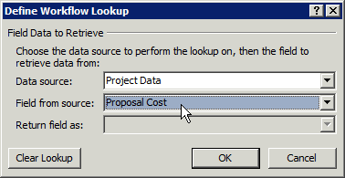

# Crear un flujo de trabajo de Project Server para Administración de propuestas

En este artículo se describe cómo crear un flujo de trabajo simple mediante SharePoint Designer 2013. Puede exportar el flujo de trabajo a Visio 2013 para visualización y edición, o usar Visio 2013 para diseñar flujos de trabajo de Project Server 2013 e importar el diseño en SharePoint Designer 2013 para su publicación en Project Web App. Para obtener más información acerca de la plataforma de flujo de trabajo de SharePoint y la creación de flujos de trabajo con Visio 2013 y SharePoint Designer 2013, vea los artículos flujos de trabajo de [SharePoint 2013](https://msdn.microsoft.com/library/jj163986%28office.15%29.aspx) en la documentación para desarrolladores de SharePoint 2013. 
  
Para obtener información sobre cómo preparar Project server para flujos de trabajo, vea [Start: Set up and configure SharePoint 2013 Administrador de flujos de trabajo](https://msdn.microsoft.com/library/jj163276%28office.15%29.aspx).

## Crear un flujo de trabajo general

Siga estos pasos para crear un flujo de Project Server 2013 mediante SharePoint Designer 2013. El flujo de trabajo se ha diseñado para la administración de propuestas de proyectos.
  
Para obtener pasos detallados, consulte la [sección Crear un flujo de trabajo de bifurcación.](#pj15_CreateWorkflowSPD_Detailed) 
  
### Crear un flujo de trabajo de Project Server (procedimiento general)

1. Determine los requisitos y, después, diseñe el flujo de trabajo. Organícelo en fases y etapas y determine los campos personalizados que va a usar el flujo de trabajo.
    
2. En Project Web App, cree las entidades que el flujo de trabajo requiere:
    
    1. Revise las fases existentes del flujo de trabajo; cree fases según sea necesario.
        
    2. Cree los campos personalizados de empresa que va a usar el flujo de trabajo. Para estar disponibles en una etapa del flujo de trabajo, los campos personalizados deben estar controlados por un flujo de trabajo.
        
    3. Edite o cree las páginas de detalle del proyecto (PDP) que usarán las etapas del flujo de trabajo para recopilar información para el proyecto. En este ejemplo, las etapas usan PDP predeterminadas que se editan para incluir un nuevo campo personalizado.
        
    4. Cree las etapas necesarias del flujo de trabajo y después asocie cada etapa del flujo de trabajo con la fase correcta.
    
3. En SharePoint Designer 2013, construya el flujo de trabajo mediante instrucciones declarativas en el **Diseñador basado en texto**:
    
    > [!NOTE]
    > También puede cambiar a **Visual Designer** en SharePoint Designer 2013 o importar un flujo de trabajo existente desde Visio 2013. Siga estos pasos para usar el **Diseñador basado en texto**: 
    > 
    > 1. Abra el Project web app y, a continuación, cree un flujo de trabajo de sitio que use el flujo de trabajo de **SharePoint 2013:** Project de flujo de trabajo del servidor. 
    > 2. Agregue las etapas que usa el flujo de trabajo.
    > 3. Inserte los pasos, condiciones, acciones y bucles del flujo de trabajo que se necesitan en cada etapa.
    > 4. Busque si hay errores en el flujo de trabajo y corrija los que encuentre.
    > 5. (Opcional) Cambie la vista al **Diseñador visual** o exporte el flujo de trabajo a un archivo Visio 2013. Puede modificar la vista de Visio y guardar los cambios en el flujo de trabajo actual. Puede editar el archivo Visio e importarlo en SharePoint Designer 2013 para crear otros flujos de trabajo.
    > 6. Publique el flujo de trabajo. Después de su publicación, el flujo de trabajo se muestra en la lista de flujos de trabajo para el Project web app.
    
4. En Project Web App, use el flujo de trabajo para la administración de la demanda de propuestas de proyecto:
    
    1. Cree una plantilla de proyecto empresarial (EPT) que use el flujo de trabajo.
        
    2. En la página Centro de proyectos, cree un proyecto que use la plantilla EPT para el flujo de trabajo y siga las etapas del flujo de trabajo.
        
    3. Pruebe el flujo de trabajo a fondo.
        
    4. Implemente el flujo de trabajo en un servidor de producción.

## Crear un flujo de trabajo de bifurcación

Para poder usar SharePoint Designer 2013 para crear un flujo de trabajo de servidor de Project, el servicio cliente 1.0 de Administrador de flujos de trabajo debe configurarse para usar las actividades de flujo de trabajo de Project Server 2013. Para obtener información sobre cómo configurar Administrador de flujos de trabajo Client 1.0, vea los artículos flujos de trabajo de [SharePoint 2013](https://msdn.microsoft.com/library/jj163986%28office.15%29.aspx) en la documentación para desarrolladores de SharePoint Server 2013. 
  
El siguiente procedimiento detallado incluye los mismos pasos que en la [sección Crear un flujo de trabajo general.](#pj15_CreateWorkflowSPD_General) 
  
### Procedimiento para crear un flujo de trabajo de bifurcación de Project Server (procedimiento detallado)

#### 1. Planee y diseñe el flujo de trabajo.

Un flujo de trabajo de Project Server se puede integrar con numerosas etapas en un proceso de administración de propuestas. Como los flujos de trabajo pueden ser complejos, asegúrese de conocer los requisitos empresariales y planear cuidadosamente un flujo de trabajo. Para un ejemplo sencillo, diseñe un flujo de trabajo de bifurcación que use el costo estimado de una propuesta de proyecto para determinar si se acepta dicha propuesta. Si el costo estimado es superior a 25.000 USD, rechace la propuesta; en caso contrario, acéptela y cree el proyecto.
    
Dado que puede usar Visio 2013 y SharePoint Designer 2013 para ayudar a diseñar y crear flujos de trabajo para Project Server 2013, puede experimentar con flujos de trabajo más fácilmente de lo que es posible con Project Server 2010. El diseño de flujo de trabajo de  ejemplo de este artículo es el mismo que en el artículo Crear un flujo de trabajo de bifurcación en el SDK de Project 2010. Puede diseñar y crear un flujo de trabajo de prueba en un equipo remoto mediante una instancia de prueba de Project Web App: no es necesario crear flujos de trabajo directamente en un equipo de Project Server 2013. 
    
#### 2. Cree las entidades que necesita el flujo de trabajo.

En Project Web App, revise las fases y fases de flujo de trabajo disponibles y los campos personalizados de empresa que están disponibles. En caso necesario, cree las entidades que el flujo de trabajo necesita, como en los siguientes pasos:
    
1. **Fases de flujo de trabajo** La instalación predeterminada de Project Web App incluye las fases Crear, Seleccionar, Planear, Administrar y Terminado. Para el ejemplo de flujo de trabajo de bifurcación, no es necesario crear otras fases. 
        
2. **Enterprise campos personalizados** El flujo de trabajo de bifurcación requiere un campo personalizado de costo del proyecto controlado por el flujo de trabajo. El valor de un campo personalizado controlado por el flujo de trabajo se configura en una PDP que usa el flujo de trabajo. Por ejemplo, elija el icono Configuración en la parte superior derecha de una página de Project Web App, elija **PWA Configuración** y, **a** continuación, elija Enterprise Campos personalizados y tablas de **búsqueda**.
        
   Cree un campo personalizado llamado Costo de la propuesta para la entidad **Proyecto** y seleccione el tipo **Costo**. En la descripción, escriba Costo estimado de una propuesta de proyecto. En la sección **Comportamiento**, elija **Comportamiento controlado por el flujo de trabajo**.
        
3. **Project de detalles** Edite o cree los PDP que usarán las fases de flujo de trabajo. Por ejemplo, siga estos pasos: 
        
    1. Elija **Páginas de detalles del proyecto** en la página Configuración del servidor y seleccione la PDP **ProjectInformation**. 
            
    2. En la pestaña **PÁGINA** de la cinta, en el grupo **Editar**, elija **Editar página**.
            
    3. Elija la flecha abajo en la parte superior derecha del elemento web **Información** básica y, a continuación, **elija Editar elemento web**. O bien, en la pestaña **ELEMENTO WEB** de la cinta de opciones, en el grupo **Propiedades,** elija Propiedades del elemento **web** para mostrar el elemento de editor. 
            
    4. En la sección **Campos de proyecto mostrados** del elemento Editor Part (vea la Figura 1), elija **Modificar**.
            
    5. Agregue el **campo personalizado Costo** de  propuesta, muévelo por encima del campo Propietario de la lista Campos de **Project seleccionados** y, a continuación, elija **Aceptar** (vea la figura 1).
      
    6. En el elemento Editor Part, seleccione **Aceptar** y elija **Detener edición** en el grupo **Editar** de la pestaña **PÁGINA** de la cinta. En la Figura 2, se muestra el campo personalizado **Proposal Cost** que se agrega a la PDP Información del proyecto. 

    **Figura 1. Editar el elemento web Project Fields en un PDP**

    ![Edición del elemento web Project Fields]en un PDP Editando el elemento web Project Fields en un(media/pj15_CreateWorkflowSPD_EditPDP.gif "PDP")

    **Figura 2. La PDP modificada incluye el campo personalizado Costo de la propuesta**

    ![La PDP editada incluye el campo Costo de propuesta]La PDP editada incluye el campo Costo de(media/pj15_CreateWorkflowSPD_EditedPDP.gif "propuesta")
  
4. **Fases de flujo de trabajo** Cree las fases necesarias para cada fase del flujo de trabajo. En la página Configuración del servidor, elija **Etapas de flujo de trabajo** y, después, **NUEVA ETAPA DE FLUJO DE TRABAJO**. En la Figura 3 se muestra parte de la página Agregar etapa de flujo de trabajo.
    
    **Figura 3. Adición de una etapa de flujo de trabajo en Project Web App**

    ![Agregar una fase de flujo de trabajo Project Web App]Agregar una fase de flujo de trabajo en Project Web(media/pj15_CreateWorkflowSPD_AddWorkflowStage.gif "App")
  
    En el ejemplo de flujo de trabajo de bifurcación se usan las cuatro etapas que aparecen en la Tabla 1. En la sección **Configuración adicional para la página visible de detalles del proyecto** de la página Agregar etapa de flujo de trabajo (no se muestra en la Figura 3), los valores son opcionales; proporcionan más información sobre la página Estado del flujo de trabajo. Por ejemplo, como la PDP Initial Proposal Details requiere la entrada del usuario, puede activar la casilla de verificación La página de detalles de Project requiere atención y, **a** continuación, agregar una descripción específica, como Establecer el nombre del proyecto y el costo de este PDP.
    
    En la Figura 4 se muestran las cuatro etapas completadas en la página Etapas de flujo del trabajo.
    
    **Tabla 1. Etapas para el flujo de trabajo de bifurcación**

    |Nombre|Descripción|Descripción para envío|Fase|PDP visibles|Campos personalizados|
    |:-----|:-----|:-----|:-----|:-----|:-----|
    |Detalles de la propuesta iniciales    |Establezca el nombre y el costo del proyecto.    |Envíe el proyecto como propuesta.    |Crear    |Información del proyecto    Detalles de proyecto    |Costo de la propuesta (necesario)    |
    |Detalles de proyecto    |Proporcione detalles del proyecto propuesto.    |Envíe detalles para continuar con el proyecto.    |Crear    |Información del proyecto    Detalles de proyecto    |Costo de la propuesta (solo lectura)    |
    |Rechazo automatizado    |La propuesta se rechaza a partir de la información proporcionada.    |   |Crear    |Información del proyecto    |Costo de la propuesta (solo lectura)    |
    |Ejecución    |La propuesta se acepta y está lista para la administración del proyecto.    |   |Administrar    |Información del proyecto    Detalles de proyecto    |Costo de la propuesta (solo lectura)    |
   
    **Figura 4. Lista de las etapas del flujo de trabajo en Project Web App**

    ![Lista de las fases de flujo de trabajo Project lista de aplicaciones web]de las fases de flujo de trabajo en Project Web(media/pj15_CreateWorkflowSPD_WorkflowStages.gif "App")
  
#### 3. Construya el flujo de trabajo en Text-Based Designer.

En SharePoint Designer 2013, construya el flujo de trabajo mediante instrucciones declarativas en Text-Based Designer. Puede empezar a escribir en la línea de inserción naranja para obtener instrucciones de autocompletar contextuales para la lógica y los pasos del flujo de trabajo, o bien puede insertar la lógica y los pasos mediante controles en el grupo **Insertar** de la ficha **FLUJO** DE TRABAJO de la cinta de opciones. 
    
1. En la vista Backstage de SharePoint Designer 2013, elija **Abrir sitio**. Por ejemplo, abra  `https://ServerName/pwa` . En el panel **Navegación**, elija **Flujos de trabajo**. Después, en la pestaña **FLUJOS DE TRABAJO** de la cinta, en el grupo **Nuevo**, elija **Flujo de trabajo del sitio**. Por ejemplo, asigne al flujo de trabajo el nombre Flujo de trabajo de bifurcación. Asegúrese de SharePoint flujo de trabajo de **2013:** Project  Server está seleccionado en la lista desplegable Tipo de plataforma (vea la figura 5). 
    
    **Figura 5. Creación de un flujo de trabajo del sitio de Project Server**

    ![Creación de un flujo Project de sitio del servidor]de creación de un Project de sitio de(media/pj15_CreateWorkflowSPD_CreateSiteWorkflow.gif "servidor")
  
2. Seleccione la pestaña **Flujo de trabajo de bifurcación**. Después, en la pestaña **FLUJO DE TRABAJO** de la cinta, en el grupo **Administrar** de la lista desplegable **Vistas**, elija **Diseñador basado en texto**. Para mostrar la vista con la línea de inserción naranja intermitente (vea la Figura 6), haga clic dentro de la vista.
    
    **Figura 6. Uso de la vista Diseñador basado en texto para el flujo de trabajo**

    ![Uso de la Text-Based Designer con]la Text-Based(media/pj15_CreateWorkflowSPD_TextBasedDesigner.gif "Designer")
  
3. En la vista **Diseñador basado en texto**, agregue las etapas que usa el flujo de trabajo. En la pestaña **FLUJO DE TRABAJO** de la cinta, en el grupo **Insertar**, en la lista desplegable **Etapa** dentro de **Crear**, elija **Detalles de la propuesta iniciales**.
    
    De manera similar, coloque la línea de inserción naranja debajo del cuadro **Etapa: Detalles de la propuesta iniciales** y agregue las otras etapas que usa el flujo de trabajo: **Detalles del proyecto**, **Rechazo automatizado** y **Ejecución** (vea la Figura 7). 
    
    **Figura 7. Adición de una etapa a un flujo de trabajo en SharePoint Designer**

    
  
4. Agregue los pasos del flujo de trabajo y la lógica dentro de cada etapa: 
    
    1. En la etapa **Detalles de la propuesta iniciales**, coloque la línea de inserción naranja en la parte superior del cuerpo de la etapa. En el grupo **Insertar** de la cinta, elija **Acción**, desplácese hacia abajo hasta **Acciones de Project Web App** y elija **Esperar evento de proyecto**. Elija **este evento de proyecto** y seleccione **Evento: cuando se envía un proyecto** en la lista desplegable. 
    
    2. En la sección **Transición a fase** de la etapa **Detalles de la propuesta iniciales**, inserte **Si cualquier valor es igual al valor**. Puede empezar a escribir la instrucción o usar el control **Condición** del grupo **Insertar** de la cinta. 
    
    3. Elija el primer control **valor** y elija **fx** para mostrar el cuadro de diálogo **Definir búsqueda de flujo de trabajo** (vea la Figura 8). En la lista desplegable **Origen de datos**, seleccione **Datos de Project**. En la lista desplegable **Campo del origen**, seleccione **Costo de la propuesta**.
    
       **Figura 8. Definición de un valor de búsqueda en el flujo de trabajo**

       
  
    4. Complete la instrucción para que muestre lo siguiente: si `If` Project **Data:Proposal Cost es mayor que 25000**
    
       > [!NOTE]
       > Si lo prefiere, puede crear una variable de flujo de trabajo, definir la variable en el valor de campo personalizado y luego comparar la variable con un valor. Por ejemplo, desde la lista desplegable **Variables locales** de la cinta, cree una variable con el nombre **TotalCost** (sin espacios) del tipo **Number**. En el cuadro de diálogo **Definir búsqueda de flujo de trabajo**, seleccione **Variables y parámetros de flujo de trabajo** para el origen de datos y luego seleccione **Variable: CostoTotal** como campo. La instrucción **If** sería: **If Variable: CostoTotal es mayor que 25000**
  
    5. Coloque la línea de inserción naranja dentro de la rama y, a continuación, inserte Ir a una fase mediante el control Acción, en el `If` **grupo Insertar** de la cinta de opciones.   Elija el control desplegable **una fase** y seleccione la etapa **Rechazo automatizado**. 
    
       Del mismo modo, en la `Else` rama, inserte la **instrucción Go to Project Details.** En la Figura 9 se muestra la etapa **Detalles de la propuesta iniciales** completada. 
    
       **Figura 9. Lógica completada para la etapa Detalles de la propuesta iniciales**

       
  
    6. En la etapa **Rechazo automatizado**, a menos que quiera hacer una pausa en el flujo de trabajo y mostrar algunos datos en una PDP, deje vacía la primera sección. La sección **Transición a fase** debe contener una transición; como ninguna otra etapa sigue a un rechazo, tiene que escribir Ir al final del flujo de trabajo para la instrucción. 
    
    7. En la etapa **Detalles del proyecto**, agregue Ir a ejecución en la sección **Transición a fase**. A menos que haya más datos para agregar o que quiera hacer una pausa en el flujo de trabajo, no es necesario esperar un evento enviado. 
    
    8. En la etapa **Ejecución**, a menos que desee hacer una pausa en el flujo de trabajo, deje vacía la sección de acción de la etapa. En la sección **Transición a fase**, agregue **Ir al final del flujo de trabajo**.
    
5. En el grupo **Guardar** de la cinta, elija **Buscar errores** para buscar errores en el flujo de trabajo (vea la Figura 10). Corrija los errores si los hay y elija **Guardar**.
    
    **Figura 10. Búsqueda de errores en el flujo de trabajo en SharePoint Designer**

    ![Comprobación de errores en el flujo de trabajo]Comprobación de errores en el flujo de(media/pj15_CreateWorkflowSPD_SPDCheckForErrors.gif "trabajo")
  
6. (Opcional) En el grupo **Administrar** de la cinta, en la lista desplegable **Vistas**, elija **Diseñador visual**. En la Figura 11, la vista está alejada al 50 %.
    
    Puede editar los elementos del flujo de trabajo con el Diseñador visual. Por ejemplo, seleccione la condición **Si cualquier valor es igual al valor**, elija el icono de información situado en la esquina inferior izquierda de la condición, y después seleccione **Valor** para mostrar las condiciones de comparación en el cuadro de diálogo **Propiedades**. 
    
    **Figura 11. Uso del Diseñador visual para un flujo de trabajo**

    ![Uso de la Visio de diseño del flujo]de trabajo Mediante la Visio de diseño del flujo de(media/pj15_CreateWorkflowSPD_SwitchView.gif "trabajo")
  
    Cuando el flujo de trabajo se encuentra en la vista Diseñador visual, para guardar el flujo de trabajo en un archivo de Visio 2013 (.vsdx) como copia de seguridad o para su uso posterior, puede elegir Exportar a **Visio**.
    
7. Publique el flujo de trabajo. Cuando usa SharePoint Designer 2013 para publicar el flujo de trabajo en el sitio activo de la aplicación web de Project, el flujo de trabajo se registra en el sitio de SharePoint o en Azure y está disponible en Project Web App para nuevos EPT.

#### 4. Cree un EPT para el flujo de trabajo y, a continuación, pruebe el flujo de trabajo.

En Project Web App, cree un EPT para el flujo de trabajo y, a continuación, pruebe el flujo de trabajo creando una propuesta de proyecto:
    
1. En la PWA Configuración, elija **Enterprise Project y,** a continuación, cree un EPT denominado Flujo de trabajo de bifurcación de prueba. Desactive la casilla **Crear nuevos proyectos como proyectos de lista de tareas de SharePoint** de modo que Project Server controle los proyectos que crea la EPT. Seleccione **Flujo de trabajo de bifurcación** en la lista desplegable **Asociación de flujo de trabajo del sitio**, seleccione la PDP **Información del proyecto** en la lista desplegable **Página de nuevo proyecto** para que sea la primera página que muestre el flujo de trabajo. 
    
    **Figura 12. Adición de una plantilla EPT para el flujo de trabajo**

    ![Agregar un EPT para el flujo de trabajo]Agregar un(media/pj15_CreateWorkflowSPD_EPTs.gif "EPT para el flujo de trabajo")
  
    > [!NOTE]
    > Un valor **Sí** en la columna **Proyecto de lista de tareas de SharePoint** de la tabla de tipos de proyectos empresariales hace referencia a una EPT que crea una lista de tareas de SharePoint, donde la lista de tareas es visible en Project Web App, pero SharePoint controla el proyecto. Para más información sobre la administración de proyectos como listas de tareas de SharePoint, vea [Project Server 2013 architecture](project-server-2013-architecture.md). 
  
2. Abra la página Proyectos en Project Web App y, a continuación, cree un proyecto mediante el nuevo EPT (vea la figura 13). Dado que **Flujo de trabajo de bifurcación de prueba** está asociado con **Flujo de trabajo de bifurcación**, la creación del proyecto empieza bajo el control del flujo de trabajo.
    
    **Figura 13. Creación de un proyecto con la plantilla EPT Flujo de trabajo de bifurcación de prueba**

    
  
3. Cuando el flujo de trabajo muestre la PDP **Información del proyecto**, agregue datos a los campos del proyecto. Por ejemplo, escriba un valor **de costo de** propuesta de 30000. La versión en inglés de EE. UU. de Project Server cambiará el campo para que muestre 30.000 $ (vea la Figura 14).
    
    **Figura 14. Uso de la PDP editada Información del proyecto**

    ![Uso de la PDP de Project de información]editada mediante el pdp de Project de información(media/pj15_CreateWorkflowSPD_NewProjectStage1.gif "editada")
  
4. En la pestaña **PROYECTO** de la cinta, en el grupo **Proyecto**, elija **Guardar**. Project Server agrega los datos de la PDP al proyecto y luego muestra la página Estado del flujo de trabajo (vea la Figura 15). Para ver la descripción completa de la página Detalles de la propuesta iniciales en el diagrama de estado del flujo de trabajo, mantenga el mouse sobre la etapa en el diagrama de visualización del flujo de trabajo.
    
    La cuadrícula **Todas las etapas de flujo de trabajo** usa una flecha verde para mostrar que la etapa Detalles de la propuesta iniciales está esperando que se introduzcan datos. Esto se debe a que el flujo de trabajo espera un evento de envío en la etapa Detalles de la propuesta iniciales. Si el flujo de trabajo no ha esperado un evento de envío, puede elegir **Siguiente** en el grupo **Página** para ir a la siguiente PDP. 
    
    **Figura 15. Uso de la página Estado del flujo de trabajo en la etapa Detalles de la propuesta iniciales**

    ![Página de estado del flujo de trabajo después de la primera fase]Página de estado flujo de trabajo después de la primera(media/pj15_CreateWorkflowSPD_NewProjectStage1Status.gif "fase")
  
    El diagrama de visualización del flujo de trabajo muestra la etapa actual en color verde. En la fase **Crear**, la etapa Detalles de la propuesta iniciales es la etapa actual. 
    
5. En el grupo **Flujo de trabajo** de la cinta, elija **Enviar**.
    
    > [!TIP]
    > Si el control **Enviar** se encuentra deshabilitado, actualice la página. 
  
    Si el valor de **Costo de la propuesta** es mayor que 25.000 USD, el flujo de trabajo pasará a la etapa Rechazo automatizado. La Figura 16 muestra el estado de la etapa Rechazo automatizado cuando elige **Enviar** nuevamente. Si el **Costo de la propuesta** es de 25.000 USD o inferior, el flujo de trabajo irá a la etapa Detalles del proyecto (vea la Figura 17). 
    
    **Figura 16. El flujo de trabajo se completa en la etapa Rechazo automatizado**

    ![El flujo de trabajo se completa en Rechazo automatizado]El flujo de trabajo se completa en Rechazo(media/pj15_CreateWorkflowSPD_AutomatedRejectionCompleted.gif "automatizado")
  
    En la figura 17 se muestra otra prueba con una propuesta de proyecto denominada **Test 2 - Branching**, donde la fase Project detalles está actual en la fase Crear. La fase Administrar se muestra en color azul claro, lo que indica que la fase no está activa todavía.
    
    **Figura 17. El flujo de trabajo continúa con la etapa Detalles del proyecto si el costo es inferior a 25.000 $**

    ![Estado del flujo de trabajo en la Project de flujo]de trabajo de la fase Project(media/pj15_CreateWorkflowSPD_ProjectDetailsStage.gif "detalles")
  
6. Si avanza a la etapa Detalles del proyecto, no es necesario agregar más datos en la página predeterminada. Elija **Enviar** nuevamente para avanzar a la etapa Ejecución (vea la Figura 18). 
    
    **Figura 18. El flujo de trabajo está listo para administrarse en la etapa Ejecución**

    ![Estado del flujo de trabajo en el estado flujo de]trabajo de fase de ejecución en la fase de(media/pj15_CreateWorkflowSPD_ExecutionStage.gif "ejecución")
  
En la etapa Detalles del proyecto, el flujo de trabajo no espera un evento de envío. Si la PDP Detalles del proyecto incluye campos necesarios adicionales, Project Server esperará a que agregue datos en los campos antes de continuar a la etapa Ejecución. Según se ha definido en el Flujo de trabajo de bifurcación, la etapa Ejecución tampoco espera un evento de envío. En la etapa Ejecución, puede editar el proyecto como administrador del proyecto o elegir **Cerrar** en la pestaña **PROYECTO** de la cinta. Al elegir **Cerrar**, puede proteger el proyecto y editarlo más tarde, o bien dejarlo desprotegido.

El proyecto **Flujo de trabajo de bifurcación** es un ejemplo sencillo con una sola prueba de comparación. El flujo de trabajo conlleva tres etapas en la fase Crear y una en la fase Administrar de Administración de propuestas. Para probar a fondo un flujo de trabajo, debe probar todas las bifurcaciones del flujo de trabajo y usar valores extremos y típicos para ver si el comportamiento es el esperado. 

## Importar un flujo de trabajo desde Visio

Para cambiar el flujo de trabajo, puede crear o modificar campos personalizados controlados por el flujo de trabajo y crear o modificar las fases y etapas del flujo de trabajo. Puede usar SharePoint Designer 2013 para agregar condiciones, acciones, bucles y fases y, a continuación, guardar y volver a publicar el flujo de trabajo. Para reutilizar o mantener una copia de seguridad de un flujo de trabajo, puede exportarlo a un archivo Visio 2013. 
  
También puede crear o editar el flujo de trabajo en Visio 2013 e importar el archivo a SharePoint Designer 2013 para usarlo Project Web App. Para usar un flujo de trabajo sin modificar, la instancia de Project Web App debe incluir propiedades de fase de flujo de trabajo que sean las mismas que las de la instancia Project Web App original. Para obtener más información acerca del uso de Visio para ayudar a crear flujos de trabajo, vea Desarrollo de flujos de trabajo en [SharePoint Designer 2013 y Visio 2013](https://msdn.microsoft.com/library/jj163272%28office.15%29.aspx).
  
> [!NOTE]
> Al importar un archivo Visio 2013 a una instancia diferente de Project Web App, las fases tienen GUID de fase diferentes, incluso si los nombres de fase son los mismos. Después de importar el flujo de trabajo, debe configurar las propiedades de fase y acción para usar valores específicos de la Project web app. 
> 
> Si crea un flujo de trabajo en Visio 2013, las fases y acciones no tienen propiedades específicas para una instancia de Project Web App porque Visio no se conecta con Project Web App. Al conectar SharePoint Designer 2013 con Project Web App, crear un flujo de trabajo y, a continuación, importar el archivo VSDX, se sobrescribe el flujo de trabajo activo. A continuación, debe configurar las propiedades de fase y acción para que coincidan con los valores que SharePoint Designer 2013 obtiene de Project Web App. 
  
### Procedimiento para importar un flujo de trabajo de Visio a SharePoint Designer

1. En Visio 2013, cree un flujo de trabajo sencillo. Puede seguir estos pasos:
    
   1. Abra Visio y cree un flujo de trabajo. Elija el panel **CATEGORÍAS** de un flujo de trabajo nuevo, elija **Diagrama de flujo**, elija la plantilla **Flujo de trabajo de Microsoft SharePoint 2013** en el panel **Nuevo** y luego elija **Crear**. El flujo de trabajo se abre con una forma Etapa denominada **Etapa 1**. Incluye un componente Inicio y una forma Entrar y otra Salir que forman parte de la forma Etapa.
    
      Al mantener el mouse sobre la forma Etapa y elegir el icono **Propiedades**, la selección se deshabilita. Puede establecer las propiedades de fase y acción después de importar el diagrama de flujo de trabajo a SharePoint Designer 2013. 
    
      > [!NOTE]
      >  Las únicas galerías de símbolos de formas que debe usar son las que se recogen en la siguiente lista de formas de Diagrama de flujo: 
      > - **Acciones: SharePoint flujo de trabajo de 2013**
      > - **Componentes: SharePoint flujo de trabajo de 2013**
      > - **Condiciones: SharePoint flujo de trabajo de 2013**
  
   2. En el panel **Formas**, elija **Formas rápidas** y luego arrastre la forma Condición denominada **Si cualquier valor es igual al valor** a la derecha de la forma Etapa. 
    
   3. En la pestaña **INICIO** de la cinta, elija la herramienta **Conector** y conecte la forma Salir de la etapa con la forma Condición (vea la Figura 19). 
    
      **Figura 19. Conexión de una forma Etapa con una forma Condición en una diagrama de flujo de trabajo de Visio**

      ![Crear un diagrama de flujo de Visio]crear un diagrama de flujo de trabajo en(media/pj15_CreateWorkflowSPD_NewVisioWorkflow.gif "Visio")
  
   4. Arrastre otras dos formas Etapa a la derecha de la forma Condición. Las formas tienen los nombres **Etapa 2** y **Etapa 3**.
    
   5. Con la herramienta **Conector**, conecte el lado derecho de la forma Condición con la forma Entrar de **Etapa 2**. Elija la **herramienta Puntero,** haga doble clic en la conexión para mostrar un cuadro de texto para el nombre y, a continuación, asigne un nombre a la conexión Sí.
    
   6. Conecte la parte inferior de la forma Condición a la forma Entrar de **Etapa 3**. Con la herramienta **Puntero**, haga clic con el botón derecho en la conexión y luego elija **No**. Ambos métodos valen para nombrar los conectores **Sí** o **No**.
    
   7. En el panel **Formas,** elija Acciones - SharePoint Flujo de trabajo de **2013** y, a continuación, arrastre la acción **Esperar** evento del proyecto al centro de la forma de la fase **1** (vea la figura 20). 
    
      **Figura 20. Finalización del flujo de trabajo en Visio**

      ![Completar el flujo de trabajo en Visio]Completar el flujo de trabajo en(media/pj15_CreateWorkflowSPD_CompletedVisioWorkflow.gif "Visio")
  
   8. En la pestaña **PROCESO** de la cinta, en el grupo **Validación de diagrama**, elija **Comprobar diagrama**. Solucione los errores que pueda haber y luego guarde el dibujo. Puede dar el nombre Probar flujo de trabajo desde Visio.vsdx al archivo, por ejemplo.
    
      Para obtener información sobre cómo corregir errores de flujo de trabajo, [vea Troubleshooting SharePoint Server 2013 workflow validation errors in Visio 2013](https://msdn.microsoft.com/library/jj163971%28v=office.15%29.aspx).
    
2. Abra SharePoint Designer 2013 y, a continuación, abra el mismo sitio Project web app que usó para el ejemplo flujo de **trabajo de** bifurcación. 
    
3. Elija **Flujos de trabajo** en el panel **Navegación** y luego cree un flujo de trabajo de sitio (elija **Flujo de trabajo de sitio** en la pestaña **FLUJOS DE TRABAJO** de la cinta). Puede dar el nombre Flujo de trabajo sencillo desde Visio al flujo de trabajo, por ejemplo.
    
   En el **cuadro de diálogo** Crear flujo de trabajo de sitio, asegúrese de que el tipo de plataforma SharePoint flujo de trabajo de **2013 - Project servidor**. Elija **Crear** y SharePoint Designer abre el panel Diseñador **basado** en texto para el nuevo flujo de trabajo. 
    
4. En el grupo **Administrar** de la pestaña **FLUJO DE TRABAJO** de la cinta, elija **Configuración del flujo de trabajo**.
    
5. En el grupo **Administrar** de la pestaña **CONFIGURACIÓN DEL FLUJO DE TRABAJO** de la cinta, elija **Importar desde Visio** y luego importe el archivo **Probar flujo de trabajo desde Visio.vsdx** que guardó antes. Un cuadro de diálogo de **Microsoft SharePoint Designer** avisa de que el diagrama que va a importar no contiene propiedades de flujo de trabajo y pregunta si desea sobrescribir el flujo de trabajo actual. Elija **Sí**; SharePoint Designer importa el diagrama de flujo de trabajo, genera galerías de símbolos para las formas y muestra el panel **diseñador visual** que contiene el flujo de trabajo importado. 
    
6. Defina las propiedades de cada forma de etapa del flujo de trabajo. Por ejemplo, la primera forma de fase se denomina **Fase 1 (no válida),** ya que no representa una fase válida en la instancia Project web app conectada. Cuando selecciona o mantiene el mouse sobre la etapa, puede elegir el icono **Propiedades** en la parte inferior izquierda de la forma de etapa para mostrar el cuadro de diálogo **Propiedades de la fase** (vea la Figura 21). Seleccione la etapa **Detalles de la propuesta iniciales** en la lista desplegable **Etapa del proyecto** y luego elija **Aceptar**. SharePoint Designer cambia el nombre de la fase.
    
   **Figura 21. Definición de la propiedad de etapa en SharePoint Designer**

   ![Establecer propiedades en un flujo de trabajo importado Establecer]propiedades en un flujo de trabajo(media/pj15_CreateWorkflowSPD_ImportFromVisio1.gif "importado")
  
   Para la segunda etapa, defina la propiedad **Fase del proyecto** en **Rechazo automatizado**. Para la tercera etapa, defina la propiedad **Fase del proyecto** en **Ejecución**.
    
7. De igual modo, para la acción **Esperar el evento del proyecto**, tiene que definir la propiedad **Nombre de evento** en **Evento: cuando se envía un proyecto**.
    
8. Defina también las propiedades de la condición **Si cualquier valor es igual al valor**. Por ejemplo, defina la primera propiedad de **Valor** en **Datos de Project: costo de la propuesta**. Defina la propiedad **Operador** en **es inferior a**. Establezca la segunda **propiedad Value** en 5000.
    
9. Revise el flujo de trabajo para ver si hay errores y luego guárdelo. Si no hay errores, puede cambiar la vista a **Diseñador basado en texto** (vea la Figura 22). 
    
   **Figura 22. Visualización del flujo de trabajo importado en el Diseñador basado en texto**

   ![Visualización del flujo de trabajo importado]Ver el flujo de trabajo(media/pj15_CreateWorkflowSPD_WorkflowFromVisio.gif "importado")
  
10. Publique el flujo de trabajo. Si guarda el flujo de trabajo pero no lo publica, este no estará disponible cuando cree un tipo de proyecto empresarial.
    
11. Para probar el flujo de trabajo simple importado de **Visio** en Project Web App, cree un EPT que use el  flujo de trabajo y, a continuación, cree proyectos que usen el nuevo EPT como lo hizo en el ejemplo flujo de trabajo de bifurcación. En este caso, no obstante, los proyectos con un costo inferior a 5000 dólares se rechazan. 
    
Al trabajar con este artículo, creó y probó un flujo de trabajo de bifurcación simple mediante SharePoint Designer 2013 para establecer directamente las etapas, las condiciones y las acciones que usa el flujo de trabajo. También creó un diagrama para un flujo de trabajo de bifurcación aún más sencillo mediante Visio 2013. Importó el diagrama de flujo de trabajo de Visio en SharePoint Designer 2013, donde estableció las propiedades de cada fase, condición y acción desde la conexión con Project Web App.
  
Visio 2013 y SharePoint Designer proporcionan formas cómodas para que diseñadores, jefes de proyecto, desarrolladores de flujos de trabajo y evaluadores creen, compartan y personalicen diseños de flujo de trabajo para diferentes instalaciones de Project Server 2013 y Project Online. Para flujos de trabajo que requieren acceso mediante programación a Project Server que SharePoint Designer no proporciona, puede usar Visual Studio 2012 con el modelo de objetos del lado cliente (CSOM).
  
## Vea también

- [Arquitectura de Project Server 2013](project-server-2013-architecture.md)
- [Inicio: configurar y configurar SharePoint 2013 Administrador de flujos de trabajo](https://msdn.microsoft.com/library/jj163276%28office.15%29.aspx)
- [Descripción de cómo se empaqueta e implementa un flujo de trabajo en SharePoint 2013](https://msdn.microsoft.com/library/jj819316%28office.15%29.aspx)
- [Flujos de trabajo en SharePoint 2013](https://msdn.microsoft.com/library/jj163986%28office.15%29.aspx)
- [Desarrollo de flujos de trabajo en SharePoint Designer 2013 y Visio 2013](https://msdn.microsoft.com/library/jj163272%28office.15%29.aspx)
- [Solución de problemas de errores de validación del flujo de trabajo de SharePoint Server 2013 en Visio 2013](https://msdn.microsoft.com/library/jj163971%28v=office.15%29.aspx)
- [Administración de flujos de trabajo y demanda](https://msdn.microsoft.com/library/cf7433a3-a531-4467-ac0c-df0c5d6881ae%28Office.15%29.aspx)

