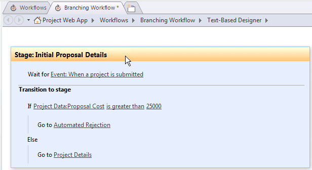

# Crear un flujo de trabajo de Project Server para la administración de propuestasCreate a Project Server workflow for demand management

En este artículo se describe cómo crear un flujo de trabajo simple mediante el uso de SharePoint Designer 2013.This article describes how to create a simple workflow by using SharePoint Designer 2013. Puede exportar el flujo de trabajo a Visio 2013 para la visualización y edición, o usar Visio 2013 para los flujos de trabajo de Project Server 2013 de diseño e importar el diseño en SharePoint Designer 2013 publicación para Project Web App.You can export the workflow to Visio 2013 for visualization and editing, or use Visio 2013 to design Project Server 2013 workflows and import the design into SharePoint Designer 2013 for publication to Project Web App. Para obtener más información acerca de la plataforma de flujo de trabajo de SharePoint y la creación de flujos de trabajo con Visio 2013 y SharePoint Designer 2013, vea los artículos de [flujos de trabajo en SharePoint 2013](http://msdn.microsoft.com/es-es/library/jj163986%28office.15%29.aspx) en la documentación para desarrolladores de SharePoint 2013.For more information about the SharePoint workflow platform and creating workflows with Visio 2013 and SharePoint Designer 2013, see the [Workflows in SharePoint 2013](http://msdn.microsoft.com/es-es/library/jj163986%28office.15%29.aspx) articles in the SharePoint 2013 developer documentation. 
  
Para obtener información sobre la preparación de Project Server para flujos de trabajo, consulte [iniciar: establecer seguridad y configuración del Administrador de flujo de trabajo de SharePoint 2013](http://msdn.microsoft.com/es-es/library/jj163276%28office.15%29.aspx).For information about preparing Project Server for workflows, see [Start: Set up and configure SharePoint 2013 Workflow Manager](http://msdn.microsoft.com/es-es/library/jj163276%28office.15%29.aspx).

## Crear un flujo de trabajo generalCreating a general workflow

Use los siguientes pasos para crear un flujo de trabajo de Project Server 2013 mediante SharePoint Designer 2013.Use the following steps to create a Project Server 2013 workflow by using SharePoint Designer 2013. El flujo de trabajo está diseñado para la administración de propuestas de propuestas de proyectos.The workflow is designed for demand management of project proposals.
  
Para obtener instrucciones detalladas, vea la sección [creación de un flujo de trabajo de bifurcación](#pj15_CreateWorkflowSPD_Detailed) .For detailed steps, see the [Creating a branching workflow](#pj15_CreateWorkflowSPD_Detailed) section. 
  
### Crear un flujo de trabajo de Project Server (procedimiento general)To create a Project Server workflow (general procedure)

1. Determine los requisitos y, después, diseñe el flujo de trabajo. Organícelo en fases y etapas y determine los campos personalizados que va a usar el flujo de trabajo.Determine the requirements, and then design the workflow. Organize it into phases and stages, and determine the custom fields that the workflow will use.
    
2. En Project Web App, cree las entidades que requiere el flujo de trabajo:In Project Web App, create the entities that the workflow requires:
    
    1. Revise las fases existentes del flujo de trabajo; cree fases según sea necesario.Review the existing workflow phases; create phases as necessary.
        
    2. Cree los campos personalizados de empresa que va a usar el flujo de trabajo. Para estar disponibles en una etapa del flujo de trabajo, los campos personalizados deben estar controlados por un flujo de trabajo.Create the enterprise custom fields that the workflow will use. To be available in a workflow stage, a custom field must be controlled by a workflow.
        
    3. Edite o cree las páginas de detalle del proyecto (PDP) que usarán las etapas del flujo de trabajo para recopilar información para el proyecto. En este ejemplo, las etapas usan PDP predeterminadas que se editan para incluir un nuevo campo personalizado.Edit or create the project detail pages (PDPs) that your workflow stages will use to collect information for the project. In this example, the stages use default PDPs that are edited to include a new custom field.
        
    4. Cree las etapas necesarias del flujo de trabajo y después asocie cada etapa del flujo de trabajo con la fase correcta.Create the necessary workflow stages, and then associate each workflow stage with the correct phase.
    
3. En SharePoint Designer 2013, construya el flujo de trabajo mediante el uso de instrucciones declarativas en el **Diseñador basado en texto**:In SharePoint Designer 2013, construct the workflow by using declarative statements in the **Text-Based Designer**:
    
    > [!NOTE]
    > También puede cambiar el **Diseñador Visual** en SharePoint Designer 2013 o importar un flujo de trabajo existente de Visio 2013.You can also switch to the **Visual Designer** in SharePoint Designer 2013, or import an existing workflow from Visio 2013. Siga estos pasos para usar el **Diseñador basado en texto**:Follow these steps to use the **Text-Based Designer**: 
    > 
    > 1. Abra el sitio de Project Web App y, a continuación, cree un flujo de trabajo de sitio que usa la plataforma de flujo de trabajo de **Flujo de trabajo de SharePoint 2013 - Project Server** .Open the Project Web App site, and then create a site workflow that uses the **SharePoint 2013 Workflow - Project Server** workflow platform. 
    > 2. Agregue las etapas que usa el flujo de trabajo.Add the stages that the workflow uses.
    > 3. Inserte los pasos, condiciones, acciones y bucles del flujo de trabajo que se necesitan en cada etapa.Insert the workflow steps, conditions, actions, and loops that are required in each stage.
    > 4. Busque si hay errores en el flujo de trabajo y corrija los que encuentre.Check for any workflow errors and fix any that you find.
    > 5. (Opcional) Cambiar la vista para el **Diseñador Visual**o exportar el flujo de trabajo a un archivo de Visio 2013.(Optional) Switch the view to the **Visual Designer**, or export the workflow to a Visio 2013 file. Puede modificar la vista de Visio y guardar los cambios en el flujo de trabajo actual.You can modify the Visio view and save changes to the current workflow. Puede editar el archivo de Visio e importarlo en SharePoint Designer 2013 para crear otros flujos de trabajo.You can edit the Visio file and import it in SharePoint Designer 2013 to create other workflows.
    > 6. Publicar el flujo de trabajo.Publish the workflow. Después de publicar, el flujo de trabajo se muestra en la lista de flujos de trabajo para el sitio de Project Web App.After it is published, the workflow shows in the list of workflows for the Project Web App site.
    
4. En Project Web App, use el flujo de trabajo para la administración de propuestas de propuestas de proyectos:In Project Web App, use the workflow for demand management of project proposals:
    
    1. Cree una plantilla de proyecto empresarial (EPT) que use el flujo de trabajo.Create an enterprise project template (EPT) that uses the workflow.
        
    2. En la página Centro de proyectos, cree un proyecto que use la plantilla EPT para el flujo de trabajo y siga las etapas del flujo de trabajo.On the Project Center page, create a project that uses the EPT for the workflow, and then follow through the workflow stages.
        
    3. Pruebe el flujo de trabajo a fondo.Test the workflow thoroughly.
        
    4. Implemente el flujo de trabajo en un servidor de producción.Deploy the workflow to a production server.

## Crear un flujo de trabajo de bifurcaciónCreating a branching workflow

Antes de que puede usar SharePoint Designer 2013 para crear un flujo de trabajo de Project Server, el servicio 1.0 de cliente del Administrador de flujo de trabajo debe configurarse para usar las actividades de flujo de trabajo de Project Server 2013.Before you can use SharePoint Designer 2013 to create a Project Server workflow, the Workflow Manager Client 1.0 service must be configured to use the Project Server 2013 workflow activities. Para obtener información acerca de cómo configurar el flujo de trabajo de administrador de Client 1.0, vea los artículos de [flujos de trabajo en SharePoint 2013](http://msdn.microsoft.com/es-es/library/jj163986%28office.15%29.aspx) en la documentación para desarrolladores de SharePoint Server 2013.For information about how to configure Workflow Manager Client 1.0, see the [Workflows in SharePoint 2013](http://msdn.microsoft.com/es-es/library/jj163986%28office.15%29.aspx) articles in the SharePoint Server 2013 developer documentation. 
  
El siguiente procedimiento detallado incluye los mismos pasos que en la sección [creación de un flujo de trabajo general](#pj15_CreateWorkflowSPD_General) .The following detailed procedure includes the same steps as in the [Creating a general workflow](#pj15_CreateWorkflowSPD_General) section. 
  
### Procedimiento para crear un flujo de trabajo de bifurcación de Project Server (procedimiento detallado)To create a Project Server branching workflow (detailed procedure)

#### 1. planear y diseñar el flujo de trabajo.1. Plan and design the workflow.

Un flujo de trabajo de Project Server se puede integrar con varias etapas y fases de un proceso de administración de propuestas.A Project Server workflow can integrate with multiple stages and phases in a demand-management process. Debido a que los flujos de trabajo pueden ser complicadas, debe comprender los requisitos de negocio y planear cuidadosamente un flujo de trabajo.Because workflows can be complex, you must understand the business requirements and plan a workflow carefully. Para obtener un ejemplo simple, diseñar un flujo de trabajo de bifurcación que utiliza el costo estimado de una propuesta de proyecto para determinar si se acepta la propuesta.For a simple example, design a branching workflow that uses the estimated cost of a project proposal to determine whether the proposal is accepted. Si el costo estimado es mayor que $ 25.000, rechazar la propuesta; de lo contrario, acepte la propuesta y crear el proyecto.If the estimated cost is greater than $25,000 USD, reject the proposal; otherwise, accept the proposal and create the project.
    
Debido a que puede usar Visio 2013 y SharePoint Designer 2013 para ayudarle a diseñar y crear flujos de trabajo de Project Server 2013, puede experimentar más fácilmente con los flujos de trabajo que es posible con Project Server 2010.Because you can use Visio 2013 and SharePoint Designer 2013 to help design and create workflows for Project Server 2013, you can more easily experiment with workflows than is possible with Project Server 2010. El diseño de flujo de trabajo de ejemplo en este artículo es la misma que en el artículo [crear un flujo de trabajo de bifurcación](http://msdn.microsoft.com/library/a02cafdc-d881-4271-b446-d8b2cd456a52%28Office.15%29.aspx) en el SDK de Project 2010.The sample workflow design in this article is the same as in the [Create a branching workflow](http://msdn.microsoft.com/library/a02cafdc-d881-4271-b446-d8b2cd456a52%28Office.15%29.aspx) article in the Project 2010 SDK. Puede diseñar y crear un flujo de trabajo de prueba en un equipo remoto mediante una instancia de prueba de Project Web App: no es necesario que crear flujos de trabajo directamente en un equipo de Project Server 2013.You can design and create a test workflow on a remote computer using a test instance of Project Web App—you do not have to create workflows directly on a Project Server 2013 computer. 
    
#### 2. Cree las entidades que requiere el flujo de trabajo.2. Create the entities that your workflow requires.

En Project Web App, revise las fases de flujo de trabajo disponibles y las fases y los campos personalizados de empresa que están disponibles.In Project Web App, review the available workflow phases and stages, and the enterprise custom fields that are available. Si es necesario, cree las entidades que requiere el flujo de trabajo, como se muestra en los siguientes pasos:If necessary, create the entities that your workflow requires, as in the following steps:
    
1. **Fases de flujo de trabajo** La instalación predeterminada de Project Web App incluye la creación, seleccionar, fases de planeación, administrar y terminadas.**Workflow phases** The default installation of Project Web App includes the Create, Select, Plan, Manage, and Finished phases. Para el ejemplo de flujo de trabajo de bifurcación, no es necesario crear otras fases.For the branching workflow example, you do not have to create other phases. 
        
2. **Campos personalizados de empresa** El flujo de trabajo de bifurcación requiere un campo personalizado de costo de proyecto que está controlado por el flujo de trabajo.**Enterprise custom fields** The branching workflow requires a project cost custom field that is workflow-controlled. El valor de un campo personalizado controlado por el flujo de trabajo se establece en un PDP que usa el flujo de trabajo.The value of a workflow-controlled custom field is set in a PDP that the workflow uses. Por ejemplo, elija el icono de **configuración** en la parte superior derecha de una página de Project Web App, elija **Configuración de PWA**y, a continuación, elija los **campos personalizados de empresa y tablas de búsqueda**.For example, choose the **Settings** icon at the top-right of a Project Web App page, choose **PWA Settings**, and then choose **Enterprise Custom Fields and Lookup Tables**.
        
   Crear un campo personalizado denominado costo de la propuesta para la entidad de **proyecto** y seleccione el tipo de **costo**.Create a custom field named Proposal Cost for the **Project** entity, and select the type **Cost**. Para la descripción, escriba el costo estimado de una propuesta de proyecto.For the description, type Estimated cost of a project proposal. En la sección **comportamiento** , seleccione el **comportamiento controlado por flujo de trabajo**.In the **Behavior** section, choose **Behavior controlled by workflow**.
        
3. **Páginas de detalles del proyecto** Editar o crear el PDP que va a usar las etapas de flujo de trabajo.**Project detail pages** Edit or create the PDPs that the workflow stages will use. Por ejemplo, realice los siguientes pasos:For example, do the following steps: 
        
    1. Elija **Páginas de detalles del proyecto** en la página Configuración del servidor y, a continuación, elija la PDP **ProjectInformation** .Choose **Project Detail Pages** on the Server Settings page, and then choose the **ProjectInformation** PDP. 
            
    2. En **la ficha de la cinta de opciones, en el grupo **Editar** ,** elija **Editar página**.On the **PAGE** tab of the ribbon, in the **Edit** group, choose **Edit Page**.
            
    3. Elija la flecha hacia abajo en la esquina superior derecha del elemento web **Información básica** y, a continuación, elija **Editar elemento web**.Choose the down arrow at the top-right of the **Basic Info** web part, and then choose **Edit web part**. O bien, en la ficha de **Elemento WEB** de la cinta de opciones, en el grupo **Propiedades** , elija **el elemento web propiedades** para mostrar el elemento de editor.Or, on the **WEB PART** tab of the ribbon, in the **Properties** group, choose **web part Properties** to show the editor part. 
            
    4. En los **Campos de proyecto mostrados** sección del editor part (vea la figura 1), seleccione **Modificar**.In the **Displayed Project Fields** section of the editor part (see Figure 1), choose **Modify**.
            
    5. Agregue el campo personalizado de **Costo de la propuesta** , muévalo encima del campo de **propietario** en la lista de **Campos de proyecto seleccionados** y, a continuación, elija **Aceptar** (vea la figura 1).Add the **Proposal Cost** custom field, move it above the **Owner** field in the **Selected Project Fields** list, and then choose **OK** (see Figure 1).
      
    6. En el elemento de editor, haga **clic en Aceptar**y, a continuación, elija **Detener la edición** en el grupo **Editar** , en la ficha de **página** de la cinta de opciones.In the editor part, choose **OK**, and then choose **Stop Editing** in the **Edit** group, on the **PAGE** tab of the ribbon. La figura 2 muestra el campo personalizado de **Costo de la propuesta** que se agrega a la PDP de información del proyecto.Figure 2 shows the **Proposal Cost** custom field that is added to the Project Information PDP. 

    **En la figura 1. Edición del elemento web de los campos de proyecto en un PDP****Figure 1. Editing the Project Fields web part in a PDP**

    ![Modificar los campos de proyecto de elemento en un PDP web] (media/pj15_CreateWorkflowSPD_EditPDP.gif "Modificar los campos de proyecto de elemento en un PDP web")

    **La figura 2. El PDP editado incluye el campo personalizado de costo de la propuesta****Figure 2. The edited PDP includes the Proposal Cost custom field**

    ![El PDP editado incluye el campo Costo de la propuesta] (media/pj15_CreateWorkflowSPD_EditedPDP.gif "El PDP editado incluye el campo Costo de la propuesta")
  
4. **Etapas de flujo de trabajo** Cree las etapas que son necesarias para cada fase del flujo de trabajo.**Workflow stages** Create the stages that are required for each phase of the workflow. En la página Configuración del servidor, elija **Etapas de flujo de trabajo**y, a continuación, elija **Nueva etapa de flujo de trabajo**.On the Server Settings page, choose **Workflow Stages**, and then choose **NEW WORKFLOW STAGE**. La figura 3 muestra parte de la página Agregar etapa de flujo de trabajo.Figure 3 shows part of the Add Workflow Stage page.
    
    **La figura 3. Adición de una etapa de flujo de trabajo en Project Web App****Figure 3. Adding a workflow stage in Project Web App**

    ![Adición de una etapa de flujo de trabajo en Project Web App] (media/pj15_CreateWorkflowSPD_AddWorkflowStage.gif "Adición de una etapa de flujo de trabajo en Project Web App")
  
    El ejemplo de flujo de trabajo de bifurcación utiliza las cuatro etapas que se muestran en la tabla 1.The branching workflow example uses the four stages that are shown in Table 1. En la sección de **Configuración adicional para la página de detalles del proyecto Visible** de la página Agregar etapa de flujo de trabajo (no se muestra en la figura 3), los valores son opcionales; proporcionan más información en la página Estado del flujo de trabajo.In the **Additional Settings for the Visible Project Detail Page** section of the Add Workflow Stage page (not shown in Figure 3), values are optional; they provide more information on the Workflow Status page. Por ejemplo, debido a que el PDP de detalles de propuesta inicial requiere la intervención del usuario, active la casilla de verificación de **la página de detalles del proyecto requiere atención** y, a continuación, agregue una descripción específica, como establece el nombre del proyecto y el costo para este PDP.For example, because the Initial Proposal Details PDP requires user input, you can select the **The Project Detail Page requires attention** check box, and then add a specific description such as Set the project name and cost for this PDP.
    
    En la Figura 4 se muestran las cuatro etapas completadas en la página Etapas de flujo del trabajo.Figure 4 shows the four stages completed on the Workflow Stages page.
    
    **La tabla 1. Etapas del flujo de trabajo de bifurcación****Table 1. Stages for the branching workflow**

    |NombreName|DescripciónDescription|Descripción para envíoDescription for Submit|FasePhase|PDP visiblesVisible PDPs|Campos personalizadosCustom Fields|
    |:-----|:-----|:-----|:-----|:-----|:-----|
    |Detalles de la propuesta inicialesInitial Proposal Details    |Establezca el nombre y el costo del proyecto.Set the project name and cost.    |Envíe el proyecto como propuesta.Submit the project as a proposal.    |CrearCreate    |Información del proyectoProject Information    Detalles de proyectoProject Details    |Costo de la propuesta (necesario)Proposal Cost (required)    |
    |Detalles de proyectoProject Details    |Proporcione detalles del proyecto propuesto.Provide details of the proposed project.    |Envíe detalles para continuar con el proyecto.Submit details to continue with the project.    |CrearCreate    |Información del proyectoProject Information    Detalles de proyectoProject Details    |Costo de la propuesta (solo lectura)Proposal Cost (read-only)    |
    |Rechazo automatizadoAutomated Rejection    |La propuesta se rechaza a partir de la información proporcionada.The proposal is rejected, based on the information that is provided.    |   |CrearCreate    |Información del proyectoProject Information    |Costo de la propuesta (solo lectura)Proposal Cost (read-only)    |
    |EjecuciónExecution    |La propuesta se acepta y está lista para la administración del proyecto.The proposal is accepted, and ready for project management.    |   |AdministrarManage    |Información del proyectoProject Information    Detalles de proyectoProject Details    |Costo de la propuesta (solo lectura)Proposal Cost (read-only)    |
   
    **La figura 4. Lista de las fases de flujo de trabajo en Project Web App****Figure 4. List of the workflow stages in Project Web App**

    ![Lista de las fases de flujo de trabajo en Project Web App] (media/pj15_CreateWorkflowSPD_WorkflowStages.gif "Lista de las fases de flujo de trabajo en Project Web App")
  
#### 3. construir el flujo de trabajo en el diseñador basado en texto.3. Construct the workflow in the Text-Based Designer.

En SharePoint Designer 2013, construya el flujo de trabajo mediante el uso de instrucciones declarativas en el diseñador basado en texto.In SharePoint Designer 2013, construct the workflow by using declarative statements in the Text-Based Designer. Puede comenzar a escribir en la línea de inserción naranja para obtener instrucciones de autocompletado sensible al contexto para la lógica de flujo de trabajo y los pasos, o puede insertar la lógica y los pasos mediante el uso de controles en el grupo **Insertar** en la ficha **flujo de trabajo** de la cinta de opciones.You can start typing at the orange insertion line to get context-sensitive auto-completion statements for the workflow logic and steps, or you can insert the logic and steps by using controls in the **Insert** group on the **WORKFLOW** tab of the ribbon. 
    
1. En la vista Backstage de SharePoint Designer 2013, elija **Abrir sitio**.In the Backstage view of SharePoint Designer 2013, choose **Open Site**. Por ejemplo, abra `http://ServerName/pwa`.For example, open  `http://ServerName/pwa`. En el panel de **navegación** , elija **los flujos de trabajo**.In the **Navigation** pane, choose **Workflows**. A continuación, en la pestaña **flujos de trabajo** de la cinta de opciones, en el grupo **nuevo** , elija **Flujo de trabajo de sitio**.Then, on the **WORKFLOWS** tab of the ribbon, in the **New** group, choose **Site Workflow**. Para este ejemplo, el nombre del flujo de trabajo de flujo de trabajo de bifurcación.For this example, name the workflow Branching Workflow. Asegúrese de que el **Flujo de trabajo de SharePoint 2013 - Project Server** esté seleccionado en la lista desplegable **Tipo de plataforma** (vea la figura 5).Ensure that **SharePoint 2013 Workflow - Project Server** is selected in the **Platform Type** drop-down list (see Figure 5). 
    
    **La figura 5. Creación de un flujo de trabajo del sitio de Project Server****Figure 5. Creating a Project Server site workflow**

    ![Creación de un flujo de trabajo del sitio de Project Server] (media/pj15_CreateWorkflowSPD_CreateSiteWorkflow.gif "Creación de un flujo de trabajo del sitio de Project Server")
  
2. Seleccione la ficha **Flujo de trabajo de bifurcación** . A continuación, en la ficha **flujo de trabajo** de la cinta de opciones, en el grupo **Administrar** , en la lista desplegable de **vistas** , elija **Diseñador basado en texto**.Select the **Branching Workflow** tab. Then, on the **WORKFLOW** tab of the ribbon, in the **Manage** group, in the **Views** drop-down list, choose **Text-Based Designer**. Para mostrar la vista con el naranja intermitente de inserción línea (vea la figura 6), haga clic en dentro de la vista.To show the view with the blinking orange insertion line (see Figure 6), click within the view.
    
    **La figura 6. Uso de la vista de diseñador basado en texto para el flujo de trabajo****Figure 6. Using the Text-Based Designer view for the workflow**

    ![Uso de la vista Diseñador basado en texto] (media/pj15_CreateWorkflowSPD_TextBasedDesigner.gif "Uso de la vista Diseñador basado en texto")
  
3. En la vista **Diseñador basado en texto** , agregue las etapas que usa el flujo de trabajo.In the **Text-Based Designer** view, add the stages that the workflow uses. En la pestaña de **flujo de trabajo** de la cinta de opciones, en el grupo **Insertar** , en la lista desplegable de **fase** en **crear**, elija **Detalles de la propuesta iniciales**.On the **WORKFLOW** tab of the ribbon, in the **Insert** group, in the **Stage** drop-down list under **Create**, choose **Initial Proposal Details**.
    
    De forma similar, coloque la línea de inserción naranja debajo del **etapa: detalles de la propuesta iniciales** cuadro y agregue las otras etapas que usa el flujo de trabajo: **Detalles del proyecto**, **Rechazo automatizado**y **ejecución** (vea la figura 7).Similarly, place the orange insertion line below the **Stage: Initial Proposal Details** box, and add the other stages that the workflow uses: **Project Details**, **Automated Rejection**, and **Execution** (see Figure 7). 
    
    **La figura 7. Adición de una fase a un flujo de trabajo en SharePoint Designer****Figure 7. Adding a stage to a workflow in SharePoint Designer**

    ![Adición de una fase a un flujo de trabajo en SPD] (media/pj15_CreateWorkflowSPD_AddStageInSPD.gif "Adición de una fase a un flujo de trabajo en SPD")
  
4. Agregue los pasos del flujo de trabajo y la lógica dentro de cada etapa:Add the workflow steps and logic within each stage: 
    
    1. En la etapa de **Detalles de la propuesta iniciales** , coloque la línea de inserción naranja en la parte superior del cuerpo del escenario.In the **Initial Proposal Details** stage, place the orange insertion line at the top of the stage body. En el grupo **Insertar** de la cinta de opciones, elija **acción**, desplácese hacia abajo hasta **Acciones de Project Web App**y, a continuación, elija **esperar el evento del proyecto**.In the **Insert** group on the ribbon, choose **Action**, scroll down to **Project Web App Actions**, and then choose **Wait for Project Event**. Elija **este evento de proyecto**y, a continuación, seleccione **evento: cuando se envía un proyecto** en la lista desplegable.Choose **this project event**, and then select **Event: When a project is submitted** in the drop-down list. 
    
    2. En la sección de **transición a la fase** de la fase de **Detalles de la propuesta iniciales** , inserte **Si cualquier valor es igual al valor**.In the **Transition to stage** section of the **Initial Proposal Details** stage, insert **If any value equals value**. Puede comenzar a escribir la instrucción o usar el control de **condición** en el grupo **Insertar** en la cinta de opciones.You can start typing the statement or use the **Condition** control in the **Insert** group on the ribbon. 
    
    3. Elija el primer control de **valor** y, a continuación, elija **fx** para mostrar el cuadro de diálogo **Definir búsqueda de flujo de trabajo** (vea la figura 8).Choose the first **value** control, and then choose **fx** to show the **Define Workflow Lookup** dialog box (see Figure 8). En la lista desplegable **origen de datos** , seleccione **Datos del proyecto**.In the **Data source** drop-down list, select **Project Data**. En la lista desplegable del **campo del origen** , seleccione el **Costo de la propuesta**.In the **Field from source** drop-down list, select **Proposal Cost**.
    
       **La figura 8. Definición de un valor de búsqueda en el flujo de trabajo****Figure 8. Defining a lookup value in the workflow**

       ![Definición de un valor de búsqueda en el flujo de trabajo] (media/pj15_CreateWorkflowSPD_DefineWorkflowLookup.gif "Definición de un valor de búsqueda en el flujo de trabajo")
  
    4. Completar la `If` instrucción de modo que muestre lo siguiente: **costo de datos: propuesta de proyecto si es mayor que 25000**Complete the  `If` statement so that it shows the following: **If Project Data:Proposal Cost is greater than 25000**
    
       > [!NOTE]
       > Como alternativa, podría crear una variable de flujo de trabajo, establezca la variable en el valor de campo personalizado y, a continuación, compare la variable con un valor.Alternately, you could create a workflow variable, set the variable to the custom field value, and then compare the variable with a value. Por ejemplo, en la lista desplegable de **Las Variables locales** en la cinta de opciones, cree una variable con el nombre **TotalCost** (sin espacios) del tipo **Number**.For example, from the **Local Variables** drop-down list on the ribbon, create a variable named **TotalCost** (no spaces) of type **Number**. En el cuadro de diálogo **Definir búsqueda de flujo de trabajo** , seleccione **flujo de trabajo Variables y parámetros** para el origen de datos y, a continuación, seleccione **Variable: TotalCost** como el campo.In the **Define Workflow Lookup** dialog box, select **Workflow Variables and Parameters** for the data source, and then select **Variable: TotalCost** as the field. La instrucción **If** , a continuación, sería: **If Variable: TotalCost es mayor que 25000**The **If** statement would then be: **If Variable: TotalCost is greater than 25000**
  
    5. Coloque la línea de inserción naranja dentro de la `If` de sucursales y, a continuación, inserte **va a una fase** mediante el control de la **acción** , en el grupo **Insertar** en la cinta de opciones.Place the orange insertion line within the  `If` branch, and then insert **Go to a stage** by using the **Action** control, in the **Insert** group on the ribbon. Seleccione el control de lista desplegable de **una fase** y seleccione la fase de **Rechazo automático** .Choose the **a stage** drop-down control and select the **Automated Rejection** stage. 
    
       De forma similar, en la `Else` de sucursales, inserte la instrucción **vaya a detalles del proyecto** .Similarly, in the  `Else` branch, insert the **Go to Project Details** statement. La figura 9 muestra la fase de **Detalles de la propuesta iniciales** completada.Figure 9 shows the completed **Initial Proposal Details** stage. 
    
       **En la figura 9. Lógica completada para la fase de detalles de la propuesta iniciales****Figure 9. Completed logic for the Initial Proposal Details stage**

       ![Lógica completada para detalles de la propuesta iniciales] (media/pj15_CreateWorkflowSPD_InitialStageLogic.gif "Lógica completada para detalles de la propuesta iniciales")
  
    6. En la fase de **Rechazo automático** , a menos que desea pausar el flujo de trabajo y mostrar algunos datos en un PDP, deje la primera sección vacía.In the **Automated Rejection** stage, unless you want to pause the workflow and show some data in a PDP, leave the first section empty. La sección **transición a fase** debe contener una transición; debido a que no hay ningún otro fase siguiendo un rechazo, escriba Go al final del flujo de trabajo para la instrucción.The **Transition to stage** section must contain a transition; because there is no other stage following a rejection, type Go to End of Workflow for the statement. 
    
    7. En la fase de **Detalles del proyecto** , agregue ir a la ejecución en la sección **realizar la transición a fase** .In the **Project Details** stage, add Go to Execution in the **Transition to stage** section. A menos que no hay datos adicionales para agregar o que desea pausar el flujo de trabajo, no es necesario esperar un evento enviado.Unless there is additional data to add, or you want to pause the workflow, it is not necessary to wait for a submitted event. 
    
    8. En la etapa de **ejecución** , a menos que desea pausar el flujo de trabajo, deje la sección acción de fase vacío.In the **Execution** stage, unless you want to pause the workflow, leave the stage action section empty. En la sección de **transición a fase** , agregue **Ir al final del flujo de trabajo**.In the **Transition to stage** section, add **Go to End of Workflow**.
    
5. En el grupo **Guardar** en la cinta de opciones, elija **Buscar errores** para comprobar los errores de flujo de trabajo (vea la figura 10).In the **Save** group on the ribbon, choose **Check for Errors** to check for workflow errors (see Figure 10). Corrija los errores y, a continuación, elija **Guardar**.Fix any errors, and then choose **Save**.
    
    **La figura 10. Comprobar el flujo de trabajo para errores en SharePoint Designer****Figure 10. Checking the workflow for errors in SharePoint Designer**

    ![Comprobación de errores en el flujo de trabajo] (media/pj15_CreateWorkflowSPD_SPDCheckForErrors.gif "Comprobación de errores en el flujo de trabajo")
  
6. (Opcional) En el grupo **Administrar** de la cinta de opciones, en el menú desplegable de **vistas** , elija **Diseñador Visual**.(Optional) In the **Manage** group on the ribbon, in the **Views** drop-down menu, choose **Visual Designer**. En la figura 11, se acerca o aleja la vista de en el 50%.In Figure 11, the view is zoomed out to 50%.
    
    Puede editar elementos en el flujo de trabajo mediante el diseñador Visual.You can edit items in the workflow by using the Visual Designer. Por ejemplo, seleccione la condición **Si cualquier valor es igual al valor** , elija el icono de herramienta en la parte inferior izquierda de la condición y, a continuación, seleccione el **valor** para mostrar las condiciones de la comparación en el cuadro de diálogo **Propiedades** .For example, select the **If any value equals value** condition, choose the tool icon at the bottom-left of the condition, and then select **Value** to show the comparison conditions in the **Properties** dialog box. 
    
    **La figura 11. Con el diseñador Visual para un flujo de trabajo****Figure 11. Using the Visual Designer for a workflow**

    ![Uso de la vista de diseño de Visio del flujo de trabajo] (media/pj15_CreateWorkflowSPD_SwitchView.gif "Uso de la vista de diseño de Visio del flujo de trabajo")
  
    Cuando el flujo de trabajo está en la vista de diseñador Visual, para guardar el flujo de trabajo en un archivo de Visio 2013 (.vsdx) como una copia de seguridad o para utilizarlo más adelante, se puede elegir **Exportar a Visio**.When the workflow is in the Visual Designer view, to save the workflow in a Visio 2013 (.vsdx) file as a backup or for later use, you can choose **Export to Visio**.
    
7. Publicar el flujo de trabajo.Publish the workflow. Al usar SharePoint Designer 2013 para publicar el flujo de trabajo en el sitio de Project Web App activo, el flujo de trabajo está registrado en el sitio de SharePoint o en Azure y pasa a estar disponible en Project Web App para EPT nuevo.When you use SharePoint Designer 2013 to publish the workflow to the active Project Web App site, the workflow is registered to the SharePoint site or in Azure and becomes available within Project Web App for new EPTs.

#### 4. Cree una EPT para el flujo de trabajo y, a continuación, pruebe el flujo de trabajo.4. Create an EPT for the workflow, and then test the workflow.

En Project Web App, cree una EPT para el flujo de trabajo y, a continuación, pruebe el flujo de trabajo mediante la creación de una propuesta de proyecto:In Project Web App, create an EPT for the workflow, and then test the workflow by creating a project proposal:
    
1. En la página Configuración de PWA, elija **Tipos de proyecto empresarial**y, a continuación, cree una EPT con el nombre de flujo de trabajo de bifurcación de prueba.On the PWA Settings page, choose **Enterprise Project Types**, and then create an EPT named Test Branching Workflow. Desactive la casilla de verificación **crear nuevos proyectos como proyectos de lista de tareas de SharePoint** para que Project Server va a mantener el control total de los proyectos que se crean mediante la plantilla EPT.Clear the **Create new projects as SharePoint Tasks List Projects** check box so that Project Server will maintain full control of projects that are created by the EPT. Seleccione **Flujo de trabajo de bifurcación** en la lista desplegable de **Asociación de flujo de trabajo de sitio** y, a continuación, seleccione la PDP **Información del proyecto** en la lista desplegable **Nueva página de proyecto** para que la primera página que se muestra el flujo de trabajo.Select **Branching Workflow** in the **Site Workflow Association** drop-down list, and then select the **Project Information** PDP in the **New Project Page** drop-down list to be the first page that the workflow shows. 
    
    **La figura 12. Adición de un EPT para el flujo de trabajo****Figure 12. Adding an EPT for the workflow**

    ![Adición de un EPT para el flujo de trabajo] (media/pj15_CreateWorkflowSPD_EPTs.gif "Adición de un EPT para el flujo de trabajo")
  
    > [!NOTE]
    > Un valor **Sí** en la columna **Proyecto de lista de tareas de SharePoint** en la tabla de tipos de proyecto empresarial hace referencia a una EPT que crea una lista de tareas de SharePoint, donde la lista de tareas está visible en Project Web App, pero SharePoint mantiene el control del proyecto .A **Yes** value in the **SharePoint Tasks List Project** column in the table of enterprise project types refers to an EPT that creates a SharePoint tasks list, where the tasks list is visible in Project Web App but SharePoint maintains control of the project. Para obtener más información acerca de la administración de proyectos como listas de tareas de SharePoint, vea [arquitectura de Project Server 2013](project-server-2013-architecture.md).For more information about managing projects as SharePoint tasks lists, see [Project Server 2013 architecture](project-server-2013-architecture.md). 
  
2. Abra la página de proyectos en Project Web App y, a continuación, cree un proyecto mediante el uso de la nueva etp (vea la figura 13).Open the Projects page in Project Web App, and then create a project by using the new EPT (see Figure 13). Debido a que el **Flujo de trabajo de bifurcación de prueba** está asociada con el **Flujo de trabajo de bifurcación**, se inicia la creación del proyecto bajo el control del flujo de trabajo.Because **Test Branching Workflow** is associated with **Branching Workflow**, project creation starts under control of the workflow.
    
    **La figura 13. Creación de un proyecto con el EPT de flujo de trabajo de bifurcación de prueba****Figure 13. Creating a project with the Test Branching Workflow EPT**

    ![Creación de un proyecto con el EPT] (media/pj15_CreateWorkflowSPD_NewProject.gif "Creación de un proyecto con el EPT")
  
3. Cuando el flujo de trabajo muestra la **Información del proyecto** PDP, agregar datos a los campos del proyecto.When the workflow displays the **Project Information** PDP, add data to the project fields. Por ejemplo, escriba un valor de **Costo de la propuesta** de 30000.For example, enter a **Proposal Cost** value of 30000. La versión en inglés de Estados Unidos de Project Server cambia el campo para mostrar 30.000 USD (vea la figura 14).The U.S. English version of Project Server changes the field to show $30,000 (see Figure 14).
    
    **La figura 14. Uso de la PDP modificada de información de proyecto****Figure 14. Using the edited Project Information PDP**

    ![Uso de la PDP modificada de información de proyecto] (media/pj15_CreateWorkflowSPD_NewProjectStage1.gif "Uso de la PDP modificada de información de proyecto")
  
4. En la ficha **proyecto** de la cinta de opciones, en el grupo de **proyectos** , elija **Guardar**.On the **PROJECT** tab of the ribbon, in the **Project** group, choose **Save**. Project Server agrega los datos en el PDP al proyecto y, a continuación, se muestra la página Estado del flujo de trabajo (vea la figura 15).Project Server adds the data in the PDP to the project, and then shows the Workflow Status page (see Figure 15). Para ver la descripción completa de la región de detalles de la propuesta iniciales en el diagrama de estado de flujo de trabajo, sitúe el puntero sobre el escenario en el diagrama de visualización del flujo de trabajo.To see the full description of the Initial Proposal Details stage in the workflow status diagram, hover the pointer over the stage in the workflow visualization diagram.
    
    La cuadrícula de **Todas las fases de flujo de trabajo** usa una flecha verde para mostrar que la región de detalles de la propuesta iniciales está esperando entrada.The **All Workflow Stages** grid uses a green arrow to show that the Initial Proposal Details stage is waiting for input. Esto es debido a que espera a que el flujo de trabajo para un evento de envío en la fase de detalles de la propuesta iniciales.This is because the workflow waits for a submit event in the Initial Proposal Details stage. Si el flujo de trabajo no esperaba a un evento de envío, podría elegir **siguiente** en el grupo de **página** para ir a la siguiente PDP.If the workflow did not wait for a submit event, you could choose **Next** in the **Page** group to advance to the next PDP. 
    
    **La figura 15. Uso de la página Estado del flujo de trabajo en la fase de detalles de la propuesta iniciales****Figure 15. Using the Workflow Status page in the Initial Proposal Details stage**

    ![Página de estado de flujo de trabajo después de la primera fase] (media/pj15_CreateWorkflowSPD_NewProjectStage1Status.gif "Página de estado de flujo de trabajo después de la primera fase")
  
    El diagrama de visualización de flujo de trabajo muestra la etapa actual en un color verde.The workflow visualization diagram shows the current stage in a green color. En la fase de **creación** , la fase de detalles de la propuesta iniciales es la etapa actual.In the **Create** phase, the Initial Proposal Details stage is the current stage. 
    
5. En la cinta de opciones, en el grupo de **flujo de trabajo** , elija **Enviar**.On the ribbon, in the **Workflow** group, choose **Submit**.
    
    > [!TIP]
    > Si está deshabilitado el control **Enviar** , actualice la página.If the **Submit** control is disabled, refresh the page. 
  
    Si el valor de **Costo de la propuesta** es mayor que 25.000 dólares, el flujo de trabajo se mueve a la fase de rechazo automático.If the **Proposal Cost** value is greater than $25,000 USD, the workflow moves to the Automated Rejection stage. La figura 16 muestra el estado de fase de rechazo automático cuando elija **Enviar** de nuevo.Figure 16 shows the Automated Rejection stage status when you choose **Submit** again. Si el **Costo de la propuesta** es de 25.000 dólares o menos, el flujo de trabajo se mueve a la fase de detalles del proyecto (vea la figura 17).If the **Proposal Cost** is $25,000 USD or less, the workflow moves to the Project Details stage (see Figure 17). 
    
    **La figura 16. El flujo de trabajo se completa en la fase de rechazo automático****Figure 16. The workflow is completed in the Automated Rejection stage**

    ![El flujo de trabajo se completa en rechazo automatizado] (media/pj15_CreateWorkflowSPD_AutomatedRejectionCompleted.gif "El flujo de trabajo se completa en rechazo automatizado")
  
    La figura 17 muestra otra prueba con una propuesta de proyecto denominada **probar 2 - bifurcación**, donde es actual en la fase de crear la etapa de detalles del proyecto.Figure 17 shows another test with a project proposal named **Test 2 - Branching**, where the Project Details stage is current in the Create phase. La fase de administración se muestra en una luz azul del color, que indica la fase no está activa.The Manage phase shows in a light blue color, which indicates that phase is not yet active.
    
    **La figura 17. El flujo de trabajo continúa a la fase de detalles del proyecto si el costo es inferior a 25.000 $****Figure 17. The workflow continues to the Project Details stage if the cost is less than $25,000**

    ![Estado de flujo de trabajo en la fase de detalles del proyecto] (media/pj15_CreateWorkflowSPD_ProjectDetailsStage.gif "Estado de flujo de trabajo en la fase de detalles del proyecto")
  
6. Si hace avanzar a la fase de detalles del proyecto, no hay ningún dato adicional para agregar en la página predeterminada.If you advance to the Project Details stage, there is no additional data to add in the default page. Elija **Enviar** nuevo para avanzar a la fase de ejecución (vea la figura 18).Choose **Submit** again to advance to the Execution stage (see Figure 18). 
    
    **La figura 18. El flujo de trabajo está listo para administrar en la fase de ejecución****Figure 18. The workflow is ready to manage in the Execution stage**

    ![Estado de flujo de trabajo en la fase de ejecución] (media/pj15_CreateWorkflowSPD_ExecutionStage.gif "Estado de flujo de trabajo en la fase de ejecución")
  
En la etapa de detalles del proyecto, el flujo de trabajo no se espera para un evento de envío.In the Project Details stage, the workflow does not wait for a submit event. Si el PDP de detalles del proyecto incluye campos obligatorios adicionales, Project Server espera hasta que se agregan datos a los campos antes de continuar con la fase de ejecución.If the Project Details PDP includes additional required fields, Project Server waits until you add data to the fields before continuing to the Execution stage. Tal como se define en el flujo de trabajo de bifurcación, la etapa ejecución también no esperar a que un evento de envío.As defined in the Branching Workflow, the Execution stage also does not wait for a submit event. En la etapa de ejecución, puede editar el proyecto como un jefe de proyecto o elija **Cerrar** en la ficha **proyecto** de la cinta de opciones.In the Execution stage, you can edit the project as a project manager or choose **Close** in the **PROJECT** tab of the ribbon. Cuando se elige **Cerrar**, puede comprobar en el proyecto y editarlo más adelante o dejar el proyecto desprotegido.When you choose **Close**, you can check in the project and edit it later or leave the project checked out.

El proyecto de **Flujo de trabajo de bifurcación** es un ejemplo sencillo que tiene sólo una comparación de prueba.The **Branching Workflow** project is a simple example that has only one comparison test. El flujo de trabajo implica tres fases en la fase de creación y una fase en la fase de administración de la administración de propuestas.The workflow involves three stages in the Create phase and one stage in the Manage phase of Demand Management. Para probar exhaustivamente un flujo de trabajo, debe probar todas las ramas del flujo de trabajo y use valores extremos y típicos para ver si el comportamiento es como se esperaba.To thoroughly test a workflow, you should test all branches of the workflow and use extreme and typical values to see whether the behavior is as expected. 

## Importar un flujo de trabajo desde VisioImporting a workflow from Visio

Para cambiar el flujo de trabajo, puede crear o modificar los campos personalizados con flujo de trabajo controlado y crear o modificar etapas y fases de flujo de trabajo.To change the workflow, you can create or modify workflow-controlled custom fields and create or modify workflow phases and stages. Puede usar SharePoint Designer 2013 para agregar condiciones, acciones, bucles y fases y, a continuación, guarde y vuelva a publicar el flujo de trabajo.You can use SharePoint Designer 2013 to add conditions, actions, loops, and stages, and then save and republish the workflow. Para volver a usar o conservar una copia de seguridad de un flujo de trabajo, puede exportarla a un archivo de Visio 2013.To reuse or keep a backup of a workflow, you can export it to a Visio 2013 file. 
  
También puede crear o editar el flujo de trabajo en Visio 2013 e importar el archivo a SharePoint Designer 2013 para su uso por Project Web App.You can also create or edit the workflow in Visio 2013 and import the file into SharePoint Designer 2013 for use by Project Web App. Para usar un flujo de trabajo sin modificar, la instancia de Project Web App debe incluir las propiedades de la fase de flujo de trabajo que son los mismos que los de la instancia de Project Web App original.To use an unmodified workflow, the Project Web App instance must include workflow stage properties that are the same as those in the original Project Web App instance. Para obtener más información acerca del uso de Visio para ayudar a crear flujos de trabajo, vea [desarrollo de flujo de trabajo en SharePoint Designer 2013 y Visio 2013](http://msdn.microsoft.com/es-es/library/jj163272%28office.15%29.aspx).For more information about using Visio to help create workflows, see [Workflow development in SharePoint Designer 2013 and Visio 2013](http://msdn.microsoft.com/es-es/library/jj163272%28office.15%29.aspx).
  
> [!NOTE]
> Cuando se importa un archivo de Visio 2013 a una instancia diferente de Project Web App, las fases tienen diferentes etapas GUID, incluso si los nombres de región son los mismos.When you import a Visio 2013 file to a different instance of Project Web App, the stages have different stage GUIDs, even if the stage names are the same. Después de importar el flujo de trabajo, debe configurar las propiedades de acción y la fase para utilizar los valores que son específicos de la instancia de Project Web App.After you import the workflow, you must configure the stage and action properties to use values that are specific to the Project Web App instance. 
> 
> Si crea un flujo de trabajo en Visio 2013, las fases y las acciones no tienen propiedades que son específicos de una instancia de Project Web App porque Visio no conectar con Project Web App.If you create a workflow in Visio 2013, the stages and actions have no properties that are specific for a Project Web App instance because Visio does not connect with Project Web App. Cuando se conecta SharePoint Designer 2013 con Project Web App, crear un flujo de trabajo y, a continuación, importar el archivo VSDX, sobrescribir el flujo de trabajo activo.When you connect SharePoint Designer 2013 with Project Web App, create a workflow, and then import the VSDX file, you overwrite the active workflow. A continuación, debe configurar las propiedades de acción y la fase para que coincidan con los valores que SharePoint Designer 2013 obtiene desde Project Web App.You must then configure the stage and action properties to match the values that SharePoint Designer 2013 gets from Project Web App. 
  
### Procedimiento para importar un flujo de trabajo de Visio a SharePoint DesignerTo import a workflow from Visio to SharePoint Designer

1. En Visio 2013, cree un flujo de trabajo simple.In Visio 2013, create a simple workflow. Por ejemplo, realice los siguientes pasos:For example, do the following steps:
    
   1. Abra Visio y, a continuación, cree un flujo de trabajo.Open Visio, and then create a workflow. Elija el panel de **categorías** para un nuevo flujo de trabajo, elija **diagrama de flujo**, elija la plantilla de **Flujo de trabajo de Microsoft SharePoint 2013** en el panel de **nuevo** y, a continuación, elija **crear**.Choose the **CATEGORIES** pane for a new workflow, choose **Flowchart**, choose the **Microsoft SharePoint 2013 Workflow** template in the **New** pane, and then choose **Create**. Se abre el flujo de trabajo con una forma de fase denominada **etapa 1**.The workflow opens with a Stage shape named **Stage 1**. El flujo de trabajo incluye un componente de inicio y una forma de ENTRAR y forma salir como parte de la forma etapa.The workflow includes a Start component, and an Enter shape and Exit shape as part of the Stage shape.
    
      Cuando mantenga el mouse sobre la forma de fase y elija el icono de **Propiedades** , se deshabilita la selección.When you hover over the Stage shape and choose the **Properties** icon, the selection is disabled. Puede establecer las propiedades de acción y la fase después de importar el diagrama de flujo de trabajo en SharePoint Designer 2013.You can set the stage and action properties after you import the workflow diagram to SharePoint Designer 2013. 
    
      > [!NOTE]
      >  Las únicas galerías de símbolos de formas que debe usar son las que se recogen en la siguiente lista de formas de Diagrama de flujo:The only shape stencils you should use are the following in the list of Flowchart shapes: 
      > - **Acciones - flujo de trabajo de SharePoint 2013****Actions - SharePoint 2013 Workflow**
      > - **Componentes: flujo de trabajo de SharePoint 2013****Components - SharePoint 2013 Workflow**
      > - **Condiciones: flujo de trabajo de SharePoint 2013****Conditions - SharePoint 2013 Workflow**
  
   2. En el panel **formas** , elija **Formas rápidas**y, a continuación, arrastre la forma condición denominada **Si cualquier valor es igual al valor** a la derecha de la forma etapa.In the **Shapes** pane, choose **Quick Shapes**, and then drag the Condition shape named **If any value equals value** to the right of the Stage shape. 
    
   3. En la ficha **página principal** de la cinta de opciones, elija la herramienta **conector** y, a continuación, conecte la forma de salir de la etapa con la forma condición (vea la figura 19).On the **HOME** tab of the ribbon, choose the **Connector** tool, and then connect the Exit shape on the stage with the Condition shape (see Figure 19). 
    
      **La figura 19. Conectar una forma de etapa con una forma de condición en un diagrama de flujo de trabajo de Visio****Figure 19. Connecting a Stage shape with a Condition shape in a Visio workflow diagram**

      ![Creación de un diagrama de flujo de trabajo en Visio] (media/pj15_CreateWorkflowSPD_NewVisioWorkflow.gif "Creación de un diagrama de flujo de trabajo en Visio")
  
   4. Arrastre dos formas de fase más a la derecha de la forma de condición.Drag two more Stage shapes to the right of the condition shape. Las formas se denominan **fase 2** y **3 de la fase**.The shapes are named **Stage 2** and **Stage 3**.
    
   5. Mediante la herramienta **conector** , conectar el lado derecho de la forma de condición con la forma de ENTRAR de la **fase 2**.Using the **Connector** tool, connect the right side of the Condition shape to the Enter shape of **Stage 2**. Elija la herramienta **puntero** , haga doble clic en la conexión para mostrar un cuadro de texto para el nombre y, a continuación, nombre de la conexión de sí.Choose the **Pointer** tool, double-click the connection to show a textbox for the name, and then name the connection Yes.
    
   6. Conectar la parte inferior de la forma de condición con la forma de ENTRAR de la **fase 3**.Connect the bottom of the Condition shape to the Enter shape of **Stage 3**. Con la herramienta **puntero** , haga clic en la conexión y, a continuación, elija **No**.With the **Pointer** tool, right-click the connection, and then choose **No**. Cualquiera de los métodos funciona para asignar nombres a los conectores de **Sí** o **No**.Either method works for naming the connectors **Yes** or **No**.
    
   7. En el panel **formas** , elija **acciones - flujo de trabajo de SharePoint 2013**y, a continuación, arrastre la acción **esperar el evento de project** a la mitad de la forma **Etapa** 1 (vea la figura 20).In the **Shapes** pane, choose **Actions - SharePoint 2013 Workflow**, and then drag the **Wait for project event** action to the middle of the shape for **Stage 1** (see Figure 20). 
    
      **La figura 20. Completar el flujo de trabajo en Visio****Figure 20. Completing the workflow in Visio**

      ![Completar el flujo de trabajo en Visio] (media/pj15_CreateWorkflowSPD_CompletedVisioWorkflow.gif "Completar el flujo de trabajo en Visio")
  
   8. En la ficha **proceso** de la cinta de opciones, en el grupo de **Validación del diagrama** , elija **Comprobar diagrama**.On the **PROCESS** tab of the ribbon, in the **Diagram Validation** group, choose **Check Diagram**. Corrija los errores y, a continuación, guarde el dibujo.Fix any errors, and then save the drawing. Por ejemplo, el nombre del flujo de trabajo de prueba de archivo de Visio.vsdx.For example, name the file Test workflow from Visio.vsdx.
    
      Para obtener información acerca de cómo corregir errores de flujo de trabajo, vea [errores de validación de flujo de trabajo de solución de problemas de SharePoint Server 2013 en Visio 2013](http://msdn.microsoft.com/es-es/library/jj163971%28v=office.15%29.aspx).For information about fixing workflow errors, see [Troubleshooting SharePoint Server 2013 workflow validation errors in Visio 2013](http://msdn.microsoft.com/es-es/library/jj163971%28v=office.15%29.aspx).
    
2. Abra SharePoint Designer 2013 y, a continuación, abra el mismo sitio de Project Web App que usa para el ejemplo de **Flujo de trabajo de bifurcación** .Open SharePoint Designer 2013, and then open the same Project Web App site that you used for the **Branching Workflow** example. 
    
3. Elija **los flujos de trabajo** en el panel de **navegación** y, a continuación, cree un flujo de trabajo de sitio (seleccione **Flujo de trabajo de sitio** en la ficha **flujos de trabajo** de la cinta de opciones).Choose **Workflows** in the **Navigation** pane, and then create a site workflow (choose **Site Workflow** on the **WORKFLOWS** tab of the ribbon). Por ejemplo, el nombre del flujo de trabajo Simple de flujo de trabajo desde Visio.For example, name the workflow Simple workflow from Visio.
    
   En el cuadro de diálogo **Crear flujo de trabajo de sitio** , asegúrese de que el tipo de plataforma es el **Flujo de trabajo de SharePoint 2013 - Project Server**.In the **Create Site Workflow** dialog box, ensure that the platform type is **SharePoint 2013 Workflow - Project Server**. Elija **crear**, y SharePoint Designer se abre el panel **Diseñador basado en texto** para el nuevo flujo de trabajo.Choose **Create**, and SharePoint Designer opens the **Text-Based Designer** pane for the new workflow. 
    
4. En el grupo **Administrar** de la ficha **flujo de trabajo** de la cinta de opciones, elija **Configuración de flujo de trabajo**.In the **Manage** group on the **WORKFLOW** tab of the ribbon, choose **Workflow Settings**.
    
5. En el grupo **Administrar** de la pestaña **Configuración de flujo de trabajo** de la cinta de opciones, elija **Importar desde Visio**y, a continuación, importar el archivo de **flujo de trabajo de prueba desde Visio.vsdx** que guardó anteriormente.In the **Manage** group on the **WORKFLOW SETTINGS** tab of the ribbon, choose **Import from Visio**, and then import the **Test workflow from Visio.vsdx** file that you previously saved. Un cuadro de diálogo de **Microsoft SharePoint Designer** le advierte que el diagrama que está importando no contiene las propiedades de ningún flujo de trabajo y pregunta si desea sobrescribir el flujo de trabajo actual.A **Microsoft SharePoint Designer** dialog box warns that the diagram you are importing contains no workflow properties, and asks whether to overwrite the current workflow. Elija **Sí**; SharePoint Designer se importa el diagrama de flujo de trabajo, se genera las galerías de símbolos para las formas y se muestra el panel de **Diseñador Visual** que contiene el flujo de trabajo importado.Choose **Yes**; SharePoint Designer imports the workflow diagram, generates stencils for the shapes, and displays the **Visual Designer** pane that contains the imported workflow. 
    
6. Establecer las propiedades de cada forma de la fase del flujo de trabajo.Set the properties of each stage shape in the workflow. Por ejemplo, la primera forma de la fase se denomina **etapa 1 (no válido)**, ya que no representa una fase válida en la instancia de Project Web App conectada.For example, the first stage shape is named **Stage 1 (Invalid)**, because it does not represent a valid stage in the connected Project Web App instance. Cuando se activa o se mantenga el mouse sobre el escenario, puede elegir el icono de **Propiedades** en la parte inferior izquierda de la forma de fase para mostrar el cuadro de diálogo **Propiedades de fase** cuadro (consulte la figura 21).When you select or hover over the stage, you can choose the **Properties** icon at the lower left of the stage shape to show the **Stage Properties** dialog box (see Figure 21). Seleccione la fase de **Detalles de la propuesta iniciales** en la lista desplegable de **Fase de proyecto** y, a continuación, elija **Aceptar**.Select the **Initial Proposal Details** stage in the **Project Stage** drop-down list, and then choose **OK**. SharePoint Designer cambia el nombre de la región.SharePoint Designer renames the stage.
    
   **La figura 21. Establecer la propiedad fase en SharePoint Designer****Figure 21. Setting the stage property in SharePoint Designer**

   ![Establecer las propiedades de un flujo de trabajo importado] (media/pj15_CreateWorkflowSPD_ImportFromVisio1.gif "Establecer las propiedades de un flujo de trabajo importado")
  
   Para la segunda etapa, establezca la propiedad de **Fase de proyecto** en **Rechazo automatizado**.For the second stage, set the **Project Stage** property to **Automated Rejection**. Para la tercera fase, establezca la propiedad de **Fase de proyecto** en **ejecución**.For the third stage, set the **Project Stage** property to **Execution**.
    
7. De forma similar, para la acción **esperar el evento de proyecto** , establezca la propiedad de **Nombre de evento** en **evento: cuando se envía un proyecto**.Similarly, for the **Wait for project event** action, set the **Event Name** property to **Event: When a project is submitted**.
    
8. De forma similar, establezca las propiedades de la condición **Si cualquier valor es igual al valor** .Similarly, set the properties of the **If any value equals value** condition. Por ejemplo, puede establecer la primera propiedad de **valor** a **Costo de proyecto de datos: propuesta**.For example, set the first **Value** property to **Project Data:Proposal Cost**. Establezca la propiedad **Operator** en **es menor que**.Set the **Operator** property to **is less than**. Establezca la propiedad **Value** segundo a 5000.Set the second **Value** property to 5000.
    
9. Compruebe el flujo de trabajo para los errores y, a continuación, guarde el flujo de trabajo.Check the workflow for errors, and then save the workflow. Si no hay errores, puede cambiar la vista para el **Diseñador basado en texto** (vea la figura 22).If there are no errors, you can change the view to the **Text-Based Designer** (see Figure 22). 
    
   **La figura 22. Visualización del flujo de trabajo importado en el diseñador basado en texto****Figure 22. Viewing the imported workflow in the Text-Based Designer**

   ![Visualización del flujo de trabajo importado] (media/pj15_CreateWorkflowSPD_WorkflowFromVisio.gif "Visualización del flujo de trabajo importado")
  
10. Publique el flujo de trabajo. Si guarda el flujo de trabajo pero no lo publica, este no estará disponible cuando cree un tipo de proyecto empresarial.Publish the workflow. If you save the workflow but do not publish it, the workflow will not be available when you create an enterprise project type.
    
11. Para probar el importados **flujo de trabajo Simple de Visio** en Project Web App, cree una EPT que usa el flujo de trabajo y, a continuación, crear proyectos que emplean el nuevo etp tal como hizo para el ejemplo de **Flujo de trabajo de bifurcación** .To test the imported **Simple workflow from Visio** in Project Web App, create an EPT that uses the workflow, and then create projects that use the new EPT as you did for the **Branching Workflow** example. En este caso, sin embargo, se rechazan los proyectos que son menores que el costo de 5000 $.In this case, however, projects that are less than $5,000 cost are rejected. 
    
En el trabajo a través de este artículo, creado y probado un trabajo de bifurcación sencillo mediante el uso de SharePoint Designer 2013 para establecer directamente las fases, condiciones y acciones que usa el flujo de trabajo.In working through this article, you created and tested a simple branching workflow by using SharePoint Designer 2013 to directly set the stages, conditions, and actions that the workflow uses. También se crea un diagrama de un flujo de trabajo de bifurcación incluso más sencilla mediante el uso de Visio 2013.You also created a diagram for an even simpler branching workflow by using Visio 2013. Importar el diagrama de flujo de trabajo de Visio en SharePoint Designer 2013, donde se establecen las propiedades de cada etapa, la condición y la acción de la conexión con Project Web App.You imported the Visio workflow diagram into SharePoint Designer 2013, where you set the properties of each stage, condition, and action from the connection with Project Web App.
  
Visio 2013 y SharePoint Designer juntos proporcionan sencillos para diseñadores, los jefes de proyecto, los desarrolladores de flujo de trabajo y los evaluadores crear, compartir y personalizar los diseños de flujo de trabajo para las diferentes instalaciones de Project Server 2013 y Project Online.Visio 2013 and SharePoint Designer together provide convenient ways for designers, project managers, workflow developers, and testers to create, share, and customize workflow designs for different installations of Project Server 2013 and Project Online. Para flujos de trabajo que requieren acceso mediante programación a Project Server que no proporcionan SharePoint Designer, puede usar Visual Studio 2012 con el modelo de objetos de cliente (COM).For workflows that require programmatic access to Project Server that SharePoint Designer does not provide, you can use Visual Studio 2012 with the client-side object model (CSOM).
  
## Ver tambiénSee also

- [Arquitectura de Project Server 2013Project Server 2013 architecture](project-server-2013-architecture.md)
- [Inicio: Instalar y configurar el Administrador de flujo de trabajo de SharePoint de 2013Start: Set up and configure SharePoint 2013 Workflow Manager](http://msdn.microsoft.com/es-es/library/jj163276%28office.15%29.aspx)
- [Descripción de cómo empaquetar e implementar el flujo de trabajo en SharePoint 2013Understanding how to package and deploy workflow in SharePoint 2013](http://msdn.microsoft.com/es-es/library/jj819316%28office.15%29.aspx)
- [Flujos de trabajo en SharePoint 2013Workflows in SharePoint 2013](http://msdn.microsoft.com/es-es/library/jj163986%28office.15%29.aspx)
- [Desarrollo de flujo de trabajo en SharePoint Designer 2013 y Visio 2013Workflow development in SharePoint Designer 2013 and Visio 2013](http://msdn.microsoft.com/es-es/library/jj163272%28office.15%29.aspx)
- [Solución de problemas de errores de validación de flujo de trabajo de SharePoint Server 2013 en Visio 2013Troubleshooting SharePoint Server 2013 workflow validation errors in Visio 2013](http://msdn.microsoft.com/es-es/library/jj163971%28v=office.15%29.aspx)
- [Flujo de trabajo y administración de propuestasWorkflow and Demand Management](http://msdn.microsoft.com/library/cf7433a3-a531-4467-ac0c-df0c5d6881ae%28Office.15%29.aspx)

