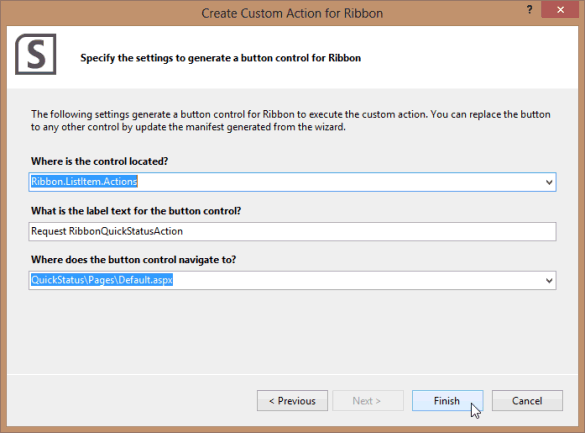

# <a name="create-a-sharepoint-hosted-project-server-add-in"></a><span data-ttu-id="8ac6d-103">Crear un complemento de Project Server hospedado por SharePoint</span><span class="sxs-lookup"><span data-stu-id="8ac6d-103">Create a SharePoint-hosted Project Server add-in</span></span>

<span data-ttu-id="8ac6d-104">De los tres tipos de aplicaciones que se pueden crear para Project Online (autohospedada, hospedada en proveedor y hospedadas en SharePoint), es la más sencilla de crear e implementar la aplicación hospedada en SharePoint.</span><span class="sxs-lookup"><span data-stu-id="8ac6d-104">Of the three types of apps that you can create for Project Online (autohosted, provider-hosted, and SharePoint-hosted), the SharePoint-hosted app is the simplest to create and deploy.</span></span> <span data-ttu-id="8ac6d-105">Una aplicación hospedada en SharePoint no requieren autenticación de OAuth y no se use Azure o no requieren mantenimiento de un sitio local de los recursos hospedada por el proveedor.</span><span class="sxs-lookup"><span data-stu-id="8ac6d-105">A SharePoint-hosted app does not require OAuth authentication, and does not use Azure or require maintenance of a local site for the provider-hosted resources.</span></span> <span data-ttu-id="8ac6d-106">La plantilla de **aplicación para SharePoint 2013** en Visual Studio es un marco de trabajo conveniente para el desarrollo de aplicaciones que pueden publicarse y se venden en la tienda Office o implementadas en un catálogo de aplicaciones privada en SharePoint.</span><span class="sxs-lookup"><span data-stu-id="8ac6d-106">The **App for SharePoint 2013** template in Visual Studio is a convenient framework for developing apps that can be published and sold in the Office Store or deployed to a private app catalog on SharePoint.</span></span> 
  
<span data-ttu-id="8ac6d-107">En Project, estado es un proceso donde un integrante del grupo puede usar la página de tareas en Project Web App para enviar el estado de una tarea asignada, como el número de horas trabajadas cada día de una semana empleado en trabajar en la tarea.</span><span class="sxs-lookup"><span data-stu-id="8ac6d-107">In Project, statusing is a process where a team member can use the Tasks page in Project Web App to submit the status of an assigned task, such as the number of hours worked each day of a week spent working on the task.</span></span> <span data-ttu-id="8ac6d-108">El propietario de asignación (normalmente, el jefe de proyecto) puede aprobar o rechazar el estado.</span><span class="sxs-lookup"><span data-stu-id="8ac6d-108">The assignment owner (usually the project manager) can approve or reject the status.</span></span> <span data-ttu-id="8ac6d-109">Cuando se aprueba el estado, Project recalcula la programación.</span><span class="sxs-lookup"><span data-stu-id="8ac6d-109">When the status is approved, Project recalculates the schedule.</span></span> <span data-ttu-id="8ac6d-110">La aplicación **QuickStatus** muestra las tareas asignadas, donde el usuario puede actualizar rápidamente porcentaje completado y enviar el estado de las asignaciones seleccionadas para su aprobación.</span><span class="sxs-lookup"><span data-stu-id="8ac6d-110">The **QuickStatus** app displays assigned tasks, where the user can quickly update percent complete and submit status of the selected assignments for approval.</span></span> <span data-ttu-id="8ac6d-111">Aunque la página de tareas en Project Web App tiene mucho más funcionalidad, la aplicación **QuickStatus** es un ejemplo que proporciona una interfaz simplificada.</span><span class="sxs-lookup"><span data-stu-id="8ac6d-111">Although the Tasks page in Project Web App has much more functionality, the **QuickStatus** app is an example that provides a simplified interface.</span></span> 
  
<span data-ttu-id="8ac6d-112">La aplicación **QuickStatus** es un ejemplo para desarrolladores; no está pensada para su uso en un entorno de producción.</span><span class="sxs-lookup"><span data-stu-id="8ac6d-112">The **QuickStatus** app is a sample for developers; it is not intended for use in a production environment.</span></span> <span data-ttu-id="8ac6d-113">El propósito principal es mostrar un ejemplo de desarrollo de aplicaciones para Project Online, no para crear una aplicación de estado totalmente funcional.</span><span class="sxs-lookup"><span data-stu-id="8ac6d-113">The primary purpose is to show an example of app development for Project Online, not to create a fully functional statusing app.</span></span> <span data-ttu-id="8ac6d-114">Para un mejor enfoque para la administración de Estados, vea la recomendación de los [pasos siguientes](#pj15_StatusingApp_NextSteps).</span><span class="sxs-lookup"><span data-stu-id="8ac6d-114">For a better approach to statusing, see the recommendation in [Next steps](#pj15_StatusingApp_NextSteps).</span></span>
  
<span data-ttu-id="8ac6d-115">Para obtener información general sobre el estado, vea el [progreso de la tarea](https://support.office.com/article/Find-information-about-Project-Server-2013-8b08a414-15a7-4076-b2db-c90d0214ea7f?ui=en-US&rs=en-US&ad=US#BKMK_TaskProgress).</span><span class="sxs-lookup"><span data-stu-id="8ac6d-115">For general information about statusing, see [Task progress](https://support.office.com/article/Find-information-about-Project-Server-2013-8b08a414-15a7-4076-b2db-c90d0214ea7f?ui=en-US&rs=en-US&ad=US#BKMK_TaskProgress).</span></span> <span data-ttu-id="8ac6d-116">Para obtener más información acerca de cómo desarrollar complementos para SharePoint y Project Server, vea [SharePoint Add-ins](http://msdn.microsoft.com/es-es/library/jj163230.aspx).</span><span class="sxs-lookup"><span data-stu-id="8ac6d-116">For more information about developing add-ins for SharePoint and Project Server, see [SharePoint Add-ins](http://msdn.microsoft.com/es-es/library/jj163230.aspx).</span></span>

<span data-ttu-id="8ac6d-117"><a name="pj15_StatusingApp_Prerequisites"> </a></span><span class="sxs-lookup"><span data-stu-id="8ac6d-117"></span></span>

## <a name="prerequisites-for-creating-an-app-for-project-server-2013"></a><span data-ttu-id="8ac6d-118">Requisitos previos para crear una aplicación para Project Server 2013</span><span class="sxs-lookup"><span data-stu-id="8ac6d-118">Prerequisites for creating an app for Project Server 2013</span></span>

<span data-ttu-id="8ac6d-119">Para desarrollar aplicaciones relativamente sencillas que se pueden implementar para Project Online o a una instalación local de Project Server 2013, puede usar el Napa, que proporcionan un entorno de desarrollo en línea.</span><span class="sxs-lookup"><span data-stu-id="8ac6d-119">To develop relatively simple apps that can be deployed to Project Online or to an on-premises installation of Project Server 2013, you can use the Napa, which provide an online development environment.</span></span> <span data-ttu-id="8ac6d-120">Para las aplicaciones más complejas, modificación de la cinta de opciones de Project Web App y facilitar la depuración durante el desarrollo, se puede usar Visual Studio 2012 o Visual Studio 2013.</span><span class="sxs-lookup"><span data-stu-id="8ac6d-120">For more complex apps, modifying the Project Web App ribbon, and easier debugging during development, you can use Visual Studio 2012 or Visual Studio 2013.</span></span> <span data-ttu-id="8ac6d-121">Por ejemplo, con una instalación local, puede comprobar manualmente las tablas de datos de borrador para que los cambios en la base de datos de Project Server.</span><span class="sxs-lookup"><span data-stu-id="8ac6d-121">For example, with an on-premises installation, you can manually check the Drafts datatables for changes in the Project Server database.</span></span> <span data-ttu-id="8ac6d-122">En este artículo se muestra cómo llevar a cabo el desarrollo de aplicaciones con Visual Studio.</span><span class="sxs-lookup"><span data-stu-id="8ac6d-122">This article shows how to do app development with Visual Studio.</span></span>
  
<span data-ttu-id="8ac6d-123">El desarrollo de aplicaciones de Project Server con Visual Studio exige lo siguiente:</span><span class="sxs-lookup"><span data-stu-id="8ac6d-123">Development of Project Server apps with Visual Studio requires the following:</span></span>
  
- <span data-ttu-id="8ac6d-p106">Asegúrese de haber instalado los Service Pack y las actualizaciones de Windows más recientes en el equipo de desarrollo local. El sistema operativo puede ser Windows 7, Windows 8, Windows Server 2008 o Windows Server 2012.</span><span class="sxs-lookup"><span data-stu-id="8ac6d-p106">Ensure that you have installed the most recent service packs and Windows updates on your local development computer. The operating system can be Windows 7, Windows 8, Windows Server 2008, or Windows Server 2012.</span></span>
    
- <span data-ttu-id="8ac6d-126">Debe tener un equipo que tenga instalado, donde el equipo está configurado para el aislamiento de aplicaciones y sideloading de aplicaciones de Project Server 2013 y de SharePoint Server 2013.</span><span class="sxs-lookup"><span data-stu-id="8ac6d-126">You must have a computer that has SharePoint Server 2013 and Project Server 2013 installed, where the computer is configured for app isolation and sideloading of apps.</span></span> <span data-ttu-id="8ac6d-127">Sideloading permite a Visual Studio instalar temporalmente la aplicación para la depuración.</span><span class="sxs-lookup"><span data-stu-id="8ac6d-127">Sideloading enables Visual Studio to temporarily install the app for debugging.</span></span> <span data-ttu-id="8ac6d-128">Puede usar una instalación local de SharePoint y Project Server.</span><span class="sxs-lookup"><span data-stu-id="8ac6d-128">You can use an on-premises installation of SharePoint and Project Server.</span></span> <span data-ttu-id="8ac6d-129">Para obtener más información, vea [configurar un entorno de desarrollo local para aplicaciones para SharePoint](http://msdn.microsoft.com/es-es/library/fp179923%28Office.15%29.aspx).</span><span class="sxs-lookup"><span data-stu-id="8ac6d-129">For more information, see [Set up an on-premises development environment for apps for SharePoint](http://msdn.microsoft.com/es-es/library/fp179923%28Office.15%29.aspx).</span></span>
    
   > [!NOTE]
   > <span data-ttu-id="8ac6d-130">Para una instalación local, configure una aplicación aislado dominio *antes de* crear un catálogo de aplicaciones corporativo.</span><span class="sxs-lookup"><span data-stu-id="8ac6d-130">For an on-premises installation, configure an isolated app domain  *before*  you create a corporate app catalog.</span></span> 
  
- <span data-ttu-id="8ac6d-131">El equipo de desarrollo puede ser un equipo remoto que tiene Office Developer Tools para Visual Studio 2012 instalado.</span><span class="sxs-lookup"><span data-stu-id="8ac6d-131">The development computer can be a remote computer that has Office Developer Tools for Visual Studio 2012 installed.</span></span> <span data-ttu-id="8ac6d-132">Asegúrese de que ha instalado la versión más reciente; vea la sección *Herramientas* de las [descargas de aplicaciones para Office y SharePoint](http://msdn.microsoft.com/es-es/office/apps/fp123627.aspx).</span><span class="sxs-lookup"><span data-stu-id="8ac6d-132">Ensure that you have installed the most recent version; see the  *Tools*  section of the [Apps for Office and SharePoint downloads](http://msdn.microsoft.com/es-es/office/apps/fp123627.aspx).</span></span>
    
- <span data-ttu-id="8ac6d-133">Compruebe que la instancia de Project Web App va a usar para el desarrollo y la prueba es accesible en el explorador.</span><span class="sxs-lookup"><span data-stu-id="8ac6d-133">Verify that the Project Web App instance you will be using for development and testing is accessible in the browser.</span></span>
    
<span data-ttu-id="8ac6d-134">Para obtener información acerca del uso de las herramientas en línea, vea [configurar un entorno de desarrollo de aplicaciones para SharePoint en Office 365](http://msdn.microsoft.com/es-es/library/fp161179.aspx).</span><span class="sxs-lookup"><span data-stu-id="8ac6d-134">For information about using the online tools, see [Set up an environment for developing apps for SharePoint on Office 365](http://msdn.microsoft.com/es-es/library/fp161179.aspx).</span></span> <span data-ttu-id="8ac6d-135">Para obtener un tutorial de creación de una aplicación simple de Project Server que usa las herramientas en línea, vea la serie de blog EPMSource, [creación de su primera aplicación de Project Server](http://epmsource.com/2012/11/20/building-your-first-project-server-app-part-zerothe-introduction/).</span><span class="sxs-lookup"><span data-stu-id="8ac6d-135">For a walkthrough of building a simple app for Project Server that uses the online tools, see the EPMSource blog series, [Building your first Project Server app](http://epmsource.com/2012/11/20/building-your-first-project-server-app-part-zerothe-introduction/).</span></span>

<span data-ttu-id="8ac6d-136"><a name="pj15_StatusingApp_UsingVisualStudio"> </a></span><span class="sxs-lookup"><span data-stu-id="8ac6d-136"></span></span>

## <a name="using-visual-studio-to-create-a-project-server-app"></a><span data-ttu-id="8ac6d-137">Empleo de Visual Studio para crear una aplicación de Project Server</span><span class="sxs-lookup"><span data-stu-id="8ac6d-137">Using Visual Studio to create a Project Server app</span></span>

<span data-ttu-id="8ac6d-138">Office Developer Tools para Visual Studio 2012 incluye una plantilla para las aplicaciones de SharePoint que se pueden usar con Project Server 2013.</span><span class="sxs-lookup"><span data-stu-id="8ac6d-138">Office Developer Tools for Visual Studio 2012 includes a template for SharePoint apps that can be used with Project Server 2013.</span></span> <span data-ttu-id="8ac6d-139">Cuando se crea una solución de aplicación, la solución incluye los siguientes archivos para que el código personalizado:</span><span class="sxs-lookup"><span data-stu-id="8ac6d-139">When you create an app solution, the solution includes the following files for your custom code:</span></span>
  
- <span data-ttu-id="8ac6d-140">**AppManifest.xml** incluye la configuración para el título de la aplicación, el ámbito de solicitud de permisos y otras propiedades.</span><span class="sxs-lookup"><span data-stu-id="8ac6d-140">**AppManifest.xml** includes settings for the app title, permission request scope, and other properties.</span></span> <span data-ttu-id="8ac6d-141">Procedimiento 1 incluye los pasos para establecer las propiedades mediante el Diseñador de manifiesto.</span><span class="sxs-lookup"><span data-stu-id="8ac6d-141">Procedure 1 includes steps to set the properties by using the Manifest Designer.</span></span> 
    
- <span data-ttu-id="8ac6d-142">**Default.aspx** en la carpeta páginas es la página principal de la aplicación.</span><span class="sxs-lookup"><span data-stu-id="8ac6d-142">**Default.aspx** in the Pages folder is the main page of the app.</span></span> <span data-ttu-id="8ac6d-143">Procedimiento 2 muestra cómo agregar contenido HTML5 para la aplicación **QuickStatus** .</span><span class="sxs-lookup"><span data-stu-id="8ac6d-143">Procedure 2 shows how to add HTML5 content for the **QuickStatus** app.</span></span> 
    
- <span data-ttu-id="8ac6d-144">**App.js** en la carpeta de secuencias de comandos es el archivo principal para el código JavaScript personalizado.</span><span class="sxs-lookup"><span data-stu-id="8ac6d-144">**App.js** in the Scripts folder is the primary file for the custom JavaScript code.</span></span> <span data-ttu-id="8ac6d-145">Procedimiento 3 explica el código JavaScript para la aplicación **QuickStatus** .</span><span class="sxs-lookup"><span data-stu-id="8ac6d-145">Procedure 3 explains the JavaScript code for the **QuickStatus** app.</span></span> 
    
   <span data-ttu-id="8ac6d-146">Si se agregan controles comerciales como una cuadrícula basada en jQuery o un selector de fecha, puede agregar referencias a archivos JavaScript adicionales en el archivo Default.aspx.</span><span class="sxs-lookup"><span data-stu-id="8ac6d-146">If you add commercial controls such as a jQuery-based grid or date picker, you can add references to additional JavaScript files in the Default.aspx file.</span></span>
    
- <span data-ttu-id="8ac6d-147">**App.css** en la carpeta de contenido es el archivo principal para los estilos de CSS3 personalizados.</span><span class="sxs-lookup"><span data-stu-id="8ac6d-147">**App.css** in the Content folder is the primary file for custom CSS3 styles.</span></span> <span data-ttu-id="8ac6d-148">Procedimiento 2 y 3 del procedimiento incluyen información acerca de estilos (CSS) de hojas de estilos en cascada para la aplicación **QuickStatus** .</span><span class="sxs-lookup"><span data-stu-id="8ac6d-148">Procedure 2 and Procedure 3 include information about cascading style sheets (CSS) styles for the **QuickStatus** app.</span></span> <span data-ttu-id="8ac6d-149">Puede agregar referencias a archivos CSS adicionales en el archivo Default.aspx.</span><span class="sxs-lookup"><span data-stu-id="8ac6d-149">You can add references to additional CSS files in the Default.aspx file.</span></span> 
    
- <span data-ttu-id="8ac6d-150">**AppIcon.png** en la carpeta de imágenes es el icono de 96 x 96 que la aplicación se muestra en la tienda de Office o el catálogo de aplicaciones.</span><span class="sxs-lookup"><span data-stu-id="8ac6d-150">**AppIcon.png** in the Images folder is the 96 x 96 icon that the app displays in the Office Store or the app catalog.</span></span> 
    
<span data-ttu-id="8ac6d-151">Para modificar la cinta de opciones de Project Web App, puede agregar una acción personalizada de la cinta de opciones.</span><span class="sxs-lookup"><span data-stu-id="8ac6d-151">To modify the Project Web App ribbon, you can add a ribbon custom action.</span></span> <span data-ttu-id="8ac6d-152">La sección [código de ejemplo para la aplicación QuickStatus](#pj15_StatusingApp_Example) incluye el código completo para los archivos Default.aspx, App.js, App.css, Elements.xml y AppManifest.xml modificados.</span><span class="sxs-lookup"><span data-stu-id="8ac6d-152">The [Example code for the QuickStatus app](#pj15_StatusingApp_Example) section includes the complete code for the modified Default.aspx, App.js, App.css, Elements.xml, and AppManifest.xml files.</span></span> 
  
### <a name="procedure-1-to-create-an-app-project-in-visual-studio"></a><span data-ttu-id="8ac6d-p116">Procedimiento 1. Crear un proyecto de aplicación en Visual Studio</span><span class="sxs-lookup"><span data-stu-id="8ac6d-p116">Procedure 1. To create an app project in Visual Studio</span></span>

1. <span data-ttu-id="8ac6d-155">Ejecute Visual Studio 2012 como administrador y, a continuación, seleccione **Nuevo proyecto** en la página de inicio.</span><span class="sxs-lookup"><span data-stu-id="8ac6d-155">Run Visual Studio 2012 as an administrator, and then select **New Project** on the Start page.</span></span> 
    
2. <span data-ttu-id="8ac6d-156">En el cuadro de diálogo **Nuevo proyecto** , expanda **plantillas**, **Visual C#** y los nodos de **Office/SharePoint** y, a continuación, seleccione **aplicaciones**.</span><span class="sxs-lookup"><span data-stu-id="8ac6d-156">In the **New Project** dialog box, expand the **Templates**, **Visual C#**, and **Office/SharePoint** nodes, and then select **Apps**.</span></span> <span data-ttu-id="8ac6d-157">Use el valor predeterminado de **.NET Framework 4.5** en la lista desplegable de marco de destino en la parte superior del panel central y, a continuación, seleccione **aplicación para SharePoint 2013** (vea la figura 1).</span><span class="sxs-lookup"><span data-stu-id="8ac6d-157">Use the default **.NET Framework 4.5** in the target framework drop-down list at the top of the center pane, and then select **App for SharePoint 2013** (see Figure 1).</span></span> 
    
3. <span data-ttu-id="8ac6d-158">En el campo **nombre** , escriba QuickStatus, vaya a la ubicación donde desea guardar la aplicación y, a continuación, elija **Aceptar**.</span><span class="sxs-lookup"><span data-stu-id="8ac6d-158">In the **Name** field, type QuickStatus, browse to the location where you want to save the app, and then choose **OK**.</span></span>
    
   <span data-ttu-id="8ac6d-159">**En la figura 1. Creación de un proyecto de aplicación de servidor en Visual Studio**</span><span class="sxs-lookup"><span data-stu-id="8ac6d-159">**Figure 1. Creating a Project Server app in Visual Studio**</span></span>

   <span data-ttu-id="8ac6d-160">![Crear un proyecto de aplicación de servidor en Visual Studio] (media/pj15_CreateStatusingApp_NewProject.gif "Crear un proyecto de aplicación de servidor en Visual Studio")</span><span class="sxs-lookup"><span data-stu-id="8ac6d-160"></span></span>
  
4. <span data-ttu-id="8ac6d-161">En el cuadro de diálogo **nueva aplicación para SharePoint** , rellene los tres campos siguientes:</span><span class="sxs-lookup"><span data-stu-id="8ac6d-161">In the **New app for SharePoint** dialog box, fill in the following three fields:</span></span> 
    
   - <span data-ttu-id="8ac6d-162">En el cuadro de texto superior, escriba el nombre que desea que la aplicación para mostrar en Project Web App.</span><span class="sxs-lookup"><span data-stu-id="8ac6d-162">In the top text box, type the name that you want the app to display in Project Web App.</span></span> <span data-ttu-id="8ac6d-163">Por ejemplo, escriba rápido de estado de actualización.</span><span class="sxs-lookup"><span data-stu-id="8ac6d-163">For example, type Quick Status Update.</span></span>
    
   - <span data-ttu-id="8ac6d-164">De sitio que se va a usar para la depuración, escriba la dirección URL de la instancia de Project Web App.</span><span class="sxs-lookup"><span data-stu-id="8ac6d-164">For the site to use for debugging, type the URL of the Project Web App instance.</span></span> <span data-ttu-id="8ac6d-165">Por ejemplo, escriba `https://ServerName/ProjectServerName` (reemplazando _ServerName_ y _ProjectServerName_ con sus propios valores) y, a continuación, seleccione **Validar**.</span><span class="sxs-lookup"><span data-stu-id="8ac6d-165">For example, type  `https://ServerName/ProjectServerName` (replacing  _ServerName_ and  _ProjectServerName_ with your own values), and then choose **Validate**.</span></span> <span data-ttu-id="8ac6d-166">Si todo va bien, Visual Studio muestra la **conexión correcta**.</span><span class="sxs-lookup"><span data-stu-id="8ac6d-166">If all goes well, Visual Studio shows **Connection successful**.</span></span> <span data-ttu-id="8ac6d-167">Si recibe un mensaje de error, asegúrese de que la dirección URL de Project Web App es correcta y que el equipo de Project Server está configurado para el aislamiento de aplicaciones y sideloading de aplicaciones.</span><span class="sxs-lookup"><span data-stu-id="8ac6d-167">If you get an error message, ensure that the Project Web App URL is correct and that the Project Server computer is configured for app isolation and sideloading of apps.</span></span> <span data-ttu-id="8ac6d-168">Para obtener más información, vea la sección [requisitos previos para crear una aplicación para Project Server 2013](#pj15_StatusingApp_Prerequisites) .</span><span class="sxs-lookup"><span data-stu-id="8ac6d-168">For more information, see the [Prerequisites for creating an app for Project Server 2013](#pj15_StatusingApp_Prerequisites) section.</span></span> 
    
   - <span data-ttu-id="8ac6d-169">En la lista desplegable **¿cómo desea hospedar la aplicación para SharePoint** , elija **hospedada en SharePoint**.</span><span class="sxs-lookup"><span data-stu-id="8ac6d-169">In the **How do you want to host your app for SharePoint** drop-down list, choose **SharePoint-hosted**.</span></span>
    
   > [!CAUTION]
   > <span data-ttu-id="8ac6d-170">Si elige el tipo de proyecto **hospedada por el proveedor** predeterminado por error, Visual Studio crea dos proyectos en la solución: un proyecto de **QuickStatus** y un proyecto de **QuickStatusWeb** .</span><span class="sxs-lookup"><span data-stu-id="8ac6d-170">If you choose the default **Provider-hosted** project type by mistake, Visual Studio creates two projects in the solution: a **QuickStatus** project and a **QuickStatusWeb** project.</span></span> <span data-ttu-id="8ac6d-171">Si ve dos proyectos, elimine esa solución y vuelva a iniciar.</span><span class="sxs-lookup"><span data-stu-id="8ac6d-171">If you see two projects, delete that solution and start again.</span></span> 
  
5. <span data-ttu-id="8ac6d-172">Elija **Aceptar** para crear la solución de **QuickStatus** , **QuickStatus** project y los archivos de forma predeterminada.</span><span class="sxs-lookup"><span data-stu-id="8ac6d-172">Choose **OK** to create the **QuickStatus** solution, **QuickStatus** project, and default files.</span></span> 
    
6. <span data-ttu-id="8ac6d-173">Abra la vista Diseñador de manifiesto (por ejemplo, haga doble clic en el archivo AppManifest.xml).</span><span class="sxs-lookup"><span data-stu-id="8ac6d-173">Open the Manifest Designer view (for example, double-click the AppManifest.xml file).</span></span> <span data-ttu-id="8ac6d-174">En la ficha **General** , el cuadro de texto **título** debe mostrar el nombre de la aplicación que escribió en el paso 4.</span><span class="sxs-lookup"><span data-stu-id="8ac6d-174">On the **General** tab, the **Title** text box should show the app name that you typed in step 4.</span></span> <span data-ttu-id="8ac6d-175">Elija la pestaña **permisos** para agregar las siguientes solicitudes de permisos para la aplicación (vea la figura 2):</span><span class="sxs-lookup"><span data-stu-id="8ac6d-175">Choose the **Permissions** tab to add the following permission requests for the app (see Figure 2):</span></span> 
    
   - <span data-ttu-id="8ac6d-176">En la primera fila de la lista de **las solicitudes de permisos** , en la columna **ámbito** , elija el **estado** en la lista desplegable.</span><span class="sxs-lookup"><span data-stu-id="8ac6d-176">In the first row of the **Permission requests** list, in the **Scope** column, choose **Statusing** in the drop-down list.</span></span> <span data-ttu-id="8ac6d-177">En la columna **permisos** , elija **SubmitStatus**.</span><span class="sxs-lookup"><span data-stu-id="8ac6d-177">In the **Permission** column, choose **SubmitStatus**.</span></span>
    
   - <span data-ttu-id="8ac6d-178">Agregue una fila donde el **ámbito** es **Varios proyectos** y el **permiso** de **lectura**.</span><span class="sxs-lookup"><span data-stu-id="8ac6d-178">Add a row where the **Scope** is **Multiple Projects** and the **Permission** is **Read**.</span></span>
    
   <span data-ttu-id="8ac6d-179">**La figura 2. Definir el ámbito de permiso de una aplicación de estado**</span><span class="sxs-lookup"><span data-stu-id="8ac6d-179">**Figure 2. Setting the permission scope for a statusing app**</span></span>

   <span data-ttu-id="8ac6d-180">![Definir el ámbito de permiso de una aplicación de estado] (media/pj15_CreateStatusingApp_PermissionScope.gif "Definir el ámbito de permiso de una aplicación de estado")</span><span class="sxs-lookup"><span data-stu-id="8ac6d-180"></span></span>
  
<span data-ttu-id="8ac6d-181">La aplicación **QuickStatus** permite a un usuario de Project Web App leer las asignaciones para ese usuario de varios proyectos, cambiar el porcentaje de trabajo completado y enviar la actualización.</span><span class="sxs-lookup"><span data-stu-id="8ac6d-181">The **QuickStatus** app enables a Project Web App user to read assignments for that user from multiple projects, change the assignment percent complete, and submit the update.</span></span> <span data-ttu-id="8ac6d-182">Los otros ámbitos de solicitud de permisos que se muestra en la lista desplegable en la figura 2 no son necesarios para esta aplicación.</span><span class="sxs-lookup"><span data-stu-id="8ac6d-182">The other permission request scopes shown in the drop-down list in Figure 2 are not required for this app.</span></span> <span data-ttu-id="8ac6d-183">Los ámbitos de solicitud de permiso son los permisos que la aplicación solicita en nombre del usuario.</span><span class="sxs-lookup"><span data-stu-id="8ac6d-183">The permission request scopes are the permissions that the app requests on behalf of the user.</span></span> <span data-ttu-id="8ac6d-184">Si el usuario no tiene los permisos de dichos en Project Web App, no se ejecuta la aplicación.</span><span class="sxs-lookup"><span data-stu-id="8ac6d-184">If the user does not have those permissions in Project Web App, the app does not run.</span></span> <span data-ttu-id="8ac6d-185">Una aplicación puede tener varios ámbitos de solicitud de permiso, las de otros permisos de SharePoint, incluidas pero debe tener el mínimo necesario para la funcionalidad de la aplicación.</span><span class="sxs-lookup"><span data-stu-id="8ac6d-185">An app can have multiple permission request scopes, including those for other SharePoint permissions, but should have only the minimum necessary for the app functionality.</span></span> <span data-ttu-id="8ac6d-186">A continuación está los ámbitos de solicitud de permiso que están relacionadas con Project Server:</span><span class="sxs-lookup"><span data-stu-id="8ac6d-186">Following are the permission request scopes that are related to Project Server:</span></span> 

- <span data-ttu-id="8ac6d-187">**Recursos de empresa**: permisos de administrador de recursos, para leer o escribir información acerca de otros usuarios de Project Web App.</span><span class="sxs-lookup"><span data-stu-id="8ac6d-187">**Enterprise Resources**: Resource manager permissions, to read or write information about other Project Web App users.</span></span>
    
- <span data-ttu-id="8ac6d-188">**Varios proyectos**: lectura o escritura a más de un proyecto, donde el usuario tiene los permisos solicitados.</span><span class="sxs-lookup"><span data-stu-id="8ac6d-188">**Multiple Projects**: Read or write to more than one project, where the user has the permissions requested.</span></span>
    
- <span data-ttu-id="8ac6d-189">**Project Server**: requiere que el usuario de la aplicación tener permisos de administrador de Project Web App.</span><span class="sxs-lookup"><span data-stu-id="8ac6d-189">**Project Server**: Requires the app user to have administrator permissions for Project Web App.</span></span>
    
- <span data-ttu-id="8ac6d-190">**Informes**: leer el servicio **ProjectData** OData de Project Web App (requiere sólo de inicio de sesión permisos de Project Web App).</span><span class="sxs-lookup"><span data-stu-id="8ac6d-190">**Reporting**: Read the **ProjectData** OData service for Project Web App (requires only log on permission for Project Web App).</span></span> 
    
- <span data-ttu-id="8ac6d-191">**Único proyecto**: lectura o escritura a un proyecto donde el usuario tiene los permisos solicitados.</span><span class="sxs-lookup"><span data-stu-id="8ac6d-191">**Single Project**: Read or write to a project where the user has the permissions requested.</span></span>
    
- <span data-ttu-id="8ac6d-192">**Estado**: enviar actualizaciones de estado de las asignaciones, como horas trabajadas, porcentaje completas y nuevas asignaciones de.</span><span class="sxs-lookup"><span data-stu-id="8ac6d-192">**Statusing**: Submit updates for status of assignments, such as times worked, percent complete, and new assignments.</span></span>
    
- <span data-ttu-id="8ac6d-193">**Flujo de trabajo**: si el usuario tiene permiso para ejecutar flujos de trabajo de Project Server, la aplicación, a continuación, se ejecuta con permisos elevados para el flujo de trabajo.</span><span class="sxs-lookup"><span data-stu-id="8ac6d-193">**Workflow**: If the user has permission to run Project Server workflows, the app then runs with elevated permissions for the workflow.</span></span>
    
<span data-ttu-id="8ac6d-194">Para obtener más información acerca de los ámbitos de solicitud de permiso para Project Server 2013, vea la sección *aplicaciones de Project* en [actualizaciones para desarrolladores en Project 2013](updates-for-developers-in-project-2013.md) y [los permisos de aplicación en SharePoint 2013](http://msdn.microsoft.com/library/fp142383.aspx).</span><span class="sxs-lookup"><span data-stu-id="8ac6d-194">For more information about permission request scopes for Project Server 2013, see the  *Project apps*  section in [Updates for developers in Project 2013](updates-for-developers-in-project-2013.md) and [App permissions in SharePoint 2013](http://msdn.microsoft.com/library/fp142383.aspx).</span></span>


<span data-ttu-id="8ac6d-195"><a name="pj15_StatusingApp_HTML"> </a></span><span class="sxs-lookup"><span data-stu-id="8ac6d-195"></span></span>

### <a name="creating-the-html-content-for-the-quickstatus-app"></a><span data-ttu-id="8ac6d-196">Creación de contenido HTML para la aplicación QuickStatus</span><span class="sxs-lookup"><span data-stu-id="8ac6d-196">Creating the HTML content for the QuickStatus app</span></span>

<span data-ttu-id="8ac6d-197">Antes de comenzar a codificar el contenido HTML, diseño de la interfaz de usuario y la experiencia del usuario para la aplicación QuickStatus (en la figura 3 muestra un ejemplo de la página completado).</span><span class="sxs-lookup"><span data-stu-id="8ac6d-197">Before you start coding the HTML content, design the user interface and user experience for the QuickStatus app (Figure 3 shows an example of the completed page).</span></span> <span data-ttu-id="8ac6d-198">Un diseño también puede incluir un esquema de las funciones de JavaScript que interactúan con el código HTML.</span><span class="sxs-lookup"><span data-stu-id="8ac6d-198">A design can also include an outline of the JavaScript functions that interact with the HTML code.</span></span> <span data-ttu-id="8ac6d-199">Para obtener información general, vea [Diseño de la experiencia de usuario de aplicaciones en SharePoint 2013](http://msdn.microsoft.com/library/fp179934.aspx).</span><span class="sxs-lookup"><span data-stu-id="8ac6d-199">For general information, see [UX design for apps in SharePoint 2013](http://msdn.microsoft.com/library/fp179934.aspx).</span></span>
  
<span data-ttu-id="8ac6d-200">**La figura 3. Diseño de la página de la aplicación QuickStatus**</span><span class="sxs-lookup"><span data-stu-id="8ac6d-200">**Figure 3. Design of the QuickStatus app page**</span></span>

<span data-ttu-id="8ac6d-201">![Diseño de la página de la aplicación QuickStatus] (media/pj15_CreateStatusingApp_AfterRefresh.gif "Diseño de la página de la aplicación QuickStatus")</span><span class="sxs-lookup"><span data-stu-id="8ac6d-201"></span></span>
  
<span data-ttu-id="8ac6d-202">La aplicación muestra el nombre para mostrar en la parte superior, que es el valor del elemento **Title** en AppManifest.xml.</span><span class="sxs-lookup"><span data-stu-id="8ac6d-202">The app shows the display name at the top, which is the value of the **Title** element in AppManifest.xml.</span></span> 
  
<span data-ttu-id="8ac6d-203">De forma predeterminada, la página usa HTML5.</span><span class="sxs-lookup"><span data-stu-id="8ac6d-203">By default, the page uses HTML5.</span></span> <span data-ttu-id="8ac6d-204">Los siguientes son los elementos HTML estándares para los objetos de la interfaz de usuario principales que contiene la aplicación **QuickStatus** en el cuerpo de la página:</span><span class="sxs-lookup"><span data-stu-id="8ac6d-204">Following are the standard HTML elements for the main UI objects that the **QuickStatus** app contains in the body of the page:</span></span> 
  
- <span data-ttu-id="8ac6d-205">Un elemento de **formulario** contiene todos los demás elementos de la interfaz de usuario.</span><span class="sxs-lookup"><span data-stu-id="8ac6d-205">A **form** element contains all of the other UI elements.</span></span> 
    
- <span data-ttu-id="8ac6d-206">Un elemento del **conjunto de campos** que crea un contenedor y el borde de la tabla de asignaciones; el elemento de **leyenda** secundario proporciona una etiqueta para el contenedor.</span><span class="sxs-lookup"><span data-stu-id="8ac6d-206">A **fieldset** element creates a container and border for the table of assignments; the child **legend** element provides a label for the container.</span></span> 
    
- <span data-ttu-id="8ac6d-207">Un elemento de **tabla** incluye un título y un encabezado de la tabla.</span><span class="sxs-lookup"><span data-stu-id="8ac6d-207">A **table** element includes a caption and only a table header.</span></span> <span data-ttu-id="8ac6d-208">Las funciones de JavaScript cambiar el título de tabla y agregar filas para las asignaciones.</span><span class="sxs-lookup"><span data-stu-id="8ac6d-208">JavaScript functions change the table caption and add rows for the assignments.</span></span> 
    
   > [!NOTE]
   > <span data-ttu-id="8ac6d-209">Para paginar y ordenar fácilmente, una aplicación de producción probablemente emplearía un control de cuadrícula comercial basado en jQuery en lugar de una tabla.</span><span class="sxs-lookup"><span data-stu-id="8ac6d-209">To easily add paging and sorting, a production app would probably use a commercial jQuery-based grid control instead of a table.</span></span> 
  
   <span data-ttu-id="8ac6d-210">La tabla incluye columnas para el nombre del proyecto, el nombre de tarea con una casilla de verificación, el trabajo real, el porcentaje de trabajo completado, restante y fecha de finalización de la asignación.</span><span class="sxs-lookup"><span data-stu-id="8ac6d-210">The table includes columns for the project name, task name with a check box, actual work, percent complete, remaining work, and the assignment finish date.</span></span> <span data-ttu-id="8ac6d-211">Las funciones de JavaScript creación la casilla de verificación y el campo de entrada de texto para el porcentaje completado de cada tarea.</span><span class="sxs-lookup"><span data-stu-id="8ac6d-211">JavaScript functions create the check box and the text input field for the percent complete of each task.</span></span>
    
- <span data-ttu-id="8ac6d-212">Un elemento de **entrada** para un cuadro de texto establece por ciento completado de todas las asignaciones seleccionadas.</span><span class="sxs-lookup"><span data-stu-id="8ac6d-212">An **input** element for a text box sets percent complete for all selected assignments.</span></span> 
    
- <span data-ttu-id="8ac6d-213">Un elemento de **botón** envía los cambios de estado.</span><span class="sxs-lookup"><span data-stu-id="8ac6d-213">A **button** element submits the status changes.</span></span> 
    
- <span data-ttu-id="8ac6d-214">Un elemento de **botón** , actualiza la página.</span><span class="sxs-lookup"><span data-stu-id="8ac6d-214">A **button** element refreshes the page.</span></span> 
    
- <span data-ttu-id="8ac6d-215">Un elemento de **botón** sale de la aplicación y se devuelve a la página de tareas en Project Web App.</span><span class="sxs-lookup"><span data-stu-id="8ac6d-215">A **button** element exits the app and returns to the Tasks page in Project Web App.</span></span> 
    
<span data-ttu-id="8ac6d-216">Los elementos de botón y el cuadro de texto inferior están dentro de los elementos **div** , para que CSS puede administrar fácilmente la posición y la apariencia de los objetos de la interfaz de usuario.</span><span class="sxs-lookup"><span data-stu-id="8ac6d-216">The bottom text box and button elements are within **div** elements, so that CSS can easily manage the position and appearance of the UI objects.</span></span> <span data-ttu-id="8ac6d-217">Una función de JavaScript, agrega un párrafo en la parte inferior de la página que contiene los resultados para el éxito o el fracaso de la actualización de estado.</span><span class="sxs-lookup"><span data-stu-id="8ac6d-217">A JavaScript function adds a paragraph at the bottom of the page that contains results for success or failure of the status update.</span></span> 
  
### <a name="procedure-2-to-create-the-html-content"></a><span data-ttu-id="8ac6d-p129">Procedimiento 2. Crear el contenido HTML</span><span class="sxs-lookup"><span data-stu-id="8ac6d-p129">Procedure 2. To create the HTML content</span></span>

1. <span data-ttu-id="8ac6d-220">En Visual Studio, abra el archivo Default.aspx.</span><span class="sxs-lookup"><span data-stu-id="8ac6d-220">In Visual Studio, open the Default.aspx file.</span></span>
    
   <span data-ttu-id="8ac6d-221">El archivo incluye dos elementos de **asp: Content** : el elemento con el `ContentPlaceHolderID="PlaceHolderAdditionalPageHead"` atributo se agrega en el encabezado de página y el elemento con el `ContentPlaceHolderID="PlaceHolderMain"` atributo se coloca dentro del elemento de **cuerpo de la** página.</span><span class="sxs-lookup"><span data-stu-id="8ac6d-221">The file includes two **asp:Content** elements: The element with the  `ContentPlaceHolderID="PlaceHolderAdditionalPageHead"` attribute is added within the page header, and the element with the  `ContentPlaceHolderID="PlaceHolderMain"` attribute is placed within the page **body** element.</span></span> 
    
2. <span data-ttu-id="8ac6d-222">En la `<asp:Content ContentPlaceHolderID="PlaceHolderAdditionalPageHead" runat="server">` de control para el encabezado de página, agregue una referencia al archivo PS.js en el equipo de Project Server.</span><span class="sxs-lookup"><span data-stu-id="8ac6d-222">In the  `<asp:Content ContentPlaceHolderID="PlaceHolderAdditionalPageHead" runat="server">` control for the page header, add a reference to the PS.js file on the Project Server computer.</span></span> <span data-ttu-id="8ac6d-223">Para realizar pruebas y depuración, puede usar PS.debug.js.</span><span class="sxs-lookup"><span data-stu-id="8ac6d-223">For testing and debugging, you can use PS.debug.js.</span></span> 
    
   ```HTML
     <script type="text/javascript" src="/_layouts/15/ps.debug.js"></script>
   ```

   <span data-ttu-id="8ac6d-224">La infraestructura de la aplicación utiliza el `/_layouts/15/` directorio virtual para el sitio de SharePoint en IIS.</span><span class="sxs-lookup"><span data-stu-id="8ac6d-224">The app infrastructure uses the `/_layouts/15/` virtual directory for the SharePoint site in IIS.</span></span> <span data-ttu-id="8ac6d-225">El archivo físico es `%ProgramFiles%\Common Files\Microsoft Shared\Web Server Extensions\15\TEMPLATE\LAYOUTS\PS.debug.js`.</span><span class="sxs-lookup"><span data-stu-id="8ac6d-225">The physical file is  `%ProgramFiles%\Common Files\Microsoft Shared\Web Server Extensions\15\TEMPLATE\LAYOUTS\PS.debug.js`.</span></span>
    
   > [!NOTE]
   > <span data-ttu-id="8ac6d-226">Antes de implementar la aplicación para usar en producción, quitar `.debug` de las referencias de script para mejorar el rendimiento.</span><span class="sxs-lookup"><span data-stu-id="8ac6d-226">Before you deploy the app for production use, remove  `.debug` from the script references to improve performance.</span></span> 
  
3. <span data-ttu-id="8ac6d-227">En el `<asp:Content ContentPlaceHolderID="PlaceHolderMain" runat="server">` controlar para el cuerpo de la página, elimine el elemento generado **div** y, a continuación, agregue el código HTML para los objetos de la interfaz de usuario.</span><span class="sxs-lookup"><span data-stu-id="8ac6d-227">In the  `<asp:Content ContentPlaceHolderID="PlaceHolderMain" runat="server">` control for the page body, delete the generated **div** element, and then add the HTML code for the UI objects.</span></span> <span data-ttu-id="8ac6d-228">El elemento de **tabla** contiene sólo una fila de encabezado.</span><span class="sxs-lookup"><span data-stu-id="8ac6d-228">The **table** element contains only a header row.</span></span> <span data-ttu-id="8ac6d-229">La columna **nombre de la tarea** incluye un control de entrada de la casilla de verificación.</span><span class="sxs-lookup"><span data-stu-id="8ac6d-229">The **Task name** column includes a check box input control.</span></span> <span data-ttu-id="8ac6d-230">Texto para el elemento de **título** se sustituye por la devolución de llamada **onGetUserNameSuccess** para la función **getUserInfo** en el archivo App.js.</span><span class="sxs-lookup"><span data-stu-id="8ac6d-230">Text for the **caption** element is replaced by the **onGetUserNameSuccess** callback for the **getUserInfo** function in the App.js file.</span></span> 
    
    ```HTML
    <form>
        <fieldset>
        <legend>Select assigned tasks</legend>
        <table id="assignmentsTable">
            <caption id="tableCaption">Replace caption</caption>
            <thead>
            <tr id="headerRow">
                <th>Project name</th>
                <th><input type="checkbox" id="headercheckbox" checked="checked" />Task name</th>
                <th>Actual work</th>
                <th>% complete</th>
                <th>Remaining work</th>
                <th>Due date</th>
            </tr>
            </thead>
        </table>
        </fieldset>
        <div id="inputPercentComplete" >
        Set percent complete for all selected assignments, or leave this
        <br /> field blank and set percent complete for individual assignments: 
        <input type="text" name="percentComplete" id="pctComplete" size="4"  maxlength="4" />
        </div>
        <div id="submitResult">
        <p><button id="btnSubmitUpdate" type="button" class="bottomButtons" ></button></p>
        <p id="message"></p>
        </div>
        <div id="refreshPage">
        <p><button id="btnRefresh" type="button" class="bottomButtons" >Refresh</button></p>
        </div>
        <div id="exitPage">
        <p><button id="btnExit" type="button" class="bottomButtons" >Exit</button></p>
        </div>
    </form>
    ```

4. <span data-ttu-id="8ac6d-231">En el archivo App.css, agregue el código CSS para la posición y el aspecto de los elementos de la interfaz de usuario.</span><span class="sxs-lookup"><span data-stu-id="8ac6d-231">In the App.css file, add CSS code for the position and appearance of the UI elements.</span></span> <span data-ttu-id="8ac6d-232">Para el código CSS completo de la aplicación **QuickStatus** , vea la sección [código de ejemplo para la aplicación QuickStatus](#pj15_StatusingApp_Example) .</span><span class="sxs-lookup"><span data-stu-id="8ac6d-232">For the complete CSS code of the **QuickStatus** app, see the [Example code for the QuickStatus app](#pj15_StatusingApp_Example) section.</span></span> 
    
<span data-ttu-id="8ac6d-233">Procedimiento 3 agrega las funciones de JavaScript para leer las asignaciones y crear las filas de tabla y para cambiar y actualizar el porcentaje completado de la asignación.</span><span class="sxs-lookup"><span data-stu-id="8ac6d-233">Procedure 3 adds the JavaScript functions to read the assignments and create the table rows, and to change and update the assignment percent complete.</span></span> <span data-ttu-id="8ac6d-234">Los pasos reales son más iterativos en el desarrollo de una aplicación, donde es crear parte del código HTML, agregar y probar los estilos relacionados y las funciones de JavaScript, modificar o agregar más código HTML y, a continuación, repita el proceso.</span><span class="sxs-lookup"><span data-stu-id="8ac6d-234">The actual steps are more iterative in developing an app, where you alternately create some of the HTML code, add and test related styles and JavaScript functions, modify or add more HTML code, and then repeat the process.</span></span>

<span data-ttu-id="8ac6d-235"><a name="pj15_StatusingApp_JavaScript"> </a></span><span class="sxs-lookup"><span data-stu-id="8ac6d-235"></span></span>

### <a name="creating-the-javascript-functions-for-the-quickstatus-app"></a><span data-ttu-id="8ac6d-236">Creación de las funciones JavaScript para la aplicación QuickStatus</span><span class="sxs-lookup"><span data-stu-id="8ac6d-236">Creating the JavaScript functions for the QuickStatus app</span></span>

<span data-ttu-id="8ac6d-237">La plantilla de Visual Studio para una aplicación de SharePoint incluye la App.js archivo, que contiene código de inicialización predeterminada que obtiene el contexto de cliente de SharePoint y muestra básica obtener y configurar las acciones de la página de la aplicación.</span><span class="sxs-lookup"><span data-stu-id="8ac6d-237">The Visual Studio template for a SharePoint app includes the App.js file, which contains default initialization code that gets the SharePoint client context and demonstrates basic get and set actions for the app page.</span></span> <span data-ttu-id="8ac6d-238">El espacio de nombres de JavaScript para la biblioteca de SharePoint de cliente Object SP.js es **SP**.</span><span class="sxs-lookup"><span data-stu-id="8ac6d-238">The JavaScript namespace for the SharePoint client-side SP.js library is **SP**.</span></span> <span data-ttu-id="8ac6d-239">Dado que una aplicación de Project Server usa la biblioteca de PS.js, la aplicación utiliza el espacio de nombres **PS** para obtener el contexto de cliente y obtener acceso a la JSOM para Project Server.</span><span class="sxs-lookup"><span data-stu-id="8ac6d-239">Because a Project Server app uses the PS.js library, the app uses the **PS** namespace to get the client context and access the JSOM for Project Server.</span></span> 
  
<span data-ttu-id="8ac6d-240">Las funciones de JavaScript en la aplicación **QuickStatus** incluyen los siguientes:</span><span class="sxs-lookup"><span data-stu-id="8ac6d-240">JavaScript functions in the **QuickStatus** app include the following:</span></span> 
  
- <span data-ttu-id="8ac6d-241">El controlador de eventos de documento **Listo** se ejecuta cuando se crea una instancia en el modelo de objetos de documento (DOM).</span><span class="sxs-lookup"><span data-stu-id="8ac6d-241">The document **ready** event handler runs when the document object model (DOM) is instantiated.</span></span> <span data-ttu-id="8ac6d-242">El controlador de eventos **Listo** realiza los siguientes cuatro pasos:</span><span class="sxs-lookup"><span data-stu-id="8ac6d-242">The **ready** event handler does the following four steps:</span></span> 
    
    1. <span data-ttu-id="8ac6d-243">Inicializa la variable global **projContext** con el contexto de cliente para el JSOM de Project Server y la variable global **pwaWeb** .</span><span class="sxs-lookup"><span data-stu-id="8ac6d-243">Initializes the **projContext** global variable with the client context for the Project Server JSOM and the **pwaWeb** global variable.</span></span> 
        
    2. <span data-ttu-id="8ac6d-244">Llama a la función **getUserInfo** para inicializar la variable global **projUser** .</span><span class="sxs-lookup"><span data-stu-id="8ac6d-244">Calls the **getUserInfo** function to initialize the **projUser** global variable.</span></span> 
        
    3. <span data-ttu-id="8ac6d-245">Llama a la función **getAssignments** , que obtiene los datos de asignación para el usuario especificados.</span><span class="sxs-lookup"><span data-stu-id="8ac6d-245">Calls the **getAssignments** function, which gets specified assignment data for the user.</span></span> 
        
    4. <span data-ttu-id="8ac6d-246">Enlaces haga clic en controladores de eventos a la casilla de verificación de encabezado de tabla y a las casillas de verificación en cada fila de la tabla.</span><span class="sxs-lookup"><span data-stu-id="8ac6d-246">Binds click event handlers to the table header check box, and to the check boxes in each row of the table.</span></span> <span data-ttu-id="8ac6d-247">Los controladores de eventos haga clic en administran el atributo **checked** de las casillas de verificación cuando el usuario selecciona o borra cualquier casilla de verificación en la tabla.</span><span class="sxs-lookup"><span data-stu-id="8ac6d-247">The click event handlers manage the **checked** attribute of the check boxes when the user selects or clears any check box in the table.</span></span> 
    
- <span data-ttu-id="8ac6d-248">Si la función **getAssignments** se realiza correctamente, llama a la función **onGetAssignmentsSuccess** .</span><span class="sxs-lookup"><span data-stu-id="8ac6d-248">If the **getAssignments** function is successful, it calls the **onGetAssignmentsSuccess** function.</span></span> <span data-ttu-id="8ac6d-249">Que función inserta una fila en la tabla para cada asignación, inicializa los controles HTML de cada fila y, a continuación, inicializa las propiedades de botón de la parte inferior.</span><span class="sxs-lookup"><span data-stu-id="8ac6d-249">That function inserts a row in the table for each assignment, initializes the HTML controls in each row, and then initializes the bottom button properties.</span></span> 
    
- <span data-ttu-id="8ac6d-250">El controlador de eventos **onClick** para el botón de **actualización** llama a la función **updateAssignments** .</span><span class="sxs-lookup"><span data-stu-id="8ac6d-250">The **onClick** event handler for the **Update** button calls the **updateAssignments** function.</span></span> <span data-ttu-id="8ac6d-251">Que función obtiene el valor del porcentaje completado se aplica a cada asignación seleccionada; o bien, si el cuadro de texto completo porcentaje está vacío, la función obtiene el porcentaje completado de cada asignación seleccionada en la tabla.</span><span class="sxs-lookup"><span data-stu-id="8ac6d-251">That function gets the percent complete value that is applied to each selected assignment; or if the percent complete text box is empty, the function gets the percent complete of each selected assignment in the table.</span></span> <span data-ttu-id="8ac6d-252">La función **updateAssignments** , a continuación, guarda y envía las actualizaciones de estado y escribe un mensaje acerca de los resultados en la parte inferior de la página.</span><span class="sxs-lookup"><span data-stu-id="8ac6d-252">The **updateAssignments** function then saves and submits the status updates and writes a message about the results to the bottom of the page.</span></span> 
    
### <a name="procedure-3-to-create-the-javascript-functions"></a><span data-ttu-id="8ac6d-p140">Procedimiento 3. Crear las funciones JavaScript</span><span class="sxs-lookup"><span data-stu-id="8ac6d-p140">Procedure 3. To create the JavaScript functions</span></span>

1. <span data-ttu-id="8ac6d-255">En Visual Studio, abra el archivo App.js y elimine todo el contenido del mismo.</span><span class="sxs-lookup"><span data-stu-id="8ac6d-255">In Visual Studio, open the App.js file, and then delete all the content in the file.</span></span>
    
2. <span data-ttu-id="8ac6d-256">Agregue las variables globales y el controlador de eventos de documento **Listo** .</span><span class="sxs-lookup"><span data-stu-id="8ac6d-256">Add the global variables and the document **ready** event handler.</span></span> <span data-ttu-id="8ac6d-257">Se obtiene acceso al objeto de **documento** mediante el uso de una función de jQuery.</span><span class="sxs-lookup"><span data-stu-id="8ac6d-257">The **document** object is accessed by using a jQuery function.</span></span> 
    
   <span data-ttu-id="8ac6d-p142">El controlador de eventos clic de la casilla de verificación del encabezado de la tabla establece el estado activado de las casillas de fila. Si todas las casillas de fila están activadas o desactivadas, el controlador de eventos clic de las casillas de fila establece el estado activado de la casilla de encabezado. El controlador de eventos clic además establece el mensaje de resultados en la parte inferior de la página en una cadena vacía.</span><span class="sxs-lookup"><span data-stu-id="8ac6d-p142">The click event handler for the table header check box sets the checked state of the row check boxes. If all of the row check boxes are selected or all are clear, the click event handler for the row check boxes sets the checked state of the header check box. The click event handlers also set the results message at the bottom of the page to an empty string.</span></span>
    
   ```js
    var projContext;
    var pwaWeb;
    var projUser;
    // This code runs when the DOM is ready and creates a ProjectContext object.
    // The ProjectContext object is required to use the JSOM for Project Server.
    $(document).ready(function () {
        projContext = PS.ProjectContext.get_current();
        pwaWeb = projContext.get_web();
        getUserInfo();
        getAssignments();
        // Bind a click event handler to the table header check box, which sets the row check boxes
        // to the checked state of the header check box, and sets the results message to an empty string.
        $('#headercheckbox').live('click', function (event) {
            $('input:checkbox:not(#headercheckbox)').attr('checked', this.checked);
            $get("message").innerText = "";
        });
        // Bind a click event handler to the row check boxes. If any row check box is cleared, clear
        // the header check box. If all of the row check boxes are selected, select the header check box.
        $('input:checkbox:not(#headercheckbox)').live('click', function (event) {
            var isChecked = true;
            $('input:checkbox:not(#headercheckbox)').each(function () {
                if (this.checked == false) isChecked = false;
                $get("message").innerText = "";
            });
            $("#headercheckbox").attr('checked', isChecked);
        });
    });
   ```

3. <span data-ttu-id="8ac6d-261">Agregue la función **getUserInfo** , que llama a **onGetUserNameSuccess** si la consulta se realiza correctamente.</span><span class="sxs-lookup"><span data-stu-id="8ac6d-261">Add the **getUserInfo** function, which calls **onGetUserNameSuccess** if the query is successful.</span></span> <span data-ttu-id="8ac6d-262">La función **onGetUserNameSuccess** reemplaza el contenido del párrafo **título** con un título de tabla que incluye el nombre de usuario.</span><span class="sxs-lookup"><span data-stu-id="8ac6d-262">The **onGetUserNameSuccess** function replaces the contents of the **caption** paragraph with a table caption that includes the user name.</span></span> 
    
   ```js
        // Get information about the current user.
        function getUserInfo() {
            projUser = pwaWeb.get_currentUser();
            projContext.load(projUser);
            projContext.executeQueryAsync(onGetUserNameSuccess,
                // Anonymous function to execute if getUserInfo fails.
                function (sender, args) {
                    alert('Failed to get user name. Error: ' + args.get_message());
            });
        } 
        // This function is executed if the getUserInfo call is successful.
        function onGetUserNameSuccess() {
            var prefaceInfo = 'Assignments for ' + projUser.get_title();
            $('#tableCaption').text(prefaceInfo);
        }
   ```

4. <span data-ttu-id="8ac6d-263">Agregar la función **getAssignments** , que llama a **onGetAssignmentsSuccess** (vea el paso 5) si la consulta de la asignación se realiza correctamente.</span><span class="sxs-lookup"><span data-stu-id="8ac6d-263">Add the **getAssignments** function, which calls **onGetAssignmentsSuccess** (see step 5) if the assignment query is successful.</span></span> <span data-ttu-id="8ac6d-264">La opción **incluir** limita la consulta para devolver sólo los campos especificados.</span><span class="sxs-lookup"><span data-stu-id="8ac6d-264">The **Include** option limits the query to return only the fields specified.</span></span> 
    
   ```js
    // Get the collection of assignments for the current user.
    function getAssignments() {
        assignments = PS.EnterpriseResource.getSelf(projContext).get_assignments();
        // Register the request that you want to run on the server. The optional "Include" parameter 
        // requests only the specified properties for each assignment in the collection.
        projContext.load(assignments,
            'Include(Project, Name, ActualWork, ActualWorkMilliseconds, PercentComplete, RemainingWork, Finish, Task)');
        // Run the request on the server.
        projContext.executeQueryAsync(onGetAssignmentsSuccess,
            // Anonymous function to execute if getAssignments fails.
            function (sender, args) {
                alert('Failed to get assignments. Error: ' + args.get_message());
            });
    }
   ```

5. <span data-ttu-id="8ac6d-265">Agregar la función **onGetAssignmentsSuccess** , que agrega una fila para cada asignación para la tabla.</span><span class="sxs-lookup"><span data-stu-id="8ac6d-265">Add the **onGetAssignmentsSuccess** function, which adds a row for each assignment to the table.</span></span> <span data-ttu-id="8ac6d-266">La variable **prevProjName** se usa para determinar si una fila es para un proyecto diferente.</span><span class="sxs-lookup"><span data-stu-id="8ac6d-266">The **prevProjName** variable is used to determine whether a row is for a different project.</span></span> <span data-ttu-id="8ac6d-267">Si es así, se muestra el nombre del proyecto en una fuente en negrita; en caso contrario, el nombre del proyecto está establecido en una cadena vacía.</span><span class="sxs-lookup"><span data-stu-id="8ac6d-267">If so, the project name is shown in a bold font; if not, the project name is set to an empty string.</span></span> 
    
   > [!NOTE]
   > <span data-ttu-id="8ac6d-268">El JSOM no incluye las propiedades de **TimeSpan** que incluye el CSOM, como **ActualWorkTimeSpan**.</span><span class="sxs-lookup"><span data-stu-id="8ac6d-268">The JSOM does not include **TimeSpan** properties that the CSOM includes, such as **ActualWorkTimeSpan**.</span></span> <span data-ttu-id="8ac6d-269">En su lugar, utiliza el JSOM de propiedades para el número de milisegundos, como el [PS. StatusAssignment.actualWorkMilliseconds](http://msdn.microsoft.com/library/736bce1e-f734-0efe-6c5f-e0e891ab00ef%28Office.15%29.aspx) (propiedad).</span><span class="sxs-lookup"><span data-stu-id="8ac6d-269">Instead, the JSOM uses properties for the number of milliseconds, such as the [PS.StatusAssignment.actualWorkMilliseconds](http://msdn.microsoft.com/library/736bce1e-f734-0efe-6c5f-e0e891ab00ef%28Office.15%29.aspx) property.</span></span> <span data-ttu-id="8ac6d-270">Es el método para obtener dicha propiedad **obtener\_actualWorkMilliseconds**, que devuelve un valor entero.</span><span class="sxs-lookup"><span data-stu-id="8ac6d-270">The method to get that property is **get\_actualWorkMilliseconds**, which returns an integer value.</span></span> <span data-ttu-id="8ac6d-271">> El método **get_actualWork** devuelve una cadena como "h 3".</span><span class="sxs-lookup"><span data-stu-id="8ac6d-271">> The **get_actualWork** method returns a string such as "3h".</span></span> <span data-ttu-id="8ac6d-272">Puede usar cualquiera de los valores de la aplicación **QuickStatus** , pero mostrar de forma diferente.</span><span class="sxs-lookup"><span data-stu-id="8ac6d-272">You could use either value in the **QuickStatus** app, but display it differently.</span></span> <span data-ttu-id="8ac6d-273">La consulta de las asignaciones incluye las dos propiedades, por lo que puede probar el valor durante la depuración.</span><span class="sxs-lookup"><span data-stu-id="8ac6d-273">The assignments query includes both properties, so you can test the value during debugging.</span></span> <span data-ttu-id="8ac6d-274">Si se quita la variable **actualWork** , también puede quitar la propiedad **ActualWork** en la consulta de las asignaciones.</span><span class="sxs-lookup"><span data-stu-id="8ac6d-274">If you remove the **actualWork** variable, you can also remove the **ActualWork** property in the assignments query.</span></span> 
  
   <span data-ttu-id="8ac6d-275">Por último, la función **onGetAssignmentsSuccess** inicializa el botón de **actualización** y el botón **Actualizar** con, haga clic en controladores de eventos.</span><span class="sxs-lookup"><span data-stu-id="8ac6d-275">Finally, the **onGetAssignmentsSuccess** function initializes the **Update** button and the **Refresh** button with click event handlers.</span></span> <span data-ttu-id="8ac6d-276">También se puede establecer el valor de texto del botón de **actualización** en el código HTML.</span><span class="sxs-lookup"><span data-stu-id="8ac6d-276">The text value of the **Update** button could also be set in the HTML code.</span></span> 
    
   ```js
        // Get the enumerator, iterate through the assignment collection, 
        // and add each assignment to the table.
        function onGetAssignmentsSuccess(sender, args) {
            if (assignments.get_count() > 0) {
                var assignmentsEnumerator = assignments.getEnumerator();
                var projName = "";
                var prevProjName = "3D2A8045-4920-4B31-B3E7-9D0C5195FC70"; // Any unique name.
                var taskNum = 0;
                var chkTask = "";
                var txtPctComplete = "";
                // Constants for creating input controls in the table.
                var INPUTCHK = '<input type="checkbox" class="chkTask" checked="checked" id="chk';
                var LBLCHK = '<label for="chk';
                var INPUTTXT = '<input type="text" size="4"  maxlength="4" class="txtPctComplete" id="txt';
                while (assignmentsEnumerator.moveNext()) {
                    var statusAssignment = assignmentsEnumerator.get_current();
                    projName = statusAssignment.get_project().get_name();
                    // Get an integer, such as 3600000.
                    var actualWorkMilliseconds = statusAssignment.get_actualWorkMilliseconds(); 
                    // Get a string, such as "1h". Not used here.
                    var actualWork = statusAssignment.get_actualWork();
                    if (projName === prevProjName) {
                        projName = "";
                    }
                    prevProjName = statusAssignment.get_project().get_name();
                    // Create a row for the assignment information.
                    var row = assignmentsTable.insertRow();
                    taskNum++;
                    // Create an HTML string with a check box and task name label, for example:
                    // <input type="checkbox" class="chkTask" checked="checked" id="chk1" /> <label for="chk1">Task 1</label>
                    chkTask = INPUTCHK + taskNum + '" /> ' + LBLCHK + taskNum + '">' 
                        + statusAssignment.get_name() + '</label>';
                    txtPctComplete = INPUTTXT + taskNum + '" />';
                    // Insert cells for the assignment properties.
                    row.insertCell().innerHTML = '<strong>' + projName + '</strong>';
                    row.insertCell().innerHTML = chkTask;
                    row.insertCell().innerText = actualWorkMilliseconds / 3600000 + 'h';
                    row.insertCell().innerHTML = txtPctComplete;
                    row.insertCell().innerText = statusAssignment.get_remainingWork();
                    row.insertCell().innerText = statusAssignment.get_finish();
                    // Initialize the percent complete cell.
                    $get("txt" + taskNum).innerText = statusAssignment.get_percentComplete() + '%'
                }
            }
            else {
                $('p#message').attr('style', 'color: #0f3fdb');     // Blue text.
                $get("message").innerText = projUser.get_title() + ' has no assignments'
            }
            // Initialize the button properties.
            $get("btnSubmitUpdate").onclick = function() { updateAssignments(); };
            $get("btnSubmitUpdate").innerText = 'Update';
            $get('btnRefresh').onclick = function () { window.location.reload(true); };
            $get('btnExit').onclick = function () { exitToPwa(); };
        }
   ```

6. <span data-ttu-id="8ac6d-277">Agregar la **updateAssignments** haga clic en el controlador de eventos para el botón de **actualización** .</span><span class="sxs-lookup"><span data-stu-id="8ac6d-277">Add the **updateAssignments** click event handler for the **Update** button.</span></span> <span data-ttu-id="8ac6d-278">Cuando el usuario cambia un valor de porcentaje completado de una tarea o agrega un valor en el cuadro de texto **percentComplete** , el valor podría escribirse en varios formatos, como "60", "60%" o "60%".</span><span class="sxs-lookup"><span data-stu-id="8ac6d-278">When the user changes a value for percent complete of a task, or adds a value in the **percentComplete** text box, the value could be entered in several formats such as "60", "60%", or "60 %".</span></span> <span data-ttu-id="8ac6d-279">El método **getNumericValue** devuelve el valor numérico de la entrada de texto.</span><span class="sxs-lookup"><span data-stu-id="8ac6d-279">The **getNumericValue** method returns the numeric value of the input text.</span></span> 
    
   > [!NOTE]
   > <span data-ttu-id="8ac6d-280">En una aplicación diseñada para uso en producción, los valores de entrada de la información numérica deben incluir validación de campos y comprobación de errores adicional.</span><span class="sxs-lookup"><span data-stu-id="8ac6d-280">In an app that is designed for production use, input values for numeric information should include field validation and additional error checking.</span></span> 
  
   <span data-ttu-id="8ac6d-281">En el ejemplo **updateAssignments** se incluye la comprobación de errores básica y muestra información en el párrafo de **mensaje** en la parte inferior de la página: verde si la consulta de actualización se realiza correctamente y es rojo si hay un error en la entrada o la consulta de actualización realizado correctamente.</span><span class="sxs-lookup"><span data-stu-id="8ac6d-281">The **updateAssignments** example includes some basic error checking, and displays information in the **message** paragraph at the bottom of the page—green if the update query is successful and red if there is an input error or the update query is unsuccessful.</span></span> 
    
   <span data-ttu-id="8ac6d-282">Antes de utilizar el método **submitAllStatusUpdates** , la aplicación debe guardar las actualizaciones en el servidor mediante el uso de la **PS. StatusAssignmentCollection.update** (método).</span><span class="sxs-lookup"><span data-stu-id="8ac6d-282">Before using the **submitAllStatusUpdates** method, the app must save the updates to the server by using the **PS.StatusAssignmentCollection.update** method.</span></span> 
    
   ```js
        // Update all checked assignments. If the bottom percent complete field is blank,
        // use the value in the % complete field of each selected row in the table.
        function updateAssignments() {
            // Get percent complete from the bottom text box.
            var pctCompleteMain = getNumericValue($('#pctComplete').val()).trim();
            var pctComplete = pctCompleteMain;
            var assignmentsEnumerator = assignments.getEnumerator();
            var taskNum = 0;
            var taskRow = "";
            var indexPercent = "";
            var doSubmit = true;
            while (assignmentsEnumerator.moveNext()) {
                var pctCompleteRow = "";
                taskRow = "chk" + ++taskNum;
                if ($get(taskRow).checked) {
                    var statusAssignment = assignmentsEnumerator.get_current();
                    if (pctCompleteMain === "") {
                        // Get percent complete from the text box field in the table row.
                        pctCompleteRow = getNumericValue($('#txt' + taskNum).val());
                        pctComplete = pctCompleteRow;
                    }
                    // If both percent complete fields are empty, show an error.
                    if (pctCompleteMain === "" && pctCompleteRow === "") {
                        $('p#message').attr('style', 'color: #e11500');     // Red text.
                        $get("message").innerHTML =
                            '<b>Error:</b> Both <i>Percent complete</i> fields are empty, in row '
                            + taskNum
                            + ' and in the bottom textbox.<br/>One of those fields must have a valid percent.'
                            + '<p>Please refresh the page and try again.</p>';
                        doSubmit = false;
                        taskNum = 0;
                        break;
                    }
                    if (doSubmit) statusAssignment.set_percentComplete(pctComplete);
                }
            } 
            // Save and submit the assignment updates.
            if (doSubmit) {
                assignments.update();
                assignments.submitAllStatusUpdates();
                projContext.executeQueryAsync(function (source, args) {
                    $('p#message').attr('style', 'color: #0faa0d');     // Green text.
                    $get("message").innerText = 'Assignments have been updated.';
                }, function (source, args) {
                    $('p#message').attr('style', 'color: #e11500');     // Red text.
                    $get("message").innerText = 'Error updating assignments: ' + args.get_message();
                });
            }
        }
        // Get the numeric part for percent complete, from a string. For example, with "20 %", return "20".
        function getNumericValue(pctComplete) {
            pctComplete = pctComplete.trim();
            pctComplete = pctComplete.replace(/ /g, "");    // Remove interior spaces.
            indexPercent = pctComplete.indexOf('%', 0);
            if (indexPercent > -1) pctComplete = pctComplete.substring(0, indexPercent);
            return pctComplete;
        }
   ```

7. <span data-ttu-id="8ac6d-283">Agregar la función **exitToPwa** , que usa el parámetro de cadena de consulta de **SPHostUrl** para la dirección URL del sitio de Project Web App de host.</span><span class="sxs-lookup"><span data-stu-id="8ac6d-283">Add the **exitToPwa** function, which uses the **SPHostUrl** query string parameter for the URL of the host Project Web App site.</span></span> <span data-ttu-id="8ac6d-284">Para volver a la página tareas, anexe `"/Tasks.aspx"` a la dirección URL.</span><span class="sxs-lookup"><span data-stu-id="8ac6d-284">To navigate back to the Tasks page, append  `"/Tasks.aspx"` to the URL.</span></span> <span data-ttu-id="8ac6d-285">Por ejemplo, la variable **spHostUrl** se establecería en `https://ServerName/ProjectServerName/Tasks.aspx`.</span><span class="sxs-lookup"><span data-stu-id="8ac6d-285">For example, the **spHostUrl** variable would be set to  `https://ServerName/ProjectServerName/Tasks.aspx`.</span></span>
    
   <span data-ttu-id="8ac6d-286">La función **getQueryStringParameter** divide la dirección URL de la página de **QuickStatus** para extraer y devolver el parámetro especificado en las opciones de dirección URL.</span><span class="sxs-lookup"><span data-stu-id="8ac6d-286">The **getQueryStringParameter** function splits the URL of the **QuickStatus** page to extract and return the specified parameter in the URL options.</span></span> <span data-ttu-id="8ac6d-287">Siguiente es un ejemplo del documento **. Dirección URL** valor para el documento de **QuickStatus** (todo en una línea):</span><span class="sxs-lookup"><span data-stu-id="8ac6d-287">Following is an example of the **document.URL** value for the **QuickStatus** document (all on one line):</span></span> 
    
   ```HTML
    https://app-ef98082fa37e3c.servername.officeapps.selfhost.corp.microsoft.com/pwa/
        QuickStatus/Pages/Default.aspx
        ?SPHostUrl=https%3A%2F%2Fsphvm%2D85178%2Fpwa
        &SPLanguage=en%2DUS
        &SPClientTag=1
        &SPProductNumber=15%2E0%2E4420%2E1022
        &SPAppWebUrl=https%3A%2F%2Fapp%2Def98082fa37e3c%2Eservername
            %2Eofficeapps%2Eselfhost%2Ecorp%2Emicrosoft%2Ecom%2Fpwa%2FQuickStatus
   ```

   <span data-ttu-id="8ac6d-288">Para la dirección URL anterior, la función **getQueryStringParameter** devuelve el valor de cadena de consulta de **SPHostUrl** , `https://ServerName/pwa`.</span><span class="sxs-lookup"><span data-stu-id="8ac6d-288">For the previous URL, the **getQueryStringParameter** function returns the **SPHostUrl** query string value,  `https://ServerName/pwa`.</span></span> 
    
   ```js
        // Exit the QuickStatus page and go back to the Tasks page in Project Web App.
        function exitToPwa() {
            // Get the SharePoint host URL, which is the top page of PWA, and add the Tasks page.
            var spHostUrl = decodeURIComponent(getQueryStringParameter('SPHostUrl'))
                            + "/Tasks.aspx";
            // Set the top window for the QuickStatus IFrame to the Tasks page.
            window.top.location.href = spHostUrl;
        }
        // Get a specified query string parameter from the {StandardTokens} URL option string.
        function getQueryStringParameter(urlParameterKey) {
            var docUrl = document.URL;
            var params = docUrl.split('?')[1].split('&');
            for (var i = 0; i < params.length; i++) {
                var theParam = params[i].split('=');
                if (theParam[0] == urlParameterKey)
                    return decodeURIComponent(theParam[1]);
            }
        }
   ```

<span data-ttu-id="8ac6d-289">Si publica la aplicación **QuickStatus** en este momento y agregarlo a Project Web App, se puede ejecutar la aplicación desde la página de contenido del sitio, pero no está fácilmente disponible para los usuarios.</span><span class="sxs-lookup"><span data-stu-id="8ac6d-289">If you publish the **QuickStatus** app at this point and add it to Project Web App, the app can be run from the Site Contents page, but it is not easily available to users.</span></span> <span data-ttu-id="8ac6d-290">Para ayudar a los usuarios encontrar y ejecutar la aplicación, puede agregar un botón correspondiente a la cinta de opciones en la página tareas.</span><span class="sxs-lookup"><span data-stu-id="8ac6d-290">To help users find and run the app, you can add a button for it to the ribbon on the Tasks page.</span></span> <span data-ttu-id="8ac6d-291">Procedimiento 4 muestra cómo agregar una acción personalizada de la cinta de opciones.</span><span class="sxs-lookup"><span data-stu-id="8ac6d-291">Procedure 4 shows how to add a ribbon custom action.</span></span> 

<span data-ttu-id="8ac6d-292"><a name="pj15_StatusingApp_ribbon"> </a></span><span class="sxs-lookup"><span data-stu-id="8ac6d-292"></span></span>

### <a name="adding-a-ribbon-custom-action"></a><span data-ttu-id="8ac6d-293">Adición de una acción personalizada de cinta</span><span class="sxs-lookup"><span data-stu-id="8ac6d-293">Adding a ribbon custom action</span></span>

<span data-ttu-id="8ac6d-294">Las fichas de la cinta de opciones, grupos y controles para Project Web App se especifican en el archivo pwaribbon.xml, que está instalado en el `[Program Files]\Common Files\Microsoft Shared\Web Server Extensions\15\TEMPLATE\FEATURES\PWARibbon\listtemplates` directorio en el equipo que ejecuta Project Server.</span><span class="sxs-lookup"><span data-stu-id="8ac6d-294">Ribbon tabs, groups, and controls for Project Web App are specified in the pwaribbon.xml file, which is installed in the  `[Program Files]\Common Files\Microsoft Shared\Web Server Extensions\15\TEMPLATE\FEATURES\PWARibbon\listtemplates` directory on the computer running Project Server.</span></span> <span data-ttu-id="8ac6d-295">Para ayudar a las acciones personalizadas de diseño para la cinta de opciones de Project Web App, la descarga del SDK de Project 2013 incluye una copia de pwaribbon.xml.</span><span class="sxs-lookup"><span data-stu-id="8ac6d-295">To help design custom actions for the Project Web App ribbon, the Project 2013 SDK download includes a copy of pwaribbon.xml.</span></span> 
  
<span data-ttu-id="8ac6d-296">Project Web App usa las definiciones de la cinta de opciones diferentes para la página de tareas, dependiendo de si la instancia de Project Web App usa el modo de entrada único que permite a los usuarios especificar valores para el estado de tareas y partes de horas.</span><span class="sxs-lookup"><span data-stu-id="8ac6d-296">Project Web App uses different ribbon definitions for the Tasks page, depending on whether the Project Web App instance uses single entry mode that enables users to enter values for both the timesheet and task status.</span></span> <span data-ttu-id="8ac6d-297">Si tiene permisos administrativos para Project Web App, para determinar el modo de entrada, elija **Configuración de PWA** en el menú de configuración de la lista desplegable en la esquina superior derecha de la página.</span><span class="sxs-lookup"><span data-stu-id="8ac6d-297">If you have administrative permissions for Project Web App, to determine the entry mode, choose **PWA Settings** in the drop-down settings menu at the top-right corner of the page.</span></span> <span data-ttu-id="8ac6d-298">En la página Configuración de PWA, elija **Configuración del parte de horas y valores predeterminados**y, a continuación, mire la casilla de verificación **Modo de entrada único** en la parte inferior de la página.</span><span class="sxs-lookup"><span data-stu-id="8ac6d-298">On the PWA Settings page, choose **Timesheet Settings and Defaults**, and then look at the **Single Entry Mode** check box at the bottom of the page.</span></span> 
  
<span data-ttu-id="8ac6d-299">Cuando el modo de entrada único está desactivado, la cinta de opciones en la página tareas se define mediante el área de mi trabajo en pwaribbon.xml:</span><span class="sxs-lookup"><span data-stu-id="8ac6d-299">When single entry mode is off, the ribbon on the Tasks page is defined by the My Work region in pwaribbon.xml:</span></span> 
  
```XML
   <!-- REGION My Work Ribbon-->
   <CustomAction
      Id="Ribbon.ContextualTabs.MyWork"
      . . .
```

<span data-ttu-id="8ac6d-300">Cuando se encuentra en modo de entrada único, la cinta de opciones de la página tareas se define mediante el modo relacionado con la región en pwaribbon.xml:</span><span class="sxs-lookup"><span data-stu-id="8ac6d-300">When single entry mode is on, the Tasks page ribbon is defined by the Tied Mode region in pwaribbon.xml:</span></span> 
  
```XML
   <!-- REGION Tied Mode Ribbon-->
   <CustomAction
      Id="Ribbon.ContextualTabs.TiedMode"
      . . .
```

<span data-ttu-id="8ac6d-301">Aunque los grupos y controles en cada región de aspecto es similares, un control para el modo vinculado puede llamar a una función diferente que el mismo control para el modo no vinculadas.</span><span class="sxs-lookup"><span data-stu-id="8ac6d-301">Although the groups and controls in each region look similar, a control for the tied mode can call a different function than the same control for the non-tied mode.</span></span> <span data-ttu-id="8ac6d-302">Procedimiento 4 muestra cómo agregar un control de botón de la aplicación **QuickStatus** cuando el modo de entrada único está desactivado (la casilla de verificación **Modo de entrada único** está desactivada).</span><span class="sxs-lookup"><span data-stu-id="8ac6d-302">Procedure 4 shows how to add a button control for the **QuickStatus** app when single entry mode is off (the **Single Entry Mode** check box is clear).</span></span> 
  
> [!NOTE]
> <span data-ttu-id="8ac6d-303">Para obtener información general acerca de cómo agregar acciones personalizadas en una cinta de opciones o en un menú en una aplicación de SharePoint, vea [crear acciones personalizadas para implementarlas con aplicaciones para SharePoint](http://msdn.microsoft.com/es-es/library/jj163954.aspx).</span><span class="sxs-lookup"><span data-stu-id="8ac6d-303">For general information about adding custom actions to a ribbon or to a menu in a SharePoint application, see [Create custom actions to deploy with apps for SharePoint](http://msdn.microsoft.com/es-es/library/jj163954.aspx).</span></span> 
  
### <a name="procedure-4-to-add-a-ribbon-custom-action-to-the-tasks-page"></a><span data-ttu-id="8ac6d-p155">Procedimiento 4. Agregar una acción personalizada de cinta de opciones a la página Tareas</span><span class="sxs-lookup"><span data-stu-id="8ac6d-p155">Procedure 4. To add a ribbon custom action to the Tasks page</span></span>

1. <span data-ttu-id="8ac6d-306">Examine la cinta de opciones en la página de tareas en Project Web App.</span><span class="sxs-lookup"><span data-stu-id="8ac6d-306">Examine the ribbon on the Tasks page in Project Web App.</span></span> <span data-ttu-id="8ac6d-307">Seleccione la ficha **tareas** en la cinta de opciones y planee cómo modificarlo.</span><span class="sxs-lookup"><span data-stu-id="8ac6d-307">Select the **TASKS** tab on the ribbon and plan how to modify it.</span></span> <span data-ttu-id="8ac6d-308">Existen siete grupos, como **Enviar**, **tareas**y **período**.</span><span class="sxs-lookup"><span data-stu-id="8ac6d-308">There are seven groups, such as **Submit**, **Tasks**, and **Period**.</span></span> <span data-ttu-id="8ac6d-309">El grupo de **envío** tiene dos controles, un botón **Guardar** y un menú desplegable de **Enviar estado** .</span><span class="sxs-lookup"><span data-stu-id="8ac6d-309">The **Submit** group has two controls, a **Save** button and a **Send Status** drop-down menu.</span></span> <span data-ttu-id="8ac6d-310">Puede agregar un control en cualquier ubicación en un grupo, agregar un grupo con un nuevo control en cualquier ubicación en la ficha **tareas** o agregar otra ficha de la cinta de opciones que tiene controles y grupos personalizados.</span><span class="sxs-lookup"><span data-stu-id="8ac6d-310">You can add a control at any location in a group, add a group with a new control at any location in the **TASKS** tab, or add another ribbon tab that has custom groups and controls.</span></span> <span data-ttu-id="8ac6d-311">En este ejemplo, se agrega un tercer botón de para el grupo de **envío** , donde el botón invoca la dirección URL de la aplicación **QuickStatus** .</span><span class="sxs-lookup"><span data-stu-id="8ac6d-311">In this example, we add a third button to the **Submit** group, where the button invokes the URL of the **QuickStatus** app.</span></span> 
    
2. <span data-ttu-id="8ac6d-312">En el panel **Explorador de soluciones** en Visual Studio, haga clic en el proyecto **QuickStatus** y, a continuación, agregue un nuevo elemento.</span><span class="sxs-lookup"><span data-stu-id="8ac6d-312">In the **Solution Explorer** pane in Visual Studio, right-click the **QuickStatus** project, and then add a new item.</span></span> <span data-ttu-id="8ac6d-313">En el cuadro de diálogo **Agregar nuevo elemento** , elija **Acción personalizada de la cinta de opciones** (vea la figura 4).</span><span class="sxs-lookup"><span data-stu-id="8ac6d-313">In the **Add New Item** dialog box, choose **Ribbon Custom Action** (see Figure 4).</span></span> <span data-ttu-id="8ac6d-314">Por ejemplo, el nombre de la acción personalizada RibbonQuickStatusAction y, a continuación, elija **Agregar**.</span><span class="sxs-lookup"><span data-stu-id="8ac6d-314">For example, name the custom action RibbonQuickStatusAction, and then choose **Add**.</span></span>
    
   <span data-ttu-id="8ac6d-315">**La figura 4. Agregar una acción personalizada de la cinta de opciones**</span><span class="sxs-lookup"><span data-stu-id="8ac6d-315">**Figure 4. Adding a ribbon custom action**</span></span>

   <span data-ttu-id="8ac6d-316">![Agregar una acción personalizada de la cinta de opciones] (media/pj15_CreateStatusingApp_AddRibbonCustomAction.gif "Agregar una acción personalizada de la cinta de opciones")</span><span class="sxs-lookup"><span data-stu-id="8ac6d-316"></span></span>
  
3. <span data-ttu-id="8ac6d-317">En la primera página del Asistente para **Crear la acción personalizada de la cinta de opciones** , deje seleccionada la opción de **Host Web** , elija **Ninguno** en la lista desplegable para el ámbito de la acción personalizada y, a continuación, elija **siguiente** (consulte la figura 5).</span><span class="sxs-lookup"><span data-stu-id="8ac6d-317">On the first page of the **Create Custom Action for Ribbon** wizard, leave the **Host Web** option selected, choose **None** in the drop-down list for the custom action scope, and then choose **Next** (see Figure 5).</span></span> <span data-ttu-id="8ac6d-318">Los elementos de las listas de lista desplegable son relevantes a SharePoint, no a Project Server.</span><span class="sxs-lookup"><span data-stu-id="8ac6d-318">The items in the drop-down lists are relevant to SharePoint, not to Project Server.</span></span> <span data-ttu-id="8ac6d-319">Reemplazaremos la mayoría del XML generado para la acción personalizada para que se aplica a Project Server.</span><span class="sxs-lookup"><span data-stu-id="8ac6d-319">We will replace most of the generated XML for the custom action so that it applies to Project Server.</span></span> 
    
   <span data-ttu-id="8ac6d-320">**La figura 5. Especificación de propiedades de la acción personalizada de la cinta de opciones**</span><span class="sxs-lookup"><span data-stu-id="8ac6d-320">**Figure 5. Specifying properties for the ribbon custom action**</span></span>

   <span data-ttu-id="8ac6d-321">![Especificación de propiedades de la acción personalizada de la cinta de opciones] (media/pj15_CreateStatusingApp_RibbonCustomAction2.gif "Especificación de propiedades de la acción personalizada de la cinta de opciones")</span><span class="sxs-lookup"><span data-stu-id="8ac6d-321"></span></span>
  
4. <span data-ttu-id="8ac6d-322">En la siguiente página del Asistente para **Crear acción personalizada de la cinta de opciones** , deje todos los valores predeterminados para la configuración y, a continuación, seleccione **Finalizar** (vea la figura 6).</span><span class="sxs-lookup"><span data-stu-id="8ac6d-322">On the next page of the **Create Custom Action for Ribbon** wizard, leave all the default values for the settings, and then choose **Finish** (see Figure 6).</span></span> <span data-ttu-id="8ac6d-323">Visual Studio crea la carpeta **RibbonQuickStatusAction** , que contiene un archivo Elements.xml.</span><span class="sxs-lookup"><span data-stu-id="8ac6d-323">Visual Studio creates the **RibbonQuickStatusAction** folder, which contains an Elements.xml file.</span></span> 
    
   <span data-ttu-id="8ac6d-324">**La figura 6. Especificar la configuración de un control de botón**</span><span class="sxs-lookup"><span data-stu-id="8ac6d-324">**Figure 6. Specifying the settings for a button control**</span></span>

   <span data-ttu-id="8ac6d-325">![Especificar la configuración de un control de botón] (media/pj15_CreateStatusingApp_RibbonCustomAction3.gif "Especificar la configuración de un control de botón")</span><span class="sxs-lookup"><span data-stu-id="8ac6d-325"></span></span>
  
5. <span data-ttu-id="8ac6d-p160">Modifique el código predeterminado generado en el archivo Elements.xml para la acción personalizada de la cinta de opciones. Este es el código XML predeterminado:</span><span class="sxs-lookup"><span data-stu-id="8ac6d-p160">Modify the default generated code in the Elements.xml file for the ribbon custom action. Following is the default XML code:</span></span>
    
   ```XML
    <?xml version="1.0" encoding="utf-8"?>
    <Elements xmlns="http://schemas.microsoft.com/sharepoint/">
        <CustomAction Id="21ea3aaf-79e5-4aac-9479-8eef14b4d9df.RibbonQuickStatusAction"
                    Location="CommandUI.Ribbon"
                    Sequence="10001"
                    Title="Invoke &apos;RibbonQuickStatusAction&apos; action">
        <CommandUIExtension>
            <!-- 
            Update the UI definitions below with the controls and the command actions
            that you want to enable for the custom action.
            -->
            <CommandUIDefinitions>
            <CommandUIDefinition Location="Ribbon.ListItem.Actions.Controls._children">
                <Button Id="Ribbon.ListItem.Actions.RibbonQuickStatusActionButton"
                        Alt="Request RibbonQuickStatusAction"
                        Sequence="100"
                        Command="Invoke_RibbonQuickStatusActionButtonRequest"
                        LabelText="Request RibbonQuickStatusAction"
                        TemplateAlias="o1"
                        Image32by32="_layouts/15/images/placeholder32x32.png"
                        Image16by16="_layouts/15/images/placeholder16x16.png" />
            </CommandUIDefinition>
            </CommandUIDefinitions>
            <CommandUIHandlers>
            <CommandUIHandler Command="Invoke_RibbonQuickStatusActionButtonRequest"
                                CommandAction="~appWebUrl/Pages/Default.aspx"/>
            </CommandUIHandlers>
        </CommandUIExtension >
        </CustomAction>
    </Elements>
   ```

   1. <span data-ttu-id="8ac6d-328">En el elemento **CustomAction** , elimine el atributo de **secuencia** y el atributo de **título** .</span><span class="sxs-lookup"><span data-stu-id="8ac6d-328">In the **CustomAction** element, delete the **Sequence** attribute and the **Title** attribute.</span></span> 
    
   2. <span data-ttu-id="8ac6d-329">Para agregar un control para el grupo de **envío** , busque el primer grupo de la `Ribbon.ContextualTabs.MyWork.Home.Groups` colección en el archivo pwaribbon.xml, que es el elemento que comienza, `<Group Id="Ribbon.ContextualTabs.MyWork.Home.Page" Command="PageGroup" Sequence="10" Title="$Resources:pwafeatures,PAGE_PDP_CM_SUBMIT"`.</span><span class="sxs-lookup"><span data-stu-id="8ac6d-329">To add a control to the **Submit** group, find the first group in the  `Ribbon.ContextualTabs.MyWork.Home.Groups` collection in the pwaribbon.xml file, which is the element that begins,  `<Group Id="Ribbon.ContextualTabs.MyWork.Home.Page" Command="PageGroup" Sequence="10" Title="$Resources:pwafeatures,PAGE_PDP_CM_SUBMIT"`.</span></span> <span data-ttu-id="8ac6d-330">Para agregar un control secundario al grupo de **envío** , el siguiente código muestra el atributo de **ubicación** correcto del elemento **CommandUIDefinition** en el archivo Elements.xml:</span><span class="sxs-lookup"><span data-stu-id="8ac6d-330">To add a child control to the **Submit** group, the following code shows the correct **Location** attribute of the **CommandUIDefinition** element in the Elements.xml file:</span></span> 
    
      ```XML
        <CommandUIDefinitions>
          <CommandUIDefinition Location="Ribbon.ContextualTabs.MyWork.Home.Page.Controls._children">
             . . .
          </CommandUIDefinition>
        </CommandUIDefinitions>
      ```

   3. <span data-ttu-id="8ac6d-331">Cambiar los valores de atributo del elemento de **botón** secundario de la siguiente manera:</span><span class="sxs-lookup"><span data-stu-id="8ac6d-331">Change the attribute values of the child **Button** element as follows:</span></span> 
    
       ```XML
            <Button Id="Ribbon.ContextualTabs.MyWork.Home.Page.QuickStatus"
                    Alt="Quick Status app"
                    Sequence="30"
                    Command="Invoke_QuickStatus"
                    LabelText="Quick Status"
                    TemplateAlias="o1"
                    Image16by16="_layouts/15/1033/images/ps16x16.png" 
                    Image16by16Left="-80"
                    Image16by16Top="-144"
                    Image32by32="_layouts/15/1033/images/ps32x32.png" 
                    Image32by32Left="-32"
                    Image32by32Top="-288" 
                    ToolTipTitle="QuickStatus"
                    ToolTipDescription="Run the QuickStatus app" />
       ```

       - <span data-ttu-id="8ac6d-332">Para hacer que el botón el tercer control en el grupo, el atributo de **secuencia** puede ser cualquier número mayor que el `Sequence="20"` valor del control **Enviar estado** existente (que es un elemento **FlyoutAnchor** en pwaribbon.xml).</span><span class="sxs-lookup"><span data-stu-id="8ac6d-332">To make the button the third control in the group, the **Sequence** attribute can be any number higher than the  `Sequence="20"` value of the existing **Send Status** control (which is a **FlyoutAnchor** element in pwaribbon.xml).</span></span> <span data-ttu-id="8ac6d-333">Por convención, los números de secuencia de grupos y controles son `10, 20, 30, …`, lo que permite que los elementos que va a insertarse en posiciones intermedias.</span><span class="sxs-lookup"><span data-stu-id="8ac6d-333">By convention, the sequence numbers of groups and controls are  `10, 20, 30, …`, which enables elements to be inserted in intermediate positions.</span></span>
    
       - <span data-ttu-id="8ac6d-334">El atributo de **comando** especifica el comando para ejecutar en el elemento **CommandUIHandler** (vea el siguiente paso 5.d).</span><span class="sxs-lookup"><span data-stu-id="8ac6d-334">The **Command** attribute specifies the command to run in the **CommandUIHandler** element (see the following step 5.d).</span></span> <span data-ttu-id="8ac6d-335">Puede simplificar el nombre del comando para que sea más fácil para el desarrollador siguiente.</span><span class="sxs-lookup"><span data-stu-id="8ac6d-335">You can simplify the command name to make it easier for the next developer.</span></span> <span data-ttu-id="8ac6d-336">Por ejemplo `Command="Invoke_QuickStatus"` es más fácil de leer que `Command="Invoke_RibbonQuickStatusActionButtonRequest"`.</span><span class="sxs-lookup"><span data-stu-id="8ac6d-336">For example  `Command="Invoke_QuickStatus"` is easier to read than  `Command="Invoke_RibbonQuickStatusActionButtonRequest"`.</span></span>
    
       - <span data-ttu-id="8ac6d-337">Los atributos de imagen especifican el icono de 16 x 16 píxeles y el icono de 32 x 32 píxeles para el control de botón.</span><span class="sxs-lookup"><span data-stu-id="8ac6d-337">The image attributes specify the 16 x 16-pixel icon and the 32 x 32-pixel icon for the button control.</span></span> <span data-ttu-id="8ac6d-338">En el archivo Elements.xml de forma predeterminada, `Image32by32="_layouts/15/images/placeholder32x32.png"` especifica un punto naranja.</span><span class="sxs-lookup"><span data-stu-id="8ac6d-338">In the default Elements.xml file,  `Image32by32="_layouts/15/images/placeholder32x32.png"` specifies an orange dot.</span></span> <span data-ttu-id="8ac6d-339">Puede extraer los iconos de los archivos de mapa de imagen (ps16x16.png y ps32x32.png) que se instalan en el `[Program Files]\Common Files\Microsoft Shared\Web Server Extensions\15\TEMPLATE\LAYOUTS\1033\IMAGES` directorio en el equipo que ejecuta Project Server.</span><span class="sxs-lookup"><span data-stu-id="8ac6d-339">You can extract icons from the image map files (ps16x16.png and ps32x32.png) that are installed in the  `[Program Files]\Common Files\Microsoft Shared\Web Server Extensions\15\TEMPLATE\LAYOUTS\1033\IMAGES` directory on the computer running Project Server.</span></span> <span data-ttu-id="8ac6d-340">Por ejemplo, el icono de 32 x 32 píxeles está en la segunda columna de iconos de la izquierda y la décima fila hacia abajo desde la parte superior del mapa de imagen ps32x32.png (la parte superior del icono es después de finalizar el noveno fila; 9 filas x 32 píxeles/fila = 288 píxeles).</span><span class="sxs-lookup"><span data-stu-id="8ac6d-340">For example, the 32 x 32-pixel icon is in the second column of icons from the left and the tenth row down from the top of the ps32x32.png image map (the top of the icon is after the end of the ninth row; 9 rows x 32 pixels/row = 288 pixels).</span></span> 
    
       - <span data-ttu-id="8ac6d-341">Para mostrar información sobre herramientas para el control de botón, agregue el atributo **ToolTipTitle** y el atributo **ToolTipDescription** .</span><span class="sxs-lookup"><span data-stu-id="8ac6d-341">To show a tool tip for the button control, add the **ToolTipTitle** attribute and the **ToolTipDescription** attribute.</span></span> 
    
    4. <span data-ttu-id="8ac6d-342">Cambiar los atributos del elemento **CommandUIHandler** .</span><span class="sxs-lookup"><span data-stu-id="8ac6d-342">Change the attributes of the **CommandUIHandler** element.</span></span> <span data-ttu-id="8ac6d-343">Por ejemplo, asegúrese de que el atributo de **comando** coincide con el valor del atributo de **comando** para el elemento de **botón** .</span><span class="sxs-lookup"><span data-stu-id="8ac6d-343">For example, ensure that the **Command** attribute matches the **Command** attribute value for the **Button** element.</span></span> <span data-ttu-id="8ac6d-344">Para el atributo **CommandAction** , `~appWebUrl` es un marcador de posición para la dirección URL de la página Web de **QuickStatus** .</span><span class="sxs-lookup"><span data-stu-id="8ac6d-344">For the **CommandAction** attribute,  `~appWebUrl` is a placeholder for the URL of the **QuickStatus** webpage.</span></span> <span data-ttu-id="8ac6d-345">Cuando el botón de la cinta de opciones, invoca la aplicación **QuickStatus** , el símbolo (token) **{StandardTokens}** se ha reemplazado por opciones de dirección URL que incluyen **SPHostUrl**, **SPLanguage**, **SPClientTag**, **SPProductNumber**y **SPAppWebUrl **.</span><span class="sxs-lookup"><span data-stu-id="8ac6d-345">When the ribbon button invokes the **QuickStatus** app, the **{StandardTokens}** token is replaced by URL options that include **SPHostUrl**, **SPLanguage**, **SPClientTag**, **SPProductNumber**, and **SPAppWebUrl**.</span></span>
    
        ```XML
            <CommandUIHandlers>
                <CommandUIHandler Command="Invoke_QuickStatus"
                                  CommandAction="~appWebUrl/Pages/Default.aspx?{StandardTokens}"/>
            </CommandUIHandlers>
        ```

6. <span data-ttu-id="8ac6d-346">En el **Explorador de soluciones**, abra el Diseñador de **Feature1.feature** y mover el elemento **RibbonQuickStatusAction** desde el panel de **elementos de la solución** en el panel de **elementos de la característica** .</span><span class="sxs-lookup"><span data-stu-id="8ac6d-346">In **Solution Explorer**, open the **Feature1.feature** designer, and move the **RibbonQuickStatusAction** item from the **Items in the Solution** pane to the **Items in the Feature** pane.</span></span> <span data-ttu-id="8ac6d-347">Si, a continuación, abra el Diseñador de **Package.package** , el elemento **RibbonQuickStatusAction** estará en el panel de **elementos en el paquete** .</span><span class="sxs-lookup"><span data-stu-id="8ac6d-347">If you then open the **Package.package** designer, the **RibbonQuickStatusAction** item will be in the **Items in the Package** pane.</span></span> 
    
<span data-ttu-id="8ac6d-348">Al desarrollar la aplicación y agrega un botón de la cinta de opciones, normalmente probar la aplicación y establecer puntos de interrupción en el código JavaScript para la depuración.</span><span class="sxs-lookup"><span data-stu-id="8ac6d-348">As you develop the app and add a ribbon button, you normally test the app and set breakpoints in the JavaScript code for debugging.</span></span> <span data-ttu-id="8ac6d-349">Al presionar **F5** para iniciar la depuración, Visual Studio compila la aplicación, lo implementa en el sitio que se especifica en la propiedad **Dirección URL del sitio** del proyecto **QuickStatus** y se muestra una página que le pregunta si confía en la aplicación.</span><span class="sxs-lookup"><span data-stu-id="8ac6d-349">When you press **F5** to start debugging, Visual Studio compiles the app, deploys it to the site that is specified in the **Site URL** property of the **QuickStatus** project, and displays a page that asks whether you trust the app.</span></span> <span data-ttu-id="8ac6d-350">Al continuar y, a continuación, salga de la aplicación **QuickStatus** , devuelve a la página de tareas en Project Web App.</span><span class="sxs-lookup"><span data-stu-id="8ac6d-350">When you proceed and then exit the **QuickStatus** app, it returns to the Tasks page in Project Web App.</span></span> 

> [!NOTE]
> <span data-ttu-id="8ac6d-351">La figura 7 muestra que el botón de **Estado rápido** en la ficha **tareas** de la cinta de opciones está deshabilitado.</span><span class="sxs-lookup"><span data-stu-id="8ac6d-351">Figure 7 shows that the **Quick Status** button on the **TASKS** tab of the ribbon is disabled.</span></span> <span data-ttu-id="8ac6d-352">Una vez muchas depuración las implementaciones con Visual Studio, se pueden bloquear los controles de la cinta de opciones personalizada al continuar con la depuración o implementar la aplicación publicada en el mismo servidor de prueba.</span><span class="sxs-lookup"><span data-stu-id="8ac6d-352">After many debug deployments with Visual Studio, custom ribbon controls can be blocked when you continue to debug or deploy the published app on the same test server.</span></span> <span data-ttu-id="8ac6d-353">Para habilitar el botón, eliminar el elemento **RibbonQuickStatusAction** en Visual Studio y, a continuación, cree una nueva acción de la cinta de opciones que tiene un nombre diferente y el identificador.</span><span class="sxs-lookup"><span data-stu-id="8ac6d-353">To enable the button, delete the **RibbonQuickStatusAction** item in Visual Studio, and then create a new ribbon action that has a different name and ID.</span></span> <span data-ttu-id="8ac6d-354">Si no se soluciona el problema, intente quitar la aplicación de la instancia de prueba de Project Web App y, a continuación, vuelva a crear la aplicación con un identificador de aplicación diferentes.</span><span class="sxs-lookup"><span data-stu-id="8ac6d-354">If that doesn't solve the problem, try removing the app from the Project Web App test instance, and then recreate the app with a different app ID.</span></span> 
  
<span data-ttu-id="8ac6d-355">**La figura 7. Visualización de la información sobre herramientas del botón estado rápido deshabilitado**</span><span class="sxs-lookup"><span data-stu-id="8ac6d-355">**Figure 7. Viewing the tooltip of the disabled Quick Status button**</span></span>

<span data-ttu-id="8ac6d-356">![Visualización de la información sobre herramientas del botón deshabilitado] (media/pj15_CreateStatusingApp_ButtonToolTipDisabled.gif "Visualización de la información sobre herramientas del botón deshabilitado")</span><span class="sxs-lookup"><span data-stu-id="8ac6d-356"></span></span>
  
<span data-ttu-id="8ac6d-357">Procedimiento 5 muestra cómo implementar e instalar la aplicación **QuickStatus** .</span><span class="sxs-lookup"><span data-stu-id="8ac6d-357">Procedure 5 shows how to deploy and install the **QuickStatus** app.</span></span> <span data-ttu-id="8ac6d-358">Procedimiento 6 muestra algunos pasos adicionales en las pruebas de la aplicación después de que haya instalado.</span><span class="sxs-lookup"><span data-stu-id="8ac6d-358">Procedure 6 shows some additional steps in testing the app after you have installed it.</span></span> 

<span data-ttu-id="8ac6d-359"><a name="pj15_StatusingApp_Deploying"> </a></span><span class="sxs-lookup"><span data-stu-id="8ac6d-359"></span></span>

## <a name="deploying-the-quickstatus-app"></a><span data-ttu-id="8ac6d-360">Implementación de la aplicación QuickStatus</span><span class="sxs-lookup"><span data-stu-id="8ac6d-360">Deploying the QuickStatus app</span></span>

<span data-ttu-id="8ac6d-361">Hay varias maneras de implementar una aplicación en una aplicación web de SharePoint como Project Web App.</span><span class="sxs-lookup"><span data-stu-id="8ac6d-361">There are several ways to deploy an app to a SharePoint web application such as Project Web App.</span></span> <span data-ttu-id="8ac6d-362">Qué implementación que utilice dependerá de si desea publicar la aplicación en un catálogo privado de SharePoint o en la tienda de Office pública, y si está instalado SharePoint local o es un arrendamiento de en línea.</span><span class="sxs-lookup"><span data-stu-id="8ac6d-362">Which deployment you use will depend on whether you want to publish the app to a private SharePoint catalog or to the public Office Store, and whether SharePoint is installed on-premises or is an online tenancy.</span></span> <span data-ttu-id="8ac6d-363">Procedimiento 5 muestra cómo implementar la aplicación **QuickStatus** a una instalación local en un catálogo de aplicaciones privada.</span><span class="sxs-lookup"><span data-stu-id="8ac6d-363">Procedure 5 shows how to deploy the **QuickStatus** app to an on-premises installation in a private app catalog.</span></span> <span data-ttu-id="8ac6d-364">Para obtener más información, vea [instalar y administrar aplicaciones para SharePoint 2013](http://technet.microsoft.com/library/fp161232.aspx) y [publicar aplicaciones para SharePoint](http://msdn.microsoft.com/library/jj164070.aspx)</span><span class="sxs-lookup"><span data-stu-id="8ac6d-364">For more information, see [Install and manage apps for SharePoint 2013](http://technet.microsoft.com/library/fp161232.aspx) and [Publish apps for SharePoint](http://msdn.microsoft.com/library/jj164070.aspx)</span></span>
  
> [!NOTE]
> <span data-ttu-id="8ac6d-365">La adición de una aplicación a un catálogo de SharePoint exige permisos de administrador de SharePoint.</span><span class="sxs-lookup"><span data-stu-id="8ac6d-365">Adding an app to a SharePoint catalog requires SharePoint administrator permissions.</span></span> 
  
### <a name="procedure-5-to-deploy-the-quickstatus-app"></a><span data-ttu-id="8ac6d-p171">Procedimiento 5. Implementar la aplicación QuickStatus</span><span class="sxs-lookup"><span data-stu-id="8ac6d-p171">Procedure 5. To deploy the QuickStatus app</span></span>

1. <span data-ttu-id="8ac6d-368">En Visual Studio, guarde todos los archivos y, a continuación, haga clic en el proyecto **QuickStatus** en el **Explorador de soluciones** y elija **Publicar**.</span><span class="sxs-lookup"><span data-stu-id="8ac6d-368">In Visual Studio, save all of the files, and then right-click the **QuickStatus** project in the **Solution Explorer** and choose **Publish**.</span></span>
    
2. <span data-ttu-id="8ac6d-369">Debido a que la aplicación **QuickStatus** está hospedada en SharePoint, hay muy pocas opciones para publicar (vea la figura 8).</span><span class="sxs-lookup"><span data-stu-id="8ac6d-369">Because the **QuickStatus** app is SharePoint-hosted, there are very few options for publishing (see Figure 8).</span></span> <span data-ttu-id="8ac6d-370">En el cuadro de diálogo **publicar aplicaciones para Office y SharePoint** , elija **Finalizar**.</span><span class="sxs-lookup"><span data-stu-id="8ac6d-370">In the **Publish apps for Office and SharePoint** dialog box, choose **Finish**.</span></span>
    
   <span data-ttu-id="8ac6d-371">**La figura 8. Publicación de la aplicación QuickStatus**</span><span class="sxs-lookup"><span data-stu-id="8ac6d-371">**Figure 8. Publishing the QuickStatus app**</span></span>

   <span data-ttu-id="8ac6d-372">![Mediante el Asistente para publicación] (media/pj15_CreateStatusingApp_PublishWizard.gif "Mediante el Asistente para publicación")</span><span class="sxs-lookup"><span data-stu-id="8ac6d-372"></span></span>
  
3. <span data-ttu-id="8ac6d-373">Copie el archivo QuickStatus.app desde el `~\QuickStatus\bin\Debug\app.publish\1.0.0.0` directorio a un directorio adecuado en el equipo local (o en el equipo de SharePoint para una instalación local).</span><span class="sxs-lookup"><span data-stu-id="8ac6d-373">Copy the QuickStatus.app file from the  `~\QuickStatus\bin\Debug\app.publish\1.0.0.0` directory to a convenient directory on the local computer (or to the SharePoint computer for an on-premises installation).</span></span> 
    
4. <span data-ttu-id="8ac6d-374">En Administración Central de SharePoint, elija **aplicaciones** en el inicio rápido y, a continuación, elija **Administrar catálogo de aplicaciones**.</span><span class="sxs-lookup"><span data-stu-id="8ac6d-374">In SharePoint Central Administration, choose **Apps** in the Quick Launch, and then choose **Manage App Catalog**.</span></span>
    
5. <span data-ttu-id="8ac6d-375">Si no existe un catálogo de aplicaciones, cree una colección de sitios para el catálogo de aplicaciones, siguiendo la sección *Configurar el sitio del catálogo de aplicaciones para una aplicación web* en [administrar el catálogo de aplicaciones en SharePoint 2013](http://technet.microsoft.com/library/fp161234.aspx).</span><span class="sxs-lookup"><span data-stu-id="8ac6d-375">If an app catalog does not exist, create a site collection for the app catalog, by following the  *Configure the App Catalog site for a web application*  section in [Manage the App Catalog in SharePoint 2013](http://technet.microsoft.com/library/fp161234.aspx).</span></span>
    
   <span data-ttu-id="8ac6d-376">Si no existe un catálogo de aplicaciones, vaya a la dirección URL del sitio en la página Administrar catálogo de aplicaciones.</span><span class="sxs-lookup"><span data-stu-id="8ac6d-376">If an app catalog exists, navigate to the site URL on the Manage App Catalog page.</span></span> <span data-ttu-id="8ac6d-377">Por ejemplo, en los pasos siguientes, el sitio del catálogo de aplicaciones es `http://ServerName/sites/TestApps`.</span><span class="sxs-lookup"><span data-stu-id="8ac6d-377">For example, in the following steps, the app catalog site is  `http://ServerName/sites/TestApps`.</span></span>
    
6. <span data-ttu-id="8ac6d-378">En la página de aplicación de catálogo, elija **aplicaciones para SharePoint** en el inicio rápido.</span><span class="sxs-lookup"><span data-stu-id="8ac6d-378">On the app catalog page, choose **Apps for SharePoint** in the Quick Launch.</span></span> <span data-ttu-id="8ac6d-379">En la página aplicaciones para SharePoint, en la ficha **archivos** de la cinta de opciones, elija **Cargar documento**.</span><span class="sxs-lookup"><span data-stu-id="8ac6d-379">On the Apps for SharePoint page, on the **FILES** tab of the ribbon, choose **Upload Document**.</span></span>
    
7. <span data-ttu-id="8ac6d-380">En el cuadro de diálogo **Agregar un documento** , busque el archivo QuickStatus.app, agregar comentarios de la versión y, a continuación, elija **Aceptar**.</span><span class="sxs-lookup"><span data-stu-id="8ac6d-380">In the **Add a document** dialog box, browse for the QuickStatus.app file, add comments for the version, and then choose **OK**.</span></span>
    
8. <span data-ttu-id="8ac6d-381">Al agregar una aplicación, también puede agregar información local para la descripción de la aplicación, el icono y otra información.</span><span class="sxs-lookup"><span data-stu-id="8ac6d-381">When you add an app, you can also add local information for the app description, icon, and other information.</span></span> <span data-ttu-id="8ac6d-382">En el cuadro de diálogo **aplicaciones para SharePoint - QuickStatus.app** , agregue la información que desea mostrar para la aplicación en la colección de sitios de SharePoint.</span><span class="sxs-lookup"><span data-stu-id="8ac6d-382">In the **Apps for SharePoint - QuickStatus.app** dialog box, add the information that you want to show for the app in the SharePoint site collection.</span></span> <span data-ttu-id="8ac6d-383">Por ejemplo, agregue la siguiente información:</span><span class="sxs-lookup"><span data-stu-id="8ac6d-383">For example, add the following information:</span></span> 
    
   1. <span data-ttu-id="8ac6d-384">Campo de **Descripción breve** : aplicación de prueba de estado rápido de tipo.</span><span class="sxs-lookup"><span data-stu-id="8ac6d-384">**Short Description** field: Type Quick Status test app.</span></span>
    
   2. <span data-ttu-id="8ac6d-385">Campo de **Descripción** : aplicación de prueba de tipo para actualizar el porcentaje completado de tareas en varios proyectos.</span><span class="sxs-lookup"><span data-stu-id="8ac6d-385">**Description** field: Type Test app to update percent complete for tasks in multiple projects.</span></span>
    
   3. <span data-ttu-id="8ac6d-386">Los campos de la **Dirección URL del icono** : agregar una imagen de 96 x 96 píxeles para el icono de la aplicación a los activos del sitio para el catálogo de aplicaciones.</span><span class="sxs-lookup"><span data-stu-id="8ac6d-386">**Icon URL** fields: Add a 96 x 96-pixel image for the app icon to the site assets for the app catalog.</span></span> <span data-ttu-id="8ac6d-387">Por ejemplo, vaya a `http://ServerName/sites/TestApps`, elija **contenido del sitio** en el menú de lista desplegable **configuración** , elija **Activos del sitio**y, a continuación, agregue la imagen quickStatusApp.png.</span><span class="sxs-lookup"><span data-stu-id="8ac6d-387">For example, navigate to  `http://ServerName/sites/TestApps`, choose **Site contents** in the **Settings** drop-down menu, choose **Site Assets**, and then add the quickStatusApp.png image.</span></span> <span data-ttu-id="8ac6d-388">Haga clic en el elemento **quickStatusApp** , elija **Propiedades**y, a continuación, copie el valor de la **Dirección (URL)** en el cuadro de diálogo de **Propiedades** .</span><span class="sxs-lookup"><span data-stu-id="8ac6d-388">Right-click the **quickStatusApp** item, choose **Properties**, and then copy the **Address (URL)** value in the **Properties** dialog box.</span></span> <span data-ttu-id="8ac6d-389">Por ejemplo, copie `http://ServerName/sites/TestApps/SiteAssets/QuickStatusApp.png`y, a continuación, pegue el valor en el campo de dirección **URL de icono** web.</span><span class="sxs-lookup"><span data-stu-id="8ac6d-389">For example, copy  `http://ServerName/sites/TestApps/SiteAssets/QuickStatusApp.png`, and then paste the value in the **Icon URL** web address field.</span></span> <span data-ttu-id="8ac6d-390">Escriba una descripción para el icono, por ejemplo (como se muestra en la figura 9), escriba el icono de la aplicación QuickStatus.</span><span class="sxs-lookup"><span data-stu-id="8ac6d-390">Type a description for the icon, for example (as in Figure 9), type QuickStatus app icon.</span></span> <span data-ttu-id="8ac6d-391">Probar que la dirección URL es válida.</span><span class="sxs-lookup"><span data-stu-id="8ac6d-391">Test that the URL is valid.</span></span>
    
      <span data-ttu-id="8ac6d-392">**En la figura 9. Adición de una dirección URL del icono para la aplicación QuickStatus**</span><span class="sxs-lookup"><span data-stu-id="8ac6d-392">**Figure 9. Adding an icon URL for the QuickStatus app**</span></span>

      <span data-ttu-id="8ac6d-393">![Establecer las propiedades de SharePoint para la aplicación] (media/pj15_CreateStatusingApp_AddAppToSharePointSettings.gif "Establecer las propiedades de SharePoint para la aplicación")</span><span class="sxs-lookup"><span data-stu-id="8ac6d-393"></span></span>
  
   4. <span data-ttu-id="8ac6d-394">Campo de **categoría** : elija una categoría existente, o especifique su propio valor.</span><span class="sxs-lookup"><span data-stu-id="8ac6d-394">**Category** field: Choose an existing category, or specify your own value.</span></span> <span data-ttu-id="8ac6d-395">Por ejemplo, escriba estado.</span><span class="sxs-lookup"><span data-stu-id="8ac6d-395">For example, type Statusing.</span></span>
    
      > [!NOTE]
      > <span data-ttu-id="8ac6d-396">Una categoría denominada **estado** es solo para fines de prueba.</span><span class="sxs-lookup"><span data-stu-id="8ac6d-396">A category named **Statusing** is just for testing purposes.</span></span> <span data-ttu-id="8ac6d-397">Una categoría típica para las aplicaciones de Project Server es la **Administración de proyectos**.</span><span class="sxs-lookup"><span data-stu-id="8ac6d-397">A typical category for Project Server apps is **Project Management**.</span></span> 
  
   5. <span data-ttu-id="8ac6d-398">**Nombre del publicador de** campo: escriba el nombre del publicador.</span><span class="sxs-lookup"><span data-stu-id="8ac6d-398">**Publisher name** field: Type the name of the publisher.</span></span> <span data-ttu-id="8ac6d-399">En este ejemplo, escriba SDK de Project.</span><span class="sxs-lookup"><span data-stu-id="8ac6d-399">In this example, type Project SDK.</span></span>
    
   6. <span data-ttu-id="8ac6d-400">Campo **habilitado** : para que la aplicación sea visible para los administradores de sitios de Project Web App para la instalación, seleccione la casilla de verificación **habilitado** .</span><span class="sxs-lookup"><span data-stu-id="8ac6d-400">**Enabled** field: To make the app visible to Project Web App site administrators for installation, select the **Enabled** check box.</span></span> 
    
   7. <span data-ttu-id="8ac6d-401">Los campos adicionales son opcionales.</span><span class="sxs-lookup"><span data-stu-id="8ac6d-401">Additional fields are optional.</span></span> <span data-ttu-id="8ac6d-402">Por ejemplo, puede agregar una dirección URL de soporte técnico y varias imágenes de ayuda para la página de detalles de la aplicación.</span><span class="sxs-lookup"><span data-stu-id="8ac6d-402">For example, you can add a support URL and multiple help images for the app details page.</span></span> <span data-ttu-id="8ac6d-403">En la figura 9, los campos de la **dirección URL de imagen 1** incluyen la dirección URL de una captura de pantalla de la aplicación y una descripción de la captura de pantalla.</span><span class="sxs-lookup"><span data-stu-id="8ac6d-403">In Figure 9, the **Image URL 1** fields include the URL for a screenshot of the app and a description of the screenshot.</span></span> 
    
   8. <span data-ttu-id="8ac6d-404">En el cuadro de diálogo **aplicaciones para SharePoint - QuickStatus.app** , elija **Guardar**.</span><span class="sxs-lookup"><span data-stu-id="8ac6d-404">In the **Apps for SharePoint - QuickStatus.app** dialog box, choose **Save**.</span></span> <span data-ttu-id="8ac6d-405">En la figura 9, el elemento **Rápida actualización del estado** de las aplicaciones para la biblioteca de SharePoint está desprotegida para su edición, así sucesivamente la ficha **Editar** de la cinta de opciones del cuadro de diálogo, decide **Proteger** para completar el proceso (vea la figura 10).</span><span class="sxs-lookup"><span data-stu-id="8ac6d-405">In Figure 9, the **Quick Status Update** item in the Apps for SharePoint library is checked out for editing, so on the **EDIT** tab of the dialog box ribbon, you would choose **Check In** to complete the process (see Figure 10).</span></span> 
    
      <span data-ttu-id="8ac6d-406">**La figura 10. La aplicación QuickStatus se agrega a las aplicaciones de biblioteca de SharePoint.**</span><span class="sxs-lookup"><span data-stu-id="8ac6d-406">**Figure 10. The QuickStatus app is added to the Apps for SharePoint library.**</span></span>

      <span data-ttu-id="8ac6d-407">![Aplicación del QuickStatus se agrega a SharePoint] (media/pj15_CreateStatusingApp_AddAppToSharePoint.gif "Aplicación del QuickStatus se agrega a SharePoint")</span><span class="sxs-lookup"><span data-stu-id="8ac6d-407"></span></span>
  
9. <span data-ttu-id="8ac6d-408">En Project Web App, en el menú desplegable **configuración** , elija **Agregar una aplicación**.</span><span class="sxs-lookup"><span data-stu-id="8ac6d-408">In Project Web App, in the **Settings** drop-down menu, choose **Add an app**.</span></span> <span data-ttu-id="8ac6d-409">En la página de sus aplicaciones, en Inicio rápido, elija **De su organización**y, a continuación, elija **Detalles de la aplicación** para la aplicación de **Actualización de estado rápida** .</span><span class="sxs-lookup"><span data-stu-id="8ac6d-409">On the Your Apps page, in the Quick Launch, choose **From Your Organization**, and then choose **App Details** for the **Quick Status Update** app.</span></span> <span data-ttu-id="8ac6d-410">La figura 11 muestra la página de detalles con el icono de la aplicación, captura de pantalla y otra información que agregó en el paso anterior.</span><span class="sxs-lookup"><span data-stu-id="8ac6d-410">Figure 11 shows the details page with the app icon, screenshot, and other information that you added in the previous step.</span></span> 
    
   <span data-ttu-id="8ac6d-411">**La figura 11. Desde la página de detalles de actualización de estado rápido de Project Web App**</span><span class="sxs-lookup"><span data-stu-id="8ac6d-411">**Figure 11. Using the Quick Status Update details page in Project Web App**</span></span>

   <span data-ttu-id="8ac6d-412">![Adición de la aplicación QuickStatus a Project Web App] (media/pj15_CreateStatusingApp_AddAppToPWA.gif "Adición de la aplicación QuickStatus a Project Web App")</span><span class="sxs-lookup"><span data-stu-id="8ac6d-412"></span></span>
  
10. <span data-ttu-id="8ac6d-413">En la página de detalles de la actualización del estado rápido, seleccione **Agregar**.</span><span class="sxs-lookup"><span data-stu-id="8ac6d-413">On the Quick Status Update details page, choose **ADD IT**.</span></span> <span data-ttu-id="8ac6d-414">Project Web App muestra un cuadro de diálogo que muestra las operaciones que puede llevar a cabo la aplicación QuickStatus (vea la figura 12).</span><span class="sxs-lookup"><span data-stu-id="8ac6d-414">Project Web App displays a dialog box that lists the operations that the QuickStatus app can perform (see Figure 12).</span></span> <span data-ttu-id="8ac6d-415">La lista de operaciones se deriva de los elementos de **AppPermissionRequest** en el archivo AppManifest.xml.</span><span class="sxs-lookup"><span data-stu-id="8ac6d-415">The list of operations is derived from the **AppPermissionRequest** elements in the AppManifest.xml file.</span></span> 
    
    <span data-ttu-id="8ac6d-416">**La figura 12. Comprobación de que confía en la aplicación de estado rápido**</span><span class="sxs-lookup"><span data-stu-id="8ac6d-416">**Figure 12. Verifying that you trust the Quick Status app**</span></span>

    <span data-ttu-id="8ac6d-417">![Comprobar la confianza de la aplicación QuickStatus] (media/pj15_CreateStatusingApp_AddAppToPWA2Trust.gif "Comprobar la confianza de la aplicación QuickStatus")</span><span class="sxs-lookup"><span data-stu-id="8ac6d-417"></span></span>
  
11. <span data-ttu-id="8ac6d-418">En el cuadro de diálogo **¿confía rápida actualización de estado** , elija **Confianza**.</span><span class="sxs-lookup"><span data-stu-id="8ac6d-418">In the **Do you trust Quick Status Update** dialog box, choose **Trust It**.</span></span> <span data-ttu-id="8ac6d-419">La aplicación se agrega a la página contenido del sitio de Project Web App (vea la figura 13).</span><span class="sxs-lookup"><span data-stu-id="8ac6d-419">The app is added to the Project Web App Site Contents page (see Figure 13).</span></span>
    
    <span data-ttu-id="8ac6d-420">**La figura 13. Visualización de la aplicación de estado rápido en la página contenido del sitio**</span><span class="sxs-lookup"><span data-stu-id="8ac6d-420">**Figure 13. Viewing the Quick Status app on the Site Contents page**</span></span>

    <span data-ttu-id="8ac6d-421">![Visualización de la aplicación QuickStatus en contenidos del sitio] (media/pj15_CreateStatusingApp_AddAppToPWA3.gif "Visualización de la aplicación QuickStatus en contenidos del sitio")</span><span class="sxs-lookup"><span data-stu-id="8ac6d-421"></span></span>
  
<span data-ttu-id="8ac6d-422">En la página contenido del sitio, puede seleccionar el icono de **Actualización de estado rápido** para ejecutar la aplicación.</span><span class="sxs-lookup"><span data-stu-id="8ac6d-422">On the Site Contents page, you can select the **Quick Status Update** icon to run the app.</span></span>

> [!NOTE]
> <span data-ttu-id="8ac6d-423">Para los comandos adicionales que proporcionan información acerca de la aplicación, en la página contenido del sitio, elija la región que contiene el nombre de la **Actualización de estado rápido** y los puntos suspensivos (...). Puede revisar la página acerca de la aplicación, ver la página de detalles de la aplicación que contiene información acerca de los errores de aplicación, revise la página de permisos de aplicación o quitar la aplicación de Project Web App.</span><span class="sxs-lookup"><span data-stu-id="8ac6d-423">For additional commands that provide information about the app, on the Site Contents page, choose the region that contains the **Quick Status Update** name and the ellipsis (...). You can review the About page for the app, view the App Details page that contains information about app errors, review the app permissions page, or remove the app from Project Web App.</span></span> 
  
<span data-ttu-id="8ac6d-424">En la página de tareas en Project Web App (vea la figura 14), el botón **QuickStatus** debería estar habilitado en la cinta de opciones.</span><span class="sxs-lookup"><span data-stu-id="8ac6d-424">On the Tasks page in Project Web App (see Figure 14), the **QuickStatus** button should be enabled on the ribbon.</span></span> <span data-ttu-id="8ac6d-425">Si se deshabilita el botón de **Estado rápida** , pruebe las acciones que se describen en la nota de la figura 7.</span><span class="sxs-lookup"><span data-stu-id="8ac6d-425">If the **Quick Status** button is disabled, try the actions described in the note for Figure 7.</span></span> 

<span data-ttu-id="8ac6d-426">**La figura 14. Iniciar la aplicación QuickStatus desde la pestaña tareas**</span><span class="sxs-lookup"><span data-stu-id="8ac6d-426">**Figure 14. Starting the QuickStatus app from the TASKS tab**</span></span>

<span data-ttu-id="8ac6d-427">![Iniciar la aplicación QuickStatus desde la pestaña tareas] (media/pj15_CreateStatusingApp_TasksRibbon.gif "Iniciar la aplicación QuickStatus desde la pestaña tareas")</span><span class="sxs-lookup"><span data-stu-id="8ac6d-427"></span></span>
  
<span data-ttu-id="8ac6d-428">El procedimiento 6 muestra algunas pruebas que se pueden realizar con la aplicación QuickStatus.</span><span class="sxs-lookup"><span data-stu-id="8ac6d-428">Procedure 6 shows some tests to make with the QuickStatus app.</span></span>

<span data-ttu-id="8ac6d-429"><a name="pj15_StatusingApp_Testing"> </a></span><span class="sxs-lookup"><span data-stu-id="8ac6d-429"></span></span>

## <a name="testing-the-quickstatus-app"></a><span data-ttu-id="8ac6d-430">Prueba de la aplicación QuickStatus</span><span class="sxs-lookup"><span data-stu-id="8ac6d-430">Testing the QuickStatus app</span></span>

<span data-ttu-id="8ac6d-431">Deben probar todas las operaciones que es posible que intente un usuario en la aplicación **QuickStatus** en una instalación de prueba de Project Server antes de implementar la aplicación en un servidor de producción o en un inquilino de producción de Project Online.</span><span class="sxs-lookup"><span data-stu-id="8ac6d-431">Every operation that a user might try in the **QuickStatus** app should be tested on a test installation of Project Server before deploying the app to a production server or to a production tenant of Project Online.</span></span> <span data-ttu-id="8ac6d-432">Una instalación de prueba permite cambiar y eliminar las asignaciones para los usuarios sin que ello afecte a proyectos real.</span><span class="sxs-lookup"><span data-stu-id="8ac6d-432">A test installation enables you to change and delete assignments for users without affecting actual projects.</span></span> <span data-ttu-id="8ac6d-433">Las pruebas, también deben incluir a varios usuarios que tienen distintos conjuntos de permisos, como administrador, jefe de proyecto y miembro del equipo.</span><span class="sxs-lookup"><span data-stu-id="8ac6d-433">Testing should also involve several users who have different sets of permissions, such as administrator, project manager, and team member.</span></span> <span data-ttu-id="8ac6d-434">Rigurosa comprobación puede revelar los cambios que se deben realizar en la aplicación, que no eran obvias en las pruebas durante el desarrollo.</span><span class="sxs-lookup"><span data-stu-id="8ac6d-434">Thorough testing can uncover changes that should be made in the app, which were not apparent in testing during development.</span></span> <span data-ttu-id="8ac6d-435">Procedimiento 6 muestra varias pruebas para la aplicación **QuickStatus** , pero no incluye una serie de pruebas exhaustiva.</span><span class="sxs-lookup"><span data-stu-id="8ac6d-435">Procedure 6 lists several tests for the **QuickStatus** app, but does not include an exhaustive series of tests.</span></span> 
  
### <a name="procedure-6-to-test-the-quickstatus-app"></a><span data-ttu-id="8ac6d-p187">Procedimiento 6. Probar la aplicación QuickStatus</span><span class="sxs-lookup"><span data-stu-id="8ac6d-p187">Procedure 6. To test the QuickStatus app</span></span>

1. <span data-ttu-id="8ac6d-438">Ejecute la aplicación **QuickStatus** donde el usuario no tiene asignaciones.</span><span class="sxs-lookup"><span data-stu-id="8ac6d-438">Run the **QuickStatus** app where the user has no assignments.</span></span> <span data-ttu-id="8ac6d-439">La aplicación debe mostrar un mensaje en la parte inferior de la página, por ejemplo, **nombre de usuario no tiene asignaciones de**color azul.</span><span class="sxs-lookup"><span data-stu-id="8ac6d-439">The app should show a blue message at the bottom of the page, for example, **User Name has no assignments**.</span></span>
    
   <span data-ttu-id="8ac6d-440">Elija la **actualización**y los cambios de mensaje a un color verde **se han actualizado las asignaciones**.</span><span class="sxs-lookup"><span data-stu-id="8ac6d-440">Choose **Update**, and the message changes to a green **Assignments have been updated**.</span></span>
    
   > [!NOTE]
   > <span data-ttu-id="8ac6d-441">Para que el botón **Actualizar** está deshabilitado cuando no hay ninguna asignación, se debe cambiar el comportamiento de la aplicación.</span><span class="sxs-lookup"><span data-stu-id="8ac6d-441">The app behavior should be changed so that the **Update** button is disabled when there are no assignments.</span></span> 
  
2. <span data-ttu-id="8ac6d-p189">Ejecute la aplicación en un escenario en el que el usuario tenga varias asignaciones en varios proyectos distintos y algunas no estén terminadas. Observe el aspecto de la aplicación y realice las acciones siguientes (ilustración 15):</span><span class="sxs-lookup"><span data-stu-id="8ac6d-p189">Run the app where the user has multiple assignments in several different projects and some assignments are not complete. Notice the appearance of the app and perform actions as follows (see Figure 15):</span></span>
    
   1. <span data-ttu-id="8ac6d-444">La función **onGetAssignmentsSuccess** crea una fila en la tabla para cada asignación para el usuario actual.</span><span class="sxs-lookup"><span data-stu-id="8ac6d-444">The **onGetAssignmentsSuccess** function creates a row in the table for each assignment for the current user.</span></span> <span data-ttu-id="8ac6d-445">Sólo una vez, se muestra el nombre del proyecto en una fuente en negrita, para la primera asignación en cada proyecto.</span><span class="sxs-lookup"><span data-stu-id="8ac6d-445">The project name shows only once, in a bold font, for the first assignment in each project.</span></span> 
    
   2. <span data-ttu-id="8ac6d-446">Desactive la casilla de verificación en el encabezado de columna de **nombre de la tarea** .</span><span class="sxs-lookup"><span data-stu-id="8ac6d-446">Clear the check box in the **Task name** column header.</span></span> <span data-ttu-id="8ac6d-447">El encabezado de tabla, haga clic en borra del controlador de eventos todos de la comprobación de otra cuadros de las filas de tarea.</span><span class="sxs-lookup"><span data-stu-id="8ac6d-447">The table header click event handler clears all of the other check boxes in the task rows.</span></span> 
    
   3. <span data-ttu-id="8ac6d-448">Seleccione todas las tareas.</span><span class="sxs-lookup"><span data-stu-id="8ac6d-448">Select all of the tasks.</span></span> <span data-ttu-id="8ac6d-449">El controlador de eventos click para cada fila determina si se seleccionan todas las filas y si es así, selecciona el encabezado de columna de **nombre de la tarea** .</span><span class="sxs-lookup"><span data-stu-id="8ac6d-449">The click event handler for each row determines whether all rows are selected, and if so, selects the **Task name** column header.</span></span> 
    
   4. <span data-ttu-id="8ac6d-p193">Vuelva a desactivar todas las casillas de verificación y seleccione una asignación que tenga algún trabajo restante. Por ejemplo, la ilustración 15 muestra que la tarea superior T1 tiene un 20 % de trabajo restante para finalizar.</span><span class="sxs-lookup"><span data-stu-id="8ac6d-p193">Clear all of the check boxes again, and then select one assignment that has some remaining work. For example, Figure 15 shows the top task T1 has 20% remaining work to complete.</span></span>
    
   5. <span data-ttu-id="8ac6d-452">En el cuadro de texto **Establecer porcentaje completado** , escriba 80 y, a continuación, seleccione **Actualizar**.</span><span class="sxs-lookup"><span data-stu-id="8ac6d-452">In the **Set percent complete** text box, type 80, and then choose **Update**.</span></span> <span data-ttu-id="8ac6d-453">La parte inferior de la página debe mostrar un mensaje de verde, **se han actualizado las asignaciones**.</span><span class="sxs-lookup"><span data-stu-id="8ac6d-453">The bottom of the page should show a green message, **Assignments have been updated**.</span></span>
    
      <span data-ttu-id="8ac6d-454">**La figura 15. Actualizar una asignación en la aplicación QuickStatus**</span><span class="sxs-lookup"><span data-stu-id="8ac6d-454">**Figure 15. Updating an assignment in the QuickStatus app**</span></span>

      <span data-ttu-id="8ac6d-455">![Actualizar una asignación en la aplicación QuickStatus] (media/pj15_CreateStatusingApp_Testing1Update.gif "Actualizar una asignación en la aplicación QuickStatus")</span><span class="sxs-lookup"><span data-stu-id="8ac6d-455"></span></span>
  
3. <span data-ttu-id="8ac6d-456">Elija **Actualizar** (vea la figura 16).</span><span class="sxs-lookup"><span data-stu-id="8ac6d-456">Choose **Refresh** (see Figure 16).</span></span> <span data-ttu-id="8ac6d-457">Todas las tareas se vuelve a estar activadas, y la tarea superior muestra 80% completado.</span><span class="sxs-lookup"><span data-stu-id="8ac6d-457">All of the tasks are selected again, and the top task shows 80% complete.</span></span> 
    
      <span data-ttu-id="8ac6d-458">**La figura 16. Actualizar la página de actualización de estado rápido**</span><span class="sxs-lookup"><span data-stu-id="8ac6d-458">**Figure 16. Refreshing the Quick Status Update page**</span></span>

      <span data-ttu-id="8ac6d-459">![Actualizar la página de QuickStatus] (media/pj15_CreateStatusingApp_Testing2Refresh.gif "Actualizar la página de QuickStatus")</span><span class="sxs-lookup"><span data-stu-id="8ac6d-459"></span></span>
  
4. <span data-ttu-id="8ac6d-460">Desactive todas las casillas de verificación y, a continuación, seleccione otra tarea.</span><span class="sxs-lookup"><span data-stu-id="8ac6d-460">Clear all of the check boxes, and then select another task.</span></span> <span data-ttu-id="8ac6d-461">Por ejemplo, seleccione **nueva tarea desde Project Web Access**.</span><span class="sxs-lookup"><span data-stu-id="8ac6d-461">For example, select **New task from PWA**.</span></span> <span data-ttu-id="8ac6d-462">Deje vacío el cuadro de texto **Establecer porcentaje completado** , elimine todo el texto en la columna **% completado** de la tarea seleccionada y, a continuación, seleccione **Actualizar**.</span><span class="sxs-lookup"><span data-stu-id="8ac6d-462">Leave the **Set percent complete** text box empty, delete all text in the **% complete** column for the selected task, and then choose **Update**.</span></span> <span data-ttu-id="8ac6d-463">Debido a que ambos cuadros de texto están vacías, la aplicación muestra un error en rojo (vea la figura 17) del mensaje.</span><span class="sxs-lookup"><span data-stu-id="8ac6d-463">Because both text boxes are empty, the app shows a red error message (see Figure 17).</span></span>
    
      <span data-ttu-id="8ac6d-464">**La figura 17. El mensaje de error de la prueba**</span><span class="sxs-lookup"><span data-stu-id="8ac6d-464">**Figure 17. Testing the error message**</span></span>

      <span data-ttu-id="8ac6d-465">![El mensaje de error de la prueba] (media/pj15_CreateStatusingApp_Testing3Error.gif "El mensaje de error de la prueba")</span><span class="sxs-lookup"><span data-stu-id="8ac6d-465"></span></span>
  
5. <span data-ttu-id="8ac6d-466">Actualización de la tarea anterior al 80% completado y, a continuación, elija **Salir**.</span><span class="sxs-lookup"><span data-stu-id="8ac6d-466">Update the previous task to 80% complete, and then choose **Exit**.</span></span> <span data-ttu-id="8ac6d-467">La función **exitToPwa** cambia la ubicación de la ventana de explorador a la página de tareas en la aplicación host de SharePoint (es decir, cambia la dirección URL a https://ServerName/pwa/Tasks.aspx).</span><span class="sxs-lookup"><span data-stu-id="8ac6d-467">The **exitToPwa** function changes the browser window location to the Tasks page in the SharePoint host application (that is, the URL changes to https://ServerName/pwa/Tasks.aspx).</span></span> <span data-ttu-id="8ac6d-468">La figura 18 muestra que la tarea **T1** y la tarea **nueva tarea desde Project Web Access** muestran el 80% completado.</span><span class="sxs-lookup"><span data-stu-id="8ac6d-468">Figure 18 shows that the **T1** task and the **New task from PWA** task each show 80% complete.</span></span> 
    
      <span data-ttu-id="8ac6d-469">**La figura 18. Comprobación de las tareas se actualizan en Project Web App**</span><span class="sxs-lookup"><span data-stu-id="8ac6d-469">**Figure 18. Verifying the tasks are updated in Project Web App**</span></span>

      <span data-ttu-id="8ac6d-470">![Comprobar las tareas actualizadas en Project Web App] (media/pj15_CreateStatusingApp_TasksUpdatedInPWA.gif "Comprobar las tareas actualizadas en Project Web App")</span><span class="sxs-lookup"><span data-stu-id="8ac6d-470"></span></span>
  
6. <span data-ttu-id="8ac6d-471">Antes de que se muestra el estado actualizado en Project Professional 2013, los cambios deben envían para su aprobación y, a continuación, aprobados por el jefe de proyecto.</span><span class="sxs-lookup"><span data-stu-id="8ac6d-471">Before the updated status shows in Project Professional 2013, the changes must be submitted for approval, and then approved by the project manager.</span></span>
    
<span data-ttu-id="8ac6d-472">Pruebas revelan varios otros cambios que se deben realizar en la aplicación **QuickStatus** para facilidad de uso mejorada.</span><span class="sxs-lookup"><span data-stu-id="8ac6d-472">Testing reveals several other changes that should be made in the **QuickStatus** app for improved usability.</span></span> <span data-ttu-id="8ac6d-473">Por ejemplo:</span><span class="sxs-lookup"><span data-stu-id="8ac6d-473">For example:</span></span>

- <span data-ttu-id="8ac6d-474">Debe haber comprobaciones adicionales de error y la validación de los valores del cuadro de texto.</span><span class="sxs-lookup"><span data-stu-id="8ac6d-474">There should be additional error checks and validation of text box values.</span></span> <span data-ttu-id="8ac6d-475">En la actualidad, un usuario puede escribir un valor no numérico o un valor negativo para el porcentaje completado, que da como resultado un mensaje de error descriptivo.</span><span class="sxs-lookup"><span data-stu-id="8ac6d-475">Currently, a user can enter a non-numeric value or a negative value for percent complete, which results in an unfriendly error message.</span></span> <span data-ttu-id="8ac6d-476">Por ejemplo, con un valor negativo, el mensaje de error es **Error al actualizar las asignaciones: PJClientCallableException: StatusingSetDataValueInvalid**.</span><span class="sxs-lookup"><span data-stu-id="8ac6d-476">For example, with a negative value, the error message is **Error updating assignments: PJClientCallableException: StatusingSetDataValueInvalid**.</span></span>
    
- <span data-ttu-id="8ac6d-477">El mensaje de error de los cuadros de texto en blanco podría enumerar el proyecto y la tarea, además del número de fila.</span><span class="sxs-lookup"><span data-stu-id="8ac6d-477">The error message for blank text boxes could list the project and task, in addition to the row number.</span></span>
    
- <span data-ttu-id="8ac6d-478">El mensaje de confirmación podría incluir una lista de las tareas actualizada; o bien, si la función **updateAssignments** se realiza correctamente, se podría realizar una actualización automática de página y mostrar tareas actualizadas o porcentajes de un color diferente y una fuente en negrita.</span><span class="sxs-lookup"><span data-stu-id="8ac6d-478">The success message could include a list of the tasks updated; or if the **updateAssignments** function is successful, it could perform an automatic page refresh and show updated tasks or percentages in a different color and bold font.</span></span> 
    
- <span data-ttu-id="8ac6d-p200">Para evitar una tabla muy grande, la tabla de asignaciones debería limitarse a las tareas que tienen menos de un 100 % completado. O bien, agregar una opción para mostrar todas las tareas. Este problema también se podría solucionar mediante el empleo de una cuadrícula basada en jQuery en lugar de una tabla, donde es posible implementar fácilmente el filtrado y la paginación de cuadrícula.</span><span class="sxs-lookup"><span data-stu-id="8ac6d-p200">To avoid a very large table, the table of assignments should be limited to tasks that are less than 100% complete. Or, add an option to show all tasks. This problem could also be solved by using a jQuery-based grid instead of a table, where you can easily implement filtering and grid paging.</span></span>
    
- <span data-ttu-id="8ac6d-482">Debido a que la aplicación **QuickStatus** no enviar estado, el icono de **Estado rápido** en la ficha **tareas** de la cinta de opciones más lógica sería el primer icono en el grupo de **tareas** , en lugar de en el grupo **Enviar** el último icono.</span><span class="sxs-lookup"><span data-stu-id="8ac6d-482">Because the **QuickStatus** app does not submit status, the **Quick Status** icon on the **TASKS** tab of the ribbon would more logically be the first icon in the **Tasks** group, rather than the last icon in the **Submit** group.</span></span> 
    
- <span data-ttu-id="8ac6d-483">Debido a que la función **onGetAssignmentsSuccess** inicializa el texto del botón **btnSubmitUpdate** , pero los otros valores de texto de botón se inicializan en HTML, la página se deja en un estado parcialmente inicializado mientras el **getAssignments** función que se ejecuta.</span><span class="sxs-lookup"><span data-stu-id="8ac6d-483">Because the **onGetAssignmentsSuccess** function initializes the **btnSubmitUpdate** button text, but the other button text values are initialized in HTML, the page is left in a partially initialized state while the **getAssignments** function runs.</span></span> <span data-ttu-id="8ac6d-484">Los botones en la página aparecería más coherentes si los valores de texto se inicializan en HTML.</span><span class="sxs-lookup"><span data-stu-id="8ac6d-484">Buttons on the page would appear more consistent if the text values were all initialized in HTML.</span></span> 
    
<span data-ttu-id="8ac6d-485">Lo más importante, el enfoque que completar los usos de la aplicación **QuickStatus** , donde cambia por ciento para las asignaciones, debe ser revisado en una aplicación de producción.</span><span class="sxs-lookup"><span data-stu-id="8ac6d-485">Most importantly, the approach that the **QuickStatus** app uses, where it changes percent complete for assignments, should be revised in a production app.</span></span> <span data-ttu-id="8ac6d-486">Para obtener más información, vea la sección [pasos siguientes](#pj15_StatusingApp_NextSteps) .</span><span class="sxs-lookup"><span data-stu-id="8ac6d-486">For more information, see the [Next steps](#pj15_StatusingApp_NextSteps) section.</span></span> 

<span data-ttu-id="8ac6d-487"><a name="pj15_StatusingApp_Example"> </a></span><span class="sxs-lookup"><span data-stu-id="8ac6d-487"></span></span>

## <a name="example-code-for-the-quickstatus-app"></a><span data-ttu-id="8ac6d-488">Código de ejemplo de la aplicación QuickStatus</span><span class="sxs-lookup"><span data-stu-id="8ac6d-488">Example code for the QuickStatus app</span></span>

### <a name="defaultaspx-file"></a><span data-ttu-id="8ac6d-489">Archivo default.aspx</span><span class="sxs-lookup"><span data-stu-id="8ac6d-489">Default.aspx file</span></span>

<span data-ttu-id="8ac6d-490">El siguiente código se encuentra en la `Pages\Default.aspx` archivo del proyecto **QuickStatus** :</span><span class="sxs-lookup"><span data-stu-id="8ac6d-490">The following code is in the  `Pages\Default.aspx` file of the **QuickStatus** project:</span></span> 
  
```HTML
    <%-- The following lines are ASP.NET directives needed when using SharePoint components --%>
    <%@ Page Inherits="Microsoft.SharePoint.WebPartPages.WebPartPage, Microsoft.SharePoint, Version=15.0.0.0, 
    Culture=neutral, PublicKeyToken=71e9bce111e9429c" MasterPageFile="~masterurl/default.master" Language="C#" %>
    <%@ Register TagPrefix="Utilities" Namespace="Microsoft.SharePoint.Utilities" Assembly="Microsoft.SharePoint, Version=15.0.0.0, 
    Culture=neutral, PublicKeyToken=71e9bce111e9429c" %>
    <%@ Register TagPrefix="WebPartPages" Namespace="Microsoft.SharePoint.WebPartPages" Assembly="Microsoft.SharePoint, Version=15.0.0.0, 
    Culture=neutral, PublicKeyToken=71e9bce111e9429c" %>
    <%@ Register TagPrefix="SharePoint" Namespace="Microsoft.SharePoint.WebControls" Assembly="Microsoft.SharePoint, Version=15.0.0.0, 
    Culture=neutral, PublicKeyToken=71e9bce111e9429c" %>
    <%-- The markup and script in the following Content element will be placed in the <head> of the page.
        For production deployment, change the .debug.js JavaScript references to .js. --%>
    <asp:Content ContentPlaceHolderID="PlaceHolderAdditionalPageHead" runat="server">
    <script type="text/javascript" src="../Scripts/jquery-1.7.1.min.js"></script>
    <script type="text/javascript" src="/_layouts/15/sp.runtime.debug.js"></script>
    <script type="text/javascript" src="/_layouts/15/sp.debug.js"></script>
    <script type="text/javascript" src="/_layouts/15/ps.debug.js"></script>
    <!-- CSS styles -->
    <link rel="Stylesheet" type="text/css" href="../Content/App.css" />
    <!-- Add your JavaScript to the following file -->
    <script type="text/javascript" src="../Scripts/App.js"></script>
    </asp:Content>
    <%-- The markup and script in the following Content element will be placed in the <body> of the page --%>
    <asp:Content ContentPlaceHolderID="PlaceHolderMain" runat="server">
    <form>
        <fieldset>
        <legend>Select assigned tasks</legend>
        <table id="assignmentsTable">
            <caption id="tableCaption">Replace caption</caption>
            <thead>
            <tr id="headerRow">
                <th>Project name</th>
                <th><input type="checkbox" id="headercheckbox" checked="checked" />Task name</th>
                <th>Actual work</th>
                <th>% complete</th>
                <th>Remaining work</th>
                <th>Due date</th>
            </tr>
            </thead>
        </table>
        </fieldset>
        <div id="inputPercentComplete" >
        Set percent complete for all selected assignments, or leave this
        <br /> field blank and set percent complete for individual assignments: 
        <input type="text" name="percentComplete" id="pctComplete" size="4"  maxlength="4" />
        </div>
        <div id="submitResult">
        <p><button id="btnSubmitUpdate" type="button" class="bottomButtons" ></button></p>
        <p id="message"></p>
        </div>
        <div id="refreshPage">
        <p><button id="btnRefresh" type="button" class="bottomButtons" >Refresh</button></p>
        </div>
    <div id="exitPage">
        <p><button id="btnExit" type="button" class="bottomButtons" >Exit</button></p>
    </div>
    </form>
    </asp:Content>
```

<br/>

### <a name="appjs-file"></a><span data-ttu-id="8ac6d-491">Archivo app.js</span><span class="sxs-lookup"><span data-stu-id="8ac6d-491">App.js file</span></span>

<span data-ttu-id="8ac6d-492">El siguiente código se encuentra en la `Scripts\App.js` archivo del proyecto **QuickStatus** :</span><span class="sxs-lookup"><span data-stu-id="8ac6d-492">The following code is in the  `Scripts\App.js` file of the **QuickStatus** project:</span></span> 
  
```js
    var projContext;
    var pwaWeb;
    var projUser;
    // This code runs when the DOM is ready and creates a ProjectContext object.
    // The ProjectContext object is required to use the JSOM for Project Server.
    $(document).ready(function () {
        projContext = PS.ProjectContext.get_current();
        pwaWeb = projContext.get_web();
        getUserInfo();
        getAssignments();
        // Bind a click event handler to the table header check box, which sets the row check boxes
        // to the selected state of the header check box, and sets the results message to an empty string.
        $('#headercheckbox').live('click', function (event) {
            $('input:checkbox:not(#headercheckbox)').attr('checked', this.checked);
            $get("message").innerText = "";
        });
        // Bind a click event handler to the row check boxes. If any row check box is cleared, clear
        // the header check box. If all of the row check boxes are selected, select the header check box.
        $('input:checkbox:not(#headercheckbox)').live('click', function (event) {
            var isChecked = true;
            $('input:checkbox:not(#headercheckbox)').each(function () {
                if (this.checked == false) isChecked = false;
                $get("message").innerText = "";
            });
            $("#headercheckbox").attr('checked', isChecked);
        });
    });
    // Get information about the current user.
    function getUserInfo() {
        projUser = pwaWeb.get_currentUser();
        projContext.load(projUser);
        projContext.executeQueryAsync(onGetUserNameSuccess,
            // Anonymous function to execute if getUserInfo fails.
            function (sender, args) {
                alert('Failed to get user name. Error: ' + args.get_message());
        });
    }
    // This function is executed if the getUserInfo call is successful.
    // Replace the contents of the 'caption' paragraph with the project user name.
    function onGetUserNameSuccess() {
        var prefaceInfo = 'Assignments for ' + projUser.get_title();
        $('#tableCaption').text(prefaceInfo);
    }
    // Get the collection of assignments for the current user.
    function getAssignments() {
        assignments = PS.EnterpriseResource.getSelf(projContext).get_assignments();
        // Register the request that you want to run on the server. The optional "Include" parameter 
        // requests only the specified properties for each assignment in the collection.
        projContext.load(assignments,
            'Include(Project, Name, ActualWork, ActualWorkMilliseconds, PercentComplete, RemainingWork, Finish, Task)');
        // Run the request on the server.
        projContext.executeQueryAsync(onGetAssignmentsSuccess,
            // Anonymous function to execute if getAssignments fails.
            function (sender, args) {
                alert('Failed to get assignments. Error: ' + args.get_message());
            });
    }
    // Get the enumerator, iterate through the assignment collection, 
    // and add each assignment to the table.
    function onGetAssignmentsSuccess(sender, args) {
        if (assignments.get_count() > 0) {
            var assignmentsEnumerator = assignments.getEnumerator();
            var projName = "";
            var prevProjName = "3D2A8045-4920-4B31-B3E7-9D0C5195FC70"; // Any unique name.
            var taskNum = 0;
            var chkTask = "";
            var txtPctComplete = "";
            // Constants for creating input controls in the table.
            var INPUTCHK = '<input type="checkbox" class="chkTask" checked="checked" id="chk';
            var LBLCHK = '<label for="chk';
            var INPUTTXT = '<input type="text" size="4"  maxlength="4" class="txtPctComplete" id="txt';
            while (assignmentsEnumerator.moveNext()) {
                var statusAssignment = assignmentsEnumerator.get_current();
                projName = statusAssignment.get_project().get_name();
                // Get an integer value for the number of milliseconds of actual work, such as 3600000.
                var actualWorkMilliseconds = statusAssignment.get_actualWorkMilliseconds();
                // Get a string value for the assignment actual work, such as "1h". Not used here.
                var actualWork = statusAssignment.get_actualWork();                         
                if (projName === prevProjName) {
                    projName = "";
                }
                prevProjName = statusAssignment.get_project().get_name();
                // Create a row for the assignment information.
                var row = assignmentsTable.insertRow();
                taskNum++;
                // Create an HTML string with a check box and task name label, for example:
                //     <input type="checkbox" class="chkTask" checked="checked" id="chk1" /> 
                //     <label for="chk1">Task 1</label>
                chkTask = INPUTCHK + taskNum + '" /> ' + LBLCHK + taskNum + '">'
                    + statusAssignment.get_name() + '</label>';
                txtPctComplete = INPUTTXT + taskNum + '" />';
                // Insert cells for the assignment properties.
                row.insertCell().innerHTML = '<strong>' + projName + '</strong>';
                row.insertCell().innerHTML = chkTask;
                row.insertCell().innerText = actualWorkMilliseconds / 3600000 + 'h';
                row.insertCell().innerHTML = txtPctComplete;
                row.insertCell().innerText = statusAssignment.get_remainingWork();
                row.insertCell().innerText = statusAssignment.get_finish();
                // Initialize the percent complete cell.
                $get("txt" + taskNum).innerText = statusAssignment.get_percentComplete() + '%'
            }
        }
        else {
            $('p#message').attr('style', 'color: #0f3fdb');     // Blue text.
            $get("message").innerText = projUser.get_title() + ' has no assignments'
        }
        // Initialize the button properties.
        $get("btnSubmitUpdate").onclick = function() { updateAssignments(); };
        $get("btnSubmitUpdate").innerText = 'Update';
        $get('btnRefresh').onclick = function () { window.location.reload(true); };
        $get('btnExit').onclick = function () { exitToPwa(); };
    }
    // Update all selected assignments. If the bottom percent complete field is blank,
    // use the value in the % complete field of each selected row in the table.
    function updateAssignments() {
        // Get percent complete from the bottom text box.
        var pctCompleteMain = getNumericValue($('#pctComplete').val()).trim();
        var pctComplete = pctCompleteMain;
        var assignmentsEnumerator = assignments.getEnumerator();
        var taskNum = 0;
        var taskRow = "";
        var indexPercent = "";
        var doSubmit = true;
        while (assignmentsEnumerator.moveNext()) {
            var pctCompleteRow = "";
            taskRow = "chk" + ++taskNum;
            if ($get(taskRow).checked) {
                var statusAssignment = assignmentsEnumerator.get_current();
                if (pctCompleteMain === "") {
                    // Get percent complete from the text box field in the table row.
                    pctCompleteRow = getNumericValue($('#txt' + taskNum).val());
                    pctComplete = pctCompleteRow;
                }
                // If both percent complete fields are empty, show an error.
                if (pctCompleteMain === "" && pctCompleteRow === "") {
                    $('p#message').attr('style', 'color: #e11500');     // Red text.
                    $get("message").innerHTML =
                        '<b>Error:</b> Both <i>Percent complete</i> fields are empty, in row '
                        + taskNum
                        + ' and in the bottom textbox.<br/>One of those fields must have a valid percent.'
                        + '<p>Please refresh the page and try again.</p>';
                    doSubmit = false;
                    taskNum = 0;
                    break;
                }
                if (doSubmit) statusAssignment.set_percentComplete(pctComplete);
            }
        } 
        // Save and submit the assignment updates.
        if (doSubmit) {
            assignments.update();
            assignments.submitAllStatusUpdates();
            projContext.executeQueryAsync(function (source, args) {
                $('p#message').attr('style', 'color: #0faa0d');     // Green text.
                $get("message").innerText = 'Assignments have been updated.';
            }, function (source, args) {
                $('p#message').attr('style', 'color: #e11500');     // Red text.
                $get("message").innerText = 'Error updating assignments: ' + args.get_message();
            });
        }
    }
    // Get the numeric part for percent complete, from a string. 
    // For example, with "20 %", return "20".
    function getNumericValue(pctComplete) {
        pctComplete = pctComplete.trim();
        pctComplete = pctComplete.replace(/ /g, "");    // Remove interior spaces.
        indexPercent = pctComplete.indexOf('%', 0);
        if (indexPercent > -1) pctComplete = pctComplete.substring(0, indexPercent);
        return pctComplete;
    }
    // Exit the QuickStatus page and go back to the Tasks page in Project Web App.
    function exitToPwa() {
        // Get the SharePoint host URL, which is the top page of PWA, and add the Tasks page.
        var spHostUrl = decodeURIComponent(getQueryStringParameter('SPHostUrl'))
                        + "/Tasks.aspx";
        // Set the top window for the QuickStatus IFrame to the Tasks page.
        window.top.location.href = spHostUrl;
    }
    // Get a specified query string parameter from the {StandardTokens} URL option string.
    function getQueryStringParameter(urlParameterKey) {
        var docUrl = document.URL;
        var params = docUrl.split('?')[1].split('&');
        for (var i = 0; i < params.length; i++) {
            var theParam = params[i].split('=');
            if (theParam[0] == urlParameterKey)
                return decodeURIComponent(theParam[1]);
        }
    }
```

<br/>

### <a name="appcss-file"></a><span data-ttu-id="8ac6d-493">Archivo app.CSS</span><span class="sxs-lookup"><span data-stu-id="8ac6d-493">App.css file</span></span>

<span data-ttu-id="8ac6d-494">El siguiente código CSS se encuentra en la `Content\App.css` archivo del proyecto **QuickStatus** :</span><span class="sxs-lookup"><span data-stu-id="8ac6d-494">The following CSS code is in the  `Content\App.css` file of the **QuickStatus** project:</span></span> 
  
```css
    /* Custom styles for the QuickStatus app. */
    /*============= Table elements ========================================*/
    table {
        width: 90%;
    }
    caption {
        font-size: 16px;
        padding-bottom: 5px;
        font-weight: bold;
        color: gray;
    }
    table th {
        background-color: gray;
        color: white;
    }
    table td, th {
        width: auto;
        text-align: left;
        padding: 2px;
        border: solid 1px whitesmoke;
        color: gray;
    }
    /*=== Class for check boxes added to rows 
    */
    .chkTask {
        width: 12px;
        height: 12px;
        color: gray;
    }
    /*========== DIV id for the Percent Complete text box ================*/
    #inputPercentComplete {
        position: fixed;
        top: auto;
        height: auto;
        padding-top: 20px;
        margin-left: 30px;
    }
    /*========== DIV id for the Submit Result button ====================*/
    #submitResult {
        position: fixed;
        top: auto;
        height: auto;
        padding-top: 60px;
    }
    /*========== DIV id for the Refresh Page button ====================*/
    #refreshPage {
        position: fixed;
        top: auto;
        height: auto;
        padding-top: 60px;
        margin-left: 120px;
    }
    /*========== DIV id for the Exit Page button ====================*/
    #exitPage {
        position: fixed;
        top: auto;
        height: auto;
        padding-top: 60px;
        margin-left: 240px;
    }
    /*========== Class for the buttons at the bottom of the page =======*/
    .bottomButtons {
        color: gray;
        font-weight: bold; 
        font-size: 12px; 
        border-color: darkgreen;
        border-width: thin;
    }
```

<br/>

### <a name="elementsxml-file-for-the-ribbon"></a><span data-ttu-id="8ac6d-495">Archivo Elements.XML de la cinta de opciones</span><span class="sxs-lookup"><span data-stu-id="8ac6d-495">Elements.xml file for the ribbon</span></span>

<span data-ttu-id="8ac6d-496">La siguiente definición de XML para el se ha agregado un botón en la ficha **tareas** en la cinta de opciones, que se encuentra en la `RibbonQuickStatusAction\Elements.xml` archivo del proyecto **QuickStatus** :</span><span class="sxs-lookup"><span data-stu-id="8ac6d-496">The following XML definition, for the added button on the **TASKS** tab on the ribbon, is in the  `RibbonQuickStatusAction\Elements.xml` file of the **QuickStatus** project:</span></span> 
  
```XML
    <?xml version="1.0" encoding="utf-8"?>
    <Elements xmlns="http://schemas.microsoft.com/sharepoint/">
    <CustomAction Id="21ea3aaf-79e5-4aac-9479-8eef14b4d9df.RibbonQuickStatusAction"
                    Location="CommandUI.Ribbon">
        <CommandUIExtension>
        <!-- 
        Add a button that invokes the QuickStatus app. The Quick Status button is displayed as  
        the third control in the Page group (the group title is "Submit").
        -->
        <CommandUIDefinitions>
            <CommandUIDefinition Location="Ribbon.ContextualTabs.MyWork.Home.Page.Controls._children">
            <Button Id="Ribbon.ContextualTabs.MyWork.Home.Page.QuickStatus"
                    Alt="Quick Status app"
                    Sequence="30"
                    Command="Invokae_QuickStatus"
                    LabelText="Quick Status"
                    TemplateAlias="o1"
                    Image16by16="_layouts/15/1033/images/ps16x16.png" 
                    Image16by16Left="-80"
                    Image16by16Top="-144"
                    Image32by32="_layouts/15/1033/images/ps32x32.png" 
                    Image32by32Left="-32"
                    Image32by32Top="-288" 
                    ToolTipTitle="Quick Status"
                    ToolTipDescription="Run the QuickStatus app" />
            </CommandUIDefinition>
        </CommandUIDefinitions>
        <CommandUIHandlers>
            <CommandUIHandler Command="Invoke_QuickStatus"
                            CommandAction="~appWebUrl/Pages/Default.aspx?{StandardTokens}"/>
        </CommandUIHandlers>
        </CommandUIExtension >
    </CustomAction>
    </Elements>
```

<br/>

### <a name="appmanifestxml-file"></a><span data-ttu-id="8ac6d-497">Archivo AppManifest.xml</span><span class="sxs-lookup"><span data-stu-id="8ac6d-497">AppManifest.xml file</span></span>

<span data-ttu-id="8ac6d-498">El siguiente es el código XML para el manifiesto de la aplicación del proyecto **QuickStatus** , que incluye los dos ámbitos de solicitud de permisos que son necesarios para actualizar el estado de la asignación del usuario de la aplicación en varios proyectos:</span><span class="sxs-lookup"><span data-stu-id="8ac6d-498">Following is the XML for the app manifest of the **QuickStatus** project, which includes the two permission request scopes that are necessary for updating the app user's assignment status in multiple projects:</span></span> 
  
```XML
    <?xml version="1.0" encoding="utf-8" ?>
    <!--Created:cb85b80c-f585-40ff-8bfc-12ff4d0e34a9-->
    <App xmlns="http://schemas.microsoft.com/sharepoint/2012/app/manifest"
        Name="QuickStatus"
        ProductID="{bbc497e7-1221-4d7b-a0ae-141a99546008}"
        Version="1.0.0.0"
        SharePointMinVersion="15.0.0.0"
    >
    <Properties>
        <Title>Quick Status Update</Title>
        <StartPage>~appWebUrl/Pages/Default.aspx?{StandardTokens}</StartPage>
    </Properties>
    <AppPrincipal>
        <Internal />
    </AppPrincipal>
    <AppPermissionRequests>
        <AppPermissionRequest Scope="http://sharepoint/projectserver/statusing" Right="SubmitStatus" />
        <AppPermissionRequest Scope="http://sharepoint/projectserver/projects" Right="Read" />
    </AppPermissionRequests>
    </App>
```

<br/>

### <a name="appiconpng-file"></a><span data-ttu-id="8ac6d-499">Archivo AppIcon.png</span><span class="sxs-lookup"><span data-stu-id="8ac6d-499">AppIcon.png file</span></span>

<span data-ttu-id="8ac6d-500">La solución de Visual Studio completa para la aplicación **QuickStatus** incluye un archivo AppIcon.png personalizado.</span><span class="sxs-lookup"><span data-stu-id="8ac6d-500">The complete Visual Studio solution for the **QuickStatus** app includes a custom AppIcon.png file.</span></span> <span data-ttu-id="8ac6d-501">La solución se incluirán en la descarga del SDK de Project 2013.</span><span class="sxs-lookup"><span data-stu-id="8ac6d-501">The solution will be included in the Project 2013 SDK download.</span></span> 

<span data-ttu-id="8ac6d-502"><a name="pj15_StatusingApp_NextSteps"> </a></span><span class="sxs-lookup"><span data-stu-id="8ac6d-502"></span></span>

## <a name="next-steps"></a><span data-ttu-id="8ac6d-503">Siguientes pasos</span><span class="sxs-lookup"><span data-stu-id="8ac6d-503">Next steps</span></span>

<span data-ttu-id="8ac6d-504">La aplicación **QuickStatus** es un ejemplo de cómo escribir aplicaciones que se pueden instalar en Project Server 2013 y Project Online relativamente simple.</span><span class="sxs-lookup"><span data-stu-id="8ac6d-504">The **QuickStatus** app is a relatively simple example of how to write apps that can be installed on Project Server 2013 and Project Online.</span></span> <span data-ttu-id="8ac6d-505">La sección de [prueba de la aplicación QuickStatus](#pj15_StatusingApp_Testing) enumera varias mejoras que se pueden realizar para facilidad de uso.</span><span class="sxs-lookup"><span data-stu-id="8ac6d-505">The [Testing the QuickStatus app](#pj15_StatusingApp_Testing) section lists several improvements that can be made for better usability.</span></span> <span data-ttu-id="8ac6d-506">La aplicación **QuickStatus** utiliza las funciones de JavaScript para actualizar el estado de asignación de Project Web App.</span><span class="sxs-lookup"><span data-stu-id="8ac6d-506">The **QuickStatus** app uses JavaScript functions to update assignment status for Project Web App.</span></span> <span data-ttu-id="8ac6d-507">Pero, cambiar el porcentaje completado de la asignación no es una práctica de administración recomendado de proyecto.</span><span class="sxs-lookup"><span data-stu-id="8ac6d-507">But, changing the assignment percent complete is not a recommended project management practice.</span></span> <span data-ttu-id="8ac6d-508">Otro enfoque sería actualizar la fecha de comienzo real y la duración restante de las tareas asignadas.</span><span class="sxs-lookup"><span data-stu-id="8ac6d-508">Another approach would be to update the actual start date and remaining duration of assigned tasks.</span></span> <span data-ttu-id="8ac6d-509">Para obtener una descripción de los problemas, consulte [Actualización mejor](http://www.mpug.com/articles/update-better) en el boletín de seguridad MPUG.</span><span class="sxs-lookup"><span data-stu-id="8ac6d-509">For a discussion of the issues, see [Update Better](http://www.mpug.com/articles/update-better) in the MPUG newsletter.</span></span> 

<span data-ttu-id="8ac6d-510"><a name="pj15_StatusingApp_AdditionalResources"> </a></span><span class="sxs-lookup"><span data-stu-id="8ac6d-510"></span></span>

## <a name="see-also"></a><span data-ttu-id="8ac6d-511">Ver también</span><span class="sxs-lookup"><span data-stu-id="8ac6d-511">See also</span></span>

- [<span data-ttu-id="8ac6d-512">Tareas de programación de Project Server</span><span class="sxs-lookup"><span data-stu-id="8ac6d-512">Project Server programming tasks</span></span>](project-programming-tasks.md)
- [<span data-ttu-id="8ac6d-513">Complementos de SharePoint</span><span class="sxs-lookup"><span data-stu-id="8ac6d-513">SharePoint Add-ins</span></span>](http://msdn.microsoft.com/library/jj163230.aspx)
- [<span data-ttu-id="8ac6d-514">Administración de actualizaciones de tareas en Project Web App</span><span class="sxs-lookup"><span data-stu-id="8ac6d-514">Managing task updates in Project Web App</span></span>](https://technet.microsoft.com/es-es/library/hh767481%28v=office.14%29.aspx)
- [<span data-ttu-id="8ac6d-515">Crear acciones personalizadas para implementar complementos de SharePoint</span><span class="sxs-lookup"><span data-stu-id="8ac6d-515">Create custom actions to deploy with SharePoint Add-ins</span></span>](http://msdn.microsoft.com/library/jj163954.aspx)
    

