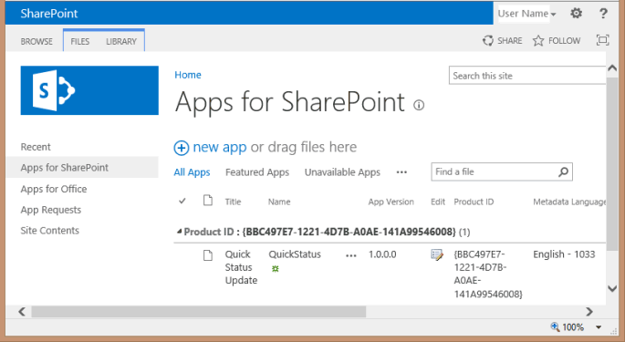
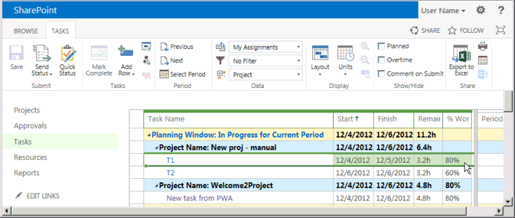

# <a name="create-a-sharepoint-hosted-project-server-add-in"></a>Crear un complemento de Project Server hospedado por SharePoint

De los tres tipos de aplicaciones que puedes crear para Project Online (hospedado automáticamente, hospedado por el proveedor y hospedado SharePoint), la aplicación hospedada en SharePoint es la más sencilla de crear e implementar. Una SharePoint hospedada por el proveedor no requiere autenticación de OAuth y no usa Azure ni requiere el mantenimiento de un sitio local para los recursos hospedados por el proveedor. La plantilla Aplicación para **SharePoint 2013** en Visual Studio es un marco conveniente para desarrollar aplicaciones que se pueden publicar y vender en la Tienda Office o implementarse en un catálogo de aplicaciones privado en SharePoint. 
  
En Project, el estado es un proceso en el que un miembro del equipo puede usar la página Tareas de Project Web App para enviar el estado de una tarea asignada, como el número de horas trabajadas cada día de una semana de trabajo en la tarea. El propietario de la asignación (normalmente el jefe de proyecto) puede aprobar o rechazar el estado. Si se aprueba el estado, Project vuelve a calcular la programación. La aplicación **QuickStatus** muestra tareas asignadas, donde el usuario puede actualizar rápidamente el porcentaje completado y enviar el estado de las asignaciones seleccionadas para su aprobación. Aunque la página Tareas de Project Web App tiene mucha más funcionalidad, la **aplicación QuickStatus** es un ejemplo que proporciona una interfaz simplificada. 
  
La aplicación **QuickStatus** es un ejemplo para desarrolladores; no está destinada a usarse en un entorno de producción. El objetivo principal es mostrar un ejemplo de desarrollo de aplicaciones para Project Online, no para crear una aplicación de estado totalmente funcional. Para obtener un mejor enfoque de los estados, consulte la recomendación de [Siguientes pasos](#pj15_StatusingApp_NextSteps).
  
Para obtener información general sobre el estado, vea [Progreso de la tarea](https://support.office.com/article/Find-information-about-Project-Server-2013-8b08a414-15a7-4076-b2db-c90d0214ea7f?ui=en-US&rs=en-US&ad=US#BKMK_TaskProgress). Para obtener más información acerca del desarrollo de complementos para SharePoint y Project server, vea [SharePoint Add-ins](https://msdn.microsoft.com/library/jj163230.aspx).

<a name="pj15_StatusingApp_Prerequisites"> </a>

## <a name="prerequisites-for-creating-an-app-for-project-server-2013"></a>Requisitos previos para crear una aplicación para Project Server 2013

Para desarrollar aplicaciones relativamente sencillas que se pueden implementar en Project Online o en una instalación local de Project Server 2013, puede usar Napa, que proporciona un entorno de desarrollo en línea. Para aplicaciones más complejas, modificar la cinta de opciones de Project Web App y facilitar la depuración durante el desarrollo, puede usar Visual Studio 2012 o Visual Studio 2013. Por ejemplo, con una instalación local, puede comprobar de forma manual las bases de datos de borrador para ver los cambios de la base de datos de Project Server. En este artículo se muestra cómo realizar el desarrollo de aplicaciones con Visual Studio.
  
El desarrollo de aplicaciones de Project Server con Visual Studio exige lo siguiente:
  
- Asegúrese de haber instalado los Service Pack y las actualizaciones de Windows más recientes en el equipo de desarrollo local. El sistema operativo puede ser Windows 7, Windows 8, Windows Server 2008 o Windows Server 2012.
    
- Debe tener instalado un equipo que tenga instalado SharePoint Server 2013 y Project Server 2013, donde el equipo esté configurado para el aislamiento de aplicaciones y la instalación local de aplicaciones. La instalación de prueba permite a Visual Studio instalar de forma temporal la aplicación para su depuración. Puede usar la instalación local de SharePoint y Project Server. Para obtener más información, vea [Configurar un entorno de](https://msdn.microsoft.com/library/fp179923%28Office.15%29.aspx)desarrollo local para aplicaciones para SharePoint .
    
   > [!NOTE]
   > Para una instalación local, configure un dominio de aplicación aislado  *antes*  de crear un catálogo de aplicaciones corporativas. 
  
- El equipo de desarrollo puede ser un equipo remoto que Office Developer Tools para Visual Studio 2012 instalado. Asegúrese de que ha instalado la versión más reciente; consulta la *sección Herramientas* de aplicaciones para Office y [SharePoint descargas.](https://msdn.microsoft.com/office/apps/fp123627.aspx)
    
- Compruebe que la Project web app que va a usar para el desarrollo y las pruebas sea accesible en el explorador.
    
Para obtener información acerca del uso de las herramientas en línea, vea Configurar un entorno para desarrollar aplicaciones para SharePoint [en Office 365](https://msdn.microsoft.com/library/fp161179.aspx). Para obtener un tutorial sobre cómo crear una aplicación sencilla para Project Server que usa las herramientas en línea, consulte la serie de blogs EPMSource, [Building your first Project Server app](https://epmsource.com/2012/11/20/building-your-first-project-server-app-part-zerothe-introduction/).

<a name="pj15_StatusingApp_UsingVisualStudio"> </a>

## <a name="using-visual-studio-to-create-a-project-server-app"></a>Empleo de Visual Studio para crear una aplicación de Project Server

Office Developer Tools for Visual Studio 2012 incluye una plantilla para SharePoint aplicaciones que se pueden usar con Project Server 2013. Al crear una solución de aplicación, esta incluye los siguientes archivos para el código personalizado:
  
- **AppManifest.xml** incluye la configuración del título de la aplicación, el ámbito de solicitud de permisos y otras propiedades. El procedimiento 1 incluye los pasos para establecer las propiedades mediante el diseñador de manifiestos. 
    
- **Default.aspx** en la carpeta Páginas de la página principal de la aplicación. El procedimiento 2 muestra cómo agregar contenido HTML5 para la aplicación **QuickStatus**. 
    
- **App.js** en la carpeta Scripts es el archivo principal del código JavaScript personalizado. El procedimiento 3 explica el código JavaScript para la **aplicación QuickStatus.** 
    
   Si agrega controles comerciales como una cuadrícula basada en jQuery o un selector de fechas, puede agregar referencias a archivos JavaScript adicionales en el archivo Default.aspx.
    
- **App.css** en la carpeta Contenido es el archivo principal de los estilos CSS3 personalizados. Los procedimientos 2 y 3 incluyen información sobre los estilos de las hojas de estilos en cascada (CSS) de la aplicación **QuickStatus**. Puede agregar referencias a archivos CSS adicionales en el archivo Default.aspx. 
    
- **AppIcon.png** en la carpeta Imágenes es el icono de 96 x 96 que la aplicación muestra en la Tienda Office o en el catálogo de aplicaciones. 
    
Para modificar la cinta Project Web App, puede agregar una acción personalizada de cinta de opciones. La sección [Código de ejemplo de la aplicación QuickStatus](#pj15_StatusingApp_Example) incluye el código completo de los archivos Default.aspx, App.js, App.css, Elements.xml y AppManifest.xml modificados. 
  
### <a name="procedure-1-to-create-an-app-project-in-visual-studio"></a>Procedimiento 1. Crear un proyecto de aplicación en Visual Studio

1. Ejecute Visual Studio 2012 como administrador y, a continuación, seleccione **Nuevo Project** en la página Inicio. 
    
2. En el cuadro de diálogo **Nuevo proyecto**, expanda los nodos **Plantillas**, **Visual C#** y **Office o SharePoint** y seleccione **Aplicaciones**. Use **.NET Framework 4.5** predeterminado en la lista desplegable del marco de destino en la parte superior del panel central y, a continuación, seleccione **Aplicación de SharePoint 2013** (ilustración 1). 
    
3. En el **campo Nombre,** escriba QuickStatus, vaya a la ubicación donde desea guardar la aplicación y, a continuación, elija **Aceptar**.
    
   **Ilustración 1. Creación de una aplicación de Project Server en Visual Studio**

   
  
4. En el cuadro de diálogo **Nueva aplicación para SharePoint**, rellene los tres campos siguientes: 
    
   - En el cuadro de texto superior, escriba el nombre que desea que la aplicación muestre en Project Web App. Por ejemplo, escriba Actualización de estado rápida.
    
   - Para que el sitio se use para la depuración, escriba la dirección URL de la Project web App. Por ejemplo, escriba  `https://ServerName/ProjectServerName`  _(reemplazando ServerName_ y  _ProjectServerName_ por sus propios valores) y, a continuación, elija **Validar**. Si todo va bien, Visual Studio muestra **Conexión correcta**. Si recibe un mensaje de error, asegúrese de que la dirección URL de Project Web App es correcta y de que el equipo Project Server está configurado para el aislamiento de aplicaciones y la instalación local de aplicaciones. Para obtener más información, consulta la sección Requisitos previos para crear una aplicación [para Project Server 2013.](#pj15_StatusingApp_Prerequisites) 
    
   - En la lista desplegable **¿Cómo desea hospedar la aplicación para SharePoint?**, seleccione **Hospedada por SharePoint**.
    
   > [!CAUTION]
   > Si por error selecciona el tipo de proyecto predeterminado **Hospedada por el proveedor**, Visual Studio crea dos proyectos en la solución: un proyecto **QuickStatus** y un proyecto **QuickStatusWeb**. Si ve dos proyectos, elimine esa solución y vuelva a empezar. 
  
5. Seleccione **Aceptar** para crear la solución **QuickStatus**, el proyecto **QuickStatus** y los archivos predeterminados. 
    
6. Abra la vista del diseñador de manifiestos (por ejemplo, haga doble clic en el archivo AppManifest.xml). En la pestaña **General**, el cuadro de texto **Título** debería mostrar el nombre de la aplicación que escribió en el paso 4. Seleccione la pestaña **Permisos** para agregar las siguientes solicitudes de permisos para la aplicación (ilustración 2): 
    
   - En la primera fila de la lista **Solicitudes de permiso**, en la columna **Ámbito**, seleccione **Estado** en la lista desplegable. En la columna **Permiso**, seleccione **SubmitStatus**.
    
   - Agregue una fila si **Ámbito** es **Varios proyectos** y **Permiso** es **Read**.
    
   **Ilustración 2. Establecimiento del ámbito de permisos de una aplicación de estado**

   
  
La **aplicación QuickStatus** permite a un usuario de Project Web App leer las asignaciones de ese usuario desde varios proyectos, cambiar el porcentaje de asignación completado y enviar la actualización. Los demás ámbitos de solicitud de permisos mostrados en la lista desplegable de la ilustración 2 no son necesarios para esta aplicación. Los ámbitos de solicitud de permisos son los permisos que la aplicación solicita en nombre del usuario. Si el usuario no tiene esos permisos en Project Web App, la aplicación no se ejecuta. Una aplicación puede tener varios ámbitos de solicitud de permisos, incluidos aquellos para otros permisos de SharePoint, pero debería tener el mínimo necesario para la funcionalidad de la aplicación. Estos son los ámbitos de solicitud de permisos relacionados con Project Server: 

- **Enterprise recursos:** permisos del administrador de recursos para leer o escribir información sobre otros Project web app.
    
- **Varios proyectos**: leer o escribir en más de un proyecto donde el usuario tiene los permisos solicitados.
    
- **Project:** requiere que el usuario de la aplicación tenga permisos de administrador para Project Web App.
    
- **Informes:** lea el **servicio ProjectData** OData para Project Web App (solo requiere permiso de inicio de sesión para Project Web App). 
    
- **Proyecto único**: leer o escribir en un proyecto donde el usuario tiene los permisos solicitados.
    
- **Estado**: enviar actualizaciones de los estados de las asignaciones, como horas trabajadas, porcentaje completado y nuevas asignaciones.
    
- **Flujo de trabajo**: si el usuario tiene permiso para ejecutar flujos de trabajo de Project Server, la aplicación se ejecuta con permisos elevados para el flujo de trabajo.
    
Para obtener más información acerca de los ámbitos de solicitud de permisos para Project Server 2013, vea la sección aplicaciones de *Project* en Actualizaciones para desarrolladores en [Project 2013](updates-for-developers-in-project-2013.md) y Permisos de aplicación [en SharePoint 2013](https://msdn.microsoft.com/library/fp142383.aspx).


<a name="pj15_StatusingApp_HTML"> </a>

### <a name="creating-the-html-content-for-the-quickstatus-app"></a>Creación de contenido HTML para la aplicación QuickStatus

Antes de empezar a codificar el contenido HTML, diseñe la interfaz de usuario y la experiencia de usuario de la aplicación QuickStatus (la ilustración 3 muestra un ejemplo de la página completada). Un diseño también puede incluir un esquema de las funciones de JavaScript que interactúan con el código HTML. Para obtener información general, vea Diseño de experiencia de usuario [para aplicaciones en SharePoint 2013](https://msdn.microsoft.com/library/fp179934.aspx).
  
**Ilustración 3. Diseño de la página de la aplicación QuickStatus**


  
La aplicación muestra el nombre para mostrar en la parte superior, que es el valor del elemento **Title** de AppManifest.xml. 
  
De forma predeterminada, la página emplea HTML5. A continuación se enumeran los elementos HTML estándar de los objetos principales de la IU que la aplicación **QuickStatus** contiene en el cuerpo de la página: 
  
- Un elemento **form** contiene todos los demás elementos de interfaz de usuario. 
    
- Un elemento **fieldset** crea un contenedor y un borde para la tabla de asignaciones; el elemento secundario **legend** proporciona una etiqueta para el contenedor. 
    
- Un elemento **table** incluye un título y solo un encabezado de tabla. Las funciones de JavaScript cambian el título de tabla y agregan filas para las asignaciones. 
    
   > [!NOTE]
   > Para paginar y ordenar fácilmente, una aplicación de producción probablemente emplearía un control de cuadrícula comercial basado en jQuery en lugar de una tabla. 
  
   La tabla incluye columnas para el nombre del proyecto, el nombre de las tareas con una casilla de verificación, el trabajo real, el porcentaje completado, el trabajo restante y la fecha de finalización de la asignación. Las funciones de JavaScript crean la casilla y el campo de entrada de texto para el porcentaje completado de cada tarea.
    
- Un elemento **input** para que un cuadro de texto establezca el porcentaje completado de todas las asignaciones seleccionadas. 
    
- Un elemento **button** envía los cambios de estado. 
    
- Un elemento **button** actualiza la página. 
    
- Un **elemento** button sale de la aplicación y vuelve a la página Tareas en Project Web App. 
    
Los elementos de cuadro de texto y botón inferiores están en elementos **div**, de modo que CSS pueda administrar con facilidad la posición y el aspecto de los objetos de la IU. Una función De JavaScript agrega un párrafo en la parte inferior de la página que contiene los resultados del éxito o error de la actualización de estado. 
  
### <a name="procedure-2-to-create-the-html-content"></a>Procedimiento 2. Crear el contenido HTML

1. En Visual Studio, abra el archivo Default.aspx.
    
   El archivo incluye dos **elementos asp:Content:** el elemento con el atributo se agrega dentro del encabezado de página y el elemento con el atributo se coloca dentro del elemento de  `ContentPlaceHolderID="PlaceHolderAdditionalPageHead"` cuerpo de  `ContentPlaceHolderID="PlaceHolderMain"` **la** página. 
    
2. En el control del encabezado de página, agregue una referencia al archivo `<asp:Content ContentPlaceHolderID="PlaceHolderAdditionalPageHead" runat="server">` PS.js en el Project servidor. Para las pruebas y la depuración puede usar PS.debug.js. 
    
   ```HTML
     <script type="text/javascript" src="/_layouts/15/ps.debug.js"></script>
   ```

   La infraestructura de la aplicación usa el `/_layouts/15/` directorio virtual para el SharePoint en IIS. El archivo físico es  `%ProgramFiles%\Common Files\Microsoft Shared\Web Server Extensions\15\TEMPLATE\LAYOUTS\PS.debug.js` .
    
   > [!NOTE]
   > Antes de implementar la aplicación para el uso de producción, quita  `.debug` de las referencias de script para mejorar el rendimiento. 
  
3. En el control del cuerpo de la página, elimine el elemento div generado y, a continuación, agregue el `<asp:Content ContentPlaceHolderID="PlaceHolderMain" runat="server">` código HTML para los objetos de la interfaz de usuario.  El elemento **table** solo contiene una fila de encabezado. La columna **Nombre de tarea** incluye un control de entrada de casilla de verificación. El texto del elemento **caption** se sustituye por la devolución de llamada **onGetUserNameSuccess** de la función **getUserInfo** del archivo App.js. 
    
    ```HTML
    <form>
        <fieldset>
        <legend>Select assigned tasks</legend>
        <table id="assignmentsTable">
            <caption id="tableCaption">Replace caption</caption>
            <thead>
            <tr id="headerRow">
                <th>Project name</th>
                <th><input type="checkbox" id="headercheckbox" checked="checked" />Task name</th>
                <th>Actual work</th>
                <th>% complete</th>
                <th>Remaining work</th>
                <th>Due date</th>
            </tr>
            </thead>
        </table>
        </fieldset>
        <div id="inputPercentComplete" >
        Set percent complete for all selected assignments, or leave this
        <br /> field blank and set percent complete for individual assignments: 
        <input type="text" name="percentComplete" id="pctComplete" size="4"  maxlength="4" />
        </div>
        <div id="submitResult">
        <p><button id="btnSubmitUpdate" type="button" class="bottomButtons" ></button></p>
        <p id="message"></p>
        </div>
        <div id="refreshPage">
        <p><button id="btnRefresh" type="button" class="bottomButtons" >Refresh</button></p>
        </div>
        <div id="exitPage">
        <p><button id="btnExit" type="button" class="bottomButtons" >Exit</button></p>
        </div>
    </form>
    ```

4. En el archivo App.css, agregue el código CSS para la posición y el aspecto de los elementos de la IU. Para ver el código CSS completo de la aplicación **QuickStatus**, consulte la sección [Código de ejemplo de la aplicación QuickStatus](#pj15_StatusingApp_Example). 
    
El procedimiento 3 agrega las funciones de JavaScript para leer las asignaciones y crear las filas de tabla, y para cambiar y actualizar el porcentaje de asignación completado. Los pasos reales son más iterativos en el desarrollo de una aplicación, donde se crea alternativamente parte del código HTML, se agregan y prueban estilos relacionados y funciones de JavaScript, se modifica o se agrega más código HTML y, a continuación, se repite el proceso.

<a name="pj15_StatusingApp_JavaScript"> </a>

### <a name="creating-the-javascript-functions-for-the-quickstatus-app"></a>Creación de las funciones JavaScript para la aplicación QuickStatus

La plantilla de Visual Studio de una aplicación de SharePoint incluye el archivo App.js, que contiene el código de inicialización predeterminado que obtiene el contexto de cliente de SharePoint y demuestra las acciones básicas get y set de la página de la aplicación. El espacio de nombres JavaScript para la SharePoint de la biblioteca de SP.js cliente es **SP**. Dado que una aplicación de Project Server usa la biblioteca PS.js, la aplicación emplea el espacio de nombres **PS** para obtener el contexto de cliente y obtener acceso al JSOM de Project Server. 
  
Entre las funciones de JavaScript de **la aplicación QuickStatus** se incluyen las siguientes: 
  
- El controlador de eventos **ready** del documento se ejecuta al instanciar el modelo de objetos del documento (DOM). El controlador de eventos **ready** realiza los siguientes cuatro pasos: 
    
    1. Inicializa la variable global **projContext** con el contexto de cliente del JSOM de Project Server y la variable global **pwaWeb**. 
        
    2. Llama a la función **getUserInfo** para inicializar la variable global **projUser**. 
        
    3. Llama a la función **getAssignments**, que obtiene datos de asignación concretos del usuario. 
        
    4. Enlaza los controladores de eventos clic a la casilla de verificación del encabezado de la tabla y a las casillas de verificación de cada fila de la tabla. Los controladores de eventos clic administran el atributo **checked** de las casillas de verificación cuando el usuario activa o desactiva cualquier casilla de la tabla. 
    
- Si la función **getAssignments** es correcta, llama a la función **onGetAssignmentsSuccess**. Esa función inserta una fila en la tabla para cada asignación, inicializa los controles HTML de cada fila y, a continuación, inicializa las propiedades del botón inferior. 
    
- El controlador de eventos **onClick** del botón **Actualizar** llama a la función **updateAssignments**. Esa función obtiene el valor de porcentaje completado que se aplica a cada asignación seleccionada; si el cuadro de texto de porcentaje completado está vacío, la función obtiene el porcentaje completado de cada asignación seleccionada de la tabla. Entonces, la función **updateAssignments** guarda las actualizaciones de estado y las envía y escribe un mensaje sobre los resultados en la parte inferior de la página. 
    
### <a name="procedure-3-to-create-the-javascript-functions"></a>Procedimiento 3. Crear las funciones JavaScript

1. En Visual Studio, abra el archivo App.js y elimine todo el contenido del mismo.
    
2. Agregue las variables globales y el controlador de eventos **ready** del documento. Al objeto **document** se obtiene acceso mediante una función jQuery. 
    
   El controlador de eventos clic de la casilla de verificación del encabezado de la tabla establece el estado activado de las casillas de fila. Si todas las casillas de fila están activadas o desactivadas, el controlador de eventos clic de las casillas de fila establece el estado activado de la casilla de encabezado. El controlador de eventos clic además establece el mensaje de resultados en la parte inferior de la página en una cadena vacía.
    
   ```js
    var projContext;
    var pwaWeb;
    var projUser;
    // This code runs when the DOM is ready and creates a ProjectContext object.
    // The ProjectContext object is required to use the JSOM for Project Server.
    $(document).ready(function () {
        projContext = PS.ProjectContext.get_current();
        pwaWeb = projContext.get_web();
        getUserInfo();
        getAssignments();
        // Bind a click event handler to the table header check box, which sets the row check boxes
        // to the checked state of the header check box, and sets the results message to an empty string.
        $('#headercheckbox').live('click', function (event) {
            $('input:checkbox:not(#headercheckbox)').attr('checked', this.checked);
            $get("message").innerText = "";
        });
        // Bind a click event handler to the row check boxes. If any row check box is cleared, clear
        // the header check box. If all of the row check boxes are selected, select the header check box.
        $('input:checkbox:not(#headercheckbox)').live('click', function (event) {
            var isChecked = true;
            $('input:checkbox:not(#headercheckbox)').each(function () {
                if (this.checked == false) isChecked = false;
                $get("message").innerText = "";
            });
            $("#headercheckbox").attr('checked', isChecked);
        });
    });
   ```

3. Agregue la función **getUserInfo**, que llama a **onGetUserNameSuccess** si la consulta es correcta. La función **onGetUserNameSuccess** sustituye el contenido del párrafo **caption** por un título de tabla que incluye el nombre de usuario. 
    
   ```js
        // Get information about the current user.
        function getUserInfo() {
            projUser = pwaWeb.get_currentUser();
            projContext.load(projUser);
            projContext.executeQueryAsync(onGetUserNameSuccess,
                // Anonymous function to execute if getUserInfo fails.
                function (sender, args) {
                    alert('Failed to get user name. Error: ' + args.get_message());
            });
        } 
        // This function is executed if the getUserInfo call is successful.
        function onGetUserNameSuccess() {
            var prefaceInfo = 'Assignments for ' + projUser.get_title();
            $('#tableCaption').text(prefaceInfo);
        }
   ```

4. Agregue la función **getAssignments**, que llama a **onGetAssignmentsSuccess** (paso 5) si la consulta de asignación es correcta. La opción **Include** limita la consulta a devolver únicamente los campos especificados. 
    
   ```js
    // Get the collection of assignments for the current user.
    function getAssignments() {
        assignments = PS.EnterpriseResource.getSelf(projContext).get_assignments();
        // Register the request that you want to run on the server. The optional "Include" parameter 
        // requests only the specified properties for each assignment in the collection.
        projContext.load(assignments,
            'Include(Project, Name, ActualWork, ActualWorkMilliseconds, PercentComplete, RemainingWork, Finish, Task)');
        // Run the request on the server.
        projContext.executeQueryAsync(onGetAssignmentsSuccess,
            // Anonymous function to execute if getAssignments fails.
            function (sender, args) {
                alert('Failed to get assignments. Error: ' + args.get_message());
            });
    }
   ```

5. Agregue la función **onGetAssignmentsSuccess**, que agrega una fila para cada asignación a la tabla. La variable **prevProjName** se usa para determinar si una fila es para otro proyecto. Si es así, el nombre del proyecto se muestra en negrita; si no, el nombre del proyecto se establece en una cadena vacía. 
    
   > [!NOTE]
   > El JSOM no incluye las **propiedades TimeSpan** que incluye el CSOM, como **ActualWorkTimeSpan**. En su lugar, el JSOM usa propiedades para el número de milisegundos, como la propiedad [PS.StatusAssignment.actualWorkMilliseconds](https://msdn.microsoft.com/library/736bce1e-f734-0efe-6c5f-e0e891ab00ef%28Office.15%29.aspx). El método para obtener esa propiedad es **obtener \_ actualWorkMilliseconds**, que devuelve un valor entero. > El **get_actualWork** devuelve una cadena como "3h". Podría usar cualquier valor en la aplicación **QuickStatus**, pero mostrarlo de forma diferente. La consulta de las asignaciones incluye ambas propiedades, de modo que puede probar el valor durante la depuración. Si quita la variable **actualWork**, también puede quitar la propiedad **ActualWork** de la consulta de las asignaciones. 
  
   Por último, la función **onGetAssignmentsSuccess** inicializa el botón **Actualizar** y el botón **Actualizar** con controladores de eventos clic. El valor de texto del botón **Actualizar** también se podría establecer en el código HTML. 
    
   ```js
        // Get the enumerator, iterate through the assignment collection, 
        // and add each assignment to the table.
        function onGetAssignmentsSuccess(sender, args) {
            if (assignments.get_count() > 0) {
                var assignmentsEnumerator = assignments.getEnumerator();
                var projName = "";
                var prevProjName = "3D2A8045-4920-4B31-B3E7-9D0C5195FC70"; // Any unique name.
                var taskNum = 0;
                var chkTask = "";
                var txtPctComplete = "";
                // Constants for creating input controls in the table.
                var INPUTCHK = '<input type="checkbox" class="chkTask" checked="checked" id="chk';
                var LBLCHK = '<label for="chk';
                var INPUTTXT = '<input type="text" size="4"  maxlength="4" class="txtPctComplete" id="txt';
                while (assignmentsEnumerator.moveNext()) {
                    var statusAssignment = assignmentsEnumerator.get_current();
                    projName = statusAssignment.get_project().get_name();
                    // Get an integer, such as 3600000.
                    var actualWorkMilliseconds = statusAssignment.get_actualWorkMilliseconds(); 
                    // Get a string, such as "1h". Not used here.
                    var actualWork = statusAssignment.get_actualWork();
                    if (projName === prevProjName) {
                        projName = "";
                    }
                    prevProjName = statusAssignment.get_project().get_name();
                    // Create a row for the assignment information.
                    var row = assignmentsTable.insertRow();
                    taskNum++;
                    // Create an HTML string with a check box and task name label, for example:
                    // <input type="checkbox" class="chkTask" checked="checked" id="chk1" /> <label for="chk1">Task 1</label>
                    chkTask = INPUTCHK + taskNum + '" /> ' + LBLCHK + taskNum + '">' 
                        + statusAssignment.get_name() + '</label>';
                    txtPctComplete = INPUTTXT + taskNum + '" />';
                    // Insert cells for the assignment properties.
                    row.insertCell().innerHTML = '<strong>' + projName + '</strong>';
                    row.insertCell().innerHTML = chkTask;
                    row.insertCell().innerText = actualWorkMilliseconds / 3600000 + 'h';
                    row.insertCell().innerHTML = txtPctComplete;
                    row.insertCell().innerText = statusAssignment.get_remainingWork();
                    row.insertCell().innerText = statusAssignment.get_finish();
                    // Initialize the percent complete cell.
                    $get("txt" + taskNum).innerText = statusAssignment.get_percentComplete() + '%'
                }
            }
            else {
                $('p#message').attr('style', 'color: #0f3fdb');     // Blue text.
                $get("message").innerText = projUser.get_title() + ' has no assignments'
            }
            // Initialize the button properties.
            $get("btnSubmitUpdate").onclick = function() { updateAssignments(); };
            $get("btnSubmitUpdate").innerText = 'Update';
            $get('btnRefresh').onclick = function () { window.location.reload(true); };
            $get('btnExit').onclick = function () { exitToPwa(); };
        }
   ```

6. Agregue el controlador de eventos clic **updateAssignments** del botón **Actualizar**. Si el usuario cambia un valor para el porcentaje completado de una tarea o agrega un valor en el cuadro de texto **percentComplete**, dicho valor podría especificarse en varios formatos, como "60", "60%" o "60 %". El método **getNumericValue** devuelve el valor numérico del texto de entrada. 
    
   > [!NOTE]
   > En una aplicación diseñada para uso en producción, los valores de entrada de la información numérica deben incluir validación de campos y comprobación de errores adicional. 
  
   El ejemplo **updateAssignments** incluye alguna comprobación de errores básica y muestra información en el párrafo **message** de la parte inferior de la página: verde si la consulta de actualización es correcta y roja si hay un error de entrada o la consulta de actualización no es correcta. 
    
   Antes de usar el método **submitAllStatusUpdates**, la aplicación tiene que guardar las actualizaciones en el servidor mediante el método **PS.StatusAssignmentCollection.update**. 
    
   ```js
        // Update all checked assignments. If the bottom percent complete field is blank,
        // use the value in the % complete field of each selected row in the table.
        function updateAssignments() {
            // Get percent complete from the bottom text box.
            var pctCompleteMain = getNumericValue($('#pctComplete').val()).trim();
            var pctComplete = pctCompleteMain;
            var assignmentsEnumerator = assignments.getEnumerator();
            var taskNum = 0;
            var taskRow = "";
            var indexPercent = "";
            var doSubmit = true;
            while (assignmentsEnumerator.moveNext()) {
                var pctCompleteRow = "";
                taskRow = "chk" + ++taskNum;
                if ($get(taskRow).checked) {
                    var statusAssignment = assignmentsEnumerator.get_current();
                    if (pctCompleteMain === "") {
                        // Get percent complete from the text box field in the table row.
                        pctCompleteRow = getNumericValue($('#txt' + taskNum).val());
                        pctComplete = pctCompleteRow;
                    }
                    // If both percent complete fields are empty, show an error.
                    if (pctCompleteMain === "" && pctCompleteRow === "") {
                        $('p#message').attr('style', 'color: #e11500');     // Red text.
                        $get("message").innerHTML =
                            '<b>Error:</b> Both <i>Percent complete</i> fields are empty, in row '
                            + taskNum
                            + ' and in the bottom textbox.<br/>One of those fields must have a valid percent.'
                            + '<p>Please refresh the page and try again.</p>';
                        doSubmit = false;
                        taskNum = 0;
                        break;
                    }
                    if (doSubmit) statusAssignment.set_percentComplete(pctComplete);
                }
            } 
            // Save and submit the assignment updates.
            if (doSubmit) {
                assignments.update();
                assignments.submitAllStatusUpdates();
                projContext.executeQueryAsync(function (source, args) {
                    $('p#message').attr('style', 'color: #0faa0d');     // Green text.
                    $get("message").innerText = 'Assignments have been updated.';
                }, function (source, args) {
                    $('p#message').attr('style', 'color: #e11500');     // Red text.
                    $get("message").innerText = 'Error updating assignments: ' + args.get_message();
                });
            }
        }
        // Get the numeric part for percent complete, from a string. For example, with "20 %", return "20".
        function getNumericValue(pctComplete) {
            pctComplete = pctComplete.trim();
            pctComplete = pctComplete.replace(/ /g, "");    // Remove interior spaces.
            indexPercent = pctComplete.indexOf('%', 0);
            if (indexPercent > -1) pctComplete = pctComplete.substring(0, indexPercent);
            return pctComplete;
        }
   ```

7. Agregue la **función exitToPwa,** que usa el parámetro de cadena de consulta **SPHostUrl** para la dirección URL del sitio Project web App. Para volver a la página Tareas,  `"/Tasks.aspx"` anexe la dirección URL. Por ejemplo, la variable **spHostUrl** se establecería en  `https://ServerName/ProjectServerName/Tasks.aspx` .
    
   La función **getQueryStringParameter** divide la dirección URL de la página **QuickStatus** para extraer y devolver el parámetro especificado en las opciones de la dirección URL. El siguiente es un ejemplo del valor **document.URL** del documento **QuickStatus** (todo en una línea): 
    
   ```HTML
    https://app-ef98082fa37e3c.servername.officeapps.selfhost.corp.microsoft.com/pwa/
        QuickStatus/Pages/Default.aspx
        ?SPHostUrl=https%3A%2F%2Fsphvm%2D85178%2Fpwa
        &SPLanguage=en%2DUS
        &SPClientTag=1
        &SPProductNumber=15%2E0%2E4420%2E1022
        &SPAppWebUrl=https%3A%2F%2Fapp%2Def98082fa37e3c%2Eservername
            %2Eofficeapps%2Eselfhost%2Ecorp%2Emicrosoft%2Ecom%2Fpwa%2FQuickStatus
   ```

   Para la dirección URL anterior, la **función getQueryStringParameter** devuelve el valor de cadena de consulta **SPHostUrl,**  `https://ServerName/pwa` . 
    
   ```js
        // Exit the QuickStatus page and go back to the Tasks page in Project Web App.
        function exitToPwa() {
            // Get the SharePoint host URL, which is the top page of PWA, and add the Tasks page.
            var spHostUrl = decodeURIComponent(getQueryStringParameter('SPHostUrl'))
                            + "/Tasks.aspx";
            // Set the top window for the QuickStatus IFrame to the Tasks page.
            window.top.location.href = spHostUrl;
        }
        // Get a specified query string parameter from the {StandardTokens} URL option string.
        function getQueryStringParameter(urlParameterKey) {
            var docUrl = document.URL;
            var params = docUrl.split('?')[1].split('&');
            for (var i = 0; i < params.length; i++) {
                var theParam = params[i].split('=');
                if (theParam[0] == urlParameterKey)
                    return decodeURIComponent(theParam[1]);
            }
        }
   ```

Si publicas la aplicación **QuickStatus** en este momento y la agregas Project Project Web App, la aplicación se puede ejecutar desde la página Contenidos del sitio, pero no está fácilmente disponible para los usuarios. Para ayudar a los usuarios a encontrar y ejecutar la aplicación, puede agregar un botón para ella a la cinta de opciones de la página Tareas. El procedimiento 4 muestra cómo agregar una acción personalizada de cinta de opciones. 

<a name="pj15_StatusingApp_ribbon"> </a>

### <a name="adding-a-ribbon-custom-action"></a>Adición de una acción personalizada de cinta

Las pestañas, grupos y controles de la cinta de opciones de Project Web App se especifican en el archivo pwaribbon.xml, que se instala en el directorio del equipo que ejecuta `[Program Files]\Common Files\Microsoft Shared\Web Server Extensions\15\TEMPLATE\FEATURES\PWARibbon\listtemplates` Project Server. Para ayudar a diseñar acciones personalizadas para la cinta Project Web App, la descarga del SDK de Project 2013 incluye una copia de pwaribbon.xml. 
  
Project Web App usa diferentes definiciones de cinta de opciones para la página Tareas, en función de si la instancia de Project Web App usa el modo de entrada única que permite a los usuarios especificar valores tanto para el parte de horas como para el estado de la tarea. Si tiene permisos administrativos para Project Web App, para determinar el modo de entrada, elija **PWA Configuración** en el menú de configuración desplegable de la esquina superior derecha de la página. En la página Configuración de PWA, seleccione **Configuración y valores predeterminados del parte de horas** y luego mire la casilla de verificación **Modo de entrada único** en la parte inferior de la página. 
  
Si el modo de entrada único está desactivado, la cinta de opciones de la página Tareas es definida por la región Mi trabajo de pwaribbon.xml: 
  
```XML
   <!-- REGION My Work Ribbon-->
   <CustomAction
      Id="Ribbon.ContextualTabs.MyWork"
      . . .
```

Si el modo de entrada único está activado, la cinta de opciones de la página Tareas es definida por la región Modo vinculado de pwaribbon.xml: 
  
```XML
   <!-- REGION Tied Mode Ribbon-->
   <CustomAction
      Id="Ribbon.ContextualTabs.TiedMode"
      . . .
```

Aunque los grupos y los controles de cada región parecen similares, un control del modo vinculado puede llamar a una función distinta que el mismo control del modo no vinculado. El procedimiento 4 muestra cómo agregar un control de botón para la aplicación **QuickStatus** si el modo de entrada único está desactivado (la casilla de verificación **Modo de entrada único** está desactivada). 
  
> [!NOTE]
> Para obtener información general sobre cómo agregar acciones personalizadas a una cinta de opciones o a un menú de una aplicación SharePoint, vea [Create custom actions to deploy with apps for SharePoint](https://msdn.microsoft.com/library/jj163954.aspx). 
  
### <a name="procedure-4-to-add-a-ribbon-custom-action-to-the-tasks-page"></a>Procedimiento 4. Agregar una acción personalizada de cinta de opciones a la página Tareas

1. Examine la cinta de opciones de la página Tareas en Project Web App. Seleccione la pestaña **TAREAS** en la cinta de opciones y planee cómo modificarla. Hay siete grupos, como **Enviar**, **Tareas** y **Periodo**. El grupo **Enviar** tiene dos controles, un botón **Guardar** y un menú desplegable **Enviar estado**. Puede agregar un control en cualquier ubicación de un grupo, agregar un grupo con un control nuevo en cualquier ubicación de la pestaña **TAREAS** o agregar otra pestaña de la cinta de opciones que tenga grupos y controles personalizados. En este ejemplo, se agrega un tercer botón al grupo **Enviar**, botón que invoca a la dirección URL de la aplicación **QuickStatus**. 
    
2. En el panel **Explorador de soluciones** de Visual Studio, haga clic con el botón secundario en el proyecto **QuickStatus** y luego agregue un nuevo elemento. En el cuadro de diálogo **Agregar nuevo elemento**, seleccione **Acción personalizada de cinta** (ilustración 4). Por ejemplo, asigne un nombre a la acción personalizada RibbonQuickStatusAction y, a continuación, elija **Agregar**.
    
   **Ilustración 4. Adición de una acción personalizada de cinta de opciones**

   
  
3. En la primera página del asistente **Crear acción personalizada para cinta**, deje seleccionada la opción **Web host**, seleccione **Ninguno** en la lista desplegable del ámbito de acción personalizada y luego seleccione **Siguiente** (ilustración 5). Los elementos de las listas desplegables son relevantes para SharePoint, no para Project Server. Se sustituirá la mayor parte del XML generado para la acción personalizada de modo que se aplique a Project Server. 
    
   **Ilustración 5. Especificación de propiedades para la acción personalizada de la cinta de opciones**

   
  
4. En la página siguiente del asistente **Crear acción personalizada para cinta**, deje todos los valores predeterminados de la configuración y luego seleccione **Finalizar** (ilustración 6). Visual Studio crea la carpeta **RibbonQuickStatusAction**, que contiene un archivo Elements.xml. 
    
   **Ilustración 6. Especificación de la configuración de un control de botón**

   
  
5. Modifique el código predeterminado generado en el archivo Elements.xml para la acción personalizada de la cinta de opciones. Este es el código XML predeterminado:
    
   ```XML
    <?xml version="1.0" encoding="utf-8"?>
    <Elements xmlns="http://schemas.microsoft.com/sharepoint/">
        <CustomAction Id="21ea3aaf-79e5-4aac-9479-8eef14b4d9df.RibbonQuickStatusAction"
                    Location="CommandUI.Ribbon"
                    Sequence="10001"
                    Title="Invoke &apos;RibbonQuickStatusAction&apos; action">
        <CommandUIExtension>
            <!-- 
            Update the UI definitions below with the controls and the command actions
            that you want to enable for the custom action.
            -->
            <CommandUIDefinitions>
            <CommandUIDefinition Location="Ribbon.ListItem.Actions.Controls._children">
                <Button Id="Ribbon.ListItem.Actions.RibbonQuickStatusActionButton"
                        Alt="Request RibbonQuickStatusAction"
                        Sequence="100"
                        Command="Invoke_RibbonQuickStatusActionButtonRequest"
                        LabelText="Request RibbonQuickStatusAction"
                        TemplateAlias="o1"
                        Image32by32="_layouts/15/images/placeholder32x32.png"
                        Image16by16="_layouts/15/images/placeholder16x16.png" />
            </CommandUIDefinition>
            </CommandUIDefinitions>
            <CommandUIHandlers>
            <CommandUIHandler Command="Invoke_RibbonQuickStatusActionButtonRequest"
                                CommandAction="~appWebUrl/Pages/Default.aspx"/>
            </CommandUIHandlers>
        </CommandUIExtension >
        </CustomAction>
    </Elements>
   ```

   1. En el elemento **CustomAction**, elimine los atributos **Sequence** y **Title**. 
    
   2. Para agregar un control al grupo **Enviar,** busque el primer grupo de la colección en el archivo pwaribbon.xml, que es el  `Ribbon.ContextualTabs.MyWork.Home.Groups` elemento que comienza,  `<Group Id="Ribbon.ContextualTabs.MyWork.Home.Page" Command="PageGroup" Sequence="10" Title="$Resources:pwafeatures,PAGE_PDP_CM_SUBMIT"` . Para agregar un control secundario al grupo **Enviar**, el siguiente código muestra el atributo **Location** correcto del elemento **CommandUIDefinition** del archivo Elements.xml: 
    
      ```XML
        <CommandUIDefinitions>
          <CommandUIDefinition Location="Ribbon.ContextualTabs.MyWork.Home.Page.Controls._children">
             . . .
          </CommandUIDefinition>
        </CommandUIDefinitions>
      ```

   3. Cambie los valores de atributo del elemento secundario **Button** de este modo: 
    
       ```XML
            <Button Id="Ribbon.ContextualTabs.MyWork.Home.Page.QuickStatus"
                    Alt="Quick Status app"
                    Sequence="30"
                    Command="Invoke_QuickStatus"
                    LabelText="Quick Status"
                    TemplateAlias="o1"
                    Image16by16="_layouts/15/1033/images/ps16x16.png" 
                    Image16by16Left="-80"
                    Image16by16Top="-144"
                    Image32by32="_layouts/15/1033/images/ps32x32.png" 
                    Image32by32Left="-32"
                    Image32by32Top="-288" 
                    ToolTipTitle="QuickStatus"
                    ToolTipDescription="Run the QuickStatus app" />
       ```

       - Para convertir el botón en el tercer control del grupo, el atributo **Sequence** puede ser cualquier número mayor que el valor del control De estado de envío existente (que es `Sequence="20"` un elemento **FlyoutAnchor** en pwaribbon.xml).  Por convención, los números de secuencia de grupos y controles son , lo que permite insertar elementos  `10, 20, 30, …` en posiciones intermedias.
    
       - El atributo **Command** especifica el comando que se va a ejecutar en el elemento **CommandUIHandler** (siguiente paso 5.d). Puede simplificar el nombre del comando para hacerlo más sencillo para el siguiente desarrollador. Por  `Command="Invoke_QuickStatus"` ejemplo, es más fácil de leer que  `Command="Invoke_RibbonQuickStatusActionButtonRequest"` .
    
       - Los atributos de imagen especifican el icono de 16 x 16 píxeles y el icono de 32 x 32 píxeles para el control de botón. En el archivo Elements.xml predeterminado,  `Image32by32="_layouts/15/images/placeholder32x32.png"` especifica un punto naranja. Puede extraer iconos de los archivos de mapa de imagen (ps16x16.png y ps32x32.png) que están instalados en el directorio en el equipo que ejecuta `[Program Files]\Common Files\Microsoft Shared\Web Server Extensions\15\TEMPLATE\LAYOUTS\1033\IMAGES` Project Server. Por ejemplo, el icono de 32 x 32 píxeles está en la segunda columna de iconos de la izquierda y la décima fila hacia abajo desde la parte superior del mapa de imágenes de ps32x32.png (la parte superior del icono se encuentra después del final de la noveno fila; 9 filas x 32 píxeles/fila = 288 píxeles). 
    
       - Para mostrar información sobre herramientas para el control de botón, agregue los atributos **ToolTipTitle** y **ToolTipDescription**. 
    
    4. Cambie los atributos del elemento **CommandUIHandler**. Por ejemplo, asegúrese de que el atributo **Command** coincide con el valor del atributo **Command** del elemento **Button**. Para el **atributo CommandAction,** `~appWebUrl` es un marcador de posición para la dirección URL de la página web **QuickStatus.** Si el botón de la cinta de opciones invoca a la aplicación **QuickStatus**, el token **{StandardTokens}** se sustituye por opciones de la dirección URL que incluyen **SPHostUrl**, **SPLanguage**, **SPClientTag**, **SPProductNumber** y **SPAppWebUrl**.
    
        ```XML
            <CommandUIHandlers>
                <CommandUIHandler Command="Invoke_QuickStatus"
                                  CommandAction="~appWebUrl/Pages/Default.aspx?{StandardTokens}"/>
            </CommandUIHandlers>
        ```

6. En el **Explorador de soluciones**, abra el diseñador **Feature1.feature** y mueva el elemento **RibbonQuickStatusAction** del panel **Elementos de la solución** al panel **Elementos de la característica**. Si a continuación abre el diseñador **Package.package**, el elemento **RibbonQuickStatusAction** estará en el panel **Elementos del paquete**. 
    
A medida que desarrollas la aplicación y agregas un botón de cinta de opciones, normalmente pruebas la aplicación y estableces puntos de interrupción en el código JavaScript para la depuración. Si presiona **F5** para comenzar a depurar, Visual Studio compila la aplicación, la implementa en el sitio especificado en la propiedad **Dirección URL del sitio** del proyecto **QuickStatus** y muestra una página que pregunta si confía en la aplicación. Al continuar y, a continuación, salir de la **aplicación QuickStatus,** vuelve a la página Tareas de Project Web App. 

> [!NOTE]
> La ilustración 7 muestra que el botón **Quick Status** de la pestaña **TAREAS** de la cinta de opciones está deshabilitado. Después de muchas implementaciones de depuración con Visual Studio, es posible bloquear los controles personalizados de la cinta de opciones al continuar depurando o implementar la aplicación publicada en el mismo servidor de prueba. Para habilitar el botón, elimine el elemento **RibbonQuickStatusAction** en Visual Studio y cree una nueva acción de la cinta de opciones con un nombre y un Id. distintos. Si eso no resuelve el problema, intenta quitar la aplicación de la instancia de prueba de Project Web App y, a continuación, vuelve a crear la aplicación con un identificador de aplicación diferente. 
  
**Ilustración 7. Visualización de la información sobre herramientas del botón Quick Status deshabilitado**


  
El procedimiento 5 muestra cómo implementar e instalar la aplicación **QuickStatus**. El procedimiento 6 muestra algunos pasos adicionales a la hora de probar la aplicación una vez instalada. 

<a name="pj15_StatusingApp_Deploying"> </a>

## <a name="deploying-the-quickstatus-app"></a>Implementación de la aplicación QuickStatus

Hay varias maneras de implementar una aplicación en una SharePoint web como Project Web App. La implementación que use dependerá de si desea publicar la aplicación en un catálogo de SharePoint privado o en la Tienda Office pública, y si SharePoint está instalado localmente o es un arrendamiento en línea. El procedimiento 5 muestra cómo implementar la aplicación **QuickStatus** en una instalación local de un catálogo de aplicaciones privado. Para obtener más información, consulta [Instalar y administrar aplicaciones para SharePoint 2013](https://technet.microsoft.com/library/fp161232.aspx) y Publicar aplicaciones para [SharePoint](https://msdn.microsoft.com/library/jj164070.aspx)
  
> [!NOTE]
> La adición de una aplicación a un catálogo de SharePoint exige permisos de administrador de SharePoint. 
  
### <a name="procedure-5-to-deploy-the-quickstatus-app"></a>Procedimiento 5. Implementar la aplicación QuickStatus

1. En Visual Studio, guarde todos los archivos y luego haga clic con el botón secundario en el proyecto **QuickStatus** del **Explorador de soluciones** y seleccione **Publicar**.
    
2. Dado que la aplicación **QuickStatus** está hospedada por SharePoint, hay muy pocas opciones para publicar (ilustración 8). En el cuadro de diálogo **Publicar aplicaciones para Office y SharePoint**, seleccione **Finalizar**.
    
   **Ilustración 8. Publicación de la aplicación QuickStatus**

   
  
3. Copie el QuickStatus.app del directorio en un directorio conveniente del equipo local (o en el equipo SharePoint para una `~\QuickStatus\bin\Debug\app.publish\1.0.0.0` instalación local). 
    
4. En Administración central de SharePoint, seleccione **Aplicaciones** en el Inicio rápido y, luego, **Administrar catálogo de aplicaciones**.
    
5. Si no existe un catálogo de aplicaciones, cree una colección de sitios para el catálogo de aplicaciones, siguiendo la sección Configurar el sitio del catálogo de aplicaciones para una aplicación *web* en Administrar el catálogo de [aplicaciones en SharePoint 2013](https://technet.microsoft.com/library/fp161234.aspx).
    
   Si existe un catálogo de aplicaciones, vaya a la dirección URL del sitio en la página Administrar catálogo de aplicaciones. Por ejemplo, en los pasos siguientes, el sitio del catálogo de aplicaciones es  `https://ServerName/sites/TestApps` .
    
6. En la página del catálogo de aplicaciones, seleccione **Aplicaciones para SharePoint** en el Inicio rápido. En la página Aplicaciones para SharePoint, en la pestaña **ARCHIVOS** de la cinta de opciones, seleccione **Cargar documento**.
    
7. En el cuadro de diálogo **Agregar un documento**, busque el archivo QuickStatus.app, agregue comentarios de la versión y seleccione **Aceptar**.
    
8. Al agregar una aplicación, también puede agregar información local para la descripción, el icono y otra información local. En el cuadro de diálogo Aplicaciones para **SharePoint- QuickStatus.app,** agregue la información que desea mostrar para la aplicación en la SharePoint de sitios. Por ejemplo, agregue la siguiente información: 
    
   1. **Campo Descripción breve:** escriba Aplicación de prueba de estado rápido.
    
   2. **Campo** Descripción: escriba Aplicación de prueba para actualizar el porcentaje completado para tareas en varios proyectos.
    
   3. **Campos de dirección URL** de icono: agregue una imagen de 96 x 96 píxeles para el icono de la aplicación a los activos del sitio para el catálogo de aplicaciones. Por ejemplo, vaya a , elija Contenido del sitio en el menú desplegable `https://ServerName/sites/TestApps` **Configuración, elija** **Activos** del sitio y, a continuación, agregue quickStatusApp.png imagen.  Haga clic con el botón secundario en el elemento **quickStatusApp**, seleccione **Propiedades** y copie el valor **Dirección (URL)** en el cuadro de diálogo **Propiedades**. Por ejemplo, copie  `https://ServerName/sites/TestApps/SiteAssets/QuickStatusApp.png` y pegue el valor en el campo Dirección web de dirección **URL** de icono. Escriba una descripción para el icono, por ejemplo (como en la ilustración 9), escriba Icono de la aplicación QuickStatus. Pruebe que la dirección URL sea válida.
    
      **Ilustración 9. Adición de una dirección URL de icono para la aplicación QuickStatus**

      
  
   4. Campo **Categoría**: seleccione una categoría existente o especifique su propio valor. Por ejemplo, escriba Estado.
    
      > [!NOTE]
      > Una categoría llamada **Estado** es solo para fines de prueba. Una categoría típica de las aplicaciones de Project Server es **Administración de proyectos**. 
  
   5. Campo **Nombre del publicador**: escriba el nombre del publicador. En este ejemplo, escriba SDK de Project.
    
   6. **Campo** Habilitado: para que la aplicación sea visible para los administradores Project sitio web app para la instalación, active la **casilla** Habilitada. 
    
   7. Los campos adicionales son opcionales. Por ejemplo, puede agregar una dirección URL de soporte y varias imágenes de ayuda para la página de detalles de la aplicación. En la ilustración 9, los campos **Dirección URL de la imagen 1** incluyen la dirección URL de una captura de pantalla de la aplicación y una descripción de la misma. 
    
   8. En el **cuadro de diálogo Aplicaciones para SharePoint - QuickStatus.app,** elija **Guardar**. En la ilustración 9, el elemento **Actualización de estado rápida** de la biblioteca Aplicaciones para SharePoint está desprotegido para edición, así que en la pestaña **EDITAR** de la cinta de opciones seleccionaría **Proteger** para terminar el proceso (ilustración 10). 
    
      **Ilustración 10. La aplicación QuickStatus se agrega a la biblioteca Aplicaciones para SharePoint.**

      
  
9. En Project Web App, en el menú Configuración **desplegable,** elija **Agregar una aplicación**. En la página Sus aplicaciones, en el Inicio rápido, seleccione **De su organización** y, a continuación, seleccione **Detalles de la aplicación** para la aplicación **Actualización de estado rápida**. La ilustración 11 muestra la página de detalles con el icono de la aplicación, la captura de pantalla y otra información que agregó en el paso anterior. 
    
   **Ilustración 11. Empleo de la página de detalles Actualización de estado rápida en Project Web App**

   
  
10. En la página de detalles Actualización de estado rápida, seleccione **AGREGARLA**. Project Web App muestra un cuadro de diálogo que enumera las operaciones que la aplicación QuickStatus puede realizar (vea la figura 12). La lista de operaciones deriva de los elementos **AppPermissionRequest** del archivo AppManifest.xml. 
    
    **Ilustración 12. Verificación de la confianza en la aplicación Quick Status**

    
  
11. En el cuadro de diálogo **¿Confía en Actualización de estado rápida?**, seleccione **Confiar**. La aplicación se agrega a la página Project contenido del sitio de la aplicación web (vea la figura 13).
    
    **Ilustración 13. Visualización de la aplicación Quick Status en la página Contenido del sitio**

    
  
En la página Contenido del sitio, puede seleccionar el icono **Actualización de estado rápida** para ejecutar la aplicación.

> [!NOTE]
> Para los comandos adicionales que proporcionan información sobre la aplicación, en  la página Contenidos del sitio, elija la región que contiene el nombre de actualización de estado rápido y los puntos suspensivos (...). Puedes revisar la página Acerca de la aplicación, ver la página Detalles de la aplicación que contiene información sobre errores de la aplicación, revisar la página de permisos de la aplicación o quitar la aplicación de Project Web App. 
  
En la página Tareas de Project Web App (vea la figura 14), el botón **QuickStatus** debe estar habilitado en la cinta de opciones. Si el botón **Quick Status** está deshabilitado, pruebe las acciones descritas en la nota de la ilustración 7. 

**Ilustración 14. Inicio de la aplicación QuickStatus desde la pestaña TAREAS**


  
El procedimiento 6 muestra algunas pruebas que se pueden realizar con la aplicación QuickStatus.

<a name="pj15_StatusingApp_Testing"> </a>

## <a name="testing-the-quickstatus-app"></a>Prueba de la aplicación QuickStatus

Todas las operaciones que un usuario pueda probar en la aplicación **QuickStatus** deben probarse en una instalación de prueba de Project Server antes de implementar la aplicación en un servidor de producción o en un inquilino de producción de Project Online. Una instalación de prueba permite cambiar y eliminar asignaciones de los usuarios sin afectar a los proyectos reales. Las pruebas deberían implicar a varios usuarios con distintos conjuntos de permisos, como administrador, jefe de proyecto y miembro de equipo. Unas pruebas exhaustivas pueden detectar cambios que deberían realizarse en la aplicación y que no eran aparentes en las pruebas durante el desarrollo. El procedimiento 6 enumera varias pruebas para la aplicación **QuickStatus**, pero no incluye una serie exhaustiva de pruebas. 
  
### <a name="procedure-6-to-test-the-quickstatus-app"></a>Procedimiento 6. Probar la aplicación QuickStatus

1. Ejecute la aplicación **QuickStatus** en un escenario en el que el usuario no tenga asignaciones. La aplicación debería mostrar un mensaje azul en la parte inferior de la página, por ejemplo, **El nombre de usuario no tiene asignaciones**.
    
   Seleccione **Actualizar** y el mensaje cambia a uno verde **Se han actualizado las asignaciones**.
    
   > [!NOTE]
   > El comportamiento de la aplicación debería cambiarse de modo que el botón **Actualizar** se deshabilite si no hay asignaciones. 
  
2. Ejecute la aplicación en un escenario en el que el usuario tenga varias asignaciones en varios proyectos distintos y algunas no estén terminadas. Observe el aspecto de la aplicación y realice las acciones siguientes (ilustración 15):
    
   1. La función **onGetAssignmentsSuccess** crea una fila en la tabla para cada asignación del usuario actual. El nombre del proyecto solo aparece una vez, en negrita, para la primera asignación de cada proyecto. 
    
   2. Desactive la casilla de verificación del encabezado de columna **Nombre de tarea**. El controlador de eventos clic del encabezado de columna desactiva las demás casillas de verificación de las filas de tareas. 
    
   3. Seleccione todas las tareas. El controlador de eventos clic de cada fila determina si se seleccionan todas las filas y, si es así, selecciona el encabezado de columna **Nombre de tarea**. 
    
   4. Vuelva a desactivar todas las casillas de verificación y seleccione una asignación que tenga algún trabajo restante. Por ejemplo, la ilustración 15 muestra que la tarea superior T1 tiene un 20 % de trabajo restante para finalizar.
    
   5. En el cuadro de texto Establecer **porcentaje completado,** escriba 80 y, a continuación, **elija Actualizar**. La parte inferior de la página debería mostrar un mensaje verde, **Se han actualizado las asignaciones**.
    
      **Ilustración 15. Actualización de una asignación en la aplicación QuickStatus**

      
  
3. Seleccione **Actualizar** (ilustración 16). Todas las tareas están seleccionadas de nuevo y la tarea superior muestra 80 % completado. 
    
      **Ilustración 16. Actualización de la página Actualización de estado rápida**

      
  
4. Desactive todas las casillas de verificación y luego seleccione otra tarea. Por ejemplo, seleccione **Nueva tarea de PWA**. Deje vacío el cuadro de texto **Establecer el porcentaje completado**, elimine todo el texto de la columna **% completado** de la tarea seleccionada y seleccione **Actualizar**. Dado que ambos cuadros de texto están vacíos, la aplicación muestra un mensaje de error rojo (ilustración 17).
    
      **Ilustración 17. Prueba del mensaje de error**

      
  
5. Actualice la tarea anterior al 80 % completado y seleccione **Salir**. La **función exitToPwa** cambia la ubicación de la ventana del explorador a la página Tareas de la aplicación host SharePoint (es decir, la dirección URL cambia a https://ServerName/pwa/Tasks.aspx) . La ilustración 18 muestra que la tarea **T1** y la tarea **Nueva tarea de PWA** cada una muestra un 80 % completado. 
    
      **Ilustración 18. Verificación de que las tareas están actualizadas en Project Web App**

      
  
6. Antes de que el estado actualizado se muestre en Project Profesional 2013, los cambios deben enviarse para su aprobación y, a continuación, ser aprobados por el jefe de proyecto.
    
Las pruebas revelan varios otros cambios que tendrían que realizarse en la aplicación **QuickStatus** para un mejor uso. Por ejemplo:

- Debería haber comprobaciones de errores adicionales y validación de valores de cuadros de texto. En la actualidad, un usuario puede especificar un valor no numérico o negativo como porcentaje completado, lo que da lugar a un mensaje de error poco descriptivo. Por ejemplo, con un valor negativo, el mensaje de error es **Error al actualizar las asignaciones: PJClientCallableException: StatusingSetDataValueInvalid**.
    
- El mensaje de error de los cuadros de texto en blanco podría enumerar el proyecto y la tarea, además del número de fila.
    
- El mensaje de correcto podría incluir una lista de las tareas actualizadas; o si la función **updateAssignments** es correcta, podría realizar una actualización de página automática y mostrar las tareas o los porcentajes actualizados en otro color y en negrita. 
    
- Para evitar una tabla muy grande, la tabla de asignaciones debería limitarse a las tareas que tienen menos de un 100 % completado. O bien, agregar una opción para mostrar todas las tareas. Este problema también se podría solucionar mediante el empleo de una cuadrícula basada en jQuery en lugar de una tabla, donde es posible implementar fácilmente el filtrado y la paginación de cuadrícula.
    
- Dado que la aplicación **QuickStatus** no envía el estado, el icono **Quick Status** de la pestaña **TAREAS** de la cinta de opciones sería más lógicamente el primer icono del grupo **Tareas**, en lugar del último del grupo **Enviar**. 
    
- Dado que la función **onGetAssignmentsSuccess** inicializa el texto del botón **btnSubmitUpdate**, pero los valores de texto de los otros botones son inicializados en HTML, la página se deja en un estado parcialmente inicializado mientras se ejecuta la función **getAssignments**. Los botones de la página parecerían más coherentes si todos los valores de texto se inicializaran en HTML. 
    
Lo que es más importante, el enfoque que emplea la aplicación **QuickStatus**, donde cambia el porcentaje completado de las asignaciones, debería revisarse en una aplicación de producción. Para obtener más información, consulte la sección [Siguientes pasos](#pj15_StatusingApp_NextSteps). 

<a name="pj15_StatusingApp_Example"> </a>

## <a name="example-code-for-the-quickstatus-app"></a>Código de ejemplo de la aplicación QuickStatus

### <a name="defaultaspx-file"></a>Archivo Default.aspx

El siguiente código está en el `Pages\Default.aspx` archivo del **proyecto QuickStatus:** 
  
```HTML
    <%-- The following lines are ASP.NET directives needed when using SharePoint components --%>
    <%@ Page Inherits="Microsoft.SharePoint.WebPartPages.WebPartPage, Microsoft.SharePoint, Version=15.0.0.0, 
    Culture=neutral, PublicKeyToken=71e9bce111e9429c" MasterPageFile="~masterurl/default.master" Language="C#" %>
    <%@ Register TagPrefix="Utilities" Namespace="Microsoft.SharePoint.Utilities" Assembly="Microsoft.SharePoint, Version=15.0.0.0, 
    Culture=neutral, PublicKeyToken=71e9bce111e9429c" %>
    <%@ Register TagPrefix="WebPartPages" Namespace="Microsoft.SharePoint.WebPartPages" Assembly="Microsoft.SharePoint, Version=15.0.0.0, 
    Culture=neutral, PublicKeyToken=71e9bce111e9429c" %>
    <%@ Register TagPrefix="SharePoint" Namespace="Microsoft.SharePoint.WebControls" Assembly="Microsoft.SharePoint, Version=15.0.0.0, 
    Culture=neutral, PublicKeyToken=71e9bce111e9429c" %>
    <%-- The markup and script in the following Content element will be placed in the <head> of the page.
        For production deployment, change the .debug.js JavaScript references to .js. --%>
    <asp:Content ContentPlaceHolderID="PlaceHolderAdditionalPageHead" runat="server">
    <script type="text/javascript" src="../Scripts/jquery-1.7.1.min.js"></script>
    <script type="text/javascript" src="/_layouts/15/sp.runtime.debug.js"></script>
    <script type="text/javascript" src="/_layouts/15/sp.debug.js"></script>
    <script type="text/javascript" src="/_layouts/15/ps.debug.js"></script>
    <!-- CSS styles -->
    <link rel="Stylesheet" type="text/css" href="../Content/App.css" />
    <!-- Add your JavaScript to the following file -->
    <script type="text/javascript" src="../Scripts/App.js"></script>
    </asp:Content>
    <%-- The markup and script in the following Content element will be placed in the <body> of the page --%>
    <asp:Content ContentPlaceHolderID="PlaceHolderMain" runat="server">
    <form>
        <fieldset>
        <legend>Select assigned tasks</legend>
        <table id="assignmentsTable">
            <caption id="tableCaption">Replace caption</caption>
            <thead>
            <tr id="headerRow">
                <th>Project name</th>
                <th><input type="checkbox" id="headercheckbox" checked="checked" />Task name</th>
                <th>Actual work</th>
                <th>% complete</th>
                <th>Remaining work</th>
                <th>Due date</th>
            </tr>
            </thead>
        </table>
        </fieldset>
        <div id="inputPercentComplete" >
        Set percent complete for all selected assignments, or leave this
        <br /> field blank and set percent complete for individual assignments: 
        <input type="text" name="percentComplete" id="pctComplete" size="4"  maxlength="4" />
        </div>
        <div id="submitResult">
        <p><button id="btnSubmitUpdate" type="button" class="bottomButtons" ></button></p>
        <p id="message"></p>
        </div>
        <div id="refreshPage">
        <p><button id="btnRefresh" type="button" class="bottomButtons" >Refresh</button></p>
        </div>
    <div id="exitPage">
        <p><button id="btnExit" type="button" class="bottomButtons" >Exit</button></p>
    </div>
    </form>
    </asp:Content>
```

<br/>

### <a name="appjs-file"></a>Archivo App.js

El siguiente código está en el `Scripts\App.js` archivo del **proyecto QuickStatus:** 
  
```js
    var projContext;
    var pwaWeb;
    var projUser;
    // This code runs when the DOM is ready and creates a ProjectContext object.
    // The ProjectContext object is required to use the JSOM for Project Server.
    $(document).ready(function () {
        projContext = PS.ProjectContext.get_current();
        pwaWeb = projContext.get_web();
        getUserInfo();
        getAssignments();
        // Bind a click event handler to the table header check box, which sets the row check boxes
        // to the selected state of the header check box, and sets the results message to an empty string.
        $('#headercheckbox').live('click', function (event) {
            $('input:checkbox:not(#headercheckbox)').attr('checked', this.checked);
            $get("message").innerText = "";
        });
        // Bind a click event handler to the row check boxes. If any row check box is cleared, clear
        // the header check box. If all of the row check boxes are selected, select the header check box.
        $('input:checkbox:not(#headercheckbox)').live('click', function (event) {
            var isChecked = true;
            $('input:checkbox:not(#headercheckbox)').each(function () {
                if (this.checked == false) isChecked = false;
                $get("message").innerText = "";
            });
            $("#headercheckbox").attr('checked', isChecked);
        });
    });
    // Get information about the current user.
    function getUserInfo() {
        projUser = pwaWeb.get_currentUser();
        projContext.load(projUser);
        projContext.executeQueryAsync(onGetUserNameSuccess,
            // Anonymous function to execute if getUserInfo fails.
            function (sender, args) {
                alert('Failed to get user name. Error: ' + args.get_message());
        });
    }
    // This function is executed if the getUserInfo call is successful.
    // Replace the contents of the 'caption' paragraph with the project user name.
    function onGetUserNameSuccess() {
        var prefaceInfo = 'Assignments for ' + projUser.get_title();
        $('#tableCaption').text(prefaceInfo);
    }
    // Get the collection of assignments for the current user.
    function getAssignments() {
        assignments = PS.EnterpriseResource.getSelf(projContext).get_assignments();
        // Register the request that you want to run on the server. The optional "Include" parameter 
        // requests only the specified properties for each assignment in the collection.
        projContext.load(assignments,
            'Include(Project, Name, ActualWork, ActualWorkMilliseconds, PercentComplete, RemainingWork, Finish, Task)');
        // Run the request on the server.
        projContext.executeQueryAsync(onGetAssignmentsSuccess,
            // Anonymous function to execute if getAssignments fails.
            function (sender, args) {
                alert('Failed to get assignments. Error: ' + args.get_message());
            });
    }
    // Get the enumerator, iterate through the assignment collection, 
    // and add each assignment to the table.
    function onGetAssignmentsSuccess(sender, args) {
        if (assignments.get_count() > 0) {
            var assignmentsEnumerator = assignments.getEnumerator();
            var projName = "";
            var prevProjName = "3D2A8045-4920-4B31-B3E7-9D0C5195FC70"; // Any unique name.
            var taskNum = 0;
            var chkTask = "";
            var txtPctComplete = "";
            // Constants for creating input controls in the table.
            var INPUTCHK = '<input type="checkbox" class="chkTask" checked="checked" id="chk';
            var LBLCHK = '<label for="chk';
            var INPUTTXT = '<input type="text" size="4"  maxlength="4" class="txtPctComplete" id="txt';
            while (assignmentsEnumerator.moveNext()) {
                var statusAssignment = assignmentsEnumerator.get_current();
                projName = statusAssignment.get_project().get_name();
                // Get an integer value for the number of milliseconds of actual work, such as 3600000.
                var actualWorkMilliseconds = statusAssignment.get_actualWorkMilliseconds();
                // Get a string value for the assignment actual work, such as "1h". Not used here.
                var actualWork = statusAssignment.get_actualWork();                         
                if (projName === prevProjName) {
                    projName = "";
                }
                prevProjName = statusAssignment.get_project().get_name();
                // Create a row for the assignment information.
                var row = assignmentsTable.insertRow();
                taskNum++;
                // Create an HTML string with a check box and task name label, for example:
                //     <input type="checkbox" class="chkTask" checked="checked" id="chk1" /> 
                //     <label for="chk1">Task 1</label>
                chkTask = INPUTCHK + taskNum + '" /> ' + LBLCHK + taskNum + '">'
                    + statusAssignment.get_name() + '</label>';
                txtPctComplete = INPUTTXT + taskNum + '" />';
                // Insert cells for the assignment properties.
                row.insertCell().innerHTML = '<strong>' + projName + '</strong>';
                row.insertCell().innerHTML = chkTask;
                row.insertCell().innerText = actualWorkMilliseconds / 3600000 + 'h';
                row.insertCell().innerHTML = txtPctComplete;
                row.insertCell().innerText = statusAssignment.get_remainingWork();
                row.insertCell().innerText = statusAssignment.get_finish();
                // Initialize the percent complete cell.
                $get("txt" + taskNum).innerText = statusAssignment.get_percentComplete() + '%'
            }
        }
        else {
            $('p#message').attr('style', 'color: #0f3fdb');     // Blue text.
            $get("message").innerText = projUser.get_title() + ' has no assignments'
        }
        // Initialize the button properties.
        $get("btnSubmitUpdate").onclick = function() { updateAssignments(); };
        $get("btnSubmitUpdate").innerText = 'Update';
        $get('btnRefresh').onclick = function () { window.location.reload(true); };
        $get('btnExit').onclick = function () { exitToPwa(); };
    }
    // Update all selected assignments. If the bottom percent complete field is blank,
    // use the value in the % complete field of each selected row in the table.
    function updateAssignments() {
        // Get percent complete from the bottom text box.
        var pctCompleteMain = getNumericValue($('#pctComplete').val()).trim();
        var pctComplete = pctCompleteMain;
        var assignmentsEnumerator = assignments.getEnumerator();
        var taskNum = 0;
        var taskRow = "";
        var indexPercent = "";
        var doSubmit = true;
        while (assignmentsEnumerator.moveNext()) {
            var pctCompleteRow = "";
            taskRow = "chk" + ++taskNum;
            if ($get(taskRow).checked) {
                var statusAssignment = assignmentsEnumerator.get_current();
                if (pctCompleteMain === "") {
                    // Get percent complete from the text box field in the table row.
                    pctCompleteRow = getNumericValue($('#txt' + taskNum).val());
                    pctComplete = pctCompleteRow;
                }
                // If both percent complete fields are empty, show an error.
                if (pctCompleteMain === "" && pctCompleteRow === "") {
                    $('p#message').attr('style', 'color: #e11500');     // Red text.
                    $get("message").innerHTML =
                        '<b>Error:</b> Both <i>Percent complete</i> fields are empty, in row '
                        + taskNum
                        + ' and in the bottom textbox.<br/>One of those fields must have a valid percent.'
                        + '<p>Please refresh the page and try again.</p>';
                    doSubmit = false;
                    taskNum = 0;
                    break;
                }
                if (doSubmit) statusAssignment.set_percentComplete(pctComplete);
            }
        } 
        // Save and submit the assignment updates.
        if (doSubmit) {
            assignments.update();
            assignments.submitAllStatusUpdates();
            projContext.executeQueryAsync(function (source, args) {
                $('p#message').attr('style', 'color: #0faa0d');     // Green text.
                $get("message").innerText = 'Assignments have been updated.';
            }, function (source, args) {
                $('p#message').attr('style', 'color: #e11500');     // Red text.
                $get("message").innerText = 'Error updating assignments: ' + args.get_message();
            });
        }
    }
    // Get the numeric part for percent complete, from a string. 
    // For example, with "20 %", return "20".
    function getNumericValue(pctComplete) {
        pctComplete = pctComplete.trim();
        pctComplete = pctComplete.replace(/ /g, "");    // Remove interior spaces.
        indexPercent = pctComplete.indexOf('%', 0);
        if (indexPercent > -1) pctComplete = pctComplete.substring(0, indexPercent);
        return pctComplete;
    }
    // Exit the QuickStatus page and go back to the Tasks page in Project Web App.
    function exitToPwa() {
        // Get the SharePoint host URL, which is the top page of PWA, and add the Tasks page.
        var spHostUrl = decodeURIComponent(getQueryStringParameter('SPHostUrl'))
                        + "/Tasks.aspx";
        // Set the top window for the QuickStatus IFrame to the Tasks page.
        window.top.location.href = spHostUrl;
    }
    // Get a specified query string parameter from the {StandardTokens} URL option string.
    function getQueryStringParameter(urlParameterKey) {
        var docUrl = document.URL;
        var params = docUrl.split('?')[1].split('&');
        for (var i = 0; i < params.length; i++) {
            var theParam = params[i].split('=');
            if (theParam[0] == urlParameterKey)
                return decodeURIComponent(theParam[1]);
        }
    }
```

<br/>

### <a name="appcss-file"></a>Archivo app.css

El siguiente código CSS está en el `Content\App.css` archivo del **proyecto QuickStatus:** 
  
```css
    /* Custom styles for the QuickStatus app. */
    /*============= Table elements ========================================*/
    table {
        width: 90%;
    }
    caption {
        font-size: 16px;
        padding-bottom: 5px;
        font-weight: bold;
        color: gray;
    }
    table th {
        background-color: gray;
        color: white;
    }
    table td, th {
        width: auto;
        text-align: left;
        padding: 2px;
        border: solid 1px whitesmoke;
        color: gray;
    }
    /*=== Class for check boxes added to rows 
    */
    .chkTask {
        width: 12px;
        height: 12px;
        color: gray;
    }
    /*========== DIV id for the Percent Complete text box ================*/
    #inputPercentComplete {
        position: fixed;
        top: auto;
        height: auto;
        padding-top: 20px;
        margin-left: 30px;
    }
    /*========== DIV id for the Submit Result button ====================*/
    #submitResult {
        position: fixed;
        top: auto;
        height: auto;
        padding-top: 60px;
    }
    /*========== DIV id for the Refresh Page button ====================*/
    #refreshPage {
        position: fixed;
        top: auto;
        height: auto;
        padding-top: 60px;
        margin-left: 120px;
    }
    /*========== DIV id for the Exit Page button ====================*/
    #exitPage {
        position: fixed;
        top: auto;
        height: auto;
        padding-top: 60px;
        margin-left: 240px;
    }
    /*========== Class for the buttons at the bottom of the page =======*/
    .bottomButtons {
        color: gray;
        font-weight: bold; 
        font-size: 12px; 
        border-color: darkgreen;
        border-width: thin;
    }
```

<br/>

### <a name="elementsxml-file-for-the-ribbon"></a>Archivo Elements.xml de la cinta de opciones

La siguiente definición XML, para el botón agregado en la pestaña **TAREAS** de la cinta de opciones, se encuentra en el archivo `RibbonQuickStatusAction\Elements.xml` del proyecto **QuickStatus:** 
  
```XML
    <?xml version="1.0" encoding="utf-8"?>
    <Elements xmlns="http://schemas.microsoft.com/sharepoint/">
    <CustomAction Id="21ea3aaf-79e5-4aac-9479-8eef14b4d9df.RibbonQuickStatusAction"
                    Location="CommandUI.Ribbon">
        <CommandUIExtension>
        <!-- 
        Add a button that invokes the QuickStatus app. The Quick Status button is displayed as  
        the third control in the Page group (the group title is "Submit").
        -->
        <CommandUIDefinitions>
            <CommandUIDefinition Location="Ribbon.ContextualTabs.MyWork.Home.Page.Controls._children">
            <Button Id="Ribbon.ContextualTabs.MyWork.Home.Page.QuickStatus"
                    Alt="Quick Status app"
                    Sequence="30"
                    Command="Invokae_QuickStatus"
                    LabelText="Quick Status"
                    TemplateAlias="o1"
                    Image16by16="_layouts/15/1033/images/ps16x16.png" 
                    Image16by16Left="-80"
                    Image16by16Top="-144"
                    Image32by32="_layouts/15/1033/images/ps32x32.png" 
                    Image32by32Left="-32"
                    Image32by32Top="-288" 
                    ToolTipTitle="Quick Status"
                    ToolTipDescription="Run the QuickStatus app" />
            </CommandUIDefinition>
        </CommandUIDefinitions>
        <CommandUIHandlers>
            <CommandUIHandler Command="Invoke_QuickStatus"
                            CommandAction="~appWebUrl/Pages/Default.aspx?{StandardTokens}"/>
        </CommandUIHandlers>
        </CommandUIExtension >
    </CustomAction>
    </Elements>
```

<br/>

### <a name="appmanifestxml-file"></a>Archivo AppManifest.xml

Este es el XML del manifiesto de la aplicación del proyecto **QuickStatus**, que incluye los dos ámbitos de solicitud de permisos necesarios para actualizar el estado de asignación del usuario de la aplicación en varios proyectos: 
  
```XML
    <?xml version="1.0" encoding="utf-8" ?>
    <!--Created:cb85b80c-f585-40ff-8bfc-12ff4d0e34a9-->
    <App xmlns="http://schemas.microsoft.com/sharepoint/2012/app/manifest"
        Name="QuickStatus"
        ProductID="{bbc497e7-1221-4d7b-a0ae-141a99546008}"
        Version="1.0.0.0"
        SharePointMinVersion="15.0.0.0"
    >
    <Properties>
        <Title>Quick Status Update</Title>
        <StartPage>~appWebUrl/Pages/Default.aspx?{StandardTokens}</StartPage>
    </Properties>
    <AppPrincipal>
        <Internal />
    </AppPrincipal>
    <AppPermissionRequests>
        <AppPermissionRequest Scope="https://sharepoint/projectserver/statusing" Right="SubmitStatus" />
        <AppPermissionRequest Scope="https://sharepoint/projectserver/projects" Right="Read" />
    </AppPermissionRequests>
    </App>
```

<br/>

### <a name="appiconpng-file"></a>Archivo AppIcon.png

La solución completa de Visual Studio para la aplicación **QuickStatus** incluye un archivo AppIcon.png personalizado. La solución se incluirá en la descarga Project SDK de 2013. 

<a name="pj15_StatusingApp_NextSteps"> </a>

## <a name="next-steps"></a>Pasos siguientes

La **aplicación QuickStatus** es un ejemplo relativamente sencillo de cómo escribir aplicaciones que se pueden instalar en Project Server 2013 y Project Online. La sección [Prueba de la aplicación QuickStatus](#pj15_StatusingApp_Testing) enumera varias mejoras que se pueden realizar para un mejor uso. La **aplicación QuickStatus** usa funciones de JavaScript para actualizar el estado de asignación de Project Web App. No obstante, cambiar el porcentaje completado de las asignaciones no es una práctica de administración de proyectos recomendada. Otro enfoque sería actualizar la fecha de inicio real y la duración restante de las tareas asignadas. Para obtener una explicación de los problemas, consulte [Update Better](https://www.mpug.com/articles/update-better) en el boletín mpug. 

<a name="pj15_StatusingApp_AdditionalResources"> </a>

## <a name="see-also"></a>Vea también

- [Tareas de programación de Project Server ](project-programming-tasks.md)
- [Complementos de SharePoint](https://msdn.microsoft.com/library/jj163230.aspx)
- [Administración de actualizaciones de tareas en Project Web App](https://technet.microsoft.com/library/hh767481%28v=office.14%29.aspx)
- [Crear acciones personalizadas para implementar complementos de SharePoint](https://msdn.microsoft.com/library/jj163954.aspx)
    

