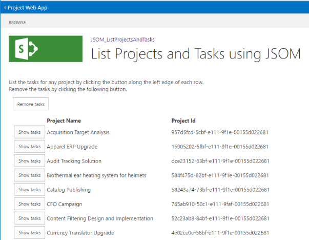

# <a name="developing-a-project-online-add-in-using-the-javascript-object-model-jsom"></a><span data-ttu-id="2ec3a-105">Desarrollo de un complemento de Project Online con el modelo de objetos de JavaScript (JSOM)</span><span class="sxs-lookup"><span data-stu-id="2ec3a-105">Developing a Project Online add-in using the JavaScript Object Model (JSOM)</span></span>

<span data-ttu-id="2ec3a-106">En este artículo se describe el desarrollo de complementos de Microsoft Project Online para mejorar su experiencia con Project Online.</span><span class="sxs-lookup"><span data-stu-id="2ec3a-106">This article describes Microsoft Project Online Add-in development to enhance your experience with the Project Online.</span></span> <span data-ttu-id="2ec3a-107">El proyecto de desarrollo se implementa como un tutorial.</span><span class="sxs-lookup"><span data-stu-id="2ec3a-107">The development project is implemented as a walkthrough.</span></span> <span data-ttu-id="2ec3a-108">El complemento que se usa para este artículo lee y muestra los nombres de proyecto e IDs de los proyectos publicados desde su cuenta de Project Online y le permite explorar en profundidad para recuperar tareas asociadas a proyectos individuales.</span><span class="sxs-lookup"><span data-stu-id="2ec3a-108">The add-in used for this article reads and displays the project names and IDs of the published projects from your Project Online account and allows you to drill down to retrieve tasks associated with individual projects.</span></span>
  
<span data-ttu-id="2ec3a-109">En tiempo de ejecución, la descripción del complemento es similar a la siguiente ilustración:</span><span class="sxs-lookup"><span data-stu-id="2ec3a-109">At run time, the add-in listing looks similar to the following illustration:</span></span>
  
<span data-ttu-id="2ec3a-110">![Captura de pantalla que muestra una lista de proyectos y]tareas de JSOM Captura de pantalla que muestra una lista de proyectos y tareas de(media/766e5914-f048-48f4-9282-291f55e6e90d.png "JSOM")</span><span class="sxs-lookup"><span data-stu-id="2ec3a-110"></span></span>
  
<span data-ttu-id="2ec3a-111">El foco del ejemplo es la interacción con Project Online, realizar consultas y establecer el contexto para cada solicitud del servicio.</span><span class="sxs-lookup"><span data-stu-id="2ec3a-111">The focus of the example is the interaction with the Project Online, making queries and setting the context for each request from the service.</span></span> <span data-ttu-id="2ec3a-112">Los elementos de la interfaz de usuario reciben una atención mínima.</span><span class="sxs-lookup"><span data-stu-id="2ec3a-112">User interface (UI) elements receive minimal attention.</span></span> <span data-ttu-id="2ec3a-113">En su lugar, las listas de origen proporcionan comentarios sobre la interfaz de usuario.</span><span class="sxs-lookup"><span data-stu-id="2ec3a-113">Instead, the source listings provide comments regarding the UI.</span></span>
  
> [!NOTE]
> <span data-ttu-id="2ec3a-114">Los archivos de origen del complemento de ejemplo, un Visual Studio proyecto, están disponibles en: https://github.com/OfficeDev/Project-JSOM-List-Projects-Tasks.... .</span><span class="sxs-lookup"><span data-stu-id="2ec3a-114">The source files for the example add-in, a Visual Studio project, are available at: https://github.com/OfficeDev/Project-JSOM-List-Projects-Tasks.....</span></span> <span data-ttu-id="2ec3a-115">Mantenga los archivos de origen a mano como referencia mientras lee el artículo, ya que cada uno complementa al otro.</span><span class="sxs-lookup"><span data-stu-id="2ec3a-115">Keep the source files handy as a reference while you read the article, as each complements the other.</span></span> <span data-ttu-id="2ec3a-116">Los archivos de la Visual Studio compilación del proyecto y son ejecutables con cambios mínimos, sustituyendo la dirección URL del inquilino de Project Online a la carpeta de PWA.</span><span class="sxs-lookup"><span data-stu-id="2ec3a-116">The files in the Visual Studio project build and are executable with minimal changes—substituting the URL for your Project Online tenant down to the PWA folder.</span></span> 
  
## <a name="background"></a><span data-ttu-id="2ec3a-117">Información previa</span><span class="sxs-lookup"><span data-stu-id="2ec3a-117">Background</span></span>

<span data-ttu-id="2ec3a-118">Project Online es un servicio de Office 365 que proporciona a las empresas una solución de administración de carteras de proyectos (PPM) y una oficina de administración de proyectos (PMO) para coordinar y administrar carteras, programas y proyectos.</span><span class="sxs-lookup"><span data-stu-id="2ec3a-118">Project Online is a Office 365 service that provides companies with a project portfolio management (PPM) and project management office (PMO) solution to coordinate and manage portfolios, programs, and projects.</span></span> <span data-ttu-id="2ec3a-119">Project Online es una oferta diferente de las ediciones de escritorio de Project; sin embargo, Project Online aún contiene la funcionalidad para mantener y realizar un seguimiento de los detalles del proyecto a lo largo de la vida de un proyecto.</span><span class="sxs-lookup"><span data-stu-id="2ec3a-119">Project Online is a different offering than the Project desktop editions; yet, Project Online still contains the functionality to maintain and track project details throughout the life of a project.</span></span> <span data-ttu-id="2ec3a-120">Project Online se basa en SharePoint Online.</span><span class="sxs-lookup"><span data-stu-id="2ec3a-120">Project Online is built on SharePoint Online.</span></span>
  
<span data-ttu-id="2ec3a-121">Un complemento hospedado de Project Online consta de JavaScript y archivos de recursos que interactúan con la API del modelo de objetos del lado cliente.</span><span class="sxs-lookup"><span data-stu-id="2ec3a-121">A Project Online hosted add-in consists of JavaScript and resource files that interact with the Client-Side-Object-Model API.</span></span> <span data-ttu-id="2ec3a-122">Cuando el usuario visita el complemento, el JavaScript y los recursos se descargan y ejecutan en el explorador.</span><span class="sxs-lookup"><span data-stu-id="2ec3a-122">When the user visits the add-in, the JavaScript and resources are downloaded and executed within the browser.</span></span> <span data-ttu-id="2ec3a-123">El complemento realiza llamadas asincrónicas a Project Online para interactuar con el servicio, ya sea creando, recuperando, actualizando o eliminando datos.</span><span class="sxs-lookup"><span data-stu-id="2ec3a-123">The add-In makes asynchronous calls to Project Online to interact with the service, whether creating, retrieving, updating, or deleting data.</span></span> 
  
<span data-ttu-id="2ec3a-124">Project Online realiza una acción más para proteger la información que pertenece a otros inquilinos del complemento; es decir, Project Online crea un sitio aislado para interactuar con las solicitudes del complemento.</span><span class="sxs-lookup"><span data-stu-id="2ec3a-124">Project Online performs one more action to protect information that belongs to other tenants from the add-in; namely, Project Online creates an isolated site to interact with the requests from the add-in.</span></span> <span data-ttu-id="2ec3a-125">No se ejecuta ningún código personalizado en el host de Project Online.</span><span class="sxs-lookup"><span data-stu-id="2ec3a-125">No custom code runs on the Project Online host.</span></span> 
  
<span data-ttu-id="2ec3a-126">La configuración de desarrollo para complementos de Project Online usa el Visual Studio proyecto de complemento de SharePoint.</span><span class="sxs-lookup"><span data-stu-id="2ec3a-126">The development setup for Project Online add-ins uses the Visual Studio SharePoint Add-in project type.</span></span> <span data-ttu-id="2ec3a-127">El complemento está escrito en JavaScript y usa el modelo de objetos de JavaScript (JSOM) de Project para interactuar con el servicio de Project Online.</span><span class="sxs-lookup"><span data-stu-id="2ec3a-127">The add-in is written in JavaScript, and uses the Project JavaScript object model (JSOM) to interact with the Project Online service.</span></span> <span data-ttu-id="2ec3a-128">JSOM hereda gran parte de su funcionalidad del JSOM de SharePoint.</span><span class="sxs-lookup"><span data-stu-id="2ec3a-128">The JSOM inherits much of its functionality from the SharePoint JSOM.</span></span>
  
> [!NOTE]
> <span data-ttu-id="2ec3a-129">Los complementos se pueden publicar y vender en la Tienda Office o implementarse en un catálogo de aplicaciones privado en SharePoint.</span><span class="sxs-lookup"><span data-stu-id="2ec3a-129">Add-ins can be published and sold in the Office Store or deployed to a private app catalog on SharePoint.</span></span> <span data-ttu-id="2ec3a-130">Para obtener más información, vea [Implementar y publicar el complemento de Office.](https://docs.microsoft.com/office/dev/add-ins/publish/publish)</span><span class="sxs-lookup"><span data-stu-id="2ec3a-130">For more information, see [Deploy and publish your Office Add-in](https://docs.microsoft.com/office/dev/add-ins/publish/publish).</span></span>
> 
> <span data-ttu-id="2ec3a-131">El complemento que se usa en este artículo es un ejemplo para desarrolladores; no está pensado para su uso en un entorno de producción.</span><span class="sxs-lookup"><span data-stu-id="2ec3a-131">The add-in used in this article is a sample for developers; it is not intended for use in a production environment.</span></span> <span data-ttu-id="2ec3a-132">El propósito principal es mostrar un ejemplo de desarrollo de aplicaciones para Project Online.</span><span class="sxs-lookup"><span data-stu-id="2ec3a-132">The primary purpose is to show an example of app development for Project Online.</span></span> 
  
## <a name="prerequisites"></a><span data-ttu-id="2ec3a-133">Requisitos previos</span><span class="sxs-lookup"><span data-stu-id="2ec3a-133">Prerequisites</span></span>

<span data-ttu-id="2ec3a-134">Agrega los siguientes elementos a un entorno de Windows compatible:</span><span class="sxs-lookup"><span data-stu-id="2ec3a-134">Add the following items to a supported Windows environment:</span></span>
  
- <span data-ttu-id="2ec3a-135">**.NET Framework 4.0 o** posterior: las versiones completas del marco de la versión 4.0 son compatibles.</span><span class="sxs-lookup"><span data-stu-id="2ec3a-135">**.NET Framework 4.0 or later**: Complete versions of the framework from version 4.0 are compatible.</span></span> <span data-ttu-id="2ec3a-136">El sitio de descarga es https://msdn.microsoft.com/vstudio/aa496123.aspx.</span><span class="sxs-lookup"><span data-stu-id="2ec3a-136">The download site is https://msdn.microsoft.com/vstudio/aa496123.aspx.</span></span>
    
- <span data-ttu-id="2ec3a-137">**Visual Studio 2013 o posterior:**</span><span class="sxs-lookup"><span data-stu-id="2ec3a-137">**Visual Studio 2013 or later**:</span></span>  
    
   - <span data-ttu-id="2ec3a-138">La edición profesional de Visual Studio 2015 está lista para usarse y está disponible en https://www.visualstudio.com/en-us/products/visual-studio-professional-with-msdn-vs.aspx .</span><span class="sxs-lookup"><span data-stu-id="2ec3a-138">The professional edition of Visual Studio 2015 is ready to go out-of-the box and is available at https://www.visualstudio.com/en-us/products/visual-studio-professional-with-msdn-vs.aspx.</span></span>
    
   - <span data-ttu-id="2ec3a-139">La edición de la Visual Studio 2015 está disponible en https://www.visualstudio.com/en-us/products/visual-studio-community-vs.aspx .</span><span class="sxs-lookup"><span data-stu-id="2ec3a-139">The community edition of Visual Studio 2015 is available at https://www.visualstudio.com/en-us/products/visual-studio-community-vs.aspx.</span></span> <span data-ttu-id="2ec3a-140">Esta edición requiere la instalación manual de Microsoft Office Developer Tools para Visual Studio.</span><span class="sxs-lookup"><span data-stu-id="2ec3a-140">This edition requires manual installation of the Microsoft Office Developer Tools for Visual Studio.</span></span>
    
   <span data-ttu-id="2ec3a-141">Las Microsoft Office Developer Tools para Visual Studio están disponibles en https://www.visualstudio.com/en-us/features/office-tools-vs.aspx .</span><span class="sxs-lookup"><span data-stu-id="2ec3a-141">The Microsoft Office Developer Tools for Visual Studio are available at https://www.visualstudio.com/en-us/features/office-tools-vs.aspx.</span></span>
    
- <span data-ttu-id="2ec3a-142">**Una cuenta de Project Online:** proporciona acceso al servicio de hospedaje.</span><span class="sxs-lookup"><span data-stu-id="2ec3a-142">**A Project Online account**: This provides access to the hosting service.</span></span> <span data-ttu-id="2ec3a-143">Para obtener más información acerca de cómo obtener una cuenta de Project Online, vea https://products.office.com/en-us/Project/project-online-portfolio-management.</span><span class="sxs-lookup"><span data-stu-id="2ec3a-143">For more information about obtaining a Project Online account, see https://products.office.com/en-us/Project/project-online-portfolio-management.</span></span>
    
   <span data-ttu-id="2ec3a-144">Asegúrese de que el usuario del complemento tiene autorización suficiente para tener acceso a algunos proyectos en el inquilino de Project Online.</span><span class="sxs-lookup"><span data-stu-id="2ec3a-144">Ensure that the add-in user has sufficient authorization to access some projects in the Project Online tenant.</span></span> 
    
- <span data-ttu-id="2ec3a-145">**Proyectos en el sitio de hospedaje** que se rellenan con información.</span><span class="sxs-lookup"><span data-stu-id="2ec3a-145">**Projects on the hosting site** that are populated with information.</span></span>
    
> [!NOTE]
> <span data-ttu-id="2ec3a-146">.NET Framework estándar es el marco correcto para usar.</span><span class="sxs-lookup"><span data-stu-id="2ec3a-146">The standard .NET Framework is the correct framework to use.</span></span> <span data-ttu-id="2ec3a-147">No use el "perfil de cliente de .NET Framework 4".</span><span class="sxs-lookup"><span data-stu-id="2ec3a-147">Do not use the ".NET Framework 4 Client Profile".</span></span> 
  
### <a name="set-up-the-visual-studio-project"></a><span data-ttu-id="2ec3a-148">Configuración del proyecto de Visual Studio</span><span class="sxs-lookup"><span data-stu-id="2ec3a-148">Set up the Visual Studio project</span></span>

<span data-ttu-id="2ec3a-149">La configuración de la aplicación consiste en crear un nuevo proyecto, vincular las bibliotecas adecuadas y declarar los espacios de nombres necesarios.</span><span class="sxs-lookup"><span data-stu-id="2ec3a-149">The application setup consists of creating a new project, linking the appropriate libraries and declaring the needed namespaces.</span></span> <span data-ttu-id="2ec3a-150">Visual Studio presenta varios tipos de proyectos de desarrollo.</span><span class="sxs-lookup"><span data-stu-id="2ec3a-150">Visual Studio presents several types of development projects.</span></span> <span data-ttu-id="2ec3a-151">La sección es breve y muy básica.</span><span class="sxs-lookup"><span data-stu-id="2ec3a-151">The section is brief and very basic.</span></span> <span data-ttu-id="2ec3a-152">El valor es que la información se une en un solo lugar.</span><span class="sxs-lookup"><span data-stu-id="2ec3a-152">The value is having the information is coalesced in one place.</span></span>
  
#### <a name="select-a-visual-studio-project"></a><span data-ttu-id="2ec3a-153">Seleccionar un proyecto de Visual Studio</span><span class="sxs-lookup"><span data-stu-id="2ec3a-153">Select a Visual Studio project</span></span>

<span data-ttu-id="2ec3a-154">Para crear un proyecto del tipo adecuado para el complemento, debe realizar los siguientes pasos.</span><span class="sxs-lookup"><span data-stu-id="2ec3a-154">To create a project of the appropriate type for the add-in, you must do the following steps.</span></span> <span data-ttu-id="2ec3a-155">Las palabras clave encontradas en la pantalla tienen un atributo **de** negrita:</span><span class="sxs-lookup"><span data-stu-id="2ec3a-155">Keywords encountered on the screen have a **bold** attribute:</span></span> 
  
1. <span data-ttu-id="2ec3a-156">En el menú Archivo, elija **Archivo**  >  **nuevo**  >  **proyecto.**</span><span class="sxs-lookup"><span data-stu-id="2ec3a-156">From the File menu, choose **File** > **New** > **Project**.</span></span> 
    
2. <span data-ttu-id="2ec3a-157">En las plantillas instaladas en el panel izquierdo, seleccione **Complementos web** de  >  **Office/SharePoint**  >  **de** C#.</span><span class="sxs-lookup"><span data-stu-id="2ec3a-157">From the Installed templates in the left pane, select **C#** > **Office/SharePoint** > **Web Add-ins**.</span></span> 
    
3. <span data-ttu-id="2ec3a-158">En la parte superior del panel central, seleccione **.NET Framework 4** o posterior; la versión actual es 4.6.</span><span class="sxs-lookup"><span data-stu-id="2ec3a-158">At the top of the central pane, select **.NET Framework 4** or later; the current version is 4.6.</span></span> 
    
4. <span data-ttu-id="2ec3a-159">En los tipos de aplicación del panel central, elija **Complemento de SharePoint.**</span><span class="sxs-lookup"><span data-stu-id="2ec3a-159">From the application types in the central pane, choose **SharePoint Add-in**.</span></span> 
    
5. <span data-ttu-id="2ec3a-160">En la sección inferior, especifique un nombre y una ubicación para el proyecto, así como un nombre de la solución.</span><span class="sxs-lookup"><span data-stu-id="2ec3a-160">In the bottom section, specify a name and location for the project, and a solution name.</span></span> 
    
6. <span data-ttu-id="2ec3a-161">También en la sección inferior, active la casilla **Crear directorio para la solución**.</span><span class="sxs-lookup"><span data-stu-id="2ec3a-161">Also in the bottom section, check the **Create directory for solution** box.</span></span> 
    
7. <span data-ttu-id="2ec3a-162">Haga clic en **Aceptar** para crear un proyecto inicial.</span><span class="sxs-lookup"><span data-stu-id="2ec3a-162">Click **OK** to create the initial project.</span></span> 
    
<span data-ttu-id="2ec3a-163">El asistente Visual Studio hace algunas preguntas de seguimiento sobre el sitio de configuración de Project Online (denominado configuración de SharePoint en los cuadros de diálogo) en un par de cuadros de diálogo que se abren a continuación.</span><span class="sxs-lookup"><span data-stu-id="2ec3a-163">The Visual Studio Wizard asks a few follow-up questions about the Project Online settings site (called SharePoint settings in the dialogs) in a couple of dialogs that follow.</span></span> <span data-ttu-id="2ec3a-164">Estas son las preguntas:</span><span class="sxs-lookup"><span data-stu-id="2ec3a-164">Here are the questions:</span></span>
  
1. <span data-ttu-id="2ec3a-165">¿Qué sitio de SharePoint desea usar para depurar el complemento?</span><span class="sxs-lookup"><span data-stu-id="2ec3a-165">What SharePoint site do you want to use for debugging your add-in?</span></span> <span data-ttu-id="2ec3a-166">Especifique la dirección URL del sitio de PWA, como https://contoso.sharepoint.com/sites/pwa .</span><span class="sxs-lookup"><span data-stu-id="2ec3a-166">Specify the URL to your PWA site, such as https://contoso.sharepoint.com/sites/pwa.</span></span>
    
2. <span data-ttu-id="2ec3a-167">¿Cómo desea hospedar el complemento de SharePoint?</span><span class="sxs-lookup"><span data-stu-id="2ec3a-167">How do you want to host your SharePoint Add-in?</span></span> <span data-ttu-id="2ec3a-168">Elija [X] **hospedado en SharePoint.**</span><span class="sxs-lookup"><span data-stu-id="2ec3a-168">Choose [X] **SharePoint-hosted**.</span></span>
    
   <span data-ttu-id="2ec3a-169">Para obtener más información acerca de los complementos de SharePoint, incluidas las opciones de hospedaje, vea [Complementos de SharePoint.](https://docs.microsoft.com/sharepoint/dev/sp-add-ins/sharepoint-add-ins)</span><span class="sxs-lookup"><span data-stu-id="2ec3a-169">For more information about SharePoint Add-ins, including hosting options, see [SharePoint Add-ins](https://docs.microsoft.com/sharepoint/dev/sp-add-ins/sharepoint-add-ins).</span></span>
    
3. <span data-ttu-id="2ec3a-170">Haga clic en **Siguiente**.</span><span class="sxs-lookup"><span data-stu-id="2ec3a-170">Click **Next**.</span></span> 
    
<span data-ttu-id="2ec3a-171">El segundo cuadro de diálogo adicional le pide que especifique la versión de SharePoint Online para el complemento:</span><span class="sxs-lookup"><span data-stu-id="2ec3a-171">The second additional dialog asks you to specify the SharePoint Online version for the add-in:</span></span> 
  
1. <span data-ttu-id="2ec3a-172">¿Cuál es la versión más antigua de SharePoint a la que quiere que se dirigirá el complemento?</span><span class="sxs-lookup"><span data-stu-id="2ec3a-172">What's the earliest version of SharePoint that you want your add-in to target?</span></span> <span data-ttu-id="2ec3a-173">Elija [X] S **harePoint-Online**.</span><span class="sxs-lookup"><span data-stu-id="2ec3a-173">Choose [X] S **harePoint-Online**.</span></span> 
    
2. <span data-ttu-id="2ec3a-174">Haga clic en **Finalizar**.</span><span class="sxs-lookup"><span data-stu-id="2ec3a-174">Click **Finish**.</span></span> 
    
<span data-ttu-id="2ec3a-175">Visual Studio crea el proyecto y accede al sitio de Project Online.</span><span class="sxs-lookup"><span data-stu-id="2ec3a-175">Visual Studio creates the project and accesses the Project Online site.</span></span> 
  
### <a name="enable-sideloading-on-the-project-online-site"></a><span data-ttu-id="2ec3a-176">Habilitar la instalación de instalación local en el sitio de Project Online</span><span class="sxs-lookup"><span data-stu-id="2ec3a-176">Enable sideloading on the Project Online site</span></span>

<span data-ttu-id="2ec3a-177">La instalación de prueba es el mecanismo para probar y depurar complementos de Project Online. Necesita dos scripts para la instalación de prueba: uno para habilitar la instalación de prueba en el sitio de Project Online y otro para deshabilitar la instalación de prueba una vez que termine de probar y depurar el complemento.</span><span class="sxs-lookup"><span data-stu-id="2ec3a-177">Sideloading is the mechanism for testing and debugging Project Online add-ins. You need two scripts for sideloading: one to enable sideloading on your Project Online site and another to disable sideloading once you finish testing and debugging the add-in.</span></span>
  
<span data-ttu-id="2ec3a-178">Para obtener más información acerca de la configuración de la instalación de instalación de local, vea Habilitar la instalación de instalación local de aplicaciones en la colección de sitios para no [desarrolladores.](https://blogs.msdn.microsoft.com/officeapps/2013/12/10/enable-app-sideloading-in-your-non-developer-site-collection/)</span><span class="sxs-lookup"><span data-stu-id="2ec3a-178">For more information about setting up sideloading, see [Enable app SideLoading in your non-developer site collection](https://blogs.msdn.microsoft.com/officeapps/2013/12/10/enable-app-sideloading-in-your-non-developer-site-collection/).</span></span>
  
> [!NOTE]
> <span data-ttu-id="2ec3a-179">La instalación de prueba de aplicaciones es una característica para desarrolladores y pruebas.</span><span class="sxs-lookup"><span data-stu-id="2ec3a-179">Sideloading apps is a developer/test feature.</span></span> <span data-ttu-id="2ec3a-180">No está **pensado para uso de producción.**</span><span class="sxs-lookup"><span data-stu-id="2ec3a-180">It is **not intended for production use**.</span></span> <span data-ttu-id="2ec3a-181">No realices la instalación de prueba de aplicaciones periódicamente o mantén habilitada la instalación de prueba de la aplicación durante más tiempo del que usas activamente la característica.</span><span class="sxs-lookup"><span data-stu-id="2ec3a-181">Do not sideload apps regularly, or keep app sideloading enabled for longer than you are actively using the feature.</span></span> 
  
## <a name="add-content-to-the-add-in-project"></a><span data-ttu-id="2ec3a-182">Agregar contenido al proyecto de complemento</span><span class="sxs-lookup"><span data-stu-id="2ec3a-182">Add content to the add-in project</span></span>

<span data-ttu-id="2ec3a-183">Después de crear un proyecto y configurar el mecanismo de depuración, agregar contenido a la aplicación incluye las siguientes tareas:</span><span class="sxs-lookup"><span data-stu-id="2ec3a-183">After creating a project and setting up the debugging mechanism, adding content to the app includes the following tasks:</span></span>
  
- <span data-ttu-id="2ec3a-184">Establecer el ámbito de la aplicación</span><span class="sxs-lookup"><span data-stu-id="2ec3a-184">Setting the application scope</span></span>
    
- <span data-ttu-id="2ec3a-185">Vincular la biblioteca JSOM</span><span class="sxs-lookup"><span data-stu-id="2ec3a-185">Linking the JSOM library</span></span>
    
- <span data-ttu-id="2ec3a-186">Agregar elementos de la interfaz de usuario al complemento</span><span class="sxs-lookup"><span data-stu-id="2ec3a-186">Adding UI Elements to the add-in</span></span>
    
- <span data-ttu-id="2ec3a-187">Inicialización y conexión al servicio de Project Online</span><span class="sxs-lookup"><span data-stu-id="2ec3a-187">Initializing and connecting to the Project Online service</span></span>
    
- <span data-ttu-id="2ec3a-188">Recuperación de proyectos y detalles/propiedades</span><span class="sxs-lookup"><span data-stu-id="2ec3a-188">Retrieving projects and details/properties</span></span>
    
- <span data-ttu-id="2ec3a-189">Mostrar proyectos</span><span class="sxs-lookup"><span data-stu-id="2ec3a-189">Displaying projects</span></span>
    
- <span data-ttu-id="2ec3a-190">Mostrar tareas para un proyecto</span><span class="sxs-lookup"><span data-stu-id="2ec3a-190">Displaying tasks for a Project</span></span>
    
<span data-ttu-id="2ec3a-191">El proyecto de complemento consta de muchos archivos.</span><span class="sxs-lookup"><span data-stu-id="2ec3a-191">The add-in project consists of many files.</span></span> <span data-ttu-id="2ec3a-192">En este ejemplo, tendrá que editar los archivos siguientes:</span><span class="sxs-lookup"><span data-stu-id="2ec3a-192">In this example, you'll need to edit the following files:</span></span> 
  
- <span data-ttu-id="2ec3a-193">AppManifest.xml</span><span class="sxs-lookup"><span data-stu-id="2ec3a-193">AppManifest.xml</span></span>
    
- <span data-ttu-id="2ec3a-194">Default.aspx</span><span class="sxs-lookup"><span data-stu-id="2ec3a-194">Default.aspx</span></span>
    
- <span data-ttu-id="2ec3a-195">App.js</span><span class="sxs-lookup"><span data-stu-id="2ec3a-195">App.js</span></span>
    
- <span data-ttu-id="2ec3a-196">App.css: opcional; contiene definiciones de estilo desarrolladas para el complemento</span><span class="sxs-lookup"><span data-stu-id="2ec3a-196">App.css - optional; contains style definitions developed for the add-in</span></span>
    
<span data-ttu-id="2ec3a-197">Si el inquilino de Project Online cambia, como pasar de una versión de prueba a un sitio de suscripción, puede actualizar las propiedades del proyecto, incluida la conexión del servidor y la dirección URL del sitio, mediante la ventana Propiedades disponible a través del comando Ver ventana  >   propiedades.</span><span class="sxs-lookup"><span data-stu-id="2ec3a-197">If the Project Online tenant changes, such as moving from a trial to a subscription site, you can update the project properties, including the Server Connection and Site URL, using the Properties Window available through the **View** > **Properties Window** command.</span></span> 
  
<span data-ttu-id="2ec3a-198">También puede agregar archivos al proyecto.</span><span class="sxs-lookup"><span data-stu-id="2ec3a-198">You can also add files to the project.</span></span> <span data-ttu-id="2ec3a-199">Si es así, deberá actualizar el archivo Elements.xml ubicado en el mismo grupo (contenido, imágenes, páginas o scripts) para incluir los nuevos archivos.</span><span class="sxs-lookup"><span data-stu-id="2ec3a-199">If so, you'll need to update the Elements.xml file located in the same group (Content, Images, Pages, or Scripts) to include the new files.</span></span> <span data-ttu-id="2ec3a-200">Para obtener más información acerca de los archivos de proyecto, vea Explorar la estructura del manifiesto de la aplicación y [el paquete de un complemento de SharePoint.](https://docs.microsoft.com/sharepoint/dev/sp-add-ins/explore-the-app-manifest-structure-and-the-package-of-a-sharepoint-add-in)</span><span class="sxs-lookup"><span data-stu-id="2ec3a-200">For more information about the project files, see [Explore the app manifest structure and the package of a SharePoint Add-in](https://docs.microsoft.com/sharepoint/dev/sp-add-ins/explore-the-app-manifest-structure-and-the-package-of-a-sharepoint-add-in).</span></span>
  
### <a name="set-application-scope"></a><span data-ttu-id="2ec3a-201">Establecer ámbito de aplicación</span><span class="sxs-lookup"><span data-stu-id="2ec3a-201">Set application scope</span></span>

<span data-ttu-id="2ec3a-202">El complemento necesita niveles de ámbito o permisos definidos antes de que el servicio devuelva información en los resultados de la consulta.</span><span class="sxs-lookup"><span data-stu-id="2ec3a-202">The add-in needs scope or permission levels defined before the service returns information in query results.</span></span> <span data-ttu-id="2ec3a-203">Para este complemento, use el siguiente ámbito para el Visual Studio proyecto.</span><span class="sxs-lookup"><span data-stu-id="2ec3a-203">For this add-in, use the following scope to the Visual Studio project.</span></span> <span data-ttu-id="2ec3a-204">Este cambio se realiza en el archivo AppManifest.xml en la pestaña Permisos:</span><span class="sxs-lookup"><span data-stu-id="2ec3a-204">This change is made to the AppManifest.xml file in the Permissions tab:</span></span>

|<span data-ttu-id="2ec3a-205">Ámbito</span><span class="sxs-lookup"><span data-stu-id="2ec3a-205">Scope</span></span>|<span data-ttu-id="2ec3a-206">Permiso</span><span class="sxs-lookup"><span data-stu-id="2ec3a-206">Permission</span></span>|
|:-----|:-----|
|<span data-ttu-id="2ec3a-207">Varios proyectos (Project Server)</span><span class="sxs-lookup"><span data-stu-id="2ec3a-207">Multiple Projects (Project Server)</span></span>  <br/> |<span data-ttu-id="2ec3a-208">Lectura</span><span class="sxs-lookup"><span data-stu-id="2ec3a-208">Read</span></span>  <br/> |
   
<span data-ttu-id="2ec3a-209">Guarde el archivo después de establecer el ámbito de la aplicación.</span><span class="sxs-lookup"><span data-stu-id="2ec3a-209">Save the file after setting the application scope.</span></span> <span data-ttu-id="2ec3a-210">De lo contrario, no se devolverán datos del servicio.</span><span class="sxs-lookup"><span data-stu-id="2ec3a-210">Otherwise, no data will be returned from the service.</span></span> 
  
### <a name="link-the-jsom-library"></a><span data-ttu-id="2ec3a-211">Vincular la biblioteca JSOM</span><span class="sxs-lookup"><span data-stu-id="2ec3a-211">Link the JSOM library</span></span>

<span data-ttu-id="2ec3a-212">Las bibliotecas de Project Online en tiempo de ejecución, PS.js y PS.debug.js, las proporciona Project Online y son siempre la versión más reciente.</span><span class="sxs-lookup"><span data-stu-id="2ec3a-212">The runtime Project Online libraries, PS.js and PS.debug.js, are provided by Project Online and are always the most recent version.</span></span> <span data-ttu-id="2ec3a-213">Los complementos de JavaScript que usan JSOM deben vincularse con una de estas bibliotecas.</span><span class="sxs-lookup"><span data-stu-id="2ec3a-213">JavaScript add-ins that use JSOM must link with one of these libraries.</span></span> <span data-ttu-id="2ec3a-214">Las definiciones de vinculación se agregan en el archivo Default.aspx.</span><span class="sxs-lookup"><span data-stu-id="2ec3a-214">The linking definitions are added in the Default.aspx file.</span></span> <span data-ttu-id="2ec3a-215">Los comandos para usar el PS.js y/o PS.debug.js forman parte del código que se encuentra en el App.js archivo.</span><span class="sxs-lookup"><span data-stu-id="2ec3a-215">The commands to use the PS.js and/or PS.debug.js are part of the code located in the App.js file.</span></span>
  
<span data-ttu-id="2ec3a-216">Agregue el siguiente comando para PS.js o PS.debug.js definición en el elemento que sigue a  `<asp:Content ContentPlaceHolderID="PlaceHolderAdditionalPageHead"` "SharePoint:ScriptLink" para sp.js.</span><span class="sxs-lookup"><span data-stu-id="2ec3a-216">Add the following command for PS.js or PS.debug.js definition in the  `<asp:Content ContentPlaceHolderID="PlaceHolderAdditionalPageHead"` element following the "SharePoint:ScriptLink" for sp.js.</span></span> 
  
```js
<SharePoint:ScriptLink name="PS.js" runat="server" OnDemand="false" LoadAfterUI="true" Localizable="false" />
```

> [!NOTE]
> <span data-ttu-id="2ec3a-217">El **atributo OnDemand** para PS.js o PS.debug.js establecido en **false**.</span><span class="sxs-lookup"><span data-stu-id="2ec3a-217">The **OnDemand** attribute for PS.js or PS.debug.js set to **false**.</span></span> 
  
### <a name="add-ui-elements-to-the-add-in"></a><span data-ttu-id="2ec3a-218">Agregar elementos de la interfaz de usuario al complemento</span><span class="sxs-lookup"><span data-stu-id="2ec3a-218">Add UI elements to the add-in</span></span>

<span data-ttu-id="2ec3a-219">El complemento de ejemplo consta de algunos componentes.</span><span class="sxs-lookup"><span data-stu-id="2ec3a-219">The example add-in consists of a few components.</span></span> <span data-ttu-id="2ec3a-220">Las descripciones de elementos estáticos se encuentran en el archivo Default.aspx.</span><span class="sxs-lookup"><span data-stu-id="2ec3a-220">Static element descriptions are located in the Default.aspx file.</span></span> <span data-ttu-id="2ec3a-221">Las descripciones de elementos dinámicos y el código de todos los componentes se encuentran en el App.js archivo.</span><span class="sxs-lookup"><span data-stu-id="2ec3a-221">Dynamic element descriptions and code for all components are located in the App.js file.</span></span> <span data-ttu-id="2ec3a-222">Para obtener comentarios sobre los componentes, consulte las listas de código fuente.</span><span class="sxs-lookup"><span data-stu-id="2ec3a-222">For comments regarding the components, refer to the source code listings.</span></span> <span data-ttu-id="2ec3a-223">Esta es una lista de los componentes de la interfaz de usuario en el complemento:</span><span class="sxs-lookup"><span data-stu-id="2ec3a-223">Here is a list of the UI components in the add-in:</span></span>
  
- <span data-ttu-id="2ec3a-224">El título</span><span class="sxs-lookup"><span data-stu-id="2ec3a-224">Title</span></span>
    
- <span data-ttu-id="2ec3a-225">Verbiage introductorio</span><span class="sxs-lookup"><span data-stu-id="2ec3a-225">Introductory verbiage</span></span>
    
- <span data-ttu-id="2ec3a-226">Botón para quitar tareas de la tabla</span><span class="sxs-lookup"><span data-stu-id="2ec3a-226">Button to remove tasks from the table</span></span>
    
- <span data-ttu-id="2ec3a-227">Tabla que enumera el identificador y el nombre del proyecto, así como la información de la tarea.</span><span class="sxs-lookup"><span data-stu-id="2ec3a-227">Table that lists the project ID and name, and the task information.</span></span>
    
- <span data-ttu-id="2ec3a-228">Botón Tareas (clonado una vez para cada proyecto) que importa datos de tareas en la tabla.</span><span class="sxs-lookup"><span data-stu-id="2ec3a-228">Tasks Button (cloned once for each project) that imports task data into the table.</span></span>
    
<span data-ttu-id="2ec3a-229">Para obtener detalles de la interfaz de usuario, como el título y la parte de encabezado de la tabla del proyecto, vea el archivo de proyecto Default.aspx.</span><span class="sxs-lookup"><span data-stu-id="2ec3a-229">For details of the user interface, such as the title and the header portion of the project table, see the Default.aspx project file.</span></span>
  
### <a name="initialize-and-connect-to-the-host-system"></a><span data-ttu-id="2ec3a-230">Inicializar y conectarse al sistema host</span><span class="sxs-lookup"><span data-stu-id="2ec3a-230">Initialize and connect to the host system</span></span>

<span data-ttu-id="2ec3a-231">El App.js contiene el código JavaScript.</span><span class="sxs-lookup"><span data-stu-id="2ec3a-231">The App.js file contains the JavaScript code.</span></span> <span data-ttu-id="2ec3a-232">El complemento carga los PS.js en el explorador y, a continuación, llama a la función initializePage.</span><span class="sxs-lookup"><span data-stu-id="2ec3a-232">The add-in loads PS.js in the browser, and then calls the initializePage function.</span></span> <span data-ttu-id="2ec3a-233">InitializePage recupera un contexto para el extremo de Project Online e inicia la función loadProjects.</span><span class="sxs-lookup"><span data-stu-id="2ec3a-233">InitializePage retrieves a context to the Project Online endpoint and starts the loadProjects function.</span></span>
  
```js
    'use strict';
    SP.SOD.executeOrDelayUntilScriptLoaded(initializePage, "PS.js");
    //Project PWA Context and published projects in PWA
    var projContext;
    var projects;
    function initializePage() {
        //Get the Project context for this web
        projContext = PS.ProjectContext.get_current();
        loadProjects();
    }
    //General CSOM failure event handler
    //Invoked when ExecuteQueryAsync returns unsuccessfully
    function onRequestFailed(sender, args) {
        alert("Failed to execute: " + args.get_message());
        return;
    };

```

### <a name="retrieve-the-projects"></a><span data-ttu-id="2ec3a-234">Recuperar los proyectos</span><span class="sxs-lookup"><span data-stu-id="2ec3a-234">Retrieve the projects</span></span>

<span data-ttu-id="2ec3a-235">La función loadProjects consulta al servicio los nombres de proyecto e IDs.</span><span class="sxs-lookup"><span data-stu-id="2ec3a-235">The loadProjects function queries the service for the project names and IDs.</span></span> 
  
<span data-ttu-id="2ec3a-236">La aplicación recupera el nombre del proyecto y el identificador del proyecto. Otra información sobre el proyecto está disponible y se puede obtener acceso modificando el método de carga para identificar explícitamente las propiedades que se recuperarán.</span><span class="sxs-lookup"><span data-stu-id="2ec3a-236">The application retrieves the project name and project Id. Other information about the project is available and can be accessed by modifying the load method to identify explicitly the properties to retrieve.</span></span> <span data-ttu-id="2ec3a-237">En el código se proporciona un ejemplo como comentario.</span><span class="sxs-lookup"><span data-stu-id="2ec3a-237">An example is provided in the code as a comment.</span></span> 
  
<span data-ttu-id="2ec3a-238">Si la consulta se realiza correctamente, el complemento continúa llamando a displayProjects.</span><span class="sxs-lookup"><span data-stu-id="2ec3a-238">If the query succeeds, the add-in continues by calling displayProjects.</span></span> 
  
```js
    //Query CSOM and get the list of projects in PWA
    function loadProjects() {
        projects = projContext.get_projects();
    //Request to server - identifies what to retrieve
        projContext.load(projects, 'Include(Name, Id)');
        //Notice to server to execute query
        projContext.executeQueryAsync(displayProjects, onRequestFailed);
        // Syntax for requesting more fields to pull down from server
        // projContext.load(projects, 'Include(Name, Description, StartDate, 
        // Id, IsCheckedOut)');
    }

```

### <a name="display-the-projects"></a><span data-ttu-id="2ec3a-239">Mostrar los proyectos</span><span class="sxs-lookup"><span data-stu-id="2ec3a-239">Display the projects</span></span>

<span data-ttu-id="2ec3a-240">La función displayProjects crea una tabla, una fila por proyecto y un botón para mostrar las tareas del proyecto específico.</span><span class="sxs-lookup"><span data-stu-id="2ec3a-240">The displayProjects function creates a table, one row per project, and a button to show the tasks for the specific project.</span></span> 
  
```js
    //Display the projects with names and ids in a table
    function displayProjects() {
        //Current published project and ID
        var p, projId;
        //Project table rows to publish collectively
        var pTable = []; 
        var pEnum = projects.getEnumerator();
        //Build a 3-column table, with one project per row.
        while (pEnum.moveNext()) {
            p = pEnum.get_current();
        
            //Items used in getting information for table rows:
            //Current published project object, and ID and name
            // var project = p;
            // var projId = p.get_id();
            // var projName = p.get_name();
        
            //Continue processing/working with project object as needed.
        }
    }

```

> [!NOTE]
> <span data-ttu-id="2ec3a-241">El bucle while tiene acceso a las propiedades id. y name.</span><span class="sxs-lookup"><span data-stu-id="2ec3a-241">The while loop accesses the ID and name properties.</span></span> <span data-ttu-id="2ec3a-242">Esto es ligeramente diferente al proyecto de código fuente que llama a una función que, a su vez, tiene acceso a las mismas propiedades.</span><span class="sxs-lookup"><span data-stu-id="2ec3a-242">This is slightly different than the source code project that calls a function that, in turn, accesses the same properties.</span></span> 
  
### <a name="display-the-tasks-for-a-project"></a><span data-ttu-id="2ec3a-243">Mostrar las tareas de un proyecto</span><span class="sxs-lookup"><span data-stu-id="2ec3a-243">Display the tasks for a project</span></span>

<span data-ttu-id="2ec3a-244">Las tareas, aunque forman parte del complemento, no forman parte de la carga inicial.</span><span class="sxs-lookup"><span data-stu-id="2ec3a-244">The tasks, while part of the add-in, are not part of the initial loading.</span></span> <span data-ttu-id="2ec3a-245">Si el usuario está interesado en las tareas asociadas a un proyecto, al hacer clic en el botón "Mostrar tareas", las tareas se mostrarán en la lista mediante el controlador de eventos btnLoadTasks.</span><span class="sxs-lookup"><span data-stu-id="2ec3a-245">If the user is interested in the tasks associated with a project, clicking the "Show Tasks" button causes the tasks to display in the list using the btnLoadTasks event handler.</span></span> 
  
<span data-ttu-id="2ec3a-246">El controlador de eventos btnLoadTasks, con el identificador de proyecto adecuado, solicita las tareas para el proyecto especificado del servidor.</span><span class="sxs-lookup"><span data-stu-id="2ec3a-246">The btnLoadTasks event handler, with the appropriate project ID, requests the tasks for the specified project from the server.</span></span> <span data-ttu-id="2ec3a-247">Una vez recuperado, btnLoadTasks pasa la lista de tareas a displayTasks para presentar las tareas en pantalla.</span><span class="sxs-lookup"><span data-stu-id="2ec3a-247">Once retrieved, btnLoadTasks passes the task list to displayTasks to present the tasks onscreen.</span></span>
  
```js
    //Query CSOM and get the list of tasks for a specific project
    function btnLoadTasks(pid) {
        //Event handler for the "Show tasks" buttons. 
        //
        //The project ID is the sole argument and is used to get the appropriate task 
        //info from the service.
        //The project ID is also the button name, and is used to identify where to place
        //the task information in the table.
        //
        //Project ID to pass to the event handler
        var projId = pid;
        //
        //Get the project reference
        var pProj = projects.getById(projId);
        //
        //Get the tasks collection reference associated with the project.
        var tasks = pProj.get_tasks();
        //
        projContext.load(tasks, 'Include(Id, Name, Start, ScheduledStart, Completion)');
        //
        //If the query succeeds, displayTasks presents the tasks to the user.
        projContext.executeQueryAsync(function () { displayTasks(tasks, projId) }, onRequestFailed);
    }

```

<span data-ttu-id="2ec3a-248">La función displayTasks muestra las tareas asociadas a un proyecto especificado inmediatamente debajo de la entrada del proyecto.</span><span class="sxs-lookup"><span data-stu-id="2ec3a-248">The displayTasks function displays the tasks associated with a specified project immediately beneath the project entry.</span></span>
  
```js
    //Insert tasks for the specified project immediately underneath the project entry 
    //in the table.
    function displayTasks(tasks, projId) {
        //selected project ID
        var pId = projId;
        //individual task
        var t;
        //Task table rows to publish collectively
        var tTable = [];
        var tEnum = tasks.getEnumerator();
        //Build table one task per row.
        while (tEnum.moveNext()) {
            t = tEnum.get_current();
            //
            //Items used in getting information for table rows:
            //Current task object, and ID and name
            // var task = t;
            // var taskId = t.get_id();
            // var taskName = t.get_name();
            
            //Continue processing/working with task object as needed.
        }
    }

```

> [!NOTE]
> <span data-ttu-id="2ec3a-249">El bucle while tiene acceso a las propiedades id. y nombre de tarea.</span><span class="sxs-lookup"><span data-stu-id="2ec3a-249">The while loop accesses the task ID and name properties.</span></span> <span data-ttu-id="2ec3a-250">Esto es ligeramente diferente al proyecto de código fuente que llama a una función que, a su vez, tiene acceso a las mismas propiedades.</span><span class="sxs-lookup"><span data-stu-id="2ec3a-250">This is slightly different than the source code project that calls a function that, in turn, accesses the same properties.</span></span> 
  
<span data-ttu-id="2ec3a-251">A continuación se muestra el resultado de ejemplo de las tareas de un único proyecto.</span><span class="sxs-lookup"><span data-stu-id="2ec3a-251">Sample output for the tasks of a single project follows.</span></span>
  
<span data-ttu-id="2ec3a-252">![Captura de pantalla que muestra el resultado de una captura de pantalla de tarea]de proyecto que muestra la salida de una tarea de(media/f6500a3f-000b-4f3e-9be6-9a74d0bea15e.png "proyecto")</span><span class="sxs-lookup"><span data-stu-id="2ec3a-252"></span></span>
  
## <a name="see-also"></a><span data-ttu-id="2ec3a-253">Vea también</span><span class="sxs-lookup"><span data-stu-id="2ec3a-253">See also</span></span>

<span data-ttu-id="2ec3a-254">Para conocer la documentación y los ejemplos relacionados con Project Online y el desarrollo de aplicaciones con CSOM, consulte el [Portal de desarrollo del proyecto](https://developer.microsoft.com/en-us/project).</span><span class="sxs-lookup"><span data-stu-id="2ec3a-254">For documentation and samples related to Project Online and application development using CSOM, see the [Project Development Portal](https://developer.microsoft.com/en-us/project).</span></span>
    


