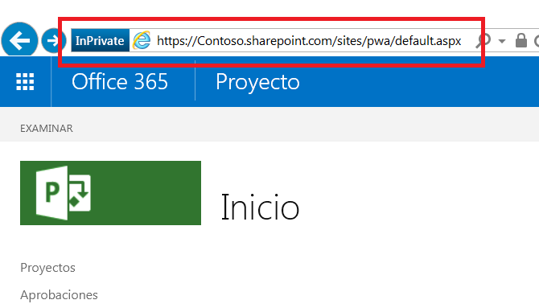

# <a name="developing-a-project-online-application-using-the-client-side-object-model"></a>Desarrollo de una aplicación de Project Online con el modelo de objetos de cliente

En este artículo se describe el desarrollo de la aplicación de Microsoft Project Online para aplicaciones de escritorio con .NET Framework 4.0. La aplicación que se describe en este artículo recupera información del servidor de hospedaje. 
  
## <a name="background"></a>Información previa

Microsoft Project empezó como una aplicación de escritorio a principios de los años noventa. Hoy, Project es mucho más, como sus diversas modalidades lo confirman:
  
- Project Standard Edition es una aplicación de escritorio que se ejecuta como una aplicación independiente.
    
- Project Professional Edition es una aplicación de escritorio que puede interactuar con un servidor y compartir datos con él a mayor escala, así como desempeñar las funciones que se encuentran en Project Standard Edition.
    
- Project Online es un servicio hospedado de Microsoft que ofrece a las empresas una solución de nivel de departamento de gestión de proyectos para coordinar y administrar proyectos, programas y carteras. Con una oferta diferente a las ediciones de escritorio, Project Online puede mantener y realizar un seguimiento de los detalles de un proyecto a lo largo del ciclo de vida de un proyecto. 
    
- Project Server es un servicio hospedado de empresa en el que la empresa administra y protege el servidor con la información del proyecto, el programa y la cartera. Project Server, en virtud de proteger el servidor internamente, ofrece las características orientadas a proyectos, programas y carteras de Project Online hospedado externamente con una mayor capacidad de personalización.
    
Project Online tiene tres conjuntos de API en línea: modelo de objetos de cliente (CSOM), modelo de objetos de JavaScript (JSOM) y transferencia de estado representacional (REST). 
  
- La implementación de CSOM de .NET es la interfaz preferida para el desarrollo de aplicaciones de Windows que interactúan con espacios empresariales de Project Online. Los entornos típicos para aplicaciones centradas en el usuario incluyen equipos de escritorio de Windows y dispositivos de Microsoft Surface. Las aplicaciones de back-end escritas con CSOM de .NET pueden conectarse a otros servidores con lógica de negocios y orígenes de datos que son externos a Project Online. Las solicitudes de recuperación en Project Online usan un sistema de consulta similar a LINQ que ofrece varias mejoras sobre funciones básicas de recuperación.
    
- La interfaz del modelo de objetos de JavaScript (JSOM) proporciona compatibilidad con exploradores para los complementos de Project Online. Un complemento es una aplicación web que se almacena en el espacio empresarial de Project Online. Cuando un usuario desea ejecutar un complemento, el código para el complemento se descarga y se ejecuta en el explorador del equipo del usuario. 
    
- El modelo REST/Odata proporciona comunicación basada en HTTP. Se recomienda esta interfaz para las aplicaciones en entornos distintos de Windows. Los puntos de conexión de comunicación son los objetos en el sitio de la aplicación web de Project (PWA). Los resultados de proporcionan códigos de estado HTTP normales.
    
Este artículo se centra en una aplicación que utiliza la interfaz CSOM de .NET.
  
## <a name="prerequisites"></a>Requisitos previos

Empiece con un sistema básico con Windows 10 y agregue los siguientes elementos:
  
- .Net Framework 4.0 o posterior. Use el marco completo. El sitio de descarga es https://msdn.microsoft.com/vstudio/aa496123.aspx.
    
- Visual Studio 2013 o posterior. Cualquier edición es aceptable. La edición de la comunidad de Visual Studio 2015 se usó para desarrollar la aplicación de ejemplo. La edición de la comunidad está disponible en https://www.visualstudio.com/en-us/products/visual-studio-community-vs.aspx.
    
- SDK de componentes cliente de SharePoint. Project Online y Project Server se colocan por encima de SharePoint y los ensamblados de SharePoint. Los componentes de cliente de SharePoint se incluyen en Visual Studio Professional y Enterprise. Si usa Visual Studio Community, la versión más reciente del SDK de Office Developer Tools está disponible en el sitio siguiente: https://www.microsoft.com/en-us/download/details.aspx?id=35585.
    
- Una cuenta de Project Online. Esto proporciona acceso al sitio de hospedaje. Para obtener más información acerca de cómo obtener una cuenta de Project Online, vea https://products.office.com/en-us/Project/project-online-portfolio-management.
    
- Proyectos en el sitio de hospedaje que se rellenan con información
    
> [!NOTE]
> La edición estándar de .NET Framework (4.0 o posterior) es el marco correcto para usar. No use .NET Framework 4 Client Profile. 
  
## <a name="develop-the-application"></a>Desarrollo de la aplicación

Al desarrollar una aplicación de escritorio de SharePoint, la interfaz preferida es el modelo de objetos de cliente (CSOM) de Project. 
  
Puede descargar el ejemplo completo en https://github.com/OfficeDev/Project-CSOM-List-Projects-Tasks.
  
Los dos primeros temas tratan los aspectos básicos: la creación de un proyecto de Visual Studio con ensamblados y espacios de nombres adecuados y el acceso al servidor de hospedaje. Los temas restantes abordan la recuperación de información a través del CSOM, desde uno a varios objetos. 
  
La recuperación de información desde el host es un proceso de dos acciones en las aplicaciones cliente. En primer lugar, la aplicación especifica y envía una o varias solicitudes de recuperación en el servidor. En segundo lugar, la aplicación emite una notificación en el servidor para ejecutar las consultas enviadas. El servidor responde enviando los resultados de la consulta al cliente.
  
### <a name="set-up-the-visual-studio-project"></a>Configuración del proyecto de Visual Studio

La configuración de la aplicación consiste en crear un nuevo proyecto, vincular los ensamblados adecuados y declarar los espacios de nombres necesarios. Visual Studio presenta varios tipos de proyectos de desarrollo. 
  
#### <a name="select-a-visual-studio-project"></a>Seleccionar un proyecto de Visual Studio

1. Inicie Visual Studio y seleccione **Iniciar un nuevo proyecto** en la página de inicio. 
    
   El cuadro de diálogo Nuevo proyecto muestra las plantillas de aplicación disponibles y los campos de datos para cualquier plantilla seleccionada. 
    
2. Para esta aplicación, especifique los siguientes elementos. Las palabras clave que se encuentran en la pantalla tienen un atributo en negrita:
    
   1. En las plantillas instaladas en el panel izquierdo, seleccione **C#** => **Escritorio clásico** => **de Windows**. 
    
   2. En la parte superior del panel central, seleccione **.NET Framework 4**. 
    
   3. En los tipos de aplicación en el panel central, elija **Aplicación de consola**. 
    
   4. En la sección inferior, especifique un nombre y una ubicación para el proyecto, así como un nombre de la solución. 
    
   5. También en la sección inferior, active la casilla **Crear directorio para la solución**. 
    
3. Haga clic en **Aceptar** para crear un proyecto inicial. 
    
#### <a name="add-assemblies"></a>Agregar ensamblados

La solución de VS necesita el ensamblado ProjectServerClient del SDK de Project 2103, un par de ensamblados del SDK de SharePoint y el ensamblado System.Security de .NET Framework.
  
1. En el Explorador de soluciones de VS, haga clic con el botón derecho en la entrada Referencias y seleccione **Agregar referencia** en el menú contextual. 
    
2. Compruebe **Microsoft.ProjectServer.Client.dll**. 
    
   Si es necesario, haga clic en el botón **Examinar** en la parte inferior del cuadro de diálogo y navegue hasta el directorio de instalación del SDK de Project 2013 para localizar el ensamblado. 
    
3. Haga clic en **Aceptar**. 
    
4. Agregue el espacio de nombres PrjoctServer Client al archivo. cs.
    
   ```cs
    using Microsoft.ProjectServer.Client;
   ```

Agregue los ensamblados de SDK de SharePoint 2013 SDK con la Consola del Administrador de paquetes de NuGet. 
  
1. En el menú Herramientas de VS, haga clic en los siguientes menús: **Herramientas =\> Administrador de paquetes de NuGet =\> Consola del Administrador paquetes**. 
    
2. En la Consola del Administrador de paquetes, escriba el siguiente comando y presione \<ENTRAR\>:
    
   ```cs
    Install-Package Microsoft.SharePointOnline.CSOM
   ```

   La **Consola del Administrador de paquetes** ofrece una descripción de los resultados del comando. El Explorador de soluciones de VS muestra los ensamblados de SharePoint en las referencias del proyecto. 
    
3. Agregue los espacios de nombres en el archivo. cs:
    
   ```cs
    using Microsoft.SharePoint.Client;
   ```

El ensamblado System.Security forma parte de .NET Framework y se instaló con el marco. La aplicación de ejemplo tiene un espacio de nombres más que proporciona una cadena cifrada en el sistema de hospedaje para la autenticación. Una vez autenticada, la aplicación puede obtener acceso a los proyectos en el sistema de hospedaje. Agregue el espacio de nombres System.Security al archivo. cs de esta forma:
  
1. En el Explorador de soluciones de VS, haga clic con el botón derecho en la entrada Referencias y seleccione **Agregar referencia** en el menú contextual. 
    
2. Seleccione **Ensamblados =\> Framework** en el panel izquierdo del cuadro de diálogo Administrador de referencias y, a continuación, compruebe **System.Security**. 
    
3. Haga clic en **Aceptar**. 
    
4. Agregue el espacio de nombres System.Security al archivo. cs:
    
   ```cs
    using System.Security;
   ```

El inicio del archivo. cs debe contener estos espacios de nombres:
  
- System
    
- System.Collections.Generic
    
- System.Linq
    
- System.Test
    
- Microsoft.ProjectServer.Client
    
- Microsoft.SharePoint.Client
    
- System.Security
    
### <a name="connect-to-the-host-system"></a>Conectarse con el sistema de hospedaje

Project Online es una aplicación de SharePoint, por lo que el uso de la autenticación de SharePoint es el enfoque correcto. El siguiente fragmento de código se prepara para obtener acceso al entorno hospedado.
  
```cs
    class Program
    {
        private static ProjectContext projContext;
        static void Main (string[] args)
        {
            using (ProjectContext projContext = new ProjectContext("https://Contoso.sharepoint.com/sites/pwa"))
            {
                SecureString password - new SecureString();
                foreach (char c in "password".ToCharArray()) password.AppendChar(c);
                //Using SharePoint method to load Credentials
                projContext.Credentials = new SharePointOnlineCredentials("sarad@Contoso.onmicrosoft.com", password);

```

Las preparaciones para obtener acceso a un entorno hospedado incluyen los siguientes elementos:
  
1. Cree un objeto de contexto para los proyectos. Esto se incluye en el siguiente código del fragmento de código anterior. 
    
   ```cs
    private static ProjectContext projContext;
    
   ```

   El contexto se hereda de otros componentes, lo que permite que el sistema administre el contexto del modelo de objetos de Project.
    
2. Identifique el sitio de host. Esto se hace en el siguiente código del fragmento de código anterior.
    
   ```cs
    using (ProjectContext projContext = new ProjectContext("https://Contoso.sharepoint.com/sites/pwa"))
   ```

   Al crear instancias del contexto del proyecto, la aplicación debe proporcionar la raíz de la colección de sitios de proyectos. La aplicación usa una subcadena de la dirección URL de la raíz de los proyectos. Una instantánea de esta ubicación se resalta con un rectángulo rojo en la siguiente ilustración. La autenticación necesita la cadena desde el principio y a lo largo de la subcadena "pwa". En la lista de código, la aplicación usa la cadena "https://XXXXXXXX.sharepoint.com/sites/pwa".
        
   
  
3. Coloque la contraseña en una cadena segura. Esto se hace en el siguiente código del fragmento de código anterior.
    
   ```cs
    SecureString password - new SecureString();
    foreach (char c in "password".ToCharArray()) password.AppendChar(c);
    
   ```

   La contraseña y la cuenta de usuario son las credenciales para obtener acceso al sitio de host. 
    
4. Agregue la cuenta de usuario y la contraseña a la parte de las credenciales del objeto de contexto. Esto se hace en el siguiente código desde el fragmento de código anterior.
    
   ```cs
    projContext.Credentials = new SharePointOnlineCredentials("sarad@Contoso.onmicrosoft.com", password);
   ```

El contexto del proyecto con instancias está listo para usarse.
  
### <a name="list-all-published-projects"></a>Lista de todos los proyectos publicados

Project Online y ProjectServer usan servidores proxy para comunicarse con el servidor en relación con la creación, la notificación y la actualización de operaciones (CRUD). El servidor/host administra las solicitudes de manera eficiente y es el cliente el que realiza las siguientes acciones en la comunicación con el servidor:
  
1. Establezca un contexto de para la comunicación. 
    
   El contexto se utiliza mediante la colección de proyectos, así como otros objetos y colecciones a través de la herencia, incluida la colección de tareas, la colección de asignaciones, el objeto de fase y los campos personalizados. 
    
2. Use el modelo de objetos para especificar un objeto, una colección o datos para recuperar.
    
   Este paso utiliza LINQ como consulta o método. La especificación controla lo que usted recibe. A menudo, este paso se inserta como el cuerpo del método Load (paso 3). 
    
3. Cargue la especificación de recuperación en el paso anterior con el método Load() o LoadQuery().
    
   Para cargar colecciones y objetos, use Load(). Para las consultas con cláusulas como "where" y "group", use LoadQuery(). 
    
4. Ejecute la solicitud mediante el método ExecuteQuery().
    
   El método ExecuteQuery() notifica al host que la consulta o consultas están listas para ejecutarse. Cuando el host recibe la notificación, se ejecutan las consultas y envían los resultados al cliente. 
    
Con la información en el cliente, la aplicación puede usarla. El siguiente fragmento de código recorre los proyectos publicados e imprime el identificador y el nombre de cada proyecto publicado en el host.
  
```cs
// Get the list of projects in Project Web App.
var projects = projContext.Projects;
projContext.Load(projects);
projcontext.ExecuteQuery();
foreach (PublishedProject pubProj in projContext.Projects)
{
    Console.WriteLine("\n{0}. {1}   {2} \t{3} \n", j++, pubProj.Id, pubProj.Name, pubProj.CreatedDate);
}

```

Resultado:
  
```cs
Published Project count:2
1. be80a848-b2ef-e511-80f4-00155dc84e01   A second Project     3/21/2016 10:14:40 PM
2. 9d730a1a-60ed-e511-80f6-00155dc87d01   Ent_Proj_1   3/18/2016 11:21:14 PM

```

### <a name="make-a-request"></a>Hacer una solicitud

Mediante las acciones del fragmento de código anterior, la aplicación recupera la lista de proyectos en la cuenta especificada del sitio de hospedaje. 
  
1. ProjectContext se especifica para los proyectos de la lista. 
    
   ```cs
    var projects = projContext.Projects;
   ```

2. Especifique el elemento para recuperar. 
    
   ```cs
    projContext.Load(projects);
   ```

   Indicando solamente la colección, el servidor recupera la colección de proyectos, rellenando cada proyecto con los valores para el conjunto de propiedades predeterminado. El acceso a las propiedades que forman parte del conjunto de propiedades predeterminado ofrece resultados correctos. El acceso a las propiedades que no forman parte del conjunto predeterminado genera una excepción "No inicializado".
    
3. Cargue la solicitud (projContext.Load).
    
   Esto forma parte del paso anterior.
    
4. Ejecute la consulta (ExecuteQuery). 
    
   ```cs
    projContext.ExecuteQuery();
   ```

### <a name="retrieve-high-level-project-information"></a>Recuperar información de alto nivel del proyecto

Las propiedades que no son predeterminadas deben especificarse en la solicitud al servidor. El siguiente fragmento de código carga el contexto de la colección de proyectos como en el ejemplo anterior. A continuación, la especificación solicita propiedades no predeterminadas adicionales para incluir en el resultado. 
  
```cs
var projects = projContext.Projects;
projContext.Load(projects,
    ps => ps.IncludeWithDefaultProperties(
        p => p.StartDate, p => p.Phase, p => p.Stage));
projContext.ExecuteQuery();

```

La instrucción de carga especifica el contexto de la colección de proyectos y agrega StartDate, Phase y Stage al resultado de la consulta. Las propiedades adicionales pueden ser escalares, objetos o colecciones. Los elementos escalares se pueden acceder directamente. Los objetos y las colecciones requieren procesamiento adicional, como en el siguiente fragmento de código.
  
```cs
// Using the previous definition and Load statement …
projContext.ExecuteQuery();
foreach (PublishedProject pubProj in projContext.Projects)
{
Console.WriteLine("\n\t{0}. \t{1} \n\t{2} \n\t{3} \n", j++, pubProj.Id, pubProj.Name,
    pubProj.CreatedDate);
             // The following statement generates an exception about the object 
             // reference not being set to an instance on the server. 
             // Console.WriteLine("\tCurrent Phase:\t{0}", pubProj.Phase.Name);
             // Phase and Stage are not published with the rest of the data. Need to pull these objects from the server.
             Phase oPhase = pubProj.Phase;
             projContext.Load(oPhase);
             projContext.ExecuteQuery();
             //if-else fails because the else case fails with "Microsoft.SharePoint.Client.ServerObjectNullReferenceException".
             //if (oPhase.ServerObjectIsNull != null)
             //Using try-catch instead
             try
             {
                  Console.WriteLine("\tCurrent Phase:\t{0}", oPhase.Name);
             }
             
             catch
             {
                  Console.WriteLine("\tCurrent Phase:\t Not available");
             }
             
             Stage oStage = pubProj.Stage;
             projContext.Load(oStage);
             projContext.ExecuteQuery();
             //Again, not using if-else combination for the same reason as above.
             try
             {
                  Console.WriteLine("\tCurrent Stage:\t{0}", oStage.Name);
             }
             
             catch
             {
                  Console.WriteLine("\tCurrent Stage:\t Not available");
    }

```

Resultado de los primeros tres proyectos:
  
```cs
Project counts:31
1. Project ID:  957d5fcd-5cbf-e111-9f1e-00155d022681
        Name:           Acquisition Target Analysis
        CreatedDate:            3/22/2016 5:14:34 PM
        Current Phase:  3. Plan
        Current Stage:  6. Plan
2. Project ID:  16905202-5fbf-e111-9f1e-00155d022681
        Name:           Apparel ERP Upgrade
        CreatedDate:            3/22/2016 5:36:40 PM
        Current Phase:  3. Plan
        Current Stage:  6. Plan
3. Project ID:  dce23152-63bf-e111-9f1e-00155d022681
        Name:           Audit Tracking Solution
        CreatedDate:            3/22/2016 5:02:24 PM
        Current Phase:  2. Select
        Current Stage:  4. Select Gate

```

### <a name="retrieve-all-tasks-in-a-project"></a>Recuperar todas las tareas en un proyecto

Cada proyecto tiene muchas tareas. Por lo tanto, la obtención de tareas para un solo proyecto consiste en lo siguiente:
  
1. Establezca el contexto de la colección de proyectos.
    
   ```cs
    var projects = projContext.Projects;
   ```

2. Recupere la información del proyecto, incluidas las propiedades de la tarea.
    
   ```cs
    projContext.Load(projects);
    ProjContext.ExecuteQuery();
    foreach (PublishedProject pubProj in projContext.Projects){
    
   ```

    Tenga en cuenta que la aplicación está solucionando proyectos publicados. El contexto del proyecto actual publicado es pubProj. 
    
3. Establezca el contexto de la colección de tareas.
    
   ```cs
    PublishedTaskCollection collTask = pubProj.Tasks;
   ```

   La propiedad `pubProj.Tasks` hace referencia a las tareas del proyecto actual publicado. 
    
4. Cargue la especificación para recuperar la colección de tareas, incluidas las propiedades no predeterminadas correspondientes.
    
   ```cs
    projContext.Load(collTask,
        tsk => tsk.IncludeWithDefaultProperties(
            t => t.Id, t => t.Name, t => t.Start,
            t => t.ScheduledStart, t => t.Completion));
    
   ```

5. Ejecute la consulta para recuperar la colección de tareas con las propiedades adecuadas.
    
   ```cs
    projContext.ExecuteQuery();
   ```

La información ahora es local. El siguiente fragmento de código procesa la colección de tareas publicadas escribiendo la información en la consola.
  
```cs
    Console.WriteLine("Task collection count: {0}", collTask.Count.ToString());
    if (collTask.Count > 0)
    {
        int k = 1;    //Task counter.
        foreach (PublishedTask t in collTask)
        {
            Console.WriteLine("{0}. Id:{1} \tName:{2}", k++, t.Id, t.Name);
            Console.WriteLine("\t ScheduledStart:{0} \tStart:{1} \tCompletion:{2}", k, t.ScheduledStart, t.Start, t.Completion);
        }
    }

```

Resultado de tareas para un proyecto:
  
```cs
Task collection count: 5
1. Id:256fa850-b2ef-e511-80f6-00155dc87d01      Name:Load software onto computer
         ScheduledStart:2       Start:4/4/2016 8:00:00 AM       Completion:4/4/2016 8:00:00 AM
2. Id:266fa850-b2ef-e511-80f6-00155dc87d01      Name:Locate and load Project Online SDK
         ScheduledStart:3       Start:4/5/2016 8:00:00 AM       Completion:4/5/2016 8:00:00 AM
3. Id:276fa850-b2ef-e511-80f6-00155dc87d01      Name:Locate and load SP SDK
         ScheduledStart:4       Start:4/5/2016 1:00:00 PM       Completion:4/5/2016 1:00:00 PM
4. Id:286fa850-b2ef-e511-80f6-00155dc87d01      Name:Build app that accesses Proj Online
         ScheduledStart:5       Start:4/6/2016 8:00:00 AM       Completion:4/6/2016 8:00:00 AM
5. Id:296fa850-b2ef-e511-80f6-00155dc87d01      Name:Build app that accesses task assignments
         ScheduledStart:6       Start:4/7/2016 8:00:00 AM       Completion:4/7/2016 8:00:00 AM

```

### <a name="access-information-at-multiple-levels"></a>Información de acceso en varios niveles

Cada tarea puede tener una o varias personas (también llamado recurso) que contribuyen hacia su finalización. Las colecciones de asignaciones y recursos contienen esta información para cada tarea. 
  
El procesamiento consiste en lo siguiente:
  
1. Obtener un contexto para la tarea del proyecto.
    
2. Crear una solicitud y cargar la solicitud para las asignaciones vinculadas a la tarea. 
    
3. Ejecutar la consulta para las asignaciones.
    
4. Crear una solicitud y cargar la solicitud para el recurso asociado a una asignación individual. 
    
5. Ejecutar la consulta para el recurso.
    
> [!NOTE] 
> - La colección de asignaciones se solicita explícitamente en la información del servidor porque no es una propiedad predeterminada de la colección de tareas. Como colección, se realiza una consulta siguiente para obtener la colección desde el servidor. 
> - El recurso es un objeto. La consulta para una asignación incluye el nombre del recurso asociado a la asignación.
    
```cs
PublishedTaskCollection collTask = pubProj.Tasks;
    projContext.Load(collTask,
        tsk => tsk.IncludeWithDefaultProperties(
            t => t.Id, t => t.Name, 
            t => t.Assignments));
    projContext.Load(collTask);
    projContext.ExecuteQuery();
    Console.WriteLine("Task collection count: {0}", collTask.Count.ToString());
    if (collTask.Count > 0)
    {
        int k = 1;    //Task counter.
        //Processing task list for current project
        foreach (PublishedTask t in collTask)
        {
            Console.WriteLine("{0}. Id:{1} \tName:{2}", k, t.Id, t.Name);
            k++;
            //Define and retrieve Assignments for current task
            PublishedAssignmentCollection collAssgns = t.Assignments;
            projContext.Load(collAssgns);
            projContext.ExecuteQuery();
            Console.WriteLine("    Assignment collection count: {0}", collAssgns.Count);
            if (collAssgns.Count > 0)
            {
                //Output string for resources assigned to task
                StringBuilder output = new StringBuilder();
                output.AppendFormat("\t Assignments: ");
                foreach (PublishedAssignment a in collAssgns)
                {
                    //Define and retrieve resource name for current assignment 
                    //(an object)
                    projContext.Load(a,
                        b => b.Resource.Name);
                    projContext.ExecuteQuery();
                    output.AppendFormat("{0}, ", a.Resource.Name);
                }
                Console.WriteLine(output);
            }
            else
            {
                Console.WriteLine("\t Assignments: None");
            }
        }
    }   // endif

```

Resultado de las tareas 52, 75 y 76 de un proyecto:
  
```cs
52. Id:2c729e96-54f0-e511-80c6-000d3a33235f     Name:Develop training materials
    Assignment collection count: 1
         Assignments: Robert Lyon,
75. Id:43729e96-54f0-e511-80c6-000d3a33235f     Name:Determine final deployment strategy
    Assignment collection count: 0
         Assignments: None
76. Id:44729e96-54f0-e511-80c6-000d3a33235f     Name:Develop deployment methodology
    Assignment collection count: 4
         Assignments: Molly Dempsey, Sara Davis, Shammi Mohamed, Zainal Arifin, 

```

### <a name="access-custom-enterprise-level-fields"></a>Acceso a campos personalizados de nivel empresarial

Existen campos personalizados para Project Online. Se trata de campos de nivel empresarial que pueden estar asociados con el proyecto individual. En esta sección se describe cómo obtener acceso a estos campos. 
  
Los campos personalizados no se incluyen en el conjunto predeterminado de propiedades asociadas con un proyecto. Por lo tanto, necesitan una identificación explícita en la especificación de recuperación. La vista de alto nivel del proceso consta de los siguientes elementos:
  
1. Túnel para el campo personalizado con su nombre común.
    
2. Recuperar el nombre interno del campo personalizado.
    
3. Volver al contexto global y consultar el sistema con el nombre interno del campo personalizado.
    
#### <a name="tunnel-to-the-custom-field-retrieve-its-internal-name-and-used-it-to-query-the-system"></a>Túnel para el campo personalizado, recuperar su nombre interno y usarlo para consultar el sistema

Esta tarea especifica una recuperación que usa una propiedad no predeterminada con un detalle agregado.
  
1. Empiece usando el contexto de proyectos, tal como se describe al principio de este artículo.
    
   ```cs
    // Get the list of published projects in Project Web App.
    var projects = projContext.Projects;
    
   ```

2. Agregue dos elementos a la solicitud de recuperación de colección de proyectos, además de otras propiedades no predeterminadas para recuperar:
    
   ```cs
    projContext.Load(projects,
        ps => ps.IncludeWithDefaultProperties(
            p => p.Phase, p => p.Stage,                  // Other nondefault properties
            p => p.IncludeCustomFields,                  // Gets PublishedProject object 
                                                        // that contains custom fields
            p => p.IncludeCustomFields.CustomFields));   // Populates the custom fields
                    projContext.ExecuteQuery();
    
   ```

   La cláusula `p => p.IncludeCustomFields` identifica la necesidad de usar un objeto de proyecto que admita campos personalizados. 
    
   La cláusula `p => p.IncludeCustomFields.CustomFields` solicita la inclusión de datos de campos personalizados en el resultado de la consulta. Esta información se usa después de que se recupera el nombre interno del campo personalizado. 
    
3. Cargue la solicitud.
    
   Esto forma parte del paso anterior.
    
4. Ejecute la consulta.
    
   ```cs
    projContext.ExecuteQuery()
   ```

5. Con esta información en el cliente, cree una solicitud para recuperar los campos personalizados asociados al proyecto actual.
    
   ```cs
    foreach (PublishedProject pubProj in projContext.Projects)
    {
        //Console.WriteLine("\n\t{0}. \t{1} \n\t\t{2} \n\t\t{3} \n", 
                j++, pubProj.Id, pubProj.Name, pubProj.CreatedDate);
        CustomFieldCollection collCustF = pubProj.CustomFields;
                        
        projContext.Load(collCustF);
        projContext.ExecuteQuery();
    
   ```

6. Busque el campo personalizado correspondiente y recupere el nombre interno del campo. 
    
   ```cs
        foreach (CustomField oCF in collCustF)
        {
            if (oCF.Name == "Project Health")
            {
                Console.WriteLine("Name: {0}", oCF.Name);
                Console.WriteLine("InternalName: {0}", oCF.InternalName);
    
   ```

   El nombre interno del campo personalizado se recupera. Los elementos de alto nivel 1 y 2 ahora están completos.
    
7. Vuelva al contexto del proyecto y recupere el valor del campo personalizado.
    
   ```cs
    Console.WriteLine("Value: {0}", 
        pubProj.IncludeCustomFields.FieldValues[oCF.InternalName]);
    
   ```

   > [!NOTE]
   > El valor del campo personalizado se recupera con el nombre interno como un índice. 
  
Resultado de tres proyectos que consisten en id. de proyecto, nombre del proyecto, nombre del campo personalizado, nombre interno del campo personalizado y valor del campo personalizado.
  
```cs
Project counts:31
1. Project ID:  957d5fcd-5cbf-e111-9f1e-00155d022681
        Name:           Acquisition Target Analysis
Name: Project Health
InternalName: Custom_745de6dfcfb4e11195dc00155d02c97f
Value: Green
2. Project ID:  16905202-5fbf-e111-9f1e-00155d022681
        Name:           Apparel ERP Upgrade
Name: Project Health
InternalName: Custom_745de6dfcfb4e11195dc00155d02c97f
Value: Green
3. Project ID:  dce23152-63bf-e111-9f1e-00155d022681
        Name:           Audit Tracking Solution
Name: Project Health
InternalName: Custom_745de6dfcfb4e11195dc00155d02c97f
Value: Red

```

## <a name="see-also"></a>Vea también

Para conocer la documentación y los ejemplos relacionados con Project Online y el desarrollo de aplicaciones con CSOM, consulte el [Portal de desarrollo del proyecto](https://developer.microsoft.com/es-ES/project).
    

