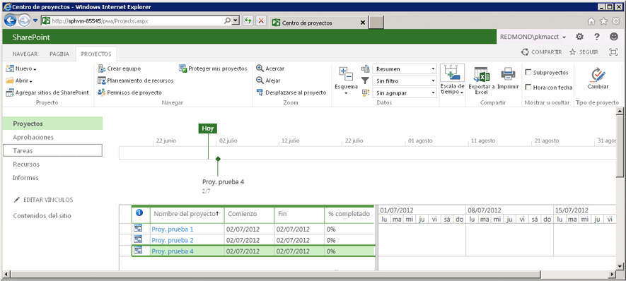

# <a name="getting-started-with-the-project-server-csom-and-net"></a><span data-ttu-id="04b27-105">Introducción a .NET y CSOM de Project Server</span><span class="sxs-lookup"><span data-stu-id="04b27-105">Getting started with the Project Server CSOM and .NET</span></span>

<span data-ttu-id="04b27-106">Puede usar el modelo de objetos del lado cliente (CSOM) de Project Server 2013 para desarrollar soluciones locales y de Project Online con .NET Framework 4.</span><span class="sxs-lookup"><span data-stu-id="04b27-106">You can use the Project Server 2013 client-side object model (CSOM) to develop Project Online and on-premises solutions with the .NET Framework 4.</span></span> <span data-ttu-id="04b27-107">En este artículo, se describe cómo crear una aplicación de consola en la que se usa CSOM para crear y publicar proyectos.</span><span class="sxs-lookup"><span data-stu-id="04b27-107">This article describes how to create a console application that uses the CSOM to create and publish projects.</span></span> <span data-ttu-id="04b27-108">Después de publicar un proyecto, la aplicación espera a que Project Server Queue Service termine con la acción de publicación y, después, enumera los proyectos publicados.</span><span class="sxs-lookup"><span data-stu-id="04b27-108">After publishing a project, the application waits for the Project Server Queue Service to finish with the publish action, and then lists the published projects.</span></span>
  
<span data-ttu-id="04b27-109">Para obtener una introducción general del CSOM de Project Server, vea [Actualizaciones para desarrolladores de Project 2013](updates-for-developers-in-project-2013.md).</span><span class="sxs-lookup"><span data-stu-id="04b27-109">For a general introduction to the Project Server CSOM, see What's new for developers in Project 2013. For reference topics in the CSOM namespace, see N:Microsoft.ProjectServer.Client.</span></span> <span data-ttu-id="04b27-110">Para obtener temas de referencia en el espacio de nombres del CSOM, vea [Microsoft.ProjectServer.Client](https://msdn.microsoft.com/library/Microsoft.ProjectServer.Client.aspx).</span><span class="sxs-lookup"><span data-stu-id="04b27-110">For reference topics in the CSOM namespace, see [Microsoft.ProjectServer.Client](https://msdn.microsoft.com/library/Microsoft.ProjectServer.Client.aspx) .</span></span> 
  
## <a name="creating-a-csom-project-in-visual-studio"></a><span data-ttu-id="04b27-111">Creación de un proyecto de CSOM en Visual Studio</span><span class="sxs-lookup"><span data-stu-id="04b27-111">Creating a CSOM project in Visual Studio</span></span>
<span data-ttu-id="04b27-112"><a name="pj15_GettingStartedCSOM_CreatingVSProject"> </a></span><span class="sxs-lookup"><span data-stu-id="04b27-112"></span></span>

<span data-ttu-id="04b27-113">Puede usar Visual Studio 2010 o Visual Studio 2012 para desarrollar soluciones en las que se use el CSOM de Project Server.</span><span class="sxs-lookup"><span data-stu-id="04b27-113">You can use Visual Studio 2010 or Visual Studio 2012 to develop solutions that use the Project Server CSOM.</span></span> <span data-ttu-id="04b27-114">En el CSOM de Project Server se incluyen tres ensamblados para el desarrollo de aplicaciones cliente, de Microsoft Silverlight y de Windows Phone 8 con .NET Framework 4.</span><span class="sxs-lookup"><span data-stu-id="04b27-114">The Project Server CSOM includes three assemblies for development of client applications, Microsoft Silverlight applications, and Windows Phone 8 applications by using the .NET Framework 4.</span></span> <span data-ttu-id="04b27-115">En el CSOM también se incluye un archivo de JavaScript para el desarrollo de aplicaciones web, como se describe en [Microsoft.ProjectServer.Client](https://msdn.microsoft.com/library/Microsoft.ProjectServer.Client.aspx).</span><span class="sxs-lookup"><span data-stu-id="04b27-115">The CSOM also includes a JavaScript file for development of web applications, as described in [Microsoft.ProjectServer.Client](https://msdn.microsoft.com/library/Microsoft.ProjectServer.Client.aspx) .</span></span> 
  
<span data-ttu-id="04b27-116">Puede copiar el ensamblado del CSOM que necesite desde el equipo de Project Server o desde la descarga del SDK de Project 2013 a un equipo de desarrollo remoto.</span><span class="sxs-lookup"><span data-stu-id="04b27-116">You can copy the CSOM assembly that you need from the Project Server computer or from the Project 2013 SDK download to a remote development computer.</span></span> <span data-ttu-id="04b27-117">La aplicación de consola **QueueCreateProject** que se describe en este tema no es una aplicación de Silverlight ni de Windows Phone 8, por lo que necesita el ensamblado Microsoft.ProjectServer.Client.dll.</span><span class="sxs-lookup"><span data-stu-id="04b27-117">The **QueueCreateProject** console application that is described in this topic is not a Silverlight application or a Windows Phone 8 application, so you need the Microsoft.ProjectServer.Client.dll assembly.</span></span> <span data-ttu-id="04b27-118">Como el CSOM es independiente de la Interfaz de Project Server (PSI) basada en ASMX o WCF, no hay que establecer referencias de servicio para PSI ni usar el espacio de nombres **Microsoft.Office.Project.Server.Library**.</span><span class="sxs-lookup"><span data-stu-id="04b27-118">Because the CSOM is independent of the WCF-based or ASMX-based Project Server Interface (PSI), you do not have to set service references for the PSI or use the **Microsoft.Office.Project.Server.Library** namespace.</span></span> 
  
<span data-ttu-id="04b27-p106">La aplicación **QueueCreateProject** utiliza argumentos de la línea de comandos para crear el nombre del proyecto y para limitar el tiempo de espera de la cola. En el Procedimiento 1, se crea la aplicación de la consola básica, se agrega una rutina para analizar la línea de comandos y se añade un mensaje de uso en caso de que haya errores en la línea de comandos.</span><span class="sxs-lookup"><span data-stu-id="04b27-p106">The **QueueCreateProject** application uses command-line arguments for the name of the project to create and for the queue timeout limit. In Procedure 1, you create the basic console application, add a routine to parse the command line, and add a usage message if there are errors in the command line.</span></span> 
  
### <a name="procedure-1-to-create-a-csom-project-in-visual-studio"></a><span data-ttu-id="04b27-p107">Procedimiento 1. Para crear un proyecto de CSOM en Visual Studio</span><span class="sxs-lookup"><span data-stu-id="04b27-p107">Procedure 1. To create a CSOM project in Visual Studio</span></span>

1. <span data-ttu-id="04b27-123">Copie el ensamblado Microsoft.ProjectServer.Client.dll desde la carpeta `%ProgramFiles%\Common Files\Microsoft Shared\Web Server Extensions\15\ISAPI\` al equipo de desarrollo.</span><span class="sxs-lookup"><span data-stu-id="04b27-123">Copy the Microsoft.ProjectServer.Client.dll assembly from the  `%ProgramFiles%\Common Files\Microsoft Shared\Web Server Extensions\15\ISAPI\` folder to your development computer.</span></span> <span data-ttu-id="04b27-124">Copie el ensamblado en una carpeta adecuada para otros ensamblados de referencia de Project Server y SharePoint que vaya a usar, como `C:\Project\Assemblies`.</span><span class="sxs-lookup"><span data-stu-id="04b27-124">Copy the Microsoft.ProjectServer.Client.dll assembly from the %ProgramFiles%\Common Files\Microsoft Shared\Web Server Extensions\15\ISAPI\ `C:\Project\Assemblies` folder to your development computer. Copy the assembly to a convenient folder for other Project Server and SharePoint reference assemblies that you will use, such as C:\Project\Assemblies.</span></span>
    
2. <span data-ttu-id="04b27-p109">Copie el ensamblado de Microsoft.SharePoint.Client.dll y el de Microsoft.SharePoint.Client.Runtime.dll de la misma carpeta de origen hasta su equipo de desarrollo. El ensamblado de Microsoft.ProjectServer.Client.dll tiene dependencias en los ensamblados de SharePoint relacionados.</span><span class="sxs-lookup"><span data-stu-id="04b27-p109">Copy the Microsoft.SharePoint.Client.dll assembly and the Microsoft.SharePoint.Client.Runtime.dll assembly from the same source folder to your development computer. The Microsoft.ProjectServer.Client.dll assembly has dependencies on the related SharePoint assemblies.</span></span>
    
3. <span data-ttu-id="04b27-127">En Visual Studio, cree una aplicación de consola de Windows y establezca el marco de destino en .NET Framework 4.</span><span class="sxs-lookup"><span data-stu-id="04b27-127">In Visual Studio, create a Windows console application, and set the target framework to .NET Framework 4.</span></span> <span data-ttu-id="04b27-128">Por ejemplo, asigne el nombre QueueCreateProject a la aplicación.</span><span class="sxs-lookup"><span data-stu-id="04b27-128">For example, name the application QueueCreateProject.</span></span>
    
   > [!NOTE]
   > <span data-ttu-id="04b27-p111">Si olvida definir el objetivo correcto, una vez que Visual Studio crea el proyecto, abra **QueueCreateProject Properties** en el menú **Proyecto**. En la pestaña **Aplicación**, en la lista desplegable **versión .NET Framework de destino** seleccione **.NET Framework 4**. No utilice **.NET Framework 4 Client Profile**.</span><span class="sxs-lookup"><span data-stu-id="04b27-p111">If you forget to set the correct target, after Visual Studio creates the project, open **QueueCreateProject Properties** in the **Project** menu. On the **Application** tab, in the **Target framework** drop-down list, choose **.NET Framework 4**. Do not use the **.NET Framework 4 Client Profile**.</span></span> 
  
4. <span data-ttu-id="04b27-132">En el Explorador de soluciones, establezca referencias a los ensamblados siguientes:</span><span class="sxs-lookup"><span data-stu-id="04b27-132">In Solution Explorer, set references to the following assemblies:</span></span>
    
   - <span data-ttu-id="04b27-133">Microsoft.ProjectServer.Client.dll</span><span class="sxs-lookup"><span data-stu-id="04b27-133">Microsoft.ProjectServer.Client.dll</span></span>
   - <span data-ttu-id="04b27-134">Microsoft.SharePoint.Client.dll</span><span class="sxs-lookup"><span data-stu-id="04b27-134">Microsoft.SharePoint.Client.dll</span></span>
   - <span data-ttu-id="04b27-135">Microsoft.SharePoint.Client.Runtime.dll</span><span class="sxs-lookup"><span data-stu-id="04b27-135">Microsoft.SharePoint.Client.Runtime.dll</span></span>
    
5. <span data-ttu-id="04b27-136">En el archivo Program.cs edite las instrucciones `using` como se indica a continuación.</span><span class="sxs-lookup"><span data-stu-id="04b27-136">In the Program.cs file, edit the using`using` statements, as follows.</span></span> 
    
   ```cs
    using System;
    using System.Collections.Generic;
    using System.Linq;
    using System.Text;
    using Microsoft.ProjectServer.Client;
   ```

6. <span data-ttu-id="04b27-p112">Agregue métodos para analizar los argumentos de la línea de comandos y el número de segundos del tiempo de espera de la cola, muestre la información de uso y salga de la aplicación. Reemplace el cuerpo principal del código del archivo Program.cs con el siguiente código.</span><span class="sxs-lookup"><span data-stu-id="04b27-p112">Add methods to parse the command-line arguments for the project name and the number of seconds for queue timeout, show usage information, and exit the application. Replace the main body of code in the Program.cs file with the following code.</span></span>
    
   ```cs
    namespace QueueCreateProject
    {
        class Program
        {
            static void Main(string[] args)
            {
                if (!ParseCommandLine(args))
                {
                    Usage();
                    ExitApp();
                }
                /* Add calls to methods here to get the project context and create a project. */
                ExitApp();
            }
            // Parse the command line. Return true if there are no errors.
            private static bool ParseCommandLine(string[] args)
            {
                bool error = false;
                int argsLen = args.Length;
                try
                {
                    for (int i = 0; i < argsLen; i++)
                    {
                        if (error) break;
                        if (args[i].StartsWith("-") || args[i].StartsWith("/"))
                            args[i] = "*" + args[i].Substring(1).ToLower();
                        switch (args[i])
                        {
                            case "*projname":
                            case "*n":
                                if (++i >= argsLen) return false;
                                projName = args[i];
                                break;
                            case "*timeout":
                            case "*t":
                                if (++i >= argsLen) return false;
                                timeoutSeconds = Convert.ToInt32(args[i]);
                                break;
                            case "*?":
                            default:
                                error = true;
                                break;
                        }
                    }
                }
                catch (FormatException)
                {
                    error = true;
                }
                if (string.IsNullOrEmpty(projName)) error = true;
                return !error;
            }
            private static void Usage()
            {
                string example = "Usage: QueueCreateProject -projName | -n \"New project name\" [-timeout | -t sec]";
                example += "\nExample: QueueCreateProject -n \"My new project\"";
                example += "\nDefault timeout seconds = " + timeoutSeconds.ToString();
                Console.WriteLine(example);
            }
            private static void ExitApp()
            {
                Console.Write("\nPress any key to exit... ");
                Console.ReadKey(true);
                Environment.Exit(0);
            }
        }
    }
   ```

## <a name="getting-the-project-context"></a><span data-ttu-id="04b27-139">Obtención del contexto del proyecto</span><span class="sxs-lookup"><span data-stu-id="04b27-139">Getting the project context</span></span>
<span data-ttu-id="04b27-140"><a name="pj15_GettingStartedCSOM_GettingContext"> </a></span><span class="sxs-lookup"><span data-stu-id="04b27-140"></span></span>

<span data-ttu-id="04b27-141">El desarrollo de CSOM requiere que se inicialice el objeto **ProjectContext** con la dirección URL de Project Web App.</span><span class="sxs-lookup"><span data-stu-id="04b27-141">CSOM development requires the **ProjectContext** object to be initialized with the Project Web App URL.</span></span> <span data-ttu-id="04b27-142">En el código del Procedimiento 2 se usa la constante **pwaPath**.</span><span class="sxs-lookup"><span data-stu-id="04b27-142">The code in Procedure 2 uses the **pwaPath** constant.</span></span> <span data-ttu-id="04b27-143">Si tiene previsto usar la aplicación para varias instancias de Project Web App, podría convertir **pwaPath** en una variable y agregar otro argumento de línea de comandos.</span><span class="sxs-lookup"><span data-stu-id="04b27-143">If you plan to use the application for multiple instances of Project Web App, you could make **pwaPath** a variable and add another command-line argument.</span></span> 
  
### <a name="procedure-2-to-get-the-project-context"></a><span data-ttu-id="04b27-p114">Procedimiento 2. Para obtener el contexto del proyecto</span><span class="sxs-lookup"><span data-stu-id="04b27-p114">Procedure 2. To get the project context</span></span>

1. <span data-ttu-id="04b27-146">Agregue las constantes y variables de la clase **Program** que la aplicación **QueueCreateProject** va a usar.</span><span class="sxs-lookup"><span data-stu-id="04b27-146">Add **Program** class constants and variables that the **QueueCreateProject** application will use.</span></span> <span data-ttu-id="04b27-147">Además de la dirección URL de Project Web App, la aplicación usa el nombre del tipo de proyecto empresarial predeterminado (EPT), el nombre del proyecto que se va a crear y un tiempo de espera de cola máximo en segundos.</span><span class="sxs-lookup"><span data-stu-id="04b27-147">In addition to the Project Web App URL, the application uses the name of the default enterprise project type (EPT), the name of the project to create, and a maximum queue timeout in seconds.</span></span> <span data-ttu-id="04b27-148">En este caso, la variable **timeoutSeconds** permite probar cómo afectan a la aplicación varios valores para el tiempo de espera.</span><span class="sxs-lookup"><span data-stu-id="04b27-148">In this case, the **timeoutSeconds** variable enables you to test how various values for the timeout affect the application.</span></span> <span data-ttu-id="04b27-149">El objeto **ProjectContext** es el objeto principal para acceder al CSOM.</span><span class="sxs-lookup"><span data-stu-id="04b27-149">The **ProjectContext** object is the primary object for access to the CSOM.</span></span> 
    
   ```cs
    private const string pwaPath = "https://ServerName /pwa/"; // Change the path to your Project Web App instance.
    private static string basicEpt = "Enterprise Project";   // Basic enterprise project type.
    private static string projName = string.Empty;
    private static int timeoutSeconds = 10;  // The maximum wait time for a queue job, in seconds.
    private static ProjectContext projContext;
   ```

2. <span data-ttu-id="04b27-150">Reemplace el comentario `/* Add calls to methods here to get the project context and create a project. */` con el código siguiente.</span><span class="sxs-lookup"><span data-stu-id="04b27-150">Replace the `/* Add calls to methods here to get the project context and create a project. */` with the following code.</span></span> <span data-ttu-id="04b27-151">El objeto **Microsoft.ProjectServer.Client.ProjectContext** se inicializa con la dirección URL de Project Web App.</span><span class="sxs-lookup"><span data-stu-id="04b27-151">The **Microsoft.ProjectServer.Client.ProjectContext** object is initialized with the Project Web App URL.</span></span> <span data-ttu-id="04b27-152">Los métodos **CreateTestProject** y **ListPublishedProjects** se muestran en el Procedimiento 4 y el Procedimiento 5.</span><span class="sxs-lookup"><span data-stu-id="04b27-152">The **CreateTestProject** method and the **ListPublishedProjects** method are shown in Procedure 4 and Procedure 5.</span></span> 
    
   ```cs
    projContext = new ProjectContext(pwaPath);
    if (CreateTestProject())
        ListPublishedProjects();
    else
        Console.WriteLine("\nProject creation failed: {0}", projName);
   ```

## <a name="getting-an-enterprise-project-type"></a><span data-ttu-id="04b27-153">Obtención de un tipo de proyecto empresarial</span><span class="sxs-lookup"><span data-stu-id="04b27-153">Getting an enterprise project type</span></span>
<span data-ttu-id="04b27-154"><a name="pj15_GettingStartedCSOM_GettingEPT"> </a></span><span class="sxs-lookup"><span data-stu-id="04b27-154"></span></span>

<span data-ttu-id="04b27-p117">La aplicación de prueba **QueueCreateProject** selecciona explícitamente el tipo de proyecto empresarial (EPT) de Enterprise Project para mostrar cómo una aplicación puede seleccionar el tipo de proyecto empresarial (EPT) para un proyecto. Si la información sobre la creación de un proyecto no especifica el GUID del tipo de proyecto empresarial (EPT), la aplicación usaría entonces el tipo de proyecto empresarial (EPT) predeterminado. El método **GetEptUid** se utiliza por el **CreateTestProject** que se describe en el Procedimiento 4.</span><span class="sxs-lookup"><span data-stu-id="04b27-p117">The **QueueCreateProject** sample application explicitly selects the Enterprise Project EPT, to show how an application can select the EPT for a project. If the project creation information does not specify the EPT GUID, an application would use the default EPT. The **GetEptUid** method is used by the **CreateTestProject** method that is described in Procedure 4.</span></span> 
  
<span data-ttu-id="04b27-p118">El método **GetEptUid** consulta al objeto **ProjectContext** acerca de la recopilación de **EnterpriseProjectTypes** en la que el nombre del tipo de proyecto empresarial (EPT) iguala al nombre especializado. Tras ejecutar la consulta, la variable **eptUid** se define en el GUID del primer objeto **EnterpriseProjectType** en la recopilación **eptList**. Debido a que los nombres del tipo de proyecto empresarial (EPT) son únicos, solo hay un objeto **EnterpriseProjectType** cuyo nombre está especificado.</span><span class="sxs-lookup"><span data-stu-id="04b27-p118">The **GetEptUid** method queries the **ProjectContext** object for the collection of **EnterpriseProjectTypes** where the EPT name equals the specified name. After executing the query, the **eptUid** variable is set to the GUID of the first **EnterpriseProjectType** object in the **eptList** collection. Because EPT names are unique, there is only one **EnterpriseProjectType** object that has the specified name.</span></span> 
  
### <a name="procedure-3-to-get-the-guid-of-an-ept-for-a-new-project"></a><span data-ttu-id="04b27-p119">Procedimiento 3. Para obtener el GUID de un EPT para un proyecto nuevo</span><span class="sxs-lookup"><span data-stu-id="04b27-p119">Procedure 3. To get the GUID of an EPT for a new project</span></span>

- <span data-ttu-id="04b27-163">Agregue el método **GetEptUid** a la clase **Program**.</span><span class="sxs-lookup"><span data-stu-id="04b27-163">Add the **GetEptUid** method to the **Program** class.</span></span> 
    
   ```cs
    // Get the GUID of the specified enterprise project type.
    private static Guid GetEptUid(string eptName)
    {
        Guid eptUid = Guid.Empty;
        try
        {
            // Get the list of EPTs that have the specified name. 
            // If the EPT name exists, the list will contain only one EPT.
            var eptList = projContext.LoadQuery(
                projContext.EnterpriseProjectTypes.Where(
                    ept => ept.Name == eptName));
            projContext.ExecuteQuery();
            eptUid = eptList.First().Id;
        }
        catch (Exception ex)
        {
            string msg = string.Format("GetEptUid: eptName = \"{0}\"\n\n{1}",
                eptName, ex.GetBaseException().ToString());
            throw new ArgumentException(msg);
        }
        return eptUid;
    }
   ```

<span data-ttu-id="04b27-p120">Hay varias formas de encontrar el GUID del tipo de proyecto empresarial (EPT). La consulta mostrada en el método **GetEptUid** es eficiente ya que descarga solo el objeto **EnterpriseProjectType** que coincide con el nombre del tipo de proyecto empresarial (EPT). La rutina alternativa que sigue es menos eficiente, dado que descarga toda la lista de tipos de proyectos empresariales (EPT) en la aplicación de cliente y procesa una iteración a lo largo de la lista.</span><span class="sxs-lookup"><span data-stu-id="04b27-p120">There are several ways to find the EPT GUID. The query shown in the **GetEptUid** method is efficient because it downloads only the one **EnterpriseProjectType** object that matches the EPT name. The following alternate routine is less efficient, because it downloads the complete list of EPTs to the client application and iterates through the list.</span></span> 

```cs
foreach (EnterpriseProjectType ept in projSvr.EnterpriseProjectTypes)
{
    if (ept.Name == eptName)
    {
        eptUid = ept.Id;
        break;
    }
}
```

<span data-ttu-id="04b27-167">En la rutina siguiente se usa una consulta LINQ y una expresión lambda para seleccionar el objeto EPT, pero se siguen descargando todos los objetos **EnterpriseProjectType**.</span><span class="sxs-lookup"><span data-stu-id="04b27-167">The following routine uses a LINQ query and lambda expression to select the EPT object, but still downloads all of the **EnterpriseProjectType** objects.</span></span> 

```cs
var eptList = projContext.LoadQuery(projContext.EnterpriseProjectTypes);
projContext.ExecuteQuery();
eptUid = eptList.First(ept => ept.Name == eptName).Id;
```

## <a name="setting-the-creation-information-and-publishing-the-project"></a><span data-ttu-id="04b27-168">Configuración de la información de creación y publicación del proyecto</span><span class="sxs-lookup"><span data-stu-id="04b27-168">Setting the creation information and publishing the project</span></span>
<span data-ttu-id="04b27-169"><a name="pj15_GettingStartedCSOM_ProjectCreation"> </a></span><span class="sxs-lookup"><span data-stu-id="04b27-169"></span></span>

<span data-ttu-id="04b27-p121">El método **CreateTestProject** crea un objeto **ProjectCreationInformation** y especifica la información necesaria para crear un proyecto. Son necesarios el GUID del proyecto y el nombre. La fecha de inicio, la descripción del proyecto y el GUID del tipo de proyecto empresarial (EPT) son opcionales.</span><span class="sxs-lookup"><span data-stu-id="04b27-p121">The **CreateTestProject** method creates a **ProjectCreationInformation** object and specifies the information that is required to create a project. The project GUID and name are required; the start date, project description, and EPT GUID are optional.</span></span> 
  
<span data-ttu-id="04b27-p122">Tras definir las nuevas propiedades del proyecto, el método **Projects.Add** agrega el proyecto a la recopilación **Projects**. Para guardar y publicar el proyecto, debe llamar al método **Projects.Update**, enviar un mensaje a la cola de Project Server y crear el proyecto.</span><span class="sxs-lookup"><span data-stu-id="04b27-p122">After setting the new project properties, the **Projects.Add** method adds the project to the **Projects** collection. To save and publish the project, you must call the **Projects.Update** method to send a message to the Project Server queue and create the project.</span></span> 
  
### <a name="procedure-4-to-set-the-new-project-properties-create-the-project-and-publish-the-project"></a><span data-ttu-id="04b27-p123">Procedimiento 4. Para establecer las propiedades del proyecto nuevo, crearlo y publicarlo</span><span class="sxs-lookup"><span data-stu-id="04b27-p123">Procedure 4. To set the new project properties, create the project, and publish the project</span></span>

1. <span data-ttu-id="04b27-p124">Agregue el método **CreateTestProject** a la clase **Program**. El siguiente código crea y publica un proyecto, pero no espera a que finalice el trabajo en cola.</span><span class="sxs-lookup"><span data-stu-id="04b27-p124">Add the **CreateTestProject** method to the **Program** class. The following code creates and publishes a project, but does not wait for the queue job to complete.</span></span> 
    
   ```cs
    // Create a project.
    private static bool CreateTestProject()
    {
        bool projCreated = false;
        try
        {
            Console.Write("\nCreating project: {0} ...", projName);
            ProjectCreationInformation newProj = new ProjectCreationInformation();
            newProj.Id = Guid.NewGuid();
            newProj.Name = projName;
            newProj.Description = "Test creating a project with CSOM";
            newProj.Start = DateTime.Today.Date;
            // Setting the EPT GUID is optional. If no EPT is specified, Project Server  
            // uses the default EPT. 
            newProj.EnterpriseProjectTypeId = GetEptUid(basicEpt);
            PublishedProject newPublishedProj = projContext.Projects.Add(newProj);
            QueueJob qJob = projContext.Projects.Update();
            /* Add code here to wait for the queue. */
        }
        catch(Exception ex)
        {
            Console.ForegroundColor = ConsoleColor.Red;
            Console.WriteLine("\nError: {0}", ex.Message);
            Console.ResetColor();
        }
        return projCreated;
    }
   ```

2. <span data-ttu-id="04b27-178">Reemplace el comentario `/* Add code here to wait for the queue. */` con el código siguiente para esperar al trabajo en cola.</span><span class="sxs-lookup"><span data-stu-id="04b27-178">Replace the  `/* Add code here to wait for the queue. */` comment with the following code to wait for the queue job.</span></span> <span data-ttu-id="04b27-179">La rutina espera un máximo del número de segundos **timeoutSeconds** especificados, o bien continúa si el trabajo en cola se completa antes del tiempo de espera.</span><span class="sxs-lookup"><span data-stu-id="04b27-179">The routine waits a maximum of the specified **timeoutSeconds** number of seconds, or proceeds if the queue job completes before the timeout.</span></span> <span data-ttu-id="04b27-180">Para obtener los estados posibles del trabajo en cola, vea [Microsoft.ProjectServer.Client.JobState](https://msdn.microsoft.com/library/Microsoft.ProjectServer.Client.JobState.aspx).</span><span class="sxs-lookup"><span data-stu-id="04b27-180">For possible queue job states, see [Microsoft.ProjectServer.Client.JobState](https://msdn.microsoft.com/library/Microsoft.ProjectServer.Client.JobState.aspx) .</span></span> 
    
   <span data-ttu-id="04b27-p126">Las llamadas al método **Load** y al método **ExecuteQuery** para el objeto **QueueJob** son opcionales. Si el objeto **QueueJob** no se ha inicializado cuando llama al método **WaitForQueue**, Project Server lo inicializa.</span><span class="sxs-lookup"><span data-stu-id="04b27-p126">Calling the **Load** method and the **ExecuteQuery** method for the **QueueJob** object is optional. If the **QueueJob** object is not initialized when you call the **WaitForQueue** method, Project Server initializes it.</span></span> 
    
   ```cs
    // Calling Load and ExecuteQuery for the queue job is optional.
    // projContext.Load(qJob);
    // projContext.ExecuteQuery();
    JobState jobState = projContext.WaitForQueue(qJob, timeoutSeconds);
    if (jobState == JobState.Success)
    {
        projCreated = true;
    }
    else
    {
        Console.ForegroundColor = ConsoleColor.Yellow;
        Console.WriteLine("\nThere is a problem in the queue. Timeout is {0} seconds.", 
            timeoutSeconds);
        Console.WriteLine("\tQueue JobState: {0}", jobState.ToString());
        Console.ResetColor();
    }
    Console.WriteLine();
   ```

## <a name="listing-the-published-projects"></a><span data-ttu-id="04b27-183">Enumeración de los proyectos publicados</span><span class="sxs-lookup"><span data-stu-id="04b27-183">Listing the published projects</span></span>
<span data-ttu-id="04b27-184"><a name="pj15_GettingStartedCSOM_ListingPublished"> </a></span><span class="sxs-lookup"><span data-stu-id="04b27-184"></span></span>

<span data-ttu-id="04b27-185">El método **ListPublishedProjects** obtiene la colección de todos los proyectos publicados en Project Web App.</span><span class="sxs-lookup"><span data-stu-id="04b27-185">The **ListPublishedProjects** method gets the collection of all projects that are published in Project Web App.</span></span> <span data-ttu-id="04b27-186">Si el trabajo en cola que crea un proyecto en el Procedimiento 4 no finaliza correctamente o agota el tiempo de espera, el nuevo proyecto no se incluye en la colección **Projects**.</span><span class="sxs-lookup"><span data-stu-id="04b27-186">The **ListPublishedProjects** method gets the collection of all projects that are published in pwa. If the queue job that creates a project in Procedure 4 does not complete successfully or times out, the new project is not included in the Projects collection.</span></span> 
  
### <a name="procedure-5-to-list-the-published-projects"></a><span data-ttu-id="04b27-p128">Procedimiento 5. Para enumerar los proyectos publicados</span><span class="sxs-lookup"><span data-stu-id="04b27-p128">Procedure 5. To list the published projects</span></span>

1. <span data-ttu-id="04b27-189">Agregue el método **ListPublishedProjects** a la clase **Program**.</span><span class="sxs-lookup"><span data-stu-id="04b27-189">Add the **ListPublishedProjects** method to the **Program** class.</span></span> 
    
   ```cs
    // List the published projects.
    private static void ListPublishedProjects()
    {
        // Get the list of projects on the server.
        projContext.Load(projContext.Projects);
        projContext.ExecuteQuery();
        Console.WriteLine("\nProject ID : Project name : Created date");
        foreach (PublishedProject pubProj in projContext.Projects)
        {
            Console.WriteLine("\n\t{0} :\n\t{1} : {2}", pubProj.Id.ToString(), pubProj.Name,
                pubProj.CreatedDate.ToString());
        }
    }
   ```

2. <span data-ttu-id="04b27-190">Establezca el valor correcto para la dirección URL de Project Web App, compile la aplicación **QueueCreateProject** y, después, pruébela como se indica en el Procedimiento 6.</span><span class="sxs-lookup"><span data-stu-id="04b27-190">Set the correct value for your pwa URL, compile the QueueCreateProject application, and then test the application as in Procedure 6.</span></span> 
    
## <a name="testing-the-queuecreateproject-application"></a><span data-ttu-id="04b27-191">Prueba de la aplicación QueueCreateProject</span><span class="sxs-lookup"><span data-stu-id="04b27-191">Testing the QueueCreateProject application</span></span>
<span data-ttu-id="04b27-192"><a name="pj15_GettingStartedCSOM_Testing"> </a></span><span class="sxs-lookup"><span data-stu-id="04b27-192"></span></span>

<span data-ttu-id="04b27-193">Al ejecutar por primera vez la aplicación **QueueCreateProject** en una instancia de prueba de Project Web App, sobre todo si Project Server está instalado en una máquina virtual, es posible que la aplicación requiera más tiempo de ejecución que el tiempo de espera predeterminado de diez segundos.</span><span class="sxs-lookup"><span data-stu-id="04b27-193">When you first run the QueueCreateProject application on a test instance of pwa, especially if Project Server is installed on a virtual machine, the application may require more time to run than the default queue timeout of ten seconds.</span></span> 
  
### <a name="procedure-6-to-test-the-queuecreateproject-application"></a><span data-ttu-id="04b27-p129">Procedimiento 6. Para probar la aplicación QueueCreateProject</span><span class="sxs-lookup"><span data-stu-id="04b27-p129">Procedure 6. To test the QueueCreateProject application</span></span>

1. <span data-ttu-id="04b27-196">Abra la ventana de **Propiedades de QueueCreateProject**, haga clic en la pestaña **Depuración** y, después, agregue los argumentos de línea de comandos siguientes en la sección **Iniciar opciones**: `-n "Test proj 1" -t 20`.</span><span class="sxs-lookup"><span data-stu-id="04b27-196">Open the **QueueCreateProject Properties** window, select the **Debug** tab, and then add the following command-line arguments in the **Start Options** section: -n "Test proj 1" -t 20`-n "Test proj 1" -t 20`</span></span>
    
   <span data-ttu-id="04b27-197">Ejecute la aplicación (por ejemplo, presione **F5**).</span><span class="sxs-lookup"><span data-stu-id="04b27-197">Run the application (for example, press **F5**).</span></span> <span data-ttu-id="04b27-198">Si el valor de tiempo de espera es suficientemente largo, la aplicación muestra la salida siguiente (si existen otros proyectos publicados en la instancia de Project Web App, también se mostrarán):</span><span class="sxs-lookup"><span data-stu-id="04b27-198">Run the application (for example, press F5). If the timeout value is long enough, the application shows the following output (if other published projects exist in your pwa instance, they will also be shown):</span></span>
    
   ```MS-DOS
    Creating project: Test proj 1 ...
    Project ID : Project name : Created date
            b34d7009-753f-4abb-9191-f4b15a82aac3 :
            Test proj 1 : 9/22/2011 11:27:57 AM
    Press any key to exit...
   ```

2. <span data-ttu-id="04b27-199">Ejecute otra prueba con los argumentos de línea de comandos siguientes, para usar el tiempo de espera predeterminado de diez segundos: `-n "Test proj 1"`.</span><span class="sxs-lookup"><span data-stu-id="04b27-199">Run another test with the following command-line arguments, to use the default 10-second queue timeout: -n "Test proj 1" `-n "Test proj 1"`</span></span>
    
   <span data-ttu-id="04b27-200">Como Test proj 1 ya existe, la aplicación muestra la salida siguiente.</span><span class="sxs-lookup"><span data-stu-id="04b27-200">Because Test proj 1 already exists, the application shows the following output.</span></span>
    
   ```MS-DOS
    Creating project: Test proj 1 ...
    Error: PJClientCallableException: ProjectNameAlreadyExists
    ProjectNameAlreadyExists
    projName = Test proj 1
    Project creation failed: Test proj 1
    Press any key to exit...
   ```

3. <span data-ttu-id="04b27-201">Ejecute otra prueba con los argumentos de línea de comandos siguientes, para usar el tiempo de espera de cola predeterminado de diez segundos: `-n "Test proj 2"`.</span><span class="sxs-lookup"><span data-stu-id="04b27-201">Run another test with the following command-line arguments, to use the default 10-second queue timeout: -n "Test proj 2" `-n "Test proj 2"`</span></span>
    
   <span data-ttu-id="04b27-202">La aplicación **QueueCreateProject** crea y publica el proyecto denominado Test proj 2.</span><span class="sxs-lookup"><span data-stu-id="04b27-202">The **QueueCreateProject** application creates and publishes the project named Test proj 2.</span></span> 
    
4. <span data-ttu-id="04b27-203">Ejecute otra prueba con los argumentos de línea de comandos siguientes y establezca el tiempo de espera para que sea demasiado corto como para finalizar el trabajo en cola: `-n "Test proj 3" -t 1`.</span><span class="sxs-lookup"><span data-stu-id="04b27-203">Run another test with the following command-line arguments, and set the timeout to be too short for the queue job to finish: -n "Test proj 3" –t 1`-n "Test proj 3" -t 1`</span></span>
    
   <span data-ttu-id="04b27-p131">Como el tiempo de espera de la cola es demasiado corto, no se crea el proyecto. La aplicación muestra la salida siguiente.</span><span class="sxs-lookup"><span data-stu-id="04b27-p131">Because the queue timeout is too short, the project is not created. The application shows the following output.</span></span>
    
   ```MS-DOS
    Creating project: Test proj 3 ...
    There is a problem in the queue. Timeout is 1 seconds.
            Queue JobState: Unknown
    Project creation failed: Test proj 3
    Press any key to exit...
   ```

5. <span data-ttu-id="04b27-206">Modifique el código para que la aplicación no espere al trabajo en cola.</span><span class="sxs-lookup"><span data-stu-id="04b27-206">Modify the code so that the application does not wait for the queue job.</span></span> <span data-ttu-id="04b27-207">Por ejemplo, comente el código en el que se espera a la cola, excepto la línea `projCreated = true`, como se indica a continuación.</span><span class="sxs-lookup"><span data-stu-id="04b27-207">Modify the code so that the application does not wait for the queue job. For example, comment out the code that waits for the queue, except for the projCreated = true`projCreated = true` line, as follows.</span></span> 
    
   ```cs
    //JobState jobState = projContext.WaitForQueue(qJob, timeoutSeconds);
    //if (jobState == JobState.Success)
    //{
    projCreated = true;
    //}
    //else
    //{
    //    Console.ForegroundColor = ConsoleColor.Yellow;
    //    Console.WriteLine("\nThere is a problem in the queue. Timeout is {0} seconds.",
    //        timeoutSeconds);
    //    Console.WriteLine("\tQueue JobState: {0}", jobState.ToString());
    //    Console.ResetColor();
    //}
    
   ```

6. <span data-ttu-id="04b27-208">Recompile la aplicación y ejecute otra prueba con los argumentos de línea de comandos siguientes: `-n "Test proj 4"`.</span><span class="sxs-lookup"><span data-stu-id="04b27-208">Recompile the application and run another test with the following command-line arguments: -n "Test proj 4" `-n "Test proj 4"`</span></span>
    
   <span data-ttu-id="04b27-p133">Dado que la rutina **WaitForQueue** ha sido excluida mediante comentario, la aplicación no utiliza el valor de tiempo de espera predeterminado. Incluso aunque la aplicación no espere la cola, es posible mostrar Test proj 4, si la acción publicar es lo suficientemente rápida en Project Server.</span><span class="sxs-lookup"><span data-stu-id="04b27-p133">Because the **WaitForQueue** routine is commented out, the application does not use the default timeout value. Even though the application does not wait for the queue, it may show Test proj 4, if the publish action in Project Server is fast enough.</span></span> 
    
   ```MS-DOS
    Creating project: Test proj 4 ...
    Project ID : Project name : Created date
            cdd54103-082f-425c-b075-9ff52ac7d4e6 :
            Test proj 2 : 9/25/2011 4:28:55 PM
            b34d7009-753f-4abb-9191-f4b15a82aac3 :
            Test proj 1 : 9/22/2011 11:27:57 AM
            5c0c73f2-f5dd-499b-8bd8-ebb74bf8c122 :
            Test proj 4 : 9/25/2011 4:39:21 PM
    Press any key to exit...
   ```

<span data-ttu-id="04b27-211">Actualice la página Centro de proyectos en Project Web App (`https://ServerName/ProjectServerName/Projects.aspx`) para mostrar los proyectos publicados.</span><span class="sxs-lookup"><span data-stu-id="04b27-211">Refresh the Project Center page in Project Web App (`https://ServerName/ProjectServerName/Projects.aspx`), to show the published projects.</span></span> <span data-ttu-id="04b27-212">En la figura siguiente se muestra que los proyectos de prueba se han publicado.</span><span class="sxs-lookup"><span data-stu-id="04b27-212">The following figure shows that the test projects are published.</span></span>

<span data-ttu-id="04b27-213">**Comprobación de los proyectos publicados en Project Web App**</span><span class="sxs-lookup"><span data-stu-id="04b27-213">**Checking the published projects in Project Web App**</span></span>

<span data-ttu-id="04b27-214"></span><span class="sxs-lookup"><span data-stu-id="04b27-214"></span></span>
  
<span data-ttu-id="04b27-215">En la aplicación de prueba **QueueCreateProject** se muestra un ejemplo típico de cómo crear una entidad de proyecto con el CSOM mediante la clase **ProjectCreationInformation**, cómo agregar el proyecto a la colección publicada y cómo esperar un trabajo en cola con el método **WaitForQueue**, además de cómo enumerar la colección de proyectos publicados.</span><span class="sxs-lookup"><span data-stu-id="04b27-215">The **QueueCreateProject** sample application shows a typical example of how to create a project entity with the CSOM by using the **ProjectCreationInformation** class, how to add the project to the published Projects collection, how to wait for a queue job by using the **WaitForQueue** method, and how to enumerate the collection of published projects.</span></span> 
  
## <a name="complete-code-example"></a><span data-ttu-id="04b27-216">Ejemplo de código completo</span><span class="sxs-lookup"><span data-stu-id="04b27-216">Complete code example</span></span>
<span data-ttu-id="04b27-217"><a name="pj15_GettingStartedCSOM_CompleteCode"> </a></span><span class="sxs-lookup"><span data-stu-id="04b27-217"></span></span>

<span data-ttu-id="04b27-218">A continuación, se muestra el código completo para la aplicación de ejemplo **QueueCreateProject**.</span><span class="sxs-lookup"><span data-stu-id="04b27-218">Following is the complete code for the sample console application.</span></span> <span data-ttu-id="04b27-219">En la referencia de la clase [Microsoft.ProjectServer.Client.ProjectCreationInformation](https://msdn.microsoft.com/library/Microsoft.ProjectServer.Client.ProjectCreationInformation.aspx) también se incluye el código de este tema.</span><span class="sxs-lookup"><span data-stu-id="04b27-219">The following is the complete code for the QueueCreateProject sample application. The [T:Microsoft.ProjectServer.Client.ProjectCreationInformation](https://msdn.microsoft.com/library/Microsoft.ProjectServer.Client.ProjectCreationInformation.aspx) class reference also includes the code in this topic.</span></span> 
  
```cs
using System;
using System.Collections.Generic;
using System.Linq;
using System.Text;
using Microsoft.ProjectServer.Client;
namespace QueueCreateProject
{
    class Program
    {
        private const string pwaPath = "https://ServerName /pwa/"; // Change the path to your Project Web App instance.
        private static string basicEpt = "Enterprise Project";   // Basic enterprise project type.
        private static string projName = string.Empty;
        private static int timeoutSeconds = 10;  // The maximum wait time for a queue job, in seconds.
        private static ProjectContext projContext;
        static void Main(string[] args)
        {
            if (!ParseCommandLine(args))
            {
                Usage();
                ExitApp();
            }
            projContext = new ProjectContext(pwaPath);
            if (CreateTestProject())
                ListPublishedProjects();
            else
                Console.WriteLine("\nProject creation failed: {0}", projName);
            ExitApp();
        }
        // Create a project.
        private static bool CreateTestProject()
        {
            bool projCreated = false;
            try
            {
                Console.Write("\nCreating project: {0} ...", projName);
                ProjectCreationInformation newProj = new ProjectCreationInformation();
                newProj.Id = Guid.NewGuid();
                newProj.Name = projName;
                newProj.Description = "Test creating a project with CSOM";
                newProj.Start = DateTime.Today.Date;
                // Setting the EPT GUID is optional. If no EPT is specified, Project Server uses 
                // the default EPT. 
                newProj.EnterpriseProjectTypeId = GetEptUid(basicEpt);
                PublishedProject newPublishedProj = projContext.Projects.Add(newProj);
                QueueJob qJob = projContext.Projects.Update();
                // Calling Load and ExecuteQuery for the queue job is optional. If qJob is 
                // not initialized when you call WaitForQueue, Project Server initializes it.
                // projContext.Load(qJob);
                // projContext.ExecuteQuery();
                JobState jobState = projContext.WaitForQueue(qJob, timeoutSeconds);
                if (jobState == JobState.Success)
                {
                    projCreated = true;
                }
                else
                {
                    Console.ForegroundColor = ConsoleColor.Yellow;
                    Console.WriteLine("\nThere is a problem in the queue. Timeout is {0} seconds.", 
                        timeoutSeconds);
                    Console.WriteLine("\tQueue JobState: {0}", jobState.ToString());
                    Console.ResetColor();
                }
                Console.WriteLine();
            }
            catch(Exception ex)
            {
                Console.ForegroundColor = ConsoleColor.Red;
                Console.WriteLine("\nError: {0}", ex.Message);
                Console.ResetColor();
            }
            return projCreated;
        }
        // Get the GUID of the specified enterprise project type.
        private static Guid GetEptUid(string eptName)
        {
            Guid eptUid = Guid.Empty;
            try
            {
                // Get the list of EPTs that have the specified name. 
                // If the EPT name exists, the list will contain only one EPT.
                var eptList = projContext.LoadQuery(
                    projContext.EnterpriseProjectTypes.Where(
                        ept => ept.Name == eptName));
                projContext.ExecuteQuery();
                eptUid = eptList.First().Id;
                // Alternate routines to find the EPT GUID. Both (a) and (b) download the entire list of EPTs.
                // (a) Using a foreach block:
                //foreach (EnterpriseProjectType ept in projSvr.EnterpriseProjectTypes)
                //{
                //    if (ept.Name == eptName)
                //    {
                //        eptUid = ept.Id;
                //        break;
                //    }
                //}
                // (b) Querying for the EPT list, and then using a lambda expression to select the EPT:
                //var eptList = projContext.LoadQuery(projContext.EnterpriseProjectTypes);
                //projContext.ExecuteQuery();
                //eptUid = eptList.First(ept => ept.Name == eptName).Id;
            }
            catch (Exception ex)
            {
                string msg = string.Format("GetEptUid: eptName = \"{0}\"\n\n{1}",
                    eptName, ex.GetBaseException().ToString());
                throw new ArgumentException(msg);
            }
            return eptUid;
        }
        // List the published projects.
        private static void ListPublishedProjects()
        {
            // Get the list of projects on the server.
            projContext.Load(projContext.Projects);
            projContext.ExecuteQuery();
            Console.WriteLine("\nProject ID : Project name : Created date");
            foreach (PublishedProject pubProj in projContext.Projects)
            {
                Console.WriteLine("\n\t{0} :\n\t{1} : {2}", pubProj.Id.ToString(), pubProj.Name,
                    pubProj.CreatedDate.ToString());
            }
        }
        // Parse the command line. Return true if there are no errors.
        private static bool ParseCommandLine(string[] args)
        {
            bool error = false;
            int argsLen = args.Length;
            try
            {
                for (int i = 0; i < argsLen; i++)
                {
                    if (error) break;
                    if (args[i].StartsWith("-") || args[i].StartsWith("/"))
                        args[i] = "*" + args[i].Substring(1).ToLower();
                    switch (args[i])
                    {
                        case "*projname":
                        case "*n":
                            if (++i >= argsLen) return false;
                            projName = args[i];
                            break;
                        case "*timeout":
                        case "*t":
                            if (++i >= argsLen) return false;
                            timeoutSeconds = Convert.ToInt32(args[i]);
                            break;
                        case "*?":
                        default:
                            error = true;
                            break;
                    }
                }
            }
            catch (FormatException)
            {
                error = true;
            }
            if (string.IsNullOrEmpty(projName)) error = true;
            return !error;
        }
        private static void Usage()
        {
            string example = "Usage: QueueCreateProject -projName | -n \"New project name\" [-timeout | -t sec]";
            example += "\nExample: QueueCreateProject -n \"My new project\"";
            example += "\nDefault timeout seconds = " + timeoutSeconds.ToString();
            Console.WriteLine(example);
        }
        private static void ExitApp()
        {
            Console.Write("\nPress any key to exit... ");
            Console.ReadKey(true);
            Environment.Exit(0);
        }
    }
}
```

## <a name="see-also"></a><span data-ttu-id="04b27-220">Vea también</span><span class="sxs-lookup"><span data-stu-id="04b27-220">See also</span></span>

- [<span data-ttu-id="04b27-221">Actualizaciones para desarrolladores de Project 2013</span><span class="sxs-lookup"><span data-stu-id="04b27-221">Updates for developers in Project 2013</span></span>](updates-for-developers-in-project-2013.md) 
- [<span data-ttu-id="04b27-222">Modelo de objetos de cliente (CSOM) para Project 2013</span><span class="sxs-lookup"><span data-stu-id="04b27-222">Client-side object model (CSOM) for Project Server 2013</span></span>](client-side-object-model-csom-for-project-2013.md)
    

