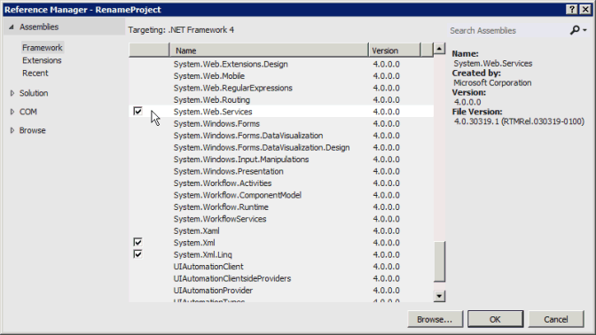
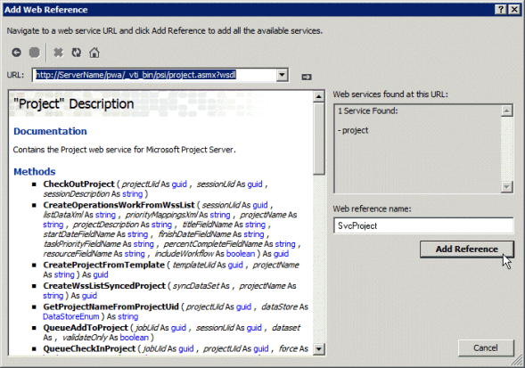

# <a name="prerequisites-for-asmx-based-code-samples-in-project"></a><span data-ttu-id="6608c-104">Requisitos previos para ejemplos de código basados en ASMX en Project</span><span class="sxs-lookup"><span data-stu-id="6608c-104">Prerequisites for ASMX-based code samples in Project</span></span>

<span data-ttu-id="6608c-105">Obtenga información para ayudarle a crear proyectos en Visual Studio mediante el uso de los ejemplos de código basados en ASMX que se incluyen en los temas de referencia de Project Server Interface (PSI).</span><span class="sxs-lookup"><span data-stu-id="6608c-105">Learn information to help you create projects in Visual Studio by using the ASMX-based code samples that are included in the Project Server Interface (PSI) reference topics.</span></span>
  
<span data-ttu-id="6608c-106">Muchos de los ejemplos de código que se incluyen en la [referencia de servicio de web y biblioteca de clase de Project Server 2013](http://msdn.microsoft.com/library/ef1830e0-3c9a-4f98-aa0a-5556c298e7d1%28Office.15%29.aspx) se crearon originalmente para el SDK de Office Project 2007 y utilizan un formato estándar para los servicios web de ASMX.</span><span class="sxs-lookup"><span data-stu-id="6608c-106">Many of the code samples included in the [Project Server 2013 class library and web service reference](http://msdn.microsoft.com/library/ef1830e0-3c9a-4f98-aa0a-5556c298e7d1%28Office.15%29.aspx) were originally created for the Office Project 2007 SDK, and use a standard format for ASMX web services.</span></span> <span data-ttu-id="6608c-107">Los ejemplos de aún funcionan en Project Server 2013 y están diseñados para ser copiado en una aplicación de consola y se ejecute como una unidad completa.</span><span class="sxs-lookup"><span data-stu-id="6608c-107">The samples still work in Project Server 2013 and are designed to be copied into a console application and run as a complete unit.</span></span> <span data-ttu-id="6608c-108">En el ejemplo se indican excepciones.</span><span class="sxs-lookup"><span data-stu-id="6608c-108">Exceptions are noted in the sample.</span></span> 
  
<span data-ttu-id="6608c-109">Nuevos ejemplos de PSI en el SDK de Project 2013 adecuarse a un formato que utiliza los servicios de Windows Communication Foundation (WCF).</span><span class="sxs-lookup"><span data-stu-id="6608c-109">New PSI samples in the Project 2013 SDK conform to a format that uses Windows Communication Foundation (WCF) services.</span></span> <span data-ttu-id="6608c-110">Los ejemplos basados en ASMX también puede adaptarse a usar los servicios de WCF.</span><span class="sxs-lookup"><span data-stu-id="6608c-110">The ASMX-based samples can also be adapted to use WCF services.</span></span> <span data-ttu-id="6608c-111">En este artículo se muestra cómo usar los ejemplos con servicios web de ASMX.</span><span class="sxs-lookup"><span data-stu-id="6608c-111">This article shows how to use the samples with ASMX web services.</span></span> <span data-ttu-id="6608c-112">Para obtener información acerca del uso de los ejemplos con los servicios de WCF, vea [requisitos previos para ejemplos de código basados en WCF en Project](prerequisites-for-wcf-based-code-samples-in-project.md).</span><span class="sxs-lookup"><span data-stu-id="6608c-112">For information about using the samples with WCF services, see [Prerequisites for WCF-based code samples in Project](prerequisites-for-wcf-based-code-samples-in-project.md).</span></span>
  
> [!NOTE]
> <span data-ttu-id="6608c-113">La interfaz de servicio web ASMX de la PSI está en desuso en Project Server 2013, pero todavía se admite.</span><span class="sxs-lookup"><span data-stu-id="6608c-113">The ASMX web service interface of the PSI is deprecated in Project Server 2013, but is still supported.</span></span> <span data-ttu-id="6608c-114">Si el modelo de objetos de cliente (COM) incluye los métodos que requiere la aplicación, se deben desarrollar nuevas aplicaciones con el CSOM.</span><span class="sxs-lookup"><span data-stu-id="6608c-114">If the client-side object model (CSOM) includes the methods that your application requires, new applications should be developed with the CSOM.</span></span> <span data-ttu-id="6608c-115">El CSOM permite a las aplicaciones trabajar con Project Online o una instalación local de Project Server 2013.</span><span class="sxs-lookup"><span data-stu-id="6608c-115">The CSOM enables applications to work with Project Online or an on-premises installation of Project Server 2013.</span></span> <span data-ttu-id="6608c-116">De lo contrario, si la aplicación utiliza la interfaz PSI, que debe usar la interfaz WCF, que es la tecnología que se recomienda para las comunicaciones de red.</span><span class="sxs-lookup"><span data-stu-id="6608c-116">Otherwise, if your application uses the PSI, it should use the WCF interface, which is the technology that we recommend for network communications.</span></span> <span data-ttu-id="6608c-117">Las aplicaciones que usan la interfaz ASMX o la interfaz WCF pueden trabajar solo para instalaciones locales de Project Server 2013.</span><span class="sxs-lookup"><span data-stu-id="6608c-117">Applications that use the ASMX interface or the WCF interface can work only for on-premises installations of Project Server 2013.</span></span> <span data-ttu-id="6608c-118">Para obtener más información sobre el CSOM, consulte [arquitectura de Project Server 2013](project-server-2013-architecture.md) y [modelo de objetos de cliente (CSOM) for Project 2013](client-side-object-model-csom-for-project-2013.md).</span><span class="sxs-lookup"><span data-stu-id="6608c-118">For more information about the CSOM, see [Project Server 2013 architecture](project-server-2013-architecture.md) and [Client-side object model (CSOM) for Project 2013](client-side-object-model-csom-for-project-2013.md).</span></span> 
  
<span data-ttu-id="6608c-119">Antes de usar las muestras de código, asegúrese de configurar el entorno de desarrollo, configurar la aplicación y modificar los valores de constantes genéricas para que coincidan con su entorno.</span><span class="sxs-lookup"><span data-stu-id="6608c-119">Before running the code samples, you must set up the development environment, configure the application, and change generic constant values to match your environment.</span></span>
  
## <a name="setting-up-the-development-environment"></a><span data-ttu-id="6608c-120">Configurar el entorno de desarrollo</span><span class="sxs-lookup"><span data-stu-id="6608c-120">Setting up the development environment</span></span>
<span data-ttu-id="6608c-121"><a name="pj15_PrerequisitesASMX_Setup"> </a></span><span class="sxs-lookup"><span data-stu-id="6608c-121"></span></span>

1. <span data-ttu-id="6608c-122">**Configurar un sistema de Project Server de prueba**.</span><span class="sxs-lookup"><span data-stu-id="6608c-122">**Set up a test Project Server system**.</span></span>
    
   <span data-ttu-id="6608c-p104">Use un sistema de Project Server de prueba siempre que haga un desarrollo o una prueba. Incluso cuando su código funcione perfectamente, las dependencias entre proyectos, los informes u otros factores de entorno pueden generar consecuencias no esperadas.</span><span class="sxs-lookup"><span data-stu-id="6608c-p104">Use a test Project Server system whenever you are developing or testing. Even when your code works perfectly, interproject dependencies, reporting, or other environmental factors can cause unintended consequences.</span></span> 
    
   > [!NOTE]
   > <span data-ttu-id="6608c-125">Asegúrese de que es un usuario válido en el servidor y compruebe que tiene permisos suficientes para las llamadas PSI que usa la aplicación.</span><span class="sxs-lookup"><span data-stu-id="6608c-125">Ensure that you are a valid user on the server, and check that you have sufficient permissions for the PSI calls that your application uses.</span></span> <span data-ttu-id="6608c-126">El tema de referencia para cada método PSI incluye una tabla de permisos de Project Server.</span><span class="sxs-lookup"><span data-stu-id="6608c-126">The reference topic for each PSI method includes a Project Server Permissions table.</span></span> <span data-ttu-id="6608c-127">Por ejemplo, el método [Project.QueueCreateProject](https://msdn.microsoft.com/library/WebSvcProject.Project.QueueCreateProject.aspx) requiere el permiso **NewProject** global y el permiso **SaveProjectTemplate** .</span><span class="sxs-lookup"><span data-stu-id="6608c-127">For example, the [Project.QueueCreateProject](https://msdn.microsoft.com/library/WebSvcProject.Project.QueueCreateProject.aspx) method requires the global **NewProject** permission and the **SaveProjectTemplate** permission.</span></span> 
  
   <span data-ttu-id="6608c-128">En algunos casos, debe realizar la depuración remota en el servidor.</span><span class="sxs-lookup"><span data-stu-id="6608c-128">In some cases, you may have to do remote debugging on the server.</span></span> <span data-ttu-id="6608c-129">También es posible que deba configurar un controlador de eventos mediante la instalación de un ensamblado del controlador de eventos en cada equipo de Project Server en la granja de servidores de SharePoint y, a continuación, configurar el controlador de eventos para la instancia de Project Web App mediante la página Configuración de Project Server en General Configuración de la aplicación de Administración Central de SharePoint.</span><span class="sxs-lookup"><span data-stu-id="6608c-129">You may also have to set up an event handler by installing an event handler assembly on each Project Server computer in the SharePoint farm, and then configuring the event handler for the Project Web App instance by using the Project Server Settings page in the General Application Settings of SharePoint Central Administration.</span></span>
    
2. <span data-ttu-id="6608c-130">**Configurar un equipo de desarrollo.**</span><span class="sxs-lookup"><span data-stu-id="6608c-130">**Set up a development computer.**</span></span>
    
   <span data-ttu-id="6608c-p107">Generalmente obtiene acceso a la PSI a través de una red. Las muestras de código están diseñadas para usarse en un cliente independiente del servidor, excepto cuando se indique lo contrario.</span><span class="sxs-lookup"><span data-stu-id="6608c-p107">You usually access the PSI through a network. The code samples are designed to be run on a client that is separate from the server, except where noted.</span></span>
    
   1. <span data-ttu-id="6608c-133">**Instale la versión correcta de Visual Studio.**</span><span class="sxs-lookup"><span data-stu-id="6608c-133">**Install the correct version of Visual Studio.**</span></span> <span data-ttu-id="6608c-134">Excepto donde se indique, los ejemplos de código se escriben en Visual C#.</span><span class="sxs-lookup"><span data-stu-id="6608c-134">Except where noted, the code samples are written in Visual C#.</span></span> <span data-ttu-id="6608c-135">Se pueden usar con Visual Studio 2010 o Visual Studio 2012.</span><span class="sxs-lookup"><span data-stu-id="6608c-135">They can be used with Visual Studio 2010 or Visual Studio 2012.</span></span> <span data-ttu-id="6608c-136">Asegúrese de que tiene instalado el service pack más reciente.</span><span class="sxs-lookup"><span data-stu-id="6608c-136">Ensure that you have the most recent service pack installed.</span></span> 
        
   2. <span data-ttu-id="6608c-137">**Copie la DLL de Project Server en el equipo de desarrollo.**</span><span class="sxs-lookup"><span data-stu-id="6608c-137">**Copy Project Server DLLs to the development computer.**</span></span> <span data-ttu-id="6608c-138">Copie los siguientes ensamblados de `[Program Files]\Microsoft Office Servers\15.0\Bin` en el equipo de Project Server en el equipo de desarrollo:</span><span class="sxs-lookup"><span data-stu-id="6608c-138">Copy the following assemblies from  `[Program Files]\Microsoft Office Servers\15.0\Bin` on the Project Server computer to the development computer:</span></span> 
        
      - <span data-ttu-id="6608c-139">Microsoft.Office.Project.Server.Events.Receivers.dll</span><span class="sxs-lookup"><span data-stu-id="6608c-139">Microsoft.Office.Project.Server.Events.Receivers.dll</span></span>
      - <span data-ttu-id="6608c-140">Microsoft.Office.Project.Server.Library.dll</span><span class="sxs-lookup"><span data-stu-id="6608c-140">Microsoft.Office.Project.Server.Library.dll</span></span>
        
   3. <span data-ttu-id="6608c-141">Para obtener información sobre cómo compilar y utilizar el ensamblado de proxy ProjectServerServices.dll para los servicios web ASMX en la interfaz PSI, vea [uso de un ensamblado de proxy PSI y descripciones de IntelliSense](#pj15_PrerequisitesASMX_BuildingProxy).</span><span class="sxs-lookup"><span data-stu-id="6608c-141">For information about how to compile and use the ProjectServerServices.dll proxy assembly for the ASMX web services in the PSI, see [Using a PSI proxy assembly and IntelliSense descriptions](#pj15_PrerequisitesASMX_BuildingProxy).</span></span>
    
3. <span data-ttu-id="6608c-142">**Instale los archivos de IntelliSense.**</span><span class="sxs-lookup"><span data-stu-id="6608c-142">**Install the IntelliSense files.**</span></span>
    
    <span data-ttu-id="6608c-143">Para usar descripciones de IntelliSense para las clases y miembros en ensamblados de Project Server, copia los archivos XML de IntelliSense actualizados desde el SDK de Project 2013 descargarán en el mismo directorio donde se encuentran los ensamblados de Project Server.</span><span class="sxs-lookup"><span data-stu-id="6608c-143">To use IntelliSense descriptions for classes and members in Project Server assemblies, copy the updated IntelliSense XML files from the Project 2013 SDK download to the same directory where the Project Server assemblies are located.</span></span> <span data-ttu-id="6608c-144">Por ejemplo, copie el archivo Microsoft.Office.Project.Server.Library.xml al directorio donde la aplicación establecerá una referencia al ensamblado Microsoft.Office.Project.Server.Library.dll.</span><span class="sxs-lookup"><span data-stu-id="6608c-144">For example, copy the Microsoft.Office.Project.Server.Library.xml file to the directory where your application will set a reference to the Microsoft.Office.Project.Server.Library.dll assembly.</span></span>
    
    <span data-ttu-id="6608c-145">Descripciones de IntelliSense para los servicios web PSI requieren la creación de un ensamblado de proxy PSI mediante el uso de la secuencia de comandos CompileASMXProxyAssembly.cmd en el `Documentation\IntelliSense\WSDL` subdirectorio en la descarga del SDK de Project 2013.</span><span class="sxs-lookup"><span data-stu-id="6608c-145">IntelliSense descriptions for the PSI web services require that you create a PSI proxy assembly by using the CompileASMXProxyAssembly.cmd script in the  `Documentation\IntelliSense\WSDL` subdirectory in the Project 2013 SDK download.</span></span> <span data-ttu-id="6608c-146">El script crea el ensamblado de proxy ProjectServerServices.dll basadas en ASMX.</span><span class="sxs-lookup"><span data-stu-id="6608c-146">The script creates the ASMX-based ProjectServerServices.dll proxy assembly.</span></span> <span data-ttu-id="6608c-147">Para obtener más información, consulte el archivo [ReadMe_IntelliSense] en la descarga del SDK.</span><span class="sxs-lookup"><span data-stu-id="6608c-147">For more information, see the [ReadMe_IntelliSense] file in the SDK download.</span></span> 
    
## <a name="creating-the-application-and-adding-a-web-service-reference"></a><span data-ttu-id="6608c-148">Crear la aplicación y agregar una referencia de servicio web</span><span class="sxs-lookup"><span data-stu-id="6608c-148">Creating the application and adding a web service reference</span></span>
<span data-ttu-id="6608c-149"><a name="pj15_PrerequisitesASMX_Configure"> </a></span><span class="sxs-lookup"><span data-stu-id="6608c-149"></span></span>

1. <span data-ttu-id="6608c-150">**Crear una aplicación de consola**.</span><span class="sxs-lookup"><span data-stu-id="6608c-150">**Create a console application**.</span></span>
    
   <span data-ttu-id="6608c-151">Cuando se crea una aplicación de consola, en la lista desplegable del cuadro de diálogo **Nuevo proyecto** , seleccione **.NET Framework 4**.</span><span class="sxs-lookup"><span data-stu-id="6608c-151">When you create a console application, in the drop-down list of the **New Project** dialog box, select **.NET Framework 4**.</span></span> <span data-ttu-id="6608c-152">Puede copiar el código de ejemplo PSI en la nueva aplicación.</span><span class="sxs-lookup"><span data-stu-id="6608c-152">You can copy the PSI example code into the new application.</span></span>
    
2. <span data-ttu-id="6608c-153">**Agregar la referencia necesaria para ASMX.**</span><span class="sxs-lookup"><span data-stu-id="6608c-153">**Add the reference required for ASMX.**</span></span>
    
   <span data-ttu-id="6608c-154">En el Explorador de soluciones, agregue una referencia a **System.Web.Services** (vea la figura 1).</span><span class="sxs-lookup"><span data-stu-id="6608c-154">In Solution Explorer, add a reference to **System.Web.Services** (see Figure 1).</span></span> 
    
   <span data-ttu-id="6608c-155">**En la figura 1. Adición de una referencia en Visual Studio**</span><span class="sxs-lookup"><span data-stu-id="6608c-155">**Figure 1. Adding a reference in Visual Studio**</span></span>

   <span data-ttu-id="6608c-156">![Adición de una referencia en Visual Studio] (media/pj15_PrerequisitesASMX_AddReference.gif "Adición de una referencia en Visual Studio")</span><span class="sxs-lookup"><span data-stu-id="6608c-156"></span></span>
  
3. <span data-ttu-id="6608c-157">**Copie el código**.</span><span class="sxs-lookup"><span data-stu-id="6608c-157">**Copy the code**.</span></span>
    
   <span data-ttu-id="6608c-158">Copie el ejemplo de código completo en el archivo Program.cs de la aplicación de consola.</span><span class="sxs-lookup"><span data-stu-id="6608c-158">Copy the complete code example into the Program.cs file of the console application.</span></span>
    
4. <span data-ttu-id="6608c-159">**Establecer el espacio de nombres para la aplicación de ejemplo**.</span><span class="sxs-lookup"><span data-stu-id="6608c-159">**Set the namespace for the sample application**.</span></span>
    
   <span data-ttu-id="6608c-p113">Puede cambiar el espacio de nombres que aparece en la parte superior de la muestra por el espacio de nombres predeterminado de la aplicación o bien cambiar el espacio de nombres de la aplicación predeterminado para que coincida con la muestra. Puede cambiar el espacio de nombres de la aplicación predeterminado modificando las propiedades de la aplicación.</span><span class="sxs-lookup"><span data-stu-id="6608c-p113">You can either change the namespace listed at the top of the sample to the application default namespace, or change the default application namespace to match the sample. You can change the default application namespace by changing the application properties.</span></span>
    
   <span data-ttu-id="6608c-162">Por ejemplo, el código de ejemplo para [QueueRenameProject](https://msdn.microsoft.com/library/WebSvcProject.Project.QueueRenameProject.aspx) tiene el espacio de nombres **Microsoft.SDK.Project.Samples.RenameProject**.</span><span class="sxs-lookup"><span data-stu-id="6608c-162">For example, the code sample for [QueueRenameProject](https://msdn.microsoft.com/library/WebSvcProject.Project.QueueRenameProject.aspx) has the namespace **Microsoft.SDK.Project.Samples.RenameProject**.</span></span> <span data-ttu-id="6608c-163">Si el nombre del proyecto de Visual Studio es **RenameProject**, copie el archivo Program.cs en el espacio de nombres y, a continuación, abra el panel de **Propiedades** del proyecto (en el menú **proyecto** , elija **Propiedades de RenameProject**).</span><span class="sxs-lookup"><span data-stu-id="6608c-163">If the name of the Visual Studio project is **RenameProject**, copy the namespace from the Program.cs file, and then open the project **Properties** pane (on the **Project** menu, choose **RenameProject Properties**).</span></span> <span data-ttu-id="6608c-164">En la ficha **aplicación** , copie el espacio de nombres en el cuadro de texto de **espacio de nombres predeterminado** .</span><span class="sxs-lookup"><span data-stu-id="6608c-164">On the **Application** tab, copy the namespace into the **Default namespace** text box.</span></span> 
    
5. <span data-ttu-id="6608c-165">**Establecer las referencias web**.</span><span class="sxs-lookup"><span data-stu-id="6608c-165">**Set the web references**.</span></span>
    
   <span data-ttu-id="6608c-p115">Muchos ejemplos necesitan una referencia a uno o más de los servicios web de la PSI. Estos aparecen en la muestra misma o en comentarios que preceden a la muestra. Para obtener el espacio de nombres correcto de las referencias web, asegúrese de establecer primero el espacio de nombres de la aplicación predeterminado.</span><span class="sxs-lookup"><span data-stu-id="6608c-p115">Most examples require a reference to one or more of the PSI web services. These are listed in the sample itself or in comments that precede the sample. To get the correct namespace of the web references, ensure that you first set the default application namespace.</span></span>
    
   <span data-ttu-id="6608c-169">Existen tres maneras de agregar una referencia de servicio web de ASMX para la PSI:</span><span class="sxs-lookup"><span data-stu-id="6608c-169">There are three ways to add an ASMX web service reference for the PSI:</span></span>
    
   - <span data-ttu-id="6608c-170">Crear un ensamblado de proxy PSI denominado ProjectServerServices.dll y, a continuación, establezca una referencia al ensamblado.</span><span class="sxs-lookup"><span data-stu-id="6608c-170">Build a PSI proxy assembly named ProjectServerServices.dll, and then set a reference to the assembly.</span></span> <span data-ttu-id="6608c-171">Para obtener IntelliSense, esta es la manera recomendada para agregar una referencia PSI.</span><span class="sxs-lookup"><span data-stu-id="6608c-171">To get IntelliSense, this is the recommended way to add a PSI reference.</span></span> <span data-ttu-id="6608c-172">Vea [usar un ensamblado de proxy PSI y descripciones de IntelliSense](#pj15_PrerequisitesASMX_BuildingProxy).</span><span class="sxs-lookup"><span data-stu-id="6608c-172">See [Using a PSI proxy assembly and IntelliSense descriptions](#pj15_PrerequisitesASMX_BuildingProxy).</span></span>
    
   - <span data-ttu-id="6608c-173">Agregar un archivo de proxy de la salida de wsdl.exe a la solución de Visual Studio.</span><span class="sxs-lookup"><span data-stu-id="6608c-173">Add a proxy file from the wsdl.exe output to the Visual Studio solution.</span></span> <span data-ttu-id="6608c-174">Consulte [Adición de un archivo de proxy PSI](#pj15_PrerequisitesASMX_AddingProxyFile).</span><span class="sxs-lookup"><span data-stu-id="6608c-174">See [Adding a PSI proxy file](#pj15_PrerequisitesASMX_AddingProxyFile).</span></span>
    
   - <span data-ttu-id="6608c-175">Agregue una referencia de servicio web mediante el uso de Visual Studio.</span><span class="sxs-lookup"><span data-stu-id="6608c-175">Add a web service reference by using Visual Studio.</span></span> <span data-ttu-id="6608c-176">Vea la [referencia de servicio de adición de un sitio web](#pj15_PrerequisitesASMX_AddingServiceReference).</span><span class="sxs-lookup"><span data-stu-id="6608c-176">See [Adding a web service reference](#pj15_PrerequisitesASMX_AddingServiceReference).</span></span>

<span data-ttu-id="6608c-177"><a name="pj15_PrerequisitesASMX_BuildingProxy"> </a></span><span class="sxs-lookup"><span data-stu-id="6608c-177"></span></span>

### <a name="using-a-psi-proxy-assembly-and-intellisense-descriptions"></a><span data-ttu-id="6608c-178">Usar un ensamblado de proxy de PSI y descripciones de IntelliSense</span><span class="sxs-lookup"><span data-stu-id="6608c-178">Using a PSI proxy assembly and IntelliSense descriptions</span></span>

<span data-ttu-id="6608c-179">Se pueden crear y usar el ensamblado de proxy ProjectServerServices.dll para todos los servicios web basados en ASMX en la interfaz PSI, mediante el uso de la secuencia de comandos CompileASMXProxyAssembly.cmd en el `Documentation\IntelliSense\WSDL` carpeta de la descarga del SDK de Project 2013.</span><span class="sxs-lookup"><span data-stu-id="6608c-179">You can build and use the ProjectServerServices.dll proxy assembly for all ASMX-based web services in the PSI, by using the CompileASMXProxyAssembly.cmd script in the  `Documentation\IntelliSense\WSDL` folder of the Project 2013 SDK download.</span></span> <span data-ttu-id="6608c-180">Para un vínculo a la descarga, vea la [documentación para desarrolladores de Project 2013](project-2013-developer-documentation.md).</span><span class="sxs-lookup"><span data-stu-id="6608c-180">For a link to the download, see [Project 2013 developer documentation](project-2013-developer-documentation.md).</span></span>
  
> [!NOTE]
> <span data-ttu-id="6608c-181">Al extraer los archivos de origen del proxy de la Source.zip, los archivos de la `Documentation\IntelliSense\WSDL\Source` carpeta son actuales a partir de la fecha de publicación de la descarga del SDK de Project 2013.</span><span class="sxs-lookup"><span data-stu-id="6608c-181">When you extract the proxy source files from the Source.zip file, the files in the  `Documentation\IntelliSense\WSDL\Source` folder are current as of the publication date of the Project 2013 SDK download.</span></span> <span data-ttu-id="6608c-182">Para generar actualiza los archivos de origen de proxy PSI, ejecute el script GenASMXProxyAssembly.cmd en el equipo de Project Server.</span><span class="sxs-lookup"><span data-stu-id="6608c-182">To generate updated PSI proxy source files, run the GenASMXProxyAssembly.cmd script on the Project Server computer.</span></span> <span data-ttu-id="6608c-183">Las secuencias de comandos en el `Documentation\IntelliSense\WCF` carpeta no funcionan para las aplicaciones basadas en ASMX.</span><span class="sxs-lookup"><span data-stu-id="6608c-183">The scripts in the  `Documentation\IntelliSense\WCF` folder do not work for ASMX-based applications.</span></span> <span data-ttu-id="6608c-184">La secuencia de comandos GenWCFProxyAssembly.cmd llama a SvcUtil.exe, que genera archivos de código fuente para los servicios WCF.</span><span class="sxs-lookup"><span data-stu-id="6608c-184">The GenWCFProxyAssembly.cmd script calls SvcUtil.exe, which generates source code files for the WCF services.</span></span> <span data-ttu-id="6608c-185">Los archivos de proxy WCF incluyen atributos diferentes, la interfaz de canal y una clase de cliente para cada servicio de la PSI.</span><span class="sxs-lookup"><span data-stu-id="6608c-185">The WCF proxy files include different attributes, the channel interface, and a client class for each PSI service.</span></span> <span data-ttu-id="6608c-186">Por ejemplo, el servicio de recursos basados en WCF incluye la interfaz **ResourceChannel** , la interfaz de **recursos** y la clase **ResourceClient** .</span><span class="sxs-lookup"><span data-stu-id="6608c-186">For example, the WCF-based Resource service includes the **ResourceChannel** interface, the **Resource** interface, and the **ResourceClient** class.</span></span> <span data-ttu-id="6608c-187">La web de recursos basados en ASMX incluye la clase de **recurso** con algunas propiedades diferentes.</span><span class="sxs-lookup"><span data-stu-id="6608c-187">The ASMX-based Resource web includes the **Resource** class with some different properties.</span></span> 
  
<span data-ttu-id="6608c-188">A continuación se muestra el script GenASMXProxyAssembly.cmd que genera archivos de salida de WSDL para los servicios web de PSI, y después compila el ensamblado.</span><span class="sxs-lookup"><span data-stu-id="6608c-188">Following is the GenASMXProxyAssembly.cmd script that generates WSDL output files for the PSI web services, and then compiles the assembly.</span></span>
  
```MS-DOS
@echo off
@ECHO ---------------------------------------------------
@ECHO Creating C# files for the ASMX-based proxy assembly
@ECHO ---------------------------------------------------
REM Replace ServerName with the name of the server and 
REM the instance name of Project Web App. Do not use localhost.
(set VDIR=http://ServerName/pwa/_vti_bin/psi)
(set OUTDIR=.\Source)
REM ** Wsdl.exe is the same version in the v6.0A and v7.0A subdirectories. 
(set WSDL="C:\Program Files (x86)\Microsoft SDKs\Windows\v7.0A\Bin\x64\wsdl.exe")
if not exist %OUTDIR% (
md %OUTDIR%
)
for /F %%i in (Classlist_asmx.txt) do %WSDL% /nologo /l:CS /namespace:Svc%%i /out:%OUTDIR%\wsdl.%%i.cs %VDIR%/%%i.asmx?wsdl 
@ECHO ----------------------------
@ECHO Compiling the proxy assembly
@ECHO ----------------------------
(set SOURCE=%OUTDIR%\wsdl)
(set CSC=%WINDIR%\Microsoft.NET\Framework64\v4.0.30319\csc.exe)
(set ASSEMBLY_NAME=ProjectServerServices.dll)
%CSC% /t:library /out:%ASSEMBLY_NAME% %SOURCE%*.cs
```

<span data-ttu-id="6608c-189">El script usa el archivo ClassList_asmx.txt, que contiene la lista de servicios web que están disponibles para otros desarrolladores.</span><span class="sxs-lookup"><span data-stu-id="6608c-189">The script uses the ClassList_asmx.txt file, which contains the list of web services that are available for third-party developers.</span></span>
  
```text
Admin
Archive
Calendar
CubeAdmin
CustomFields
Driver
Events
LoginForms
LoginWindows
LookupTable
Notifications
ObjectLinkProvider
PortfolioAnalyses
Project
QueueSystem
ResourcePlan
Resource
Security
Statusing
TimeSheet
Workflow
WssInterop
```

<span data-ttu-id="6608c-p121">Los scripts crean un ensamblado con el nombre ProjectServerServices.dll. No lo confunda con ProjectServerServices.dll para el ensamblado basado en WCF. Los nombres de ensamblado son los mismos, para permitir el uso de cualquiera de los ensamblados con el archivo ProjectServerServices.xml de IntelliSense.</span><span class="sxs-lookup"><span data-stu-id="6608c-p121">The scripts create an assembly named ProjectServerServices.dll. Avoid confusing it with ProjectServerServices.dll for the WCF-based assembly. The assembly names are the same, to enable using either assembly with the ProjectServerServices.xml IntelliSense file.</span></span>
  
<span data-ttu-id="6608c-193">El espacio de nombres arbitrario creado por las secuencias de comandos para los servicios web ASMX y los servicios de WCF es el mismo, de modo que el archivo ProjectServerServices.xml IntelliSense funciona con alguno de los ensamblados.</span><span class="sxs-lookup"><span data-stu-id="6608c-193">The arbitrary namespace created by the scripts for both the ASMX web services and the WCF services is the same, so that the ProjectServerServices.xml IntelliSense file works with either assembly.</span></span> <span data-ttu-id="6608c-194">Por ejemplo, el espacio de nombres del servicio de recursos en el ensamblado de proxy basada en WCF y en el ensamblado de proxy basadas en ASMX es **SvcResource**.</span><span class="sxs-lookup"><span data-stu-id="6608c-194">For example, the namespace of the Resource service in the WCF-based proxy assembly and in the ASMX-based proxy assembly is **SvcResource**.</span></span> <span data-ttu-id="6608c-195">Por supuesto, puede cambiar los nombres de espacio de nombres: si asegurarse de que cumplen en el ensamblado de proxy y en el archivo ProjectServerServices.xml IntelliSense.</span><span class="sxs-lookup"><span data-stu-id="6608c-195">You can, of course, change the namespace names—if you ensure that they match in the proxy assembly and in the ProjectServerServices.xml IntelliSense file.</span></span>
  
<span data-ttu-id="6608c-196">Si un ejemplo de código utiliza un nombre diferente para un espacio de nombres de servicio de web PSI, por ejemplo **ProjectWebSvc**, para que IntelliSense funcione, debe cambiar el ejemplo para usar **SvcProject** para que el espacio de nombres coincide con el ensamblado de proxy.</span><span class="sxs-lookup"><span data-stu-id="6608c-196">If a code sample uses a different name for a PSI web service namespace, for example **ProjectWebSvc**, for IntelliSense to work you must change the sample to use **SvcProject** so that the namespace matches the proxy assembly.</span></span> 
  
<span data-ttu-id="6608c-197">Una ventaja de utilizar el ensamblado de proxy basadas en ASMX es que incluye todos los espacios de servicio web PSI; no es necesario crear varias referencias web.</span><span class="sxs-lookup"><span data-stu-id="6608c-197">An advantage to using the ASMX-based proxy assembly is that it includes all PSI web service namespaces; you do not have to create multiple web references.</span></span> <span data-ttu-id="6608c-198">Otra ventaja es que, si se agrega el archivo ProjectServerServices.xml en el mismo directorio donde se establece una referencia al ensamblado de proxy ProjectServerServices.dll, puede obtener descripciones de IntelliSense para las clases PSI y miembros.</span><span class="sxs-lookup"><span data-stu-id="6608c-198">Another advantage is that, if you add the ProjectServerServices.xml file to the same directory where you set a reference to the ProjectServerServices.dll proxy assembly, you can get IntelliSense descriptions for the PSI classes and members.</span></span> <span data-ttu-id="6608c-199">La figura 2 muestra el texto de IntelliSense para el método **Project.QueueCreateProject** .</span><span class="sxs-lookup"><span data-stu-id="6608c-199">Figure 2 shows the IntelliSense text for the **Project.QueueCreateProject** method.</span></span> <span data-ttu-id="6608c-200">Para obtener más información, consulte el archivo [ReadMe_IntelliSense] en la carpeta de IntelliSense de la descarga del SDK de Project 2013.</span><span class="sxs-lookup"><span data-stu-id="6608c-200">For more information, see the [ReadMe_IntelliSense] file in the IntelliSense folder of the Project 2013 SDK download.</span></span> 
  
<span data-ttu-id="6608c-201">**La figura 2. Uso de IntelliSense para un método en el servicio web de Project**</span><span class="sxs-lookup"><span data-stu-id="6608c-201">**Figure 2. Using IntelliSense for a method in the Project web service**</span></span>

<span data-ttu-id="6608c-202">![Uso de Intellisense para un método en un servicio de la PSI] (media/pj15_PrerequisitesASMX_Intellisense.gif "Uso de Intellisense para un método en un servicio de la PSI")</span><span class="sxs-lookup"><span data-stu-id="6608c-202"></span></span>
  
<span data-ttu-id="6608c-p124">Las desventajas de usar el ensamblado de proxy son que la solución es mayor y usted necesita distribuir e instalar el ensamblado de proxy con la solución. También necesita usar los mismos espacios de nombres que se encuentran en el ensamblado de proxy y los archivos de IntelliSense, a menos que cambie el script y el archivo ProjectServerServices.xml de IntelliSense para usar distintos espacios de nombres.</span><span class="sxs-lookup"><span data-stu-id="6608c-p124">Disadvantages to using the proxy assembly are that the solution is larger and you must distribute and install the proxy assembly with the solution. You must also use the same namespaces that are in the proxy assembly and IntelliSense files, unless you change the script and ProjectServerServices.xml IntelliSense file to use different namespaces.</span></span>
  
### <a name="adding-a-psi-proxy-file"></a><span data-ttu-id="6608c-205">Agregar un archivo de proxy de PSI</span><span class="sxs-lookup"><span data-stu-id="6608c-205">Adding a PSI proxy file</span></span>
<span data-ttu-id="6608c-206"><a name="pj15_PrerequisitesASMX_AddingProxyFile"> </a></span><span class="sxs-lookup"><span data-stu-id="6608c-206"></span></span>

<span data-ttu-id="6608c-207">La descarga del SDK de Project 2013 incluye los archivos de origen generados por el comando Wsdl.exe para el ensamblado de proxy.</span><span class="sxs-lookup"><span data-stu-id="6608c-207">The Project 2013 SDK download includes the source files generated by the Wsdl.exe command for the proxy assembly.</span></span> <span data-ttu-id="6608c-208">Los archivos de origen se encuentran en Source.zip en el `Documentation\IntelliSense\ASMX` subdirectorio.</span><span class="sxs-lookup"><span data-stu-id="6608c-208">The source files are in Source.zip in the  `Documentation\IntelliSense\ASMX` subdirectory.</span></span> <span data-ttu-id="6608c-209">En lugar de establecer una referencia al ensamblado de proxy, puede agregar uno o varios de los archivos de origen a una solución de Visual Studio.</span><span class="sxs-lookup"><span data-stu-id="6608c-209">Instead of setting a reference to the proxy assembly, you can add one or more of the source files to a Visual Studio solution.</span></span> <span data-ttu-id="6608c-210">Por ejemplo, después de ejecutar el script GenASMXProxyAssembly.cmd, agregue el archivo wsdl. Archivo de Project.cs a la solución.</span><span class="sxs-lookup"><span data-stu-id="6608c-210">For example, after running the GenASMXProxyAssembly.cmd script, add the wsdl.Project.cs file to the solution.</span></span> <span data-ttu-id="6608c-211">En lugar de ejecutar el script, puede ejecutar los siguientes comandos para generar un solo archivo de origen, por ejemplo:</span><span class="sxs-lookup"><span data-stu-id="6608c-211">Instead of running the script, you can run the following commands to generate a single source file, for example:</span></span> 
  
```MS-DOS
set VDIR=http://ServerName/ProjectServerName/_vti_bin/psi
set WSDL="C:\Program Files (x86)\Microsoft SDKs\Windows\v7.0A\Bin\x64\wsdl.exe"
%WSDL% /nologo /l:cs /namespace:SvcProject /out:wsdl.Project.cs %VDIR%/Project.asmx?wsdl
```

<span data-ttu-id="6608c-212">Para definir un objeto de **proyecto** como una variable de clase con el nombre de **proyecto**, use el siguiente código.</span><span class="sxs-lookup"><span data-stu-id="6608c-212">To define a **Project** object as a class variable named **project**, use the following code.</span></span> <span data-ttu-id="6608c-213">El método **AddContextInfo** agrega la información de contexto para el objeto de **proyecto** para la autenticación de Windows y autenticación basada en formularios.</span><span class="sxs-lookup"><span data-stu-id="6608c-213">The **AddContextInfo** method adds the context information to the **project** object for Windows authentication and Forms-based authentication.</span></span> 
  
```cs
private static SvcProject.Project project;
private static SvcLoginForms.LoginForms loginForms =
            new SvcLoginForms.LoginForms();
. . .
public void AddContextInfo()
{
    // Add the Url property.
    project.Url = "http://ServerName /ProjectServerName /_vti_bin/psi/project.asmx";
    // Add Windows credentials.
    project.Credentials = CredentialCache.DefaultCredentials;
    // If Forms authentication is used, add the Project Server cookie.
    project.CookieContainer = loginForms.CookieContainer;
}
```

> [!NOTE]
> <span data-ttu-id="6608c-214">Si utiliza un ensamblado de proxy PSI o agrega un archivo de proxy para una referencia de servicio de proyecto denominado **SvcProject**, usaría el mismo código para crear un objeto **project** .</span><span class="sxs-lookup"><span data-stu-id="6608c-214">Whether you use a PSI proxy assembly or add a proxy file for a Project service reference named **SvcProject**, you would use the same code to create a **project** object.</span></span> 
  
### <a name="adding-a-web-service-reference"></a><span data-ttu-id="6608c-215">Agregar una referencia de servicio web</span><span class="sxs-lookup"><span data-stu-id="6608c-215">Adding a web service reference</span></span>
<span data-ttu-id="6608c-216"><a name="pj15_PrerequisitesASMX_AddingServiceReference"> </a></span><span class="sxs-lookup"><span data-stu-id="6608c-216"></span></span>

<span data-ttu-id="6608c-217">Si no usa el ensamblado de proxy basadas en ASMX o agregar un archivo de salida WSDL, puede establecer una o más referencias web individuales.</span><span class="sxs-lookup"><span data-stu-id="6608c-217">If you do not use the ASMX-based proxy assembly or add a WSDL output file, you can set one or more individual web references.</span></span> <span data-ttu-id="6608c-218">Los pasos siguientes muestran cómo establecer una referencia web mediante el uso de Visual Studio 2012.</span><span class="sxs-lookup"><span data-stu-id="6608c-218">The following steps show how to set a web reference by using Visual Studio 2012.</span></span>
  
1. <span data-ttu-id="6608c-219">En el **Explorador de soluciones**, haga clic en la carpeta **referencias** y, a continuación, elija **Agregar referencia de servicio**.</span><span class="sxs-lookup"><span data-stu-id="6608c-219">In **Solution Explorer**, right-click the **References** folder, and then choose **Add Service Reference**.</span></span> 
    
2. <span data-ttu-id="6608c-220">En el cuadro de diálogo **Agregar referencia de servicio** , elija **Opciones avanzadas**.</span><span class="sxs-lookup"><span data-stu-id="6608c-220">In the **Add Service Reference** dialog box, choose **Advanced**.</span></span>
    
3. <span data-ttu-id="6608c-221">En el cuadro de diálogo **Configuración de referencia de servicio** , elija **Agregar referencia Web**.</span><span class="sxs-lookup"><span data-stu-id="6608c-221">In the **Service Reference Settings** dialog box, choose **Add Web Reference**.</span></span>
    
4. <span data-ttu-id="6608c-222">En el cuadro de texto **dirección URL** , escriba `http:// _ServerName_/ _ProjectServerName_/_vti_bin/psi/ _ServiceName_.asmx?wsdl`y, a continuación, presione **ENTRAR** o elija el icono **Ir** .</span><span class="sxs-lookup"><span data-stu-id="6608c-222">In the **URL** text box, type `http:// _ServerName_/ _ProjectServerName_/_vti_bin/psi/ _ServiceName_.asmx?wsdl`, and then press **Enter** or choose the **Go** icon.</span></span> <span data-ttu-id="6608c-223">Si tiene Secure Sockets Layer (SSL) instalado, debe usar el protocolo HTTPS en lugar del protocolo HTTP.</span><span class="sxs-lookup"><span data-stu-id="6608c-223">If you have Secure Sockets Layer (SSL) installed, you should use the HTTPS protocol instead of the HTTP protocol.</span></span> 

   <span data-ttu-id="6608c-224">Por ejemplo, use la siguiente dirección URL para el servicio de proyecto en el `http://MyServer/pwa` sitio de Project Web App:`http://MyServer/pwa/_vti_bin/psi/project.asmx?wsdl`</span><span class="sxs-lookup"><span data-stu-id="6608c-224">For example, use the following URL for the Project service on the  `http://MyServer/pwa` site for Project Web App: `http://MyServer/pwa/_vti_bin/psi/project.asmx?wsdl`</span></span>
    
   <span data-ttu-id="6608c-225">O bien, abra el explorador web y vaya a `http://ServerName/ProjectServerName/_vti_bin/psi/ServiceName.asmx?wsdl`.</span><span class="sxs-lookup"><span data-stu-id="6608c-225">Or, open your web browser, and navigate to `http://ServerName/ProjectServerName/_vti_bin/psi/ServiceName.asmx?wsdl`.</span></span> <span data-ttu-id="6608c-226">Guarde el archivo en un directorio local, como `C:\Project\WebServices\ServiceName.wsdl`.</span><span class="sxs-lookup"><span data-stu-id="6608c-226">Save the file to a local directory, such as `C:\Project\WebServices\ServiceName.wsdl`.</span></span> <span data-ttu-id="6608c-227">En el cuadro de diálogo **Agregar referencia Web** , para la **dirección URL**, escriba el protocolo de archivo y la ruta de acceso al archivo.</span><span class="sxs-lookup"><span data-stu-id="6608c-227">In the **Add Web Reference** dialog box, for **URL**, type the file protocol and the path to the file.</span></span> <span data-ttu-id="6608c-228">Por ejemplo, escriba `file://C:\Project\WebServices\Project.wsdl`.</span><span class="sxs-lookup"><span data-stu-id="6608c-228">For example, type `file://C:\Project\WebServices\Project.wsdl`.</span></span> 
    
5. <span data-ttu-id="6608c-229">Una vez que se resuelve la referencia, escriba el nombre de referencia en el cuadro de texto **nombre de referencia Web** .</span><span class="sxs-lookup"><span data-stu-id="6608c-229">After the reference resolves, type the reference name in the **Web reference name** text box.</span></span> <span data-ttu-id="6608c-230">Ejemplos de código en la documentación para desarrolladores de Project 2013 usan el nombre de referencia estándar arbitrario **Svc _ServiceName_**.</span><span class="sxs-lookup"><span data-stu-id="6608c-230">Code examples in the Project 2013 developer documentation use the arbitrary standard reference name **Svc _ServiceName_**.</span></span> <span data-ttu-id="6608c-231">Por ejemplo, el servicio web del proyecto se denomina **SvcProject** (vea la figura 3).</span><span class="sxs-lookup"><span data-stu-id="6608c-231">For example, the Project web service is named **SvcProject** (see Figure 3).</span></span> 
    
   <span data-ttu-id="6608c-232">**La figura 3. Adición de una referencia de servicio web ASMX**</span><span class="sxs-lookup"><span data-stu-id="6608c-232">**Figure 3. Adding an ASMX web service reference**</span></span>

   <span data-ttu-id="6608c-233">![Adición de una referencia de servicio web ASMX] (media/pj15_PrerequisitesASMX_AddWebSvcReference.gif "Adición de una referencia de servicio web ASMX")</span><span class="sxs-lookup"><span data-stu-id="6608c-233"></span></span>
  
<span data-ttu-id="6608c-234">Para los componentes de la aplicación que se deben ejecutar en el equipo de Project Server, utilice la suplantación, o disponer de permisos elevados, use una referencia de servicio WCF en lugar de una referencia web ASMX.</span><span class="sxs-lookup"><span data-stu-id="6608c-234">For application components that must run on the Project Server computer, use impersonation, or have elevated permissions, use a WCF service reference instead of an ASMX web reference.</span></span> <span data-ttu-id="6608c-235">Para obtener más información, vea [requisitos previos para ejemplos de código basados en WCF en Project](prerequisites-for-wcf-based-code-samples-in-project.md).</span><span class="sxs-lookup"><span data-stu-id="6608c-235">For more information, see [Prerequisites for WCF-based code samples in Project](prerequisites-for-wcf-based-code-samples-in-project.md).</span></span>
  
## <a name="setting-other-references"></a><span data-ttu-id="6608c-236">Estableciendo otras referencias</span><span class="sxs-lookup"><span data-stu-id="6608c-236">Setting other references</span></span>
<span data-ttu-id="6608c-237"><a name="pj15_PrerequisitesASMX_OtherReferences"> </a></span><span class="sxs-lookup"><span data-stu-id="6608c-237"></span></span>

<span data-ttu-id="6608c-238">Aplicaciones de Project Server suelen usan otros servicios, como los servicios web de SharePoint Server 2013.</span><span class="sxs-lookup"><span data-stu-id="6608c-238">Project Server applications often use other services, such as SharePoint Server 2013 web services.</span></span> <span data-ttu-id="6608c-239">Si se requieren otros servicios, se indican en el ejemplo.</span><span class="sxs-lookup"><span data-stu-id="6608c-239">If other services are required, they are noted in the example.</span></span>
  
<span data-ttu-id="6608c-240">Las referencias locales para el ejemplo de código se enumeran en instrucciones **using** en la parte superior de la muestra:</span><span class="sxs-lookup"><span data-stu-id="6608c-240">Local references for the code sample are listed in **using** statements at the top of the sample:</span></span> 
  
1. <span data-ttu-id="6608c-241">En el **Explorador de soluciones**, haga clic en la carpeta **referencias** y, a continuación, seleccione **Agregar referencia**.</span><span class="sxs-lookup"><span data-stu-id="6608c-241">In **Solution Explorer**, right-click the **References** folder, and then choose **Add Reference**.</span></span>
    
2. <span data-ttu-id="6608c-242">Elija **Examinar**y, a continuación, vaya a la ubicación donde lo guardó la DLL de Project Server que copió anteriormente.</span><span class="sxs-lookup"><span data-stu-id="6608c-242">Choose **Browse**, and then browse to the location where you stored the Project Server DLLs that you copied previously.</span></span> <span data-ttu-id="6608c-243">Elija los archivos DLL que necesita y, a continuación, elija **Aceptar**.</span><span class="sxs-lookup"><span data-stu-id="6608c-243">Choose the DLLs you need, and then choose **OK**.</span></span>
    
> [!NOTE]
> <span data-ttu-id="6608c-244">Asegúrese de que las versiones de ensamblado en su PC de desarrollo coincidan exactamente con aquellas del PC de Project Server de destino.</span><span class="sxs-lookup"><span data-stu-id="6608c-244">Ensure that the assembly versions on your development computer exactly match those on the target Project Server computer.</span></span> 
  
## <a name="using-multiple-authentication"></a><span data-ttu-id="6608c-245">Usar autenticación múltiple</span><span class="sxs-lookup"><span data-stu-id="6608c-245">Using multiple authentication</span></span>
<span data-ttu-id="6608c-246"><a name="pj15_PrerequisitesASMX_ClaimsMultiAuth"> </a></span><span class="sxs-lookup"><span data-stu-id="6608c-246"></span></span>

<span data-ttu-id="6608c-247">Autenticación de usuarios de Project Server local, ya sea mediante la autenticación de Windows o autenticación de formularios, se realiza a través de notificaciones en SharePoint Server 2013 de procesamiento.</span><span class="sxs-lookup"><span data-stu-id="6608c-247">Authentication of on-premises Project Server users, whether by Windows authentication or Forms authentication, is done through claims processing in SharePoint Server 2013.</span></span> <span data-ttu-id="6608c-248">Autenticación múltiple significa que la aplicación web en el que se ha aprovisionado Project Web App admite la autenticación de Windows y autenticación basada en formularios.</span><span class="sxs-lookup"><span data-stu-id="6608c-248">Multiple authentication means that the web application on which Project Web App is provisioned supports both Windows authentication and Forms-based authentication.</span></span> <span data-ttu-id="6608c-249">Si ese es el caso, se producirá un error en una llamada a un servicio web ASMX que usa la autenticación de Windows con el siguiente error, debido a que el proceso de notificaciones no puede determinar qué tipo de usuario para autenticar:</span><span class="sxs-lookup"><span data-stu-id="6608c-249">If that is the case, a call to an ASMX web service that uses Windows authentication will fail with the following error, because the claims process cannot determine which type of user to authenticate:</span></span>
  
`The server was unable to process the request due to an internal error. . . .`

<span data-ttu-id="6608c-250">Para solucionar el problema de ASMX, todas las llamadas a los métodos PSI deben ser una clase derivada que se define para cada servicio web PSI.</span><span class="sxs-lookup"><span data-stu-id="6608c-250">To fix the problem for ASMX, all calls to PSI methods should be to a derived class that is defined for each PSI web service.</span></span> <span data-ttu-id="6608c-251">La clase derivada también debe usar la clase **SvcLoginWindows.LoginWindows** para obtener una cookie para la clase de servicio derivada de PSI.</span><span class="sxs-lookup"><span data-stu-id="6608c-251">The derived class must also use the **SvcLoginWindows.LoginWindows** class to get a cookie for the derived PSI service class.</span></span> <span data-ttu-id="6608c-252">En el siguiente ejemplo, la clase **ProjectDerived** se deriva de la clase **SvcProject.Project** .</span><span class="sxs-lookup"><span data-stu-id="6608c-252">In the following example, the **ProjectDerived** class derives from the **SvcProject.Project** class.</span></span> <span data-ttu-id="6608c-253">La clase derivada agrega la propiedad **EnforceWindowsAuth** y reemplaza el encabezado de solicitud web para cada llamada a un método en la clase de **proyecto** .</span><span class="sxs-lookup"><span data-stu-id="6608c-253">The derived class adds the **EnforceWindowsAuth** property and overrides the web request header for every call to a method in the **Project** class.</span></span> <span data-ttu-id="6608c-254">Si la propiedad **EnforceWindowsAuth** es **true**, el método **GetWebRequest** agrega un encabezado que deshabilita la autenticación de formularios.</span><span class="sxs-lookup"><span data-stu-id="6608c-254">If the **EnforceWindowsAuth** property is **true**, the **GetWebRequest** method adds a header that disables Forms authentication.</span></span> <span data-ttu-id="6608c-255">Si **EnforceWindowsAuth** es **false**, puede continuar con la autenticación de formularios.</span><span class="sxs-lookup"><span data-stu-id="6608c-255">If **EnforceWindowsAuth** is **false**, Forms authentication can proceed.</span></span>
  
<span data-ttu-id="6608c-256">Para usar el siguiente ejemplo de **ASMXLogon_MultiAuth** , crear una aplicación de consola, siga los pasos de [creación de la aplicación y agregar una referencia de servicio web](#pj15_PrerequisitesASMX_Configure)y, a continuación, agregue el archivo wsdl. Archivo de proxy de LoginWindows.cs y el archivo wsdl. Archivo de proxy de Project.cs.</span><span class="sxs-lookup"><span data-stu-id="6608c-256">To use the following **ASMXLogon_MultiAuth** sample, create a console application, follow the steps in [Creating the application and adding a web service reference](#pj15_PrerequisitesASMX_Configure), and then add the wsdl.LoginWindows.cs proxy file and the wsdl.Project.cs proxy file.</span></span> <span data-ttu-id="6608c-257">El método **Main** crea la instancia de la clase **ProjectDerived** del **proyecto** .</span><span class="sxs-lookup"><span data-stu-id="6608c-257">The **Main** method creates the **project** instance of the **ProjectDerived** class.</span></span> <span data-ttu-id="6608c-258">El ejemplo debe usar la clase derivada de **LoginWindowsDerived** para obtener un objeto **CookieContainer** para el proyecto **. CookieContainer** (propiedad), que lo distingue de autenticación de formularios de autenticación de Windows.</span><span class="sxs-lookup"><span data-stu-id="6608c-258">The sample must use the derived **LoginWindowsDerived** class to get a **CookieContainer** object for the **project.CookieContainer** property, which distinguishes Forms authentication from Windows authentication.</span></span> <span data-ttu-id="6608c-259">El objeto **project** , a continuación, puede utilizarse para realizar llamadas a cualquier método en la clase **SvcProject.Project** .</span><span class="sxs-lookup"><span data-stu-id="6608c-259">The **project** object can then be used to make calls to any method in the **SvcProject.Project** class.</span></span> 
  
> [!NOTE]
> <span data-ttu-id="6608c-260">El servicio de **LoginWindows** es necesario solamente para las aplicaciones de ASMX en un entorno de autenticación múltiple.</span><span class="sxs-lookup"><span data-stu-id="6608c-260">The **LoginWindows** service is required only for ASMX applications in a multiple authentication environment.</span></span> <span data-ttu-id="6608c-261">En el ejemplo de **ASMXLogon_MultiAuth** , el método **GetLogonCookie** Obtiene una cookie para el objeto **loginWindows** .</span><span class="sxs-lookup"><span data-stu-id="6608c-261">In the **ASMXLogon_MultiAuth** sample, the **GetLogonCookie** method gets a cookie for the **loginWindows** object.</span></span> <span data-ttu-id="6608c-262">El proyecto **. CookieContainer** propiedad está establecida en el valor de **loginWindows.CookieContainer** .</span><span class="sxs-lookup"><span data-stu-id="6608c-262">The **project.CookieContainer** property is set to the **loginWindows.CookieContainer** value.</span></span> 
  
```cs
using System;
using System.Net;
using PSLibrary = Microsoft.Office.Project.Server.Library;
namespace ASMXLogon_MultiAuth
{
    class Program
    {
        private const string PROJECT_SERVER_URL = 
            "http://ServerName/ProjectServerName/_vti_bin/psi/";
        static void Main(string[] args)
        {
            bool isWindowsUser = true;
            // Create an instance of the project object.
            ProjectDerived project = new ProjectDerived();
            project.Url = PROJECT_SERVER_URL + "Project.asmx";
            project.Credentials = CredentialCache.DefaultCredentials;
            try
            {
                // The program works on a Windows-auth-only computer if you comment-out the
                // following line. The line is required for multiple authentication.
                project.CookieContainer = GetLogonCookie();
                project.EnforceWindowsAuth = isWindowsUser;
                // Get a list of all published projects. 
                // Use ReadProjectStatus instead of ReadProjectList,
                // because the permission requirements are lower.
                SvcProject.ProjectDataSet projectDs =
                    project.ReadProjectStatus(Guid.Empty,
                        SvcProject.DataStoreEnum.PublishedStore,
                        string.Empty,
                        (int)PSLibrary.Project.ProjectType.Project);
                Console.WriteLine(string.Format(
                    "There are {0} published projects.", 
                    projectDs.Project.Rows.Count));
            }
            catch (UnauthorizedAccessException ex)
            {
                Console.WriteLine(ex.Message);
            }
            catch (WebException ex)
            {
                Console.WriteLine(ex.Message);
            }
            finally
            {
                Console.Write("Press any key to continue...");
                Console.ReadKey(false);
            }
        }
        private static CookieContainer GetLogonCookie()
        {
            // Create an instance of the loginWindows object.
            LoginWindowsDerived loginWindows = new LoginWindowsDerived();
            loginWindows.EnforceWindowsAuth = true;
            loginWindows.Url = PROJECT_SERVER_URL + "LoginWindows.asmx";
            loginWindows.Credentials = CredentialCache.DefaultCredentials;
            loginWindows.CookieContainer = new CookieContainer();
            if (!loginWindows.Login())
            {
                // Login failed; throw an exception.
                throw new UnauthorizedAccessException("Login failed.");
            }
            return loginWindows.CookieContainer;
        }
    }
    // Derive from LoginWindows class; include additional property and 
    // override the web request header.
    class LoginWindowsDerived : SvcLoginWindows.LoginWindows
    {
        public bool EnforceWindowsAuth { get; set; }
        protected override WebRequest GetWebRequest(Uri uri)
        {
            WebRequest request = base.GetWebRequest(uri);
            if (this.EnforceWindowsAuth)
            {
                request.Headers.Add("X-FORMS_BASED_AUTH_ACCEPTED", "f");
            }
            return request;
        }
    }
    // Derive from Project class; include additional property and 
    // override the web request header.
    class ProjectDerived : SvcProject.Project
    {
        public bool EnforceWindowsAuth { get; set; }
        protected override WebRequest GetWebRequest(Uri uri)
        {
            WebRequest request = base.GetWebRequest(uri);
            if (this.EnforceWindowsAuth)
            {
                request.Headers.Add("X-FORMS_BASED_AUTH_ACCEPTED", "f");
            }
            return request;
        }
    }
}
```

<span data-ttu-id="6608c-263">Uso de la clase **LoginWindows** derivada y realizar llamadas PSI con un encabezado de la solicitud web que deshabilita la autenticación de formularios, se requiere para las aplicaciones que se ejecutan en un entorno de autenticación múltiple.</span><span class="sxs-lookup"><span data-stu-id="6608c-263">Using the derived **LoginWindows** class, and making PSI calls with a web request header that disables Forms authentication, is required for applications that run in a multiple authentication environment.</span></span> <span data-ttu-id="6608c-264">Si Project Server utiliza sólo la autenticación de notificaciones, no es necesario derivar una clase que agrega un encabezado de la solicitud web.</span><span class="sxs-lookup"><span data-stu-id="6608c-264">If Project Server uses only claims authentication, it is not necessary to derive a class that adds a web request header.</span></span> <span data-ttu-id="6608c-265">En el ejemplo anterior se ejecuta en ambos entornos.</span><span class="sxs-lookup"><span data-stu-id="6608c-265">The previous example runs in both environments.</span></span> 
  
<span data-ttu-id="6608c-266">La corrección para una aplicación basada en WCF es diferente.</span><span class="sxs-lookup"><span data-stu-id="6608c-266">The fix for a WCF-based application is different.</span></span> <span data-ttu-id="6608c-267">Para obtener más información, vea la sección *uso de varias autenticaciones* en [los requisitos previos para ejemplos de código basados en WCF en Project](prerequisites-for-wcf-based-code-samples-in-project.md).</span><span class="sxs-lookup"><span data-stu-id="6608c-267">For more information, see the  *Using multiple authentication*  section in [Prerequisites for WCF-based code samples in Project](prerequisites-for-wcf-based-code-samples-in-project.md).</span></span>
  
## <a name="changing-the-values-of-generic-constants"></a><span data-ttu-id="6608c-268">Modificar los valores de constantes genéricas</span><span class="sxs-lookup"><span data-stu-id="6608c-268">Changing the values of generic constants</span></span>
<span data-ttu-id="6608c-269"><a name="pj15_PrerequisitesASMX_ChangeValues"> </a></span><span class="sxs-lookup"><span data-stu-id="6608c-269"></span></span>

<span data-ttu-id="6608c-270">Mayoría de los ejemplos tiene una o más variables que se debe actualizar para que el ejemplo funcione correctamente en su entorno.</span><span class="sxs-lookup"><span data-stu-id="6608c-270">Most samples have one or more variables that you must update for the sample to work properly in your environment.</span></span> <span data-ttu-id="6608c-271">En el siguiente ejemplo, si tiene instalado de SSL, use el protocolo HTTPS en lugar del protocolo HTTP.</span><span class="sxs-lookup"><span data-stu-id="6608c-271">In the following example, if you have SSL installed, use the HTTPS protocol instead of the HTTP protocol.</span></span> <span data-ttu-id="6608c-272">Reemplace _ServerName_ con el nombre del servidor que va a usar.</span><span class="sxs-lookup"><span data-stu-id="6608c-272">Replace  _ServerName_ with the name of the server that you are using.</span></span> <span data-ttu-id="6608c-273">Reemplace _ProjectServerName_ con el nombre del directorio virtual de su sitio de Project Server, como PWA.</span><span class="sxs-lookup"><span data-stu-id="6608c-273">Replace  _ProjectServerName_ with the virtual directory name of your Project Server site, such as PWA.</span></span> 
  
```cs
const string PROJECT_SERVER_URI = "http://ServerName/ProjectServerName/";
```

<span data-ttu-id="6608c-274">Cualquier otra variable que deba cambiar o cualquier otro requisito previo se indica en la parte superior del ejemplo de código.</span><span class="sxs-lookup"><span data-stu-id="6608c-274">Any other variables that you must change or other prerequisites are noted at the top of the code example.</span></span>
  
## <a name="verifying-the-results"></a><span data-ttu-id="6608c-275">Comprobar los resultados</span><span class="sxs-lookup"><span data-stu-id="6608c-275">Verifying the results</span></span>
<span data-ttu-id="6608c-276"><a name="pj15_PrerequisitesASMX_Verify"> </a></span><span class="sxs-lookup"><span data-stu-id="6608c-276"></span></span>

<span data-ttu-id="6608c-277">Introducción e interpretar los resultados de un ejemplo de código no siempre son un proceso sencillo.</span><span class="sxs-lookup"><span data-stu-id="6608c-277">Getting and interpreting results from a code sample is not always straightforward.</span></span> <span data-ttu-id="6608c-278">Por ejemplo, si se crea un proyecto, debe publicar el proyecto antes de que aparezca en la página Centro de proyectos en Project Web App.</span><span class="sxs-lookup"><span data-stu-id="6608c-278">For example, if you create a project, you must publish the project before it can appear on the Project Center page in Project Web App.</span></span>
  
<span data-ttu-id="6608c-279">Puede verificar los resultados de muestra de código de varias formas, por ejemplo:</span><span class="sxs-lookup"><span data-stu-id="6608c-279">You can verify code sample results in several ways, for example:</span></span>
  
- <span data-ttu-id="6608c-280">Use el cliente de Project Professional 2013 para abrir el proyecto desde el equipo de Project Server y ver los elementos que desee.</span><span class="sxs-lookup"><span data-stu-id="6608c-280">Use the Project Professional 2013 client to open the project from the Project Server computer, and view the items that you want.</span></span>
    
- <span data-ttu-id="6608c-281">Ver los proyectos publicados en la página Centro de proyectos de Project Web App ( `http://ServerName/ProjectServerName/projects.aspx`).</span><span class="sxs-lookup"><span data-stu-id="6608c-281">View published projects on the Project Center page of Project Web App ( `http://ServerName/ProjectServerName/projects.aspx`).</span></span>
    
- <span data-ttu-id="6608c-282">Ver el registro de cola en Project Web App.</span><span class="sxs-lookup"><span data-stu-id="6608c-282">View the Queue log in Project Web App.</span></span> <span data-ttu-id="6608c-283">Abra la página Configuración del servidor (en la esquina superior derecha, elija el icono **configuración** ) y, a continuación, elija **Mis trabajos en cola** en la sección **Configuración Personal** ( `http://ServerName/ProjectServerName/MyJobs.aspx`).</span><span class="sxs-lookup"><span data-stu-id="6608c-283">Open the Server Settings page (choose the **Settings** icon in the top-right corner), and then choose **My Queued Jobs** under the **Personal Settings** section (  `http://ServerName/ProjectServerName/MyJobs.aspx`).</span></span> <span data-ttu-id="6608c-284">En la lista desplegable **vista** , puede ordenar por el estado del trabajo.</span><span class="sxs-lookup"><span data-stu-id="6608c-284">In the **View** drop-down list, you can sort by the job status.</span></span> <span data-ttu-id="6608c-285">El estado predeterminado es **en curso y los trabajos con errores en la semana pasada**.</span><span class="sxs-lookup"><span data-stu-id="6608c-285">The default status is **In Progress and Failed Jobs in the Past Week**.</span></span> 
    
- <span data-ttu-id="6608c-286">Use la página Configuración del servidor de Project Web App ( `http://ServerName/ProjectServerName/_layouts/15/pwa/admin/admin.aspx`) para administrar todos los trabajos en cola y eliminar o forzar la protección de empresa de objetos.</span><span class="sxs-lookup"><span data-stu-id="6608c-286">Use the Server Settings page in Project Web App ( `http://ServerName/ProjectServerName/_layouts/15/pwa/admin/admin.aspx`) to manage all queue jobs and delete or force check-in enterprise objects.</span></span> <span data-ttu-id="6608c-287">Debe tener permisos administrativos para tener acceso a los vínculos en la página Configuración del servidor.</span><span class="sxs-lookup"><span data-stu-id="6608c-287">You must have administrative permissions to access those links on the Server Settings page.</span></span>
    
- <span data-ttu-id="6608c-288">Use **Microsoft SQL Server Management Studio** para ejecutar una consulta en una tabla en la base de datos de Project.</span><span class="sxs-lookup"><span data-stu-id="6608c-288">Use **Microsoft SQL Server Management Studio** to run a query on a table in the Project database.</span></span> <span data-ttu-id="6608c-289">Por ejemplo, use la siguiente consulta para seleccionar las primeras 200 filas de pub. Tabla MSP_WORKFLOW_STAGE_PDPS para mostrar información acerca del proyecto (PDP) las páginas de detalles en etapas de flujo de trabajo.</span><span class="sxs-lookup"><span data-stu-id="6608c-289">For example, use the following query to select the top 200 rows of the pub.MSP_WORKFLOW_STAGE_PDPS table to show information about the project detail pages (PDPs) in workflow stages.</span></span> 
    
   ```sql
    SELECT TOP 200 [STAGE_UID]
            ,[PDP_UID]
            ,[PDP_NAME]
            ,[PDP_POSITION]
            ,[PDP_ID]
            ,[PDP_STAGE_DESCRIPTION]
            ,[PDP_REQUIRES_ATTENTION]
        FROM [ProjectService].[pub].[MSP_WORKFLOW_STAGE_PDPS]
   ```

## <a name="cleaning-up"></a><span data-ttu-id="6608c-290">Limpiar</span><span class="sxs-lookup"><span data-stu-id="6608c-290">Cleaning up</span></span>
<span data-ttu-id="6608c-291"><a name="pj15_PrerequisitesASMX_Cleanup"> </a></span><span class="sxs-lookup"><span data-stu-id="6608c-291"></span></span>

<span data-ttu-id="6608c-292">Después de probar algunos ejemplos de código, son objetos de empresa y la configuración que se debe eliminar o restablecer.</span><span class="sxs-lookup"><span data-stu-id="6608c-292">After you test some code samples, there are enterprise objects and settings that should be deleted or reset.</span></span> <span data-ttu-id="6608c-293">Puede usar la página Configuración del servidor en Project Web App para administrar datos de la empresa ( `http://ServerName/ProjectServerName/_layouts/15/pwa/admin/admin.aspx`).</span><span class="sxs-lookup"><span data-stu-id="6608c-293">You can use the Server Settings page in Project Web App to manage enterprise data ( `http://ServerName/ProjectServerName/_layouts/15/pwa/admin/admin.aspx`).</span></span> <span data-ttu-id="6608c-294">Vínculos en la página Configuración del servidor permiten eliminar elementos antiguos, forzar la protección de proyectos, administrar la cola de trabajo para todos los usuarios y realizar otras tareas administrativas.</span><span class="sxs-lookup"><span data-stu-id="6608c-294">Links on the Server Settings page enable you to delete old items, force check-in projects, manage the job queue for all users, and perform other administrative tasks.</span></span>
  
<span data-ttu-id="6608c-295">A continuación aparecen algunos de los vínculos de la página Configuración de servidor que puede usar para actividades típicas de limpieza después de usar muestras de código:</span><span class="sxs-lookup"><span data-stu-id="6608c-295">Following are some of the links on the Server Settings page that you can use for typical cleanup activities after running code samples:</span></span>
  
- <span data-ttu-id="6608c-296">**Campos personalizados de empresa y tablas de búsqueda**</span><span class="sxs-lookup"><span data-stu-id="6608c-296">**Enterprise Custom Fields and Lookup Tables**</span></span>
    
- <span data-ttu-id="6608c-297">**Administrar trabajos en cola**</span><span class="sxs-lookup"><span data-stu-id="6608c-297">**Manage Queue Jobs**</span></span>
    
- <span data-ttu-id="6608c-298">**Eliminar objetos de empresa**</span><span class="sxs-lookup"><span data-stu-id="6608c-298">**Delete Enterprise Objects**</span></span>
    
- <span data-ttu-id="6608c-299">**Forzar la protección de empresa de objetos**</span><span class="sxs-lookup"><span data-stu-id="6608c-299">**Force Check-in Enterprise Objects**</span></span>
    
- <span data-ttu-id="6608c-300">**Tipos de proyecto empresarial**</span><span class="sxs-lookup"><span data-stu-id="6608c-300">**Enterprise Project Types**</span></span>
    
- <span data-ttu-id="6608c-301">**Fases de flujo de trabajo**</span><span class="sxs-lookup"><span data-stu-id="6608c-301">**Workflow Phases**</span></span>
    
- <span data-ttu-id="6608c-302">**Etapas de flujo de trabajo**</span><span class="sxs-lookup"><span data-stu-id="6608c-302">**Workflow Stages**</span></span>
    
- <span data-ttu-id="6608c-303">**Páginas de detalles del proyecto**</span><span class="sxs-lookup"><span data-stu-id="6608c-303">**Project Detail Pages**</span></span>
    
- <span data-ttu-id="6608c-304">**Períodos de presentación de informes**</span><span class="sxs-lookup"><span data-stu-id="6608c-304">**Time Reporting Periods**</span></span>
    
- <span data-ttu-id="6608c-305">**Configuración del parte de horas y valores predeterminados**</span><span class="sxs-lookup"><span data-stu-id="6608c-305">**Timesheet Settings and Defaults**</span></span>
    
- <span data-ttu-id="6608c-306">**Clasificaciones de línea**</span><span class="sxs-lookup"><span data-stu-id="6608c-306">**Line Classifications**</span></span>
    
<span data-ttu-id="6608c-307">Configuración adicional se administra mediante SharePoint Server 2013 para cada instancia de Project Web App, en lugar de una página específica de la configuración del servidor de Project Web App.</span><span class="sxs-lookup"><span data-stu-id="6608c-307">Additional settings are managed by SharePoint Server 2013 for each Project Web App instance, rather than by a specific Project Web App Server Settings page.</span></span> <span data-ttu-id="6608c-308">En la aplicación de Administración Central de SharePoint, elija **Configuración de aplicación General**, elija **Administrar** bajo **Configuración de Project Server**y, a continuación, elija la instancia de Project Web App en la lista desplegable en la página Configuración del servidor .</span><span class="sxs-lookup"><span data-stu-id="6608c-308">In the SharePoint Central Administration application, choose **General Application Settings**, choose **Manage** under **Project Server Settings**, and then choose the Project Web App instance in the drop-down list on the Server Settings page.</span></span> <span data-ttu-id="6608c-309">Por ejemplo, elija **Controladores de eventos del servidor** para agregar o eliminar controladores de eventos para la instancia de Project Web App seleccionada.</span><span class="sxs-lookup"><span data-stu-id="6608c-309">For example, choose **Server Side Event Handlers** to add or delete event handlers for the selected Project Web App instance.</span></span> 
  
## <a name="see-also"></a><span data-ttu-id="6608c-310">Ver también</span><span class="sxs-lookup"><span data-stu-id="6608c-310">See also</span></span>
<span data-ttu-id="6608c-311"><a name="pj15_PrerequisitesASMX_AR"> </a></span><span class="sxs-lookup"><span data-stu-id="6608c-311"></span></span>

- [<span data-ttu-id="6608c-312">Requisitos previos para ejemplos de código basados en WCF en Project</span><span class="sxs-lookup"><span data-stu-id="6608c-312">Prerequisites for WCF-based code samples in Project</span></span>](prerequisites-for-wcf-based-code-samples-in-project.md)
- [<span data-ttu-id="6608c-313">Usar suplantación con WCF</span><span class="sxs-lookup"><span data-stu-id="6608c-313">Use Impersonation with WCF</span></span>](http://msdn.microsoft.com/library/e3597901-2f02-44a2-8076-d32aae540b38%28Office.15%29.aspx)
- [<span data-ttu-id="6608c-314">Información general de referencia PSI de Project</span><span class="sxs-lookup"><span data-stu-id="6608c-314">Project PSI reference overview</span></span>](project-psi-reference-overview.md)
- [<span data-ttu-id="6608c-315">Centro para desarrolladores de SharePoint</span><span class="sxs-lookup"><span data-stu-id="6608c-315">SharePoint Developer Center</span></span>](http://msdn.microsoft.com/en-us/sharepoint/default.aspx)
    

