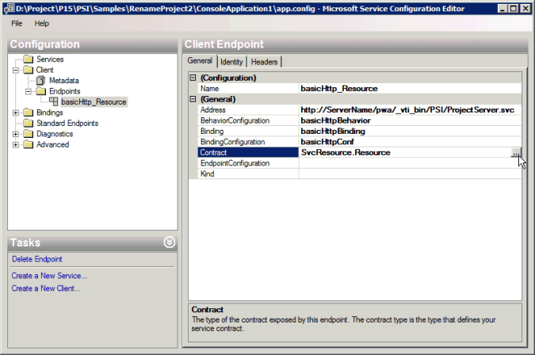

# <a name="prerequisites-for-wcf-based-code-samples-in-project"></a><span data-ttu-id="2191d-103">Requisitos previos de muestras de código basadas en WCF en Project</span><span class="sxs-lookup"><span data-stu-id="2191d-103">Prerequisites for WCF-based code samples in Project</span></span>

<span data-ttu-id="2191d-104">Obtenga información para ayudarle a crear proyectos en Visual Studio mediante los ejemplos de código basados en WCF que se incluyen en los temas de referencia Project Server Interface (PSI).</span><span class="sxs-lookup"><span data-stu-id="2191d-104">Learn information to help you create projects in Visual Studio by using the WCF-based code samples that are included in the Project Server Interface (PSI) reference topics.</span></span>
   
<span data-ttu-id="2191d-105">Muchos de los ejemplos de código basados en WCF incluidos en la biblioteca de clases de [Project Server 2013](https://msdn.microsoft.com/library/ef1830e0-3c9a-4f98-aa0a-5556c298e7d1%28Office.15%29.aspx) y la referencia de servicio web se crearon originalmente para la documentación para desarrolladores de Project 2010 y usan un formato estándar para los servicios web WCF.</span><span class="sxs-lookup"><span data-stu-id="2191d-105">Many of the WCF-based code samples included in the [Project Server 2013 class library and web service reference](https://msdn.microsoft.com/library/ef1830e0-3c9a-4f98-aa0a-5556c298e7d1%28Office.15%29.aspx) were originally created for the Project 2010 developer documentation, and use a standard format for WCF web services.</span></span> <span data-ttu-id="2191d-106">Los ejemplos siguen funcionando en Project Server 2013 y están diseñados para copiarse en una aplicación de consola y ejecutarse como una unidad completa.</span><span class="sxs-lookup"><span data-stu-id="2191d-106">The samples still work in Project Server 2013 and are designed to be copied into a console application and run as a complete unit.</span></span> <span data-ttu-id="2191d-107">Las excepciones están señaladas en la muestra.</span><span class="sxs-lookup"><span data-stu-id="2191d-107">Exceptions are noted in the sample.</span></span> 
  
<span data-ttu-id="2191d-108">Los ejemplos de código de la Project de desarrolladores de Project 2013 que no cambian de los ejemplos desarrollados para Office Project Server 2007 usan servicios web ASMX.</span><span class="sxs-lookup"><span data-stu-id="2191d-108">Code samples in the Project 2013 developer documentation that are unchanged from the samples developed for Office Project Server 2007 use ASMX Web services.</span></span> <span data-ttu-id="2191d-109">Las muestras basadas en ASMX también pueden adaptarse para utilizar servicios de WCF.</span><span class="sxs-lookup"><span data-stu-id="2191d-109">The ASMX-based samples can also be adapted to use WCF services.</span></span> <span data-ttu-id="2191d-110">Este artículo muestra cómo utilizar las muestras con servicios de WCF.</span><span class="sxs-lookup"><span data-stu-id="2191d-110">This article shows how to use the samples with WCF services.</span></span> <span data-ttu-id="2191d-111">Para obtener información sobre cómo usar los ejemplos con servicios web ASMX, vea [Prerequisites for ASMX-based code samples in Project](prerequisites-for-asmx-based-code-samples-in-project.md).</span><span class="sxs-lookup"><span data-stu-id="2191d-111">For information about how to use the samples with ASMX web services, see [Prerequisites for ASMX-based code samples in Project](prerequisites-for-asmx-based-code-samples-in-project.md).</span></span>
  
> [!NOTE]
> <span data-ttu-id="2191d-112">Si el modelo de objeto de cliente (CSOM) incluye los métodos que su aplicación necesita, deberían desarrollarse nuevas aplicaciones con el CSOM.</span><span class="sxs-lookup"><span data-stu-id="2191d-112">If the client-side object model (CSOM) includes the methods that your application requires, new applications should be developed with the CSOM.</span></span> <span data-ttu-id="2191d-113">El CSOM permite a las aplicaciones trabajar con Project Online una instalación local de Project Server 2013.</span><span class="sxs-lookup"><span data-stu-id="2191d-113">The CSOM enables applications to work with Project Online or an on-premises installation of Project Server 2013.</span></span> <span data-ttu-id="2191d-114">De lo contrario, si su aplicación usa la PSI, debería usar la interfaz de WCF, que es la tecnología que recomendamos para las comunicaciones de red.</span><span class="sxs-lookup"><span data-stu-id="2191d-114">Otherwise, if your application uses the PSI, it should use the WCF interface, which is the technology that we recommend for network communications.</span></span> <span data-ttu-id="2191d-115">Las aplicaciones que usan la interfaz ASMX o la interfaz WCF solo pueden funcionar para instalaciones locales de Project Server 2013.</span><span class="sxs-lookup"><span data-stu-id="2191d-115">Applications that use the ASMX interface or the WCF interface can work only for on-premises installations of Project Server 2013.</span></span> 
>
> <span data-ttu-id="2191d-116">Para obtener más información acerca del CSOM, vea [Project Server 2013 architecture](project-server-2013-architecture.md) and [Client-side object model (CSOM) for Project 2013](client-side-object-model-csom-for-project-2013.md).</span><span class="sxs-lookup"><span data-stu-id="2191d-116">For more information about the CSOM, see [Project Server 2013 architecture](project-server-2013-architecture.md) and [Client-side object model (CSOM) for Project 2013](client-side-object-model-csom-for-project-2013.md).</span></span> 
  
<span data-ttu-id="2191d-117">Antes de ejecutar las muestras de código, debe configurar el entorno de desarrollo, configurar la aplicación y agregar un archivo de configuración de servicio (o configurar los servicios de WCF de forma programada) y cambiar valores constantes genéricos para que coincidan con su entorno.</span><span class="sxs-lookup"><span data-stu-id="2191d-117">Before running the code samples, you must set up the development environment, configure the application, add a service configuration file (or configure the WCF services programmatically), and change generic constant values to match your environment.</span></span>
  
## <a name="setting-up-the-development-environment"></a><span data-ttu-id="2191d-118">Configuración del entorno de desarrollo</span><span class="sxs-lookup"><span data-stu-id="2191d-118">Setting up the development environment</span></span>
<span data-ttu-id="2191d-119"><a name="pj15_PrerequisitesWCF_Setup"> </a></span><span class="sxs-lookup"><span data-stu-id="2191d-119"><a name="pj15_PrerequisitesWCF_Setup"> </a></span></span>

1. <span data-ttu-id="2191d-120">**Configurar un sistema de Project Server de prueba.**</span><span class="sxs-lookup"><span data-stu-id="2191d-120">**Set up a test Project Server system.**</span></span>
    
    <span data-ttu-id="2191d-p104">Use un sistema de Project Server de prueba siempre que haga un desarrollo o una prueba. Incluso cuando su código funcione perfectamente, las dependencias entre proyectos, los informes u otros factores de entorno pueden generar consecuencias no esperadas.</span><span class="sxs-lookup"><span data-stu-id="2191d-p104">Use a test Project Server system whenever you are developing or testing. Even when your code works perfectly, interproject dependencies, reporting, or other environmental factors can cause unintended consequences.</span></span> 
    
    > [!NOTE]
    > <span data-ttu-id="2191d-123">Asegure que es un usuario válido en el servidor y compruebe que posee los permisos suficientes para las llamadas de la PSI que utilice su aplicación.</span><span class="sxs-lookup"><span data-stu-id="2191d-123">Ensure that you are a valid user on the server, and check that you have sufficient permissions for the PSI calls that your application uses.</span></span> <span data-ttu-id="2191d-124">El tema de la documentación de desarrollador para cada método de PSI incluye una tabla de permisos de Project Server.</span><span class="sxs-lookup"><span data-stu-id="2191d-124">The developer documentation topic for each PSI method includes a Project Server Permissions table.</span></span> <span data-ttu-id="2191d-125">Por ejemplo, el [Project. El método QueueCreateProject](https://msdn.microsoft.com/library/WebSvcProject.Project.QueueCreateProject.aspx) requiere el **permiso global NewProject** y **el permiso SaveProjectTemplate.**</span><span class="sxs-lookup"><span data-stu-id="2191d-125">For example, the [Project.QueueCreateProject](https://msdn.microsoft.com/library/WebSvcProject.Project.QueueCreateProject.aspx) method requires the global **NewProject** permission and the **SaveProjectTemplate** permission.</span></span> 
  
    <span data-ttu-id="2191d-126">En algunos casos, quizás deba hacer una depuración remota en el servidor.</span><span class="sxs-lookup"><span data-stu-id="2191d-126">In some cases, you may have to do remote debugging on the server.</span></span> <span data-ttu-id="2191d-127">También es posible que tenga que configurar un controlador de eventos instalando un ensamblado de controlador de eventos en cada equipo de Project Server en la granja de servidores de SharePoint y, a continuación, configurando el controlador de eventos para la instancia de Project Web App mediante la página Configuración del servidor de Project en el Configuración de aplicación general de Administración central de SharePoint.</span><span class="sxs-lookup"><span data-stu-id="2191d-127">You may also have to set up an event handler by installing an event handler assembly on each Project Server computer in the SharePoint farm, and then configuring the event handler for the Project Web App instance by using the Project Server Settings page in the General Application Settings of SharePoint Central Administration.</span></span>
    
2. <span data-ttu-id="2191d-128">**Configurar un PC de desarrollo.**</span><span class="sxs-lookup"><span data-stu-id="2191d-128">**Set up a development computer.**</span></span>
    
    <span data-ttu-id="2191d-p107">Generalmente obtiene acceso a la PSI a través de una red. Las muestras de código están diseñadas para usarse en un cliente independiente del servidor, excepto cuando se indique lo contrario.</span><span class="sxs-lookup"><span data-stu-id="2191d-p107">You usually access the PSI through a network. The code samples are designed to be run on a client that is separate from the server, except where noted.</span></span>
    
    1. <span data-ttu-id="2191d-131">**Instale la versión correcta de Visual Studio.**</span><span class="sxs-lookup"><span data-stu-id="2191d-131">**Install the correct version of Visual Studio.**</span></span> <span data-ttu-id="2191d-132">Excepto cuando se lo especifique, las muestras de código se escriben en Visual C#.</span><span class="sxs-lookup"><span data-stu-id="2191d-132">Except where noted, the code samples are written in Visual C#.</span></span> <span data-ttu-id="2191d-133">Se pueden usar con Visual Studio 2010 o Visual Studio 2012.</span><span class="sxs-lookup"><span data-stu-id="2191d-133">They can be used with Visual Studio 2010 or Visual Studio 2012.</span></span> <span data-ttu-id="2191d-134">Asegúrese de tener instalado el Service Pack más reciente.</span><span class="sxs-lookup"><span data-stu-id="2191d-134">Ensure that you have the most recent service pack installed.</span></span> 
    
    2. <span data-ttu-id="2191d-135">**Copie los DLL de Project Server en el PC de desarrollo.**</span><span class="sxs-lookup"><span data-stu-id="2191d-135">**Copy Project Server DLLs to the development computer.**</span></span> <span data-ttu-id="2191d-136">Copie los siguientes ensamblados `[Program Files]\Microsoft Office Servers\15.0\Bin` del equipo Project server en el equipo de desarrollo:</span><span class="sxs-lookup"><span data-stu-id="2191d-136">Copy the following assemblies from  `[Program Files]\Microsoft Office Servers\15.0\Bin` on the Project Server computer to the development computer:</span></span> 
    
       - <span data-ttu-id="2191d-137">Microsoft.Office.Project.Server.Events.Receivers.dll</span><span class="sxs-lookup"><span data-stu-id="2191d-137">Microsoft.Office.Project.Server.Events.Receivers.dll</span></span>
    
       - <span data-ttu-id="2191d-138">Microsoft.Office.Project.Server.Library.dll</span><span class="sxs-lookup"><span data-stu-id="2191d-138">Microsoft.Office.Project.Server.Library.dll</span></span>
    
    3. <span data-ttu-id="2191d-139">Para obtener información sobre cómo compilar y utilizar el ensamblado de proxy ProjectServerServices.dll para los servicios de WCF en la PSI, consulte [Uso de un ensamblado de proxy de PSI y descripciones de IntelliSense](#pj15_PrerequisitesWCF_BuildingProxy).</span><span class="sxs-lookup"><span data-stu-id="2191d-139">For information about how to compile and use the ProjectServerServices.dll proxy assembly for the WCF services in the PSI, see [Using a PSI proxy assembly and IntelliSense descriptions](#pj15_PrerequisitesWCF_BuildingProxy).</span></span>
    
3. <span data-ttu-id="2191d-140">**Instalar los archivos de IntelliSense.**</span><span class="sxs-lookup"><span data-stu-id="2191d-140">**Install the IntelliSense files.**</span></span>
    
    <span data-ttu-id="2191d-141">Para usar descripciones de IntelliSense para clases y miembros en ensamblados de Project Server, copie los archivos XML de IntelliSense actualizados de la descarga del SDK de Project 2013 en el mismo directorio donde se encuentran los ensamblados de Project Server.</span><span class="sxs-lookup"><span data-stu-id="2191d-141">To use IntelliSense descriptions for classes and members in Project Server assemblies, copy the updated IntelliSense XML files from the Project 2013 SDK download to the same directory where the Project Server assemblies are located.</span></span> <span data-ttu-id="2191d-142">Por ejemplo, copie el archivo Microsoft.Office.Project.Server.Library.xml al directorio donde su aplicación establecerá una referencia al ensamblado Microsoft.Office.Project.Server.Library.dll.</span><span class="sxs-lookup"><span data-stu-id="2191d-142">For example, copy the Microsoft.Office.Project.Server.Library.xml file to the directory where your application will set a reference to the Microsoft.Office.Project.Server.Library.dll assembly.</span></span>
    
    <span data-ttu-id="2191d-143">IntelliSense descripciones de los servicios de PSI requieren que cree un ensamblado de proxy de PSI mediante el script CompileWCFProxyAssembly.cmd en el subdirectorio en la descarga del SDK de `Documentation\IntelliSense\WCF` Project 2013.</span><span class="sxs-lookup"><span data-stu-id="2191d-143">IntelliSense descriptions for the PSI services require that you create a PSI proxy assembly by using the CompileWCFProxyAssembly.cmd script in the  `Documentation\IntelliSense\WCF` subdirectory in the Project 2013 SDK download.</span></span> <span data-ttu-id="2191d-144">La secuencia de comandos crea el ensamblado de proxy ProjectServerServices.dll basado en WCF.</span><span class="sxs-lookup"><span data-stu-id="2191d-144">The script creates the WCF-based ProjectServerServices.dll proxy assembly.</span></span> <span data-ttu-id="2191d-145">Para obtener más información, consulte el archivo [ReadMe_IntelliSense].mht en la descarga de SDK.</span><span class="sxs-lookup"><span data-stu-id="2191d-145">For more information, see the [ReadMe_IntelliSense].mht file in the SDK download.</span></span> 
    
## <a name="creating-the-application-and-adding-a-service-reference"></a><span data-ttu-id="2191d-146">Crear la aplicación y agregar una referencia de servicio</span><span class="sxs-lookup"><span data-stu-id="2191d-146">Creating the application and adding a service reference</span></span>
<span data-ttu-id="2191d-147"><a name="pj15_PrerequisitesWCF_Configure"> </a></span><span class="sxs-lookup"><span data-stu-id="2191d-147"><a name="pj15_PrerequisitesWCF_Configure"> </a></span></span>

1. <span data-ttu-id="2191d-148">**Crear una aplicación de consola.**</span><span class="sxs-lookup"><span data-stu-id="2191d-148">**Create a console application.**</span></span>
    
    <span data-ttu-id="2191d-p112">Cuando crea una aplicación de consola, en la lista desplegable del cuadro de diálogo **Nuevo proyecto**, seleccione **.NET Framework 4**. Puede copiar el código de ejemplo de PSI en la nueva aplicación.</span><span class="sxs-lookup"><span data-stu-id="2191d-p112">When you create a console application, in the drop-down list of the **New Project** dialog box, select **.NET Framework 4**. You can copy the PSI example code into the new application.</span></span>
    
2. <span data-ttu-id="2191d-151">**Agregar referencias requeridas para WCF.**</span><span class="sxs-lookup"><span data-stu-id="2191d-151">**Add references required for WCF.**</span></span>
    
    <span data-ttu-id="2191d-152">En Solution Explorer, agregue una referencia a **System.ServiceModel** (consulte Figura 1).</span><span class="sxs-lookup"><span data-stu-id="2191d-152">In Solution Explorer, add a reference to **System.ServiceModel** (see Figure 1).</span></span> <span data-ttu-id="2191d-153">Una aplicación web utilizaría **System.ServiceModel.Web**.</span><span class="sxs-lookup"><span data-stu-id="2191d-153">A web application would use **System.ServiceModel.Web**.</span></span>
    
    <span data-ttu-id="2191d-154">También agregue una referencia a **System.Runtime.Serialization**.</span><span class="sxs-lookup"><span data-stu-id="2191d-154">Also add a reference to **System.Runtime.Serialization**.</span></span>
    
    <span data-ttu-id="2191d-155">**Figura 1. Agregar las referencias en Visual Studio para una aplicación basada en WCF**</span><span class="sxs-lookup"><span data-stu-id="2191d-155">**Figure 1. Adding the references in Visual Studio for a WCF-based application**</span></span>

    <span data-ttu-id="2191d-156">![Agregar referencias para WCF Agregar]referencias para(media/pj15_PrerequisitesWCF_AddReference.gif "WCF")</span><span class="sxs-lookup"><span data-stu-id="2191d-156"></span></span>
  
3. <span data-ttu-id="2191d-157">**Copiar el código**.</span><span class="sxs-lookup"><span data-stu-id="2191d-157">**Copy the code**.</span></span>
    
    <span data-ttu-id="2191d-158">Copie el ejemplo de código completo en el archivo Program.cs de la aplicación de consola.</span><span class="sxs-lookup"><span data-stu-id="2191d-158">Copy the complete code example into the Program.cs file of the console application.</span></span>
    
4. <span data-ttu-id="2191d-159">**Establecer el espacio de nombre para la aplicación de muestra.**</span><span class="sxs-lookup"><span data-stu-id="2191d-159">**Set the namespace for the sample application.**</span></span>
    
    <span data-ttu-id="2191d-p114">Puede cambiar el espacio de nombres que aparece en la parte superior de la muestra por el espacio de nombres predeterminado de la aplicación o bien cambiar el espacio de nombres de la aplicación predeterminado para que coincida con la muestra. Puede cambiar el espacio de nombres de la aplicación predeterminado modificando las propiedades de la aplicación.</span><span class="sxs-lookup"><span data-stu-id="2191d-p114">You can either change the namespace listed at the top of the sample to the application default namespace, or change the default application namespace to match the sample. You can change the default application namespace by changing the application properties.</span></span> 
    
    <span data-ttu-id="2191d-162">Por ejemplo, el ejemplo de código de [ReadResource](https://msdn.microsoft.com/library/WebSvcResource.Resource.ReadResource.aspx) tiene el espacio **de nombres Microsoft.SDK.Project. Samples.CreateResourceTest**.</span><span class="sxs-lookup"><span data-stu-id="2191d-162">For example, the code sample for [ReadResource](https://msdn.microsoft.com/library/WebSvcResource.Resource.ReadResource.aspx) has the namespace **Microsoft.SDK.Project.Samples.CreateResourceTest**.</span></span> <span data-ttu-id="2191d-163">Si el nombre del proyecto de Visual Studio es **ResourceTest**, copie el espacio de nombre desde el archivo Program.cs y, a continuación, abra el panel **Propiedades** del proyecto (en el menú **Proyecto**, elija **Propiedades de ResourceTest**).</span><span class="sxs-lookup"><span data-stu-id="2191d-163">If the name of the Visual Studio project is **ResourceTest**, copy the namespace from the Program.cs file, and then open the project **Properties** pane (on the **Project** menu, choose **ResourceTest Properties**).</span></span> <span data-ttu-id="2191d-164">En la ficha **Aplicación**, copie el espacio de nombre en el cuadro de texto **Espacio de nombre predeterminado**.</span><span class="sxs-lookup"><span data-stu-id="2191d-164">On the **Application** tab, copy the namespace into the **Default namespace** text box.</span></span> 
    
5. <span data-ttu-id="2191d-165">**Establecer las referencias de servicio.**</span><span class="sxs-lookup"><span data-stu-id="2191d-165">**Set the service references.**</span></span>
    
    <span data-ttu-id="2191d-p116">Muchos ejemplos requieren una referencia a uno o más de los servicios de la PSI. Estos aparecen en la muestra misma o en comentarios que preceden a la muestra. Para obtener el espacio de nombre correcto de las referencias de servicio, asegúrese de establecer primero el espacio de nombre de la aplicación predeterminado.</span><span class="sxs-lookup"><span data-stu-id="2191d-p116">Many examples require a reference to one or more of the PSI services. These are listed in the sample itself or in comments that precede the sample. To get the correct namespace of the service references, ensure that you first set the default application namespace.</span></span>
    
    <span data-ttu-id="2191d-169">Existen tres maneras de agregar una referencia de servicio de WCF:</span><span class="sxs-lookup"><span data-stu-id="2191d-169">There are three ways to add a WCF service reference:</span></span>
    
    - <span data-ttu-id="2191d-p117">Cree un ensamblado de proxy de PSI llamado ProjectServerServices.dll y, a continuación, establezca una referencia al ensamblado. Consulte [Uso de un ensamblado de proxy de PSI y de descripciones de IntelliSense](#pj15_PrerequisitesWCF_BuildingProxy).</span><span class="sxs-lookup"><span data-stu-id="2191d-p117">Build a PSI proxy assembly named ProjectServerServices.dll, and then set a reference to the assembly. See [Using a PSI proxy assembly and IntelliSense descriptions](#pj15_PrerequisitesWCF_BuildingProxy).</span></span>
    
    - <span data-ttu-id="2191d-p118">Agregue un archivo de proxy desde la salida svcutil.exe a la solución de Visual Studio. Consulte [Agregar un archivo de proxy de PSI](#pj15_PrerequisitesWCF_AddingProxyFile).</span><span class="sxs-lookup"><span data-stu-id="2191d-p118">Add a proxy file from the svcutil.exe output to the Visual Studio solution. See [Adding a PSI proxy file](#pj15_PrerequisitesWCF_AddingProxyFile).</span></span>
    
    - <span data-ttu-id="2191d-p119">Agregue una referencia de servicio utilizando Virtual Studio. Consulte [Agregar una referencia de servicio](#pj15_PrerequisitesWCF_AddingServiceReference)</span><span class="sxs-lookup"><span data-stu-id="2191d-p119">Add a service reference by using Visual Studio. See [Adding a service reference](#pj15_PrerequisitesWCF_AddingServiceReference).</span></span>
    
### <a name="using-a-psi-proxy-assembly-and-intellisense-descriptions"></a><span data-ttu-id="2191d-176">Usar un ensamblado de proxy de PSI y descripciones de IntelliSense</span><span class="sxs-lookup"><span data-stu-id="2191d-176">Using a PSI proxy assembly and IntelliSense descriptions</span></span>
<span data-ttu-id="2191d-177"><a name="pj15_PrerequisitesWCF_BuildingProxy"> </a></span><span class="sxs-lookup"><span data-stu-id="2191d-177"><a name="pj15_PrerequisitesWCF_BuildingProxy"> </a></span></span>

<span data-ttu-id="2191d-178">Puede utilizar un ensamblado de proxy para todos los servicios de WCF en la PSI.</span><span class="sxs-lookup"><span data-stu-id="2191d-178">You can use a proxy assembly for all public WCF services in the PSI.</span></span> <span data-ttu-id="2191d-179">Compile el ensamblado de proxy ProjectServerServices.dll mediante el script de la descarga del SDK de `Documentation\IntelliSense\WCF\CompileWCFProxyAssembly.cmd` Project 2013 y, a continuación, copie el ensamblado de proxy en el equipo de desarrollo.</span><span class="sxs-lookup"><span data-stu-id="2191d-179">Compile the ProjectServerServices.dll proxy assembly by using the  `Documentation\IntelliSense\WCF\CompileWCFProxyAssembly.cmd` script in the Project 2013 SDK download, and then copy the proxy assembly to your development computer.</span></span> <span data-ttu-id="2191d-180">Copie el archivo ProjectServerServices.xml para IntelliSense en la misma ubicación.</span><span class="sxs-lookup"><span data-stu-id="2191d-180">Copy the ProjectServerServices.xml file for IntelliSense to the same location.</span></span> <span data-ttu-id="2191d-181">En Visual Studio, establezca una referencia al ensamblado de proxy ProjectServerServices.dll.</span><span class="sxs-lookup"><span data-stu-id="2191d-181">In Visual Studio, set a reference to the ProjectServerServices.dll proxy assembly.</span></span> 
  
<span data-ttu-id="2191d-182">Para las actualizaciones y los Service Packs de Project Server, puede actualizar los archivos de origen de proxy y crear un nuevo ensamblado de proxy utilizando la secuencia de comando GenWCFProxyAssembly.cmd en la misma carpeta de descarga de SDK.</span><span class="sxs-lookup"><span data-stu-id="2191d-182">For Project Server service packs and updates, you can update the proxy source files and create a new proxy assembly by using the GenWCFProxyAssembly.cmd script in the same SDK download folder.</span></span> <span data-ttu-id="2191d-183">Para obtener un vínculo a la descarga del SDK, consulte Project documentación para desarrolladores [de 2013](project-2013-developer-documentation.md).</span><span class="sxs-lookup"><span data-stu-id="2191d-183">For a link to the SDK download, see [Project 2013 developer documentation](project-2013-developer-documentation.md).</span></span> <span data-ttu-id="2191d-184">Para obtener más información, consulte la sección [Agregar una referencia de servicio](#pj15_PrerequisitesWCF_AddingServiceReference).</span><span class="sxs-lookup"><span data-stu-id="2191d-184">For more information, see the [Adding a service reference](#pj15_PrerequisitesWCF_AddingServiceReference) section.</span></span> 
  
> [!NOTE]
> <span data-ttu-id="2191d-185">Al extraer los archivos de origen de proxy del archivo Source.zip, los archivos de la carpeta están actualizados a partir de la fecha de publicación de la descarga del SDK de `Documentation\IntelliSense\WCF\Source` Project 2013.</span><span class="sxs-lookup"><span data-stu-id="2191d-185">When you extract the proxy source files from the Source.zip file, the files in the  `Documentation\IntelliSense\WCF\Source` folder are current as of the publication date of the Project 2013 SDK download.</span></span> <span data-ttu-id="2191d-186">Para generar archivos de origen de proxy de PSI actualizados, ejecute la secuencia de comando GenASMXProxyAssembly.cmd en el equipo de Project Server.</span><span class="sxs-lookup"><span data-stu-id="2191d-186">To generate updated PSI proxy source files, run the GenASMXProxyAssembly.cmd script on the Project Server computer.</span></span> <span data-ttu-id="2191d-187">Para obtener más información, consulte [Agregar una referencia de servicio](#pj15_PrerequisitesWCF_AddingServiceReference).</span><span class="sxs-lookup"><span data-stu-id="2191d-187">For more information, see [Adding a service reference](#pj15_PrerequisitesWCF_AddingServiceReference).</span></span> 
> 
> <span data-ttu-id="2191d-188">Los scripts de la  `Documentation\IntelliSense\ASMX` carpeta no funcionan para aplicaciones basadas en WCF.</span><span class="sxs-lookup"><span data-stu-id="2191d-188">The scripts in the  `Documentation\IntelliSense\ASMX` folder do not work for WCF-based applications.</span></span> <span data-ttu-id="2191d-189">La secuencia de comandos The GenASMXProxyAssembly.cmd llama a Wsdl.exe, lo cual genera archivos de código de origen para los servicios ASMX.</span><span class="sxs-lookup"><span data-stu-id="2191d-189">The GenASMXProxyAssembly.cmd script calls Wsdl.exe, which generates source code files for the ASMX services.</span></span> <span data-ttu-id="2191d-190">Los archivos de proxy de ASMX incluyen diferentes clases y propiedades.</span><span class="sxs-lookup"><span data-stu-id="2191d-190">The ASMX proxy files include different classes and properties.</span></span> <span data-ttu-id="2191d-191">Por ejemplo, el servicio web de Recurso basado en ASMX incluye la clase de **Resource**, mientras que el servicio de Recurso basado en WCF incluye la interfaz de **Resource**, la interfaz de **ResourceChannel** y la clase de **ResourceClient**.</span><span class="sxs-lookup"><span data-stu-id="2191d-191">For example, the ASMX-based Resource web service includes the **Resource** class, whereas the WCF-based Resource service includes the **Resource** interface, the **ResourceChannel** interface, and the **ResourceClient** class.</span></span> 
  
<span data-ttu-id="2191d-p124">Los espacios de nombre arbitrarios creados tanto para los servicios web de ASMX como para los servicios de WCF son los mismos, de manera que el archivo ProjectServerServices.xml para IntelliSense funciona con ambos ensamblados. Por ejemplo, el espacio de nombre del servicio Recurso en el ensamblado de proxy basado en WCF y en el ensamblado de proxy basado en ASMX es **SvcResource**. Por supuesto, puede modificar los nombres de los espacios de nombre, si se asegura de que coinciden en el ensamblado de proxy y en el archivo ProjectServerServices.xml de IntelliSense.</span><span class="sxs-lookup"><span data-stu-id="2191d-p124">The arbitrary namespaces created for both the ASMX web services and the WCF services are the same, so that the ProjectServerServices.xml file for IntelliSense works with either assembly. For example, the namespace of the Resource service in the WCF-based proxy assembly and in the ASMX-based proxy assembly is **SvcResource**. You can, of course, change the namespace names— if you ensure that they match in the proxy assembly and in the ProjectServerServices.xml IntelliSense file.</span></span>
  
<span data-ttu-id="2191d-195">Si una muestra de código utiliza un nombre diferente para un espacio de nombre de servicio de PSI, por ejemplo **ProjectWebSvc**, para que funcione IntelliSense debe cambiar la muestra para que utilice **SvcProject** de manera que el espacio de nombre coincida con el ensamblado de proxy.</span><span class="sxs-lookup"><span data-stu-id="2191d-195">If a code sample uses a different name for a PSI service namespace, for example **ProjectWebSvc**, for IntelliSense to work you must change the sample to use **SvcProject** so that the namespace matches the proxy assembly.</span></span> 
  
<span data-ttu-id="2191d-196">Algunas ventajas del uso del ensamblado de proxy basado en WCF son las siguientes:</span><span class="sxs-lookup"><span data-stu-id="2191d-196">Advantages to using the WCF-based proxy assembly include the following:</span></span>
  
- <span data-ttu-id="2191d-p125">Puede desarrollar la mayoría de las soluciones con el ensamblado de proxy en un equipo distinto del equipo de Project Server. Establecer una referencia de servicio individual requiere desarrollo en el equipo de Project Server.</span><span class="sxs-lookup"><span data-stu-id="2191d-p125">You can develop most solutions with the proxy assembly on a different computer than the Project Server computer. Setting an individual service reference requires development on the Project Server computer.</span></span>
    
- <span data-ttu-id="2191d-199">El ensamblado de proxy incluye todos los espacios de nombre de servicio de PSI, entonces no tiene que agregar varios archivos de proxy.</span><span class="sxs-lookup"><span data-stu-id="2191d-199">The proxy assembly includes all PSI service namespaces, so you do not have to add multiple proxy files.</span></span>
    
- <span data-ttu-id="2191d-200">Si agrega el archivo ProjectServerServices.xml al mismo directorio donde estableció una referencia al ensamblado de proxy ProjectServerServices.dll, puede obtener descripciones de IntelliSense para los miembros y las clases de PSI.</span><span class="sxs-lookup"><span data-stu-id="2191d-200">If you add the ProjectServerServices.xml file to the same directory where you set a reference to the ProjectServerServices.dll proxy assembly, you can get IntelliSense descriptions for the PSI classes and members.</span></span> <span data-ttu-id="2191d-201">Para obtener más información, vea el archivo [ReadMe_IntelliSense] en la carpeta de la descarga del SDK Project `Documentation\IntelliSense` 2013.</span><span class="sxs-lookup"><span data-stu-id="2191d-201">For more information, see the [ReadMe_IntelliSense] file in the  `Documentation\IntelliSense` folder of the Project 2013 SDK download.</span></span> 
    
<span data-ttu-id="2191d-202">**Figura 2. Uso de IntelliSense para acceder a un método en el servicio de Recurso**</span><span class="sxs-lookup"><span data-stu-id="2191d-202">**Figure 2. Using IntelliSense for a method in the Resource service**</span></span>

<span data-ttu-id="2191d-203"></span><span class="sxs-lookup"><span data-stu-id="2191d-203"></span></span>
  
<span data-ttu-id="2191d-p127">Las desventajas de utilizar el ensamblado de proxy son que la solución es mayor y debe distribuir e instalar el ensamblado de proxy con la solución. También debe utilizar los mismos espacios de nombre que se encuentran en el ensamblado de proxy y los archivos de IntelliSense, a menos que cambie la secuencia de comandos para crear un ensamblado de proxy y cambie el archivo ProjectServerServices.xml de IntelliSense para utilizar distintos espacios de nombre.</span><span class="sxs-lookup"><span data-stu-id="2191d-p127">Disadvantages to using the proxy assembly are that the solution is larger and you must distribute and install the proxy assembly with the solution. You must also use the same namespaces that are in the proxy assembly and IntelliSense files, unless you change the script to build a proxy assembly and change the ProjectServerServices.xml IntelliSense file to use different namespaces.</span></span>
  
### <a name="adding-a-psi-proxy-file"></a><span data-ttu-id="2191d-206">Agregar un archivo de proxy de PSI</span><span class="sxs-lookup"><span data-stu-id="2191d-206">Adding a PSI proxy file</span></span>
<span data-ttu-id="2191d-207"><a name="pj15_PrerequisitesWCF_AddingProxyFile"> </a></span><span class="sxs-lookup"><span data-stu-id="2191d-207"><a name="pj15_PrerequisitesWCF_AddingProxyFile"> </a></span></span>

<span data-ttu-id="2191d-208">La Project SDK de 2013 incluye los archivos de origen generados por el comando SvcUtil.exe para el ensamblado de proxy.</span><span class="sxs-lookup"><span data-stu-id="2191d-208">The Project 2013 SDK download includes the source files that are generated by the SvcUtil.exe command for the proxy assembly.</span></span> <span data-ttu-id="2191d-209">Los archivos de origen se encuentran en el Source.zip en el  `Documentation\IntelliSense\WCF` subdirectorio.</span><span class="sxs-lookup"><span data-stu-id="2191d-209">The source files are in the Source.zip file in the  `Documentation\IntelliSense\WCF` subdirectory.</span></span> <span data-ttu-id="2191d-210">En lugar de establecer una referencia al ensamblado de proxy, puede agregar uno o más archivos de origen a una solución de Visual Studio.</span><span class="sxs-lookup"><span data-stu-id="2191d-210">Instead of setting a reference to the proxy assembly, you can add one or more of the source files to a Visual Studio solution.</span></span> <span data-ttu-id="2191d-211">Por ejemplo, para utilizar el servicio de Project y el servicio de Recurso, agregue los archivos wcf.Project.cs y wcf.Resource.cs a la solución.</span><span class="sxs-lookup"><span data-stu-id="2191d-211">For example, to use the Project service and the Resource service, add the wcf.Project.cs and wcf.Resource.cs files to the solution.</span></span> 
  
<span data-ttu-id="2191d-p129">En WCF, la clase primaria en cada servicio de PSI se define por una interfaz y se implementa en una clase de cliente para acceder a los miembros. Por ejemplo, la interfaz de **SvcProject.Resource** se implementa en la clase de **SvcProject.ResourceClient**. Para definir un objeto de **ResourceClient** como una variable de clase llamada **resourceClient**, por ejemplo, utilice el siguiente código. En el ejemplo, el método **SetClientEndpoints** crea un objeto de **resourceClient** que utiliza el extremo **basicHttp_Project**, que se define en el archivo app.config. Para obtener más información sobre el archivo app.config, consulte la sección [Agregar un archivo de configuración de servicio](#pj15_PrerequisitesWCF_AddConfig).</span><span class="sxs-lookup"><span data-stu-id="2191d-p129">In WCF, the primary class in each PSI service is defined by an interface and implemented in a client class for access to the members. For example, the **SvcProject.Resource** interface is implemented in the **SvcProject.ResourceClient** class. To define a **ResourceClient** object as a class variable named **resourceClient**, for example, use the following code. In the example, the **SetClientEndpoints** method creates a **resourceClient** object that uses the **basicHttp_Project** endpoint, which is defined in the app.config file. For more information about the app.config file, see the [Adding a service configuration file](#pj15_PrerequisitesWCF_AddConfig) section.</span></span> 
  
```cs
private static SvcResource.ResourceClient resourceClient;
. . .
private static void SetClientEndpoints()
{
  resourceClient = new SvcResource.ResourceClient("basicHttp_Resource");
  . . .
}
public void DisposeClients()
{
  resourceClient.Close();
  . . .
}
```

> [!NOTE]
> <span data-ttu-id="2191d-217">Si utiliza un ensamblado de proxy de PSI o agrega un archivo de proxy para una referencia de servicio de Project llamada **SvcResource**, utilizaría el mismo código para crear y descartar un objeto de **resourceClient**.</span><span class="sxs-lookup"><span data-stu-id="2191d-217">Whether you use a PSI proxy assembly or add a proxy file for a Project service reference named **SvcResource**, you would use the same code to create and dispose a **resourceClient** object.</span></span> 
  
### <a name="adding-a-service-reference"></a><span data-ttu-id="2191d-218">Adición de una referencia de servicio</span><span class="sxs-lookup"><span data-stu-id="2191d-218">Adding a service reference</span></span>
<span data-ttu-id="2191d-219"><a name="pj15_PrerequisitesWCF_AddingServiceReference"> </a></span><span class="sxs-lookup"><span data-stu-id="2191d-219"><a name="pj15_PrerequisitesWCF_AddingServiceReference"> </a></span></span>

<span data-ttu-id="2191d-220">Si no utiliza el ensamblado de proxy basado en WCF o agrega un archivo de proxy para un servicio de PSI, puede establecer una o más referencias de servicio individual directamente en Visual Studio.</span><span class="sxs-lookup"><span data-stu-id="2191d-220">If you do not use the WCF-based proxy assembly or add a proxy file for a PSI service, you can set one or more individual service references directly in Visual Studio.</span></span> <span data-ttu-id="2191d-221">También puede usar el paso 1 del siguiente procedimiento para crear archivos proxy actualizados, para preparar el script que se incluye en la descarga del SDK de `Documentation\IntelliSense\WCF\GenWCFProxyAssembly.cmd` Project 2013.</span><span class="sxs-lookup"><span data-stu-id="2191d-221">You can also use step 1 of the following procedure to create updated proxy files, to prepare for the  `Documentation\IntelliSense\WCF\GenWCFProxyAssembly.cmd` script that is included in the Project 2013 SDK download.</span></span> 
  
> [!NOTE]
> <span data-ttu-id="2191d-p131">Para establecer una referencia de servicio, debe utilizar Visual Studio en el equipo de Project Server. Recomendamos que utilice el ensamblado de proxy ProjectServerServices.dll o agregue archivos de origen de proxy, en lugar de agregar directamente referencias de servicio en Visual Studio.</span><span class="sxs-lookup"><span data-stu-id="2191d-p131">To set a service reference, you must use Visual Studio on the Project Server computer. We recommend that you use the ProjectServerServices.dll proxy assembly or add proxy source files, instead of directly adding service references in Visual Studio.</span></span> 
  
<span data-ttu-id="2191d-224">Los pasos siguientes muestran cómo establecer una referencia de servicio mediante Visual Studio 2012 en un equipo que ejecuta una instalación de prueba de Project Server:</span><span class="sxs-lookup"><span data-stu-id="2191d-224">The following steps show how to set a service reference by using Visual Studio 2012 on a computer running a test installation of Project Server:</span></span>
  
1. <span data-ttu-id="2191d-225">Para obtener acceso a los servicios de WCF back-end, ejecute Visual Studio en el equipo de Project Server.</span><span class="sxs-lookup"><span data-stu-id="2191d-225">To get access to the back-end WCF services, run Visual Studio on the Project Server computer.</span></span>
    
2. <span data-ttu-id="2191d-226">En **Solution Explorer**, haga clic con el botón secundario en la carpeta **Referencias** y, a continuación, seleccione **Agregar referencia de servicio**.</span><span class="sxs-lookup"><span data-stu-id="2191d-226">In **Solution Explorer**, right-click the **References** folder, and then choose **Add Service Reference**.</span></span> 
    
3. <span data-ttu-id="2191d-227">En el **cuadro de diálogo**  Agregar referencia de servicio, en el cuadro de texto Dirección, escriba https://localhost:32843/ _GUID_/psi/ _ServiceName_.svc y, a continuación, presione **Entrar**.</span><span class="sxs-lookup"><span data-stu-id="2191d-227">In the **Add Service Reference** dialog box, in the **Address** text box, type https://localhost:32843/ _GUID_/psi/ _ServiceName_.svc, and then press **Enter**.</span></span> <span data-ttu-id="2191d-228">Reemplace _GUID_ por el nombre del directorio virtual de la aplicación de servicio Project Server, como 534c37eb00d74ccfadcecf9827e95239.</span><span class="sxs-lookup"><span data-stu-id="2191d-228">Replace  _GUID_ with the virtual directory name of the Project Server service application, such as 534c37eb00d74ccfadcecf9827e95239.</span></span> <span data-ttu-id="2191d-229">Reemplace  _ServiceName_ por el nombre del servicio, como Resource (vea la figura 3).</span><span class="sxs-lookup"><span data-stu-id="2191d-229">Replace  _ServiceName_ with the name of the service, such as Resource (see Figure 3).</span></span> 
    
   <span data-ttu-id="2191d-230">Puede obtener el nombre del directorio virtual del servicio de Project Server de una de las siguientes maneras:</span><span class="sxs-lookup"><span data-stu-id="2191d-230">You can get the name of the Project Server Service virtual directory in one of the following ways:</span></span>
    
   - <span data-ttu-id="2191d-231">Abra la SharePoint de Administración central de 2013 en el explorador.</span><span class="sxs-lookup"><span data-stu-id="2191d-231">Open the SharePoint 2013 Central Administration application in your browser.</span></span> <span data-ttu-id="2191d-232">Elija **Administrar aplicaciones de servicio** y luego elija la aplicación de servicio de PSI de Project Server que desee.</span><span class="sxs-lookup"><span data-stu-id="2191d-232">Choose **Manage service applications**, and then choose the Project Server PSI Service application that you want.</span></span> <span data-ttu-id="2191d-233">Por ejemplo, elija **ProjectServerService**.</span><span class="sxs-lookup"><span data-stu-id="2191d-233">For example, choose **ProjectServerService**.</span></span> <span data-ttu-id="2191d-234">La dirección URL de la página Administrar Project web app contiene el nombre del directorio virtual.</span><span class="sxs-lookup"><span data-stu-id="2191d-234">The URL of the Manage Project Web App Sites page contains the virtual directory name.</span></span> <span data-ttu-id="2191d-235">Por ejemplo, en  `https://ServerName:8080/_admin/pwa/managepwa.aspx?appid=534c37eb-00d7-4ccf-adce-cf9827e95239` , el nombre del directorio virtual es  `534c37eb00d74ccfadcecf9827e95239` (el nombre del directorio no contiene guiones).</span><span class="sxs-lookup"><span data-stu-id="2191d-235">For example, in  `https://ServerName:8080/_admin/pwa/managepwa.aspx?appid=534c37eb-00d7-4ccf-adce-cf9827e95239`, the virtual directory name is  `534c37eb00d74ccfadcecf9827e95239` (the directory name contains no dashes).</span></span> 
    
   - <span data-ttu-id="2191d-p134">Abra el cuadro de diálogo **Administrador de Servicios de información de internet (IIS)** en el equipo de Project Server. Expanda el nodo **Servicios web de SharePoint** en el panel **Conexiones** y, a continuación, expanda los directorios virtuales de servicio debajo de eso, hasta que encuentra el directorio que incluye una carpeta de PSI. Seleccione el directorio, elija **Configuración avanzada** en el panel **Acciones** y, a continuación, copie el nombre del directorio en el campo **Ruta virtual**.</span><span class="sxs-lookup"><span data-stu-id="2191d-p134">Open the **Internet Information Services (IIS) Manager** dialog box on the Project Server computer. Expand the **SharePoint Web Services** node in the **Connections** pane, and then expand the service virtual directories below that, until you find the directory that includes a PSI folder. Select the directory, choose **Advanced Settings** in the **Actions** pane, and then copy the directory name in the **Virtual Path** field.</span></span> 
    
      > [!NOTE]
      > <span data-ttu-id="2191d-239">Puede haber más de un directorio virtual de servicio de Project Server.</span><span class="sxs-lookup"><span data-stu-id="2191d-239">There can be more than one Project Server Service virtual directory.</span></span> <span data-ttu-id="2191d-240">Asegúrese de elegir el directorio virtual que contiene la Project web app que desee.</span><span class="sxs-lookup"><span data-stu-id="2191d-240">Ensure that you choose the virtual directory that contains the Project Web App instance that you want.</span></span> 
  
   - <span data-ttu-id="2191d-241">Use el cmdlet **get-SPServiceApplication** en Windows PowerShell que se instala con SharePoint 2013.</span><span class="sxs-lookup"><span data-stu-id="2191d-241">Use the **get-SPServiceApplication** cmdlet in Windows PowerShell that is installed with SharePoint 2013.</span></span> <span data-ttu-id="2191d-242">En la barra de tareas del menú **Inicio**, elija **Todos los programas**, seleccione **Productos de Microsoft SharePoint 2013** y, a continuación, elija **SharePoint 2013 Management Shell**.</span><span class="sxs-lookup"><span data-stu-id="2191d-242">On the taskbar **Start** menu, choose **All Programs**, choose **Microsoft SharePoint 2013 Products**, and then choose **SharePoint 2013 Management Shell**.</span></span> <span data-ttu-id="2191d-243">A continuación verá el comando y los resultados en la ventana de **SharePoint 2013get- Management Shell** para las aplicaciones de servicio definidas (sus GUID serán diferentes).</span><span class="sxs-lookup"><span data-stu-id="2191d-243">Following is the command and the results in the **SharePoint 2013get- Management Shell** window for the defined service applications (your GUIDs will be different).</span></span> <span data-ttu-id="2191d-244">Copie el GUID para la aplicación de servicio de Project Server.</span><span class="sxs-lookup"><span data-stu-id="2191d-244">Copy the GUID for the Project Server service application.</span></span> 
    
        ```powershell
            PS > get-SPServiceApplication
            DisplayName          TypeName             Id
            -----------          --------             --
            State Service        State Service        04041cfa-4ab3-4473-8bc8-3967b02eff39
            ProjectServerSer...  Project Server PS... 534c37eb-00d7-4ccf-adce-cf9827e95239
            Security Token Se... Security Token Se... 7243732e-edea-405d-8cc8-1716b99faef5
            Application Disco... Application Disco... 3bfbdeb0-bc20-4a21-801c-cc6f1ce6c643
            SharePoint Server... SharePoint Server... 09912f49-3b72-462f-a44c-6533b578286a  
        ```

      <span data-ttu-id="2191d-245">Si conoce el nombre completo de la aplicación de servicio de Project Server, puede utilizarlo para obtener el valor de GUID, por ejemplo:</span><span class="sxs-lookup"><span data-stu-id="2191d-245">If you know the full name of the Project Server Service application, you can use it to get the GUID value, for example:</span></span>
    
        ```powershell
        PS > $projectService = "ProjectServerService"
        PS > (get-SPServiceApplication -Name $projectService).Id
        Guid
        ----
        534c37eb-00d7-4ccf-adce-cf9827e95239
       ```

      > [!NOTE]
      > <span data-ttu-id="2191d-246">Elimine los guiones del GUID para obtener el nombre del directorio virtual.</span><span class="sxs-lookup"><span data-stu-id="2191d-246">Remove the dashes in the GUID to get the virtual directory name.</span></span> 
  
   <span data-ttu-id="2191d-247">Las direcciones URL, como `https://localhost:32843/534c37eb00d74ccfadcecf9827e95239/PSI/Resource.svc` son estándar para Project de servidor.</span><span class="sxs-lookup"><span data-stu-id="2191d-247">URLs such as  `https://localhost:32843/534c37eb00d74ccfadcecf9827e95239/PSI/Resource.svc` are standard for Project Server services.</span></span> 
    
4. <span data-ttu-id="2191d-248">Una vez que se resuelve la referencia de servicio, escriba el nombre de la referencia en el cuadro de texto **Espacio de nombre**.</span><span class="sxs-lookup"><span data-stu-id="2191d-248">After the service reference resolves, type the reference name in the **Namespace** text box.</span></span> <span data-ttu-id="2191d-249">Los ejemplos de código de Project documentación para desarrolladores de 2013 usan el nombre de espacio de nombres arbitrario **Svc _ServiceName_**.</span><span class="sxs-lookup"><span data-stu-id="2191d-249">Code examples in the Project 2013 developer documentation use the arbitrary namespace name **Svc _ServiceName_**.</span></span> <span data-ttu-id="2191d-250">Por ejemplo, el servicio Recurso en los ejemplos de código se llama **SvcResource**.</span><span class="sxs-lookup"><span data-stu-id="2191d-250">For example, the Resource service in the code examples is named **SvcResource**.</span></span>
    
    <span data-ttu-id="2191d-251">**Figura 3. Agregar la referencia de servicio de Recurso basada en WCF**</span><span class="sxs-lookup"><span data-stu-id="2191d-251">**Figure 3. Adding the WCF-based Resource service reference**</span></span>

    <span data-ttu-id="2191d-252"> de la referencia de servicio de recursos basada en WCF</span><span class="sxs-lookup"><span data-stu-id="2191d-252"></span></span>
  
5. <span data-ttu-id="2191d-253">Reemplace el archivo web.config temporal en el directorio Project servicio por el original (cuyo nombre se cambió a web.config) y, a continuación, vuelva a ejecutar `iisreset` .</span><span class="sxs-lookup"><span data-stu-id="2191d-253">Replace the temporary web.config file in the Project Service directory with the original (renamed to web.config), and then rerun  `iisreset`.</span></span>
    
## <a name="setting-other-references"></a><span data-ttu-id="2191d-254">Estableciendo otras referencias</span><span class="sxs-lookup"><span data-stu-id="2191d-254">Setting other references</span></span>
<span data-ttu-id="2191d-255"><a name="pj15_PrerequisitesWCF_OtherReferences"> </a></span><span class="sxs-lookup"><span data-stu-id="2191d-255"><a name="pj15_PrerequisitesWCF_OtherReferences"> </a></span></span>

<span data-ttu-id="2191d-256">Project Las aplicaciones de servidor suelen usar otros servicios, como SharePoint web de 2013.</span><span class="sxs-lookup"><span data-stu-id="2191d-256">Project Server applications often use other services, such as SharePoint 2013 web services.</span></span> <span data-ttu-id="2191d-257">Si se requieren otros servicios u otras referencias, se lo señala en el ejemplo de código.</span><span class="sxs-lookup"><span data-stu-id="2191d-257">If other services or references are required, they are noted in the code example.</span></span>
  
<span data-ttu-id="2191d-258">Las referencias locales para la muestra de código aparecen en las declaraciones de **using** en la parte superior de la muestra.</span><span class="sxs-lookup"><span data-stu-id="2191d-258">Local references for the code sample are listed in **using** statements at the top of the sample.</span></span> 
  
1. <span data-ttu-id="2191d-259">En **Solution Explorer**, haga clic con el botón secundario en la carpeta **Referencias** y, a continuación, seleccione **Agregar referencia**.</span><span class="sxs-lookup"><span data-stu-id="2191d-259">In **Solution Explorer**, right-click the **References** folder, and then choose **Add Reference**.</span></span>
    
2. <span data-ttu-id="2191d-p139">Seleccione **Examinar** y, a continuación, diríjase a la ubicación donde ha almacenado los DLL de Project Server que copió previamente. Elija los DLL que desee y luego seleccione **Aceptar**.</span><span class="sxs-lookup"><span data-stu-id="2191d-p139">Choose **Browse**, and then browse to the location where you stored the Project Server DLLs that you copied previously. Choose the DLLs that you want, and then choose **OK**.</span></span>
    
> [!NOTE]
> <span data-ttu-id="2191d-262">Asegúrese de que las versiones de ensamblado en su equipo de desarrollo coinciden exactamente con aquellas del equipo de Project Server de destino.</span><span class="sxs-lookup"><span data-stu-id="2191d-262">Ensure that the assembly versions on your development computer exactly match those on the target Project Server computer.</span></span> 
  
## <a name="adding-a-service-configuration-file"></a><span data-ttu-id="2191d-263">Agregar un archivo de configuración de servicio</span><span class="sxs-lookup"><span data-stu-id="2191d-263">Adding a service configuration file</span></span>
<span data-ttu-id="2191d-264"><a name="pj15_PrerequisitesWCF_AddConfig"> </a></span><span class="sxs-lookup"><span data-stu-id="2191d-264"><a name="pj15_PrerequisitesWCF_AddConfig"> </a></span></span>

<span data-ttu-id="2191d-p140">Si una aplicación configura de forma programada los servicios de WCF, no utiliza un archivo de configuración de servicio. De lo contrario, una aplicación de consola o una aplicación de Windows utiliza el elemento **system.serviceModel** en un archivo app.config; una aplicación web incluye **system.serviceModel** en web.config. Para obtener más información sobre el uso de un archivo app.config o la configuración preprogramada de los servicios de WCF, consulte [Tutorial: desarrollo de aplicaciones de PSI mediante WCF](https://msdn.microsoft.com/library/65707234-c3da-44e4-8364-32a6be28f645%28Office.15%29.aspx).</span><span class="sxs-lookup"><span data-stu-id="2191d-p140">If an application programmatically configures the WCF services, it does not use a service configuration file. Otherwise, a Windows application or console application uses the **system.serviceModel** element in an app.config file; a web application includes **system.serviceModel** in web.config. For more information about using an app.config file or programmatically configuring the WCF services, see [Walkthrough: Developing PSI applications using WCF](https://msdn.microsoft.com/library/65707234-c3da-44e4-8364-32a6be28f645%28Office.15%29.aspx).</span></span>
  
<span data-ttu-id="2191d-267">Cuando genera un archivo de origen de proxy de servicio, el comando SvcUtil.exe también crea un archivo output.config que es la base para el elemento **system.serviceModel** predeterminado en un archivo app.config o un archivo web.config.</span><span class="sxs-lookup"><span data-stu-id="2191d-267">When it generates a service proxy source file, the SvcUtil.exe command also creates an output.config file that is the basis for the default **system.serviceModel** element in an app.config file or web.config file.</span></span> <span data-ttu-id="2191d-268">La Project SDK de 2013 incluye un archivo de ejemplo output.config en `Documentation\IntelliSense\WCF\Source.zip` .</span><span class="sxs-lookup"><span data-stu-id="2191d-268">The Project 2013 SDK download includes a sample output.config file in  `Documentation\IntelliSense\WCF\Source.zip`.</span></span> <span data-ttu-id="2191d-269">Por ejemplo, el archivo output.config predeterminado que crea SvcUtil.exe para el servicio de Recurso incluye dos enlazados, llamados **BasicHttpBinding_Resource** y **BasicHttpBinding_Resource1**.</span><span class="sxs-lookup"><span data-stu-id="2191d-269">For example, the default output.config file that SvcUtil.exe creates for the Resource service includes two bindings, named **BasicHttpBinding_Resource** and **BasicHttpBinding_Resource1**.</span></span> <span data-ttu-id="2191d-270">El elemento **client** incluye dos extremos predeterminados.</span><span class="sxs-lookup"><span data-stu-id="2191d-270">The **client** element includes two default endpoints.</span></span> <span data-ttu-id="2191d-271">Un extremo es para el acceso seguro a la dirección HTTP en el puerto 32843 y el otro es para el acceso normal en el puerto 32843, de la manera siguiente:</span><span class="sxs-lookup"><span data-stu-id="2191d-271">One endpoint is for the secure access to the HTTP address on port 32843 and the other is for normal access on port 32843, as follows:</span></span> 
  
```XML
<client>
    <endpoint address="https://ServerName.domain:32843/GUID/PSI/Resource.svc/secure"
        binding="basicHttpBinding" bindingConfiguration="BasicHttpBinding_Resource"
        contract="SvcResource.Resource" name="BasicHttpBinding_Resource" />
address="https://ServerName.domain:32843/GUID/PSI/Resource.svc"
        binding="basicHttpBinding" bindingConfiguration="BasicHttpBinding_Resource1"
        contract="SvcResource.Resource" name="BasicHttpBinding_Resource1" />
</client>
```

<span data-ttu-id="2191d-p142">La configuración de servicio de PSI no utiliza los extremos y enlazados predeterminados. Project Server requiere que las aplicaciones accedan a los servicios de PSI a través de ProjectServer.svc front-end, que actúa como un enrutador para llamadas a los servicios back-end. Para crear el archivo app.config, realice los siguientes pasos:</span><span class="sxs-lookup"><span data-stu-id="2191d-p142">PSI service configuration does not use the default bindings and endpoints. Project Server requires that applications access PSI services through the front-end ProjectServer.svc, which acts as a router for calls to the back-end services. To create the app.config file, do the following steps:</span></span>
  
1. <span data-ttu-id="2191d-275">Si establece una referencia al ensamblado de proxy de ProjectServerServices.dll o agrega el archivo de origen de proxy para un servicio, la aplicación no contiene un archivo app.config.</span><span class="sxs-lookup"><span data-stu-id="2191d-275">If you set a reference to the ProjectServerServices.dll proxy assembly, or add the proxy source file for a service, the application does not contain an app.config file.</span></span> <span data-ttu-id="2191d-276">Agregue un nuevo elemento al proyecto de Visual Studio.</span><span class="sxs-lookup"><span data-stu-id="2191d-276">Add a new item to the Visual Studio project.</span></span> <span data-ttu-id="2191d-277">En el **cuadro de diálogo Agregar** nuevo elemento, elija la plantilla **Archivo** de configuración de la aplicación, así mismo app.config y, a continuación, **elija Agregar**.</span><span class="sxs-lookup"><span data-stu-id="2191d-277">In the **Add New Item** dialog box, choose the **Application Configuration File** template, name it app.config, and then choose **Add**.</span></span>
    
2. <span data-ttu-id="2191d-278">Elimine todo el texto del archivo app.config y luego copie el siguiente código en el archivo.</span><span class="sxs-lookup"><span data-stu-id="2191d-278">Delete all text in the app.config file, and then copy the following code into the file.</span></span> <span data-ttu-id="2191d-279">Puede usar el mismo enlace, por  `basicHttpConf` ejemplo, para cada extremo de servicio.</span><span class="sxs-lookup"><span data-stu-id="2191d-279">You can use the same binding, for example  `basicHttpConf`, for each service endpoint.</span></span> <span data-ttu-id="2191d-280">Si desea utilizar más de un enlazado, por ejemplo, para enlazar los protocolos tanto HTTP como HTTPS, debe crear un enlazado para cada protocolo.</span><span class="sxs-lookup"><span data-stu-id="2191d-280">If you want to use more than one binding, for example, to bind both HTTP and HTTPS protocols, you must create a binding for each protocol.</span></span>
    
    ```XML
        <?xml version="1.0" encoding="utf-8" ?>
        <configuration>
            <system.serviceModel>
                <behaviors>
                    <endpointBehaviors>
                        <behavior name="basicHttpBehavior">
                            <clientCredentials>
                                <windows allowedImpersonationLevel="Impersonation" />
                            </clientCredentials>
                        </behavior>
                    </endpointBehaviors>
                </behaviors>
                <bindings>
                    <basicHttpBinding>
                        <binding name="basicHttpConf" sendTimeout="01:00:00" 
                            maxBufferSize="500000000" maxReceivedMessageSize="500000000">
                            <readerQuotas maxDepth="32" maxStringContentLength="8192" 
                                maxArrayLength="16384" maxBytesPerRead="4096" 
                                maxNameTableCharCount="500000000" />
                            <security mode="TransportCredentialOnly">
                                <transport clientCredentialType="Ntlm" realm="https://SecurityDomain" />
                            </security>
                        </binding>
                    </basicHttpBinding>
                </bindings>
                <client>
                    <endpoint address="https://ServerName/ProjectServerName/_vti_bin/PSI/ProjectServer.svc"
                        behaviorConfiguration="basicHttpBehavior" binding="basicHttpBinding"
                        bindingConfiguration="basicHttpConf" 
                        contract="SvcServiceName.ServiceName"
                        name="basicHttp_ServiceName" />
                </client>
            </system.serviceModel>
        </configuration>
    ```

3. <span data-ttu-id="2191d-281">Reemplace en la dirección del extremo de cliente por el nombre del `ServerName/ProjectServerName` servidor y Project instancia de Web App.</span><span class="sxs-lookup"><span data-stu-id="2191d-281">Replace  `ServerName/ProjectServerName` in the client endpoint address with the name of your server and Project Web App instance.</span></span> 
    
4. <span data-ttu-id="2191d-282">Reemplace  `ServiceName` por el nombre del servicio PSI, como Resource.</span><span class="sxs-lookup"><span data-stu-id="2191d-282">Replace  `ServiceName` with the name of the PSI service, such as Resource.</span></span> <span data-ttu-id="2191d-283">Asegúrese de reemplazar las tres instancias del nombre de servicio, por ejemplo:</span><span class="sxs-lookup"><span data-stu-id="2191d-283">Ensure that you replace all three instances of the service name, for example:</span></span>
    
    ```XML
        <endpoint address="https://myserver/pwa/_vti_bin/PSI/ProjectServer.svc"
            behaviorConfiguration="basicHttpBehavior" binding="basicHttpBinding"
            bindingConfiguration="basicHttpConf" 
            contract="SvcResource.Resource"
            name="basicHttp_Resource" />
    ```

5. <span data-ttu-id="2191d-p146">Para utilizar más de un servicio de PSI, cree un elemento **endpoint** para cada servicio y para cada elemento **binding** que utiliza el servicio. Por ejemplo, los siguientes extremos configuran el cliente que utilizará el enlazado HTTP básico para el servicio de Project y el servicio de QueueSystem.</span><span class="sxs-lookup"><span data-stu-id="2191d-p146">To use more than one PSI service, create one **endpoint** element for each service, and for each **binding** element that service uses. For example, the following endpoints configure the client to use the basic HTTP binding for the Project service and the QueueSystem service.</span></span> 
    
    > [!NOTE]
    > <span data-ttu-id="2191d-286">Si ejecuta una aplicación y obtiene un error de que el servidor está demasiado ocupado o de que la solicitud de HTTP no está autorizada, asegúrese de que las direcciones de extremo sean correctas en el archivo app.config.</span><span class="sxs-lookup"><span data-stu-id="2191d-286">If you run an application and get an error that the server is too busy, or that the HTTP request is unauthorized, ensure that the endpoint addresses are correct in the app.config file.</span></span> 
  
    ```XML
        <client>
        <endpoint address="https://ServerName/pwa/_vti_bin/PSI/ProjectServer.svc"
            behaviorConfiguration="basicHttpBehavior" binding="basicHttpBinding"
            bindingConfiguration="basicHttpConf" 
            contract="SvcProject.Project"
            name="basicHttp_Project" />
        <endpoint address="https://ServerName/pwa/_vti_bin/PSI/ProjectServer.svc"
            behaviorConfiguration="basicHttpBehavior" binding="basicHttpBinding"
            bindingConfiguration="basicHttpConf" 
            contract="SvcQueueSystem.QueueSystem"
            name="basicHttp_QueueSystem" />
        </client>
    ```

<span data-ttu-id="2191d-287">Puede editar un archivo app.config utilizando el **Editor de configuración de servicio de WCF** en Visual Studio (en el menú **Herramientas**).</span><span class="sxs-lookup"><span data-stu-id="2191d-287">You can edit an app.config file by using the **WCF Service Configuration Editor** in Visual Studio (on the **Tools** menu).</span></span> <span data-ttu-id="2191d-288">La Figura 4 muestra cómo establecer el elemento **contract** en el cuadro de diálogo **Editor de configuración de servicio de Microsoft**.</span><span class="sxs-lookup"><span data-stu-id="2191d-288">Figure 4 shows how to set the **contract** element in the **Microsoft Service Configuration Editor** dialog box.</span></span> <span data-ttu-id="2191d-289">Si la solución usa el ensamblado de proxy de PSI, abra ProjectServerServices.dll en el `bin\debug` directorio de la Visual Studio solución.</span><span class="sxs-lookup"><span data-stu-id="2191d-289">If the solution is using the PSI proxy assembly, open ProjectServerServices.dll in the  `bin\debug` directory of the Visual Studio solution.</span></span> <span data-ttu-id="2191d-290">El cuadro de diálogo **Explorador de tipo de contrato** muestra todos los contratos de servicio de WCF (vea la Figura 5).</span><span class="sxs-lookup"><span data-stu-id="2191d-290">The **Contract Type Browser** dialog box shows all of the WCF service contracts (see Figure 5).</span></span> 
  
<span data-ttu-id="2191d-291">**Figura 4. Uso del Editor de configuración de servicio de WCF**</span><span class="sxs-lookup"><span data-stu-id="2191d-291">**Figure 4. Using the WCF Service Configuration Editor**</span></span>

<span data-ttu-id="2191d-292">![Uso del Editor de configuración del]servicio WCF mediante el Editor de configuración del servicio(media/pj15_PrerequisitesWCF_ServiceConfigurationEditor.gif "WCF")</span><span class="sxs-lookup"><span data-stu-id="2191d-292"></span></span>
  
<span data-ttu-id="2191d-293">Si la solución usa un archivo proxy de servicio, como wcfResource.cs, compile la aplicación y, a continuación, abra el archivo ejecutable en el  `bin\debug` directorio.</span><span class="sxs-lookup"><span data-stu-id="2191d-293">If the solution is using a service proxy file, such as wcfResource.cs, compile the application and then open the executable file in the  `bin\debug` directory.</span></span> <span data-ttu-id="2191d-294">Para obtener más información sobre la edición del archivo app.config, consulte [Tutorial: Desarrollo de aplicaciones de PSI utilizando WCF](https://msdn.microsoft.com/library/65707234-c3da-44e4-8364-32a6be28f645%28Office.15%29.aspx).</span><span class="sxs-lookup"><span data-stu-id="2191d-294">For more information about editing the app.config file, see [Walkthrough: Developing PSI applications using WCF](https://msdn.microsoft.com/library/65707234-c3da-44e4-8364-32a6be28f645%28Office.15%29.aspx).</span></span>
  
<span data-ttu-id="2191d-295">**Figura 5. Uso del Explorador de tipo de contrato en el Editor de configuración de servicio de WCF**</span><span class="sxs-lookup"><span data-stu-id="2191d-295">**Figure 5. Using the Contract Type Browser in the WCF Service Configuration Editor**</span></span>

<span data-ttu-id="2191d-296">![Uso del explorador de tipo de contrato]mediante el explorador de tipo de(media/pj15_PrerequisitesWCF_ContractTypeBrowser.gif "contrato")</span><span class="sxs-lookup"><span data-stu-id="2191d-296"></span></span>
  
## <a name="using-multiple-authentication"></a><span data-ttu-id="2191d-297">Usar autenticación múltiple</span><span class="sxs-lookup"><span data-stu-id="2191d-297">Using multiple authentication</span></span>
<span data-ttu-id="2191d-298"><a name="pj15_PrerequisitesWCF_ClaimsMultiAuth"> </a></span><span class="sxs-lookup"><span data-stu-id="2191d-298"><a name="pj15_PrerequisitesWCF_ClaimsMultiAuth"> </a></span></span>

<span data-ttu-id="2191d-299">La autenticación de usuarios de Project Server locales, ya sea por autenticación de Windows o por autenticación de formas, ser realiza a través de reclamos que se procesan en SharePoint.</span><span class="sxs-lookup"><span data-stu-id="2191d-299">Authentication of on-premises Project Server users, whether by Windows authentication or Forms authentication, is done through claims processing in SharePoint.</span></span> <span data-ttu-id="2191d-300">La autenticación múltiple significa que la aplicación web en la que se aprovisiona Project web app admite tanto la autenticación Windows como la autenticación basada en formularios.</span><span class="sxs-lookup"><span data-stu-id="2191d-300">Multiple authentication means that the web application on which Project Web App is provisioned supports both Windows authentication and Forms-based authentication.</span></span> <span data-ttu-id="2191d-301">Si ese es el caso, cualquier llamada a un servicio de WCF que utilice la autenticación de Windows fallará con el siguiente error, porque el proceso de reclamos no puede determinar qué tipo de usuario autenticar:</span><span class="sxs-lookup"><span data-stu-id="2191d-301">If that is the case, any call to a WCF service that uses Windows authentication will fail with the following error, because the claims process cannot determine which type of user to authenticate:</span></span>
  
`The server was unable to process the request due to an internal error. For more information about the error, either turn on Include ExceptionDetailInFaults (either from ServiceBehaviorAttribute or from the <serviceDebug> configuration behavior) on the server in order to send the exception information back to the client, or turn on tracing as per the Microsoft .NET Framework 3.0 SDK documentation and inspect the server trace logs.`

<span data-ttu-id="2191d-p150">Para solucionar el problema para WCF, todas las llamadas a los métodos de PSI deberían estar dentro de un **OperationContextScope** que se define para cada servicio de PSI. No anide ámbitos para varios servicios; por ejemplo, al usar llamadas a los servicios de Project y Recurso, cada conjunto de llamadas debería estar dentro de su propio ámbito.</span><span class="sxs-lookup"><span data-stu-id="2191d-p150">To fix the problem for WCF, all calls to PSI methods should be within an **OperationContextScope** that is defined for each PSI service. Do not nest scopes for multiple services; for example, when using calls to the Resource and Project services, each set of calls should be within its own scope.</span></span> 
  
<span data-ttu-id="2191d-304">En el siguiente ejemplo, el método **DisableFormsAuth** puede llamarse desde cada sección de **OperationContextScope** en una aplicación.</span><span class="sxs-lookup"><span data-stu-id="2191d-304">In the following example, the **DisableFormsAuth** method can be called from every **OperationContextScope** section in an application.</span></span> <span data-ttu-id="2191d-305">El método quita cualquier valor de encabezado que ha deshabilitado anteriormente la autenticación de formularios, de modo que la autenticación de formularios puede continuar si el  _parámetro isWindowsAuth_ es **false**.</span><span class="sxs-lookup"><span data-stu-id="2191d-305">The method removes any header value that previously disabled Forms authentication, so that Forms authentication can proceed if the  _isWindowsAuth_ parameter is **false**.</span></span> <span data-ttu-id="2191d-306">Si  _isWindowsAuth es_ **true,** **el método DisableFormsAuth** deshabilita la autenticación de formularios.</span><span class="sxs-lookup"><span data-stu-id="2191d-306">If  _isWindowsAuth_ is **true**, the **DisableFormsAuth** method disables Forms authentication.</span></span> 
  
<span data-ttu-id="2191d-307">En el método **WcfSample**, el objeto **projectClient** es una instancia de la clase **SvcProject.ProjectClient** de PSI.</span><span class="sxs-lookup"><span data-stu-id="2191d-307">In the **WcfSample** method, the **projectClient** object is an instance of the PSI **SvcProject.ProjectClient** class.</span></span> 
  
```cs
// Class variable that determines whether to disable Forms authentication.
private bool isWindowsUser = true;
public void DisableFormsAuth(bool isWindowsAuth)
{
    WebOperationContext.Current.OutgoingRequest.Headers.Remove(
        "X-FORMS_BASED_AUTH_ACCEPTED");
    if (isWindowsAuth)
    {
        // Disable Forms authentication, to enable Windows authentication.
        WebOperationContext.Current.OutgoingRequest.Headers.Add(
            "X-FORMS_BASED_AUTH_ACCEPTED", "f");
    }
}
private void WcfSample()
{
    // Limit the scope of WCF calls to the client channel. 
    using (OperationContextScope scope = new OperationContextScope(projectClient.InnerChannel))
    {
        // Add a web request header to enable Windows authentication in 
        // multiple authentication installations.
        DisableFormsAuth(isWindowsUser);
        // Add calls to the projectClient methods here:
        // . . .
    }
}
```

> [!NOTE]
> <span data-ttu-id="2191d-p152">La realización de llamadas de PSI dentro de un **OperationContextScope** es necesario solo para aplicaciones que se ejecutan en un entorno de varias autenticaciones. Si Project Server utiliza solamente la autenticación de Windows, no es necesario establecer un ámbito y agregar un encabezado de solicitud web que deshabilite la autenticación de formas.</span><span class="sxs-lookup"><span data-stu-id="2191d-p152">Making PSI calls within an **OperationContextScope** is required only for applications that run in a multiple authentication environment. If Project Server uses only Windows authentication, it is not necessary to set a scope and add a web request header that disables Forms authentication.</span></span> 
> 
> <span data-ttu-id="2191d-310">La solución de una aplicación basada en ASMX es diferente.</span><span class="sxs-lookup"><span data-stu-id="2191d-310">The fix for an ASMX-based application is different.</span></span> <span data-ttu-id="2191d-311">Para obtener más información, vea la sección *Using multiple-authentication* en [Prerequisites for ASMX-based code samples in Project](prerequisites-for-asmx-based-code-samples-in-project.md).</span><span class="sxs-lookup"><span data-stu-id="2191d-311">For more information, see the  *Using multiple-authentication*  section in [Prerequisites for ASMX-based code samples in Project](prerequisites-for-asmx-based-code-samples-in-project.md).</span></span> 
  
## <a name="changing-values-of-generic-constants"></a><span data-ttu-id="2191d-312">Modificar valores de constantes genéricas</span><span class="sxs-lookup"><span data-stu-id="2191d-312">Changing values of generic constants</span></span>
<span data-ttu-id="2191d-313"><a name="pj15_PrerequisitesWCF_ChangeValues"> </a></span><span class="sxs-lookup"><span data-stu-id="2191d-313"><a name="pj15_PrerequisitesWCF_ChangeValues"> </a></span></span>

<span data-ttu-id="2191d-314">La mayoría de las muestras tienen una o más variables que necesita actualizar para que la muestra funcione adecuadamente en el entorno.</span><span class="sxs-lookup"><span data-stu-id="2191d-314">Most samples have one or more variables that you must update for the sample to work properly in your environment.</span></span> <span data-ttu-id="2191d-315">En el siguiente ejemplo, si tiene SSL instalado, use el protocolo HTTPS en lugar del protocolo HTTP.</span><span class="sxs-lookup"><span data-stu-id="2191d-315">In the following example, if you have SSL installed, use the HTTPS protocol instead of the HTTP protocol.</span></span> <span data-ttu-id="2191d-316">Reemplace  _ServerName_ por el nombre del servidor que está usando.</span><span class="sxs-lookup"><span data-stu-id="2191d-316">Replace  _ServerName_ with the name of the server that you are using.</span></span> <span data-ttu-id="2191d-317">Reemplace _ProjectServerName por_ el nombre del directorio virtual del sitio del servidor de proyecto, como PWA.</span><span class="sxs-lookup"><span data-stu-id="2191d-317">Replace  _ProjectServerName_ with the virtual directory name of your project server site, such as PWA.</span></span> 
  
```cs
const string PROJECT_SERVER_URI = "https://ServerName/ProjectServerName/";
```

<span data-ttu-id="2191d-318">Cualquier otra variable que deba cambiar se señala en la parte superior del ejemplo de código.</span><span class="sxs-lookup"><span data-stu-id="2191d-318">Any other variables that you must change are noted at the top of the code example.</span></span>
  
## <a name="verifying-the-results"></a><span data-ttu-id="2191d-319">Comprobación de los resultados:</span><span class="sxs-lookup"><span data-stu-id="2191d-319">Verifying the results</span></span>
<span data-ttu-id="2191d-320"><a name="pj15_PrerequisitesWCF_Verify"> </a></span><span class="sxs-lookup"><span data-stu-id="2191d-320"><a name="pj15_PrerequisitesWCF_Verify"> </a></span></span>

<span data-ttu-id="2191d-321">Obtener e interpretar los resultados de una muestra de código no es siempre sencillo.</span><span class="sxs-lookup"><span data-stu-id="2191d-321">Getting and interpreting results from a code sample is not always straightforward.</span></span> <span data-ttu-id="2191d-322">Por ejemplo, si crea un proyecto, debe publicar el proyecto antes de que pueda aparecer en la página del Centro de Project en Project Web App.</span><span class="sxs-lookup"><span data-stu-id="2191d-322">For example, if you create a project, you must publish the project before it can appear on the Project Center page in Project Web App.</span></span>
  
<span data-ttu-id="2191d-323">Puede verificar los resultados de muestra de código de varias formas, por ejemplo:</span><span class="sxs-lookup"><span data-stu-id="2191d-323">You can verify code sample results in several ways, for example:</span></span>
  
- <span data-ttu-id="2191d-324">Use el Project Profesional 2013 para abrir el proyecto desde el equipo Project Server y ver los elementos que desee.</span><span class="sxs-lookup"><span data-stu-id="2191d-324">Use the Project Professional 2013 client to open the project from the Project Server computer, and view the items that you want.</span></span>
    
- <span data-ttu-id="2191d-325">Ver proyectos publicados en la página Project centro de Project Web App ( `https://ServerName/ProjectServerName/projects.aspx` ).</span><span class="sxs-lookup"><span data-stu-id="2191d-325">View published projects on the Project Center page of Project Web App ( `https://ServerName/ProjectServerName/projects.aspx`).</span></span>
    
- <span data-ttu-id="2191d-326">Ver el registro de cola en Project Web App.</span><span class="sxs-lookup"><span data-stu-id="2191d-326">View the Queue log in Project Web App.</span></span> <span data-ttu-id="2191d-327">Abra la página Servidor Configuración (elija el icono Configuración en la esquina superior derecha) y, **a** continuación, elija **Mis** trabajos en cola en la sección **Personal Configuración** ( `https://ServerName/ProjectServerName/MyJobs.aspx` ).</span><span class="sxs-lookup"><span data-stu-id="2191d-327">Open the Server Settings page (choose the **Settings** icon in the top-right corner), and then choose **My Queued Jobs** under the **Personal Settings** section (  `https://ServerName/ProjectServerName/MyJobs.aspx`).</span></span> <span data-ttu-id="2191d-328">En la lista desplegable **Vista**, puede ordenar por el estado de trabajo.</span><span class="sxs-lookup"><span data-stu-id="2191d-328">In the **View** drop-down list, you can sort by the job status.</span></span> <span data-ttu-id="2191d-329">El estado predeterminado **Trabajos fallidos y en progreso en la última semana**.</span><span class="sxs-lookup"><span data-stu-id="2191d-329">The default status is **In Progress and Failed Jobs in the Past Week**.</span></span> 
    
- <span data-ttu-id="2191d-330">Use la página Servidor Configuración en Project Web App ( ) para administrar todos los trabajos en cola y eliminar o forzar la `https://ServerName/ProjectServerName/_layouts/15/pwa/admin/admin.aspx` entrada de objetos empresariales.</span><span class="sxs-lookup"><span data-stu-id="2191d-330">Use the Server Settings page in Project Web App ( `https://ServerName/ProjectServerName/_layouts/15/pwa/admin/admin.aspx`) to manage all queue jobs and delete or force check-in enterprise objects.</span></span> <span data-ttu-id="2191d-331">Debe tener los permisos administrativos para acceder a aquellos enlaces de la página de Configuración del servidor.</span><span class="sxs-lookup"><span data-stu-id="2191d-331">You must have administrative permissions to access those links on the Server Settings page.</span></span>
    
- <span data-ttu-id="2191d-p158">Utilice **Microsoft SQL Server Management Studio** para ejecutar una consulta en una tabla de una base de datos de Project Server. Por ejemplo, utilice la siguiente consulta para seleccionar las 200 filas superiores de la tabla MSP_WORKFLOW_STAGE_PDPS para mostrar información sobre las páginas de detalles de proyectos (PDP) en etapas de flujo de trabajo.</span><span class="sxs-lookup"><span data-stu-id="2191d-p158">Use **Microsoft SQL Server Management Studio** to run a query on a table of a Project Server database. For example, use the following query to select the top 200 rows of the MSP_WORKFLOW_STAGE_PDPS table to show information about the project detail pages (PDPs) in workflow stages.</span></span> 
    
```sql
        SELECT TOP 200 [STAGE_UID]
                ,[PDP_UID]
                ,[PDP_NAME]
                ,[PDP_POSITION]
                ,[PDP_ID]
                ,[PDP_STAGE_DESCRIPTION]
                ,[PDP_REQUIRES_ATTENTION]
        FROM [ProjectService].[pub].[MSP_WORKFLOW_STAGE_PDPS]
```

## <a name="cleaning-up"></a><span data-ttu-id="2191d-334">Limpieza</span><span class="sxs-lookup"><span data-stu-id="2191d-334">Cleaning up</span></span>
<span data-ttu-id="2191d-335"><a name="pj15_PrerequisitesWCF_Cleanup"> </a></span><span class="sxs-lookup"><span data-stu-id="2191d-335"><a name="pj15_PrerequisitesWCF_Cleanup"> </a></span></span>

<span data-ttu-id="2191d-336">Después de probar algunas muestras de código, existen configuraciones y objetos de empresa que deberían eliminarse o restablecerse.</span><span class="sxs-lookup"><span data-stu-id="2191d-336">After you test some code samples, there are enterprise objects and settings that should be deleted or reset.</span></span> <span data-ttu-id="2191d-337">Puede usar la página Server Configuración en Project Web App para administrar datos de empresa ( `https://ServerName/ProjectServerName/_layouts/15/pwa/admin/admin.aspx` ).</span><span class="sxs-lookup"><span data-stu-id="2191d-337">You can use the Server Settings page in Project Web App to manage enterprise data ( `https://ServerName/ProjectServerName/_layouts/15/pwa/admin/admin.aspx`).</span></span> <span data-ttu-id="2191d-338">Los enlaces en la página de Configuración de servidor le permiten eliminar elementos viejos, forzar la protección de proyectos, administrar la cola de trabajo para todos los usuarios y realizar otras tareas administrativas.</span><span class="sxs-lookup"><span data-stu-id="2191d-338">Links on the Server Settings page enable you to delete old items, force check-in projects, manage the job queue for all users, and perform other administrative tasks.</span></span>
  
<span data-ttu-id="2191d-339">A continuación aparecen algunos de los enlaces de la página Configuración de servidor para utilizar para actividades típicas de limpieza después de ejecutar muestras de código:</span><span class="sxs-lookup"><span data-stu-id="2191d-339">Following are some of the links on the Server Settings page to use for typical cleanup activities after running code samples:</span></span>
  
- <span data-ttu-id="2191d-340">**Campos personalizados de empresa y tablas de búsqueda**</span><span class="sxs-lookup"><span data-stu-id="2191d-340">**Enterprise Custom Fields and Lookup Tables**</span></span>
    
- <span data-ttu-id="2191d-341">**Administrar trabajos en cola**</span><span class="sxs-lookup"><span data-stu-id="2191d-341">**Manage Queue Jobs**</span></span>
    
- <span data-ttu-id="2191d-342">**Eliminación de objetos de empresa**</span><span class="sxs-lookup"><span data-stu-id="2191d-342">**Delete Enterprise Objects**</span></span>
    
- <span data-ttu-id="2191d-343">**Forzar protección de objetos de la empresa**</span><span class="sxs-lookup"><span data-stu-id="2191d-343">**Force Check-in Enterprise Objects**</span></span>
    
- <span data-ttu-id="2191d-344">**Tipos de proyecto empresarial**</span><span class="sxs-lookup"><span data-stu-id="2191d-344">**Enterprise Project Types**</span></span>
    
- <span data-ttu-id="2191d-345">**Fases de flujo de trabajo**</span><span class="sxs-lookup"><span data-stu-id="2191d-345">**Workflow Phases**</span></span>
    
- <span data-ttu-id="2191d-346">**Etapas de flujo de trabajo**</span><span class="sxs-lookup"><span data-stu-id="2191d-346">**Workflow Stages**</span></span>
    
- <span data-ttu-id="2191d-347">**Páginas de detalles del proyecto**</span><span class="sxs-lookup"><span data-stu-id="2191d-347">**Project Detail Pages**</span></span>
    
- <span data-ttu-id="2191d-348">**Períodos de presentación de informes de horas**</span><span class="sxs-lookup"><span data-stu-id="2191d-348">**Time Reporting Periods**</span></span>
    
- <span data-ttu-id="2191d-349">**Configuración y valores predeterminados del parte de horas**</span><span class="sxs-lookup"><span data-stu-id="2191d-349">**Timesheet Settings and Defaults**</span></span>
    
- <span data-ttu-id="2191d-350">**Clasificaciones de línea**</span><span class="sxs-lookup"><span data-stu-id="2191d-350">**Line Classifications**</span></span>
    
<span data-ttu-id="2191d-351">SharePoint Server 2013 administra la configuración adicional para cada instancia de Project Web App, en lugar de una página Project web app server Configuración específico.</span><span class="sxs-lookup"><span data-stu-id="2191d-351">Additional settings are managed by SharePoint Server 2013 for each Project Web App instance, rather than by a specific Project Web App Server Settings page.</span></span> <span data-ttu-id="2191d-352">En la aplicación de Administración central de SharePoint, elija  **Aplicación general Configuración**, elija Administrar en Project **Server Configuración** y, a continuación, elija la instancia de Project Web App en la lista desplegable de la página Servidor Configuración.</span><span class="sxs-lookup"><span data-stu-id="2191d-352">In the SharePoint Central Administration application, choose **General Application Settings**, choose **Manage** under **Project Server Settings**, and then choose the Project Web App instance in the drop-down list on the Server Settings page.</span></span> <span data-ttu-id="2191d-353">Por ejemplo, elija Controladores de eventos **del** lado servidor para agregar o eliminar controladores de eventos para la instancia Project Web App seleccionada.</span><span class="sxs-lookup"><span data-stu-id="2191d-353">For example, choose **Server Side Event Handlers** to add or delete event handlers for the selected Project Web App instance.</span></span> 
  
## <a name="see-also"></a><span data-ttu-id="2191d-354">Vea también</span><span class="sxs-lookup"><span data-stu-id="2191d-354">See also</span></span>

- [<span data-ttu-id="2191d-355">Requisitos previos para los ejemplos de código basados en ASMX en Project</span><span class="sxs-lookup"><span data-stu-id="2191d-355">Prerequisites for ASMX-based code samples in Project</span></span>](prerequisites-for-asmx-based-code-samples-in-project.md)   
- [<span data-ttu-id="2191d-356">Tutorial: desarrollo de aplicaciones de PSI mediante WCF</span><span class="sxs-lookup"><span data-stu-id="2191d-356">Walkthrough: Developing PSI applications using WCF</span></span>](https://msdn.microsoft.com/library/65707234-c3da-44e4-8364-32a6be28f645%28Office.15%29.aspx)   
- [<span data-ttu-id="2191d-357">Usar suplantación con WCF</span><span class="sxs-lookup"><span data-stu-id="2191d-357">Use Impersonation with WCF</span></span>](https://msdn.microsoft.com/library/e3597901-2f02-44a2-8076-d32aae540b38%28Office.15%29.aspx)  
- [<span data-ttu-id="2191d-358">Descripción general de referencia de PSI de Project</span><span class="sxs-lookup"><span data-stu-id="2191d-358">Project PSI reference overview</span></span>](project-psi-reference-overview.md) 
- [<span data-ttu-id="2191d-359">Centro para desarrolladores de SharePoint</span><span class="sxs-lookup"><span data-stu-id="2191d-359">SharePoint Developer Center</span></span>](https://msdn.microsoft.com/sharepoint/default.aspx)
    

