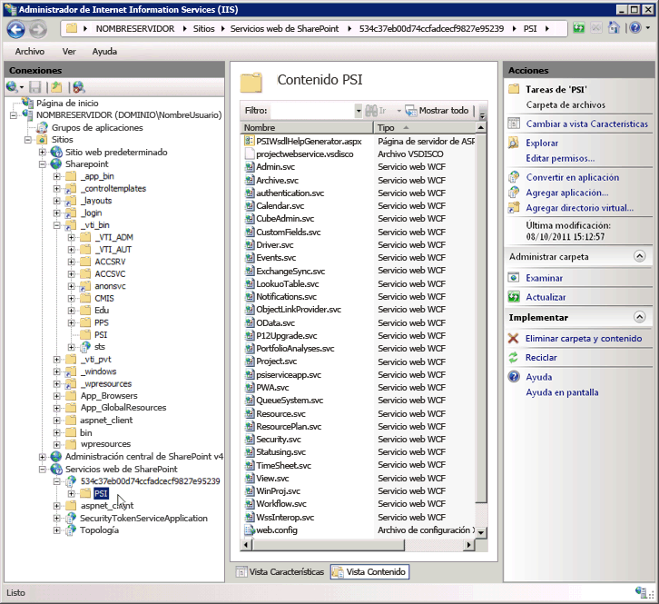

# <a name="project-psi-reference-overview"></a>Descripción general de la referencia de PSI de Project

La interfaz Project Server Interface (PSI) es la API que hay que usar para desarrollar aplicaciones que se integran con Project Server 2013 localmente.
  
Este artículo es una descripción general de los ensamblados documentados, espacios de nombres y servicios de la PSI. La [Referencia sobre bibliotecas de clases y servicios web de Project Server 2013](https://msdn.microsoft.com/library/ef1830e0-3c9a-4f98-aa0a-5556c298e7d1%28Office.15%29.aspx) en el SDK contiene toda la documentación del código administrado de la PSI y el espacio de nombres [Microsoft.ProjectServer.Client](https://msdn.microsoft.com/library/Microsoft.ProjectServer.Client.aspx) en Project Server 2013. Para desarrollar aplicaciones para Project Online, debe usar el espacio de nombres **Microsoft.ProjectServer.Client** en lugar de la PSI. 

El PSI de Project Server 2013 tiene una interfaz dual. La interfaz de ASMX para servicios web se define mediante detección y archivos de Web Service Description Language  (disco y WSDL) en el directorio virtual `https://ServerName/ProjectServerName/_vti_bin/psi/` (por ejemplo, Projectdisco.aspx y Projectwsdl.aspx). Puede obtener acceso a la interfaz ASMX solo a través de la dirección URL de una instalación local de Project Web App (por ejemplo, `https://ServerName/ProjectServerName/_vti_bin/psi/project.asmx?wsdl)`. Para mostrar el servicio web en un explorador, debe incluir la opción de URL `?wsdl`. Como la interfaz de ASMX se crea usando la infraestructura de Windows Communication Foundation (WCF), los archivos .asmx de los servicios web de Project Server no existen realmente en el directorio virtual de la PSI. 
  
La interfaz de servicios WCF se define mediante archivos .svc en el directorio virtual `https://ServerName:32843/GUID/PSI/` de back-end en la aplicación de servicios web de SharePoint. La URL de los servicios de la PSI en el directorio virtual de la aplicación de servicio de Project (por ejemplo, `https://ServerName:32843/GUID/PSI/project.svc`) incluye los archivos .svc. Pero no puede usar directamente la URL de back-end para establecer una referencia de servicio WCF. Para desarrollar una aplicación o un componente que use los servicios WCF de la PSI, puede usar un ensamblado de proxy o un archivo de proxy. La descarga de SDK de Project 2013 incluye los archivos de proxy para los servicios WCF en Project Server 2013 y los scripts para obtener archivos de proxy WCF actualizados y compilar los archivos en un ensamblado de proxy para compilaciones más recientes de Project Server.
  
El nombre del directorio de la aplicación de servicio de proyecto es un valor GUID, que es el mismo que el GUID de la instancia local de Project Web App. En la ventana **Administrador de Internet Information Services (IIS)**, expanda el nodo **SharePoint Web Services**, elija el nombre de directorio de GUID y, a continuación, seleccione **Configuración avanzada** para copiar el valor de **Ruta de acceso virtual**. 
  
> [!IMPORTANT]
> La interfaz de servicios web ASMX de la PSI está en desuso en Project Server 2013, pero aún es compatible. Las nuevas aplicaciones deben usar la interfaz de WCF de la PSI o el CSOM. Para obtener más información sobre las características en desuso, consulte [Actualizaciones para desarrolladores de Project 2013](updates-for-developers-in-project-2013.md)
> 
> Las nuevas aplicaciones y los componentes de middleware que se ejecutan solo en una instalación local de Project Server deben usar la interfaz de WCF, que es la tecnología recomendada para las comunicaciones de red. Las aplicaciones heredadas que usan la interfaz ASMX deben usar la dirección URL a través de Project Web App, que comprueba los permisos de Project Server. 
> 
> Para obtener más información sobre la interfaz de ASMX y cómo usar la interfaz de WCF, consulte [Requisitos previos para obtener ejemplos de código basados en ASMX en Project](prerequisites-for-asmx-based-code-samples-in-project.md) y [Requisitos previos para obtener ejemplos de código basados en WCF en Project](prerequisites-for-wcf-based-code-samples-in-project.md). 
  
Para desarrollar aplicaciones que usan la interfaz de WCF, puede usar Visual Studio 2010 o Visual Studio 2012. Para crear flujos de trabajo declarativos de Project Server, puede usar SharePoint Designer 2013. Los flujos de trabajo de Project Server que requieren acceso al PSI o el CSOM se pueden desarrollar con Visual Studio 2012.
  
### <a name="using-the-psi-reference"></a>Uso de la referencia de la PSI
<a name="pj15_PSIRefOverview_Using"> </a>

El modelo de objetos de la PSI es grande y muchas clases y miembros son solo para uso interno. Como resultado, puede resultar confuso buscar los temas que desea en la [Referencia sobre bibliotecas de clases y servicios web de Project Server 2013](https://msdn.microsoft.com/library/ef1830e0-3c9a-4f98-aa0a-5556c298e7d1%28Office.15%29.aspx). La mayoría de los temas de la referencia que usará para el desarrollo está en los siguientes grupos:
  
- **Métodos de la clase principal:** cada servicio de la PSI incluye una clase principal que recibe un nombre según el nombre del servicio. Por ejemplo, el servicio **Recurso** contiene la clase [Resource](https://msdn.microsoft.com/library/WebSvcResource.Resource.aspx), que se encuentra en el espacio de nombres [WebSvcResource](https://msdn.microsoft.com/library/WebSvcResource.aspx). Para ver una lista de los métodos que están disponibles en la clase **Resource**, expanda el nodo de clase en el panel de contenido y, a continuación, elija el tema **Métodos de recursos**. 
    
- **Propiedades de DataRow:** muchos de los métodos de clase principal usan o devuelven una clase **DataSet**. Cada objeto **DataTable** en una clase **DataSet** contiene los datos de uno o varios objetos **DataRow**. En la mayoría de los casos, debe ver únicamente las propiedades de fila y no los demás miembros de las clases **DataSet**, **DataTable** o **DataRow**. Por ejemplo, la clase **ResourceAssignmentDataSet** incluye subclases de la clase **ResourceAssignmentDataTable** y [ResourceAssignmentDataSet.ResourceAssignmentRow](https://msdn.microsoft.com/library/WebSvcResource.ResourceAssignmentDataSet.ResourceAssignmentRow.aspx). Para ver una lista de propiedades que se encuentran en la clase **ResourceAssignmentRow**, expanda el nodo de clase en el panel de contenido y, a continuación, elija el tema **Propiedades de ResourceAssignmentDataSet.ResourceAssignmentRow**. 
    
Además de los espacios de nombres del servicio, el tema de la [Referencia sobre bibliotecas de clases y servicios web de Project Server 2013](https://msdn.microsoft.com/library/ef1830e0-3c9a-4f98-aa0a-5556c298e7d1%28Office.15%29.aspx) se vincula a los tres ensamblados de Project Server que se usan en el desarrollo de soluciones de terceros para instalaciones locales. Proporcionamos solo documentación mínima sobre estos ensamblados. La referencia de la PSI documenta las clases principales y los miembros en los 23 servicios públicos. Seis servicios de la PSI son solo para uso interno y no se documentan. 
  
> [!NOTE]
> Las clases en el modelo de objetos de cliente (CSOM) pueden usarse con independencia de los demás servicios y ensamblados de Project Server. Puede usar el espacio de nombres **Microsoft.ProjectServer.Client** en un entorno de desarrollo remoto en el equipo de Project Server y desarrollar aplicaciones que se integren con Project Online o con una instalación local de Project Server. Sin embargo, el CSOM contiene un subconjunto de las funciones de la PSI completa. El CSOM permite el desarrollo de los escenarios más comunes para la integración de Project Server. Para obtener más información, vea [Qué hace y qué no hace el CSOM](what-the-csom-does-and-does-not-do.md) y [Microsoft.ProjectServer.Client](https://msdn.microsoft.com/library/Microsoft.ProjectServer.Client.aspx) . 
  
Para el desarrollo de la mayoría de las aplicaciones que utilizan la PSI, no es necesario desarrollar en un equipo de Project Server o establecer referencias a los ensamblados de Project Server en la caché global del ensamblado. Puede copiar los ensamblados necesarios de Project Server en el equipo de desarrollo. Project Server 2013 instala los siguientes ensamblados en _[Archivos de programa]_ `\Microsoft Office Servers\15.0\Bin`: 
  
- Microsoft.Office.Project.Server.Events.Receivers.dll 
- Microsoft.Office.Project.Server.Library.dll
- Microsoft.Office.Project.Server.Workflow.dll
    
Los espacios de nombres de los servicios de la PSI tienen nombres arbitrarios creados para un ensamblado de proxy de la PSI, ProjectServerServices.dll, que se genera con fines de documentación. En la referencia de la PSI, el espacio de nombres de cada servicio tiene un nombre de marcador de posición (por ejemplo, _[servicio web de Project]_) y una referencia web (como `https://ServerName/ProjectServerName/_vti_bin/psi/Project.asmx?wsdl`). 
  
## <a name="project-server-assemblies-and-namespaces"></a>Espacios de nombres y ensamblados de Project Server
<a name="pj15_PSIRefOverview_Assemblies"> </a>

Durante la instalación de Project Server se instalan muchos ensamblados. Solo se documentan cuatro de los ensamblados de Project Server. Los terceros desarrolladores suelen usar solo algunas clases y miembros en dichos ensamblados. Los ensamblados de Project Server sin documentar incluyen espacios de nombres y clases que Project Server usa internamente, como clases de Project Web App, las entidades empresariales y la capa de acceso a datos (DAL). Al establecer una referencia en Visual Studio a uno de los ensamblados documentados de Project Server, puede ver todos los espacios de nombres, clases y miembros en el Examinador de objetos de Visual Studio.
  
> [!NOTE]
> Muchos de los miembros de los espacios de nombres documentados de Project Server se usan solo internamente y tienen documentación mínima. 
  
Al desarrollar para Project Online, puede usar solo el CSOM para obtener acceso a la funcionalidad de Project Server. No tiene acceso a los servicios de la PSI o los demás ensamblados de Project Server.
  
La [Referencia sobre bibliotecas de clases y servicios web de Project 2013](https://msdn.microsoft.com/library/ef1830e0-3c9a-4f98-aa0a-5556c298e7d1%28Office.15%29.aspx) para la PSI incluye espacios de nombres de los ensamblados siguientes: 
  
- **Microsoft.Office.Project.Server.Library.dll** Este ensamblado contiene un espacio de nombres documentado y tres sin documentar, como sigue: 
    
  - El espacio de nombres [Microsoft.Office.Project.Server.Library](https://msdn.microsoft.com/library/Microsoft.Office.Project.Server.Library.aspx) incluye muchas enumeraciones, campos de clase y propiedades que se usan con frecuencia en las aplicaciones locales para Project Server. Por ejemplo, los desarrolladores suelen utilizar enumeraciones como **CustomField.Type** y las clases **PSClientError**, **PSErrorInfo** y **Filter**. 
    
    El espacio de nombres **Microsoft.Office.Project.Server.Library** también incluye las siguientes siete clases de propiedades, que incluyen más de 3.200 subclases: 
    
      - **AssignmentProperties**  
      - **CalendarProperties**
      - **ConstraintProperties**
      - **LookupTableProperties**
      - **ProjectProperties**
      - **ResourceProperties**
      - **TaskProperties**
    
    Las clases de propiedades se usan internamente y no se documentan. Las clases de propiedades se usan para la serialización entre Project Profesional 2013 y Project Server. Al trabajar con el espacio de nombres **Microsoft.Office.Project.Server.Library** en Visual Studio, el Examinador de objetos muestra todas las clases de propiedades, lo que dificulta aún más la búsqueda de clases que son útiles para el desarrollo de terceros. Dado que los terceros desarrolladores no tienen que usar las clases de propiedades, el SDK no las documenta. 
    
  - **Microsoft.Office.Project.Server.DataServices** Las clases y miembros de este espacio de nombres se usan internamente por parte del servicio **OData** en Project Online para el acceso a las tablas de informes en la base de datos de Project. Las clases **DataServices** no se documentan. 
    
  - **Microsoft.Office.Project.Server.Administration** La clase y los miembros de este espacio de nombres se usan internamente para registro de diagnóstico y no se documentan. 
    
  - **Microsoft.Office.Project.Server.Base** Las clases y los miembros de este espacio de nombres se usan internamente como clases base y no se documentan. 
    
  - **Microsoft.Office.Project.Server.Library.FilterSchema** Este espacio de nombres se usa internamente para generar esquemas de filtro y no se documenta. 
    
- **Microsoft.Office.Project.Server.Workflow.dll** Este ensamblado se usa para flujos de trabajo heredados de Project Server 2010 que aún funcionan en Project Server 2013. Para crear nuevos flujos de trabajo, debe usar SharePoint Designer 2013 o también puede usar Visual Studio 2012 con la clase [Microsoft.ProjectServer.Client.WorkflowActivities](https://msdn.microsoft.com/library/Microsoft.ProjectServer.Client.WorkflowActivities.aspx). El ensamblado Microsoft.Office.Project.Server.Workflow.dll incluye los siguientes tres espacios de nombres: 
    
  - [Microsoft.Office.Project.Server.Workflow](https://msdn.microsoft.com/library/Microsoft.Office.Project.Server.Workflow.aspx) Este espacio de nombres incluye las clases que se usan para las actividades de flujo de trabajo de Project Server. Las actividades incluyen la lectura, la comparación y la actualización de propiedades del proyecto. Otras clases administran flujos de trabajo e incluyen devoluciones de llamadas de flujo de trabajo cuando los proyectos cambian. 
    
  - **Microsoft.Office.Project.PWA** Este espacio de nombres incluye un proxy interno para la interfaz PSI, para su uso con Project Web App y con actividades de flujo de trabajo personalizadas; no se documenta. 
    
    Una actividad de flujo de trabajo personalizado requiere una referencia a **Microsoft.Office.Project.PWA** para obtener acceso a todas las clases en los servicios de la PSI. Por ejemplo, la clase **Microsoft.Office.Project.PWA.PSI** incluye la propiedad **ProjectWebService**, que obtiene un proxy para el espacio de nombres [WebSvcProject](https://msdn.microsoft.com/library/WebSvcProject.aspx). 
    
  - **Microsoft.Office.Project.Server.WebServiceProxy**. Este espacio de nombres incluye las clases internas de proxy para la clase principal en cada servicio de la PSI. Al usar los permisos elevados del usuario del flujo de trabajo, el flujo de trabajo puede llamar a los métodos de la PSI a través de las clases de proxy. Las clases de proxy no se documentan. 
    
- **Microsoft.Office.Project.Server.Events.Receivers.dll**[Microsoft.Office.Project.Server.Events](https://msdn.microsoft.com/library/Microsoft.Office.Project.Server.Events.aspx) es el único espacio de nombres en este ensamblado. Esto incluye el receptor de eventos y las clases de argumento de eventos para los servicios de la PSI y otras clases internas. 
    
  Los programadores escriben gestores de eventos derivados de las clases receptoras de eventos. La mayor parte de las clases primarias de los servicios de la PSI tienen una clase receptora de eventos correspondiente. Por ejemplo, la clase **ProjectEventReceiver** contiene métodos receptores anteriores y posteriores al evento que se corresponden con métodos de la clase **Project** en la PSI. El método **OnCreating** y el método **OnCreated** son los métodos receptores anteriores y posteriores al evento para el método **QueueCreateProject**. 
    
  Normalmente, los desarrolladores usan las siguientes clases de receptor de eventos:
  <br/>  
  - [AdminEventReceiver](https://msdn.microsoft.com/library/Microsoft.Office.Project.Server.Events.AdminEventReceiver.aspx)
  - [CalendarEventReceiver](https://msdn.microsoft.com/library/Microsoft.Office.Project.Server.Events.CalendarEventReceiver.aspx)
  - [CubeAdminEventReceiver](https://msdn.microsoft.com/library/Microsoft.Office.Project.Server.Events.CubeAdminEventReceiver.aspx)
  - [CustomFieldsEventReceiver](https://msdn.microsoft.com/library/Microsoft.Office.Project.Server.Events.CustomFieldsEventReceiver.aspx)
  - [LookupTableEventReceiver](https://msdn.microsoft.com/library/Microsoft.Office.Project.Server.Events.LookupTableEventReceiver.aspx)
  - [ProjectEventReceiver](https://msdn.microsoft.com/library/Microsoft.Office.Project.Server.Events.ProjectEventReceiver.aspx)
  - [OptimizerEventReceiver](https://msdn.microsoft.com/library/Microsoft.Office.Project.Server.Events.OptimizerEventReceiver.aspx)
  - [ReportingEventReceiver](https://msdn.microsoft.com/library/Microsoft.Office.Project.Server.Events.ReportingEventReceiver.aspx)
  - [ResourceEventReceiver](https://msdn.microsoft.com/library/Microsoft.Office.Project.Server.Events.ResourceEventReceiver.aspx)
  - [SecurityEventReceiver](https://msdn.microsoft.com/library/Microsoft.Office.Project.Server.Events.SecurityEventReceiver.aspx)
  - [StatusingEventReceiver](https://msdn.microsoft.com/library/Microsoft.Office.Project.Server.Events.StatusingEventReceiver.aspx)
  - [TimesheetEventReceiver](https://msdn.microsoft.com/library/Microsoft.Office.Project.Server.Events.TimesheetEventReceiver.aspx)
  - [UserDelegationEventReceiver](https://msdn.microsoft.com/library/Microsoft.Office.Project.Server.Events.UserDelegationEventReceiver.aspx)
  - [WorkflowEventReceiver](https://msdn.microsoft.com/library/Microsoft.Office.Project.Server.Events.WorkflowEventReceiver.aspx)
  - [WssInteropEventReceiver](https://msdn.microsoft.com/library/Microsoft.Office.Project.Server.Events.WssInteropEventReceiver.aspx)
    
  Las clases **RulesEventReceiver** y **StatusReportsEventReceiver** se usan internamente en Project Web App. 
    
- **Microsoft.ProjectServer.Client.dll** Este ensamblado contiene el CSOM para el desarrollo con .NET Framework 4. El ensamblado se encuentra en `%ProgramFiles%\Common Files\Microsoft Shared\Web Server Extensions\15\ISAPI\Microsoft.ProjectServer.Client.dll`. El desarrollo de aplicaciones con el espacio de nombres **Microsoft.ProjectServer.Client** es independiente de las API y los servicios locales de Project Server, aunque las aplicaciones pueden funcionar con una instalación local o en línea de Project Server. Para los ensamblados de CSOM relacionados que se pueden usar para Windows Phone 8, Microsoft Silverlight o JavaScript con aplicaciones web, consulte [Microsoft.ProjectServer.Client](https://msdn.microsoft.com/library/Microsoft.ProjectServer.Client.aspx) . 
    
- **Microsoft.Office.Project.Server.Schema.dll** El SDK de Project 2013 no documenta el espacio de nombres **Microsoft.Office.Project.Server.Schema**, que se encuentra en el ensamblado `[Windows]\Microsoft.NET\assembly\GAC_MSIL\Microsoft.Office.Project.Schema\v4.0_15.0.0.0__71e9bce111e9429c\Microsoft.Office.Project.Schema.dll`. El espacio de nombres contiene las definiciones de todos las clases **DataSet**, **DataTable** y **DataRow** utilizadas en la PSI, además de muchas otras clases similares que Project Server usa de forma interna. Las clases públicas en cada servicio de la PSI están documentadas en la referencia de servicio específico. Por ejemplo, la clase **DriverDataSet.DriverRow** se documenta en el espacio de nombres [WebSvcDriver](https://msdn.microsoft.com/library/WebSvcDriver.aspx). 
    
  > [!NOTE]
  > Las aplicaciones que usan el CSOM, usan controladores de eventos remotos u obtienen acceso a Project Online no usan el espacio de nombres **Microsoft.Office.Project.Server.Schema**. 
  
  En algunas aplicaciones que usan gestores de eventos de plena confianza, en las que los gestores de eventos se instalan en el equipo con Project Server, es necesario definir una referencia al ensamblado Microsoft.Office.Project.Schema.dll. A continuación se muestran dos ejemplos:
    
  - En un gestor de eventos posteriores **OnCreated** de confianza plena para campos personalizados, se puede usar el argumento del evento **e.CustomFieldInformation** con una referencia al espacio de nombres **Microsoft.Office.Project.Server.Schema** para las definiciones de **CustomFieldDataSet** y **CustomFieldsRow**. 
   
     ```cs
        using PSLibrary = Microsoft.Office.Project.Server.Library;
        using Microsoft.Office.Project.Server.Schema;
        . . .
        // Event handler for the OnCreated event of a custom field.
        public override void OnCreated(
            PSLibrary.PSContextInfo contextInfo, 
            CustomFieldsPostEventArgs e)
        {
            // Get information from the event arguments. 
            string userName = contextInfo.UserName.ToString();
            CustomFieldDataSet customFieldDs = e.CustomFieldInformation;
            CustomFieldsRow customFieldRow = customFieldDs.CustomFields.Rows[0];
            string customFieldName = customFieldRow["MD_PROP_NAME"].ToString();
            byte customFieldType = (byte)customFieldRow["MD_PROP_TYPE_ENUM"];
            Guid customFieldUid = (Guid)customFieldRow["MD_PROP_UID"];
            . . .
        }
     ```

  - Una actividad de flujo de trabajo puede requerir una referencia a **Microsoft.Office.Project.Server.Schema** para las definiciones de **DataSet**. 
    
## <a name="psi-services"></a>Servicios de la PSI
<a name="pj15_PSIRefOverview_PSI"> </a>

La PSI es un conjunto de servicios WCF y servicios web ASMX idénticos para Project Server 2013. Para usar un servicio en un proyecto de Visual Studio, establezca una referencia a la dirección URL del archivo `.svc` o el servicio `.asmx?wsdl` mediante un nombre arbitrario para el servicio de nombres. La utilidad wsdl.exe o svcutil.exe genera código fuente de proxy para dicho espacio de nombres. El compilador crea un ensamblado de servicios de proxy para incluir en la aplicación. 
  
> [!NOTE]
> La referencia de la PSI incluye los nombres de servicio de nombres del marcador de posición para los servicios de la PSI como _[servicio web de administración]_, _[servicio web de controlador]_, y _[servicio web de Project]_. Cada servicio de nombres de la PSI incluye una clase principal que contiene los métodos web para ese servicio. Por ejemplo, si establece una referencia al servicio de **administración** y la llama **WebSvcAdmin**, en la aplicación el servicio de nombres **WebSvcAdmin** incluye la clase principal ** Admin** con los métodos web **GetServerCurrency**, **ListInstalledLanguages**, **ReadServerVersion**, etc. Consulte [Actualizaciones para desarrolladores de Project 2013](updates-for-developers-in-project-2013.md) para obtener una lista de servicios de la PSI en desuso. 
  
De un total de 30 servicios de la PSI, **autenticación**, **ExchangeSync**, **OData**, **P12Upgrade**, **psiserviceapp**, **PWA**, **Vista** y **WinProj** son para uso interno de Project Web App y Project Profesional, por lo que no se documentan. Aunque puede crear archivos de proxy o un ensamblado de proxy que incluya los servicios internos de la PSI, los servicios internos no son para el uso de otros fabricantes. La referencia de la PSI no documenta dichos servicios. La siguiente ilustración muestra la ubicación de los servicios back-end de la PSI en el Administrador de Internet Information Services. 
  
**Búsqueda de los servicios de la PSI en IIS**


  
Estas son todas las clases que contienen métodos web en los servicios de la PSI:
  
1. [Admin](https://msdn.microsoft.com/library/WebSvcAdmin.Admin.aspx) Incluye métodos que se usan en las páginas de **administración de Project Server** en Project Web App. Define los ejercicios, administra la configuración de estado y moneda, los períodos de informes, el registro de auditoría y la configuración de Active Directory. 
    
2. [Archive](https://msdn.microsoft.com/library/WebSvcArchive.Archive.aspx) Incluye métodos para administrar copias de seguridad y restauración de proyectos, categorías de seguridad, campos personalizados, recursos, configuración del sistema, vistas y el proyecto global de la empresa. Lee y actualiza la programación del archivo. Archiva todos los proyectos o elimina proyectos archivados específicos. Guarda objetos de copia de seguridad en las tablas de la base de datos de archivo y restaura copias de seguridad de objetos en las tablas de la base de datos publicada. 
    
3. **authentication** Incluye métodos para uso interno exclusivo de Project Profesional y Project Web App. 
    
4. [Calendario](https://msdn.microsoft.com/library/WebSvcCalendar.Calendar.aspx) Administra las excepciones de calendario de empresa. Desprotege y protege los calendarios de recursos. Crea, elimina, muestra, actualiza o devuelve todas las excepciones del calendario. 
    
5. [CubeAdmin](https://msdn.microsoft.com/library/WebSvcCubeAdmin.CubeAdmin.aspx) Administra la configuración del cubo OLAP. Obtiene Analysis Server, el estado de la base de datos y la lista de cubos. Coloca una solicitud de servicio de generación de cubos en la cola. Lee y actualiza la configuración de campo y las definiciones de miembros calculados para las dimensiones y medidas en el cubo. 
    
6. [CustomFields](https://msdn.microsoft.com/library/WebSvcCustomFields.CustomFields.aspx) Administra los campos personalizados de empresa. Incluye los métodos de desprotección y protección, así como los métodos crear, leer, actualizar y eliminar (CRUD) para los campos personalizados de empresa. 
    
7. [Driver](https://msdn.microsoft.com/library/WebSvcDriver.Driver.aspx) Administra los controladores de análisis de cartera y la priorización de controladores para la creación de proyectos y Administración de propuestas. Incluye los métodos CRUD para controladores de proyectos. 
    
8. [Events](https://msdn.microsoft.com/library/WebSvcEvents.Events.aspx) Administra asociaciones de controladores de eventos de Project Server. Incluye los métodos CRUD para asociaciones de controladores de eventos de Project Server para un evento específico o para todas las asociaciones de controlador es de eventos. 
    
9. **ExchangeSync** Este es un servicio interno de Project Server que controla los eventos de Exchange Server. Project Web App usa **ExchangeSync** para sincronizar asignaciones entre Project Server y Exchange Server, en lugar de sincronizar directamente con el cliente de Outlook como en Office Project Server 2007. 
    
    El acceso al servicio **ExchangeSync** solo está disponible a través de la URL de **ProjectServiceApplication**. Las clases y miembros de **ExchangeSync** no se admiten para el desarrollo de terceros. 
    
10. [LoginForms](https://msdn.microsoft.com/library/WebSvcLoginForms.LoginForms.aspx) Proporciona los métodos **Login** y **Logoff** con autenticación basada en formularios. El acceso al servicio **LoginForms** está disponible solo en un sitio front-end de Project Web App. 
    
11. [LoginWindows](https://msdn.microsoft.com/library/WebSvcLoginWindows.LoginWindows.aspx) Proporciona los métodos **Login** y **Logoff** que se usan para la autenticación de Windows con aplicaciones basadas en ASMX para instalaciones de Project Server 2013 con varios tipos de autenticación (basada en notificaciones y en formularios). El acceso al servicio **LoginWindows** está disponible solo en un sitio front-end de Project Web App. 
    
    > [!CAUTION]
    > El servicio **LoginWindows** no se usa en aplicaciones basadas en WCF ni para aplicaciones que se ejecutan en instalaciones de Project Server que solo usan la autenticación de notificaciones o **OAuth**; en estos casos, el método **Login** siempre devuelve **false**. La autentificación de notificaciones gestiona la autenticación de Windows integrada. 
  
12. [LookupTable](https://msdn.microsoft.com/library/WebSvcLookupTable.LookupTable.aspx) Administra las tablas de búsqueda, las tablas de búsqueda multilingüe y sus máscaras de código correspondientes. Desprotege, protege, lee, crea, elimina y actualiza. 
    
13. [Notifications](https://msdn.microsoft.com/library/WebSvcNotifications.Notifications.aspx) Administra las alertas y los recordatorios. Incluye métodos que obtienen, establecen, registran y anulan el registro de los resultados de la alerta. 
    
14. [ObjectLinkProvider](https://msdn.microsoft.com/library/WebSvcObjectLinkProvider.ObjectLinkProvider.aspx) Administra los objetos web y vínculos de documentos, así como los elementos de lista en los sitios de SharePoint. Crea, elimina o lee objetos web del proyecto, vinculados a proyectos, tareas o vinculados a tareas. 
    
    > [!NOTE]
    > El servicio **ObjectLinkProvider** está en desuso en Project Server 2013. Para obtener más información, consulte la sección *Características en desuso* en [Actualizaciones para desarrolladores de Project 2013](updates-for-developers-in-project-2013.md). 
  
15. **OData** Proporciona la interfaz interna **OData** para las tablas y vistas de informes. El acceso al servicio **OData** solo está disponible a través de la URL de back-end **ProjectServiceApplication**. El servicio **OData** privado en la PSI proporciona un método, **ODataClient.ProcessOdataMessage**, que Project Server usa internamente para procesar solicitudes de datos de informes. Las solicitudes HTTP pasan por el servicio front-end **ProjectData**. 
    
    Para obtener información acerca del servicio **ProjectData** y el protocolo OData para leer datos de informes, consulte [ProjectData - Project OData service reference](https://msdn.microsoft.com/library/office/jj163015.aspx).
    
16. **P12Upgrade** Proporciona métodos internos para el instalador de Project Server 2013 con el objeto de actualizar una instalación de Office Project Server 2007. El acceso al servicio **P12Upgrade** solo está disponible a través de la URL de **ProjectServiceApplication**. Los métodos **P12Upgrade** no son compatibles con el desarrollo de terceros. 
    
17. [PortfolioAnalyses](https://msdn.microsoft.com/library/WebSvcPortfolioAnalyses.PortfolioAnalyses.aspx) Incluye los métodos CRUD para dependencias del proyecto, así como para soluciones de Optimizador, Planeador y Análisis. 
    
18. [Project](https://msdn.microsoft.com/library/WebSvcProject.Project.aspx) Administra proyectos. Desprotege, protege, crea, elimina, lee o actualiza proyectos en las tablas de borrador de la base de datos de Project o en las tablas publicadas. Pone en cola un mensaje para su publicación. 
    
    Crea o elimina entidades dentro de proyectos (tareas, recursos, asignaciones, etc.). Obtiene información acerca de o actualiza el equipo del proyecto o la dirección de sitio del proyecto. Obtiene el estado del proyecto, una lista de proyectos en las tablas de borrador, todas las tareas de resumen, las tareas que están disponibles para su asignación a un recurso especificado, o todos los proyectos en los que un recurso tiene asignaciones.
    
    Crea y administra compromisos, crea propuestas de proyectos y proyectos a partir de las listas de tareas de SharePoint, y encuentra relaciones entre proyectos y proyectos principales.
    
19. **psiserviceapp** Lo usa internamente Project Online. Las clases y miembros de **psiserviceapp** no se admiten para el desarrollo de terceros. 
    
20. **PWA** Contiene varios métodos que se optimizan para Project Web App, incluidos los métodos para las reglas de aprobación de actualización de tareas y la administración de informes de estado. Los métodos de **PWA** suelen estar especializados y ser algo redundantes en comparación con los métodos equivalentes en otros servicios de la PSI. Los métodos de **PWA** usan o devuelven muchos conjuntos de datos iguales que los demás métodos de la PSI. 
    
    El acceso al servicio **PWA** solo está disponible a través de la URL de **ProjectServiceApplication**. Las clases y miembros de **PWA** no se admiten para el desarrollo de terceros. 
    
21. [QueueSystem](https://msdn.microsoft.com/library/WebSvcQueueSystem.QueueSystem.aspx) Administra la cola de Project Server. Obtiene el número de trabajos, el tiempo de espera del trabajo y del grupo de trabajos, el estado de todos los trabajos, los trabajos especificados, los trabajos propiedad de la persona que llama o los trabajos de proyectos especificados. Administra la correlación de trabajos y configura la cola. 
    
22. [Resource](https://msdn.microsoft.com/library/WebSvcResource.Resource.aspx) Administra los recursos de la empresa. Desprotege, protege, actualiza o crear recursos o usuarios de Project Server y su configuración de autorización; buscar recursos por nombre o GUID; lee datos de recursos o usuarios y la estructura de desglose de recursos (RBS) e información sobre seguridad relacionada; obtiene todas las asignaciones para un recurso; y restablece las contraseñas de los usuarios. La clase **Resource** incluye métodos CRUD para delegaciones de usuarios. 
    
23. [ResourcePlan](https://msdn.microsoft.com/library/WebSvcResourcePlan.ResourcePlan.aspx) Administra planes de recursos. Desprotege, protege, publica e incluye los métodos CRUD para planes de recursos. 
    
24. [Security](https://msdn.microsoft.com/library/WebSvcSecurity.Security.aspx) Incluye los métodos CRUD para plantillas de seguridad, categorías de seguridad, permisos de la organización y globales y permisos de grupo. La clase **Security** incluye métodos para categorías de proyectos. 
    
25. [Statusing](https://msdn.microsoft.com/library/WebSvcStatusing.Statusing.aspx) Administra asignaciones y actualizaciones de estado. Aplica actualizaciones o aprobaciones de estado, envía actualizaciones de estado, configura información de resumen para actualizaciones enviadas, elimina actualizaciones de estado aprobadas o el historial de aprobación para un usuario especificado o elimina toda la información de estado para un conjunto de proyectos. Crea, obtiene o delega asignaciones; configura la duración del trabajo de asignación. Obtiene nuevas asignaciones para el usuario actual; obtiene el historial de asignaciones o transacciones de tareas, los datos reales con fases temporales o la jerarquía de tareas de resumen. 
    
    Previsualiza o importa datos de partes de horas o lee el programa de trabajo y no trabajo de un usuario. Busca actualizaciones de estado pendientes, información de actualizaciones enviadas o un registro de transacciones de los cambios en una actualización enviada. Lee el estado del equipo.
    
26. [TimeSheet](https://msdn.microsoft.com/library/WebSvcTimeSheet.TimeSheet.aspx) Administra partes de horas. Incluye los métodos CRUD para partes de horas y envía o recupera partes de horas. Busca partes de horas retrasados o de aprobación pendiente; busca partes de horas por fecha o período. Obtiene la lista de aprobadores de partes de horas. Carga previamente datos reales del parte de horas y valida una línea de parte de horas. La clase **TimeSheet** incluye el método **ReadProjectTimesheetLines** y el método **SubmitTimesheetLines** para leer y enviar partes de horas para otro recurso sin necesidad de suplantación. 
    
27. **View** El servicio **View** está diseñado para uso exclusivo en Project Web App. Los métodos en la clase **View** administran vistas e informes de vistas, y leen campos en vistas. 
    
    El acceso al servicio **View** solo está disponible a través de la URL de **ProjectServiceApplication**. Los métodos **View** no son compatibles con el desarrollo de terceros. 
    
28. **WinProj** El servicio **WinProj** está diseñado para uso exclusivo de Project Profesional. Los terceros desarrolladores no deben usar métodos **WinProj** para programar con Project Server. 
    
    Algunos métodos de **WinProj** usan conjuntos de datos tales como **ProjectRelationsDataSet** y **ResourceDataSet** que también usan los servicios **Project** y **Resource**, pero que requieren propiedades y funciones específicas en Project Profesional. 
    
    El acceso al servicio **WinProj** solo está disponible a través de la URL de **ProjectServiceApplication**. Los métodos **WinProj** no son compatibles con el desarrollo de terceros. 
    
29. [Workflow](https://msdn.microsoft.com/library/WebSvcWorkflow.Workflow.aspx) Incluye los métodos CRUD para los tipos de proyectos empresariales y para administrar fases y etapas de flujos de trabajo. Ejecuta flujos de trabajo, establece información de estado y administra etapas de la página de detalles del proyecto (PDP) en flujos de trabajo de administración de propuestas. Para desarrollar flujos de trabajo de Project Server, los desarrolladores pueden usar SharePoint Designer 2013 para flujos de trabajo declarativos o usar Office Developer Tools para Visual Studio 2012 para el desarrollo con .NET Framework 4 y la clase [ Microsoft.ProjectServer.Client.WorkflowActivities](https://msdn.microsoft.com/library/Microsoft.ProjectServer.Client.WorkflowActivities.aspx) en el CSOM. 
    
30. [WssInterop](https://msdn.microsoft.com/library/WebSvcWssInterop.WssInterop.aspx) Administra los sitios del proyecto. Crea y elimina sitios del proyecto. Obtiene información y actualiza los sitios de administración y la configuración de SharePoint. Sincroniza y actualiza los grupos y la pertenencia al sitio del proyecto. 
    
El espacio de nombres de cada servicio incluye todas las clases del controlador de eventos y el esquema **DataSet** que usa el servicio. Por ejemplo, `Calendar.svc` (o `Calendar.asmx?wsdl` para el servicio web ASMX) describe el servicio **Calendar**. Si nombra la referencia **WebSvcCalendar**, el espacio de nombres de proxy contiene la clase principal **Calendar** con los métodos **CheckInCalendars**, ** CheckOutCalendars**, etc. El espacio de nombres de proxy **WebSvcCalendar** también incluye la clase **CalendarDataSet** y todas sus subclases. 
  
Algunos de los servicios PSI contienen clases **DataSet** duplicadas. Por ejemplo, tanto el servicio **Proyect** como el servicio **Statusing** incluyen la clase **ProjectDataSet**. Esto se debe a que los métodos de los servicios **Project** y **Statusing** incluyen referencias a **ProjectDataSet**, y los ensamblados de proxy que crea al configurar referencias y compilar una aplicación incluyen los conjuntos de datos relacionados. Los servicios **Project** y **Statusing** pueden solicitar valores para diferentes campos en la clase **ProjectDataSet.ProjectRow**. 
  
Si navega por los espacios de nombres y clases de la referencia de la PSI, por ejemplo, para ver los métodos web para el servicio **Project**, expanda el espacio de nombres **[Servicio web de proyecto]** en la lista **Contenido** y, a continuación, expanda la clase **Project**. 
  
## <a name="see-also"></a>Vea también

- [Arquitectura de Project Server 2013](project-server-2013-architecture.md)
- [Programación de Project Server](project-server-programmability.md)   
- [Qué hace y qué no hace PSI](what-the-psi-does-and-does-not-do.md)   
- [Requisitos previos para los ejemplos de código basados en ASMX en Project](prerequisites-for-asmx-based-code-samples-in-project.md)   
- [Requisitos previos de muestras de código basadas en WCF en Project](prerequisites-for-wcf-based-code-samples-in-project.md)   
- [Centro para desarrolladores de .NET Framework](https://msdn.microsoft.com/netframework/aa496123.aspx)
    

