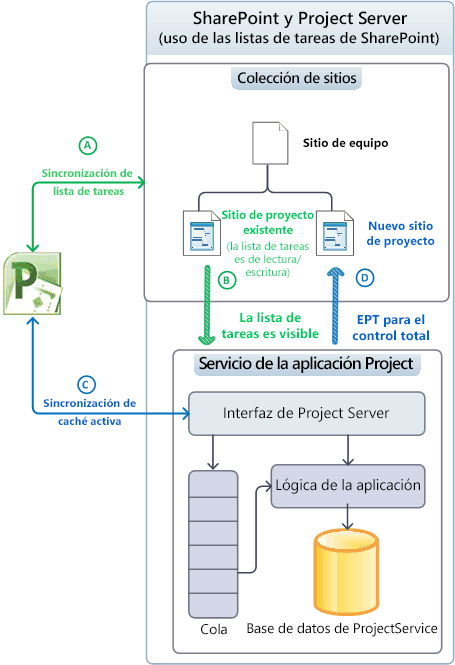
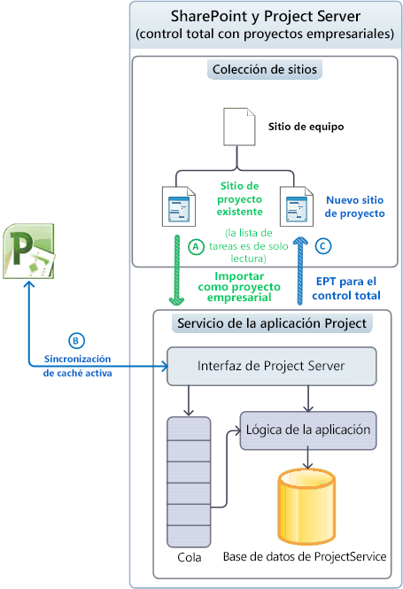
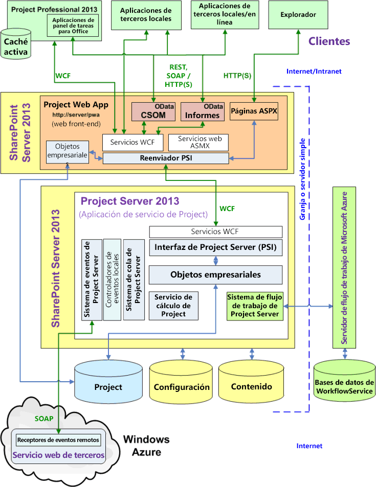
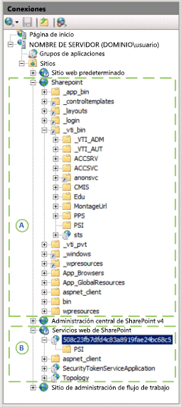

# Arquitectura de Project Server

Project Server 2013 integra la característica de administración de proyectos en una granja de SharePoint y permite el uso de Project Online con un modelo de objetos de cliente (CSOM) y una interfaz OData para los datos de informes.
   
Project Server 2013 es un sistema de varios niveles que amplía la arquitectura de Office Project Server 2007. Los cambios de arquitectura incluyen la asociación del Servicio de aplicaciones de Project con las recopilaciones de sitios de SharePoint, además de algunos objetos de negocios en la web front-end (WFE), el modelo de objeto del cliente (CSOM) para el acceso remoto, una base de datos de Project única, una interfaz OData para las tablas y vistas de informes, la integración de la versión 4 (WF4) de Windows Workflow Foundation a través del cliente 1.0 del Administrador de flujos de trabajo en la nube o en un servidor local, así como receptores de eventos remotos accesibles mediante múltiples instalaciones de Project Server. Además de soluciones personalizadas locales, puede crear aplicaciones que incluyen receptores de eventos remotos y componentes que tienen acceso a las interfaces CSOM y OData.
  
El nivel de front-end incluye Project Profesional 2013, Project Web App y aplicaciones de terceros. Las aplicaciones cliente se comunican con el nivel intermedio con Project Server Interface (PSI) o mediante los puntos de conexión de CSOM que, a su vez, se comunican con la PSI y con la capa de objetos empresariales. El acceso a la base de datos está integrado en los objetos empresariales. El sistema de eventos de Project Server puede tener acceso a los controladores de eventos locales y a los receptores de eventos remotos. El Servicio de cálculo de Project implementa el motor de programación de Project Profesional en Project Server. Las aplicaciones cliente no tienen acceso directo (en principio) a la base de datos de Project; Project Server oculta los objetos empresariales de los clientes.
  
> [!NOTE]
> Project Server se basa en la arquitectura de SharePoint. Para obtener más información sobre la arquitectura de SharePoint Server 2013 y el modelo de aplicaciones de SharePoint, vea la sección *Introducción al desarrollo con SharePoint* en la documentación para el desarrollador de Office 2013. 

## Integración con las colecciones de sitios de SharePoint

El servicio de la aplicación Project en Project Server 2013 puede estar asociado a una colección de sitios de SharePoint para usarse con listas de tareas de SharePoint. Este servicio también puede importar una lista de tareas de SharePoint como un proyecto empresarial para un control completo de Project Server. Con una lista de tareas de SharePoint, SharePoint mantiene el sitio del proyecto en una colección de sitios; Project Profesional puede sincronizarse con la lista de tareas y actualizarla. Un sitio de proyecto puede ser una lista de tareas de SharePoint independiente o una lista de tareas que se sincroniza con un archivo .mpp; este archivo puede almacenarse localmente o en una biblioteca de SharePoint. 
  
Project Server conserva los proyectos cuando tiene un control total; Project Profesional guarda los datos directamente en Project Server. En la tabla 1 se compara el comportamiento de una lista de tareas, el elemento web de la programación y otras funcionalidades para el control de listas de tareas por parte de SharePoint y para los proyectos importados cuando Project Server tiene control total. El elemento web de programación contiene la cuadrícula de la página de Project Web App donde podrá modificar la programación de los proyectos. En el modo vinculado, los datos de estado se introducen una vez para las tareas y para los partes de horas; en el modo de entrada única, los datos de estado para las tareas se introducen por separado desde partes de horas.
  
**Tabla 1. Comparación de las listas de tareas de SharePoint y con control total**

| Característica | Lista de tareas | Control total |
|:-----|:-----|:-----|
|**Lista de tareas de SharePoint**   |Lectura/escritura    |Solo lectura    |
|**Elemento web de programación**   |Solo lectura    |Lectura/escritura    |
|**Informes**   |Características de informe enriquecidas gracias a Project Server    |Características de informe enriquecidas gracias a Project Server    |
|**Otras funcionalidades de Project Server**   | Funcionalidades bloqueadas:   - Modificaciones de proyecto de servidor, con Project Web App o aplicaciones cliente personalizadas   - Estados   - Las tareas no son visibles en el modo vinculado    |Todas las funcionalidades habilitadas    |
   
### Administración de proyectos como listas de tareas de SharePoint

Cuando Project Server está asociado a una colección de sitios de SharePoint en la que SharePoint mantiene el control, el servicio de la aplicación Project puede ver las listas de tareas y los archivos de Project Profesional 2013 (.mpp) en bibliotecas de documentos, pero SharePoint conserva los datos maestros para la sincronización (vea la ilustración 1). No se puede llevar a cabo la programación de servidor con el elemento web de programación. Puede usar Project Profesional para realizar la sincronización con la lista de tareas y editarla en un sitio de proyecto. Si empieza con listas de tareas de SharePoint, las organizaciones pueden evolucionar poco a poco para usar la funcionalidad completa de Project Server.
  
En la figura 1 se muestran los siguientes procesos cuando los proyectos se conservan en listas de tareas de SharePoint: 
  
- (A) Project Professional puede sincronizarse con las listas de tareas y crear nuevos sitios de proyectos en una recopilación de sitios ya sea antes o después de la asociación con Project Application Service.
    
- (B) Project Server se sincroniza con los datos del sitio del proyecto a fin de informar, pero SharePoint mantiene los datos maestros y las listas de tareas siguen en lectura/escritura.
    
- (C) Después de la asociación, Project Professional puede crear nuevos proyectos y guardar o publicar en Project Server. La caché activa en Project Professional mantiene la sincronización de datos con Project Server.
    
- (D) Cuando se publica un proyecto nuevo en Project Profesional, el usuario tiene la opción de crear un sitio para el proyecto. También puede crear un proyecto en Project Web App como un tipo de proyecto de la lista de tareas de SharePoint o como un tipo de proyecto empresarial con control total. En el paso (D) se muestra el tipo de proyecto empresarial con control total.
    
**Figura 1. Uso de sitios de proyecto como listas de tareas de SharePoint**

 

### Administrar proyectos con control total

Cuando Project Server se asocia con una colección de sitios y tiene control total, importa listas de tareas de SharePoint como proyectos empresariales y puede eliminar cualquier archivo .mpp relacionado. Project Server conserva los datos maestros para la sincronización de listas de tareas; las listas de tareas de la colección de sitios pasan a ser de solo lectura (vea la ilustración 2). Los proyectos importados se pueden editar con Project Profesional o con Project Web App.
  
> [!NOTE]
> Una vez que Project Server importa un proyecto, el usuario escoge si borrar el proyecto desde el sitio o romper la conexión antes de editar el proyecto. La selección puede realizarse en Project Professional. 
  
La Figura 2 muestra los siguientes procesos cuando Project Server mantiene los proyectos empresariales con control total:
  
- (A) El usuario puede escoger qué sitios de proyecto importa. Project Server importa los sitios de proyecto y de manera opcional elimina los archivos .mpp asociados. La lista de tareas de SharePoint de un proyecto importado se convierte en solo lectura.
    
- (B) Después de realizar la asociación, Project Profesional crea proyectos nuevos y los guarda o publica en Project Server. La memoria caché activa en Project Profesional conserva la sincronización de datos con Project Server. El elemento web de programación de Project Web App puede realizar la programación del servidor.
    
- (C) Cuando se publica un proyecto nuevo en Project Profesional, el usuario tiene la opción de crear un sitio para el proyecto. En Project Web App también se pueden crear proyectos con un tipo de proyecto empresarial de control total y publicarse con una lista de tareas de solo lectura en un sitio de proyectos de la colección de sitios.
    
**Figura 2. Uso de sitios de proyecto con control total**

  
## Arquitectura general

En la figura 3 se muestra una vista generalizada de la arquitectura de Project Server 2013, incluido la aplicación de servicio de Project, una instancia de Project Web App en un WFE y otras varias aplicaciones de cliente que incluyen Project Profesional 2013.
  
Puede haber varias instancias de Project Web App que se comuniquen con la aplicación de servicio de back-end de Project. Si se quiere una instalación local, el WFE puede colocarse en un servidor distinto de la granja de SharePoint o en el mismo servidor de SharePoint con la aplicación de servicio de Project. Project Online incluye un WFE, la aplicación de servicio de Project y un servidor de flujo de trabajo local o remoto para Manager Client 1.0. 
  
**Ilustración 3. Arquitectura general de Project Server 2013**

 

Los siguientes comentarios generales se refieren a la ilustración 3:
  
- **Project Online:** puede crear aplicaciones que usen las interfaces CSOM, REST y OData. Un paquete de aplicación también puede instalar receptores de eventos remotos en un servicio web personalizado en un servidor de Azure o en Microsoft Azure. Project Online no admite soluciones de terceros locales, la interfaz WCF, la interfaz ASMX ni controladores de eventos locales. 
    
- **Receptores de eventos:** los receptores de eventos también se denominan controladores de eventos. Project Online es compatible con el registro de receptores de eventos de Project Server remotos, que puede ser utilizado por una instancia de Project Web App en la nube o por una instalación local de Project Server. Una instalación local de Project Server admite receptores de eventos remotos y controladores de eventos locales de plena confianza. 
    
- **Exploradores:** no existen limitaciones entre exploradores para la visualización de algunas páginas de Project Web App, a diferencia de lo que sucede en Project Server 2010. Los siguientes exploradores son totalmente compatibles con Project Web App: 
    
  - Internet Explorer 8.x (en Windows7 y versiones anteriores de Microsoft Windows), Internet Explorer 9.x e Internet Explorer 10.x 
  - Firefox 4.x (en Windows, Mac OS-X y Linux/Unix)
  - Safari 5.x (en Windows y Mac OS-X)
  - Chrome
    
- **Interfaces de programación:** para aplicaciones de terceros, Project Online expone la interfaz HTTP/HTTPS (que incluye REST), la interfaz CSOM, un servicio OData para el CSOM y un servicio OData para la creación de informes. Para las aplicaciones de cliente de terceros locales (en la intranet), puede usar la interfaz WCF para las PSI o las interfaces CSOM, OData y REST a través de HTTP. Los clientes de Project Web App y Project Profesional 2013 usan la interfaz WCF. En una instalación de servidor único, los servicios web ASMX front-end, CSOM y REST llaman internamente a los servicios WCF back-end. 
    
    > [!NOTE]
    > La interfaz ASMX basada en SOAP para los servicios web en PSI sigue disponible en Project Server 2013, pero está en desuso. 
  
    El servicio interno de WCF OData.svc implementa el servicio de OData para la creación de informes. Puede obtener el documento de metadatos del servicio para los datos de informes mediante `https://ServerName/ProjectServerName/_api/ProjectData/$metadata`. 
    
    El servicio de OData para el CSOM está diseñado para plataformas como Windows RT, iOS y Android, donde se puede usar la interfaz REST con JavaScript en páginas HTML. 
    
    > [!NOTE]
    > Aunque la opción `$metadata` para el servicio de informes **ProjectData** es válida, la opción `$metadata` para el servicio **ProjectServer** del CSOM se elimina de la versión publicada de Project Server 2013. Para más información sobre las consultas REST del CSOM, vea [Modelo de objetos de cliente (CSOM) para Project Server](client-side-object-model-csom-for-project-2013.md). 
  
- **Reenviador de PSI:** el acceso de programación a las PSI en un WFE independiente pasa por el reenviador de PSI, que incluye un reenviador WCF y un reenviador de servicio web. Los clientes que usan la interfaz ASMX, acceden a las PSI mediante el reenviador de servicio web. Los clientes que usan la interfaz WCF, acceden a las PSI mediante el reenviador de WCF. El reenviador WCF canaliza el acceso de la programación a través del CSOM, OData y REST. 
    
- **Flujos de trabajo:** el procesamiento de los flujos de trabajo declarativos (flujos de trabajo que se definen en SharePoint Designer 2013) se delega en el cliente 1.0 del administrador de flujos de trabajo. El cliente 1.0 del administrador de flujos de trabajo puede iniciarse en un servidor aislado de la granja de servidores de SharePoint, en Microsoft Azure en la nube o en un equipo individual de Project Server con fines de prueba o demostración. Los flujos de trabajo codificados creados con Visual Studio 2012 se procesan en el tiempo de ejecución de flujo de trabajo de SharePoint, igual que en Project Server 2010. Para más información, vea [Introducción al desarrollo de flujos de trabajo de Project Server](getting-started-developing-project-server-workflows.md).
    
- **Red perimetral:** en la ilustración 3 no se muestra que un firewall adicional pueda aislar un servidor WFE en una red perimetral (también conocida como "zona desmilitarizada" o DMZ). Una red perimetral puede permitir a los clientes de Internet tener acceso a SharePoint y Project Server a través de un firewall. 
    
- **Servicios web de SharePoint:** en la ilustración 3 no se muestra la infraestructura de SharePoint, como puede ser la aplicación de servicios web de SharePoint back-end, que forma parte de SharePoint Server 2013. Cuando instala Project Server, la aplicación de servicio de Project se agrega a los servicios web de SharePoint. 
    
El nivel front-end incluye aplicaciones de terceros, Project Profesional y Project Web App. Un explorador muestra páginas de ASP.NET 4.0 (páginas .aspx) en Project Web App. Las páginas de Project Web App usan elementos web de Project Server que se comunican con las PSI y también usan elementos web de SharePoint estándar. 
  
El nivel intermedio incluye PSI y la capa de objetos de la empresa, que consta de objetos lógicos que representan las entidades empresariales de Project Server. Las entidades empresariales incluyen Project, Task, Resource, Assignment, etc. PSI y el nivel de objeto empresarial están estrechamente emparejados y se sitúan en el mismo servidor. Una aplicación cliente llama a PSI a través de una de las interfaces disponibles y PSI invoca objetos de la empresa. Para mejorar el rendimiento, la WFE de Project Server 2013 incluye algunos objetos empresariales para las solicitudes que no usan el sistema de cola de Project Server ni necesitan el servicio de cálculo de Project. Los objetos empresariales de la WFE se comunican directamente con la base de datos de Project.
  
Los componentes de Project Web App de Project Server utilizan la base de datos de configuración de SharePoint 2013 para la configuración del sitio del proyecto y la base de datos para el contenido del sitio del proyecto, como listas de tareas, páginas personalizadas, flujos de trabajo, configuración de la administración, documentos y listas de compromisos, riesgos y problemas. Las bases de datos de contenido y la configuración de SharePoint admiten otras características para la administración de proyectos, como áreas de trabajo y plantillas de proyecto, listas personalizadas para colaborar en equipo e informes.
  
### Project Web App y la WFE

Puede configurar varias instancias de Project Web App en una WFE y varios servidores WFE en una intranet corporativa para habilitar la distribución de carga para los clientes de la intranet. Cuando una aplicación cliente usa una instancia de Project Web App en un servidor de WFE independiente, las llamadas a PSI se enrutan a través del reenviador de PSI. El reenviador de PSI (ya sea el reenviador de WCF o el reenviador de servicio web) realiza las siguientes funciones:
  
- Optimiza las llamadas a PSI desde clientes remotos.
    
- Distingue entre las llamadas PSI que requieren el servicio de cola de Project Server (Project Server Queue Service) y entre las que no lo necesitan. Los nombres de métodos PSI asincrónicos comienzan con Queue, como **QueueCreateProject**.
    
- Identifica las llamadas PSI que invocan controladores de eventos locales registrados.
    
- Identifica las llamadas PSI que requieren el Servicio de cálculo del proyecto (Project Calculation Service).
    
- Usa una caché basada en servidor que funciona con la caché de cliente activa en Project Profesional para reducir las llamadas de ida y vuelta a Project Server.
    
Cuando SharePoint Server ha autenticado a un usuario de Project Server, el reenviador de PSI envía de forma transparente solicitudes que usan los servicios back-end a los servicios de PSI del equipo que ejecuta Project Server. Las solicitudes que no requieran servicios back-end se envían a los objetos empresariales de la instancia local de Project Web App. El reenviador de PSI mejora la confiabilidad, rendimiento y escalabilidad para el procesamiento de Project Server por la red LAN, WAN y en Project Online.
  
Project Web App está desarrollado con ASP.NET 4.0. Los elementos visuales de los archivos .aspx (HTML, controles de servidor y texto estático) son independientes de la lógica de programación de las clases de código subyacente que se encuentran en ensamblados compilados (archivos .dll). Las páginas de sitios de Project Web App, como la página de primer nivel, el centro de proyectos y el centro de informes, se pueden personalizar mediante el uso de elementos web. Las páginas de aplicaciones que no tienen la opción **Editar página** en el menú **Acciones del sitio** no se pueden editar, como las páginas Configuración del servidor y Revisión de parte de horas. 
  
### CSOM y Project Server Interface

PSI se divide en 22 servicios públicos como **Project**, **Resource**, **CustomField** y **Statusing**. PSI también contiene siete servicios privados para uso interno. PSI es la API básica de Project Server; expone la funcionalidad de Project Server al CSOM y a aplicaciones externas. El CSOM incluye clases que tienen acceso a las clases de PSI más usadas y a los miembros que se usan para aplicaciones de terceros. En Project Server 2013, algunas funciones de Project Server no están disponibles para el CSOM, como los servicios **Admin**, **Calendar**, **PortfolioAnalyses** y **Security**. 
  
Project Profesional 2013 y Project Web App usan PSI para acceder a los datos de Project Server que están en las tablas del borrador publicado, así como para archivar las tablas y vistas de la base de datos de Project. Puede acceder a un servicio de PSI usando un archivo de proxy o un ensamblado de proxy, tanto para los servicios de WCF como para los servicios web ASMX.
  
> [!NOTE]
> El CSOM es la interfaz preferida para los desarrolladores externos de Project Server. Se puede usar para aplicaciones que tengan acceso tanto a una instalación local de Project Server como a Project Online. Le recomendamos que use el CSOM para desarrollar nuevas aplicaciones, si es que incluye las características que la aplicación necesita. 
  
Algunas aplicaciones de línea de negocio (LOB) y otras aplicaciones de terceros que se desarrollaron para Project Server 2010 requieren servicios de PSI que todavía no se representan en el CSOM. Si estas aplicaciones están destinadas solamente a la instalación local de Project Server, pueden seguir usando las interfaces WCF o ASMX de PSI.
  
Las aplicaciones cliente llaman a PSI a través de servidores proxy de servicio. Los clientes que usan la interfaz WCF obtienen acceso a todos los servicios de PSI mediante `https://ServerName/ProjectServerName/_vti_bin/psi/ProjectServer.svc`. Los clientes que usan una interfaz de servicio web ASMX usan la URL de Project Web App para el servicio específico. Por ejemplo, el servicio **Resource** está en `https://ServerName/ProjectServerName/_vti_bin/psi/resource.asmx?wsdl`. Si las aplicaciones no tienen acceso de intranet a Project Server, pueden usar un servidor de Project Web App en una red perimetral (no se muestra en la ilustración 3).
  
En la ilustración 4 se muestra el panel **Conexiones** de **Internet Information Services (IIS) Manager** para una instalación de servidor único de SharePoint Server 2013, Project Server 2013 y un sitio local para la administración de flujos de trabajo para el cliente 1.0 del Administrador de flujos de trabajo. La colección de sitios de SharePoint (A) incluye los servicios front-end de PSI en el subdirectorio virtual `_vti_bin\PSI`. La aplicación SharePoint Web Services (B) incluye la aplicación Project Service, con los servicios back-end de PSI, en el subdirectorio virtual `508c23fb7dfd4c83a8919fae24bc68c5/PSI`. El GUID es el nombre de la instancia de la aplicación Project Service para esa instalación de Project Server. 
  
**Ilustración 4. Administrador de IIS que muestra la PSI de front-end (A) y la PSI de back-end (B)**

  
Las aplicaciones cliente no pueden acceder directamente a los servicios WCF para la PSI en la aplicación de back-end de Project Service. Si no necesitan acceder a Project Online, las aplicaciones cliente y los componentes de las aplicaciones de LOB usan servidores proxy para PSI. Una URL de back-end de la interfaz WCF del servicio **Resource** en la figura 4, por ejemplo, sería `https://ServerName:32843/508c23fb7dfd4c83a8919fae24bc68c5/psi/resource.svc`. El puerto 32843 es el puerto HTTP predeterminado para la aplicación SharePoint Web Services (32844 es el puerto para comunicaciones HTTPS). Sin embargo, el archivo web.config para Project Web App bloquea el acceso directo a los servicios back-end de PSI.
  
> [!NOTE]
> La descarga del SDK de Project 2013 incluye archivos proxy PSI para los servicios WCF y los servicios ASMX, así como instrucciones acerca de cómo compilarlos en ensamblados de servidores proxy. > Para crear archivos proxy PSI que usen la interfaz WCF, se debe usar la utilidad svcutil.exe o Visual Studio directamente en el equipo de Project Server. 
  
Los miembros de los servicios de PSI acostumbran a producir o consumir objetos **DataSet** con tipo como medio para intercambiar información con los objetos empresariales. También hay varios modelos diferentes para el desarrollo de PSI. Por ejemplo, los servicios de PSI **Resource**, **CustomFields** y **LookupTable** usan objetos de filtro XML para la manipulación de **DataSet**, mientras que otros servicios no. Algunos métodos del servicio **Statusing** usan un parámetro _changeXml_, mientras que otros métodos y servicios no. El CSOM no usa conjuntos de datos. Aunque el CSOM tiene un modelo de programación diferente del de PSI, y se pueden usar tanto conjuntos de .NET como JavaScript, el desarrollo con CSOM acostumbra a ser más sencillo y más coherente que el desarrollo con PSI. 
  
Para más información sobre PSI, vea [Descripción general de referencia de PSI de Project](project-psi-reference-overview.md). Para más información sobre el CSOM, vea [Modelo de objetos de cliente (CSOM) para Project 2013](client-side-object-model-csom-for-project-2013.md).
  
### Objetos empresariales en WFE y la aplicación Project Service

El modelo de objeto interno de Project Server incluye los objetos de negocio, que representan a las entidades lógicas como Proyecto y Recurso. Las aplicaciones de cliente acceden a los objetos de negocio tan solo a través de CSOM o la PSI. Los objetos de negocio, sin embargo, acceden a las tablas y vistas de borrador, publicadas y de archivo en la base de datos de Project.
  
Los objetos de negocio no se exponen a desarrolladores de terceros. La PSI controla la asignación de API a los objetos de negocio y el CSOM asigna su API al PSI. Las entidades lógicas de los objetos de negocio pueden clasificarse en tres tipos:
  
- **Las entidades principales** son objetos como proyectos, tareas, asignaciones, recursos y calendarios. Las entidades centrales incluyen lógica de negocios básica como permisos y normas de nomenclatura. 
    
- **Las entidades de negocio** son objetos como partes de horas, carteras de proyectos y modelos. Las entidades de negocio incluyen lógica empresarial adicional y normalmente se suelen crear a partir de una combinación de entidades principales. 
    
- **Las entidades de soporte** son objetos como la seguridad y la validación. 
    
En Project Server 2010, todos los objetos empresariales se implementan en la aplicación Project Service. En Project Server 2013, WFE aloja muchos de los objetos empresariales que procesan métodos sincrónicos y no requieren el servicio de cálculo de Project. Los métodos sincrónicos de, como **DeleteProject** y **ReadAssignments**, no usan el servicio de cola de Project Server. Los métodos asincrónicos de PSI tienen nombres que empiezan por `Queue`, como **QueueCreateProject** o **QueueUpdateTimesheet**. Un método asincrónico envía un mensaje al servicio de cola de Project Server, que programa el procesamiento del método mientras se devuelve el control al usuario.
  
El reenviador de PSI determina qué solicitudes se envían a la aplicación del servicio de Project y cuáles pueden ser procesados por los objetos de negocio en WFE. Estos objetos desvían la aplicación de servicio de Project y tienen acceso directo a la base de datos de Project, de una manera similar a la que otros procesos de SharePoint acceden directamente en un WFE a la configuración y bases de datos de contenido. La ejecución de muchos objetos de negocio en el WFE mejora la eficiencia de Project Server, reduce la carga en el nivel de la aplicación y permite a Project Server realizar una mejor ampliación para el aumento de las cargas de trabajo.
  
> [!NOTE]
> En Project Server 2013, los controladores de eventos locales deben estar implementados en el WFE y el equipo back-end de Project Server. 
  
### Bases de datos de Project Server

En Project Server 2013, las cuatro bases de datos de Project Server de versiones anteriores se combinan en una base de datos de Project en SQL Server. El nombre predeterminado de la base de datos de Project es ProjectService. Las tablas y vistas de informes conservan sus nombres anteriores con el prefijo `dbo`, como dbo.MSP_EpmProject y dbo.MSP_EpmProject_UserView. Las tablas y vistas que anteriormente han formado parte de la base de datos Borrador tienen el prefijo `draft`. Las tablas y vistas de la base de datos Publicar tienen el prefijo `pub`. Las tablas y vistas de la base de datos Archivo tienen el prefijo `ver`. 
  
> [!IMPORTANT]
> Las vistas y tablas Borrador (prefijo `draft`), Publicados (prefijo `pub`) y Archivo (prefijo `ver`) no admiten el acceso directo. Los informes solo pueden usar las tablas y vistas de informes que tengan el prefijo `dbo`. 
  
Los datos de Project Server se dividen en la base de datos de Project de la forma siguiente:
  
- Las tablas y vistas Borrador contienen datos de proyectos no publicados que se crearon con Project Profesional y otras aplicaciones. Project Web App no muestra datos de proyectos de las tablas y vistas de borrador.
    
- Las vistas y tablas Publicados contienen todos los proyectos y recursos empresariales publicados, datos globales para tipos de proyecto empresarial (EPT) y otras plantillas de proyecto. Los proyectos publicados se pueden ver en Project Web App. Los datos publicados también incluyen tablas específicas de Project Web App (partes de horas, modelos, vistas, etc.) y tablas de datos globales (campos personalizados, tablas de búsqueda, permisos de autorización de Project Server y metadatos).
    
- Los datos del archivo guardan versiones de copia de seguridad de los proyectos, los recursos, los campos personalizados y otros datos.
    
- Los datos de informes se pueden usar para acceder en modo de solo lectura a aplicaciones de terceros y para informes. Los cubos de Project Server OLAP usan las vistas de informes que tienen el sufijo `_OlapView`. Los cubos de OLAP están disponibles en una instalación de Project Server local, pero no están disponibles en Project Online. 
    
    Los datos de informes son exhaustivos y se actualizan prácticamente en tiempo real. Las tablas y vistas de informes están optimizadas para la generación de informes de solo lectura. Así, por ejemplo, las tablas de informes están desnormalizadas para ofrecer datos redundantes y para reducir el número de tablas relacionales.
    
Las entidades lógicas como Recurso o Proyecto pueden abarcar varias tablas y todas las tablas de una entidad determinada tienen la misma clave principal. La clave principal es un GUID en una sola columna que identifica únicamente una instancia de una entidad particular.
  
Los datos de Project Server para cada instancia de Project Web App se almacenan en una base de datos de Project independiente con un nombre distinto. Las aplicaciones cliente que tienen acceso directo a Project Server pueden leer directamente las tablas y vistas de informes. Para el acceso remoto, las aplicaciones cliente pueden usar las interfaces OData y REST para obtener los datos para los informes. Los clientes solo deben usar el CSOM o PSI para acceder a las tablas y vistas Borrador, Publicados y Archivo. El servicio de datos de informes (RDS, que no se muestra en la ilustración 3) actualiza los datos de los informes a partir de los datos publicados casi en tiempo real. La base de datos de Project puede encontrarse en un servidor aparte.
  
Los esquemas solo se documentan para las tablas y vistas de informes. Si existe una instalación local de Project Server, puede agregar tablas y vistas de informes para las entidades que no están definidas en el esquema de la base de datos de Project. También puede crear bases de datos independientes para aplicaciones locales personalizadas. Las vistas y tablas Borrador, Publicados y Archivo no admiten la modificación. Como no se puede acceder a la base de datos de Project directamente desde Project Online, las tablas y vistas de informes no se pueden modificar. Sin embargo, si tiene una cuenta de SQL Azure, puede crear bases de datos independientes para usarlas de forma personalizada con Project Online.
  
### Receptores de eventos

Los controladores de eventos locales y los receptores de eventos remotos para Project Server permiten la extensibilidad de terceros en respuesta a eventos de Project Server, como la creación o la publicación de un proyecto. En Project Server 2010, todos los controladores de eventos son locales y están escritos en código de plena confianza, están implementados directamente en el equipo que ejecuta Project Server y en los WFE, y se ejecutan en el sistema de eventos de Project Server. Como Project Online no puede usar controladores de eventos de plena confianza, Project Server 2013 implementa receptores de eventos remotos similares a los de SharePoint Server 2013. Las instalaciones locales de Project Server 2013 admiten receptores de eventos remotos y controladores de eventos locales de plena confianza.
  
Los receptores de eventos remotos de Project Server pueden implementarse en un servicio web personalizado con un punto de conexión SOAP que se ejecuta en Microsoft Azure o en otros entornos compatibles con los servicios web SOAP. Los paquetes de aplicaciones de Project Server pueden incluir los receptores de eventos remotos que se instalan con la aplicación.
  
Los receptores de eventos remotos pueden volver a llamar a Project Server usando los puntos de conexión del CSOM (no se muestra en la ilustración 3). La llamada a un receptor de eventos remoto incluye información del sistema de eventos de Project Server y de la instancia de Project Web App (o el inquilino de Project Web App en Project Online) que emite la llamada. Los receptores de eventos remotos le permiten crear y hospedar un servicio web único que pueden usar varias instalaciones de Project Server. Por el contrario, los controladores de eventos locales de plena confianza deben implementarse en cada instalación de Project Server.
  
### Publicación y programación de servidor

Project Server 2013 admite actualizaciones manuales y automatizadas de la programación de proyectos. El proceso predeterminado es una actualización de programación manual. Es decir, el administrador de proyectos consulta y abre un proyecto en Project Profesional o Project Web App, aplica los cambios y después guarda y publica el proyecto para que los cambios estén disponibles para todos los usuarios. Project Profesional tiene un motor de programación que calcula los cambios y después los guarda en Project Server. En Project Server 2010, el motor de programación de servidor es una implementación diferente del motor de programación de Project Profesional.
  
En Project Server 2013, el servicio de cálculo de Project implementa el mismo motor de programación de Project que Project Profesional 2013. El servicio de cálculo de Project se ejecuta en un servicio de Windows denominado **Servicio de cálculo de Microsoft Project Server**. Editar la programación de un proyecto en Project Web App o con aplicaciones de terceros que usan los resultados del CSOM exactamente en la misma programación cambia el comportamiento de Project Profesional.
  
> [!NOTE]
> Las aplicaciones de terceros que usan PSI pueden mostrar algunas diferencias de programación en comparación con una programación calculada por Project Web App. Por motivos de compatibilidad con versiones anteriores, los métodos de PSI que realizan una programación de servidor siguen usando el motor de programación que se introdujo en Project Server 2010, a excepción de **QueueUpdateProject2**, que es un método de PSI nuevo introducido en Project Server 2013. Por ejemplo, el motor de programación anterior no programa subproyectos o vínculos a otros proyectos, ni calcula los campos de valor acumulados. Para evitar posibles diferencias de programación entre las aplicaciones de terceros y Project Profesional o Project Web App, debe desarrollar aplicaciones con el CSOM siempre que sea posible. 
  
Project Server permite la versión publicada de un proyecto para que se actualice mientras un jefe de proyecto utiliza la versión de borrador, siguiendo las instrucciones siguientes:
  
1. Project Server aplica las actualizaciones y reprograma la versión publicada.
    
2. Project Server guarda la actualización para aplicarla a la versión de borrador en caso de que ocurra alguno de los siguientes eventos:
    
   - Project Professional abre el proyecto.
    
   - Project Professional intenta publicar el proyecto.
    
3. Si se produce algún conflicto, el administrador de proyectos recibe una notificación y debe resolverlo antes de publicar la versión de borrador.
    
## Vea también

- [Introducción a Project 2013 para desarrolladores](https://msdn.microsoft.com/library/8da91ab0-af4f-429f-8241-490600e3f7bd%28Office.15%29.aspx)
- [Programación de Project Server](project-server-programmability.md)  
- [Modelo de objetos de cliente (CSOM) para Project 2013](client-side-object-model-csom-for-project-2013.md)  
- [Qué hace y qué no hace PSI](what-the-psi-does-and-does-not-do.md)  
- [Introducción al desarrollo de flujos de trabajo de Project Server](getting-started-developing-project-server-workflows.md)   
- [Descripción general de referencia de PSI de Project](project-psi-reference-overview.md)   
- [Open Data Protocol](https://www.odata.org/)
    

