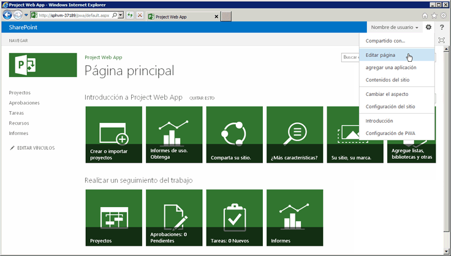

# Programación de Project Server

Obtén información sobre las características principales de programación en Project Server 2013. Este artículo incluye información sobre las aplicaciones de portabilidad creadas para versiones anteriores de Project Server.

Project Server 2013 está diseñado para admitir la mayoría de las aplicaciones desarrolladas para Project Server 2010 y soluciones nuevas para varias plataformas, donde las aplicaciones pueden acceder a instalaciones locales y en línea de Project Server. Se deben volver a diseñar las aplicaciones y extensiones desarrolladas para Project Server 2003 o versiones anteriores para que usen el modelo de objeto de cliente (CSOM) o Project Server Interface (PSI). Las aplicaciones desarrolladas para Office Project Server 2007 o Project Server 2010 pueden requerir algunos cambios y recompilaciones para usar PSI; para usar CSOM, esas aplicaciones requieren un diseño nuevo.
  
La plataforma de Project Server permite altos niveles de productividad del programador ya que se basa en SharePoint Server 2013, .NET Framework 4 y el protocolo de OData con CSOM. Los desarrolladores pueden ampliar Project Web App con aplicaciones, elementos de aplicaciones y elementos web, definir los flujos de trabajo mediante SharePoint Designer 2013 y aplicar las reglas de empresa mediante el uso de receptores de eventos remotos para eventos de Project Server.
  
## Project Server y SharePoint Server

Project Web App se basó en SharePoint Server 2013, y usa páginas maestras y elementos web para facilitar la creación de aplicaciones personalizadas y soluciones de Project Web App. Project Server 2013 se integra completamente con SharePoint Server 2013 como la plataforma de colaboración en proyectos, informes, administración de sitios, seguridad y administración del flujo de trabajo.
  
Los sitios de proyecto incluyen más opciones de información y colaboración para los miembros del equipo, y te permiten agregar aplicaciones predeterminadas que incluyen un resumen del proyecto, listas de SharePoint especializadas para tareas con escala de tiempo, seguimiento de problemas, riesgos, entregas del proyecto y calendario de grupo, junto con la biblioteca de documentos y las discusiones de equipo. Las aplicaciones personalizadas para Project Server 2013 proporcionan extensiones y flexibilidad para la colaboración del equipo. También puedes agregar elementos de la aplicación para personalizar una aplicación, con el mismo mecanismo que se emplea para agregar y editar elementos web cuando se edita una página. Puedes localizar sitios de proyectos desde cualquier lugar dentro de la granja de SharePoint donde está instalado Project Server. Para utilizar otros servicios principales de SharePoint Server 2013, como Excel Services y el motor de búsqueda Enterprise Search, un administrador puede habilitar y configurar los servicios. 
  
Cuando instalas Project Server 2013, colocas la aplicación de servicio de proyecto en el sitio de servicios web de SharePoint. La aplicación Project Service incluye servicios locales de Windows Communication Foundation (WCF) y servicios web de ASMX para PSI. Otros ejemplos de aplicaciones de servicio incluyen SharePoint Search y la administración de documentos de SharePoint. Para obtener más información, consulta la documentación del desarrollador de Project Server 2013.
  
La aplicación Project Service es un proveedor de servicio lógico que puede administrar múltiples instancias de Project Web App. El aprovisionamiento de Project Server crea un sitio de Project Web App específico dentro de una aplicación web de SharePoint. La página principal de Project Web App contiene vínculos a la página Centro de proyectos, a la página Centro de recursos y a la página Centro de inteligencia empresarial para informes, además de una página que contiene una lista de otras aplicaciones estándar. La Ilustración 1 muestra el comando **Editar página** en la lista desplegable **Configuración** en la página principal de Project Web App, que permite agregar o editar elementos web. 
  
> [!NOTE]
> Algunas páginas de administración en Project Web App, como la página de Configuración de PWA, no se pueden editar, y no muestran el comando **Editar página**. Project Web App no te permite editar páginas con SharePoint Designer 2013. Puedes editar páginas del sitio de proyecto con SharePoint Designer 2013. 
  
**Ilustración 1. Uso del menú Editar página de Project Web App**

  
Para acceder a la página Configuración del sitio en Project Web App, elige el icono **Configuración** en la esquina superior derecha de la página. La página Configuración del sitio (  `https://ServerName/ProjectServerName/_layouts/15/settings.aspx`) permite cambiar la apariencia y el tema del sitio, al agregar elementos web personalizados y modificar o crear páginas maestras para los sitios de proyectos.
  
No se admite la personalización del código de las páginas ASPX ni la personalización de páginas maestras de Project Web App con SharePoint Designer 2013. La personalización del código en las páginas de Project Web App puede causar problemas con las actualizaciones y los service pack de Project Server. 
  
### Personalización de Project Web App con paquetes de SharePoint

Dado que Project Web App es una aplicación de SharePoint y los sitios de proyectos son sitios de SharePoint, puedes agregar aplicaciones personalizadas, elementos web, controladores de eventos, campos personalizados y otras características con los paquetes de SharePoint (archivos .wsp) o aplicaciones de SharePoint (archivos .spapp). Un paquete de SharePoint o un paquete de la aplicación puede incluir varias entidades de Project Server, en los que se especifican las definiciones de entidad en un archivo elements.xml dentro del paquete.
  
Para Project Online, puedes agregar botones a la cinta de Project Web App, pero no puedes quitar o cambiar el nombre de los botones de producto existentes y no puedes crear nuevas pestañas de la cinta de opciones. Para obtener más información, consulta [Crear acciones personalizadas para implementar con aplicaciones para SharePoint](https://docs.microsoft.com/sharepoint/dev/sp-add-ins/create-custom-actions-to-deploy-with-sharepoint-add-ins).
  
> [!CAUTION]
> Al instalar un paquete o un paquete de aplicación de SharePoint, los tipos de entidades de Project Server deben aparecer en el orden especificado por el esquema PSEntityProvision.xsd o se producirá un error en la validación del esquema del paquete y la instalación no se realizará. 
  
El archivo de esquema PSEntityProvision.xsd está disponible en la descarga SDK de Project 2013, en el subdirectorio `Documentation\Schemas\AppProvisioning`. La ilustración 2 muestra la vista del explorador de esquemas XML en Visual Studio del esquema **PSEntityProvision**, en el que la secuencia **LookupTable** está ampliada. 
  
**Ilustración 2. Vista de Visual Studio del esquema de aprovisionamiento de entidad de Project Server**

  
Los paquetes de SharePoint que instalan características de Project Server pueden contener uno o más archivos elements.xml que sigan el esquema **PSEntityProvision**. Las entidades de Project Server de un único archivo XML deben aparecer en el siguiente orden: 
  
1. Fases de flujo de trabajo
    
2. Tablas de búsqueda
    
3. Campos personalizados
    
4. Fases de flujo de trabajo
    
5. Tipos de proyecto empresarial
    
6. Controladores de eventos
    
Al crear un paquete de SharePoint que contiene entidades de Project Server, es posible colocar las definiciones de entidad en varios archivos elements.xml. Cada archivo XML podría pasar la validación de esquema, pero las entidades de todo el paquete podrían no estar en el orden correcto. Por ejemplo, una entidad de campo personalizado del primer archivo XML podría referirse a una tabla de búsqueda del segundo archivo XML. Durante la instalación, no se podría crear el campo personalizado porque la tabla de búsqueda aún no se habría creado.
  
Si falla la instalación de un paquete, los objetos que se crearon permanecen en Project Web App, pero el paquete no se instala por completo. En ocasiones funciona volver a instalar el paquete, pero no es una buena experiencia para los clientes. Cuando las definiciones de entidad abarcan varios archivos elements.xml, organiza las entidades de Project Server en todo el paquete de SharePoint para asegurarte de que la instalación sigue el orden correcto. Con el esquema PSEntityProvision.xsd en la descarga SDK de Project 2013, es posible desarrollar una herramienta que verifica el orden prestablecido de las entidades de los archivos XML.
  
## Actualización de aplicaciones con las API de Project Server

Al actualizar una aplicación desarrollada para una versión anterior de Project Server, puede optar entre usar el CSOM o PSI para una interfaz de programación que incluye métodos para crear, leer, actualizar y eliminar entidades del proyecto (operaciones CRUD). Aunque el CSOM llama internamente a PSI, no sustituye totalmente todos los métodos de PSI. Para ver los escenarios y las limitaciones de PSI y el CSOM, consulte [What the PSI does and does not do](what-the-psi-does-and-does-not-do.md) y [What the CSOM does and does not do](what-the-csom-does-and-does-not-do.md).
  
> [!NOTE]
> Si el CSOM incluye la funcionalidad que necesitas, te recomendamos actualizar las aplicaciones para usar el CSOM. El CSOM permite usar las aplicaciones tanto en instalaciones locales como en línea de Project Server 2013. 
  
Si tu aplicación lee principalmente los datos de Project Server, puedes usar las tablas y vistas de informes en la base de datos de Project Server para un escenario local. Si deseas usar la aplicación con Project Online, puedes usar el protocolo de OData para el servicio **ProjectData**, que proporciona acceso local y en línea a los datos de informes. Para más información, consulta [ProjectData: referencia del servicio OData de Project](https://docs.microsoft.com/en-us/previous-versions/office/project-odata/jj163015(v=office.15)).
  
### Empleo de PSI

PSI permite aplicaciones de cliente de plena confianza, incluidas las aplicaciones de Project Profesional 2013, Project Web App y LOB, para tener acceso a los datos de Project Server en una granja de SharePoint. PSI se crea y usa con .NET Framework 4 y proporciona ventajas como un entorno de desarrollo conocido con seguridad integrada, control de errores y recolección de basura.
  
Se accede a la PSI a través de servicios WCF o servicios web ASMX. La interfaz ASMX se basa en WCF. Normalmente, cada servicio de la PSI contiene una clase básica con métodos CRUD para elementos dentro de esa clase. Los elementos se especifican mediante clases de **DataSet** relacionadas. Por ejemplo, el servicio de **CustomFields** contiene la clase **CustomFields** con métodos como [CreateCustomFields2](https://docs.microsoft.com/previous-versions/office/ee767959(v=office.14)) . Los datos para uno o más campos personalizados de empresa se especifican en **CustomFieldDataSet**.
  
> [!NOTE]
> La interfaz de servicios web ASMX de la PSI está en desuso en Project Server 2013. Si bien la interfaz ASMX sigue estando disponible, las nuevas aplicaciones que utilizan PSI deben usar la interfaz de WCF o, si es posible, las nuevas aplicaciones deben utilizar CSOM en lugar de PSI. Las futuras versiones de Project Server requerirán una actualización de las aplicaciones existentes basadas en ASMX para usar la interfaz de WCF de la PSI o para usar CSOM. 
  
Hay 22 servicios públicos y documentados de la PSI, que se duplican en la interfaz WCF y en la interfaz ASMX. La PSI también incluye ocho servicios privados sin documentar. Project Web App y Project Profesional usan los servicios públicos y privados de la PSI. La PSI generalmente se factoriza para que coincida con los objetos de la empresa. Es decir, cada método de la PSI se asocia a un objeto de la empresa como **Calendario** o **Recurso**. La PSI es la interfaz principal para los objetos de la empresa. Como el nivel de empresa proporciona componentes de lógica empresarial reutilizables, las distintas aplicaciones que interactúan con los datos de Project Server usan la misma lógica empresarial.
  
Los métodos de la PSI que interactúan asincrónicamente con Project Server tienen nombres que empiezan con **Cola**. Cada método de la PSI se implementa con una interfaz independiente que usa datos fuertemente tipados. Por ejemplo, el método **QueueCreateProject** en el servicio **Project** acepta el parámetro _DataSet_ de tipo **ProjectDataSet**. La clase **ProjectDataSet** deriva del tipo **DataSet**. La comprobación de tipos en .NET Framework y la finalización de IntelliSense en Visual Studio ayudan a reducir errores en el desarrollo con la PSI. Para obtener una introducción a la referencia detallada de espacios de nombres de PSI, clases, métodos, propiedades, eventos y conjuntos relacionados, consulta [Información general de referencia de PSI de Project](project-psi-reference-overview.md).
  
Project Server 2013 usa el control de excepciones de .NET Framework. Todos los errores se registran en el servidor, en la parte superior de la pila de PSI. Algunos errores envían un informe simple al cliente, como un objeto **SoapException** para la interfaz de ASMX o un objeto **FaultException** para la interfaz de WCF. Las excepciones pueden registrarse en el registro de eventos de la aplicación, y algunos errores también registran un informe detallado en el servidor en los registros de seguimiento del servicio de registro unificado (ULS). 
  
En las aplicaciones locales de plena confianza, PSI además es extensible. Es posible agregar un ensamblado de .NET con un servicio que proporciona nuevas características, usa la misma infraestructura de seguridad de Project Server y llama a otros métodos de PSI o hereda de clases de PSI. Una extensión de PSI también puede proporcionar la lógica empresarial y el acceso de base de datos necesarios para la nueva funcionalidad.
  
### Empleo del CSOM

Con el CSOM, es posible desarrollar aplicaciones que tienen acceso a Project Online o a una instalación local de Project Server 2013. Las aplicaciones pueden distribuirse en una tienda Office pública o en un catálogo privado de aplicaciones. El CSOM está diseñado para ser una API fácil de usar que consume o proporciona directamente datos por nombre con consultas LINQ, en lugar de pasar conjuntos de datos y crear parámetros _changeXml_ o parámetros de _filtro_ XML. El CSOM implementa la funcionalidad principal de Project Server Interface (PSI) para las entidades principales como **proyecto**, **tareas**, **EnterpriseResource**y ** asignación**. El CSOM incluye muchas entidades adicionales como **CustomField**, **LookupTable**, **WorkflowActivities**, **EventHandler** y **QueueJob**, que admiten otras funciones comunes de Project Server.
  
El CSOM se puede usar copiando los siguientes recursos en el equipo de desarrollo local:
  
- Para el desarrollo de .NET Framework 4, copia el conjunto `%ProgramFiles%\Common Files\Microsoft Shared\Web Server Extensions\15\ISAPI\Microsoft.ProjectServer.Client.dll`. 
    
  Para documentos de clases y miembros de CSOM, consulta el espacio de nombres de [Microsoft.ProjectServer.Client](https://docs.microsoft.com/previous-versions/office/dn529530(v=office.15)). Para una aplicación de ejemplo, consulta [Empezar a usar CSOM y .NET](getting-started-with-the-project-server-csom-and-net.md).
    
- Para el desarrollo de Microsoft Silverlight, copia el conjunto `%ProgramFiles%\Common Files\Microsoft Shared\Web Server Extensions\15\TEMPLATE\LAYOUTS\ClientBin\Microsoft.ProjectServer.Client.Silverlight.dll`. 
    
- Para desarrollar aplicaciones para Windows Phone 8, copia el conjunto `%ProgramFiles%\Common Files\Microsoft Shared\Web Server Extensions\15\TEMPLATE\LAYOUTS\ClientBin\Microsoft.ProjectServer.Client.Phone.dll`. 
    
- Para usar JavaScript para desarrollar aplicaciones web y aplicaciones para otros dispositivos, copia el archivo `%ProgramFiles%\Common Files\Microsoft Shared\Web Server Extensions\15\TEMPLATE\LAYOUTS\PS.js` y el archivo `PS.debug.js`. Para una aplicación web de ejemplo, consulta [Empezar a usar el modelo de objeto de JavaScript de Project Server 2013](getting-started-with-the-project-server-2013-javascript-object-model.md).
    
El CSOM llama internamente a la PSI; por lo tanto, si la PSI no puede realizar un trabajo, tampoco puede el CSOM. Para las limitaciones del CSOM, consulta [Qué hace y qué no hace el CSOM](what-the-csom-does-and-does-not-do.md) y [Qué hace y qué no hace la PSI](what-the-psi-does-and-does-not-do.md). Para obtener más información acerca del desarrollo con el CSOM, consulta [actualizaciones para desarrolladores en Project 2013](updates-for-developers-in-project-2013.md) y [ Modelo de objetos de cliente (CSOM) para Project 2013](client-side-object-model-csom-for-project-2013.md).
  
### Aplicaciones de migración compiladas para Project Server 2003

En Project Server 2003, muchos datos y funciones solo están disponibles con Project Professional 2003 o mediante acceso directo de base de datos. PSI, introducida en Project Server 2007, elimina en gran medida esa restricción. A diferencia de Project Data Service (PDS) de Project Server 2003, PSI y el CSOM proporcionan interfaces generales para objetos empresariales de Project Server.
  
Las aplicaciones desarrolladas para PDS no son compatibles con versiones posteriores de Project Server. El CSOM y PSI proporcionan paridad funcional para PDS, pero no coinciden con los métodos o parámetros de PDS.
  
> [!NOTE]
> Como las aplicaciones de PDS tienen que volver a diseñarse por completo para Project Server 2013, te recomendamos que uses el CSOM. 
  
Para obtener más información sobre la compatibilidad de PDS y para ver directrices para la migración de extensiones de PDS a PSI, consulta [Paridad de PDS en servicios web de PSI](https://docs.microsoft.com/previous-versions/office/developer/office-2007/ms197081(v=office.12)).
  
### Aplicaciones de migración compiladas para Project Server 2007 y Project Server 2010

La PSI de Project Server 2013 es un superconjunto del modelo de objetos de PSI en Office Project Server 2007 y Project Server 2010. Muchas aplicaciones diseñadas para las dos versiones anteriores de Project Server seguirán funcionando en instalaciones locales de plena confianza de Project Server 2013. Sin embargo, los siguientes tipos de aplicaciones requieren actualizaciones o un nuevo diseño:
  
- Usa el CSOM para aplicaciones adaptadas para su uso con Project Online.
    
- Usa el CSOM para aplicaciones adaptadas para su uso en dispositivos móviles y tabletas.
    
- Usa el CSOM para aplicaciones disponibles como aplicaciones en la tienda Office o en un catálogo de aplicaciones privado.
    
- Para aplicaciones que modifican la programación de proyectos, usa el CSOM o modifica la aplicación para usar el método [QueueUpdateProject2](https://docs.microsoft.com/previous-versions/office/project-class/jj236245(v=office.15)) de PSI. 
    
- Las aplicaciones web o locales que registran a los usuarios en distintas instancias de Project Web App deben usar las configuraciones de programación para los terminales de WFC del CSOM o la PSI. Los métodos están en desuso. Las aplicaciones requieren autenticación de OAuth en lugar de autenticación mediante formularios y para usar con Project Online. Para obtener más información, consulta [Autorización y autenticación para aplicaciones en SharePoint 2013](https://docs.microsoft.com/sharepoint/dev/sp-add-ins/authorization-and-authentication-of-sharepoint-add-ins).
    
- Aplicaciones que se basan en una configuración concreta de seguridad de Project Server o la modifican.
    
  > [!NOTE]
  > Una instalación de Project Server 2013 local predeterminada usa el modo de permisos de SharePoint, donde la configuración de seguridad de Project Server no es accesibles a través de PSI. Para cambiar al modo de permiso de Project, consulta la sección *Modo de permisos de SharePoint* en [Novedades para los profesionales de TI en Project Server 2013](https://docs.microsoft.com/project/what-s-new-for-it-pros-in-project-server-2016). 
  
- Para muchos flujos de trabajo personalizados de Project Server, puedes usar SharePoint Designer 2013 para crear flujos de trabajo declarativos. Para los flujos de trabajo personalizados que requieren programación adicional, *no* debes usar directamente clases o miembros en el espacio de nombre de **Microsoft.Office.Project.Server.Workflow**. En su lugar, usa la clase [Microsoft.ProjectServer.Client.WorkflowActivities](https://docs.microsoft.com/previous-versions/office/mt780562(v=office.15)) en el CSOM. 
    
- En general, las aplicaciones que utilizan suplantación deben volver a escribirse para usar la interfaz de WCF de PSI. Las aplicaciones que realicen actualizaciones de estado simples para otros usuarios no necesitan suplantación. Pueden usar el método [StatusAssignment.SubmitStatusUpdates](https://docs.microsoft.com/previous-versions/office/project-class/jj235883(v=office.15)) en el CSOM o el método [Statusing.SubmitStatusForResource](https://docs.microsoft.com/previous-versions/office/ee755393(v=office.14)) en PSI. 
    
- Los componentes de software intermedio que se ejecutan en un equipo con Project Server solo pueden instalarse para uso local y deben usar la interfaz de WFC de PSI. Por ejemplo, un componente de software intermedio que utiliza la interfaz ASMX para intercambiar datos entre Project Web App local y una aplicación de partes de horas externa tendrá que volver a escribirse para usar la interfaz de WCF de PSI. Para trabajar con Project Online, se deberá volver a diseñar el componente como una aplicación y usar el CSOM.
    
### Migración y compatibilidad de soluciones personalizadas

Las clases y los miembros en las interfaces públicas de ASMX y WCF de PSI son idénticos. Pero el número de columnas y el tamaño de las tablas de datos utilizadas o devueltas por métodos de la PSI pueden ser diferentes entre Project Server 2013 y las dos versiones anteriores de Project Server. También hay diferencias en las tablas y vistas de informes, en comparación con la base de datos de informes de versiones anteriores.
  
> [!IMPORTANT]
> Se recomienda encarecidamente probar exhaustivamente las soluciones en una instalación que no sea de producción de Project Server 2013 antes de implementarlas en un servidor de producción. 
  
Al migrar una solución a Project Server 2013, o si una solución no funciona como se esperaba, como mínimo debes hacer lo siguiente:
  
- Actualizar la solución abriéndola en Visual Studio 2012. Algunas soluciones pueden usar Visual Studio 2010.
    
- Cambia el destino a .NET Framework 4.
    
- Cambiar las referencias de ensamblado para usar los ensamblados de Project Server 2013, como Microsoft.Office.Project.Server.Library.dll y Microsoft.Office.Project.Server.Events.Receivers.dll.
    
- Hacer una lista de las referencias web ASMX o las referencias del servicio WCF y los nombres de espacios de nombres y, a continuación, eliminar las referencias de Project Server.
    
- Agregar el ensamblado de proxy de ProjectServerServices.dll que puedes crear a partir de los archivos de origen del proxy WCF en la descarga SDK de Project 2013, o agregar los archivos de origen proxy para los servicios WCF necesarios. Para los servicios ASMX, agrega nuevamente las referencias a servicios web ASMX front-end, con los mismos nombres de espacio de nombres; o agrega el ensamblado proxy ProjectServerServices.dll que puedes crear a partir de orígenes WSDL en la descarga SDK de Project 2013.
    
  > [!NOTE]
  > En la descarga SDK de Project 2013, los espacios de nombre en los archivos de origen proxy comienzan todos con *Svc*. Por ejemplo, el espacio de nombre de servicio **Recursos** en el archivo proxy de WCF y en el archivo proxy ASMX es **SvcResource**. > Si tu aplicación usa nombres de espacios de nombre diferentes, puedes volver a compilar el ensamblado proxy para utilizar tus espacios de nombres, o cambiar los espacios de nombres de PSI en tu aplicación. Por ejemplo, puedes modificar el script CompileWCFProxyAssembly.cmd y volver a compilar ProjectServerServices.dll de los archivos de origen proxy en la descarga SDK. 
  
- Si pasas de usar la interfaz ASMX de PSI a la interfaz WCF, puedes inicializar las clases de cliente mediante programación o con extremos WCF en app.config. Usa la inicialización mediante programación si tienes que cambiar rápidamente a distintas instancias de Project Web App o si estás desarrollando un elemento web que emplee PSI.
    
- Existen varios métodos nuevos y conjuntos de datos en los servicios de PSI de Project Server 2013 y algunas clases de **DataRow** contienen nuevas propiedades. Por ejemplo, el método [QueueUpdateProject2](https://docs.microsoft.com/previous-versions/office/project-class/jj236245(v=office.15)) en PSI usa el motor de programación de Project Server para volver a programar un proyecto actualizado sin que tengas que abrirlo en Project Profesional 2013, y además permite agregar o eliminar entidades del proyecto en la misma llamada. 
    
- Compilar y probar la solución.
    
## Programación de proyectos en el servidor

Project Server 2013 tiene dos motores de programación. El motor de programación más reciente es el mismo motor de programación de Project Profesional 2013. Cuando realices cambios de programación y publiques los cambios con el elemento web de programación (página de detalles del proyecto) en Project Web App o un sitio de proyecto o utilizando el CSOM, el cálculo de las fechas, costos, duración, trabajo restante, líneas de base y otros cambios relacionados con la programación son los mismos que si realizaras los cambios y publicaras el proyecto mediante Project Profesional 2013. Sin embargo, excepto para el método [QueueUpdateProject2](https://docs.microsoft.com/previous-versions/office/project-class/jj236245(v=office.15)), los métodos PSI utilizan el motor de programación anterior que se migró de Project Server 2010. El motivo es asegurarse de que las aplicaciones heredadas se comportan en Project Server 2013 del mismo modo que lo hacían anteriormente. 
  
> [!NOTE]
> Para usar el motor de programación actualizado en Project Server 2013, las aplicaciones pueden utilizar el CSOM. 
  
Tanto los motores de programación más antiguos como los más modernos tienen las siguientes limitaciones:
  
- **Solo programación de proyecto único** La programación afecta solo el proyecto actual, cuando se realicen cambios a través de actualizaciones de estado de tareas con PSI, con el CSOM o con Project Web App. Si el proyecto actual contiene vínculos a otros proyectos, subproyectos o proyectos principales, no se cambian los proyectos vinculados. 
    
- **Tareas de resumen** Las tareas de resumen normalmente son de solo lectura en Project Server. Por ejemplo, no se pueden crear asignaciones de tareas de resumen y no se puede modificar el porcentaje completado. Sin embargo, Project Server admite la edición de fechas y la duración de las tareas de resumen programadas manualmente. 
    
    Los datos reales no se agregan automáticamente a una asignación de tarea de resumen en Project Server, porque eso omitiría el proceso de aprobación de Project Server. En Project Professional, al agregar datos reales a una subtarea, también se agregan para una asignación de la tarea de resumen. La diferencia de comportamiento puede ser confusa para un usuario.
    
    Project Server elimina los datos reales de una asignación de tarea de resumen si la duración de la subtarea se acorta o se modifica la fecha de finalización.
    
    > [!CAUTION]
    > Aunque Project Professional puede hacerlo, le recomendamos que no haga asignaciones en tareas de resumen. 
  
A continuación se enumeran los problemas y las limitaciones de la programación de PSI con el motor de programación más antiguo de Project Server:
  
- **Modificación del estado activo de una tarea** El motor de programación más antiguo de Project Server puede mostrar horas de inicio o finalización incoherentes al usar el método [QueueUpdateProject](https://docs.microsoft.com/en-us/previous-versions/office/ms471014(v=office.14)) para cambiar el estado activo de una tarea, si hay varios cambios en el objeto **ProjectDataSet** para el parámetro _Dataset_. Si la propiedad **TASK_IS_ACTIVE** es el único cambio en el parámetro _Dataset_ de **QueueUpdateProject**, puedes actualizar el proyecto.
    
    Para obtener más información sobre las tareas inactivas y el motor de programación más antiguo, consulta los artículos del blog [Presentación de tareas inactivas en Project 2010](https://blogs.msdn.com/b/project/archive/2010/06/10/introducing-inactive-tasks-in-project-2010.aspx) y [Project Server 2010: programación en Internet, PSI y Project Profesional](https://blogs.msdn.com/b/brismith/archive/2010/09/10/project-server-2010-scheduling-on-the-web-the-psi-and-project-professional.aspx?wa=wsignin1.0). Para una comparación de programación en Project Profesional 2010 y Project Web App en Project Server 2010, consulta la [Comparación de administración de programación basada en la web](https://blogs.msdn.microsoft.com/brismith/2010/09/10/project-server-2010-scheduling-on-the-web-the-psi-and-project-professional/).
    
- **No se calcula el valor acumulado** El motor de programación anterior no calcula los campos de valor acumulado: CRTR, BAC, CPTR, CPTP, CPI, CV, CV%, EAC, SPI, SV, SV%, TCPI, VAC, desviación de duración, desviación de inicio, desviación de finalización, varianza de costo y desviación de trabajo. Si un proyecto tiene valores para estos campos y el proyecto se actualiza con el método **QueueUpdateProject**, los valores de campo no se modifican. Para evitar el problema, usa el método **QueueUpdateProject2**. 
    
Puedes controlar las limitaciones de la programación de PSI de varias formas:
  
- Si el CSOM tiene los métodos que necesita la aplicación, utilícelo en lugar de PSI.
    
- Abra los proyectos en Project Professional y vuelva a guardarlos en Project Server.
    
- En los informes, no incluya campos que PSI no actualice.
    
- Agregue una nota en los informes que indique que los datos pueden estar obsoletos.
    
En las tablas de informes y los cubos hay marcas que ayudan a detectar si algunos datos de un proyecto no están actualizados. Los datos de informes de la tabla MSP_EpmProject de MSP_EpmProject_UserView incluyen los siguientes campos: 
  
-  _ProjectWbsIsStale_ &ndash; Indica si la estructura de descomposición de trabajo (jerarquía del esquema de tareas) está obsoleta. 
    
-  _ProjectEarnedValueIsStale_&ndash; Indica que los campos de valor acumulado están obsoletos. 
    
-  _ProjectRollupsAreStale_&ndash; Indica que un subproyecto está actualizado en la base de datos de borrador, pero que el proyecto principal no lo está. Los valores acumulados de los subproyectos son obsoletos. 
    
-  _ProjectHierarchyNotSynchronized_ &ndash; El proyecto principal no está sincronizado con los secundarios. Esto sucede si los proyectos secundarios se publican de forma explícita y no como parte de la publicación del proyecto principal. 
    
-  _ProjectCalculationsAreStale_&ndash; Project Profesional guardado como un proyecto sin calcular la programación (es decir, el modo de cálculo está establecido en **Manual** en la pestaña **Programación** del cuadro de diálogo **Opciones de proyecto**). 
    
-  _ProjectGhostTaskAreStale_ &ndash; Similar a _ProjectHierarchyNotSynchronized_, pero advierte sobre los datos de vinculación entre proyectos. Es posible que no exista proyecto principal, pero los datos de proyecto de un lado del vínculo son más recientes que los del otro.
    
## Acerca del acceso a la base de datos de Project Server

Si tienes permisos en Microsoft SQL Server para acceder a la base de datos de Project Server, puedes leer las tablas y vistas de informes. Si tienes los permisos necesarios de Project Server, también puedes obtener datos de las tablas de informes mediante consultas de OData. Se recomienda que los desarrolladores no accedan directamente a las tablas en formato de borrador, publicadas o archivadas a través de consultas de SQL Server en la base de datos de Project Server. Realizar cambios directamente en cualquiera de las tablas de la base de datos de Project Server puede dañar la integridad referencial e interferir con el acceso a la base de datos mediante el servicio de cola de Project Server.
  
> [!IMPORTANT]
> No hay nada que le impida activamente usar el acceso de base de datos directo mediante programación para actualizar datos. Debería tener en cuenta de que la caché de Project Professional, las tablas de publicados y las tablas de informes dependen de un protocolo de sincronización de la caché que se puede alterar por la edición directa de datos. Si daña la base de datos de Project Server o las cachés de cliente de Project Professional mediante el acceso directo para cambiar datos, sepa que el servicio de soporte del producto no podrá prestarle ayuda. 
  
Las aplicaciones que tienen acceso directo a las tablas y vistas en formato de borrador, publicadas o archivadas dependen también de los esquemas de base de datos, que pueden cambiar en service packs o versiones posteriores de Project Server 2013. Las aplicaciones que tienen acceso directo a las bases de datos también pierden la seguridad integrada de Project Server, lógica empresarial común, seguimiento, auditorías, comprobación de errores, informes, flujo de trabajo y otras características. Probablemente tendrás que volver a escribir dicha aplicación después de las actualizaciones de Project Server 2013. 
  
Por todos estos motivos, Project Profesional y Project Web App no realizan llamadas directas a las tablas en formato de borrador, publicadas o archivadas; tampoco debería hacerlo ninguna otra aplicación que se integre con Project Server.
  
Los esquemas de las tablas en formato de borrador, publicadas y archivadas no se documentan. Puedes usar las tablas de informes para ayudar a generar informes y el esquema de las tablas y las vistas de informes se documenta en la descarga SDK de Project 2013. Para el esquema de OData de los datos de informes, consulta [ProjectData. Referencia al servicio OData de Project](https://docs.microsoft.com/previous-versions/office/project-odata/jj163015(v=office.15)).
  
## Ver también

- [Actualizaciones para desarrolladores en Project 2013](updates-for-developers-in-project-2013.md)    
- [Arquitectura de Project Server 2013](project-server-2013-architecture.md)    
- [Qué hace y qué no hace PSI](what-the-psi-does-and-does-not-do.md)   
- [Qué hace y qué no hace el CSOM](what-the-csom-does-and-does-not-do.md)    
- [Modelo de objeto del cliente (CSOM) para Project 2013](client-side-object-model-csom-for-project-2013.md)    
- [Introducción al desarrollo de flujos de trabajo de Project Server](getting-started-developing-project-server-workflows.md)    
- [Referencias de programación de Project 2013](project-2013-programming-references.md)    
- [Descripción general de referencia de PSI de Project](project-psi-reference-overview.md)    
- [Crear acciones personalizadas para implementar con aplicaciones en SharePoint](https://docs.microsoft.com/sharepoint/dev/sp-add-ins/create-custom-actions-to-deploy-with-sharepoint-add-ins)    
- [Presentación de tareas inactivas en Project 2010](https://blogs.msdn.com/b/project/archive/2010/06/10/introducing-inactive-tasks-in-project-2010.aspx)    
- [Project Server 2010: programación en la web, PSI y Project Profesional](https://blogs.msdn.microsoft.com/brismith/2010/09/10/project-server-2010-scheduling-on-the-web-the-psi-and-project-professional/)

