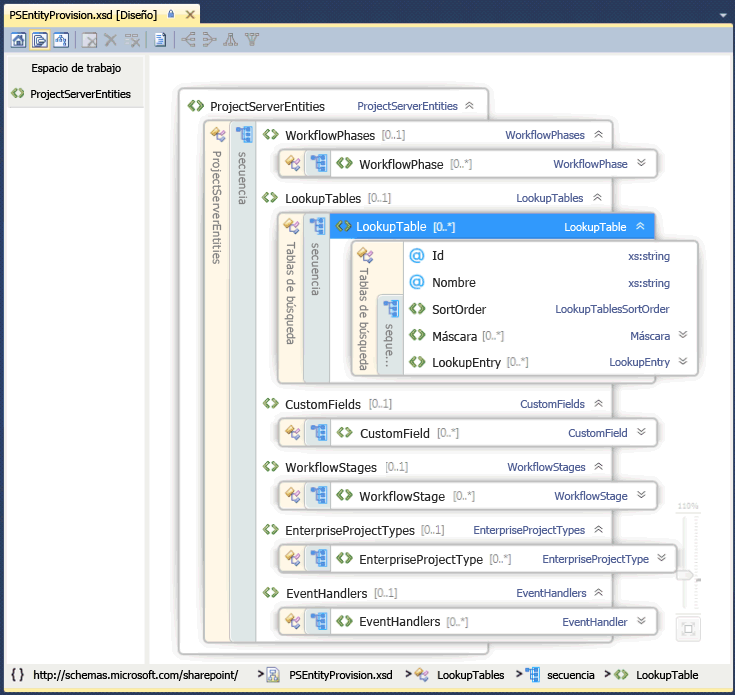

# Programación de Project ServerProject Server programmability

Obtenga información sobre las características principales de programación de Project Server 2013.Learn about the major programmability features in Project Server 2013. En este artículo se incluye información acerca de trasladar las aplicaciones que han sido creadas para versiones anteriores de Project Server.This article includes information about porting applications that were built for previous versions of Project Server.

Project Server 2013 está diseñado para admitir la mayoría de las aplicaciones que se desarrollaron para Project Server 2010 y nuevas soluciones para varias plataformas, donde aplicaciones pueden tener acceso a ambos en línea y las instalaciones de Project Server local.Project Server 2013 is designed to support most applications that were developed for Project Server 2010 and new solutions for multiple platforms, where apps can access both online and on-premises Project Server installations. Aplicaciones y extensiones que se desarrollaron para Project Server 2003 o anterior deben volver a diseñarse para usar el modelo de objetos de cliente (COM) o Project Server Interface (PSI).Applications and extensions that were developed for Project Server 2003 or earlier must be redesigned to use the client-side object model (CSOM) or the Project Server Interface (PSI). Las aplicaciones que se desarrollaron para Office Project Server 2007 o Project Server 2010 pueden requerir algunos cambios y volver a compilar para usar la interfaz PSI; Para usar el CSOM, las aplicaciones requieren un cambio de diseño.Applications that were developed for Office Project Server 2007 or Project Server 2010 may require some changes and recompiling to use the PSI; to use the CSOM, those applications require a redesign.
  
La plataforma de Project Server permite altos niveles de productividad de los programadores mediante la creación en SharePoint Server 2013, .NET Framework 4 y el Protocolo OData con el CSOM.The Project Server platform enables high levels of programmer productivity by building on SharePoint Server 2013, .NET Framework 4, and the OData protocol with the CSOM. Los desarrolladores pueden ampliar Project Web App con aplicaciones, los elementos de aplicación y los elementos Web, definir flujos de trabajo mediante el uso de SharePoint Designer 2013 y exigir la aplicación de reglas de negocio mediante el uso de receptores de eventos remotos para los eventos de Project Server.Developers can extend Project Web App with apps, app parts, and Web Parts, define workflows by using SharePoint Designer 2013, and enforce business rules by using remote event receivers for Project Server events.
  
## Project Server y SharePoint ServerProject Server and SharePoint Server

Project Web App se basa en SharePoint Server 2013 y usa páginas maestras y elementos Web para que sea más fácil crear aplicaciones personalizadas y soluciones de Project Web App.Project Web App is built upon SharePoint Server 2013, and uses master pages and Web Parts to make it easier to build custom apps and Project Web App solutions. Project Server 2013 se integra profundamente con SharePoint Server 2013 como la plataforma de colaboración de project, reporting, administración de sitios, seguridad y administración de flujo de trabajo.Project Server 2013 integrates deeply with SharePoint Server 2013 as the platform for project collaboration, reporting, site administration, security, and workflow management.
  
Los sitios del proyecto incluyen más información y opciones de colaboración para los miembros del equipo, donde puede agregar aplicaciones predeterminadas que incluyen un proyecto de las listas de SharePoint de resumen, especializado para las tareas con una escala de tiempo, el seguimiento de problemas, riesgos, entregas, del proyecto y el calendario de equipo, junto con las discusiones de equipo y de biblioteca de documentos.The project sites include more information and collaboration options for team members, where you can add default apps that include a project summary, specialized SharePoint lists for tasks with a timeline, tracking issues, risks, project deliverables, and the team calendar, along with the document library and team discussions. Aplicaciones personalizadas para Project Server 2013 proporcionan extensiones y flexibilidad para la colaboración en equipo.Custom apps for Project Server 2013 provide extensions and flexibility for team collaboration. También puede agregar elementos de la aplicación para personalizar una aplicación, mediante el mismo mecanismo para agregar y editar elementos Web cuando se edita una página.You can also add app parts to customize an app, by using the same mechanism to add and edit Web Parts when you edit a page. Puede encontrar los sitios del proyecto en cualquier lugar dentro de la granja de servidores de SharePoint donde está instalado el servidor de Project Server.You can locate project sites anywhere within the SharePoint farm where Project Server is installed. Para usar otros servicios principales de SharePoint Server 2013, como servicios de Excel y de búsqueda Enterprise Search, un administrador puede habilitar y configurar los servicios.To use other core services of SharePoint Server 2013, such as Excel Services and Enterprise Search, an administrator can enable and configure the services. 
  
Al instalar Project Server 2013, aprovisionar la aplicación de servicio de proyecto en el sitio de SharePoint Web Services.When you install Project Server 2013, you provision the Project Service Application in the SharePoint Web Services site. La aplicación de servicio de proyecto incluye los servicios locales de Windows Communication Foundation (WCF) y servicios web de ASMX para la PSI.The Project Service Application includes the local Windows Communication Foundation (WCF) services and ASMX web services for the PSI. Otras aplicaciones de servicio ejemplos de búsqueda de SharePoint y administración de documentos de SharePoint.Other examples of service applications include SharePoint Search and SharePoint Document Management. Para obtener más información, vea la documentación para desarrolladores de SharePoint Server 2013.For more information, see the SharePoint Server 2013 developer documentation.
  
La aplicación de servicio de proyecto es un proveedor de servicio lógico que puede administrar varias instancias de Project Web App.The Project Service Application is a logical service provider that can manage multiple instances of Project Web App. Aprovisionamiento de Project Server, crea un sitio de Project Web App específico dentro de una aplicación web de SharePoint.Project Server provisioning creates a specific Project Web App site within a SharePoint web application. La página principal de Project Web App contiene vínculos a la página Centro de proyectos, página del centro de recursos y la página del centro de inteligencia empresarial para informes, además de una página que contiene una lista de aplicaciones estándares adicionales.The Home page of Project Web App contains links to the Project Center page, Resource Center page, and the Business Intelligence Center page for reporting, plus a page that contains a list of additional standard apps. La figura 1 muestra el comando **Editar página** en la lista desplegable de **configuración** en la página principal de Project Web App, que permite agregar o editar elementos Web.Figure 1 shows the **Edit Page** command in the **Setttings** drop-down list on the Home page of Project Web App, which allows you to add or edit Web Parts. 
  
> [!NOTE]
> Algunas páginas administrativas en Project Web App, como la página Configuración de PWA, no son editables y no mostrar el comando **Editar página** .Some administrative pages in Project Web App—such as the PWA Settings page—are not editable, and do not show the **Edit Page** command. Project Web App no permite editar páginas mediante SharePoint Designer 2013.Project Web App does not allow you to edit pages by using SharePoint Designer 2013. Puede editar las páginas del sitio de proyecto con SharePoint Designer 2013.You can edit project site pages with SharePoint Designer 2013. 
  
**Ilustración 1. Empleo del menú Editar página de Project Web App****Figure 1. Using the Edit Page menu in Project Web App**

![Edición de la página principal de Project Web Access] (media/pj15_Programmability_PWAHome.gif "Edición de la página principal de Project Web Access")
  
Para obtener acceso a la página Configuración del sitio de Project Web App, elija el icono de **configuración** en la esquina superior derecha de la página.To access the Site Settings page in Project Web App, choose the **Settings** icon in the top-right corner of the page. La página Configuración del sitio ( `http://ServerName/ProjectServerName/_layouts/15/settings.aspx`) permite cambiar la apariencia y el tema del sitio, agregar elementos Web personalizados y modificar o crear páginas maestras de los sitios de proyecto.The Site Settings page (  `http://ServerName/ProjectServerName/_layouts/15/settings.aspx`) enables changing the look and feel and the site theme, adding custom Web Parts, and modifying or creating master pages for project sites.
  
Personalización del código en las páginas ASPX o personalización de las páginas maestras de Project Web App con SharePoint Designer 2013, no se admite.Customization of the code in ASPX pages, or customization of Project Web App master pages with SharePoint Designer 2013, is not supported. Personalización del código en las páginas de Project Web App puede causar problemas con los service packs y actualizaciones de Project Server.Customization of the code in Project Web App pages can cause problems with Project Server updates and service packs. 
  
### Personalización de Project Web App con paquetes de SharePointCustomization of Project Web App with SharePoint packages

Debido a que Project Web App es una aplicación de SharePoint y los sitios de proyecto son sitios de SharePoint, puede agregar aplicaciones personalizadas, elementos Web, controladores de eventos, campos personalizados y otras características mediante el uso de paquetes de SharePoint (archivos .wsp) o aplicaciones de SharePoint (archivos .spapp).Because Project Web App is a SharePoint application, and project sites are SharePoint sites, you can add custom apps, Web Parts, event handlers, custom fields, and other features by using SharePoint packages (.wsp files) or SharePoint apps (.spapp files). Un paquete de SharePoint o un paquete de aplicación puede incluir varias entidades de Project Server, donde se especifican las definiciones de entidad en un archivo elements.xml dentro del paquete.A SharePoint package or an app package can include multiple Project Server entities, where entity definitions are specified in an elements.xml file within the package.
  
Para Project Online, puede agregar botones a la cinta de opciones de Project Web App, pero no se puede quitar o cambiar el nombre de los botones de producto existente y no se puede crear nuevas fichas de la cinta de opciones.For Project Online, you can add buttons to the Project Web App ribbon, but you can't remove or rename existing product buttons, and you can't create new ribbon tabs. Para obtener más información, vea [crear acciones personalizadas para implementarlas con aplicaciones para SharePoint](http://msdn.microsoft.com/en-us/library/office/apps/jj163954%28v=office.15%29.aspx).For more information, see [Create custom actions to deploy with apps for SharePoint](http://msdn.microsoft.com/en-us/library/office/apps/jj163954%28v=office.15%29.aspx).
  
> [!CAUTION]
> Al instalar un paquete o un paquete de aplicación de SharePoint, los tipos de entidades de Project Server deben aparecer en el orden especificado por el esquema PSEntityProvision.xsd o se producirá un error en la validación del esquema del paquete y la instalación no se realizará.When you install a SharePoint package or an app package, the types of Project Server entities must appear in the order that the PSEntityProvision.xsd schema specifies or schema validation of the package fails and installation is not completed. 
  
El archivo de esquema PSEntityProvision.xsd está disponible en la descarga del SDK de Project 2013, en la `Documentation\Schemas\AppProvisioning` subdirectorio.The PSEntityProvision.xsd schema file is available in the Project 2013 SDK download, in the  `Documentation\Schemas\AppProvisioning` subdirectory. La figura 2 muestra la vista del explorador de esquema de XML en Visual Studio del esquema **PSEntityProvision** , donde se expande la secuencia **LookupTable** .Figure 2 shows the XML Schema Explorer view in Visual Studio of the **PSEntityProvision** schema, where the **LookupTable** sequence is expanded. 
  
**Ilustración 2. Vista de Visual Studio del esquema de aprovisionamiento de entidad de Project Server****Figure 2. Visual Studio view of the Project Server entity provisioning schema**

![Vista del esquema de entidad de Project Server] (media/pj15_Programmability_EntitySchema.gif "Vista del esquema de entidad de Project Server")
  
Los paquetes de SharePoint que instalan características de Project Server pueden contener uno o más archivos elements.xml que sigan el esquema **PSEntityProvision**. Las entidades de Project Server de un único archivo XML deben aparecer en el siguiente orden:SharePoint packages that install features for Project Server can contain one or more elements.xml files that follow the **PSEntityProvision** schema. The Project Server entities in a single XML file must appear in the following order: 
  
1. Fases de flujo de trabajoWorkflow phases
    
2. Tablas de búsquedaLookup tables
    
3. Campos personalizadosCustom fields
    
4. Fases de flujo de trabajoWorkflow stages
    
5. Tipos de proyecto empresarialEnterprise project types
    
6. Controladores de eventosEvent handlers
    
Al crear un paquete de SharePoint que contiene entidades de Project Server, es posible colocar las definiciones de entidad en varios archivos elements.xml. Cada archivo XML podría pasar la validación de esquema, pero las entidades de todo el paquete podrían no estar en el orden correcto. Por ejemplo, una entidad de campo personalizado del primer archivo XML podría referirse a una tabla de búsqueda del segundo archivo XML. Durante la instalación, no se podría crear el campo personalizado porque la tabla de búsqueda aún no se habría creado.When you create a SharePoint package that contains Project Server entities, it is possible to put the entity definitions in multiple elements.xml files. Each XML file could pass the schema validation, but the entities in the whole package might not be in the correct order. For example, a custom field entity in the first XML file could refer to a lookup table in the second XML file. During installation, the custom field cannot be created because the lookup table has not yet been created.
  
Si se produce un error en la instalación de un paquete, los objetos que se han creado permanecen en Project Web App, pero el paquete no se instala completamente.If a package installation fails, objects that have been created remain in Project Web App, but the package does not install completely. Puede volver a instalar el paquete de trabajo, pero no es una buena experiencia para los clientes.Reinstalling the package can work, but that is not a good experience for customers. Cuando las definiciones de entidad abarcan varios archivos elements.xml, organizar las entidades de Project Server en todo el paquete de SharePoint para asegurarse de que la instalación sigue el orden correcto.When the entity definitions span multiple elements.xml files, organize the Project Server entities in the entire SharePoint package to ensure that installation follows the correct order. Con el esquema de PSEntityProvision.xsd en la descarga del SDK de Project 2013, es posible desarrollar una herramienta que comprueba el orden indicado de las entidades en los archivos XML.With the PSEntityProvision.xsd schema in the Project 2013 SDK download, it is possible to develop a tool that checks for the prescribed order of entities in the XML files.
  
## Actualización de aplicaciones con las API de Project ServerUpgrading applications with the Project Server APIs

Al actualizar una aplicación desarrollada para una versión anterior de Project Server, puede optar entre usar el CSOM o PSI para una interfaz de programación que incluye métodos para crear, leer, actualizar y eliminar entidades del proyecto (operaciones CRUD). Aunque el CSOM llama internamente a PSI, no sustituye totalmente todos los métodos de PSI. Para ver los escenarios y las limitaciones de PSI y el CSOM, consulte [What the PSI does and does not do](what-the-psi-does-and-does-not-do.md) y [What the CSOM does and does not do](what-the-csom-does-and-does-not-do.md).When you upgrade an application that was developed for a previous version of Project Server, you can choose to use either the CSOM or the PSI for a programmatic interface that includes methods to create, read, update, and delete project entities (the CRUD operations). Although the CSOM internally calls the PSI, it does not fully replace all PSI methods. For scenarios and limitations of the PSI and of the CSOM, see [What the PSI does and does not do](what-the-psi-does-and-does-not-do.md) and [What the CSOM does and does not do](what-the-csom-does-and-does-not-do.md).
  
> [!NOTE]
> Si el CSOM incluye la funcionalidad que necesita, se recomienda actualizar aplicaciones para usar el CSOM.If the CSOM includes the functionality you require, we recommend that you upgrade applications to use the CSOM. El CSOM permite que las aplicaciones que se usará para local y las instalaciones en línea de Project Server 2013.The CSOM enables applications to be used for both on-premises and online installations of Project Server 2013. 
  
Si la aplicación lee principalmente datos de Project Server, puede usar las tablas y vistas de informes en la base de datos de Project Server para un escenario local.If your application primarily reads data from Project Server, you can use the reporting tables and views in the Project Server database for an on-premises scenario. Si piensa usar la aplicación con Project Online, puede usar el Protocolo OData para el servicio **ProjectData** , que proporciona acceso en línea a los datos de informes y local.If you intend to use the application with Project Online, you can use the OData protocol for the **ProjectData** service, which provides both on-premises and online access to the reporting data. Para obtener más información, vea [ProjectData: referencia de servicio OData de Project](https://msdn.microsoft.com/en-us/library/office/jj163015.aspx)For more information, see [ProjectData - Project OData service reference](https://msdn.microsoft.com/en-us/library/office/jj163015.aspx)
  
### Empleo de PSIUsing the PSI

PSI permite a las aplicaciones cliente de plena confianza, incluidas las aplicaciones de LOB, Project Web App y Project Professional 2013, para tener acceso a datos de Project Server dentro de una granja de servidores de SharePoint.The PSI enables full-trust client applications, including Project Professional 2013, Project Web App, and LOB applications, to access Project Server data within a SharePoint farm. La PSI se genera y se utiliza con .NET Framework 4 y ofrece ventajas como un entorno de desarrollo conocidas con seguridad integrada, tratamiento de errores y colección de elementos no utilizados.The PSI is built and used with .NET Framework 4 and provides advantages such as a well-known development environment with built-in security, error handling, and garbage collection.
  
La PSI se tiene acceso a través de los servicios de WCF o servicios web de ASMX.The PSI is accessed through WCF services or ASMX web services. La interfaz ASMX se basa en WCF.The ASMX interface is based on WCF. Normalmente, cada servicio de la PSI contiene una clase base con los métodos CRUD para los elementos dentro de esa clase.Each PSI service typically contains a base class with CRUD methods for items within that class. Los elementos se especifican mediante las clases de **conjunto de datos** relacionadas.Items are specified by related **DataSet** classes. Por ejemplo, el servicio de **CustomFields** contiene la clase **CustomFields** con métodos como [CreateCustomFields2](https://msdn.microsoft.com/library/WebSvcCustomFields.CustomFields.CreateCustomFields2.aspx) .For example, the **CustomFields** service contains the **CustomFields** class with methods such as [CreateCustomFields2](https://msdn.microsoft.com/library/WebSvcCustomFields.CustomFields.CreateCustomFields2.aspx) . Datos para uno o más campos personalizados de empresa se especifican en la **CustomFieldDataSet**.Data for one or more enterprise custom fields are specified in the **CustomFieldDataSet**.
  
> [!NOTE]
> La interfaz de servicios web ASMX de la PSI está en desuso en Project Server 2013.The ASMX web services interface of the PSI is deprecated in Project Server 2013. Aunque la interfaz ASMX sigue estando disponible, nuevas aplicaciones que usan la PSI deben usar la interfaz WCF o, si es posible, las nuevas aplicaciones deben utilizar el CSOM en lugar de la PSI.Although the ASMX interface is still available, new applications that use the PSI should use the WCF interface, or if possible, new applications should use the CSOM instead of the PSI. Las futuras versiones de Project Server requerirá una actualización de aplicaciones de basadas en ASMX existentes para utilizar la interfaz WCF de la PSI o para usar el CSOM.Future versions of Project Server will require an upgrade of existing ASMX-based applications to use the WCF interface of the PSI or to use the CSOM. 
  
Hay 22 público, documentado servicios PSI, que se duplican en la interfaz WCF y la interfaz ASMX.There are 22 public, documented PSI services, which are duplicated in the WCF interface and the ASMX interface. PSI también incluye ocho servicios no están documentados, privados.The PSI also includes eight private, undocumented services. Project Web App y Project Professional usan los servicios de PSI pública y los servicios PSI privados.Project Web App and Project Professional use the public PSI services and the private PSI services. Por lo general se divide la PSI para que coincidan con los objetos de negocios.The PSI is generally factored to match the business objects. Es decir, cada método PSI está asociado con un objeto de negocio como **calendario** o un **recurso**.That is, each PSI method is associated with a business object such as **Calendar** or **Resource**. La PSI es la interfaz principal para los objetos de negocios.The PSI is the primary interface to the business objects. Debido a que la capa de negocios proporciona componentes de lógica empresarial reutilizables, diferentes aplicaciones que interactúan con datos de Project Server usan la misma lógica de negocios.Because the business layer provides reusable business logic components, different applications that interact with Project Server data use the same business logic.
  
Métodos PSI que interactúan de forma asincrónica con Project Server tienen nombres que comienzan con la **cola**.PSI methods that asynchronously interact with Project Server have names that begin with **Queue**. Cada método PSI se implementa con una interfaz independiente que usa inflexible de datos.Each PSI method is implemented with a separate interface that uses strongly typed data. Por ejemplo, el método **QueueCreateProject** en el servicio de **proyecto** acepta el parámetro de _conjunto de datos_ del tipo de **ProjectDataSet**.For example, the **QueueCreateProject** method in the **Project** service accepts the  _dataset_ parameter of type **ProjectDataSet**. La clase **ProjectDataSet** se deriva el tipo de **conjunto de datos** .The **ProjectDataSet** class is derived from the **DataSet** type. Escriba la comprobación de la finalización de IntelliSense y de .NET Framework en la Ayuda de Visual Studio para reducir los errores en el desarrollo con la PSI.Type checking in the .NET Framework and IntelliSense completion in Visual Studio help to reduce errors in development with the PSI. Para obtener una introducción a la referencia detallada para PSI espacios de nombres, clases, métodos, propiedades, eventos y ensamblados relacionados, vea [Descripción general de referencia de PSI de Project](project-psi-reference-overview.md).For an introduction to the detailed reference for PSI namespaces, classes, methods, properties, events, and related assemblies, see [Project PSI reference overview](project-psi-reference-overview.md).
  
Project Server 2013 usa el control de excepciones de .NET Framework.Project Server 2013 uses the exception handling of the .NET Framework. Todos los errores se registran en el servidor, en la parte superior de la pila de PSI.All errors are logged in the server, at the top of the PSI stack. Algunos errores de envían un informe sencillo para el cliente, como un objeto **SoapException** para la interfaz ASMX o un objeto **FaultException** para la interfaz WCF.Some errors send a simple report to the client, such as a **SoapException** object for the ASMX interface or a **FaultException** object for the WCF interface. Excepciones que se pueden registrar en el registro de eventos de aplicación, y algunos errores también registran un informe detallado en el servidor en los registros de seguimiento del servicio de registro unificado (ULS).Exceptions can be recorded in the application event log, and some errors also record a detailed report on the server in the Unified Logging Service (ULS) trace logs. 
  
En las aplicaciones locales de plena confianza, PSI además es extensible. Es posible agregar un ensamblado de .NET con un servicio que proporciona nuevas características, usa la misma infraestructura de seguridad de Project Server y llama a otros métodos de PSI o hereda de clases de PSI. Una extensión de PSI también puede proporcionar la lógica empresarial y el acceso de base de datos necesarios para la nueva funcionalidad.For local full-trust applications, the PSI is also extensible. You can add a .NET assembly with a service that provides new functionality, uses the same Project Server security infrastructure, and calls other PSI methods or inherits from PSI classes. A PSI extension can also provide the business logic and database access required for new functionality.
  
### Empleo del CSOMUsing the CSOM

Con el CSOM, puede desarrollar aplicaciones que tienen acceso a Project Online o una instalación de Project Server 2013 local.With the CSOM, you can develop apps that access Project Online or an on-premises Project Server 2013 installation. En un almacén de Office pública o un catálogo de aplicaciones privada se pueden distribuir aplicaciones.Apps can be distributed in a public Office Store or a private app catalog. El CSOM está diseñado para ser una API fácil de usar que consume directamente o proporciona datos por su nombre con las consultas LINQ, en lugar de pasar los conjuntos de datos y construcción _changeXml_ parámetros o parámetros de _filtro_ XML.The CSOM is designed to be an easy-to-use API that directly consumes or provides data by name with LINQ queries, rather than by passing datasets and constructing  _changeXml_ parameters or XML  _filter_ parameters. El CSOM implementa la funcionalidad principal de Project Server Interface (PSI) para las entidades principales como **proyecto**, **tarea**, **EnterpriseResource**y **asignación**.The CSOM implements the main functionality of the Project Server Interface (PSI) for the primary entities such as **Project**, **Task**, **EnterpriseResource**, and **Assignment**. El CSOM incluye muchas entidades de adicionales como **CustomField**, **LookupTable**, **WorkflowActivities**, **EventHandler**y **QueueJob**, que admite otras funciones de Project Server comunes.The CSOM includes many additional entities such as **CustomField**, **LookupTable**, **WorkflowActivities**, **EventHandler**, and **QueueJob**, which support other common Project Server functionality.
  
El CSOM se puede usar copiando los siguientes recursos en el equipo de desarrollo local:The CSOM can be used by copying the following resources to your local development computer:
  
- Para el desarrollo de .NET Framework 4, copie el `%ProgramFiles%\Common Files\Microsoft Shared\Web Server Extensions\15\ISAPI\Microsoft.ProjectServer.Client.dll` ensamblado.For .NET Framework 4 development, copy the  `%ProgramFiles%\Common Files\Microsoft Shared\Web Server Extensions\15\ISAPI\Microsoft.ProjectServer.Client.dll` assembly. 
    
  Para obtener documentación sobre las clases CSOM y miembros, vea el espacio de nombres [Microsoft.ProjectServer.Client](https://msdn.microsoft.com/library/Microsoft.ProjectServer.Client.aspx) .For documentation of the CSOM classes and members, see the [Microsoft.ProjectServer.Client](https://msdn.microsoft.com/library/Microsoft.ProjectServer.Client.aspx) namespace. Para una aplicación de ejemplo, vea [Getting started with el CSOM y. NET](getting-started-with-the-project-server-csom-and-net.md).For an example application, see [Getting started with the CSOM and .NET](getting-started-with-the-project-server-csom-and-net.md).
    
- Para el desarrollo de Microsoft Silverlight, copie la `%ProgramFiles%\Common Files\Microsoft Shared\Web Server Extensions\15\TEMPLATE\LAYOUTS\ClientBin\Microsoft.ProjectServer.Client.Silverlight.dll` ensamblado.For Microsoft Silverlight development, copy the  `%ProgramFiles%\Common Files\Microsoft Shared\Web Server Extensions\15\TEMPLATE\LAYOUTS\ClientBin\Microsoft.ProjectServer.Client.Silverlight.dll` assembly. 
    
- Para desarrollar aplicaciones para Windows Phone 8, copie la `%ProgramFiles%\Common Files\Microsoft Shared\Web Server Extensions\15\TEMPLATE\LAYOUTS\ClientBin\Microsoft.ProjectServer.Client.Phone.dll` ensamblado.To develop apps for Windows Phone 8, copy the  `%ProgramFiles%\Common Files\Microsoft Shared\Web Server Extensions\15\TEMPLATE\LAYOUTS\ClientBin\Microsoft.ProjectServer.Client.Phone.dll` assembly. 
    
- Para utilizar JavaScript para el desarrollo de aplicaciones web y aplicaciones para otros dispositivos, copie la `%ProgramFiles%\Common Files\Microsoft Shared\Web Server Extensions\15\TEMPLATE\LAYOUTS\PS.js` archivo y la `PS.debug.js` archivo.To use JavaScript for developing web apps and apps for other devices, copy the  `%ProgramFiles%\Common Files\Microsoft Shared\Web Server Extensions\15\TEMPLATE\LAYOUTS\PS.js` file and the  `PS.debug.js` file. Para una aplicación web de ejemplo, vea [Getting started with el modelo de objetos de JavaScript de Project Server 2013](getting-started-with-the-project-server-2013-javascript-object-model.md).For an example web app, see [Getting started with the Project Server 2013 JavaScript object model](getting-started-with-the-project-server-2013-javascript-object-model.md).
    
El CSOM llama internamente a la PSI; por lo tanto, si la interfaz PSI no puede hacer un trabajo, puede ni el CSOM.The CSOM internally calls the PSI; therefore, if the PSI cannot do a job, neither can the CSOM. Para conocer las limitaciones del CSOM, consulte [el CSOM ¿qué hace y no hace](what-the-csom-does-and-does-not-do.md) y [What the PSI hace y no hace](what-the-psi-does-and-does-not-do.md).For limitations of the CSOM, see [What the CSOM does and does not do](what-the-csom-does-and-does-not-do.md) and [What the PSI does and does not do](what-the-psi-does-and-does-not-do.md). Para obtener más información sobre el desarrollo con el CSOM, vea [actualizaciones para desarrolladores en Project 2013](updates-for-developers-in-project-2013.md) y [modelo de objetos de cliente (CSOM) for Project 2013](client-side-object-model-csom-for-project-2013.md).For more information about developing with the CSOM, see [Updates for developers in Project 2013](updates-for-developers-in-project-2013.md) and [Client-side object model (CSOM) for Project 2013](client-side-object-model-csom-for-project-2013.md).
  
### Aplicaciones de migración compiladas para Project Server 2003Porting applications built for Project Server 2003

En Project Server 2003, muchos datos y funciones solo están disponibles con Project Professional 2003 o mediante acceso directo de base de datos. PSI, introducida en Project Server 2007, elimina en gran medida esa restricción. A diferencia de Project Data Service (PDS) de Project Server 2003, PSI y el CSOM proporcionan interfaces generales para objetos empresariales de Project Server.In Project Server 2003, much data and functionality is available only with Project Professional 2003 or by direct database access. The PSI, introduced in Project Server 2007, removes much of that restriction. Unlike the Project Data Service (PDS) in Project Server 2003, the PSI and the CSOM provide comprehensive interfaces to business objects in Project Server.
  
Las aplicaciones desarrolladas para PDS no son compatibles con versiones posteriores de Project Server. El CSOM y PSI proporcionan paridad funcional para PDS, pero no coinciden con los métodos o parámetros de PDS.Applications developed for the PDS are not compatible with later versions of Project Server. The CSOM and the PSI provide functional parity for the PDS, but do not match PDS methods or parameters.
  
> [!NOTE]
> Debido a que las aplicaciones de PDS deben deben rediseñarse por completo para Project Server 2013, se recomienda que use el CSOM.Because PDS applications must be completely redesigned for Project Server 2013, we recommend that you use the CSOM. 
  
Para obtener más información sobre la compatibilidad de PDS y para ver directrices para la migración de extensiones de PDS a PSI, consulte [PDS Parity in PSI Web Services](http://msdn.microsoft.com/library/61a0b0c7-9b74-46d1-87ed-66ffdd8017f8%28Office.15%29.aspx).For more information about PDS compatibility and guidelines for porting PDS extensions to the PSI, see [PDS Parity in PSI Web Services](http://msdn.microsoft.com/library/61a0b0c7-9b74-46d1-87ed-66ffdd8017f8%28Office.15%29.aspx).
  
### Aplicaciones de migración compiladas para Project Server 2007 y Project Server 2010Porting applications built for Project Server 2007 and Project Server 2010

La PSI de Project Server 2013 es un superconjunto del modelo de objetos PSI en Office Project Server 2007 y Project Server 2010.The PSI in Project Server 2013 is a superset of the PSI object model in Office Project Server 2007 and Project Server 2010. Muchas aplicaciones creadas para las dos versiones anteriores de Project Server seguirán funcionando en instalaciones locales de local de plena confianza, de Project Server 2013.Many applications built for the two previous versions of Project Server continue to work in local full-trust, on-premises installations of Project Server 2013. Sin embargo, los siguientes tipos de aplicaciones requieren actualizaciones o cambio de diseño:However, the following kinds of applications require updates or redesign:
  
- Use CSOM para aplicaciones adaptadas para su uso con Project Online.Use the CSOM for applications that are adapted for use with Project Online.
    
- Use el CSOM para aplicaciones adaptadas para su empleo en dispositivos móviles y tabletas.Use the CSOM for applications that are adapted for use on mobile devices and tablet computers.
    
- Use CSOM para aplicaciones que están disponibles como aplicaciones en la tienda de Office o en un catálogo de aplicaciones privada.Use the CSOM for applications that are available as apps in the Office Store or a private app catalog.
    
- Para las aplicaciones que modifican la programación de proyectos, use el CSOM o cambie la aplicación para que utilice el método PSI [QueueUpdateProject2](https://msdn.microsoft.com/library/WebSvcProject.Project.QueueUpdateProject2.aspx) .For applications that modify project scheduling, use the CSOM, or change the application to use the [QueueUpdateProject2](https://msdn.microsoft.com/library/WebSvcProject.Project.QueueUpdateProject2.aspx) PSI method. 
    
- Local o aplicaciones web que inicie sesión en instancias diferentes de Project Web App a los usuarios deben usar valores mediante programación para los extremos WCF de CSOM o la PSI.Local or web applications that log on users to different instances of Project Web App should use programmatic settings for WCF endpoints of the CSOM or the PSI. Los métodos están en desuso.The methods are deprecated. Aplicaciones deben usar la autenticación de OAuth en lugar de la autenticación de formularios y para su uso con Project Online.Apps should use OAuth authentication in place of Forms authentication and for use with Project Online. Para obtener más información, vea [autorización y autenticación para aplicaciones en SharePoint 2013](http://msdn.microsoft.com/en-us/library/fp142384%28office.15%29.aspx#FileName_uniquekeyword1).For more information, see [Authorization and authentication for apps in SharePoint 2013](http://msdn.microsoft.com/en-us/library/fp142384%28office.15%29.aspx#FileName_uniquekeyword1).
    
- Aplicaciones que se basan en una configuración concreta de seguridad de Project Server o la modifican.Applications that rely on or modify specific Project Server security settings.
    
  > [!NOTE]
  > Una instalación local de predeterminada de Project Server 2013 usa el modo de permiso de SharePoint, donde la configuración de seguridad de Project Server no es accesibles a través de la PSI.A default on-premises installation of Project Server 2013 uses the SharePoint permission mode, where Project Server security settings are not accessible through the PSI. Para cambiar al modo de permiso de Project, vea la sección *Modo de permisos de SharePoint* en [Novedades para los profesionales de TI en Project Server 2013](http://technet.microsoft.com/en-us/library/ff631142%28office.15%29.aspx#section13).To change to the Project permission mode, see the  *SharePoint Permission Mode*  section in [What's new for IT pros in Project Server 2013](http://technet.microsoft.com/en-us/library/ff631142%28office.15%29.aspx#section13). 
  
- Para muchos Project Server flujos de trabajo personalizados, puede usar SharePoint Designer 2013 para crear flujos de trabajo declarativos.For many custom Project Server workflows, you can use SharePoint Designer 2013 to create declarative workflows. Para flujos de trabajo personalizados que requieren programación adicional, debería usar *no* directamente clases o miembros en el espacio de nombres **Microsoft.Office.Project.Server.Workflow** .For custom workflows that require additional programming, you should  *not*  directly use classes or members in the **Microsoft.Office.Project.Server.Workflow** namespace. En su lugar, use la clase [Microsoft.ProjectServer.Client.WorkflowActivities](https://msdn.microsoft.com/library/Microsoft.ProjectServer.Client.WorkflowActivities.aspx) en el CSOM.Instead, use the [Microsoft.ProjectServer.Client.WorkflowActivities](https://msdn.microsoft.com/library/Microsoft.ProjectServer.Client.WorkflowActivities.aspx) class in the CSOM. 
    
- En general, deben volver a escribir aplicaciones que usan la suplantación para usar la interfaz WCF de la PSI.In general, applications that use impersonation should be rewritten to use the WCF interface of the PSI. Las aplicaciones que implican las actualizaciones de estado simple para otros usuarios no requiere suplantación.Applications that do simple status updates for other users do not require impersonation. Puede usar el método [StatusAssignment.SubmitStatusUpdates](https://msdn.microsoft.com/library/Microsoft.ProjectServer.Client.StatusAssignment.SubmitStatusUpdates.aspx) en el CSOM o el método [Statusing.SubmitStatusForResource](https://msdn.microsoft.com/library/WebSvcStatusing.Statusing.SubmitStatusForResource.aspx) en la interfaz PSI.They can use the [StatusAssignment.SubmitStatusUpdates](https://msdn.microsoft.com/library/Microsoft.ProjectServer.Client.StatusAssignment.SubmitStatusUpdates.aspx) method in the CSOM or the [Statusing.SubmitStatusForResource](https://msdn.microsoft.com/library/WebSvcStatusing.Statusing.SubmitStatusForResource.aspx) method in the PSI. 
    
- Componentes de software intermedio que se ejecutan en el equipo de Project Server pueden instalarse solo para uso local y deben usar la interfaz WCF de la PSI.Middleware components that run on the Project Server computer can be installed only for on-premises use, and must use the WCF interface of the PSI. Por ejemplo, un componente de software intermedio que usa el ASMX de la interfaz para intercambiar datos entre local de Project Web App y una aplicación de partes de horas externos tendría que volver a escribir para usar la interfaz WCF de la PSI.For example, a middleware component that uses the ASMX interface to exchange data between Project Web App on-premises and an external timesheet application would have to be rewritten to use the WCF interface of the PSI. Para trabajar con Project Online, el componente tendría que se ha diseñado como una aplicación y usar el CSOM.To work with Project Online, the component would have to be redesigned as an app and use the CSOM.
    
### Migración y compatibilidad de soluciones personalizadasMigration and compatibility of custom solutions

Clases y miembros en las interfaces ASMX y WCF públicas de la PSI son idénticos.Classes and members in the public ASMX and WCF interfaces of the PSI are identical. Pero el número de columnas y el tamaño de tablas de datos que usan o devuelto por los métodos PSI pueden ser diferentes entre Project Server 2013 y las dos versiones anteriores de Project Server.But, the number of columns and size of datatables used or returned by PSI methods can be different between Project Server 2013 and the two previous Project Server versions. También existen diferencias en las tablas y vistas, en comparación con la base de datos de informes en las versiones anteriores de informes.There are also differences in the reporting tables and views, compared with the Reporting database in previous versions.
  
> [!IMPORTANT]
> Se recomienda encarecidamente probar a fondo las soluciones en una instalación que no sea de producción de Project Server 2013 antes de implementarlas en un servidor de producción.We strongly recommend that you thoroughly test solutions on a non-production installation of Project Server 2013 before deploying them to a production server. 
  
Al migrar una solución a Project Server 2013, o si una solución no funciona como se esperaba, debería como mínimo hacer lo siguiente:When you migrate a solution to Project Server 2013, or if a solution does not work as expected, you should at a minimum do the following:
  
- Actualice la solución, puede abrirlo en Visual Studio 2012.Update the solution by opening it in Visual Studio 2012. Algunas soluciones también pueden usar Visual Studio 2010.Some solutions can also use Visual Studio 2010.
    
- Cambie el destino a .NET Framework 4.Change the target to .NET Framework 4.
    
- Cambiar las referencias de ensamblado para usar los ensamblados de Project Server 2013, como Microsoft.Office.Project.Server.Library.dll y Microsoft.Office.Project.Server.Events.Receivers.dll.Change assembly references to use the Project Server 2013 assemblies, such as Microsoft.Office.Project.Server.Library.dll and Microsoft.Office.Project.Server.Events.Receivers.dll.
    
- Hacer una lista de las referencias web ASMX o las referencias del servicio WCF y los espacios de nombres y, a continuación, eliminar las referencias de Project Server.Make a list of the ASMX web references or the WCF service references and namespace names, and then delete the Project Server references.
    
- Agregue el ensamblado de proxy ProjectServerServices.dll que puede crear a partir de los archivos de origen del proxy WCF en la descarga del SDK de Project 2013, o agregar los archivos de origen de proxy para los servicios WCF necesarios.Add the ProjectServerServices.dll proxy assembly that you can build from the WCF proxy source files in the Project 2013 SDK download, or add the proxy source files for the required WCF services. Para los servicios ASMX, agregue las referencias de servicio web de ASMX front-end de nuevo, mediante el uso de los mismos nombres de espacio de nombres; o bien, agregue el ensamblado de proxy ProjectServerServices.dll que se puede generar desde los orígenes de WSDL en la descarga del SDK de Project 2013.For ASMX services, add the front-end ASMX web service references again, by using the same namespace names; or add the ProjectServerServices.dll proxy assembly that you can build from the WSDL sources in the Project 2013 SDK download.
    
  > [!NOTE]
  > En la descarga del SDK de Project 2013, los espacios de nombres en el origen de proxy los archivos de todos los inicio con *Svc* .In the Project 2013 SDK download, the namespaces in the proxy source files all start with  *Svc*  . Por ejemplo, el espacio de nombres del servicio de **recursos** en el archivo de proxy WCF y en el archivo de proxy ASMX es **SvcResource**.For example, the **Resource** service namespace in the WCF proxy file and in the ASMX proxy file is **SvcResource**. > Si la aplicación utiliza los nombres de espacio de nombres diferente, puede volver a compilar el ensamblado de proxy para usar los espacios de nombres, o cambiar los espacios de nombres PSI en la aplicación.> If your application uses different namespace names, you can either recompile the proxy assembly to use your namespaces, or change the PSI namespaces in your application. Por ejemplo, puede modificar la secuencia de comandos CompileWCFProxyAssembly.cmd y volver a compilar ProjectServerServices.dll desde los archivos de origen de proxy en la descarga del SDK.For example, you can modify the CompileWCFProxyAssembly.cmd script and recompile ProjectServerServices.dll from the proxy source files in the SDK download. 
  
- Si cambia de uso de la interfaz ASMX de la PSI para la interfaz WCF, se pueden inicializar las clases de cliente mediante programación o mediante el uso de los extremos WCF en app.config. Use la inicialización mediante programación cuando tenga que cambiar rápidamente a distintas instancias de Project Web App, o cuando está desarrollando un elemento web que usa la interfaz PSI.If you change from using the ASMX interface of the PSI to the WCF interface, you can initialize the client classes either programmatically or by using WCF endpoints in app.config. Use programmatic initialization when you have to quickly switch to different instances of Project Web App, or when you are developing a web part that uses the PSI.
    
- Existen varios métodos nuevo y conjuntos de datos en los servicios de PSI de Project Server 2013 y algunas clases **DataRow** contienen nuevas propiedades.There are several new methods and datasets in the PSI services in Project Server 2013 and some **DataRow** classes contain new properties. Por ejemplo, el método [QueueUpdateProject2](https://msdn.microsoft.com/library/WebSvcProject.Project.QueueUpdateProject2.aspx) en la interfaz PSI usa el servidor Project Server motor de programación para volver a programar un proyecto actualizado sin tener que abrir el proyecto en Project Professional 2013 y también permite agregar o eliminar entidades de proyecto en la misma llamada.For example, the [QueueUpdateProject2](https://msdn.microsoft.com/library/WebSvcProject.Project.QueueUpdateProject2.aspx) method in the PSI uses the Project Server scheduling engine to reschedule an updated project without you having to open the project in Project Professional 2013, and also allows adding or deleting project entities in the same call. 
    
- Compilar y probar la solución.Compile and test the solution.
    
## Programación de proyectos en el servidorProject scheduling on the server

Project Server 2013 tiene dos motores de programación.Project Server 2013 has two scheduling engines. El motor de programación más reciente es el mismo que el motor de programación de Project Professional 2013.The newer scheduling engine is the same as the scheduling engine in Project Professional 2013. Cuando realice los cambios de programación y publique los cambios mediante el elemento web de programación (página de detalles del proyecto) en Project Web App o un sitio de proyecto, o con el CSOM, el cálculo de las fechas, los costos, duración, trabajo restante, las líneas de base y otros cambios relacionados con a la programación son los mismos como si se realizan los cambios y publica el proyecto mediante Project Professional 2013.When you make scheduling changes and publish the changes by using the Scheduling web part (Project Details page) in Project Web App or a project site, or by using the CSOM, the calculation of dates, costs, duration, remaining work, baselines, and other changes related to scheduling are the same as if you made the changes and published the project by using Project Professional 2013. Sin embargo, excepto el método [QueueUpdateProject2](https://msdn.microsoft.com/library/WebSvcProject.Project.QueueUpdateProject2.aspx) , los métodos PSI usan el motor de programación más antiguos que se ha migrado de Project Server 2010.However, except for the [QueueUpdateProject2](https://msdn.microsoft.com/library/WebSvcProject.Project.QueueUpdateProject2.aspx) method, PSI methods use the older scheduling engine that was migrated from Project Server 2010. La razón es para asegurarse de que las aplicaciones heredadas comportan del mismo en Project Server 2013 tal como lo hacían anteriormente.The reason is to ensure that legacy applications behave the same in Project Server 2013 as they previously did. 
  
> [!NOTE]
> Para usar el motor de programación actualizado en Project Server 2013, las aplicaciones pueden usar el CSOM.To use the updated scheduling engine in Project Server 2013, applications can use the CSOM. 
  
Tanto los motores de programación más antiguos como los más modernos tienen las siguientes limitaciones:Both the older and the newer scheduling engines have the following limitations:
  
- **Único proyecto solo de programación** Programación afecta sólo en el proyecto actual, cuando se realizan cambios a través de las actualizaciones de estado de tareas con la PSI o CSOM, o con Project Web App.**Single project scheduling only** Scheduling affects only the current project, when changes are made through task status updates with the PSI or the CSOM, or with Project Web App. Si el proyecto actual tiene vínculos a otros proyectos, subproyectos o proyectos principales, no se cambiarán los proyectos vinculados.If the current project has links to other projects, subprojects, or master projects, the linked projects are not changed. 
    
- **Tareas de resumen** Las tareas de resumen son normalmente de sólo lectura en Project Server.**Summary tasks** Summary tasks are generally read-only on Project Server. Por ejemplo, no se puede crear las asignaciones de tareas de resumen y no se puede modificar el porcentaje de finalización.For example, assignments for summary tasks cannot be created, and percent completion cannot be modified. Sin embargo, Project Server admite la edición las fechas y la duración de las tareas de resumen programadas manualmente.However, Project Server does support editing the dates and duration of manually scheduled summary tasks. 
    
    Los datos reales no se agregan automáticamente a una asignación de tarea de resumen en Project Server, porque eso omitiría el proceso de aprobación de Project Server. En Project Professional, al agregar datos reales a una subtarea, también se agregan para una asignación de la tarea de resumen. La diferencia de comportamiento puede ser confusa para un usuario.Actuals on Project Server are not added automatically to a summary task assignment, because that would bypass the approval process in Project Server. In Project Professional, when you add actuals to a subtask, the actuals are also added for an assignment on the summary task. The difference in behavior can be confusing for a user.
    
    Project Server elimina los datos reales de una asignación de tarea de resumen si la duración de la subtarea se acorta o se modifica la fecha de finalización.Project Server deletes actuals on a summary task assignment if the subtask duration shortens or the finish date is changed.
    
    > [!CAUTION]
    > Aunque Project Professional puede hacerlo, le recomendamos que no haga asignaciones en tareas de resumen.Although Project Professional can do it, we recommend that you do not make assignments on summary tasks. 
  
A continuación se enumeran los problemas y las limitaciones de la programación de PSI con el motor de programación más antiguo de Project Server:Following are issues and limitations of PSI programming with the older Project Server scheduling engine:
  
- **Cambio del estado activo de una tarea** El motor de programación de Project Server más antiguos puede mostrar incoherente inicio o de finalización veces cuando utilice el método [QueueUpdateProject](https://msdn.microsoft.com/library/WebSvcProject.Project.QueueUpdateProject.aspx) para cambiar el estado activo de una tarea, si hay varios cambios en el objeto **ProjectDataSet** para el _ conjunto de datos_ parámetro.**Changing the active status of a task** The older Project Server scheduling engine can show inconsistent start or finish times when you use the [QueueUpdateProject](https://msdn.microsoft.com/library/WebSvcProject.Project.QueueUpdateProject.aspx) method to change the active status of a task, if there are multiple changes in the **ProjectDataSet** object for the  _dataset_ parameter. Si la propiedad **TASK_IS_ACTIVE** es el único cambio en el parámetro de _conjunto de datos_ de **QueueUpdateProject**, puede actualizar el proyecto.If the **TASK_IS_ACTIVE** property is the only change in the  _dataset_ parameter of **QueueUpdateProject**, you can update the project.
    
    Para obtener más información acerca de las tareas inactivas y el motor de programación más antiguos, consulte el blog de artículos de [Introducción de las tareas inactivas en Project 2010](http://blogs.msdn.com/b/project/archive/2010/06/10/introducing-inactive-tasks-in-project-2010.aspx) y [Project Server 2010: programación en el web, la PSI y Project Professional](http://blogs.msdn.com/b/brismith/archive/2010/09/10/project-server-2010-scheduling-on-the-web-the-psi-and-project-professional.aspx?wa=wsignin1.0).For more information about inactive tasks and the older scheduling engine, see the blog articles [Introducing inactive tasks in Project 2010](http://blogs.msdn.com/b/project/archive/2010/06/10/introducing-inactive-tasks-in-project-2010.aspx) and [Project Server 2010: Scheduling on the web, the PSI and Project Professional](http://blogs.msdn.com/b/brismith/archive/2010/09/10/project-server-2010-scheduling-on-the-web-the-psi-and-project-professional.aspx?wa=wsignin1.0). Para obtener una comparación de programación en Project Professional 2010 y Project Web App en Project Server 2010, consulte [comparación de administración de programación basada en Web](http://www.microsoft.com/project/en/us/project-server-2010-editions.aspx).For a comparison of scheduling in Project Professional 2010 and Project Web App in Project Server 2010, see [Web-based schedule management comparison](http://www.microsoft.com/project/en/us/project-server-2010-editions.aspx).
    
- **No calcula el valor acumulado** El motor de programación más antiguos no calcula los campos de valor acumulado: CRTR, CPF, CPTR, CPTP, IRC, VC, VC %, CEF, SPI, VP, VP %, IRPC, VAF, variación de duración, variación de comienzo, variación de fin, variación de costo y variación de trabajo.**Earned value not calculated** The older scheduling engine does not calculate the earned value fields: ACWP, BAC, BCWP, BCWS, CPI, CV, CV%, EAC, SPI, SV, SV%, TCPI, VAC, Duration Variance, Start Variance, Finish Variance, Cost Variance, and Work Variance. Si un proyecto tiene los valores de estos campos y el proyecto se actualiza mediante el método **QueueUpdateProject** , no cambie los valores de campo.If a project has values for these fields and the project is updated by using the **QueueUpdateProject** method, the field values do not change. Para evitar el problema, use el método **QueueUpdateProject2** .To avoid the problem, use the **QueueUpdateProject2** method. 
    
Puede controlar las limitaciones de la programación de PSI de varias formas:You can handle the PSI scheduling limitations in the following ways:
  
- Si el CSOM tiene los métodos que necesita la aplicación, utilícelo en lugar de PSI.If the CSOM has the methods the application requires, use the CSOM instead of the PSI.
    
- Abra los proyectos en Project Professional y vuelva a guardarlos en Project Server.Open projects in Project Professional and save them back to Project Server.
    
- En los informes, no incluya campos que PSI no actualice.In reports, do not include fields that the PSI does not update.
    
- Agregue una nota en los informes que indique que los datos pueden estar obsoletos.Add a note in reports about data that may be stale.
    
En las tablas de informes y los cubos hay marcas que ayudan a detectar si algunos datos de un proyecto no están actualizados. Los datos de informes de la tabla MSP_EpmProject de MSP_EpmProject_UserView incluyen los siguientes campos:There are flags in the reporting tables and the cubes that help you detect when some project data is not updated. The reporting data in the MSP_EpmProject table and in MSP_EpmProject_UserView includes the following fields: 
  
-  _ProjectWbsIsStale_ &ndash; Indica si la estructura de descomposición del trabajo (jerarquía del esquema de tareas) es obsoleta._ProjectWbsIsStale_ &ndash; Indicates whether the work breakdown structure (task outline hierarchy) is stale. 
    
-  _ProjectEarnedValueIsStale_ &ndash; Indica los campos de valor acumulado están obsoletos._ProjectEarnedValueIsStale_ &ndash; Indicates the earned value fields are stale. 
    
-  _ProjectRollupsAreStale_ &ndash; Indica que un subproyecto se actualiza en la base de datos de borrador, pero no se actualiza el proyecto principal._ProjectRollupsAreStale_ &ndash; Indicates that a subproject is updated in the draft database, but the master project is not updated. Los valores del subproyecto están obsoletos.The rolled-up values from the subproject are stale. 
    
-  _ProjectHierarchyNotSynchronized_ &ndash; El proyecto principal no está sincronizado con sus elementos secundarios._ProjectHierarchyNotSynchronized_ &ndash; The master project is not synchronized with its children. Esto sucede cuando los proyectos secundarios se publican explícitamente, no como parte de la publicación del proyecto principal.This happens when the child projects are published explicitly, not as part of the master project publishing. 
    
-  _ProjectCalculationsAreStale_ &ndash; Project Professional ha guardado un proyecto sin calcular el programa (es decir, el modo de cálculo se establece en **Manual** en la ficha **programación** en el cuadro de diálogo **Opciones de proyecto** )._ProjectCalculationsAreStale_ &ndash; Project Professional saved a project without calculating the schedule (that is, the calculation mode is set to **Manual** on the **Schedule** tab in the **Project Options** dialog box). 
    
-  _ProjectGhostTaskAreStale_ &ndash; Es Similar a _ProjectHierarchyNotSynchronized_, pero le advierte en datos de vínculos entre proyectos._ProjectGhostTaskAreStale_ &ndash; Similar to  _ProjectHierarchyNotSynchronized_, but warns on cross-project link data. Es posible que no existe ningún proyecto maestro, pero los datos del proyecto en un lado del vínculo están más recientes que en el otro lado.It is possible that no master project exists, but the project data on one side of the link is newer than on the other side.
    
## Acerca del acceso a la base de datos de Project ServerAbout accessing the Project Server database

Si tiene permisos en Microsoft SQL Server para tener acceso a la base de datos de Project Server, puede leer las tablas y vistas de informes.If you have permissions in Microsoft SQL Server to access the Project Server database, you can read the reporting tables and views. Si tiene los permisos necesarios de Project Server, puede leer los datos de las tablas de informes mediante el uso de consultas OData.If you have the necessary Project Server permissions, you can also read data from the reporting tables by using OData queries. Los desarrolladores se recomienda encarecidamente no tengan acceso directamente a la borrador, publicado, o archivar tablas a través de consultas de SQL Server en la base de datos de Project Server.Developers are strongly discouraged from directly accessing the draft, published, or archive tables through SQL Server queries in the Project Server database. Realizar cambios directos en cualquiera de las tablas de la base de datos de Project Server puede dañar la integridad referencial e interferir con acceso de base de datos a través del servicio de puesta en cola de Project Server.Making direct changes in any of the tables in the Project Server database can damage referential integrity and interfere with database access through the Project Server Queuing Service.
  
> [!IMPORTANT]
> No hay nada que le impida activamente usar el acceso de base de datos directo mediante programación para actualizar datos. Debería tener en cuenta de que la caché de Project Professional, las tablas de publicados y las tablas de informes dependen de un protocolo de sincronización de la caché que se puede alterar por la edición directa de datos. Si daña la base de datos de Project Server o las cachés de cliente de Project Professional mediante el acceso directo para cambiar datos, sepa que el servicio de soporte del producto no podrá prestarle ayuda.There is nothing to actively prevent you from using direct programmatic database access to update data. You should be aware that the Project Professional cache, the published tables, and the reporting tables all rely on a cache synchronization protocol that can be disrupted by direct data editing. If you damage your Project Server database or corrupt Project Professional client-side caches by using direct access to change data, be warned that product support won't be able to help! 
  
Las aplicaciones que tienen acceso directamente a la borrador, publicados o archivar las tablas y vistas también son dependientes de los esquemas de base de datos, que pueden cambiar en el service Pack o versiones posteriores de Project Server 2013.Applications that directly access the draft, published, or archive tables and views are also dependent on the database schemas, which can change in service packs or later versions of Project Server 2013. Las aplicaciones que tienen acceso directamente a las bases de datos también pierden la seguridad integrada en Project Server, lógica de negocios comunes, seguimiento, las auditorías, comprobación de errores, informes, flujo de trabajo y otras características.Applications that directly access the databases also lose the built-in Project Server security, common business logic, tracking, audits, error checking, reporting, workflow, and other features. Es probable que tendría que volver a escribir una aplicación de este tipo después de las actualizaciones de Project Server 2013.You would likely have to rewrite such an application after Project Server 2013 updates. 
  
Para todos estos motivos, Project Professional y Project Web App no realizan llamadas directas a la borrador, publicado, o archivar tablas; tampoco deberían cualquier otra aplicación que se integra con Project Server.For all of these reasons, Project Professional and Project Web App do not make direct calls to the draft, published, or archive tables; neither should any other application that integrates with Project Server.
  
Los esquemas del borrador, publicado, y tablas de archivo no se documentan.The schemas for the draft, published, and archive tables are not documented. Puede usar las tablas de informes para ayudar a generar informes y se documenta el esquema de las tablas y vistas de informes en la descarga del SDK de Project 2013.You can use the reporting tables to help generate reports, and the schema for the reporting tables and views is documented in the Project 2013 SDK download. Para el esquema de OData de los datos de informes, consulte [ProjectData: referencia de servicio OData de Project](https://msdn.microsoft.com/en-us/library/office/jj163015.aspx).For the OData schema of the reporting data, see [ProjectData - Project OData service reference](https://msdn.microsoft.com/en-us/library/office/jj163015.aspx).
  
## Vea tambiénSee also

- [Actualizaciones para desarrolladores en Project 2013Updates for developers in Project 2013](updates-for-developers-in-project-2013.md)    
- [Project Server 2013 architectureProject Server 2013 architecture](project-server-2013-architecture.md)    
- [Lo que hace y no hace PSIWhat the PSI does and does not do](what-the-psi-does-and-does-not-do.md)   
- [Lo que hace y no hace CSOMWhat the CSOM does and does not do](what-the-csom-does-and-does-not-do.md)    
- [Modelo de objetos de cliente (COM) de Project 2013Client-side object model (CSOM) for Project 2013](client-side-object-model-csom-for-project-2013.md)    
- [Empezar a desarrollar flujos de trabajo de Project ServerGetting started developing Project Server workflows](getting-started-developing-project-server-workflows.md)    
- [Referencias de programación de Project 2013Project 2013 programming references](project-2013-programming-references.md)    
- [Información general de referencia PSI de ProjectProject PSI reference overview](project-psi-reference-overview.md)    
- [Crear acciones personalizadas para implementarlas con aplicaciones para SharePointCreate custom actions to deploy with apps for SharePoint](http://msdn.microsoft.com/en-us/library/office/apps/jj163954%28v=office.15%29.aspx)    
- [Introducción a las tareas inactivas en Project 2010Introducing Inactive Tasks in Project 2010](http://blogs.msdn.com/b/project/archive/2010/06/10/introducing-inactive-tasks-in-project-2010.aspx)    
- [Project Server 2010: Programación en el Web, la PSI y Project ProfessionalProject Server 2010: Scheduling on the Web, the PSI and Project Professional](http://blogs.msdn.com/b/brismith/archive/2010/09/10/project-server-2010-scheduling-on-the-web-the-psi-and-project-professional.aspx?wa=wsignin1.0)
- [Comparación de la administración de programación basada en WebWeb-Based Schedule Management Comparison](http://www.microsoft.com/project/en/us/project-server-2010-editions.aspx)
    

