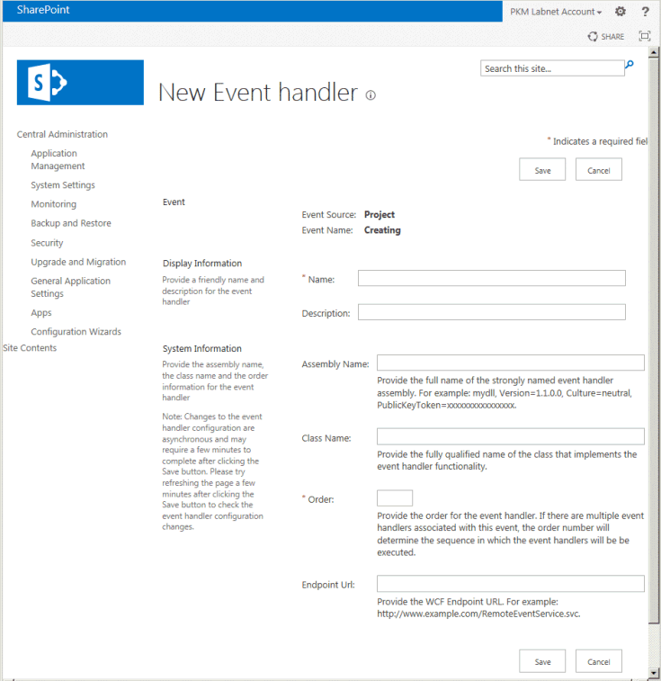

# <a name="updates-for-developers-in-project"></a>Actualizaciones para desarrolladores en Project

Las características de extensibilidad de Project Server 2013 funcionan con complementos para Project Online y con instalaciones locales. Las nuevas características incluyen un modelo de objetos del lado cliente (CSOM), interfaces REST, un servicio OData para la elaboración de informes, receptores de eventos remotos, flujos de trabajo declarativos y complementos de panel de tareas para clientes de Project. Además se ofrece información sobre características desusadas que no deberían emplearse en los nuevos desarrollos.
  
Project Server 2013 se basa en el marco introducido con Microsoft Office Project Server 2007 y ampliado por Project Server 2010. Project Server 2013 agrega un modelo de objetos de cliente (CSOM) que se refactoriza y simplifica desde Project Server Interface (PSI), e incluye una biblioteca de JavaScript y bibliotecas de .NET Framework 4 para aplicaciones de Windows, Windows Phone 8 y Microsoft Silverlight. El CSOM está diseñado para el desarrollo de Project Online y también funciona con una instalación local de Project Server. 

Las bases de datos de Project Server se combinan en una sola base de datos; puede obtener acceso a las tablas y vistas de informes en línea a través de un servicio OData. El CSOM y el servicio OData incluyen una interfaz de transferencia de estado representacional (REST). Los flujos de trabajo de Project Server se pueden crear con SharePoint Designer 2013. Project Professional 2013 se puede integrar con datos de informes de Project Server, listas de tareas de SharePoint y otro contenido externo mediante el modelo de extensibilidad de complementos de Office para paneles de tareas. Project Standard 2013 puede usar complementos de panel de tareas para integrarse con contenido externo general.
  
Para obtener diagramas y más información acerca de los cambios principales en Project Server 2013, vea Arquitectura de [Project Server 2013.](project-server-2013-architecture.md)
  
> [!NOTE]
> Project Server 2013 se basa en la plataforma de SharePoint Server 2013 y Project 2013 incluye gran parte de la misma infraestructura que las demás aplicaciones de Office 2013. Para obtener documentación sobre el modelo de complementos de SharePoint, flujos de trabajo basados en SharePoint, elementos web, desarrollo con otras características de SharePoint y documentación de complementos de Office, vea Complementos de [SharePoint,](https://docs.microsoft.com/sharepoint/dev/sp-add-ins/sharepoint-add-ins)Complementos de [Office](https://docs.microsoft.com/office/dev/add-ins/overview/office-add-ins)e información general sobre el desarrollo de [SharePoint 2013.](https://msdn.microsoft.com/library/jj164084%28office.15%29.aspx) 
  
## <a name="major-new-features-in-project-2013"></a>Principales características nuevas de Project 2013
<a name="pj15_WhatsNew_MajorNewFeatures"> </a>

Las nuevas características de Project Standard 2013 y Project Professional 2013 incluyen una interfaz de usuario mejorada que coincide con otras aplicaciones de Office 2013 y admite la interfaz de usuario de estilo moderno en Windows 8, la integración con objetos de Office Art para informes, informes de grabación y nuevas características de programación para informes. Project Professional 2013 permite compartir y sincronizar proyectos más amplios en SharePoint Server 2013, junto con los complementos de panel de tareas que también se implementan en otras aplicaciones de Office 2013 como Word, Excel y Outlook.
  
Hay muchas características nuevas en Project Server 2013. Algunos no tienen un artículo de programación importante, como la nueva escala de tiempo de Project Web App. Esas características se documentarán en la Ayuda del producto, en la documentación de usuario final de Microsoft Office Online y en temas dirigidos a administradores y profesionales de TI en Microsoft TechNet. Otras características nuevas, como los partes de horas mejorados, facilitan la interacción de desarrolladores ajenos con los partes de horas y el estado en Project Server Interface (PSI).
  
La adición de Project Online y la Tienda Office ( para complementos de Project son cambios de gran alcance, donde Project Server es accesible a través https://office.microsoft.com/store) de Microsoft Azure. El acceso basado en la nube a Project Server usa un modelo de objetos de cliente (CSOM) para el desarrollo de complementos con Microsoft .NET Framework, Microsoft Silverlight, Windows Phone y aplicaciones web que usan JavaScript. Un requisito de Project Online es que las cuatro bases de datos de Project Server de versiones anteriores se combinen en una base de datos.
  
El rendimiento y la escalabilidad de Project Server 2013 se ha mejorado en muchas áreas, como el estado de las tareas, los partes de horas y la administración de proyectos. Los flujos de trabajo de Project Server se han rediseñado con la versión 4 de Windows Workflow Foundation (WF4). El uso de .NET Framework 4 y Windows Communication Foundation (WCF) con PSI mejora la seguridad, el rendimiento y la escalabilidad. Por ejemplo, puede cambiar el protocolo de transporte de aplicaciones basadas en WCF usando archivos de configuración sin necesidad de modificar el código de la aplicación ni de volver a compilar. Project Web App almacena en caché muchas de las llamadas de PSI en las que los datos no cambian significativamente.
  
> [!NOTE]
> Para el desarrollo con Project Server 2013, puede usar Visual Studio con las extensiones de herramientas de Office y SharePoint, que pueden crear complementos de forma nativa para los productos de Office 2013. Project Server 2013 requiere Visual Studio para habilitar completamente el desarrollo de características como páginas de detalles del proyecto y aplicaciones basadas en WCF. Las extensiones de herramientas de SharePoint Visual Studio pueden implementar elementos web y otras características de SharePoint directamente en Project Web App y otros sitios de SharePoint. 
>
> Visual Studio para desarrollar flujos de trabajo de Project Server que usen campos personalizados, fases, fases y tipos de proyecto empresarial que se pueden administrar en Project Web App. Aunque puede usar Visual Studio para desarrollar flujos de trabajo, a menudo son más fáciles y rápidos de crear con SharePoint Designer. Se puede usar Visual Studio para los flujos de trabajo que necesitan acceso al CSOM u otras API externas. 
  
### <a name="project-add-ins"></a>Complementos de Project
<a name="pj15_WhatsNew_Apps"> </a>

El concepto de complemento ha revolucionado la distribución y la comercialización de software. Para Project 2013, los complementos pueden estar disponibles para su compra y descarga desde la Tienda Office pública o distribuirse dentro de un catálogo privado en SharePoint. Un complemento suele ser un programa independiente e interactivo que realiza un pequeño número de tareas relacionadas. Un complemento de Project puede ser un complemento de panel de tareas para los clientes de Project Standard 2013 o Project Standard 2013, o un complemento para Project Server 2013 o Project Online.
  
Para obtener información sobre complementos para los clientes de escritorio de Project, consulte [Complementos de panel de tareas para Project](#pj15_WhatsNew_Agave). Para obtener un ejemplo de Project Server 2013, vea Crear un complemento de Project Server hospedado [en SharePoint.](create-a-sharepoint-hosted-project-server-add-in.md) Además de los artículos del SDK de complementos de Office y [SharePoint,](https://msdn.microsoft.com/library/fp161507.aspx)el blog de [Office](https://blogs.office.com/dev/) tiene muchas entradas que también son relevantes para Project 2013 y Project Online. 
  
Un complemento para Project Server 2013 puede funcionar tanto con una instalación local como con Project Online. Los complementos de Project Server pueden incluir elementos web, receptores de eventos remotos y lógica empresarial. El acceso al modelo de objetos de Project Server en un complemento se realiza a través del CSOM, no de PSI. El almacenamiento de datos se puede basar en la nube, como con SQL Azure, externo como a través de Servicios de conectividad empresarial de Microsoft (BCS), interno con una base de datos local o mixto.
  
#### <a name="add-in-security"></a>Seguridad del complemento

En general, las acciones que realiza un complemento se realizan en nombre del usuario que ejecuta el complemento; no se usa explícitamente la suplantación ni se especifica quién puede ejecutar el complemento. Las acciones no pueden superar el nivel de permisos del usuario que ejecuta el complemento. 
  
En Office Developer Tools para Visual Studio 2012, el archivo AppManifext.xml tiene un editor gráfico donde puede establecer el ámbito de solicitud de permisos. Por ejemplo, para crear un complemento que permita a los jefes de proyecto actualizar sus proyectos, en la pestaña **Permisos** del panel de diseño de **AppManifest.xml**, seleccione **Varios proyectos** como ámbito y **Escribir** como permiso. Si el usuario del complemento tiene permisos de jefe de proyecto, puede ejecutar el complemento para los proyectos que gestione. El código del archivo AppManifest.xml incluiría lo siguiente: 
  
```XML
  <AppPermissionRequests>
    <AppPermissionRequest Scope="https://sharepoint/projectserver/projects" Right="Write" />
  </AppPermissionRequests>
```

**Tabla 1. Ámbitos de solicitud de permisos para complementos de Project Server**

|Ámbito|Permissions|
|:-----|:-----|
|**Project Server** <br/> |**Administrar** (exige permisos de administrador de Project Server).  <br/> |
|**Varios proyectos** <br/> |**Leer**, **Escribir** (exige permisos de jefe de proyecto para algunas operaciones; permisos de miembro de equipo de proyecto para operaciones de lectura básicas, como asignaciones de tareas).  <br/> |
|**Único proyecto** <br/> |**Leer**, **Escribir** (exige al menos permisos de miembro de equipo de proyecto; el acceso a algunos datos de un proyecto depende de otros niveles de permisos).  <br/> |
|**Recursos empresariales** <br/> |**Leer**, **Escribir** (exige permisos de jefe de recursos).  <br/> |
|**Statusing** <br/> |**SubmitStatus** (exige permiso para enviar el estado de los proyectos).  <br/> |
|**Informes** <br/> |**Leer** (exige permiso para iniciar sesión en Project Server).  <br/> |
|**Flujo de trabajo** <br/> |**Elevar** (exige permiso para ejecutar flujos de trabajo. El complemento se ejecuta con permisos elevados para permitir las transiciones de fase a fase en un flujo de trabajo. La lógica empresarial del complemento controla las transiciones de fase).<br/> |
   
> [!NOTE]
> Project Server 2013 y Project Online no usan el modelo de autenticación de solo aplicación en SharePoint 2013 (vea Tipos de directivas de autorización de complementos [en SharePoint 2013](https://msdn.microsoft.com/library/124879c7-a746-4c10-96a7-da76ad5327f0%28Office.15%29.aspx)). 
  
Para obtener información sobre cómo desarrollar, distribuir, hospedar y administrar complementos, vea Complementos de [SharePoint](https://docs.microsoft.com/sharepoint/dev/sp-add-ins/sharepoint-add-ins) y Complementos de [Office,](https://docs.microsoft.com/office/dev/add-ins/overview/office-add-ins)y temas relacionados en la documentación para desarrolladores de SharePoint Server 2013 y Office 2013. Para obtener información sobre el ámbito de solicitud de permisos para otros complementos de SharePoint, vea Permisos de [complementos en SharePoint 2013](https://msdn.microsoft.com/library/5f7a8440-3c09-4cf8-83ec-c236bfa2d6c4%28Office.15%29.aspx).
  
### <a name="integrating-with-sharepoint-server"></a>Integración con SharePoint Server
<a name="pj15_WhatsNew_IntegrationWSS"> </a>

Muchas características de Project Web App requieren la nueva infraestructura de SharePoint Server 2013, como OAuth y autenticación basada en notificaciones, autorización y permisos de Project Server a través de grupos de SharePoint, sincronización de proyectos con listas de tareas de SharePoint y flujos de trabajo declarativos de Project Server. La aplicación de servicio de Project se puede asociar a cualquier colección de sitios de una granja de SharePoint. La sincronización de proyectos puede realizarse con una lista de tareas de SharePoint, donde SharePoint mantiene el proyecto. Un proyecto empresarial también se puede sincronizar con una lista de tareas de SharePoint, donde Project Server mantiene el control total. Para obtener diagramas de arquitectura y una explicación de la sincronización de proyectos, vea Arquitectura de [Project Server 2013.](project-server-2013-architecture.md)
  
Hay muchas características nuevas en SharePoint Server 2013. Para obtener más información, [vea SharePoint para desarrolladores.](https://msdn.microsoft.com/sharepoint)
  
### <a name="integrating-with-workflows"></a>Integración con flujos de trabajo
<a name="pj15_WhatsNew_Workflow"> </a>

Los flujos de trabajo son una característica fundamental de la administración de la cartera de proyectos. El ciclo de vida de un proyecto puede incluir procesos a largo plazo que comprenden muchas fases. Las fases de gobernanza incluyen las propuestas, los análisis de impacto empresarial y la selección, creación, planeación, administración y el seguimiento de los proyectos.
  
Los flujos de trabajo de Project Server 2013 se construyen en la plataforma de flujo de trabajo de SharePoint 2013, que usa WF4. A diferencia de las versiones anteriores, los flujos de trabajo declarativos para Project Server 2013 se pueden crear con SharePoint Designer 2013 y son accesibles para uso local y en línea. Los flujos de trabajo de Project Server usan el modelo de seguridad de flujo de trabajo de SharePoint con OAuth y se pueden instalar en un sitio de Project Web App. La figura 1 muestra que SharePoint Designer 2013 puede agregar etapas a un flujo de trabajo de sitio para administración de demandas, donde las etapas se definen en Project Web App.
  
**Ilustración 1. Uso de SharePoint Designer para agregar una fase a un flujo de trabajo de Project Web App**


<br/>

Para crear un flujo de trabajo declarativo, agregue etapas de flujo de trabajo, acciones, condiciones y otros elementos en una herramienta de diseño, que puede ser SharePoint Designer 2013 o Visual Studio 2012. Luego la herramienta de diseño guarda el flujo de trabajo como código XAML, que se interpreta en tiempo de ejecución. Los flujos de trabajo declarativos se pueden ejecutar en Project Server 2013 local o en Project Online. Al usar Visual Studio 2012, también puede crear acciones y formularios personalizados para un control adicional y guardar plantillas de flujo de trabajo para reutilizarlas con varias instancias de Project Web App. SharePoint Designer 2013 puede consumir acciones personalizadas creadas en Visual Studio 2012.
  
Un flujo de trabajo de Project Server 2013 actúa como una aplicación, donde un administrador,que tiene permisos de diseño para Project Web App, puede publicar un flujo de trabajo declarativo y asociarlo con un tipo de proyecto empresarial (EPT). El EPT debe ser para un proyecto empresarial, donde Project Server mantiene control total. Una lista de tareas de SharePoint no puede usar un flujo de trabajo de Project Server. 
  
OAuth permite a aquellos jefes de proyecto con permisos de creación de proyectos invocar el flujo de trabajo sin usar suplantación. Las llamadas de flujo de trabajo a Project Server, por ejemplo para leer el valor de un campo personalizado y decidir qué bifurcación seguir, se realizan en nombre del jefe de proyecto. Para evitar que este cree un flujo de trabajo que avance automáticamente a la siguiente fase, la llamada para pasar a la siguiente fase del flujo de trabajo se ejecuta como el autor del flujo de trabajo (el administrador). Por el contrario, los usuarios de flujos de trabajo heredados de Project Server 2010 hacen llamadas suplantadas a través de la cuenta de usuario proxy de flujo de trabajo para obtener acceso de administrador en todo el flujo de trabajo.
  
Aunque Project Server 2013 local puede usar flujos de trabajo compilados basados en WF3.5, se recomienda actualizar los flujos de trabajo heredados a flujos de trabajo declarativos basados en WF4. La nueva tecnología es más escalable y robusta. Los analistas de negocios y el personal de PMO pueden crear o actualizar diseños de flujo de trabajo con Visio 2013 e implementar flujos de trabajo de Project Server sin codificar mediante SharePoint Designer 2013.
  
Para obtener información acerca de cómo crear un flujo de trabajo declarativo para Project Web App, vea Introducción al desarrollo de flujos de [trabajo de Project Server](getting-started-developing-project-server-workflows.md). Para ver una comparación de las capacidades de SharePoint Designer Visual Studio para flujos de trabajo, vea Desarrollar flujos de trabajo de [SharePoint 2013](https://msdn.microsoft.com/library/office/jj163199.aspx)con Visual Studio .
  
### <a name="client-side-object-model"></a>Modelo de objetos del lado cliente
<a name="pj15_WhatsNew_CSOM"> </a>

El acceso mediante programación a Project Online requiere un CSOM que se basa en el CSOM de SharePoint. La autenticación de Project Online se realizará con OAuth mediante una Windows Live ID, no la autenticación de Formularios de Project Server o la autenticación de Windows.
  
A continuación se incluyen los principios y características del CSOM en Project Server 2013:
  
- El CSOM está diseñado para ofrecer facilidad de uso. Por ejemplo, los métodos y propiedades usan o proporcionan datos directamente por nombre, en lugar de requerir muchos GUID, parámetros  _changeXml_ o pasar conjuntos de datos. 
    
- El CSOM de Project Server implementa un subconjunto de la funcionalidad de PSI basado en los requisitos más comunes de las soluciones de terceros.
    
- El CSOM llama internamente a PSI, pero se factoriza de forma distinta. Por ejemplo, las actualizaciones de todos los cambios de estado se realizan con el método **StatusAssignmentCollection.SubmitAllStatusUpdates**, no con el método de PSI **Statusing.SubmitStatus** del usuario ni el método **SubmitStatusForResource** de otros recursos. 
    
- El CSOM es accesible a través de un servicio WCF (Client.svc) en lugar de a través de los 22 servicios públicos de PSI.
    
- La inicialización del CSOM de Project Server se realiza directamente a través de la clase [ProjectContext](https://msdn.microsoft.com/library/Microsoft.ProjectServer.Client.ProjectContext.aspx) con la dirección URL de Project Web App, no mediante una referencia WCF o un ensamblado proxy. 
    
- El CSOM implementa varias bibliotecas de cliente e interfaces, que son compatibles con la infraestructura interna del CSOM de SharePoint. Las bibliotecas de cliente e interfaces son las siguientes:
    
  - Biblioteca de cliente de Microsoft .NET del ensamblado Microsoft.ProjectServer.Client.dll
    
  - Biblioteca de Silverlight en el ensamblado Microsoft.ProjectServer.Client.Silverlight.dll cliente
    
  - Biblioteca de Windows Phone 8 del ensamblado Microsoft.ProjectServer.Client.Phone.dll
    
  - Biblioteca de JavaScript para aplicaciones web en el PS.js archivo o PS.debug.js archivo
    
  - Extremos REST, para el acceso con el protocolo OData
    
  - Compatibilidad nativa con consultas LINQ con filtrado para limitar la cantidad de datos devueltos
    
- El CSOM se puede usar tanto para soluciones de Project Online como para soluciones locales, independientemente de psi y otros ensamblados de Project Server, como Microsoft.Office.Project.Server.Library.dll.
    
- Se puede considerar la funcionalidad adicional del CSOM de Project Server 2013 para actualizaciones acumulativas y Service Pack, en función de las solicitudes de los asociados de Project Server y la comunidad de desarrolladores.
    
> [!NOTE]
> El CSOM es la interfaz preferida por los desarrolladores ajenos de Project Server. Le recomendamos que use el CSOM para desarrollar nuevas aplicaciones, si es que incluye las características que la aplicación necesita. 
  
Para obtener información sobre el desarrollo con el CSOM, vea Modelo de objetos del lado cliente [(CSOM) para Project 2013](client-side-object-model-csom-for-project-2013.md). Para obtener información sobre la interfaz REST en aplicaciones de SharePoint, vea Programación con el servicio REST de  *SharePoint*  en la documentación para desarrolladores de SharePoint 2013. 
  
### <a name="changes-in-the-reporting-database"></a>Cambios en la base de datos de informes
<a name="pj15_WhatsNew_RDBChanges"> </a>

Las cuatro bases de datos de Project Server 2010 se combinan en una sola base de datos de Project en Project Server 2013. El nombre predeterminado de la base de datos de Project es ProjectService. Las tablas y vistas de informes conservan sus nombres anteriores, y las tablas y vistas de las bases de datos Borrador, Publicado y Archivo tienen los prefijos y en la base de datos  `draft`  `pub`  `ver` ProjectService. Por ejemplo, la tabla de proyectos publicados es pub.MSP_PROJECTS. 
  
> [!IMPORTANT]
> El acceso directo no es compatible con las tablas y vistas borrador ( `draft` prefijo), publicadas ( ) y de archivo `pub` ( `ver` ). Los informes solo deben usar las tablas y vistas de informes, que tienen el `dbo` prefijo. Por ejemplo, el dbo. MSP_EpmProject tabla incluye la lista de proyectos en la instancia de Project Web App. 
>
> No hay nada que le impida usar el acceso directo mediante programación a la base de datos para actualizar datos en cualquiera de las tablas y vistas de la base de datos de Project. Debería tener en cuenta que la caché de Project Professional, las tablas de datos de borrador y publicados y las tablas de informes se basan en un protocolo de sincronización de la caché que se puede alterar por la edición directa de datos. Si daña las bases de datos de Project Server o las cachés del lado cliente de Project Professional usando el acceso directo para cambiar datos, no obtendrá ayuda alguna del servicio de soporte del producto. 
  
Project Server 2013 presenta un servicio OData para el acceso local y en línea. Las tablas y vistas de informes en línea solo se exponen mediante la interfaz OData; para uso local, puede usar la interfaz OData o tener acceso directamente a las tablas y vistas de informes de la base de datos ProjectService en la granja de servidores de SharePoint. Project Online no admite una base de datos multiusos. Es decir, varias instancias de Project Web App tienen su propia base de datos de Project. El servicio OData ejecuta internamente SQL consultas en las tablas y vistas de informes, y proporciona una carga XML o JSON. Para obtener una introducción al servicio OData para informes en Project Server 2013 y para la referencia del esquema **ProjectData,** vea ProjectData - Project [OData service reference](https://msdn.microsoft.com/library/office/jj163015.aspx).
  
Para obtener información general acerca de las consultas de OData, vea [OData: convenciones de URI.](https://www.odata.org/documentation/) Por ejemplo, puede ver todos los proyectos en una instancia local de Project Web App donde el nombre del proyecto comienza con "Prueba" mediante la siguiente consulta en un explorador. Haga clic con el botón derecho en la página del explorador y luego haga clic en **Ver código fuente**.
  
```html
https://ServerName /ProjectServerName /_api/ProjectData/Projects?$filter=startswith(ProjectName, 'Test') eq true
```

Para importar datos del proyecto PowerPivot en Excel 2013, en la cinta de  opciones DE DATOS, seleccione Desde fuente de datos **de OData** en el menú desplegable De otras fuentes. En el **cuadro de diálogo** Asistente para la conexión de datos, escriba la ubicación de la fuente de datos, elija Siguiente y, a continuación, seleccione la tabla Proyectos en la página Seleccionar tablas del https://ServerName/ProjectServerName/_api/ProjectData/ asistente.    Ponga nombre al archivo .odc, guárdelo y luego seleccione **Finalizar**. En el cuadro de diálogo **Importar datos**, seleccione **Informe de tabla dinámica**. En la hoja de cálculo de Excel, seleccione los campos para las filas y columnas de tabla dinámica que desea mostrar.
  
Los usuarios locales de Project Server, que tienen los permisos correctos, pueden obtener acceso directamente a las tablas y vistas de informes a través de Microsoft SQL Server para crear informes, como lo hacen en Project Server 2010. En Project Server 2013, los usuarios también pueden tener acceso a las tablas de informes locales a través de la interfaz OData. Puede recuperar datos de Project Server en línea o locales a través de extremos REST para el servicio OData. Por ejemplo, la tabla dbo.MSP_PROJECT y la vista dbo.MSP_EpmProject_UserView se pueden usar para los informes. Las tablas o vistas que tienen un prefijo o una , son solo para uso interno de Project Server y no son para uso  `draft`  `pub` de  `ver` informes. Por ejemplo, la tabla draft.MSP_TASKS y la vista pub.MSP_PROJECTS_WORKING_VIEW no están documentadas y son exclusivamente para uso interno. 
  
> [!NOTE]
> Puede ampliar los informes locales agregando tablas, vistas, campos y procedimientos almacenados en una base de datos independiente. No debería modificar las tablas y vistas de informes existentes en la base de datos de Project Server. 
  
Las tablas, vistas y campos de informes de la base de datos de Project se documentarán en un archivo de Ayuda HTML en una actualización posterior de la descarga del SDK de Project 2013. Para obtener documentación sobre el esquema XML de OData para el **servicio ProjectData,** vea [ProjectData - Project OData service reference](https://msdn.microsoft.com/library/office/jj163015.aspx). Las consultas de las tablas y vistas de informes que se crearon para Project Server 2010 funcionarán, en la mayoría de los casos, con la base de datos de Project en Project Server 2013. Los usuarios locales pueden obtener acceso a los cubos OLAP de Project Server de SQL Server Analysis Services, como hacen ahora. En Project Online, los cubos OLAP no están disponibles.
  
### <a name="task-pane-add-ins-in-project"></a>Complementos de panel de tareas de Project
<a name="pj15_WhatsNew_Agave"> </a>

Tanto Project Standard 2013 como Project Professional 2013 admiten complementos de panel de tareas, que se pueden usar para integrar y mostrar contenido externo en una página web. El panel de tareas muestra el contenido de una página web que tiene acceso a través de JavaScript a tareas, recursos, vistas y datos generales del proyecto. El modelo de objetos de JavaScript para Project puede obtener información sobre una tarea o recurso seleccionado y obtener datos en una celda seleccionada de la cuadrícula para vistas como el diagrama de Gantt. Los complementos de panel de tareas de Project también pueden implementar controladores de eventos para eventos modificados mediante selección de tarea, recurso o vista. 
  
La ilustración 2 muestra el complemento de panel de tareas **Hello ProjectData** que consulta al servicio **ProjectData** y luego compara los datos del proyecto actual con las medias de todos los proyectos. La descarga del SDK de Project 2013 incluye el código fuente completo del complemento. 
  
**Ilustración 2. Un complemento de panel de tareas de Project Professional puede obtener acceso a datos de Project Server**


  
> [!NOTE]
> Project Standard 2013 no se puede integrar directamente con Project Server 2013 a través de complementos de panel de tareas. 
  
Los complementos de panel de tareas de Project Professional admiten elementos web creados para Project Server 2013, por lo que los desarrolladores pueden crear una extensión una vez que se ejecute con Project Web App y Project Professional. Los complementos generales del panel de tareas desarrollados para otros productos de Office 2013 también se pueden usar con Project Standard 2013 y Project Professional 2013. Para obtener más información, consulte [Task pane add-ins for Project](task-pane-add-ins-for-project.md).
  
### <a name="project-server-event-receivers"></a>Receptores de eventos de Project Server
<a name="pj15_WhatsNew_Events"> </a>

Puede haber varios servidores de Project Web App (también denominados servidores front-end web o WFE) en una granja de servidores de SharePoint que incluya la aplicación de servicio de Project back-end. Los receptores de eventos también se pueden llamar controladores de eventos. Los controladores de eventos locales se pueden implementar con código de plena confianza en todos los WFE de una instalación local de Project Server. Los receptores de eventos remotos se pueden implementar en servicios web de servidores locales o remotos y ofrecen acceso a varios WFE y varias instalaciones de Project Server. Project Online solo puede usar receptores de eventos remotos.
  
SharePoint administra los controladores de eventos de Project Server para cada instancia de Project Web App, en lugar de hacerlo mediante una página específica de configuración de Project Web App. En la aplicación Administración central de SharePoint, elija Configuración de aplicación **general,** elija Administrar en Configuración de **PWA** y, a continuación, elija la instancia en la lista desplegable Instancia de **Project Web App** en la página Configuración de PWA.  Para agregar un controlador de eventos locales o un receptor de eventos remotos, seleccione **Controladores de eventos del servidor**.
  
Para una instalación local de Project Server, puede crear un receptor de eventos remotos como una característica de SharePoint que usa la clase [Microsoft.ProjectServer.Client.EventHandlerCreationInformation](https://msdn.microsoft.com/library/Microsoft.ProjectServer.Client.EventHandlerCreationInformation.aspx) en el CSOM y, a continuación, administrar mediante programación el receptor de eventos mediante métodos de la clase [EventHandlerCollection.](https://msdn.microsoft.com/library/Microsoft.ProjectServer.Client.EventHandlerCollection.aspx) Para los receptores de eventos remotos, los eventos previos son sincrónicos, los eventos posteriores son asincrónicos y hay un tiempo de espera para los casos en los que el receptor de eventos remotos no devuelve. 
  
> [!NOTE]
> Administración central de SharePoint solo está disponible para instalaciones locales. Para Project Online y SharePoint Online, puede agregar o quitar receptores de eventos remotos mediante un paquete de aplicación basado en CSOM. 
  
En la página Controladores de eventos del lado servidor, el proceso para agregar un controlador de eventos local para una instalación local de Project Server es casi el mismo que el proceso descrito en el tema Crear un controlador de eventos de [Project Server](https://msdn.microsoft.com/library/gg615466.aspx) y registrar un tema de eventos para Project Server 2010. La diferencia es que la página Nuevo controlador de eventos tiene opciones adicionales. Por ejemplo, elija **Crear proyecto en** la lista eventos y, a continuación, elija NUEVO CONTROLADOR DE **EVENTOS**.  En la página Nuevo controlador de eventos, los dos únicos campos obligatorios son **Nombre** y **Orden** (vea la figura 3). Si va a agregar un controlador de  eventos de plena confianza local, agregue el campo Nombre de ensamblado y el campo **Nombre de** clase; deje **la dirección URL del extremo** vacía. Si va a agregar un receptor de eventos remotos, agregue la dirección **URL** del extremo y **deje** vacíos el nombre del ensamblado y el nombre **de** clase. 
  
> [!CAUTION]
> Si especifica tanto el  *nombre*  del ensamblado como el nombre de clase y la dirección URL del extremo, Project Server solo llama al controlador de eventos local. El receptor de eventos remotos se omite. 
> 
> Si crea dos controladores de eventos para el mismo evento, donde uno es local y el otro remoto, y el valor **Orden** es igual para ambos, Project Server omite el receptor de eventos remotos. 
  
**Ilustración 3. Adición de un controlador de eventos locales o un receptor de eventos remotos**


    
Si necesita obtener acceso a los conjuntos de datos de PSI para un controlador de eventos local, puede copiar el ensamblado Microsoft.Office.Project.Schema.dll desde el directorio [Windows]\Microsoft.NET\assembly\GAC \_ MSIL\Microsoft.Office.Project.Schema\v4.0_15.0.0.0__71e9bce111e9429c. 

En lugar de PSI, se recomienda usar las clases de eventos en el espacio de nombres **Microsoft.ProjectServer.Client;** el desarrollo con el CSOM no requiere la manipulación de conjuntos de datos. Para desarrollar receptores de eventos remotos para Project Online, debe usar la clase [Event](https://msdn.microsoft.com/library/Microsoft.ProjectServer.Client.Event.aspx) y la clase [EventHandlerCreationInformation](https://msdn.microsoft.com/library/Microsoft.ProjectServer.Client.EventHandlerCreationInformation.aspx) en el CSOM. 
  
Antes de implementar un controlador de eventos de Project Server, instálelo y pruébelo exhaustivamente en una instalación de prueba de Project Server. Para una instalación local de Project Server, si el controlador de eventos local que agrega pasa a estar inoperativo, el servicio de eventos de Project Server 2013 no puede cargar los demás controladores de eventos personalizados válidos. En ese caso, tiene que quitar el controlador de eventos problemático y reiniciar Events Service.
  
> [!NOTE]
> En una instalación local de Project Server, le recomendamos que migre a receptores de eventos remotos usando el CSOM para desarrollar receptores de eventos. Dado que los receptores de eventos remotos no tienen código de terceros en ejecución en Project Server Events Service, son más estables. Los administradores locales se olvidan de la responsabilidad de mantener Project Server Events Service. 
  
Para obtener información general acerca de los eventos, vea [Control de eventos en aplicaciones para SharePoint.](https://msdn.microsoft.com/library/jj220048%28office.15%29.aspx) 
  
## <a name="deprecated-features"></a>Características desusadas
<a name="pj15_WhatsNew_Deprecated"> </a>

> [!NOTE]
> Para obtener información acerca de las características y API que están en desuso o se quitaron en Project Server 2016 Preview, vea ¿Qué está en desuso o qué se ha quitado en [Project Server 2016 Preview?](https://docs.microsoft.com/project/what-s-deprecated-or-removed-in-project-server-2016) 
  
Las características en desuso siguen estando disponibles en Project 2013 para algunas soluciones, pero no deben usarse para el desarrollo nuevo. La mayoría de las siguientes características y prácticas no funcionan con Project Online o con la instalación local predeterminada de Project Server 2013 en modo de permisos de SharePoint. Es posible que las soluciones existentes que usan estas características no funcionen para una actualización de Project Server 2010 a Project Server 2013. Aunque las soluciones que usan características en desuso pueden seguir funcionando en algunos casos, no son totalmente compatibles con todas las instalaciones de Project 2013.
  
Si sus soluciones usan características desusadas, deberían probarse exhaustivamente antes de la implementación y deberían modificarse para emplear características compatibles en cuanto sea práctico. Para obtener información sobre cómo configurar la seguridad local de Project Server 2013 para el modo de permisos de Project, vea la sección Modo de permisos de *SharePoint* en Novedades para profesionales de TI en [Project Server 2013.](https://docs.microsoft.com/project/what-s-new-for-it-pros-in-project-server-2016)
  
- **Los escenarios** de extensión de PSI de extensiones están en [desuso](https://docs.microsoft.com/previous-versions/office/developer/office-2010/ff843378(v=office.14)) y no se admiten en futuras versiones. Estos escenarios locales de Project Server 2013 habilitan la integración mediante servicios personalizados de Windows Communication Foundation (WCF). 
  
- **PSI del proyecto** La [clase Project](https://docs.microsoft.com/office/client-developer/project/project-psi-reference-overview) de PSI está en desuso. Para todos los nuevos desarrollos, usar [Proyecto CSOM](client-side-object-model-csom-for-project-2013.md). Project Server 2013 apps that use the Project PSI will continue to work, but Project Online apps will need to replace any Project-class PSI methods with their equivalent CSOM methods.
  
- **PSI del plan de recursos** Psi [del plan de recursos](https://docs.microsoft.com/previous-versions/office/project-class/gg240019(v=office.15)) está en desuso. Seguirá siendo compatible con el desarrollo de Project 2013, pero no será compatible con versiones futuras. 
  
- **Interfaz ASMX para psi** Psi incluye interfaces duplicadas para desarrollar extensiones locales de Project Server. La interfaz de servicios web ASMX se introdujo con la primera implementación de PSI en Office Project Server 2007. Project Server 2010 agregó la interfaz de servicios WCF, donde el modelo de objetos básicamente duplica los servicios web ASMX. Aunque Project Server 2013 sigue siendo compatible con ASMX y WCF, las nuevas soluciones que requieren psi deben usar los servicios WCF. Si fuera posible, las nuevas soluciones se deberían escribir con el CSOM. 
  
  Los servicios web ASMX de PSI están en desuso en Project Server 2013. Para trabajar en futuras versiones de Project Server, aquellas soluciones que usen los servicios web ASMX tienen que reescribirse para que utilicen los servicios WCF o el CSOM. Para obtener más información, vea la sección *Actualización de aplicaciones con las API* de Project Server en [Programación de Project Server.](project-server-programmability.md)
  
- **Proveedor de vínculos de objeto (OLP)** En versiones anteriores de Project Server, el servicio **ObjectLinkProvider** en psi (vea [WebSvcObjectLinkProvider](https://docs.microsoft.com/previous-versions/office/ms481347(v=office.14)) proporciona una forma de administrar vínculos a objetos web entre tareas de proyecto empresarial y listas especializadas de SharePoint en el sitio del proyecto para problemas, riesgos, entregas y documentos. En Project Server 2013, la OLP está en desuso. 
  
  Puede usar la clase **[RelatedItemManager](https://docs.microsoft.com/previous-versions/office/sharepoint-server/jj168020(v=office.15))** en el CSOM de SharePoint para crear, leer y eliminar vínculos de objetos web entre los elementos de la lista de tareas y las otras listas de un sitio de proyecto. Por ejemplo, para agregar un vínculo de un elemento de tarea a un problema, puede usar el método **[AddSingleLink](https://docs.microsoft.com/previous-versions/office/sharepoint-server/jj166451(v=office.15))** o cualquiera de dos métodos similares, **AddSingleLinkFromUrl** o **AddSingleLinkToUrl**. La clase **RelatedItemManager** además incluye métodos para eliminar un vínculo a objetos web y para leer elementos relacionados. Para obtener la clase equivalente en JSOM (el modelo de objetos de JavaScript), vea [SP. RelatedItemManager (objeto, sp.js)](https://docs.microsoft.com/previous-versions/office/sharepoint-visio/jj838582(v=office.15)).
  
  Se recomienda usar el CSOM de SharePoint para crear aplicaciones de tipo OLP para una instalación local de Project Server 2013 y para Project Online. El [espacio de nombres Microsoft.SharePoint](https://docs.microsoft.com/previous-versions/office/sharepoint-server/ms464984(v=office.15)) no incluye una clase **RelatedItemManager** **** . 
  
- **Permisos personalizados** En Office Project Server 2007 se admiten permisos de seguridad personalizados para tener acceso a determinadas características o extensiones de Project Server, donde un artículo del SDK explica cómo crearlas modificando directamente la base de datos publicada. En Project Server 2010, los permisos personalizados siguen funcionando, pero están en desuso. En Project Server 2013, los permisos personalizados no funcionan con el modo de permisos predeterminado de SharePoint para instalaciones locales. En el modo de permisos de Project, los permisos personalizados son compatibles. Con Project Online, el acceso directo a la base de datos no es posible. 
  
- **Suplantación** La suplantación en aplicaciones basadas en PSI, donde el usuario de una aplicación puede asumir los permisos de seguridad de otro usuario de Project Server, está en desuso en Project Server 2013. Como se indicó anteriormente, una instalación local predeterminada de Project Server 2013 usa el modo de permisos de SharePoint, que no permite la suplantación en los grupos de seguridad de Project Server. Para obtener más información, vea [Autenticación, autorización y seguridad en SharePoint 2013.](https://docs.microsoft.com/sharepoint/dev/general-development/authentication-authorization-and-security-in-sharepoint)
  
  Las aplicaciones de estado son extensiones típicas que quizás usaban la suplantación en versiones anteriores de Project Server. Project Server 2010 introdujo el método **ReadStatusForResource** y el método **SubmitStatusForResource** en psi, junto con el permiso global **StatusBrokerPermission,** que eliminó la necesidad de suplantación para leer y actualizar el estado en nombre de otro usuario. El CSOM de Project Server 2013 usa la PSI subyacente para habilitar de forma transparente las extensiones de estado y se puede usar para Project Online o instalaciones locales. 
  
- **Extensiones de base de datos de informes** Agregar tablas y vistas personalizadas a la base de datos de informes es un procedimiento habitual con versiones anteriores de Project Server. Dado que Project Server 2013 combina las cuatro bases de datos de versiones anteriores en una base de datos, las actualizaciones no transfieren tablas, vistas ni SPROCs personalizados a las tablas de informes de la base de datos de Project Server 2013. 
  
  Se recomienda usar una base de SQL Azure o una base de datos de SQL Server independiente para tablas y vistas de informes personalizadas, donde puede administrar copias de seguridad y actualizaciones de bases de datos. Para Project Online, esto es obligatorio.
  
- **Informes** Las tablas y vistas de informes locales de la base  de datos de Project Server y los cubos OLAP no están en desuso y siguen siendo totalmente compatibles. Sin embargo, las tablas y vistas de informes (la base de datos de informes en versiones anteriores de Project Server) no son accesibles en Project Online. De forma similar, los cubos OLAP solo están disponibles con instalaciones locales de Project Server 2013. Para las aplicaciones de informes con Project Online, puede usar el **servicio ProjectData,** a través de consultas REST con el protocolo OData. 
  
- **Guía de proyectos** La Guía de proyectos es una característica estándar de las aplicaciones de escritorio de Office Project 2007, donde el contenido HTML y JavaScript en un panel de tareas proporciona instrucciones interactivas para crear y administrar proyectos. En Project 2010, la Guía de proyectos no está disponible en una instalación predeterminada, pero se puede habilitar a través de VBA o un complemento VSTO. La descarga del SDK de Project 2010 incluye los archivos modificados de la Guía de proyectos. 
  
  El modelo de objetos de VBA y el modelo de objetos **Microsoft.Office.Interop.MSProject** en Project 2013 aún incluyen los 22 miembros de la clase **Application** y la clase **Project** que pueden administrar la Guía de proyectos. Sin embargo, las aplicaciones del panel de tareas de Project 2013 pueden estar en conflicto con acciones en un panel de tareas de la Guía de proyectos y el contenido de la Guía de proyectos no se puede distribuir ni vender fácilmente en la Tienda Office. Le recomendamos encarecidamente que desarrolle soluciones de panel de tareas de Project con complementos de Office, no con contenido personalizado de la Guía de proyectos. Para obtener más información acerca de la Guía de proyectos, vea la documentación del SDK de [Project 2010.](https://msdn.microsoft.com/library/ms512767.aspx)
  
## <a name="comparing-project-server-on-premises-with-project-online"></a>Comparación de Project Server local con Project Online
<a name="pj15_WhatsNew_Comparing"> </a>

Para ayudarle a decidir si va a usar Project Server local o Project Online, y qué tipos de extensiones puede desarrollar en cualquier caso, la tabla 2 compara las características extensibles de una instalación local de Project Server 2013 con Project Online. En la tabla 2 no se incluyen las diferencias de implementación, administración ni uso. Para obtener más información acerca de Project Online y Project Server 2013, vea [Project 2013 para](https://developer.microsoft.com/project/docs) desarrolladores y [Project Online.](https://developer.microsoft.com/project)
  
**Tabla 2. Extensibilidad de Project Server local y Project Online**

| Característica |Project Server local | Project Online |
|:-----|:-----|:-----|
|**Programación** <br/> |Aplicaciones basadas en el CSOM; modelo de programación coherente  <br/>- Bibliotecas cliente de .NET, Silverlight y Windows Phone  <br/>- Biblioteca de JavaScript para páginas personalizadas, elementos web y extensiones de cinta de opciones  <br/>- Protocolos OData y REST<br/><br/> Aplicaciones basadas en PSI; modelo de programación complejo, también puede crear aplicaciones para administración, análisis de cartera, notificaciones, seguridad de modo de Project, sistema de cola y otras áreas<br/><br/>Extensiones de PSI  <br/><br/>Permisos personalizados con la seguridad de modo de Project (desusado)  <br/><br/>Suplantación con la interfaz PSI (desusada)  <br/><br/>Código de plena confianza; extensiones de instalación en la granja de SharePoint  <br/> |Aplicaciones basadas en el CSOM; modelo de programación coherente  <br/>- Bibliotecas cliente de .NET, Silverlight y Windows Phone<br/>- Biblioteca de JavaScript para páginas personalizadas, elementos web y extensiones de cinta de opciones<br/>- Protocolos OData y REST<br/><br/>Puede usar la interfaz PSI, pero no es compatible: sin OAuth ni conexiones de servicio a servicio<br/><br/>Sin extensiones de la API del CSOM<br/><br/>Sin permisos personalizados<br/><br/>Sin suplantación<br/><br/>Sin código de plena confianza  <br/> |
|**Bases de datos personalizadas** <br/> |- SQL Azure  <br/>- SQL Server (no se admite la modificación de tablas y vistas de informes en la base de datos de Project Server)  <br/> |- SQL Azure  <br/>- SQL Server (no se admite la modificación de tablas y vistas de informes en la base de datos de Project Server)  <br/> |
|**Informes** <br/> |- **Servicio ProjectData;** Protocolos OData y REST  <br/>- Tablas y vistas de informes en la base de datos de Project Server<br/>- Base de datos OLAP  <br/> |- **Servicio ProjectData;** Protocolos OData y REST  <br/> |
|**Controladores de eventos** <br/> |- Receptores de eventos remotos, accesibles a través de extremos WCF<br/>- Controladores de eventos de plena confianza, instalados en la granja de servidores de SharePoint  <br/> | - Receptores de eventos remotos, accesibles a través de extremos WCF  <br/> |
|**Flujos de trabajo** <br/> |Flujos de trabajo declarativos, creados con SharePoint Designer 2013<br/>- Usar solo en una instancia específica de Project Web App<br/>- Puede importar un diseño de flujo de trabajo desde Visio 2013<br/>- Puede importar y usar acciones personalizadas<br/><br/> Flujos de trabajo declarativos, creados con Visual Studio 2012<br/>- Crear una aplicación que pueda incluir flujos de trabajo<br/>- Crear un paquete de solución de SharePoint (.wsp) que pueda incluir flujos de trabajo<br/>- Crear plantillas de flujo de trabajo para su reutilización<br/>- Crear y usar acciones personalizadas  <br/><br/>Puede usar flujos de trabajo compilados heredados, creados con WF3.5 (actualización recomendada a flujo de trabajo declarativo WF4)  <br/> |Flujos de trabajo declarativos, creados con SharePoint Designer 2013<br/>- Usar solo en una instancia específica de Project Web App<br/>- Puede importar un diseño de flujo de trabajo desde Visio 2013<br/>- Puede importar y usar acciones personalizadas  <br/><br/>Flujos de trabajo declarativos, creados con Visual Studio 2012<br/>- Crear una aplicación que pueda incluir flujos de trabajo  <br/>- Crear un paquete de solución de SharePoint (.wsp) que pueda incluir flujos de trabajo<br/>- Crear plantillas de flujo de trabajo para su reutilización <br/>- Crear y usar acciones personalizadas  <br/> |
|**Distribución** <br/> |- Tienda Office (para aplicaciones basadas en CSOM)<br/>- Catálogo de aplicaciones privado en SharePoint<br/>- Recurso compartido de archivos de intranet  <br/> |- Tienda Office<br/>- Catálogo de aplicaciones privado en SharePoint  <br/> |

   
## <a name="conclusion"></a>Conclusión
<a name="pj15_WhatsNew_Conclusion"> </a>

Project Server 2013 proporciona una gran cantidad de nuevas capacidades y escenarios de desarrollo que los partners y clientes pueden usar para adaptar y ampliar las capacidades y la utilidad de Project Server en grandes empresas y en organizaciones pequeñas. Puede usar la infraestructura de Office 2013 y SharePoint 2013 para ayudar a crear y distribuir aplicaciones para Project 2013 que pueden ampliar en gran medida la comercialización y el uso de aplicaciones personalizadas. Algunas características y prácticas de extensibilidad de versiones anteriores están en desuso en Project 2013, especialmente los servicios web ASMX de PSI y las características que implican suplantación o cambios directos en la base de datos, que no se pueden usar con Project Online.
  
La introducción del CSOM permite el acceso mediante programación a Project Online para una amplia variedad de dispositivos y el uso de JavaScript en aplicaciones web. El CSOM proporciona un modelo de programación más coherente en comparación con psi. Se puede tener acceso a los datos de Project Server de muchas otras maneras que en versiones anteriores, incluidos el servicio OData en línea y los extremos REST para los datos de informes en la base de datos de Project. Los informes existentes siguen funcionando de la misma manera para el uso local; los nuevos informes tienen más flexibilidad.
  
Los complementos de Office ofrecen una nueva vía para vender soluciones e integrar Project Standard 2013 con contenido web y otros productos de Office 2013. También puede crear nuevas formas de integrar Project Professional 2013 con datos de Project Server y listas de SharePoint a través de complementos de Office de panel de tareas.
  
Para obtener más información sobre el desarrollo de aplicaciones y el uso de las características de programación y el CSOM de SharePoint Server 2013, vea [SharePoint](https://docs.microsoft.com/sharepoint/dev/) para desarrolladores y [Office para desarrolladores.](https://developer.microsoft.com/office/docs)
  
## <a name="see-also"></a>Vea también

- [Arquitectura de Project Server 2013](project-server-2013-architecture.md)  
- [Tareas de programación de Project](project-programming-tasks.md) 
- [Modelo de objeto del cliente (CSOM) para Project 2013](client-side-object-model-csom-for-project-2013.md) 
- [ProjectData: referencia del servicio OData de Project](https://msdn.microsoft.com/library/office/jj163015.aspx)  
- [Complementos de panel de tareas para Project](task-pane-add-ins-for-project.md)   
- [OData: convenciones de URI](https://www.odata.org/documentation/uri-conventions#FilterSystemQueryOption)    
- [SharePoint para desarrolladores](https://msdn.microsoft.com/sharepoint)    
- [Office para desarrolladores](https://msdn.microsoft.com/office)   
- [Controlar eventos en aplicaciones para SharePoint](https://msdn.microsoft.com/library/jj220048%28office.15%29.aspx)   
- [AppSource](https://appsource.microsoft.com/marketplace/apps?product=office)   
- [Project Online](https://developer.microsoft.com/project)
    

