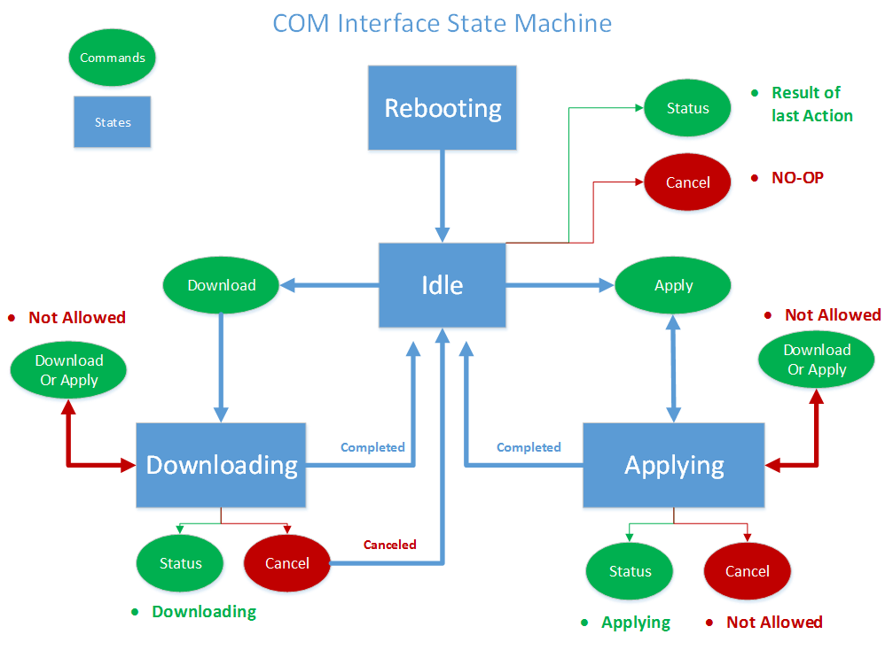
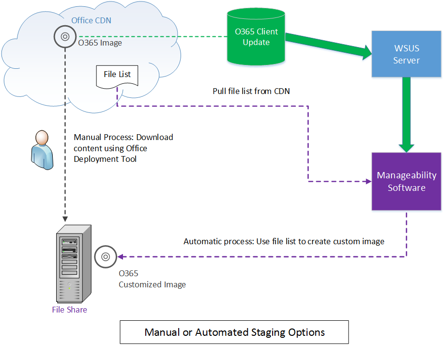
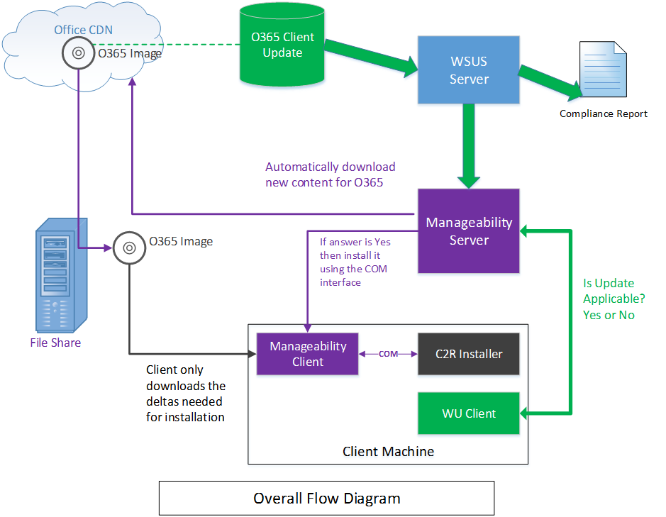

# <a name="integrating-manageability-applications-with-office-365-click-to-run-installer"></a><span data-ttu-id="fca92-103">Integración de aplicaciones de la capacidad de administración con el instalador de click-to-run de Office 365</span><span class="sxs-lookup"><span data-stu-id="fca92-103">Integrating manageability applications with Office 365 click-to-run installer</span></span>

<span data-ttu-id="fca92-104">Obtenga información sobre cómo integrar al instalador de Office 365 Click-to-Run con una solución de administración de software.</span><span class="sxs-lookup"><span data-stu-id="fca92-104">Learn how to integrate the Office 365 Click-to-Run installer with a software management solution.</span></span>
  
<span data-ttu-id="fca92-105">El instalador de Office 365 Click-to-Run proporciona una interfaz COM que permite a los profesionales de TI y soluciones de administración de software control mediante programación a través de la administración de actualizaciones.</span><span class="sxs-lookup"><span data-stu-id="fca92-105">The Office 365 Click-to-Run installer provides a COM interface that allows IT Professionals and software management solutions programmatic control over update management.</span></span> <span data-ttu-id="fca92-106">Esta interfaz proporciona funciones de administración adicionales más allá de lo que es proporcionado por la herramienta de implementación de Office.</span><span class="sxs-lookup"><span data-stu-id="fca92-106">This interface provides additional management capabilities beyond what is provided by the Office Deployment Tool.</span></span>
  
> [!NOTE]
> <span data-ttu-id="fca92-107">En este artículo se aplica a Office 2016 y versiones posteriores, Office 365.</span><span class="sxs-lookup"><span data-stu-id="fca92-107">This article applies to Office 2016 and later, Office 365.</span></span> 
  
## <a name="integrating-with-the-click-to-run"></a><span data-ttu-id="fca92-108">Integración con Click-to-Run</span><span class="sxs-lookup"><span data-stu-id="fca92-108">Integrating with the Click-to-Run</span></span>

<span data-ttu-id="fca92-109">Para usar esta interfaz, una aplicación de la capacidad de administración invoca la interfaz COM y llamadas exponen las API que se comunican directamente con el servicio de instalación de Click-to-Run.</span><span class="sxs-lookup"><span data-stu-id="fca92-109">To use this interface, a manageability application invokes the COM interface and calls exposed APIs that communicate directly with the Click-to-Run installation service.</span></span> 
  
> [!NOTE]
> <span data-ttu-id="fca92-110">El instalador de Office Click-to-Run se puede ejecutar desde la línea de comandos con parámetros que pueden controlar el comportamiento, tal como se documenta en [Office Deployment Tool for Click-to-Run](https://www.microsoft.com/en-us/download/details.aspx?id=49117).</span><span class="sxs-lookup"><span data-stu-id="fca92-110">The Office Click-to-Run installer can be run from the command-line with parameters that can control the behavior, as documented in [Office Deployment Tool for Click-to-Run](https://www.microsoft.com/en-us/download/details.aspx?id=49117).</span></span> 
  
<span data-ttu-id="fca92-111">**A continuación se incluye un diagrama conceptual de la interfaz COM**</span><span class="sxs-lookup"><span data-stu-id="fca92-111">**Following is a conceptual diagram of the COM interface**</span></span>

<span data-ttu-id="fca92-112">![Un diagrama del uso de la interfaz COM en el programa de instalación de Office Click-To-Run.] (media/e7ac2523-e67b-4a44-ae67-c048709f872a.png "Un diagrama de uso de la interfaz COM en el programa de instalación de Office Click-To-Run")</span><span class="sxs-lookup"><span data-stu-id="fca92-112"></span></span>
  
<span data-ttu-id="fca92-113">La interfaz de Office 365 Click-to-Run installer implementa basada en COM, **IUpdateNotify** registrado para CLSID **CLSID_UpdateNotifyObject**.</span><span class="sxs-lookup"><span data-stu-id="fca92-113">The Office 365 Click-to-Run installer implements a COM-based interface, **IUpdateNotify** registered to CLSID **CLSID_UpdateNotifyObject**.</span></span>
  
<span data-ttu-id="fca92-114">Esta interfaz se puede invocar como sigue:</span><span class="sxs-lookup"><span data-stu-id="fca92-114">This interface can be invoked as follows:</span></span>
  
```cpp
hr = CoCreateInstance(CLSID_UpdateNotifyObject, NULL, CLSCTX_ALL,
       IID_IUpdateNotify, 
      (void **)&p); 
```

<span data-ttu-id="fca92-115">La llamada sólo funcionará correctamente si el autor de la llamada se ejecuta con privilegios elevados, como el programa de instalación de Click-to-Run se debe ejecutar con privilegios elevados.</span><span class="sxs-lookup"><span data-stu-id="fca92-115">The call will only succeed if the caller is running under elevated privileges, as the Click-to-Run installation program must be run with elevated privileges.</span></span>
  
<span data-ttu-id="fca92-116">La interfaz de **IUpdateNotify** COM expone tres funciones asincrónicas responsables de validar los comandos y parámetros y programación de ejecución con el servicio de instalación de Click-to-Run.</span><span class="sxs-lookup"><span data-stu-id="fca92-116">The **IUpdateNotify** COM interface exposes three asynchronous functions responsible for validating the commands and parameters and scheduling execution with the Click-to-Run installation service.</span></span> 
  
```cpp
HRESULT Download([in] LPWSTR pcwszParameters) // Download update content.
HRESULT Apply([in] LPWSTR pcwszParameters) // Apply update content.
HRESULT Cancel() // Cancel the download action.

```

<span data-ttu-id="fca92-117">A otro método, **estado**, puede utilizarse para obtener información sobre el estado del último comando ejecutado o el estado del comando está ejecutando actualmente (es decir, correcto, error, códigos de error detallado).</span><span class="sxs-lookup"><span data-stu-id="fca92-117">A forth method, **Status**, can be used to get information about the status of the last executed command or the status of the currently executing command (i.e. success, failure, detailed error codes).</span></span>
  
```cpp
HRESULT status([out] _UPDATE_STATUS_REPORT* pUpdateStatusReport) // Get status of current action. 
typedef struct _UPDATE_STATUS_REPORT  
{  
UPDATE_STATUS status;  
UINT error; 
BSTR contentid;  
} UPDATE_STATUS_REPORT;

```

<span data-ttu-id="fca92-118">Existen cuatro estados que puede que el servicio de instalación de Click-to-Run en durante su ciclo de vida, durante el cual se pueden llamar a métodos de **IUpdateNotify** ; Reiniciar, inactivo, descargar y aplicar.</span><span class="sxs-lookup"><span data-stu-id="fca92-118">There are four states that the Click-to-Run installation service may be in during its lifecycle, during which **IUpdateNotify** methods may be called; Rebooting, Idle, Downloading and Applying.</span></span> 
  
<span data-ttu-id="fca92-119">**A continuación se incluye en el diagrama de máquina de estado de interfaz COM**</span><span class="sxs-lookup"><span data-stu-id="fca92-119">**Following is the COM Interface State Machine diagram**</span></span>

<span data-ttu-id="fca92-120">![Un diagrama de estado de la interfaz COM.] (media/a409003e-6876-4ab3-bb4c-cd0c0fed5cbb.png "Un diagrama de estado de la interfaz COM")</span><span class="sxs-lookup"><span data-stu-id="fca92-120"></span></span>
  
> [!NOTE]
> <span data-ttu-id="fca92-121">**Rebooting**: cuando se está iniciando la máquina hay un período de tiempo cuando el servicio de instalador de Click-to-Run no está disponible.</span><span class="sxs-lookup"><span data-stu-id="fca92-121">**Rebooting**: When the machine is booting there is a period of time when the Click-to-Run installer service is not available.</span></span> <span data-ttu-id="fca92-122">Una llamada correcta al método estado después de un reinicio devolverá eUPDATE_UNKNOWN.</span><span class="sxs-lookup"><span data-stu-id="fca92-122">A successful call to the Status method after a reboot will return eUPDATE_UNKNOWN.</span></span> 
  
<span data-ttu-id="fca92-123">**Inactividad:** Cuando el instalador de Click-to-Run está en el estado inactivo, se puede llamar:</span><span class="sxs-lookup"><span data-stu-id="fca92-123">**Idle:** When the Click-to-Run installer is in the idle state, you can call:</span></span> 
  
- <span data-ttu-id="fca92-124">**Aplicar**: instalar el contenido descargado previamente.</span><span class="sxs-lookup"><span data-stu-id="fca92-124">**Apply**: Install previously downloaded content.</span></span>
    
- <span data-ttu-id="fca92-125">**Cancelar**: devuelve `0x800000e`, "ha invocado un método en un momento imprevisto."</span><span class="sxs-lookup"><span data-stu-id="fca92-125">**Cancel**: Returns  `0x800000e`, "A method was called at an unexpected time."</span></span>
    
- <span data-ttu-id="fca92-126">**Descargar**: descarga nuevo contenido en el cliente para la instalación posterior.</span><span class="sxs-lookup"><span data-stu-id="fca92-126">**Download**: Downloads new content to the client for later installation.</span></span>
    
- <span data-ttu-id="fca92-127">**Estado**: devuelve el resultado de la última acción completada o un mensaje de error si la acción se termina en error.</span><span class="sxs-lookup"><span data-stu-id="fca92-127">**Status**: Returns the result of the last completed action, or an error message if the action ended in failure.</span></span> <span data-ttu-id="fca92-128">Si no hay ninguna acción anterior, **estado** devuelve `eUPDATE_UNKNOWN`.</span><span class="sxs-lookup"><span data-stu-id="fca92-128">If there is no previous action, **Status** returns  `eUPDATE_UNKNOWN`.</span></span>
    
<span data-ttu-id="fca92-129">**Descargar:** Cuando el programa de instalación de Click-to-Run se encuentra en el estado de descarga, se puede llamar:</span><span class="sxs-lookup"><span data-stu-id="fca92-129">**Downloading:** When the Click-to-Run installer is in the downloading state, you can call:</span></span> 
  
- <span data-ttu-id="fca92-130">**Aplicar**: devuelve un **valor HRESULT** con el valor `0x800000e`, "ha invocado un método en un momento imprevisto."</span><span class="sxs-lookup"><span data-stu-id="fca92-130">**Apply**: Returns an **HRESULT** with the value  `0x800000e`, "A method was called at an unexpected time."</span></span>
    
- <span data-ttu-id="fca92-131">**Cancelar**: detiene la descarga y quita el contenido descargado parcialmente.</span><span class="sxs-lookup"><span data-stu-id="fca92-131">**Cancel**: Stops the download and removes the partially downloaded content.</span></span>
    
- <span data-ttu-id="fca92-132">**Descargar**: devuelve un **valor HRESULT** con el valor `0x800000e`, "ha invocado un método en un momento imprevisto."</span><span class="sxs-lookup"><span data-stu-id="fca92-132">**Download**: Returns an **HRESULT** with the value  `0x800000e`, "A method was called at an unexpected time."</span></span> 
    
- <span data-ttu-id="fca92-133">**Estado**: devuelve **DOWNLOAD_WIP** para indicar que el trabajo de descarga está en curso.</span><span class="sxs-lookup"><span data-stu-id="fca92-133">**Status**: Returns **DOWNLOAD_WIP** to indicate that download work is in progress.</span></span> 
    
<span data-ttu-id="fca92-134">**Aplicar:** Cuando el instalador de Click-to-Run está en el proceso de instalación anteriormente descargar el contenido:</span><span class="sxs-lookup"><span data-stu-id="fca92-134">**Applying:** When the Click-to-Run installer is in the process of installing previously download content:</span></span> 
  
- <span data-ttu-id="fca92-135">**Aplicar**: devuelve un **valor HRESULT** con el valor `0x800000e`, "ha invocado un método en un momento imprevisto."</span><span class="sxs-lookup"><span data-stu-id="fca92-135">**Apply**: Returns an **HRESULT** with the value  `0x800000e`, "A method was called at an unexpected time."</span></span>
    
- <span data-ttu-id="fca92-136">**Cancelar**: devuelve `0x800000e`, no se puede cancelar la acción de aplicar.</span><span class="sxs-lookup"><span data-stu-id="fca92-136">**Cancel**: Returns  `0x800000e`, the Apply action cannot be canceled.</span></span>
    
- <span data-ttu-id="fca92-137">**Descargar**: devuelve un **valor HRESULT** con el valor `0x800000e`, "ha invocado un método en un momento imprevisto."</span><span class="sxs-lookup"><span data-stu-id="fca92-137">**Download**: Returns an **HRESULT** with the value  `0x800000e`, "A method was called at an unexpected time."</span></span> 
    
- <span data-ttu-id="fca92-138">**Estado**: devuelve **APPLY_WIP** para indicar que aplican trabajo está en curso.</span><span class="sxs-lookup"><span data-stu-id="fca92-138">**Status**: Returns **APPLY_WIP** to indicate that apply work is in progress.</span></span> 
    
> [!NOTE]
> <span data-ttu-id="fca92-139">Puesto que OfficeC2RCOM es un servicio COM + y se carga dinámicamente, debe llamar a **CoCreateInstance** cada vez que se llame a un método en esta clase para garantizar que obtiene el resultado esperado.</span><span class="sxs-lookup"><span data-stu-id="fca92-139">Since OfficeC2RCOM is a COM+ service and is dynamically loaded, you need to call **CoCreateInstance** every time you call a method on this class to ensure that you get the expected result.</span></span> <span data-ttu-id="fca92-140">El servicio COM + controlará la creación de una nueva instancia si es necesario.</span><span class="sxs-lookup"><span data-stu-id="fca92-140">The COM+ service will handle creating a new instance if necessary.</span></span> <span data-ttu-id="fca92-141">Cuando se llama a uno de los métodos por primera vez, COM + va a cargar el objeto **IUpdateNotify** y ejecútelo dentro de una de las instancias de dllhost.exe.</span><span class="sxs-lookup"><span data-stu-id="fca92-141">When one of the methods is called for the first time, COM+ will load the **IUpdateNotify** object and run it within one of the dllhost.exe instances.</span></span> <span data-ttu-id="fca92-142">El nuevo objeto permanecerá activo para unos 3 minutos de inactividad.</span><span class="sxs-lookup"><span data-stu-id="fca92-142">The new object will stay active for about 3 minutes in idle.</span></span> <span data-ttu-id="fca92-143">Si se realiza una llamada subsiguiente en tres minutos de la última llamada, el objeto **IUpdateNotify** permanecerá cargado y no se creará una nueva instancia.</span><span class="sxs-lookup"><span data-stu-id="fca92-143">If a subsequent call is made within three minutes of the last call, the **IUpdateNotify** object will remain loaded and a new instance is not created.</span></span> <span data-ttu-id="fca92-144">Si no la llamada se realiza en tres minutos, el objeto IUpdateNotify se descargará y se creará un nuevo objeto **IUpdateNotify** cuando se realiza la siguiente llamada.</span><span class="sxs-lookup"><span data-stu-id="fca92-144">If no call is made within three minutes, the IUpdateNotify object will be unloaded and a new **IUpdateNotify** object will be created when the next call is made.</span></span> 
  
## <a name="click-to-run-installer-com-api-reference-guide"></a><span data-ttu-id="fca92-145">Guía de referencia de API de COM de Click-to-Run installer</span><span class="sxs-lookup"><span data-stu-id="fca92-145">Click-to-Run installer COM API reference guide</span></span>

<span data-ttu-id="fca92-146">En la siguiente documentación de referencia de API:</span><span class="sxs-lookup"><span data-stu-id="fca92-146">In the following API reference documentation:</span></span>
  
- <span data-ttu-id="fca92-147">Los parámetros se encuentran en un formato de par clave/valor separado por un espacio.</span><span class="sxs-lookup"><span data-stu-id="fca92-147">Parameters are in a key/value pair format separated by a space.</span></span>
    
- <span data-ttu-id="fca92-148">Los parámetros no distinguen mayúsculas de minúsculas.</span><span class="sxs-lookup"><span data-stu-id="fca92-148">The parameters are not case-sensitive.</span></span>
    
- <span data-ttu-id="fca92-149">Hay una [lista de parámetros](https://blogs.technet.microsoft.com/odsupport/2014/03/03/the-new-update-now-feature-for-office-2013-click-to-run-for-office365-and-its-associated-command-line-and-switches/) con la documentación disponible.</span><span class="sxs-lookup"><span data-stu-id="fca92-149">There is a [list of parameters](https://blogs.technet.microsoft.com/odsupport/2014/03/03/the-new-update-now-feature-for-office-2013-click-to-run-for-office365-and-its-associated-command-line-and-switches/) with documentation available.</span></span> 
    
- <span data-ttu-id="fca92-150">Resumen de IUpdateNotify2 interfaz es ahora incluye.</span><span class="sxs-lookup"><span data-stu-id="fca92-150">Summary of IUpdateNotify2 interface is now included.</span></span>
    
### <a name="apply"></a><span data-ttu-id="fca92-151">Aplicar</span><span class="sxs-lookup"><span data-stu-id="fca92-151">Apply</span></span>

```cpp
HRESULT Apply([in] LPWSTR pcwszParameters) // Apply update content.
```

#### <a name="parameters"></a><span data-ttu-id="fca92-152">Sintaxis</span><span class="sxs-lookup"><span data-stu-id="fca92-152">Parameters</span></span>

-  <span data-ttu-id="fca92-153">_nivel de presentación_: **true** para mostrar el estado de instalación, incluidos los errores, durante el proceso de actualización; **false** para ocultar el estado de la instalación, incluidos los errores, durante el proceso de actualización.</span><span class="sxs-lookup"><span data-stu-id="fca92-153">_displaylevel_: **true** to show the installation status, including errors, during the update process; **false** to hide the installation status, including errors, during the update process.</span></span> <span data-ttu-id="fca92-154">El valor predeterminado es **false**.</span><span class="sxs-lookup"><span data-stu-id="fca92-154">The default is **false**.</span></span>
    
-  <span data-ttu-id="fca92-155">_forceappshutdown_: **true** para forzar a las aplicaciones de Office para apagar inmediatamente cuando se desencadena la acción **Aplicar** ; **false** para producirá un error si se ejecutan las aplicaciones de Office.</span><span class="sxs-lookup"><span data-stu-id="fca92-155">_forceappshutdown_: **true** to force Office applications to shut down immediately when the **Apply** action is triggered; **false** to fail if any Office applications are running.</span></span> <span data-ttu-id="fca92-156">El valor predeterminado es **false**.</span><span class="sxs-lookup"><span data-stu-id="fca92-156">The default is **false**.</span></span> <span data-ttu-id="fca92-157">Para obtener más información, vea la [sección Comentarios](#bk_ApplyRemark) .</span><span class="sxs-lookup"><span data-stu-id="fca92-157">See [Remarks](#bk_ApplyRemark) for more information.</span></span> 
    
  <span data-ttu-id="fca92-158">Si se está ejecutando cualquier aplicación de Office cuando se desencadena la acción **Aplicar** , normalmente, se producirá un error de la acción **Aplicar** .</span><span class="sxs-lookup"><span data-stu-id="fca92-158">If any Office application is running when the **Apply** action is triggered, the **Apply** action will usually fail.</span></span> <span data-ttu-id="fca92-159">Pasando `forceappshutdown=true` a la que **Aplicar** método hará que el servicio de **OfficeClickToRun** cerrar las aplicaciones y aplicar la actualización inmediatamente.</span><span class="sxs-lookup"><span data-stu-id="fca92-159">Passing  `forceappshutdown=true` to the **Apply** method will cause the **OfficeClickToRun** service to immediately shut down the applications and apply the update.</span></span> <span data-ttu-id="fca92-160">El usuario puede experimentar pérdida de datos en este caso.</span><span class="sxs-lookup"><span data-stu-id="fca92-160">The user may experience data loss in this case.</span></span> 
    
#### <a name="return-results"></a><span data-ttu-id="fca92-161">Devolver resultados</span><span class="sxs-lookup"><span data-stu-id="fca92-161">Return results</span></span>

|||
|:-----|:-----|
|<span data-ttu-id="fca92-162">**S_OK**</span><span class="sxs-lookup"><span data-stu-id="fca92-162">**S_OK**</span></span> <br/> |<span data-ttu-id="fca92-163">Acción se envió correctamente al servicio de Click-To-Run para su ejecución.</span><span class="sxs-lookup"><span data-stu-id="fca92-163">Action was successfully submitted to the Click-To-Run service for execution.</span></span>  <br/> |
|<span data-ttu-id="fca92-164">**E_ACCESSDENIED**</span><span class="sxs-lookup"><span data-stu-id="fca92-164">**E_ACCESSDENIED**</span></span> <br/> |<span data-ttu-id="fca92-165">El autor de la llamada no se está ejecutando con privilegios elevados.</span><span class="sxs-lookup"><span data-stu-id="fca92-165">The caller is not running with elevated privileges.</span></span>  <br/> |
|<span data-ttu-id="fca92-166">**E_INVALIDARG**</span><span class="sxs-lookup"><span data-stu-id="fca92-166">**E_INVALIDARG**</span></span> <br/> |<span data-ttu-id="fca92-167">Se han pasado parámetros no válidos.</span><span class="sxs-lookup"><span data-stu-id="fca92-167">Invalid parameters were passed.</span></span>  <br/> |
|<span data-ttu-id="fca92-168">**E_ILLEGAL_METHOD_CALL**</span><span class="sxs-lookup"><span data-stu-id="fca92-168">**E_ILLEGAL_METHOD_CALL**</span></span> <br/> |<span data-ttu-id="fca92-169">Acción no está permitida en este momento.</span><span class="sxs-lookup"><span data-stu-id="fca92-169">Action is not allowed at this time.</span></span> <span data-ttu-id="fca92-170">Para obtener más información, vea la [sección Comentarios](#bk_ApplyRemark) .</span><span class="sxs-lookup"><span data-stu-id="fca92-170">See [Remarks](#bk_ApplyRemark) for more information.</span></span>  <br/> |

<a name="bk_ApplyRemark"></a>

#### <a name="remarks"></a><span data-ttu-id="fca92-171">Notas</span><span class="sxs-lookup"><span data-stu-id="fca92-171">Remarks</span></span>

- <span data-ttu-id="fca92-172">Si se está ejecutando cualquier aplicación de Office cuando se desencadena la acción **Aplicar** , se producirá un error en la acción **Aplicar** .</span><span class="sxs-lookup"><span data-stu-id="fca92-172">If any Office application is running when the **Apply** action is triggered, the **Apply** action will fail.</span></span> <span data-ttu-id="fca92-173">Pasando `forceappshutdown=true` a la que **Aplicar** método hará que el servicio de **OfficeClickToRun** cerrar inmediatamente a las aplicaciones de Office que se están ejecutando y aplican la actualización.</span><span class="sxs-lookup"><span data-stu-id="fca92-173">Passing  `forceappshutdown=true` to the **Apply** method will cause the **OfficeClickToRun** service to immediately shut down any Office applications that are running and apply the update.</span></span> <span data-ttu-id="fca92-174">El usuario puede experimentar datos tal como se les solicita no para guardar los cambios para abrir documentos..</span><span class="sxs-lookup"><span data-stu-id="fca92-174">The user may experience data as they are not prompted to save changes to open documents..</span></span> 
    
- <span data-ttu-id="fca92-175">Esta acción sólo se puede desencadenar cuando el estado de COM es una de las siguientes opciones:</span><span class="sxs-lookup"><span data-stu-id="fca92-175">This action can only be triggered when the COM status is one of the following:</span></span> 
    
  - <span data-ttu-id="fca92-176">**eUPDATE_UNKNOWN**</span><span class="sxs-lookup"><span data-stu-id="fca92-176">**eUPDATE_UNKNOWN**</span></span>
    
  - <span data-ttu-id="fca92-177">**eDOWNLOAD_CANCELLED**</span><span class="sxs-lookup"><span data-stu-id="fca92-177">**eDOWNLOAD_CANCELLED**</span></span>
    
  - <span data-ttu-id="fca92-178">**eDOWNLOAD_FAILED**</span><span class="sxs-lookup"><span data-stu-id="fca92-178">**eDOWNLOAD_FAILED**</span></span>
    
  - <span data-ttu-id="fca92-179">**eDOWNLOAD_SUCCEEDED**</span><span class="sxs-lookup"><span data-stu-id="fca92-179">**eDOWNLOAD_SUCCEEDED**</span></span>
    
  - <span data-ttu-id="fca92-180">**eAPPLY_SUCCEEDED**</span><span class="sxs-lookup"><span data-stu-id="fca92-180">**eAPPLY_SUCCEEDED**</span></span>
    
  - <span data-ttu-id="fca92-181">**eAPPLY_FAILED**</span><span class="sxs-lookup"><span data-stu-id="fca92-181">**eAPPLY_FAILED**</span></span>
    
- <span data-ttu-id="fca92-182">Si se llama el método **Apply** sin descargar el contenido anteriormente, el método **Apply** notificará **Succeeded** tal y como se ha detectado nada para aplicar y había completado correctamente el proceso de **aplicación** .</span><span class="sxs-lookup"><span data-stu-id="fca92-182">If you call the **Apply** method without previously downloading content, the **Apply** method will report **Succeeded** as it detected nothing to apply and completed the **Apply** process successfully.</span></span> 
    
### <a name="cancel"></a><span data-ttu-id="fca92-183">Cancel</span><span class="sxs-lookup"><span data-stu-id="fca92-183">Cancel</span></span>

```cpp
HRESULT Cancel() // Cancel the download action.
```

#### <a name="return-results"></a><span data-ttu-id="fca92-184">Devolver resultados</span><span class="sxs-lookup"><span data-stu-id="fca92-184">Return results</span></span>

|||
|:-----|:-----|
|<span data-ttu-id="fca92-185">S_OK</span><span class="sxs-lookup"><span data-stu-id="fca92-185">S_OK</span></span>  <br/> |<span data-ttu-id="fca92-186">Acción se envió correctamente al servicio de Click-to-Run para su ejecución.</span><span class="sxs-lookup"><span data-stu-id="fca92-186">Action was successfully submitted to the Click-to-Run service for execution.</span></span>  <br/> |
|<span data-ttu-id="fca92-187">E_ILLEGAL_METHOD_CALL</span><span class="sxs-lookup"><span data-stu-id="fca92-187">E_ILLEGAL_METHOD_CALL</span></span>  <br/> |<span data-ttu-id="fca92-188">Acción no está permitida en este momento.</span><span class="sxs-lookup"><span data-stu-id="fca92-188">Action is not allowed at this time.</span></span> <span data-ttu-id="fca92-189">Vea la sección [comentarios](#bk_CancelRemarks) para obtener más información</span><span class="sxs-lookup"><span data-stu-id="fca92-189">See the [Remarks](#bk_CancelRemarks) section for more information</span></span>  <br/> |

<a name="bk_CancelRemarks"></a>

#### <a name="remarks"></a><span data-ttu-id="fca92-190">Notas</span><span class="sxs-lookup"><span data-stu-id="fca92-190">Remarks</span></span>

- <span data-ttu-id="fca92-191">Este método sólo se puede desencadenar cuando el identificador de estado de COM **eDOWNLOAD_WIP**.</span><span class="sxs-lookup"><span data-stu-id="fca92-191">This method can only be triggered when the COM status id **eDOWNLOAD_WIP**.</span></span> <span data-ttu-id="fca92-192">Intentará cancelar la acción de descarga actual.</span><span class="sxs-lookup"><span data-stu-id="fca92-192">It will attempt to cancel the current download action.</span></span> <span data-ttu-id="fca92-193">El estado de COM se cambie a **eDOWNLOAD_CANCELLING** y finalmente, cambie a **eDOWNLOAD_CANCELED**.</span><span class="sxs-lookup"><span data-stu-id="fca92-193">The COM status will change to **eDOWNLOAD_CANCELLING** and eventually change to **eDOWNLOAD_CANCELED**.</span></span> <span data-ttu-id="fca92-194">El estado de COM devolverá **E_ILLEGAL_METHOD_CALL** si se desencadena en cualquier otro momento.</span><span class="sxs-lookup"><span data-stu-id="fca92-194">The COM status will return **E_ILLEGAL_METHOD_CALL** if triggered at any other time.</span></span> 
    
### <a name="download"></a><span data-ttu-id="fca92-195">Descarga</span><span class="sxs-lookup"><span data-stu-id="fca92-195">Download</span></span>

```cpp
HRESULT Download([in] LPWSTR pcwszParameters) // Download update content.
```

#### <a name="parameters"></a><span data-ttu-id="fca92-196">Sintaxis</span><span class="sxs-lookup"><span data-stu-id="fca92-196">Parameters</span></span>

-  <span data-ttu-id="fca92-197">_nivel de presentación_: **true** para mostrar el estado de instalación, incluidos los errores, durante el proceso de actualización; **false** para ocultar el estado de la instalación, incluidos los errores, durante el proceso de actualización.</span><span class="sxs-lookup"><span data-stu-id="fca92-197">_displaylevel_: **true** to show the installation status, including errors, during the update process; **false** to hide the installation status, including errors, during the update process.</span></span> <span data-ttu-id="fca92-198">El valor predeterminado es **false**.</span><span class="sxs-lookup"><span data-stu-id="fca92-198">The default is **false**.</span></span>
    
-  <span data-ttu-id="fca92-199">_updatebaseurl_: dirección URL para el origen de descarga alternativas.</span><span class="sxs-lookup"><span data-stu-id="fca92-199">_updatebaseurl_: URL to the alternate download source.</span></span>
    
-  <span data-ttu-id="fca92-200">_updatetoversion_: la versión para actualizar Office a.</span><span class="sxs-lookup"><span data-stu-id="fca92-200">_updatetoversion_: The version to update Office to.</span></span> <span data-ttu-id="fca92-201">Defina este parámetro si desea actualizar a una versión anterior a la versión que está instalada actualmente.</span><span class="sxs-lookup"><span data-stu-id="fca92-201">Define this parameter if you want to update to an older version than the version that is currently installed.</span></span>
    
-  <span data-ttu-id="fca92-202">_downloadsource_: el CLSID de la implementación personalizada de **IBackgroundCopyManager** (Administrador de BITS).</span><span class="sxs-lookup"><span data-stu-id="fca92-202">_downloadsource_: CLSID of the customized **IBackgroundCopyManager** implementation (BITS manager).</span></span> 
    
-  <span data-ttu-id="fca92-203">_contentid_: identifica el contenido que desea descargar desde el servidor de contenido mediante el Administrador de BITS personalizado.</span><span class="sxs-lookup"><span data-stu-id="fca92-203">_contentid_: Identifies the content to download from the content server through the customized BITS manager.</span></span> <span data-ttu-id="fca92-204">Este valor se pasa a través de la interfaz de BITS para interpretación.</span><span class="sxs-lookup"><span data-stu-id="fca92-204">This value is passed through the BITS interface for interpretation.</span></span>
    
#### <a name="return-results"></a><span data-ttu-id="fca92-205">Devolver resultados</span><span class="sxs-lookup"><span data-stu-id="fca92-205">Return results</span></span>

|||
|:-----|:-----|
|<span data-ttu-id="fca92-206">**S_OK**</span><span class="sxs-lookup"><span data-stu-id="fca92-206">**S_OK**</span></span> <br/> |<span data-ttu-id="fca92-207">Acción se envió correctamente al servicio de Click-To-Run para su ejecución.</span><span class="sxs-lookup"><span data-stu-id="fca92-207">Action was successfully submitted to the Click-To-Run service for execution.</span></span>  <br/> |
|<span data-ttu-id="fca92-208">**E_ACCESSDENIED**</span><span class="sxs-lookup"><span data-stu-id="fca92-208">**E_ACCESSDENIED**</span></span> <br/> |<span data-ttu-id="fca92-209">El autor de la llamada no se está ejecutando con privilegios elevados.</span><span class="sxs-lookup"><span data-stu-id="fca92-209">The caller is not running with elevated privileges.</span></span>  <br/> |
|<span data-ttu-id="fca92-210">**E_INVALIDARG**</span><span class="sxs-lookup"><span data-stu-id="fca92-210">**E_INVALIDARG**</span></span> <br/> |<span data-ttu-id="fca92-211">Se han pasado parámetros no válidos.</span><span class="sxs-lookup"><span data-stu-id="fca92-211">Invalid parameters were passed.</span></span>  <br/> |
|<span data-ttu-id="fca92-212">**E_ILLEGAL_METHOD_CALL**</span><span class="sxs-lookup"><span data-stu-id="fca92-212">**E_ILLEGAL_METHOD_CALL**</span></span> <br/> |<span data-ttu-id="fca92-213">Acción no está permitida en este momento.</span><span class="sxs-lookup"><span data-stu-id="fca92-213">Action is not allowed at this time.</span></span> <span data-ttu-id="fca92-214">Para obtener más información, vea la [sección Comentarios](#bk_DownloadRemark) .</span><span class="sxs-lookup"><span data-stu-id="fca92-214">See [Remarks](#bk_DownloadRemark) for more information.</span></span>  <br/> |

<a name="bk_DownloadRemark"></a>

#### <a name="remarks"></a><span data-ttu-id="fca92-215">Notas</span><span class="sxs-lookup"><span data-stu-id="fca92-215">Remarks</span></span>

- <span data-ttu-id="fca92-216">Debe especificar _downloadsource_ y _contentid_ como un par.</span><span class="sxs-lookup"><span data-stu-id="fca92-216">You must specify  _downloadsource_ and  _contentid_ as a pair.</span></span> <span data-ttu-id="fca92-217">En caso contrario, el método **Descargar** devolverá un error **E_INVALIDARG** .</span><span class="sxs-lookup"><span data-stu-id="fca92-217">If not, the **Download** method will return an **E_INVALIDARG** error.</span></span> 
    
- <span data-ttu-id="fca92-218">Si se proporcionan _downloadsource_, _contentid_y _updatebaseurl_ , se omitirá _updatebaseurl_ .</span><span class="sxs-lookup"><span data-stu-id="fca92-218">If  _downloadsource_,  _contentid_, and  _updatebaseurl_ are provided,  _updatebaseurl_ will be ignored.</span></span> 
    
- <span data-ttu-id="fca92-219">Esta acción sólo se puede desencadenar cuando el estado de COM es una de las siguientes opciones:</span><span class="sxs-lookup"><span data-stu-id="fca92-219">This action can only be triggered when the COM status is one of the following:</span></span> 
    
  - <span data-ttu-id="fca92-220">**eUPDATE_UNKNOWN**</span><span class="sxs-lookup"><span data-stu-id="fca92-220">**eUPDATE_UNKNOWN**</span></span>
    
  - <span data-ttu-id="fca92-221">**eDOWNLOAD_CANCELLED**</span><span class="sxs-lookup"><span data-stu-id="fca92-221">**eDOWNLOAD_CANCELLED**</span></span>
    
  - <span data-ttu-id="fca92-222">**eDOWNLOAD_FAILED**</span><span class="sxs-lookup"><span data-stu-id="fca92-222">**eDOWNLOAD_FAILED**</span></span>
    
  - <span data-ttu-id="fca92-223">**eDOWNLOAD_SUCCEEDED**</span><span class="sxs-lookup"><span data-stu-id="fca92-223">**eDOWNLOAD_SUCCEEDED**</span></span>
    
  - <span data-ttu-id="fca92-224">**eAPPLY_SUCCEEDED**</span><span class="sxs-lookup"><span data-stu-id="fca92-224">**eAPPLY_SUCCEEDED**</span></span>
    
  - <span data-ttu-id="fca92-225">**eAPPLY_FAILED**</span><span class="sxs-lookup"><span data-stu-id="fca92-225">**eAPPLY_FAILED**</span></span>
    
- <span data-ttu-id="fca92-226">Si se llama el método **Apply** sin contenido descargado anteriormente, el método **Apply se** notificará **Succeeded** tal y como se ha detectado nada para aplicar y había completado correctamente el proceso de **aplicación** .</span><span class="sxs-lookup"><span data-stu-id="fca92-226">If you call the **Apply** method without previously downloaded content, the **Apply** method will report **Succeeded** as it detected nothing to apply and completed the **Apply** process successfully.</span></span> 
    
#### <a name="examples"></a><span data-ttu-id="fca92-227">Ejemplos</span><span class="sxs-lookup"><span data-stu-id="fca92-227">Examples</span></span>

- <span data-ttu-id="fca92-228">Para descargar el contenido desde el Administrador de BITS personalizado: llame a la función **download()** pasa los parámetros siguientes:</span><span class="sxs-lookup"><span data-stu-id="fca92-228">To download the content from the customized BITS manager: Call the **download()** function passing the following parameters:</span></span> 
    
  ```cpp
  "downloadsource=CLSIDofBITSInterface contentid=BITSServerContentIdentifier"
  ```

- <span data-ttu-id="fca92-229">Para descargar el contenido desde la CDN de Microsoft: llame a la función **download()** sin especificar los parámetros _downloadsource_, _contentid_o _updatebaseurl_ .</span><span class="sxs-lookup"><span data-stu-id="fca92-229">To download the content from the Microsoft CDN: Call the **download()** function without specifying the  _downloadsource_,  _contentid_, or  _updatebaseurl_ parameters.</span></span> 
    
- <span data-ttu-id="fca92-230">Para descargar el contenido desde una ubicación personalizada: llame a la función **download()** pasar el parámetro siguiente:</span><span class="sxs-lookup"><span data-stu-id="fca92-230">To download the content from a customized location: Call the **download()** function passing the following parameter:</span></span> 
    
  ```cpp
  "updatebaseurl=yourcontentserverurl"
  ```

### <a name="status"></a><span data-ttu-id="fca92-231">Estado</span><span class="sxs-lookup"><span data-stu-id="fca92-231">Status</span></span>

```cpp
typdef struct _UPDATE_STATUS_REPORT
{
    UPDATE_STATUS status;
    UINT error;
    LPCWSTR contentid;
}UPDATE_STATUS_REPORT;
HRESULT status([out] _UPDATE_STATUS_REPORT& pUpdateStatusReport) // Get status of current action
```

#### <a name="parameters"></a><span data-ttu-id="fca92-232">Sintaxis</span><span class="sxs-lookup"><span data-stu-id="fca92-232">Parameters</span></span>

|||
|:-----|:-----|
| <span data-ttu-id="fca92-233">_pUpdateStatusReport_</span><span class="sxs-lookup"><span data-stu-id="fca92-233">_pUpdateStatusReport_</span></span> <br/> |<span data-ttu-id="fca92-234">Puntero a una estructura UPDATE_STATUS_REPORT.</span><span class="sxs-lookup"><span data-stu-id="fca92-234">Pointer to an UPDATE_STATUS_REPORT structure.</span></span>  <br/> |
   
#### <a name="return-results"></a><span data-ttu-id="fca92-235">Devolver resultados</span><span class="sxs-lookup"><span data-stu-id="fca92-235">Return results</span></span>

|||
|:-----|:-----|
|<span data-ttu-id="fca92-236">**S_OK**</span><span class="sxs-lookup"><span data-stu-id="fca92-236">**S_OK**</span></span> <br/> |<span data-ttu-id="fca92-237">El método de **estado** siempre devuelve este resultado.</span><span class="sxs-lookup"><span data-stu-id="fca92-237">The **Status** method always returns this result.</span></span> <span data-ttu-id="fca92-238">Inspeccionar el `UPDATE_STATUS_RESULT` estructura para el estado de la acción actual.</span><span class="sxs-lookup"><span data-stu-id="fca92-238">Inspect the  `UPDATE_STATUS_RESULT` structure for the status of the current action.</span></span>  <br/> |
   
#### <a name="remarks"></a><span data-ttu-id="fca92-239">Notas</span><span class="sxs-lookup"><span data-stu-id="fca92-239">Remarks</span></span>

- <span data-ttu-id="fca92-240">El campo de estado de la `UPDATE_STATUS_REPORT` contiene el estado de la acción actual.</span><span class="sxs-lookup"><span data-stu-id="fca92-240">The status field of the  `UPDATE_STATUS_REPORT` contains the status of the current action.</span></span> <span data-ttu-id="fca92-241">Se devuelve uno de los siguientes valores de estado:</span><span class="sxs-lookup"><span data-stu-id="fca92-241">One of the following status values is returned:</span></span> 
    
  ```cpp
  typedef enum _UPDATE_STATUS
  {
  eUPDATE_UNKNOWN = 0,
  eDOWNLOAD_PENDING,
  eDOWNLOAD_WIP,
  eDOWNLOAD_CANCELLING,
  eDOWNLOAD_CANCELLED,
  eDOWNLOAD_FAILED,
  eDOWNLOAD_SUCCEEDED,
  eAPPLY_PENDING,
  eAPPLY_WIP,
  eAPPLY_SUCCEEDED,
  eAPPLY_FAILED,
  } UPDATE_STATUS;
  
  ```

- <span data-ttu-id="fca92-242">Si el último comando produjo un error, el campo de error de la `UPDATE_STATUS_REPORT` contiene información detallada sobre el error.</span><span class="sxs-lookup"><span data-stu-id="fca92-242">If the last command resulted in an error, the error field of the  `UPDATE_STATUS_REPORT` contains detailed information about the error.</span></span> <span data-ttu-id="fca92-243">Dos tipos de códigos de error se devuelven desde el método de **estado** .</span><span class="sxs-lookup"><span data-stu-id="fca92-243">Two types of error codes are returned from the **Status** method.</span></span> 
    
- <span data-ttu-id="fca92-244">Si el error inferior a `UDPATE_ERROR_CODE::eUNKNOWN`, el error es uno de los siguientes códigos de error predefinidos:</span><span class="sxs-lookup"><span data-stu-id="fca92-244">If the error less than  `UDPATE_ERROR_CODE::eUNKNOWN`, the error is one of the following pre-defined error codes:</span></span>
    
  ```cpp
  typedef enum _UPDATE_ERROR_CODE
  {
  eOK = 0,
  eFAILED_UNEXPECTED,
  eTRIGGER_DISABLED,
  ePIPELINE_IN_USE,
  eFAILED_STOP_C2RSERVICE,
  eFAILED_GET_CLIENTUPDATEFOLDER,
  eFAILED_LOCK_PACKAGE_TO_UPDATE,
  eFAILED_CREATE_STREAM_SESSION,
  eFAILED_PUBLISH_WORKING_CONFIGURATION,
  eFAILED_DOWNLOAD_UPGRADE_PACKAGE,
  eFAILED_APPLY_UPGRADE_PACKAGE,
  eFAILED_INITIALIZE_RSOD,
  eFAILED_PUBLISH_RSOD,
  // Keep this one as the last
  eUNKNOWN
  } UPDATE_ERROR_CODE;
  
  ```

  <span data-ttu-id="fca92-245">Si el código de error devuelto es mayor que `UDPATE_ERROR_CODE::eUNKNOWN` es el **valor HRESULT** de una llamada de función con errores.</span><span class="sxs-lookup"><span data-stu-id="fca92-245">If the return error code is larger than  `UDPATE_ERROR_CODE::eUNKNOWN` it is the **HRESULT** of a failed function call.</span></span> <span data-ttu-id="fca92-246">Para extraer el HRESULT restar `UDPATE_ERROR_CODE::eUNKNOWN` desde el valor devuelto en el campo de error de la `UPDATE_STATUS_REPORT`.</span><span class="sxs-lookup"><span data-stu-id="fca92-246">To extract the HRESULT subtract  `UDPATE_ERROR_CODE::eUNKNOWN` from the value returned in the error field of the  `UPDATE_STATUS_REPORT`.</span></span>
    
  <span data-ttu-id="fca92-247">La lista completa de los valores de estado y error puede verse mediante la inspección de la biblioteca de tipos de **IUpdateNotify** incrustada en OfficeC2RCom.dll.</span><span class="sxs-lookup"><span data-stu-id="fca92-247">The complete list of status and error values can be viewed by inspecting the **IUpdateNotify** type library embedded in OfficeC2RCom.dll.</span></span> 
    
- <span data-ttu-id="fca92-248">El campo contentid se usa para las llamadas al **estado de** después de **Descargar** ha iniciado y devuelve el contentid que se pasó a la llamada **Descargar** .</span><span class="sxs-lookup"><span data-stu-id="fca92-248">The contentid field is used for calls to **Status** after **Download** has initiated and returns the contentid that was passed in to the **Download** call.</span></span> <span data-ttu-id="fca92-249">Es una práctica recomendada para inicializar este campo en **null** antes de llamar al método de **estado** y, a continuación, compruebe el valor después de que se devuelva el **estado** .</span><span class="sxs-lookup"><span data-stu-id="fca92-249">It is a best practice to initialize this field to **null** before you call the **Status** method and then check the value after **Status** has been returned.</span></span> <span data-ttu-id="fca92-250">Si el valor sigue siendo **null**, que significa que no hay ningún contentid para devolver.</span><span class="sxs-lookup"><span data-stu-id="fca92-250">If the value is still **null**, that means there is no contentid to return.</span></span> <span data-ttu-id="fca92-251">Si el valor no es **null**, debe liberar con una llamada a **SysFreeString()**.</span><span class="sxs-lookup"><span data-stu-id="fca92-251">If the value is not **null**, you need to free it with a call to **SysFreeString()**.</span></span> <span data-ttu-id="fca92-252">Este es un fragmento de código de cómo llamar a **estado** después de **Descargar**.</span><span class="sxs-lookup"><span data-stu-id="fca92-252">Here is a code snippet of how to call **Status** after **Download**.</span></span>
    
  ```cpp
  std::wstring contentID;
  UPDATE_STATUS_REPORT statusReport;
  statusReport.status = eUPDATE_UNKNOWN;
  statusReport.error = eOK;
  statusReport.contentid = NULL;
  hr = p->Status(&statusReport);
  if (statusReport.contentid != NULL)
  {
  contentID = statusReport.contentid;
  SysFreeString(statusReport.contentid);
  }
  wprintf(L"ContentID: %s, Status: %d, LastError: %d", contentID.c_str(), statusReport.status, statusReport.error);
  
  ```

### <a name="summary-of-iupdatenotify2-interface"></a><span data-ttu-id="fca92-253">Resumen de la interfaz de IUpdateNotify2</span><span class="sxs-lookup"><span data-stu-id="fca92-253">Summary of IUpdateNotify2 interface</span></span>

> [!NOTE]
> <span data-ttu-id="fca92-254">En este resumen se proporciona como una información en el complemento para [integrar las aplicaciones de la capacidad de administración con el programa de instalación de hacer clic y ejecutar de Office 365](https://msdn.microsoft.com/EN-US/library/office/mt608768.aspx).</span><span class="sxs-lookup"><span data-stu-id="fca92-254">This summary is provided as a compliment info to [Integrating manageability applications with the Office 365 click-to-run installer](https://msdn.microsoft.com/EN-US/library/office/mt608768.aspx).</span></span> <span data-ttu-id="fca92-255">Una vez que se ha actualizado el doc pública, puede considerarse como obsoleto este doc.</span><span class="sxs-lookup"><span data-stu-id="fca92-255">Once the public doc is updated, this doc can be considered as obsolete.</span></span> 
  
<span data-ttu-id="fca92-256">Desde C2RTenant [16.0.8208.6352](http://oloop/BuildGroup/Details/tenantc2rclient#3519/1255278) (primera generación públicamente disponible debe ser la compilación de horquilla junio--8326.\*) hemos agregado una nueva interfaz de **IUpdateNotify2** .</span><span class="sxs-lookup"><span data-stu-id="fca92-256">From C2RTenant [16.0.8208.6352](http://oloop/BuildGroup/Details/tenantc2rclient#3519/1255278) (First publicly available build should be June fork build -- 8326.\*) we have added a new **IUpdateNotify2** interface.</span></span> <span data-ttu-id="fca92-257">Aquí es algunos información básica acerca de esta interfaz:</span><span class="sxs-lookup"><span data-stu-id="fca92-257">Here is some basic info about this interface:</span></span> 
  
- <span data-ttu-id="fca92-258">CLSID_UpdateNotifyObject2, {52C2F9C2-F1AC-4021-BF50-756A5FA8DDFE}</span><span class="sxs-lookup"><span data-stu-id="fca92-258">CLSID_UpdateNotifyObject2, {52C2F9C2-F1AC-4021-BF50-756A5FA8DDFE}</span></span>
    
- <span data-ttu-id="fca92-259">Esta interfaz también hospeda la interfaz de IUpdateNotify original para proporcionar compatibilidad con versiones anteriores.</span><span class="sxs-lookup"><span data-stu-id="fca92-259">This interface also hosted the original IUpdateNotify interface to provide backward compatibility.</span></span> <span data-ttu-id="fca92-260">Lo que significa que si usa esta interfaz, tiene acceso a todos los métodos proporcionados en la interfaz de **UpdateNotifyObject** .</span><span class="sxs-lookup"><span data-stu-id="fca92-260">Which means if you use this interface, you have access to all the methods provided in **UpdateNotifyObject** interface.</span></span> 
    
- <span data-ttu-id="fca92-261">Nuevos métodos agregados a IUpdateNotify2:</span><span class="sxs-lookup"><span data-stu-id="fca92-261">New methods added to IUpdateNotify2:</span></span>
    
  - <span data-ttu-id="fca92-262">**HRESULT** GetBlockingApps ([out] BSTR \* AppsList).</span><span class="sxs-lookup"><span data-stu-id="fca92-262">**HRESULT** GetBlockingApps([out] BSTR \* AppsList).</span></span> <span data-ttu-id="fca92-263">Obtener actualizaciones de bloqueo de la lista de aplicaciones.</span><span class="sxs-lookup"><span data-stu-id="fca92-263">Get updates blocking apps list.</span></span> <span data-ttu-id="fca92-264">Esta llamada devolverá la ejecución de aplicaciones de Office que se bloquea el proceso de actualización de continuar.</span><span class="sxs-lookup"><span data-stu-id="fca92-264">This call will return running Office apps which will block the update process from proceeding.</span></span> 
    
  - <span data-ttu-id="fca92-265">**HRESULT** GetOfficeDeploymentData (tipo de datos int, pcwszName **LPCWSTR** , BSTR [out] [in] [in] \* OfficeData).</span><span class="sxs-lookup"><span data-stu-id="fca92-265">**HRESULT** GetOfficeDeploymentData([in] int dataType, [in] **LPCWSTR** pcwszName, [out] BSTR \* OfficeData).</span></span> <span data-ttu-id="fca92-266">Obtener datos de implementación de Office.</span><span class="sxs-lookup"><span data-stu-id="fca92-266">Get Office deployment Data.</span></span> 
    
- <span data-ttu-id="fca92-267">Si desea utilizar los nuevos métodos, debe asegurarse de que:</span><span class="sxs-lookup"><span data-stu-id="fca92-267">If you want to use the new methods, you need to make sure:</span></span>
    
  - <span data-ttu-id="fca92-268">La versión de C2R es más reciente que la compilación anterior (\>= compilación de horquilla de junio).</span><span class="sxs-lookup"><span data-stu-id="fca92-268">Your C2R version is newer than the above build (\>= June fork build).</span></span>
    
  - <span data-ttu-id="fca92-269">Use UpdateNotifyObject2, en lugar de **UpdateNotifyObject** para llamar a **CoCreateInstance**.</span><span class="sxs-lookup"><span data-stu-id="fca92-269">Use UpdateNotifyObject2, instead of **UpdateNotifyObject** to call **CoCreateInstance**.</span></span>
    
<span data-ttu-id="fca92-270">Si no usa cualquiera de los nuevos métodos, no es necesario cambiar nada.</span><span class="sxs-lookup"><span data-stu-id="fca92-270">If you don't use any of the new methods, you don't need to change anything.</span></span> <span data-ttu-id="fca92-271">Todos los métodos existentes funcionará como exacta la misma manera que antes.</span><span class="sxs-lookup"><span data-stu-id="fca92-271">All the existing methods will work as exact the same way as before.</span></span>
  
## <a name="implementing-the-bits-interface"></a><span data-ttu-id="fca92-272">Implementación de la interfaz de BITS</span><span class="sxs-lookup"><span data-stu-id="fca92-272">Implementing the BITS interface</span></span>

<span data-ttu-id="fca92-273">El [Servicio de transferencia inteligente en segundo plano](https://msdn.microsoft.com/en-us/library/bb968799(v=vs.85).aspx) (BITS) es un servicio proporcionado por Microsoft para transferir archivos entre un cliente y un servidor.</span><span class="sxs-lookup"><span data-stu-id="fca92-273">The [Background Intelligent Transfer Service](https://msdn.microsoft.com/en-us/library/bb968799(v=vs.85).aspx) (BITS) is a service provided by Microsoft to transfer files between a client and server.</span></span> <span data-ttu-id="fca92-274">BITS es uno de los canales que puede usar el instalador de Office Click-To-Run para descargar el contenido.</span><span class="sxs-lookup"><span data-stu-id="fca92-274">BITS is one of the channels that Office Click-To-Run installer can use to download content.</span></span> <span data-ttu-id="fca92-275">De forma predeterminada, la Office Click-To-Run installer usa las ventanas se basa en la implementación de BITS para descargar el contenido desde la CDN.</span><span class="sxs-lookup"><span data-stu-id="fca92-275">By default, the Office Click-To-Run installer uses the Windows' built in implementation of BITS to download the content from the CDN.</span></span> 
  
<span data-ttu-id="fca92-276">Al proporcionar una implementación personalizada de BITS para el método **download()** de la interfaz de **IUpdateNotify** , el software de la capacidad de administración puede controlar dónde y cómo el cliente descarga el contenido.</span><span class="sxs-lookup"><span data-stu-id="fca92-276">By providing a customized BITS implementation to the **download()** method of the **IUpdateNotify** interface, your manageability software can control where and how the client downloads the content.</span></span> <span data-ttu-id="fca92-277">Una interfaz de BITS personalizada es útil cuando se proporciona un canal de distribución de contenido personalizados que no sean los canales de Click-to-Run integrados, como la CDN de Office, servidores IIS, o recursos compartidos de archivos.</span><span class="sxs-lookup"><span data-stu-id="fca92-277">A customized BITS interface is useful when providing a custom content distribution channel other than the Click-to-Run built-in channels, such as the Office CDN, IIS servers, or file shares.</span></span> 
  
<span data-ttu-id="fca92-278">Es el requisito mínimo para una interfaz de BITS personalizada para que funcione con el servicio de Office C2R:</span><span class="sxs-lookup"><span data-stu-id="fca92-278">The minimum requirement for a customized BITS interface to work with Office C2R service is:</span></span>
  
- <span data-ttu-id="fca92-279">Para **IBackgroundCopyManager**:</span><span class="sxs-lookup"><span data-stu-id="fca92-279">For **IBackgroundCopyManager**:</span></span>
    
  ```cpp
  HRESULT _stdcall CreateJob(
                      [in] LPWSTR DisplayName, 
                      [in] BG_JOB_TYPE Type, 
                      [out] GUID* pJobId, 
                      [out] IBackgroundCopyJob** ppJob)
  HRESULT _stdcall GetJob(
                      [in] GUID* jobID, 
                      [out] IBackgroundCopyJob** ppJob)
  HRESULT _stdcall EnumJobs(
                      [in] unsigned long dwFlags, 
                      [out] IEnumBackgroundCopyJobs** ppenum)
  
  ```

- <span data-ttu-id="fca92-280">Para **IBackgroundCopyJob**:</span><span class="sxs-lookup"><span data-stu-id="fca92-280">For **IBackgroundCopyJob**:</span></span>
    
  ```cpp
  HRESULT _stdcall AddFile(
                      [in] LPWSTR RemoteUrl, 
                      [in] LPWSTR LocalName)
  HRESULT _stdcall Resume()
  HRESULT _stdcall Complete()
  HRESULT _stdcall Cancel();
  HRESULT _stdcall GetState([out] BG_JOB_STATE* pVal);
  HRESULT GetProgress( [out] BG_JOB_PROGRESS *pProgress);
  
  ```

- <span data-ttu-id="fca92-281">Para **IBackgroundCopyJob3**:</span><span class="sxs-lookup"><span data-stu-id="fca92-281">For **IBackgroundCopyJob3**:</span></span>
    
  ```cpp
  HRESULT _stdcall AddFileWithRanges(
                      [in] LPWSTR RemoteUrl, 
                      [in] LPWSTR LocalName,
                      [in] DWORD RangeCount,
                      [in] BG_FILE_RANGE Ranges[])
  
  ```

- <span data-ttu-id="fca92-282">Para el `Addfile` y `AddFileWithRanges` funciones, la dirección URL remota se encuentra en el siguiente formato:</span><span class="sxs-lookup"><span data-stu-id="fca92-282">For the  `Addfile` and  `AddFileWithRanges` functions, the remote URL is in the following format:</span></span> 
    
  ```cpp
  cmbits://<contentid>/<relative path to target file>
  ```

  - <span data-ttu-id="fca92-283">cmbits está codificado y el acrónimo en BITS personalizadas.</span><span class="sxs-lookup"><span data-stu-id="fca92-283">cmbits is hard coded, and stands for customized BITS.</span></span>
    
  -  <span data-ttu-id="fca92-284">_ \<contentid\> _ es el parámetro _contentid_ para el método **Download()** .</span><span class="sxs-lookup"><span data-stu-id="fca92-284">_\<contentid\>_ is the  _contentid_ parameter for the **Download()** method.</span></span> 
    
  -  <span data-ttu-id="fca92-285">_ \<ruta de acceso relativa al archivo de destino\> _ proporciona el nombre de archivo y ubicación del archivo para descargar.</span><span class="sxs-lookup"><span data-stu-id="fca92-285">_\<relative path to target file\>_ provides the location and file name of the file to download.</span></span> 
    
    <span data-ttu-id="fca92-286">Por ejemplo, si ha proporcionado un _contentid_ de `f732af58-5d86-4299-abe9-7595c35136ef` a la **Download()** (método) y Office C2R desea descargar el archivo .cab de versión, como `v32.cab` archivo, llamará a **AddFile()** con el siguiente `RemoteUrl`:</span><span class="sxs-lookup"><span data-stu-id="fca92-286">For example, if you have provided a  _contentid_ of  `f732af58-5d86-4299-abe9-7595c35136ef` to the **Download()** method, and Office C2R wants to download the version cab file, such as  `v32.cab` file, it will call **AddFile()** with the following  `RemoteUrl`:</span></span>
    
  ```cpp
  cmbits://f732af58-5d86-4299-abe9-7595c35136ef/Office/Data/V32.cab
  ```

- <span data-ttu-id="fca92-287">Para **IBackgroundCopyError**:</span><span class="sxs-lookup"><span data-stu-id="fca92-287">For **IBackgroundCopyError**:</span></span>
    
  ```cpp
  HRESULT _stdcall GetErrorDescription(
        [in]  DWORD  LanguageId,
        [out] LPWSTR *ppErrorDescription);
  
  ```

- <span data-ttu-id="fca92-288">Para **IBackgroundCopyFile**:</span><span class="sxs-lookup"><span data-stu-id="fca92-288">For **IBackgroundCopyFile**:</span></span>
    
  ```cpp
  HRESULT _stdcall GetLocalName([out] LPWSTR *ppName); 
  HRESULT _stdcall GetRemoteName([out] LPWSTR *ppName);
  
  ```

<!--## Automating content staging

IT administrators can choose to have desktop clients enabled to automatically receive updates when they are available directly from the Microsoft Content Delivery Network (CDN) or they can choose to control the deployment of updates available from the [update channels](https://support.office.com/en-us/article/Overview-of-update-channels-for-Office-365-ProPlus-9ccf0f13-28ff-4975-9bd2-7e4ea2fefef4?ui=en-US&rs=en-US&ad=US) using the [Office 2016 Deployment Tool](https://www.microsoft.com/en-us/download/details.aspx?id=49117) or [System Center Configuration Manager](https://support.office.com/en-us/article/Manage-updates-to-Office-365-ProPlus-with-System-Center-Configuration-Manager-b4a17328-fcfe-40bf-9202-58d7cbf1cede).
  
The service supports the ability for management tools to recognize and automate the download of the content when updates are made available.
  
**Following is a diagram showing the overview of downloading a custom image**


  
In the above diagram you see that a new Office 365 ProPlus image is available on the Office Content Distribution Network (CDN). Along with the Office 365 ProPlus image, an XML-formatted file list is also available which has the information needed to enable manageability software to directly create customized images replacing the need for using the Office Deployment Tool.
  
An enterprise configures their WSUS to sync the Office 365 Client Updates. These updates do not contain the actual image payload but does allow the manageability software to recognize when new content is available. The manageability software can then read the Client Update metadata to understand what version of Office the update applies to.
  
If the update is applicable, the manageability software can use the CDN content and the file list to create the custom image and store it onto the file share location that it is configured to use.
  
### Format of the XML file list

There are two file lists available in a cab file on the CDN. One lists the files for the 32-bit version of Office and one for the 64-bit version of Office. The URL of the location of the Office File List (OFL.CAB) file is [http://officecdn.microsoft.com/pr/wsus/ofl.cab](http://officecdn.microsoft.com/pr/wsus/ofl.cab). The two file lists are called:
  
- O365Client_32bit.xml
    
- O365Client_64bit.xml
    
Within the XML for each of the file lists is an  `UpdateFiles` node which contains a version attribute.  `UpdateFiles version="1.4"`.
  
This version is incremented if changes are made to the file lists.
  
There are two parameters that need to be combined with the XML to make a custom image: 
  
- Replace  _%version%_ with the build version of Office. This can be derived from the Client Update metadata  `MoreInfoURL` field, see below. 
    
- Define  _baseURL_ by using the URL value associated with the branch the image is being created for. This can be derived from the Client Update metadata, see below. 
    
The steps for creating an image are:
  
1. Open the XML file list.
    
2. Replace occurrences of  _%version%_ with the applicable Office build version. The build version can be acquired from releasehistory.xml as described later in this article. 
    
3. Read the URL attribute for the target branch.
    
4. Remove language nodes for any languages not required in the custom image.
    
   > [!NOTE]
   > Nodes with language='0' are language neutral and must be included in the image. 
  
5. Construct a local image of the CDN by iterating through the XML file list and copying the CDN files, while creating the folder structure as needed. 
    
   - If the  _rename_ attribute is provided, then rename the copied file to the value provided in the  _rename_ attribute. This used to create the top-level default v64.cab and v32.cab files. These are the renamed versions of the top-level build cab file and are used as the default installation version if the version is not specified. 
    
   - Use URL + relativePath + filename to construct the CDN location.
    
The following examples use the Monthly channel (as defined by the  `baseURL` node) and build version 16.0.4229.1004 from releasehistory.xml. 
  
```cpp
baseURL branch="Monthly" URL="http://officecdn.microsoft.com/pr/492350f6-3a01-4f97-b9c0-c7c6ddf67d60" /
```

- The following is a language neutral file needed for all languages. The name of the file is v64_16.0.4229.1004.cab and it should be copied from http://officecdn.microsoft.com/pr/492350f6-3a01-4f97-b9c0-c7c6ddf67d60/office/data/v64_16.0.4229.1004.cab and renamed to …/office/data/v64.cab.
    
  ```cpp
  baseURL branch="Business" URL="http://officecdn.microsoft.com/pr/7ffbc6bf-bc32-4f92-8982-f9dd17fd3114" /
  File name="v64_%version%.cab" rename="v64.cab" relativePath="/office/data/" language="0"/
  
  ```

- The following is a file to be included in the en-US image as designated by the language LCID=1033. The name of the file is s641033.cab and it should be copied from http://officecdn.microsoft.com/pr/492350f6-3a01-4f97-b9c0-c7c6ddf67d60/office/data/16.0.4229.1004/s641033.cab and not renamed.
    
  ```cpp
  File name="s641033.cab" relativePath="/office/data/%version%/" language="1033" /
  ```

### Hash verification of data files

Image creation tools may verify the integrity of the downloaded .dat files by comparing a computed HASH value with the supplied HASH value associated with each of the .dat files. Below is an example of a .dat file from the Monthly channel with build version 16.0.4229.1004 and language set to Bulgarian.
  
```cpp
File name="stream.x64.bg-bg.dat" hashLocation="s641026.cab/stream.x64.bg-bg.hash" hashAlgo="Sha256" relativePath="/office/data/%version%/" language="1026"
```

- The  _hashLocation_ attribute specifies the relative path location of the stream.x64.bg-bg.hash for the stream.x64.bg-bg.dat file. Construct the hash file location by concatenating URL + relativePath + hashLocation. In this example the stream.x64.bg-bg.hash location would be http://officecdn.microsoft.com/pr/492350f6-3a01-4f97-b9c0-c7c6ddf67d60/office/data/16.0.4229.1004/s641026.cab/stream.x64.bg-bg.hash 
    
- The  _hashAlgo_ attribute specifies what hashing algorithm was used. In this case the Sha256 algorithm was used. 
    
To validate the integrity of the stream.x64.bg-bg.dat file, open the stream.x64.bg-bg.hash and read the hash value from the first line of text in the hash file. Compare this to the has value that you computed using the specified hashing algorithm to verify that the values match. Use the following C# code to read the hash.
  
```cs
string[] readHashes = System.IO.File.ReadAllLines(tmpFile, Encoding.Unicode);
string readHash = readHashes.First();

```

### Office 365 Client Updates

Office 365 Client Updates enable manageability software to treat the Office 365 Client Updates in a manner very similar to any other WU update with one exception; the client updates do not contain an actual payload. The Office 365 Client Updates should not be installed on any clients but rather used to trigger the workflows with the manageability software replacing the installation command with the COM based installation mechanism shown above.
  
**Office 365 Client Update workflow**


  
Each Office 365 Client Update that is published includes metadata about the update. This metadata includes a parameter called  _MoreInfoUrl_ which can be used to derive the following information: 
  
-  _Ver_: Identifies the Office version associated with this update. For example 16.0.4229.1004.
    
-  _Branch_: Identifies the Update Channel for this update. Values include InsiderFast, Insiders, Monthly, Targeted, Broad. Additional values may be added in the future.
    
-  _Arch_: Identifies the processor architecture associated with this update.
    
-  _xmlVer_: Identifies the version of the XML file lists to use to construct the base image for this update.
    
-  _xmlPath_: Path to the OFL.CAB file that contains the XML file lists.
    
-  _xmlFile_: The name of the file list that should be used for this update. The value will be  `O365Client_32bit` or  `O365Client_64bit` and will match the value in  _Arch_.
    
The following is an example of the  _MoreInfoURL_ parameter which refers to the Office 365 Client Update for the 32-bit version of Office with build version of 16.0.2342.2343 on the Current channel. 
  
```http
http://officecdn.microsoft.com/pr/wsus/ofl.cab is the location of the XML file lists for this update, specifically the O365Client_32bit.xml from within the OFL.CAB.
http://go.microsoft.com/fwlink/?LinkId=626090&Ver=16.0.8326.2096&Branch=Current&Arch=64&XMLVer=1.4&xmlPath=http://officecdn.microsoft.com/pr/wsus/ofl.cab&xmlFile=O365Client_64bit.xml 

```
THE ABOVE SECTION APPEARS TO BE A DUPLICATE OF THE FOLLOWING SECTION; TEMPORARILY COMMENTING IT OUT.-->

## <a name="automating-content-staging"></a><span data-ttu-id="fca92-289">Automatización de almacenamiento provisional de contenido</span><span class="sxs-lookup"><span data-stu-id="fca92-289">Automating content staging</span></span>

<span data-ttu-id="fca92-290">Los administradores de TI pueden elegir que los clientes de escritorio habilitados para recibir automáticamente actualizaciones cuando están disponibles directamente desde el Microsoft entrega red contenido (CDN) o pueden optar por controlar la implementación de actualizaciones disponibles en la actualización canales de uso de la herramienta de implementación de Office o System Center Configuration Manager.</span><span class="sxs-lookup"><span data-stu-id="fca92-290">IT administrators can choose to have desktop clients enabled to automatically receive updates when they are available directly from the Microsoft Content Delivery Network (CDN) or they can choose to control the deployment of updates available from the update channels using the Office Deployment Tool or System Center Configuration Manager.</span></span>
  
<span data-ttu-id="fca92-291">El servicio admite la posibilidad de que las herramientas de administración para que reconozca y automatizar la descarga del contenido cuando se realicen actualizaciones disponibles.</span><span class="sxs-lookup"><span data-stu-id="fca92-291">The service supports the ability for management tools to recognize and automate the download of the content when updates are made available.</span></span>
  
<span data-ttu-id="fca92-292">**En la siguiente imagen es una visión general de la descarga de una imagen personalizada**</span><span class="sxs-lookup"><span data-stu-id="fca92-292">**The following image is an overview of downloading a custom image**</span></span>

<span data-ttu-id="fca92-293">![Un diagrama del uso de la interfaz COM en el programa de instalación de Office Click-To-Run.] (media/e7ac2523-e67b-4a44-ae67-c048709f872a.png "Un diagrama de uso de la interfaz COM en el programa de instalación de Office Click-To-Run")</span><span class="sxs-lookup"><span data-stu-id="fca92-293"></span></span>
  
### <a name="overview-of-downloading-a-custom-image"></a><span data-ttu-id="fca92-294">Información general de la descarga de una imagen personalizada</span><span class="sxs-lookup"><span data-stu-id="fca92-294">Overview of downloading a custom image</span></span>
  
<span data-ttu-id="fca92-295">En el diagrama anterior, verá que una nueva imagen de Office 365 ProPlus está disponible en la red de distribución de contenido (CDN) de Office.</span><span class="sxs-lookup"><span data-stu-id="fca92-295">In the previous diagram, you see that a new Office 365 ProPlus image is available on the Office Content Distribution Network (CDN).</span></span> <span data-ttu-id="fca92-296">Junto con la imagen de Office 365 ProPlus, una lista de archivos con formato XML también está disponible que tiene la información necesaria para habilitar la capacidad de administración software crear directamente imágenes personalizadas reemplazando la necesidad de utilizar la herramienta de implementación de Office.</span><span class="sxs-lookup"><span data-stu-id="fca92-296">Along with the Office 365 ProPlus image, an XML-formatted file list is also available which has the information needed to enable manageability software to directly create customized images replacing the need for using the Office Deployment Tool.</span></span>
  
<span data-ttu-id="fca92-297">Una empresa configura sus WSUS para sincronizar las actualizaciones del cliente de Office 365.</span><span class="sxs-lookup"><span data-stu-id="fca92-297">An enterprise configures their WSUS to sync the Office 365 Client Updates.</span></span> <span data-ttu-id="fca92-298">Estas actualizaciones no contienen la carga de la imagen real pero permitir que el software de la capacidad de administración reconocer al nuevo contenido está disponible.</span><span class="sxs-lookup"><span data-stu-id="fca92-298">These updates do not contain the actual image payload but does allow the manageability software to recognize when new content is available.</span></span> <span data-ttu-id="fca92-299">El software de la capacidad de administración, a continuación, puede leer los metadatos de actualización de cliente para comprender qué versión de Office que la actualización se aplica a.</span><span class="sxs-lookup"><span data-stu-id="fca92-299">The manageability software can then read the Client Update metadata to understand what version of Office the update applies to.</span></span>
  
<span data-ttu-id="fca92-300">Si la actualización es aplicable, el software de la capacidad de administración puede usar la lista de archivos y el contenido CDN para crear la imagen personalizada y almacenar en la ubicación del recurso compartido de archivo que está configurado para usar.</span><span class="sxs-lookup"><span data-stu-id="fca92-300">If the update is applicable, the manageability software can use the CDN content and the file list to create the custom image and store it onto the file share location that it is configured to use.</span></span>
  
### <a name="format-of-the-xml-file-list"></a><span data-ttu-id="fca92-301">Formato de la lista de archivos XML</span><span class="sxs-lookup"><span data-stu-id="fca92-301">Format of the XML file list</span></span>

<span data-ttu-id="fca92-302">Hay dos listas de archivos en un archivo cab en la CDN.</span><span class="sxs-lookup"><span data-stu-id="fca92-302">There are two file lists available in a cab file on the CDN.</span></span> <span data-ttu-id="fca92-303">Uno enumera los archivos de la versión de 32 bits de Office y otra para la versión de 64 bits de Office.</span><span class="sxs-lookup"><span data-stu-id="fca92-303">One lists the files for the 32-bit version of Office and one for the 64-bit version of Office.</span></span> <span data-ttu-id="fca92-304">La dirección URL de la ubicación de la lista de archivos de Office (OFL. Archivo CAB) es [http://officecdn.microsoft.com/pr/wsus/ofl.cab](http://officecdn.microsoft.com/pr/wsus/ofl.cab).</span><span class="sxs-lookup"><span data-stu-id="fca92-304">The URL of the location of the Office File List (OFL.CAB) file is [http://officecdn.microsoft.com/pr/wsus/ofl.cab](http://officecdn.microsoft.com/pr/wsus/ofl.cab).</span></span> <span data-ttu-id="fca92-305">Se llaman a las listas de dos archivos:</span><span class="sxs-lookup"><span data-stu-id="fca92-305">The two file lists are called:</span></span>
  
- <span data-ttu-id="fca92-306">O365Client_32bit.Xml</span><span class="sxs-lookup"><span data-stu-id="fca92-306">O365Client_32bit.xml</span></span>
    
- <span data-ttu-id="fca92-307">O365Client_64bit.Xml</span><span class="sxs-lookup"><span data-stu-id="fca92-307">O365Client_64bit.xml</span></span>
    
<span data-ttu-id="fca92-308">Dentro de XML para cada uno de los archivos está listas un <UpdateFiles> nodo que contiene un atributo de versión.</span><span class="sxs-lookup"><span data-stu-id="fca92-308">Within the XML for each of the file lists is an <UpdateFiles> node which contains a version attribute.</span></span>  <span data-ttu-id="fca92-309">`<UpdateFiles version="1.4">`.</span><span class="sxs-lookup"><span data-stu-id="fca92-309"></span></span> <span data-ttu-id="fca92-310">Esta versión se incrementa si se realizan cambios en las listas de archivos.</span><span class="sxs-lookup"><span data-stu-id="fca92-310">This version is incremented if changes are made to the file lists.</span></span>
  
<span data-ttu-id="fca92-311">Hay dos parámetros que se deben combinar con el código XML para que una imagen personalizada:</span><span class="sxs-lookup"><span data-stu-id="fca92-311">There are two parameters that need to be combined with the XML to make a custom image:</span></span> 
  
- <span data-ttu-id="fca92-312">Reemplazar *% versión %* con la versión de compilación de Office.</span><span class="sxs-lookup"><span data-stu-id="fca92-312">Replace  *%version%*  with the build version of Office.</span></span> <span data-ttu-id="fca92-313">Esto se puede derivar de los metadatos de la actualización de cliente (que se explica en la siguiente sección).</span><span class="sxs-lookup"><span data-stu-id="fca92-313">This can be derived from the Client Update metadata (explained in the next section).</span></span> 
    
- <span data-ttu-id="fca92-314">Definir *URL base* mediante el valor de dirección URL asociado con la rama que se creó para la imagen.</span><span class="sxs-lookup"><span data-stu-id="fca92-314">Define  *baseURL*  by using the URL value associated with the branch the image is being created for.</span></span> <span data-ttu-id="fca92-315">Esto se deriva de los metadatos de la actualización de cliente, que se explica en la sección siguiente.</span><span class="sxs-lookup"><span data-stu-id="fca92-315">This is derived from the Client Update metadata, explained in the following section.</span></span> 
    
<span data-ttu-id="fca92-316">Los pasos para la creación de una imagen son:</span><span class="sxs-lookup"><span data-stu-id="fca92-316">The steps for creating an image are:</span></span>
  
1. <span data-ttu-id="fca92-317">Abra la lista de archivos XML.</span><span class="sxs-lookup"><span data-stu-id="fca92-317">Open the XML file list.</span></span>
    
2. <span data-ttu-id="fca92-318">Reemplace las apariciones de *% versión %* con la versión de compilación de Office aplicable.</span><span class="sxs-lookup"><span data-stu-id="fca92-318">Replace occurrences of  *%version%*  with the applicable Office build version.</span></span> <span data-ttu-id="fca92-319">La versión de compilación se puede comprar desde releasehistory.xml tal como se describe más adelante en este artículo.</span><span class="sxs-lookup"><span data-stu-id="fca92-319">The build version can be acquired from releasehistory.xml as described later in this article.</span></span> 
    
3. <span data-ttu-id="fca92-320">Lea el atributo de dirección URL para la bifurcación de destino.</span><span class="sxs-lookup"><span data-stu-id="fca92-320">Read the URL attribute for the target branch.</span></span>
    
4. <span data-ttu-id="fca92-321">Quitar nodos de idioma para los idiomas que no es necesarios en la imagen personalizada.</span><span class="sxs-lookup"><span data-stu-id="fca92-321">Remove language nodes for any languages not required in the custom image.</span></span>
    
   > [!NOTE]
   > <span data-ttu-id="fca92-322">Nodos con idioma = '0' son independientes del idioma y debe estar incluido en la imagen.</span><span class="sxs-lookup"><span data-stu-id="fca92-322">Nodes with language='0' are language neutral and must be included in the image.</span></span> 
  
5. <span data-ttu-id="fca92-323">Construir una imagen local de la red CDN iterar a través de la lista de archivos XML y copiar los archivos CDN, al crear la estructura de carpetas según sea necesario.</span><span class="sxs-lookup"><span data-stu-id="fca92-323">Construct a local image of the CDN by iterating through the XML file list and copying the CDN files, while creating the folder structure as needed.</span></span> 
    
   - <span data-ttu-id="fca92-324">Si se proporciona el atributo *rename* , a continuación, *cambie el nombre* proporcionado el archivo copiado en el valor en el atributo de cambio de nombre.</span><span class="sxs-lookup"><span data-stu-id="fca92-324">If the  *rename*  attribute is provided, then  *rename*  the copied file to the value provided in the rename attribute.</span></span> <span data-ttu-id="fca92-325">Esto se usa para crear los archivos v64.cab y v32.cab de la predeterminada de nivel superior.</span><span class="sxs-lookup"><span data-stu-id="fca92-325">This is used to create the top-level default v64.cab and v32.cab files.</span></span> <span data-ttu-id="fca92-326">Estas son las versiones ha cambiado el nombre del archivo cab de compilación de nivel superior y se usan como la versión de instalación predeterminada si no se especifica la versión.</span><span class="sxs-lookup"><span data-stu-id="fca92-326">These are the renamed versions of the top-level build cab file and are used as the default installation version if the version is not specified.</span></span> 
    
   - <span data-ttu-id="fca92-327">Use la dirección URL + relativePath + nombre de archivo para construir la ubicación CDN.</span><span class="sxs-lookup"><span data-stu-id="fca92-327">Use URL + relativePath + filename to construct the CDN location.</span></span>
    
<span data-ttu-id="fca92-328">Los siguientes son ejemplos que usan el canal mensual (tal como se define por la `<baseURL>` nodo) y crear versión 16.0.4229.1004 desde releasehistory.xml.</span><span class="sxs-lookup"><span data-stu-id="fca92-328">The following are examples that use the Monthly channel (as defined by the  `<baseURL>` node) and build version 16.0.4229.1004 from releasehistory.xml.</span></span> 
  
```xml
<baseURL branch="Monthly" URL="http://officecdn.microsoft.com/pr/492350f6-3a01-4f97-b9c0-c7c6ddf67d60" />
```

- <span data-ttu-id="fca92-329">El siguiente es un archivo de idioma neutro necesario para todos los idiomas.</span><span class="sxs-lookup"><span data-stu-id="fca92-329">The following is a language neutral file needed for all languages.</span></span> <span data-ttu-id="fca92-330">El nombre del archivo es v64_16.0.4229.1004.cab y se debe copiar de `http://officecdn.microsoft.com/pr/492350f6-3a01-4f97-b9c0-c7c6ddf67d60/office/data/v64_16.0.4229.1004.cab` y cuyo nombre ha cambiado a `…/office/data/v64.cab`.</span><span class="sxs-lookup"><span data-stu-id="fca92-330">The name of the file is v64_16.0.4229.1004.cab and it should be copied from `http://officecdn.microsoft.com/pr/492350f6-3a01-4f97-b9c0-c7c6ddf67d60/office/data/v64_16.0.4229.1004.cab` and renamed to `…/office/data/v64.cab`.</span></span> 
    
  ```xml
  <File name="v64_%version%.cab" rename="v64.cab" relativePath="/office/data/" language="0"/>
  
  ```

- <span data-ttu-id="fca92-331">El siguiente es un archivo que se deben incluir en la imagen en-US como designado por el LCID del idioma = 1033.</span><span class="sxs-lookup"><span data-stu-id="fca92-331">The following is a file to be included in the en-US image as designated by the language LCID=1033.</span></span> <span data-ttu-id="fca92-332">El nombre del archivo es s641033.cab y se debe copiar de `http://officecdn.microsoft.com/pr/492350f6-3a01-4f97-b9c0-c7c6ddf67d60/office/data/16.0.4229.1004/s641033.cab` y no cambia el nombre.</span><span class="sxs-lookup"><span data-stu-id="fca92-332">The name of the file is s641033.cab and it should be copied from `http://officecdn.microsoft.com/pr/492350f6-3a01-4f97-b9c0-c7c6ddf67d60/office/data/16.0.4229.1004/s641033.cab` and not renamed.</span></span>
    
  ```xml
  <File name="s641033.cab" relativePath="/office/data/%version%/" language="1033" />
  ```

### <a name="hash-verification-of-dat-files"></a><span data-ttu-id="fca92-333">Comprobación de hash de archivos .dat</span><span class="sxs-lookup"><span data-stu-id="fca92-333">Hash verification of .dat files</span></span>

<span data-ttu-id="fca92-334">Herramientas de creación de imagen pueden comprobar la integridad de los archivos .dat descargado mediante la comparación de un valor HASH calculado con el valor HASH proporcionado asociado con cada uno de los archivos .dat.</span><span class="sxs-lookup"><span data-stu-id="fca92-334">Image creation tools may verify the integrity of the downloaded .dat files by comparing a computed HASH value with the supplied HASH value associated with each of the .dat files.</span></span> <span data-ttu-id="fca92-335">Siguiente es un ejemplo de un archivo .dat del canal mensual con versión de compilación 16.0.4229.1004 y el idioma en búlgaro:</span><span class="sxs-lookup"><span data-stu-id="fca92-335">Following is an example of a .dat file from the Monthly channel with build version 16.0.4229.1004 and language set to Bulgarian:</span></span>
  
```xml
<File name="stream.x64.bg-bg.dat" hashLocation="s641026.cab/stream.x64.bg-bg.hash" hashAlgo="Sha256" relativePath="/office/data/%version%/" language="1026"/>
```

- <span data-ttu-id="fca92-336">El atributo **hashLocation** especifica la ubicación de la ruta de acceso relativa de la bg.hash stream.x64.bg para el archivo stream.x64.bg bg.dat.</span><span class="sxs-lookup"><span data-stu-id="fca92-336">The **hashLocation** attribute specifies the relative path location of the stream.x64.bg-bg.hash for the stream.x64.bg-bg.dat file.</span></span> <span data-ttu-id="fca92-337">Construir la ubicación del archivo hash concatenando la dirección URL + relativePath + hashLocation.</span><span class="sxs-lookup"><span data-stu-id="fca92-337">Construct the hash file location by concatenating URL + relativePath + hashLocation.</span></span> <span data-ttu-id="fca92-338">En el siguiente ejemplo, la ubicación de stream.x64.bg bg.hash sería:</span><span class="sxs-lookup"><span data-stu-id="fca92-338">In the following example, the stream.x64.bg-bg.hash location would be:</span></span> 
    
  ```http
  http://officecdn.microsoft.com/pr/492350f6-3a01-4f97-b9c0-c7c6ddf67d60/office/data/16.0.4229.1004/s641026.cab/stream.x64.bg-bg.hash 
  ```

- <span data-ttu-id="fca92-339">El atributo **hashAlgo** especifica qué algoritmo hash se usó.</span><span class="sxs-lookup"><span data-stu-id="fca92-339">The **hashAlgo** attribute specifies what hashing algorithm was used.</span></span> <span data-ttu-id="fca92-340">En este caso se usó Sha256.</span><span class="sxs-lookup"><span data-stu-id="fca92-340">In this case Sha256 was used.</span></span> 
    
  <span data-ttu-id="fca92-341">Para validar la integridad del archivo stream.x64.bg-bg.dat, abra el bg.hash stream.x64.bg y leer el valor HASH que es la primera línea de texto en el archivo de hash.</span><span class="sxs-lookup"><span data-stu-id="fca92-341">To validate the integrity of the stream.x64.bg-bg.dat file, open the stream.x64.bg-bg.hash and read the HASH value which is the first line of text in the hash file.</span></span> <span data-ttu-id="fca92-342">Compare esto con el valor hash calculado (mediante el algoritmo hash especificado) para comprobar la integridad del archivo .dat descargado.</span><span class="sxs-lookup"><span data-stu-id="fca92-342">Compare this to the computed hash value (using the specified hashing algorithm) to verify the integrity of the downloaded .dat file.</span></span>
    
  <span data-ttu-id="fca92-343">En el ejemplo siguiente se muestra el código de C# para leer el valor hash.</span><span class="sxs-lookup"><span data-stu-id="fca92-343">The following example shows the C# code to read the hash.</span></span>
    
  ```cs
    string[] readHashes = System.IO.File.ReadAllLines(tmpFile, Encoding.Unicode);
    string readHash = readHashes.First();
  ```

### <a name="office-365-client-updates"></a><span data-ttu-id="fca92-344">Actualizaciones de cliente de Office 365</span><span class="sxs-lookup"><span data-stu-id="fca92-344">Office 365 Client Updates</span></span>

<span data-ttu-id="fca92-345">Todas las actualizaciones de cliente de Office 365 se publican en el [Catálogo de Microsoft Update](http://www.catalog.update.microsoft.com/Search.aspx?q=office+365+client).</span><span class="sxs-lookup"><span data-stu-id="fca92-345">All Office 365 Client Updates are published to the [Microsoft Update Catalog](http://www.catalog.update.microsoft.com/Search.aspx?q=office+365+client).</span></span>
  
<span data-ttu-id="fca92-346">Actualizaciones de cliente de Office 365 permiten que el software de la capacidad de administración tratar las actualizaciones del cliente de Office 365 de manera muy similar a cualquier otra actualización WU con una excepción; las actualizaciones del cliente no contienen una carga real.</span><span class="sxs-lookup"><span data-stu-id="fca92-346">Office 365 Client Updates enable manageability software to treat the Office 365 Client Updates in a manner very similar to any other WU update with one exception; the client updates do not contain an actual payload.</span></span> <span data-ttu-id="fca92-347">No se debería instaladas en los clientes pero en su lugar se utiliza para activar los flujos de trabajo con el software de la capacidad de administración reemplazando el comando de instalación con COM según el mecanismo de instalación que se muestra encima de las actualizaciones del cliente de Office 365.</span><span class="sxs-lookup"><span data-stu-id="fca92-347">The Office 365 Client Updates should not be installed on any clients but rather used to trigger the workflows with the manageability software replacing the installation command with the COM based installation mechanism shown above.</span></span> 
  
<span data-ttu-id="fca92-348">**La siguiente ilustración muestra un diagrama de flujo de trabajo de actualización de cliente de Office 365.**</span><span class="sxs-lookup"><span data-stu-id="fca92-348">**The following figure shows a diagram of the Office 365 Client Update workflow.**</span></span>

<span data-ttu-id="fca92-349">![Diagrama de flujo de trabajo para las actualizaciones del cliente de O365PP.] (media/bc8092b0-62b8-402c-a5c0-04d55cca01d4.png "Diagrama de flujo de trabajo para las actualizaciones del cliente de O365PP")</span><span class="sxs-lookup"><span data-stu-id="fca92-349"></span></span>
  
<span data-ttu-id="fca92-350">Cada Office 365 actualización de cliente que se publicará incluye metadatos acerca de la actualización.</span><span class="sxs-lookup"><span data-stu-id="fca92-350">Each Office 365 Client Update that is published includes metadata about the update.</span></span> <span data-ttu-id="fca92-351">Estos metadatos incluyen un parámetro denominado *MoreInfoUrl* que se puede utilizar para derivar la siguiente información:</span><span class="sxs-lookup"><span data-stu-id="fca92-351">This metadata includes a parameter called  *MoreInfoUrl*  which can be used to derive the following information:</span></span> 
  
-  <span data-ttu-id="fca92-352">*Ver*: identifica la versión de Office asociada con esta actualización.</span><span class="sxs-lookup"><span data-stu-id="fca92-352">*Ver*: Identifies the Office version associated with this update.</span></span> 
    
-  <span data-ttu-id="fca92-353">*Sucursal*: identifica el canal de actualización para esta actualización.</span><span class="sxs-lookup"><span data-stu-id="fca92-353">*Branch*: Identifies the Update Channel for this update.</span></span> <span data-ttu-id="fca92-354">Los valores son InsiderFast, personal, mensual, destino, Broad.</span><span class="sxs-lookup"><span data-stu-id="fca92-354">Values include InsiderFast, Insiders, Monthly, Targeted, Broad.</span></span> <span data-ttu-id="fca92-355">Se pueden agregar a valores adicionales en el futuro.</span><span class="sxs-lookup"><span data-stu-id="fca92-355">Additional values may be added in the future.</span></span> 
    
-  <span data-ttu-id="fca92-356">*Arco*: identifica la arquitectura del procesador asociada con esta actualización.</span><span class="sxs-lookup"><span data-stu-id="fca92-356">*Arch*: Identifies the processor architecture associated with this update.</span></span> 
    
-  <span data-ttu-id="fca92-357">*xmlVer*: la versión de las listas de archivos XML que se debe utilizar para construir la imagen base para esta actualización.</span><span class="sxs-lookup"><span data-stu-id="fca92-357">*xmlVer*: The version of the XML file lists that should be used to construct the base image for this update.</span></span> 
    
-  <span data-ttu-id="fca92-358">*xmlPath*: ruta de acceso a la OFL. Muestra el archivo CAB que contiene el archivo XML.</span><span class="sxs-lookup"><span data-stu-id="fca92-358">*xmlPath*: Path to the OFL.CAB file which contains the XML file lists.</span></span> 
    
-  <span data-ttu-id="fca92-359">*mlFile*: el nombre de la lista de archivos que se debe usar para esta actualización.</span><span class="sxs-lookup"><span data-stu-id="fca92-359">*mlFile*: The name of the file list that should be used for this update.</span></span> <span data-ttu-id="fca92-360">El valor será O365Client_32bit o O365Client_64bit y coincidirá con el arco.</span><span class="sxs-lookup"><span data-stu-id="fca92-360">The value will be O365Client_32bit or O365Client_64bit and will match the Arch.</span></span> 
    
<span data-ttu-id="fca92-361">La siguiente dirección URL es un ejemplo del parámetro *MoreInfoURL* que hace referencia a las versiones de actualización de cliente de Office 365 para la versión de 32 bits de Office con la versión de compilación de 16.0.2342.2343 en el canal actual.</span><span class="sxs-lookup"><span data-stu-id="fca92-361">The following URL is an example of the  *MoreInfoURL*  parameter which refers to the Office 365 client update releases for the 32-bit version of Office with build version of 16.0.2342.2343 on the Current channel.</span></span> 
  
<span data-ttu-id="fca92-362">http://officecdn.microsoft.com/pr/wsus/ofl.cabes la ubicación de las listas de archivo XML para esta actualización, específicamente la O365Client_32bit.xml desde dentro de la OFL. CAB.</span><span class="sxs-lookup"><span data-stu-id="fca92-362">http://officecdn.microsoft.com/pr/wsus/ofl.cab is the location of the XML file lists for this update, specifically the O365Client_32bit.xml from within the OFL.CAB.</span></span>
  
[<span data-ttu-id="fca92-363">Versiones de canal de actualización de cliente de Office 365</span><span class="sxs-lookup"><span data-stu-id="fca92-363">Office 365 client update channel releases</span></span>](http://go.microsoft.com/fwlink/?LinkId=626090&Ver=16.0.8326.2096&Branch=Current&Arch=64&XMLVer=1.4&xmlPath=http://officecdn.microsoft.com/pr/wsus/ofl.cab&xmlFile=O365Client_64bit.xml)
  
### <a name="additional-metadata-for-automating-content-staging"></a><span data-ttu-id="fca92-364">Metadatos adicionales para automatizar el almacenamiento provisional de contenido</span><span class="sxs-lookup"><span data-stu-id="fca92-364">Additional metadata for automating content staging</span></span>

<span data-ttu-id="fca92-365">Además de los metadatos que se publicarán hay que define son archivos XML adicionales publicar también a la CDN que puede ayudar a proporcionar información adicional acerca de los clientes de Office 365 que están disponibles desde la CDN de Office.</span><span class="sxs-lookup"><span data-stu-id="fca92-365">In addition to the metadata that is published which defines there are also additional XML files published to the CDN that can help provide additional information about the Office 365 clients that are available from the Office CDN.</span></span>
  
<span data-ttu-id="fca92-366">**SKU. XML**</span><span class="sxs-lookup"><span data-stu-id="fca92-366">**SKUS.XML**</span></span>
  
<span data-ttu-id="fca92-367">Este archivo XML está contenido dentro de un archivo CAB firmado y publicado en la CDN de Office en la siguiente dirección URL: [http://officecdn.microsoft.com/pr/wsus/skus.cab](http://officecdn.microsoft.com/pr/wsus/skus.cab).</span><span class="sxs-lookup"><span data-stu-id="fca92-367">This XML file is contained within a signed CAB and published to the Office CDN at the following URL: [http://officecdn.microsoft.com/pr/wsus/skus.cab](http://officecdn.microsoft.com/pr/wsus/skus.cab).</span></span>
  
<span data-ttu-id="fca92-368">Los metadatos que se publican en este archivo XML están útil para determinar qué productos están disponibles para la implementación y la atención desde la CDN de Office junto con distintas opciones para cada uno.</span><span class="sxs-lookup"><span data-stu-id="fca92-368">The metadata published in this XML file is useful for determining which products are available for deployment and servicing from the Office CDN along with various options for each.</span></span> 
  
```XML
<?xml version="1.0" encoding="utf-8"?>
<ReleaseInfo PublishedDate="08/07/2017 16:34">
  <!-- Suite / App catalog -->
  <Suite>
    <SKU Name="Office 365 ProPlus" ProductID="O365ProPlusRetail" Default="True">
      <Apps>
        <App Name="Access" AppID="Access" />
        <App Name="Excel" AppID="Excel" />
        <App Name="OneDrive for Business (Groove)" AppID="Groove" />
        <App Name="OneDrive for Business (Next Gen Sync Client)" AppID="OneDrive" />
        <App Name="OneNote" AppID="OneNote" />
        <App Name="Outlook" AppID="Outlook" />
        <App Name="PowerPoint" AppID="PowerPoint" />
        <App Name="Publisher" AppID="Publisher" />
        <App Name="Skype for Business" AppID="Lync" />
        <App Name="Word" AppID="Word" />
      </Apps>
      <Channels>
        <Channel ID="Monthly"/>
        <Channel ID="Insiders"/>
        <Channel ID="Targeted"/>
        <Channel ID="Broad"/>
      </Channels>
    </SKU>
```

<span data-ttu-id="fca92-369">** \<ReleaseInfo\> ** nodo raíz contiene el atributo PublishedDate que identifica la fecha que se publicó este archivo.</span><span class="sxs-lookup"><span data-stu-id="fca92-369">**\<ReleaseInfo\>** root node contains the PublishedDate attribute which identifies the date which this file was published.</span></span> 
  
<span data-ttu-id="fca92-370">** \<SKU\> ** nodo identifica un SKU individual.</span><span class="sxs-lookup"><span data-stu-id="fca92-370">**\<SKU\>** node identifies an individual SKU.</span></span> 
  
- <span data-ttu-id="fca92-371">El atributo *ProductID* identifica el identificador que se pasa como el atributo ID en el configuration.xml si usa la ODT.</span><span class="sxs-lookup"><span data-stu-id="fca92-371">The  *ProductID*  attribute identifies the ID that is passed as the ID attribute in the configuration.xml if using the ODT.</span></span> <span data-ttu-id="fca92-372">Por ejemplo, `<Product ID="O365ProPlusRetail">`.</span><span class="sxs-lookup"><span data-stu-id="fca92-372">For example, `<Product ID="O365ProPlusRetail">`.</span></span> 
    
- <span data-ttu-id="fca92-373">El *valor predeterminado* de atributo, si establece en True, identifica la SKU recomendado.</span><span class="sxs-lookup"><span data-stu-id="fca92-373">The  *Default*  attribute, if set to True, identifies the recommended SKU.</span></span> 
    
<span data-ttu-id="fca92-374">** \<Aplicación\> ** nodos se usan para definir las aplicaciones individuales de Office que admite cada SKU.</span><span class="sxs-lookup"><span data-stu-id="fca92-374">**\<App\>** nodes are used to define the individual Office apps that each SKU supports.</span></span> 
  
- <span data-ttu-id="fca92-375">El atributo *Name* es el nombre de la aplicación que se muestra.</span><span class="sxs-lookup"><span data-stu-id="fca92-375">The  *Name*  attribute is the displayed application name.</span></span> 
    
- <span data-ttu-id="fca92-376">El atributo *AppID* es el atributo ID se pasan en la configuration.xml para el ** \<ExcludeApp\> ** nodo si usa la ODT.</span><span class="sxs-lookup"><span data-stu-id="fca92-376">The  *AppID*  attribute is the ID attribute passed in the configuration.xml for the **\<ExcludeApp\>** node if using the ODT.</span></span> <span data-ttu-id="fca92-377">Por ejemplo, `<ExcludeApp ID="Publisher" />`.</span><span class="sxs-lookup"><span data-stu-id="fca92-377">For example, `<ExcludeApp ID="Publisher" />`.</span></span> 
    
<span data-ttu-id="fca92-378">**RELEASEHISTORY. XML**</span><span class="sxs-lookup"><span data-stu-id="fca92-378">**RELEASEHISTORY.XML**</span></span>
  
<span data-ttu-id="fca92-379">Este archivo XML está contenido dentro de un archivo CAB firmado y publicado en la CDN de Office en la siguiente ubicación: [http://officecdn.microsoft.com/pr/wsus/releasehistory.cab](http://officecdn.microsoft.com/pr/wsus/releasehistory.cab).</span><span class="sxs-lookup"><span data-stu-id="fca92-379">This XML file is contained within a signed CAB and published to the Office CDN at the following location: [http://officecdn.microsoft.com/pr/wsus/releasehistory.cab](http://officecdn.microsoft.com/pr/wsus/releasehistory.cab).</span></span> 
  
<span data-ttu-id="fca92-380">Los metadatos que se publican en este archivo XML están útil para determinar qué canales se admiten para el mantenimiento de las actualizaciones desde la CDN de Office junto con información sobre el historial de compilación para cada uno de los canales compatibles.</span><span class="sxs-lookup"><span data-stu-id="fca92-380">The metadata published in this XML file is useful for determining which channels are supported for servicing updates from the Office CDN along with information about the build history for each of the supported channels.</span></span>
  
```XML
<?xml version="1.0" encoding="utf-8"?>
<ReleaseHistory PublishedDate="10/22/2017 00:48">
  <UpdateChannel Name="Current" ID="Monthly" DisplayName="Monthly Channel">
    <Update Latest="True" Version="1709" LegacyVersion="16.0.8528.2139" Build="8528.2139" PubTime="2017-10-16T19:45:50.743Z" />
    <Update Latest="False" Version="1708" LegacyVersion="16.0.8431.2107" Build="8431.2107" PubTime="2017-10-11T01:52:33.793Z" />
    <Update Latest="False" Version="1708" LegacyVersion="16.0.8431.2079" Build="8431.2079" PubTime="2017-09-18T22:26:13.673Z" />
    <Update Latest="False" Version="1707" LegacyVersion="16.0.8326.2107" Build="8326.2107" PubTime="2017-09-12T18:56:53.657Z" />
    <Update Latest="False" Version="1707" LegacyVersion="16.0.8326.2096" Build="8326.2096" PubTime="2017-08-30T00:10:25.253Z" />
    <Update Latest="False" Version="1707" LegacyVersion="16.0.8326.2076" Build="8326.2076" PubTime="2017-08-19T00:13:01.787Z" />
    <Update Latest="False" Version="1707" LegacyVersion="16.0.8326.2073" Build="8326.2073" PubTime="2017-08-11T19:35:42.173Z" />
  </UpdateChannel>
```

<span data-ttu-id="fca92-381">La ** \<ReleaseHistory\> ** nodo raíz contiene el atributo PublishedDate que identifica la fecha que se publicó este archivo.</span><span class="sxs-lookup"><span data-stu-id="fca92-381">The **\<ReleaseHistory\>** root node contains the PublishedDate attribute which identifies the date which this file was published.</span></span> 
  
<span data-ttu-id="fca92-382">La ** \<UpdateChannel\> ** nodo define un canal compatible.</span><span class="sxs-lookup"><span data-stu-id="fca92-382">The **\<UpdateChannel\>** node defines a supported channel.</span></span> 
  
- <span data-ttu-id="fca92-383">El atributo *Name* define el identificador de canal que se usa para pasar a la ODT en la configuration.xml como el atributo de canal.</span><span class="sxs-lookup"><span data-stu-id="fca92-383">The  *Name*  attribute defines the channel ID which is used to pass to the ODT in the configuration.xml as the Channel attribute.</span></span> 
    
  <span data-ttu-id="fca92-384">Ejemplo: `<Add SourcePath="\\Server\Share" OfficeClientEdition="32" Channel="Current">`</span><span class="sxs-lookup"><span data-stu-id="fca92-384">Example: `<Add SourcePath="\\Server\Share" OfficeClientEdition="32" Channel="Current">`</span></span> 
    
  > [!NOTE] 
  > <span data-ttu-id="fca92-385">Este atributo está desusado y se usa para la compatibilidad con versiones anteriores.</span><span class="sxs-lookup"><span data-stu-id="fca92-385">This attribute has been deprecated and is used for backward compatibility only.</span></span> <span data-ttu-id="fca92-386">Use el atributo de identificador en lugar del atributo de nombre.</span><span class="sxs-lookup"><span data-stu-id="fca92-386">Use the ID attribute in place of the Name attribute.</span></span> 
    
- <span data-ttu-id="fca92-387">El atributo *ID* define el identificador de canal que se usa para pasar a la ODT en la configuration.xml como el atributo de canal.</span><span class="sxs-lookup"><span data-stu-id="fca92-387">The  *ID*  attribute defines the channel ID which is used to pass to the ODT in the configuration.xml as the Channel attribute.</span></span> 
    
  <span data-ttu-id="fca92-388">Ejemplo: `<Add SourcePath="\\Server\Share" OfficeClientEdition="32" Channel="Deferred">`</span><span class="sxs-lookup"><span data-stu-id="fca92-388">Example: `<Add SourcePath="\\Server\Share" OfficeClientEdition="32" Channel="Deferred">`</span></span> 
    
- <span data-ttu-id="fca92-389">El atributo **DisplayName** se utiliza como el nombre para mostrar.</span><span class="sxs-lookup"><span data-stu-id="fca92-389">The **DisplayName**  attribute is used as the display name.</span></span> 
    
<span data-ttu-id="fca92-390">La ** \<actualizar\> ** nodo se usa para definir cada actualización que se ha publicado para ese canal en concreto.</span><span class="sxs-lookup"><span data-stu-id="fca92-390">The **\<Update\>** node is used to define each update that has been published for that particular channel.</span></span> 
  
- <span data-ttu-id="fca92-391">Atributo la **más reciente** , si establece en True, se define la versión que es la versión más reciente para ese canal.</span><span class="sxs-lookup"><span data-stu-id="fca92-391">The **Latest**  attribute, if set to True, defines the release that is the latest release for that channel.</span></span> 
    
- <span data-ttu-id="fca92-392">El atributo de **versión** define el número de versión para esta actualización determinado.</span><span class="sxs-lookup"><span data-stu-id="fca92-392">The **Version** attribute defines the version number for this particular update.</span></span> 
    
- <span data-ttu-id="fca92-393">El atributo **LegacyVersion** define el número de versión completa para esta actualización determinado.</span><span class="sxs-lookup"><span data-stu-id="fca92-393">The **LegacyVersion** attribute defines the full version number for this particular update.</span></span> 
    
- <span data-ttu-id="fca92-394">El atributo **crear** define el número de compilación para esta actualización determinado.</span><span class="sxs-lookup"><span data-stu-id="fca92-394">The **Build** attribute defines the build number for this particular update.</span></span> 
    
- <span data-ttu-id="fca92-395">El atributo **PubTime** define la fecha y hora en que esta actualización se ha publicado en la CDN de Office.</span><span class="sxs-lookup"><span data-stu-id="fca92-395">The **PubTime** attribute defines the date and time at which this update was published to the Office CDN.</span></span> 
    

