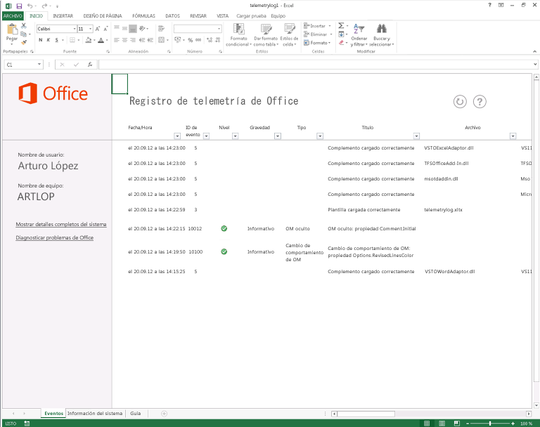

# Solución de problemas de los archivos de Office y soluciones personalizadas con el registro de telemetríaTroubleshooting Office files and custom solutions with the telemetry log

Use Registro de telemetría de Office 2013 para determinar problemas de compatibilidad con Office 2013 y soluciones generadas para las versiones anteriores de Office.Use the Telemetry Log for Office 2013 to determine compatibility issues with Office 2013 and solutions built for previous versions of Office.
  
En el siguiente artículo se describe el Registro de telemetría y cómo usarlo.The following article describes the Telemetry Log and how to use it. Para obtener más información sobre los resultados específicos que se muestran en Registro de telemetría, vea [Problemas de compatibilidad en Office](compatibility-issues-in-office.md).For more information about specific results displayed in the Telemetry Log, see [Compatibility issues in Office 2013](compatibility-issues-in-office.md).

En numerosas versiones anteriores, Microsoft proporcionó herramientas y marcos para personalizar, automatizar y extender Office. Esto permitió a empresas y usuarios generar soluciones o complementos para que las aplicaciones de Office resulten más productivas y eficaces. La complejidad de estas soluciones oscila desde macros sencillas de Visual Basic para Aplicaciones (VBA) hasta sólidas personalizaciones de .NET Framework. Muchos usuarios que disponen de estas soluciones confían en ellas para completar tareas esenciales para sus empresas, y es posible que ni siquiera sean conscientes de que están usando una personalización agregada a las aplicaciones de Office.Over the course of many releases, Microsoft has provided tools and frameworks for customizing, automating, and extending Office. This has enabled businesses and users to build solutions or add-ins for Office applications to improve their productivity and efficiency. These solutions can range in complexity from simple Visual Basic for Applications (VBA) macros to robust .NET Framework customizations. Many users who have these solutions rely on them to complete business-critical tasks and may not even know that they are using a customization that is added to their Office applications.
  
Con semejante proliferación de soluciones de Office, la actualización de versiones de Office puede resultar compleja. Las empresas y los usuarios no saben si esas soluciones tan valiosas resultan plenamente compatibles con la nueva versión, ya que podrían usar características y código informático disponibles en versiones anteriores de Office que quedaron en desuso en las versiones posteriores. Si una solución que usa una característica desusada se carga en la aplicación host, es posible que se comporte de manera diferente, que provoque un error, que no se cargue o que cause el bloqueo de la aplicación host.With such a proliferation of Office solutions, upgrading versions of Office can be complex. Enterprises and users do not know whether their important and valuable solutions are completely compatible with the new version. Their solutions might use features and computer code that are available in previous versions of Office that have been deprecated in later versions. If a solution that uses a deprecated feature is loaded into the "host" application, the solution might behave differently, cause an error, fail to load, or cause the host application to fail.
  
Registro de telemetría de Office 2013, una herramienta basada en Excel 2013, muestra eventos relacionados con la selección de aplicaciones de Office 2013 para ayudar a los desarrolladores y usuarios con experiencia a diagnosticar problemas de compatibilidad. Con esta herramienta, los usuarios pueden determinar los posibles problemas con relación a los complementos que usan en su entorno de trabajo, y proporcionar a los responsables de las decisiones empresariales la información necesaria para decidir si deben o no actualizarse a Office 2013. Asimismo, Registro de telemetría proporciona comentarios detallados sobre el proceso de desuso o los cambios específicos de los modelos de objetos de las aplicaciones de Office 2013, lo que permite a los desarrolladores identificar y refactorizar rápidamente el código o los controles problemáticos. Los profesionales de TI pueden ver las tendencias en el estado de las soluciones en varios clientes con el Panel de telemetría para Office 2013, una herramienta complementaria de Registro de telemetría.The Telemetry Log for Office 2013, a tool built upon Excel 2013, helps developers and experienced users diagnose compatibility issues by displaying events that occur within select Office 2013 applications. Using this tool, users can determine potential issues with add-ins that they use in their work environment, giving enterprise decision-makers the information that they need to decide whether to upgrade to Office 2013. The Telemetry Log also gives detailed feedback about specific changes or deprecations in the object models for the Office 2013 applications, which helps developers quickly identify and refactor problematic code or controls. IT professionals can view trends in solution health across multiple clients by using the Telemetry Dashboard for Office 2013, a companion tool to the Telemetry Log.
  
Para obtener más información, vea [Implementar el Panel de telemetría de Office](http://technet.microsoft.com/library/f69cde72-689d-421f-99b8-c51676c77717).For more information, see [Deploy Office Telemetry Dashboard](http://technet.microsoft.com/library/f69cde72-689d-421f-99b8-c51676c77717).
  
## Funcionamiento de Registro de telemetríaHow the Telemetry Log works

Cuando se carga, usa, cierra un archivo o solución de Office o bien cuando este genera un error en una de las aplicaciones seleccionadas de Office 2013, la aplicación añade un registro en el almacén de datos local (una base de datos del mismo equipo) que incluye información sobre el evento. El registro incluye un título para el evento, la aplicación que registró el evento, la hora, el nombre del archivo o la solución, la gravedad y una breve descripción de los errores que se hubieran podido producir. Cuando se actualiza, el libro de Registro de telemetría muestra una lista de los registros contenidos en el almacén de datos local.When an Office file or solution is loaded, used, closed, or raises an error in one of the selected Office 2013 applications, the application adds a record in a local data store (a database on the same computer) that includes information about the event. The record includes a title for the event, the application that logged the event, the time, the name of the file or solution, the severity, and a short description of any errors that may have occurred. When refreshed, the Telemetry Log workbook displays a list of the records contained in the local data store.
  
> [!NOTE]
> La ubicación predeterminada para el almacén de datos local es %Users%\[Current user]\AppData\Local\Microsoft\Office\15.0\Telemetry. El tamaño máximo predeterminado para el almacén de datos es de 5 MB (5.120 KB)..The default location for the local data store is %Users%\[Current user]\AppData\Local\Microsoft\Office\15.0\Telemetry. The default maximum size for the data store is 5 MB (5,120 KB). 
  
Las aplicaciones de Office 2013 seleccionadas tienen una API de registro de tiempo de ejecución que crea un registro en el almacén de datos local cada vez que un archivo o una solución genera uno de los siguientes eventos:Selected Office 2013 applications have a run-time logging API that creates a record in the local data store every time that a file or solution raises one of the following events:
  
- **OnLoad**: se crea un registro en el almacén de datos local cuando se carga un archivo o una solución en las aplicaciones de Office 2013 específicas. Los registros de error en tiempo de ejecución incluyen el nombre de archivo, ubicación y otra información en el almacén de datos local cuando se genera un evento de **OnLoad**.**OnLoad**: A record is logged in the local data store when a file or solution is loaded into specific Office 2013 applications. The run-time error logging records the file name, location, and other information in the local data store when an **OnLoad** event is raised. 
    
- **OnClose**: se crea un registro cuando se cierra un archivo o solución dentro de la aplicación. El registro incluye el nombre de la solución o del archivo, su ubicación y la aplicación que registró el evento.**OnClose**: A record is logged when a file or solution is closed within the application. The record includes the name of the solution or file, its location, and the application that logged the event.
    
- **OnError**: se crea un registro cuando se encuentra un error en una solución para determinadas aplicaciones de Office 2013. El registro incluye el nombre de la solución o del archivo y el error en tiempo de ejecución o el problema de compatibilidad que encontró el usuario. En la medida de lo posible, los errores se asignan a problemas de compatibilidad conocidos y se muestran como tales en Registro de telemetría.**OnError**: A record is logged when an error is found in a solution for certain Office 2013 applications. The record includes the name of the solution or file and the run-time failure or compatibility issue that the user encountered. When possible, errors are mapped to known compatibility issues and are displayed as such in the Telemetry Log.
    
Registro de telemetría muestra información acerca de una gran lista de archivos y tipos de solución para una selección de aplicaciones de Office 2013. El tipo de archivos y soluciones que supervisan las API de registro en tiempo de ejecución varían de una aplicación a otra. Consulte la Tabla 1 para obtener más información acerca de los tipos de soluciones que se supervisan.The Telemetry Log displays information about a large list of files and solution types for a selection of Office 2013 applications. The type of files and solutions that are monitored by the run-time logging APIs vary by application. See the Table 1 for more information about what kinds of solutions are monitored.
  
### Tabla 1. Tipos de archivos y soluciones de Office supervisados en Registro de telemetríaTable 1. Types of Office files and solutions tracked in Telemetry Log

|**Tipo de solución****Solution type**|**Aplicaciones****Applications**|**Descripción****Description**|
|:-----|:-----|:-----|
|Aplicaciones del panel de tareasTask pane apps    |Excel 2013, Word 2013, Project 2013Excel 2013, Word 2013, Project 2013    |Son Complementos de Office que se hospedan en un panel de tareas de la aplicación cliente.These are Office Add-ins that are hosted in a task pane within the client application.    |
|Aplicaciones de contenidoContent apps    |Excel 2013Excel 2013    |Son Complementos de Office integradas en el contenido del archivo de Office.These are Office Add-ins that are integrated into the content of the Office file.    |
|Aplicaciones de correoMail apps    |Outlook 2013Outlook 2013    |Son aplicaciones que se muestran en Outlook 2013 cuando se cumplen ciertas condiciones (cuando el asunto o el cuerpo de un mensaje de correo incluyen ciertas palabras o frases).These are apps that appear inOutlook 2013 when certain conditions are met (the e-mail body or subject includes particular words or phrases).    |
|Documentos activosActive documents    |Word 2013Word 2013    PowerPoint 2013PowerPoint 2013    Excel 2013Excel 2013    | Los documentos activos son cualquier archivo de documento de Office distintos de los tipos de soluciones que aparecen en esta tabla. Esto puede incluir lo siguiente:Active documents are any Office document files other than the other solution types listed in this table. This can include the following:     Archivos de formato binario de Office (.doc, .ppt, .pps, .xls).Office binary format files (.doc, .ppt, .pps, .xls).     Archivos de formato OpenXML de Office (.docx, .pptx, .ppsx, .xlsx).Office OpenXML format files (.docx, .pptx, .ppsx, .xlsx).     Archivos habilitados para macros que contienen código VBA (.docm, .dotm, .pptm, .potm, .xlsm, .xltm).Macro-enabled files that contain VBA code (.docm, .dotm, .pptm, .potm, .xlsm, .xltm).     Archivos que contienen controles ActiveX.Files that contain ActiveX controls.     Archivos que tienen conexiones de datos externos.Files that have External Data Connections.    |
|Complementos COMCOM add-ins    |Word 2013Word 2013    PowerPoint 2013PowerPoint 2013    Excel 2013Excel 2013    Outlook 2013Outlook 2013    |Los complementos COM incluyen complementos de Herramientas de desarrollo de Office en Visual Studio 2010 en el nivel de aplicación.COM add-ins include Office development tools in Visual Studio 2010 application-level add-ins.    |
|Complementos de automatización de ExcelExcel Automation add-ins    |Excel 2013Excel 2013    |Este tipo de solución incluye versiones anteriores de complementos de automatización compatibles con Excel, que se crean en complementos COM. Las funciones de los complementos de automatización pueden llamarse desde las fórmulas en las hojas de cálculo de Excel.This solution type includes previous versions of Excel-supported Automation Add-ins, which are built upon COM add-ins. Functions in Automation add-ins can be called from formulas in Excel worksheets.    |
|Complementos XLL de ExcelExcel XLL add-ins    |Excel 2013Excel 2013    |Los complementos XLL (.xll) con específicos de Excel y se crean con cualquier compilador que admita la creación de archivos DLL (bibliotecas de vínculos dinámicos). No es necesario que estén instalados ni registrados. Los complementos XLL también incluyen archivos DLL que contienen comandos y funciones definidos por el usuario.XLL add-ins (.xll) are specific to Excel and built with any compiler that supports building DLLs (dynamic-link libraries). They do not have to be installed or registered. XLL add-ins also include DLLs that contain user-defined commands and functions.    |
|Complementos XLS RTD de ExcelExcel XLS RTD add-ins    |Excel 2013Excel 2013    |Los complementos de datos en tiempo real (RTD) XLS son hojas de cálculo de Excel que usan la función de hoja de cálculo de **RealTimeData** para llamar a un servidor de automatización y recuperar datos en tiempo real.XLS real-time data (RTD) add-ins are Excel worksheets that use the **RealTimeData** worksheet function to call an Automation server to retrieve data in real-time.    |
|Complementos WLL de WordWord WLL add-ins    |Word 2013Word 2013    |Los complementos WLL (.wll) son específicos de Word y se crean con cualquier compilador compatible que permita compilar DLL.WLL (.wll) add-ins are specific to Word and built with any compiler that supports building DLLs.    |
|Complementos de aplicacionesApplication add-ins    |Word 2013Word 2013    PowerPoint 2013PowerPoint 2013    Excel 2013Excel 2013    |Los complementos de aplicaciones son archivos específicos de las aplicaciones que contienen código VBA. Incluyen los complementos de PowerPoint (.ppa, .ppam) y Excel (.xla, .xlam), y las plantillas de Word habilitadas para macros (.dotm).Application add-ins are application-specific files that contain VBA code. These include macro-enabled Word templates (.dotm), Excel add-ins (.xla, .xlam), and PowerPoint add-ins (.ppa, .ppam).    |
|PlantillasTemplates    |Word 2013Word 2013    PowerPoint 2013PowerPoint 2013    Excel 2013Excel 2013    |Las plantillas incluyen plantillas de documentos (.dot, .dotx), de hojas de cálculo (.xlt, .xltx) o de presentaciones (.pot, .potx) que están vinculadas a un archivo de Office.Templates include document (.dot, .dotx), worksheet (.xlt, .xltx), or presentation (.pot, .potx) templates that are attached to an Office file.    |
   
## Usar el registro de telemetría de OfficeUsing the Office Telemetry Log

Al instalar Office 2013, se instala Registro de telemetría, se crea el almacén de datos local en el mismo equipo y se habilitan las API de registro en tiempo de ejecución en las aplicaciones de Office 2013 indicadas anteriormente. Sin embargo, debe cargarse o abrirse una solución o archivo en la aplicación para que Registro de telemetría pueda comenzar a supervisarla.When you install Office 2013, the Telemetry Log is installed, the local data store is created on the same computer, and the run-time logging APIs are enabled in the Office 2013 applications previously listed. However, a solution or file must be loaded or opened in the application before the Telemetry Log can start to monitor it.
  
Use el siguiente procedimiento para mostrar los problemas registrados de Office en Registro de telemetría.Use the following procedure to display the recorded Office issues in the Telemetry Log. 
  
### Procedimiento para usar Registro de telemetríaTo use the Telemetry Log

1. Para abrir Registro de telemetría, realice uno de los procedimientos siguientes:To open the Telemetry Log, do one of the following:
    
   - **En Windows 7:** en el menú **Inicio**, elija **Todos los programas** y, en la lista de programas, expanda **Microsoft Office 2013** y **Herramientas de Office 2013**. A continuación, haga clic en **Registro de telemetría de Office 2013**.**On Windows 7:** On the **Start** menu, choose **All Programs**. Then, in the list of programs, expand **Microsoft Office 2013**, expand **Office 2013 Tools**, and then click **Office 2013 Telemetry Log**.
    
     Se abrirá un libro nuevo en Excel 2013. El libro nuevo tiene tres hojas de cálculo con los títulos **Eventos**, **Info. del sistema** y **Guía**.A new workbook in Excel 2013 opens. The workbook has three worksheets titled **Events** **System info**, and **Guide**.
    
   - **En Windows 8:** deslice hacia arriba para mostrar la barra de aplicaciones, elija **Todas las aplicaciones** y seleccione **Registro de telemetría de Office 2013**.**On Windows 8:** Swipe up to display the AppBar, choose **All Apps**, and then choose **Office 2013 Telemetry Log**.
    
     Se abrirá un libro nuevo en Excel 2013. El libro nuevo tiene tres hojas de cálculo con los títulos **Eventos**, **Info. del sistema** y **Guía**.A new workbook in Excel 2013 opens. The workbook has three worksheets titled **Events** **System info**, and **Guide**.
    
2. Para ver una lista actualizada de eventos, en la parte superior de la hoja de cálculo **Eventos**, elija **Actualizar**.To view an up-to-date list of events, on the **Events** worksheet, at the top of the worksheet, choose **Refresh**.
    
3. Para ver los datos de eventos que se recopilan desde las aplicaciones de Office 2013, revise la tabla mostrada en la hoja **Eventos**.To view the event data that is collected from Office 2013 applications, review the table displayed on the **Events** worksheet. 
    
4. Para revisar información acerca del equipo en el cual se han instalado Office 2013 y Registro de telemetría, revise la información mostrada en la hoja **Información del sistema**.To review information about the computer on which Office 2013 and Telemetry Log are installed, review the information displayed on the **System Info** worksheet. 
    
> [!NOTE]
> No es necesario guardar el libro Registro de telemetría en Excel 2013 para mantener un registro de los resultados, pues la información se guarda en el almacén de datos locales (que es independiente de Registro de telemetría). No obstante, guardar el libro no daña el Registro de telemetría.It is not necessary to save the Telemetry Log workbook in Excel 2013 to keep a record of the results, because the information is stored in the local data store (which is separate from the Telemetry Log). However, saving the workbook does not damage the Telemetry Log. 
  
El Registro de telemetría muestra información sencilla acerca de los eventos registrados. Cada registro mostrado en Registro de telemetría contiene un título y muestra la gravedad del evento mostrado. Para los errores, los registros también incluyen una descripción del error junto con los pasos necesarios para solucionar el problema. Recuerde que no todos los registros mostrados representan errores provocados por las soluciones de Office; el Registro de telemetría también muestra si las soluciones o archivos se cargan o cierran correctamente.The Telemetry Log displays some simple information about the recorded events. Each record displayed in the Telemetry Log contains a title and lists the severity of the event displayed. For errors, the records also include a description of the error together with steps to address the issue. Keep in mind that not all of the records displayed represent errors caused by Office solutions; the Telemetry Log also shows when solutions and files are loaded or closed successfully. 
  
Por ejemplo, el problema llamado "OM oculto: Comment.Initial Property" aparece si una solución o un archivo habilitado para macros abierto en Word 2013 trata de obtener las iniciales de un autor de comentarios asociado con un comentario. Word 2013 cuenta con una experiencia de comentarios mejorada que no muestra las iniciales del autor de comentarios de manera predeterminada. Las API asociadas con el modelo de comentarios anterior se han ocultado en el modelo de objeto de Word 2013, pero siguen estando disponibles para asegurar la compatibilidad con versiones anteriores. El problema "OM oculto: Comment.Initial" de indica el archivo que ha tratado de usar el API, la aplicación que generó el evento (Word 2013), la hora y fecha del evento y una breve descripción del error y el modo de resolverlo.For example, the issue titled "OM Hidden: Comment.Initial Property" appears if a solution or macro-enabled file opened in Word 2013 attempts to get the initials of a commenter who is associated with a comment. Word 2013 features an improved commenting experience that does not display commenter initials by default. The APIs associated with the older commenting model have been hidden in the Word 2013 object model but remain available for backwards-compatibility. The "OM Hidden: Comment.Initial" issue in the indicates the file that attempted to use the API, the application that raised the event (Word 2013), the time and date of the event, and short description about the error and how to fix it.
  
**Figura 1. Registro de telemetría de Office****Figure 1. Office Telemetry Log**
  

  
> [!NOTE]
>  La hoja de cálculo **Información del sistema** en el Registro de telemetría contiene información sobre el equipo donde está instalado Office 2013.The **System Info** worksheet in the Telemetry Log contains information about the computer on which Office 2013 is installed. La hoja muestra la siguiente información:The worksheet displays the following information: >  User name. 
> - Nombre de usuario.User name.
> - Nombre completo del equipo.Full computer name.
> - Arquitectura del sistema operativo (x64/64 bits o x86/32 bits).Architecture of the operating system (x64/64-bit or x86/32-bit).
> - Versión de Windows que está instalada en el equipo.Version of Windows that is installed on the computer.
> - Zona horaria del reloj interno del equipo.Time zone for the computer's internal clock.
> - Versión del Registro de telemetría.>  Version of the Telemetry Log.
> - Versión de Office que está instalada en el equipo.Version of Office that is installed on the computer.
> 
> Esta información puede ser útil al interpretar los problemas y eventos que se muestran en la hoja de cálculo **Eventos**.This information can be useful when you are interpreting the issues and events listed on the **Events** worksheet. 
  
En Registro de telemetría, se muestra un nivel de gravedad junto con los problemas conocidos. En el ejemplo anterior, un problema en el cual parte del modelo de objeto se ha ocultado suele tener el nivel de gravedad "Informativo". Por otro lado, otros problemas conocidos podrían ser más graves y precisar una acción más inmediata. La gravedad de los problemas mostrados en Registro de telemetría puede ser una de las siguientes:In the Telemetry Log, a level of severity is displayed together with the known issues. From the previous example, an issue in which a part of the object model has been hidden most often has an "Informative" level of severity. On the other hand, other known issues might be more serious and require more immediate action. The severity of the issues displayed in the Telemetry Log can be one of the following:
  
- **Información** El problema podría no tener un efecto inmediato sobre la compatibilidad de la aplicación, pero es posible que el usuario tenga que realizar una acción más tarde. Muchos problemas del tipo "OM oculto" poseen este nivel de gravedad.**Information** The issue may not have an immediate effect on application compatibility, but the user may have to take an action later. Many issues of the "OM hidden" type have this severity level. 
    
- **Aviso** El problema podría provocar la pérdida de datos o suponer una reducción de la fidelidad visual.**Warning** The issue could cause data loss or result in reduced visual fidelity. 
    
- **Crítico**El problema podría provocar una pérdida de funcionalidad significativa o hacer que se bloquee la aplicación.**Critical** The issue could cause significant loss of functionality or lead the application to crash. 
    
### Tabla 2. Tipos de eventos mostrados en Registro de telemetríaTable 2. Types of events displayed in the Telemetry Log

Use la siguiente tabla (Tabla 2) para interpretar los registros mostrados en Registro de telemetría.Use the following table (Table 2) to interpret the records that are displayed in the Telemetry Log.
  
|**Id. de evento****Event ID**|**Título****Title**|**Gravedad****Severity**|**Descripción****Description**|
|:-----|:-----|:-----|:-----|
|11    |El documento se ha cargado correctamenteDocument loaded successfully    ||El archivo mostrado en la columna **Archivo** se ha abierto en la aplicación de Office sin problemas.The file listed in the **File** column was opened in the Office application without any issues.    |
|2-2    |No se pudo cargar el documentoDocument failed to load    |AdvertenciaWarning    | La aplicación no pudo cargar el archivo. Podría haber problemas de compatibilidad subyacentes.  The application was unable to load the file. There may be some underlying compatibility issue.    Para obtener más información sobre cómo reparar un libro dañado en Excel 2013, vea [Reparar un libro dañado](http://office.microsoft.com/es-ES/excel-help/repairing-a-corrupted-workbook-HA102749554.aspx).For more information about how to repair a corrupted workbook in Excel 2013, see [Repairing a corrupted workbook](http://office.microsoft.com/es-ES/excel-help/repairing-a-corrupted-workbook-HA102749554.aspx).  Para obtener más información sobre cómo reparar un documento dañado en Word 2013, vea [Guardar y recuperar una copia de seguridad de un documento](http://office.microsoft.com/es-ES/word-help/save-and-recover-a-backup-copy-of-a-document-HA010121250.aspx).For more information about how to repair a corrupted document in Word 2013, see [Save and recover a backup copy of a document](http://office.microsoft.com/es-ES/word-help/save-and-recover-a-backup-copy-of-a-document-HA010121250.aspx)   |
|3-3    |La plantilla se ha cargado correctamenteTemplate loaded successfully    ||El archivo de plantilla mostrado en la columna **Archivo** se abrió en la aplicación de Office sin ningún problema.The template file listed in the **File** column was opened in the Office application without any issues.    |
|4-4    |No se pudo cargar la plantillaTemplate failed to load    |AdvertenciaWarning    | La aplicación no pudo cargar el archivo de plantilla. Podría haber problemas de compatibilidad subyacentes o es posible que la disponibilidad de la plantilla haya cambiado.  The application was unable to load the template file. There may be some underlying compatibility issue or the template availability may have changed.  Para obtener más información sobre cómo reparar un libro dañado en Excel 2013, vea [Reparar un libro dañado](http://office.microsoft.com/es-ES/excel-help/repairing-a-corrupted-workbook-HA102749554.aspx).For more information about how to repair a corrupted workbook in Excel 2013, see [Repairing a corrupted workbook](http://office.microsoft.com/es-ES/excel-help/repairing-a-corrupted-workbook-HA102749554.aspx).  Para obtener más información sobre cómo reparar un documento dañado en Word 2013, vea [Guardar y recuperar una copia de seguridad de un documento](http://office.microsoft.com/es-ES/word-help/save-and-recover-a-backup-copy-of-a-document-HA010121250.aspx).For more information about how to repair a corrupted document in Word 2013, see [Save and recover a backup copy of a document](http://office.microsoft.com/es-ES/word-help/save-and-recover-a-backup-copy-of-a-document-HA010121250.aspx)   |
|5$-5    |El complemento se ha cargado correctamenteAdd-in loaded successfully    ||El complemento que aparece en la columna **Archivo** se ha cargado correctamente en la aplicación de Office. No se han detectado problemas de compatibilidad.  The add-in listed in the **File** column loaded within the Office application successfully. No compatibility issues were detected.    |
|6-6    |El complemento no se pudo cargar.Add-in failed to load    |CríticoCritical    | La aplicación no ha podido cargar el complemento que aparece en la columna **Archivo**.The application was unable to load the add-in listed in the **File** column.    Para obtener más información sobre cómo reparar un libro dañado en Excel 2013, vea [Reparar un libro dañado](http://office.microsoft.com/es-ES/excel-help/repairing-a-corrupted-workbook-HA102749554.aspx).For more information about how to repair a corrupted workbook in Excel 2013, see [Repairing a corrupted workbook](http://office.microsoft.com/es-ES/excel-help/repairing-a-corrupted-workbook-HA102749554.aspx).     Para obtener más información sobre cómo reparar un documento dañado en Word 2013, vea [Guardar y recuperar una copia de seguridad de un documento](http://office.microsoft.com/es-ES/word-help/save-and-recover-a-backup-copy-of-a-document-HA010121250.aspx).For more information about how to repair a corrupted document in Word 2013, see [Save and recover a backup copy of a document](http://office.microsoft.com/es-ES/word-help/save-and-recover-a-backup-copy-of-a-document-HA010121250.aspx)   |
|7-7    |El manifiesto del complemento se descargó correctamenteAdd-in manifest downloaded successfully    ||La aplicación host cargó el manifiesto de la Complemento de Office correctamente.The host application loaded the manifest for the Office Add-in successfully.    |
|8-8    |No se pudo descargar el manifiesto del complementoAdd-in manifest did not download    |CríticoCritical    |La aplicación host no pudo cargar el archivo de manifiesto de la Complemento de Office desde el catálogo de SharePoint, el catálogo corporativo o la Tienda Office.The host application was unable to load the manifest file for the Office Add-in from the SharePoint catalog, corporate catalog, or the Office Store.    |
|9-9    |No se pudo analizar el manifiesto del complementoAdd-in manifest could not be parsed    |CríticoCritical    |La aplicación host cargó el manifiesto de Complemento de Office del complemento, pero no pudo leer el XML.The host application loaded the Office Add-in manifest for the add-in, but could not read the XML.    |
|101.0    |El complemento usó demasiada CPUAdd-in used too much CPU    |CríticoCritical    |La Complemento de Office usó más del 90 % de los recursos de la CPU durante un período de tiempo limitado.The Office Add-in used more than 90% of the CPU resources over a finite period of time.    |
|111.1    |La aplicación se ha bloqueado durante la carga.Application crashed on load    |CríticoCritical    |La aplicación de Office trató de cargar un documento o solución cuando se inició, pero problemas con el documento o la solución impidieron que se iniciara la aplicación.The Office application tried to load a document or solution when it launched, but problems with the document or solution prevented the application from launching.    |
|121.2    |La aplicación se ha cerrado por un problemaApplication closed due to a problem    |CríticoCritical    |Algo ha provocado un error crítico en la aplicación y debe cerrarse.Something caused a critical error in the application and it needed to close.    |
|131.3    |El documento se ha cerrado correctamenteDocument closed successfully    ||El archivo que aparece en la columna **Archivo** se ha cerrado correctamente.The file listed in the **File** column closed successfully.    |
|14-14    |La sesión de la aplicación se ha ampliadoApplication session extended    ||Las sesiones de aplicaciones con un documento concreto abierto, o una solución, solo deben durar 24 horas. Si una sesión supera las 24 horas, la aplicación host crea una sesión nueva.Application sessions with a particular document or solution open should only last 24 hours. If a session goes over 24 hours, the host application creates a new session.    |
|15-15    |El complemento se deshabilitó porque se superó el tiempo de espera de búsqueda de cadenasAdd-in disabled due to string search time-out    ||Los complementos de correo buscan en el mensaje y la línea de asunto de los correos electrónicos para determinar si deben mostrarse con una expresión regular. Outlook 2013 deshabilitó la aplicación de correo que se muestra en la columna **Archivo** porque agotó el tiempo de espera de forma repetida al intentar encontrar una expresión regular.  Mail add-in search the subject line and message of an email to determine whether they should be displayed by using a regular expression. The mail app listed in the **File** column was disabled by Outlook 2013 because it timed out repeatedly while trying to match a regular expression.    |
|16-16    |El documento estaba abierto cuando la aplicación se bloqueó.Document open when application crashed    |CríticoCritical    |El archivo que aparece en la columna **Archivo** estaba abierto cuando se bloqueó la aplicación (mostrada en la columna Aplicación). El archivo podría ser o no responsable del bloqueo de la **Aplicación**.  The file listed in the **File** column was open when the application (listed in the application column) crashed. The file may or may not have been responsible for the **Application** crash.    |
|17-17    |El complemento se cerró correctamenteAdd-in closed successfully    |InformativosInformative    |La aplicación pudo cerrar el complemento correctamente.The application was able to shut down the add-in successfully.    |
|18-18    |La aplicación se ha cerrado correctamenteApp closed successfully    ||La aplicación host pudo cerrar la Complemento de Office correctamente.The host application was able to close the Office Add-in successfully.    |
|191.9    |Error de tiempo de ejecución del complemento.Add-in encountered runtime error    |CríticoCritical    |Se produjo un problema en Complemento de Office que provocó un error. Para más información, vea el registro de alertas de Microsoft Office con el Visor de eventos de Windows en el equipo donde se produjo el error.The Office Add-in had a problem that caused it to fail. For more details, look at the Microsoft Office Alerts log using the Windows Event Viewer on the computer that encountered the error.    |
|202.0    |No se pudieron comprobar las licencias del complemento.Add-in failed to verify licensing    |CríticoCritical    |La información de licencias de Complemento de Office no se pudo comprobar y puede haber expirado. Para más información, vea el registro de alertas de Microsoft Office con el Visor de eventos de Windows en el equipo donde se produjo el error.The licensing information for the Office Add-in could not be verified and may have expired. For more details, look at the Microsoft Office Alerts log using the Windows Event Viewer on the computer that encountered the error.    |
|VariosVarious    |"Cambio del comportamiento de OM: ...""OM Behavior Change: ..."    |InformativosInformative    |El código de documento habilitado por macro o complemento usa un objeto, un miembro, una colección, una enumeración o una constante que se comporta de manera diferente de las versiones anteriores de Office.The add-in or macro-enabled document code uses an object, member, collection, enumeration, or constant that behaves differently from previous versions of Office.   Para obtener más información, vea [Problemas de compatibilidad en Office](compatibility-issues-in-office.md).For more information, see [Compatibility issues in Office 2013](compatibility-issues-in-office.md).    |
|VariosVarious    |"OM quitado: …""OM Removed: …"    |CríticoCritical    |El código de documento habilitado por macro o complemento utiliza un objeto, un miembro, una colección, una enumeración o una constante que se han eliminado del modelo de objetos.The add-in or macro-enabled document code uses an object, member, collection, enumeration, or constant that has been removed from the object model.  Para obtener más información, vea [Problemas de compatibilidad en Office](compatibility-issues-in-office.md).For more information, see [Compatibility issues in Office 2013](compatibility-issues-in-office.md).    |
|VariosVarious    |"OM oculto: …""OM Hidden: …"    |InformativosInformative    |El código de documento habilitado por macro o complemento utiliza un objeto, un miembro, una colección, una enumeración o una constante que se ha ocultado en el modelo de objetos.The add-in or macro-enabled document code uses an object, member, collection, enumeration, or constant that has been hidden in the object model.  Para obtener más información, vea [Problemas de compatibilidad en Office](compatibility-issues-in-office.md).For more information, see [Compatibility issues in Office 2013](compatibility-issues-in-office.md).    |
|VariosVarious    |"Control: …""Control: …"    ||El archivo contiene un control que puede no ser compatible con Office 2013 o con el sistema operativo del equipo.The file contains a control that may not be supported in Office 2013 or on the computer's operating system.  Para obtener más información, vea [Problemas de compatibilidad en Office](compatibility-issues-in-office.md).For more information, see [Compatibility issues in Office 2013](compatibility-issues-in-office.md).    |
   
## ConclusiónConclusion

Registro de telemetría proporciona a las grandes empresas, a los usuarios individuales y a los desarrolladores una herramienta sencilla para supervisar sus soluciones de Office más importantes. Con la identificación de soluciones problemáticas de Office antes de una actualización a gran escala, las empresas podrán predecir de forma más razonable el costo de adoptar Office 2013.The Telemetry Log provides large enterprises, individual users, and developers with a simple tool for monitoring their critical Office solutions. By identifying problematic Office solutions before a large-scale upgrade, businesses can more reasonably predict the cost of adopting Office 2013.
  
## Vea tambiénSee also

- [Centro para desarrolladores de OfficeOffice Developer Center](http://msdn.microsoft.com/es-ES/office/aa905340.aspx)
- [Problemas de compatibilidad en OfficeCompatibility issues in Office](compatibility-issues-in-office.md)
- [Implementar el panel de telemetría de OfficeDeploy Office Telemetry Dashboard](http://technet.microsoft.com/library/f69cde72-689d-421f-99b8-c51676c77717)
- [Centro para desarrolladores de OfficeOffice Developer Center](http://msdn.microsoft.com/es-ES/office/aa905340)
    

