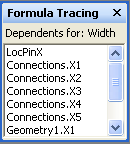

# Información sobre la ventana Rastreo de fórmulas

La ventana **Rastreo de fórmulas** se ha diseñado para ofrecer a los programadores de formas información sobre las interdependencias entre celdas, tanto las dependientes (celdas que dependen de otra celda determinada) como las precedentes (celdas de las cuales depende una celda determinada). 
  
Las celdas de ShapeSheet de Microsoft Visio contienen valores y fórmulas. Fórmulas a su vez, pueden hacer que las referencias a otras celdas, que ofrece la potencia para calcular un valor en una celda basándose en el valor de otra celda. Al crear o mantener formas complejas, sin embargo, puede resultar difícil identificar todas estas interdependencias debido a que una fórmula puede hacer referencia a cualquier celda del dibujo, ya sea una celda de la misma ShapeSheet o una celda perteneciente a otro objeto en el dibujo, Por ejemplo, una página, estilo, patrón u otra forma. 
  
La ventana **Rastreo de fórmulas** ofrece información para ayudarle a comprender las consecuencias de los cambios realizados a las celdas. 
  
## Mostrar la ventana Rastreo de fórmulas

Para ver la ventana **Rastreo de fórmulas** , con la ventana ShapeSheet activa, en **Herramientas de ShapeSheet** en la ** diseño ** ficha, en el grupo **Rastreo de fórmulas** , haga clic en **Mostrar ventana**. La ventana **Rastreo de fórmulas** aparece acoplada en la ventana ShapeSheet de forma predeterminada, pero es una ventana anclada que puede acoplar, flotar o combinada con otras ventanas de ShapeSheet disponibles, por ejemplo, la ventana **Explorador de estilos** . 
  
## Rastreo de celdas dependientes

Para ver una lista de las celdas dependientes de una celda determinada, seleccione dicha celda en la ventana ShapeSheet. En este ejemplo, está seleccionada la celda Width. 
  

  
Para ver sus celdas dependientes, en el grupo **Rastreo de fórmulas**, haga clic en **Rastrear dependientes**.
  
Aparecerá una lista de todas las celdas que dependan de Width en la ventana **Rastreo de fórmulas**. Puede explorar cualquiera de ellas haciendo doble clic en la ventana **Rastreo de fórmulas**. 
  

  
## Rastreo de celdas precendent

Para ver una lista de las celdas de las cuales depende una celda determinada, seleccione primero dicha celda en la ventana ShapeSheet. En este ejemplo, está seleccionada la celda Geometry1.X2. 
  

  
Para ver sus celdas precedentes, en el grupo **Rastreo de fórmulas**, haga clic en **Rastrear precedentes**.
  
Aparece una lista de todas las celdas que depende la celda Geometry1.X2 en la ventana **Rastreo de fórmulas** . Puede navegar a cualquier celda de la lista haciendo doble clic en su entrada en la ventana **Rastreo de fórmulas** . 
  

  

