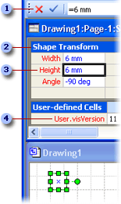

# Información sobre la hoja de cálculo ShapeSheetAbout the ShapeSheet Spreadsheet

Cada uno de los objetos de Microsoft Visio (documentos, páginas, estilos, formas, grupos, formas u objetos de un grupo, patrones, objetos de otros programas, guías y puntos de guía) tiene una hoja de cálculo ShapeSheet asociada en la que se almacena información acerca del objeto. Esta hoja de cálculo contiene información tal como el alto, ancho, ángulo, color y otros atributos que determinan la apariencia y el comportamiento de la forma.Everything in Microsoft Visio, every document, page, style, shape, group, shape or object within a group, master, object from another program, guide, and guide point, has a ShapeSheet spreadsheet where information about that object is stored. This spreadsheet contains information such as height, width, angle, color, and other attributes that determine the shape's appearance and behavior.
  
Como desarrollador de formas, deberá mantener un control preciso de la apariencia y el comportamiento de las formas que cree. Puede cambiar el comportamiento predeterminado de una forma y mejorar su capacidad si la modifica en su ShapeSheet, a la que se tiene acceso en una ventana ShapeSheet o mediante programación.As a shape developer, you need precise control over the appearance and behavior of the shapes you create. You can change a shape's default behavior and enhance what it can do by editing it in its ShapeSheet, which you can access in a ShapeSheet window or programmatically.
  
## Ver un objeto en una ventana ShapeSheetViewing an object in a ShapeSheet window

La ventana de dibujo y la ventana ShapeSheet de Visio son simplemente vistas diferentes de la misma forma.The Visio drawing window and ShapeSheet window are simply different views of the same shape.
  
- Al ver una forma en la ventana de dibujo, aparecerá gráficamente y su comportamiento se ajustará a las fórmulas de ShapeSheet.When you view a shape in a drawing window, you see it rendered graphically and behaving according to the formulas in its ShapeSheet.
    
- Al ver una forma en la ventana ShapeSheet, podrá ver las fórmulas subyacentes que determinan su apariencia y comportamiento en la página de dibujo.When you view a shape in a ShapeSheet window, you see the underlying formulas that determine how it looks and behaves on the drawing page.
    
Puede visualizar simultáneamente la ventana ShapeSheet y la ventana de dibujo para ver cómo cambia la forma en la segunda cuando se modifican las celdas de la primera, o viceversa. Por ejemplo, al mover la forma con el puntero, las fórmulas PinX y PinY de la sección Shape Transform cambian para reflejar la nueva posición en la página de dibujo.You can view a ShapeSheet window and a drawing window simultaneously and see the shape change in the drawing window as you manipulate cells in its ShapeSheet window or vice versa. For example, when you move the shape with the pointer, the shape's PinX and PinY formulas in the Shape Transform section change to reflect its new position on the drawing page.
  
## Estructura de la ventana ShapeSheet.Structure of the ShapeSheet window

Una hoja ShapeSheet se divide en *las secciones* que controlan un aspecto determinado del comportamiento de una forma o la apariencia, por ejemplo, su geometría o su formato.A ShapeSheet is divided into  *sections*  that control a particular aspect of a shape's behavior or appearance, for example, its geometry or its formatting. Cada sección contiene una o varias *filas* que contienen *las celdas* .Each section contains one or more  *rows*  that contain  *cells*  . Cada celda puede contener una fórmula, su resultado (normalmente denominado valor de la celda) y la información de error opcional.Each cell can contain a formula, its result (commonly called the cell value), and optional error information. Una fórmula puede ser obligatorio u opcional, dependiendo de la celda concreta.A formula may be required or optional, depending on the particular cell. Los datos de una celda (por ejemplo, su fórmula o valor) es posible que se definidos localmente o, más a menudo, se hereda de la celda equivalente de la forma patrón o estilo.A cell's data (for example, its formula or value) may be locally defined or, more often, inherited from the equivalent cell in the shape's master or style. 
  
El ejemplo siguiente muestra la barra de fórmulasThe following example shows the formula bar , una sección, a section , una celda, a cell y una fila, and a row  en la ventana ShapeSheet.in the ShapeSheet window. 
  

  
Cuando se dibuja una forma, Visio registra la forma como una colección de ubicaciones horizontales y verticales conectados con segmentos de línea.When you draw a shape, Visio records the shape as a collection of horizontal and vertical locations connected with line segments. Estas ubicaciones (llamadas vértices) se registran en las celdas X e Y de la sección de **geometría** de la forma.These locations (called vertices) are recorded in the X and Y cells of the shape's **Geometry** section. Tal como se muestra en el siguiente ejemplo, al hacer clic en las celdas X e Y en la sección de **geometría** de la ventana ShapeSheet de una forma, podrá ver un cuadro con borde negro que resalta el vértice de la forma en la ventana de dibujo.As shown in the following example, when you click the X and Y cells in the **Geometry** section of a shape's ShapeSheet window, you will see a black-bordered box highlighting the vertex on the shape in the drawing window. 
  

  
## Editar un objeto en la ventana ShapeSheetEditing an object in the ShapeSheet window

Cuando hay una ventana ShapeSheet activa, la cinta cambia para mostrar opciones específicas para trabajar en esa ventana. Al seleccionar una celda de ShapeSheet, aparece una barra de fórmulas que puede usar para especificar y modificar las fórmulas de un objeto. También puede escribir directamente en la celda.When a ShapeSheet window is active, the ribbon changes to display options specific to working in this window. When you select a ShapeSheet cell, a formula bar appears, which you can use to enter and edit an object's formulas. Or, you can work directly in the cell.
  
En la ventana ShapeSheet, puede agregar secciones a la hoja de la forma para agregar nuevas características a la forma en la página de dibujo.In a ShapeSheet window, you can add sections to a shape's sheet to add new characteristics to the shape on the drawing page. Por ejemplo, puede agregar una sección de **Puntos de conexión** para crear una conexión.For example, you can add a **Connection Points** section to create a connection. Cuando ya no necesita una sección, puede eliminarlo.When you no longer need a section, you can delete it. 
  
También puede agregar filas a las secciones para albergar fórmulas adicionales o cambiar la apariencia de una forma.You also can add rows to sections to hold additional formulas or to change a shape's appearance. Por ejemplo, puede agregar una fila a una sección de **geometría** para agregar un segmento a una forma.For example, you can add a row to a **Geometry** section to add a segment to a shape. De forma similar, puede eliminar filas que ya no necesite.Similarly, you can delete rows you no longer need. 
  
En las celdas pueden mostrarse fórmulas o valores. Muestre las fórmulas cuando especifique fórmulas nuevas, cuando modifique las existentes o cuando desee ver cómo se relacionan entre sí las fórmulas de las distintas celdas. Un valor es el resultado que se obtiene cuando Visio evalúa la fórmula de una celda. Puede mostrar los valores de las celdas para ver el resultado de la evaluación.You can display either formulas or values in cells. Display formulas when you are entering new formulas, editing existing formulas, or to see how formulas in cells relate to each other. A value is the result you get when Visio evaluates a cell's formula. You can display values in cells to see the result of an evaluation.
  
## Más material de referencia sobre ShapeSheetAdditional ShapeSheet references

Para obtener información detallada sobre una sección concreta, fila o celda de ShapeSheet, vea el artículo correspondiente en esta [Referencia de ShapeSheet](reference-visio-shapesheet.md).For details on a particular section, row, or cell in the ShapeSheet, view the corresponding article in this [ShapeSheet Reference](reference-visio-shapesheet.md).
  
Si desea información detallada acerca del acceso por programa a la hoja de cálculo ShapeSheet, vea la Referencia de automatización de Microsoft Visio.For details on programmatically accessing the ShapeSheet spreadsheet, see the Microsoft Visio Automation Reference.
  

